cola Report for recount2:TCGA_pleura
==================

**Date**: 2019-12-26 01:34:11 CET, **cola version**: 1.3.2

----------------------------------------------------------------

<style type='text/css'>

body, td, th {
   font-family: Arial,Helvetica,sans-serif;
   background-color: white;
   font-size: 13px;
  max-width: 800px;
  margin: auto;
  margin-left:210px;
  padding: 0px 10px 0px 10px;
  border-left: 1px solid #EEEEEE;
  line-height: 150%;
}

tt, code, pre {
   font-family: 'DejaVu Sans Mono', 'Droid Sans Mono', 'Lucida Console', Consolas, Monaco, 

monospace;
}

h1 {
   font-size:2.2em;
}

h2 {
   font-size:1.8em;
}

h3 {
   font-size:1.4em;
}

h4 {
   font-size:1.0em;
}

h5 {
   font-size:0.9em;
}

h6 {
   font-size:0.8em;
}

a {
  text-decoration: none;
  color: #0366d6;
}

a:hover {
  text-decoration: underline;
}

a:visited {
   color: #0366d6;
}

pre, img {
  max-width: 100%;
}
pre {
  overflow-x: auto;
}
pre code {
   display: block; padding: 0.5em;
}

code {
  font-size: 92%;
  border: 1px solid #ccc;
}

code[class] {
  background-color: #F8F8F8;
}

table, td, th {
  border: 1px solid #ccc;
}

blockquote {
   color:#666666;
   margin:0;
   padding-left: 1em;
   border-left: 0.5em #EEE solid;
}

hr {
   height: 0px;
   border-bottom: none;
   border-top-width: thin;
   border-top-style: dotted;
   border-top-color: #999999;
}

@media print {
   * {
      background: transparent !important;
      color: black !important;
      filter:none !important;
      -ms-filter: none !important;
   }

   body {
      font-size:12pt;
      max-width:100%;
   }

   a, a:visited {
      text-decoration: underline;
   }

   hr {
      visibility: hidden;
      page-break-before: always;
   }

   pre, blockquote {
      padding-right: 1em;
      page-break-inside: avoid;
   }

   tr, img {
      page-break-inside: avoid;
   }

   img {
      max-width: 100% !important;
   }

   @page :left {
      margin: 15mm 20mm 15mm 10mm;
   }

   @page :right {
      margin: 15mm 10mm 15mm 20mm;
   }

   p, h2, h3 {
      orphans: 3; widows: 3;
   }

   h2, h3 {
      page-break-after: avoid;
   }
}
</style>


## Summary


All available functions which can be applied to this `res_list` object:


```r
res_list
```

```
#> A 'ConsensusPartitionList' object with 24 methods.
#>   On a matrix with 17471 rows and 87 columns.
#>   Top rows are extracted by 'SD, CV, MAD, ATC' methods.
#>   Subgroups are detected by 'hclust, kmeans, skmeans, pam, mclust, NMF' method.
#>   Number of partitions are tried for k = 2, 3, 4, 5, 6.
#>   Performed in total 30000 partitions by row resampling.
#> 
#> Following methods can be applied to this 'ConsensusPartitionList' object:
#>  [1] "cola_report"           "collect_classes"       "collect_plots"         "collect_stats"        
#>  [5] "colnames"              "functional_enrichment" "get_anno_col"          "get_anno"             
#>  [9] "get_classes"           "get_matrix"            "get_membership"        "get_stats"            
#> [13] "is_best_k"             "is_stable_k"           "ncol"                  "nrow"                 
#> [17] "rownames"              "show"                  "suggest_best_k"        "test_to_known_factors"
#> [21] "top_rows_heatmap"      "top_rows_overlap"     
#> 
#> You can get result for a single method by, e.g. object["SD", "hclust"] or object["SD:hclust"]
#> or a subset of methods by object[c("SD", "CV")], c("hclust", "kmeans")]
```

The call of `run_all_consensus_partition_methods()` was:


```
#> run_all_consensus_partition_methods(data = mat, mc.cores = 4)
```

Dimension of the input matrix:


```r
mat = get_matrix(res_list)
dim(mat)
```

```
#> [1] 17471    87
```

### Density distribution

The density distribution for each sample is visualized as in one column in the
following heatmap. The clustering is based on the distance which is the
Kolmogorov-Smirnov statistic between two distributions.


```r
library(ComplexHeatmap)
densityHeatmap(mat, ylab = "value", cluster_columns = TRUE, show_column_names = FALSE,
    mc.cores = 4)
```


### Suggest the best k


Folowing table shows the best `k` (number of partitions) for each combination
of top-value methods and partition methods. Clicking on the method name in
the table goes to the section for a single combination of methods.

[The cola vignette](http://bioconductor.org/packages/devel/bioc/vignettes/cola/inst/doc/cola.html#toc_13)
explains the definition of the metrics used for determining the best
number of partitions.


```r
suggest_best_k(res_list)
```


|                            | The best k| 1-PAC| Mean silhouette| Concordance|   |Optional k |
|:---------------------------|----------:|-----:|---------------:|-----------:|:--|:----------|
|[SD:kmeans](#SD-kmeans)     |          2| 1.000|           0.976|       0.990|** |           |
|[MAD:kmeans](#MAD-kmeans)   |          2| 1.000|           0.974|       0.989|** |           |
|[MAD:NMF](#MAD-NMF)         |          2| 1.000|           0.963|       0.985|** |           |
|[SD:NMF](#SD-NMF)           |          2| 0.976|           0.963|       0.984|** |           |
|[ATC:NMF](#ATC-NMF)         |          3| 0.958|           0.915|       0.970|** |2          |
|[ATC:hclust](#ATC-hclust)   |          2| 0.953|           0.960|       0.967|** |           |
|[CV:NMF](#CV-NMF)           |          4| 0.939|           0.911|       0.943|*  |2          |
|[MAD:pam](#MAD-pam)         |          6| 0.932|           0.905|       0.951|*  |           |
|[ATC:skmeans](#ATC-skmeans) |          3| 0.925|           0.894|       0.954|*  |2          |
|[MAD:skmeans](#MAD-skmeans) |          4| 0.923|           0.902|       0.955|*  |2,3        |
|[SD:skmeans](#SD-skmeans)   |          4| 0.914|           0.899|       0.955|*  |2,3        |
|[CV:skmeans](#CV-skmeans)   |          2| 0.906|           0.946|       0.975|*  |           |
|[SD:pam](#SD-pam)           |          6| 0.841|           0.840|       0.915|   |           |
|[ATC:kmeans](#ATC-kmeans)   |          3| 0.837|           0.918|       0.948|   |           |
|[CV:mclust](#CV-mclust)     |          4| 0.743|           0.816|       0.902|   |           |
|[ATC:pam](#ATC-pam)         |          3| 0.679|           0.899|       0.945|   |           |
|[CV:kmeans](#CV-kmeans)     |          2| 0.641|           0.900|       0.937|   |           |
|[CV:pam](#CV-pam)           |          2| 0.506|           0.874|       0.921|   |           |
|[MAD:hclust](#MAD-hclust)   |          2| 0.444|           0.778|       0.878|   |           |
|[CV:hclust](#CV-hclust)     |          3| 0.411|           0.652|       0.853|   |           |
|[SD:hclust](#SD-hclust)     |          3| 0.390|           0.705|       0.799|   |           |
|[MAD:mclust](#MAD-mclust)   |          2| 0.345|           0.818|       0.865|   |           |
|[ATC:mclust](#ATC-mclust)   |          3| 0.335|           0.817|       0.847|   |           |
|[SD:mclust](#SD-mclust)     |          2| 0.212|           0.811|       0.863|   |           |

\*\*: 1-PAC > 0.95, \*: 1-PAC > 0.9


### CDF of consensus matrices

Cumulative distribution function curves of consensus matrix for all methods.


```r
collect_plots(res_list, fun = plot_ecdf)
```


### Consensus heatmap

Consensus heatmaps for all methods. ([What is a consensus heatmap?](http://bioconductor.org/packages/devel/bioc/vignettes/cola/inst/doc/cola.html#toc_9))


<style type='text/css'>


.ui-helper-hidden {
	display: none;
}
.ui-helper-hidden-accessible {
	border: 0;
	clip: rect(0 0 0 0);
	height: 1px;
	margin: -1px;
	overflow: hidden;
	padding: 0;
	position: absolute;
	width: 1px;
}
.ui-helper-reset {
	margin: 0;
	padding: 0;
	border: 0;
	outline: 0;
	line-height: 1.3;
	text-decoration: none;
	font-size: 100%;
	list-style: none;
}
.ui-helper-clearfix:before,
.ui-helper-clearfix:after {
	content: "";
	display: table;
	border-collapse: collapse;
}
.ui-helper-clearfix:after {
	clear: both;
}
.ui-helper-zfix {
	width: 100%;
	height: 100%;
	top: 0;
	left: 0;
	position: absolute;
	opacity: 0;
	filter:Alpha(Opacity=0); 
}

.ui-front {
	z-index: 100;
}


.ui-state-disabled {
	cursor: default !important;
	pointer-events: none;
}


.ui-icon {
	display: inline-block;
	vertical-align: middle;
	margin-top: -.25em;
	position: relative;
	text-indent: -99999px;
	overflow: hidden;
	background-repeat: no-repeat;
}

.ui-widget-icon-block {
	left: 50%;
	margin-left: -8px;
	display: block;
}


.ui-widget-overlay {
	position: fixed;
	top: 0;
	left: 0;
	width: 100%;
	height: 100%;
}
.ui-accordion .ui-accordion-header {
	display: block;
	cursor: pointer;
	position: relative;
	margin: 2px 0 0 0;
	padding: .5em .5em .5em .7em;
	font-size: 100%;
}
.ui-accordion .ui-accordion-content {
	padding: 1em 2.2em;
	border-top: 0;
	overflow: auto;
}
.ui-autocomplete {
	position: absolute;
	top: 0;
	left: 0;
	cursor: default;
}
.ui-menu {
	list-style: none;
	padding: 0;
	margin: 0;
	display: block;
	outline: 0;
}
.ui-menu .ui-menu {
	position: absolute;
}
.ui-menu .ui-menu-item {
	margin: 0;
	cursor: pointer;
	
	list-style-image: url("data:image/gif;base64,R0lGODlhAQABAIAAAAAAAP///yH5BAEAAAAALAAAAAABAAEAAAIBRAA7");
}
.ui-menu .ui-menu-item-wrapper {
	position: relative;
	padding: 3px 1em 3px .4em;
}
.ui-menu .ui-menu-divider {
	margin: 5px 0;
	height: 0;
	font-size: 0;
	line-height: 0;
	border-width: 1px 0 0 0;
}
.ui-menu .ui-state-focus,
.ui-menu .ui-state-active {
	margin: -1px;
}


.ui-menu-icons {
	position: relative;
}
.ui-menu-icons .ui-menu-item-wrapper {
	padding-left: 2em;
}


.ui-menu .ui-icon {
	position: absolute;
	top: 0;
	bottom: 0;
	left: .2em;
	margin: auto 0;
}


.ui-menu .ui-menu-icon {
	left: auto;
	right: 0;
}
.ui-button {
	padding: .4em 1em;
	display: inline-block;
	position: relative;
	line-height: normal;
	margin-right: .1em;
	cursor: pointer;
	vertical-align: middle;
	text-align: center;
	-webkit-user-select: none;
	-moz-user-select: none;
	-ms-user-select: none;
	user-select: none;

	
	overflow: visible;
}

.ui-button,
.ui-button:link,
.ui-button:visited,
.ui-button:hover,
.ui-button:active {
	text-decoration: none;
}


.ui-button-icon-only {
	width: 2em;
	box-sizing: border-box;
	text-indent: -9999px;
	white-space: nowrap;
}


input.ui-button.ui-button-icon-only {
	text-indent: 0;
}


.ui-button-icon-only .ui-icon {
	position: absolute;
	top: 50%;
	left: 50%;
	margin-top: -8px;
	margin-left: -8px;
}

.ui-button.ui-icon-notext .ui-icon {
	padding: 0;
	width: 2.1em;
	height: 2.1em;
	text-indent: -9999px;
	white-space: nowrap;

}

input.ui-button.ui-icon-notext .ui-icon {
	width: auto;
	height: auto;
	text-indent: 0;
	white-space: normal;
	padding: .4em 1em;
}


input.ui-button::-moz-focus-inner,
button.ui-button::-moz-focus-inner {
	border: 0;
	padding: 0;
}
.ui-controlgroup {
	vertical-align: middle;
	display: inline-block;
}
.ui-controlgroup > .ui-controlgroup-item {
	float: left;
	margin-left: 0;
	margin-right: 0;
}
.ui-controlgroup > .ui-controlgroup-item:focus,
.ui-controlgroup > .ui-controlgroup-item.ui-visual-focus {
	z-index: 9999;
}
.ui-controlgroup-vertical > .ui-controlgroup-item {
	display: block;
	float: none;
	width: 100%;
	margin-top: 0;
	margin-bottom: 0;
	text-align: left;
}
.ui-controlgroup-vertical .ui-controlgroup-item {
	box-sizing: border-box;
}
.ui-controlgroup .ui-controlgroup-label {
	padding: .4em 1em;
}
.ui-controlgroup .ui-controlgroup-label span {
	font-size: 80%;
}
.ui-controlgroup-horizontal .ui-controlgroup-label + .ui-controlgroup-item {
	border-left: none;
}
.ui-controlgroup-vertical .ui-controlgroup-label + .ui-controlgroup-item {
	border-top: none;
}
.ui-controlgroup-horizontal .ui-controlgroup-label.ui-widget-content {
	border-right: none;
}
.ui-controlgroup-vertical .ui-controlgroup-label.ui-widget-content {
	border-bottom: none;
}


.ui-controlgroup-vertical .ui-spinner-input {

	
	width: 75%;
	width: calc( 100% - 2.4em );
}
.ui-controlgroup-vertical .ui-spinner .ui-spinner-up {
	border-top-style: solid;
}

.ui-checkboxradio-label .ui-icon-background {
	box-shadow: inset 1px 1px 1px #ccc;
	border-radius: .12em;
	border: none;
}
.ui-checkboxradio-radio-label .ui-icon-background {
	width: 16px;
	height: 16px;
	border-radius: 1em;
	overflow: visible;
	border: none;
}
.ui-checkboxradio-radio-label.ui-checkboxradio-checked .ui-icon,
.ui-checkboxradio-radio-label.ui-checkboxradio-checked:hover .ui-icon {
	background-image: none;
	width: 8px;
	height: 8px;
	border-width: 4px;
	border-style: solid;
}
.ui-checkboxradio-disabled {
	pointer-events: none;
}
.ui-datepicker {
	width: 17em;
	padding: .2em .2em 0;
	display: none;
}
.ui-datepicker .ui-datepicker-header {
	position: relative;
	padding: .2em 0;
}
.ui-datepicker .ui-datepicker-prev,
.ui-datepicker .ui-datepicker-next {
	position: absolute;
	top: 2px;
	width: 1.8em;
	height: 1.8em;
}
.ui-datepicker .ui-datepicker-prev-hover,
.ui-datepicker .ui-datepicker-next-hover {
	top: 1px;
}
.ui-datepicker .ui-datepicker-prev {
	left: 2px;
}
.ui-datepicker .ui-datepicker-next {
	right: 2px;
}
.ui-datepicker .ui-datepicker-prev-hover {
	left: 1px;
}
.ui-datepicker .ui-datepicker-next-hover {
	right: 1px;
}
.ui-datepicker .ui-datepicker-prev span,
.ui-datepicker .ui-datepicker-next span {
	display: block;
	position: absolute;
	left: 50%;
	margin-left: -8px;
	top: 50%;
	margin-top: -8px;
}
.ui-datepicker .ui-datepicker-title {
	margin: 0 2.3em;
	line-height: 1.8em;
	text-align: center;
}
.ui-datepicker .ui-datepicker-title select {
	font-size: 1em;
	margin: 1px 0;
}
.ui-datepicker select.ui-datepicker-month,
.ui-datepicker select.ui-datepicker-year {
	width: 45%;
}
.ui-datepicker table {
	width: 100%;
	font-size: .9em;
	border-collapse: collapse;
	margin: 0 0 .4em;
}
.ui-datepicker th {
	padding: .7em .3em;
	text-align: center;
	font-weight: bold;
	border: 0;
}
.ui-datepicker td {
	border: 0;
	padding: 1px;
}
.ui-datepicker td span,
.ui-datepicker td a {
	display: block;
	padding: .2em;
	text-align: right;
	text-decoration: none;
}
.ui-datepicker .ui-datepicker-buttonpane {
	background-image: none;
	margin: .7em 0 0 0;
	padding: 0 .2em;
	border-left: 0;
	border-right: 0;
	border-bottom: 0;
}
.ui-datepicker .ui-datepicker-buttonpane button {
	float: right;
	margin: .5em .2em .4em;
	cursor: pointer;
	padding: .2em .6em .3em .6em;
	width: auto;
	overflow: visible;
}
.ui-datepicker .ui-datepicker-buttonpane button.ui-datepicker-current {
	float: left;
}


.ui-datepicker.ui-datepicker-multi {
	width: auto;
}
.ui-datepicker-multi .ui-datepicker-group {
	float: left;
}
.ui-datepicker-multi .ui-datepicker-group table {
	width: 95%;
	margin: 0 auto .4em;
}
.ui-datepicker-multi-2 .ui-datepicker-group {
	width: 50%;
}
.ui-datepicker-multi-3 .ui-datepicker-group {
	width: 33.3%;
}
.ui-datepicker-multi-4 .ui-datepicker-group {
	width: 25%;
}
.ui-datepicker-multi .ui-datepicker-group-last .ui-datepicker-header,
.ui-datepicker-multi .ui-datepicker-group-middle .ui-datepicker-header {
	border-left-width: 0;
}
.ui-datepicker-multi .ui-datepicker-buttonpane {
	clear: left;
}
.ui-datepicker-row-break {
	clear: both;
	width: 100%;
	font-size: 0;
}


.ui-datepicker-rtl {
	direction: rtl;
}
.ui-datepicker-rtl .ui-datepicker-prev {
	right: 2px;
	left: auto;
}
.ui-datepicker-rtl .ui-datepicker-next {
	left: 2px;
	right: auto;
}
.ui-datepicker-rtl .ui-datepicker-prev:hover {
	right: 1px;
	left: auto;
}
.ui-datepicker-rtl .ui-datepicker-next:hover {
	left: 1px;
	right: auto;
}
.ui-datepicker-rtl .ui-datepicker-buttonpane {
	clear: right;
}
.ui-datepicker-rtl .ui-datepicker-buttonpane button {
	float: left;
}
.ui-datepicker-rtl .ui-datepicker-buttonpane button.ui-datepicker-current,
.ui-datepicker-rtl .ui-datepicker-group {
	float: right;
}
.ui-datepicker-rtl .ui-datepicker-group-last .ui-datepicker-header,
.ui-datepicker-rtl .ui-datepicker-group-middle .ui-datepicker-header {
	border-right-width: 0;
	border-left-width: 1px;
}


.ui-datepicker .ui-icon {
	display: block;
	text-indent: -99999px;
	overflow: hidden;
	background-repeat: no-repeat;
	left: .5em;
	top: .3em;
}
.ui-dialog {
	position: absolute;
	top: 0;
	left: 0;
	padding: .2em;
	outline: 0;
}
.ui-dialog .ui-dialog-titlebar {
	padding: .4em 1em;
	position: relative;
}
.ui-dialog .ui-dialog-title {
	float: left;
	margin: .1em 0;
	white-space: nowrap;
	width: 90%;
	overflow: hidden;
	text-overflow: ellipsis;
}
.ui-dialog .ui-dialog-titlebar-close {
	position: absolute;
	right: .3em;
	top: 50%;
	width: 20px;
	margin: -10px 0 0 0;
	padding: 1px;
	height: 20px;
}
.ui-dialog .ui-dialog-content {
	position: relative;
	border: 0;
	padding: .5em 1em;
	background: none;
	overflow: auto;
}
.ui-dialog .ui-dialog-buttonpane {
	text-align: left;
	border-width: 1px 0 0 0;
	background-image: none;
	margin-top: .5em;
	padding: .3em 1em .5em .4em;
}
.ui-dialog .ui-dialog-buttonpane .ui-dialog-buttonset {
	float: right;
}
.ui-dialog .ui-dialog-buttonpane button {
	margin: .5em .4em .5em 0;
	cursor: pointer;
}
.ui-dialog .ui-resizable-n {
	height: 2px;
	top: 0;
}
.ui-dialog .ui-resizable-e {
	width: 2px;
	right: 0;
}
.ui-dialog .ui-resizable-s {
	height: 2px;
	bottom: 0;
}
.ui-dialog .ui-resizable-w {
	width: 2px;
	left: 0;
}
.ui-dialog .ui-resizable-se,
.ui-dialog .ui-resizable-sw,
.ui-dialog .ui-resizable-ne,
.ui-dialog .ui-resizable-nw {
	width: 7px;
	height: 7px;
}
.ui-dialog .ui-resizable-se {
	right: 0;
	bottom: 0;
}
.ui-dialog .ui-resizable-sw {
	left: 0;
	bottom: 0;
}
.ui-dialog .ui-resizable-ne {
	right: 0;
	top: 0;
}
.ui-dialog .ui-resizable-nw {
	left: 0;
	top: 0;
}
.ui-draggable .ui-dialog-titlebar {
	cursor: move;
}
.ui-draggable-handle {
	-ms-touch-action: none;
	touch-action: none;
}
.ui-resizable {
	position: relative;
}
.ui-resizable-handle {
	position: absolute;
	font-size: 0.1px;
	display: block;
	-ms-touch-action: none;
	touch-action: none;
}
.ui-resizable-disabled .ui-resizable-handle,
.ui-resizable-autohide .ui-resizable-handle {
	display: none;
}
.ui-resizable-n {
	cursor: n-resize;
	height: 7px;
	width: 100%;
	top: -5px;
	left: 0;
}
.ui-resizable-s {
	cursor: s-resize;
	height: 7px;
	width: 100%;
	bottom: -5px;
	left: 0;
}
.ui-resizable-e {
	cursor: e-resize;
	width: 7px;
	right: -5px;
	top: 0;
	height: 100%;
}
.ui-resizable-w {
	cursor: w-resize;
	width: 7px;
	left: -5px;
	top: 0;
	height: 100%;
}
.ui-resizable-se {
	cursor: se-resize;
	width: 12px;
	height: 12px;
	right: 1px;
	bottom: 1px;
}
.ui-resizable-sw {
	cursor: sw-resize;
	width: 9px;
	height: 9px;
	left: -5px;
	bottom: -5px;
}
.ui-resizable-nw {
	cursor: nw-resize;
	width: 9px;
	height: 9px;
	left: -5px;
	top: -5px;
}
.ui-resizable-ne {
	cursor: ne-resize;
	width: 9px;
	height: 9px;
	right: -5px;
	top: -5px;
}
.ui-progressbar {
	height: 2em;
	text-align: left;
	overflow: hidden;
}
.ui-progressbar .ui-progressbar-value {
	margin: -1px;
	height: 100%;
}
.ui-progressbar .ui-progressbar-overlay {
	background: url("data:image/gif;base64,R0lGODlhKAAoAIABAAAAAP///yH/C05FVFNDQVBFMi4wAwEAAAAh+QQJAQABACwAAAAAKAAoAAACkYwNqXrdC52DS06a7MFZI+4FHBCKoDeWKXqymPqGqxvJrXZbMx7Ttc+w9XgU2FB3lOyQRWET2IFGiU9m1frDVpxZZc6bfHwv4c1YXP6k1Vdy292Fb6UkuvFtXpvWSzA+HycXJHUXiGYIiMg2R6W459gnWGfHNdjIqDWVqemH2ekpObkpOlppWUqZiqr6edqqWQAAIfkECQEAAQAsAAAAACgAKAAAApSMgZnGfaqcg1E2uuzDmmHUBR8Qil95hiPKqWn3aqtLsS18y7G1SzNeowWBENtQd+T1JktP05nzPTdJZlR6vUxNWWjV+vUWhWNkWFwxl9VpZRedYcflIOLafaa28XdsH/ynlcc1uPVDZxQIR0K25+cICCmoqCe5mGhZOfeYSUh5yJcJyrkZWWpaR8doJ2o4NYq62lAAACH5BAkBAAEALAAAAAAoACgAAAKVDI4Yy22ZnINRNqosw0Bv7i1gyHUkFj7oSaWlu3ovC8GxNso5fluz3qLVhBVeT/Lz7ZTHyxL5dDalQWPVOsQWtRnuwXaFTj9jVVh8pma9JjZ4zYSj5ZOyma7uuolffh+IR5aW97cHuBUXKGKXlKjn+DiHWMcYJah4N0lYCMlJOXipGRr5qdgoSTrqWSq6WFl2ypoaUAAAIfkECQEAAQAsAAAAACgAKAAAApaEb6HLgd/iO7FNWtcFWe+ufODGjRfoiJ2akShbueb0wtI50zm02pbvwfWEMWBQ1zKGlLIhskiEPm9R6vRXxV4ZzWT2yHOGpWMyorblKlNp8HmHEb/lCXjcW7bmtXP8Xt229OVWR1fod2eWqNfHuMjXCPkIGNileOiImVmCOEmoSfn3yXlJWmoHGhqp6ilYuWYpmTqKUgAAIfkECQEAAQAsAAAAACgAKAAAApiEH6kb58biQ3FNWtMFWW3eNVcojuFGfqnZqSebuS06w5V80/X02pKe8zFwP6EFWOT1lDFk8rGERh1TTNOocQ61Hm4Xm2VexUHpzjymViHrFbiELsefVrn6XKfnt2Q9G/+Xdie499XHd2g4h7ioOGhXGJboGAnXSBnoBwKYyfioubZJ2Hn0RuRZaflZOil56Zp6iioKSXpUAAAh+QQJAQABACwAAAAAKAAoAAACkoQRqRvnxuI7kU1a1UU5bd5tnSeOZXhmn5lWK3qNTWvRdQxP8qvaC+/yaYQzXO7BMvaUEmJRd3TsiMAgswmNYrSgZdYrTX6tSHGZO73ezuAw2uxuQ+BbeZfMxsexY35+/Qe4J1inV0g4x3WHuMhIl2jXOKT2Q+VU5fgoSUI52VfZyfkJGkha6jmY+aaYdirq+lQAACH5BAkBAAEALAAAAAAoACgAAAKWBIKpYe0L3YNKToqswUlvznigd4wiR4KhZrKt9Upqip61i9E3vMvxRdHlbEFiEXfk9YARYxOZZD6VQ2pUunBmtRXo1Lf8hMVVcNl8JafV38aM2/Fu5V16Bn63r6xt97j09+MXSFi4BniGFae3hzbH9+hYBzkpuUh5aZmHuanZOZgIuvbGiNeomCnaxxap2upaCZsq+1kAACH5BAkBAAEALAAAAAAoACgAAAKXjI8By5zf4kOxTVrXNVlv1X0d8IGZGKLnNpYtm8Lr9cqVeuOSvfOW79D9aDHizNhDJidFZhNydEahOaDH6nomtJjp1tutKoNWkvA6JqfRVLHU/QUfau9l2x7G54d1fl995xcIGAdXqMfBNadoYrhH+Mg2KBlpVpbluCiXmMnZ2Sh4GBqJ+ckIOqqJ6LmKSllZmsoq6wpQAAAh+QQJAQABACwAAAAAKAAoAAAClYx/oLvoxuJDkU1a1YUZbJ59nSd2ZXhWqbRa2/gF8Gu2DY3iqs7yrq+xBYEkYvFSM8aSSObE+ZgRl1BHFZNr7pRCavZ5BW2142hY3AN/zWtsmf12p9XxxFl2lpLn1rseztfXZjdIWIf2s5dItwjYKBgo9yg5pHgzJXTEeGlZuenpyPmpGQoKOWkYmSpaSnqKileI2FAAACH5BAkBAAEALAAAAAAoACgAAAKVjB+gu+jG4kORTVrVhRlsnn2dJ3ZleFaptFrb+CXmO9OozeL5VfP99HvAWhpiUdcwkpBH3825AwYdU8xTqlLGhtCosArKMpvfa1mMRae9VvWZfeB2XfPkeLmm18lUcBj+p5dnN8jXZ3YIGEhYuOUn45aoCDkp16hl5IjYJvjWKcnoGQpqyPlpOhr3aElaqrq56Bq7VAAAOw==");
	height: 100%;
	filter: alpha(opacity=25); 
	opacity: 0.25;
}
.ui-progressbar-indeterminate .ui-progressbar-value {
	background-image: none;
}
.ui-selectable {
	-ms-touch-action: none;
	touch-action: none;
}
.ui-selectable-helper {
	position: absolute;
	z-index: 100;
	border: 1px dotted black;
}
.ui-selectmenu-menu {
	padding: 0;
	margin: 0;
	position: absolute;
	top: 0;
	left: 0;
	display: none;
}
.ui-selectmenu-menu .ui-menu {
	overflow: auto;
	overflow-x: hidden;
	padding-bottom: 1px;
}
.ui-selectmenu-menu .ui-menu .ui-selectmenu-optgroup {
	font-size: 1em;
	font-weight: bold;
	line-height: 1.5;
	padding: 2px 0.4em;
	margin: 0.5em 0 0 0;
	height: auto;
	border: 0;
}
.ui-selectmenu-open {
	display: block;
}
.ui-selectmenu-text {
	display: block;
	margin-right: 20px;
	overflow: hidden;
	text-overflow: ellipsis;
}
.ui-selectmenu-button.ui-button {
	text-align: left;
	white-space: nowrap;
	width: 14em;
}
.ui-selectmenu-icon.ui-icon {
	float: right;
	margin-top: 0;
}
.ui-slider {
	position: relative;
	text-align: left;
}
.ui-slider .ui-slider-handle {
	position: absolute;
	z-index: 2;
	width: 1.2em;
	height: 1.2em;
	cursor: default;
	-ms-touch-action: none;
	touch-action: none;
}
.ui-slider .ui-slider-range {
	position: absolute;
	z-index: 1;
	font-size: .7em;
	display: block;
	border: 0;
	background-position: 0 0;
}


.ui-slider.ui-state-disabled .ui-slider-handle,
.ui-slider.ui-state-disabled .ui-slider-range {
	filter: inherit;
}

.ui-slider-horizontal {
	height: .8em;
}
.ui-slider-horizontal .ui-slider-handle {
	top: -.3em;
	margin-left: -.6em;
}
.ui-slider-horizontal .ui-slider-range {
	top: 0;
	height: 100%;
}
.ui-slider-horizontal .ui-slider-range-min {
	left: 0;
}
.ui-slider-horizontal .ui-slider-range-max {
	right: 0;
}

.ui-slider-vertical {
	width: .8em;
	height: 100px;
}
.ui-slider-vertical .ui-slider-handle {
	left: -.3em;
	margin-left: 0;
	margin-bottom: -.6em;
}
.ui-slider-vertical .ui-slider-range {
	left: 0;
	width: 100%;
}
.ui-slider-vertical .ui-slider-range-min {
	bottom: 0;
}
.ui-slider-vertical .ui-slider-range-max {
	top: 0;
}
.ui-sortable-handle {
	-ms-touch-action: none;
	touch-action: none;
}
.ui-spinner {
	position: relative;
	display: inline-block;
	overflow: hidden;
	padding: 0;
	vertical-align: middle;
}
.ui-spinner-input {
	border: none;
	background: none;
	color: inherit;
	padding: .222em 0;
	margin: .2em 0;
	vertical-align: middle;
	margin-left: .4em;
	margin-right: 2em;
}
.ui-spinner-button {
	width: 1.6em;
	height: 50%;
	font-size: .5em;
	padding: 0;
	margin: 0;
	text-align: center;
	position: absolute;
	cursor: default;
	display: block;
	overflow: hidden;
	right: 0;
}

.ui-spinner a.ui-spinner-button {
	border-top-style: none;
	border-bottom-style: none;
	border-right-style: none;
}
.ui-spinner-up {
	top: 0;
}
.ui-spinner-down {
	bottom: 0;
}
.ui-tabs {
	position: relative;
	padding: .2em;
}
.ui-tabs .ui-tabs-nav {
	margin: 0;
	padding: .2em .2em 0;
}
.ui-tabs .ui-tabs-nav li {
	list-style: none;
	float: left;
	position: relative;
	top: 0;
	margin: 1px .2em 0 0;
	border-bottom-width: 0;
	padding: 0;
	white-space: nowrap;
}
.ui-tabs .ui-tabs-nav .ui-tabs-anchor {
	float: left;
	padding: .5em 1em;
	text-decoration: none;
}
.ui-tabs .ui-tabs-nav li.ui-tabs-active {
	margin-bottom: -1px;
	padding-bottom: 1px;
}
.ui-tabs .ui-tabs-nav li.ui-tabs-active .ui-tabs-anchor,
.ui-tabs .ui-tabs-nav li.ui-state-disabled .ui-tabs-anchor,
.ui-tabs .ui-tabs-nav li.ui-tabs-loading .ui-tabs-anchor {
	cursor: text;
}
.ui-tabs-collapsible .ui-tabs-nav li.ui-tabs-active .ui-tabs-anchor {
	cursor: pointer;
}
.ui-tabs .ui-tabs-panel {
	display: block;
	border-width: 0;
	padding: 1em 1.4em;
	background: none;
}
.ui-tooltip {
	padding: 8px;
	position: absolute;
	z-index: 9999;
	max-width: 300px;
}
body .ui-tooltip {
	border-width: 2px;
}

.ui-widget {
	font-family: Arial,Helvetica,sans-serif;
	font-size: 1em;
}
.ui-widget .ui-widget {
	font-size: 1em;
}
.ui-widget input,
.ui-widget select,
.ui-widget textarea,
.ui-widget button {
	font-family: Arial,Helvetica,sans-serif;
	font-size: 1em;
}
.ui-widget.ui-widget-content {
	border: 1px solid #c5c5c5;
}
.ui-widget-content {
	border: 1px solid #dddddd;
	background: #ffffff;
	color: #333333;
}
.ui-widget-content a {
	color: #333333;
}
.ui-widget-header {
	border: 1px solid #dddddd;
	background: #e9e9e9;
	color: #333333;
	font-weight: bold;
}
.ui-widget-header a {
	color: #333333;
}


.ui-state-default,
.ui-widget-content .ui-state-default,
.ui-widget-header .ui-state-default,
.ui-button,


html .ui-button.ui-state-disabled:hover,
html .ui-button.ui-state-disabled:active {
	border: 1px solid #c5c5c5;
	background: #f6f6f6;
	font-weight: normal;
	color: #454545;
}
.ui-state-default a,
.ui-state-default a:link,
.ui-state-default a:visited,
a.ui-button,
a:link.ui-button,
a:visited.ui-button,
.ui-button {
	color: #454545;
	text-decoration: none;
}
.ui-state-hover,
.ui-widget-content .ui-state-hover,
.ui-widget-header .ui-state-hover,
.ui-state-focus,
.ui-widget-content .ui-state-focus,
.ui-widget-header .ui-state-focus,
.ui-button:hover,
.ui-button:focus {
	border: 1px solid #cccccc;
	background: #ededed;
	font-weight: normal;
	color: #2b2b2b;
}
.ui-state-hover a,
.ui-state-hover a:hover,
.ui-state-hover a:link,
.ui-state-hover a:visited,
.ui-state-focus a,
.ui-state-focus a:hover,
.ui-state-focus a:link,
.ui-state-focus a:visited,
a.ui-button:hover,
a.ui-button:focus {
	color: #2b2b2b;
	text-decoration: none;
}

.ui-visual-focus {
	box-shadow: 0 0 3px 1px rgb(94, 158, 214);
}
.ui-state-active,
.ui-widget-content .ui-state-active,
.ui-widget-header .ui-state-active,
a.ui-button:active,
.ui-button:active,
.ui-button.ui-state-active:hover {
	border: 1px solid #003eff;
	background: #007fff;
	font-weight: normal;
	color: #ffffff;
}
.ui-icon-background,
.ui-state-active .ui-icon-background {
	border: #003eff;
	background-color: #ffffff;
}
.ui-state-active a,
.ui-state-active a:link,
.ui-state-active a:visited {
	color: #ffffff;
	text-decoration: none;
}


.ui-state-highlight,
.ui-widget-content .ui-state-highlight,
.ui-widget-header .ui-state-highlight {
	border: 1px solid #dad55e;
	background: #fffa90;
	color: #777620;
}
.ui-state-checked {
	border: 1px solid #dad55e;
	background: #fffa90;
}
.ui-state-highlight a,
.ui-widget-content .ui-state-highlight a,
.ui-widget-header .ui-state-highlight a {
	color: #777620;
}
.ui-state-error,
.ui-widget-content .ui-state-error,
.ui-widget-header .ui-state-error {
	border: 1px solid #f1a899;
	background: #fddfdf;
	color: #5f3f3f;
}
.ui-state-error a,
.ui-widget-content .ui-state-error a,
.ui-widget-header .ui-state-error a {
	color: #5f3f3f;
}
.ui-state-error-text,
.ui-widget-content .ui-state-error-text,
.ui-widget-header .ui-state-error-text {
	color: #5f3f3f;
}
.ui-priority-primary,
.ui-widget-content .ui-priority-primary,
.ui-widget-header .ui-priority-primary {
	font-weight: bold;
}
.ui-priority-secondary,
.ui-widget-content .ui-priority-secondary,
.ui-widget-header .ui-priority-secondary {
	opacity: .7;
	filter:Alpha(Opacity=70); 
	font-weight: normal;
}
.ui-state-disabled,
.ui-widget-content .ui-state-disabled,
.ui-widget-header .ui-state-disabled {
	opacity: .35;
	filter:Alpha(Opacity=35); 
	background-image: none;
}
.ui-state-disabled .ui-icon {
	filter:Alpha(Opacity=35); 
}


.ui-icon {
	width: 16px;
	height: 16px;
}
.ui-icon,
.ui-widget-content .ui-icon {
	background-image: url("images/ui-icons_444444_256x240.png");
}
.ui-widget-header .ui-icon {
	background-image: url("images/ui-icons_444444_256x240.png");
}
.ui-state-hover .ui-icon,
.ui-state-focus .ui-icon,
.ui-button:hover .ui-icon,
.ui-button:focus .ui-icon {
	background-image: url("images/ui-icons_555555_256x240.png");
}
.ui-state-active .ui-icon,
.ui-button:active .ui-icon {
	background-image: url("images/ui-icons_ffffff_256x240.png");
}
.ui-state-highlight .ui-icon,
.ui-button .ui-state-highlight.ui-icon {
	background-image: url("images/ui-icons_777620_256x240.png");
}
.ui-state-error .ui-icon,
.ui-state-error-text .ui-icon {
	background-image: url("images/ui-icons_cc0000_256x240.png");
}
.ui-button .ui-icon {
	background-image: url("images/ui-icons_777777_256x240.png");
}


.ui-icon-blank { background-position: 16px 16px; }
.ui-icon-caret-1-n { background-position: 0 0; }
.ui-icon-caret-1-ne { background-position: -16px 0; }
.ui-icon-caret-1-e { background-position: -32px 0; }
.ui-icon-caret-1-se { background-position: -48px 0; }
.ui-icon-caret-1-s { background-position: -65px 0; }
.ui-icon-caret-1-sw { background-position: -80px 0; }
.ui-icon-caret-1-w { background-position: -96px 0; }
.ui-icon-caret-1-nw { background-position: -112px 0; }
.ui-icon-caret-2-n-s { background-position: -128px 0; }
.ui-icon-caret-2-e-w { background-position: -144px 0; }
.ui-icon-triangle-1-n { background-position: 0 -16px; }
.ui-icon-triangle-1-ne { background-position: -16px -16px; }
.ui-icon-triangle-1-e { background-position: -32px -16px; }
.ui-icon-triangle-1-se { background-position: -48px -16px; }
.ui-icon-triangle-1-s { background-position: -65px -16px; }
.ui-icon-triangle-1-sw { background-position: -80px -16px; }
.ui-icon-triangle-1-w { background-position: -96px -16px; }
.ui-icon-triangle-1-nw { background-position: -112px -16px; }
.ui-icon-triangle-2-n-s { background-position: -128px -16px; }
.ui-icon-triangle-2-e-w { background-position: -144px -16px; }
.ui-icon-arrow-1-n { background-position: 0 -32px; }
.ui-icon-arrow-1-ne { background-position: -16px -32px; }
.ui-icon-arrow-1-e { background-position: -32px -32px; }
.ui-icon-arrow-1-se { background-position: -48px -32px; }
.ui-icon-arrow-1-s { background-position: -65px -32px; }
.ui-icon-arrow-1-sw { background-position: -80px -32px; }
.ui-icon-arrow-1-w { background-position: -96px -32px; }
.ui-icon-arrow-1-nw { background-position: -112px -32px; }
.ui-icon-arrow-2-n-s { background-position: -128px -32px; }
.ui-icon-arrow-2-ne-sw { background-position: -144px -32px; }
.ui-icon-arrow-2-e-w { background-position: -160px -32px; }
.ui-icon-arrow-2-se-nw { background-position: -176px -32px; }
.ui-icon-arrowstop-1-n { background-position: -192px -32px; }
.ui-icon-arrowstop-1-e { background-position: -208px -32px; }
.ui-icon-arrowstop-1-s { background-position: -224px -32px; }
.ui-icon-arrowstop-1-w { background-position: -240px -32px; }
.ui-icon-arrowthick-1-n { background-position: 1px -48px; }
.ui-icon-arrowthick-1-ne { background-position: -16px -48px; }
.ui-icon-arrowthick-1-e { background-position: -32px -48px; }
.ui-icon-arrowthick-1-se { background-position: -48px -48px; }
.ui-icon-arrowthick-1-s { background-position: -64px -48px; }
.ui-icon-arrowthick-1-sw { background-position: -80px -48px; }
.ui-icon-arrowthick-1-w { background-position: -96px -48px; }
.ui-icon-arrowthick-1-nw { background-position: -112px -48px; }
.ui-icon-arrowthick-2-n-s { background-position: -128px -48px; }
.ui-icon-arrowthick-2-ne-sw { background-position: -144px -48px; }
.ui-icon-arrowthick-2-e-w { background-position: -160px -48px; }
.ui-icon-arrowthick-2-se-nw { background-position: -176px -48px; }
.ui-icon-arrowthickstop-1-n { background-position: -192px -48px; }
.ui-icon-arrowthickstop-1-e { background-position: -208px -48px; }
.ui-icon-arrowthickstop-1-s { background-position: -224px -48px; }
.ui-icon-arrowthickstop-1-w { background-position: -240px -48px; }
.ui-icon-arrowreturnthick-1-w { background-position: 0 -64px; }
.ui-icon-arrowreturnthick-1-n { background-position: -16px -64px; }
.ui-icon-arrowreturnthick-1-e { background-position: -32px -64px; }
.ui-icon-arrowreturnthick-1-s { background-position: -48px -64px; }
.ui-icon-arrowreturn-1-w { background-position: -64px -64px; }
.ui-icon-arrowreturn-1-n { background-position: -80px -64px; }
.ui-icon-arrowreturn-1-e { background-position: -96px -64px; }
.ui-icon-arrowreturn-1-s { background-position: -112px -64px; }
.ui-icon-arrowrefresh-1-w { background-position: -128px -64px; }
.ui-icon-arrowrefresh-1-n { background-position: -144px -64px; }
.ui-icon-arrowrefresh-1-e { background-position: -160px -64px; }
.ui-icon-arrowrefresh-1-s { background-position: -176px -64px; }
.ui-icon-arrow-4 { background-position: 0 -80px; }
.ui-icon-arrow-4-diag { background-position: -16px -80px; }
.ui-icon-extlink { background-position: -32px -80px; }
.ui-icon-newwin { background-position: -48px -80px; }
.ui-icon-refresh { background-position: -64px -80px; }
.ui-icon-shuffle { background-position: -80px -80px; }
.ui-icon-transfer-e-w { background-position: -96px -80px; }
.ui-icon-transferthick-e-w { background-position: -112px -80px; }
.ui-icon-folder-collapsed { background-position: 0 -96px; }
.ui-icon-folder-open { background-position: -16px -96px; }
.ui-icon-document { background-position: -32px -96px; }
.ui-icon-document-b { background-position: -48px -96px; }
.ui-icon-note { background-position: -64px -96px; }
.ui-icon-mail-closed { background-position: -80px -96px; }
.ui-icon-mail-open { background-position: -96px -96px; }
.ui-icon-suitcase { background-position: -112px -96px; }
.ui-icon-comment { background-position: -128px -96px; }
.ui-icon-person { background-position: -144px -96px; }
.ui-icon-print { background-position: -160px -96px; }
.ui-icon-trash { background-position: -176px -96px; }
.ui-icon-locked { background-position: -192px -96px; }
.ui-icon-unlocked { background-position: -208px -96px; }
.ui-icon-bookmark { background-position: -224px -96px; }
.ui-icon-tag { background-position: -240px -96px; }
.ui-icon-home { background-position: 0 -112px; }
.ui-icon-flag { background-position: -16px -112px; }
.ui-icon-calendar { background-position: -32px -112px; }
.ui-icon-cart { background-position: -48px -112px; }
.ui-icon-pencil { background-position: -64px -112px; }
.ui-icon-clock { background-position: -80px -112px; }
.ui-icon-disk { background-position: -96px -112px; }
.ui-icon-calculator { background-position: -112px -112px; }
.ui-icon-zoomin { background-position: -128px -112px; }
.ui-icon-zoomout { background-position: -144px -112px; }
.ui-icon-search { background-position: -160px -112px; }
.ui-icon-wrench { background-position: -176px -112px; }
.ui-icon-gear { background-position: -192px -112px; }
.ui-icon-heart { background-position: -208px -112px; }
.ui-icon-star { background-position: -224px -112px; }
.ui-icon-link { background-position: -240px -112px; }
.ui-icon-cancel { background-position: 0 -128px; }
.ui-icon-plus { background-position: -16px -128px; }
.ui-icon-plusthick { background-position: -32px -128px; }
.ui-icon-minus { background-position: -48px -128px; }
.ui-icon-minusthick { background-position: -64px -128px; }
.ui-icon-close { background-position: -80px -128px; }
.ui-icon-closethick { background-position: -96px -128px; }
.ui-icon-key { background-position: -112px -128px; }
.ui-icon-lightbulb { background-position: -128px -128px; }
.ui-icon-scissors { background-position: -144px -128px; }
.ui-icon-clipboard { background-position: -160px -128px; }
.ui-icon-copy { background-position: -176px -128px; }
.ui-icon-contact { background-position: -192px -128px; }
.ui-icon-image { background-position: -208px -128px; }
.ui-icon-video { background-position: -224px -128px; }
.ui-icon-script { background-position: -240px -128px; }
.ui-icon-alert { background-position: 0 -144px; }
.ui-icon-info { background-position: -16px -144px; }
.ui-icon-notice { background-position: -32px -144px; }
.ui-icon-help { background-position: -48px -144px; }
.ui-icon-check { background-position: -64px -144px; }
.ui-icon-bullet { background-position: -80px -144px; }
.ui-icon-radio-on { background-position: -96px -144px; }
.ui-icon-radio-off { background-position: -112px -144px; }
.ui-icon-pin-w { background-position: -128px -144px; }
.ui-icon-pin-s { background-position: -144px -144px; }
.ui-icon-play { background-position: 0 -160px; }
.ui-icon-pause { background-position: -16px -160px; }
.ui-icon-seek-next { background-position: -32px -160px; }
.ui-icon-seek-prev { background-position: -48px -160px; }
.ui-icon-seek-end { background-position: -64px -160px; }
.ui-icon-seek-start { background-position: -80px -160px; }

.ui-icon-seek-first { background-position: -80px -160px; }
.ui-icon-stop { background-position: -96px -160px; }
.ui-icon-eject { background-position: -112px -160px; }
.ui-icon-volume-off { background-position: -128px -160px; }
.ui-icon-volume-on { background-position: -144px -160px; }
.ui-icon-power { background-position: 0 -176px; }
.ui-icon-signal-diag { background-position: -16px -176px; }
.ui-icon-signal { background-position: -32px -176px; }
.ui-icon-battery-0 { background-position: -48px -176px; }
.ui-icon-battery-1 { background-position: -64px -176px; }
.ui-icon-battery-2 { background-position: -80px -176px; }
.ui-icon-battery-3 { background-position: -96px -176px; }
.ui-icon-circle-plus { background-position: 0 -192px; }
.ui-icon-circle-minus { background-position: -16px -192px; }
.ui-icon-circle-close { background-position: -32px -192px; }
.ui-icon-circle-triangle-e { background-position: -48px -192px; }
.ui-icon-circle-triangle-s { background-position: -64px -192px; }
.ui-icon-circle-triangle-w { background-position: -80px -192px; }
.ui-icon-circle-triangle-n { background-position: -96px -192px; }
.ui-icon-circle-arrow-e { background-position: -112px -192px; }
.ui-icon-circle-arrow-s { background-position: -128px -192px; }
.ui-icon-circle-arrow-w { background-position: -144px -192px; }
.ui-icon-circle-arrow-n { background-position: -160px -192px; }
.ui-icon-circle-zoomin { background-position: -176px -192px; }
.ui-icon-circle-zoomout { background-position: -192px -192px; }
.ui-icon-circle-check { background-position: -208px -192px; }
.ui-icon-circlesmall-plus { background-position: 0 -208px; }
.ui-icon-circlesmall-minus { background-position: -16px -208px; }
.ui-icon-circlesmall-close { background-position: -32px -208px; }
.ui-icon-squaresmall-plus { background-position: -48px -208px; }
.ui-icon-squaresmall-minus { background-position: -64px -208px; }
.ui-icon-squaresmall-close { background-position: -80px -208px; }
.ui-icon-grip-dotted-vertical { background-position: 0 -224px; }
.ui-icon-grip-dotted-horizontal { background-position: -16px -224px; }
.ui-icon-grip-solid-vertical { background-position: -32px -224px; }
.ui-icon-grip-solid-horizontal { background-position: -48px -224px; }
.ui-icon-gripsmall-diagonal-se { background-position: -64px -224px; }
.ui-icon-grip-diagonal-se { background-position: -80px -224px; }


.ui-corner-all,
.ui-corner-top,
.ui-corner-left,
.ui-corner-tl {
	border-top-left-radius: 3px;
}
.ui-corner-all,
.ui-corner-top,
.ui-corner-right,
.ui-corner-tr {
	border-top-right-radius: 3px;
}
.ui-corner-all,
.ui-corner-bottom,
.ui-corner-left,
.ui-corner-bl {
	border-bottom-left-radius: 3px;
}
.ui-corner-all,
.ui-corner-bottom,
.ui-corner-right,
.ui-corner-br {
	border-bottom-right-radius: 3px;
}


.ui-widget-overlay {
	background: #aaaaaa;
	opacity: .3;
	filter: Alpha(Opacity=30); 
}
.ui-widget-shadow {
	-webkit-box-shadow: 0px 0px 5px #666666;
	box-shadow: 0px 0px 5px #666666;
} 
</style>
<script src='js/jquery-1.12.4.js'></script>
<script src='js/jquery-ui.js'></script>

<script>
$( function() {
	$( '#tabs-collect-consensus-heatmap' ).tabs();
} );
</script>
<div id='tabs-collect-consensus-heatmap'>
<ul>
<li><a href='#tab-collect-consensus-heatmap-1'>k = 2</a></li>
<li><a href='#tab-collect-consensus-heatmap-2'>k = 3</a></li>
<li><a href='#tab-collect-consensus-heatmap-3'>k = 4</a></li>
<li><a href='#tab-collect-consensus-heatmap-4'>k = 5</a></li>
<li><a href='#tab-collect-consensus-heatmap-5'>k = 6</a></li>
</ul>
<div id='tab-collect-consensus-heatmap-1'>
<pre><code class="r">collect_plots(res_list, k = 2, fun = consensus_heatmap, mc.cores = 4)
</code></pre>

<p></p>

</div>
<div id='tab-collect-consensus-heatmap-2'>
<pre><code class="r">collect_plots(res_list, k = 3, fun = consensus_heatmap, mc.cores = 4)
</code></pre>

<p></p>

</div>
<div id='tab-collect-consensus-heatmap-3'>
<pre><code class="r">collect_plots(res_list, k = 4, fun = consensus_heatmap, mc.cores = 4)
</code></pre>

<p></p>

</div>
<div id='tab-collect-consensus-heatmap-4'>
<pre><code class="r">collect_plots(res_list, k = 5, fun = consensus_heatmap, mc.cores = 4)
</code></pre>

<p></p>

</div>
<div id='tab-collect-consensus-heatmap-5'>
<pre><code class="r">collect_plots(res_list, k = 6, fun = consensus_heatmap, mc.cores = 4)
</code></pre>

<p></p>

</div>
</div>


### Membership heatmap

Membership heatmaps for all methods. ([What is a membership heatmap?](http://bioconductor.org/packages/devel/bioc/vignettes/cola/inst/doc/cola.html#toc_12))


<script>
$( function() {
	$( '#tabs-collect-membership-heatmap' ).tabs();
} );
</script>
<div id='tabs-collect-membership-heatmap'>
<ul>
<li><a href='#tab-collect-membership-heatmap-1'>k = 2</a></li>
<li><a href='#tab-collect-membership-heatmap-2'>k = 3</a></li>
<li><a href='#tab-collect-membership-heatmap-3'>k = 4</a></li>
<li><a href='#tab-collect-membership-heatmap-4'>k = 5</a></li>
<li><a href='#tab-collect-membership-heatmap-5'>k = 6</a></li>
</ul>
<div id='tab-collect-membership-heatmap-1'>
<pre><code class="r">collect_plots(res_list, k = 2, fun = membership_heatmap, mc.cores = 4)
</code></pre>

<p></p>

</div>
<div id='tab-collect-membership-heatmap-2'>
<pre><code class="r">collect_plots(res_list, k = 3, fun = membership_heatmap, mc.cores = 4)
</code></pre>

<p></p>

</div>
<div id='tab-collect-membership-heatmap-3'>
<pre><code class="r">collect_plots(res_list, k = 4, fun = membership_heatmap, mc.cores = 4)
</code></pre>

<p></p>

</div>
<div id='tab-collect-membership-heatmap-4'>
<pre><code class="r">collect_plots(res_list, k = 5, fun = membership_heatmap, mc.cores = 4)
</code></pre>

<p></p>

</div>
<div id='tab-collect-membership-heatmap-5'>
<pre><code class="r">collect_plots(res_list, k = 6, fun = membership_heatmap, mc.cores = 4)
</code></pre>

<p></p>

</div>
</div>


### Signature heatmap

Signature heatmaps for all methods. ([What is a signature heatmap?](http://bioconductor.org/packages/devel/bioc/vignettes/cola/inst/doc/cola.html#toc_22))


Note in following heatmaps, rows are scaled.


<script>
$( function() {
	$( '#tabs-collect-get-signatures' ).tabs();
} );
</script>
<div id='tabs-collect-get-signatures'>
<ul>
<li><a href='#tab-collect-get-signatures-1'>k = 2</a></li>
<li><a href='#tab-collect-get-signatures-2'>k = 3</a></li>
<li><a href='#tab-collect-get-signatures-3'>k = 4</a></li>
<li><a href='#tab-collect-get-signatures-4'>k = 5</a></li>
<li><a href='#tab-collect-get-signatures-5'>k = 6</a></li>
</ul>
<div id='tab-collect-get-signatures-1'>
<pre><code class="r">collect_plots(res_list, k = 2, fun = get_signatures, mc.cores = 4)
</code></pre>

<p></p>

</div>
<div id='tab-collect-get-signatures-2'>
<pre><code class="r">collect_plots(res_list, k = 3, fun = get_signatures, mc.cores = 4)
</code></pre>

<p></p>

</div>
<div id='tab-collect-get-signatures-3'>
<pre><code class="r">collect_plots(res_list, k = 4, fun = get_signatures, mc.cores = 4)
</code></pre>

<p></p>

</div>
<div id='tab-collect-get-signatures-4'>
<pre><code class="r">collect_plots(res_list, k = 5, fun = get_signatures, mc.cores = 4)
</code></pre>

<p></p>

</div>
<div id='tab-collect-get-signatures-5'>
<pre><code class="r">collect_plots(res_list, k = 6, fun = get_signatures, mc.cores = 4)
</code></pre>

<p></p>

</div>
</div>


### Statistics table

The statistics used for measuring the stability of consensus partitioning.
([How are they
defined?](http://bioconductor.org/packages/devel/bioc/vignettes/cola/inst/doc/cola.html#toc_13))


<script>
$( function() {
	$( '#tabs-get-stats-from-consensus-partition-list' ).tabs();
} );
</script>
<div id='tabs-get-stats-from-consensus-partition-list'>
<ul>
<li><a href='#tab-get-stats-from-consensus-partition-list-1'>k = 2</a></li>
<li><a href='#tab-get-stats-from-consensus-partition-list-2'>k = 3</a></li>
<li><a href='#tab-get-stats-from-consensus-partition-list-3'>k = 4</a></li>
<li><a href='#tab-get-stats-from-consensus-partition-list-4'>k = 5</a></li>
<li><a href='#tab-get-stats-from-consensus-partition-list-5'>k = 6</a></li>
</ul>
<div id='tab-get-stats-from-consensus-partition-list-1'>
<pre><code class="r">get_stats(res_list, k = 2)
</code></pre>

<pre><code>#&gt;             k 1-PAC mean_silhouette concordance area_increased  Rand Jaccard
#&gt; SD:NMF      2 0.976           0.963       0.984          0.497 0.502   0.502
#&gt; CV:NMF      2 0.973           0.944       0.976          0.496 0.505   0.505
#&gt; MAD:NMF     2 1.000           0.963       0.985          0.500 0.502   0.502
#&gt; ATC:NMF     2 0.976           0.954       0.979          0.310 0.668   0.668
#&gt; SD:skmeans  2 1.000           0.953       0.982          0.499 0.500   0.500
#&gt; CV:skmeans  2 0.906           0.946       0.975          0.496 0.509   0.509
#&gt; MAD:skmeans 2 1.000           0.977       0.989          0.501 0.500   0.500
#&gt; ATC:skmeans 2 0.907           0.966       0.984          0.505 0.495   0.495
#&gt; SD:mclust   2 0.212           0.811       0.863          0.459 0.505   0.505
#&gt; CV:mclust   2 0.351           0.604       0.840          0.436 0.518   0.518
#&gt; MAD:mclust  2 0.345           0.818       0.865          0.463 0.505   0.505
#&gt; ATC:mclust  2 0.134           0.504       0.737          0.440 0.513   0.513
#&gt; SD:kmeans   2 1.000           0.976       0.990          0.493 0.509   0.509
#&gt; CV:kmeans   2 0.641           0.900       0.937          0.457 0.518   0.518
#&gt; MAD:kmeans  2 1.000           0.974       0.989          0.495 0.505   0.505
#&gt; ATC:kmeans  2 0.656           0.819       0.919          0.437 0.543   0.543
#&gt; SD:pam      2 0.637           0.796       0.904          0.467 0.536   0.536
#&gt; CV:pam      2 0.506           0.874       0.921          0.481 0.495   0.495
#&gt; MAD:pam     2 0.567           0.771       0.900          0.476 0.530   0.530
#&gt; ATC:pam     2 0.659           0.892       0.930          0.424 0.543   0.543
#&gt; SD:hclust   2 0.456           0.129       0.580          0.419 0.607   0.607
#&gt; CV:hclust   2 0.859           0.896       0.951          0.145 0.933   0.933
#&gt; MAD:hclust  2 0.444           0.778       0.878          0.440 0.513   0.513
#&gt; ATC:hclust  2 0.953           0.960       0.967          0.308 0.696   0.696
</code></pre>

</div>
<div id='tab-get-stats-from-consensus-partition-list-2'>
<pre><code class="r">get_stats(res_list, k = 3)
</code></pre>

<pre><code>#&gt;             k 1-PAC mean_silhouette concordance area_increased  Rand Jaccard
#&gt; SD:NMF      3 0.747           0.866       0.937          0.320 0.720   0.502
#&gt; CV:NMF      3 0.824           0.878       0.936          0.328 0.733   0.521
#&gt; MAD:NMF     3 0.656           0.764       0.894          0.290 0.746   0.541
#&gt; ATC:NMF     3 0.958           0.915       0.970          0.973 0.621   0.472
#&gt; SD:skmeans  3 0.965           0.926       0.968          0.328 0.809   0.628
#&gt; CV:skmeans  3 0.732           0.848       0.913          0.352 0.775   0.577
#&gt; MAD:skmeans 3 0.954           0.949       0.967          0.321 0.809   0.628
#&gt; ATC:skmeans 3 0.925           0.894       0.954          0.329 0.728   0.503
#&gt; SD:mclust   3 0.468           0.607       0.784          0.317 0.760   0.574
#&gt; CV:mclust   3 0.496           0.729       0.834          0.418 0.628   0.404
#&gt; MAD:mclust  3 0.502           0.599       0.816          0.322 0.649   0.431
#&gt; ATC:mclust  3 0.335           0.817       0.847          0.316 0.565   0.359
#&gt; SD:kmeans   3 0.528           0.695       0.813          0.293 0.638   0.410
#&gt; CV:kmeans   3 0.474           0.776       0.814          0.312 0.923   0.851
#&gt; MAD:kmeans  3 0.525           0.665       0.764          0.285 0.636   0.406
#&gt; ATC:kmeans  3 0.837           0.918       0.948          0.450 0.603   0.393
#&gt; SD:pam      3 0.513           0.583       0.810          0.412 0.590   0.362
#&gt; CV:pam      3 0.419           0.533       0.777          0.365 0.752   0.537
#&gt; MAD:pam     3 0.655           0.711       0.867          0.376 0.596   0.365
#&gt; ATC:pam     3 0.679           0.899       0.945          0.424 0.655   0.463
#&gt; SD:hclust   3 0.390           0.705       0.799          0.323 0.461   0.329
#&gt; CV:hclust   3 0.411           0.652       0.853          1.299 0.769   0.752
#&gt; MAD:hclust  3 0.304           0.665       0.790          0.209 0.926   0.856
#&gt; ATC:hclust  3 0.396           0.526       0.745          0.819 0.765   0.662
</code></pre>

</div>
<div id='tab-get-stats-from-consensus-partition-list-3'>
<pre><code class="r">get_stats(res_list, k = 4)
</code></pre>

<pre><code>#&gt;             k 1-PAC mean_silhouette concordance area_increased  Rand Jaccard
#&gt; SD:NMF      4 0.731           0.821       0.884          0.136 0.765   0.432
#&gt; CV:NMF      4 0.939           0.911       0.943          0.137 0.806   0.506
#&gt; MAD:NMF     4 0.596           0.685       0.794          0.147 0.767   0.443
#&gt; ATC:NMF     4 0.646           0.726       0.862          0.180 0.779   0.496
#&gt; SD:skmeans  4 0.914           0.899       0.955          0.137 0.869   0.635
#&gt; CV:skmeans  4 0.893           0.876       0.949          0.122 0.878   0.652
#&gt; MAD:skmeans 4 0.923           0.902       0.955          0.137 0.870   0.638
#&gt; ATC:skmeans 4 0.719           0.653       0.859          0.118 0.804   0.496
#&gt; SD:mclust   4 0.694           0.803       0.841          0.155 0.752   0.450
#&gt; CV:mclust   4 0.743           0.816       0.902          0.150 0.818   0.552
#&gt; MAD:mclust  4 0.645           0.748       0.822          0.121 0.737   0.426
#&gt; ATC:mclust  4 0.464           0.628       0.817          0.128 0.590   0.294
#&gt; SD:kmeans   4 0.878           0.886       0.910          0.147 0.823   0.555
#&gt; CV:kmeans   4 0.716           0.836       0.870          0.194 0.793   0.541
#&gt; MAD:kmeans  4 0.829           0.838       0.893          0.151 0.805   0.523
#&gt; ATC:kmeans  4 0.753           0.755       0.884          0.145 0.836   0.586
#&gt; SD:pam      4 0.783           0.831       0.918          0.139 0.814   0.515
#&gt; CV:pam      4 0.524           0.504       0.753          0.112 0.782   0.453
#&gt; MAD:pam     4 0.892           0.884       0.942          0.154 0.837   0.563
#&gt; ATC:pam     4 0.686           0.726       0.871          0.217 0.676   0.338
#&gt; SD:hclust   4 0.499           0.615       0.781          0.109 0.927   0.845
#&gt; CV:hclust   4 0.368           0.649       0.793          0.436 0.834   0.764
#&gt; MAD:hclust  4 0.446           0.525       0.733          0.166 0.924   0.835
#&gt; ATC:hclust  4 0.578           0.561       0.809          0.264 0.803   0.573
</code></pre>

</div>
<div id='tab-get-stats-from-consensus-partition-list-4'>
<pre><code class="r">get_stats(res_list, k = 5)
</code></pre>

<pre><code>#&gt;             k 1-PAC mean_silhouette concordance area_increased  Rand Jaccard
#&gt; SD:NMF      5 0.749           0.683       0.820         0.0612 0.918   0.701
#&gt; CV:NMF      5 0.854           0.828       0.915         0.0561 0.925   0.720
#&gt; MAD:NMF     5 0.721           0.611       0.791         0.0664 0.909   0.680
#&gt; ATC:NMF     5 0.836           0.839       0.919         0.0821 0.889   0.623
#&gt; SD:skmeans  5 0.875           0.852       0.923         0.0615 0.928   0.723
#&gt; CV:skmeans  5 0.817           0.781       0.883         0.0651 0.936   0.753
#&gt; MAD:skmeans 5 0.891           0.820       0.919         0.0629 0.920   0.698
#&gt; ATC:skmeans 5 0.724           0.725       0.849         0.0642 0.871   0.558
#&gt; SD:mclust   5 0.672           0.650       0.809         0.0956 0.962   0.863
#&gt; CV:mclust   5 0.716           0.592       0.788         0.0838 0.885   0.608
#&gt; MAD:mclust  5 0.667           0.631       0.827         0.0929 0.921   0.741
#&gt; ATC:mclust  5 0.505           0.550       0.764         0.1202 0.866   0.639
#&gt; SD:kmeans   5 0.761           0.618       0.829         0.0736 0.957   0.841
#&gt; CV:kmeans   5 0.767           0.699       0.828         0.0807 0.994   0.976
#&gt; MAD:kmeans  5 0.761           0.649       0.799         0.0761 0.921   0.721
#&gt; ATC:kmeans  5 0.645           0.623       0.785         0.0787 0.854   0.544
#&gt; SD:pam      5 0.747           0.697       0.868         0.0672 0.920   0.691
#&gt; CV:pam      5 0.644           0.635       0.781         0.0582 0.872   0.558
#&gt; MAD:pam     5 0.833           0.778       0.885         0.0647 0.893   0.605
#&gt; ATC:pam     5 0.762           0.787       0.866         0.0798 0.899   0.640
#&gt; SD:hclust   5 0.487           0.465       0.693         0.0729 0.945   0.869
#&gt; CV:hclust   5 0.439           0.643       0.785         0.1821 0.886   0.795
#&gt; MAD:hclust  5 0.482           0.234       0.591         0.1159 0.822   0.598
#&gt; ATC:hclust  5 0.628           0.638       0.767         0.0909 0.886   0.606
</code></pre>

</div>
<div id='tab-get-stats-from-consensus-partition-list-5'>
<pre><code class="r">get_stats(res_list, k = 6)
</code></pre>

<pre><code>#&gt;             k 1-PAC mean_silhouette concordance area_increased  Rand Jaccard
#&gt; SD:NMF      6 0.793           0.676       0.834         0.0353 0.941   0.741
#&gt; CV:NMF      6 0.781           0.641       0.783         0.0413 0.892   0.560
#&gt; MAD:NMF     6 0.805           0.696       0.836         0.0392 0.936   0.731
#&gt; ATC:NMF     6 0.721           0.707       0.807         0.0526 0.899   0.579
#&gt; SD:skmeans  6 0.818           0.661       0.821         0.0344 0.983   0.918
#&gt; CV:skmeans  6 0.748           0.643       0.798         0.0365 0.968   0.849
#&gt; MAD:skmeans 6 0.812           0.684       0.838         0.0349 0.976   0.885
#&gt; ATC:skmeans 6 0.741           0.584       0.769         0.0370 0.916   0.627
#&gt; SD:mclust   6 0.691           0.578       0.785         0.0459 0.907   0.651
#&gt; CV:mclust   6 0.766           0.698       0.846         0.0560 0.926   0.670
#&gt; MAD:mclust  6 0.675           0.611       0.799         0.0507 0.915   0.693
#&gt; ATC:mclust  6 0.584           0.486       0.685         0.0621 0.890   0.642
#&gt; SD:kmeans   6 0.744           0.671       0.791         0.0448 0.908   0.643
#&gt; CV:kmeans   6 0.730           0.598       0.769         0.0420 0.886   0.577
#&gt; MAD:kmeans  6 0.745           0.670       0.810         0.0461 0.909   0.631
#&gt; ATC:kmeans  6 0.661           0.467       0.659         0.0508 0.844   0.466
#&gt; SD:pam      6 0.841           0.840       0.915         0.0359 0.922   0.645
#&gt; CV:pam      6 0.741           0.761       0.866         0.0380 0.957   0.804
#&gt; MAD:pam     6 0.932           0.905       0.951         0.0368 0.967   0.832
#&gt; ATC:pam     6 0.790           0.713       0.868         0.0341 0.856   0.455
#&gt; SD:hclust   6 0.474           0.613       0.763         0.1183 0.790   0.496
#&gt; CV:hclust   6 0.425           0.649       0.792         0.0504 0.967   0.930
#&gt; MAD:hclust  6 0.461           0.591       0.749         0.0723 0.778   0.424
#&gt; ATC:hclust  6 0.690           0.690       0.792         0.0505 0.933   0.694
</code></pre>

</div>
</div>

Following heatmap plots the partition for each combination of methods and the
lightness correspond to the silhouette scores for samples in each method. On
top the consensus subgroup is inferred from all methods by taking the mean
silhouette scores as weight.


<script>
$( function() {
	$( '#tabs-collect-stats-from-consensus-partition-list' ).tabs();
} );
</script>
<div id='tabs-collect-stats-from-consensus-partition-list'>
<ul>
<li><a href='#tab-collect-stats-from-consensus-partition-list-1'>k = 2</a></li>
<li><a href='#tab-collect-stats-from-consensus-partition-list-2'>k = 3</a></li>
<li><a href='#tab-collect-stats-from-consensus-partition-list-3'>k = 4</a></li>
<li><a href='#tab-collect-stats-from-consensus-partition-list-4'>k = 5</a></li>
<li><a href='#tab-collect-stats-from-consensus-partition-list-5'>k = 6</a></li>
</ul>
<div id='tab-collect-stats-from-consensus-partition-list-1'>
<pre><code class="r">collect_stats(res_list, k = 2)
</code></pre>

<p></p>

</div>
<div id='tab-collect-stats-from-consensus-partition-list-2'>
<pre><code class="r">collect_stats(res_list, k = 3)
</code></pre>

<p></p>

</div>
<div id='tab-collect-stats-from-consensus-partition-list-3'>
<pre><code class="r">collect_stats(res_list, k = 4)
</code></pre>

<p></p>

</div>
<div id='tab-collect-stats-from-consensus-partition-list-4'>
<pre><code class="r">collect_stats(res_list, k = 5)
</code></pre>

<p></p>

</div>
<div id='tab-collect-stats-from-consensus-partition-list-5'>
<pre><code class="r">collect_stats(res_list, k = 6)
</code></pre>

<p></p>

</div>
</div>

### Partition from all methods


Collect partitions from all methods:


<script>
$( function() {
	$( '#tabs-collect-classes-from-consensus-partition-list' ).tabs();
} );
</script>
<div id='tabs-collect-classes-from-consensus-partition-list'>
<ul>
<li><a href='#tab-collect-classes-from-consensus-partition-list-1'>k = 2</a></li>
<li><a href='#tab-collect-classes-from-consensus-partition-list-2'>k = 3</a></li>
<li><a href='#tab-collect-classes-from-consensus-partition-list-3'>k = 4</a></li>
<li><a href='#tab-collect-classes-from-consensus-partition-list-4'>k = 5</a></li>
<li><a href='#tab-collect-classes-from-consensus-partition-list-5'>k = 6</a></li>
</ul>
<div id='tab-collect-classes-from-consensus-partition-list-1'>
<pre><code class="r">collect_classes(res_list, k = 2)
</code></pre>

<p></p>

</div>
<div id='tab-collect-classes-from-consensus-partition-list-2'>
<pre><code class="r">collect_classes(res_list, k = 3)
</code></pre>

<p></p>

</div>
<div id='tab-collect-classes-from-consensus-partition-list-3'>
<pre><code class="r">collect_classes(res_list, k = 4)
</code></pre>

<p></p>

</div>
<div id='tab-collect-classes-from-consensus-partition-list-4'>
<pre><code class="r">collect_classes(res_list, k = 5)
</code></pre>

<p></p>

</div>
<div id='tab-collect-classes-from-consensus-partition-list-5'>
<pre><code class="r">collect_classes(res_list, k = 6)
</code></pre>

<p></p>

</div>
</div>


### Top rows overlap


Overlap of top rows from different top-row methods:


<script>
$( function() {
	$( '#tabs-top-rows-overlap-by-euler' ).tabs();
} );
</script>
<div id='tabs-top-rows-overlap-by-euler'>
<ul>
<li><a href='#tab-top-rows-overlap-by-euler-1'>top_n = 1000</a></li>
<li><a href='#tab-top-rows-overlap-by-euler-2'>top_n = 2000</a></li>
<li><a href='#tab-top-rows-overlap-by-euler-3'>top_n = 3000</a></li>
<li><a href='#tab-top-rows-overlap-by-euler-4'>top_n = 4000</a></li>
<li><a href='#tab-top-rows-overlap-by-euler-5'>top_n = 5000</a></li>
</ul>
<div id='tab-top-rows-overlap-by-euler-1'>
<pre><code class="r">top_rows_overlap(res_list, top_n = 1000, method = &quot;euler&quot;)
</code></pre>

<p></p>

</div>
<div id='tab-top-rows-overlap-by-euler-2'>
<pre><code class="r">top_rows_overlap(res_list, top_n = 2000, method = &quot;euler&quot;)
</code></pre>

<p></p>

</div>
<div id='tab-top-rows-overlap-by-euler-3'>
<pre><code class="r">top_rows_overlap(res_list, top_n = 3000, method = &quot;euler&quot;)
</code></pre>

<p></p>

</div>
<div id='tab-top-rows-overlap-by-euler-4'>
<pre><code class="r">top_rows_overlap(res_list, top_n = 4000, method = &quot;euler&quot;)
</code></pre>

<p></p>

</div>
<div id='tab-top-rows-overlap-by-euler-5'>
<pre><code class="r">top_rows_overlap(res_list, top_n = 5000, method = &quot;euler&quot;)
</code></pre>

<p></p>

</div>
</div>

Also visualize the correspondance of rankings between different top-row methods:


<script>
$( function() {
	$( '#tabs-top-rows-overlap-by-correspondance' ).tabs();
} );
</script>
<div id='tabs-top-rows-overlap-by-correspondance'>
<ul>
<li><a href='#tab-top-rows-overlap-by-correspondance-1'>top_n = 1000</a></li>
<li><a href='#tab-top-rows-overlap-by-correspondance-2'>top_n = 2000</a></li>
<li><a href='#tab-top-rows-overlap-by-correspondance-3'>top_n = 3000</a></li>
<li><a href='#tab-top-rows-overlap-by-correspondance-4'>top_n = 4000</a></li>
<li><a href='#tab-top-rows-overlap-by-correspondance-5'>top_n = 5000</a></li>
</ul>
<div id='tab-top-rows-overlap-by-correspondance-1'>
<pre><code class="r">top_rows_overlap(res_list, top_n = 1000, method = &quot;correspondance&quot;)
</code></pre>

<p></p>

</div>
<div id='tab-top-rows-overlap-by-correspondance-2'>
<pre><code class="r">top_rows_overlap(res_list, top_n = 2000, method = &quot;correspondance&quot;)
</code></pre>

<p></p>

</div>
<div id='tab-top-rows-overlap-by-correspondance-3'>
<pre><code class="r">top_rows_overlap(res_list, top_n = 3000, method = &quot;correspondance&quot;)
</code></pre>

<p></p>

</div>
<div id='tab-top-rows-overlap-by-correspondance-4'>
<pre><code class="r">top_rows_overlap(res_list, top_n = 4000, method = &quot;correspondance&quot;)
</code></pre>

<p></p>

</div>
<div id='tab-top-rows-overlap-by-correspondance-5'>
<pre><code class="r">top_rows_overlap(res_list, top_n = 5000, method = &quot;correspondance&quot;)
</code></pre>

<p></p>

</div>
</div>


Heatmaps of the top rows:


<script>
$( function() {
	$( '#tabs-top-rows-heatmap' ).tabs();
} );
</script>
<div id='tabs-top-rows-heatmap'>
<ul>
<li><a href='#tab-top-rows-heatmap-1'>top_n = 1000</a></li>
<li><a href='#tab-top-rows-heatmap-2'>top_n = 2000</a></li>
<li><a href='#tab-top-rows-heatmap-3'>top_n = 3000</a></li>
<li><a href='#tab-top-rows-heatmap-4'>top_n = 4000</a></li>
<li><a href='#tab-top-rows-heatmap-5'>top_n = 5000</a></li>
</ul>
<div id='tab-top-rows-heatmap-1'>
<pre><code class="r">top_rows_heatmap(res_list, top_n = 1000)
</code></pre>

<p>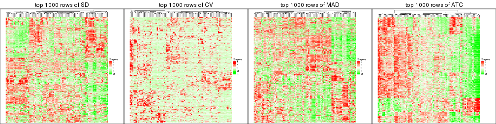</p>

</div>
<div id='tab-top-rows-heatmap-2'>
<pre><code class="r">top_rows_heatmap(res_list, top_n = 2000)
</code></pre>

<p></p>

</div>
<div id='tab-top-rows-heatmap-3'>
<pre><code class="r">top_rows_heatmap(res_list, top_n = 3000)
</code></pre>

<p></p>

</div>
<div id='tab-top-rows-heatmap-4'>
<pre><code class="r">top_rows_heatmap(res_list, top_n = 4000)
</code></pre>

<p></p>

</div>
<div id='tab-top-rows-heatmap-5'>
<pre><code class="r">top_rows_heatmap(res_list, top_n = 5000)
</code></pre>

<p></p>

</div>
</div>


 
## Results for each method


---------------------------------------------------


### SD:hclust


The object with results only for a single top-value method and a single partition method 
can be extracted as:

```r
res = res_list["SD", "hclust"]
# you can also extract it by
# res = res_list["SD:hclust"]
```

A summary of `res` and all the functions that can be applied to it:

```r
res
```

```
#> A 'ConsensusPartition' object with k = 2, 3, 4, 5, 6.
#>   On a matrix with 17471 rows and 87 columns.
#>   Top rows (1000, 2000, 3000, 4000, 5000) are extracted by 'SD' method.
#>   Subgroups are detected by 'hclust' method.
#>   Performed in total 1250 partitions by row resampling.
#>   Best k for subgroups seems to be 3.
#> 
#> Following methods can be applied to this 'ConsensusPartition' object:
#>  [1] "cola_report"             "collect_classes"         "collect_plots"          
#>  [4] "collect_stats"           "colnames"                "compare_signatures"     
#>  [7] "consensus_heatmap"       "dimension_reduction"     "functional_enrichment"  
#> [10] "get_anno_col"            "get_anno"                "get_classes"            
#> [13] "get_consensus"           "get_matrix"              "get_membership"         
#> [16] "get_param"               "get_signatures"          "get_stats"              
#> [19] "is_best_k"               "is_stable_k"             "membership_heatmap"     
#> [22] "ncol"                    "nrow"                    "plot_ecdf"              
#> [25] "rownames"                "select_partition_number" "show"                   
#> [28] "suggest_best_k"          "test_to_known_factors"
```

`collect_plots()` function collects all the plots made from `res` for all `k` (number of partitions)
into one single page to provide an easy and fast comparison between different `k`.

```r
collect_plots(res)
```


The plots are:

- The first row: a plot of the ECDF (empirical cumulative distribution
  function) curves of the consensus matrix for each `k` and the heatmap of
  predicted classes for each `k`.
- The second row: heatmaps of the consensus matrix for each `k`.
- The third row: heatmaps of the membership matrix for each `k`.
- The fouth row: heatmaps of the signatures for each `k`.

All the plots in panels can be made by individual functions and they are
plotted later in this section.

`select_partition_number()` produces several plots showing different
statistics for choosing "optimized" `k`. There are following statistics:

- ECDF curves of the consensus matrix for each `k`;
- 1-PAC. [The PAC
  score](https://en.wikipedia.org/wiki/Consensus_clustering#Over-interpretation_potential_of_consensus_clustering)
  measures the proportion of the ambiguous subgrouping.
- Mean silhouette score.
- Concordance. The mean probability of fiting the consensus class ids in all
  partitions.
- Area increased. Denote $A_k$ as the area under the ECDF curve for current
  `k`, the area increased is defined as $A_k - A_{k-1}$.
- Rand index. The percent of pairs of samples that are both in a same cluster
  or both are not in a same cluster in the partition of k and k-1.
- Jaccard index. The ratio of pairs of samples are both in a same cluster in
  the partition of k and k-1 and the pairs of samples are both in a same
  cluster in the partition k or k-1.

The detailed explanations of these statistics can be found in [the _cola_
vignette](http://bioconductor.org/packages/devel/bioc/vignettes/cola/inst/doc/cola.html#toc_13).

Generally speaking, lower PAC score, higher mean silhouette score or higher
concordance corresponds to better partition. Rand index and Jaccard index
measure how similar the current partition is compared to partition with `k-1`.
If they are too similar, we won't accept `k` is better than `k-1`.

```r
select_partition_number(res)
```


The numeric values for all these statistics can be obtained by `get_stats()`.

```r
get_stats(res)
```

```
#>   k 1-PAC mean_silhouette concordance area_increased  Rand Jaccard
#> 2 2 0.456           0.129       0.580         0.4194 0.607   0.607
#> 3 3 0.390           0.705       0.799         0.3232 0.461   0.329
#> 4 4 0.499           0.615       0.781         0.1091 0.927   0.845
#> 5 5 0.487           0.465       0.693         0.0729 0.945   0.869
#> 6 6 0.474           0.613       0.763         0.1183 0.790   0.496
```

`suggest_best_k()` suggests the best $k$ based on these statistics. The rules are as follows:

- All $k$ with Jaccard index larger than 0.95 are removed because increasing
  $k$ does not provide enough extra information. If all $k$ are removed, it is
  marked as no subgroup is detected.
- For all $k$ with 1-PAC score larger than 0.9, the maximal $k$ is taken as
  the best $k$, and other $k$ are marked as optional $k$.
- If it does not fit the second rule. The $k$ with the maximal vote of the
  highest 1-PAC score, highest mean silhouette, and highest concordance is
  taken as the best $k$.

```r
suggest_best_k(res)
```

```
#> [1] 3
```


Following shows the table of the partitions (You need to click the **show/hide
code output** link to see it). The membership matrix (columns with name `p*`)
is inferred by
[`clue::cl_consensus()`](https://www.rdocumentation.org/link/cl_consensus?package=clue)
function with the `SE` method. Basically the value in the membership matrix
represents the probability to belong to a certain group. The finall class
label for an item is determined with the group with highest probability it
belongs to.

In `get_classes()` function, the entropy is calculated from the membership
matrix and the silhouette score is calculated from the consensus matrix.


<script>
$( function() {
	$( '#tabs-SD-hclust-get-classes' ).tabs();
} );
</script>
<div id='tabs-SD-hclust-get-classes'>
<ul>
<li><a href='#tab-SD-hclust-get-classes-1'>k = 2</a></li>
<li><a href='#tab-SD-hclust-get-classes-2'>k = 3</a></li>
<li><a href='#tab-SD-hclust-get-classes-3'>k = 4</a></li>
<li><a href='#tab-SD-hclust-get-classes-4'>k = 5</a></li>
<li><a href='#tab-SD-hclust-get-classes-5'>k = 6</a></li>
</ul>

<div id='tab-SD-hclust-get-classes-1'>
<p><a id='tab-SD-hclust-get-classes-1-a' style='color:#0366d6' href='#'>show/hide code output</a></p>
<pre><code class="r">cbind(get_classes(res, k = 2), get_membership(res, k = 2))
</code></pre>

<pre><code>#&gt;                                      class entropy silhouette    p1    p2
#&gt; E6088A41-B0DC-4FBF-8D14-BE78024CF8CD     1  1.0000     -0.927 0.504 0.496
#&gt; F569915C-8F77-4D67-9730-30824DB57EE5     1  0.9988     -0.896 0.520 0.480
#&gt; E3B71CB7-673B-4741-8607-4F0A11633036     1  0.9977      0.414 0.528 0.472
#&gt; DAF84798-FE3F-403C-B589-7F256AF752BE     1  0.9970     -0.838 0.532 0.468
#&gt; 2F38E3B1-4975-4877-9DCC-C00270602180     1  0.9710      0.421 0.600 0.400
#&gt; C79A4C2F-02C4-4C03-A5A5-DE06802EEB57     1  0.9833     -0.707 0.576 0.424
#&gt; 92E3ED8F-5C74-4ED2-9B03-9FA5E7B491D6     1  0.9977      0.414 0.528 0.472
#&gt; E61D60BE-3BD3-4B5E-BC12-80F3684A0959     1  0.0672      0.307 0.992 0.008
#&gt; C9388FC7-DB1D-4416-BC2D-EA643584F1E6     1  0.9427     -0.594 0.640 0.360
#&gt; D4219360-6344-4AF3-ACEB-1701A9F1F67D     1  0.9977      0.414 0.528 0.472
#&gt; 07D155E6-F27C-4D09-B786-8A9B71147B72     1  0.6712      0.388 0.824 0.176
#&gt; 10C8C361-85A5-40E8-A395-B92623E6F27C     1  0.9944      0.418 0.544 0.456
#&gt; BDF20891-7C98-4A55-BBF3-8A836BE303C6     1  0.9970     -0.839 0.532 0.468
#&gt; 694B0504-095E-431A-84F2-B4387072138E     1  0.9977      0.414 0.528 0.472
#&gt; EDCF8E7F-8B1D-46F7-8AE0-84A1DC9647D2     1  0.9954     -0.844 0.540 0.460
#&gt; 0EA8288E-824D-4304-A053-5A833361F5C5     1  0.3733      0.281 0.928 0.072
#&gt; C4ACCFA1-34A9-4F61-8A1F-35B3B60EA193     1  0.9970      0.415 0.532 0.468
#&gt; 760BA639-38AC-4BC9-9647-09F6893EA8ED     1  0.9977      0.414 0.528 0.472
#&gt; 082DFC6B-C6E6-48B9-BDE5-74FF3B3DC954     2  1.0000      0.931 0.500 0.500
#&gt; FE349848-D7C4-4C49-B670-0E20454DDD7E     1  0.9775     -0.729 0.588 0.412
#&gt; 2E8937B3-9EA1-4528-8CEE-BF3D4137908A     2  0.9977      0.975 0.472 0.528
#&gt; 9942D04E-2767-4E39-BA16-7762EAC3DFC4     2  0.9896      0.919 0.440 0.560
#&gt; F9C23182-91C4-4145-AE52-526FE8EB199D     1  0.9983     -0.840 0.524 0.476
#&gt; 01024EED-7811-4E24-A067-8E0B978FFE2D     2  0.9977      0.975 0.472 0.528
#&gt; 932C8E98-A352-409C-8744-3D49FABCE425     1  0.9944      0.418 0.544 0.456
#&gt; 6DFD9439-C659-4936-84E5-108F717E3E4D     1  0.9963     -0.854 0.536 0.464
#&gt; 1D8B83B8-5DD7-4F45-9D59-487EC6906A8B     1  1.0000     -0.935 0.500 0.500
#&gt; 804B8503-73F6-42DE-835F-39DE2C9F13E1     2  0.9977      0.975 0.472 0.528
#&gt; B9453C9B-84D5-43BD-85BB-1780F02F039C     1  0.9970      0.416 0.532 0.468
#&gt; 836E6CD6-4E88-4028-9844-FA3C892C254A     1  0.8016      0.077 0.756 0.244
#&gt; 36EDD202-A845-4CE7-95D5-A515C471262E     2  0.9977      0.975 0.472 0.528
#&gt; 181C156A-B8F4-4F9D-93AA-6AFBD197644D     1  0.9970      0.072 0.532 0.468
#&gt; 0580E798-6A98-4E46-AC96-9A869DFF502E     1  0.9710      0.420 0.600 0.400
#&gt; EA1B63CF-D389-4567-8D9E-B0EF1F804598     1  0.9970     -0.837 0.532 0.468
#&gt; 5ABC3D06-B8E9-4831-B89B-7C1EC4006B47     2  0.9896      0.919 0.440 0.560
#&gt; 1CC01E74-A7C1-4A51-9E28-1703C352BE16     2  0.9963      0.965 0.464 0.536
#&gt; 97E55B75-DBDB-46BC-9E74-7828C070BF16     2  0.9977      0.975 0.472 0.528
#&gt; BEB37A2D-E8B0-4674-89AC-DC0F34E0AFD6     1  0.8144     -0.284 0.748 0.252
#&gt; 558648BA-6551-4D34-97C2-AD5F677D63FB     1  0.9129      0.024 0.672 0.328
#&gt; FF7021BB-414B-4466-BC43-372D856E6A1D     1  0.9209     -0.265 0.664 0.336
#&gt; 9C04B840-54E0-425D-BDBE-8CB6B9C2C722     1  0.9998     -0.916 0.508 0.492
#&gt; 5F50B1F4-1A02-4506-AA6D-9BF21CD8059A     1  0.1633      0.282 0.976 0.024
#&gt; 7D4B8FF3-7977-4ABD-AE04-EED1C50B23CC     1  0.9922     -0.817 0.552 0.448
#&gt; A005AF15-B98E-4623-8AD4-1E69EFA9BC7A     1  0.0672      0.307 0.992 0.008
#&gt; 1DF04345-5C93-4B18-B307-8D1FCA532999     2  0.9977      0.975 0.472 0.528
#&gt; 6AF30C18-347E-41ED-A4AB-6F81F42206C5     1  0.4815      0.363 0.896 0.104
#&gt; 88A44ED0-BDE1-401E-B0E1-D8C8D6DBAEFC     2  1.0000      0.931 0.500 0.500
#&gt; 117673A3-2918-4702-8583-B66ADE6E4338     1  0.9963     -0.854 0.536 0.464
#&gt; 4903A571-E14D-43C9-A737-22CAFAC414CD     1  0.9922     -0.817 0.552 0.448
#&gt; C175E68E-632A-4B4A-9DDB-4895C4760F20     1  0.9944      0.418 0.544 0.456
#&gt; FA5CA2F4-A1AD-4A79-B8F3-73A976EB2FB1     2  0.9998      0.945 0.492 0.508
#&gt; E1F883A7-8B1F-4C1D-8A1A-9749A9C09845     2  0.9977      0.975 0.472 0.528
#&gt; E74F0729-6000-4908-ADB0-7BDBAC0639E6     1  0.9754      0.420 0.592 0.408
#&gt; F92135A9-1981-4C79-99A5-4243EEC5D30D     2  0.9977      0.975 0.472 0.528
#&gt; 73C6919F-DEB4-4DA4-B4AE-4032AC8F96C5     1  0.9732      0.421 0.596 0.404
#&gt; 33977B40-2E92-48B6-8D3A-3EBE913F6F8A     1  0.9323     -0.539 0.652 0.348
#&gt; 490BD607-2F08-4B4C-9612-F9BB5CBBC8BB     1  0.9988     -0.896 0.520 0.480
#&gt; 6C666E17-2EB8-4244-BCC1-8DD34EE4173E     1  0.9993     -0.896 0.516 0.484
#&gt; C41F3064-4483-4796-B860-82155BAA5157     1  0.6801      0.389 0.820 0.180
#&gt; F4232B90-51B9-43EE-9971-35B3A318758F     1  0.9710      0.420 0.600 0.400
#&gt; 291EA1F6-FC56-4429-A433-0C452A6A514C     2  0.9988      0.964 0.480 0.520
#&gt; CC4AF04D-CB8E-40DD-B12E-7AA39B38262A     2  0.9909      0.927 0.444 0.556
#&gt; 4DAE26B9-AB57-4763-BB9A-2ADDD5D9C007     1  0.0938      0.303 0.988 0.012
#&gt; 676B4AEE-FB41-4C16-AA91-03E4A1DA8E26     1  0.7453      0.318 0.788 0.212
#&gt; 1CC36859-357A-49E0-A367-4F57D47288BA     1  0.9881     -0.790 0.564 0.436
#&gt; 7CCDDFC8-6DF6-4734-96AC-19EBC464FC50     2  0.9977      0.975 0.472 0.528
#&gt; 10F38C34-3956-48ED-AB62-3439EF00D46B     1  1.0000     -0.929 0.504 0.496
#&gt; 80B2B393-9D6E-45B4-B696-2A5C203543B7     2  0.9977      0.975 0.472 0.528
#&gt; 5AC7B5EA-1AAC-4529-8E5A-F612E5E0719A     1  0.3733      0.281 0.928 0.072
#&gt; 3648E98D-4B3A-41B7-BE05-595D44F0150D     1  0.9954      0.417 0.540 0.460
#&gt; 252EC850-6026-473B-8FFC-2CF567EF42E4     1  0.1414      0.316 0.980 0.020
#&gt; 1790E7A3-99D8-447E-BC50-51C8A4A18853     2  0.9977      0.975 0.472 0.528
#&gt; DA61A4F8-350B-4DD1-A240-AD016520DB5B     1  1.0000     -0.929 0.504 0.496
#&gt; 767E5BAF-2515-40D7-AE7D-0B24D77A03F4     1  0.9775     -0.729 0.588 0.412
#&gt; 8CB9C903-D749-44EA-9137-7FB5A92C5932     1  0.9358      0.401 0.648 0.352
#&gt; A9B968AE-2243-41BC-852A-3A12C1FB4892     1  0.3114      0.339 0.944 0.056
#&gt; 3C582264-85BC-4569-A888-8EB3008E5198     2  0.9977      0.975 0.472 0.528
#&gt; F4EAF9A2-9938-4D9B-9080-C0A7542D5704     2  0.9963      0.965 0.464 0.536
#&gt; 328499D3-45DD-4B66-BD22-3C52BA92C2BB     1  0.9977      0.414 0.528 0.472
#&gt; AF8AB83D-2917-4752-8C38-CF84C565B565     1  0.1184      0.281 0.984 0.016
#&gt; 03A327CA-A9FE-42A4-844D-CA85206969FC     1  1.0000     -0.935 0.500 0.500
#&gt; 4B0BEC44-87BB-4014-9A26-3529DD63760B     1  1.0000     -0.929 0.504 0.496
#&gt; 05C7843E-DC89-4D8E-A78A-952C5DFD667B     1  0.9833     -0.707 0.576 0.424
#&gt; 29A0FFF9-13D3-4D16-BE6A-8E48A2C4E315     2  0.9977      0.975 0.472 0.528
#&gt; 22947CC3-4F42-4F44-899C-2B7085E36C9D     1  1.0000     -0.927 0.504 0.496
#&gt; A247D92D-253A-4BEC-B450-184AF90D17D0     2  1.0000      0.931 0.500 0.500
#&gt; 0D907A63-D23F-4684-80D9-0BA552435B86     1  0.0376      0.303 0.996 0.004
</code></pre>

<script>
$('#tab-SD-hclust-get-classes-1-a').parent().next().next().hide();
$('#tab-SD-hclust-get-classes-1-a').click(function(){
  $('#tab-SD-hclust-get-classes-1-a').parent().next().next().toggle();
  return(false);
});
</script>
</div>

<div id='tab-SD-hclust-get-classes-2'>
<p><a id='tab-SD-hclust-get-classes-2-a' style='color:#0366d6' href='#'>show/hide code output</a></p>
<pre><code class="r">cbind(get_classes(res, k = 3), get_membership(res, k = 3))
</code></pre>

<pre><code>#&gt;                                      class entropy silhouette    p1    p2    p3
#&gt; E6088A41-B0DC-4FBF-8D14-BE78024CF8CD     2  0.1529     0.7898 0.000 0.960 0.040
#&gt; F569915C-8F77-4D67-9730-30824DB57EE5     2  0.2590     0.7748 0.004 0.924 0.072
#&gt; E3B71CB7-673B-4741-8607-4F0A11633036     1  0.0237     0.8302 0.996 0.004 0.000
#&gt; DAF84798-FE3F-403C-B589-7F256AF752BE     2  0.2939     0.7730 0.012 0.916 0.072
#&gt; 2F38E3B1-4975-4877-9DCC-C00270602180     1  0.7816     0.5148 0.628 0.084 0.288
#&gt; C79A4C2F-02C4-4C03-A5A5-DE06802EEB57     2  0.4475     0.7053 0.016 0.840 0.144
#&gt; 92E3ED8F-5C74-4ED2-9B03-9FA5E7B491D6     1  0.0237     0.8302 0.996 0.004 0.000
#&gt; E61D60BE-3BD3-4B5E-BC12-80F3684A0959     3  0.7562     0.8300 0.064 0.308 0.628
#&gt; C9388FC7-DB1D-4416-BC2D-EA643584F1E6     2  0.5366     0.6039 0.016 0.776 0.208
#&gt; D4219360-6344-4AF3-ACEB-1701A9F1F67D     1  0.0237     0.8302 0.996 0.004 0.000
#&gt; 07D155E6-F27C-4D09-B786-8A9B71147B72     3  0.8098     0.6181 0.216 0.140 0.644
#&gt; 10C8C361-85A5-40E8-A395-B92623E6F27C     1  0.3983     0.7874 0.884 0.048 0.068
#&gt; BDF20891-7C98-4A55-BBF3-8A836BE303C6     2  0.5305     0.7625 0.020 0.788 0.192
#&gt; 694B0504-095E-431A-84F2-B4387072138E     1  0.0237     0.8302 0.996 0.004 0.000
#&gt; EDCF8E7F-8B1D-46F7-8AE0-84A1DC9647D2     2  0.2448     0.7796 0.000 0.924 0.076
#&gt; 0EA8288E-824D-4304-A053-5A833361F5C5     3  0.6835     0.7911 0.040 0.284 0.676
#&gt; C4ACCFA1-34A9-4F61-8A1F-35B3B60EA193     1  0.0661     0.8297 0.988 0.004 0.008
#&gt; 760BA639-38AC-4BC9-9647-09F6893EA8ED     1  0.0237     0.8302 0.996 0.004 0.000
#&gt; 082DFC6B-C6E6-48B9-BDE5-74FF3B3DC954     2  0.1964     0.7835 0.000 0.944 0.056
#&gt; FE349848-D7C4-4C49-B670-0E20454DDD7E     2  0.3918     0.7227 0.004 0.856 0.140
#&gt; 2E8937B3-9EA1-4528-8CEE-BF3D4137908A     2  0.3816     0.7713 0.000 0.852 0.148
#&gt; 9942D04E-2767-4E39-BA16-7762EAC3DFC4     2  0.5722     0.6467 0.004 0.704 0.292
#&gt; F9C23182-91C4-4145-AE52-526FE8EB199D     2  0.3618     0.7797 0.012 0.884 0.104
#&gt; 01024EED-7811-4E24-A067-8E0B978FFE2D     2  0.3879     0.7725 0.000 0.848 0.152
#&gt; 932C8E98-A352-409C-8744-3D49FABCE425     1  0.1636     0.8212 0.964 0.020 0.016
#&gt; 6DFD9439-C659-4936-84E5-108F717E3E4D     2  0.2356     0.7753 0.000 0.928 0.072
#&gt; 1D8B83B8-5DD7-4F45-9D59-487EC6906A8B     2  0.1860     0.7850 0.000 0.948 0.052
#&gt; 804B8503-73F6-42DE-835F-39DE2C9F13E1     2  0.3816     0.7713 0.000 0.852 0.148
#&gt; B9453C9B-84D5-43BD-85BB-1780F02F039C     1  0.2496     0.7987 0.928 0.004 0.068
#&gt; 836E6CD6-4E88-4028-9844-FA3C892C254A     2  0.9113     0.0206 0.300 0.528 0.172
#&gt; 36EDD202-A845-4CE7-95D5-A515C471262E     2  0.3879     0.7744 0.000 0.848 0.152
#&gt; 181C156A-B8F4-4F9D-93AA-6AFBD197644D     2  0.9296     0.1422 0.404 0.436 0.160
#&gt; 0580E798-6A98-4E46-AC96-9A869DFF502E     1  0.7995     0.4834 0.608 0.088 0.304
#&gt; EA1B63CF-D389-4567-8D9E-B0EF1F804598     2  0.3031     0.7751 0.012 0.912 0.076
#&gt; 5ABC3D06-B8E9-4831-B89B-7C1EC4006B47     2  0.5722     0.6467 0.004 0.704 0.292
#&gt; 1CC01E74-A7C1-4A51-9E28-1703C352BE16     2  0.4178     0.7583 0.000 0.828 0.172
#&gt; 97E55B75-DBDB-46BC-9E74-7828C070BF16     2  0.3941     0.7669 0.000 0.844 0.156
#&gt; BEB37A2D-E8B0-4674-89AC-DC0F34E0AFD6     2  0.6962     0.2677 0.036 0.648 0.316
#&gt; 558648BA-6551-4D34-97C2-AD5F677D63FB     2  0.8918     0.1386 0.288 0.552 0.160
#&gt; FF7021BB-414B-4466-BC43-372D856E6A1D     2  0.6962     0.0610 0.020 0.568 0.412
#&gt; 9C04B840-54E0-425D-BDBE-8CB6B9C2C722     2  0.4121     0.7832 0.000 0.832 0.168
#&gt; 5F50B1F4-1A02-4506-AA6D-9BF21CD8059A     3  0.7448     0.8114 0.052 0.332 0.616
#&gt; 7D4B8FF3-7977-4ABD-AE04-EED1C50B23CC     2  0.3116     0.7552 0.000 0.892 0.108
#&gt; A005AF15-B98E-4623-8AD4-1E69EFA9BC7A     3  0.7562     0.8300 0.064 0.308 0.628
#&gt; 1DF04345-5C93-4B18-B307-8D1FCA532999     2  0.3816     0.7713 0.000 0.852 0.148
#&gt; 6AF30C18-347E-41ED-A4AB-6F81F42206C5     3  0.8803     0.7454 0.180 0.240 0.580
#&gt; 88A44ED0-BDE1-401E-B0E1-D8C8D6DBAEFC     2  0.1964     0.7835 0.000 0.944 0.056
#&gt; 117673A3-2918-4702-8583-B66ADE6E4338     2  0.2537     0.7783 0.000 0.920 0.080
#&gt; 4903A571-E14D-43C9-A737-22CAFAC414CD     2  0.3116     0.7552 0.000 0.892 0.108
#&gt; C175E68E-632A-4B4A-9DDB-4895C4760F20     1  0.1636     0.8212 0.964 0.020 0.016
#&gt; FA5CA2F4-A1AD-4A79-B8F3-73A976EB2FB1     2  0.2356     0.7935 0.000 0.928 0.072
#&gt; E1F883A7-8B1F-4C1D-8A1A-9749A9C09845     2  0.3816     0.7713 0.000 0.852 0.148
#&gt; E74F0729-6000-4908-ADB0-7BDBAC0639E6     1  0.7742     0.5297 0.632 0.080 0.288
#&gt; F92135A9-1981-4C79-99A5-4243EEC5D30D     2  0.3879     0.7725 0.000 0.848 0.152
#&gt; 73C6919F-DEB4-4DA4-B4AE-4032AC8F96C5     1  0.7816     0.5220 0.628 0.084 0.288
#&gt; 33977B40-2E92-48B6-8D3A-3EBE913F6F8A     2  0.5643     0.5759 0.020 0.760 0.220
#&gt; 490BD607-2F08-4B4C-9612-F9BB5CBBC8BB     2  0.2590     0.7748 0.004 0.924 0.072
#&gt; 6C666E17-2EB8-4244-BCC1-8DD34EE4173E     2  0.2772     0.7756 0.004 0.916 0.080
#&gt; C41F3064-4483-4796-B860-82155BAA5157     3  0.8213     0.6017 0.228 0.140 0.632
#&gt; F4232B90-51B9-43EE-9971-35B3A318758F     1  0.7995     0.4834 0.608 0.088 0.304
#&gt; 291EA1F6-FC56-4429-A433-0C452A6A514C     2  0.3686     0.7763 0.000 0.860 0.140
#&gt; CC4AF04D-CB8E-40DD-B12E-7AA39B38262A     2  0.4796     0.7183 0.000 0.780 0.220
#&gt; 4DAE26B9-AB57-4763-BB9A-2ADDD5D9C007     3  0.7694     0.8280 0.068 0.316 0.616
#&gt; 676B4AEE-FB41-4C16-AA91-03E4A1DA8E26     3  0.7960     0.6351 0.136 0.208 0.656
#&gt; 1CC36859-357A-49E0-A367-4F57D47288BA     2  0.3715     0.7394 0.004 0.868 0.128
#&gt; 7CCDDFC8-6DF6-4734-96AC-19EBC464FC50     2  0.3816     0.7713 0.000 0.852 0.148
#&gt; 10F38C34-3956-48ED-AB62-3439EF00D46B     2  0.2066     0.7826 0.000 0.940 0.060
#&gt; 80B2B393-9D6E-45B4-B696-2A5C203543B7     2  0.3816     0.7713 0.000 0.852 0.148
#&gt; 5AC7B5EA-1AAC-4529-8E5A-F612E5E0719A     3  0.6835     0.7911 0.040 0.284 0.676
#&gt; 3648E98D-4B3A-41B7-BE05-595D44F0150D     1  0.3590     0.7976 0.896 0.028 0.076
#&gt; 252EC850-6026-473B-8FFC-2CF567EF42E4     3  0.7916     0.8264 0.088 0.292 0.620
#&gt; 1790E7A3-99D8-447E-BC50-51C8A4A18853     2  0.3816     0.7713 0.000 0.852 0.148
#&gt; DA61A4F8-350B-4DD1-A240-AD016520DB5B     2  0.2066     0.7826 0.000 0.940 0.060
#&gt; 767E5BAF-2515-40D7-AE7D-0B24D77A03F4     2  0.3918     0.7227 0.004 0.856 0.140
#&gt; 8CB9C903-D749-44EA-9137-7FB5A92C5932     3  0.7337    -0.2156 0.428 0.032 0.540
#&gt; A9B968AE-2243-41BC-852A-3A12C1FB4892     3  0.8399     0.7952 0.136 0.256 0.608
#&gt; 3C582264-85BC-4569-A888-8EB3008E5198     2  0.3816     0.7713 0.000 0.852 0.148
#&gt; F4EAF9A2-9938-4D9B-9080-C0A7542D5704     2  0.4178     0.7583 0.000 0.828 0.172
#&gt; 328499D3-45DD-4B66-BD22-3C52BA92C2BB     1  0.1129     0.8222 0.976 0.004 0.020
#&gt; AF8AB83D-2917-4752-8C38-CF84C565B565     3  0.7357     0.8095 0.048 0.332 0.620
#&gt; 03A327CA-A9FE-42A4-844D-CA85206969FC     2  0.1529     0.7915 0.000 0.960 0.040
#&gt; 4B0BEC44-87BB-4014-9A26-3529DD63760B     2  0.2066     0.7826 0.000 0.940 0.060
#&gt; 05C7843E-DC89-4D8E-A78A-952C5DFD667B     2  0.4475     0.7053 0.016 0.840 0.144
#&gt; 29A0FFF9-13D3-4D16-BE6A-8E48A2C4E315     2  0.3816     0.7713 0.000 0.852 0.148
#&gt; 22947CC3-4F42-4F44-899C-2B7085E36C9D     2  0.1529     0.7898 0.000 0.960 0.040
#&gt; A247D92D-253A-4BEC-B450-184AF90D17D0     2  0.1964     0.7835 0.000 0.944 0.056
#&gt; 0D907A63-D23F-4684-80D9-0BA552435B86     3  0.7588     0.8291 0.064 0.312 0.624
</code></pre>

<script>
$('#tab-SD-hclust-get-classes-2-a').parent().next().next().hide();
$('#tab-SD-hclust-get-classes-2-a').click(function(){
  $('#tab-SD-hclust-get-classes-2-a').parent().next().next().toggle();
  return(false);
});
</script>
</div>

<div id='tab-SD-hclust-get-classes-3'>
<p><a id='tab-SD-hclust-get-classes-3-a' style='color:#0366d6' href='#'>show/hide code output</a></p>
<pre><code class="r">cbind(get_classes(res, k = 4), get_membership(res, k = 4))
</code></pre>

<pre><code>#&gt;                                      class entropy silhouette    p1    p2    p3    p4
#&gt; E6088A41-B0DC-4FBF-8D14-BE78024CF8CD     2  0.4164     0.7554 0.000 0.736 0.000 0.264
#&gt; F569915C-8F77-4D67-9730-30824DB57EE5     2  0.4584     0.7362 0.000 0.696 0.004 0.300
#&gt; E3B71CB7-673B-4741-8607-4F0A11633036     1  0.0000     0.7927 1.000 0.000 0.000 0.000
#&gt; DAF84798-FE3F-403C-B589-7F256AF752BE     2  0.4795     0.7339 0.012 0.696 0.000 0.292
#&gt; 2F38E3B1-4975-4877-9DCC-C00270602180     1  0.5560     0.5521 0.584 0.000 0.024 0.392
#&gt; C79A4C2F-02C4-4C03-A5A5-DE06802EEB57     2  0.5616     0.6515 0.012 0.604 0.012 0.372
#&gt; 92E3ED8F-5C74-4ED2-9B03-9FA5E7B491D6     1  0.0188     0.7931 0.996 0.000 0.004 0.000
#&gt; E61D60BE-3BD3-4B5E-BC12-80F3684A0959     4  0.3538     0.6167 0.024 0.036 0.060 0.880
#&gt; C9388FC7-DB1D-4416-BC2D-EA643584F1E6     2  0.5155     0.5048 0.000 0.528 0.004 0.468
#&gt; D4219360-6344-4AF3-ACEB-1701A9F1F67D     1  0.0188     0.7931 0.996 0.000 0.004 0.000
#&gt; 07D155E6-F27C-4D09-B786-8A9B71147B72     4  0.5694     0.3159 0.080 0.000 0.224 0.696
#&gt; 10C8C361-85A5-40E8-A395-B92623E6F27C     1  0.3769     0.7434 0.860 0.020 0.024 0.096
#&gt; BDF20891-7C98-4A55-BBF3-8A836BE303C6     2  0.4043     0.7129 0.008 0.812 0.012 0.168
#&gt; 694B0504-095E-431A-84F2-B4387072138E     1  0.0188     0.7931 0.996 0.000 0.004 0.000
#&gt; EDCF8E7F-8B1D-46F7-8AE0-84A1DC9647D2     2  0.4304     0.7399 0.000 0.716 0.000 0.284
#&gt; 0EA8288E-824D-4304-A053-5A833361F5C5     4  0.5779     0.2854 0.008 0.040 0.292 0.660
#&gt; C4ACCFA1-34A9-4F61-8A1F-35B3B60EA193     1  0.0524     0.7927 0.988 0.000 0.004 0.008
#&gt; 760BA639-38AC-4BC9-9647-09F6893EA8ED     1  0.0188     0.7931 0.996 0.000 0.004 0.000
#&gt; 082DFC6B-C6E6-48B9-BDE5-74FF3B3DC954     2  0.4304     0.7460 0.000 0.716 0.000 0.284
#&gt; FE349848-D7C4-4C49-B670-0E20454DDD7E     2  0.4790     0.6688 0.000 0.620 0.000 0.380
#&gt; 2E8937B3-9EA1-4528-8CEE-BF3D4137908A     2  0.0188     0.7127 0.000 0.996 0.004 0.000
#&gt; 9942D04E-2767-4E39-BA16-7762EAC3DFC4     2  0.3444     0.4867 0.000 0.816 0.184 0.000
#&gt; F9C23182-91C4-4145-AE52-526FE8EB199D     2  0.4718     0.7397 0.008 0.716 0.004 0.272
#&gt; 01024EED-7811-4E24-A067-8E0B978FFE2D     2  0.0524     0.7150 0.000 0.988 0.004 0.008
#&gt; 932C8E98-A352-409C-8744-3D49FABCE425     1  0.1296     0.7843 0.964 0.004 0.004 0.028
#&gt; 6DFD9439-C659-4936-84E5-108F717E3E4D     2  0.4356     0.7376 0.000 0.708 0.000 0.292
#&gt; 1D8B83B8-5DD7-4F45-9D59-487EC6906A8B     2  0.4277     0.7478 0.000 0.720 0.000 0.280
#&gt; 804B8503-73F6-42DE-835F-39DE2C9F13E1     2  0.0188     0.7127 0.000 0.996 0.004 0.000
#&gt; B9453C9B-84D5-43BD-85BB-1780F02F039C     1  0.3751     0.6506 0.800 0.000 0.196 0.004
#&gt; 836E6CD6-4E88-4028-9844-FA3C892C254A     4  0.8103     0.0432 0.292 0.292 0.008 0.408
#&gt; 36EDD202-A845-4CE7-95D5-A515C471262E     2  0.0469     0.7177 0.000 0.988 0.000 0.012
#&gt; 181C156A-B8F4-4F9D-93AA-6AFBD197644D     2  0.6076    -0.0918 0.396 0.560 0.040 0.004
#&gt; 0580E798-6A98-4E46-AC96-9A869DFF502E     1  0.5691     0.5297 0.564 0.000 0.028 0.408
#&gt; EA1B63CF-D389-4567-8D9E-B0EF1F804598     2  0.4799     0.7350 0.008 0.704 0.004 0.284
#&gt; 5ABC3D06-B8E9-4831-B89B-7C1EC4006B47     2  0.3444     0.4867 0.000 0.816 0.184 0.000
#&gt; 1CC01E74-A7C1-4A51-9E28-1703C352BE16     2  0.0921     0.6952 0.000 0.972 0.028 0.000
#&gt; 97E55B75-DBDB-46BC-9E74-7828C070BF16     2  0.0469     0.7085 0.000 0.988 0.012 0.000
#&gt; BEB37A2D-E8B0-4674-89AC-DC0F34E0AFD6     4  0.6127    -0.1667 0.016 0.408 0.024 0.552
#&gt; 558648BA-6551-4D34-97C2-AD5F677D63FB     4  0.8726    -0.0524 0.280 0.332 0.036 0.352
#&gt; FF7021BB-414B-4466-BC43-372D856E6A1D     3  0.7717    -0.0418 0.000 0.384 0.392 0.224
#&gt; 9C04B840-54E0-425D-BDBE-8CB6B9C2C722     2  0.2921     0.7387 0.000 0.860 0.000 0.140
#&gt; 5F50B1F4-1A02-4506-AA6D-9BF21CD8059A     4  0.2917     0.5977 0.008 0.048 0.040 0.904
#&gt; 7D4B8FF3-7977-4ABD-AE04-EED1C50B23CC     2  0.4605     0.7156 0.000 0.664 0.000 0.336
#&gt; A005AF15-B98E-4623-8AD4-1E69EFA9BC7A     4  0.3615     0.6157 0.024 0.036 0.064 0.876
#&gt; 1DF04345-5C93-4B18-B307-8D1FCA532999     2  0.0188     0.7127 0.000 0.996 0.004 0.000
#&gt; 6AF30C18-347E-41ED-A4AB-6F81F42206C5     4  0.5399     0.5108 0.140 0.036 0.052 0.772
#&gt; 88A44ED0-BDE1-401E-B0E1-D8C8D6DBAEFC     2  0.4304     0.7460 0.000 0.716 0.000 0.284
#&gt; 117673A3-2918-4702-8583-B66ADE6E4338     2  0.4304     0.7394 0.000 0.716 0.000 0.284
#&gt; 4903A571-E14D-43C9-A737-22CAFAC414CD     2  0.4605     0.7156 0.000 0.664 0.000 0.336
#&gt; C175E68E-632A-4B4A-9DDB-4895C4760F20     1  0.1296     0.7843 0.964 0.004 0.004 0.028
#&gt; FA5CA2F4-A1AD-4A79-B8F3-73A976EB2FB1     2  0.3306     0.7558 0.000 0.840 0.004 0.156
#&gt; E1F883A7-8B1F-4C1D-8A1A-9749A9C09845     2  0.0188     0.7127 0.000 0.996 0.004 0.000
#&gt; E74F0729-6000-4908-ADB0-7BDBAC0639E6     1  0.5626     0.5622 0.588 0.000 0.028 0.384
#&gt; F92135A9-1981-4C79-99A5-4243EEC5D30D     2  0.0376     0.7137 0.000 0.992 0.004 0.004
#&gt; 73C6919F-DEB4-4DA4-B4AE-4032AC8F96C5     1  0.5638     0.5567 0.584 0.000 0.028 0.388
#&gt; 33977B40-2E92-48B6-8D3A-3EBE913F6F8A     2  0.5573     0.4694 0.012 0.508 0.004 0.476
#&gt; 490BD607-2F08-4B4C-9612-F9BB5CBBC8BB     2  0.4584     0.7362 0.000 0.696 0.004 0.300
#&gt; 6C666E17-2EB8-4244-BCC1-8DD34EE4173E     2  0.4769     0.7339 0.000 0.684 0.008 0.308
#&gt; C41F3064-4483-4796-B860-82155BAA5157     4  0.5875     0.3062 0.092 0.000 0.224 0.684
#&gt; F4232B90-51B9-43EE-9971-35B3A318758F     1  0.5691     0.5297 0.564 0.000 0.028 0.408
#&gt; 291EA1F6-FC56-4429-A433-0C452A6A514C     2  0.1305     0.7270 0.000 0.960 0.004 0.036
#&gt; CC4AF04D-CB8E-40DD-B12E-7AA39B38262A     2  0.1940     0.6446 0.000 0.924 0.076 0.000
#&gt; 4DAE26B9-AB57-4763-BB9A-2ADDD5D9C007     4  0.3894     0.6171 0.028 0.044 0.064 0.864
#&gt; 676B4AEE-FB41-4C16-AA91-03E4A1DA8E26     3  0.7303     0.0906 0.036 0.084 0.568 0.312
#&gt; 1CC36859-357A-49E0-A367-4F57D47288BA     2  0.4872     0.6995 0.000 0.640 0.004 0.356
#&gt; 7CCDDFC8-6DF6-4734-96AC-19EBC464FC50     2  0.0188     0.7127 0.000 0.996 0.004 0.000
#&gt; 10F38C34-3956-48ED-AB62-3439EF00D46B     2  0.4509     0.7440 0.000 0.708 0.004 0.288
#&gt; 80B2B393-9D6E-45B4-B696-2A5C203543B7     2  0.0188     0.7127 0.000 0.996 0.004 0.000
#&gt; 5AC7B5EA-1AAC-4529-8E5A-F612E5E0719A     4  0.5779     0.2854 0.008 0.040 0.292 0.660
#&gt; 3648E98D-4B3A-41B7-BE05-595D44F0150D     1  0.3245     0.7595 0.872 0.000 0.028 0.100
#&gt; 252EC850-6026-473B-8FFC-2CF567EF42E4     4  0.4291     0.5994 0.028 0.040 0.092 0.840
#&gt; 1790E7A3-99D8-447E-BC50-51C8A4A18853     2  0.0188     0.7127 0.000 0.996 0.004 0.000
#&gt; DA61A4F8-350B-4DD1-A240-AD016520DB5B     2  0.4331     0.7448 0.000 0.712 0.000 0.288
#&gt; 767E5BAF-2515-40D7-AE7D-0B24D77A03F4     2  0.4790     0.6688 0.000 0.620 0.000 0.380
#&gt; 8CB9C903-D749-44EA-9137-7FB5A92C5932     3  0.3529     0.1670 0.152 0.000 0.836 0.012
#&gt; A9B968AE-2243-41BC-852A-3A12C1FB4892     4  0.5097     0.5430 0.032 0.044 0.136 0.788
#&gt; 3C582264-85BC-4569-A888-8EB3008E5198     2  0.0188     0.7127 0.000 0.996 0.004 0.000
#&gt; F4EAF9A2-9938-4D9B-9080-C0A7542D5704     2  0.0921     0.6952 0.000 0.972 0.028 0.000
#&gt; 328499D3-45DD-4B66-BD22-3C52BA92C2BB     1  0.1557     0.7638 0.944 0.000 0.056 0.000
#&gt; AF8AB83D-2917-4752-8C38-CF84C565B565     4  0.2456     0.5895 0.008 0.040 0.028 0.924
#&gt; 03A327CA-A9FE-42A4-844D-CA85206969FC     2  0.4103     0.7570 0.000 0.744 0.000 0.256
#&gt; 4B0BEC44-87BB-4014-9A26-3529DD63760B     2  0.4509     0.7440 0.000 0.708 0.004 0.288
#&gt; 05C7843E-DC89-4D8E-A78A-952C5DFD667B     2  0.5616     0.6515 0.012 0.604 0.012 0.372
#&gt; 29A0FFF9-13D3-4D16-BE6A-8E48A2C4E315     2  0.0188     0.7127 0.000 0.996 0.004 0.000
#&gt; 22947CC3-4F42-4F44-899C-2B7085E36C9D     2  0.4164     0.7554 0.000 0.736 0.000 0.264
#&gt; A247D92D-253A-4BEC-B450-184AF90D17D0     2  0.4304     0.7460 0.000 0.716 0.000 0.284
#&gt; 0D907A63-D23F-4684-80D9-0BA552435B86     4  0.3705     0.6168 0.024 0.040 0.064 0.872
</code></pre>

<script>
$('#tab-SD-hclust-get-classes-3-a').parent().next().next().hide();
$('#tab-SD-hclust-get-classes-3-a').click(function(){
  $('#tab-SD-hclust-get-classes-3-a').parent().next().next().toggle();
  return(false);
});
</script>
</div>

<div id='tab-SD-hclust-get-classes-4'>
<p><a id='tab-SD-hclust-get-classes-4-a' style='color:#0366d6' href='#'>show/hide code output</a></p>
<pre><code class="r">cbind(get_classes(res, k = 5), get_membership(res, k = 5))
</code></pre>

<pre><code>#&gt;                                      class entropy silhouette    p1    p2    p3    p4    p5
#&gt; E6088A41-B0DC-4FBF-8D14-BE78024CF8CD     2  0.4161     0.5226 0.000 0.608 0.000 0.000 0.392
#&gt; F569915C-8F77-4D67-9730-30824DB57EE5     2  0.4565     0.4824 0.000 0.580 0.000 0.012 0.408
#&gt; E3B71CB7-673B-4741-8607-4F0A11633036     1  0.0162     0.6992 0.996 0.000 0.004 0.000 0.000
#&gt; DAF84798-FE3F-403C-B589-7F256AF752BE     2  0.4951     0.4619 0.012 0.556 0.000 0.012 0.420
#&gt; 2F38E3B1-4975-4877-9DCC-C00270602180     1  0.5122     0.4910 0.556 0.000 0.032 0.408 0.004
#&gt; C79A4C2F-02C4-4C03-A5A5-DE06802EEB57     2  0.5810     0.3136 0.004 0.492 0.016 0.044 0.444
#&gt; 92E3ED8F-5C74-4ED2-9B03-9FA5E7B491D6     1  0.0000     0.6995 1.000 0.000 0.000 0.000 0.000
#&gt; E61D60BE-3BD3-4B5E-BC12-80F3684A0959     4  0.3906     0.7498 0.004 0.000 0.000 0.704 0.292
#&gt; C9388FC7-DB1D-4416-BC2D-EA643584F1E6     5  0.5996    -0.1088 0.000 0.388 0.000 0.116 0.496
#&gt; D4219360-6344-4AF3-ACEB-1701A9F1F67D     1  0.0000     0.6995 1.000 0.000 0.000 0.000 0.000
#&gt; 07D155E6-F27C-4D09-B786-8A9B71147B72     4  0.2151     0.4892 0.040 0.000 0.016 0.924 0.020
#&gt; 10C8C361-85A5-40E8-A395-B92623E6F27C     1  0.3981     0.6381 0.832 0.008 0.024 0.088 0.048
#&gt; BDF20891-7C98-4A55-BBF3-8A836BE303C6     2  0.4575     0.5075 0.000 0.736 0.012 0.040 0.212
#&gt; 694B0504-095E-431A-84F2-B4387072138E     1  0.0000     0.6995 1.000 0.000 0.000 0.000 0.000
#&gt; EDCF8E7F-8B1D-46F7-8AE0-84A1DC9647D2     2  0.4658     0.4786 0.000 0.576 0.000 0.016 0.408
#&gt; 0EA8288E-824D-4304-A053-5A833361F5C5     5  0.5234    -0.3163 0.004 0.000 0.052 0.332 0.612
#&gt; C4ACCFA1-34A9-4F61-8A1F-35B3B60EA193     1  0.0290     0.6983 0.992 0.000 0.000 0.000 0.008
#&gt; 760BA639-38AC-4BC9-9647-09F6893EA8ED     1  0.0000     0.6995 1.000 0.000 0.000 0.000 0.000
#&gt; 082DFC6B-C6E6-48B9-BDE5-74FF3B3DC954     2  0.4321     0.5062 0.000 0.600 0.000 0.004 0.396
#&gt; FE349848-D7C4-4C49-B670-0E20454DDD7E     2  0.5178     0.3322 0.000 0.484 0.000 0.040 0.476
#&gt; 2E8937B3-9EA1-4528-8CEE-BF3D4137908A     2  0.0000     0.5641 0.000 1.000 0.000 0.000 0.000
#&gt; 9942D04E-2767-4E39-BA16-7762EAC3DFC4     2  0.4631     0.3400 0.000 0.752 0.076 0.008 0.164
#&gt; F9C23182-91C4-4145-AE52-526FE8EB199D     2  0.4940     0.4847 0.008 0.584 0.004 0.012 0.392
#&gt; 01024EED-7811-4E24-A067-8E0B978FFE2D     2  0.1082     0.5612 0.000 0.964 0.008 0.000 0.028
#&gt; 932C8E98-A352-409C-8744-3D49FABCE425     1  0.0955     0.6825 0.968 0.000 0.000 0.004 0.028
#&gt; 6DFD9439-C659-4936-84E5-108F717E3E4D     2  0.4590     0.4727 0.000 0.568 0.000 0.012 0.420
#&gt; 1D8B83B8-5DD7-4F45-9D59-487EC6906A8B     2  0.4310     0.5103 0.000 0.604 0.000 0.004 0.392
#&gt; 804B8503-73F6-42DE-835F-39DE2C9F13E1     2  0.0000     0.5641 0.000 1.000 0.000 0.000 0.000
#&gt; B9453C9B-84D5-43BD-85BB-1780F02F039C     3  0.3689     0.0000 0.256 0.000 0.740 0.000 0.004
#&gt; 836E6CD6-4E88-4028-9844-FA3C892C254A     5  0.7607     0.3249 0.288 0.192 0.004 0.060 0.456
#&gt; 36EDD202-A845-4CE7-95D5-A515C471262E     2  0.2054     0.5633 0.000 0.916 0.008 0.004 0.072
#&gt; 181C156A-B8F4-4F9D-93AA-6AFBD197644D     2  0.5787    -0.1121 0.092 0.564 0.340 0.000 0.004
#&gt; 0580E798-6A98-4E46-AC96-9A869DFF502E     1  0.5218     0.4716 0.536 0.000 0.036 0.424 0.004
#&gt; EA1B63CF-D389-4567-8D9E-B0EF1F804598     2  0.4936     0.4666 0.012 0.564 0.000 0.012 0.412
#&gt; 5ABC3D06-B8E9-4831-B89B-7C1EC4006B47     2  0.4631     0.3400 0.000 0.752 0.076 0.008 0.164
#&gt; 1CC01E74-A7C1-4A51-9E28-1703C352BE16     2  0.2077     0.5197 0.000 0.920 0.040 0.000 0.040
#&gt; 97E55B75-DBDB-46BC-9E74-7828C070BF16     2  0.1442     0.5385 0.000 0.952 0.032 0.004 0.012
#&gt; BEB37A2D-E8B0-4674-89AC-DC0F34E0AFD6     5  0.6840     0.2104 0.004 0.324 0.000 0.256 0.416
#&gt; 558648BA-6551-4D34-97C2-AD5F677D63FB     5  0.8820     0.2774 0.084 0.252 0.224 0.056 0.384
#&gt; FF7021BB-414B-4466-BC43-372D856E6A1D     5  0.6270     0.2125 0.000 0.292 0.064 0.056 0.588
#&gt; 9C04B840-54E0-425D-BDBE-8CB6B9C2C722     2  0.3642     0.5441 0.000 0.760 0.000 0.008 0.232
#&gt; 5F50B1F4-1A02-4506-AA6D-9BF21CD8059A     4  0.4402     0.6660 0.004 0.004 0.000 0.620 0.372
#&gt; 7D4B8FF3-7977-4ABD-AE04-EED1C50B23CC     2  0.4815     0.4241 0.000 0.524 0.000 0.020 0.456
#&gt; A005AF15-B98E-4623-8AD4-1E69EFA9BC7A     4  0.3884     0.7509 0.004 0.000 0.000 0.708 0.288
#&gt; 1DF04345-5C93-4B18-B307-8D1FCA532999     2  0.0000     0.5641 0.000 1.000 0.000 0.000 0.000
#&gt; 6AF30C18-347E-41ED-A4AB-6F81F42206C5     4  0.5685     0.6750 0.116 0.000 0.012 0.652 0.220
#&gt; 88A44ED0-BDE1-401E-B0E1-D8C8D6DBAEFC     2  0.4321     0.5062 0.000 0.600 0.000 0.004 0.396
#&gt; 117673A3-2918-4702-8583-B66ADE6E4338     2  0.4574     0.4786 0.000 0.576 0.000 0.012 0.412
#&gt; 4903A571-E14D-43C9-A737-22CAFAC414CD     2  0.4815     0.4241 0.000 0.524 0.000 0.020 0.456
#&gt; C175E68E-632A-4B4A-9DDB-4895C4760F20     1  0.0955     0.6825 0.968 0.000 0.000 0.004 0.028
#&gt; FA5CA2F4-A1AD-4A79-B8F3-73A976EB2FB1     2  0.3395     0.5630 0.000 0.764 0.000 0.000 0.236
#&gt; E1F883A7-8B1F-4C1D-8A1A-9749A9C09845     2  0.0000     0.5641 0.000 1.000 0.000 0.000 0.000
#&gt; E74F0729-6000-4908-ADB0-7BDBAC0639E6     1  0.5176     0.4963 0.560 0.000 0.036 0.400 0.004
#&gt; F92135A9-1981-4C79-99A5-4243EEC5D30D     2  0.0898     0.5582 0.000 0.972 0.008 0.000 0.020
#&gt; 73C6919F-DEB4-4DA4-B4AE-4032AC8F96C5     1  0.5289     0.4941 0.556 0.000 0.036 0.400 0.008
#&gt; 33977B40-2E92-48B6-8D3A-3EBE913F6F8A     5  0.6283    -0.0937 0.008 0.388 0.004 0.104 0.496
#&gt; 490BD607-2F08-4B4C-9612-F9BB5CBBC8BB     2  0.4565     0.4824 0.000 0.580 0.000 0.012 0.408
#&gt; 6C666E17-2EB8-4244-BCC1-8DD34EE4173E     2  0.4817     0.4731 0.000 0.572 0.000 0.024 0.404
#&gt; C41F3064-4483-4796-B860-82155BAA5157     4  0.2605     0.4574 0.060 0.000 0.024 0.900 0.016
#&gt; F4232B90-51B9-43EE-9971-35B3A318758F     1  0.5218     0.4716 0.536 0.000 0.036 0.424 0.004
#&gt; 291EA1F6-FC56-4429-A433-0C452A6A514C     2  0.1608     0.5709 0.000 0.928 0.000 0.000 0.072
#&gt; CC4AF04D-CB8E-40DD-B12E-7AA39B38262A     2  0.2790     0.4746 0.000 0.880 0.052 0.000 0.068
#&gt; 4DAE26B9-AB57-4763-BB9A-2ADDD5D9C007     4  0.4127     0.7443 0.008 0.000 0.000 0.680 0.312
#&gt; 676B4AEE-FB41-4C16-AA91-03E4A1DA8E26     4  0.7025     0.1203 0.004 0.064 0.084 0.460 0.388
#&gt; 1CC36859-357A-49E0-A367-4F57D47288BA     2  0.5036     0.4054 0.000 0.516 0.000 0.032 0.452
#&gt; 7CCDDFC8-6DF6-4734-96AC-19EBC464FC50     2  0.1444     0.5362 0.000 0.948 0.040 0.000 0.012
#&gt; 10F38C34-3956-48ED-AB62-3439EF00D46B     2  0.4527     0.5019 0.000 0.596 0.000 0.012 0.392
#&gt; 80B2B393-9D6E-45B4-B696-2A5C203543B7     2  0.0000     0.5641 0.000 1.000 0.000 0.000 0.000
#&gt; 5AC7B5EA-1AAC-4529-8E5A-F612E5E0719A     5  0.5234    -0.3163 0.004 0.000 0.052 0.332 0.612
#&gt; 3648E98D-4B3A-41B7-BE05-595D44F0150D     1  0.3250     0.6568 0.844 0.000 0.020 0.128 0.008
#&gt; 252EC850-6026-473B-8FFC-2CF567EF42E4     4  0.3928     0.7446 0.004 0.000 0.000 0.700 0.296
#&gt; 1790E7A3-99D8-447E-BC50-51C8A4A18853     2  0.0000     0.5641 0.000 1.000 0.000 0.000 0.000
#&gt; DA61A4F8-350B-4DD1-A240-AD016520DB5B     2  0.4425     0.5051 0.000 0.600 0.000 0.008 0.392
#&gt; 767E5BAF-2515-40D7-AE7D-0B24D77A03F4     2  0.5178     0.3322 0.000 0.484 0.000 0.040 0.476
#&gt; 8CB9C903-D749-44EA-9137-7FB5A92C5932     5  0.7412    -0.5430 0.048 0.000 0.324 0.196 0.432
#&gt; A9B968AE-2243-41BC-852A-3A12C1FB4892     4  0.3579     0.7229 0.004 0.000 0.000 0.756 0.240
#&gt; 3C582264-85BC-4569-A888-8EB3008E5198     2  0.1331     0.5372 0.000 0.952 0.040 0.000 0.008
#&gt; F4EAF9A2-9938-4D9B-9080-C0A7542D5704     2  0.2390     0.5138 0.000 0.908 0.044 0.004 0.044
#&gt; 328499D3-45DD-4B66-BD22-3C52BA92C2BB     1  0.1792     0.6175 0.916 0.000 0.084 0.000 0.000
#&gt; AF8AB83D-2917-4752-8C38-CF84C565B565     4  0.4480     0.6311 0.004 0.000 0.004 0.592 0.400
#&gt; 03A327CA-A9FE-42A4-844D-CA85206969FC     2  0.4138     0.5284 0.000 0.616 0.000 0.000 0.384
#&gt; 4B0BEC44-87BB-4014-9A26-3529DD63760B     2  0.4527     0.5019 0.000 0.596 0.000 0.012 0.392
#&gt; 05C7843E-DC89-4D8E-A78A-952C5DFD667B     2  0.5810     0.3136 0.004 0.492 0.016 0.044 0.444
#&gt; 29A0FFF9-13D3-4D16-BE6A-8E48A2C4E315     2  0.0000     0.5641 0.000 1.000 0.000 0.000 0.000
#&gt; 22947CC3-4F42-4F44-899C-2B7085E36C9D     2  0.4161     0.5226 0.000 0.608 0.000 0.000 0.392
#&gt; A247D92D-253A-4BEC-B450-184AF90D17D0     2  0.4321     0.5062 0.000 0.600 0.000 0.004 0.396
#&gt; 0D907A63-D23F-4684-80D9-0BA552435B86     4  0.4009     0.7447 0.004 0.000 0.000 0.684 0.312
</code></pre>

<script>
$('#tab-SD-hclust-get-classes-4-a').parent().next().next().hide();
$('#tab-SD-hclust-get-classes-4-a').click(function(){
  $('#tab-SD-hclust-get-classes-4-a').parent().next().next().toggle();
  return(false);
});
</script>
</div>

<div id='tab-SD-hclust-get-classes-5'>
<p><a id='tab-SD-hclust-get-classes-5-a' style='color:#0366d6' href='#'>show/hide code output</a></p>
<pre><code class="r">cbind(get_classes(res, k = 6), get_membership(res, k = 6))
</code></pre>

<pre><code>#&gt;                                      class entropy silhouette    p1    p2    p3    p4    p5    p6
#&gt; E6088A41-B0DC-4FBF-8D14-BE78024CF8CD     3  0.3243      0.704 0.000 0.208 0.780 0.004 0.000 0.008
#&gt; F569915C-8F77-4D67-9730-30824DB57EE5     3  0.4193      0.694 0.000 0.228 0.724 0.036 0.004 0.008
#&gt; E3B71CB7-673B-4741-8607-4F0A11633036     1  0.0146      0.755 0.996 0.000 0.000 0.000 0.004 0.000
#&gt; DAF84798-FE3F-403C-B589-7F256AF752BE     3  0.2865      0.666 0.012 0.116 0.856 0.008 0.000 0.008
#&gt; 2F38E3B1-4975-4877-9DCC-C00270602180     1  0.5466      0.547 0.528 0.036 0.000 0.396 0.024 0.016
#&gt; C79A4C2F-02C4-4C03-A5A5-DE06802EEB57     3  0.4963      0.692 0.004 0.152 0.720 0.096 0.012 0.016
#&gt; 92E3ED8F-5C74-4ED2-9B03-9FA5E7B491D6     1  0.0000      0.756 1.000 0.000 0.000 0.000 0.000 0.000
#&gt; E61D60BE-3BD3-4B5E-BC12-80F3684A0959     4  0.2178      0.743 0.000 0.000 0.132 0.868 0.000 0.000
#&gt; C9388FC7-DB1D-4416-BC2D-EA643584F1E6     3  0.3663      0.560 0.000 0.040 0.792 0.156 0.000 0.012
#&gt; D4219360-6344-4AF3-ACEB-1701A9F1F67D     1  0.0000      0.756 1.000 0.000 0.000 0.000 0.000 0.000
#&gt; 07D155E6-F27C-4D09-B786-8A9B71147B72     4  0.3837      0.444 0.012 0.024 0.008 0.788 0.004 0.164
#&gt; 10C8C361-85A5-40E8-A395-B92623E6F27C     1  0.4163      0.695 0.804 0.020 0.040 0.104 0.008 0.024
#&gt; BDF20891-7C98-4A55-BBF3-8A836BE303C6     3  0.4958      0.159 0.000 0.392 0.556 0.036 0.012 0.004
#&gt; 694B0504-095E-431A-84F2-B4387072138E     1  0.0000      0.756 1.000 0.000 0.000 0.000 0.000 0.000
#&gt; EDCF8E7F-8B1D-46F7-8AE0-84A1DC9647D2     3  0.2742      0.663 0.000 0.128 0.852 0.008 0.000 0.012
#&gt; 0EA8288E-824D-4304-A053-5A833361F5C5     4  0.5977      0.303 0.000 0.004 0.224 0.476 0.000 0.296
#&gt; C4ACCFA1-34A9-4F61-8A1F-35B3B60EA193     1  0.0260      0.755 0.992 0.000 0.008 0.000 0.000 0.000
#&gt; 760BA639-38AC-4BC9-9647-09F6893EA8ED     1  0.0000      0.756 1.000 0.000 0.000 0.000 0.000 0.000
#&gt; 082DFC6B-C6E6-48B9-BDE5-74FF3B3DC954     3  0.3692      0.687 0.000 0.244 0.736 0.012 0.000 0.008
#&gt; FE349848-D7C4-4C49-B670-0E20454DDD7E     3  0.2475      0.672 0.000 0.036 0.892 0.060 0.000 0.012
#&gt; 2E8937B3-9EA1-4528-8CEE-BF3D4137908A     2  0.2260      0.800 0.000 0.860 0.140 0.000 0.000 0.000
#&gt; 9942D04E-2767-4E39-BA16-7762EAC3DFC4     2  0.4911      0.558 0.000 0.680 0.112 0.000 0.012 0.196
#&gt; F9C23182-91C4-4145-AE52-526FE8EB199D     3  0.3077      0.664 0.008 0.136 0.836 0.008 0.000 0.012
#&gt; 01024EED-7811-4E24-A067-8E0B978FFE2D     2  0.3259      0.784 0.000 0.772 0.216 0.000 0.012 0.000
#&gt; 932C8E98-A352-409C-8744-3D49FABCE425     1  0.0858      0.742 0.968 0.000 0.028 0.004 0.000 0.000
#&gt; 6DFD9439-C659-4936-84E5-108F717E3E4D     3  0.2656      0.667 0.000 0.120 0.860 0.008 0.000 0.012
#&gt; 1D8B83B8-5DD7-4F45-9D59-487EC6906A8B     3  0.3716      0.686 0.000 0.248 0.732 0.012 0.000 0.008
#&gt; 804B8503-73F6-42DE-835F-39DE2C9F13E1     2  0.2668      0.787 0.000 0.828 0.168 0.000 0.004 0.000
#&gt; B9453C9B-84D5-43BD-85BB-1780F02F039C     5  0.1082      0.000 0.040 0.000 0.000 0.000 0.956 0.004
#&gt; 836E6CD6-4E88-4028-9844-FA3C892C254A     3  0.6878      0.166 0.284 0.044 0.476 0.176 0.000 0.020
#&gt; 36EDD202-A845-4CE7-95D5-A515C471262E     2  0.4238      0.618 0.000 0.636 0.340 0.000 0.008 0.016
#&gt; 181C156A-B8F4-4F9D-93AA-6AFBD197644D     2  0.5193      0.229 0.004 0.496 0.064 0.000 0.432 0.004
#&gt; 0580E798-6A98-4E46-AC96-9A869DFF502E     1  0.5689      0.523 0.508 0.036 0.004 0.408 0.024 0.020
#&gt; EA1B63CF-D389-4567-8D9E-B0EF1F804598     3  0.3052      0.661 0.012 0.124 0.844 0.008 0.000 0.012
#&gt; 5ABC3D06-B8E9-4831-B89B-7C1EC4006B47     2  0.4911      0.558 0.000 0.680 0.112 0.000 0.012 0.196
#&gt; 1CC01E74-A7C1-4A51-9E28-1703C352BE16     2  0.2679      0.766 0.000 0.868 0.096 0.000 0.004 0.032
#&gt; 97E55B75-DBDB-46BC-9E74-7828C070BF16     2  0.2633      0.801 0.000 0.864 0.112 0.000 0.004 0.020
#&gt; BEB37A2D-E8B0-4674-89AC-DC0F34E0AFD6     3  0.4397      0.168 0.000 0.024 0.596 0.376 0.000 0.004
#&gt; 558648BA-6551-4D34-97C2-AD5F677D63FB     3  0.7318      0.206 0.008 0.084 0.452 0.144 0.296 0.016
#&gt; FF7021BB-414B-4466-BC43-372D856E6A1D     6  0.6677      0.140 0.000 0.144 0.396 0.048 0.008 0.404
#&gt; 9C04B840-54E0-425D-BDBE-8CB6B9C2C722     2  0.4314      0.167 0.000 0.500 0.484 0.004 0.000 0.012
#&gt; 5F50B1F4-1A02-4506-AA6D-9BF21CD8059A     4  0.3950      0.649 0.000 0.004 0.264 0.708 0.000 0.024
#&gt; 7D4B8FF3-7977-4ABD-AE04-EED1C50B23CC     3  0.2186      0.687 0.000 0.056 0.908 0.024 0.000 0.012
#&gt; A005AF15-B98E-4623-8AD4-1E69EFA9BC7A     4  0.2092      0.740 0.000 0.000 0.124 0.876 0.000 0.000
#&gt; 1DF04345-5C93-4B18-B307-8D1FCA532999     2  0.2260      0.800 0.000 0.860 0.140 0.000 0.000 0.000
#&gt; 6AF30C18-347E-41ED-A4AB-6F81F42206C5     4  0.4145      0.647 0.104 0.000 0.104 0.776 0.004 0.012
#&gt; 88A44ED0-BDE1-401E-B0E1-D8C8D6DBAEFC     3  0.3692      0.687 0.000 0.244 0.736 0.012 0.000 0.008
#&gt; 117673A3-2918-4702-8583-B66ADE6E4338     3  0.2742      0.663 0.000 0.128 0.852 0.008 0.000 0.012
#&gt; 4903A571-E14D-43C9-A737-22CAFAC414CD     3  0.2186      0.687 0.000 0.056 0.908 0.024 0.000 0.012
#&gt; C175E68E-632A-4B4A-9DDB-4895C4760F20     1  0.0858      0.742 0.968 0.000 0.028 0.004 0.000 0.000
#&gt; FA5CA2F4-A1AD-4A79-B8F3-73A976EB2FB1     3  0.4103      0.320 0.000 0.448 0.544 0.000 0.004 0.004
#&gt; E1F883A7-8B1F-4C1D-8A1A-9749A9C09845     2  0.2260      0.800 0.000 0.860 0.140 0.000 0.000 0.000
#&gt; E74F0729-6000-4908-ADB0-7BDBAC0639E6     1  0.5521      0.555 0.536 0.036 0.000 0.384 0.024 0.020
#&gt; F92135A9-1981-4C79-99A5-4243EEC5D30D     2  0.3171      0.788 0.000 0.784 0.204 0.000 0.012 0.000
#&gt; 73C6919F-DEB4-4DA4-B4AE-4032AC8F96C5     1  0.5660      0.550 0.528 0.036 0.004 0.388 0.024 0.020
#&gt; 33977B40-2E92-48B6-8D3A-3EBE913F6F8A     3  0.4662      0.560 0.004 0.064 0.708 0.208 0.000 0.016
#&gt; 490BD607-2F08-4B4C-9612-F9BB5CBBC8BB     3  0.4193      0.694 0.000 0.228 0.724 0.036 0.004 0.008
#&gt; 6C666E17-2EB8-4244-BCC1-8DD34EE4173E     3  0.4099      0.691 0.000 0.228 0.728 0.028 0.000 0.016
#&gt; C41F3064-4483-4796-B860-82155BAA5157     4  0.4327      0.403 0.028 0.032 0.000 0.764 0.016 0.160
#&gt; F4232B90-51B9-43EE-9971-35B3A318758F     1  0.5689      0.523 0.508 0.036 0.004 0.408 0.024 0.020
#&gt; 291EA1F6-FC56-4429-A433-0C452A6A514C     2  0.3380      0.703 0.000 0.748 0.244 0.000 0.004 0.004
#&gt; CC4AF04D-CB8E-40DD-B12E-7AA39B38262A     2  0.3318      0.738 0.000 0.828 0.084 0.000 0.004 0.084
#&gt; 4DAE26B9-AB57-4763-BB9A-2ADDD5D9C007     4  0.2695      0.745 0.004 0.000 0.144 0.844 0.000 0.008
#&gt; 676B4AEE-FB41-4C16-AA91-03E4A1DA8E26     6  0.5666      0.117 0.000 0.056 0.056 0.332 0.000 0.556
#&gt; 1CC36859-357A-49E0-A367-4F57D47288BA     3  0.2670      0.708 0.000 0.064 0.880 0.048 0.004 0.004
#&gt; 7CCDDFC8-6DF6-4734-96AC-19EBC464FC50     2  0.2113      0.778 0.000 0.896 0.092 0.000 0.008 0.004
#&gt; 10F38C34-3956-48ED-AB62-3439EF00D46B     3  0.3934      0.689 0.000 0.240 0.728 0.020 0.000 0.012
#&gt; 80B2B393-9D6E-45B4-B696-2A5C203543B7     2  0.2260      0.800 0.000 0.860 0.140 0.000 0.000 0.000
#&gt; 5AC7B5EA-1AAC-4529-8E5A-F612E5E0719A     4  0.5977      0.303 0.000 0.004 0.224 0.476 0.000 0.296
#&gt; 3648E98D-4B3A-41B7-BE05-595D44F0150D     1  0.3570      0.709 0.816 0.024 0.000 0.132 0.008 0.020
#&gt; 252EC850-6026-473B-8FFC-2CF567EF42E4     4  0.3646      0.728 0.000 0.000 0.172 0.776 0.000 0.052
#&gt; 1790E7A3-99D8-447E-BC50-51C8A4A18853     2  0.2668      0.787 0.000 0.828 0.168 0.000 0.004 0.000
#&gt; DA61A4F8-350B-4DD1-A240-AD016520DB5B     3  0.3780      0.687 0.000 0.244 0.732 0.016 0.000 0.008
#&gt; 767E5BAF-2515-40D7-AE7D-0B24D77A03F4     3  0.2475      0.672 0.000 0.036 0.892 0.060 0.000 0.012
#&gt; 8CB9C903-D749-44EA-9137-7FB5A92C5932     6  0.2179     -0.122 0.024 0.008 0.000 0.012 0.040 0.916
#&gt; A9B968AE-2243-41BC-852A-3A12C1FB4892     4  0.4302      0.700 0.000 0.000 0.156 0.728 0.000 0.116
#&gt; 3C582264-85BC-4569-A888-8EB3008E5198     2  0.2163      0.781 0.000 0.892 0.096 0.000 0.008 0.004
#&gt; F4EAF9A2-9938-4D9B-9080-C0A7542D5704     2  0.2752      0.759 0.000 0.864 0.096 0.000 0.004 0.036
#&gt; 328499D3-45DD-4B66-BD22-3C52BA92C2BB     1  0.1753      0.699 0.912 0.000 0.000 0.000 0.084 0.004
#&gt; AF8AB83D-2917-4752-8C38-CF84C565B565     4  0.3680      0.683 0.000 0.004 0.232 0.744 0.000 0.020
#&gt; 03A327CA-A9FE-42A4-844D-CA85206969FC     3  0.3301      0.696 0.000 0.216 0.772 0.004 0.000 0.008
#&gt; 4B0BEC44-87BB-4014-9A26-3529DD63760B     3  0.3934      0.689 0.000 0.240 0.728 0.020 0.000 0.012
#&gt; 05C7843E-DC89-4D8E-A78A-952C5DFD667B     3  0.4963      0.692 0.004 0.152 0.720 0.096 0.012 0.016
#&gt; 29A0FFF9-13D3-4D16-BE6A-8E48A2C4E315     2  0.2668      0.787 0.000 0.828 0.168 0.000 0.004 0.000
#&gt; 22947CC3-4F42-4F44-899C-2B7085E36C9D     3  0.3243      0.704 0.000 0.208 0.780 0.004 0.000 0.008
#&gt; A247D92D-253A-4BEC-B450-184AF90D17D0     3  0.3692      0.687 0.000 0.244 0.736 0.012 0.000 0.008
#&gt; 0D907A63-D23F-4684-80D9-0BA552435B86     4  0.2553      0.744 0.000 0.000 0.144 0.848 0.000 0.008
</code></pre>

<script>
$('#tab-SD-hclust-get-classes-5-a').parent().next().next().hide();
$('#tab-SD-hclust-get-classes-5-a').click(function(){
  $('#tab-SD-hclust-get-classes-5-a').parent().next().next().toggle();
  return(false);
});
</script>
</div>
</div>

Heatmaps for the consensus matrix. It visualizes the probability of two
samples to be in a same group.


<script>
$( function() {
	$( '#tabs-SD-hclust-consensus-heatmap' ).tabs();
} );
</script>
<div id='tabs-SD-hclust-consensus-heatmap'>
<ul>
<li><a href='#tab-SD-hclust-consensus-heatmap-1'>k = 2</a></li>
<li><a href='#tab-SD-hclust-consensus-heatmap-2'>k = 3</a></li>
<li><a href='#tab-SD-hclust-consensus-heatmap-3'>k = 4</a></li>
<li><a href='#tab-SD-hclust-consensus-heatmap-4'>k = 5</a></li>
<li><a href='#tab-SD-hclust-consensus-heatmap-5'>k = 6</a></li>
</ul>
<div id='tab-SD-hclust-consensus-heatmap-1'>
<pre><code class="r">consensus_heatmap(res, k = 2)
</code></pre>

<p>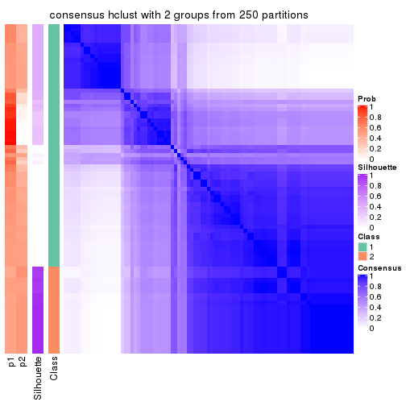</p>

</div>
<div id='tab-SD-hclust-consensus-heatmap-2'>
<pre><code class="r">consensus_heatmap(res, k = 3)
</code></pre>

<p></p>

</div>
<div id='tab-SD-hclust-consensus-heatmap-3'>
<pre><code class="r">consensus_heatmap(res, k = 4)
</code></pre>

<p></p>

</div>
<div id='tab-SD-hclust-consensus-heatmap-4'>
<pre><code class="r">consensus_heatmap(res, k = 5)
</code></pre>

<p></p>

</div>
<div id='tab-SD-hclust-consensus-heatmap-5'>
<pre><code class="r">consensus_heatmap(res, k = 6)
</code></pre>

<p></p>

</div>
</div>

Heatmaps for the membership of samples in all partitions to see how consistent they are:


<script>
$( function() {
	$( '#tabs-SD-hclust-membership-heatmap' ).tabs();
} );
</script>
<div id='tabs-SD-hclust-membership-heatmap'>
<ul>
<li><a href='#tab-SD-hclust-membership-heatmap-1'>k = 2</a></li>
<li><a href='#tab-SD-hclust-membership-heatmap-2'>k = 3</a></li>
<li><a href='#tab-SD-hclust-membership-heatmap-3'>k = 4</a></li>
<li><a href='#tab-SD-hclust-membership-heatmap-4'>k = 5</a></li>
<li><a href='#tab-SD-hclust-membership-heatmap-5'>k = 6</a></li>
</ul>
<div id='tab-SD-hclust-membership-heatmap-1'>
<pre><code class="r">membership_heatmap(res, k = 2)
</code></pre>

<p></p>

</div>
<div id='tab-SD-hclust-membership-heatmap-2'>
<pre><code class="r">membership_heatmap(res, k = 3)
</code></pre>

<p></p>

</div>
<div id='tab-SD-hclust-membership-heatmap-3'>
<pre><code class="r">membership_heatmap(res, k = 4)
</code></pre>

<p></p>

</div>
<div id='tab-SD-hclust-membership-heatmap-4'>
<pre><code class="r">membership_heatmap(res, k = 5)
</code></pre>

<p>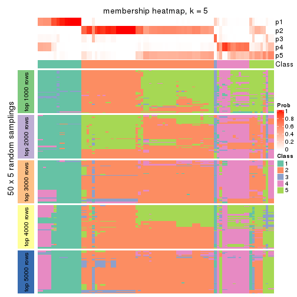</p>

</div>
<div id='tab-SD-hclust-membership-heatmap-5'>
<pre><code class="r">membership_heatmap(res, k = 6)
</code></pre>

<p></p>

</div>
</div>

As soon as we have had the classes for columns, we can look for signatures
which are significantly different between classes which can be candidate marks
for certain classes. Following are the heatmaps for signatures.


Signature heatmaps where rows are scaled:


<script>
$( function() {
	$( '#tabs-SD-hclust-get-signatures' ).tabs();
} );
</script>
<div id='tabs-SD-hclust-get-signatures'>
<ul>
<li><a href='#tab-SD-hclust-get-signatures-1'>k = 2</a></li>
<li><a href='#tab-SD-hclust-get-signatures-2'>k = 3</a></li>
<li><a href='#tab-SD-hclust-get-signatures-3'>k = 4</a></li>
<li><a href='#tab-SD-hclust-get-signatures-4'>k = 5</a></li>
<li><a href='#tab-SD-hclust-get-signatures-5'>k = 6</a></li>
</ul>
<div id='tab-SD-hclust-get-signatures-1'>
<pre><code class="r">get_signatures(res, k = 2)
</code></pre>

<p></p>

</div>
<div id='tab-SD-hclust-get-signatures-2'>
<pre><code class="r">get_signatures(res, k = 3)
</code></pre>

<p></p>

</div>
<div id='tab-SD-hclust-get-signatures-3'>
<pre><code class="r">get_signatures(res, k = 4)
</code></pre>

<p></p>

</div>
<div id='tab-SD-hclust-get-signatures-4'>
<pre><code class="r">get_signatures(res, k = 5)
</code></pre>

<p></p>

</div>
<div id='tab-SD-hclust-get-signatures-5'>
<pre><code class="r">get_signatures(res, k = 6)
</code></pre>

<p></p>

</div>
</div>


Signature heatmaps where rows are not scaled:


<script>
$( function() {
	$( '#tabs-SD-hclust-get-signatures-no-scale' ).tabs();
} );
</script>
<div id='tabs-SD-hclust-get-signatures-no-scale'>
<ul>
<li><a href='#tab-SD-hclust-get-signatures-no-scale-1'>k = 2</a></li>
<li><a href='#tab-SD-hclust-get-signatures-no-scale-2'>k = 3</a></li>
<li><a href='#tab-SD-hclust-get-signatures-no-scale-3'>k = 4</a></li>
<li><a href='#tab-SD-hclust-get-signatures-no-scale-4'>k = 5</a></li>
<li><a href='#tab-SD-hclust-get-signatures-no-scale-5'>k = 6</a></li>
</ul>
<div id='tab-SD-hclust-get-signatures-no-scale-1'>
<pre><code class="r">get_signatures(res, k = 2, scale_rows = FALSE)
</code></pre>

<p></p>

</div>
<div id='tab-SD-hclust-get-signatures-no-scale-2'>
<pre><code class="r">get_signatures(res, k = 3, scale_rows = FALSE)
</code></pre>

<p></p>

</div>
<div id='tab-SD-hclust-get-signatures-no-scale-3'>
<pre><code class="r">get_signatures(res, k = 4, scale_rows = FALSE)
</code></pre>

<p></p>

</div>
<div id='tab-SD-hclust-get-signatures-no-scale-4'>
<pre><code class="r">get_signatures(res, k = 5, scale_rows = FALSE)
</code></pre>

<p></p>

</div>
<div id='tab-SD-hclust-get-signatures-no-scale-5'>
<pre><code class="r">get_signatures(res, k = 6, scale_rows = FALSE)
</code></pre>

<p></p>

</div>
</div>


Compare the overlap of signatures from different k:

```r
compare_signatures(res)
```


`get_signature()` returns a data frame invisibly. TO get the list of signatures, the function
call should be assigned to a variable explicitly. In following code, if `plot` argument is set
to `FALSE`, no heatmap is plotted while only the differential analysis is performed.

```r
# code only for demonstration
tb = get_signature(res, k = ..., plot = FALSE)
```

An example of the output of `tb` is:

```
#>   which_row         fdr    mean_1    mean_2 scaled_mean_1 scaled_mean_2 km
#> 1        38 0.042760348  8.373488  9.131774    -0.5533452     0.5164555  1
#> 2        40 0.018707592  7.106213  8.469186    -0.6173731     0.5762149  1
#> 3        55 0.019134737 10.221463 11.207825    -0.6159697     0.5749050  1
#> 4        59 0.006059896  5.921854  7.869574    -0.6899429     0.6439467  1
#> 5        60 0.018055526  8.928898 10.211722    -0.6204761     0.5791110  1
#> 6        98 0.009384629 15.714769 14.887706     0.6635654    -0.6193277  2
...
```

The columns in `tb` are:

1. `which_row`: row indices corresponding to the input matrix.
2. `fdr`: FDR for the differential test. 
3. `mean_x`: The mean value in group x.
4. `scaled_mean_x`: The mean value in group x after rows are scaled.
5. `km`: Row groups if k-means clustering is applied to rows.


UMAP plot which shows how samples are separated.


<script>
$( function() {
	$( '#tabs-SD-hclust-dimension-reduction' ).tabs();
} );
</script>
<div id='tabs-SD-hclust-dimension-reduction'>
<ul>
<li><a href='#tab-SD-hclust-dimension-reduction-1'>k = 2</a></li>
<li><a href='#tab-SD-hclust-dimension-reduction-2'>k = 3</a></li>
<li><a href='#tab-SD-hclust-dimension-reduction-3'>k = 4</a></li>
<li><a href='#tab-SD-hclust-dimension-reduction-4'>k = 5</a></li>
<li><a href='#tab-SD-hclust-dimension-reduction-5'>k = 6</a></li>
</ul>
<div id='tab-SD-hclust-dimension-reduction-1'>
<pre><code class="r">dimension_reduction(res, k = 2, method = &quot;UMAP&quot;)
</code></pre>

<p></p>

</div>
<div id='tab-SD-hclust-dimension-reduction-2'>
<pre><code class="r">dimension_reduction(res, k = 3, method = &quot;UMAP&quot;)
</code></pre>

<p></p>

</div>
<div id='tab-SD-hclust-dimension-reduction-3'>
<pre><code class="r">dimension_reduction(res, k = 4, method = &quot;UMAP&quot;)
</code></pre>

<p></p>

</div>
<div id='tab-SD-hclust-dimension-reduction-4'>
<pre><code class="r">dimension_reduction(res, k = 5, method = &quot;UMAP&quot;)
</code></pre>

<p></p>

</div>
<div id='tab-SD-hclust-dimension-reduction-5'>
<pre><code class="r">dimension_reduction(res, k = 6, method = &quot;UMAP&quot;)
</code></pre>

<p></p>

</div>
</div>


Following heatmap shows how subgroups are split when increasing `k`:

```r
collect_classes(res)
```


If matrix rows can be associated to genes, consider to use `functional_enrichment(res,
...)` to perform function enrichment for the signature genes. See [this vignette](http://bioconductor.org/packages/devel/bioc/vignettes/cola/inst/doc/functional_enrichment.html) for more detailed explanations.


 

---------------------------------------------------


### SD:kmeans**


The object with results only for a single top-value method and a single partition method 
can be extracted as:

```r
res = res_list["SD", "kmeans"]
# you can also extract it by
# res = res_list["SD:kmeans"]
```

A summary of `res` and all the functions that can be applied to it:

```r
res
```

```
#> A 'ConsensusPartition' object with k = 2, 3, 4, 5, 6.
#>   On a matrix with 17471 rows and 87 columns.
#>   Top rows (1000, 2000, 3000, 4000, 5000) are extracted by 'SD' method.
#>   Subgroups are detected by 'kmeans' method.
#>   Performed in total 1250 partitions by row resampling.
#>   Best k for subgroups seems to be 2.
#> 
#> Following methods can be applied to this 'ConsensusPartition' object:
#>  [1] "cola_report"             "collect_classes"         "collect_plots"          
#>  [4] "collect_stats"           "colnames"                "compare_signatures"     
#>  [7] "consensus_heatmap"       "dimension_reduction"     "functional_enrichment"  
#> [10] "get_anno_col"            "get_anno"                "get_classes"            
#> [13] "get_consensus"           "get_matrix"              "get_membership"         
#> [16] "get_param"               "get_signatures"          "get_stats"              
#> [19] "is_best_k"               "is_stable_k"             "membership_heatmap"     
#> [22] "ncol"                    "nrow"                    "plot_ecdf"              
#> [25] "rownames"                "select_partition_number" "show"                   
#> [28] "suggest_best_k"          "test_to_known_factors"
```

`collect_plots()` function collects all the plots made from `res` for all `k` (number of partitions)
into one single page to provide an easy and fast comparison between different `k`.

```r
collect_plots(res)
```


The plots are:

- The first row: a plot of the ECDF (empirical cumulative distribution
  function) curves of the consensus matrix for each `k` and the heatmap of
  predicted classes for each `k`.
- The second row: heatmaps of the consensus matrix for each `k`.
- The third row: heatmaps of the membership matrix for each `k`.
- The fouth row: heatmaps of the signatures for each `k`.

All the plots in panels can be made by individual functions and they are
plotted later in this section.

`select_partition_number()` produces several plots showing different
statistics for choosing "optimized" `k`. There are following statistics:

- ECDF curves of the consensus matrix for each `k`;
- 1-PAC. [The PAC
  score](https://en.wikipedia.org/wiki/Consensus_clustering#Over-interpretation_potential_of_consensus_clustering)
  measures the proportion of the ambiguous subgrouping.
- Mean silhouette score.
- Concordance. The mean probability of fiting the consensus class ids in all
  partitions.
- Area increased. Denote $A_k$ as the area under the ECDF curve for current
  `k`, the area increased is defined as $A_k - A_{k-1}$.
- Rand index. The percent of pairs of samples that are both in a same cluster
  or both are not in a same cluster in the partition of k and k-1.
- Jaccard index. The ratio of pairs of samples are both in a same cluster in
  the partition of k and k-1 and the pairs of samples are both in a same
  cluster in the partition k or k-1.

The detailed explanations of these statistics can be found in [the _cola_
vignette](http://bioconductor.org/packages/devel/bioc/vignettes/cola/inst/doc/cola.html#toc_13).

Generally speaking, lower PAC score, higher mean silhouette score or higher
concordance corresponds to better partition. Rand index and Jaccard index
measure how similar the current partition is compared to partition with `k-1`.
If they are too similar, we won't accept `k` is better than `k-1`.

```r
select_partition_number(res)
```


The numeric values for all these statistics can be obtained by `get_stats()`.

```r
get_stats(res)
```

```
#>   k 1-PAC mean_silhouette concordance area_increased  Rand Jaccard
#> 2 2 1.000           0.976       0.990         0.4928 0.509   0.509
#> 3 3 0.528           0.695       0.813         0.2931 0.638   0.410
#> 4 4 0.878           0.886       0.910         0.1467 0.823   0.555
#> 5 5 0.761           0.618       0.829         0.0736 0.957   0.841
#> 6 6 0.744           0.671       0.791         0.0448 0.908   0.643
```

`suggest_best_k()` suggests the best $k$ based on these statistics. The rules are as follows:

- All $k$ with Jaccard index larger than 0.95 are removed because increasing
  $k$ does not provide enough extra information. If all $k$ are removed, it is
  marked as no subgroup is detected.
- For all $k$ with 1-PAC score larger than 0.9, the maximal $k$ is taken as
  the best $k$, and other $k$ are marked as optional $k$.
- If it does not fit the second rule. The $k$ with the maximal vote of the
  highest 1-PAC score, highest mean silhouette, and highest concordance is
  taken as the best $k$.

```r
suggest_best_k(res)
```

```
#> [1] 2
```


Following shows the table of the partitions (You need to click the **show/hide
code output** link to see it). The membership matrix (columns with name `p*`)
is inferred by
[`clue::cl_consensus()`](https://www.rdocumentation.org/link/cl_consensus?package=clue)
function with the `SE` method. Basically the value in the membership matrix
represents the probability to belong to a certain group. The finall class
label for an item is determined with the group with highest probability it
belongs to.

In `get_classes()` function, the entropy is calculated from the membership
matrix and the silhouette score is calculated from the consensus matrix.


<script>
$( function() {
	$( '#tabs-SD-kmeans-get-classes' ).tabs();
} );
</script>
<div id='tabs-SD-kmeans-get-classes'>
<ul>
<li><a href='#tab-SD-kmeans-get-classes-1'>k = 2</a></li>
<li><a href='#tab-SD-kmeans-get-classes-2'>k = 3</a></li>
<li><a href='#tab-SD-kmeans-get-classes-3'>k = 4</a></li>
<li><a href='#tab-SD-kmeans-get-classes-4'>k = 5</a></li>
<li><a href='#tab-SD-kmeans-get-classes-5'>k = 6</a></li>
</ul>

<div id='tab-SD-kmeans-get-classes-1'>
<p><a id='tab-SD-kmeans-get-classes-1-a' style='color:#0366d6' href='#'>show/hide code output</a></p>
<pre><code class="r">cbind(get_classes(res, k = 2), get_membership(res, k = 2))
</code></pre>

<pre><code>#&gt;                                      class entropy silhouette    p1    p2
#&gt; E6088A41-B0DC-4FBF-8D14-BE78024CF8CD     2  0.0000      0.986 0.000 1.000
#&gt; F569915C-8F77-4D67-9730-30824DB57EE5     2  0.0000      0.986 0.000 1.000
#&gt; E3B71CB7-673B-4741-8607-4F0A11633036     1  0.0000      0.993 1.000 0.000
#&gt; DAF84798-FE3F-403C-B589-7F256AF752BE     1  0.0376      0.992 0.996 0.004
#&gt; 2F38E3B1-4975-4877-9DCC-C00270602180     1  0.0000      0.993 1.000 0.000
#&gt; C79A4C2F-02C4-4C03-A5A5-DE06802EEB57     2  0.0000      0.986 0.000 1.000
#&gt; 92E3ED8F-5C74-4ED2-9B03-9FA5E7B491D6     1  0.0000      0.993 1.000 0.000
#&gt; E61D60BE-3BD3-4B5E-BC12-80F3684A0959     1  0.0376      0.992 0.996 0.004
#&gt; C9388FC7-DB1D-4416-BC2D-EA643584F1E6     2  0.0000      0.986 0.000 1.000
#&gt; D4219360-6344-4AF3-ACEB-1701A9F1F67D     1  0.0000      0.993 1.000 0.000
#&gt; 07D155E6-F27C-4D09-B786-8A9B71147B72     1  0.0000      0.993 1.000 0.000
#&gt; 10C8C361-85A5-40E8-A395-B92623E6F27C     1  0.0000      0.993 1.000 0.000
#&gt; BDF20891-7C98-4A55-BBF3-8A836BE303C6     2  0.0000      0.986 0.000 1.000
#&gt; 694B0504-095E-431A-84F2-B4387072138E     1  0.0000      0.993 1.000 0.000
#&gt; EDCF8E7F-8B1D-46F7-8AE0-84A1DC9647D2     2  0.0000      0.986 0.000 1.000
#&gt; 0EA8288E-824D-4304-A053-5A833361F5C5     1  0.0376      0.992 0.996 0.004
#&gt; C4ACCFA1-34A9-4F61-8A1F-35B3B60EA193     1  0.0000      0.993 1.000 0.000
#&gt; 760BA639-38AC-4BC9-9647-09F6893EA8ED     1  0.0000      0.993 1.000 0.000
#&gt; 082DFC6B-C6E6-48B9-BDE5-74FF3B3DC954     2  0.0000      0.986 0.000 1.000
#&gt; FE349848-D7C4-4C49-B670-0E20454DDD7E     2  0.0000      0.986 0.000 1.000
#&gt; 2E8937B3-9EA1-4528-8CEE-BF3D4137908A     2  0.0000      0.986 0.000 1.000
#&gt; 9942D04E-2767-4E39-BA16-7762EAC3DFC4     2  0.0000      0.986 0.000 1.000
#&gt; F9C23182-91C4-4145-AE52-526FE8EB199D     2  0.0000      0.986 0.000 1.000
#&gt; 01024EED-7811-4E24-A067-8E0B978FFE2D     2  0.0000      0.986 0.000 1.000
#&gt; 932C8E98-A352-409C-8744-3D49FABCE425     1  0.0000      0.993 1.000 0.000
#&gt; 6DFD9439-C659-4936-84E5-108F717E3E4D     2  0.0000      0.986 0.000 1.000
#&gt; 1D8B83B8-5DD7-4F45-9D59-487EC6906A8B     2  0.0000      0.986 0.000 1.000
#&gt; 804B8503-73F6-42DE-835F-39DE2C9F13E1     2  0.0000      0.986 0.000 1.000
#&gt; B9453C9B-84D5-43BD-85BB-1780F02F039C     1  0.0000      0.993 1.000 0.000
#&gt; 836E6CD6-4E88-4028-9844-FA3C892C254A     1  0.0376      0.992 0.996 0.004
#&gt; 36EDD202-A845-4CE7-95D5-A515C471262E     2  0.0000      0.986 0.000 1.000
#&gt; 181C156A-B8F4-4F9D-93AA-6AFBD197644D     2  0.0000      0.986 0.000 1.000
#&gt; 0580E798-6A98-4E46-AC96-9A869DFF502E     1  0.0000      0.993 1.000 0.000
#&gt; EA1B63CF-D389-4567-8D9E-B0EF1F804598     2  0.7674      0.712 0.224 0.776
#&gt; 5ABC3D06-B8E9-4831-B89B-7C1EC4006B47     2  0.0000      0.986 0.000 1.000
#&gt; 1CC01E74-A7C1-4A51-9E28-1703C352BE16     2  0.0000      0.986 0.000 1.000
#&gt; 97E55B75-DBDB-46BC-9E74-7828C070BF16     2  0.0000      0.986 0.000 1.000
#&gt; BEB37A2D-E8B0-4674-89AC-DC0F34E0AFD6     1  0.0000      0.993 1.000 0.000
#&gt; 558648BA-6551-4D34-97C2-AD5F677D63FB     1  0.0376      0.992 0.996 0.004
#&gt; FF7021BB-414B-4466-BC43-372D856E6A1D     2  0.0000      0.986 0.000 1.000
#&gt; 9C04B840-54E0-425D-BDBE-8CB6B9C2C722     2  0.0000      0.986 0.000 1.000
#&gt; 5F50B1F4-1A02-4506-AA6D-9BF21CD8059A     1  0.6801      0.777 0.820 0.180
#&gt; 7D4B8FF3-7977-4ABD-AE04-EED1C50B23CC     2  0.0000      0.986 0.000 1.000
#&gt; A005AF15-B98E-4623-8AD4-1E69EFA9BC7A     1  0.0000      0.993 1.000 0.000
#&gt; 1DF04345-5C93-4B18-B307-8D1FCA532999     2  0.0000      0.986 0.000 1.000
#&gt; 6AF30C18-347E-41ED-A4AB-6F81F42206C5     1  0.0000      0.993 1.000 0.000
#&gt; 88A44ED0-BDE1-401E-B0E1-D8C8D6DBAEFC     2  0.0000      0.986 0.000 1.000
#&gt; 117673A3-2918-4702-8583-B66ADE6E4338     2  0.0000      0.986 0.000 1.000
#&gt; 4903A571-E14D-43C9-A737-22CAFAC414CD     2  0.3274      0.929 0.060 0.940
#&gt; C175E68E-632A-4B4A-9DDB-4895C4760F20     1  0.0000      0.993 1.000 0.000
#&gt; FA5CA2F4-A1AD-4A79-B8F3-73A976EB2FB1     2  0.0000      0.986 0.000 1.000
#&gt; E1F883A7-8B1F-4C1D-8A1A-9749A9C09845     2  0.0000      0.986 0.000 1.000
#&gt; E74F0729-6000-4908-ADB0-7BDBAC0639E6     1  0.0000      0.993 1.000 0.000
#&gt; F92135A9-1981-4C79-99A5-4243EEC5D30D     2  0.0000      0.986 0.000 1.000
#&gt; 73C6919F-DEB4-4DA4-B4AE-4032AC8F96C5     1  0.0000      0.993 1.000 0.000
#&gt; 33977B40-2E92-48B6-8D3A-3EBE913F6F8A     1  0.0376      0.992 0.996 0.004
#&gt; 490BD607-2F08-4B4C-9612-F9BB5CBBC8BB     2  0.0000      0.986 0.000 1.000
#&gt; 6C666E17-2EB8-4244-BCC1-8DD34EE4173E     2  0.0000      0.986 0.000 1.000
#&gt; C41F3064-4483-4796-B860-82155BAA5157     1  0.0000      0.993 1.000 0.000
#&gt; F4232B90-51B9-43EE-9971-35B3A318758F     1  0.0000      0.993 1.000 0.000
#&gt; 291EA1F6-FC56-4429-A433-0C452A6A514C     2  0.0000      0.986 0.000 1.000
#&gt; CC4AF04D-CB8E-40DD-B12E-7AA39B38262A     2  0.0000      0.986 0.000 1.000
#&gt; 4DAE26B9-AB57-4763-BB9A-2ADDD5D9C007     1  0.0376      0.992 0.996 0.004
#&gt; 676B4AEE-FB41-4C16-AA91-03E4A1DA8E26     2  0.9358      0.458 0.352 0.648
#&gt; 1CC36859-357A-49E0-A367-4F57D47288BA     2  0.2236      0.953 0.036 0.964
#&gt; 7CCDDFC8-6DF6-4734-96AC-19EBC464FC50     2  0.0000      0.986 0.000 1.000
#&gt; 10F38C34-3956-48ED-AB62-3439EF00D46B     2  0.0000      0.986 0.000 1.000
#&gt; 80B2B393-9D6E-45B4-B696-2A5C203543B7     2  0.0000      0.986 0.000 1.000
#&gt; 5AC7B5EA-1AAC-4529-8E5A-F612E5E0719A     1  0.0376      0.992 0.996 0.004
#&gt; 3648E98D-4B3A-41B7-BE05-595D44F0150D     1  0.0000      0.993 1.000 0.000
#&gt; 252EC850-6026-473B-8FFC-2CF567EF42E4     1  0.0376      0.992 0.996 0.004
#&gt; 1790E7A3-99D8-447E-BC50-51C8A4A18853     2  0.0000      0.986 0.000 1.000
#&gt; DA61A4F8-350B-4DD1-A240-AD016520DB5B     2  0.0000      0.986 0.000 1.000
#&gt; 767E5BAF-2515-40D7-AE7D-0B24D77A03F4     2  0.0000      0.986 0.000 1.000
#&gt; 8CB9C903-D749-44EA-9137-7FB5A92C5932     1  0.0000      0.993 1.000 0.000
#&gt; A9B968AE-2243-41BC-852A-3A12C1FB4892     1  0.0376      0.992 0.996 0.004
#&gt; 3C582264-85BC-4569-A888-8EB3008E5198     2  0.0000      0.986 0.000 1.000
#&gt; F4EAF9A2-9938-4D9B-9080-C0A7542D5704     2  0.0000      0.986 0.000 1.000
#&gt; 328499D3-45DD-4B66-BD22-3C52BA92C2BB     1  0.0000      0.993 1.000 0.000
#&gt; AF8AB83D-2917-4752-8C38-CF84C565B565     1  0.0376      0.992 0.996 0.004
#&gt; 03A327CA-A9FE-42A4-844D-CA85206969FC     2  0.0000      0.986 0.000 1.000
#&gt; 4B0BEC44-87BB-4014-9A26-3529DD63760B     2  0.0000      0.986 0.000 1.000
#&gt; 05C7843E-DC89-4D8E-A78A-952C5DFD667B     2  0.0000      0.986 0.000 1.000
#&gt; 29A0FFF9-13D3-4D16-BE6A-8E48A2C4E315     2  0.0000      0.986 0.000 1.000
#&gt; 22947CC3-4F42-4F44-899C-2B7085E36C9D     2  0.0000      0.986 0.000 1.000
#&gt; A247D92D-253A-4BEC-B450-184AF90D17D0     2  0.0000      0.986 0.000 1.000
#&gt; 0D907A63-D23F-4684-80D9-0BA552435B86     1  0.0376      0.992 0.996 0.004
</code></pre>

<script>
$('#tab-SD-kmeans-get-classes-1-a').parent().next().next().hide();
$('#tab-SD-kmeans-get-classes-1-a').click(function(){
  $('#tab-SD-kmeans-get-classes-1-a').parent().next().next().toggle();
  return(false);
});
</script>
</div>

<div id='tab-SD-kmeans-get-classes-2'>
<p><a id='tab-SD-kmeans-get-classes-2-a' style='color:#0366d6' href='#'>show/hide code output</a></p>
<pre><code class="r">cbind(get_classes(res, k = 3), get_membership(res, k = 3))
</code></pre>

<pre><code>#&gt;                                      class entropy silhouette    p1    p2    p3
#&gt; E6088A41-B0DC-4FBF-8D14-BE78024CF8CD     3  0.5431     0.6496 0.000 0.284 0.716
#&gt; F569915C-8F77-4D67-9730-30824DB57EE5     3  0.5178     0.6872 0.000 0.256 0.744
#&gt; E3B71CB7-673B-4741-8607-4F0A11633036     1  0.0000     0.8825 1.000 0.000 0.000
#&gt; DAF84798-FE3F-403C-B589-7F256AF752BE     3  0.6529     0.4392 0.368 0.012 0.620
#&gt; 2F38E3B1-4975-4877-9DCC-C00270602180     1  0.3412     0.8385 0.876 0.000 0.124
#&gt; C79A4C2F-02C4-4C03-A5A5-DE06802EEB57     3  0.5216     0.6857 0.000 0.260 0.740
#&gt; 92E3ED8F-5C74-4ED2-9B03-9FA5E7B491D6     1  0.0237     0.8817 0.996 0.000 0.004
#&gt; E61D60BE-3BD3-4B5E-BC12-80F3684A0959     3  0.5591     0.2896 0.304 0.000 0.696
#&gt; C9388FC7-DB1D-4416-BC2D-EA643584F1E6     3  0.4887     0.6978 0.000 0.228 0.772
#&gt; D4219360-6344-4AF3-ACEB-1701A9F1F67D     1  0.0000     0.8825 1.000 0.000 0.000
#&gt; 07D155E6-F27C-4D09-B786-8A9B71147B72     1  0.5968     0.6476 0.636 0.000 0.364
#&gt; 10C8C361-85A5-40E8-A395-B92623E6F27C     1  0.0000     0.8825 1.000 0.000 0.000
#&gt; BDF20891-7C98-4A55-BBF3-8A836BE303C6     2  0.4974     0.5824 0.000 0.764 0.236
#&gt; 694B0504-095E-431A-84F2-B4387072138E     1  0.0237     0.8817 0.996 0.000 0.004
#&gt; EDCF8E7F-8B1D-46F7-8AE0-84A1DC9647D2     3  0.5591     0.6380 0.000 0.304 0.696
#&gt; 0EA8288E-824D-4304-A053-5A833361F5C5     3  0.4291     0.4711 0.180 0.000 0.820
#&gt; C4ACCFA1-34A9-4F61-8A1F-35B3B60EA193     1  0.0237     0.8817 0.996 0.000 0.004
#&gt; 760BA639-38AC-4BC9-9647-09F6893EA8ED     1  0.0237     0.8817 0.996 0.000 0.004
#&gt; 082DFC6B-C6E6-48B9-BDE5-74FF3B3DC954     3  0.5621     0.6349 0.000 0.308 0.692
#&gt; FE349848-D7C4-4C49-B670-0E20454DDD7E     3  0.3619     0.6902 0.000 0.136 0.864
#&gt; 2E8937B3-9EA1-4528-8CEE-BF3D4137908A     2  0.0000     0.9201 0.000 1.000 0.000
#&gt; 9942D04E-2767-4E39-BA16-7762EAC3DFC4     2  0.0747     0.9112 0.000 0.984 0.016
#&gt; F9C23182-91C4-4145-AE52-526FE8EB199D     2  0.6252     0.0224 0.000 0.556 0.444
#&gt; 01024EED-7811-4E24-A067-8E0B978FFE2D     2  0.0000     0.9201 0.000 1.000 0.000
#&gt; 932C8E98-A352-409C-8744-3D49FABCE425     1  0.0237     0.8817 0.996 0.000 0.004
#&gt; 6DFD9439-C659-4936-84E5-108F717E3E4D     3  0.5016     0.6946 0.000 0.240 0.760
#&gt; 1D8B83B8-5DD7-4F45-9D59-487EC6906A8B     3  0.6026     0.5197 0.000 0.376 0.624
#&gt; 804B8503-73F6-42DE-835F-39DE2C9F13E1     2  0.0000     0.9201 0.000 1.000 0.000
#&gt; B9453C9B-84D5-43BD-85BB-1780F02F039C     1  0.0000     0.8825 1.000 0.000 0.000
#&gt; 836E6CD6-4E88-4028-9844-FA3C892C254A     3  0.5529     0.5028 0.296 0.000 0.704
#&gt; 36EDD202-A845-4CE7-95D5-A515C471262E     2  0.0237     0.9176 0.000 0.996 0.004
#&gt; 181C156A-B8F4-4F9D-93AA-6AFBD197644D     2  0.0000     0.9201 0.000 1.000 0.000
#&gt; 0580E798-6A98-4E46-AC96-9A869DFF502E     1  0.5968     0.6476 0.636 0.000 0.364
#&gt; EA1B63CF-D389-4567-8D9E-B0EF1F804598     3  0.7872     0.5417 0.296 0.084 0.620
#&gt; 5ABC3D06-B8E9-4831-B89B-7C1EC4006B47     2  0.0747     0.9112 0.000 0.984 0.016
#&gt; 1CC01E74-A7C1-4A51-9E28-1703C352BE16     2  0.0592     0.9138 0.000 0.988 0.012
#&gt; 97E55B75-DBDB-46BC-9E74-7828C070BF16     2  0.0592     0.9138 0.000 0.988 0.012
#&gt; BEB37A2D-E8B0-4674-89AC-DC0F34E0AFD6     3  0.5591     0.2896 0.304 0.000 0.696
#&gt; 558648BA-6551-4D34-97C2-AD5F677D63FB     3  0.6140     0.2463 0.404 0.000 0.596
#&gt; FF7021BB-414B-4466-BC43-372D856E6A1D     3  0.4796     0.6967 0.000 0.220 0.780
#&gt; 9C04B840-54E0-425D-BDBE-8CB6B9C2C722     2  0.4842     0.6231 0.000 0.776 0.224
#&gt; 5F50B1F4-1A02-4506-AA6D-9BF21CD8059A     3  0.1031     0.6267 0.024 0.000 0.976
#&gt; 7D4B8FF3-7977-4ABD-AE04-EED1C50B23CC     3  0.6008     0.5240 0.000 0.372 0.628
#&gt; A005AF15-B98E-4623-8AD4-1E69EFA9BC7A     3  0.5591     0.2896 0.304 0.000 0.696
#&gt; 1DF04345-5C93-4B18-B307-8D1FCA532999     2  0.0000     0.9201 0.000 1.000 0.000
#&gt; 6AF30C18-347E-41ED-A4AB-6F81F42206C5     1  0.5706     0.7064 0.680 0.000 0.320
#&gt; 88A44ED0-BDE1-401E-B0E1-D8C8D6DBAEFC     3  0.5785     0.5992 0.000 0.332 0.668
#&gt; 117673A3-2918-4702-8583-B66ADE6E4338     2  0.6235     0.0531 0.000 0.564 0.436
#&gt; 4903A571-E14D-43C9-A737-22CAFAC414CD     3  0.4555     0.6994 0.000 0.200 0.800
#&gt; C175E68E-632A-4B4A-9DDB-4895C4760F20     1  0.0237     0.8817 0.996 0.000 0.004
#&gt; FA5CA2F4-A1AD-4A79-B8F3-73A976EB2FB1     2  0.0892     0.9043 0.000 0.980 0.020
#&gt; E1F883A7-8B1F-4C1D-8A1A-9749A9C09845     2  0.0000     0.9201 0.000 1.000 0.000
#&gt; E74F0729-6000-4908-ADB0-7BDBAC0639E6     1  0.3192     0.8440 0.888 0.000 0.112
#&gt; F92135A9-1981-4C79-99A5-4243EEC5D30D     2  0.0000     0.9201 0.000 1.000 0.000
#&gt; 73C6919F-DEB4-4DA4-B4AE-4032AC8F96C5     1  0.5216     0.7574 0.740 0.000 0.260
#&gt; 33977B40-2E92-48B6-8D3A-3EBE913F6F8A     3  0.1031     0.6256 0.024 0.000 0.976
#&gt; 490BD607-2F08-4B4C-9612-F9BB5CBBC8BB     3  0.5216     0.6857 0.000 0.260 0.740
#&gt; 6C666E17-2EB8-4244-BCC1-8DD34EE4173E     3  0.5216     0.6857 0.000 0.260 0.740
#&gt; C41F3064-4483-4796-B860-82155BAA5157     1  0.5785     0.6916 0.668 0.000 0.332
#&gt; F4232B90-51B9-43EE-9971-35B3A318758F     1  0.5810     0.6879 0.664 0.000 0.336
#&gt; 291EA1F6-FC56-4429-A433-0C452A6A514C     2  0.0000     0.9201 0.000 1.000 0.000
#&gt; CC4AF04D-CB8E-40DD-B12E-7AA39B38262A     2  0.0747     0.9112 0.000 0.984 0.016
#&gt; 4DAE26B9-AB57-4763-BB9A-2ADDD5D9C007     3  0.5529     0.3074 0.296 0.000 0.704
#&gt; 676B4AEE-FB41-4C16-AA91-03E4A1DA8E26     3  0.8033     0.4457 0.120 0.240 0.640
#&gt; 1CC36859-357A-49E0-A367-4F57D47288BA     3  0.5365     0.6891 0.004 0.252 0.744
#&gt; 7CCDDFC8-6DF6-4734-96AC-19EBC464FC50     2  0.0000     0.9201 0.000 1.000 0.000
#&gt; 10F38C34-3956-48ED-AB62-3439EF00D46B     3  0.4452     0.6979 0.000 0.192 0.808
#&gt; 80B2B393-9D6E-45B4-B696-2A5C203543B7     2  0.0000     0.9201 0.000 1.000 0.000
#&gt; 5AC7B5EA-1AAC-4529-8E5A-F612E5E0719A     3  0.5397     0.3190 0.280 0.000 0.720
#&gt; 3648E98D-4B3A-41B7-BE05-595D44F0150D     1  0.0000     0.8825 1.000 0.000 0.000
#&gt; 252EC850-6026-473B-8FFC-2CF567EF42E4     3  0.5397     0.3375 0.280 0.000 0.720
#&gt; 1790E7A3-99D8-447E-BC50-51C8A4A18853     2  0.0000     0.9201 0.000 1.000 0.000
#&gt; DA61A4F8-350B-4DD1-A240-AD016520DB5B     3  0.5178     0.6872 0.000 0.256 0.744
#&gt; 767E5BAF-2515-40D7-AE7D-0B24D77A03F4     3  0.4887     0.6976 0.000 0.228 0.772
#&gt; 8CB9C903-D749-44EA-9137-7FB5A92C5932     1  0.0747     0.8727 0.984 0.000 0.016
#&gt; A9B968AE-2243-41BC-852A-3A12C1FB4892     3  0.5591     0.2896 0.304 0.000 0.696
#&gt; 3C582264-85BC-4569-A888-8EB3008E5198     2  0.0000     0.9201 0.000 1.000 0.000
#&gt; F4EAF9A2-9938-4D9B-9080-C0A7542D5704     2  0.0747     0.9112 0.000 0.984 0.016
#&gt; 328499D3-45DD-4B66-BD22-3C52BA92C2BB     1  0.0000     0.8825 1.000 0.000 0.000
#&gt; AF8AB83D-2917-4752-8C38-CF84C565B565     3  0.5431     0.3304 0.284 0.000 0.716
#&gt; 03A327CA-A9FE-42A4-844D-CA85206969FC     3  0.5327     0.6756 0.000 0.272 0.728
#&gt; 4B0BEC44-87BB-4014-9A26-3529DD63760B     3  0.4842     0.6983 0.000 0.224 0.776
#&gt; 05C7843E-DC89-4D8E-A78A-952C5DFD667B     3  0.4974     0.6957 0.000 0.236 0.764
#&gt; 29A0FFF9-13D3-4D16-BE6A-8E48A2C4E315     2  0.0000     0.9201 0.000 1.000 0.000
#&gt; 22947CC3-4F42-4F44-899C-2B7085E36C9D     3  0.5591     0.6380 0.000 0.304 0.696
#&gt; A247D92D-253A-4BEC-B450-184AF90D17D0     3  0.5254     0.6827 0.000 0.264 0.736
#&gt; 0D907A63-D23F-4684-80D9-0BA552435B86     3  0.5497     0.3157 0.292 0.000 0.708
</code></pre>

<script>
$('#tab-SD-kmeans-get-classes-2-a').parent().next().next().hide();
$('#tab-SD-kmeans-get-classes-2-a').click(function(){
  $('#tab-SD-kmeans-get-classes-2-a').parent().next().next().toggle();
  return(false);
});
</script>
</div>

<div id='tab-SD-kmeans-get-classes-3'>
<p><a id='tab-SD-kmeans-get-classes-3-a' style='color:#0366d6' href='#'>show/hide code output</a></p>
<pre><code class="r">cbind(get_classes(res, k = 4), get_membership(res, k = 4))
</code></pre>

<pre><code>#&gt;                                      class entropy silhouette    p1    p2    p3    p4
#&gt; E6088A41-B0DC-4FBF-8D14-BE78024CF8CD     3  0.2218      0.909 0.004 0.036 0.932 0.028
#&gt; F569915C-8F77-4D67-9730-30824DB57EE5     3  0.1114      0.922 0.004 0.008 0.972 0.016
#&gt; E3B71CB7-673B-4741-8607-4F0A11633036     1  0.1305      0.960 0.960 0.004 0.000 0.036
#&gt; DAF84798-FE3F-403C-B589-7F256AF752BE     3  0.3188      0.855 0.112 0.008 0.872 0.008
#&gt; 2F38E3B1-4975-4877-9DCC-C00270602180     1  0.4153      0.778 0.784 0.008 0.004 0.204
#&gt; C79A4C2F-02C4-4C03-A5A5-DE06802EEB57     3  0.1124      0.922 0.004 0.012 0.972 0.012
#&gt; 92E3ED8F-5C74-4ED2-9B03-9FA5E7B491D6     1  0.1396      0.960 0.960 0.004 0.004 0.032
#&gt; E61D60BE-3BD3-4B5E-BC12-80F3684A0959     4  0.2319      0.946 0.036 0.000 0.040 0.924
#&gt; C9388FC7-DB1D-4416-BC2D-EA643584F1E6     3  0.1724      0.919 0.020 0.000 0.948 0.032
#&gt; D4219360-6344-4AF3-ACEB-1701A9F1F67D     1  0.1305      0.960 0.960 0.004 0.000 0.036
#&gt; 07D155E6-F27C-4D09-B786-8A9B71147B72     4  0.2384      0.925 0.072 0.004 0.008 0.916
#&gt; 10C8C361-85A5-40E8-A395-B92623E6F27C     1  0.1822      0.952 0.944 0.004 0.008 0.044
#&gt; BDF20891-7C98-4A55-BBF3-8A836BE303C6     2  0.6016      0.129 0.016 0.504 0.464 0.016
#&gt; 694B0504-095E-431A-84F2-B4387072138E     1  0.1396      0.960 0.960 0.004 0.004 0.032
#&gt; EDCF8E7F-8B1D-46F7-8AE0-84A1DC9647D2     3  0.2089      0.910 0.020 0.028 0.940 0.012
#&gt; 0EA8288E-824D-4304-A053-5A833361F5C5     4  0.2207      0.915 0.004 0.024 0.040 0.932
#&gt; C4ACCFA1-34A9-4F61-8A1F-35B3B60EA193     1  0.1543      0.960 0.956 0.008 0.004 0.032
#&gt; 760BA639-38AC-4BC9-9647-09F6893EA8ED     1  0.1543      0.960 0.956 0.008 0.004 0.032
#&gt; 082DFC6B-C6E6-48B9-BDE5-74FF3B3DC954     3  0.1471      0.918 0.004 0.024 0.960 0.012
#&gt; FE349848-D7C4-4C49-B670-0E20454DDD7E     3  0.1118      0.918 0.000 0.000 0.964 0.036
#&gt; 2E8937B3-9EA1-4528-8CEE-BF3D4137908A     2  0.2256      0.933 0.000 0.924 0.056 0.020
#&gt; 9942D04E-2767-4E39-BA16-7762EAC3DFC4     2  0.3120      0.888 0.012 0.896 0.036 0.056
#&gt; F9C23182-91C4-4145-AE52-526FE8EB199D     3  0.2421      0.898 0.020 0.048 0.924 0.008
#&gt; 01024EED-7811-4E24-A067-8E0B978FFE2D     2  0.1807      0.935 0.000 0.940 0.052 0.008
#&gt; 932C8E98-A352-409C-8744-3D49FABCE425     1  0.1543      0.960 0.956 0.008 0.004 0.032
#&gt; 6DFD9439-C659-4936-84E5-108F717E3E4D     3  0.1520      0.917 0.024 0.000 0.956 0.020
#&gt; 1D8B83B8-5DD7-4F45-9D59-487EC6906A8B     3  0.1575      0.914 0.004 0.028 0.956 0.012
#&gt; 804B8503-73F6-42DE-835F-39DE2C9F13E1     2  0.1661      0.935 0.000 0.944 0.052 0.004
#&gt; B9453C9B-84D5-43BD-85BB-1780F02F039C     1  0.1639      0.958 0.952 0.008 0.004 0.036
#&gt; 836E6CD6-4E88-4028-9844-FA3C892C254A     3  0.5099      0.792 0.116 0.024 0.792 0.068
#&gt; 36EDD202-A845-4CE7-95D5-A515C471262E     2  0.3466      0.908 0.020 0.876 0.084 0.020
#&gt; 181C156A-B8F4-4F9D-93AA-6AFBD197644D     2  0.1635      0.933 0.000 0.948 0.044 0.008
#&gt; 0580E798-6A98-4E46-AC96-9A869DFF502E     4  0.2515      0.929 0.072 0.004 0.012 0.912
#&gt; EA1B63CF-D389-4567-8D9E-B0EF1F804598     3  0.4218      0.784 0.184 0.012 0.796 0.008
#&gt; 5ABC3D06-B8E9-4831-B89B-7C1EC4006B47     2  0.3039      0.890 0.012 0.900 0.036 0.052
#&gt; 1CC01E74-A7C1-4A51-9E28-1703C352BE16     2  0.1488      0.926 0.000 0.956 0.032 0.012
#&gt; 97E55B75-DBDB-46BC-9E74-7828C070BF16     2  0.2261      0.921 0.008 0.932 0.036 0.024
#&gt; BEB37A2D-E8B0-4674-89AC-DC0F34E0AFD6     4  0.2505      0.945 0.036 0.004 0.040 0.920
#&gt; 558648BA-6551-4D34-97C2-AD5F677D63FB     3  0.7945      0.159 0.216 0.012 0.468 0.304
#&gt; FF7021BB-414B-4466-BC43-372D856E6A1D     3  0.3365      0.882 0.024 0.032 0.888 0.056
#&gt; 9C04B840-54E0-425D-BDBE-8CB6B9C2C722     3  0.5443      0.477 0.020 0.312 0.660 0.008
#&gt; 5F50B1F4-1A02-4506-AA6D-9BF21CD8059A     4  0.2593      0.883 0.004 0.000 0.104 0.892
#&gt; 7D4B8FF3-7977-4ABD-AE04-EED1C50B23CC     3  0.1854      0.913 0.020 0.024 0.948 0.008
#&gt; A005AF15-B98E-4623-8AD4-1E69EFA9BC7A     4  0.2227      0.945 0.036 0.000 0.036 0.928
#&gt; 1DF04345-5C93-4B18-B307-8D1FCA532999     2  0.1661      0.935 0.000 0.944 0.052 0.004
#&gt; 6AF30C18-347E-41ED-A4AB-6F81F42206C5     4  0.2515      0.929 0.072 0.004 0.012 0.912
#&gt; 88A44ED0-BDE1-401E-B0E1-D8C8D6DBAEFC     3  0.1593      0.918 0.004 0.024 0.956 0.016
#&gt; 117673A3-2918-4702-8583-B66ADE6E4338     3  0.2405      0.901 0.020 0.036 0.928 0.016
#&gt; 4903A571-E14D-43C9-A737-22CAFAC414CD     3  0.1706      0.917 0.016 0.000 0.948 0.036
#&gt; C175E68E-632A-4B4A-9DDB-4895C4760F20     1  0.1443      0.957 0.960 0.008 0.004 0.028
#&gt; FA5CA2F4-A1AD-4A79-B8F3-73A976EB2FB1     2  0.5250      0.530 0.004 0.640 0.344 0.012
#&gt; E1F883A7-8B1F-4C1D-8A1A-9749A9C09845     2  0.1938      0.935 0.000 0.936 0.052 0.012
#&gt; E74F0729-6000-4908-ADB0-7BDBAC0639E6     1  0.3727      0.833 0.824 0.008 0.004 0.164
#&gt; F92135A9-1981-4C79-99A5-4243EEC5D30D     2  0.1807      0.935 0.000 0.940 0.052 0.008
#&gt; 73C6919F-DEB4-4DA4-B4AE-4032AC8F96C5     4  0.4533      0.729 0.232 0.004 0.012 0.752
#&gt; 33977B40-2E92-48B6-8D3A-3EBE913F6F8A     3  0.4677      0.555 0.000 0.004 0.680 0.316
#&gt; 490BD607-2F08-4B4C-9612-F9BB5CBBC8BB     3  0.1229      0.922 0.004 0.008 0.968 0.020
#&gt; 6C666E17-2EB8-4244-BCC1-8DD34EE4173E     3  0.1229      0.922 0.004 0.008 0.968 0.020
#&gt; C41F3064-4483-4796-B860-82155BAA5157     4  0.2860      0.904 0.100 0.004 0.008 0.888
#&gt; F4232B90-51B9-43EE-9971-35B3A318758F     4  0.2515      0.929 0.072 0.004 0.012 0.912
#&gt; 291EA1F6-FC56-4429-A433-0C452A6A514C     2  0.1807      0.935 0.000 0.940 0.052 0.008
#&gt; CC4AF04D-CB8E-40DD-B12E-7AA39B38262A     2  0.2165      0.913 0.008 0.936 0.032 0.024
#&gt; 4DAE26B9-AB57-4763-BB9A-2ADDD5D9C007     4  0.2319      0.946 0.036 0.000 0.040 0.924
#&gt; 676B4AEE-FB41-4C16-AA91-03E4A1DA8E26     4  0.2781      0.877 0.012 0.040 0.036 0.912
#&gt; 1CC36859-357A-49E0-A367-4F57D47288BA     3  0.0967      0.923 0.004 0.004 0.976 0.016
#&gt; 7CCDDFC8-6DF6-4734-96AC-19EBC464FC50     2  0.1474      0.935 0.000 0.948 0.052 0.000
#&gt; 10F38C34-3956-48ED-AB62-3439EF00D46B     3  0.1543      0.918 0.004 0.008 0.956 0.032
#&gt; 80B2B393-9D6E-45B4-B696-2A5C203543B7     2  0.2174      0.934 0.000 0.928 0.052 0.020
#&gt; 5AC7B5EA-1AAC-4529-8E5A-F612E5E0719A     4  0.2207      0.916 0.004 0.024 0.040 0.932
#&gt; 3648E98D-4B3A-41B7-BE05-595D44F0150D     1  0.1585      0.957 0.952 0.004 0.004 0.040
#&gt; 252EC850-6026-473B-8FFC-2CF567EF42E4     4  0.2319      0.946 0.036 0.000 0.040 0.924
#&gt; 1790E7A3-99D8-447E-BC50-51C8A4A18853     2  0.1661      0.935 0.000 0.944 0.052 0.004
#&gt; DA61A4F8-350B-4DD1-A240-AD016520DB5B     3  0.1229      0.922 0.004 0.008 0.968 0.020
#&gt; 767E5BAF-2515-40D7-AE7D-0B24D77A03F4     3  0.1388      0.921 0.012 0.000 0.960 0.028
#&gt; 8CB9C903-D749-44EA-9137-7FB5A92C5932     1  0.3330      0.891 0.884 0.032 0.012 0.072
#&gt; A9B968AE-2243-41BC-852A-3A12C1FB4892     4  0.2319      0.946 0.036 0.000 0.040 0.924
#&gt; 3C582264-85BC-4569-A888-8EB3008E5198     2  0.1661      0.935 0.000 0.944 0.052 0.004
#&gt; F4EAF9A2-9938-4D9B-9080-C0A7542D5704     2  0.1843      0.915 0.008 0.948 0.028 0.016
#&gt; 328499D3-45DD-4B66-BD22-3C52BA92C2BB     1  0.1305      0.959 0.960 0.000 0.004 0.036
#&gt; AF8AB83D-2917-4752-8C38-CF84C565B565     4  0.2499      0.944 0.032 0.004 0.044 0.920
#&gt; 03A327CA-A9FE-42A4-844D-CA85206969FC     3  0.1229      0.921 0.004 0.020 0.968 0.008
#&gt; 4B0BEC44-87BB-4014-9A26-3529DD63760B     3  0.1109      0.920 0.004 0.000 0.968 0.028
#&gt; 05C7843E-DC89-4D8E-A78A-952C5DFD667B     3  0.1191      0.921 0.004 0.004 0.968 0.024
#&gt; 29A0FFF9-13D3-4D16-BE6A-8E48A2C4E315     2  0.1661      0.935 0.000 0.944 0.052 0.004
#&gt; 22947CC3-4F42-4F44-899C-2B7085E36C9D     3  0.1004      0.918 0.004 0.024 0.972 0.000
#&gt; A247D92D-253A-4BEC-B450-184AF90D17D0     3  0.1484      0.921 0.004 0.016 0.960 0.020
#&gt; 0D907A63-D23F-4684-80D9-0BA552435B86     4  0.2319      0.946 0.036 0.000 0.040 0.924
</code></pre>

<script>
$('#tab-SD-kmeans-get-classes-3-a').parent().next().next().hide();
$('#tab-SD-kmeans-get-classes-3-a').click(function(){
  $('#tab-SD-kmeans-get-classes-3-a').parent().next().next().toggle();
  return(false);
});
</script>
</div>

<div id='tab-SD-kmeans-get-classes-4'>
<p><a id='tab-SD-kmeans-get-classes-4-a' style='color:#0366d6' href='#'>show/hide code output</a></p>
<pre><code class="r">cbind(get_classes(res, k = 5), get_membership(res, k = 5))
</code></pre>

<pre><code>#&gt;                                      class entropy silhouette    p1    p2    p3    p4    p5
#&gt; E6088A41-B0DC-4FBF-8D14-BE78024CF8CD     3  0.0510    0.60587 0.000 0.000 0.984 0.000 0.016
#&gt; F569915C-8F77-4D67-9730-30824DB57EE5     3  0.0451    0.60943 0.000 0.008 0.988 0.000 0.004
#&gt; E3B71CB7-673B-4741-8607-4F0A11633036     1  0.0451    0.88667 0.988 0.000 0.000 0.004 0.008
#&gt; DAF84798-FE3F-403C-B589-7F256AF752BE     5  0.6120    0.62250 0.112 0.000 0.400 0.004 0.484
#&gt; 2F38E3B1-4975-4877-9DCC-C00270602180     1  0.6229    0.45597 0.540 0.000 0.000 0.268 0.192
#&gt; C79A4C2F-02C4-4C03-A5A5-DE06802EEB57     3  0.0579    0.60888 0.000 0.008 0.984 0.000 0.008
#&gt; 92E3ED8F-5C74-4ED2-9B03-9FA5E7B491D6     1  0.0671    0.88618 0.980 0.000 0.000 0.004 0.016
#&gt; E61D60BE-3BD3-4B5E-BC12-80F3684A0959     4  0.1267    0.90081 0.004 0.000 0.012 0.960 0.024
#&gt; C9388FC7-DB1D-4416-BC2D-EA643584F1E6     3  0.4908   -0.33014 0.000 0.004 0.560 0.020 0.416
#&gt; D4219360-6344-4AF3-ACEB-1701A9F1F67D     1  0.0451    0.88667 0.988 0.000 0.000 0.004 0.008
#&gt; 07D155E6-F27C-4D09-B786-8A9B71147B72     4  0.2777    0.86975 0.016 0.000 0.000 0.864 0.120
#&gt; 10C8C361-85A5-40E8-A395-B92623E6F27C     1  0.3526    0.82895 0.832 0.000 0.000 0.096 0.072
#&gt; BDF20891-7C98-4A55-BBF3-8A836BE303C6     2  0.6451   -0.06817 0.000 0.496 0.172 0.004 0.328
#&gt; 694B0504-095E-431A-84F2-B4387072138E     1  0.1041    0.88368 0.964 0.000 0.000 0.004 0.032
#&gt; EDCF8E7F-8B1D-46F7-8AE0-84A1DC9647D2     3  0.4692   -0.40890 0.000 0.004 0.528 0.008 0.460
#&gt; 0EA8288E-824D-4304-A053-5A833361F5C5     4  0.2900    0.87230 0.000 0.000 0.028 0.864 0.108
#&gt; C4ACCFA1-34A9-4F61-8A1F-35B3B60EA193     1  0.1357    0.87994 0.948 0.000 0.000 0.004 0.048
#&gt; 760BA639-38AC-4BC9-9647-09F6893EA8ED     1  0.0865    0.88546 0.972 0.000 0.000 0.004 0.024
#&gt; 082DFC6B-C6E6-48B9-BDE5-74FF3B3DC954     3  0.0451    0.60869 0.000 0.008 0.988 0.000 0.004
#&gt; FE349848-D7C4-4C49-B670-0E20454DDD7E     3  0.3047    0.45324 0.000 0.004 0.832 0.004 0.160
#&gt; 2E8937B3-9EA1-4528-8CEE-BF3D4137908A     2  0.2536    0.85595 0.000 0.868 0.000 0.004 0.128
#&gt; 9942D04E-2767-4E39-BA16-7762EAC3DFC4     2  0.4074    0.77356 0.004 0.720 0.004 0.004 0.268
#&gt; F9C23182-91C4-4145-AE52-526FE8EB199D     3  0.5372   -0.46869 0.000 0.044 0.504 0.004 0.448
#&gt; 01024EED-7811-4E24-A067-8E0B978FFE2D     2  0.0324    0.89101 0.000 0.992 0.000 0.004 0.004
#&gt; 932C8E98-A352-409C-8744-3D49FABCE425     1  0.2389    0.84002 0.880 0.000 0.000 0.004 0.116
#&gt; 6DFD9439-C659-4936-84E5-108F717E3E4D     3  0.4692   -0.40798 0.000 0.004 0.528 0.008 0.460
#&gt; 1D8B83B8-5DD7-4F45-9D59-487EC6906A8B     3  0.1731    0.57245 0.000 0.004 0.932 0.004 0.060
#&gt; 804B8503-73F6-42DE-835F-39DE2C9F13E1     2  0.0324    0.89101 0.000 0.992 0.000 0.004 0.004
#&gt; B9453C9B-84D5-43BD-85BB-1780F02F039C     1  0.2513    0.86294 0.876 0.000 0.000 0.008 0.116
#&gt; 836E6CD6-4E88-4028-9844-FA3C892C254A     3  0.6827   -0.41149 0.076 0.000 0.480 0.068 0.376
#&gt; 36EDD202-A845-4CE7-95D5-A515C471262E     2  0.4604    0.44896 0.000 0.584 0.008 0.004 0.404
#&gt; 181C156A-B8F4-4F9D-93AA-6AFBD197644D     2  0.1121    0.87596 0.000 0.956 0.000 0.000 0.044
#&gt; 0580E798-6A98-4E46-AC96-9A869DFF502E     4  0.2408    0.87785 0.016 0.000 0.000 0.892 0.092
#&gt; EA1B63CF-D389-4567-8D9E-B0EF1F804598     5  0.6249    0.62290 0.128 0.000 0.392 0.004 0.476
#&gt; 5ABC3D06-B8E9-4831-B89B-7C1EC4006B47     2  0.3972    0.78505 0.004 0.736 0.004 0.004 0.252
#&gt; 1CC01E74-A7C1-4A51-9E28-1703C352BE16     2  0.1952    0.87788 0.000 0.912 0.000 0.004 0.084
#&gt; 97E55B75-DBDB-46BC-9E74-7828C070BF16     2  0.3280    0.83504 0.000 0.808 0.004 0.004 0.184
#&gt; BEB37A2D-E8B0-4674-89AC-DC0F34E0AFD6     4  0.2054    0.89854 0.004 0.000 0.008 0.916 0.072
#&gt; 558648BA-6551-4D34-97C2-AD5F677D63FB     3  0.6897    0.13444 0.080 0.000 0.580 0.212 0.128
#&gt; FF7021BB-414B-4466-BC43-372D856E6A1D     5  0.4510    0.51131 0.000 0.000 0.432 0.008 0.560
#&gt; 9C04B840-54E0-425D-BDBE-8CB6B9C2C722     5  0.6897    0.41674 0.000 0.292 0.304 0.004 0.400
#&gt; 5F50B1F4-1A02-4506-AA6D-9BF21CD8059A     4  0.3752    0.82676 0.000 0.000 0.124 0.812 0.064
#&gt; 7D4B8FF3-7977-4ABD-AE04-EED1C50B23CC     3  0.4695   -0.41817 0.000 0.008 0.524 0.004 0.464
#&gt; A005AF15-B98E-4623-8AD4-1E69EFA9BC7A     4  0.1740    0.89477 0.000 0.000 0.012 0.932 0.056
#&gt; 1DF04345-5C93-4B18-B307-8D1FCA532999     2  0.0162    0.89164 0.000 0.996 0.000 0.000 0.004
#&gt; 6AF30C18-347E-41ED-A4AB-6F81F42206C5     4  0.2408    0.87785 0.016 0.000 0.000 0.892 0.092
#&gt; 88A44ED0-BDE1-401E-B0E1-D8C8D6DBAEFC     3  0.0290    0.60938 0.000 0.008 0.992 0.000 0.000
#&gt; 117673A3-2918-4702-8583-B66ADE6E4338     3  0.5114   -0.46236 0.000 0.028 0.512 0.004 0.456
#&gt; 4903A571-E14D-43C9-A737-22CAFAC414CD     3  0.4814   -0.28562 0.000 0.004 0.568 0.016 0.412
#&gt; C175E68E-632A-4B4A-9DDB-4895C4760F20     1  0.2389    0.84002 0.880 0.000 0.000 0.004 0.116
#&gt; FA5CA2F4-A1AD-4A79-B8F3-73A976EB2FB1     3  0.4318    0.10803 0.000 0.348 0.644 0.004 0.004
#&gt; E1F883A7-8B1F-4C1D-8A1A-9749A9C09845     2  0.0865    0.88966 0.000 0.972 0.000 0.004 0.024
#&gt; E74F0729-6000-4908-ADB0-7BDBAC0639E6     1  0.5502    0.64910 0.652 0.000 0.000 0.192 0.156
#&gt; F92135A9-1981-4C79-99A5-4243EEC5D30D     2  0.0324    0.89101 0.000 0.992 0.000 0.004 0.004
#&gt; 73C6919F-DEB4-4DA4-B4AE-4032AC8F96C5     4  0.4545    0.74433 0.116 0.000 0.000 0.752 0.132
#&gt; 33977B40-2E92-48B6-8D3A-3EBE913F6F8A     3  0.6681   -0.11089 0.004 0.000 0.448 0.340 0.208
#&gt; 490BD607-2F08-4B4C-9612-F9BB5CBBC8BB     3  0.0290    0.60938 0.000 0.008 0.992 0.000 0.000
#&gt; 6C666E17-2EB8-4244-BCC1-8DD34EE4173E     3  0.0324    0.60671 0.000 0.004 0.992 0.000 0.004
#&gt; C41F3064-4483-4796-B860-82155BAA5157     4  0.4152    0.82118 0.060 0.000 0.000 0.772 0.168
#&gt; F4232B90-51B9-43EE-9971-35B3A318758F     4  0.2408    0.87785 0.016 0.000 0.000 0.892 0.092
#&gt; 291EA1F6-FC56-4429-A433-0C452A6A514C     2  0.0324    0.89101 0.000 0.992 0.000 0.004 0.004
#&gt; CC4AF04D-CB8E-40DD-B12E-7AA39B38262A     2  0.3128    0.84391 0.000 0.824 0.004 0.004 0.168
#&gt; 4DAE26B9-AB57-4763-BB9A-2ADDD5D9C007     4  0.1412    0.90108 0.004 0.000 0.008 0.952 0.036
#&gt; 676B4AEE-FB41-4C16-AA91-03E4A1DA8E26     4  0.4810    0.75951 0.004 0.016 0.020 0.692 0.268
#&gt; 1CC36859-357A-49E0-A367-4F57D47288BA     3  0.3353    0.40001 0.000 0.008 0.796 0.000 0.196
#&gt; 7CCDDFC8-6DF6-4734-96AC-19EBC464FC50     2  0.0566    0.89170 0.000 0.984 0.000 0.004 0.012
#&gt; 10F38C34-3956-48ED-AB62-3439EF00D46B     3  0.0324    0.60537 0.000 0.000 0.992 0.004 0.004
#&gt; 80B2B393-9D6E-45B4-B696-2A5C203543B7     2  0.1571    0.88252 0.000 0.936 0.000 0.004 0.060
#&gt; 5AC7B5EA-1AAC-4529-8E5A-F612E5E0719A     4  0.2582    0.88043 0.004 0.000 0.024 0.892 0.080
#&gt; 3648E98D-4B3A-41B7-BE05-595D44F0150D     1  0.1502    0.87938 0.940 0.000 0.000 0.004 0.056
#&gt; 252EC850-6026-473B-8FFC-2CF567EF42E4     4  0.2351    0.89175 0.000 0.000 0.016 0.896 0.088
#&gt; 1790E7A3-99D8-447E-BC50-51C8A4A18853     2  0.0162    0.89128 0.000 0.996 0.000 0.004 0.000
#&gt; DA61A4F8-350B-4DD1-A240-AD016520DB5B     3  0.0162    0.60878 0.000 0.004 0.996 0.000 0.000
#&gt; 767E5BAF-2515-40D7-AE7D-0B24D77A03F4     3  0.4317    0.00488 0.000 0.004 0.668 0.008 0.320
#&gt; 8CB9C903-D749-44EA-9137-7FB5A92C5932     1  0.4111    0.73805 0.708 0.000 0.008 0.004 0.280
#&gt; A9B968AE-2243-41BC-852A-3A12C1FB4892     4  0.2305    0.89044 0.000 0.000 0.012 0.896 0.092
#&gt; 3C582264-85BC-4569-A888-8EB3008E5198     2  0.0162    0.89128 0.000 0.996 0.000 0.004 0.000
#&gt; F4EAF9A2-9938-4D9B-9080-C0A7542D5704     2  0.3006    0.85292 0.000 0.836 0.004 0.004 0.156
#&gt; 328499D3-45DD-4B66-BD22-3C52BA92C2BB     1  0.1764    0.87549 0.928 0.000 0.000 0.008 0.064
#&gt; AF8AB83D-2917-4752-8C38-CF84C565B565     4  0.1934    0.89631 0.004 0.000 0.016 0.928 0.052
#&gt; 03A327CA-A9FE-42A4-844D-CA85206969FC     3  0.1412    0.59366 0.000 0.008 0.952 0.004 0.036
#&gt; 4B0BEC44-87BB-4014-9A26-3529DD63760B     3  0.0566    0.60436 0.000 0.000 0.984 0.004 0.012
#&gt; 05C7843E-DC89-4D8E-A78A-952C5DFD667B     3  0.0579    0.60860 0.000 0.008 0.984 0.000 0.008
#&gt; 29A0FFF9-13D3-4D16-BE6A-8E48A2C4E315     2  0.0162    0.89128 0.000 0.996 0.000 0.004 0.000
#&gt; 22947CC3-4F42-4F44-899C-2B7085E36C9D     3  0.1443    0.58748 0.000 0.004 0.948 0.004 0.044
#&gt; A247D92D-253A-4BEC-B450-184AF90D17D0     3  0.0162    0.60878 0.000 0.004 0.996 0.000 0.000
#&gt; 0D907A63-D23F-4684-80D9-0BA552435B86     4  0.1830    0.89523 0.000 0.000 0.008 0.924 0.068
</code></pre>

<script>
$('#tab-SD-kmeans-get-classes-4-a').parent().next().next().hide();
$('#tab-SD-kmeans-get-classes-4-a').click(function(){
  $('#tab-SD-kmeans-get-classes-4-a').parent().next().next().toggle();
  return(false);
});
</script>
</div>

<div id='tab-SD-kmeans-get-classes-5'>
<p><a id='tab-SD-kmeans-get-classes-5-a' style='color:#0366d6' href='#'>show/hide code output</a></p>
<pre><code class="r">cbind(get_classes(res, k = 6), get_membership(res, k = 6))
</code></pre>

<pre><code>#&gt;                                      class entropy silhouette    p1    p2    p3    p4    p5    p6
#&gt; E6088A41-B0DC-4FBF-8D14-BE78024CF8CD     3  0.0820     0.8728 0.000 0.000 0.972 0.000 0.016 0.012
#&gt; F569915C-8F77-4D67-9730-30824DB57EE5     3  0.0146     0.8804 0.000 0.000 0.996 0.000 0.000 0.004
#&gt; E3B71CB7-673B-4741-8607-4F0A11633036     1  0.0547     0.7517 0.980 0.000 0.000 0.000 0.000 0.020
#&gt; DAF84798-FE3F-403C-B589-7F256AF752BE     5  0.4668     0.6696 0.160 0.000 0.136 0.000 0.700 0.004
#&gt; 2F38E3B1-4975-4877-9DCC-C00270602180     6  0.6086     0.2702 0.336 0.000 0.000 0.280 0.000 0.384
#&gt; C79A4C2F-02C4-4C03-A5A5-DE06802EEB57     3  0.0622     0.8760 0.000 0.000 0.980 0.000 0.012 0.008
#&gt; 92E3ED8F-5C74-4ED2-9B03-9FA5E7B491D6     1  0.0777     0.7566 0.972 0.000 0.000 0.000 0.024 0.004
#&gt; E61D60BE-3BD3-4B5E-BC12-80F3684A0959     4  0.0858     0.7346 0.000 0.000 0.000 0.968 0.028 0.004
#&gt; C9388FC7-DB1D-4416-BC2D-EA643584F1E6     5  0.5215     0.7189 0.000 0.016 0.280 0.048 0.636 0.020
#&gt; D4219360-6344-4AF3-ACEB-1701A9F1F67D     1  0.0547     0.7517 0.980 0.000 0.000 0.000 0.000 0.020
#&gt; 07D155E6-F27C-4D09-B786-8A9B71147B72     4  0.3645     0.6270 0.000 0.000 0.000 0.740 0.024 0.236
#&gt; 10C8C361-85A5-40E8-A395-B92623E6F27C     1  0.4876     0.4542 0.720 0.000 0.000 0.112 0.040 0.128
#&gt; BDF20891-7C98-4A55-BBF3-8A836BE303C6     5  0.5726     0.3089 0.000 0.356 0.060 0.000 0.532 0.052
#&gt; 694B0504-095E-431A-84F2-B4387072138E     1  0.0972     0.7568 0.964 0.000 0.000 0.000 0.028 0.008
#&gt; EDCF8E7F-8B1D-46F7-8AE0-84A1DC9647D2     5  0.3875     0.7360 0.000 0.016 0.280 0.000 0.700 0.004
#&gt; 0EA8288E-824D-4304-A053-5A833361F5C5     4  0.3472     0.6740 0.000 0.000 0.000 0.808 0.100 0.092
#&gt; C4ACCFA1-34A9-4F61-8A1F-35B3B60EA193     1  0.1225     0.7520 0.952 0.000 0.000 0.000 0.036 0.012
#&gt; 760BA639-38AC-4BC9-9647-09F6893EA8ED     1  0.0632     0.7559 0.976 0.000 0.000 0.000 0.024 0.000
#&gt; 082DFC6B-C6E6-48B9-BDE5-74FF3B3DC954     3  0.0458     0.8786 0.000 0.000 0.984 0.000 0.000 0.016
#&gt; FE349848-D7C4-4C49-B670-0E20454DDD7E     3  0.3566     0.5087 0.000 0.000 0.744 0.000 0.236 0.020
#&gt; 2E8937B3-9EA1-4528-8CEE-BF3D4137908A     2  0.4390     0.7780 0.000 0.720 0.000 0.000 0.148 0.132
#&gt; 9942D04E-2767-4E39-BA16-7762EAC3DFC4     2  0.5814     0.5024 0.000 0.448 0.000 0.000 0.188 0.364
#&gt; F9C23182-91C4-4145-AE52-526FE8EB199D     5  0.4950     0.7403 0.004 0.092 0.200 0.000 0.688 0.016
#&gt; 01024EED-7811-4E24-A067-8E0B978FFE2D     2  0.1418     0.8499 0.000 0.944 0.000 0.000 0.024 0.032
#&gt; 932C8E98-A352-409C-8744-3D49FABCE425     1  0.2402     0.6410 0.856 0.000 0.000 0.000 0.140 0.004
#&gt; 6DFD9439-C659-4936-84E5-108F717E3E4D     5  0.4078     0.7406 0.000 0.016 0.272 0.008 0.700 0.004
#&gt; 1D8B83B8-5DD7-4F45-9D59-487EC6906A8B     3  0.1398     0.8400 0.000 0.000 0.940 0.000 0.052 0.008
#&gt; 804B8503-73F6-42DE-835F-39DE2C9F13E1     2  0.0260     0.8516 0.000 0.992 0.000 0.000 0.000 0.008
#&gt; B9453C9B-84D5-43BD-85BB-1780F02F039C     1  0.3432     0.6306 0.800 0.000 0.000 0.000 0.052 0.148
#&gt; 836E6CD6-4E88-4028-9844-FA3C892C254A     5  0.7186     0.5467 0.048 0.000 0.240 0.120 0.512 0.080
#&gt; 36EDD202-A845-4CE7-95D5-A515C471262E     5  0.5399     0.0784 0.000 0.360 0.004 0.000 0.528 0.108
#&gt; 181C156A-B8F4-4F9D-93AA-6AFBD197644D     2  0.2088     0.8324 0.000 0.904 0.000 0.000 0.028 0.068
#&gt; 0580E798-6A98-4E46-AC96-9A869DFF502E     4  0.3043     0.6635 0.000 0.000 0.000 0.792 0.008 0.200
#&gt; EA1B63CF-D389-4567-8D9E-B0EF1F804598     5  0.4769     0.6861 0.140 0.000 0.144 0.000 0.704 0.012
#&gt; 5ABC3D06-B8E9-4831-B89B-7C1EC4006B47     2  0.5590     0.5575 0.000 0.496 0.000 0.000 0.152 0.352
#&gt; 1CC01E74-A7C1-4A51-9E28-1703C352BE16     2  0.3394     0.8201 0.000 0.804 0.000 0.000 0.052 0.144
#&gt; 97E55B75-DBDB-46BC-9E74-7828C070BF16     2  0.4704     0.7432 0.000 0.664 0.000 0.000 0.100 0.236
#&gt; BEB37A2D-E8B0-4674-89AC-DC0F34E0AFD6     4  0.1983     0.7263 0.000 0.000 0.000 0.908 0.020 0.072
#&gt; 558648BA-6551-4D34-97C2-AD5F677D63FB     3  0.7653     0.0891 0.060 0.000 0.456 0.244 0.088 0.152
#&gt; FF7021BB-414B-4466-BC43-372D856E6A1D     5  0.4798     0.6573 0.000 0.000 0.172 0.000 0.672 0.156
#&gt; 9C04B840-54E0-425D-BDBE-8CB6B9C2C722     5  0.5486     0.6437 0.000 0.232 0.132 0.000 0.616 0.020
#&gt; 5F50B1F4-1A02-4506-AA6D-9BF21CD8059A     4  0.4585     0.6283 0.000 0.000 0.116 0.752 0.076 0.056
#&gt; 7D4B8FF3-7977-4ABD-AE04-EED1C50B23CC     5  0.4077     0.7360 0.000 0.016 0.280 0.000 0.692 0.012
#&gt; A005AF15-B98E-4623-8AD4-1E69EFA9BC7A     4  0.2003     0.7154 0.000 0.000 0.000 0.884 0.000 0.116
#&gt; 1DF04345-5C93-4B18-B307-8D1FCA532999     2  0.1391     0.8534 0.000 0.944 0.000 0.000 0.016 0.040
#&gt; 6AF30C18-347E-41ED-A4AB-6F81F42206C5     4  0.2933     0.6660 0.000 0.000 0.000 0.796 0.004 0.200
#&gt; 88A44ED0-BDE1-401E-B0E1-D8C8D6DBAEFC     3  0.0146     0.8798 0.000 0.000 0.996 0.000 0.000 0.004
#&gt; 117673A3-2918-4702-8583-B66ADE6E4338     5  0.4022     0.7416 0.000 0.020 0.272 0.000 0.700 0.008
#&gt; 4903A571-E14D-43C9-A737-22CAFAC414CD     5  0.4809     0.6975 0.000 0.000 0.296 0.044 0.640 0.020
#&gt; C175E68E-632A-4B4A-9DDB-4895C4760F20     1  0.2402     0.6421 0.856 0.000 0.000 0.000 0.140 0.004
#&gt; FA5CA2F4-A1AD-4A79-B8F3-73A976EB2FB1     3  0.3913     0.5920 0.000 0.200 0.756 0.000 0.020 0.024
#&gt; E1F883A7-8B1F-4C1D-8A1A-9749A9C09845     2  0.2433     0.8466 0.000 0.884 0.000 0.000 0.044 0.072
#&gt; E74F0729-6000-4908-ADB0-7BDBAC0639E6     1  0.6346    -0.3885 0.448 0.000 0.000 0.168 0.032 0.352
#&gt; F92135A9-1981-4C79-99A5-4243EEC5D30D     2  0.1261     0.8509 0.000 0.952 0.000 0.000 0.024 0.024
#&gt; 73C6919F-DEB4-4DA4-B4AE-4032AC8F96C5     4  0.5152     0.4448 0.052 0.000 0.000 0.628 0.036 0.284
#&gt; 33977B40-2E92-48B6-8D3A-3EBE913F6F8A     4  0.7267     0.0636 0.000 0.000 0.228 0.416 0.228 0.128
#&gt; 490BD607-2F08-4B4C-9612-F9BB5CBBC8BB     3  0.0363     0.8791 0.000 0.000 0.988 0.000 0.000 0.012
#&gt; 6C666E17-2EB8-4244-BCC1-8DD34EE4173E     3  0.0146     0.8798 0.000 0.000 0.996 0.000 0.000 0.004
#&gt; C41F3064-4483-4796-B860-82155BAA5157     4  0.4284     0.4787 0.016 0.000 0.000 0.588 0.004 0.392
#&gt; F4232B90-51B9-43EE-9971-35B3A318758F     4  0.2964     0.6631 0.000 0.000 0.000 0.792 0.004 0.204
#&gt; 291EA1F6-FC56-4429-A433-0C452A6A514C     2  0.1148     0.8493 0.000 0.960 0.004 0.000 0.020 0.016
#&gt; CC4AF04D-CB8E-40DD-B12E-7AA39B38262A     2  0.4662     0.7505 0.000 0.668 0.000 0.000 0.096 0.236
#&gt; 4DAE26B9-AB57-4763-BB9A-2ADDD5D9C007     4  0.0993     0.7354 0.000 0.000 0.000 0.964 0.012 0.024
#&gt; 676B4AEE-FB41-4C16-AA91-03E4A1DA8E26     4  0.5391     0.3096 0.000 0.000 0.000 0.492 0.116 0.392
#&gt; 1CC36859-357A-49E0-A367-4F57D47288BA     3  0.4078     0.2020 0.000 0.000 0.640 0.000 0.340 0.020
#&gt; 7CCDDFC8-6DF6-4734-96AC-19EBC464FC50     2  0.0520     0.8527 0.000 0.984 0.000 0.000 0.008 0.008
#&gt; 10F38C34-3956-48ED-AB62-3439EF00D46B     3  0.0458     0.8786 0.000 0.000 0.984 0.000 0.000 0.016
#&gt; 80B2B393-9D6E-45B4-B696-2A5C203543B7     2  0.3453     0.8263 0.000 0.804 0.000 0.000 0.064 0.132
#&gt; 5AC7B5EA-1AAC-4529-8E5A-F612E5E0719A     4  0.3566     0.6745 0.000 0.000 0.000 0.800 0.104 0.096
#&gt; 3648E98D-4B3A-41B7-BE05-595D44F0150D     1  0.2762     0.5646 0.804 0.000 0.000 0.000 0.000 0.196
#&gt; 252EC850-6026-473B-8FFC-2CF567EF42E4     4  0.3123     0.7052 0.000 0.000 0.000 0.836 0.076 0.088
#&gt; 1790E7A3-99D8-447E-BC50-51C8A4A18853     2  0.0260     0.8516 0.000 0.992 0.000 0.000 0.000 0.008
#&gt; DA61A4F8-350B-4DD1-A240-AD016520DB5B     3  0.0146     0.8798 0.000 0.000 0.996 0.000 0.000 0.004
#&gt; 767E5BAF-2515-40D7-AE7D-0B24D77A03F4     5  0.4336     0.4032 0.000 0.000 0.476 0.000 0.504 0.020
#&gt; 8CB9C903-D749-44EA-9137-7FB5A92C5932     6  0.5294     0.0355 0.436 0.000 0.000 0.000 0.100 0.464
#&gt; A9B968AE-2243-41BC-852A-3A12C1FB4892     4  0.3268     0.7009 0.000 0.000 0.000 0.824 0.076 0.100
#&gt; 3C582264-85BC-4569-A888-8EB3008E5198     2  0.0260     0.8516 0.000 0.992 0.000 0.000 0.000 0.008
#&gt; F4EAF9A2-9938-4D9B-9080-C0A7542D5704     2  0.4305     0.7450 0.000 0.684 0.000 0.000 0.056 0.260
#&gt; 328499D3-45DD-4B66-BD22-3C52BA92C2BB     1  0.2560     0.6891 0.872 0.000 0.000 0.000 0.036 0.092
#&gt; AF8AB83D-2917-4752-8C38-CF84C565B565     4  0.1995     0.7223 0.000 0.000 0.000 0.912 0.052 0.036
#&gt; 03A327CA-A9FE-42A4-844D-CA85206969FC     3  0.0622     0.8760 0.000 0.000 0.980 0.000 0.012 0.008
#&gt; 4B0BEC44-87BB-4014-9A26-3529DD63760B     3  0.0520     0.8794 0.000 0.000 0.984 0.000 0.008 0.008
#&gt; 05C7843E-DC89-4D8E-A78A-952C5DFD667B     3  0.0806     0.8770 0.000 0.000 0.972 0.000 0.008 0.020
#&gt; 29A0FFF9-13D3-4D16-BE6A-8E48A2C4E315     2  0.0260     0.8516 0.000 0.992 0.000 0.000 0.000 0.008
#&gt; 22947CC3-4F42-4F44-899C-2B7085E36C9D     3  0.0820     0.8728 0.000 0.000 0.972 0.000 0.016 0.012
#&gt; A247D92D-253A-4BEC-B450-184AF90D17D0     3  0.0458     0.8786 0.000 0.000 0.984 0.000 0.000 0.016
#&gt; 0D907A63-D23F-4684-80D9-0BA552435B86     4  0.2145     0.7178 0.000 0.000 0.000 0.900 0.028 0.072
</code></pre>

<script>
$('#tab-SD-kmeans-get-classes-5-a').parent().next().next().hide();
$('#tab-SD-kmeans-get-classes-5-a').click(function(){
  $('#tab-SD-kmeans-get-classes-5-a').parent().next().next().toggle();
  return(false);
});
</script>
</div>
</div>

Heatmaps for the consensus matrix. It visualizes the probability of two
samples to be in a same group.


<script>
$( function() {
	$( '#tabs-SD-kmeans-consensus-heatmap' ).tabs();
} );
</script>
<div id='tabs-SD-kmeans-consensus-heatmap'>
<ul>
<li><a href='#tab-SD-kmeans-consensus-heatmap-1'>k = 2</a></li>
<li><a href='#tab-SD-kmeans-consensus-heatmap-2'>k = 3</a></li>
<li><a href='#tab-SD-kmeans-consensus-heatmap-3'>k = 4</a></li>
<li><a href='#tab-SD-kmeans-consensus-heatmap-4'>k = 5</a></li>
<li><a href='#tab-SD-kmeans-consensus-heatmap-5'>k = 6</a></li>
</ul>
<div id='tab-SD-kmeans-consensus-heatmap-1'>
<pre><code class="r">consensus_heatmap(res, k = 2)
</code></pre>

<p></p>

</div>
<div id='tab-SD-kmeans-consensus-heatmap-2'>
<pre><code class="r">consensus_heatmap(res, k = 3)
</code></pre>

<p></p>

</div>
<div id='tab-SD-kmeans-consensus-heatmap-3'>
<pre><code class="r">consensus_heatmap(res, k = 4)
</code></pre>

<p></p>

</div>
<div id='tab-SD-kmeans-consensus-heatmap-4'>
<pre><code class="r">consensus_heatmap(res, k = 5)
</code></pre>

<p></p>

</div>
<div id='tab-SD-kmeans-consensus-heatmap-5'>
<pre><code class="r">consensus_heatmap(res, k = 6)
</code></pre>

<p></p>

</div>
</div>

Heatmaps for the membership of samples in all partitions to see how consistent they are:


<script>
$( function() {
	$( '#tabs-SD-kmeans-membership-heatmap' ).tabs();
} );
</script>
<div id='tabs-SD-kmeans-membership-heatmap'>
<ul>
<li><a href='#tab-SD-kmeans-membership-heatmap-1'>k = 2</a></li>
<li><a href='#tab-SD-kmeans-membership-heatmap-2'>k = 3</a></li>
<li><a href='#tab-SD-kmeans-membership-heatmap-3'>k = 4</a></li>
<li><a href='#tab-SD-kmeans-membership-heatmap-4'>k = 5</a></li>
<li><a href='#tab-SD-kmeans-membership-heatmap-5'>k = 6</a></li>
</ul>
<div id='tab-SD-kmeans-membership-heatmap-1'>
<pre><code class="r">membership_heatmap(res, k = 2)
</code></pre>

<p></p>

</div>
<div id='tab-SD-kmeans-membership-heatmap-2'>
<pre><code class="r">membership_heatmap(res, k = 3)
</code></pre>

<p></p>

</div>
<div id='tab-SD-kmeans-membership-heatmap-3'>
<pre><code class="r">membership_heatmap(res, k = 4)
</code></pre>

<p></p>

</div>
<div id='tab-SD-kmeans-membership-heatmap-4'>
<pre><code class="r">membership_heatmap(res, k = 5)
</code></pre>

<p></p>

</div>
<div id='tab-SD-kmeans-membership-heatmap-5'>
<pre><code class="r">membership_heatmap(res, k = 6)
</code></pre>

<p></p>

</div>
</div>

As soon as we have had the classes for columns, we can look for signatures
which are significantly different between classes which can be candidate marks
for certain classes. Following are the heatmaps for signatures.


Signature heatmaps where rows are scaled:


<script>
$( function() {
	$( '#tabs-SD-kmeans-get-signatures' ).tabs();
} );
</script>
<div id='tabs-SD-kmeans-get-signatures'>
<ul>
<li><a href='#tab-SD-kmeans-get-signatures-1'>k = 2</a></li>
<li><a href='#tab-SD-kmeans-get-signatures-2'>k = 3</a></li>
<li><a href='#tab-SD-kmeans-get-signatures-3'>k = 4</a></li>
<li><a href='#tab-SD-kmeans-get-signatures-4'>k = 5</a></li>
<li><a href='#tab-SD-kmeans-get-signatures-5'>k = 6</a></li>
</ul>
<div id='tab-SD-kmeans-get-signatures-1'>
<pre><code class="r">get_signatures(res, k = 2)
</code></pre>

<p></p>

</div>
<div id='tab-SD-kmeans-get-signatures-2'>
<pre><code class="r">get_signatures(res, k = 3)
</code></pre>

<p>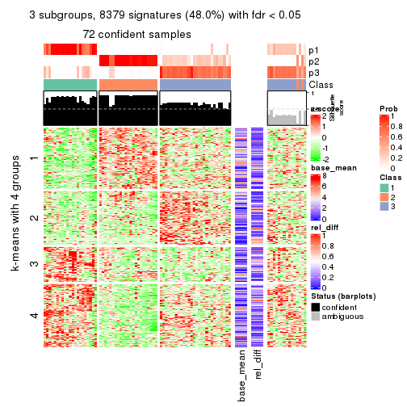</p>

</div>
<div id='tab-SD-kmeans-get-signatures-3'>
<pre><code class="r">get_signatures(res, k = 4)
</code></pre>

<p></p>

</div>
<div id='tab-SD-kmeans-get-signatures-4'>
<pre><code class="r">get_signatures(res, k = 5)
</code></pre>

<p>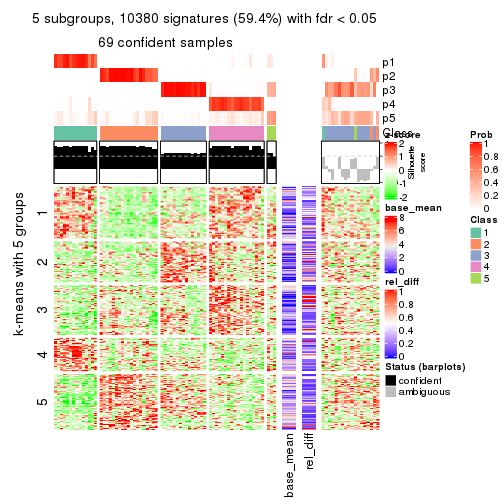</p>

</div>
<div id='tab-SD-kmeans-get-signatures-5'>
<pre><code class="r">get_signatures(res, k = 6)
</code></pre>

<p></p>

</div>
</div>


Signature heatmaps where rows are not scaled:


<script>
$( function() {
	$( '#tabs-SD-kmeans-get-signatures-no-scale' ).tabs();
} );
</script>
<div id='tabs-SD-kmeans-get-signatures-no-scale'>
<ul>
<li><a href='#tab-SD-kmeans-get-signatures-no-scale-1'>k = 2</a></li>
<li><a href='#tab-SD-kmeans-get-signatures-no-scale-2'>k = 3</a></li>
<li><a href='#tab-SD-kmeans-get-signatures-no-scale-3'>k = 4</a></li>
<li><a href='#tab-SD-kmeans-get-signatures-no-scale-4'>k = 5</a></li>
<li><a href='#tab-SD-kmeans-get-signatures-no-scale-5'>k = 6</a></li>
</ul>
<div id='tab-SD-kmeans-get-signatures-no-scale-1'>
<pre><code class="r">get_signatures(res, k = 2, scale_rows = FALSE)
</code></pre>

<p></p>

</div>
<div id='tab-SD-kmeans-get-signatures-no-scale-2'>
<pre><code class="r">get_signatures(res, k = 3, scale_rows = FALSE)
</code></pre>

<p></p>

</div>
<div id='tab-SD-kmeans-get-signatures-no-scale-3'>
<pre><code class="r">get_signatures(res, k = 4, scale_rows = FALSE)
</code></pre>

<p></p>

</div>
<div id='tab-SD-kmeans-get-signatures-no-scale-4'>
<pre><code class="r">get_signatures(res, k = 5, scale_rows = FALSE)
</code></pre>

<p></p>

</div>
<div id='tab-SD-kmeans-get-signatures-no-scale-5'>
<pre><code class="r">get_signatures(res, k = 6, scale_rows = FALSE)
</code></pre>

<p></p>

</div>
</div>


Compare the overlap of signatures from different k:

```r
compare_signatures(res)
```


`get_signature()` returns a data frame invisibly. TO get the list of signatures, the function
call should be assigned to a variable explicitly. In following code, if `plot` argument is set
to `FALSE`, no heatmap is plotted while only the differential analysis is performed.

```r
# code only for demonstration
tb = get_signature(res, k = ..., plot = FALSE)
```

An example of the output of `tb` is:

```
#>   which_row         fdr    mean_1    mean_2 scaled_mean_1 scaled_mean_2 km
#> 1        38 0.042760348  8.373488  9.131774    -0.5533452     0.5164555  1
#> 2        40 0.018707592  7.106213  8.469186    -0.6173731     0.5762149  1
#> 3        55 0.019134737 10.221463 11.207825    -0.6159697     0.5749050  1
#> 4        59 0.006059896  5.921854  7.869574    -0.6899429     0.6439467  1
#> 5        60 0.018055526  8.928898 10.211722    -0.6204761     0.5791110  1
#> 6        98 0.009384629 15.714769 14.887706     0.6635654    -0.6193277  2
...
```

The columns in `tb` are:

1. `which_row`: row indices corresponding to the input matrix.
2. `fdr`: FDR for the differential test. 
3. `mean_x`: The mean value in group x.
4. `scaled_mean_x`: The mean value in group x after rows are scaled.
5. `km`: Row groups if k-means clustering is applied to rows.


UMAP plot which shows how samples are separated.


<script>
$( function() {
	$( '#tabs-SD-kmeans-dimension-reduction' ).tabs();
} );
</script>
<div id='tabs-SD-kmeans-dimension-reduction'>
<ul>
<li><a href='#tab-SD-kmeans-dimension-reduction-1'>k = 2</a></li>
<li><a href='#tab-SD-kmeans-dimension-reduction-2'>k = 3</a></li>
<li><a href='#tab-SD-kmeans-dimension-reduction-3'>k = 4</a></li>
<li><a href='#tab-SD-kmeans-dimension-reduction-4'>k = 5</a></li>
<li><a href='#tab-SD-kmeans-dimension-reduction-5'>k = 6</a></li>
</ul>
<div id='tab-SD-kmeans-dimension-reduction-1'>
<pre><code class="r">dimension_reduction(res, k = 2, method = &quot;UMAP&quot;)
</code></pre>

<p></p>

</div>
<div id='tab-SD-kmeans-dimension-reduction-2'>
<pre><code class="r">dimension_reduction(res, k = 3, method = &quot;UMAP&quot;)
</code></pre>

<p></p>

</div>
<div id='tab-SD-kmeans-dimension-reduction-3'>
<pre><code class="r">dimension_reduction(res, k = 4, method = &quot;UMAP&quot;)
</code></pre>

<p></p>

</div>
<div id='tab-SD-kmeans-dimension-reduction-4'>
<pre><code class="r">dimension_reduction(res, k = 5, method = &quot;UMAP&quot;)
</code></pre>

<p></p>

</div>
<div id='tab-SD-kmeans-dimension-reduction-5'>
<pre><code class="r">dimension_reduction(res, k = 6, method = &quot;UMAP&quot;)
</code></pre>

<p></p>

</div>
</div>


Following heatmap shows how subgroups are split when increasing `k`:

```r
collect_classes(res)
```


If matrix rows can be associated to genes, consider to use `functional_enrichment(res,
...)` to perform function enrichment for the signature genes. See [this vignette](http://bioconductor.org/packages/devel/bioc/vignettes/cola/inst/doc/functional_enrichment.html) for more detailed explanations.


 

---------------------------------------------------


### SD:skmeans*


The object with results only for a single top-value method and a single partition method 
can be extracted as:

```r
res = res_list["SD", "skmeans"]
# you can also extract it by
# res = res_list["SD:skmeans"]
```

A summary of `res` and all the functions that can be applied to it:

```r
res
```

```
#> A 'ConsensusPartition' object with k = 2, 3, 4, 5, 6.
#>   On a matrix with 17471 rows and 87 columns.
#>   Top rows (1000, 2000, 3000, 4000, 5000) are extracted by 'SD' method.
#>   Subgroups are detected by 'skmeans' method.
#>   Performed in total 1250 partitions by row resampling.
#>   Best k for subgroups seems to be 4.
#> 
#> Following methods can be applied to this 'ConsensusPartition' object:
#>  [1] "cola_report"             "collect_classes"         "collect_plots"          
#>  [4] "collect_stats"           "colnames"                "compare_signatures"     
#>  [7] "consensus_heatmap"       "dimension_reduction"     "functional_enrichment"  
#> [10] "get_anno_col"            "get_anno"                "get_classes"            
#> [13] "get_consensus"           "get_matrix"              "get_membership"         
#> [16] "get_param"               "get_signatures"          "get_stats"              
#> [19] "is_best_k"               "is_stable_k"             "membership_heatmap"     
#> [22] "ncol"                    "nrow"                    "plot_ecdf"              
#> [25] "rownames"                "select_partition_number" "show"                   
#> [28] "suggest_best_k"          "test_to_known_factors"
```

`collect_plots()` function collects all the plots made from `res` for all `k` (number of partitions)
into one single page to provide an easy and fast comparison between different `k`.

```r
collect_plots(res)
```


The plots are:

- The first row: a plot of the ECDF (empirical cumulative distribution
  function) curves of the consensus matrix for each `k` and the heatmap of
  predicted classes for each `k`.
- The second row: heatmaps of the consensus matrix for each `k`.
- The third row: heatmaps of the membership matrix for each `k`.
- The fouth row: heatmaps of the signatures for each `k`.

All the plots in panels can be made by individual functions and they are
plotted later in this section.

`select_partition_number()` produces several plots showing different
statistics for choosing "optimized" `k`. There are following statistics:

- ECDF curves of the consensus matrix for each `k`;
- 1-PAC. [The PAC
  score](https://en.wikipedia.org/wiki/Consensus_clustering#Over-interpretation_potential_of_consensus_clustering)
  measures the proportion of the ambiguous subgrouping.
- Mean silhouette score.
- Concordance. The mean probability of fiting the consensus class ids in all
  partitions.
- Area increased. Denote $A_k$ as the area under the ECDF curve for current
  `k`, the area increased is defined as $A_k - A_{k-1}$.
- Rand index. The percent of pairs of samples that are both in a same cluster
  or both are not in a same cluster in the partition of k and k-1.
- Jaccard index. The ratio of pairs of samples are both in a same cluster in
  the partition of k and k-1 and the pairs of samples are both in a same
  cluster in the partition k or k-1.

The detailed explanations of these statistics can be found in [the _cola_
vignette](http://bioconductor.org/packages/devel/bioc/vignettes/cola/inst/doc/cola.html#toc_13).

Generally speaking, lower PAC score, higher mean silhouette score or higher
concordance corresponds to better partition. Rand index and Jaccard index
measure how similar the current partition is compared to partition with `k-1`.
If they are too similar, we won't accept `k` is better than `k-1`.

```r
select_partition_number(res)
```


The numeric values for all these statistics can be obtained by `get_stats()`.

```r
get_stats(res)
```

```
#>   k 1-PAC mean_silhouette concordance area_increased  Rand Jaccard
#> 2 2 1.000           0.953       0.982         0.4992 0.500   0.500
#> 3 3 0.965           0.926       0.968         0.3275 0.809   0.628
#> 4 4 0.914           0.899       0.955         0.1374 0.869   0.635
#> 5 5 0.875           0.852       0.923         0.0615 0.928   0.723
#> 6 6 0.818           0.661       0.821         0.0344 0.983   0.918
```

`suggest_best_k()` suggests the best $k$ based on these statistics. The rules are as follows:

- All $k$ with Jaccard index larger than 0.95 are removed because increasing
  $k$ does not provide enough extra information. If all $k$ are removed, it is
  marked as no subgroup is detected.
- For all $k$ with 1-PAC score larger than 0.9, the maximal $k$ is taken as
  the best $k$, and other $k$ are marked as optional $k$.
- If it does not fit the second rule. The $k$ with the maximal vote of the
  highest 1-PAC score, highest mean silhouette, and highest concordance is
  taken as the best $k$.

```r
suggest_best_k(res)
```

```
#> [1] 4
#> attr(,"optional")
#> [1] 2 3
```

There is also optional best $k$ = 2 3 that is worth to check.

Following shows the table of the partitions (You need to click the **show/hide
code output** link to see it). The membership matrix (columns with name `p*`)
is inferred by
[`clue::cl_consensus()`](https://www.rdocumentation.org/link/cl_consensus?package=clue)
function with the `SE` method. Basically the value in the membership matrix
represents the probability to belong to a certain group. The finall class
label for an item is determined with the group with highest probability it
belongs to.

In `get_classes()` function, the entropy is calculated from the membership
matrix and the silhouette score is calculated from the consensus matrix.


<script>
$( function() {
	$( '#tabs-SD-skmeans-get-classes' ).tabs();
} );
</script>
<div id='tabs-SD-skmeans-get-classes'>
<ul>
<li><a href='#tab-SD-skmeans-get-classes-1'>k = 2</a></li>
<li><a href='#tab-SD-skmeans-get-classes-2'>k = 3</a></li>
<li><a href='#tab-SD-skmeans-get-classes-3'>k = 4</a></li>
<li><a href='#tab-SD-skmeans-get-classes-4'>k = 5</a></li>
<li><a href='#tab-SD-skmeans-get-classes-5'>k = 6</a></li>
</ul>

<div id='tab-SD-skmeans-get-classes-1'>
<p><a id='tab-SD-skmeans-get-classes-1-a' style='color:#0366d6' href='#'>show/hide code output</a></p>
<pre><code class="r">cbind(get_classes(res, k = 2), get_membership(res, k = 2))
</code></pre>

<pre><code>#&gt;                                      class entropy silhouette    p1    p2
#&gt; E6088A41-B0DC-4FBF-8D14-BE78024CF8CD     2  0.0000      0.989 0.000 1.000
#&gt; F569915C-8F77-4D67-9730-30824DB57EE5     2  0.0000      0.989 0.000 1.000
#&gt; E3B71CB7-673B-4741-8607-4F0A11633036     1  0.0000      0.971 1.000 0.000
#&gt; DAF84798-FE3F-403C-B589-7F256AF752BE     1  0.0000      0.971 1.000 0.000
#&gt; 2F38E3B1-4975-4877-9DCC-C00270602180     1  0.0000      0.971 1.000 0.000
#&gt; C79A4C2F-02C4-4C03-A5A5-DE06802EEB57     2  0.0000      0.989 0.000 1.000
#&gt; 92E3ED8F-5C74-4ED2-9B03-9FA5E7B491D6     1  0.0000      0.971 1.000 0.000
#&gt; E61D60BE-3BD3-4B5E-BC12-80F3684A0959     1  0.0000      0.971 1.000 0.000
#&gt; C9388FC7-DB1D-4416-BC2D-EA643584F1E6     2  0.0000      0.989 0.000 1.000
#&gt; D4219360-6344-4AF3-ACEB-1701A9F1F67D     1  0.0000      0.971 1.000 0.000
#&gt; 07D155E6-F27C-4D09-B786-8A9B71147B72     1  0.0000      0.971 1.000 0.000
#&gt; 10C8C361-85A5-40E8-A395-B92623E6F27C     1  0.0000      0.971 1.000 0.000
#&gt; BDF20891-7C98-4A55-BBF3-8A836BE303C6     2  0.0000      0.989 0.000 1.000
#&gt; 694B0504-095E-431A-84F2-B4387072138E     1  0.0000      0.971 1.000 0.000
#&gt; EDCF8E7F-8B1D-46F7-8AE0-84A1DC9647D2     2  0.0000      0.989 0.000 1.000
#&gt; 0EA8288E-824D-4304-A053-5A833361F5C5     1  0.0000      0.971 1.000 0.000
#&gt; C4ACCFA1-34A9-4F61-8A1F-35B3B60EA193     1  0.0000      0.971 1.000 0.000
#&gt; 760BA639-38AC-4BC9-9647-09F6893EA8ED     1  0.0000      0.971 1.000 0.000
#&gt; 082DFC6B-C6E6-48B9-BDE5-74FF3B3DC954     2  0.0000      0.989 0.000 1.000
#&gt; FE349848-D7C4-4C49-B670-0E20454DDD7E     2  0.4431      0.888 0.092 0.908
#&gt; 2E8937B3-9EA1-4528-8CEE-BF3D4137908A     2  0.0000      0.989 0.000 1.000
#&gt; 9942D04E-2767-4E39-BA16-7762EAC3DFC4     2  0.0000      0.989 0.000 1.000
#&gt; F9C23182-91C4-4145-AE52-526FE8EB199D     2  0.0000      0.989 0.000 1.000
#&gt; 01024EED-7811-4E24-A067-8E0B978FFE2D     2  0.0000      0.989 0.000 1.000
#&gt; 932C8E98-A352-409C-8744-3D49FABCE425     1  0.0000      0.971 1.000 0.000
#&gt; 6DFD9439-C659-4936-84E5-108F717E3E4D     2  0.0000      0.989 0.000 1.000
#&gt; 1D8B83B8-5DD7-4F45-9D59-487EC6906A8B     2  0.0000      0.989 0.000 1.000
#&gt; 804B8503-73F6-42DE-835F-39DE2C9F13E1     2  0.0000      0.989 0.000 1.000
#&gt; B9453C9B-84D5-43BD-85BB-1780F02F039C     1  0.0000      0.971 1.000 0.000
#&gt; 836E6CD6-4E88-4028-9844-FA3C892C254A     1  0.0000      0.971 1.000 0.000
#&gt; 36EDD202-A845-4CE7-95D5-A515C471262E     2  0.0000      0.989 0.000 1.000
#&gt; 181C156A-B8F4-4F9D-93AA-6AFBD197644D     2  0.0000      0.989 0.000 1.000
#&gt; 0580E798-6A98-4E46-AC96-9A869DFF502E     1  0.0000      0.971 1.000 0.000
#&gt; EA1B63CF-D389-4567-8D9E-B0EF1F804598     1  0.9427      0.458 0.640 0.360
#&gt; 5ABC3D06-B8E9-4831-B89B-7C1EC4006B47     2  0.0000      0.989 0.000 1.000
#&gt; 1CC01E74-A7C1-4A51-9E28-1703C352BE16     2  0.0000      0.989 0.000 1.000
#&gt; 97E55B75-DBDB-46BC-9E74-7828C070BF16     2  0.0000      0.989 0.000 1.000
#&gt; BEB37A2D-E8B0-4674-89AC-DC0F34E0AFD6     1  0.0000      0.971 1.000 0.000
#&gt; 558648BA-6551-4D34-97C2-AD5F677D63FB     1  0.0000      0.971 1.000 0.000
#&gt; FF7021BB-414B-4466-BC43-372D856E6A1D     2  0.0000      0.989 0.000 1.000
#&gt; 9C04B840-54E0-425D-BDBE-8CB6B9C2C722     2  0.0000      0.989 0.000 1.000
#&gt; 5F50B1F4-1A02-4506-AA6D-9BF21CD8059A     1  0.0000      0.971 1.000 0.000
#&gt; 7D4B8FF3-7977-4ABD-AE04-EED1C50B23CC     2  0.0000      0.989 0.000 1.000
#&gt; A005AF15-B98E-4623-8AD4-1E69EFA9BC7A     1  0.0000      0.971 1.000 0.000
#&gt; 1DF04345-5C93-4B18-B307-8D1FCA532999     2  0.0000      0.989 0.000 1.000
#&gt; 6AF30C18-347E-41ED-A4AB-6F81F42206C5     1  0.0000      0.971 1.000 0.000
#&gt; 88A44ED0-BDE1-401E-B0E1-D8C8D6DBAEFC     2  0.0000      0.989 0.000 1.000
#&gt; 117673A3-2918-4702-8583-B66ADE6E4338     2  0.0000      0.989 0.000 1.000
#&gt; 4903A571-E14D-43C9-A737-22CAFAC414CD     1  0.9732      0.349 0.596 0.404
#&gt; C175E68E-632A-4B4A-9DDB-4895C4760F20     1  0.0000      0.971 1.000 0.000
#&gt; FA5CA2F4-A1AD-4A79-B8F3-73A976EB2FB1     2  0.0000      0.989 0.000 1.000
#&gt; E1F883A7-8B1F-4C1D-8A1A-9749A9C09845     2  0.0000      0.989 0.000 1.000
#&gt; E74F0729-6000-4908-ADB0-7BDBAC0639E6     1  0.0000      0.971 1.000 0.000
#&gt; F92135A9-1981-4C79-99A5-4243EEC5D30D     2  0.0000      0.989 0.000 1.000
#&gt; 73C6919F-DEB4-4DA4-B4AE-4032AC8F96C5     1  0.0000      0.971 1.000 0.000
#&gt; 33977B40-2E92-48B6-8D3A-3EBE913F6F8A     1  0.0000      0.971 1.000 0.000
#&gt; 490BD607-2F08-4B4C-9612-F9BB5CBBC8BB     2  0.0000      0.989 0.000 1.000
#&gt; 6C666E17-2EB8-4244-BCC1-8DD34EE4173E     2  0.0000      0.989 0.000 1.000
#&gt; C41F3064-4483-4796-B860-82155BAA5157     1  0.0000      0.971 1.000 0.000
#&gt; F4232B90-51B9-43EE-9971-35B3A318758F     1  0.0000      0.971 1.000 0.000
#&gt; 291EA1F6-FC56-4429-A433-0C452A6A514C     2  0.0000      0.989 0.000 1.000
#&gt; CC4AF04D-CB8E-40DD-B12E-7AA39B38262A     2  0.0000      0.989 0.000 1.000
#&gt; 4DAE26B9-AB57-4763-BB9A-2ADDD5D9C007     1  0.0000      0.971 1.000 0.000
#&gt; 676B4AEE-FB41-4C16-AA91-03E4A1DA8E26     2  0.9775      0.283 0.412 0.588
#&gt; 1CC36859-357A-49E0-A367-4F57D47288BA     1  0.9044      0.540 0.680 0.320
#&gt; 7CCDDFC8-6DF6-4734-96AC-19EBC464FC50     2  0.0000      0.989 0.000 1.000
#&gt; 10F38C34-3956-48ED-AB62-3439EF00D46B     2  0.0000      0.989 0.000 1.000
#&gt; 80B2B393-9D6E-45B4-B696-2A5C203543B7     2  0.0000      0.989 0.000 1.000
#&gt; 5AC7B5EA-1AAC-4529-8E5A-F612E5E0719A     1  0.0000      0.971 1.000 0.000
#&gt; 3648E98D-4B3A-41B7-BE05-595D44F0150D     1  0.0000      0.971 1.000 0.000
#&gt; 252EC850-6026-473B-8FFC-2CF567EF42E4     1  0.0000      0.971 1.000 0.000
#&gt; 1790E7A3-99D8-447E-BC50-51C8A4A18853     2  0.0000      0.989 0.000 1.000
#&gt; DA61A4F8-350B-4DD1-A240-AD016520DB5B     2  0.0376      0.985 0.004 0.996
#&gt; 767E5BAF-2515-40D7-AE7D-0B24D77A03F4     2  0.0000      0.989 0.000 1.000
#&gt; 8CB9C903-D749-44EA-9137-7FB5A92C5932     1  0.0000      0.971 1.000 0.000
#&gt; A9B968AE-2243-41BC-852A-3A12C1FB4892     1  0.0000      0.971 1.000 0.000
#&gt; 3C582264-85BC-4569-A888-8EB3008E5198     2  0.0000      0.989 0.000 1.000
#&gt; F4EAF9A2-9938-4D9B-9080-C0A7542D5704     2  0.0000      0.989 0.000 1.000
#&gt; 328499D3-45DD-4B66-BD22-3C52BA92C2BB     1  0.0000      0.971 1.000 0.000
#&gt; AF8AB83D-2917-4752-8C38-CF84C565B565     1  0.0000      0.971 1.000 0.000
#&gt; 03A327CA-A9FE-42A4-844D-CA85206969FC     2  0.0000      0.989 0.000 1.000
#&gt; 4B0BEC44-87BB-4014-9A26-3529DD63760B     2  0.0000      0.989 0.000 1.000
#&gt; 05C7843E-DC89-4D8E-A78A-952C5DFD667B     2  0.0000      0.989 0.000 1.000
#&gt; 29A0FFF9-13D3-4D16-BE6A-8E48A2C4E315     2  0.0000      0.989 0.000 1.000
#&gt; 22947CC3-4F42-4F44-899C-2B7085E36C9D     2  0.0000      0.989 0.000 1.000
#&gt; A247D92D-253A-4BEC-B450-184AF90D17D0     2  0.0000      0.989 0.000 1.000
#&gt; 0D907A63-D23F-4684-80D9-0BA552435B86     1  0.0000      0.971 1.000 0.000
</code></pre>

<script>
$('#tab-SD-skmeans-get-classes-1-a').parent().next().next().hide();
$('#tab-SD-skmeans-get-classes-1-a').click(function(){
  $('#tab-SD-skmeans-get-classes-1-a').parent().next().next().toggle();
  return(false);
});
</script>
</div>

<div id='tab-SD-skmeans-get-classes-2'>
<p><a id='tab-SD-skmeans-get-classes-2-a' style='color:#0366d6' href='#'>show/hide code output</a></p>
<pre><code class="r">cbind(get_classes(res, k = 3), get_membership(res, k = 3))
</code></pre>

<pre><code>#&gt;                                      class entropy silhouette    p1    p2    p3
#&gt; E6088A41-B0DC-4FBF-8D14-BE78024CF8CD     3  0.0592     0.9769 0.000 0.012 0.988
#&gt; F569915C-8F77-4D67-9730-30824DB57EE5     3  0.0592     0.9769 0.000 0.012 0.988
#&gt; E3B71CB7-673B-4741-8607-4F0A11633036     1  0.0000     0.9776 1.000 0.000 0.000
#&gt; DAF84798-FE3F-403C-B589-7F256AF752BE     1  0.0892     0.9643 0.980 0.000 0.020
#&gt; 2F38E3B1-4975-4877-9DCC-C00270602180     1  0.0000     0.9776 1.000 0.000 0.000
#&gt; C79A4C2F-02C4-4C03-A5A5-DE06802EEB57     3  0.0592     0.9769 0.000 0.012 0.988
#&gt; 92E3ED8F-5C74-4ED2-9B03-9FA5E7B491D6     1  0.0000     0.9776 1.000 0.000 0.000
#&gt; E61D60BE-3BD3-4B5E-BC12-80F3684A0959     1  0.0592     0.9767 0.988 0.000 0.012
#&gt; C9388FC7-DB1D-4416-BC2D-EA643584F1E6     2  0.4796     0.7274 0.000 0.780 0.220
#&gt; D4219360-6344-4AF3-ACEB-1701A9F1F67D     1  0.0000     0.9776 1.000 0.000 0.000
#&gt; 07D155E6-F27C-4D09-B786-8A9B71147B72     1  0.0592     0.9767 0.988 0.000 0.012
#&gt; 10C8C361-85A5-40E8-A395-B92623E6F27C     1  0.0000     0.9776 1.000 0.000 0.000
#&gt; BDF20891-7C98-4A55-BBF3-8A836BE303C6     2  0.0000     0.9433 0.000 1.000 0.000
#&gt; 694B0504-095E-431A-84F2-B4387072138E     1  0.0000     0.9776 1.000 0.000 0.000
#&gt; EDCF8E7F-8B1D-46F7-8AE0-84A1DC9647D2     2  0.2959     0.8627 0.000 0.900 0.100
#&gt; 0EA8288E-824D-4304-A053-5A833361F5C5     1  0.1411     0.9595 0.964 0.000 0.036
#&gt; C4ACCFA1-34A9-4F61-8A1F-35B3B60EA193     1  0.0000     0.9776 1.000 0.000 0.000
#&gt; 760BA639-38AC-4BC9-9647-09F6893EA8ED     1  0.0000     0.9776 1.000 0.000 0.000
#&gt; 082DFC6B-C6E6-48B9-BDE5-74FF3B3DC954     3  0.0592     0.9769 0.000 0.012 0.988
#&gt; FE349848-D7C4-4C49-B670-0E20454DDD7E     3  0.0000     0.9725 0.000 0.000 1.000
#&gt; 2E8937B3-9EA1-4528-8CEE-BF3D4137908A     2  0.0000     0.9433 0.000 1.000 0.000
#&gt; 9942D04E-2767-4E39-BA16-7762EAC3DFC4     2  0.0000     0.9433 0.000 1.000 0.000
#&gt; F9C23182-91C4-4145-AE52-526FE8EB199D     2  0.0592     0.9333 0.012 0.988 0.000
#&gt; 01024EED-7811-4E24-A067-8E0B978FFE2D     2  0.0000     0.9433 0.000 1.000 0.000
#&gt; 932C8E98-A352-409C-8744-3D49FABCE425     1  0.0000     0.9776 1.000 0.000 0.000
#&gt; 6DFD9439-C659-4936-84E5-108F717E3E4D     2  0.6309     0.0855 0.000 0.504 0.496
#&gt; 1D8B83B8-5DD7-4F45-9D59-487EC6906A8B     3  0.0592     0.9769 0.000 0.012 0.988
#&gt; 804B8503-73F6-42DE-835F-39DE2C9F13E1     2  0.0000     0.9433 0.000 1.000 0.000
#&gt; B9453C9B-84D5-43BD-85BB-1780F02F039C     1  0.0000     0.9776 1.000 0.000 0.000
#&gt; 836E6CD6-4E88-4028-9844-FA3C892C254A     1  0.0424     0.9745 0.992 0.000 0.008
#&gt; 36EDD202-A845-4CE7-95D5-A515C471262E     2  0.0000     0.9433 0.000 1.000 0.000
#&gt; 181C156A-B8F4-4F9D-93AA-6AFBD197644D     2  0.0000     0.9433 0.000 1.000 0.000
#&gt; 0580E798-6A98-4E46-AC96-9A869DFF502E     1  0.0592     0.9767 0.988 0.000 0.012
#&gt; EA1B63CF-D389-4567-8D9E-B0EF1F804598     1  0.8068    -0.0245 0.480 0.456 0.064
#&gt; 5ABC3D06-B8E9-4831-B89B-7C1EC4006B47     2  0.0000     0.9433 0.000 1.000 0.000
#&gt; 1CC01E74-A7C1-4A51-9E28-1703C352BE16     2  0.0000     0.9433 0.000 1.000 0.000
#&gt; 97E55B75-DBDB-46BC-9E74-7828C070BF16     2  0.0000     0.9433 0.000 1.000 0.000
#&gt; BEB37A2D-E8B0-4674-89AC-DC0F34E0AFD6     1  0.0592     0.9767 0.988 0.000 0.012
#&gt; 558648BA-6551-4D34-97C2-AD5F677D63FB     1  0.0000     0.9776 1.000 0.000 0.000
#&gt; FF7021BB-414B-4466-BC43-372D856E6A1D     3  0.1411     0.9497 0.000 0.036 0.964
#&gt; 9C04B840-54E0-425D-BDBE-8CB6B9C2C722     2  0.0000     0.9433 0.000 1.000 0.000
#&gt; 5F50B1F4-1A02-4506-AA6D-9BF21CD8059A     3  0.2711     0.8890 0.088 0.000 0.912
#&gt; 7D4B8FF3-7977-4ABD-AE04-EED1C50B23CC     2  0.4654     0.7365 0.000 0.792 0.208
#&gt; A005AF15-B98E-4623-8AD4-1E69EFA9BC7A     1  0.0592     0.9767 0.988 0.000 0.012
#&gt; 1DF04345-5C93-4B18-B307-8D1FCA532999     2  0.0000     0.9433 0.000 1.000 0.000
#&gt; 6AF30C18-347E-41ED-A4AB-6F81F42206C5     1  0.0592     0.9767 0.988 0.000 0.012
#&gt; 88A44ED0-BDE1-401E-B0E1-D8C8D6DBAEFC     3  0.0592     0.9769 0.000 0.012 0.988
#&gt; 117673A3-2918-4702-8583-B66ADE6E4338     2  0.2066     0.8984 0.000 0.940 0.060
#&gt; 4903A571-E14D-43C9-A737-22CAFAC414CD     3  0.1529     0.9419 0.040 0.000 0.960
#&gt; C175E68E-632A-4B4A-9DDB-4895C4760F20     1  0.0000     0.9776 1.000 0.000 0.000
#&gt; FA5CA2F4-A1AD-4A79-B8F3-73A976EB2FB1     3  0.4452     0.7669 0.000 0.192 0.808
#&gt; E1F883A7-8B1F-4C1D-8A1A-9749A9C09845     2  0.0000     0.9433 0.000 1.000 0.000
#&gt; E74F0729-6000-4908-ADB0-7BDBAC0639E6     1  0.0000     0.9776 1.000 0.000 0.000
#&gt; F92135A9-1981-4C79-99A5-4243EEC5D30D     2  0.0000     0.9433 0.000 1.000 0.000
#&gt; 73C6919F-DEB4-4DA4-B4AE-4032AC8F96C5     1  0.0000     0.9776 1.000 0.000 0.000
#&gt; 33977B40-2E92-48B6-8D3A-3EBE913F6F8A     1  0.1289     0.9627 0.968 0.000 0.032
#&gt; 490BD607-2F08-4B4C-9612-F9BB5CBBC8BB     3  0.0592     0.9769 0.000 0.012 0.988
#&gt; 6C666E17-2EB8-4244-BCC1-8DD34EE4173E     3  0.0592     0.9769 0.000 0.012 0.988
#&gt; C41F3064-4483-4796-B860-82155BAA5157     1  0.0592     0.9767 0.988 0.000 0.012
#&gt; F4232B90-51B9-43EE-9971-35B3A318758F     1  0.0592     0.9767 0.988 0.000 0.012
#&gt; 291EA1F6-FC56-4429-A433-0C452A6A514C     2  0.0000     0.9433 0.000 1.000 0.000
#&gt; CC4AF04D-CB8E-40DD-B12E-7AA39B38262A     2  0.0000     0.9433 0.000 1.000 0.000
#&gt; 4DAE26B9-AB57-4763-BB9A-2ADDD5D9C007     1  0.0592     0.9767 0.988 0.000 0.012
#&gt; 676B4AEE-FB41-4C16-AA91-03E4A1DA8E26     2  0.6896     0.3096 0.392 0.588 0.020
#&gt; 1CC36859-357A-49E0-A367-4F57D47288BA     3  0.0747     0.9689 0.016 0.000 0.984
#&gt; 7CCDDFC8-6DF6-4734-96AC-19EBC464FC50     2  0.0000     0.9433 0.000 1.000 0.000
#&gt; 10F38C34-3956-48ED-AB62-3439EF00D46B     3  0.0000     0.9725 0.000 0.000 1.000
#&gt; 80B2B393-9D6E-45B4-B696-2A5C203543B7     2  0.0000     0.9433 0.000 1.000 0.000
#&gt; 5AC7B5EA-1AAC-4529-8E5A-F612E5E0719A     1  0.0892     0.9725 0.980 0.000 0.020
#&gt; 3648E98D-4B3A-41B7-BE05-595D44F0150D     1  0.0000     0.9776 1.000 0.000 0.000
#&gt; 252EC850-6026-473B-8FFC-2CF567EF42E4     1  0.0592     0.9767 0.988 0.000 0.012
#&gt; 1790E7A3-99D8-447E-BC50-51C8A4A18853     2  0.0000     0.9433 0.000 1.000 0.000
#&gt; DA61A4F8-350B-4DD1-A240-AD016520DB5B     3  0.0592     0.9769 0.000 0.012 0.988
#&gt; 767E5BAF-2515-40D7-AE7D-0B24D77A03F4     3  0.0000     0.9725 0.000 0.000 1.000
#&gt; 8CB9C903-D749-44EA-9137-7FB5A92C5932     1  0.0237     0.9762 0.996 0.000 0.004
#&gt; A9B968AE-2243-41BC-852A-3A12C1FB4892     1  0.0592     0.9767 0.988 0.000 0.012
#&gt; 3C582264-85BC-4569-A888-8EB3008E5198     2  0.0000     0.9433 0.000 1.000 0.000
#&gt; F4EAF9A2-9938-4D9B-9080-C0A7542D5704     2  0.0000     0.9433 0.000 1.000 0.000
#&gt; 328499D3-45DD-4B66-BD22-3C52BA92C2BB     1  0.0000     0.9776 1.000 0.000 0.000
#&gt; AF8AB83D-2917-4752-8C38-CF84C565B565     1  0.0592     0.9767 0.988 0.000 0.012
#&gt; 03A327CA-A9FE-42A4-844D-CA85206969FC     3  0.0592     0.9769 0.000 0.012 0.988
#&gt; 4B0BEC44-87BB-4014-9A26-3529DD63760B     3  0.0000     0.9725 0.000 0.000 1.000
#&gt; 05C7843E-DC89-4D8E-A78A-952C5DFD667B     3  0.0000     0.9725 0.000 0.000 1.000
#&gt; 29A0FFF9-13D3-4D16-BE6A-8E48A2C4E315     2  0.0000     0.9433 0.000 1.000 0.000
#&gt; 22947CC3-4F42-4F44-899C-2B7085E36C9D     3  0.0592     0.9769 0.000 0.012 0.988
#&gt; A247D92D-253A-4BEC-B450-184AF90D17D0     3  0.0592     0.9769 0.000 0.012 0.988
#&gt; 0D907A63-D23F-4684-80D9-0BA552435B86     1  0.0592     0.9767 0.988 0.000 0.012
</code></pre>

<script>
$('#tab-SD-skmeans-get-classes-2-a').parent().next().next().hide();
$('#tab-SD-skmeans-get-classes-2-a').click(function(){
  $('#tab-SD-skmeans-get-classes-2-a').parent().next().next().toggle();
  return(false);
});
</script>
</div>

<div id='tab-SD-skmeans-get-classes-3'>
<p><a id='tab-SD-skmeans-get-classes-3-a' style='color:#0366d6' href='#'>show/hide code output</a></p>
<pre><code class="r">cbind(get_classes(res, k = 4), get_membership(res, k = 4))
</code></pre>

<pre><code>#&gt;                                      class entropy silhouette    p1    p2    p3    p4
#&gt; E6088A41-B0DC-4FBF-8D14-BE78024CF8CD     3  0.0000      0.970 0.000 0.000 1.000 0.000
#&gt; F569915C-8F77-4D67-9730-30824DB57EE5     3  0.0188      0.972 0.000 0.004 0.996 0.000
#&gt; E3B71CB7-673B-4741-8607-4F0A11633036     1  0.0000      0.937 1.000 0.000 0.000 0.000
#&gt; DAF84798-FE3F-403C-B589-7F256AF752BE     1  0.0000      0.937 1.000 0.000 0.000 0.000
#&gt; 2F38E3B1-4975-4877-9DCC-C00270602180     1  0.4605      0.488 0.664 0.000 0.000 0.336
#&gt; C79A4C2F-02C4-4C03-A5A5-DE06802EEB57     3  0.0188      0.972 0.000 0.004 0.996 0.000
#&gt; 92E3ED8F-5C74-4ED2-9B03-9FA5E7B491D6     1  0.0000      0.937 1.000 0.000 0.000 0.000
#&gt; E61D60BE-3BD3-4B5E-BC12-80F3684A0959     4  0.0000      0.925 0.000 0.000 0.000 1.000
#&gt; C9388FC7-DB1D-4416-BC2D-EA643584F1E6     4  0.6477      0.513 0.000 0.264 0.116 0.620
#&gt; D4219360-6344-4AF3-ACEB-1701A9F1F67D     1  0.0000      0.937 1.000 0.000 0.000 0.000
#&gt; 07D155E6-F27C-4D09-B786-8A9B71147B72     4  0.0921      0.912 0.028 0.000 0.000 0.972
#&gt; 10C8C361-85A5-40E8-A395-B92623E6F27C     1  0.1302      0.910 0.956 0.000 0.000 0.044
#&gt; BDF20891-7C98-4A55-BBF3-8A836BE303C6     2  0.0000      0.964 0.000 1.000 0.000 0.000
#&gt; 694B0504-095E-431A-84F2-B4387072138E     1  0.0000      0.937 1.000 0.000 0.000 0.000
#&gt; EDCF8E7F-8B1D-46F7-8AE0-84A1DC9647D2     2  0.3486      0.776 0.000 0.812 0.188 0.000
#&gt; 0EA8288E-824D-4304-A053-5A833361F5C5     4  0.0000      0.925 0.000 0.000 0.000 1.000
#&gt; C4ACCFA1-34A9-4F61-8A1F-35B3B60EA193     1  0.0000      0.937 1.000 0.000 0.000 0.000
#&gt; 760BA639-38AC-4BC9-9647-09F6893EA8ED     1  0.0000      0.937 1.000 0.000 0.000 0.000
#&gt; 082DFC6B-C6E6-48B9-BDE5-74FF3B3DC954     3  0.0188      0.972 0.000 0.004 0.996 0.000
#&gt; FE349848-D7C4-4C49-B670-0E20454DDD7E     3  0.0188      0.970 0.000 0.000 0.996 0.004
#&gt; 2E8937B3-9EA1-4528-8CEE-BF3D4137908A     2  0.0000      0.964 0.000 1.000 0.000 0.000
#&gt; 9942D04E-2767-4E39-BA16-7762EAC3DFC4     2  0.0188      0.963 0.000 0.996 0.004 0.000
#&gt; F9C23182-91C4-4145-AE52-526FE8EB199D     2  0.2814      0.838 0.132 0.868 0.000 0.000
#&gt; 01024EED-7811-4E24-A067-8E0B978FFE2D     2  0.0000      0.964 0.000 1.000 0.000 0.000
#&gt; 932C8E98-A352-409C-8744-3D49FABCE425     1  0.0000      0.937 1.000 0.000 0.000 0.000
#&gt; 6DFD9439-C659-4936-84E5-108F717E3E4D     2  0.6029      0.386 0.016 0.588 0.372 0.024
#&gt; 1D8B83B8-5DD7-4F45-9D59-487EC6906A8B     3  0.0188      0.969 0.000 0.004 0.996 0.000
#&gt; 804B8503-73F6-42DE-835F-39DE2C9F13E1     2  0.0000      0.964 0.000 1.000 0.000 0.000
#&gt; B9453C9B-84D5-43BD-85BB-1780F02F039C     1  0.0000      0.937 1.000 0.000 0.000 0.000
#&gt; 836E6CD6-4E88-4028-9844-FA3C892C254A     1  0.1940      0.886 0.924 0.000 0.000 0.076
#&gt; 36EDD202-A845-4CE7-95D5-A515C471262E     2  0.0188      0.963 0.000 0.996 0.004 0.000
#&gt; 181C156A-B8F4-4F9D-93AA-6AFBD197644D     2  0.0000      0.964 0.000 1.000 0.000 0.000
#&gt; 0580E798-6A98-4E46-AC96-9A869DFF502E     4  0.0000      0.925 0.000 0.000 0.000 1.000
#&gt; EA1B63CF-D389-4567-8D9E-B0EF1F804598     1  0.0188      0.934 0.996 0.004 0.000 0.000
#&gt; 5ABC3D06-B8E9-4831-B89B-7C1EC4006B47     2  0.0188      0.963 0.000 0.996 0.004 0.000
#&gt; 1CC01E74-A7C1-4A51-9E28-1703C352BE16     2  0.0000      0.964 0.000 1.000 0.000 0.000
#&gt; 97E55B75-DBDB-46BC-9E74-7828C070BF16     2  0.0188      0.963 0.000 0.996 0.004 0.000
#&gt; BEB37A2D-E8B0-4674-89AC-DC0F34E0AFD6     4  0.0000      0.925 0.000 0.000 0.000 1.000
#&gt; 558648BA-6551-4D34-97C2-AD5F677D63FB     1  0.3726      0.739 0.788 0.000 0.000 0.212
#&gt; FF7021BB-414B-4466-BC43-372D856E6A1D     3  0.1042      0.951 0.000 0.008 0.972 0.020
#&gt; 9C04B840-54E0-425D-BDBE-8CB6B9C2C722     2  0.0188      0.963 0.000 0.996 0.004 0.000
#&gt; 5F50B1F4-1A02-4506-AA6D-9BF21CD8059A     4  0.1792      0.881 0.000 0.000 0.068 0.932
#&gt; 7D4B8FF3-7977-4ABD-AE04-EED1C50B23CC     2  0.2647      0.855 0.000 0.880 0.120 0.000
#&gt; A005AF15-B98E-4623-8AD4-1E69EFA9BC7A     4  0.0000      0.925 0.000 0.000 0.000 1.000
#&gt; 1DF04345-5C93-4B18-B307-8D1FCA532999     2  0.0000      0.964 0.000 1.000 0.000 0.000
#&gt; 6AF30C18-347E-41ED-A4AB-6F81F42206C5     4  0.0000      0.925 0.000 0.000 0.000 1.000
#&gt; 88A44ED0-BDE1-401E-B0E1-D8C8D6DBAEFC     3  0.0188      0.972 0.000 0.004 0.996 0.000
#&gt; 117673A3-2918-4702-8583-B66ADE6E4338     2  0.1474      0.927 0.000 0.948 0.052 0.000
#&gt; 4903A571-E14D-43C9-A737-22CAFAC414CD     4  0.4164      0.634 0.000 0.000 0.264 0.736
#&gt; C175E68E-632A-4B4A-9DDB-4895C4760F20     1  0.0000      0.937 1.000 0.000 0.000 0.000
#&gt; FA5CA2F4-A1AD-4A79-B8F3-73A976EB2FB1     3  0.3074      0.810 0.000 0.152 0.848 0.000
#&gt; E1F883A7-8B1F-4C1D-8A1A-9749A9C09845     2  0.0000      0.964 0.000 1.000 0.000 0.000
#&gt; E74F0729-6000-4908-ADB0-7BDBAC0639E6     1  0.4817      0.383 0.612 0.000 0.000 0.388
#&gt; F92135A9-1981-4C79-99A5-4243EEC5D30D     2  0.0000      0.964 0.000 1.000 0.000 0.000
#&gt; 73C6919F-DEB4-4DA4-B4AE-4032AC8F96C5     4  0.4877      0.201 0.408 0.000 0.000 0.592
#&gt; 33977B40-2E92-48B6-8D3A-3EBE913F6F8A     4  0.1042      0.912 0.020 0.000 0.008 0.972
#&gt; 490BD607-2F08-4B4C-9612-F9BB5CBBC8BB     3  0.0188      0.972 0.000 0.004 0.996 0.000
#&gt; 6C666E17-2EB8-4244-BCC1-8DD34EE4173E     3  0.0188      0.972 0.000 0.004 0.996 0.000
#&gt; C41F3064-4483-4796-B860-82155BAA5157     4  0.2216      0.860 0.092 0.000 0.000 0.908
#&gt; F4232B90-51B9-43EE-9971-35B3A318758F     4  0.0000      0.925 0.000 0.000 0.000 1.000
#&gt; 291EA1F6-FC56-4429-A433-0C452A6A514C     2  0.0000      0.964 0.000 1.000 0.000 0.000
#&gt; CC4AF04D-CB8E-40DD-B12E-7AA39B38262A     2  0.0188      0.963 0.000 0.996 0.004 0.000
#&gt; 4DAE26B9-AB57-4763-BB9A-2ADDD5D9C007     4  0.0000      0.925 0.000 0.000 0.000 1.000
#&gt; 676B4AEE-FB41-4C16-AA91-03E4A1DA8E26     4  0.2310      0.886 0.028 0.040 0.004 0.928
#&gt; 1CC36859-357A-49E0-A367-4F57D47288BA     3  0.4304      0.601 0.284 0.000 0.716 0.000
#&gt; 7CCDDFC8-6DF6-4734-96AC-19EBC464FC50     2  0.0000      0.964 0.000 1.000 0.000 0.000
#&gt; 10F38C34-3956-48ED-AB62-3439EF00D46B     3  0.0000      0.970 0.000 0.000 1.000 0.000
#&gt; 80B2B393-9D6E-45B4-B696-2A5C203543B7     2  0.0000      0.964 0.000 1.000 0.000 0.000
#&gt; 5AC7B5EA-1AAC-4529-8E5A-F612E5E0719A     4  0.0000      0.925 0.000 0.000 0.000 1.000
#&gt; 3648E98D-4B3A-41B7-BE05-595D44F0150D     1  0.0000      0.937 1.000 0.000 0.000 0.000
#&gt; 252EC850-6026-473B-8FFC-2CF567EF42E4     4  0.0000      0.925 0.000 0.000 0.000 1.000
#&gt; 1790E7A3-99D8-447E-BC50-51C8A4A18853     2  0.0000      0.964 0.000 1.000 0.000 0.000
#&gt; DA61A4F8-350B-4DD1-A240-AD016520DB5B     3  0.0188      0.972 0.000 0.004 0.996 0.000
#&gt; 767E5BAF-2515-40D7-AE7D-0B24D77A03F4     3  0.0000      0.970 0.000 0.000 1.000 0.000
#&gt; 8CB9C903-D749-44EA-9137-7FB5A92C5932     1  0.0188      0.935 0.996 0.000 0.004 0.000
#&gt; A9B968AE-2243-41BC-852A-3A12C1FB4892     4  0.0921      0.912 0.028 0.000 0.000 0.972
#&gt; 3C582264-85BC-4569-A888-8EB3008E5198     2  0.0000      0.964 0.000 1.000 0.000 0.000
#&gt; F4EAF9A2-9938-4D9B-9080-C0A7542D5704     2  0.0188      0.963 0.000 0.996 0.004 0.000
#&gt; 328499D3-45DD-4B66-BD22-3C52BA92C2BB     1  0.0000      0.937 1.000 0.000 0.000 0.000
#&gt; AF8AB83D-2917-4752-8C38-CF84C565B565     4  0.0000      0.925 0.000 0.000 0.000 1.000
#&gt; 03A327CA-A9FE-42A4-844D-CA85206969FC     3  0.0592      0.963 0.000 0.016 0.984 0.000
#&gt; 4B0BEC44-87BB-4014-9A26-3529DD63760B     3  0.0188      0.970 0.000 0.000 0.996 0.004
#&gt; 05C7843E-DC89-4D8E-A78A-952C5DFD667B     3  0.0188      0.972 0.000 0.004 0.996 0.000
#&gt; 29A0FFF9-13D3-4D16-BE6A-8E48A2C4E315     2  0.0000      0.964 0.000 1.000 0.000 0.000
#&gt; 22947CC3-4F42-4F44-899C-2B7085E36C9D     3  0.0000      0.970 0.000 0.000 1.000 0.000
#&gt; A247D92D-253A-4BEC-B450-184AF90D17D0     3  0.0188      0.972 0.000 0.004 0.996 0.000
#&gt; 0D907A63-D23F-4684-80D9-0BA552435B86     4  0.0000      0.925 0.000 0.000 0.000 1.000
</code></pre>

<script>
$('#tab-SD-skmeans-get-classes-3-a').parent().next().next().hide();
$('#tab-SD-skmeans-get-classes-3-a').click(function(){
  $('#tab-SD-skmeans-get-classes-3-a').parent().next().next().toggle();
  return(false);
});
</script>
</div>

<div id='tab-SD-skmeans-get-classes-4'>
<p><a id='tab-SD-skmeans-get-classes-4-a' style='color:#0366d6' href='#'>show/hide code output</a></p>
<pre><code class="r">cbind(get_classes(res, k = 5), get_membership(res, k = 5))
</code></pre>

<pre><code>#&gt;                                      class entropy silhouette    p1    p2    p3    p4    p5
#&gt; E6088A41-B0DC-4FBF-8D14-BE78024CF8CD     3  0.0963      0.905 0.000 0.000 0.964 0.000 0.036
#&gt; F569915C-8F77-4D67-9730-30824DB57EE5     3  0.0000      0.921 0.000 0.000 1.000 0.000 0.000
#&gt; E3B71CB7-673B-4741-8607-4F0A11633036     1  0.0000      0.882 1.000 0.000 0.000 0.000 0.000
#&gt; DAF84798-FE3F-403C-B589-7F256AF752BE     5  0.2329      0.782 0.124 0.000 0.000 0.000 0.876
#&gt; 2F38E3B1-4975-4877-9DCC-C00270602180     1  0.3480      0.679 0.752 0.000 0.000 0.248 0.000
#&gt; C79A4C2F-02C4-4C03-A5A5-DE06802EEB57     3  0.0000      0.921 0.000 0.000 1.000 0.000 0.000
#&gt; 92E3ED8F-5C74-4ED2-9B03-9FA5E7B491D6     1  0.0609      0.880 0.980 0.000 0.000 0.000 0.020
#&gt; E61D60BE-3BD3-4B5E-BC12-80F3684A0959     4  0.0162      0.936 0.000 0.000 0.000 0.996 0.004
#&gt; C9388FC7-DB1D-4416-BC2D-EA643584F1E6     5  0.5475      0.480 0.000 0.076 0.004 0.308 0.612
#&gt; D4219360-6344-4AF3-ACEB-1701A9F1F67D     1  0.0000      0.882 1.000 0.000 0.000 0.000 0.000
#&gt; 07D155E6-F27C-4D09-B786-8A9B71147B72     4  0.1800      0.912 0.048 0.000 0.000 0.932 0.020
#&gt; 10C8C361-85A5-40E8-A395-B92623E6F27C     1  0.1697      0.857 0.932 0.000 0.000 0.060 0.008
#&gt; BDF20891-7C98-4A55-BBF3-8A836BE303C6     2  0.0609      0.945 0.000 0.980 0.000 0.000 0.020
#&gt; 694B0504-095E-431A-84F2-B4387072138E     1  0.0703      0.879 0.976 0.000 0.000 0.000 0.024
#&gt; EDCF8E7F-8B1D-46F7-8AE0-84A1DC9647D2     5  0.2193      0.831 0.000 0.060 0.028 0.000 0.912
#&gt; 0EA8288E-824D-4304-A053-5A833361F5C5     4  0.1270      0.922 0.000 0.000 0.000 0.948 0.052
#&gt; C4ACCFA1-34A9-4F61-8A1F-35B3B60EA193     1  0.0703      0.879 0.976 0.000 0.000 0.000 0.024
#&gt; 760BA639-38AC-4BC9-9647-09F6893EA8ED     1  0.0609      0.880 0.980 0.000 0.000 0.000 0.020
#&gt; 082DFC6B-C6E6-48B9-BDE5-74FF3B3DC954     3  0.0000      0.921 0.000 0.000 1.000 0.000 0.000
#&gt; FE349848-D7C4-4C49-B670-0E20454DDD7E     3  0.3305      0.702 0.000 0.000 0.776 0.000 0.224
#&gt; 2E8937B3-9EA1-4528-8CEE-BF3D4137908A     2  0.0000      0.957 0.000 1.000 0.000 0.000 0.000
#&gt; 9942D04E-2767-4E39-BA16-7762EAC3DFC4     2  0.2020      0.885 0.000 0.900 0.000 0.000 0.100
#&gt; F9C23182-91C4-4145-AE52-526FE8EB199D     5  0.4958      0.343 0.032 0.400 0.000 0.000 0.568
#&gt; 01024EED-7811-4E24-A067-8E0B978FFE2D     2  0.0000      0.957 0.000 1.000 0.000 0.000 0.000
#&gt; 932C8E98-A352-409C-8744-3D49FABCE425     1  0.2280      0.814 0.880 0.000 0.000 0.000 0.120
#&gt; 6DFD9439-C659-4936-84E5-108F717E3E4D     5  0.2073      0.828 0.016 0.008 0.032 0.012 0.932
#&gt; 1D8B83B8-5DD7-4F45-9D59-487EC6906A8B     3  0.1544      0.889 0.000 0.000 0.932 0.000 0.068
#&gt; 804B8503-73F6-42DE-835F-39DE2C9F13E1     2  0.0000      0.957 0.000 1.000 0.000 0.000 0.000
#&gt; B9453C9B-84D5-43BD-85BB-1780F02F039C     1  0.0000      0.882 1.000 0.000 0.000 0.000 0.000
#&gt; 836E6CD6-4E88-4028-9844-FA3C892C254A     1  0.4054      0.797 0.800 0.000 0.004 0.080 0.116
#&gt; 36EDD202-A845-4CE7-95D5-A515C471262E     2  0.4192      0.253 0.000 0.596 0.000 0.000 0.404
#&gt; 181C156A-B8F4-4F9D-93AA-6AFBD197644D     2  0.0000      0.957 0.000 1.000 0.000 0.000 0.000
#&gt; 0580E798-6A98-4E46-AC96-9A869DFF502E     4  0.0798      0.933 0.016 0.000 0.000 0.976 0.008
#&gt; EA1B63CF-D389-4567-8D9E-B0EF1F804598     5  0.2732      0.749 0.160 0.000 0.000 0.000 0.840
#&gt; 5ABC3D06-B8E9-4831-B89B-7C1EC4006B47     2  0.1544      0.913 0.000 0.932 0.000 0.000 0.068
#&gt; 1CC01E74-A7C1-4A51-9E28-1703C352BE16     2  0.0000      0.957 0.000 1.000 0.000 0.000 0.000
#&gt; 97E55B75-DBDB-46BC-9E74-7828C070BF16     2  0.0609      0.947 0.000 0.980 0.000 0.000 0.020
#&gt; BEB37A2D-E8B0-4674-89AC-DC0F34E0AFD6     4  0.0404      0.935 0.000 0.000 0.000 0.988 0.012
#&gt; 558648BA-6551-4D34-97C2-AD5F677D63FB     1  0.4147      0.772 0.796 0.000 0.056 0.136 0.012
#&gt; FF7021BB-414B-4466-BC43-372D856E6A1D     5  0.1892      0.791 0.000 0.000 0.080 0.004 0.916
#&gt; 9C04B840-54E0-425D-BDBE-8CB6B9C2C722     2  0.2605      0.798 0.000 0.852 0.000 0.000 0.148
#&gt; 5F50B1F4-1A02-4506-AA6D-9BF21CD8059A     4  0.2597      0.864 0.000 0.000 0.092 0.884 0.024
#&gt; 7D4B8FF3-7977-4ABD-AE04-EED1C50B23CC     5  0.2046      0.833 0.000 0.068 0.016 0.000 0.916
#&gt; A005AF15-B98E-4623-8AD4-1E69EFA9BC7A     4  0.0000      0.936 0.000 0.000 0.000 1.000 0.000
#&gt; 1DF04345-5C93-4B18-B307-8D1FCA532999     2  0.0000      0.957 0.000 1.000 0.000 0.000 0.000
#&gt; 6AF30C18-347E-41ED-A4AB-6F81F42206C5     4  0.0992      0.931 0.024 0.000 0.000 0.968 0.008
#&gt; 88A44ED0-BDE1-401E-B0E1-D8C8D6DBAEFC     3  0.0000      0.921 0.000 0.000 1.000 0.000 0.000
#&gt; 117673A3-2918-4702-8583-B66ADE6E4338     5  0.2408      0.822 0.004 0.096 0.008 0.000 0.892
#&gt; 4903A571-E14D-43C9-A737-22CAFAC414CD     5  0.2900      0.794 0.000 0.000 0.028 0.108 0.864
#&gt; C175E68E-632A-4B4A-9DDB-4895C4760F20     1  0.2471      0.798 0.864 0.000 0.000 0.000 0.136
#&gt; FA5CA2F4-A1AD-4A79-B8F3-73A976EB2FB1     3  0.1608      0.862 0.000 0.072 0.928 0.000 0.000
#&gt; E1F883A7-8B1F-4C1D-8A1A-9749A9C09845     2  0.0000      0.957 0.000 1.000 0.000 0.000 0.000
#&gt; E74F0729-6000-4908-ADB0-7BDBAC0639E6     1  0.3728      0.703 0.748 0.000 0.000 0.244 0.008
#&gt; F92135A9-1981-4C79-99A5-4243EEC5D30D     2  0.0000      0.957 0.000 1.000 0.000 0.000 0.000
#&gt; 73C6919F-DEB4-4DA4-B4AE-4032AC8F96C5     1  0.4464      0.398 0.584 0.000 0.000 0.408 0.008
#&gt; 33977B40-2E92-48B6-8D3A-3EBE913F6F8A     4  0.4687      0.712 0.168 0.000 0.024 0.756 0.052
#&gt; 490BD607-2F08-4B4C-9612-F9BB5CBBC8BB     3  0.0000      0.921 0.000 0.000 1.000 0.000 0.000
#&gt; 6C666E17-2EB8-4244-BCC1-8DD34EE4173E     3  0.0404      0.918 0.000 0.000 0.988 0.000 0.012
#&gt; C41F3064-4483-4796-B860-82155BAA5157     4  0.2629      0.854 0.136 0.000 0.000 0.860 0.004
#&gt; F4232B90-51B9-43EE-9971-35B3A318758F     4  0.0992      0.931 0.024 0.000 0.000 0.968 0.008
#&gt; 291EA1F6-FC56-4429-A433-0C452A6A514C     2  0.0000      0.957 0.000 1.000 0.000 0.000 0.000
#&gt; CC4AF04D-CB8E-40DD-B12E-7AA39B38262A     2  0.0794      0.943 0.000 0.972 0.000 0.000 0.028
#&gt; 4DAE26B9-AB57-4763-BB9A-2ADDD5D9C007     4  0.0000      0.936 0.000 0.000 0.000 1.000 0.000
#&gt; 676B4AEE-FB41-4C16-AA91-03E4A1DA8E26     4  0.4056      0.830 0.044 0.052 0.000 0.824 0.080
#&gt; 1CC36859-357A-49E0-A367-4F57D47288BA     3  0.5391      0.526 0.116 0.000 0.652 0.000 0.232
#&gt; 7CCDDFC8-6DF6-4734-96AC-19EBC464FC50     2  0.0000      0.957 0.000 1.000 0.000 0.000 0.000
#&gt; 10F38C34-3956-48ED-AB62-3439EF00D46B     3  0.0703      0.914 0.000 0.000 0.976 0.000 0.024
#&gt; 80B2B393-9D6E-45B4-B696-2A5C203543B7     2  0.0000      0.957 0.000 1.000 0.000 0.000 0.000
#&gt; 5AC7B5EA-1AAC-4529-8E5A-F612E5E0719A     4  0.1357      0.925 0.004 0.000 0.000 0.948 0.048
#&gt; 3648E98D-4B3A-41B7-BE05-595D44F0150D     1  0.0162      0.882 0.996 0.000 0.000 0.000 0.004
#&gt; 252EC850-6026-473B-8FFC-2CF567EF42E4     4  0.0703      0.933 0.000 0.000 0.000 0.976 0.024
#&gt; 1790E7A3-99D8-447E-BC50-51C8A4A18853     2  0.0000      0.957 0.000 1.000 0.000 0.000 0.000
#&gt; DA61A4F8-350B-4DD1-A240-AD016520DB5B     3  0.0000      0.921 0.000 0.000 1.000 0.000 0.000
#&gt; 767E5BAF-2515-40D7-AE7D-0B24D77A03F4     3  0.4287      0.177 0.000 0.000 0.540 0.000 0.460
#&gt; 8CB9C903-D749-44EA-9137-7FB5A92C5932     1  0.1341      0.864 0.944 0.000 0.000 0.000 0.056
#&gt; A9B968AE-2243-41BC-852A-3A12C1FB4892     4  0.1818      0.914 0.044 0.000 0.000 0.932 0.024
#&gt; 3C582264-85BC-4569-A888-8EB3008E5198     2  0.0000      0.957 0.000 1.000 0.000 0.000 0.000
#&gt; F4EAF9A2-9938-4D9B-9080-C0A7542D5704     2  0.0963      0.937 0.000 0.964 0.000 0.000 0.036
#&gt; 328499D3-45DD-4B66-BD22-3C52BA92C2BB     1  0.0000      0.882 1.000 0.000 0.000 0.000 0.000
#&gt; AF8AB83D-2917-4752-8C38-CF84C565B565     4  0.0566      0.935 0.004 0.000 0.000 0.984 0.012
#&gt; 03A327CA-A9FE-42A4-844D-CA85206969FC     3  0.1117      0.908 0.000 0.020 0.964 0.000 0.016
#&gt; 4B0BEC44-87BB-4014-9A26-3529DD63760B     3  0.0510      0.918 0.000 0.000 0.984 0.000 0.016
#&gt; 05C7843E-DC89-4D8E-A78A-952C5DFD667B     3  0.0000      0.921 0.000 0.000 1.000 0.000 0.000
#&gt; 29A0FFF9-13D3-4D16-BE6A-8E48A2C4E315     2  0.0000      0.957 0.000 1.000 0.000 0.000 0.000
#&gt; 22947CC3-4F42-4F44-899C-2B7085E36C9D     3  0.0963      0.908 0.000 0.000 0.964 0.000 0.036
#&gt; A247D92D-253A-4BEC-B450-184AF90D17D0     3  0.0000      0.921 0.000 0.000 1.000 0.000 0.000
#&gt; 0D907A63-D23F-4684-80D9-0BA552435B86     4  0.0703      0.933 0.000 0.000 0.000 0.976 0.024
</code></pre>

<script>
$('#tab-SD-skmeans-get-classes-4-a').parent().next().next().hide();
$('#tab-SD-skmeans-get-classes-4-a').click(function(){
  $('#tab-SD-skmeans-get-classes-4-a').parent().next().next().toggle();
  return(false);
});
</script>
</div>

<div id='tab-SD-skmeans-get-classes-5'>
<p><a id='tab-SD-skmeans-get-classes-5-a' style='color:#0366d6' href='#'>show/hide code output</a></p>
<pre><code class="r">cbind(get_classes(res, k = 6), get_membership(res, k = 6))
</code></pre>

<pre><code>#&gt;                                      class entropy silhouette    p1    p2    p3    p4    p5    p6
#&gt; E6088A41-B0DC-4FBF-8D14-BE78024CF8CD     3  0.2146     0.8495 0.000 0.000 0.880 0.000 0.004 0.116
#&gt; F569915C-8F77-4D67-9730-30824DB57EE5     3  0.0146     0.9056 0.000 0.000 0.996 0.000 0.000 0.004
#&gt; E3B71CB7-673B-4741-8607-4F0A11633036     1  0.0713     0.7682 0.972 0.000 0.000 0.000 0.000 0.028
#&gt; DAF84798-FE3F-403C-B589-7F256AF752BE     5  0.2431     0.6981 0.132 0.000 0.000 0.000 0.860 0.008
#&gt; 2F38E3B1-4975-4877-9DCC-C00270602180     1  0.5850    -0.3779 0.452 0.000 0.000 0.348 0.000 0.200
#&gt; C79A4C2F-02C4-4C03-A5A5-DE06802EEB57     3  0.1141     0.8968 0.000 0.000 0.948 0.000 0.000 0.052
#&gt; 92E3ED8F-5C74-4ED2-9B03-9FA5E7B491D6     1  0.0146     0.7687 0.996 0.000 0.000 0.000 0.004 0.000
#&gt; E61D60BE-3BD3-4B5E-BC12-80F3684A0959     4  0.2595     0.5682 0.000 0.000 0.000 0.836 0.004 0.160
#&gt; C9388FC7-DB1D-4416-BC2D-EA643584F1E6     5  0.6485     0.4376 0.000 0.068 0.000 0.140 0.504 0.288
#&gt; D4219360-6344-4AF3-ACEB-1701A9F1F67D     1  0.0632     0.7688 0.976 0.000 0.000 0.000 0.000 0.024
#&gt; 07D155E6-F27C-4D09-B786-8A9B71147B72     4  0.0547     0.5916 0.000 0.000 0.000 0.980 0.000 0.020
#&gt; 10C8C361-85A5-40E8-A395-B92623E6F27C     1  0.3050     0.6169 0.764 0.000 0.000 0.000 0.000 0.236
#&gt; BDF20891-7C98-4A55-BBF3-8A836BE303C6     2  0.1908     0.8831 0.000 0.916 0.000 0.000 0.028 0.056
#&gt; 694B0504-095E-431A-84F2-B4387072138E     1  0.0405     0.7680 0.988 0.000 0.000 0.000 0.008 0.004
#&gt; EDCF8E7F-8B1D-46F7-8AE0-84A1DC9647D2     5  0.3242     0.7184 0.000 0.032 0.004 0.000 0.816 0.148
#&gt; 0EA8288E-824D-4304-A053-5A833361F5C5     4  0.3937     0.3652 0.000 0.000 0.000 0.572 0.004 0.424
#&gt; C4ACCFA1-34A9-4F61-8A1F-35B3B60EA193     1  0.1010     0.7586 0.960 0.000 0.000 0.000 0.036 0.004
#&gt; 760BA639-38AC-4BC9-9647-09F6893EA8ED     1  0.0405     0.7680 0.988 0.000 0.000 0.000 0.008 0.004
#&gt; 082DFC6B-C6E6-48B9-BDE5-74FF3B3DC954     3  0.0000     0.9056 0.000 0.000 1.000 0.000 0.000 0.000
#&gt; FE349848-D7C4-4C49-B670-0E20454DDD7E     3  0.5120     0.4113 0.000 0.000 0.600 0.000 0.280 0.120
#&gt; 2E8937B3-9EA1-4528-8CEE-BF3D4137908A     2  0.1858     0.8940 0.000 0.912 0.000 0.000 0.012 0.076
#&gt; 9942D04E-2767-4E39-BA16-7762EAC3DFC4     2  0.4563     0.6271 0.000 0.628 0.000 0.000 0.056 0.316
#&gt; F9C23182-91C4-4145-AE52-526FE8EB199D     5  0.5346     0.4712 0.056 0.288 0.000 0.000 0.612 0.044
#&gt; 01024EED-7811-4E24-A067-8E0B978FFE2D     2  0.0547     0.9014 0.000 0.980 0.000 0.000 0.000 0.020
#&gt; 932C8E98-A352-409C-8744-3D49FABCE425     1  0.2473     0.6971 0.856 0.000 0.000 0.000 0.136 0.008
#&gt; 6DFD9439-C659-4936-84E5-108F717E3E4D     5  0.0291     0.7374 0.004 0.004 0.000 0.000 0.992 0.000
#&gt; 1D8B83B8-5DD7-4F45-9D59-487EC6906A8B     3  0.1908     0.8721 0.000 0.000 0.916 0.000 0.056 0.028
#&gt; 804B8503-73F6-42DE-835F-39DE2C9F13E1     2  0.0000     0.9035 0.000 1.000 0.000 0.000 0.000 0.000
#&gt; B9453C9B-84D5-43BD-85BB-1780F02F039C     1  0.1556     0.7596 0.920 0.000 0.000 0.000 0.000 0.080
#&gt; 836E6CD6-4E88-4028-9844-FA3C892C254A     1  0.4864     0.3893 0.552 0.000 0.000 0.000 0.064 0.384
#&gt; 36EDD202-A845-4CE7-95D5-A515C471262E     2  0.5409     0.3263 0.000 0.540 0.000 0.000 0.324 0.136
#&gt; 181C156A-B8F4-4F9D-93AA-6AFBD197644D     2  0.0777     0.9001 0.000 0.972 0.000 0.000 0.004 0.024
#&gt; 0580E798-6A98-4E46-AC96-9A869DFF502E     4  0.3547     0.3293 0.000 0.000 0.000 0.668 0.000 0.332
#&gt; EA1B63CF-D389-4567-8D9E-B0EF1F804598     5  0.3354     0.6598 0.168 0.000 0.000 0.000 0.796 0.036
#&gt; 5ABC3D06-B8E9-4831-B89B-7C1EC4006B47     2  0.3934     0.7287 0.000 0.708 0.000 0.000 0.032 0.260
#&gt; 1CC01E74-A7C1-4A51-9E28-1703C352BE16     2  0.1444     0.8925 0.000 0.928 0.000 0.000 0.000 0.072
#&gt; 97E55B75-DBDB-46BC-9E74-7828C070BF16     2  0.2623     0.8618 0.000 0.852 0.000 0.000 0.016 0.132
#&gt; BEB37A2D-E8B0-4674-89AC-DC0F34E0AFD6     4  0.3859     0.3863 0.000 0.000 0.000 0.692 0.020 0.288
#&gt; 558648BA-6551-4D34-97C2-AD5F677D63FB     1  0.4838     0.4105 0.608 0.000 0.020 0.036 0.000 0.336
#&gt; FF7021BB-414B-4466-BC43-372D856E6A1D     5  0.4801     0.6001 0.000 0.004 0.016 0.028 0.604 0.348
#&gt; 9C04B840-54E0-425D-BDBE-8CB6B9C2C722     2  0.2911     0.7788 0.000 0.832 0.000 0.000 0.144 0.024
#&gt; 5F50B1F4-1A02-4506-AA6D-9BF21CD8059A     4  0.3076     0.5480 0.000 0.000 0.044 0.840 0.004 0.112
#&gt; 7D4B8FF3-7977-4ABD-AE04-EED1C50B23CC     5  0.1078     0.7387 0.008 0.012 0.000 0.000 0.964 0.016
#&gt; A005AF15-B98E-4623-8AD4-1E69EFA9BC7A     4  0.2793     0.5316 0.000 0.000 0.000 0.800 0.000 0.200
#&gt; 1DF04345-5C93-4B18-B307-8D1FCA532999     2  0.0692     0.9028 0.000 0.976 0.000 0.000 0.004 0.020
#&gt; 6AF30C18-347E-41ED-A4AB-6F81F42206C5     4  0.3847     0.2451 0.008 0.000 0.000 0.644 0.000 0.348
#&gt; 88A44ED0-BDE1-401E-B0E1-D8C8D6DBAEFC     3  0.0000     0.9056 0.000 0.000 1.000 0.000 0.000 0.000
#&gt; 117673A3-2918-4702-8583-B66ADE6E4338     5  0.1789     0.7354 0.000 0.044 0.000 0.000 0.924 0.032
#&gt; 4903A571-E14D-43C9-A737-22CAFAC414CD     5  0.2988     0.6706 0.000 0.000 0.000 0.024 0.824 0.152
#&gt; C175E68E-632A-4B4A-9DDB-4895C4760F20     1  0.2743     0.6740 0.828 0.000 0.000 0.000 0.164 0.008
#&gt; FA5CA2F4-A1AD-4A79-B8F3-73A976EB2FB1     3  0.1610     0.8445 0.000 0.084 0.916 0.000 0.000 0.000
#&gt; E1F883A7-8B1F-4C1D-8A1A-9749A9C09845     2  0.0858     0.9011 0.000 0.968 0.000 0.000 0.004 0.028
#&gt; E74F0729-6000-4908-ADB0-7BDBAC0639E6     1  0.5951    -0.4641 0.412 0.000 0.000 0.220 0.000 0.368
#&gt; F92135A9-1981-4C79-99A5-4243EEC5D30D     2  0.0260     0.9029 0.000 0.992 0.000 0.000 0.000 0.008
#&gt; 73C6919F-DEB4-4DA4-B4AE-4032AC8F96C5     6  0.6041     0.4935 0.272 0.000 0.000 0.312 0.000 0.416
#&gt; 33977B40-2E92-48B6-8D3A-3EBE913F6F8A     6  0.6126     0.2925 0.040 0.000 0.016 0.400 0.068 0.476
#&gt; 490BD607-2F08-4B4C-9612-F9BB5CBBC8BB     3  0.0260     0.9058 0.000 0.000 0.992 0.000 0.000 0.008
#&gt; 6C666E17-2EB8-4244-BCC1-8DD34EE4173E     3  0.0146     0.9055 0.000 0.000 0.996 0.000 0.000 0.004
#&gt; C41F3064-4483-4796-B860-82155BAA5157     4  0.3468     0.4353 0.068 0.000 0.000 0.804 0.000 0.128
#&gt; F4232B90-51B9-43EE-9971-35B3A318758F     4  0.3756     0.2555 0.004 0.000 0.000 0.644 0.000 0.352
#&gt; 291EA1F6-FC56-4429-A433-0C452A6A514C     2  0.0000     0.9035 0.000 1.000 0.000 0.000 0.000 0.000
#&gt; CC4AF04D-CB8E-40DD-B12E-7AA39B38262A     2  0.2692     0.8561 0.000 0.840 0.000 0.000 0.012 0.148
#&gt; 4DAE26B9-AB57-4763-BB9A-2ADDD5D9C007     4  0.2730     0.5375 0.000 0.000 0.000 0.808 0.000 0.192
#&gt; 676B4AEE-FB41-4C16-AA91-03E4A1DA8E26     4  0.3952     0.3428 0.000 0.020 0.000 0.672 0.000 0.308
#&gt; 1CC36859-357A-49E0-A367-4F57D47288BA     3  0.7044    -0.0116 0.152 0.000 0.412 0.000 0.324 0.112
#&gt; 7CCDDFC8-6DF6-4734-96AC-19EBC464FC50     2  0.0632     0.9029 0.000 0.976 0.000 0.000 0.000 0.024
#&gt; 10F38C34-3956-48ED-AB62-3439EF00D46B     3  0.0692     0.9023 0.000 0.000 0.976 0.004 0.000 0.020
#&gt; 80B2B393-9D6E-45B4-B696-2A5C203543B7     2  0.1644     0.8955 0.000 0.920 0.000 0.000 0.004 0.076
#&gt; 5AC7B5EA-1AAC-4529-8E5A-F612E5E0719A     4  0.3868     0.3061 0.000 0.000 0.000 0.508 0.000 0.492
#&gt; 3648E98D-4B3A-41B7-BE05-595D44F0150D     1  0.1327     0.7608 0.936 0.000 0.000 0.000 0.000 0.064
#&gt; 252EC850-6026-473B-8FFC-2CF567EF42E4     4  0.1501     0.5867 0.000 0.000 0.000 0.924 0.000 0.076
#&gt; 1790E7A3-99D8-447E-BC50-51C8A4A18853     2  0.0000     0.9035 0.000 1.000 0.000 0.000 0.000 0.000
#&gt; DA61A4F8-350B-4DD1-A240-AD016520DB5B     3  0.0000     0.9056 0.000 0.000 1.000 0.000 0.000 0.000
#&gt; 767E5BAF-2515-40D7-AE7D-0B24D77A03F4     5  0.5508    -0.0034 0.000 0.000 0.428 0.000 0.444 0.128
#&gt; 8CB9C903-D749-44EA-9137-7FB5A92C5932     1  0.3990     0.5799 0.688 0.000 0.000 0.028 0.000 0.284
#&gt; A9B968AE-2243-41BC-852A-3A12C1FB4892     4  0.1327     0.5915 0.000 0.000 0.000 0.936 0.000 0.064
#&gt; 3C582264-85BC-4569-A888-8EB3008E5198     2  0.0000     0.9035 0.000 1.000 0.000 0.000 0.000 0.000
#&gt; F4EAF9A2-9938-4D9B-9080-C0A7542D5704     2  0.2631     0.8282 0.000 0.820 0.000 0.000 0.000 0.180
#&gt; 328499D3-45DD-4B66-BD22-3C52BA92C2BB     1  0.1387     0.7603 0.932 0.000 0.000 0.000 0.000 0.068
#&gt; AF8AB83D-2917-4752-8C38-CF84C565B565     4  0.3565     0.4920 0.000 0.000 0.000 0.692 0.004 0.304
#&gt; 03A327CA-A9FE-42A4-844D-CA85206969FC     3  0.2094     0.8833 0.000 0.028 0.920 0.004 0.016 0.032
#&gt; 4B0BEC44-87BB-4014-9A26-3529DD63760B     3  0.0858     0.9019 0.000 0.000 0.968 0.000 0.004 0.028
#&gt; 05C7843E-DC89-4D8E-A78A-952C5DFD667B     3  0.1265     0.8976 0.000 0.000 0.948 0.000 0.008 0.044
#&gt; 29A0FFF9-13D3-4D16-BE6A-8E48A2C4E315     2  0.0000     0.9035 0.000 1.000 0.000 0.000 0.000 0.000
#&gt; 22947CC3-4F42-4F44-899C-2B7085E36C9D     3  0.2001     0.8813 0.000 0.000 0.912 0.000 0.040 0.048
#&gt; A247D92D-253A-4BEC-B450-184AF90D17D0     3  0.0000     0.9056 0.000 0.000 1.000 0.000 0.000 0.000
#&gt; 0D907A63-D23F-4684-80D9-0BA552435B86     4  0.0632     0.5976 0.000 0.000 0.000 0.976 0.000 0.024
</code></pre>

<script>
$('#tab-SD-skmeans-get-classes-5-a').parent().next().next().hide();
$('#tab-SD-skmeans-get-classes-5-a').click(function(){
  $('#tab-SD-skmeans-get-classes-5-a').parent().next().next().toggle();
  return(false);
});
</script>
</div>
</div>

Heatmaps for the consensus matrix. It visualizes the probability of two
samples to be in a same group.


<script>
$( function() {
	$( '#tabs-SD-skmeans-consensus-heatmap' ).tabs();
} );
</script>
<div id='tabs-SD-skmeans-consensus-heatmap'>
<ul>
<li><a href='#tab-SD-skmeans-consensus-heatmap-1'>k = 2</a></li>
<li><a href='#tab-SD-skmeans-consensus-heatmap-2'>k = 3</a></li>
<li><a href='#tab-SD-skmeans-consensus-heatmap-3'>k = 4</a></li>
<li><a href='#tab-SD-skmeans-consensus-heatmap-4'>k = 5</a></li>
<li><a href='#tab-SD-skmeans-consensus-heatmap-5'>k = 6</a></li>
</ul>
<div id='tab-SD-skmeans-consensus-heatmap-1'>
<pre><code class="r">consensus_heatmap(res, k = 2)
</code></pre>

<p></p>

</div>
<div id='tab-SD-skmeans-consensus-heatmap-2'>
<pre><code class="r">consensus_heatmap(res, k = 3)
</code></pre>

<p></p>

</div>
<div id='tab-SD-skmeans-consensus-heatmap-3'>
<pre><code class="r">consensus_heatmap(res, k = 4)
</code></pre>

<p></p>

</div>
<div id='tab-SD-skmeans-consensus-heatmap-4'>
<pre><code class="r">consensus_heatmap(res, k = 5)
</code></pre>

<p></p>

</div>
<div id='tab-SD-skmeans-consensus-heatmap-5'>
<pre><code class="r">consensus_heatmap(res, k = 6)
</code></pre>

<p></p>

</div>
</div>

Heatmaps for the membership of samples in all partitions to see how consistent they are:


<script>
$( function() {
	$( '#tabs-SD-skmeans-membership-heatmap' ).tabs();
} );
</script>
<div id='tabs-SD-skmeans-membership-heatmap'>
<ul>
<li><a href='#tab-SD-skmeans-membership-heatmap-1'>k = 2</a></li>
<li><a href='#tab-SD-skmeans-membership-heatmap-2'>k = 3</a></li>
<li><a href='#tab-SD-skmeans-membership-heatmap-3'>k = 4</a></li>
<li><a href='#tab-SD-skmeans-membership-heatmap-4'>k = 5</a></li>
<li><a href='#tab-SD-skmeans-membership-heatmap-5'>k = 6</a></li>
</ul>
<div id='tab-SD-skmeans-membership-heatmap-1'>
<pre><code class="r">membership_heatmap(res, k = 2)
</code></pre>

<p></p>

</div>
<div id='tab-SD-skmeans-membership-heatmap-2'>
<pre><code class="r">membership_heatmap(res, k = 3)
</code></pre>

<p></p>

</div>
<div id='tab-SD-skmeans-membership-heatmap-3'>
<pre><code class="r">membership_heatmap(res, k = 4)
</code></pre>

<p>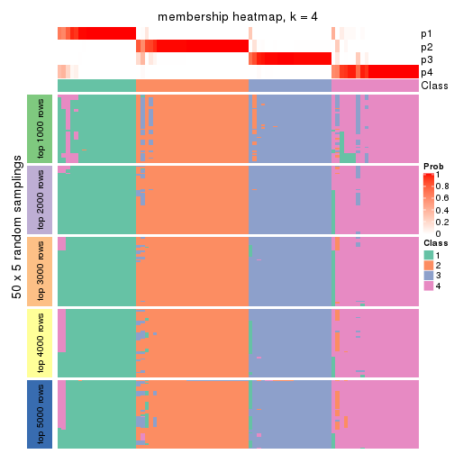</p>

</div>
<div id='tab-SD-skmeans-membership-heatmap-4'>
<pre><code class="r">membership_heatmap(res, k = 5)
</code></pre>

<p></p>

</div>
<div id='tab-SD-skmeans-membership-heatmap-5'>
<pre><code class="r">membership_heatmap(res, k = 6)
</code></pre>

<p></p>

</div>
</div>

As soon as we have had the classes for columns, we can look for signatures
which are significantly different between classes which can be candidate marks
for certain classes. Following are the heatmaps for signatures.


Signature heatmaps where rows are scaled:


<script>
$( function() {
	$( '#tabs-SD-skmeans-get-signatures' ).tabs();
} );
</script>
<div id='tabs-SD-skmeans-get-signatures'>
<ul>
<li><a href='#tab-SD-skmeans-get-signatures-1'>k = 2</a></li>
<li><a href='#tab-SD-skmeans-get-signatures-2'>k = 3</a></li>
<li><a href='#tab-SD-skmeans-get-signatures-3'>k = 4</a></li>
<li><a href='#tab-SD-skmeans-get-signatures-4'>k = 5</a></li>
<li><a href='#tab-SD-skmeans-get-signatures-5'>k = 6</a></li>
</ul>
<div id='tab-SD-skmeans-get-signatures-1'>
<pre><code class="r">get_signatures(res, k = 2)
</code></pre>

<p></p>

</div>
<div id='tab-SD-skmeans-get-signatures-2'>
<pre><code class="r">get_signatures(res, k = 3)
</code></pre>

<p></p>

</div>
<div id='tab-SD-skmeans-get-signatures-3'>
<pre><code class="r">get_signatures(res, k = 4)
</code></pre>

<p></p>

</div>
<div id='tab-SD-skmeans-get-signatures-4'>
<pre><code class="r">get_signatures(res, k = 5)
</code></pre>

<p></p>

</div>
<div id='tab-SD-skmeans-get-signatures-5'>
<pre><code class="r">get_signatures(res, k = 6)
</code></pre>

<p></p>

</div>
</div>


Signature heatmaps where rows are not scaled:


<script>
$( function() {
	$( '#tabs-SD-skmeans-get-signatures-no-scale' ).tabs();
} );
</script>
<div id='tabs-SD-skmeans-get-signatures-no-scale'>
<ul>
<li><a href='#tab-SD-skmeans-get-signatures-no-scale-1'>k = 2</a></li>
<li><a href='#tab-SD-skmeans-get-signatures-no-scale-2'>k = 3</a></li>
<li><a href='#tab-SD-skmeans-get-signatures-no-scale-3'>k = 4</a></li>
<li><a href='#tab-SD-skmeans-get-signatures-no-scale-4'>k = 5</a></li>
<li><a href='#tab-SD-skmeans-get-signatures-no-scale-5'>k = 6</a></li>
</ul>
<div id='tab-SD-skmeans-get-signatures-no-scale-1'>
<pre><code class="r">get_signatures(res, k = 2, scale_rows = FALSE)
</code></pre>

<p></p>

</div>
<div id='tab-SD-skmeans-get-signatures-no-scale-2'>
<pre><code class="r">get_signatures(res, k = 3, scale_rows = FALSE)
</code></pre>

<p></p>

</div>
<div id='tab-SD-skmeans-get-signatures-no-scale-3'>
<pre><code class="r">get_signatures(res, k = 4, scale_rows = FALSE)
</code></pre>

<p></p>

</div>
<div id='tab-SD-skmeans-get-signatures-no-scale-4'>
<pre><code class="r">get_signatures(res, k = 5, scale_rows = FALSE)
</code></pre>

<p></p>

</div>
<div id='tab-SD-skmeans-get-signatures-no-scale-5'>
<pre><code class="r">get_signatures(res, k = 6, scale_rows = FALSE)
</code></pre>

<p></p>

</div>
</div>


Compare the overlap of signatures from different k:

```r
compare_signatures(res)
```


`get_signature()` returns a data frame invisibly. TO get the list of signatures, the function
call should be assigned to a variable explicitly. In following code, if `plot` argument is set
to `FALSE`, no heatmap is plotted while only the differential analysis is performed.

```r
# code only for demonstration
tb = get_signature(res, k = ..., plot = FALSE)
```

An example of the output of `tb` is:

```
#>   which_row         fdr    mean_1    mean_2 scaled_mean_1 scaled_mean_2 km
#> 1        38 0.042760348  8.373488  9.131774    -0.5533452     0.5164555  1
#> 2        40 0.018707592  7.106213  8.469186    -0.6173731     0.5762149  1
#> 3        55 0.019134737 10.221463 11.207825    -0.6159697     0.5749050  1
#> 4        59 0.006059896  5.921854  7.869574    -0.6899429     0.6439467  1
#> 5        60 0.018055526  8.928898 10.211722    -0.6204761     0.5791110  1
#> 6        98 0.009384629 15.714769 14.887706     0.6635654    -0.6193277  2
...
```

The columns in `tb` are:

1. `which_row`: row indices corresponding to the input matrix.
2. `fdr`: FDR for the differential test. 
3. `mean_x`: The mean value in group x.
4. `scaled_mean_x`: The mean value in group x after rows are scaled.
5. `km`: Row groups if k-means clustering is applied to rows.


UMAP plot which shows how samples are separated.


<script>
$( function() {
	$( '#tabs-SD-skmeans-dimension-reduction' ).tabs();
} );
</script>
<div id='tabs-SD-skmeans-dimension-reduction'>
<ul>
<li><a href='#tab-SD-skmeans-dimension-reduction-1'>k = 2</a></li>
<li><a href='#tab-SD-skmeans-dimension-reduction-2'>k = 3</a></li>
<li><a href='#tab-SD-skmeans-dimension-reduction-3'>k = 4</a></li>
<li><a href='#tab-SD-skmeans-dimension-reduction-4'>k = 5</a></li>
<li><a href='#tab-SD-skmeans-dimension-reduction-5'>k = 6</a></li>
</ul>
<div id='tab-SD-skmeans-dimension-reduction-1'>
<pre><code class="r">dimension_reduction(res, k = 2, method = &quot;UMAP&quot;)
</code></pre>

<p></p>

</div>
<div id='tab-SD-skmeans-dimension-reduction-2'>
<pre><code class="r">dimension_reduction(res, k = 3, method = &quot;UMAP&quot;)
</code></pre>

<p></p>

</div>
<div id='tab-SD-skmeans-dimension-reduction-3'>
<pre><code class="r">dimension_reduction(res, k = 4, method = &quot;UMAP&quot;)
</code></pre>

<p></p>

</div>
<div id='tab-SD-skmeans-dimension-reduction-4'>
<pre><code class="r">dimension_reduction(res, k = 5, method = &quot;UMAP&quot;)
</code></pre>

<p></p>

</div>
<div id='tab-SD-skmeans-dimension-reduction-5'>
<pre><code class="r">dimension_reduction(res, k = 6, method = &quot;UMAP&quot;)
</code></pre>

<p></p>

</div>
</div>


Following heatmap shows how subgroups are split when increasing `k`:

```r
collect_classes(res)
```


If matrix rows can be associated to genes, consider to use `functional_enrichment(res,
...)` to perform function enrichment for the signature genes. See [this vignette](http://bioconductor.org/packages/devel/bioc/vignettes/cola/inst/doc/functional_enrichment.html) for more detailed explanations.


 

---------------------------------------------------


### SD:pam


The object with results only for a single top-value method and a single partition method 
can be extracted as:

```r
res = res_list["SD", "pam"]
# you can also extract it by
# res = res_list["SD:pam"]
```

A summary of `res` and all the functions that can be applied to it:

```r
res
```

```
#> A 'ConsensusPartition' object with k = 2, 3, 4, 5, 6.
#>   On a matrix with 17471 rows and 87 columns.
#>   Top rows (1000, 2000, 3000, 4000, 5000) are extracted by 'SD' method.
#>   Subgroups are detected by 'pam' method.
#>   Performed in total 1250 partitions by row resampling.
#>   Best k for subgroups seems to be 6.
#> 
#> Following methods can be applied to this 'ConsensusPartition' object:
#>  [1] "cola_report"             "collect_classes"         "collect_plots"          
#>  [4] "collect_stats"           "colnames"                "compare_signatures"     
#>  [7] "consensus_heatmap"       "dimension_reduction"     "functional_enrichment"  
#> [10] "get_anno_col"            "get_anno"                "get_classes"            
#> [13] "get_consensus"           "get_matrix"              "get_membership"         
#> [16] "get_param"               "get_signatures"          "get_stats"              
#> [19] "is_best_k"               "is_stable_k"             "membership_heatmap"     
#> [22] "ncol"                    "nrow"                    "plot_ecdf"              
#> [25] "rownames"                "select_partition_number" "show"                   
#> [28] "suggest_best_k"          "test_to_known_factors"
```

`collect_plots()` function collects all the plots made from `res` for all `k` (number of partitions)
into one single page to provide an easy and fast comparison between different `k`.

```r
collect_plots(res)
```


The plots are:

- The first row: a plot of the ECDF (empirical cumulative distribution
  function) curves of the consensus matrix for each `k` and the heatmap of
  predicted classes for each `k`.
- The second row: heatmaps of the consensus matrix for each `k`.
- The third row: heatmaps of the membership matrix for each `k`.
- The fouth row: heatmaps of the signatures for each `k`.

All the plots in panels can be made by individual functions and they are
plotted later in this section.

`select_partition_number()` produces several plots showing different
statistics for choosing "optimized" `k`. There are following statistics:

- ECDF curves of the consensus matrix for each `k`;
- 1-PAC. [The PAC
  score](https://en.wikipedia.org/wiki/Consensus_clustering#Over-interpretation_potential_of_consensus_clustering)
  measures the proportion of the ambiguous subgrouping.
- Mean silhouette score.
- Concordance. The mean probability of fiting the consensus class ids in all
  partitions.
- Area increased. Denote $A_k$ as the area under the ECDF curve for current
  `k`, the area increased is defined as $A_k - A_{k-1}$.
- Rand index. The percent of pairs of samples that are both in a same cluster
  or both are not in a same cluster in the partition of k and k-1.
- Jaccard index. The ratio of pairs of samples are both in a same cluster in
  the partition of k and k-1 and the pairs of samples are both in a same
  cluster in the partition k or k-1.

The detailed explanations of these statistics can be found in [the _cola_
vignette](http://bioconductor.org/packages/devel/bioc/vignettes/cola/inst/doc/cola.html#toc_13).

Generally speaking, lower PAC score, higher mean silhouette score or higher
concordance corresponds to better partition. Rand index and Jaccard index
measure how similar the current partition is compared to partition with `k-1`.
If they are too similar, we won't accept `k` is better than `k-1`.

```r
select_partition_number(res)
```


The numeric values for all these statistics can be obtained by `get_stats()`.

```r
get_stats(res)
```

```
#>   k 1-PAC mean_silhouette concordance area_increased  Rand Jaccard
#> 2 2 0.637           0.796       0.904         0.4669 0.536   0.536
#> 3 3 0.513           0.583       0.810         0.4118 0.590   0.362
#> 4 4 0.783           0.831       0.918         0.1386 0.814   0.515
#> 5 5 0.747           0.697       0.868         0.0672 0.920   0.691
#> 6 6 0.841           0.840       0.915         0.0359 0.922   0.645
```

`suggest_best_k()` suggests the best $k$ based on these statistics. The rules are as follows:

- All $k$ with Jaccard index larger than 0.95 are removed because increasing
  $k$ does not provide enough extra information. If all $k$ are removed, it is
  marked as no subgroup is detected.
- For all $k$ with 1-PAC score larger than 0.9, the maximal $k$ is taken as
  the best $k$, and other $k$ are marked as optional $k$.
- If it does not fit the second rule. The $k$ with the maximal vote of the
  highest 1-PAC score, highest mean silhouette, and highest concordance is
  taken as the best $k$.

```r
suggest_best_k(res)
```

```
#> [1] 6
```


Following shows the table of the partitions (You need to click the **show/hide
code output** link to see it). The membership matrix (columns with name `p*`)
is inferred by
[`clue::cl_consensus()`](https://www.rdocumentation.org/link/cl_consensus?package=clue)
function with the `SE` method. Basically the value in the membership matrix
represents the probability to belong to a certain group. The finall class
label for an item is determined with the group with highest probability it
belongs to.

In `get_classes()` function, the entropy is calculated from the membership
matrix and the silhouette score is calculated from the consensus matrix.


<script>
$( function() {
	$( '#tabs-SD-pam-get-classes' ).tabs();
} );
</script>
<div id='tabs-SD-pam-get-classes'>
<ul>
<li><a href='#tab-SD-pam-get-classes-1'>k = 2</a></li>
<li><a href='#tab-SD-pam-get-classes-2'>k = 3</a></li>
<li><a href='#tab-SD-pam-get-classes-3'>k = 4</a></li>
<li><a href='#tab-SD-pam-get-classes-4'>k = 5</a></li>
<li><a href='#tab-SD-pam-get-classes-5'>k = 6</a></li>
</ul>

<div id='tab-SD-pam-get-classes-1'>
<p><a id='tab-SD-pam-get-classes-1-a' style='color:#0366d6' href='#'>show/hide code output</a></p>
<pre><code class="r">cbind(get_classes(res, k = 2), get_membership(res, k = 2))
</code></pre>

<pre><code>#&gt;                                      class entropy silhouette    p1    p2
#&gt; E6088A41-B0DC-4FBF-8D14-BE78024CF8CD     2  0.6343      0.781 0.160 0.840
#&gt; F569915C-8F77-4D67-9730-30824DB57EE5     2  0.1414      0.896 0.020 0.980
#&gt; E3B71CB7-673B-4741-8607-4F0A11633036     1  0.0000      0.862 1.000 0.000
#&gt; DAF84798-FE3F-403C-B589-7F256AF752BE     1  0.9580      0.519 0.620 0.380
#&gt; 2F38E3B1-4975-4877-9DCC-C00270602180     1  0.0000      0.862 1.000 0.000
#&gt; C79A4C2F-02C4-4C03-A5A5-DE06802EEB57     2  0.9580      0.492 0.380 0.620
#&gt; 92E3ED8F-5C74-4ED2-9B03-9FA5E7B491D6     2  0.9710      0.456 0.400 0.600
#&gt; E61D60BE-3BD3-4B5E-BC12-80F3684A0959     2  0.9710      0.456 0.400 0.600
#&gt; C9388FC7-DB1D-4416-BC2D-EA643584F1E6     2  0.1414      0.896 0.020 0.980
#&gt; D4219360-6344-4AF3-ACEB-1701A9F1F67D     1  0.0000      0.862 1.000 0.000
#&gt; 07D155E6-F27C-4D09-B786-8A9B71147B72     1  0.9209      0.587 0.664 0.336
#&gt; 10C8C361-85A5-40E8-A395-B92623E6F27C     1  0.0000      0.862 1.000 0.000
#&gt; BDF20891-7C98-4A55-BBF3-8A836BE303C6     2  0.5629      0.782 0.132 0.868
#&gt; 694B0504-095E-431A-84F2-B4387072138E     2  0.9427      0.525 0.360 0.640
#&gt; EDCF8E7F-8B1D-46F7-8AE0-84A1DC9647D2     2  0.3879      0.850 0.076 0.924
#&gt; 0EA8288E-824D-4304-A053-5A833361F5C5     1  0.0000      0.862 1.000 0.000
#&gt; C4ACCFA1-34A9-4F61-8A1F-35B3B60EA193     2  0.9635      0.478 0.388 0.612
#&gt; 760BA639-38AC-4BC9-9647-09F6893EA8ED     1  0.0000      0.862 1.000 0.000
#&gt; 082DFC6B-C6E6-48B9-BDE5-74FF3B3DC954     2  0.1414      0.896 0.020 0.980
#&gt; FE349848-D7C4-4C49-B670-0E20454DDD7E     1  0.9209      0.587 0.664 0.336
#&gt; 2E8937B3-9EA1-4528-8CEE-BF3D4137908A     2  0.1414      0.896 0.020 0.980
#&gt; 9942D04E-2767-4E39-BA16-7762EAC3DFC4     2  0.0000      0.894 0.000 1.000
#&gt; F9C23182-91C4-4145-AE52-526FE8EB199D     2  0.1414      0.896 0.020 0.980
#&gt; 01024EED-7811-4E24-A067-8E0B978FFE2D     2  0.0000      0.894 0.000 1.000
#&gt; 932C8E98-A352-409C-8744-3D49FABCE425     1  0.0000      0.862 1.000 0.000
#&gt; 6DFD9439-C659-4936-84E5-108F717E3E4D     2  0.1414      0.896 0.020 0.980
#&gt; 1D8B83B8-5DD7-4F45-9D59-487EC6906A8B     2  0.0938      0.895 0.012 0.988
#&gt; 804B8503-73F6-42DE-835F-39DE2C9F13E1     2  0.0000      0.894 0.000 1.000
#&gt; B9453C9B-84D5-43BD-85BB-1780F02F039C     2  0.9710      0.456 0.400 0.600
#&gt; 836E6CD6-4E88-4028-9844-FA3C892C254A     2  0.9833      0.404 0.424 0.576
#&gt; 36EDD202-A845-4CE7-95D5-A515C471262E     2  0.0000      0.894 0.000 1.000
#&gt; 181C156A-B8F4-4F9D-93AA-6AFBD197644D     2  0.0000      0.894 0.000 1.000
#&gt; 0580E798-6A98-4E46-AC96-9A869DFF502E     1  0.0000      0.862 1.000 0.000
#&gt; EA1B63CF-D389-4567-8D9E-B0EF1F804598     2  0.1414      0.896 0.020 0.980
#&gt; 5ABC3D06-B8E9-4831-B89B-7C1EC4006B47     2  0.0000      0.894 0.000 1.000
#&gt; 1CC01E74-A7C1-4A51-9E28-1703C352BE16     2  0.0000      0.894 0.000 1.000
#&gt; 97E55B75-DBDB-46BC-9E74-7828C070BF16     2  0.0000      0.894 0.000 1.000
#&gt; BEB37A2D-E8B0-4674-89AC-DC0F34E0AFD6     1  0.0000      0.862 1.000 0.000
#&gt; 558648BA-6551-4D34-97C2-AD5F677D63FB     2  0.9460      0.519 0.364 0.636
#&gt; FF7021BB-414B-4466-BC43-372D856E6A1D     1  0.9580      0.519 0.620 0.380
#&gt; 9C04B840-54E0-425D-BDBE-8CB6B9C2C722     2  0.1414      0.896 0.020 0.980
#&gt; 5F50B1F4-1A02-4506-AA6D-9BF21CD8059A     1  0.9580      0.519 0.620 0.380
#&gt; 7D4B8FF3-7977-4ABD-AE04-EED1C50B23CC     2  0.1414      0.896 0.020 0.980
#&gt; A005AF15-B98E-4623-8AD4-1E69EFA9BC7A     1  0.0000      0.862 1.000 0.000
#&gt; 1DF04345-5C93-4B18-B307-8D1FCA532999     2  0.0000      0.894 0.000 1.000
#&gt; 6AF30C18-347E-41ED-A4AB-6F81F42206C5     1  0.0000      0.862 1.000 0.000
#&gt; 88A44ED0-BDE1-401E-B0E1-D8C8D6DBAEFC     2  0.9044      0.586 0.320 0.680
#&gt; 117673A3-2918-4702-8583-B66ADE6E4338     2  0.1414      0.896 0.020 0.980
#&gt; 4903A571-E14D-43C9-A737-22CAFAC414CD     2  0.1414      0.896 0.020 0.980
#&gt; C175E68E-632A-4B4A-9DDB-4895C4760F20     1  0.8608      0.475 0.716 0.284
#&gt; FA5CA2F4-A1AD-4A79-B8F3-73A976EB2FB1     2  0.0000      0.894 0.000 1.000
#&gt; E1F883A7-8B1F-4C1D-8A1A-9749A9C09845     2  0.0000      0.894 0.000 1.000
#&gt; E74F0729-6000-4908-ADB0-7BDBAC0639E6     1  0.0000      0.862 1.000 0.000
#&gt; F92135A9-1981-4C79-99A5-4243EEC5D30D     2  0.0000      0.894 0.000 1.000
#&gt; 73C6919F-DEB4-4DA4-B4AE-4032AC8F96C5     1  0.0000      0.862 1.000 0.000
#&gt; 33977B40-2E92-48B6-8D3A-3EBE913F6F8A     1  0.0000      0.862 1.000 0.000
#&gt; 490BD607-2F08-4B4C-9612-F9BB5CBBC8BB     2  0.1414      0.896 0.020 0.980
#&gt; 6C666E17-2EB8-4244-BCC1-8DD34EE4173E     2  0.1414      0.896 0.020 0.980
#&gt; C41F3064-4483-4796-B860-82155BAA5157     1  0.0000      0.862 1.000 0.000
#&gt; F4232B90-51B9-43EE-9971-35B3A318758F     1  0.0000      0.862 1.000 0.000
#&gt; 291EA1F6-FC56-4429-A433-0C452A6A514C     2  0.0000      0.894 0.000 1.000
#&gt; CC4AF04D-CB8E-40DD-B12E-7AA39B38262A     2  0.0000      0.894 0.000 1.000
#&gt; 4DAE26B9-AB57-4763-BB9A-2ADDD5D9C007     1  0.8608      0.643 0.716 0.284
#&gt; 676B4AEE-FB41-4C16-AA91-03E4A1DA8E26     2  0.1414      0.896 0.020 0.980
#&gt; 1CC36859-357A-49E0-A367-4F57D47288BA     2  0.8144      0.676 0.252 0.748
#&gt; 7CCDDFC8-6DF6-4734-96AC-19EBC464FC50     2  0.0000      0.894 0.000 1.000
#&gt; 10F38C34-3956-48ED-AB62-3439EF00D46B     1  0.9580      0.519 0.620 0.380
#&gt; 80B2B393-9D6E-45B4-B696-2A5C203543B7     2  0.0000      0.894 0.000 1.000
#&gt; 5AC7B5EA-1AAC-4529-8E5A-F612E5E0719A     1  0.0000      0.862 1.000 0.000
#&gt; 3648E98D-4B3A-41B7-BE05-595D44F0150D     1  0.0000      0.862 1.000 0.000
#&gt; 252EC850-6026-473B-8FFC-2CF567EF42E4     1  0.9209      0.587 0.664 0.336
#&gt; 1790E7A3-99D8-447E-BC50-51C8A4A18853     2  0.0000      0.894 0.000 1.000
#&gt; DA61A4F8-350B-4DD1-A240-AD016520DB5B     2  0.4022      0.856 0.080 0.920
#&gt; 767E5BAF-2515-40D7-AE7D-0B24D77A03F4     2  0.1414      0.896 0.020 0.980
#&gt; 8CB9C903-D749-44EA-9137-7FB5A92C5932     1  0.0000      0.862 1.000 0.000
#&gt; A9B968AE-2243-41BC-852A-3A12C1FB4892     2  0.3114      0.873 0.056 0.944
#&gt; 3C582264-85BC-4569-A888-8EB3008E5198     2  0.0000      0.894 0.000 1.000
#&gt; F4EAF9A2-9938-4D9B-9080-C0A7542D5704     2  0.0000      0.894 0.000 1.000
#&gt; 328499D3-45DD-4B66-BD22-3C52BA92C2BB     1  0.0000      0.862 1.000 0.000
#&gt; AF8AB83D-2917-4752-8C38-CF84C565B565     1  0.0000      0.862 1.000 0.000
#&gt; 03A327CA-A9FE-42A4-844D-CA85206969FC     2  0.1414      0.896 0.020 0.980
#&gt; 4B0BEC44-87BB-4014-9A26-3529DD63760B     2  0.1414      0.896 0.020 0.980
#&gt; 05C7843E-DC89-4D8E-A78A-952C5DFD667B     2  0.9129      0.575 0.328 0.672
#&gt; 29A0FFF9-13D3-4D16-BE6A-8E48A2C4E315     2  0.0000      0.894 0.000 1.000
#&gt; 22947CC3-4F42-4F44-899C-2B7085E36C9D     2  0.1414      0.896 0.020 0.980
#&gt; A247D92D-253A-4BEC-B450-184AF90D17D0     2  0.1414      0.896 0.020 0.980
#&gt; 0D907A63-D23F-4684-80D9-0BA552435B86     1  0.9209      0.587 0.664 0.336
</code></pre>

<script>
$('#tab-SD-pam-get-classes-1-a').parent().next().next().hide();
$('#tab-SD-pam-get-classes-1-a').click(function(){
  $('#tab-SD-pam-get-classes-1-a').parent().next().next().toggle();
  return(false);
});
</script>
</div>

<div id='tab-SD-pam-get-classes-2'>
<p><a id='tab-SD-pam-get-classes-2-a' style='color:#0366d6' href='#'>show/hide code output</a></p>
<pre><code class="r">cbind(get_classes(res, k = 3), get_membership(res, k = 3))
</code></pre>

<pre><code>#&gt;                                      class entropy silhouette    p1    p2    p3
#&gt; E6088A41-B0DC-4FBF-8D14-BE78024CF8CD     3  0.0237     0.7138 0.004 0.000 0.996
#&gt; F569915C-8F77-4D67-9730-30824DB57EE5     3  0.4931     0.5121 0.232 0.000 0.768
#&gt; E3B71CB7-673B-4741-8607-4F0A11633036     1  0.0424     0.6499 0.992 0.000 0.008
#&gt; DAF84798-FE3F-403C-B589-7F256AF752BE     3  0.6235    -0.1721 0.436 0.000 0.564
#&gt; 2F38E3B1-4975-4877-9DCC-C00270602180     1  0.0237     0.6488 0.996 0.000 0.004
#&gt; C79A4C2F-02C4-4C03-A5A5-DE06802EEB57     1  0.6286     0.1933 0.536 0.000 0.464
#&gt; 92E3ED8F-5C74-4ED2-9B03-9FA5E7B491D6     1  0.5560     0.4732 0.700 0.000 0.300
#&gt; E61D60BE-3BD3-4B5E-BC12-80F3684A0959     1  0.5835     0.3982 0.660 0.000 0.340
#&gt; C9388FC7-DB1D-4416-BC2D-EA643584F1E6     3  0.5560     0.4014 0.300 0.000 0.700
#&gt; D4219360-6344-4AF3-ACEB-1701A9F1F67D     1  0.2261     0.6329 0.932 0.000 0.068
#&gt; 07D155E6-F27C-4D09-B786-8A9B71147B72     1  0.5016     0.5290 0.760 0.000 0.240
#&gt; 10C8C361-85A5-40E8-A395-B92623E6F27C     1  0.5560     0.4732 0.700 0.000 0.300
#&gt; BDF20891-7C98-4A55-BBF3-8A836BE303C6     3  0.5785     0.3995 0.300 0.004 0.696
#&gt; 694B0504-095E-431A-84F2-B4387072138E     1  0.5706     0.4547 0.680 0.000 0.320
#&gt; EDCF8E7F-8B1D-46F7-8AE0-84A1DC9647D2     3  0.6527     0.3538 0.320 0.020 0.660
#&gt; 0EA8288E-824D-4304-A053-5A833361F5C5     1  0.6274    -0.0906 0.544 0.000 0.456
#&gt; C4ACCFA1-34A9-4F61-8A1F-35B3B60EA193     1  0.5706     0.4547 0.680 0.000 0.320
#&gt; 760BA639-38AC-4BC9-9647-09F6893EA8ED     1  0.0424     0.6499 0.992 0.000 0.008
#&gt; 082DFC6B-C6E6-48B9-BDE5-74FF3B3DC954     3  0.0592     0.7161 0.000 0.012 0.988
#&gt; FE349848-D7C4-4C49-B670-0E20454DDD7E     3  0.0592     0.7125 0.012 0.000 0.988
#&gt; 2E8937B3-9EA1-4528-8CEE-BF3D4137908A     3  0.4291     0.5893 0.000 0.180 0.820
#&gt; 9942D04E-2767-4E39-BA16-7762EAC3DFC4     2  0.4931     0.6860 0.000 0.768 0.232
#&gt; F9C23182-91C4-4145-AE52-526FE8EB199D     3  0.8982     0.2242 0.308 0.156 0.536
#&gt; 01024EED-7811-4E24-A067-8E0B978FFE2D     2  0.4931     0.6860 0.000 0.768 0.232
#&gt; 932C8E98-A352-409C-8744-3D49FABCE425     1  0.5529     0.4748 0.704 0.000 0.296
#&gt; 6DFD9439-C659-4936-84E5-108F717E3E4D     3  0.0424     0.7158 0.000 0.008 0.992
#&gt; 1D8B83B8-5DD7-4F45-9D59-487EC6906A8B     3  0.1411     0.7061 0.000 0.036 0.964
#&gt; 804B8503-73F6-42DE-835F-39DE2C9F13E1     2  0.0000     0.9359 0.000 1.000 0.000
#&gt; B9453C9B-84D5-43BD-85BB-1780F02F039C     1  0.5706     0.4547 0.680 0.000 0.320
#&gt; 836E6CD6-4E88-4028-9844-FA3C892C254A     1  0.6286     0.1933 0.536 0.000 0.464
#&gt; 36EDD202-A845-4CE7-95D5-A515C471262E     2  0.2711     0.8676 0.000 0.912 0.088
#&gt; 181C156A-B8F4-4F9D-93AA-6AFBD197644D     2  0.0000     0.9359 0.000 1.000 0.000
#&gt; 0580E798-6A98-4E46-AC96-9A869DFF502E     1  0.0237     0.6488 0.996 0.000 0.004
#&gt; EA1B63CF-D389-4567-8D9E-B0EF1F804598     1  0.6302     0.1629 0.520 0.000 0.480
#&gt; 5ABC3D06-B8E9-4831-B89B-7C1EC4006B47     2  0.0000     0.9359 0.000 1.000 0.000
#&gt; 1CC01E74-A7C1-4A51-9E28-1703C352BE16     2  0.0000     0.9359 0.000 1.000 0.000
#&gt; 97E55B75-DBDB-46BC-9E74-7828C070BF16     2  0.0000     0.9359 0.000 1.000 0.000
#&gt; BEB37A2D-E8B0-4674-89AC-DC0F34E0AFD6     1  0.5098     0.5233 0.752 0.000 0.248
#&gt; 558648BA-6551-4D34-97C2-AD5F677D63FB     1  0.6286     0.1933 0.536 0.000 0.464
#&gt; FF7021BB-414B-4466-BC43-372D856E6A1D     3  0.5560     0.4014 0.300 0.000 0.700
#&gt; 9C04B840-54E0-425D-BDBE-8CB6B9C2C722     3  0.6126     0.2642 0.000 0.400 0.600
#&gt; 5F50B1F4-1A02-4506-AA6D-9BF21CD8059A     3  0.0424     0.7132 0.008 0.000 0.992
#&gt; 7D4B8FF3-7977-4ABD-AE04-EED1C50B23CC     3  0.0592     0.7161 0.000 0.012 0.988
#&gt; A005AF15-B98E-4623-8AD4-1E69EFA9BC7A     1  0.5016     0.5289 0.760 0.000 0.240
#&gt; 1DF04345-5C93-4B18-B307-8D1FCA532999     2  0.0000     0.9359 0.000 1.000 0.000
#&gt; 6AF30C18-347E-41ED-A4AB-6F81F42206C5     1  0.2796     0.6243 0.908 0.000 0.092
#&gt; 88A44ED0-BDE1-401E-B0E1-D8C8D6DBAEFC     3  0.5016     0.5026 0.240 0.000 0.760
#&gt; 117673A3-2918-4702-8583-B66ADE6E4338     2  0.3752     0.8132 0.000 0.856 0.144
#&gt; 4903A571-E14D-43C9-A737-22CAFAC414CD     3  0.0237     0.7138 0.004 0.000 0.996
#&gt; C175E68E-632A-4B4A-9DDB-4895C4760F20     1  0.5810     0.4401 0.664 0.000 0.336
#&gt; FA5CA2F4-A1AD-4A79-B8F3-73A976EB2FB1     2  0.6140     0.2787 0.000 0.596 0.404
#&gt; E1F883A7-8B1F-4C1D-8A1A-9749A9C09845     2  0.0000     0.9359 0.000 1.000 0.000
#&gt; E74F0729-6000-4908-ADB0-7BDBAC0639E6     1  0.0237     0.6488 0.996 0.000 0.004
#&gt; F92135A9-1981-4C79-99A5-4243EEC5D30D     2  0.0000     0.9359 0.000 1.000 0.000
#&gt; 73C6919F-DEB4-4DA4-B4AE-4032AC8F96C5     1  0.0424     0.6499 0.992 0.000 0.008
#&gt; 33977B40-2E92-48B6-8D3A-3EBE913F6F8A     1  0.5178     0.5240 0.744 0.000 0.256
#&gt; 490BD607-2F08-4B4C-9612-F9BB5CBBC8BB     3  0.0592     0.7161 0.000 0.012 0.988
#&gt; 6C666E17-2EB8-4244-BCC1-8DD34EE4173E     3  0.4931     0.5121 0.232 0.000 0.768
#&gt; C41F3064-4483-4796-B860-82155BAA5157     1  0.4931     0.5338 0.768 0.000 0.232
#&gt; F4232B90-51B9-43EE-9971-35B3A318758F     1  0.2165     0.6356 0.936 0.000 0.064
#&gt; 291EA1F6-FC56-4429-A433-0C452A6A514C     2  0.0237     0.9337 0.000 0.996 0.004
#&gt; CC4AF04D-CB8E-40DD-B12E-7AA39B38262A     2  0.0000     0.9359 0.000 1.000 0.000
#&gt; 4DAE26B9-AB57-4763-BB9A-2ADDD5D9C007     1  0.5138     0.5195 0.748 0.000 0.252
#&gt; 676B4AEE-FB41-4C16-AA91-03E4A1DA8E26     3  0.9016     0.2986 0.192 0.252 0.556
#&gt; 1CC36859-357A-49E0-A367-4F57D47288BA     3  0.5621     0.3929 0.308 0.000 0.692
#&gt; 7CCDDFC8-6DF6-4734-96AC-19EBC464FC50     2  0.0000     0.9359 0.000 1.000 0.000
#&gt; 10F38C34-3956-48ED-AB62-3439EF00D46B     3  0.5291     0.4480 0.268 0.000 0.732
#&gt; 80B2B393-9D6E-45B4-B696-2A5C203543B7     2  0.0000     0.9359 0.000 1.000 0.000
#&gt; 5AC7B5EA-1AAC-4529-8E5A-F612E5E0719A     1  0.6309     0.0111 0.500 0.000 0.500
#&gt; 3648E98D-4B3A-41B7-BE05-595D44F0150D     1  0.0424     0.6499 0.992 0.000 0.008
#&gt; 252EC850-6026-473B-8FFC-2CF567EF42E4     1  0.6244     0.1899 0.560 0.000 0.440
#&gt; 1790E7A3-99D8-447E-BC50-51C8A4A18853     2  0.0000     0.9359 0.000 1.000 0.000
#&gt; DA61A4F8-350B-4DD1-A240-AD016520DB5B     3  0.5058     0.4981 0.244 0.000 0.756
#&gt; 767E5BAF-2515-40D7-AE7D-0B24D77A03F4     3  0.0424     0.7132 0.008 0.000 0.992
#&gt; 8CB9C903-D749-44EA-9137-7FB5A92C5932     1  0.0424     0.6499 0.992 0.000 0.008
#&gt; A9B968AE-2243-41BC-852A-3A12C1FB4892     1  0.5216     0.5139 0.740 0.000 0.260
#&gt; 3C582264-85BC-4569-A888-8EB3008E5198     2  0.0000     0.9359 0.000 1.000 0.000
#&gt; F4EAF9A2-9938-4D9B-9080-C0A7542D5704     2  0.0237     0.9337 0.000 0.996 0.004
#&gt; 328499D3-45DD-4B66-BD22-3C52BA92C2BB     1  0.0424     0.6499 0.992 0.000 0.008
#&gt; AF8AB83D-2917-4752-8C38-CF84C565B565     1  0.5497     0.3622 0.708 0.000 0.292
#&gt; 03A327CA-A9FE-42A4-844D-CA85206969FC     3  0.0592     0.7161 0.000 0.012 0.988
#&gt; 4B0BEC44-87BB-4014-9A26-3529DD63760B     3  0.0237     0.7138 0.004 0.000 0.996
#&gt; 05C7843E-DC89-4D8E-A78A-952C5DFD667B     3  0.4842     0.5216 0.224 0.000 0.776
#&gt; 29A0FFF9-13D3-4D16-BE6A-8E48A2C4E315     2  0.0000     0.9359 0.000 1.000 0.000
#&gt; 22947CC3-4F42-4F44-899C-2B7085E36C9D     3  0.0424     0.7160 0.000 0.008 0.992
#&gt; A247D92D-253A-4BEC-B450-184AF90D17D0     3  0.0592     0.7161 0.000 0.012 0.988
#&gt; 0D907A63-D23F-4684-80D9-0BA552435B86     3  0.6286     0.0337 0.464 0.000 0.536
</code></pre>

<script>
$('#tab-SD-pam-get-classes-2-a').parent().next().next().hide();
$('#tab-SD-pam-get-classes-2-a').click(function(){
  $('#tab-SD-pam-get-classes-2-a').parent().next().next().toggle();
  return(false);
});
</script>
</div>

<div id='tab-SD-pam-get-classes-3'>
<p><a id='tab-SD-pam-get-classes-3-a' style='color:#0366d6' href='#'>show/hide code output</a></p>
<pre><code class="r">cbind(get_classes(res, k = 4), get_membership(res, k = 4))
</code></pre>

<pre><code>#&gt;                                      class entropy silhouette    p1    p2    p3    p4
#&gt; E6088A41-B0DC-4FBF-8D14-BE78024CF8CD     3  0.0000      0.939 0.000 0.000 1.000 0.000
#&gt; F569915C-8F77-4D67-9730-30824DB57EE5     3  0.0000      0.939 0.000 0.000 1.000 0.000
#&gt; E3B71CB7-673B-4741-8607-4F0A11633036     1  0.3024      0.764 0.852 0.000 0.000 0.148
#&gt; DAF84798-FE3F-403C-B589-7F256AF752BE     4  0.4730      0.503 0.364 0.000 0.000 0.636
#&gt; 2F38E3B1-4975-4877-9DCC-C00270602180     4  0.0000      0.900 0.000 0.000 0.000 1.000
#&gt; C79A4C2F-02C4-4C03-A5A5-DE06802EEB57     1  0.4730      0.519 0.636 0.000 0.364 0.000
#&gt; 92E3ED8F-5C74-4ED2-9B03-9FA5E7B491D6     1  0.0000      0.798 1.000 0.000 0.000 0.000
#&gt; E61D60BE-3BD3-4B5E-BC12-80F3684A0959     4  0.0000      0.900 0.000 0.000 0.000 1.000
#&gt; C9388FC7-DB1D-4416-BC2D-EA643584F1E6     3  0.0000      0.939 0.000 0.000 1.000 0.000
#&gt; D4219360-6344-4AF3-ACEB-1701A9F1F67D     1  0.0707      0.798 0.980 0.000 0.000 0.020
#&gt; 07D155E6-F27C-4D09-B786-8A9B71147B72     4  0.0000      0.900 0.000 0.000 0.000 1.000
#&gt; 10C8C361-85A5-40E8-A395-B92623E6F27C     1  0.4730      0.569 0.636 0.000 0.000 0.364
#&gt; BDF20891-7C98-4A55-BBF3-8A836BE303C6     4  0.4585      0.518 0.000 0.000 0.332 0.668
#&gt; 694B0504-095E-431A-84F2-B4387072138E     1  0.0000      0.798 1.000 0.000 0.000 0.000
#&gt; EDCF8E7F-8B1D-46F7-8AE0-84A1DC9647D2     4  0.5912      0.668 0.148 0.012 0.116 0.724
#&gt; 0EA8288E-824D-4304-A053-5A833361F5C5     4  0.5057      0.496 0.012 0.000 0.340 0.648
#&gt; C4ACCFA1-34A9-4F61-8A1F-35B3B60EA193     1  0.0000      0.798 1.000 0.000 0.000 0.000
#&gt; 760BA639-38AC-4BC9-9647-09F6893EA8ED     1  0.0000      0.798 1.000 0.000 0.000 0.000
#&gt; 082DFC6B-C6E6-48B9-BDE5-74FF3B3DC954     3  0.0000      0.939 0.000 0.000 1.000 0.000
#&gt; FE349848-D7C4-4C49-B670-0E20454DDD7E     3  0.0000      0.939 0.000 0.000 1.000 0.000
#&gt; 2E8937B3-9EA1-4528-8CEE-BF3D4137908A     2  0.4722      0.541 0.008 0.692 0.300 0.000
#&gt; 9942D04E-2767-4E39-BA16-7762EAC3DFC4     2  0.0000      0.960 0.000 1.000 0.000 0.000
#&gt; F9C23182-91C4-4145-AE52-526FE8EB199D     1  0.4852      0.691 0.776 0.152 0.072 0.000
#&gt; 01024EED-7811-4E24-A067-8E0B978FFE2D     2  0.0000      0.960 0.000 1.000 0.000 0.000
#&gt; 932C8E98-A352-409C-8744-3D49FABCE425     1  0.0817      0.790 0.976 0.000 0.000 0.024
#&gt; 6DFD9439-C659-4936-84E5-108F717E3E4D     3  0.3024      0.786 0.148 0.000 0.852 0.000
#&gt; 1D8B83B8-5DD7-4F45-9D59-487EC6906A8B     3  0.0000      0.939 0.000 0.000 1.000 0.000
#&gt; 804B8503-73F6-42DE-835F-39DE2C9F13E1     2  0.0000      0.960 0.000 1.000 0.000 0.000
#&gt; B9453C9B-84D5-43BD-85BB-1780F02F039C     1  0.2973      0.765 0.856 0.000 0.000 0.144
#&gt; 836E6CD6-4E88-4028-9844-FA3C892C254A     1  0.4730      0.519 0.636 0.000 0.364 0.000
#&gt; 36EDD202-A845-4CE7-95D5-A515C471262E     2  0.3024      0.834 0.148 0.852 0.000 0.000
#&gt; 181C156A-B8F4-4F9D-93AA-6AFBD197644D     2  0.0000      0.960 0.000 1.000 0.000 0.000
#&gt; 0580E798-6A98-4E46-AC96-9A869DFF502E     4  0.0000      0.900 0.000 0.000 0.000 1.000
#&gt; EA1B63CF-D389-4567-8D9E-B0EF1F804598     1  0.0000      0.798 1.000 0.000 0.000 0.000
#&gt; 5ABC3D06-B8E9-4831-B89B-7C1EC4006B47     2  0.0000      0.960 0.000 1.000 0.000 0.000
#&gt; 1CC01E74-A7C1-4A51-9E28-1703C352BE16     2  0.0000      0.960 0.000 1.000 0.000 0.000
#&gt; 97E55B75-DBDB-46BC-9E74-7828C070BF16     2  0.0000      0.960 0.000 1.000 0.000 0.000
#&gt; BEB37A2D-E8B0-4674-89AC-DC0F34E0AFD6     4  0.0000      0.900 0.000 0.000 0.000 1.000
#&gt; 558648BA-6551-4D34-97C2-AD5F677D63FB     1  0.4730      0.519 0.636 0.000 0.364 0.000
#&gt; FF7021BB-414B-4466-BC43-372D856E6A1D     3  0.0000      0.939 0.000 0.000 1.000 0.000
#&gt; 9C04B840-54E0-425D-BDBE-8CB6B9C2C722     2  0.3219      0.787 0.000 0.836 0.164 0.000
#&gt; 5F50B1F4-1A02-4506-AA6D-9BF21CD8059A     3  0.2589      0.823 0.000 0.000 0.884 0.116
#&gt; 7D4B8FF3-7977-4ABD-AE04-EED1C50B23CC     3  0.3024      0.786 0.148 0.000 0.852 0.000
#&gt; A005AF15-B98E-4623-8AD4-1E69EFA9BC7A     4  0.0000      0.900 0.000 0.000 0.000 1.000
#&gt; 1DF04345-5C93-4B18-B307-8D1FCA532999     2  0.0000      0.960 0.000 1.000 0.000 0.000
#&gt; 6AF30C18-347E-41ED-A4AB-6F81F42206C5     4  0.0000      0.900 0.000 0.000 0.000 1.000
#&gt; 88A44ED0-BDE1-401E-B0E1-D8C8D6DBAEFC     3  0.0000      0.939 0.000 0.000 1.000 0.000
#&gt; 117673A3-2918-4702-8583-B66ADE6E4338     2  0.3024      0.834 0.148 0.852 0.000 0.000
#&gt; 4903A571-E14D-43C9-A737-22CAFAC414CD     3  0.0000      0.939 0.000 0.000 1.000 0.000
#&gt; C175E68E-632A-4B4A-9DDB-4895C4760F20     1  0.0000      0.798 1.000 0.000 0.000 0.000
#&gt; FA5CA2F4-A1AD-4A79-B8F3-73A976EB2FB1     3  0.4277      0.598 0.000 0.280 0.720 0.000
#&gt; E1F883A7-8B1F-4C1D-8A1A-9749A9C09845     2  0.0000      0.960 0.000 1.000 0.000 0.000
#&gt; E74F0729-6000-4908-ADB0-7BDBAC0639E6     4  0.0000      0.900 0.000 0.000 0.000 1.000
#&gt; F92135A9-1981-4C79-99A5-4243EEC5D30D     2  0.0000      0.960 0.000 1.000 0.000 0.000
#&gt; 73C6919F-DEB4-4DA4-B4AE-4032AC8F96C5     1  0.4730      0.569 0.636 0.000 0.000 0.364
#&gt; 33977B40-2E92-48B6-8D3A-3EBE913F6F8A     4  0.0336      0.894 0.008 0.000 0.000 0.992
#&gt; 490BD607-2F08-4B4C-9612-F9BB5CBBC8BB     3  0.0000      0.939 0.000 0.000 1.000 0.000
#&gt; 6C666E17-2EB8-4244-BCC1-8DD34EE4173E     3  0.0000      0.939 0.000 0.000 1.000 0.000
#&gt; C41F3064-4483-4796-B860-82155BAA5157     4  0.0000      0.900 0.000 0.000 0.000 1.000
#&gt; F4232B90-51B9-43EE-9971-35B3A318758F     4  0.0000      0.900 0.000 0.000 0.000 1.000
#&gt; 291EA1F6-FC56-4429-A433-0C452A6A514C     2  0.0000      0.960 0.000 1.000 0.000 0.000
#&gt; CC4AF04D-CB8E-40DD-B12E-7AA39B38262A     2  0.0000      0.960 0.000 1.000 0.000 0.000
#&gt; 4DAE26B9-AB57-4763-BB9A-2ADDD5D9C007     4  0.0000      0.900 0.000 0.000 0.000 1.000
#&gt; 676B4AEE-FB41-4C16-AA91-03E4A1DA8E26     3  0.7375      0.210 0.000 0.348 0.480 0.172
#&gt; 1CC36859-357A-49E0-A367-4F57D47288BA     1  0.4830      0.463 0.608 0.000 0.392 0.000
#&gt; 7CCDDFC8-6DF6-4734-96AC-19EBC464FC50     2  0.0000      0.960 0.000 1.000 0.000 0.000
#&gt; 10F38C34-3956-48ED-AB62-3439EF00D46B     3  0.0000      0.939 0.000 0.000 1.000 0.000
#&gt; 80B2B393-9D6E-45B4-B696-2A5C203543B7     2  0.0000      0.960 0.000 1.000 0.000 0.000
#&gt; 5AC7B5EA-1AAC-4529-8E5A-F612E5E0719A     4  0.0000      0.900 0.000 0.000 0.000 1.000
#&gt; 3648E98D-4B3A-41B7-BE05-595D44F0150D     1  0.4730      0.569 0.636 0.000 0.000 0.364
#&gt; 252EC850-6026-473B-8FFC-2CF567EF42E4     4  0.0000      0.900 0.000 0.000 0.000 1.000
#&gt; 1790E7A3-99D8-447E-BC50-51C8A4A18853     2  0.0000      0.960 0.000 1.000 0.000 0.000
#&gt; DA61A4F8-350B-4DD1-A240-AD016520DB5B     3  0.0000      0.939 0.000 0.000 1.000 0.000
#&gt; 767E5BAF-2515-40D7-AE7D-0B24D77A03F4     3  0.0000      0.939 0.000 0.000 1.000 0.000
#&gt; 8CB9C903-D749-44EA-9137-7FB5A92C5932     1  0.3400      0.746 0.820 0.000 0.000 0.180
#&gt; A9B968AE-2243-41BC-852A-3A12C1FB4892     4  0.1118      0.876 0.036 0.000 0.000 0.964
#&gt; 3C582264-85BC-4569-A888-8EB3008E5198     2  0.0000      0.960 0.000 1.000 0.000 0.000
#&gt; F4EAF9A2-9938-4D9B-9080-C0A7542D5704     2  0.0000      0.960 0.000 1.000 0.000 0.000
#&gt; 328499D3-45DD-4B66-BD22-3C52BA92C2BB     1  0.3024      0.764 0.852 0.000 0.000 0.148
#&gt; AF8AB83D-2917-4752-8C38-CF84C565B565     4  0.4767      0.636 0.020 0.000 0.256 0.724
#&gt; 03A327CA-A9FE-42A4-844D-CA85206969FC     3  0.0000      0.939 0.000 0.000 1.000 0.000
#&gt; 4B0BEC44-87BB-4014-9A26-3529DD63760B     3  0.0188      0.936 0.004 0.000 0.996 0.000
#&gt; 05C7843E-DC89-4D8E-A78A-952C5DFD667B     3  0.0000      0.939 0.000 0.000 1.000 0.000
#&gt; 29A0FFF9-13D3-4D16-BE6A-8E48A2C4E315     2  0.0000      0.960 0.000 1.000 0.000 0.000
#&gt; 22947CC3-4F42-4F44-899C-2B7085E36C9D     3  0.0000      0.939 0.000 0.000 1.000 0.000
#&gt; A247D92D-253A-4BEC-B450-184AF90D17D0     3  0.0000      0.939 0.000 0.000 1.000 0.000
#&gt; 0D907A63-D23F-4684-80D9-0BA552435B86     4  0.0000      0.900 0.000 0.000 0.000 1.000
</code></pre>

<script>
$('#tab-SD-pam-get-classes-3-a').parent().next().next().hide();
$('#tab-SD-pam-get-classes-3-a').click(function(){
  $('#tab-SD-pam-get-classes-3-a').parent().next().next().toggle();
  return(false);
});
</script>
</div>

<div id='tab-SD-pam-get-classes-4'>
<p><a id='tab-SD-pam-get-classes-4-a' style='color:#0366d6' href='#'>show/hide code output</a></p>
<pre><code class="r">cbind(get_classes(res, k = 5), get_membership(res, k = 5))
</code></pre>

<pre><code>#&gt;                                      class entropy silhouette    p1    p2    p3    p4    p5
#&gt; E6088A41-B0DC-4FBF-8D14-BE78024CF8CD     3  0.3242     0.6773 0.000 0.000 0.784 0.000 0.216
#&gt; F569915C-8F77-4D67-9730-30824DB57EE5     3  0.0000     0.8688 0.000 0.000 1.000 0.000 0.000
#&gt; E3B71CB7-673B-4741-8607-4F0A11633036     1  0.0000     0.7808 1.000 0.000 0.000 0.000 0.000
#&gt; DAF84798-FE3F-403C-B589-7F256AF752BE     5  0.5644     0.4280 0.144 0.000 0.000 0.228 0.628
#&gt; 2F38E3B1-4975-4877-9DCC-C00270602180     4  0.0162     0.8786 0.004 0.000 0.000 0.996 0.000
#&gt; C79A4C2F-02C4-4C03-A5A5-DE06802EEB57     1  0.6222     0.3760 0.548 0.000 0.216 0.000 0.236
#&gt; 92E3ED8F-5C74-4ED2-9B03-9FA5E7B491D6     1  0.0162     0.7795 0.996 0.000 0.000 0.000 0.004
#&gt; E61D60BE-3BD3-4B5E-BC12-80F3684A0959     4  0.3395     0.6335 0.000 0.000 0.000 0.764 0.236
#&gt; C9388FC7-DB1D-4416-BC2D-EA643584F1E6     5  0.4235    -0.0478 0.000 0.000 0.424 0.000 0.576
#&gt; D4219360-6344-4AF3-ACEB-1701A9F1F67D     1  0.0000     0.7808 1.000 0.000 0.000 0.000 0.000
#&gt; 07D155E6-F27C-4D09-B786-8A9B71147B72     4  0.0000     0.8783 0.000 0.000 0.000 1.000 0.000
#&gt; 10C8C361-85A5-40E8-A395-B92623E6F27C     1  0.3336     0.6883 0.772 0.000 0.000 0.228 0.000
#&gt; BDF20891-7C98-4A55-BBF3-8A836BE303C6     4  0.6442     0.2503 0.000 0.000 0.196 0.480 0.324
#&gt; 694B0504-095E-431A-84F2-B4387072138E     1  0.0880     0.7726 0.968 0.000 0.000 0.000 0.032
#&gt; EDCF8E7F-8B1D-46F7-8AE0-84A1DC9647D2     5  0.0880     0.6491 0.000 0.000 0.000 0.032 0.968
#&gt; 0EA8288E-824D-4304-A053-5A833361F5C5     4  0.4591     0.4728 0.012 0.000 0.332 0.648 0.008
#&gt; C4ACCFA1-34A9-4F61-8A1F-35B3B60EA193     1  0.2280     0.7072 0.880 0.000 0.000 0.000 0.120
#&gt; 760BA639-38AC-4BC9-9647-09F6893EA8ED     1  0.3837     0.3998 0.692 0.000 0.000 0.000 0.308
#&gt; 082DFC6B-C6E6-48B9-BDE5-74FF3B3DC954     3  0.0000     0.8688 0.000 0.000 1.000 0.000 0.000
#&gt; FE349848-D7C4-4C49-B670-0E20454DDD7E     3  0.0000     0.8688 0.000 0.000 1.000 0.000 0.000
#&gt; 2E8937B3-9EA1-4528-8CEE-BF3D4137908A     5  0.5609     0.1988 0.004 0.344 0.076 0.000 0.576
#&gt; 9942D04E-2767-4E39-BA16-7762EAC3DFC4     2  0.3210     0.7071 0.000 0.788 0.000 0.000 0.212
#&gt; F9C23182-91C4-4145-AE52-526FE8EB199D     5  0.0162     0.6507 0.004 0.000 0.000 0.000 0.996
#&gt; 01024EED-7811-4E24-A067-8E0B978FFE2D     2  0.2179     0.8258 0.000 0.888 0.000 0.000 0.112
#&gt; 932C8E98-A352-409C-8744-3D49FABCE425     5  0.4906     0.0194 0.480 0.000 0.000 0.024 0.496
#&gt; 6DFD9439-C659-4936-84E5-108F717E3E4D     5  0.1043     0.6429 0.000 0.000 0.040 0.000 0.960
#&gt; 1D8B83B8-5DD7-4F45-9D59-487EC6906A8B     3  0.1478     0.8338 0.000 0.000 0.936 0.000 0.064
#&gt; 804B8503-73F6-42DE-835F-39DE2C9F13E1     2  0.0000     0.8972 0.000 1.000 0.000 0.000 0.000
#&gt; B9453C9B-84D5-43BD-85BB-1780F02F039C     1  0.0807     0.7813 0.976 0.000 0.000 0.012 0.012
#&gt; 836E6CD6-4E88-4028-9844-FA3C892C254A     1  0.3812     0.6693 0.772 0.000 0.204 0.000 0.024
#&gt; 36EDD202-A845-4CE7-95D5-A515C471262E     5  0.2127     0.6205 0.000 0.108 0.000 0.000 0.892
#&gt; 181C156A-B8F4-4F9D-93AA-6AFBD197644D     2  0.0000     0.8972 0.000 1.000 0.000 0.000 0.000
#&gt; 0580E798-6A98-4E46-AC96-9A869DFF502E     4  0.0162     0.8786 0.004 0.000 0.000 0.996 0.000
#&gt; EA1B63CF-D389-4567-8D9E-B0EF1F804598     5  0.3508     0.4413 0.252 0.000 0.000 0.000 0.748
#&gt; 5ABC3D06-B8E9-4831-B89B-7C1EC4006B47     2  0.0000     0.8972 0.000 1.000 0.000 0.000 0.000
#&gt; 1CC01E74-A7C1-4A51-9E28-1703C352BE16     2  0.0000     0.8972 0.000 1.000 0.000 0.000 0.000
#&gt; 97E55B75-DBDB-46BC-9E74-7828C070BF16     2  0.4171     0.3399 0.000 0.604 0.000 0.000 0.396
#&gt; BEB37A2D-E8B0-4674-89AC-DC0F34E0AFD6     4  0.0451     0.8756 0.004 0.000 0.000 0.988 0.008
#&gt; 558648BA-6551-4D34-97C2-AD5F677D63FB     1  0.3336     0.6609 0.772 0.000 0.228 0.000 0.000
#&gt; FF7021BB-414B-4466-BC43-372D856E6A1D     3  0.2377     0.7687 0.000 0.000 0.872 0.000 0.128
#&gt; 9C04B840-54E0-425D-BDBE-8CB6B9C2C722     5  0.4893     0.0666 0.000 0.404 0.028 0.000 0.568
#&gt; 5F50B1F4-1A02-4506-AA6D-9BF21CD8059A     3  0.2389     0.7771 0.000 0.000 0.880 0.116 0.004
#&gt; 7D4B8FF3-7977-4ABD-AE04-EED1C50B23CC     5  0.0290     0.6514 0.000 0.000 0.008 0.000 0.992
#&gt; A005AF15-B98E-4623-8AD4-1E69EFA9BC7A     4  0.0000     0.8783 0.000 0.000 0.000 1.000 0.000
#&gt; 1DF04345-5C93-4B18-B307-8D1FCA532999     2  0.0000     0.8972 0.000 1.000 0.000 0.000 0.000
#&gt; 6AF30C18-347E-41ED-A4AB-6F81F42206C5     4  0.0162     0.8786 0.004 0.000 0.000 0.996 0.000
#&gt; 88A44ED0-BDE1-401E-B0E1-D8C8D6DBAEFC     3  0.0000     0.8688 0.000 0.000 1.000 0.000 0.000
#&gt; 117673A3-2918-4702-8583-B66ADE6E4338     5  0.3395     0.5111 0.000 0.236 0.000 0.000 0.764
#&gt; 4903A571-E14D-43C9-A737-22CAFAC414CD     3  0.4291     0.2456 0.000 0.000 0.536 0.000 0.464
#&gt; C175E68E-632A-4B4A-9DDB-4895C4760F20     5  0.4235     0.2082 0.424 0.000 0.000 0.000 0.576
#&gt; FA5CA2F4-A1AD-4A79-B8F3-73A976EB2FB1     3  0.3684     0.5594 0.000 0.280 0.720 0.000 0.000
#&gt; E1F883A7-8B1F-4C1D-8A1A-9749A9C09845     2  0.3395     0.6564 0.000 0.764 0.000 0.000 0.236
#&gt; E74F0729-6000-4908-ADB0-7BDBAC0639E6     4  0.0162     0.8786 0.004 0.000 0.000 0.996 0.000
#&gt; F92135A9-1981-4C79-99A5-4243EEC5D30D     2  0.0000     0.8972 0.000 1.000 0.000 0.000 0.000
#&gt; 73C6919F-DEB4-4DA4-B4AE-4032AC8F96C5     1  0.3336     0.6883 0.772 0.000 0.000 0.228 0.000
#&gt; 33977B40-2E92-48B6-8D3A-3EBE913F6F8A     4  0.0912     0.8674 0.016 0.000 0.000 0.972 0.012
#&gt; 490BD607-2F08-4B4C-9612-F9BB5CBBC8BB     3  0.0000     0.8688 0.000 0.000 1.000 0.000 0.000
#&gt; 6C666E17-2EB8-4244-BCC1-8DD34EE4173E     3  0.0000     0.8688 0.000 0.000 1.000 0.000 0.000
#&gt; C41F3064-4483-4796-B860-82155BAA5157     4  0.0000     0.8783 0.000 0.000 0.000 1.000 0.000
#&gt; F4232B90-51B9-43EE-9971-35B3A318758F     4  0.0162     0.8786 0.004 0.000 0.000 0.996 0.000
#&gt; 291EA1F6-FC56-4429-A433-0C452A6A514C     2  0.1671     0.8542 0.000 0.924 0.000 0.000 0.076
#&gt; CC4AF04D-CB8E-40DD-B12E-7AA39B38262A     2  0.0290     0.8938 0.000 0.992 0.000 0.000 0.008
#&gt; 4DAE26B9-AB57-4763-BB9A-2ADDD5D9C007     4  0.0000     0.8783 0.000 0.000 0.000 1.000 0.000
#&gt; 676B4AEE-FB41-4C16-AA91-03E4A1DA8E26     3  0.7342     0.1555 0.000 0.132 0.456 0.072 0.340
#&gt; 1CC36859-357A-49E0-A367-4F57D47288BA     1  0.6345     0.3223 0.524 0.000 0.252 0.000 0.224
#&gt; 7CCDDFC8-6DF6-4734-96AC-19EBC464FC50     2  0.0000     0.8972 0.000 1.000 0.000 0.000 0.000
#&gt; 10F38C34-3956-48ED-AB62-3439EF00D46B     3  0.0000     0.8688 0.000 0.000 1.000 0.000 0.000
#&gt; 80B2B393-9D6E-45B4-B696-2A5C203543B7     2  0.3395     0.6564 0.000 0.764 0.000 0.000 0.236
#&gt; 5AC7B5EA-1AAC-4529-8E5A-F612E5E0719A     4  0.0162     0.8786 0.004 0.000 0.000 0.996 0.000
#&gt; 3648E98D-4B3A-41B7-BE05-595D44F0150D     1  0.2966     0.7165 0.816 0.000 0.000 0.184 0.000
#&gt; 252EC850-6026-473B-8FFC-2CF567EF42E4     4  0.0510     0.8709 0.000 0.000 0.000 0.984 0.016
#&gt; 1790E7A3-99D8-447E-BC50-51C8A4A18853     2  0.0000     0.8972 0.000 1.000 0.000 0.000 0.000
#&gt; DA61A4F8-350B-4DD1-A240-AD016520DB5B     3  0.0000     0.8688 0.000 0.000 1.000 0.000 0.000
#&gt; 767E5BAF-2515-40D7-AE7D-0B24D77A03F4     3  0.0794     0.8589 0.000 0.000 0.972 0.000 0.028
#&gt; 8CB9C903-D749-44EA-9137-7FB5A92C5932     1  0.1851     0.7651 0.912 0.000 0.000 0.088 0.000
#&gt; A9B968AE-2243-41BC-852A-3A12C1FB4892     4  0.5535     0.2637 0.072 0.000 0.000 0.536 0.392
#&gt; 3C582264-85BC-4569-A888-8EB3008E5198     2  0.0000     0.8972 0.000 1.000 0.000 0.000 0.000
#&gt; F4EAF9A2-9938-4D9B-9080-C0A7542D5704     2  0.2179     0.8258 0.000 0.888 0.000 0.000 0.112
#&gt; 328499D3-45DD-4B66-BD22-3C52BA92C2BB     1  0.0162     0.7816 0.996 0.000 0.000 0.004 0.000
#&gt; AF8AB83D-2917-4752-8C38-CF84C565B565     4  0.5601     0.5837 0.088 0.000 0.216 0.672 0.024
#&gt; 03A327CA-A9FE-42A4-844D-CA85206969FC     3  0.0162     0.8675 0.000 0.000 0.996 0.000 0.004
#&gt; 4B0BEC44-87BB-4014-9A26-3529DD63760B     3  0.4150     0.4047 0.000 0.000 0.612 0.000 0.388
#&gt; 05C7843E-DC89-4D8E-A78A-952C5DFD667B     3  0.0000     0.8688 0.000 0.000 1.000 0.000 0.000
#&gt; 29A0FFF9-13D3-4D16-BE6A-8E48A2C4E315     2  0.0000     0.8972 0.000 1.000 0.000 0.000 0.000
#&gt; 22947CC3-4F42-4F44-899C-2B7085E36C9D     3  0.1043     0.8515 0.000 0.000 0.960 0.000 0.040
#&gt; A247D92D-253A-4BEC-B450-184AF90D17D0     3  0.0000     0.8688 0.000 0.000 1.000 0.000 0.000
#&gt; 0D907A63-D23F-4684-80D9-0BA552435B86     4  0.0000     0.8783 0.000 0.000 0.000 1.000 0.000
</code></pre>

<script>
$('#tab-SD-pam-get-classes-4-a').parent().next().next().hide();
$('#tab-SD-pam-get-classes-4-a').click(function(){
  $('#tab-SD-pam-get-classes-4-a').parent().next().next().toggle();
  return(false);
});
</script>
</div>

<div id='tab-SD-pam-get-classes-5'>
<p><a id='tab-SD-pam-get-classes-5-a' style='color:#0366d6' href='#'>show/hide code output</a></p>
<pre><code class="r">cbind(get_classes(res, k = 6), get_membership(res, k = 6))
</code></pre>

<pre><code>#&gt;                                      class entropy silhouette    p1    p2    p3    p4    p5    p6
#&gt; E6088A41-B0DC-4FBF-8D14-BE78024CF8CD     3  0.3175      0.632 0.000 0.000 0.744 0.000 0.000 0.256
#&gt; F569915C-8F77-4D67-9730-30824DB57EE5     3  0.0000      0.940 0.000 0.000 1.000 0.000 0.000 0.000
#&gt; E3B71CB7-673B-4741-8607-4F0A11633036     1  0.0458      0.791 0.984 0.000 0.000 0.000 0.016 0.000
#&gt; DAF84798-FE3F-403C-B589-7F256AF752BE     5  0.0909      0.899 0.012 0.000 0.000 0.000 0.968 0.020
#&gt; 2F38E3B1-4975-4877-9DCC-C00270602180     4  0.0146      0.940 0.004 0.000 0.000 0.996 0.000 0.000
#&gt; C79A4C2F-02C4-4C03-A5A5-DE06802EEB57     6  0.2365      0.836 0.040 0.000 0.072 0.000 0.000 0.888
#&gt; 92E3ED8F-5C74-4ED2-9B03-9FA5E7B491D6     1  0.1007      0.782 0.956 0.000 0.000 0.000 0.044 0.000
#&gt; E61D60BE-3BD3-4B5E-BC12-80F3684A0959     6  0.2854      0.755 0.000 0.000 0.000 0.208 0.000 0.792
#&gt; C9388FC7-DB1D-4416-BC2D-EA643584F1E6     6  0.0717      0.858 0.000 0.000 0.008 0.000 0.016 0.976
#&gt; D4219360-6344-4AF3-ACEB-1701A9F1F67D     1  0.0458      0.791 0.984 0.000 0.000 0.000 0.016 0.000
#&gt; 07D155E6-F27C-4D09-B786-8A9B71147B72     4  0.0260      0.940 0.000 0.000 0.000 0.992 0.000 0.008
#&gt; 10C8C361-85A5-40E8-A395-B92623E6F27C     1  0.3101      0.682 0.756 0.000 0.000 0.244 0.000 0.000
#&gt; BDF20891-7C98-4A55-BBF3-8A836BE303C6     6  0.3051      0.802 0.000 0.000 0.036 0.112 0.008 0.844
#&gt; 694B0504-095E-431A-84F2-B4387072138E     1  0.2854      0.704 0.792 0.000 0.000 0.000 0.208 0.000
#&gt; EDCF8E7F-8B1D-46F7-8AE0-84A1DC9647D2     5  0.1714      0.863 0.000 0.000 0.000 0.000 0.908 0.092
#&gt; 0EA8288E-824D-4304-A053-5A833361F5C5     4  0.4170      0.472 0.020 0.000 0.328 0.648 0.000 0.004
#&gt; C4ACCFA1-34A9-4F61-8A1F-35B3B60EA193     1  0.3684      0.490 0.628 0.000 0.000 0.000 0.372 0.000
#&gt; 760BA639-38AC-4BC9-9647-09F6893EA8ED     5  0.3828      0.293 0.440 0.000 0.000 0.000 0.560 0.000
#&gt; 082DFC6B-C6E6-48B9-BDE5-74FF3B3DC954     3  0.0000      0.940 0.000 0.000 1.000 0.000 0.000 0.000
#&gt; FE349848-D7C4-4C49-B670-0E20454DDD7E     3  0.0000      0.940 0.000 0.000 1.000 0.000 0.000 0.000
#&gt; 2E8937B3-9EA1-4528-8CEE-BF3D4137908A     6  0.0603      0.857 0.000 0.000 0.004 0.000 0.016 0.980
#&gt; 9942D04E-2767-4E39-BA16-7762EAC3DFC4     2  0.3659      0.523 0.000 0.636 0.000 0.000 0.000 0.364
#&gt; F9C23182-91C4-4145-AE52-526FE8EB199D     6  0.1863      0.827 0.000 0.000 0.000 0.000 0.104 0.896
#&gt; 01024EED-7811-4E24-A067-8E0B978FFE2D     2  0.1387      0.903 0.000 0.932 0.000 0.000 0.000 0.068
#&gt; 932C8E98-A352-409C-8744-3D49FABCE425     5  0.0458      0.890 0.016 0.000 0.000 0.000 0.984 0.000
#&gt; 6DFD9439-C659-4936-84E5-108F717E3E4D     5  0.1124      0.898 0.000 0.000 0.008 0.000 0.956 0.036
#&gt; 1D8B83B8-5DD7-4F45-9D59-487EC6906A8B     3  0.0146      0.938 0.000 0.000 0.996 0.000 0.000 0.004
#&gt; 804B8503-73F6-42DE-835F-39DE2C9F13E1     2  0.0000      0.943 0.000 1.000 0.000 0.000 0.000 0.000
#&gt; B9453C9B-84D5-43BD-85BB-1780F02F039C     1  0.3210      0.727 0.812 0.000 0.000 0.036 0.000 0.152
#&gt; 836E6CD6-4E88-4028-9844-FA3C892C254A     1  0.3928      0.693 0.756 0.000 0.196 0.004 0.040 0.004
#&gt; 36EDD202-A845-4CE7-95D5-A515C471262E     6  0.1349      0.849 0.000 0.004 0.000 0.000 0.056 0.940
#&gt; 181C156A-B8F4-4F9D-93AA-6AFBD197644D     2  0.0000      0.943 0.000 1.000 0.000 0.000 0.000 0.000
#&gt; 0580E798-6A98-4E46-AC96-9A869DFF502E     4  0.0000      0.941 0.000 0.000 0.000 1.000 0.000 0.000
#&gt; EA1B63CF-D389-4567-8D9E-B0EF1F804598     5  0.0865      0.901 0.000 0.000 0.000 0.000 0.964 0.036
#&gt; 5ABC3D06-B8E9-4831-B89B-7C1EC4006B47     2  0.0363      0.937 0.000 0.988 0.000 0.000 0.000 0.012
#&gt; 1CC01E74-A7C1-4A51-9E28-1703C352BE16     2  0.0000      0.943 0.000 1.000 0.000 0.000 0.000 0.000
#&gt; 97E55B75-DBDB-46BC-9E74-7828C070BF16     6  0.1663      0.842 0.000 0.088 0.000 0.000 0.000 0.912
#&gt; BEB37A2D-E8B0-4674-89AC-DC0F34E0AFD6     4  0.0363      0.936 0.000 0.000 0.000 0.988 0.012 0.000
#&gt; 558648BA-6551-4D34-97C2-AD5F677D63FB     1  0.3101      0.670 0.756 0.000 0.244 0.000 0.000 0.000
#&gt; FF7021BB-414B-4466-BC43-372D856E6A1D     3  0.1501      0.883 0.000 0.000 0.924 0.000 0.000 0.076
#&gt; 9C04B840-54E0-425D-BDBE-8CB6B9C2C722     6  0.0870      0.859 0.000 0.004 0.012 0.000 0.012 0.972
#&gt; 5F50B1F4-1A02-4506-AA6D-9BF21CD8059A     3  0.2146      0.833 0.000 0.000 0.880 0.116 0.000 0.004
#&gt; 7D4B8FF3-7977-4ABD-AE04-EED1C50B23CC     6  0.1910      0.824 0.000 0.000 0.000 0.000 0.108 0.892
#&gt; A005AF15-B98E-4623-8AD4-1E69EFA9BC7A     4  0.0260      0.940 0.000 0.000 0.000 0.992 0.000 0.008
#&gt; 1DF04345-5C93-4B18-B307-8D1FCA532999     2  0.0000      0.943 0.000 1.000 0.000 0.000 0.000 0.000
#&gt; 6AF30C18-347E-41ED-A4AB-6F81F42206C5     4  0.0000      0.941 0.000 0.000 0.000 1.000 0.000 0.000
#&gt; 88A44ED0-BDE1-401E-B0E1-D8C8D6DBAEFC     3  0.0000      0.940 0.000 0.000 1.000 0.000 0.000 0.000
#&gt; 117673A3-2918-4702-8583-B66ADE6E4338     5  0.1082      0.899 0.000 0.004 0.000 0.000 0.956 0.040
#&gt; 4903A571-E14D-43C9-A737-22CAFAC414CD     6  0.3431      0.692 0.000 0.000 0.228 0.000 0.016 0.756
#&gt; C175E68E-632A-4B4A-9DDB-4895C4760F20     5  0.0458      0.890 0.016 0.000 0.000 0.000 0.984 0.000
#&gt; FA5CA2F4-A1AD-4A79-B8F3-73A976EB2FB1     3  0.3309      0.605 0.000 0.280 0.720 0.000 0.000 0.000
#&gt; E1F883A7-8B1F-4C1D-8A1A-9749A9C09845     6  0.1957      0.833 0.000 0.112 0.000 0.000 0.000 0.888
#&gt; E74F0729-6000-4908-ADB0-7BDBAC0639E6     4  0.0000      0.941 0.000 0.000 0.000 1.000 0.000 0.000
#&gt; F92135A9-1981-4C79-99A5-4243EEC5D30D     2  0.0000      0.943 0.000 1.000 0.000 0.000 0.000 0.000
#&gt; 73C6919F-DEB4-4DA4-B4AE-4032AC8F96C5     1  0.3101      0.682 0.756 0.000 0.000 0.244 0.000 0.000
#&gt; 33977B40-2E92-48B6-8D3A-3EBE913F6F8A     4  0.1036      0.919 0.024 0.000 0.000 0.964 0.008 0.004
#&gt; 490BD607-2F08-4B4C-9612-F9BB5CBBC8BB     3  0.0000      0.940 0.000 0.000 1.000 0.000 0.000 0.000
#&gt; 6C666E17-2EB8-4244-BCC1-8DD34EE4173E     3  0.0000      0.940 0.000 0.000 1.000 0.000 0.000 0.000
#&gt; C41F3064-4483-4796-B860-82155BAA5157     4  0.0260      0.940 0.000 0.000 0.000 0.992 0.000 0.008
#&gt; F4232B90-51B9-43EE-9971-35B3A318758F     4  0.0000      0.941 0.000 0.000 0.000 1.000 0.000 0.000
#&gt; 291EA1F6-FC56-4429-A433-0C452A6A514C     2  0.1075      0.917 0.000 0.952 0.000 0.000 0.000 0.048
#&gt; CC4AF04D-CB8E-40DD-B12E-7AA39B38262A     2  0.2730      0.773 0.000 0.808 0.000 0.000 0.000 0.192
#&gt; 4DAE26B9-AB57-4763-BB9A-2ADDD5D9C007     4  0.0291      0.940 0.000 0.000 0.000 0.992 0.004 0.004
#&gt; 676B4AEE-FB41-4C16-AA91-03E4A1DA8E26     6  0.3883      0.742 0.000 0.000 0.144 0.088 0.000 0.768
#&gt; 1CC36859-357A-49E0-A367-4F57D47288BA     1  0.4536      0.484 0.608 0.000 0.356 0.000 0.012 0.024
#&gt; 7CCDDFC8-6DF6-4734-96AC-19EBC464FC50     2  0.0000      0.943 0.000 1.000 0.000 0.000 0.000 0.000
#&gt; 10F38C34-3956-48ED-AB62-3439EF00D46B     3  0.0000      0.940 0.000 0.000 1.000 0.000 0.000 0.000
#&gt; 80B2B393-9D6E-45B4-B696-2A5C203543B7     6  0.1957      0.833 0.000 0.112 0.000 0.000 0.000 0.888
#&gt; 5AC7B5EA-1AAC-4529-8E5A-F612E5E0719A     4  0.0000      0.941 0.000 0.000 0.000 1.000 0.000 0.000
#&gt; 3648E98D-4B3A-41B7-BE05-595D44F0150D     1  0.0937      0.791 0.960 0.000 0.000 0.040 0.000 0.000
#&gt; 252EC850-6026-473B-8FFC-2CF567EF42E4     4  0.0622      0.935 0.000 0.000 0.000 0.980 0.008 0.012
#&gt; 1790E7A3-99D8-447E-BC50-51C8A4A18853     2  0.0000      0.943 0.000 1.000 0.000 0.000 0.000 0.000
#&gt; DA61A4F8-350B-4DD1-A240-AD016520DB5B     3  0.0000      0.940 0.000 0.000 1.000 0.000 0.000 0.000
#&gt; 767E5BAF-2515-40D7-AE7D-0B24D77A03F4     3  0.0717      0.925 0.000 0.000 0.976 0.000 0.016 0.008
#&gt; 8CB9C903-D749-44EA-9137-7FB5A92C5932     1  0.1075      0.790 0.952 0.000 0.000 0.048 0.000 0.000
#&gt; A9B968AE-2243-41BC-852A-3A12C1FB4892     6  0.3731      0.728 0.008 0.000 0.000 0.212 0.024 0.756
#&gt; 3C582264-85BC-4569-A888-8EB3008E5198     2  0.0000      0.943 0.000 1.000 0.000 0.000 0.000 0.000
#&gt; F4EAF9A2-9938-4D9B-9080-C0A7542D5704     2  0.1387      0.903 0.000 0.932 0.000 0.000 0.000 0.068
#&gt; 328499D3-45DD-4B66-BD22-3C52BA92C2BB     1  0.0000      0.791 1.000 0.000 0.000 0.000 0.000 0.000
#&gt; AF8AB83D-2917-4752-8C38-CF84C565B565     4  0.5080      0.593 0.104 0.000 0.200 0.676 0.016 0.004
#&gt; 03A327CA-A9FE-42A4-844D-CA85206969FC     3  0.0146      0.937 0.000 0.000 0.996 0.000 0.000 0.004
#&gt; 4B0BEC44-87BB-4014-9A26-3529DD63760B     3  0.2980      0.774 0.000 0.000 0.808 0.000 0.012 0.180
#&gt; 05C7843E-DC89-4D8E-A78A-952C5DFD667B     3  0.0000      0.940 0.000 0.000 1.000 0.000 0.000 0.000
#&gt; 29A0FFF9-13D3-4D16-BE6A-8E48A2C4E315     2  0.0000      0.943 0.000 1.000 0.000 0.000 0.000 0.000
#&gt; 22947CC3-4F42-4F44-899C-2B7085E36C9D     3  0.0000      0.940 0.000 0.000 1.000 0.000 0.000 0.000
#&gt; A247D92D-253A-4BEC-B450-184AF90D17D0     3  0.0000      0.940 0.000 0.000 1.000 0.000 0.000 0.000
#&gt; 0D907A63-D23F-4684-80D9-0BA552435B86     4  0.0260      0.940 0.000 0.000 0.000 0.992 0.000 0.008
</code></pre>

<script>
$('#tab-SD-pam-get-classes-5-a').parent().next().next().hide();
$('#tab-SD-pam-get-classes-5-a').click(function(){
  $('#tab-SD-pam-get-classes-5-a').parent().next().next().toggle();
  return(false);
});
</script>
</div>
</div>

Heatmaps for the consensus matrix. It visualizes the probability of two
samples to be in a same group.


<script>
$( function() {
	$( '#tabs-SD-pam-consensus-heatmap' ).tabs();
} );
</script>
<div id='tabs-SD-pam-consensus-heatmap'>
<ul>
<li><a href='#tab-SD-pam-consensus-heatmap-1'>k = 2</a></li>
<li><a href='#tab-SD-pam-consensus-heatmap-2'>k = 3</a></li>
<li><a href='#tab-SD-pam-consensus-heatmap-3'>k = 4</a></li>
<li><a href='#tab-SD-pam-consensus-heatmap-4'>k = 5</a></li>
<li><a href='#tab-SD-pam-consensus-heatmap-5'>k = 6</a></li>
</ul>
<div id='tab-SD-pam-consensus-heatmap-1'>
<pre><code class="r">consensus_heatmap(res, k = 2)
</code></pre>

<p></p>

</div>
<div id='tab-SD-pam-consensus-heatmap-2'>
<pre><code class="r">consensus_heatmap(res, k = 3)
</code></pre>

<p></p>

</div>
<div id='tab-SD-pam-consensus-heatmap-3'>
<pre><code class="r">consensus_heatmap(res, k = 4)
</code></pre>

<p></p>

</div>
<div id='tab-SD-pam-consensus-heatmap-4'>
<pre><code class="r">consensus_heatmap(res, k = 5)
</code></pre>

<p></p>

</div>
<div id='tab-SD-pam-consensus-heatmap-5'>
<pre><code class="r">consensus_heatmap(res, k = 6)
</code></pre>

<p></p>

</div>
</div>

Heatmaps for the membership of samples in all partitions to see how consistent they are:


<script>
$( function() {
	$( '#tabs-SD-pam-membership-heatmap' ).tabs();
} );
</script>
<div id='tabs-SD-pam-membership-heatmap'>
<ul>
<li><a href='#tab-SD-pam-membership-heatmap-1'>k = 2</a></li>
<li><a href='#tab-SD-pam-membership-heatmap-2'>k = 3</a></li>
<li><a href='#tab-SD-pam-membership-heatmap-3'>k = 4</a></li>
<li><a href='#tab-SD-pam-membership-heatmap-4'>k = 5</a></li>
<li><a href='#tab-SD-pam-membership-heatmap-5'>k = 6</a></li>
</ul>
<div id='tab-SD-pam-membership-heatmap-1'>
<pre><code class="r">membership_heatmap(res, k = 2)
</code></pre>

<p></p>

</div>
<div id='tab-SD-pam-membership-heatmap-2'>
<pre><code class="r">membership_heatmap(res, k = 3)
</code></pre>

<p></p>

</div>
<div id='tab-SD-pam-membership-heatmap-3'>
<pre><code class="r">membership_heatmap(res, k = 4)
</code></pre>

<p></p>

</div>
<div id='tab-SD-pam-membership-heatmap-4'>
<pre><code class="r">membership_heatmap(res, k = 5)
</code></pre>

<p></p>

</div>
<div id='tab-SD-pam-membership-heatmap-5'>
<pre><code class="r">membership_heatmap(res, k = 6)
</code></pre>

<p></p>

</div>
</div>

As soon as we have had the classes for columns, we can look for signatures
which are significantly different between classes which can be candidate marks
for certain classes. Following are the heatmaps for signatures.


Signature heatmaps where rows are scaled:


<script>
$( function() {
	$( '#tabs-SD-pam-get-signatures' ).tabs();
} );
</script>
<div id='tabs-SD-pam-get-signatures'>
<ul>
<li><a href='#tab-SD-pam-get-signatures-1'>k = 2</a></li>
<li><a href='#tab-SD-pam-get-signatures-2'>k = 3</a></li>
<li><a href='#tab-SD-pam-get-signatures-3'>k = 4</a></li>
<li><a href='#tab-SD-pam-get-signatures-4'>k = 5</a></li>
<li><a href='#tab-SD-pam-get-signatures-5'>k = 6</a></li>
</ul>
<div id='tab-SD-pam-get-signatures-1'>
<pre><code class="r">get_signatures(res, k = 2)
</code></pre>

<p></p>

</div>
<div id='tab-SD-pam-get-signatures-2'>
<pre><code class="r">get_signatures(res, k = 3)
</code></pre>

<p></p>

</div>
<div id='tab-SD-pam-get-signatures-3'>
<pre><code class="r">get_signatures(res, k = 4)
</code></pre>

<p></p>

</div>
<div id='tab-SD-pam-get-signatures-4'>
<pre><code class="r">get_signatures(res, k = 5)
</code></pre>

<p></p>

</div>
<div id='tab-SD-pam-get-signatures-5'>
<pre><code class="r">get_signatures(res, k = 6)
</code></pre>

<p></p>

</div>
</div>


Signature heatmaps where rows are not scaled:


<script>
$( function() {
	$( '#tabs-SD-pam-get-signatures-no-scale' ).tabs();
} );
</script>
<div id='tabs-SD-pam-get-signatures-no-scale'>
<ul>
<li><a href='#tab-SD-pam-get-signatures-no-scale-1'>k = 2</a></li>
<li><a href='#tab-SD-pam-get-signatures-no-scale-2'>k = 3</a></li>
<li><a href='#tab-SD-pam-get-signatures-no-scale-3'>k = 4</a></li>
<li><a href='#tab-SD-pam-get-signatures-no-scale-4'>k = 5</a></li>
<li><a href='#tab-SD-pam-get-signatures-no-scale-5'>k = 6</a></li>
</ul>
<div id='tab-SD-pam-get-signatures-no-scale-1'>
<pre><code class="r">get_signatures(res, k = 2, scale_rows = FALSE)
</code></pre>

<p></p>

</div>
<div id='tab-SD-pam-get-signatures-no-scale-2'>
<pre><code class="r">get_signatures(res, k = 3, scale_rows = FALSE)
</code></pre>

<p></p>

</div>
<div id='tab-SD-pam-get-signatures-no-scale-3'>
<pre><code class="r">get_signatures(res, k = 4, scale_rows = FALSE)
</code></pre>

<p></p>

</div>
<div id='tab-SD-pam-get-signatures-no-scale-4'>
<pre><code class="r">get_signatures(res, k = 5, scale_rows = FALSE)
</code></pre>

<p></p>

</div>
<div id='tab-SD-pam-get-signatures-no-scale-5'>
<pre><code class="r">get_signatures(res, k = 6, scale_rows = FALSE)
</code></pre>

<p></p>

</div>
</div>


Compare the overlap of signatures from different k:

```r
compare_signatures(res)
```


`get_signature()` returns a data frame invisibly. TO get the list of signatures, the function
call should be assigned to a variable explicitly. In following code, if `plot` argument is set
to `FALSE`, no heatmap is plotted while only the differential analysis is performed.

```r
# code only for demonstration
tb = get_signature(res, k = ..., plot = FALSE)
```

An example of the output of `tb` is:

```
#>   which_row         fdr    mean_1    mean_2 scaled_mean_1 scaled_mean_2 km
#> 1        38 0.042760348  8.373488  9.131774    -0.5533452     0.5164555  1
#> 2        40 0.018707592  7.106213  8.469186    -0.6173731     0.5762149  1
#> 3        55 0.019134737 10.221463 11.207825    -0.6159697     0.5749050  1
#> 4        59 0.006059896  5.921854  7.869574    -0.6899429     0.6439467  1
#> 5        60 0.018055526  8.928898 10.211722    -0.6204761     0.5791110  1
#> 6        98 0.009384629 15.714769 14.887706     0.6635654    -0.6193277  2
...
```

The columns in `tb` are:

1. `which_row`: row indices corresponding to the input matrix.
2. `fdr`: FDR for the differential test. 
3. `mean_x`: The mean value in group x.
4. `scaled_mean_x`: The mean value in group x after rows are scaled.
5. `km`: Row groups if k-means clustering is applied to rows.


UMAP plot which shows how samples are separated.


<script>
$( function() {
	$( '#tabs-SD-pam-dimension-reduction' ).tabs();
} );
</script>
<div id='tabs-SD-pam-dimension-reduction'>
<ul>
<li><a href='#tab-SD-pam-dimension-reduction-1'>k = 2</a></li>
<li><a href='#tab-SD-pam-dimension-reduction-2'>k = 3</a></li>
<li><a href='#tab-SD-pam-dimension-reduction-3'>k = 4</a></li>
<li><a href='#tab-SD-pam-dimension-reduction-4'>k = 5</a></li>
<li><a href='#tab-SD-pam-dimension-reduction-5'>k = 6</a></li>
</ul>
<div id='tab-SD-pam-dimension-reduction-1'>
<pre><code class="r">dimension_reduction(res, k = 2, method = &quot;UMAP&quot;)
</code></pre>

<p></p>

</div>
<div id='tab-SD-pam-dimension-reduction-2'>
<pre><code class="r">dimension_reduction(res, k = 3, method = &quot;UMAP&quot;)
</code></pre>

<p></p>

</div>
<div id='tab-SD-pam-dimension-reduction-3'>
<pre><code class="r">dimension_reduction(res, k = 4, method = &quot;UMAP&quot;)
</code></pre>

<p></p>

</div>
<div id='tab-SD-pam-dimension-reduction-4'>
<pre><code class="r">dimension_reduction(res, k = 5, method = &quot;UMAP&quot;)
</code></pre>

<p></p>

</div>
<div id='tab-SD-pam-dimension-reduction-5'>
<pre><code class="r">dimension_reduction(res, k = 6, method = &quot;UMAP&quot;)
</code></pre>

<p></p>

</div>
</div>


Following heatmap shows how subgroups are split when increasing `k`:

```r
collect_classes(res)
```


If matrix rows can be associated to genes, consider to use `functional_enrichment(res,
...)` to perform function enrichment for the signature genes. See [this vignette](http://bioconductor.org/packages/devel/bioc/vignettes/cola/inst/doc/functional_enrichment.html) for more detailed explanations.


 

---------------------------------------------------


### SD:mclust


The object with results only for a single top-value method and a single partition method 
can be extracted as:

```r
res = res_list["SD", "mclust"]
# you can also extract it by
# res = res_list["SD:mclust"]
```

A summary of `res` and all the functions that can be applied to it:

```r
res
```

```
#> A 'ConsensusPartition' object with k = 2, 3, 4, 5, 6.
#>   On a matrix with 17471 rows and 87 columns.
#>   Top rows (1000, 2000, 3000, 4000, 5000) are extracted by 'SD' method.
#>   Subgroups are detected by 'mclust' method.
#>   Performed in total 1250 partitions by row resampling.
#>   Best k for subgroups seems to be 2.
#> 
#> Following methods can be applied to this 'ConsensusPartition' object:
#>  [1] "cola_report"             "collect_classes"         "collect_plots"          
#>  [4] "collect_stats"           "colnames"                "compare_signatures"     
#>  [7] "consensus_heatmap"       "dimension_reduction"     "functional_enrichment"  
#> [10] "get_anno_col"            "get_anno"                "get_classes"            
#> [13] "get_consensus"           "get_matrix"              "get_membership"         
#> [16] "get_param"               "get_signatures"          "get_stats"              
#> [19] "is_best_k"               "is_stable_k"             "membership_heatmap"     
#> [22] "ncol"                    "nrow"                    "plot_ecdf"              
#> [25] "rownames"                "select_partition_number" "show"                   
#> [28] "suggest_best_k"          "test_to_known_factors"
```

`collect_plots()` function collects all the plots made from `res` for all `k` (number of partitions)
into one single page to provide an easy and fast comparison between different `k`.

```r
collect_plots(res)
```


The plots are:

- The first row: a plot of the ECDF (empirical cumulative distribution
  function) curves of the consensus matrix for each `k` and the heatmap of
  predicted classes for each `k`.
- The second row: heatmaps of the consensus matrix for each `k`.
- The third row: heatmaps of the membership matrix for each `k`.
- The fouth row: heatmaps of the signatures for each `k`.

All the plots in panels can be made by individual functions and they are
plotted later in this section.

`select_partition_number()` produces several plots showing different
statistics for choosing "optimized" `k`. There are following statistics:

- ECDF curves of the consensus matrix for each `k`;
- 1-PAC. [The PAC
  score](https://en.wikipedia.org/wiki/Consensus_clustering#Over-interpretation_potential_of_consensus_clustering)
  measures the proportion of the ambiguous subgrouping.
- Mean silhouette score.
- Concordance. The mean probability of fiting the consensus class ids in all
  partitions.
- Area increased. Denote $A_k$ as the area under the ECDF curve for current
  `k`, the area increased is defined as $A_k - A_{k-1}$.
- Rand index. The percent of pairs of samples that are both in a same cluster
  or both are not in a same cluster in the partition of k and k-1.
- Jaccard index. The ratio of pairs of samples are both in a same cluster in
  the partition of k and k-1 and the pairs of samples are both in a same
  cluster in the partition k or k-1.

The detailed explanations of these statistics can be found in [the _cola_
vignette](http://bioconductor.org/packages/devel/bioc/vignettes/cola/inst/doc/cola.html#toc_13).

Generally speaking, lower PAC score, higher mean silhouette score or higher
concordance corresponds to better partition. Rand index and Jaccard index
measure how similar the current partition is compared to partition with `k-1`.
If they are too similar, we won't accept `k` is better than `k-1`.

```r
select_partition_number(res)
```


The numeric values for all these statistics can be obtained by `get_stats()`.

```r
get_stats(res)
```

```
#>   k 1-PAC mean_silhouette concordance area_increased  Rand Jaccard
#> 2 2 0.212           0.811       0.863         0.4590 0.505   0.505
#> 3 3 0.468           0.607       0.784         0.3175 0.760   0.574
#> 4 4 0.694           0.803       0.841         0.1550 0.752   0.450
#> 5 5 0.672           0.650       0.809         0.0956 0.962   0.863
#> 6 6 0.691           0.578       0.785         0.0459 0.907   0.651
```

`suggest_best_k()` suggests the best $k$ based on these statistics. The rules are as follows:

- All $k$ with Jaccard index larger than 0.95 are removed because increasing
  $k$ does not provide enough extra information. If all $k$ are removed, it is
  marked as no subgroup is detected.
- For all $k$ with 1-PAC score larger than 0.9, the maximal $k$ is taken as
  the best $k$, and other $k$ are marked as optional $k$.
- If it does not fit the second rule. The $k$ with the maximal vote of the
  highest 1-PAC score, highest mean silhouette, and highest concordance is
  taken as the best $k$.

```r
suggest_best_k(res)
```

```
#> [1] 2
```


Following shows the table of the partitions (You need to click the **show/hide
code output** link to see it). The membership matrix (columns with name `p*`)
is inferred by
[`clue::cl_consensus()`](https://www.rdocumentation.org/link/cl_consensus?package=clue)
function with the `SE` method. Basically the value in the membership matrix
represents the probability to belong to a certain group. The finall class
label for an item is determined with the group with highest probability it
belongs to.

In `get_classes()` function, the entropy is calculated from the membership
matrix and the silhouette score is calculated from the consensus matrix.


<script>
$( function() {
	$( '#tabs-SD-mclust-get-classes' ).tabs();
} );
</script>
<div id='tabs-SD-mclust-get-classes'>
<ul>
<li><a href='#tab-SD-mclust-get-classes-1'>k = 2</a></li>
<li><a href='#tab-SD-mclust-get-classes-2'>k = 3</a></li>
<li><a href='#tab-SD-mclust-get-classes-3'>k = 4</a></li>
<li><a href='#tab-SD-mclust-get-classes-4'>k = 5</a></li>
<li><a href='#tab-SD-mclust-get-classes-5'>k = 6</a></li>
</ul>

<div id='tab-SD-mclust-get-classes-1'>
<p><a id='tab-SD-mclust-get-classes-1-a' style='color:#0366d6' href='#'>show/hide code output</a></p>
<pre><code class="r">cbind(get_classes(res, k = 2), get_membership(res, k = 2))
</code></pre>

<pre><code>#&gt;                                      class entropy silhouette    p1    p2
#&gt; E6088A41-B0DC-4FBF-8D14-BE78024CF8CD     2   0.653    0.78472 0.168 0.832
#&gt; F569915C-8F77-4D67-9730-30824DB57EE5     2   0.358    0.84254 0.068 0.932
#&gt; E3B71CB7-673B-4741-8607-4F0A11633036     1   0.373    0.89368 0.928 0.072
#&gt; DAF84798-FE3F-403C-B589-7F256AF752BE     1   0.844    0.75539 0.728 0.272
#&gt; 2F38E3B1-4975-4877-9DCC-C00270602180     1   0.343    0.89376 0.936 0.064
#&gt; C79A4C2F-02C4-4C03-A5A5-DE06802EEB57     2   0.866    0.71411 0.288 0.712
#&gt; 92E3ED8F-5C74-4ED2-9B03-9FA5E7B491D6     1   0.373    0.89368 0.928 0.072
#&gt; E61D60BE-3BD3-4B5E-BC12-80F3684A0959     1   0.402    0.89076 0.920 0.080
#&gt; C9388FC7-DB1D-4416-BC2D-EA643584F1E6     2   0.760    0.83494 0.220 0.780
#&gt; D4219360-6344-4AF3-ACEB-1701A9F1F67D     1   0.373    0.89368 0.928 0.072
#&gt; 07D155E6-F27C-4D09-B786-8A9B71147B72     1   0.327    0.88399 0.940 0.060
#&gt; 10C8C361-85A5-40E8-A395-B92623E6F27C     1   0.402    0.89451 0.920 0.080
#&gt; BDF20891-7C98-4A55-BBF3-8A836BE303C6     2   0.552    0.86304 0.128 0.872
#&gt; 694B0504-095E-431A-84F2-B4387072138E     1   0.373    0.89368 0.928 0.072
#&gt; EDCF8E7F-8B1D-46F7-8AE0-84A1DC9647D2     2   0.327    0.85340 0.060 0.940
#&gt; 0EA8288E-824D-4304-A053-5A833361F5C5     1   0.430    0.87388 0.912 0.088
#&gt; C4ACCFA1-34A9-4F61-8A1F-35B3B60EA193     1   0.373    0.89368 0.928 0.072
#&gt; 760BA639-38AC-4BC9-9647-09F6893EA8ED     1   0.373    0.89368 0.928 0.072
#&gt; 082DFC6B-C6E6-48B9-BDE5-74FF3B3DC954     2   0.443    0.83298 0.092 0.908
#&gt; FE349848-D7C4-4C49-B670-0E20454DDD7E     2   0.932    0.56740 0.348 0.652
#&gt; 2E8937B3-9EA1-4528-8CEE-BF3D4137908A     2   0.541    0.86339 0.124 0.876
#&gt; 9942D04E-2767-4E39-BA16-7762EAC3DFC4     2   0.855    0.71338 0.280 0.720
#&gt; F9C23182-91C4-4145-AE52-526FE8EB199D     2   0.563    0.86249 0.132 0.868
#&gt; 01024EED-7811-4E24-A067-8E0B978FFE2D     2   0.662    0.85085 0.172 0.828
#&gt; 932C8E98-A352-409C-8744-3D49FABCE425     1   0.373    0.89368 0.928 0.072
#&gt; 6DFD9439-C659-4936-84E5-108F717E3E4D     2   0.343    0.84754 0.064 0.936
#&gt; 1D8B83B8-5DD7-4F45-9D59-487EC6906A8B     2   0.260    0.84655 0.044 0.956
#&gt; 804B8503-73F6-42DE-835F-39DE2C9F13E1     2   0.443    0.85557 0.092 0.908
#&gt; B9453C9B-84D5-43BD-85BB-1780F02F039C     1   0.430    0.88668 0.912 0.088
#&gt; 836E6CD6-4E88-4028-9844-FA3C892C254A     1   0.775    0.81903 0.772 0.228
#&gt; 36EDD202-A845-4CE7-95D5-A515C471262E     2   0.358    0.85766 0.068 0.932
#&gt; 181C156A-B8F4-4F9D-93AA-6AFBD197644D     2   0.541    0.86325 0.124 0.876
#&gt; 0580E798-6A98-4E46-AC96-9A869DFF502E     1   0.482    0.89096 0.896 0.104
#&gt; EA1B63CF-D389-4567-8D9E-B0EF1F804598     2   0.992    0.14073 0.448 0.552
#&gt; 5ABC3D06-B8E9-4831-B89B-7C1EC4006B47     2   0.795    0.76876 0.240 0.760
#&gt; 1CC01E74-A7C1-4A51-9E28-1703C352BE16     2   0.469    0.85946 0.100 0.900
#&gt; 97E55B75-DBDB-46BC-9E74-7828C070BF16     2   0.541    0.86339 0.124 0.876
#&gt; BEB37A2D-E8B0-4674-89AC-DC0F34E0AFD6     1   0.311    0.88443 0.944 0.056
#&gt; 558648BA-6551-4D34-97C2-AD5F677D63FB     1   0.563    0.88195 0.868 0.132
#&gt; FF7021BB-414B-4466-BC43-372D856E6A1D     2   0.850    0.62766 0.276 0.724
#&gt; 9C04B840-54E0-425D-BDBE-8CB6B9C2C722     2   0.563    0.86242 0.132 0.868
#&gt; 5F50B1F4-1A02-4506-AA6D-9BF21CD8059A     1   0.767    0.68157 0.776 0.224
#&gt; 7D4B8FF3-7977-4ABD-AE04-EED1C50B23CC     2   0.260    0.84655 0.044 0.956
#&gt; A005AF15-B98E-4623-8AD4-1E69EFA9BC7A     1   0.343    0.88577 0.936 0.064
#&gt; 1DF04345-5C93-4B18-B307-8D1FCA532999     2   0.456    0.85786 0.096 0.904
#&gt; 6AF30C18-347E-41ED-A4AB-6F81F42206C5     1   0.327    0.88886 0.940 0.060
#&gt; 88A44ED0-BDE1-401E-B0E1-D8C8D6DBAEFC     2   0.373    0.85958 0.072 0.928
#&gt; 117673A3-2918-4702-8583-B66ADE6E4338     2   0.260    0.84655 0.044 0.956
#&gt; 4903A571-E14D-43C9-A737-22CAFAC414CD     2   0.946    0.54872 0.364 0.636
#&gt; C175E68E-632A-4B4A-9DDB-4895C4760F20     1   0.402    0.89063 0.920 0.080
#&gt; FA5CA2F4-A1AD-4A79-B8F3-73A976EB2FB1     2   0.574    0.86509 0.136 0.864
#&gt; E1F883A7-8B1F-4C1D-8A1A-9749A9C09845     2   0.518    0.86349 0.116 0.884
#&gt; E74F0729-6000-4908-ADB0-7BDBAC0639E6     1   0.358    0.89294 0.932 0.068
#&gt; F92135A9-1981-4C79-99A5-4243EEC5D30D     2   0.541    0.86339 0.124 0.876
#&gt; 73C6919F-DEB4-4DA4-B4AE-4032AC8F96C5     1   0.529    0.88493 0.880 0.120
#&gt; 33977B40-2E92-48B6-8D3A-3EBE913F6F8A     1   0.469    0.86533 0.900 0.100
#&gt; 490BD607-2F08-4B4C-9612-F9BB5CBBC8BB     2   0.529    0.82325 0.120 0.880
#&gt; 6C666E17-2EB8-4244-BCC1-8DD34EE4173E     2   0.584    0.85746 0.140 0.860
#&gt; C41F3064-4483-4796-B860-82155BAA5157     1   0.295    0.88621 0.948 0.052
#&gt; F4232B90-51B9-43EE-9971-35B3A318758F     1   0.327    0.88643 0.940 0.060
#&gt; 291EA1F6-FC56-4429-A433-0C452A6A514C     2   0.518    0.86349 0.116 0.884
#&gt; CC4AF04D-CB8E-40DD-B12E-7AA39B38262A     2   0.482    0.86082 0.104 0.896
#&gt; 4DAE26B9-AB57-4763-BB9A-2ADDD5D9C007     1   0.552    0.83217 0.872 0.128
#&gt; 676B4AEE-FB41-4C16-AA91-03E4A1DA8E26     1   0.983   -0.00704 0.576 0.424
#&gt; 1CC36859-357A-49E0-A367-4F57D47288BA     2   0.958    0.37054 0.380 0.620
#&gt; 7CCDDFC8-6DF6-4734-96AC-19EBC464FC50     2   0.518    0.86349 0.116 0.884
#&gt; 10F38C34-3956-48ED-AB62-3439EF00D46B     2   0.971    0.58047 0.400 0.600
#&gt; 80B2B393-9D6E-45B4-B696-2A5C203543B7     2   0.518    0.86349 0.116 0.884
#&gt; 5AC7B5EA-1AAC-4529-8E5A-F612E5E0719A     1   0.738    0.72637 0.792 0.208
#&gt; 3648E98D-4B3A-41B7-BE05-595D44F0150D     1   0.373    0.89368 0.928 0.072
#&gt; 252EC850-6026-473B-8FFC-2CF567EF42E4     1   0.373    0.88074 0.928 0.072
#&gt; 1790E7A3-99D8-447E-BC50-51C8A4A18853     2   0.443    0.85557 0.092 0.908
#&gt; DA61A4F8-350B-4DD1-A240-AD016520DB5B     2   0.541    0.82883 0.124 0.876
#&gt; 767E5BAF-2515-40D7-AE7D-0B24D77A03F4     2   0.653    0.80406 0.168 0.832
#&gt; 8CB9C903-D749-44EA-9137-7FB5A92C5932     1   0.402    0.89336 0.920 0.080
#&gt; A9B968AE-2243-41BC-852A-3A12C1FB4892     1   0.518    0.86070 0.884 0.116
#&gt; 3C582264-85BC-4569-A888-8EB3008E5198     2   0.482    0.86091 0.104 0.896
#&gt; F4EAF9A2-9938-4D9B-9080-C0A7542D5704     2   0.541    0.86339 0.124 0.876
#&gt; 328499D3-45DD-4B66-BD22-3C52BA92C2BB     1   0.373    0.89368 0.928 0.072
#&gt; AF8AB83D-2917-4752-8C38-CF84C565B565     1   0.327    0.88637 0.940 0.060
#&gt; 03A327CA-A9FE-42A4-844D-CA85206969FC     2   0.494    0.86001 0.108 0.892
#&gt; 4B0BEC44-87BB-4014-9A26-3529DD63760B     2   0.895    0.63785 0.312 0.688
#&gt; 05C7843E-DC89-4D8E-A78A-952C5DFD667B     2   0.913    0.61072 0.328 0.672
#&gt; 29A0FFF9-13D3-4D16-BE6A-8E48A2C4E315     2   0.456    0.85791 0.096 0.904
#&gt; 22947CC3-4F42-4F44-899C-2B7085E36C9D     2   0.278    0.84705 0.048 0.952
#&gt; A247D92D-253A-4BEC-B450-184AF90D17D0     2   0.541    0.82027 0.124 0.876
#&gt; 0D907A63-D23F-4684-80D9-0BA552435B86     1   0.775    0.66904 0.772 0.228
</code></pre>

<script>
$('#tab-SD-mclust-get-classes-1-a').parent().next().next().hide();
$('#tab-SD-mclust-get-classes-1-a').click(function(){
  $('#tab-SD-mclust-get-classes-1-a').parent().next().next().toggle();
  return(false);
});
</script>
</div>

<div id='tab-SD-mclust-get-classes-2'>
<p><a id='tab-SD-mclust-get-classes-2-a' style='color:#0366d6' href='#'>show/hide code output</a></p>
<pre><code class="r">cbind(get_classes(res, k = 3), get_membership(res, k = 3))
</code></pre>

<pre><code>#&gt;                                      class entropy silhouette    p1    p2    p3
#&gt; E6088A41-B0DC-4FBF-8D14-BE78024CF8CD     2  0.6305     0.5586 0.000 0.516 0.484
#&gt; F569915C-8F77-4D67-9730-30824DB57EE5     2  0.6302     0.5648 0.000 0.520 0.480
#&gt; E3B71CB7-673B-4741-8607-4F0A11633036     1  0.0000     0.9683 1.000 0.000 0.000
#&gt; DAF84798-FE3F-403C-B589-7F256AF752BE     3  0.9211     0.2594 0.224 0.240 0.536
#&gt; 2F38E3B1-4975-4877-9DCC-C00270602180     3  0.6280     0.1023 0.460 0.000 0.540
#&gt; C79A4C2F-02C4-4C03-A5A5-DE06802EEB57     2  0.8659     0.3875 0.104 0.488 0.408
#&gt; 92E3ED8F-5C74-4ED2-9B03-9FA5E7B491D6     1  0.0000     0.9683 1.000 0.000 0.000
#&gt; E61D60BE-3BD3-4B5E-BC12-80F3684A0959     3  0.4750     0.6761 0.216 0.000 0.784
#&gt; C9388FC7-DB1D-4416-BC2D-EA643584F1E6     3  0.6521    -0.5393 0.004 0.492 0.504
#&gt; D4219360-6344-4AF3-ACEB-1701A9F1F67D     1  0.0000     0.9683 1.000 0.000 0.000
#&gt; 07D155E6-F27C-4D09-B786-8A9B71147B72     3  0.4796     0.6752 0.220 0.000 0.780
#&gt; 10C8C361-85A5-40E8-A395-B92623E6F27C     1  0.1289     0.9377 0.968 0.000 0.032
#&gt; BDF20891-7C98-4A55-BBF3-8A836BE303C6     2  0.4748     0.6684 0.024 0.832 0.144
#&gt; 694B0504-095E-431A-84F2-B4387072138E     1  0.0000     0.9683 1.000 0.000 0.000
#&gt; EDCF8E7F-8B1D-46F7-8AE0-84A1DC9647D2     2  0.6295     0.5746 0.000 0.528 0.472
#&gt; 0EA8288E-824D-4304-A053-5A833361F5C5     3  0.4750     0.6761 0.216 0.000 0.784
#&gt; C4ACCFA1-34A9-4F61-8A1F-35B3B60EA193     1  0.0000     0.9683 1.000 0.000 0.000
#&gt; 760BA639-38AC-4BC9-9647-09F6893EA8ED     1  0.0000     0.9683 1.000 0.000 0.000
#&gt; 082DFC6B-C6E6-48B9-BDE5-74FF3B3DC954     2  0.6204     0.6279 0.000 0.576 0.424
#&gt; FE349848-D7C4-4C49-B670-0E20454DDD7E     3  0.0000     0.5724 0.000 0.000 1.000
#&gt; 2E8937B3-9EA1-4528-8CEE-BF3D4137908A     2  0.2878     0.7109 0.000 0.904 0.096
#&gt; 9942D04E-2767-4E39-BA16-7762EAC3DFC4     2  0.4121     0.7065 0.000 0.832 0.168
#&gt; F9C23182-91C4-4145-AE52-526FE8EB199D     2  0.6630     0.6796 0.028 0.672 0.300
#&gt; 01024EED-7811-4E24-A067-8E0B978FFE2D     2  0.0424     0.7141 0.000 0.992 0.008
#&gt; 932C8E98-A352-409C-8744-3D49FABCE425     1  0.3116     0.8655 0.892 0.000 0.108
#&gt; 6DFD9439-C659-4936-84E5-108F717E3E4D     2  0.6302     0.5633 0.000 0.520 0.480
#&gt; 1D8B83B8-5DD7-4F45-9D59-487EC6906A8B     2  0.5968     0.6689 0.000 0.636 0.364
#&gt; 804B8503-73F6-42DE-835F-39DE2C9F13E1     2  0.0000     0.7157 0.000 1.000 0.000
#&gt; B9453C9B-84D5-43BD-85BB-1780F02F039C     1  0.0000     0.9683 1.000 0.000 0.000
#&gt; 836E6CD6-4E88-4028-9844-FA3C892C254A     3  0.9598     0.2683 0.304 0.228 0.468
#&gt; 36EDD202-A845-4CE7-95D5-A515C471262E     2  0.5810     0.6795 0.000 0.664 0.336
#&gt; 181C156A-B8F4-4F9D-93AA-6AFBD197644D     2  0.0000     0.7157 0.000 1.000 0.000
#&gt; 0580E798-6A98-4E46-AC96-9A869DFF502E     3  0.4842     0.6711 0.224 0.000 0.776
#&gt; EA1B63CF-D389-4567-8D9E-B0EF1F804598     2  0.6793     0.5893 0.012 0.536 0.452
#&gt; 5ABC3D06-B8E9-4831-B89B-7C1EC4006B47     2  0.0237     0.7161 0.000 0.996 0.004
#&gt; 1CC01E74-A7C1-4A51-9E28-1703C352BE16     2  0.0000     0.7157 0.000 1.000 0.000
#&gt; 97E55B75-DBDB-46BC-9E74-7828C070BF16     2  0.0237     0.7161 0.000 0.996 0.004
#&gt; BEB37A2D-E8B0-4674-89AC-DC0F34E0AFD6     3  0.4796     0.6752 0.220 0.000 0.780
#&gt; 558648BA-6551-4D34-97C2-AD5F677D63FB     3  0.4796     0.6752 0.220 0.000 0.780
#&gt; FF7021BB-414B-4466-BC43-372D856E6A1D     2  0.6309     0.5381 0.000 0.504 0.496
#&gt; 9C04B840-54E0-425D-BDBE-8CB6B9C2C722     2  0.5621     0.6862 0.000 0.692 0.308
#&gt; 5F50B1F4-1A02-4506-AA6D-9BF21CD8059A     3  0.4002     0.6530 0.160 0.000 0.840
#&gt; 7D4B8FF3-7977-4ABD-AE04-EED1C50B23CC     2  0.5988     0.6670 0.000 0.632 0.368
#&gt; A005AF15-B98E-4623-8AD4-1E69EFA9BC7A     3  0.4796     0.6752 0.220 0.000 0.780
#&gt; 1DF04345-5C93-4B18-B307-8D1FCA532999     2  0.0000     0.7157 0.000 1.000 0.000
#&gt; 6AF30C18-347E-41ED-A4AB-6F81F42206C5     3  0.5178     0.6218 0.256 0.000 0.744
#&gt; 88A44ED0-BDE1-401E-B0E1-D8C8D6DBAEFC     2  0.6008     0.6655 0.000 0.628 0.372
#&gt; 117673A3-2918-4702-8583-B66ADE6E4338     2  0.5926     0.6723 0.000 0.644 0.356
#&gt; 4903A571-E14D-43C9-A737-22CAFAC414CD     3  0.4504     0.2625 0.000 0.196 0.804
#&gt; C175E68E-632A-4B4A-9DDB-4895C4760F20     1  0.0000     0.9683 1.000 0.000 0.000
#&gt; FA5CA2F4-A1AD-4A79-B8F3-73A976EB2FB1     2  0.1031     0.7167 0.000 0.976 0.024
#&gt; E1F883A7-8B1F-4C1D-8A1A-9749A9C09845     2  0.0000     0.7157 0.000 1.000 0.000
#&gt; E74F0729-6000-4908-ADB0-7BDBAC0639E6     1  0.3752     0.8191 0.856 0.000 0.144
#&gt; F92135A9-1981-4C79-99A5-4243EEC5D30D     2  0.0000     0.7157 0.000 1.000 0.000
#&gt; 73C6919F-DEB4-4DA4-B4AE-4032AC8F96C5     3  0.4842     0.6711 0.224 0.000 0.776
#&gt; 33977B40-2E92-48B6-8D3A-3EBE913F6F8A     3  0.4750     0.6756 0.216 0.000 0.784
#&gt; 490BD607-2F08-4B4C-9612-F9BB5CBBC8BB     2  0.6302     0.5647 0.000 0.520 0.480
#&gt; 6C666E17-2EB8-4244-BCC1-8DD34EE4173E     2  0.6309     0.5308 0.000 0.500 0.500
#&gt; C41F3064-4483-4796-B860-82155BAA5157     3  0.5706     0.4950 0.320 0.000 0.680
#&gt; F4232B90-51B9-43EE-9971-35B3A318758F     3  0.4842     0.6711 0.224 0.000 0.776
#&gt; 291EA1F6-FC56-4429-A433-0C452A6A514C     2  0.0000     0.7157 0.000 1.000 0.000
#&gt; CC4AF04D-CB8E-40DD-B12E-7AA39B38262A     2  0.0000     0.7157 0.000 1.000 0.000
#&gt; 4DAE26B9-AB57-4763-BB9A-2ADDD5D9C007     3  0.4796     0.6752 0.220 0.000 0.780
#&gt; 676B4AEE-FB41-4C16-AA91-03E4A1DA8E26     2  0.9601     0.0964 0.216 0.456 0.328
#&gt; 1CC36859-357A-49E0-A367-4F57D47288BA     2  0.6309     0.5308 0.000 0.500 0.500
#&gt; 7CCDDFC8-6DF6-4734-96AC-19EBC464FC50     2  0.0000     0.7157 0.000 1.000 0.000
#&gt; 10F38C34-3956-48ED-AB62-3439EF00D46B     3  0.6252    -0.4532 0.000 0.444 0.556
#&gt; 80B2B393-9D6E-45B4-B696-2A5C203543B7     2  0.0000     0.7157 0.000 1.000 0.000
#&gt; 5AC7B5EA-1AAC-4529-8E5A-F612E5E0719A     3  0.4796     0.6752 0.220 0.000 0.780
#&gt; 3648E98D-4B3A-41B7-BE05-595D44F0150D     1  0.0000     0.9683 1.000 0.000 0.000
#&gt; 252EC850-6026-473B-8FFC-2CF567EF42E4     3  0.4750     0.6761 0.216 0.000 0.784
#&gt; 1790E7A3-99D8-447E-BC50-51C8A4A18853     2  0.0000     0.7157 0.000 1.000 0.000
#&gt; DA61A4F8-350B-4DD1-A240-AD016520DB5B     3  0.6309    -0.5492 0.000 0.496 0.504
#&gt; 767E5BAF-2515-40D7-AE7D-0B24D77A03F4     3  0.6307    -0.5344 0.000 0.488 0.512
#&gt; 8CB9C903-D749-44EA-9137-7FB5A92C5932     1  0.1529     0.9292 0.960 0.000 0.040
#&gt; A9B968AE-2243-41BC-852A-3A12C1FB4892     3  0.4750     0.6761 0.216 0.000 0.784
#&gt; 3C582264-85BC-4569-A888-8EB3008E5198     2  0.0000     0.7157 0.000 1.000 0.000
#&gt; F4EAF9A2-9938-4D9B-9080-C0A7542D5704     2  0.0000     0.7157 0.000 1.000 0.000
#&gt; 328499D3-45DD-4B66-BD22-3C52BA92C2BB     1  0.0000     0.9683 1.000 0.000 0.000
#&gt; AF8AB83D-2917-4752-8C38-CF84C565B565     3  0.4796     0.6752 0.220 0.000 0.780
#&gt; 03A327CA-A9FE-42A4-844D-CA85206969FC     2  0.6215     0.6244 0.000 0.572 0.428
#&gt; 4B0BEC44-87BB-4014-9A26-3529DD63760B     3  0.5760    -0.1464 0.000 0.328 0.672
#&gt; 05C7843E-DC89-4D8E-A78A-952C5DFD667B     3  0.5291     0.0573 0.000 0.268 0.732
#&gt; 29A0FFF9-13D3-4D16-BE6A-8E48A2C4E315     2  0.0000     0.7157 0.000 1.000 0.000
#&gt; 22947CC3-4F42-4F44-899C-2B7085E36C9D     2  0.6140     0.6433 0.000 0.596 0.404
#&gt; A247D92D-253A-4BEC-B450-184AF90D17D0     2  0.6274     0.5951 0.000 0.544 0.456
#&gt; 0D907A63-D23F-4684-80D9-0BA552435B86     3  0.4750     0.6761 0.216 0.000 0.784
</code></pre>

<script>
$('#tab-SD-mclust-get-classes-2-a').parent().next().next().hide();
$('#tab-SD-mclust-get-classes-2-a').click(function(){
  $('#tab-SD-mclust-get-classes-2-a').parent().next().next().toggle();
  return(false);
});
</script>
</div>

<div id='tab-SD-mclust-get-classes-3'>
<p><a id='tab-SD-mclust-get-classes-3-a' style='color:#0366d6' href='#'>show/hide code output</a></p>
<pre><code class="r">cbind(get_classes(res, k = 4), get_membership(res, k = 4))
</code></pre>

<pre><code>#&gt;                                      class entropy silhouette    p1    p2    p3    p4
#&gt; E6088A41-B0DC-4FBF-8D14-BE78024CF8CD     3  0.1302      0.832 0.000 0.044 0.956 0.000
#&gt; F569915C-8F77-4D67-9730-30824DB57EE5     3  0.0336      0.836 0.000 0.008 0.992 0.000
#&gt; E3B71CB7-673B-4741-8607-4F0A11633036     1  0.0000      0.955 1.000 0.000 0.000 0.000
#&gt; DAF84798-FE3F-403C-B589-7F256AF752BE     3  0.4473      0.718 0.008 0.036 0.804 0.152
#&gt; 2F38E3B1-4975-4877-9DCC-C00270602180     4  0.3726      0.717 0.212 0.000 0.000 0.788
#&gt; C79A4C2F-02C4-4C03-A5A5-DE06802EEB57     3  0.0469      0.840 0.000 0.000 0.988 0.012
#&gt; 92E3ED8F-5C74-4ED2-9B03-9FA5E7B491D6     1  0.0000      0.955 1.000 0.000 0.000 0.000
#&gt; E61D60BE-3BD3-4B5E-BC12-80F3684A0959     4  0.0188      0.919 0.000 0.000 0.004 0.996
#&gt; C9388FC7-DB1D-4416-BC2D-EA643584F1E6     3  0.0921      0.839 0.000 0.000 0.972 0.028
#&gt; D4219360-6344-4AF3-ACEB-1701A9F1F67D     1  0.0000      0.955 1.000 0.000 0.000 0.000
#&gt; 07D155E6-F27C-4D09-B786-8A9B71147B72     4  0.0188      0.919 0.000 0.000 0.004 0.996
#&gt; 10C8C361-85A5-40E8-A395-B92623E6F27C     1  0.3636      0.774 0.820 0.008 0.000 0.172
#&gt; BDF20891-7C98-4A55-BBF3-8A836BE303C6     3  0.3074      0.624 0.000 0.152 0.848 0.000
#&gt; 694B0504-095E-431A-84F2-B4387072138E     1  0.0000      0.955 1.000 0.000 0.000 0.000
#&gt; EDCF8E7F-8B1D-46F7-8AE0-84A1DC9647D2     3  0.1661      0.829 0.000 0.052 0.944 0.004
#&gt; 0EA8288E-824D-4304-A053-5A833361F5C5     4  0.0469      0.917 0.000 0.000 0.012 0.988
#&gt; C4ACCFA1-34A9-4F61-8A1F-35B3B60EA193     1  0.0000      0.955 1.000 0.000 0.000 0.000
#&gt; 760BA639-38AC-4BC9-9647-09F6893EA8ED     1  0.0000      0.955 1.000 0.000 0.000 0.000
#&gt; 082DFC6B-C6E6-48B9-BDE5-74FF3B3DC954     3  0.0469      0.833 0.000 0.012 0.988 0.000
#&gt; FE349848-D7C4-4C49-B670-0E20454DDD7E     3  0.4855      0.319 0.000 0.000 0.600 0.400
#&gt; 2E8937B3-9EA1-4528-8CEE-BF3D4137908A     3  0.4989     -0.545 0.000 0.472 0.528 0.000
#&gt; 9942D04E-2767-4E39-BA16-7762EAC3DFC4     2  0.4955     -0.212 0.000 0.556 0.444 0.000
#&gt; F9C23182-91C4-4145-AE52-526FE8EB199D     3  0.1118      0.813 0.000 0.036 0.964 0.000
#&gt; 01024EED-7811-4E24-A067-8E0B978FFE2D     2  0.4817      0.834 0.000 0.612 0.388 0.000
#&gt; 932C8E98-A352-409C-8744-3D49FABCE425     1  0.0336      0.950 0.992 0.000 0.000 0.008
#&gt; 6DFD9439-C659-4936-84E5-108F717E3E4D     3  0.1474      0.829 0.000 0.052 0.948 0.000
#&gt; 1D8B83B8-5DD7-4F45-9D59-487EC6906A8B     3  0.0817      0.838 0.000 0.024 0.976 0.000
#&gt; 804B8503-73F6-42DE-835F-39DE2C9F13E1     2  0.4522      0.913 0.000 0.680 0.320 0.000
#&gt; B9453C9B-84D5-43BD-85BB-1780F02F039C     1  0.0336      0.952 0.992 0.008 0.000 0.000
#&gt; 836E6CD6-4E88-4028-9844-FA3C892C254A     3  0.6732      0.586 0.096 0.180 0.680 0.044
#&gt; 36EDD202-A845-4CE7-95D5-A515C471262E     3  0.2469      0.714 0.000 0.108 0.892 0.000
#&gt; 181C156A-B8F4-4F9D-93AA-6AFBD197644D     2  0.4543      0.910 0.000 0.676 0.324 0.000
#&gt; 0580E798-6A98-4E46-AC96-9A869DFF502E     4  0.0000      0.917 0.000 0.000 0.000 1.000
#&gt; EA1B63CF-D389-4567-8D9E-B0EF1F804598     3  0.2908      0.796 0.040 0.064 0.896 0.000
#&gt; 5ABC3D06-B8E9-4831-B89B-7C1EC4006B47     2  0.2704      0.507 0.000 0.876 0.124 0.000
#&gt; 1CC01E74-A7C1-4A51-9E28-1703C352BE16     2  0.4522      0.913 0.000 0.680 0.320 0.000
#&gt; 97E55B75-DBDB-46BC-9E74-7828C070BF16     2  0.4624      0.896 0.000 0.660 0.340 0.000
#&gt; BEB37A2D-E8B0-4674-89AC-DC0F34E0AFD6     4  0.0469      0.917 0.000 0.000 0.012 0.988
#&gt; 558648BA-6551-4D34-97C2-AD5F677D63FB     4  0.1109      0.907 0.004 0.000 0.028 0.968
#&gt; FF7021BB-414B-4466-BC43-372D856E6A1D     3  0.4769      0.578 0.000 0.308 0.684 0.008
#&gt; 9C04B840-54E0-425D-BDBE-8CB6B9C2C722     3  0.0817      0.825 0.000 0.024 0.976 0.000
#&gt; 5F50B1F4-1A02-4506-AA6D-9BF21CD8059A     4  0.3873      0.694 0.000 0.000 0.228 0.772
#&gt; 7D4B8FF3-7977-4ABD-AE04-EED1C50B23CC     3  0.0469      0.833 0.000 0.012 0.988 0.000
#&gt; A005AF15-B98E-4623-8AD4-1E69EFA9BC7A     4  0.0188      0.919 0.000 0.000 0.004 0.996
#&gt; 1DF04345-5C93-4B18-B307-8D1FCA532999     2  0.4522      0.913 0.000 0.680 0.320 0.000
#&gt; 6AF30C18-347E-41ED-A4AB-6F81F42206C5     4  0.0000      0.917 0.000 0.000 0.000 1.000
#&gt; 88A44ED0-BDE1-401E-B0E1-D8C8D6DBAEFC     3  0.0469      0.833 0.000 0.012 0.988 0.000
#&gt; 117673A3-2918-4702-8583-B66ADE6E4338     3  0.1637      0.828 0.000 0.060 0.940 0.000
#&gt; 4903A571-E14D-43C9-A737-22CAFAC414CD     3  0.3400      0.722 0.000 0.000 0.820 0.180
#&gt; C175E68E-632A-4B4A-9DDB-4895C4760F20     1  0.0188      0.954 0.996 0.004 0.000 0.000
#&gt; FA5CA2F4-A1AD-4A79-B8F3-73A976EB2FB1     2  0.4730      0.868 0.000 0.636 0.364 0.000
#&gt; E1F883A7-8B1F-4C1D-8A1A-9749A9C09845     2  0.4522      0.913 0.000 0.680 0.320 0.000
#&gt; E74F0729-6000-4908-ADB0-7BDBAC0639E6     4  0.5250      0.159 0.440 0.008 0.000 0.552
#&gt; F92135A9-1981-4C79-99A5-4243EEC5D30D     2  0.4522      0.913 0.000 0.680 0.320 0.000
#&gt; 73C6919F-DEB4-4DA4-B4AE-4032AC8F96C5     4  0.0188      0.915 0.000 0.004 0.000 0.996
#&gt; 33977B40-2E92-48B6-8D3A-3EBE913F6F8A     4  0.1211      0.899 0.000 0.000 0.040 0.960
#&gt; 490BD607-2F08-4B4C-9612-F9BB5CBBC8BB     3  0.0524      0.838 0.000 0.008 0.988 0.004
#&gt; 6C666E17-2EB8-4244-BCC1-8DD34EE4173E     3  0.0592      0.840 0.000 0.000 0.984 0.016
#&gt; C41F3064-4483-4796-B860-82155BAA5157     4  0.0469      0.914 0.012 0.000 0.000 0.988
#&gt; F4232B90-51B9-43EE-9971-35B3A318758F     4  0.0000      0.917 0.000 0.000 0.000 1.000
#&gt; 291EA1F6-FC56-4429-A433-0C452A6A514C     2  0.4522      0.913 0.000 0.680 0.320 0.000
#&gt; CC4AF04D-CB8E-40DD-B12E-7AA39B38262A     2  0.4522      0.913 0.000 0.680 0.320 0.000
#&gt; 4DAE26B9-AB57-4763-BB9A-2ADDD5D9C007     4  0.0188      0.919 0.000 0.000 0.004 0.996
#&gt; 676B4AEE-FB41-4C16-AA91-03E4A1DA8E26     3  0.6293      0.488 0.000 0.096 0.628 0.276
#&gt; 1CC36859-357A-49E0-A367-4F57D47288BA     3  0.0592      0.840 0.000 0.000 0.984 0.016
#&gt; 7CCDDFC8-6DF6-4734-96AC-19EBC464FC50     2  0.4522      0.913 0.000 0.680 0.320 0.000
#&gt; 10F38C34-3956-48ED-AB62-3439EF00D46B     3  0.1792      0.820 0.000 0.000 0.932 0.068
#&gt; 80B2B393-9D6E-45B4-B696-2A5C203543B7     2  0.4543      0.910 0.000 0.676 0.324 0.000
#&gt; 5AC7B5EA-1AAC-4529-8E5A-F612E5E0719A     4  0.0188      0.919 0.000 0.000 0.004 0.996
#&gt; 3648E98D-4B3A-41B7-BE05-595D44F0150D     1  0.0188      0.954 0.996 0.004 0.000 0.000
#&gt; 252EC850-6026-473B-8FFC-2CF567EF42E4     4  0.1302      0.896 0.000 0.000 0.044 0.956
#&gt; 1790E7A3-99D8-447E-BC50-51C8A4A18853     2  0.4522      0.913 0.000 0.680 0.320 0.000
#&gt; DA61A4F8-350B-4DD1-A240-AD016520DB5B     3  0.0895      0.841 0.000 0.004 0.976 0.020
#&gt; 767E5BAF-2515-40D7-AE7D-0B24D77A03F4     3  0.1474      0.830 0.000 0.000 0.948 0.052
#&gt; 8CB9C903-D749-44EA-9137-7FB5A92C5932     1  0.6853      0.618 0.584 0.312 0.092 0.012
#&gt; A9B968AE-2243-41BC-852A-3A12C1FB4892     4  0.4477      0.508 0.000 0.000 0.312 0.688
#&gt; 3C582264-85BC-4569-A888-8EB3008E5198     2  0.4522      0.913 0.000 0.680 0.320 0.000
#&gt; F4EAF9A2-9938-4D9B-9080-C0A7542D5704     2  0.4843      0.820 0.000 0.604 0.396 0.000
#&gt; 328499D3-45DD-4B66-BD22-3C52BA92C2BB     1  0.0336      0.952 0.992 0.008 0.000 0.000
#&gt; AF8AB83D-2917-4752-8C38-CF84C565B565     4  0.0188      0.919 0.000 0.000 0.004 0.996
#&gt; 03A327CA-A9FE-42A4-844D-CA85206969FC     3  0.0336      0.836 0.000 0.008 0.992 0.000
#&gt; 4B0BEC44-87BB-4014-9A26-3529DD63760B     3  0.3400      0.722 0.000 0.000 0.820 0.180
#&gt; 05C7843E-DC89-4D8E-A78A-952C5DFD667B     3  0.3024      0.754 0.000 0.000 0.852 0.148
#&gt; 29A0FFF9-13D3-4D16-BE6A-8E48A2C4E315     2  0.4522      0.913 0.000 0.680 0.320 0.000
#&gt; 22947CC3-4F42-4F44-899C-2B7085E36C9D     3  0.0469      0.838 0.000 0.012 0.988 0.000
#&gt; A247D92D-253A-4BEC-B450-184AF90D17D0     3  0.0336      0.836 0.000 0.008 0.992 0.000
#&gt; 0D907A63-D23F-4684-80D9-0BA552435B86     4  0.1118      0.903 0.000 0.000 0.036 0.964
</code></pre>

<script>
$('#tab-SD-mclust-get-classes-3-a').parent().next().next().hide();
$('#tab-SD-mclust-get-classes-3-a').click(function(){
  $('#tab-SD-mclust-get-classes-3-a').parent().next().next().toggle();
  return(false);
});
</script>
</div>

<div id='tab-SD-mclust-get-classes-4'>
<p><a id='tab-SD-mclust-get-classes-4-a' style='color:#0366d6' href='#'>show/hide code output</a></p>
<pre><code class="r">cbind(get_classes(res, k = 5), get_membership(res, k = 5))
</code></pre>

<pre><code>#&gt;                                      class entropy silhouette    p1    p2    p3    p4    p5
#&gt; E6088A41-B0DC-4FBF-8D14-BE78024CF8CD     3  0.4243     0.7609 0.264 0.000 0.712 0.000 0.024
#&gt; F569915C-8F77-4D67-9730-30824DB57EE5     3  0.3013     0.7859 0.160 0.008 0.832 0.000 0.000
#&gt; E3B71CB7-673B-4741-8607-4F0A11633036     1  0.4182     0.6141 0.600 0.000 0.000 0.000 0.400
#&gt; DAF84798-FE3F-403C-B589-7F256AF752BE     3  0.5114     0.6826 0.404 0.000 0.560 0.004 0.032
#&gt; 2F38E3B1-4975-4877-9DCC-C00270602180     4  0.4024     0.6607 0.028 0.000 0.000 0.752 0.220
#&gt; C79A4C2F-02C4-4C03-A5A5-DE06802EEB57     3  0.0740     0.7776 0.008 0.008 0.980 0.004 0.000
#&gt; 92E3ED8F-5C74-4ED2-9B03-9FA5E7B491D6     1  0.4114     0.6458 0.624 0.000 0.000 0.000 0.376
#&gt; E61D60BE-3BD3-4B5E-BC12-80F3684A0959     4  0.1478     0.8384 0.000 0.000 0.064 0.936 0.000
#&gt; C9388FC7-DB1D-4416-BC2D-EA643584F1E6     3  0.0992     0.7648 0.000 0.000 0.968 0.008 0.024
#&gt; D4219360-6344-4AF3-ACEB-1701A9F1F67D     1  0.4114     0.6458 0.624 0.000 0.000 0.000 0.376
#&gt; 07D155E6-F27C-4D09-B786-8A9B71147B72     4  0.0451     0.8403 0.000 0.000 0.008 0.988 0.004
#&gt; 10C8C361-85A5-40E8-A395-B92623E6F27C     1  0.6275     0.2010 0.520 0.000 0.000 0.180 0.300
#&gt; BDF20891-7C98-4A55-BBF3-8A836BE303C6     3  0.3554     0.6501 0.004 0.216 0.776 0.000 0.004
#&gt; 694B0504-095E-431A-84F2-B4387072138E     1  0.4114     0.6458 0.624 0.000 0.000 0.000 0.376
#&gt; EDCF8E7F-8B1D-46F7-8AE0-84A1DC9647D2     3  0.3983     0.7363 0.340 0.000 0.660 0.000 0.000
#&gt; 0EA8288E-824D-4304-A053-5A833361F5C5     4  0.2179     0.8267 0.000 0.000 0.100 0.896 0.004
#&gt; C4ACCFA1-34A9-4F61-8A1F-35B3B60EA193     1  0.4114     0.6458 0.624 0.000 0.000 0.000 0.376
#&gt; 760BA639-38AC-4BC9-9647-09F6893EA8ED     1  0.4114     0.6458 0.624 0.000 0.000 0.000 0.376
#&gt; 082DFC6B-C6E6-48B9-BDE5-74FF3B3DC954     3  0.2193     0.7877 0.092 0.008 0.900 0.000 0.000
#&gt; FE349848-D7C4-4C49-B670-0E20454DDD7E     3  0.3574     0.5957 0.000 0.000 0.804 0.168 0.028
#&gt; 2E8937B3-9EA1-4528-8CEE-BF3D4137908A     2  0.4489     0.2392 0.008 0.572 0.420 0.000 0.000
#&gt; 9942D04E-2767-4E39-BA16-7762EAC3DFC4     5  0.8240    -0.1108 0.204 0.232 0.164 0.000 0.400
#&gt; F9C23182-91C4-4145-AE52-526FE8EB199D     3  0.5758     0.6948 0.284 0.124 0.592 0.000 0.000
#&gt; 01024EED-7811-4E24-A067-8E0B978FFE2D     2  0.4287     0.1043 0.000 0.540 0.460 0.000 0.000
#&gt; 932C8E98-A352-409C-8744-3D49FABCE425     1  0.4114     0.6458 0.624 0.000 0.000 0.000 0.376
#&gt; 6DFD9439-C659-4936-84E5-108F717E3E4D     3  0.4414     0.7158 0.376 0.004 0.616 0.000 0.004
#&gt; 1D8B83B8-5DD7-4F45-9D59-487EC6906A8B     3  0.6426     0.6252 0.376 0.020 0.496 0.000 0.108
#&gt; 804B8503-73F6-42DE-835F-39DE2C9F13E1     2  0.0000     0.8607 0.000 1.000 0.000 0.000 0.000
#&gt; B9453C9B-84D5-43BD-85BB-1780F02F039C     5  0.4306    -0.5370 0.492 0.000 0.000 0.000 0.508
#&gt; 836E6CD6-4E88-4028-9844-FA3C892C254A     3  0.5958     0.6841 0.236 0.000 0.612 0.008 0.144
#&gt; 36EDD202-A845-4CE7-95D5-A515C471262E     3  0.7236     0.5281 0.352 0.176 0.432 0.000 0.040
#&gt; 181C156A-B8F4-4F9D-93AA-6AFBD197644D     2  0.2074     0.8094 0.000 0.896 0.104 0.000 0.000
#&gt; 0580E798-6A98-4E46-AC96-9A869DFF502E     4  0.0794     0.8342 0.000 0.000 0.000 0.972 0.028
#&gt; EA1B63CF-D389-4567-8D9E-B0EF1F804598     1  0.6124    -0.6065 0.460 0.000 0.412 0.000 0.128
#&gt; 5ABC3D06-B8E9-4831-B89B-7C1EC4006B47     2  0.5850     0.3977 0.040 0.532 0.032 0.000 0.396
#&gt; 1CC01E74-A7C1-4A51-9E28-1703C352BE16     2  0.0000     0.8607 0.000 1.000 0.000 0.000 0.000
#&gt; 97E55B75-DBDB-46BC-9E74-7828C070BF16     2  0.2362     0.8074 0.008 0.900 0.008 0.000 0.084
#&gt; BEB37A2D-E8B0-4674-89AC-DC0F34E0AFD6     4  0.1121     0.8419 0.000 0.000 0.044 0.956 0.000
#&gt; 558648BA-6551-4D34-97C2-AD5F677D63FB     4  0.4956     0.4548 0.004 0.000 0.312 0.644 0.040
#&gt; FF7021BB-414B-4466-BC43-372D856E6A1D     3  0.6411     0.2889 0.172 0.000 0.436 0.000 0.392
#&gt; 9C04B840-54E0-425D-BDBE-8CB6B9C2C722     3  0.4630     0.7631 0.176 0.088 0.736 0.000 0.000
#&gt; 5F50B1F4-1A02-4506-AA6D-9BF21CD8059A     4  0.4703     0.5744 0.000 0.000 0.340 0.632 0.028
#&gt; 7D4B8FF3-7977-4ABD-AE04-EED1C50B23CC     3  0.4895     0.7073 0.376 0.024 0.596 0.000 0.004
#&gt; A005AF15-B98E-4623-8AD4-1E69EFA9BC7A     4  0.0162     0.8376 0.000 0.000 0.000 0.996 0.004
#&gt; 1DF04345-5C93-4B18-B307-8D1FCA532999     2  0.0000     0.8607 0.000 1.000 0.000 0.000 0.000
#&gt; 6AF30C18-347E-41ED-A4AB-6F81F42206C5     4  0.0290     0.8371 0.000 0.000 0.000 0.992 0.008
#&gt; 88A44ED0-BDE1-401E-B0E1-D8C8D6DBAEFC     3  0.3513     0.7827 0.180 0.020 0.800 0.000 0.000
#&gt; 117673A3-2918-4702-8583-B66ADE6E4338     3  0.6846     0.5962 0.376 0.040 0.468 0.000 0.116
#&gt; 4903A571-E14D-43C9-A737-22CAFAC414CD     3  0.0898     0.7794 0.020 0.000 0.972 0.008 0.000
#&gt; C175E68E-632A-4B4A-9DDB-4895C4760F20     1  0.4126     0.6411 0.620 0.000 0.000 0.000 0.380
#&gt; FA5CA2F4-A1AD-4A79-B8F3-73A976EB2FB1     2  0.2488     0.7967 0.000 0.872 0.124 0.000 0.004
#&gt; E1F883A7-8B1F-4C1D-8A1A-9749A9C09845     2  0.1341     0.8415 0.000 0.944 0.056 0.000 0.000
#&gt; E74F0729-6000-4908-ADB0-7BDBAC0639E6     4  0.5612     0.4831 0.128 0.000 0.000 0.624 0.248
#&gt; F92135A9-1981-4C79-99A5-4243EEC5D30D     2  0.0000     0.8607 0.000 1.000 0.000 0.000 0.000
#&gt; 73C6919F-DEB4-4DA4-B4AE-4032AC8F96C5     4  0.1121     0.8294 0.000 0.000 0.000 0.956 0.044
#&gt; 33977B40-2E92-48B6-8D3A-3EBE913F6F8A     4  0.2193     0.8301 0.000 0.000 0.092 0.900 0.008
#&gt; 490BD607-2F08-4B4C-9612-F9BB5CBBC8BB     3  0.0865     0.7687 0.000 0.004 0.972 0.000 0.024
#&gt; 6C666E17-2EB8-4244-BCC1-8DD34EE4173E     3  0.0324     0.7749 0.004 0.000 0.992 0.000 0.004
#&gt; C41F3064-4483-4796-B860-82155BAA5157     4  0.0865     0.8354 0.004 0.000 0.000 0.972 0.024
#&gt; F4232B90-51B9-43EE-9971-35B3A318758F     4  0.0290     0.8371 0.000 0.000 0.000 0.992 0.008
#&gt; 291EA1F6-FC56-4429-A433-0C452A6A514C     2  0.0000     0.8607 0.000 1.000 0.000 0.000 0.000
#&gt; CC4AF04D-CB8E-40DD-B12E-7AA39B38262A     2  0.0000     0.8607 0.000 1.000 0.000 0.000 0.000
#&gt; 4DAE26B9-AB57-4763-BB9A-2ADDD5D9C007     4  0.1270     0.8420 0.000 0.000 0.052 0.948 0.000
#&gt; 676B4AEE-FB41-4C16-AA91-03E4A1DA8E26     3  0.4010     0.6199 0.000 0.000 0.760 0.208 0.032
#&gt; 1CC36859-357A-49E0-A367-4F57D47288BA     3  0.3783     0.7682 0.252 0.008 0.740 0.000 0.000
#&gt; 7CCDDFC8-6DF6-4734-96AC-19EBC464FC50     2  0.0000     0.8607 0.000 1.000 0.000 0.000 0.000
#&gt; 10F38C34-3956-48ED-AB62-3439EF00D46B     3  0.0955     0.7644 0.000 0.000 0.968 0.004 0.028
#&gt; 80B2B393-9D6E-45B4-B696-2A5C203543B7     2  0.2516     0.7743 0.000 0.860 0.140 0.000 0.000
#&gt; 5AC7B5EA-1AAC-4529-8E5A-F612E5E0719A     4  0.3861     0.5635 0.000 0.000 0.284 0.712 0.004
#&gt; 3648E98D-4B3A-41B7-BE05-595D44F0150D     1  0.4192     0.6112 0.596 0.000 0.000 0.000 0.404
#&gt; 252EC850-6026-473B-8FFC-2CF567EF42E4     4  0.2233     0.8217 0.000 0.000 0.104 0.892 0.004
#&gt; 1790E7A3-99D8-447E-BC50-51C8A4A18853     2  0.0000     0.8607 0.000 1.000 0.000 0.000 0.000
#&gt; DA61A4F8-350B-4DD1-A240-AD016520DB5B     3  0.2852     0.7846 0.172 0.000 0.828 0.000 0.000
#&gt; 767E5BAF-2515-40D7-AE7D-0B24D77A03F4     3  0.0794     0.7665 0.000 0.000 0.972 0.000 0.028
#&gt; 8CB9C903-D749-44EA-9137-7FB5A92C5932     5  0.3563    -0.0538 0.208 0.000 0.000 0.012 0.780
#&gt; A9B968AE-2243-41BC-852A-3A12C1FB4892     4  0.4437     0.2201 0.000 0.000 0.464 0.532 0.004
#&gt; 3C582264-85BC-4569-A888-8EB3008E5198     2  0.0000     0.8607 0.000 1.000 0.000 0.000 0.000
#&gt; F4EAF9A2-9938-4D9B-9080-C0A7542D5704     2  0.1638     0.8370 0.004 0.932 0.064 0.000 0.000
#&gt; 328499D3-45DD-4B66-BD22-3C52BA92C2BB     5  0.4304    -0.5270 0.484 0.000 0.000 0.000 0.516
#&gt; AF8AB83D-2917-4752-8C38-CF84C565B565     4  0.0162     0.8379 0.000 0.000 0.000 0.996 0.004
#&gt; 03A327CA-A9FE-42A4-844D-CA85206969FC     3  0.1628     0.7852 0.056 0.008 0.936 0.000 0.000
#&gt; 4B0BEC44-87BB-4014-9A26-3529DD63760B     3  0.0865     0.7660 0.000 0.000 0.972 0.004 0.024
#&gt; 05C7843E-DC89-4D8E-A78A-952C5DFD667B     3  0.0798     0.7691 0.000 0.000 0.976 0.008 0.016
#&gt; 29A0FFF9-13D3-4D16-BE6A-8E48A2C4E315     2  0.0000     0.8607 0.000 1.000 0.000 0.000 0.000
#&gt; 22947CC3-4F42-4F44-899C-2B7085E36C9D     3  0.5010     0.7033 0.376 0.008 0.592 0.000 0.024
#&gt; A247D92D-253A-4BEC-B450-184AF90D17D0     3  0.0865     0.7695 0.004 0.000 0.972 0.000 0.024
#&gt; 0D907A63-D23F-4684-80D9-0BA552435B86     4  0.2179     0.8240 0.000 0.000 0.100 0.896 0.004
</code></pre>

<script>
$('#tab-SD-mclust-get-classes-4-a').parent().next().next().hide();
$('#tab-SD-mclust-get-classes-4-a').click(function(){
  $('#tab-SD-mclust-get-classes-4-a').parent().next().next().toggle();
  return(false);
});
</script>
</div>

<div id='tab-SD-mclust-get-classes-5'>
<p><a id='tab-SD-mclust-get-classes-5-a' style='color:#0366d6' href='#'>show/hide code output</a></p>
<pre><code class="r">cbind(get_classes(res, k = 6), get_membership(res, k = 6))
</code></pre>

<pre><code>#&gt;                                      class entropy silhouette    p1    p2    p3    p4    p5    p6
#&gt; E6088A41-B0DC-4FBF-8D14-BE78024CF8CD     5  0.4299     0.4025 0.000 0.000 0.308 0.000 0.652 0.040
#&gt; F569915C-8F77-4D67-9730-30824DB57EE5     3  0.4405     0.2612 0.000 0.000 0.504 0.000 0.472 0.024
#&gt; E3B71CB7-673B-4741-8607-4F0A11633036     1  0.2003     0.8201 0.884 0.000 0.000 0.000 0.000 0.116
#&gt; DAF84798-FE3F-403C-B589-7F256AF752BE     5  0.3420     0.5910 0.040 0.000 0.060 0.000 0.840 0.060
#&gt; 2F38E3B1-4975-4877-9DCC-C00270602180     4  0.4358     0.0426 0.092 0.000 0.000 0.712 0.000 0.196
#&gt; C79A4C2F-02C4-4C03-A5A5-DE06802EEB57     3  0.4504     0.5309 0.000 0.000 0.576 0.004 0.392 0.028
#&gt; 92E3ED8F-5C74-4ED2-9B03-9FA5E7B491D6     1  0.0000     0.8552 1.000 0.000 0.000 0.000 0.000 0.000
#&gt; E61D60BE-3BD3-4B5E-BC12-80F3684A0959     4  0.0790     0.7590 0.000 0.000 0.032 0.968 0.000 0.000
#&gt; C9388FC7-DB1D-4416-BC2D-EA643584F1E6     3  0.2964     0.6880 0.000 0.000 0.792 0.000 0.204 0.004
#&gt; D4219360-6344-4AF3-ACEB-1701A9F1F67D     1  0.0146     0.8549 0.996 0.000 0.000 0.000 0.000 0.004
#&gt; 07D155E6-F27C-4D09-B786-8A9B71147B72     4  0.0291     0.7598 0.000 0.000 0.004 0.992 0.000 0.004
#&gt; 10C8C361-85A5-40E8-A395-B92623E6F27C     1  0.4191     0.5754 0.732 0.000 0.000 0.180 0.000 0.088
#&gt; BDF20891-7C98-4A55-BBF3-8A836BE303C6     3  0.6656     0.3304 0.000 0.176 0.476 0.000 0.284 0.064
#&gt; 694B0504-095E-431A-84F2-B4387072138E     1  0.0000     0.8552 1.000 0.000 0.000 0.000 0.000 0.000
#&gt; EDCF8E7F-8B1D-46F7-8AE0-84A1DC9647D2     5  0.2871     0.5755 0.000 0.000 0.192 0.000 0.804 0.004
#&gt; 0EA8288E-824D-4304-A053-5A833361F5C5     4  0.2730     0.5682 0.000 0.000 0.192 0.808 0.000 0.000
#&gt; C4ACCFA1-34A9-4F61-8A1F-35B3B60EA193     1  0.0000     0.8552 1.000 0.000 0.000 0.000 0.000 0.000
#&gt; 760BA639-38AC-4BC9-9647-09F6893EA8ED     1  0.0000     0.8552 1.000 0.000 0.000 0.000 0.000 0.000
#&gt; 082DFC6B-C6E6-48B9-BDE5-74FF3B3DC954     3  0.3482     0.6155 0.000 0.000 0.684 0.000 0.316 0.000
#&gt; FE349848-D7C4-4C49-B670-0E20454DDD7E     3  0.3817     0.4010 0.000 0.000 0.720 0.252 0.028 0.000
#&gt; 2E8937B3-9EA1-4528-8CEE-BF3D4137908A     2  0.6098     0.3024 0.000 0.532 0.108 0.000 0.308 0.052
#&gt; 9942D04E-2767-4E39-BA16-7762EAC3DFC4     5  0.6349     0.1200 0.000 0.212 0.024 0.000 0.460 0.304
#&gt; F9C23182-91C4-4145-AE52-526FE8EB199D     5  0.4680     0.5196 0.000 0.092 0.112 0.000 0.744 0.052
#&gt; 01024EED-7811-4E24-A067-8E0B978FFE2D     2  0.7229    -0.1062 0.000 0.368 0.324 0.000 0.200 0.108
#&gt; 932C8E98-A352-409C-8744-3D49FABCE425     1  0.0937     0.8425 0.960 0.000 0.000 0.000 0.000 0.040
#&gt; 6DFD9439-C659-4936-84E5-108F717E3E4D     5  0.2783     0.6068 0.000 0.000 0.148 0.000 0.836 0.016
#&gt; 1D8B83B8-5DD7-4F45-9D59-487EC6906A8B     5  0.2308     0.6084 0.000 0.000 0.068 0.000 0.892 0.040
#&gt; 804B8503-73F6-42DE-835F-39DE2C9F13E1     2  0.0458     0.8046 0.000 0.984 0.000 0.000 0.000 0.016
#&gt; B9453C9B-84D5-43BD-85BB-1780F02F039C     1  0.3360     0.7114 0.732 0.000 0.000 0.004 0.000 0.264
#&gt; 836E6CD6-4E88-4028-9844-FA3C892C254A     5  0.6549     0.2772 0.060 0.000 0.380 0.012 0.452 0.096
#&gt; 36EDD202-A845-4CE7-95D5-A515C471262E     5  0.4218     0.5573 0.000 0.128 0.068 0.000 0.772 0.032
#&gt; 181C156A-B8F4-4F9D-93AA-6AFBD197644D     2  0.3576     0.6771 0.000 0.764 0.012 0.000 0.212 0.012
#&gt; 0580E798-6A98-4E46-AC96-9A869DFF502E     4  0.1444     0.6977 0.000 0.000 0.000 0.928 0.000 0.072
#&gt; EA1B63CF-D389-4567-8D9E-B0EF1F804598     5  0.3623     0.5154 0.100 0.000 0.008 0.000 0.808 0.084
#&gt; 5ABC3D06-B8E9-4831-B89B-7C1EC4006B47     2  0.6312     0.3555 0.000 0.432 0.016 0.000 0.228 0.324
#&gt; 1CC01E74-A7C1-4A51-9E28-1703C352BE16     2  0.0508     0.8066 0.000 0.984 0.000 0.000 0.004 0.012
#&gt; 97E55B75-DBDB-46BC-9E74-7828C070BF16     2  0.3835     0.6766 0.000 0.756 0.000 0.000 0.188 0.056
#&gt; BEB37A2D-E8B0-4674-89AC-DC0F34E0AFD6     4  0.0632     0.7616 0.000 0.000 0.024 0.976 0.000 0.000
#&gt; 558648BA-6551-4D34-97C2-AD5F677D63FB     4  0.5841    -0.0164 0.000 0.000 0.060 0.588 0.264 0.088
#&gt; FF7021BB-414B-4466-BC43-372D856E6A1D     3  0.5418    -0.1139 0.000 0.000 0.520 0.000 0.352 0.128
#&gt; 9C04B840-54E0-425D-BDBE-8CB6B9C2C722     5  0.6033     0.1857 0.000 0.088 0.316 0.000 0.536 0.060
#&gt; 5F50B1F4-1A02-4506-AA6D-9BF21CD8059A     4  0.3607     0.1783 0.000 0.000 0.348 0.652 0.000 0.000
#&gt; 7D4B8FF3-7977-4ABD-AE04-EED1C50B23CC     5  0.2218     0.6045 0.000 0.000 0.104 0.000 0.884 0.012
#&gt; A005AF15-B98E-4623-8AD4-1E69EFA9BC7A     4  0.0260     0.7598 0.000 0.000 0.008 0.992 0.000 0.000
#&gt; 1DF04345-5C93-4B18-B307-8D1FCA532999     2  0.0146     0.8055 0.000 0.996 0.000 0.000 0.000 0.004
#&gt; 6AF30C18-347E-41ED-A4AB-6F81F42206C5     4  0.0790     0.7416 0.000 0.000 0.000 0.968 0.000 0.032
#&gt; 88A44ED0-BDE1-401E-B0E1-D8C8D6DBAEFC     5  0.4917    -0.1241 0.000 0.020 0.432 0.000 0.520 0.028
#&gt; 117673A3-2918-4702-8583-B66ADE6E4338     5  0.2426     0.6018 0.000 0.012 0.044 0.000 0.896 0.048
#&gt; 4903A571-E14D-43C9-A737-22CAFAC414CD     3  0.4209     0.5434 0.000 0.000 0.596 0.000 0.384 0.020
#&gt; C175E68E-632A-4B4A-9DDB-4895C4760F20     1  0.1391     0.8358 0.944 0.000 0.000 0.000 0.016 0.040
#&gt; FA5CA2F4-A1AD-4A79-B8F3-73A976EB2FB1     2  0.4266     0.7414 0.000 0.776 0.040 0.000 0.088 0.096
#&gt; E1F883A7-8B1F-4C1D-8A1A-9749A9C09845     2  0.3593     0.7095 0.000 0.788 0.004 0.000 0.164 0.044
#&gt; E74F0729-6000-4908-ADB0-7BDBAC0639E6     6  0.5328     0.0000 0.104 0.000 0.000 0.440 0.000 0.456
#&gt; F92135A9-1981-4C79-99A5-4243EEC5D30D     2  0.1429     0.8000 0.000 0.940 0.004 0.000 0.004 0.052
#&gt; 73C6919F-DEB4-4DA4-B4AE-4032AC8F96C5     4  0.2092     0.6207 0.000 0.000 0.000 0.876 0.000 0.124
#&gt; 33977B40-2E92-48B6-8D3A-3EBE913F6F8A     4  0.1219     0.7507 0.000 0.000 0.048 0.948 0.000 0.004
#&gt; 490BD607-2F08-4B4C-9612-F9BB5CBBC8BB     3  0.2823     0.6879 0.000 0.000 0.796 0.000 0.204 0.000
#&gt; 6C666E17-2EB8-4244-BCC1-8DD34EE4173E     3  0.3952     0.6258 0.000 0.000 0.672 0.000 0.308 0.020
#&gt; C41F3064-4483-4796-B860-82155BAA5157     4  0.0806     0.7474 0.008 0.000 0.000 0.972 0.000 0.020
#&gt; F4232B90-51B9-43EE-9971-35B3A318758F     4  0.0291     0.7582 0.000 0.000 0.004 0.992 0.000 0.004
#&gt; 291EA1F6-FC56-4429-A433-0C452A6A514C     2  0.1364     0.7992 0.000 0.944 0.004 0.000 0.004 0.048
#&gt; CC4AF04D-CB8E-40DD-B12E-7AA39B38262A     2  0.0914     0.8056 0.000 0.968 0.000 0.000 0.016 0.016
#&gt; 4DAE26B9-AB57-4763-BB9A-2ADDD5D9C007     4  0.0363     0.7613 0.000 0.000 0.012 0.988 0.000 0.000
#&gt; 676B4AEE-FB41-4C16-AA91-03E4A1DA8E26     3  0.3878     0.3500 0.000 0.000 0.748 0.212 0.032 0.008
#&gt; 1CC36859-357A-49E0-A367-4F57D47288BA     5  0.4094     0.2400 0.000 0.000 0.324 0.000 0.652 0.024
#&gt; 7CCDDFC8-6DF6-4734-96AC-19EBC464FC50     2  0.0692     0.8036 0.000 0.976 0.000 0.000 0.004 0.020
#&gt; 10F38C34-3956-48ED-AB62-3439EF00D46B     3  0.1610     0.5844 0.000 0.000 0.916 0.000 0.084 0.000
#&gt; 80B2B393-9D6E-45B4-B696-2A5C203543B7     2  0.4354     0.6583 0.000 0.740 0.028 0.000 0.184 0.048
#&gt; 5AC7B5EA-1AAC-4529-8E5A-F612E5E0719A     4  0.3187     0.4949 0.000 0.000 0.188 0.796 0.012 0.004
#&gt; 3648E98D-4B3A-41B7-BE05-595D44F0150D     1  0.2494     0.8164 0.864 0.000 0.000 0.000 0.016 0.120
#&gt; 252EC850-6026-473B-8FFC-2CF567EF42E4     4  0.1444     0.7227 0.000 0.000 0.072 0.928 0.000 0.000
#&gt; 1790E7A3-99D8-447E-BC50-51C8A4A18853     2  0.0458     0.8046 0.000 0.984 0.000 0.000 0.000 0.016
#&gt; DA61A4F8-350B-4DD1-A240-AD016520DB5B     5  0.4335    -0.2115 0.000 0.000 0.472 0.000 0.508 0.020
#&gt; 767E5BAF-2515-40D7-AE7D-0B24D77A03F4     3  0.2762     0.6854 0.000 0.000 0.804 0.000 0.196 0.000
#&gt; 8CB9C903-D749-44EA-9137-7FB5A92C5932     1  0.5828     0.3834 0.516 0.000 0.032 0.000 0.096 0.356
#&gt; A9B968AE-2243-41BC-852A-3A12C1FB4892     4  0.3485     0.4317 0.000 0.000 0.204 0.772 0.020 0.004
#&gt; 3C582264-85BC-4569-A888-8EB3008E5198     2  0.0547     0.8043 0.000 0.980 0.000 0.000 0.000 0.020
#&gt; F4EAF9A2-9938-4D9B-9080-C0A7542D5704     2  0.3324     0.7786 0.000 0.832 0.008 0.000 0.076 0.084
#&gt; 328499D3-45DD-4B66-BD22-3C52BA92C2BB     1  0.3547     0.6811 0.696 0.000 0.000 0.004 0.000 0.300
#&gt; AF8AB83D-2917-4752-8C38-CF84C565B565     4  0.0146     0.7545 0.000 0.000 0.000 0.996 0.000 0.004
#&gt; 03A327CA-A9FE-42A4-844D-CA85206969FC     3  0.4333     0.5350 0.000 0.000 0.596 0.000 0.376 0.028
#&gt; 4B0BEC44-87BB-4014-9A26-3529DD63760B     3  0.2854     0.6879 0.000 0.000 0.792 0.000 0.208 0.000
#&gt; 05C7843E-DC89-4D8E-A78A-952C5DFD667B     3  0.3368     0.6797 0.000 0.000 0.756 0.000 0.232 0.012
#&gt; 29A0FFF9-13D3-4D16-BE6A-8E48A2C4E315     2  0.0458     0.8046 0.000 0.984 0.000 0.000 0.000 0.016
#&gt; 22947CC3-4F42-4F44-899C-2B7085E36C9D     5  0.2909     0.6110 0.000 0.000 0.136 0.000 0.836 0.028
#&gt; A247D92D-253A-4BEC-B450-184AF90D17D0     3  0.2793     0.6870 0.000 0.000 0.800 0.000 0.200 0.000
#&gt; 0D907A63-D23F-4684-80D9-0BA552435B86     4  0.1267     0.7371 0.000 0.000 0.060 0.940 0.000 0.000
</code></pre>

<script>
$('#tab-SD-mclust-get-classes-5-a').parent().next().next().hide();
$('#tab-SD-mclust-get-classes-5-a').click(function(){
  $('#tab-SD-mclust-get-classes-5-a').parent().next().next().toggle();
  return(false);
});
</script>
</div>
</div>

Heatmaps for the consensus matrix. It visualizes the probability of two
samples to be in a same group.


<script>
$( function() {
	$( '#tabs-SD-mclust-consensus-heatmap' ).tabs();
} );
</script>
<div id='tabs-SD-mclust-consensus-heatmap'>
<ul>
<li><a href='#tab-SD-mclust-consensus-heatmap-1'>k = 2</a></li>
<li><a href='#tab-SD-mclust-consensus-heatmap-2'>k = 3</a></li>
<li><a href='#tab-SD-mclust-consensus-heatmap-3'>k = 4</a></li>
<li><a href='#tab-SD-mclust-consensus-heatmap-4'>k = 5</a></li>
<li><a href='#tab-SD-mclust-consensus-heatmap-5'>k = 6</a></li>
</ul>
<div id='tab-SD-mclust-consensus-heatmap-1'>
<pre><code class="r">consensus_heatmap(res, k = 2)
</code></pre>

<p></p>

</div>
<div id='tab-SD-mclust-consensus-heatmap-2'>
<pre><code class="r">consensus_heatmap(res, k = 3)
</code></pre>

<p></p>

</div>
<div id='tab-SD-mclust-consensus-heatmap-3'>
<pre><code class="r">consensus_heatmap(res, k = 4)
</code></pre>

<p></p>

</div>
<div id='tab-SD-mclust-consensus-heatmap-4'>
<pre><code class="r">consensus_heatmap(res, k = 5)
</code></pre>

<p></p>

</div>
<div id='tab-SD-mclust-consensus-heatmap-5'>
<pre><code class="r">consensus_heatmap(res, k = 6)
</code></pre>

<p></p>

</div>
</div>

Heatmaps for the membership of samples in all partitions to see how consistent they are:


<script>
$( function() {
	$( '#tabs-SD-mclust-membership-heatmap' ).tabs();
} );
</script>
<div id='tabs-SD-mclust-membership-heatmap'>
<ul>
<li><a href='#tab-SD-mclust-membership-heatmap-1'>k = 2</a></li>
<li><a href='#tab-SD-mclust-membership-heatmap-2'>k = 3</a></li>
<li><a href='#tab-SD-mclust-membership-heatmap-3'>k = 4</a></li>
<li><a href='#tab-SD-mclust-membership-heatmap-4'>k = 5</a></li>
<li><a href='#tab-SD-mclust-membership-heatmap-5'>k = 6</a></li>
</ul>
<div id='tab-SD-mclust-membership-heatmap-1'>
<pre><code class="r">membership_heatmap(res, k = 2)
</code></pre>

<p></p>

</div>
<div id='tab-SD-mclust-membership-heatmap-2'>
<pre><code class="r">membership_heatmap(res, k = 3)
</code></pre>

<p></p>

</div>
<div id='tab-SD-mclust-membership-heatmap-3'>
<pre><code class="r">membership_heatmap(res, k = 4)
</code></pre>

<p></p>

</div>
<div id='tab-SD-mclust-membership-heatmap-4'>
<pre><code class="r">membership_heatmap(res, k = 5)
</code></pre>

<p></p>

</div>
<div id='tab-SD-mclust-membership-heatmap-5'>
<pre><code class="r">membership_heatmap(res, k = 6)
</code></pre>

<p></p>

</div>
</div>

As soon as we have had the classes for columns, we can look for signatures
which are significantly different between classes which can be candidate marks
for certain classes. Following are the heatmaps for signatures.


Signature heatmaps where rows are scaled:


<script>
$( function() {
	$( '#tabs-SD-mclust-get-signatures' ).tabs();
} );
</script>
<div id='tabs-SD-mclust-get-signatures'>
<ul>
<li><a href='#tab-SD-mclust-get-signatures-1'>k = 2</a></li>
<li><a href='#tab-SD-mclust-get-signatures-2'>k = 3</a></li>
<li><a href='#tab-SD-mclust-get-signatures-3'>k = 4</a></li>
<li><a href='#tab-SD-mclust-get-signatures-4'>k = 5</a></li>
<li><a href='#tab-SD-mclust-get-signatures-5'>k = 6</a></li>
</ul>
<div id='tab-SD-mclust-get-signatures-1'>
<pre><code class="r">get_signatures(res, k = 2)
</code></pre>

<p></p>

</div>
<div id='tab-SD-mclust-get-signatures-2'>
<pre><code class="r">get_signatures(res, k = 3)
</code></pre>

<p></p>

</div>
<div id='tab-SD-mclust-get-signatures-3'>
<pre><code class="r">get_signatures(res, k = 4)
</code></pre>

<p></p>

</div>
<div id='tab-SD-mclust-get-signatures-4'>
<pre><code class="r">get_signatures(res, k = 5)
</code></pre>

<p>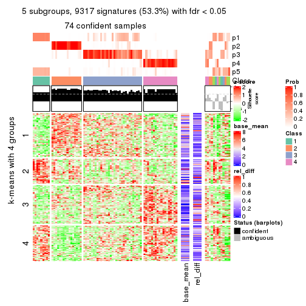</p>

</div>
<div id='tab-SD-mclust-get-signatures-5'>
<pre><code class="r">get_signatures(res, k = 6)
</code></pre>

<p></p>

</div>
</div>


Signature heatmaps where rows are not scaled:


<script>
$( function() {
	$( '#tabs-SD-mclust-get-signatures-no-scale' ).tabs();
} );
</script>
<div id='tabs-SD-mclust-get-signatures-no-scale'>
<ul>
<li><a href='#tab-SD-mclust-get-signatures-no-scale-1'>k = 2</a></li>
<li><a href='#tab-SD-mclust-get-signatures-no-scale-2'>k = 3</a></li>
<li><a href='#tab-SD-mclust-get-signatures-no-scale-3'>k = 4</a></li>
<li><a href='#tab-SD-mclust-get-signatures-no-scale-4'>k = 5</a></li>
<li><a href='#tab-SD-mclust-get-signatures-no-scale-5'>k = 6</a></li>
</ul>
<div id='tab-SD-mclust-get-signatures-no-scale-1'>
<pre><code class="r">get_signatures(res, k = 2, scale_rows = FALSE)
</code></pre>

<p></p>

</div>
<div id='tab-SD-mclust-get-signatures-no-scale-2'>
<pre><code class="r">get_signatures(res, k = 3, scale_rows = FALSE)
</code></pre>

<p></p>

</div>
<div id='tab-SD-mclust-get-signatures-no-scale-3'>
<pre><code class="r">get_signatures(res, k = 4, scale_rows = FALSE)
</code></pre>

<p></p>

</div>
<div id='tab-SD-mclust-get-signatures-no-scale-4'>
<pre><code class="r">get_signatures(res, k = 5, scale_rows = FALSE)
</code></pre>

<p></p>

</div>
<div id='tab-SD-mclust-get-signatures-no-scale-5'>
<pre><code class="r">get_signatures(res, k = 6, scale_rows = FALSE)
</code></pre>

<p></p>

</div>
</div>


Compare the overlap of signatures from different k:

```r
compare_signatures(res)
```


`get_signature()` returns a data frame invisibly. TO get the list of signatures, the function
call should be assigned to a variable explicitly. In following code, if `plot` argument is set
to `FALSE`, no heatmap is plotted while only the differential analysis is performed.

```r
# code only for demonstration
tb = get_signature(res, k = ..., plot = FALSE)
```

An example of the output of `tb` is:

```
#>   which_row         fdr    mean_1    mean_2 scaled_mean_1 scaled_mean_2 km
#> 1        38 0.042760348  8.373488  9.131774    -0.5533452     0.5164555  1
#> 2        40 0.018707592  7.106213  8.469186    -0.6173731     0.5762149  1
#> 3        55 0.019134737 10.221463 11.207825    -0.6159697     0.5749050  1
#> 4        59 0.006059896  5.921854  7.869574    -0.6899429     0.6439467  1
#> 5        60 0.018055526  8.928898 10.211722    -0.6204761     0.5791110  1
#> 6        98 0.009384629 15.714769 14.887706     0.6635654    -0.6193277  2
...
```

The columns in `tb` are:

1. `which_row`: row indices corresponding to the input matrix.
2. `fdr`: FDR for the differential test. 
3. `mean_x`: The mean value in group x.
4. `scaled_mean_x`: The mean value in group x after rows are scaled.
5. `km`: Row groups if k-means clustering is applied to rows.


UMAP plot which shows how samples are separated.


<script>
$( function() {
	$( '#tabs-SD-mclust-dimension-reduction' ).tabs();
} );
</script>
<div id='tabs-SD-mclust-dimension-reduction'>
<ul>
<li><a href='#tab-SD-mclust-dimension-reduction-1'>k = 2</a></li>
<li><a href='#tab-SD-mclust-dimension-reduction-2'>k = 3</a></li>
<li><a href='#tab-SD-mclust-dimension-reduction-3'>k = 4</a></li>
<li><a href='#tab-SD-mclust-dimension-reduction-4'>k = 5</a></li>
<li><a href='#tab-SD-mclust-dimension-reduction-5'>k = 6</a></li>
</ul>
<div id='tab-SD-mclust-dimension-reduction-1'>
<pre><code class="r">dimension_reduction(res, k = 2, method = &quot;UMAP&quot;)
</code></pre>

<p></p>

</div>
<div id='tab-SD-mclust-dimension-reduction-2'>
<pre><code class="r">dimension_reduction(res, k = 3, method = &quot;UMAP&quot;)
</code></pre>

<p></p>

</div>
<div id='tab-SD-mclust-dimension-reduction-3'>
<pre><code class="r">dimension_reduction(res, k = 4, method = &quot;UMAP&quot;)
</code></pre>

<p></p>

</div>
<div id='tab-SD-mclust-dimension-reduction-4'>
<pre><code class="r">dimension_reduction(res, k = 5, method = &quot;UMAP&quot;)
</code></pre>

<p></p>

</div>
<div id='tab-SD-mclust-dimension-reduction-5'>
<pre><code class="r">dimension_reduction(res, k = 6, method = &quot;UMAP&quot;)
</code></pre>

<p></p>

</div>
</div>


Following heatmap shows how subgroups are split when increasing `k`:

```r
collect_classes(res)
```


If matrix rows can be associated to genes, consider to use `functional_enrichment(res,
...)` to perform function enrichment for the signature genes. See [this vignette](http://bioconductor.org/packages/devel/bioc/vignettes/cola/inst/doc/functional_enrichment.html) for more detailed explanations.


 

---------------------------------------------------


### SD:NMF**


The object with results only for a single top-value method and a single partition method 
can be extracted as:

```r
res = res_list["SD", "NMF"]
# you can also extract it by
# res = res_list["SD:NMF"]
```

A summary of `res` and all the functions that can be applied to it:

```r
res
```

```
#> A 'ConsensusPartition' object with k = 2, 3, 4, 5, 6.
#>   On a matrix with 17471 rows and 87 columns.
#>   Top rows (1000, 2000, 3000, 4000, 5000) are extracted by 'SD' method.
#>   Subgroups are detected by 'NMF' method.
#>   Performed in total 1250 partitions by row resampling.
#>   Best k for subgroups seems to be 2.
#> 
#> Following methods can be applied to this 'ConsensusPartition' object:
#>  [1] "cola_report"             "collect_classes"         "collect_plots"          
#>  [4] "collect_stats"           "colnames"                "compare_signatures"     
#>  [7] "consensus_heatmap"       "dimension_reduction"     "functional_enrichment"  
#> [10] "get_anno_col"            "get_anno"                "get_classes"            
#> [13] "get_consensus"           "get_matrix"              "get_membership"         
#> [16] "get_param"               "get_signatures"          "get_stats"              
#> [19] "is_best_k"               "is_stable_k"             "membership_heatmap"     
#> [22] "ncol"                    "nrow"                    "plot_ecdf"              
#> [25] "rownames"                "select_partition_number" "show"                   
#> [28] "suggest_best_k"          "test_to_known_factors"
```

`collect_plots()` function collects all the plots made from `res` for all `k` (number of partitions)
into one single page to provide an easy and fast comparison between different `k`.

```r
collect_plots(res)
```


The plots are:

- The first row: a plot of the ECDF (empirical cumulative distribution
  function) curves of the consensus matrix for each `k` and the heatmap of
  predicted classes for each `k`.
- The second row: heatmaps of the consensus matrix for each `k`.
- The third row: heatmaps of the membership matrix for each `k`.
- The fouth row: heatmaps of the signatures for each `k`.

All the plots in panels can be made by individual functions and they are
plotted later in this section.

`select_partition_number()` produces several plots showing different
statistics for choosing "optimized" `k`. There are following statistics:

- ECDF curves of the consensus matrix for each `k`;
- 1-PAC. [The PAC
  score](https://en.wikipedia.org/wiki/Consensus_clustering#Over-interpretation_potential_of_consensus_clustering)
  measures the proportion of the ambiguous subgrouping.
- Mean silhouette score.
- Concordance. The mean probability of fiting the consensus class ids in all
  partitions.
- Area increased. Denote $A_k$ as the area under the ECDF curve for current
  `k`, the area increased is defined as $A_k - A_{k-1}$.
- Rand index. The percent of pairs of samples that are both in a same cluster
  or both are not in a same cluster in the partition of k and k-1.
- Jaccard index. The ratio of pairs of samples are both in a same cluster in
  the partition of k and k-1 and the pairs of samples are both in a same
  cluster in the partition k or k-1.

The detailed explanations of these statistics can be found in [the _cola_
vignette](http://bioconductor.org/packages/devel/bioc/vignettes/cola/inst/doc/cola.html#toc_13).

Generally speaking, lower PAC score, higher mean silhouette score or higher
concordance corresponds to better partition. Rand index and Jaccard index
measure how similar the current partition is compared to partition with `k-1`.
If they are too similar, we won't accept `k` is better than `k-1`.

```r
select_partition_number(res)
```


The numeric values for all these statistics can be obtained by `get_stats()`.

```r
get_stats(res)
```

```
#>   k 1-PAC mean_silhouette concordance area_increased  Rand Jaccard
#> 2 2 0.976           0.963       0.984         0.4968 0.502   0.502
#> 3 3 0.747           0.866       0.937         0.3198 0.720   0.502
#> 4 4 0.731           0.821       0.884         0.1363 0.765   0.432
#> 5 5 0.749           0.683       0.820         0.0612 0.918   0.701
#> 6 6 0.793           0.676       0.834         0.0353 0.941   0.741
```

`suggest_best_k()` suggests the best $k$ based on these statistics. The rules are as follows:

- All $k$ with Jaccard index larger than 0.95 are removed because increasing
  $k$ does not provide enough extra information. If all $k$ are removed, it is
  marked as no subgroup is detected.
- For all $k$ with 1-PAC score larger than 0.9, the maximal $k$ is taken as
  the best $k$, and other $k$ are marked as optional $k$.
- If it does not fit the second rule. The $k$ with the maximal vote of the
  highest 1-PAC score, highest mean silhouette, and highest concordance is
  taken as the best $k$.

```r
suggest_best_k(res)
```

```
#> [1] 2
```


Following shows the table of the partitions (You need to click the **show/hide
code output** link to see it). The membership matrix (columns with name `p*`)
is inferred by
[`clue::cl_consensus()`](https://www.rdocumentation.org/link/cl_consensus?package=clue)
function with the `SE` method. Basically the value in the membership matrix
represents the probability to belong to a certain group. The finall class
label for an item is determined with the group with highest probability it
belongs to.

In `get_classes()` function, the entropy is calculated from the membership
matrix and the silhouette score is calculated from the consensus matrix.


<script>
$( function() {
	$( '#tabs-SD-NMF-get-classes' ).tabs();
} );
</script>
<div id='tabs-SD-NMF-get-classes'>
<ul>
<li><a href='#tab-SD-NMF-get-classes-1'>k = 2</a></li>
<li><a href='#tab-SD-NMF-get-classes-2'>k = 3</a></li>
<li><a href='#tab-SD-NMF-get-classes-3'>k = 4</a></li>
<li><a href='#tab-SD-NMF-get-classes-4'>k = 5</a></li>
<li><a href='#tab-SD-NMF-get-classes-5'>k = 6</a></li>
</ul>

<div id='tab-SD-NMF-get-classes-1'>
<p><a id='tab-SD-NMF-get-classes-1-a' style='color:#0366d6' href='#'>show/hide code output</a></p>
<pre><code class="r">cbind(get_classes(res, k = 2), get_membership(res, k = 2))
</code></pre>

<pre><code>#&gt;                                      class entropy silhouette    p1    p2
#&gt; E6088A41-B0DC-4FBF-8D14-BE78024CF8CD     2  0.0000      0.987 0.000 1.000
#&gt; F569915C-8F77-4D67-9730-30824DB57EE5     2  0.0000      0.987 0.000 1.000
#&gt; E3B71CB7-673B-4741-8607-4F0A11633036     1  0.0000      0.978 1.000 0.000
#&gt; DAF84798-FE3F-403C-B589-7F256AF752BE     1  0.0000      0.978 1.000 0.000
#&gt; 2F38E3B1-4975-4877-9DCC-C00270602180     1  0.0000      0.978 1.000 0.000
#&gt; C79A4C2F-02C4-4C03-A5A5-DE06802EEB57     2  0.5737      0.842 0.136 0.864
#&gt; 92E3ED8F-5C74-4ED2-9B03-9FA5E7B491D6     1  0.0000      0.978 1.000 0.000
#&gt; E61D60BE-3BD3-4B5E-BC12-80F3684A0959     1  0.0000      0.978 1.000 0.000
#&gt; C9388FC7-DB1D-4416-BC2D-EA643584F1E6     2  0.0000      0.987 0.000 1.000
#&gt; D4219360-6344-4AF3-ACEB-1701A9F1F67D     1  0.0000      0.978 1.000 0.000
#&gt; 07D155E6-F27C-4D09-B786-8A9B71147B72     1  0.0000      0.978 1.000 0.000
#&gt; 10C8C361-85A5-40E8-A395-B92623E6F27C     1  0.0000      0.978 1.000 0.000
#&gt; BDF20891-7C98-4A55-BBF3-8A836BE303C6     2  0.0000      0.987 0.000 1.000
#&gt; 694B0504-095E-431A-84F2-B4387072138E     1  0.0000      0.978 1.000 0.000
#&gt; EDCF8E7F-8B1D-46F7-8AE0-84A1DC9647D2     2  0.0000      0.987 0.000 1.000
#&gt; 0EA8288E-824D-4304-A053-5A833361F5C5     1  0.0000      0.978 1.000 0.000
#&gt; C4ACCFA1-34A9-4F61-8A1F-35B3B60EA193     1  0.0000      0.978 1.000 0.000
#&gt; 760BA639-38AC-4BC9-9647-09F6893EA8ED     1  0.0000      0.978 1.000 0.000
#&gt; 082DFC6B-C6E6-48B9-BDE5-74FF3B3DC954     2  0.0000      0.987 0.000 1.000
#&gt; FE349848-D7C4-4C49-B670-0E20454DDD7E     2  0.7883      0.695 0.236 0.764
#&gt; 2E8937B3-9EA1-4528-8CEE-BF3D4137908A     2  0.0000      0.987 0.000 1.000
#&gt; 9942D04E-2767-4E39-BA16-7762EAC3DFC4     2  0.0000      0.987 0.000 1.000
#&gt; F9C23182-91C4-4145-AE52-526FE8EB199D     2  0.0000      0.987 0.000 1.000
#&gt; 01024EED-7811-4E24-A067-8E0B978FFE2D     2  0.0000      0.987 0.000 1.000
#&gt; 932C8E98-A352-409C-8744-3D49FABCE425     1  0.0000      0.978 1.000 0.000
#&gt; 6DFD9439-C659-4936-84E5-108F717E3E4D     2  0.0376      0.984 0.004 0.996
#&gt; 1D8B83B8-5DD7-4F45-9D59-487EC6906A8B     2  0.0000      0.987 0.000 1.000
#&gt; 804B8503-73F6-42DE-835F-39DE2C9F13E1     2  0.0000      0.987 0.000 1.000
#&gt; B9453C9B-84D5-43BD-85BB-1780F02F039C     1  0.0000      0.978 1.000 0.000
#&gt; 836E6CD6-4E88-4028-9844-FA3C892C254A     1  0.0000      0.978 1.000 0.000
#&gt; 36EDD202-A845-4CE7-95D5-A515C471262E     2  0.0000      0.987 0.000 1.000
#&gt; 181C156A-B8F4-4F9D-93AA-6AFBD197644D     2  0.0000      0.987 0.000 1.000
#&gt; 0580E798-6A98-4E46-AC96-9A869DFF502E     1  0.0000      0.978 1.000 0.000
#&gt; EA1B63CF-D389-4567-8D9E-B0EF1F804598     1  0.8955      0.555 0.688 0.312
#&gt; 5ABC3D06-B8E9-4831-B89B-7C1EC4006B47     2  0.0000      0.987 0.000 1.000
#&gt; 1CC01E74-A7C1-4A51-9E28-1703C352BE16     2  0.0000      0.987 0.000 1.000
#&gt; 97E55B75-DBDB-46BC-9E74-7828C070BF16     2  0.0000      0.987 0.000 1.000
#&gt; BEB37A2D-E8B0-4674-89AC-DC0F34E0AFD6     1  0.0000      0.978 1.000 0.000
#&gt; 558648BA-6551-4D34-97C2-AD5F677D63FB     1  0.0000      0.978 1.000 0.000
#&gt; FF7021BB-414B-4466-BC43-372D856E6A1D     2  0.0000      0.987 0.000 1.000
#&gt; 9C04B840-54E0-425D-BDBE-8CB6B9C2C722     2  0.0000      0.987 0.000 1.000
#&gt; 5F50B1F4-1A02-4506-AA6D-9BF21CD8059A     1  0.5629      0.839 0.868 0.132
#&gt; 7D4B8FF3-7977-4ABD-AE04-EED1C50B23CC     2  0.0000      0.987 0.000 1.000
#&gt; A005AF15-B98E-4623-8AD4-1E69EFA9BC7A     1  0.0000      0.978 1.000 0.000
#&gt; 1DF04345-5C93-4B18-B307-8D1FCA532999     2  0.0000      0.987 0.000 1.000
#&gt; 6AF30C18-347E-41ED-A4AB-6F81F42206C5     1  0.0000      0.978 1.000 0.000
#&gt; 88A44ED0-BDE1-401E-B0E1-D8C8D6DBAEFC     2  0.0000      0.987 0.000 1.000
#&gt; 117673A3-2918-4702-8583-B66ADE6E4338     2  0.0000      0.987 0.000 1.000
#&gt; 4903A571-E14D-43C9-A737-22CAFAC414CD     2  0.6531      0.799 0.168 0.832
#&gt; C175E68E-632A-4B4A-9DDB-4895C4760F20     1  0.0000      0.978 1.000 0.000
#&gt; FA5CA2F4-A1AD-4A79-B8F3-73A976EB2FB1     2  0.0000      0.987 0.000 1.000
#&gt; E1F883A7-8B1F-4C1D-8A1A-9749A9C09845     2  0.0000      0.987 0.000 1.000
#&gt; E74F0729-6000-4908-ADB0-7BDBAC0639E6     1  0.0000      0.978 1.000 0.000
#&gt; F92135A9-1981-4C79-99A5-4243EEC5D30D     2  0.0000      0.987 0.000 1.000
#&gt; 73C6919F-DEB4-4DA4-B4AE-4032AC8F96C5     1  0.0000      0.978 1.000 0.000
#&gt; 33977B40-2E92-48B6-8D3A-3EBE913F6F8A     1  0.0000      0.978 1.000 0.000
#&gt; 490BD607-2F08-4B4C-9612-F9BB5CBBC8BB     2  0.0000      0.987 0.000 1.000
#&gt; 6C666E17-2EB8-4244-BCC1-8DD34EE4173E     2  0.0000      0.987 0.000 1.000
#&gt; C41F3064-4483-4796-B860-82155BAA5157     1  0.0000      0.978 1.000 0.000
#&gt; F4232B90-51B9-43EE-9971-35B3A318758F     1  0.0000      0.978 1.000 0.000
#&gt; 291EA1F6-FC56-4429-A433-0C452A6A514C     2  0.0000      0.987 0.000 1.000
#&gt; CC4AF04D-CB8E-40DD-B12E-7AA39B38262A     2  0.0000      0.987 0.000 1.000
#&gt; 4DAE26B9-AB57-4763-BB9A-2ADDD5D9C007     1  0.0000      0.978 1.000 0.000
#&gt; 676B4AEE-FB41-4C16-AA91-03E4A1DA8E26     2  0.1843      0.963 0.028 0.972
#&gt; 1CC36859-357A-49E0-A367-4F57D47288BA     1  0.9427      0.441 0.640 0.360
#&gt; 7CCDDFC8-6DF6-4734-96AC-19EBC464FC50     2  0.0000      0.987 0.000 1.000
#&gt; 10F38C34-3956-48ED-AB62-3439EF00D46B     2  0.0000      0.987 0.000 1.000
#&gt; 80B2B393-9D6E-45B4-B696-2A5C203543B7     2  0.0000      0.987 0.000 1.000
#&gt; 5AC7B5EA-1AAC-4529-8E5A-F612E5E0719A     1  0.0376      0.974 0.996 0.004
#&gt; 3648E98D-4B3A-41B7-BE05-595D44F0150D     1  0.0000      0.978 1.000 0.000
#&gt; 252EC850-6026-473B-8FFC-2CF567EF42E4     1  0.0000      0.978 1.000 0.000
#&gt; 1790E7A3-99D8-447E-BC50-51C8A4A18853     2  0.0000      0.987 0.000 1.000
#&gt; DA61A4F8-350B-4DD1-A240-AD016520DB5B     2  0.0376      0.984 0.004 0.996
#&gt; 767E5BAF-2515-40D7-AE7D-0B24D77A03F4     2  0.0000      0.987 0.000 1.000
#&gt; 8CB9C903-D749-44EA-9137-7FB5A92C5932     1  0.0000      0.978 1.000 0.000
#&gt; A9B968AE-2243-41BC-852A-3A12C1FB4892     1  0.0000      0.978 1.000 0.000
#&gt; 3C582264-85BC-4569-A888-8EB3008E5198     2  0.0000      0.987 0.000 1.000
#&gt; F4EAF9A2-9938-4D9B-9080-C0A7542D5704     2  0.0000      0.987 0.000 1.000
#&gt; 328499D3-45DD-4B66-BD22-3C52BA92C2BB     1  0.0000      0.978 1.000 0.000
#&gt; AF8AB83D-2917-4752-8C38-CF84C565B565     1  0.0000      0.978 1.000 0.000
#&gt; 03A327CA-A9FE-42A4-844D-CA85206969FC     2  0.0000      0.987 0.000 1.000
#&gt; 4B0BEC44-87BB-4014-9A26-3529DD63760B     2  0.0376      0.984 0.004 0.996
#&gt; 05C7843E-DC89-4D8E-A78A-952C5DFD667B     2  0.0672      0.981 0.008 0.992
#&gt; 29A0FFF9-13D3-4D16-BE6A-8E48A2C4E315     2  0.0000      0.987 0.000 1.000
#&gt; 22947CC3-4F42-4F44-899C-2B7085E36C9D     2  0.0000      0.987 0.000 1.000
#&gt; A247D92D-253A-4BEC-B450-184AF90D17D0     2  0.0000      0.987 0.000 1.000
#&gt; 0D907A63-D23F-4684-80D9-0BA552435B86     1  0.0000      0.978 1.000 0.000
</code></pre>

<script>
$('#tab-SD-NMF-get-classes-1-a').parent().next().next().hide();
$('#tab-SD-NMF-get-classes-1-a').click(function(){
  $('#tab-SD-NMF-get-classes-1-a').parent().next().next().toggle();
  return(false);
});
</script>
</div>

<div id='tab-SD-NMF-get-classes-2'>
<p><a id='tab-SD-NMF-get-classes-2-a' style='color:#0366d6' href='#'>show/hide code output</a></p>
<pre><code class="r">cbind(get_classes(res, k = 3), get_membership(res, k = 3))
</code></pre>

<pre><code>#&gt;                                      class entropy silhouette    p1    p2    p3
#&gt; E6088A41-B0DC-4FBF-8D14-BE78024CF8CD     2  0.4346      0.780 0.000 0.816 0.184
#&gt; F569915C-8F77-4D67-9730-30824DB57EE5     2  0.6140      0.354 0.000 0.596 0.404
#&gt; E3B71CB7-673B-4741-8607-4F0A11633036     1  0.0237      0.922 0.996 0.000 0.004
#&gt; DAF84798-FE3F-403C-B589-7F256AF752BE     1  0.0237      0.922 0.996 0.000 0.004
#&gt; 2F38E3B1-4975-4877-9DCC-C00270602180     1  0.5760      0.544 0.672 0.000 0.328
#&gt; C79A4C2F-02C4-4C03-A5A5-DE06802EEB57     2  0.4784      0.762 0.004 0.796 0.200
#&gt; 92E3ED8F-5C74-4ED2-9B03-9FA5E7B491D6     1  0.0000      0.922 1.000 0.000 0.000
#&gt; E61D60BE-3BD3-4B5E-BC12-80F3684A0959     3  0.0000      0.921 0.000 0.000 1.000
#&gt; C9388FC7-DB1D-4416-BC2D-EA643584F1E6     3  0.1964      0.898 0.000 0.056 0.944
#&gt; D4219360-6344-4AF3-ACEB-1701A9F1F67D     1  0.0237      0.922 0.996 0.000 0.004
#&gt; 07D155E6-F27C-4D09-B786-8A9B71147B72     3  0.0000      0.921 0.000 0.000 1.000
#&gt; 10C8C361-85A5-40E8-A395-B92623E6F27C     1  0.0237      0.922 0.996 0.000 0.004
#&gt; BDF20891-7C98-4A55-BBF3-8A836BE303C6     2  0.0000      0.934 0.000 1.000 0.000
#&gt; 694B0504-095E-431A-84F2-B4387072138E     1  0.0000      0.922 1.000 0.000 0.000
#&gt; EDCF8E7F-8B1D-46F7-8AE0-84A1DC9647D2     2  0.1860      0.906 0.000 0.948 0.052
#&gt; 0EA8288E-824D-4304-A053-5A833361F5C5     3  0.0000      0.921 0.000 0.000 1.000
#&gt; C4ACCFA1-34A9-4F61-8A1F-35B3B60EA193     1  0.0000      0.922 1.000 0.000 0.000
#&gt; 760BA639-38AC-4BC9-9647-09F6893EA8ED     1  0.0000      0.922 1.000 0.000 0.000
#&gt; 082DFC6B-C6E6-48B9-BDE5-74FF3B3DC954     2  0.5760      0.543 0.000 0.672 0.328
#&gt; FE349848-D7C4-4C49-B670-0E20454DDD7E     3  0.0000      0.921 0.000 0.000 1.000
#&gt; 2E8937B3-9EA1-4528-8CEE-BF3D4137908A     2  0.0000      0.934 0.000 1.000 0.000
#&gt; 9942D04E-2767-4E39-BA16-7762EAC3DFC4     2  0.0237      0.932 0.004 0.996 0.000
#&gt; F9C23182-91C4-4145-AE52-526FE8EB199D     2  0.5431      0.573 0.284 0.716 0.000
#&gt; 01024EED-7811-4E24-A067-8E0B978FFE2D     2  0.1411      0.918 0.000 0.964 0.036
#&gt; 932C8E98-A352-409C-8744-3D49FABCE425     1  0.0747      0.917 0.984 0.000 0.016
#&gt; 6DFD9439-C659-4936-84E5-108F717E3E4D     2  0.5291      0.659 0.000 0.732 0.268
#&gt; 1D8B83B8-5DD7-4F45-9D59-487EC6906A8B     2  0.1411      0.917 0.000 0.964 0.036
#&gt; 804B8503-73F6-42DE-835F-39DE2C9F13E1     2  0.0000      0.934 0.000 1.000 0.000
#&gt; B9453C9B-84D5-43BD-85BB-1780F02F039C     1  0.0000      0.922 1.000 0.000 0.000
#&gt; 836E6CD6-4E88-4028-9844-FA3C892C254A     1  0.2878      0.852 0.904 0.000 0.096
#&gt; 36EDD202-A845-4CE7-95D5-A515C471262E     2  0.0000      0.934 0.000 1.000 0.000
#&gt; 181C156A-B8F4-4F9D-93AA-6AFBD197644D     2  0.0000      0.934 0.000 1.000 0.000
#&gt; 0580E798-6A98-4E46-AC96-9A869DFF502E     3  0.3038      0.835 0.104 0.000 0.896
#&gt; EA1B63CF-D389-4567-8D9E-B0EF1F804598     1  0.4399      0.746 0.812 0.188 0.000
#&gt; 5ABC3D06-B8E9-4831-B89B-7C1EC4006B47     2  0.0000      0.934 0.000 1.000 0.000
#&gt; 1CC01E74-A7C1-4A51-9E28-1703C352BE16     2  0.0000      0.934 0.000 1.000 0.000
#&gt; 97E55B75-DBDB-46BC-9E74-7828C070BF16     2  0.1163      0.915 0.028 0.972 0.000
#&gt; BEB37A2D-E8B0-4674-89AC-DC0F34E0AFD6     3  0.0000      0.921 0.000 0.000 1.000
#&gt; 558648BA-6551-4D34-97C2-AD5F677D63FB     1  0.1964      0.896 0.944 0.000 0.056
#&gt; FF7021BB-414B-4466-BC43-372D856E6A1D     3  0.3340      0.850 0.000 0.120 0.880
#&gt; 9C04B840-54E0-425D-BDBE-8CB6B9C2C722     2  0.0000      0.934 0.000 1.000 0.000
#&gt; 5F50B1F4-1A02-4506-AA6D-9BF21CD8059A     3  0.0000      0.921 0.000 0.000 1.000
#&gt; 7D4B8FF3-7977-4ABD-AE04-EED1C50B23CC     2  0.0000      0.934 0.000 1.000 0.000
#&gt; A005AF15-B98E-4623-8AD4-1E69EFA9BC7A     3  0.0000      0.921 0.000 0.000 1.000
#&gt; 1DF04345-5C93-4B18-B307-8D1FCA532999     2  0.0000      0.934 0.000 1.000 0.000
#&gt; 6AF30C18-347E-41ED-A4AB-6F81F42206C5     3  0.5291      0.594 0.268 0.000 0.732
#&gt; 88A44ED0-BDE1-401E-B0E1-D8C8D6DBAEFC     2  0.1964      0.905 0.000 0.944 0.056
#&gt; 117673A3-2918-4702-8583-B66ADE6E4338     2  0.0237      0.932 0.004 0.996 0.000
#&gt; 4903A571-E14D-43C9-A737-22CAFAC414CD     3  0.3482      0.841 0.000 0.128 0.872
#&gt; C175E68E-632A-4B4A-9DDB-4895C4760F20     1  0.0000      0.922 1.000 0.000 0.000
#&gt; FA5CA2F4-A1AD-4A79-B8F3-73A976EB2FB1     2  0.0237      0.933 0.000 0.996 0.004
#&gt; E1F883A7-8B1F-4C1D-8A1A-9749A9C09845     2  0.0000      0.934 0.000 1.000 0.000
#&gt; E74F0729-6000-4908-ADB0-7BDBAC0639E6     1  0.3116      0.852 0.892 0.000 0.108
#&gt; F92135A9-1981-4C79-99A5-4243EEC5D30D     2  0.0000      0.934 0.000 1.000 0.000
#&gt; 73C6919F-DEB4-4DA4-B4AE-4032AC8F96C5     1  0.6180      0.330 0.584 0.000 0.416
#&gt; 33977B40-2E92-48B6-8D3A-3EBE913F6F8A     3  0.0000      0.921 0.000 0.000 1.000
#&gt; 490BD607-2F08-4B4C-9612-F9BB5CBBC8BB     3  0.4750      0.733 0.000 0.216 0.784
#&gt; 6C666E17-2EB8-4244-BCC1-8DD34EE4173E     3  0.3482      0.845 0.000 0.128 0.872
#&gt; C41F3064-4483-4796-B860-82155BAA5157     3  0.4062      0.762 0.164 0.000 0.836
#&gt; F4232B90-51B9-43EE-9971-35B3A318758F     3  0.2537      0.859 0.080 0.000 0.920
#&gt; 291EA1F6-FC56-4429-A433-0C452A6A514C     2  0.0000      0.934 0.000 1.000 0.000
#&gt; CC4AF04D-CB8E-40DD-B12E-7AA39B38262A     2  0.0000      0.934 0.000 1.000 0.000
#&gt; 4DAE26B9-AB57-4763-BB9A-2ADDD5D9C007     3  0.0237      0.919 0.004 0.000 0.996
#&gt; 676B4AEE-FB41-4C16-AA91-03E4A1DA8E26     3  0.1163      0.913 0.000 0.028 0.972
#&gt; 1CC36859-357A-49E0-A367-4F57D47288BA     1  0.7079      0.672 0.720 0.104 0.176
#&gt; 7CCDDFC8-6DF6-4734-96AC-19EBC464FC50     2  0.0000      0.934 0.000 1.000 0.000
#&gt; 10F38C34-3956-48ED-AB62-3439EF00D46B     3  0.1163      0.913 0.000 0.028 0.972
#&gt; 80B2B393-9D6E-45B4-B696-2A5C203543B7     2  0.0000      0.934 0.000 1.000 0.000
#&gt; 5AC7B5EA-1AAC-4529-8E5A-F612E5E0719A     3  0.0000      0.921 0.000 0.000 1.000
#&gt; 3648E98D-4B3A-41B7-BE05-595D44F0150D     1  0.0237      0.922 0.996 0.000 0.004
#&gt; 252EC850-6026-473B-8FFC-2CF567EF42E4     3  0.0000      0.921 0.000 0.000 1.000
#&gt; 1790E7A3-99D8-447E-BC50-51C8A4A18853     2  0.0000      0.934 0.000 1.000 0.000
#&gt; DA61A4F8-350B-4DD1-A240-AD016520DB5B     3  0.5529      0.587 0.000 0.296 0.704
#&gt; 767E5BAF-2515-40D7-AE7D-0B24D77A03F4     3  0.2066      0.896 0.000 0.060 0.940
#&gt; 8CB9C903-D749-44EA-9137-7FB5A92C5932     1  0.0000      0.922 1.000 0.000 0.000
#&gt; A9B968AE-2243-41BC-852A-3A12C1FB4892     3  0.0000      0.921 0.000 0.000 1.000
#&gt; 3C582264-85BC-4569-A888-8EB3008E5198     2  0.0000      0.934 0.000 1.000 0.000
#&gt; F4EAF9A2-9938-4D9B-9080-C0A7542D5704     2  0.0000      0.934 0.000 1.000 0.000
#&gt; 328499D3-45DD-4B66-BD22-3C52BA92C2BB     1  0.0237      0.922 0.996 0.000 0.004
#&gt; AF8AB83D-2917-4752-8C38-CF84C565B565     3  0.0000      0.921 0.000 0.000 1.000
#&gt; 03A327CA-A9FE-42A4-844D-CA85206969FC     2  0.3412      0.849 0.000 0.876 0.124
#&gt; 4B0BEC44-87BB-4014-9A26-3529DD63760B     3  0.0424      0.920 0.000 0.008 0.992
#&gt; 05C7843E-DC89-4D8E-A78A-952C5DFD667B     3  0.0592      0.919 0.000 0.012 0.988
#&gt; 29A0FFF9-13D3-4D16-BE6A-8E48A2C4E315     2  0.0000      0.934 0.000 1.000 0.000
#&gt; 22947CC3-4F42-4F44-899C-2B7085E36C9D     2  0.2537      0.887 0.000 0.920 0.080
#&gt; A247D92D-253A-4BEC-B450-184AF90D17D0     3  0.4235      0.794 0.000 0.176 0.824
#&gt; 0D907A63-D23F-4684-80D9-0BA552435B86     3  0.0000      0.921 0.000 0.000 1.000
</code></pre>

<script>
$('#tab-SD-NMF-get-classes-2-a').parent().next().next().hide();
$('#tab-SD-NMF-get-classes-2-a').click(function(){
  $('#tab-SD-NMF-get-classes-2-a').parent().next().next().toggle();
  return(false);
});
</script>
</div>

<div id='tab-SD-NMF-get-classes-3'>
<p><a id='tab-SD-NMF-get-classes-3-a' style='color:#0366d6' href='#'>show/hide code output</a></p>
<pre><code class="r">cbind(get_classes(res, k = 4), get_membership(res, k = 4))
</code></pre>

<pre><code>#&gt;                                      class entropy silhouette    p1    p2    p3    p4
#&gt; E6088A41-B0DC-4FBF-8D14-BE78024CF8CD     3  0.2124     0.8190 0.008 0.068 0.924 0.000
#&gt; F569915C-8F77-4D67-9730-30824DB57EE5     3  0.3991     0.8190 0.000 0.172 0.808 0.020
#&gt; E3B71CB7-673B-4741-8607-4F0A11633036     1  0.0336     0.9320 0.992 0.000 0.000 0.008
#&gt; DAF84798-FE3F-403C-B589-7F256AF752BE     1  0.2704     0.8823 0.876 0.000 0.124 0.000
#&gt; 2F38E3B1-4975-4877-9DCC-C00270602180     4  0.5108     0.4884 0.308 0.000 0.020 0.672
#&gt; C79A4C2F-02C4-4C03-A5A5-DE06802EEB57     3  0.5610     0.7766 0.008 0.216 0.716 0.060
#&gt; 92E3ED8F-5C74-4ED2-9B03-9FA5E7B491D6     1  0.0188     0.9326 0.996 0.000 0.004 0.000
#&gt; E61D60BE-3BD3-4B5E-BC12-80F3684A0959     4  0.0376     0.8831 0.000 0.004 0.004 0.992
#&gt; C9388FC7-DB1D-4416-BC2D-EA643584F1E6     4  0.4839     0.6300 0.000 0.044 0.200 0.756
#&gt; D4219360-6344-4AF3-ACEB-1701A9F1F67D     1  0.0779     0.9335 0.980 0.000 0.016 0.004
#&gt; 07D155E6-F27C-4D09-B786-8A9B71147B72     4  0.0657     0.8832 0.000 0.004 0.012 0.984
#&gt; 10C8C361-85A5-40E8-A395-B92623E6F27C     1  0.1109     0.9282 0.968 0.000 0.004 0.028
#&gt; BDF20891-7C98-4A55-BBF3-8A836BE303C6     2  0.0188     0.9471 0.000 0.996 0.004 0.000
#&gt; 694B0504-095E-431A-84F2-B4387072138E     1  0.0000     0.9324 1.000 0.000 0.000 0.000
#&gt; EDCF8E7F-8B1D-46F7-8AE0-84A1DC9647D2     3  0.2635     0.8066 0.000 0.076 0.904 0.020
#&gt; 0EA8288E-824D-4304-A053-5A833361F5C5     3  0.4989     0.0985 0.000 0.000 0.528 0.472
#&gt; C4ACCFA1-34A9-4F61-8A1F-35B3B60EA193     1  0.0376     0.9326 0.992 0.000 0.004 0.004
#&gt; 760BA639-38AC-4BC9-9647-09F6893EA8ED     1  0.1022     0.9308 0.968 0.000 0.032 0.000
#&gt; 082DFC6B-C6E6-48B9-BDE5-74FF3B3DC954     3  0.3991     0.8185 0.000 0.172 0.808 0.020
#&gt; FE349848-D7C4-4C49-B670-0E20454DDD7E     3  0.3569     0.7818 0.000 0.000 0.804 0.196
#&gt; 2E8937B3-9EA1-4528-8CEE-BF3D4137908A     2  0.0000     0.9462 0.000 1.000 0.000 0.000
#&gt; 9942D04E-2767-4E39-BA16-7762EAC3DFC4     2  0.3311     0.8268 0.000 0.828 0.172 0.000
#&gt; F9C23182-91C4-4145-AE52-526FE8EB199D     2  0.5007     0.4346 0.356 0.636 0.008 0.000
#&gt; 01024EED-7811-4E24-A067-8E0B978FFE2D     2  0.0376     0.9438 0.000 0.992 0.004 0.004
#&gt; 932C8E98-A352-409C-8744-3D49FABCE425     1  0.1902     0.9213 0.932 0.000 0.064 0.004
#&gt; 6DFD9439-C659-4936-84E5-108F717E3E4D     3  0.1706     0.8085 0.016 0.000 0.948 0.036
#&gt; 1D8B83B8-5DD7-4F45-9D59-487EC6906A8B     3  0.2342     0.8204 0.008 0.080 0.912 0.000
#&gt; 804B8503-73F6-42DE-835F-39DE2C9F13E1     2  0.0188     0.9471 0.000 0.996 0.004 0.000
#&gt; B9453C9B-84D5-43BD-85BB-1780F02F039C     1  0.2011     0.8952 0.920 0.000 0.000 0.080
#&gt; 836E6CD6-4E88-4028-9844-FA3C892C254A     3  0.3831     0.6047 0.204 0.000 0.792 0.004
#&gt; 36EDD202-A845-4CE7-95D5-A515C471262E     2  0.1557     0.9014 0.000 0.944 0.056 0.000
#&gt; 181C156A-B8F4-4F9D-93AA-6AFBD197644D     2  0.1398     0.9224 0.040 0.956 0.004 0.000
#&gt; 0580E798-6A98-4E46-AC96-9A869DFF502E     4  0.0188     0.8802 0.004 0.000 0.000 0.996
#&gt; EA1B63CF-D389-4567-8D9E-B0EF1F804598     1  0.3448     0.8399 0.828 0.004 0.168 0.000
#&gt; 5ABC3D06-B8E9-4831-B89B-7C1EC4006B47     2  0.3074     0.8454 0.000 0.848 0.152 0.000
#&gt; 1CC01E74-A7C1-4A51-9E28-1703C352BE16     2  0.0188     0.9453 0.000 0.996 0.004 0.000
#&gt; 97E55B75-DBDB-46BC-9E74-7828C070BF16     2  0.2480     0.8967 0.008 0.904 0.088 0.000
#&gt; BEB37A2D-E8B0-4674-89AC-DC0F34E0AFD6     4  0.1209     0.8791 0.000 0.004 0.032 0.964
#&gt; 558648BA-6551-4D34-97C2-AD5F677D63FB     1  0.4267     0.7645 0.788 0.000 0.024 0.188
#&gt; FF7021BB-414B-4466-BC43-372D856E6A1D     3  0.0524     0.8056 0.000 0.008 0.988 0.004
#&gt; 9C04B840-54E0-425D-BDBE-8CB6B9C2C722     2  0.0188     0.9471 0.000 0.996 0.004 0.000
#&gt; 5F50B1F4-1A02-4506-AA6D-9BF21CD8059A     4  0.4456     0.5128 0.000 0.004 0.280 0.716
#&gt; 7D4B8FF3-7977-4ABD-AE04-EED1C50B23CC     3  0.5668     0.6874 0.048 0.300 0.652 0.000
#&gt; A005AF15-B98E-4623-8AD4-1E69EFA9BC7A     4  0.0469     0.8836 0.000 0.000 0.012 0.988
#&gt; 1DF04345-5C93-4B18-B307-8D1FCA532999     2  0.0188     0.9471 0.000 0.996 0.004 0.000
#&gt; 6AF30C18-347E-41ED-A4AB-6F81F42206C5     4  0.0779     0.8735 0.016 0.000 0.004 0.980
#&gt; 88A44ED0-BDE1-401E-B0E1-D8C8D6DBAEFC     3  0.3837     0.7839 0.000 0.224 0.776 0.000
#&gt; 117673A3-2918-4702-8583-B66ADE6E4338     3  0.4644     0.7227 0.024 0.228 0.748 0.000
#&gt; 4903A571-E14D-43C9-A737-22CAFAC414CD     3  0.4578     0.8129 0.000 0.052 0.788 0.160
#&gt; C175E68E-632A-4B4A-9DDB-4895C4760F20     1  0.1867     0.9192 0.928 0.000 0.072 0.000
#&gt; FA5CA2F4-A1AD-4A79-B8F3-73A976EB2FB1     3  0.4972     0.3991 0.000 0.456 0.544 0.000
#&gt; E1F883A7-8B1F-4C1D-8A1A-9749A9C09845     2  0.0000     0.9462 0.000 1.000 0.000 0.000
#&gt; E74F0729-6000-4908-ADB0-7BDBAC0639E6     4  0.4996     0.0228 0.484 0.000 0.000 0.516
#&gt; F92135A9-1981-4C79-99A5-4243EEC5D30D     2  0.0188     0.9471 0.000 0.996 0.004 0.000
#&gt; 73C6919F-DEB4-4DA4-B4AE-4032AC8F96C5     4  0.4761     0.4593 0.332 0.000 0.004 0.664
#&gt; 33977B40-2E92-48B6-8D3A-3EBE913F6F8A     3  0.3688     0.7731 0.000 0.000 0.792 0.208
#&gt; 490BD607-2F08-4B4C-9612-F9BB5CBBC8BB     3  0.4635     0.8256 0.000 0.080 0.796 0.124
#&gt; 6C666E17-2EB8-4244-BCC1-8DD34EE4173E     3  0.4719     0.8012 0.000 0.048 0.772 0.180
#&gt; C41F3064-4483-4796-B860-82155BAA5157     4  0.0592     0.8837 0.000 0.000 0.016 0.984
#&gt; F4232B90-51B9-43EE-9971-35B3A318758F     4  0.0000     0.8815 0.000 0.000 0.000 1.000
#&gt; 291EA1F6-FC56-4429-A433-0C452A6A514C     2  0.0336     0.9452 0.000 0.992 0.008 0.000
#&gt; CC4AF04D-CB8E-40DD-B12E-7AA39B38262A     2  0.2334     0.8983 0.004 0.908 0.088 0.000
#&gt; 4DAE26B9-AB57-4763-BB9A-2ADDD5D9C007     4  0.0657     0.8832 0.000 0.004 0.012 0.984
#&gt; 676B4AEE-FB41-4C16-AA91-03E4A1DA8E26     4  0.2480     0.8387 0.000 0.008 0.088 0.904
#&gt; 1CC36859-357A-49E0-A367-4F57D47288BA     3  0.4982     0.7347 0.188 0.048 0.760 0.004
#&gt; 7CCDDFC8-6DF6-4734-96AC-19EBC464FC50     2  0.0188     0.9471 0.000 0.996 0.004 0.000
#&gt; 10F38C34-3956-48ED-AB62-3439EF00D46B     3  0.3668     0.7911 0.000 0.004 0.808 0.188
#&gt; 80B2B393-9D6E-45B4-B696-2A5C203543B7     2  0.0188     0.9453 0.000 0.996 0.004 0.000
#&gt; 5AC7B5EA-1AAC-4529-8E5A-F612E5E0719A     4  0.0592     0.8829 0.000 0.000 0.016 0.984
#&gt; 3648E98D-4B3A-41B7-BE05-595D44F0150D     1  0.1610     0.9324 0.952 0.000 0.032 0.016
#&gt; 252EC850-6026-473B-8FFC-2CF567EF42E4     4  0.1824     0.8523 0.000 0.004 0.060 0.936
#&gt; 1790E7A3-99D8-447E-BC50-51C8A4A18853     2  0.0188     0.9471 0.000 0.996 0.004 0.000
#&gt; DA61A4F8-350B-4DD1-A240-AD016520DB5B     3  0.3216     0.8302 0.000 0.044 0.880 0.076
#&gt; 767E5BAF-2515-40D7-AE7D-0B24D77A03F4     3  0.3962     0.8115 0.000 0.028 0.820 0.152
#&gt; 8CB9C903-D749-44EA-9137-7FB5A92C5932     1  0.5100     0.7849 0.756 0.000 0.168 0.076
#&gt; A9B968AE-2243-41BC-852A-3A12C1FB4892     4  0.1305     0.8713 0.000 0.004 0.036 0.960
#&gt; 3C582264-85BC-4569-A888-8EB3008E5198     2  0.0188     0.9471 0.000 0.996 0.004 0.000
#&gt; F4EAF9A2-9938-4D9B-9080-C0A7542D5704     2  0.2011     0.9036 0.000 0.920 0.080 0.000
#&gt; 328499D3-45DD-4B66-BD22-3C52BA92C2BB     1  0.1118     0.9242 0.964 0.000 0.000 0.036
#&gt; AF8AB83D-2917-4752-8C38-CF84C565B565     4  0.0469     0.8836 0.000 0.000 0.012 0.988
#&gt; 03A327CA-A9FE-42A4-844D-CA85206969FC     3  0.4262     0.7765 0.000 0.236 0.756 0.008
#&gt; 4B0BEC44-87BB-4014-9A26-3529DD63760B     3  0.3969     0.7963 0.000 0.016 0.804 0.180
#&gt; 05C7843E-DC89-4D8E-A78A-952C5DFD667B     3  0.4244     0.8084 0.000 0.032 0.800 0.168
#&gt; 29A0FFF9-13D3-4D16-BE6A-8E48A2C4E315     2  0.0188     0.9471 0.000 0.996 0.004 0.000
#&gt; 22947CC3-4F42-4F44-899C-2B7085E36C9D     3  0.2546     0.8250 0.008 0.092 0.900 0.000
#&gt; A247D92D-253A-4BEC-B450-184AF90D17D0     3  0.4227     0.8270 0.000 0.060 0.820 0.120
#&gt; 0D907A63-D23F-4684-80D9-0BA552435B86     4  0.1004     0.8786 0.000 0.004 0.024 0.972
</code></pre>

<script>
$('#tab-SD-NMF-get-classes-3-a').parent().next().next().hide();
$('#tab-SD-NMF-get-classes-3-a').click(function(){
  $('#tab-SD-NMF-get-classes-3-a').parent().next().next().toggle();
  return(false);
});
</script>
</div>

<div id='tab-SD-NMF-get-classes-4'>
<p><a id='tab-SD-NMF-get-classes-4-a' style='color:#0366d6' href='#'>show/hide code output</a></p>
<pre><code class="r">cbind(get_classes(res, k = 5), get_membership(res, k = 5))
</code></pre>

<pre><code>#&gt;                                      class entropy silhouette    p1    p2    p3    p4    p5
#&gt; E6088A41-B0DC-4FBF-8D14-BE78024CF8CD     3  0.1732     0.8679 0.000 0.000 0.920 0.000 0.080
#&gt; F569915C-8F77-4D67-9730-30824DB57EE5     3  0.1924     0.8998 0.000 0.064 0.924 0.004 0.008
#&gt; E3B71CB7-673B-4741-8607-4F0A11633036     1  0.1792     0.4366 0.916 0.000 0.000 0.000 0.084
#&gt; DAF84798-FE3F-403C-B589-7F256AF752BE     1  0.4818     0.5382 0.720 0.000 0.100 0.000 0.180
#&gt; 2F38E3B1-4975-4877-9DCC-C00270602180     4  0.6851     0.2319 0.096 0.000 0.060 0.512 0.332
#&gt; C79A4C2F-02C4-4C03-A5A5-DE06802EEB57     3  0.4245     0.8074 0.000 0.092 0.792 0.008 0.108
#&gt; 92E3ED8F-5C74-4ED2-9B03-9FA5E7B491D6     1  0.1341     0.4752 0.944 0.000 0.000 0.000 0.056
#&gt; E61D60BE-3BD3-4B5E-BC12-80F3684A0959     4  0.0703     0.8155 0.000 0.000 0.000 0.976 0.024
#&gt; C9388FC7-DB1D-4416-BC2D-EA643584F1E6     4  0.3393     0.7367 0.000 0.044 0.008 0.848 0.100
#&gt; D4219360-6344-4AF3-ACEB-1701A9F1F67D     1  0.1444     0.4855 0.948 0.000 0.012 0.000 0.040
#&gt; 07D155E6-F27C-4D09-B786-8A9B71147B72     4  0.0162     0.8157 0.000 0.000 0.000 0.996 0.004
#&gt; 10C8C361-85A5-40E8-A395-B92623E6F27C     1  0.4305    -0.4508 0.512 0.000 0.000 0.000 0.488
#&gt; BDF20891-7C98-4A55-BBF3-8A836BE303C6     2  0.0000     0.9291 0.000 1.000 0.000 0.000 0.000
#&gt; 694B0504-095E-431A-84F2-B4387072138E     1  0.2179     0.4118 0.888 0.000 0.000 0.000 0.112
#&gt; EDCF8E7F-8B1D-46F7-8AE0-84A1DC9647D2     3  0.8396    -0.1676 0.232 0.100 0.416 0.020 0.232
#&gt; 0EA8288E-824D-4304-A053-5A833361F5C5     4  0.5759     0.4161 0.000 0.000 0.128 0.596 0.276
#&gt; C4ACCFA1-34A9-4F61-8A1F-35B3B60EA193     1  0.1478     0.4804 0.936 0.000 0.000 0.000 0.064
#&gt; 760BA639-38AC-4BC9-9647-09F6893EA8ED     1  0.2144     0.5271 0.912 0.000 0.020 0.000 0.068
#&gt; 082DFC6B-C6E6-48B9-BDE5-74FF3B3DC954     3  0.1704     0.8985 0.000 0.068 0.928 0.000 0.004
#&gt; FE349848-D7C4-4C49-B670-0E20454DDD7E     3  0.1549     0.8717 0.000 0.000 0.944 0.016 0.040
#&gt; 2E8937B3-9EA1-4528-8CEE-BF3D4137908A     2  0.0000     0.9291 0.000 1.000 0.000 0.000 0.000
#&gt; 9942D04E-2767-4E39-BA16-7762EAC3DFC4     2  0.4852     0.6326 0.000 0.644 0.016 0.016 0.324
#&gt; F9C23182-91C4-4145-AE52-526FE8EB199D     2  0.2824     0.8206 0.116 0.864 0.000 0.000 0.020
#&gt; 01024EED-7811-4E24-A067-8E0B978FFE2D     2  0.0566     0.9234 0.000 0.984 0.000 0.012 0.004
#&gt; 932C8E98-A352-409C-8744-3D49FABCE425     1  0.4277     0.5476 0.768 0.000 0.076 0.000 0.156
#&gt; 6DFD9439-C659-4936-84E5-108F717E3E4D     1  0.6706     0.3730 0.488 0.000 0.284 0.008 0.220
#&gt; 1D8B83B8-5DD7-4F45-9D59-487EC6906A8B     3  0.1893     0.9007 0.000 0.048 0.928 0.000 0.024
#&gt; 804B8503-73F6-42DE-835F-39DE2C9F13E1     2  0.0290     0.9268 0.000 0.992 0.000 0.000 0.008
#&gt; B9453C9B-84D5-43BD-85BB-1780F02F039C     5  0.4656     0.3687 0.480 0.000 0.000 0.012 0.508
#&gt; 836E6CD6-4E88-4028-9844-FA3C892C254A     1  0.6825     0.1113 0.340 0.000 0.332 0.000 0.328
#&gt; 36EDD202-A845-4CE7-95D5-A515C471262E     2  0.3956     0.7788 0.004 0.808 0.080 0.000 0.108
#&gt; 181C156A-B8F4-4F9D-93AA-6AFBD197644D     2  0.0992     0.9169 0.008 0.968 0.000 0.000 0.024
#&gt; 0580E798-6A98-4E46-AC96-9A869DFF502E     4  0.3707     0.6131 0.000 0.000 0.000 0.716 0.284
#&gt; EA1B63CF-D389-4567-8D9E-B0EF1F804598     1  0.4732     0.5361 0.716 0.000 0.076 0.000 0.208
#&gt; 5ABC3D06-B8E9-4831-B89B-7C1EC4006B47     2  0.4440     0.6533 0.000 0.660 0.012 0.004 0.324
#&gt; 1CC01E74-A7C1-4A51-9E28-1703C352BE16     2  0.0510     0.9229 0.000 0.984 0.000 0.000 0.016
#&gt; 97E55B75-DBDB-46BC-9E74-7828C070BF16     2  0.2865     0.8494 0.008 0.856 0.004 0.000 0.132
#&gt; BEB37A2D-E8B0-4674-89AC-DC0F34E0AFD6     4  0.3089     0.7586 0.012 0.000 0.040 0.872 0.076
#&gt; 558648BA-6551-4D34-97C2-AD5F677D63FB     5  0.6563     0.3703 0.368 0.000 0.116 0.024 0.492
#&gt; FF7021BB-414B-4466-BC43-372D856E6A1D     5  0.7472    -0.0488 0.064 0.000 0.268 0.196 0.472
#&gt; 9C04B840-54E0-425D-BDBE-8CB6B9C2C722     2  0.0000     0.9291 0.000 1.000 0.000 0.000 0.000
#&gt; 5F50B1F4-1A02-4506-AA6D-9BF21CD8059A     4  0.2488     0.7294 0.000 0.000 0.124 0.872 0.004
#&gt; 7D4B8FF3-7977-4ABD-AE04-EED1C50B23CC     1  0.7956     0.3194 0.460 0.200 0.184 0.000 0.156
#&gt; A005AF15-B98E-4623-8AD4-1E69EFA9BC7A     4  0.0510     0.8156 0.000 0.000 0.000 0.984 0.016
#&gt; 1DF04345-5C93-4B18-B307-8D1FCA532999     2  0.0000     0.9291 0.000 1.000 0.000 0.000 0.000
#&gt; 6AF30C18-347E-41ED-A4AB-6F81F42206C5     4  0.4301     0.6846 0.020 0.000 0.020 0.756 0.204
#&gt; 88A44ED0-BDE1-401E-B0E1-D8C8D6DBAEFC     3  0.2017     0.8926 0.000 0.080 0.912 0.000 0.008
#&gt; 117673A3-2918-4702-8583-B66ADE6E4338     1  0.8308     0.2896 0.364 0.152 0.272 0.000 0.212
#&gt; 4903A571-E14D-43C9-A737-22CAFAC414CD     3  0.4594     0.8157 0.008 0.044 0.800 0.068 0.080
#&gt; C175E68E-632A-4B4A-9DDB-4895C4760F20     1  0.4395     0.5441 0.748 0.000 0.064 0.000 0.188
#&gt; FA5CA2F4-A1AD-4A79-B8F3-73A976EB2FB1     3  0.2612     0.8600 0.000 0.124 0.868 0.000 0.008
#&gt; E1F883A7-8B1F-4C1D-8A1A-9749A9C09845     2  0.0000     0.9291 0.000 1.000 0.000 0.000 0.000
#&gt; E74F0729-6000-4908-ADB0-7BDBAC0639E6     5  0.6540     0.4483 0.288 0.000 0.000 0.236 0.476
#&gt; F92135A9-1981-4C79-99A5-4243EEC5D30D     2  0.0000     0.9291 0.000 1.000 0.000 0.000 0.000
#&gt; 73C6919F-DEB4-4DA4-B4AE-4032AC8F96C5     5  0.6439     0.2164 0.180 0.000 0.000 0.372 0.448
#&gt; 33977B40-2E92-48B6-8D3A-3EBE913F6F8A     3  0.1741     0.8678 0.000 0.000 0.936 0.024 0.040
#&gt; 490BD607-2F08-4B4C-9612-F9BB5CBBC8BB     3  0.2054     0.8973 0.000 0.072 0.916 0.008 0.004
#&gt; 6C666E17-2EB8-4244-BCC1-8DD34EE4173E     3  0.2364     0.8776 0.000 0.020 0.908 0.064 0.008
#&gt; C41F3064-4483-4796-B860-82155BAA5157     4  0.2124     0.7867 0.004 0.000 0.000 0.900 0.096
#&gt; F4232B90-51B9-43EE-9971-35B3A318758F     4  0.3177     0.7048 0.000 0.000 0.000 0.792 0.208
#&gt; 291EA1F6-FC56-4429-A433-0C452A6A514C     2  0.1082     0.9096 0.000 0.964 0.028 0.000 0.008
#&gt; CC4AF04D-CB8E-40DD-B12E-7AA39B38262A     2  0.2674     0.8474 0.000 0.856 0.004 0.000 0.140
#&gt; 4DAE26B9-AB57-4763-BB9A-2ADDD5D9C007     4  0.0404     0.8159 0.000 0.000 0.000 0.988 0.012
#&gt; 676B4AEE-FB41-4C16-AA91-03E4A1DA8E26     4  0.3353     0.6818 0.000 0.000 0.008 0.796 0.196
#&gt; 1CC36859-357A-49E0-A367-4F57D47288BA     3  0.2060     0.8995 0.008 0.052 0.924 0.000 0.016
#&gt; 7CCDDFC8-6DF6-4734-96AC-19EBC464FC50     2  0.0000     0.9291 0.000 1.000 0.000 0.000 0.000
#&gt; 10F38C34-3956-48ED-AB62-3439EF00D46B     3  0.1942     0.8729 0.000 0.000 0.920 0.068 0.012
#&gt; 80B2B393-9D6E-45B4-B696-2A5C203543B7     2  0.0000     0.9291 0.000 1.000 0.000 0.000 0.000
#&gt; 5AC7B5EA-1AAC-4529-8E5A-F612E5E0719A     4  0.3790     0.6407 0.000 0.000 0.004 0.724 0.272
#&gt; 3648E98D-4B3A-41B7-BE05-595D44F0150D     1  0.4102     0.0454 0.692 0.000 0.004 0.004 0.300
#&gt; 252EC850-6026-473B-8FFC-2CF567EF42E4     4  0.0771     0.8109 0.000 0.000 0.004 0.976 0.020
#&gt; 1790E7A3-99D8-447E-BC50-51C8A4A18853     2  0.0162     0.9282 0.000 0.996 0.000 0.000 0.004
#&gt; DA61A4F8-350B-4DD1-A240-AD016520DB5B     3  0.1904     0.8991 0.000 0.028 0.936 0.016 0.020
#&gt; 767E5BAF-2515-40D7-AE7D-0B24D77A03F4     3  0.3191     0.8345 0.000 0.012 0.868 0.060 0.060
#&gt; 8CB9C903-D749-44EA-9137-7FB5A92C5932     5  0.4655     0.0409 0.384 0.000 0.012 0.004 0.600
#&gt; A9B968AE-2243-41BC-852A-3A12C1FB4892     4  0.0955     0.8089 0.000 0.000 0.004 0.968 0.028
#&gt; 3C582264-85BC-4569-A888-8EB3008E5198     2  0.0000     0.9291 0.000 1.000 0.000 0.000 0.000
#&gt; F4EAF9A2-9938-4D9B-9080-C0A7542D5704     2  0.2629     0.8500 0.000 0.860 0.004 0.000 0.136
#&gt; 328499D3-45DD-4B66-BD22-3C52BA92C2BB     5  0.4307     0.3427 0.500 0.000 0.000 0.000 0.500
#&gt; AF8AB83D-2917-4752-8C38-CF84C565B565     4  0.1571     0.8086 0.000 0.000 0.004 0.936 0.060
#&gt; 03A327CA-A9FE-42A4-844D-CA85206969FC     3  0.2112     0.8928 0.000 0.084 0.908 0.004 0.004
#&gt; 4B0BEC44-87BB-4014-9A26-3529DD63760B     3  0.1981     0.8775 0.000 0.000 0.920 0.064 0.016
#&gt; 05C7843E-DC89-4D8E-A78A-952C5DFD667B     3  0.1591     0.9015 0.000 0.052 0.940 0.004 0.004
#&gt; 29A0FFF9-13D3-4D16-BE6A-8E48A2C4E315     2  0.0162     0.9282 0.000 0.996 0.000 0.000 0.004
#&gt; 22947CC3-4F42-4F44-899C-2B7085E36C9D     3  0.1836     0.8883 0.000 0.032 0.932 0.000 0.036
#&gt; A247D92D-253A-4BEC-B450-184AF90D17D0     3  0.2060     0.9013 0.000 0.052 0.924 0.016 0.008
#&gt; 0D907A63-D23F-4684-80D9-0BA552435B86     4  0.0404     0.8134 0.000 0.000 0.000 0.988 0.012
</code></pre>

<script>
$('#tab-SD-NMF-get-classes-4-a').parent().next().next().hide();
$('#tab-SD-NMF-get-classes-4-a').click(function(){
  $('#tab-SD-NMF-get-classes-4-a').parent().next().next().toggle();
  return(false);
});
</script>
</div>

<div id='tab-SD-NMF-get-classes-5'>
<p><a id='tab-SD-NMF-get-classes-5-a' style='color:#0366d6' href='#'>show/hide code output</a></p>
<pre><code class="r">cbind(get_classes(res, k = 6), get_membership(res, k = 6))
</code></pre>

<pre><code>#&gt;                                      class entropy silhouette    p1    p2    p3    p4    p5    p6
#&gt; E6088A41-B0DC-4FBF-8D14-BE78024CF8CD     3  0.0291     0.9386 0.000 0.000 0.992 0.000 0.004 0.004
#&gt; F569915C-8F77-4D67-9730-30824DB57EE5     3  0.0000     0.9399 0.000 0.000 1.000 0.000 0.000 0.000
#&gt; E3B71CB7-673B-4741-8607-4F0A11633036     5  0.5728     0.1643 0.380 0.000 0.000 0.000 0.452 0.168
#&gt; DAF84798-FE3F-403C-B589-7F256AF752BE     5  0.0146     0.7084 0.004 0.000 0.000 0.000 0.996 0.000
#&gt; 2F38E3B1-4975-4877-9DCC-C00270602180     1  0.6034     0.0611 0.400 0.000 0.000 0.252 0.348 0.000
#&gt; C79A4C2F-02C4-4C03-A5A5-DE06802EEB57     3  0.1745     0.8827 0.068 0.012 0.920 0.000 0.000 0.000
#&gt; 92E3ED8F-5C74-4ED2-9B03-9FA5E7B491D6     1  0.6056     0.0187 0.412 0.000 0.000 0.000 0.296 0.292
#&gt; E61D60BE-3BD3-4B5E-BC12-80F3684A0959     4  0.0632     0.7658 0.024 0.000 0.000 0.976 0.000 0.000
#&gt; C9388FC7-DB1D-4416-BC2D-EA643584F1E6     4  0.4533     0.6406 0.008 0.044 0.000 0.768 0.088 0.092
#&gt; D4219360-6344-4AF3-ACEB-1701A9F1F67D     5  0.4952     0.4849 0.252 0.000 0.000 0.000 0.632 0.116
#&gt; 07D155E6-F27C-4D09-B786-8A9B71147B72     4  0.0458     0.7655 0.016 0.000 0.000 0.984 0.000 0.000
#&gt; 10C8C361-85A5-40E8-A395-B92623E6F27C     1  0.1296     0.5521 0.948 0.000 0.004 0.000 0.004 0.044
#&gt; BDF20891-7C98-4A55-BBF3-8A836BE303C6     2  0.0000     0.9112 0.000 1.000 0.000 0.000 0.000 0.000
#&gt; 694B0504-095E-431A-84F2-B4387072138E     1  0.5933     0.1446 0.452 0.000 0.000 0.000 0.236 0.312
#&gt; EDCF8E7F-8B1D-46F7-8AE0-84A1DC9647D2     5  0.3608     0.6028 0.000 0.060 0.068 0.004 0.832 0.036
#&gt; 0EA8288E-824D-4304-A053-5A833361F5C5     6  0.4695     0.1660 0.008 0.000 0.028 0.460 0.000 0.504
#&gt; C4ACCFA1-34A9-4F61-8A1F-35B3B60EA193     5  0.5393     0.4217 0.256 0.000 0.000 0.000 0.576 0.168
#&gt; 760BA639-38AC-4BC9-9647-09F6893EA8ED     5  0.4141     0.6030 0.092 0.000 0.000 0.000 0.740 0.168
#&gt; 082DFC6B-C6E6-48B9-BDE5-74FF3B3DC954     3  0.0000     0.9399 0.000 0.000 1.000 0.000 0.000 0.000
#&gt; FE349848-D7C4-4C49-B670-0E20454DDD7E     3  0.2101     0.8674 0.000 0.000 0.892 0.004 0.100 0.004
#&gt; 2E8937B3-9EA1-4528-8CEE-BF3D4137908A     2  0.1082     0.8876 0.000 0.956 0.000 0.000 0.004 0.040
#&gt; 9942D04E-2767-4E39-BA16-7762EAC3DFC4     6  0.5093     0.4889 0.000 0.260 0.000 0.072 0.024 0.644
#&gt; F9C23182-91C4-4145-AE52-526FE8EB199D     2  0.0000     0.9112 0.000 1.000 0.000 0.000 0.000 0.000
#&gt; 01024EED-7811-4E24-A067-8E0B978FFE2D     2  0.1267     0.8625 0.000 0.940 0.000 0.060 0.000 0.000
#&gt; 932C8E98-A352-409C-8744-3D49FABCE425     5  0.1461     0.7074 0.016 0.000 0.000 0.000 0.940 0.044
#&gt; 6DFD9439-C659-4936-84E5-108F717E3E4D     5  0.0820     0.6992 0.000 0.000 0.012 0.000 0.972 0.016
#&gt; 1D8B83B8-5DD7-4F45-9D59-487EC6906A8B     3  0.0146     0.9391 0.000 0.000 0.996 0.000 0.000 0.004
#&gt; 804B8503-73F6-42DE-835F-39DE2C9F13E1     2  0.0000     0.9112 0.000 1.000 0.000 0.000 0.000 0.000
#&gt; B9453C9B-84D5-43BD-85BB-1780F02F039C     1  0.3273     0.5242 0.776 0.000 0.004 0.008 0.000 0.212
#&gt; 836E6CD6-4E88-4028-9844-FA3C892C254A     6  0.6556     0.2200 0.056 0.000 0.364 0.000 0.148 0.432
#&gt; 36EDD202-A845-4CE7-95D5-A515C471262E     2  0.3703     0.7214 0.000 0.788 0.000 0.000 0.104 0.108
#&gt; 181C156A-B8F4-4F9D-93AA-6AFBD197644D     2  0.0146     0.9101 0.004 0.996 0.000 0.000 0.000 0.000
#&gt; 0580E798-6A98-4E46-AC96-9A869DFF502E     4  0.3782     0.4927 0.412 0.000 0.000 0.588 0.000 0.000
#&gt; EA1B63CF-D389-4567-8D9E-B0EF1F804598     5  0.0622     0.7099 0.008 0.000 0.000 0.000 0.980 0.012
#&gt; 5ABC3D06-B8E9-4831-B89B-7C1EC4006B47     6  0.4393     0.3417 0.000 0.340 0.000 0.008 0.024 0.628
#&gt; 1CC01E74-A7C1-4A51-9E28-1703C352BE16     2  0.0603     0.9035 0.004 0.980 0.000 0.000 0.000 0.016
#&gt; 97E55B75-DBDB-46BC-9E74-7828C070BF16     2  0.3878     0.5250 0.004 0.668 0.000 0.000 0.008 0.320
#&gt; BEB37A2D-E8B0-4674-89AC-DC0F34E0AFD6     4  0.5900     0.4400 0.080 0.000 0.000 0.548 0.316 0.056
#&gt; 558648BA-6551-4D34-97C2-AD5F677D63FB     1  0.4725     0.2673 0.604 0.000 0.332 0.000 0.000 0.064
#&gt; FF7021BB-414B-4466-BC43-372D856E6A1D     6  0.5835     0.4766 0.000 0.000 0.052 0.144 0.188 0.616
#&gt; 9C04B840-54E0-425D-BDBE-8CB6B9C2C722     2  0.0000     0.9112 0.000 1.000 0.000 0.000 0.000 0.000
#&gt; 5F50B1F4-1A02-4506-AA6D-9BF21CD8059A     4  0.2378     0.6392 0.000 0.000 0.152 0.848 0.000 0.000
#&gt; 7D4B8FF3-7977-4ABD-AE04-EED1C50B23CC     5  0.4291     0.3078 0.000 0.356 0.008 0.000 0.620 0.016
#&gt; A005AF15-B98E-4623-8AD4-1E69EFA9BC7A     4  0.1610     0.7566 0.084 0.000 0.000 0.916 0.000 0.000
#&gt; 1DF04345-5C93-4B18-B307-8D1FCA532999     2  0.0291     0.9089 0.004 0.992 0.000 0.000 0.000 0.004
#&gt; 6AF30C18-347E-41ED-A4AB-6F81F42206C5     4  0.4799     0.5317 0.340 0.000 0.000 0.592 0.068 0.000
#&gt; 88A44ED0-BDE1-401E-B0E1-D8C8D6DBAEFC     3  0.0000     0.9399 0.000 0.000 1.000 0.000 0.000 0.000
#&gt; 117673A3-2918-4702-8583-B66ADE6E4338     5  0.3056     0.6176 0.000 0.140 0.012 0.000 0.832 0.016
#&gt; 4903A571-E14D-43C9-A737-22CAFAC414CD     3  0.4257     0.6608 0.000 0.012 0.724 0.008 0.228 0.028
#&gt; C175E68E-632A-4B4A-9DDB-4895C4760F20     5  0.1657     0.7081 0.016 0.000 0.000 0.000 0.928 0.056
#&gt; FA5CA2F4-A1AD-4A79-B8F3-73A976EB2FB1     3  0.1267     0.8954 0.000 0.060 0.940 0.000 0.000 0.000
#&gt; E1F883A7-8B1F-4C1D-8A1A-9749A9C09845     2  0.0000     0.9112 0.000 1.000 0.000 0.000 0.000 0.000
#&gt; E74F0729-6000-4908-ADB0-7BDBAC0639E6     1  0.3163     0.3565 0.780 0.000 0.004 0.212 0.004 0.000
#&gt; F92135A9-1981-4C79-99A5-4243EEC5D30D     2  0.0000     0.9112 0.000 1.000 0.000 0.000 0.000 0.000
#&gt; 73C6919F-DEB4-4DA4-B4AE-4032AC8F96C5     1  0.3835     0.0516 0.656 0.000 0.004 0.336 0.004 0.000
#&gt; 33977B40-2E92-48B6-8D3A-3EBE913F6F8A     3  0.4485     0.6139 0.224 0.000 0.708 0.020 0.048 0.000
#&gt; 490BD607-2F08-4B4C-9612-F9BB5CBBC8BB     3  0.0000     0.9399 0.000 0.000 1.000 0.000 0.000 0.000
#&gt; 6C666E17-2EB8-4244-BCC1-8DD34EE4173E     3  0.0000     0.9399 0.000 0.000 1.000 0.000 0.000 0.000
#&gt; C41F3064-4483-4796-B860-82155BAA5157     4  0.3348     0.6932 0.216 0.000 0.000 0.768 0.016 0.000
#&gt; F4232B90-51B9-43EE-9971-35B3A318758F     4  0.3911     0.5445 0.368 0.000 0.000 0.624 0.008 0.000
#&gt; 291EA1F6-FC56-4429-A433-0C452A6A514C     2  0.0458     0.8994 0.000 0.984 0.016 0.000 0.000 0.000
#&gt; CC4AF04D-CB8E-40DD-B12E-7AA39B38262A     2  0.3707     0.5369 0.000 0.680 0.000 0.000 0.008 0.312
#&gt; 4DAE26B9-AB57-4763-BB9A-2ADDD5D9C007     4  0.3523     0.7118 0.180 0.000 0.000 0.780 0.040 0.000
#&gt; 676B4AEE-FB41-4C16-AA91-03E4A1DA8E26     4  0.3023     0.5248 0.000 0.000 0.000 0.768 0.000 0.232
#&gt; 1CC36859-357A-49E0-A367-4F57D47288BA     3  0.0909     0.9302 0.000 0.012 0.968 0.000 0.020 0.000
#&gt; 7CCDDFC8-6DF6-4734-96AC-19EBC464FC50     2  0.0146     0.9102 0.000 0.996 0.000 0.000 0.000 0.004
#&gt; 10F38C34-3956-48ED-AB62-3439EF00D46B     3  0.0146     0.9391 0.000 0.000 0.996 0.000 0.000 0.004
#&gt; 80B2B393-9D6E-45B4-B696-2A5C203543B7     2  0.1946     0.8602 0.000 0.912 0.000 0.012 0.004 0.072
#&gt; 5AC7B5EA-1AAC-4529-8E5A-F612E5E0719A     4  0.4453     0.5312 0.332 0.000 0.000 0.624 0.000 0.044
#&gt; 3648E98D-4B3A-41B7-BE05-595D44F0150D     1  0.4391     0.4096 0.720 0.000 0.000 0.004 0.188 0.088
#&gt; 252EC850-6026-473B-8FFC-2CF567EF42E4     4  0.0632     0.7555 0.000 0.000 0.000 0.976 0.000 0.024
#&gt; 1790E7A3-99D8-447E-BC50-51C8A4A18853     2  0.0000     0.9112 0.000 1.000 0.000 0.000 0.000 0.000
#&gt; DA61A4F8-350B-4DD1-A240-AD016520DB5B     3  0.0000     0.9399 0.000 0.000 1.000 0.000 0.000 0.000
#&gt; 767E5BAF-2515-40D7-AE7D-0B24D77A03F4     3  0.2800     0.8369 0.000 0.004 0.860 0.016 0.112 0.008
#&gt; 8CB9C903-D749-44EA-9137-7FB5A92C5932     6  0.2147     0.2633 0.084 0.000 0.000 0.000 0.020 0.896
#&gt; A9B968AE-2243-41BC-852A-3A12C1FB4892     4  0.1074     0.7527 0.000 0.000 0.000 0.960 0.012 0.028
#&gt; 3C582264-85BC-4569-A888-8EB3008E5198     2  0.0000     0.9112 0.000 1.000 0.000 0.000 0.000 0.000
#&gt; F4EAF9A2-9938-4D9B-9080-C0A7542D5704     2  0.4285     0.2147 0.000 0.552 0.000 0.008 0.008 0.432
#&gt; 328499D3-45DD-4B66-BD22-3C52BA92C2BB     1  0.2595     0.5399 0.836 0.000 0.000 0.000 0.004 0.160
#&gt; AF8AB83D-2917-4752-8C38-CF84C565B565     4  0.1492     0.7551 0.036 0.000 0.000 0.940 0.000 0.024
#&gt; 03A327CA-A9FE-42A4-844D-CA85206969FC     3  0.0458     0.9336 0.000 0.016 0.984 0.000 0.000 0.000
#&gt; 4B0BEC44-87BB-4014-9A26-3529DD63760B     3  0.0146     0.9392 0.000 0.000 0.996 0.000 0.004 0.000
#&gt; 05C7843E-DC89-4D8E-A78A-952C5DFD667B     3  0.0000     0.9399 0.000 0.000 1.000 0.000 0.000 0.000
#&gt; 29A0FFF9-13D3-4D16-BE6A-8E48A2C4E315     2  0.0000     0.9112 0.000 1.000 0.000 0.000 0.000 0.000
#&gt; 22947CC3-4F42-4F44-899C-2B7085E36C9D     3  0.1285     0.9120 0.000 0.004 0.944 0.000 0.052 0.000
#&gt; A247D92D-253A-4BEC-B450-184AF90D17D0     3  0.0146     0.9388 0.000 0.004 0.996 0.000 0.000 0.000
#&gt; 0D907A63-D23F-4684-80D9-0BA552435B86     4  0.0717     0.7581 0.000 0.000 0.000 0.976 0.008 0.016
</code></pre>

<script>
$('#tab-SD-NMF-get-classes-5-a').parent().next().next().hide();
$('#tab-SD-NMF-get-classes-5-a').click(function(){
  $('#tab-SD-NMF-get-classes-5-a').parent().next().next().toggle();
  return(false);
});
</script>
</div>
</div>

Heatmaps for the consensus matrix. It visualizes the probability of two
samples to be in a same group.


<script>
$( function() {
	$( '#tabs-SD-NMF-consensus-heatmap' ).tabs();
} );
</script>
<div id='tabs-SD-NMF-consensus-heatmap'>
<ul>
<li><a href='#tab-SD-NMF-consensus-heatmap-1'>k = 2</a></li>
<li><a href='#tab-SD-NMF-consensus-heatmap-2'>k = 3</a></li>
<li><a href='#tab-SD-NMF-consensus-heatmap-3'>k = 4</a></li>
<li><a href='#tab-SD-NMF-consensus-heatmap-4'>k = 5</a></li>
<li><a href='#tab-SD-NMF-consensus-heatmap-5'>k = 6</a></li>
</ul>
<div id='tab-SD-NMF-consensus-heatmap-1'>
<pre><code class="r">consensus_heatmap(res, k = 2)
</code></pre>

<p></p>

</div>
<div id='tab-SD-NMF-consensus-heatmap-2'>
<pre><code class="r">consensus_heatmap(res, k = 3)
</code></pre>

<p>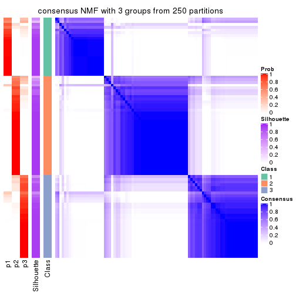</p>

</div>
<div id='tab-SD-NMF-consensus-heatmap-3'>
<pre><code class="r">consensus_heatmap(res, k = 4)
</code></pre>

<p></p>

</div>
<div id='tab-SD-NMF-consensus-heatmap-4'>
<pre><code class="r">consensus_heatmap(res, k = 5)
</code></pre>

<p></p>

</div>
<div id='tab-SD-NMF-consensus-heatmap-5'>
<pre><code class="r">consensus_heatmap(res, k = 6)
</code></pre>

<p></p>

</div>
</div>

Heatmaps for the membership of samples in all partitions to see how consistent they are:


<script>
$( function() {
	$( '#tabs-SD-NMF-membership-heatmap' ).tabs();
} );
</script>
<div id='tabs-SD-NMF-membership-heatmap'>
<ul>
<li><a href='#tab-SD-NMF-membership-heatmap-1'>k = 2</a></li>
<li><a href='#tab-SD-NMF-membership-heatmap-2'>k = 3</a></li>
<li><a href='#tab-SD-NMF-membership-heatmap-3'>k = 4</a></li>
<li><a href='#tab-SD-NMF-membership-heatmap-4'>k = 5</a></li>
<li><a href='#tab-SD-NMF-membership-heatmap-5'>k = 6</a></li>
</ul>
<div id='tab-SD-NMF-membership-heatmap-1'>
<pre><code class="r">membership_heatmap(res, k = 2)
</code></pre>

<p></p>

</div>
<div id='tab-SD-NMF-membership-heatmap-2'>
<pre><code class="r">membership_heatmap(res, k = 3)
</code></pre>

<p></p>

</div>
<div id='tab-SD-NMF-membership-heatmap-3'>
<pre><code class="r">membership_heatmap(res, k = 4)
</code></pre>

<p>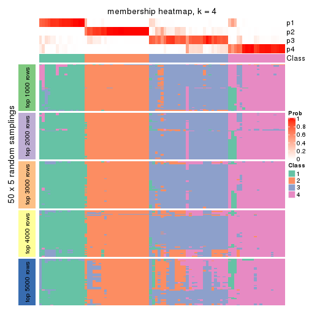</p>

</div>
<div id='tab-SD-NMF-membership-heatmap-4'>
<pre><code class="r">membership_heatmap(res, k = 5)
</code></pre>

<p></p>

</div>
<div id='tab-SD-NMF-membership-heatmap-5'>
<pre><code class="r">membership_heatmap(res, k = 6)
</code></pre>

<p></p>

</div>
</div>

As soon as we have had the classes for columns, we can look for signatures
which are significantly different between classes which can be candidate marks
for certain classes. Following are the heatmaps for signatures.


Signature heatmaps where rows are scaled:


<script>
$( function() {
	$( '#tabs-SD-NMF-get-signatures' ).tabs();
} );
</script>
<div id='tabs-SD-NMF-get-signatures'>
<ul>
<li><a href='#tab-SD-NMF-get-signatures-1'>k = 2</a></li>
<li><a href='#tab-SD-NMF-get-signatures-2'>k = 3</a></li>
<li><a href='#tab-SD-NMF-get-signatures-3'>k = 4</a></li>
<li><a href='#tab-SD-NMF-get-signatures-4'>k = 5</a></li>
<li><a href='#tab-SD-NMF-get-signatures-5'>k = 6</a></li>
</ul>
<div id='tab-SD-NMF-get-signatures-1'>
<pre><code class="r">get_signatures(res, k = 2)
</code></pre>

<p></p>

</div>
<div id='tab-SD-NMF-get-signatures-2'>
<pre><code class="r">get_signatures(res, k = 3)
</code></pre>

<p></p>

</div>
<div id='tab-SD-NMF-get-signatures-3'>
<pre><code class="r">get_signatures(res, k = 4)
</code></pre>

<p></p>

</div>
<div id='tab-SD-NMF-get-signatures-4'>
<pre><code class="r">get_signatures(res, k = 5)
</code></pre>

<p></p>

</div>
<div id='tab-SD-NMF-get-signatures-5'>
<pre><code class="r">get_signatures(res, k = 6)
</code></pre>

<p></p>

</div>
</div>


Signature heatmaps where rows are not scaled:


<script>
$( function() {
	$( '#tabs-SD-NMF-get-signatures-no-scale' ).tabs();
} );
</script>
<div id='tabs-SD-NMF-get-signatures-no-scale'>
<ul>
<li><a href='#tab-SD-NMF-get-signatures-no-scale-1'>k = 2</a></li>
<li><a href='#tab-SD-NMF-get-signatures-no-scale-2'>k = 3</a></li>
<li><a href='#tab-SD-NMF-get-signatures-no-scale-3'>k = 4</a></li>
<li><a href='#tab-SD-NMF-get-signatures-no-scale-4'>k = 5</a></li>
<li><a href='#tab-SD-NMF-get-signatures-no-scale-5'>k = 6</a></li>
</ul>
<div id='tab-SD-NMF-get-signatures-no-scale-1'>
<pre><code class="r">get_signatures(res, k = 2, scale_rows = FALSE)
</code></pre>

<p></p>

</div>
<div id='tab-SD-NMF-get-signatures-no-scale-2'>
<pre><code class="r">get_signatures(res, k = 3, scale_rows = FALSE)
</code></pre>

<p></p>

</div>
<div id='tab-SD-NMF-get-signatures-no-scale-3'>
<pre><code class="r">get_signatures(res, k = 4, scale_rows = FALSE)
</code></pre>

<p></p>

</div>
<div id='tab-SD-NMF-get-signatures-no-scale-4'>
<pre><code class="r">get_signatures(res, k = 5, scale_rows = FALSE)
</code></pre>

<p></p>

</div>
<div id='tab-SD-NMF-get-signatures-no-scale-5'>
<pre><code class="r">get_signatures(res, k = 6, scale_rows = FALSE)
</code></pre>

<p></p>

</div>
</div>


Compare the overlap of signatures from different k:

```r
compare_signatures(res)
```


`get_signature()` returns a data frame invisibly. TO get the list of signatures, the function
call should be assigned to a variable explicitly. In following code, if `plot` argument is set
to `FALSE`, no heatmap is plotted while only the differential analysis is performed.

```r
# code only for demonstration
tb = get_signature(res, k = ..., plot = FALSE)
```

An example of the output of `tb` is:

```
#>   which_row         fdr    mean_1    mean_2 scaled_mean_1 scaled_mean_2 km
#> 1        38 0.042760348  8.373488  9.131774    -0.5533452     0.5164555  1
#> 2        40 0.018707592  7.106213  8.469186    -0.6173731     0.5762149  1
#> 3        55 0.019134737 10.221463 11.207825    -0.6159697     0.5749050  1
#> 4        59 0.006059896  5.921854  7.869574    -0.6899429     0.6439467  1
#> 5        60 0.018055526  8.928898 10.211722    -0.6204761     0.5791110  1
#> 6        98 0.009384629 15.714769 14.887706     0.6635654    -0.6193277  2
...
```

The columns in `tb` are:

1. `which_row`: row indices corresponding to the input matrix.
2. `fdr`: FDR for the differential test. 
3. `mean_x`: The mean value in group x.
4. `scaled_mean_x`: The mean value in group x after rows are scaled.
5. `km`: Row groups if k-means clustering is applied to rows.


UMAP plot which shows how samples are separated.


<script>
$( function() {
	$( '#tabs-SD-NMF-dimension-reduction' ).tabs();
} );
</script>
<div id='tabs-SD-NMF-dimension-reduction'>
<ul>
<li><a href='#tab-SD-NMF-dimension-reduction-1'>k = 2</a></li>
<li><a href='#tab-SD-NMF-dimension-reduction-2'>k = 3</a></li>
<li><a href='#tab-SD-NMF-dimension-reduction-3'>k = 4</a></li>
<li><a href='#tab-SD-NMF-dimension-reduction-4'>k = 5</a></li>
<li><a href='#tab-SD-NMF-dimension-reduction-5'>k = 6</a></li>
</ul>
<div id='tab-SD-NMF-dimension-reduction-1'>
<pre><code class="r">dimension_reduction(res, k = 2, method = &quot;UMAP&quot;)
</code></pre>

<p></p>

</div>
<div id='tab-SD-NMF-dimension-reduction-2'>
<pre><code class="r">dimension_reduction(res, k = 3, method = &quot;UMAP&quot;)
</code></pre>

<p></p>

</div>
<div id='tab-SD-NMF-dimension-reduction-3'>
<pre><code class="r">dimension_reduction(res, k = 4, method = &quot;UMAP&quot;)
</code></pre>

<p></p>

</div>
<div id='tab-SD-NMF-dimension-reduction-4'>
<pre><code class="r">dimension_reduction(res, k = 5, method = &quot;UMAP&quot;)
</code></pre>

<p></p>

</div>
<div id='tab-SD-NMF-dimension-reduction-5'>
<pre><code class="r">dimension_reduction(res, k = 6, method = &quot;UMAP&quot;)
</code></pre>

<p></p>

</div>
</div>


Following heatmap shows how subgroups are split when increasing `k`:

```r
collect_classes(res)
```


If matrix rows can be associated to genes, consider to use `functional_enrichment(res,
...)` to perform function enrichment for the signature genes. See [this vignette](http://bioconductor.org/packages/devel/bioc/vignettes/cola/inst/doc/functional_enrichment.html) for more detailed explanations.


 

---------------------------------------------------


### CV:hclust


The object with results only for a single top-value method and a single partition method 
can be extracted as:

```r
res = res_list["CV", "hclust"]
# you can also extract it by
# res = res_list["CV:hclust"]
```

A summary of `res` and all the functions that can be applied to it:

```r
res
```

```
#> A 'ConsensusPartition' object with k = 2, 3, 4, 5, 6.
#>   On a matrix with 17471 rows and 87 columns.
#>   Top rows (1000, 2000, 3000, 4000, 5000) are extracted by 'CV' method.
#>   Subgroups are detected by 'hclust' method.
#>   Performed in total 1250 partitions by row resampling.
#>   Best k for subgroups seems to be 3.
#> 
#> Following methods can be applied to this 'ConsensusPartition' object:
#>  [1] "cola_report"             "collect_classes"         "collect_plots"          
#>  [4] "collect_stats"           "colnames"                "compare_signatures"     
#>  [7] "consensus_heatmap"       "dimension_reduction"     "functional_enrichment"  
#> [10] "get_anno_col"            "get_anno"                "get_classes"            
#> [13] "get_consensus"           "get_matrix"              "get_membership"         
#> [16] "get_param"               "get_signatures"          "get_stats"              
#> [19] "is_best_k"               "is_stable_k"             "membership_heatmap"     
#> [22] "ncol"                    "nrow"                    "plot_ecdf"              
#> [25] "rownames"                "select_partition_number" "show"                   
#> [28] "suggest_best_k"          "test_to_known_factors"
```

`collect_plots()` function collects all the plots made from `res` for all `k` (number of partitions)
into one single page to provide an easy and fast comparison between different `k`.

```r
collect_plots(res)
```


The plots are:

- The first row: a plot of the ECDF (empirical cumulative distribution
  function) curves of the consensus matrix for each `k` and the heatmap of
  predicted classes for each `k`.
- The second row: heatmaps of the consensus matrix for each `k`.
- The third row: heatmaps of the membership matrix for each `k`.
- The fouth row: heatmaps of the signatures for each `k`.

All the plots in panels can be made by individual functions and they are
plotted later in this section.

`select_partition_number()` produces several plots showing different
statistics for choosing "optimized" `k`. There are following statistics:

- ECDF curves of the consensus matrix for each `k`;
- 1-PAC. [The PAC
  score](https://en.wikipedia.org/wiki/Consensus_clustering#Over-interpretation_potential_of_consensus_clustering)
  measures the proportion of the ambiguous subgrouping.
- Mean silhouette score.
- Concordance. The mean probability of fiting the consensus class ids in all
  partitions.
- Area increased. Denote $A_k$ as the area under the ECDF curve for current
  `k`, the area increased is defined as $A_k - A_{k-1}$.
- Rand index. The percent of pairs of samples that are both in a same cluster
  or both are not in a same cluster in the partition of k and k-1.
- Jaccard index. The ratio of pairs of samples are both in a same cluster in
  the partition of k and k-1 and the pairs of samples are both in a same
  cluster in the partition k or k-1.

The detailed explanations of these statistics can be found in [the _cola_
vignette](http://bioconductor.org/packages/devel/bioc/vignettes/cola/inst/doc/cola.html#toc_13).

Generally speaking, lower PAC score, higher mean silhouette score or higher
concordance corresponds to better partition. Rand index and Jaccard index
measure how similar the current partition is compared to partition with `k-1`.
If they are too similar, we won't accept `k` is better than `k-1`.

```r
select_partition_number(res)
```


The numeric values for all these statistics can be obtained by `get_stats()`.

```r
get_stats(res)
```

```
#>   k 1-PAC mean_silhouette concordance area_increased  Rand Jaccard
#> 2 2 0.859           0.896       0.951         0.1452 0.933   0.933
#> 3 3 0.411           0.652       0.853         1.2992 0.769   0.752
#> 4 4 0.368           0.649       0.793         0.4357 0.834   0.764
#> 5 5 0.439           0.643       0.785         0.1821 0.886   0.795
#> 6 6 0.425           0.649       0.792         0.0504 0.967   0.930
```

`suggest_best_k()` suggests the best $k$ based on these statistics. The rules are as follows:

- All $k$ with Jaccard index larger than 0.95 are removed because increasing
  $k$ does not provide enough extra information. If all $k$ are removed, it is
  marked as no subgroup is detected.
- For all $k$ with 1-PAC score larger than 0.9, the maximal $k$ is taken as
  the best $k$, and other $k$ are marked as optional $k$.
- If it does not fit the second rule. The $k$ with the maximal vote of the
  highest 1-PAC score, highest mean silhouette, and highest concordance is
  taken as the best $k$.

```r
suggest_best_k(res)
```

```
#> [1] 3
```


Following shows the table of the partitions (You need to click the **show/hide
code output** link to see it). The membership matrix (columns with name `p*`)
is inferred by
[`clue::cl_consensus()`](https://www.rdocumentation.org/link/cl_consensus?package=clue)
function with the `SE` method. Basically the value in the membership matrix
represents the probability to belong to a certain group. The finall class
label for an item is determined with the group with highest probability it
belongs to.

In `get_classes()` function, the entropy is calculated from the membership
matrix and the silhouette score is calculated from the consensus matrix.


<script>
$( function() {
	$( '#tabs-CV-hclust-get-classes' ).tabs();
} );
</script>
<div id='tabs-CV-hclust-get-classes'>
<ul>
<li><a href='#tab-CV-hclust-get-classes-1'>k = 2</a></li>
<li><a href='#tab-CV-hclust-get-classes-2'>k = 3</a></li>
<li><a href='#tab-CV-hclust-get-classes-3'>k = 4</a></li>
<li><a href='#tab-CV-hclust-get-classes-4'>k = 5</a></li>
<li><a href='#tab-CV-hclust-get-classes-5'>k = 6</a></li>
</ul>

<div id='tab-CV-hclust-get-classes-1'>
<p><a id='tab-CV-hclust-get-classes-1-a' style='color:#0366d6' href='#'>show/hide code output</a></p>
<pre><code class="r">cbind(get_classes(res, k = 2), get_membership(res, k = 2))
</code></pre>

<pre><code>#&gt;                                      class entropy silhouette    p1    p2
#&gt; E6088A41-B0DC-4FBF-8D14-BE78024CF8CD     2  0.0000      0.948 0.000 1.000
#&gt; F569915C-8F77-4D67-9730-30824DB57EE5     2  0.0000      0.948 0.000 1.000
#&gt; E3B71CB7-673B-4741-8607-4F0A11633036     2  0.2043      0.933 0.032 0.968
#&gt; DAF84798-FE3F-403C-B589-7F256AF752BE     2  0.0000      0.948 0.000 1.000
#&gt; 2F38E3B1-4975-4877-9DCC-C00270602180     2  0.0376      0.947 0.004 0.996
#&gt; C79A4C2F-02C4-4C03-A5A5-DE06802EEB57     2  0.0000      0.948 0.000 1.000
#&gt; 92E3ED8F-5C74-4ED2-9B03-9FA5E7B491D6     2  0.2043      0.933 0.032 0.968
#&gt; E61D60BE-3BD3-4B5E-BC12-80F3684A0959     2  0.7219      0.761 0.200 0.800
#&gt; C9388FC7-DB1D-4416-BC2D-EA643584F1E6     2  0.1414      0.940 0.020 0.980
#&gt; D4219360-6344-4AF3-ACEB-1701A9F1F67D     2  0.2043      0.933 0.032 0.968
#&gt; 07D155E6-F27C-4D09-B786-8A9B71147B72     2  0.9286      0.507 0.344 0.656
#&gt; 10C8C361-85A5-40E8-A395-B92623E6F27C     2  0.0672      0.946 0.008 0.992
#&gt; BDF20891-7C98-4A55-BBF3-8A836BE303C6     2  0.0000      0.948 0.000 1.000
#&gt; 694B0504-095E-431A-84F2-B4387072138E     2  0.2043      0.933 0.032 0.968
#&gt; EDCF8E7F-8B1D-46F7-8AE0-84A1DC9647D2     2  0.0000      0.948 0.000 1.000
#&gt; 0EA8288E-824D-4304-A053-5A833361F5C5     1  0.2423      0.991 0.960 0.040
#&gt; C4ACCFA1-34A9-4F61-8A1F-35B3B60EA193     2  0.2043      0.933 0.032 0.968
#&gt; 760BA639-38AC-4BC9-9647-09F6893EA8ED     2  0.2043      0.933 0.032 0.968
#&gt; 082DFC6B-C6E6-48B9-BDE5-74FF3B3DC954     2  0.0000      0.948 0.000 1.000
#&gt; FE349848-D7C4-4C49-B670-0E20454DDD7E     2  0.0376      0.947 0.004 0.996
#&gt; 2E8937B3-9EA1-4528-8CEE-BF3D4137908A     2  0.0000      0.948 0.000 1.000
#&gt; 9942D04E-2767-4E39-BA16-7762EAC3DFC4     2  0.0000      0.948 0.000 1.000
#&gt; F9C23182-91C4-4145-AE52-526FE8EB199D     2  0.0000      0.948 0.000 1.000
#&gt; 01024EED-7811-4E24-A067-8E0B978FFE2D     2  0.0000      0.948 0.000 1.000
#&gt; 932C8E98-A352-409C-8744-3D49FABCE425     2  0.2043      0.933 0.032 0.968
#&gt; 6DFD9439-C659-4936-84E5-108F717E3E4D     2  0.0000      0.948 0.000 1.000
#&gt; 1D8B83B8-5DD7-4F45-9D59-487EC6906A8B     2  0.0000      0.948 0.000 1.000
#&gt; 804B8503-73F6-42DE-835F-39DE2C9F13E1     2  0.0000      0.948 0.000 1.000
#&gt; B9453C9B-84D5-43BD-85BB-1780F02F039C     2  0.2423      0.929 0.040 0.960
#&gt; 836E6CD6-4E88-4028-9844-FA3C892C254A     2  0.0672      0.947 0.008 0.992
#&gt; 36EDD202-A845-4CE7-95D5-A515C471262E     2  0.0000      0.948 0.000 1.000
#&gt; 181C156A-B8F4-4F9D-93AA-6AFBD197644D     2  0.0376      0.947 0.004 0.996
#&gt; 0580E798-6A98-4E46-AC96-9A869DFF502E     2  0.2043      0.936 0.032 0.968
#&gt; EA1B63CF-D389-4567-8D9E-B0EF1F804598     2  0.0000      0.948 0.000 1.000
#&gt; 5ABC3D06-B8E9-4831-B89B-7C1EC4006B47     2  0.0000      0.948 0.000 1.000
#&gt; 1CC01E74-A7C1-4A51-9E28-1703C352BE16     2  0.0000      0.948 0.000 1.000
#&gt; 97E55B75-DBDB-46BC-9E74-7828C070BF16     2  0.0000      0.948 0.000 1.000
#&gt; BEB37A2D-E8B0-4674-89AC-DC0F34E0AFD6     2  0.4815      0.867 0.104 0.896
#&gt; 558648BA-6551-4D34-97C2-AD5F677D63FB     2  0.7056      0.771 0.192 0.808
#&gt; FF7021BB-414B-4466-BC43-372D856E6A1D     2  0.0000      0.948 0.000 1.000
#&gt; 9C04B840-54E0-425D-BDBE-8CB6B9C2C722     2  0.0000      0.948 0.000 1.000
#&gt; 5F50B1F4-1A02-4506-AA6D-9BF21CD8059A     1  0.2043      0.995 0.968 0.032
#&gt; 7D4B8FF3-7977-4ABD-AE04-EED1C50B23CC     2  0.0000      0.948 0.000 1.000
#&gt; A005AF15-B98E-4623-8AD4-1E69EFA9BC7A     2  0.9661      0.402 0.392 0.608
#&gt; 1DF04345-5C93-4B18-B307-8D1FCA532999     2  0.0000      0.948 0.000 1.000
#&gt; 6AF30C18-347E-41ED-A4AB-6F81F42206C5     2  0.3431      0.909 0.064 0.936
#&gt; 88A44ED0-BDE1-401E-B0E1-D8C8D6DBAEFC     2  0.0000      0.948 0.000 1.000
#&gt; 117673A3-2918-4702-8583-B66ADE6E4338     2  0.0000      0.948 0.000 1.000
#&gt; 4903A571-E14D-43C9-A737-22CAFAC414CD     2  0.1414      0.940 0.020 0.980
#&gt; C175E68E-632A-4B4A-9DDB-4895C4760F20     2  0.2043      0.933 0.032 0.968
#&gt; FA5CA2F4-A1AD-4A79-B8F3-73A976EB2FB1     2  0.0000      0.948 0.000 1.000
#&gt; E1F883A7-8B1F-4C1D-8A1A-9749A9C09845     2  0.0000      0.948 0.000 1.000
#&gt; E74F0729-6000-4908-ADB0-7BDBAC0639E6     2  0.0672      0.946 0.008 0.992
#&gt; F92135A9-1981-4C79-99A5-4243EEC5D30D     2  0.0000      0.948 0.000 1.000
#&gt; 73C6919F-DEB4-4DA4-B4AE-4032AC8F96C5     2  0.0672      0.946 0.008 0.992
#&gt; 33977B40-2E92-48B6-8D3A-3EBE913F6F8A     2  0.0672      0.947 0.008 0.992
#&gt; 490BD607-2F08-4B4C-9612-F9BB5CBBC8BB     2  0.0000      0.948 0.000 1.000
#&gt; 6C666E17-2EB8-4244-BCC1-8DD34EE4173E     2  0.2603      0.924 0.044 0.956
#&gt; C41F3064-4483-4796-B860-82155BAA5157     2  0.3274      0.913 0.060 0.940
#&gt; F4232B90-51B9-43EE-9971-35B3A318758F     2  0.0938      0.946 0.012 0.988
#&gt; 291EA1F6-FC56-4429-A433-0C452A6A514C     2  0.0000      0.948 0.000 1.000
#&gt; CC4AF04D-CB8E-40DD-B12E-7AA39B38262A     2  0.0000      0.948 0.000 1.000
#&gt; 4DAE26B9-AB57-4763-BB9A-2ADDD5D9C007     2  0.6887      0.777 0.184 0.816
#&gt; 676B4AEE-FB41-4C16-AA91-03E4A1DA8E26     2  0.9866      0.298 0.432 0.568
#&gt; 1CC36859-357A-49E0-A367-4F57D47288BA     2  0.0000      0.948 0.000 1.000
#&gt; 7CCDDFC8-6DF6-4734-96AC-19EBC464FC50     2  0.0000      0.948 0.000 1.000
#&gt; 10F38C34-3956-48ED-AB62-3439EF00D46B     2  0.1184      0.942 0.016 0.984
#&gt; 80B2B393-9D6E-45B4-B696-2A5C203543B7     2  0.0672      0.946 0.008 0.992
#&gt; 5AC7B5EA-1AAC-4529-8E5A-F612E5E0719A     2  0.8608      0.635 0.284 0.716
#&gt; 3648E98D-4B3A-41B7-BE05-595D44F0150D     2  0.2043      0.933 0.032 0.968
#&gt; 252EC850-6026-473B-8FFC-2CF567EF42E4     2  0.9795      0.342 0.416 0.584
#&gt; 1790E7A3-99D8-447E-BC50-51C8A4A18853     2  0.0000      0.948 0.000 1.000
#&gt; DA61A4F8-350B-4DD1-A240-AD016520DB5B     2  0.1184      0.942 0.016 0.984
#&gt; 767E5BAF-2515-40D7-AE7D-0B24D77A03F4     2  0.0376      0.947 0.004 0.996
#&gt; 8CB9C903-D749-44EA-9137-7FB5A92C5932     2  0.1184      0.944 0.016 0.984
#&gt; A9B968AE-2243-41BC-852A-3A12C1FB4892     2  0.9866      0.298 0.432 0.568
#&gt; 3C582264-85BC-4569-A888-8EB3008E5198     2  0.0000      0.948 0.000 1.000
#&gt; F4EAF9A2-9938-4D9B-9080-C0A7542D5704     2  0.0000      0.948 0.000 1.000
#&gt; 328499D3-45DD-4B66-BD22-3C52BA92C2BB     2  0.2423      0.929 0.040 0.960
#&gt; AF8AB83D-2917-4752-8C38-CF84C565B565     1  0.2043      0.995 0.968 0.032
#&gt; 03A327CA-A9FE-42A4-844D-CA85206969FC     2  0.0376      0.947 0.004 0.996
#&gt; 4B0BEC44-87BB-4014-9A26-3529DD63760B     2  0.1184      0.942 0.016 0.984
#&gt; 05C7843E-DC89-4D8E-A78A-952C5DFD667B     2  0.0000      0.948 0.000 1.000
#&gt; 29A0FFF9-13D3-4D16-BE6A-8E48A2C4E315     2  0.0000      0.948 0.000 1.000
#&gt; 22947CC3-4F42-4F44-899C-2B7085E36C9D     2  0.0000      0.948 0.000 1.000
#&gt; A247D92D-253A-4BEC-B450-184AF90D17D0     2  0.1414      0.940 0.020 0.980
#&gt; 0D907A63-D23F-4684-80D9-0BA552435B86     2  0.9661      0.402 0.392 0.608
</code></pre>

<script>
$('#tab-CV-hclust-get-classes-1-a').parent().next().next().hide();
$('#tab-CV-hclust-get-classes-1-a').click(function(){
  $('#tab-CV-hclust-get-classes-1-a').parent().next().next().toggle();
  return(false);
});
</script>
</div>

<div id='tab-CV-hclust-get-classes-2'>
<p><a id='tab-CV-hclust-get-classes-2-a' style='color:#0366d6' href='#'>show/hide code output</a></p>
<pre><code class="r">cbind(get_classes(res, k = 3), get_membership(res, k = 3))
</code></pre>

<pre><code>#&gt;                                      class entropy silhouette    p1    p2    p3
#&gt; E6088A41-B0DC-4FBF-8D14-BE78024CF8CD     2  0.0237    0.81994 0.004 0.996 0.000
#&gt; F569915C-8F77-4D67-9730-30824DB57EE5     2  0.0829    0.81746 0.012 0.984 0.004
#&gt; E3B71CB7-673B-4741-8607-4F0A11633036     1  0.6295    0.72380 0.528 0.472 0.000
#&gt; DAF84798-FE3F-403C-B589-7F256AF752BE     2  0.0237    0.82002 0.004 0.996 0.000
#&gt; 2F38E3B1-4975-4877-9DCC-C00270602180     2  0.2356    0.77142 0.072 0.928 0.000
#&gt; C79A4C2F-02C4-4C03-A5A5-DE06802EEB57     2  0.3686    0.68656 0.140 0.860 0.000
#&gt; 92E3ED8F-5C74-4ED2-9B03-9FA5E7B491D6     1  0.6215    0.73668 0.572 0.428 0.000
#&gt; E61D60BE-3BD3-4B5E-BC12-80F3684A0959     2  0.9648   -0.55349 0.384 0.408 0.208
#&gt; C9388FC7-DB1D-4416-BC2D-EA643584F1E6     2  0.1337    0.81305 0.012 0.972 0.016
#&gt; D4219360-6344-4AF3-ACEB-1701A9F1F67D     1  0.6299    0.71945 0.524 0.476 0.000
#&gt; 07D155E6-F27C-4D09-B786-8A9B71147B72     2  0.6629    0.22632 0.016 0.624 0.360
#&gt; 10C8C361-85A5-40E8-A395-B92623E6F27C     2  0.5397    0.35410 0.280 0.720 0.000
#&gt; BDF20891-7C98-4A55-BBF3-8A836BE303C6     2  0.4555    0.56241 0.200 0.800 0.000
#&gt; 694B0504-095E-431A-84F2-B4387072138E     1  0.6215    0.73668 0.572 0.428 0.000
#&gt; EDCF8E7F-8B1D-46F7-8AE0-84A1DC9647D2     2  0.0237    0.82002 0.004 0.996 0.000
#&gt; 0EA8288E-824D-4304-A053-5A833361F5C5     3  0.0237    0.98970 0.000 0.004 0.996
#&gt; C4ACCFA1-34A9-4F61-8A1F-35B3B60EA193     1  0.6168    0.72940 0.588 0.412 0.000
#&gt; 760BA639-38AC-4BC9-9647-09F6893EA8ED     1  0.6295    0.72380 0.528 0.472 0.000
#&gt; 082DFC6B-C6E6-48B9-BDE5-74FF3B3DC954     2  0.0829    0.81746 0.012 0.984 0.004
#&gt; FE349848-D7C4-4C49-B670-0E20454DDD7E     2  0.0424    0.81948 0.008 0.992 0.000
#&gt; 2E8937B3-9EA1-4528-8CEE-BF3D4137908A     2  0.3038    0.72347 0.104 0.896 0.000
#&gt; 9942D04E-2767-4E39-BA16-7762EAC3DFC4     2  0.0237    0.82007 0.004 0.996 0.000
#&gt; F9C23182-91C4-4145-AE52-526FE8EB199D     2  0.0237    0.82002 0.004 0.996 0.000
#&gt; 01024EED-7811-4E24-A067-8E0B978FFE2D     2  0.0424    0.81958 0.008 0.992 0.000
#&gt; 932C8E98-A352-409C-8744-3D49FABCE425     1  0.6302    0.71378 0.520 0.480 0.000
#&gt; 6DFD9439-C659-4936-84E5-108F717E3E4D     2  0.0237    0.82002 0.004 0.996 0.000
#&gt; 1D8B83B8-5DD7-4F45-9D59-487EC6906A8B     2  0.0424    0.82053 0.008 0.992 0.000
#&gt; 804B8503-73F6-42DE-835F-39DE2C9F13E1     2  0.0000    0.82019 0.000 1.000 0.000
#&gt; B9453C9B-84D5-43BD-85BB-1780F02F039C     1  0.1031   -0.08058 0.976 0.024 0.000
#&gt; 836E6CD6-4E88-4028-9844-FA3C892C254A     2  0.1643    0.80206 0.044 0.956 0.000
#&gt; 36EDD202-A845-4CE7-95D5-A515C471262E     2  0.0237    0.82007 0.004 0.996 0.000
#&gt; 181C156A-B8F4-4F9D-93AA-6AFBD197644D     2  0.5397    0.36323 0.280 0.720 0.000
#&gt; 0580E798-6A98-4E46-AC96-9A869DFF502E     2  0.5858    0.45591 0.240 0.740 0.020
#&gt; EA1B63CF-D389-4567-8D9E-B0EF1F804598     2  0.0237    0.82002 0.004 0.996 0.000
#&gt; 5ABC3D06-B8E9-4831-B89B-7C1EC4006B47     2  0.0237    0.82007 0.004 0.996 0.000
#&gt; 1CC01E74-A7C1-4A51-9E28-1703C352BE16     2  0.0000    0.82019 0.000 1.000 0.000
#&gt; 97E55B75-DBDB-46BC-9E74-7828C070BF16     2  0.0892    0.81252 0.020 0.980 0.000
#&gt; BEB37A2D-E8B0-4674-89AC-DC0F34E0AFD6     2  0.4563    0.69408 0.036 0.852 0.112
#&gt; 558648BA-6551-4D34-97C2-AD5F677D63FB     1  0.9584    0.53933 0.428 0.372 0.200
#&gt; FF7021BB-414B-4466-BC43-372D856E6A1D     2  0.0237    0.82007 0.004 0.996 0.000
#&gt; 9C04B840-54E0-425D-BDBE-8CB6B9C2C722     2  0.0237    0.82002 0.004 0.996 0.000
#&gt; 5F50B1F4-1A02-4506-AA6D-9BF21CD8059A     3  0.0237    0.99488 0.004 0.000 0.996
#&gt; 7D4B8FF3-7977-4ABD-AE04-EED1C50B23CC     2  0.0237    0.82002 0.004 0.996 0.000
#&gt; A005AF15-B98E-4623-8AD4-1E69EFA9BC7A     2  0.6836    0.10933 0.016 0.572 0.412
#&gt; 1DF04345-5C93-4B18-B307-8D1FCA532999     2  0.3686    0.66275 0.140 0.860 0.000
#&gt; 6AF30C18-347E-41ED-A4AB-6F81F42206C5     2  0.6715    0.39106 0.228 0.716 0.056
#&gt; 88A44ED0-BDE1-401E-B0E1-D8C8D6DBAEFC     2  0.0829    0.81746 0.012 0.984 0.004
#&gt; 117673A3-2918-4702-8583-B66ADE6E4338     2  0.0237    0.82002 0.004 0.996 0.000
#&gt; 4903A571-E14D-43C9-A737-22CAFAC414CD     2  0.2297    0.79506 0.036 0.944 0.020
#&gt; C175E68E-632A-4B4A-9DDB-4895C4760F20     1  0.6299    0.71774 0.524 0.476 0.000
#&gt; FA5CA2F4-A1AD-4A79-B8F3-73A976EB2FB1     2  0.0000    0.82019 0.000 1.000 0.000
#&gt; E1F883A7-8B1F-4C1D-8A1A-9749A9C09845     2  0.3686    0.66275 0.140 0.860 0.000
#&gt; E74F0729-6000-4908-ADB0-7BDBAC0639E6     2  0.4974    0.47487 0.236 0.764 0.000
#&gt; F92135A9-1981-4C79-99A5-4243EEC5D30D     2  0.0000    0.82019 0.000 1.000 0.000
#&gt; 73C6919F-DEB4-4DA4-B4AE-4032AC8F96C5     2  0.4887    0.49904 0.228 0.772 0.000
#&gt; 33977B40-2E92-48B6-8D3A-3EBE913F6F8A     2  0.2261    0.78165 0.068 0.932 0.000
#&gt; 490BD607-2F08-4B4C-9612-F9BB5CBBC8BB     2  0.0829    0.81746 0.012 0.984 0.004
#&gt; 6C666E17-2EB8-4244-BCC1-8DD34EE4173E     2  0.2773    0.78057 0.024 0.928 0.048
#&gt; C41F3064-4483-4796-B860-82155BAA5157     2  0.3253    0.76967 0.036 0.912 0.052
#&gt; F4232B90-51B9-43EE-9971-35B3A318758F     2  0.4974    0.48461 0.236 0.764 0.000
#&gt; 291EA1F6-FC56-4429-A433-0C452A6A514C     2  0.0000    0.82019 0.000 1.000 0.000
#&gt; CC4AF04D-CB8E-40DD-B12E-7AA39B38262A     2  0.0237    0.82007 0.004 0.996 0.000
#&gt; 4DAE26B9-AB57-4763-BB9A-2ADDD5D9C007     2  0.6984    0.46387 0.088 0.720 0.192
#&gt; 676B4AEE-FB41-4C16-AA91-03E4A1DA8E26     2  0.6925    0.00671 0.016 0.532 0.452
#&gt; 1CC36859-357A-49E0-A367-4F57D47288BA     2  0.0424    0.82053 0.008 0.992 0.000
#&gt; 7CCDDFC8-6DF6-4734-96AC-19EBC464FC50     2  0.0000    0.82019 0.000 1.000 0.000
#&gt; 10F38C34-3956-48ED-AB62-3439EF00D46B     2  0.1482    0.81028 0.020 0.968 0.012
#&gt; 80B2B393-9D6E-45B4-B696-2A5C203543B7     2  0.5529    0.30740 0.296 0.704 0.000
#&gt; 5AC7B5EA-1AAC-4529-8E5A-F612E5E0719A     2  0.9889   -0.47461 0.296 0.408 0.296
#&gt; 3648E98D-4B3A-41B7-BE05-595D44F0150D     1  0.6307    0.69835 0.512 0.488 0.000
#&gt; 252EC850-6026-473B-8FFC-2CF567EF42E4     2  0.6897    0.04634 0.016 0.548 0.436
#&gt; 1790E7A3-99D8-447E-BC50-51C8A4A18853     2  0.0000    0.82019 0.000 1.000 0.000
#&gt; DA61A4F8-350B-4DD1-A240-AD016520DB5B     2  0.1482    0.81028 0.020 0.968 0.012
#&gt; 767E5BAF-2515-40D7-AE7D-0B24D77A03F4     2  0.0829    0.81731 0.012 0.984 0.004
#&gt; 8CB9C903-D749-44EA-9137-7FB5A92C5932     2  0.4974    0.48816 0.236 0.764 0.000
#&gt; A9B968AE-2243-41BC-852A-3A12C1FB4892     2  0.6925    0.00671 0.016 0.532 0.452
#&gt; 3C582264-85BC-4569-A888-8EB3008E5198     2  0.0000    0.82019 0.000 1.000 0.000
#&gt; F4EAF9A2-9938-4D9B-9080-C0A7542D5704     2  0.0000    0.82019 0.000 1.000 0.000
#&gt; 328499D3-45DD-4B66-BD22-3C52BA92C2BB     1  0.1031   -0.08058 0.976 0.024 0.000
#&gt; AF8AB83D-2917-4752-8C38-CF84C565B565     3  0.0237    0.99488 0.004 0.000 0.996
#&gt; 03A327CA-A9FE-42A4-844D-CA85206969FC     2  0.0424    0.81948 0.008 0.992 0.000
#&gt; 4B0BEC44-87BB-4014-9A26-3529DD63760B     2  0.1482    0.81028 0.020 0.968 0.012
#&gt; 05C7843E-DC89-4D8E-A78A-952C5DFD667B     2  0.0237    0.81994 0.004 0.996 0.000
#&gt; 29A0FFF9-13D3-4D16-BE6A-8E48A2C4E315     2  0.0000    0.82019 0.000 1.000 0.000
#&gt; 22947CC3-4F42-4F44-899C-2B7085E36C9D     2  0.0237    0.81994 0.004 0.996 0.000
#&gt; A247D92D-253A-4BEC-B450-184AF90D17D0     2  0.1636    0.80811 0.020 0.964 0.016
#&gt; 0D907A63-D23F-4684-80D9-0BA552435B86     2  0.6836    0.10933 0.016 0.572 0.412
</code></pre>

<script>
$('#tab-CV-hclust-get-classes-2-a').parent().next().next().hide();
$('#tab-CV-hclust-get-classes-2-a').click(function(){
  $('#tab-CV-hclust-get-classes-2-a').parent().next().next().toggle();
  return(false);
});
</script>
</div>

<div id='tab-CV-hclust-get-classes-3'>
<p><a id='tab-CV-hclust-get-classes-3-a' style='color:#0366d6' href='#'>show/hide code output</a></p>
<pre><code class="r">cbind(get_classes(res, k = 4), get_membership(res, k = 4))
</code></pre>

<pre><code>#&gt;                                      class entropy silhouette    p1    p2    p3    p4
#&gt; E6088A41-B0DC-4FBF-8D14-BE78024CF8CD     2  0.0967     0.8312 0.004 0.976 0.004 0.016
#&gt; F569915C-8F77-4D67-9730-30824DB57EE5     2  0.1484     0.8269 0.016 0.960 0.004 0.020
#&gt; E3B71CB7-673B-4741-8607-4F0A11633036     1  0.7563     0.7353 0.560 0.208 0.016 0.216
#&gt; DAF84798-FE3F-403C-B589-7F256AF752BE     2  0.1209     0.8373 0.004 0.964 0.000 0.032
#&gt; 2F38E3B1-4975-4877-9DCC-C00270602180     2  0.8615    -0.1505 0.100 0.488 0.120 0.292
#&gt; C79A4C2F-02C4-4C03-A5A5-DE06802EEB57     2  0.5432     0.6582 0.136 0.768 0.024 0.072
#&gt; 92E3ED8F-5C74-4ED2-9B03-9FA5E7B491D6     1  0.6790     0.7288 0.608 0.196 0.000 0.196
#&gt; E61D60BE-3BD3-4B5E-BC12-80F3684A0959     4  0.8686    -0.1649 0.364 0.216 0.044 0.376
#&gt; C9388FC7-DB1D-4416-BC2D-EA643584F1E6     2  0.1994     0.8317 0.008 0.936 0.004 0.052
#&gt; D4219360-6344-4AF3-ACEB-1701A9F1F67D     1  0.7591     0.7331 0.556 0.212 0.016 0.216
#&gt; 07D155E6-F27C-4D09-B786-8A9B71147B72     4  0.4879     0.6405 0.012 0.228 0.016 0.744
#&gt; 10C8C361-85A5-40E8-A395-B92623E6F27C     2  0.7235     0.2581 0.272 0.596 0.032 0.100
#&gt; BDF20891-7C98-4A55-BBF3-8A836BE303C6     2  0.4728     0.6497 0.188 0.776 0.016 0.020
#&gt; 694B0504-095E-431A-84F2-B4387072138E     1  0.6790     0.7309 0.608 0.200 0.000 0.192
#&gt; EDCF8E7F-8B1D-46F7-8AE0-84A1DC9647D2     2  0.1004     0.8371 0.004 0.972 0.000 0.024
#&gt; 0EA8288E-824D-4304-A053-5A833361F5C5     3  0.5317     0.9851 0.004 0.004 0.532 0.460
#&gt; C4ACCFA1-34A9-4F61-8A1F-35B3B60EA193     1  0.6655     0.7184 0.624 0.192 0.000 0.184
#&gt; 760BA639-38AC-4BC9-9647-09F6893EA8ED     1  0.7563     0.7353 0.560 0.208 0.016 0.216
#&gt; 082DFC6B-C6E6-48B9-BDE5-74FF3B3DC954     2  0.1697     0.8205 0.016 0.952 0.004 0.028
#&gt; FE349848-D7C4-4C49-B670-0E20454DDD7E     2  0.1191     0.8320 0.004 0.968 0.004 0.024
#&gt; 2E8937B3-9EA1-4528-8CEE-BF3D4137908A     2  0.3996     0.7415 0.104 0.836 0.000 0.060
#&gt; 9942D04E-2767-4E39-BA16-7762EAC3DFC4     2  0.1305     0.8352 0.004 0.960 0.000 0.036
#&gt; F9C23182-91C4-4145-AE52-526FE8EB199D     2  0.1042     0.8376 0.008 0.972 0.000 0.020
#&gt; 01024EED-7811-4E24-A067-8E0B978FFE2D     2  0.1807     0.8333 0.008 0.940 0.000 0.052
#&gt; 932C8E98-A352-409C-8744-3D49FABCE425     1  0.7590     0.7303 0.556 0.220 0.016 0.208
#&gt; 6DFD9439-C659-4936-84E5-108F717E3E4D     2  0.1004     0.8371 0.004 0.972 0.000 0.024
#&gt; 1D8B83B8-5DD7-4F45-9D59-487EC6906A8B     2  0.1114     0.8322 0.008 0.972 0.004 0.016
#&gt; 804B8503-73F6-42DE-835F-39DE2C9F13E1     2  0.0779     0.8370 0.004 0.980 0.000 0.016
#&gt; B9453C9B-84D5-43BD-85BB-1780F02F039C     1  0.2522     0.2624 0.920 0.016 0.052 0.012
#&gt; 836E6CD6-4E88-4028-9844-FA3C892C254A     2  0.3170     0.7994 0.044 0.896 0.016 0.044
#&gt; 36EDD202-A845-4CE7-95D5-A515C471262E     2  0.1489     0.8341 0.004 0.952 0.000 0.044
#&gt; 181C156A-B8F4-4F9D-93AA-6AFBD197644D     2  0.6242     0.4519 0.260 0.664 0.024 0.052
#&gt; 0580E798-6A98-4E46-AC96-9A869DFF502E     2  0.8835    -0.4049 0.228 0.384 0.052 0.336
#&gt; EA1B63CF-D389-4567-8D9E-B0EF1F804598     2  0.1004     0.8371 0.004 0.972 0.000 0.024
#&gt; 5ABC3D06-B8E9-4831-B89B-7C1EC4006B47     2  0.1305     0.8352 0.004 0.960 0.000 0.036
#&gt; 1CC01E74-A7C1-4A51-9E28-1703C352BE16     2  0.0817     0.8368 0.000 0.976 0.000 0.024
#&gt; 97E55B75-DBDB-46BC-9E74-7828C070BF16     2  0.2256     0.8210 0.020 0.924 0.000 0.056
#&gt; BEB37A2D-E8B0-4674-89AC-DC0F34E0AFD6     2  0.4817     0.6460 0.040 0.768 0.004 0.188
#&gt; 558648BA-6551-4D34-97C2-AD5F677D63FB     1  0.8756     0.1489 0.408 0.312 0.048 0.232
#&gt; FF7021BB-414B-4466-BC43-372D856E6A1D     2  0.1004     0.8363 0.004 0.972 0.000 0.024
#&gt; 9C04B840-54E0-425D-BDBE-8CB6B9C2C722     2  0.1256     0.8372 0.008 0.964 0.000 0.028
#&gt; 5F50B1F4-1A02-4506-AA6D-9BF21CD8059A     3  0.4977     0.9926 0.000 0.000 0.540 0.460
#&gt; 7D4B8FF3-7977-4ABD-AE04-EED1C50B23CC     2  0.1109     0.8371 0.004 0.968 0.000 0.028
#&gt; A005AF15-B98E-4623-8AD4-1E69EFA9BC7A     4  0.3791     0.6497 0.000 0.200 0.004 0.796
#&gt; 1DF04345-5C93-4B18-B307-8D1FCA532999     2  0.4541     0.6862 0.144 0.796 0.000 0.060
#&gt; 6AF30C18-347E-41ED-A4AB-6F81F42206C5     2  0.8610    -0.2821 0.220 0.436 0.044 0.300
#&gt; 88A44ED0-BDE1-401E-B0E1-D8C8D6DBAEFC     2  0.1697     0.8205 0.016 0.952 0.004 0.028
#&gt; 117673A3-2918-4702-8583-B66ADE6E4338     2  0.1004     0.8371 0.004 0.972 0.000 0.024
#&gt; 4903A571-E14D-43C9-A737-22CAFAC414CD     2  0.3243     0.7849 0.036 0.876 0.000 0.088
#&gt; C175E68E-632A-4B4A-9DDB-4895C4760F20     1  0.7591     0.7329 0.556 0.216 0.016 0.212
#&gt; FA5CA2F4-A1AD-4A79-B8F3-73A976EB2FB1     2  0.1191     0.8305 0.004 0.968 0.004 0.024
#&gt; E1F883A7-8B1F-4C1D-8A1A-9749A9C09845     2  0.4541     0.6862 0.144 0.796 0.000 0.060
#&gt; E74F0729-6000-4908-ADB0-7BDBAC0639E6     2  0.8439    -0.0951 0.236 0.500 0.052 0.212
#&gt; F92135A9-1981-4C79-99A5-4243EEC5D30D     2  0.1305     0.8326 0.004 0.960 0.000 0.036
#&gt; 73C6919F-DEB4-4DA4-B4AE-4032AC8F96C5     2  0.7394     0.2866 0.224 0.604 0.032 0.140
#&gt; 33977B40-2E92-48B6-8D3A-3EBE913F6F8A     2  0.4466     0.7292 0.068 0.828 0.016 0.088
#&gt; 490BD607-2F08-4B4C-9612-F9BB5CBBC8BB     2  0.1484     0.8269 0.016 0.960 0.004 0.020
#&gt; 6C666E17-2EB8-4244-BCC1-8DD34EE4173E     2  0.3027     0.7780 0.020 0.888 0.004 0.088
#&gt; C41F3064-4483-4796-B860-82155BAA5157     2  0.8212    -0.4048 0.052 0.416 0.120 0.412
#&gt; F4232B90-51B9-43EE-9971-35B3A318758F     2  0.8533    -0.1414 0.232 0.484 0.052 0.232
#&gt; 291EA1F6-FC56-4429-A433-0C452A6A514C     2  0.1004     0.8363 0.004 0.972 0.000 0.024
#&gt; CC4AF04D-CB8E-40DD-B12E-7AA39B38262A     2  0.1743     0.8268 0.004 0.940 0.000 0.056
#&gt; 4DAE26B9-AB57-4763-BB9A-2ADDD5D9C007     4  0.7081     0.2789 0.088 0.408 0.012 0.492
#&gt; 676B4AEE-FB41-4C16-AA91-03E4A1DA8E26     4  0.3219     0.6084 0.000 0.164 0.000 0.836
#&gt; 1CC36859-357A-49E0-A367-4F57D47288BA     2  0.1484     0.8331 0.016 0.960 0.004 0.020
#&gt; 7CCDDFC8-6DF6-4734-96AC-19EBC464FC50     2  0.0895     0.8376 0.004 0.976 0.000 0.020
#&gt; 10F38C34-3956-48ED-AB62-3439EF00D46B     2  0.2161     0.8125 0.016 0.932 0.004 0.048
#&gt; 80B2B393-9D6E-45B4-B696-2A5C203543B7     2  0.5697     0.4821 0.292 0.656 0.000 0.052
#&gt; 5AC7B5EA-1AAC-4529-8E5A-F612E5E0719A     4  0.8375     0.1570 0.272 0.196 0.044 0.488
#&gt; 3648E98D-4B3A-41B7-BE05-595D44F0150D     1  0.7630     0.7018 0.548 0.240 0.016 0.196
#&gt; 252EC850-6026-473B-8FFC-2CF567EF42E4     4  0.3356     0.6256 0.000 0.176 0.000 0.824
#&gt; 1790E7A3-99D8-447E-BC50-51C8A4A18853     2  0.0779     0.8370 0.004 0.980 0.000 0.016
#&gt; DA61A4F8-350B-4DD1-A240-AD016520DB5B     2  0.2161     0.8125 0.016 0.932 0.004 0.048
#&gt; 767E5BAF-2515-40D7-AE7D-0B24D77A03F4     2  0.1732     0.8323 0.008 0.948 0.004 0.040
#&gt; 8CB9C903-D749-44EA-9137-7FB5A92C5932     4  0.8114     0.1408 0.084 0.072 0.404 0.440
#&gt; A9B968AE-2243-41BC-852A-3A12C1FB4892     4  0.3219     0.6084 0.000 0.164 0.000 0.836
#&gt; 3C582264-85BC-4569-A888-8EB3008E5198     2  0.0779     0.8370 0.004 0.980 0.000 0.016
#&gt; F4EAF9A2-9938-4D9B-9080-C0A7542D5704     2  0.0921     0.8366 0.000 0.972 0.000 0.028
#&gt; 328499D3-45DD-4B66-BD22-3C52BA92C2BB     1  0.2161     0.2737 0.932 0.016 0.048 0.004
#&gt; AF8AB83D-2917-4752-8C38-CF84C565B565     3  0.4977     0.9926 0.000 0.000 0.540 0.460
#&gt; 03A327CA-A9FE-42A4-844D-CA85206969FC     2  0.1082     0.8308 0.004 0.972 0.004 0.020
#&gt; 4B0BEC44-87BB-4014-9A26-3529DD63760B     2  0.2161     0.8108 0.016 0.932 0.004 0.048
#&gt; 05C7843E-DC89-4D8E-A78A-952C5DFD667B     2  0.1082     0.8302 0.004 0.972 0.004 0.020
#&gt; 29A0FFF9-13D3-4D16-BE6A-8E48A2C4E315     2  0.0779     0.8370 0.004 0.980 0.000 0.016
#&gt; 22947CC3-4F42-4F44-899C-2B7085E36C9D     2  0.0967     0.8312 0.004 0.976 0.004 0.016
#&gt; A247D92D-253A-4BEC-B450-184AF90D17D0     2  0.2328     0.8058 0.016 0.924 0.004 0.056
#&gt; 0D907A63-D23F-4684-80D9-0BA552435B86     4  0.3791     0.6497 0.000 0.200 0.004 0.796
</code></pre>

<script>
$('#tab-CV-hclust-get-classes-3-a').parent().next().next().hide();
$('#tab-CV-hclust-get-classes-3-a').click(function(){
  $('#tab-CV-hclust-get-classes-3-a').parent().next().next().toggle();
  return(false);
});
</script>
</div>

<div id='tab-CV-hclust-get-classes-4'>
<p><a id='tab-CV-hclust-get-classes-4-a' style='color:#0366d6' href='#'>show/hide code output</a></p>
<pre><code class="r">cbind(get_classes(res, k = 5), get_membership(res, k = 5))
</code></pre>

<pre><code>#&gt;                                      class entropy silhouette    p1    p2    p3    p4    p5
#&gt; E6088A41-B0DC-4FBF-8D14-BE78024CF8CD     2  0.0865    0.86162 0.000 0.972 0.000 0.004 0.024
#&gt; F569915C-8F77-4D67-9730-30824DB57EE5     2  0.2295    0.83783 0.008 0.900 0.000 0.004 0.088
#&gt; E3B71CB7-673B-4741-8607-4F0A11633036     1  0.4890    0.68270 0.720 0.140 0.000 0.140 0.000
#&gt; DAF84798-FE3F-403C-B589-7F256AF752BE     2  0.1168    0.86664 0.008 0.960 0.000 0.032 0.000
#&gt; 2F38E3B1-4975-4877-9DCC-C00270602180     4  0.5838    0.18788 0.248 0.124 0.000 0.620 0.008
#&gt; C79A4C2F-02C4-4C03-A5A5-DE06802EEB57     2  0.5647    0.61797 0.152 0.700 0.000 0.104 0.044
#&gt; 92E3ED8F-5C74-4ED2-9B03-9FA5E7B491D6     1  0.4334    0.68425 0.768 0.140 0.000 0.092 0.000
#&gt; E61D60BE-3BD3-4B5E-BC12-80F3684A0959     1  0.8831    0.18038 0.384 0.152 0.184 0.248 0.032
#&gt; C9388FC7-DB1D-4416-BC2D-EA643584F1E6     2  0.2199    0.86067 0.008 0.924 0.016 0.044 0.008
#&gt; D4219360-6344-4AF3-ACEB-1701A9F1F67D     1  0.4930    0.68044 0.716 0.140 0.000 0.144 0.000
#&gt; 07D155E6-F27C-4D09-B786-8A9B71147B72     4  0.5188    0.38001 0.024 0.028 0.304 0.644 0.000
#&gt; 10C8C361-85A5-40E8-A395-B92623E6F27C     2  0.7085   -0.12390 0.328 0.468 0.000 0.168 0.036
#&gt; BDF20891-7C98-4A55-BBF3-8A836BE303C6     2  0.4180    0.64210 0.220 0.744 0.000 0.036 0.000
#&gt; 694B0504-095E-431A-84F2-B4387072138E     1  0.4376    0.68489 0.764 0.144 0.000 0.092 0.000
#&gt; EDCF8E7F-8B1D-46F7-8AE0-84A1DC9647D2     2  0.0865    0.86663 0.004 0.972 0.000 0.024 0.000
#&gt; 0EA8288E-824D-4304-A053-5A833361F5C5     3  0.0798    0.97318 0.000 0.000 0.976 0.008 0.016
#&gt; C4ACCFA1-34A9-4F61-8A1F-35B3B60EA193     1  0.4514    0.67772 0.768 0.136 0.000 0.088 0.008
#&gt; 760BA639-38AC-4BC9-9647-09F6893EA8ED     1  0.4890    0.68270 0.720 0.140 0.000 0.140 0.000
#&gt; 082DFC6B-C6E6-48B9-BDE5-74FF3B3DC954     2  0.2612    0.81390 0.008 0.868 0.000 0.000 0.124
#&gt; FE349848-D7C4-4C49-B670-0E20454DDD7E     2  0.1670    0.85552 0.000 0.936 0.000 0.012 0.052
#&gt; 2E8937B3-9EA1-4528-8CEE-BF3D4137908A     2  0.3589    0.77044 0.132 0.824 0.000 0.040 0.004
#&gt; 9942D04E-2767-4E39-BA16-7762EAC3DFC4     2  0.1267    0.86642 0.012 0.960 0.000 0.024 0.004
#&gt; F9C23182-91C4-4145-AE52-526FE8EB199D     2  0.1216    0.86774 0.020 0.960 0.000 0.020 0.000
#&gt; 01024EED-7811-4E24-A067-8E0B978FFE2D     2  0.2095    0.86070 0.012 0.920 0.000 0.060 0.008
#&gt; 932C8E98-A352-409C-8744-3D49FABCE425     1  0.4968    0.68003 0.712 0.152 0.000 0.136 0.000
#&gt; 6DFD9439-C659-4936-84E5-108F717E3E4D     2  0.0955    0.86643 0.004 0.968 0.000 0.028 0.000
#&gt; 1D8B83B8-5DD7-4F45-9D59-487EC6906A8B     2  0.1798    0.85050 0.004 0.928 0.000 0.004 0.064
#&gt; 804B8503-73F6-42DE-835F-39DE2C9F13E1     2  0.1012    0.86611 0.020 0.968 0.000 0.012 0.000
#&gt; B9453C9B-84D5-43BD-85BB-1780F02F039C     1  0.4449    0.02202 0.752 0.000 0.000 0.080 0.168
#&gt; 836E6CD6-4E88-4028-9844-FA3C892C254A     2  0.3445    0.80970 0.052 0.856 0.000 0.072 0.020
#&gt; 36EDD202-A845-4CE7-95D5-A515C471262E     2  0.1547    0.86493 0.016 0.948 0.000 0.032 0.004
#&gt; 181C156A-B8F4-4F9D-93AA-6AFBD197644D     2  0.5663    0.40953 0.300 0.620 0.000 0.052 0.028
#&gt; 0580E798-6A98-4E46-AC96-9A869DFF502E     4  0.5503    0.22293 0.300 0.072 0.000 0.620 0.008
#&gt; EA1B63CF-D389-4567-8D9E-B0EF1F804598     2  0.0955    0.86643 0.004 0.968 0.000 0.028 0.000
#&gt; 5ABC3D06-B8E9-4831-B89B-7C1EC4006B47     2  0.1372    0.86605 0.016 0.956 0.000 0.024 0.004
#&gt; 1CC01E74-A7C1-4A51-9E28-1703C352BE16     2  0.1117    0.86564 0.016 0.964 0.000 0.020 0.000
#&gt; 97E55B75-DBDB-46BC-9E74-7828C070BF16     2  0.2227    0.85198 0.048 0.916 0.000 0.032 0.004
#&gt; BEB37A2D-E8B0-4674-89AC-DC0F34E0AFD6     2  0.5861    0.58742 0.036 0.692 0.108 0.156 0.008
#&gt; 558648BA-6551-4D34-97C2-AD5F677D63FB     1  0.8878    0.28097 0.420 0.228 0.184 0.088 0.080
#&gt; FF7021BB-414B-4466-BC43-372D856E6A1D     2  0.0865    0.86644 0.000 0.972 0.000 0.024 0.004
#&gt; 9C04B840-54E0-425D-BDBE-8CB6B9C2C722     2  0.1300    0.86631 0.016 0.956 0.000 0.028 0.000
#&gt; 5F50B1F4-1A02-4506-AA6D-9BF21CD8059A     3  0.0000    0.98664 0.000 0.000 1.000 0.000 0.000
#&gt; 7D4B8FF3-7977-4ABD-AE04-EED1C50B23CC     2  0.1082    0.86721 0.008 0.964 0.000 0.028 0.000
#&gt; A005AF15-B98E-4623-8AD4-1E69EFA9BC7A     4  0.4963    0.36590 0.000 0.040 0.352 0.608 0.000
#&gt; 1DF04345-5C93-4B18-B307-8D1FCA532999     2  0.4232    0.70776 0.180 0.772 0.000 0.036 0.012
#&gt; 6AF30C18-347E-41ED-A4AB-6F81F42206C5     4  0.7552    0.04721 0.324 0.152 0.052 0.460 0.012
#&gt; 88A44ED0-BDE1-401E-B0E1-D8C8D6DBAEFC     2  0.2612    0.81390 0.008 0.868 0.000 0.000 0.124
#&gt; 117673A3-2918-4702-8583-B66ADE6E4338     2  0.0955    0.86643 0.004 0.968 0.000 0.028 0.000
#&gt; 4903A571-E14D-43C9-A737-22CAFAC414CD     2  0.3804    0.78803 0.032 0.836 0.020 0.104 0.008
#&gt; C175E68E-632A-4B4A-9DDB-4895C4760F20     1  0.4970    0.68169 0.712 0.148 0.000 0.140 0.000
#&gt; FA5CA2F4-A1AD-4A79-B8F3-73A976EB2FB1     2  0.1892    0.84395 0.004 0.916 0.000 0.000 0.080
#&gt; E1F883A7-8B1F-4C1D-8A1A-9749A9C09845     2  0.4232    0.70776 0.180 0.772 0.000 0.036 0.012
#&gt; E74F0729-6000-4908-ADB0-7BDBAC0639E6     4  0.6630   -0.05152 0.348 0.176 0.000 0.468 0.008
#&gt; F92135A9-1981-4C79-99A5-4243EEC5D30D     2  0.1780    0.86224 0.028 0.940 0.000 0.024 0.008
#&gt; 73C6919F-DEB4-4DA4-B4AE-4032AC8F96C5     2  0.7273   -0.31806 0.304 0.404 0.000 0.268 0.024
#&gt; 33977B40-2E92-48B6-8D3A-3EBE913F6F8A     2  0.4919    0.67510 0.100 0.744 0.000 0.140 0.016
#&gt; 490BD607-2F08-4B4C-9612-F9BB5CBBC8BB     2  0.2295    0.83783 0.008 0.900 0.000 0.004 0.088
#&gt; 6C666E17-2EB8-4244-BCC1-8DD34EE4173E     2  0.5145    0.71418 0.020 0.748 0.036 0.036 0.160
#&gt; C41F3064-4483-4796-B860-82155BAA5157     4  0.3896    0.24890 0.116 0.052 0.004 0.820 0.008
#&gt; F4232B90-51B9-43EE-9971-35B3A318758F     4  0.6518   -0.00459 0.344 0.160 0.000 0.488 0.008
#&gt; 291EA1F6-FC56-4429-A433-0C452A6A514C     2  0.1377    0.86591 0.020 0.956 0.000 0.020 0.004
#&gt; CC4AF04D-CB8E-40DD-B12E-7AA39B38262A     2  0.1990    0.85610 0.028 0.928 0.000 0.040 0.004
#&gt; 4DAE26B9-AB57-4763-BB9A-2ADDD5D9C007     4  0.7711    0.30674 0.120 0.232 0.164 0.484 0.000
#&gt; 676B4AEE-FB41-4C16-AA91-03E4A1DA8E26     4  0.5142    0.32742 0.000 0.044 0.392 0.564 0.000
#&gt; 1CC36859-357A-49E0-A367-4F57D47288BA     2  0.2482    0.84820 0.016 0.904 0.000 0.016 0.064
#&gt; 7CCDDFC8-6DF6-4734-96AC-19EBC464FC50     2  0.1117    0.86643 0.020 0.964 0.000 0.016 0.000
#&gt; 10F38C34-3956-48ED-AB62-3439EF00D46B     2  0.2955    0.81773 0.008 0.864 0.004 0.008 0.116
#&gt; 80B2B393-9D6E-45B4-B696-2A5C203543B7     2  0.5661    0.54243 0.264 0.644 0.000 0.028 0.064
#&gt; 5AC7B5EA-1AAC-4529-8E5A-F612E5E0719A     1  0.9090   -0.05123 0.296 0.148 0.268 0.252 0.036
#&gt; 3648E98D-4B3A-41B7-BE05-595D44F0150D     1  0.5144    0.65439 0.692 0.176 0.000 0.132 0.000
#&gt; 252EC850-6026-473B-8FFC-2CF567EF42E4     4  0.5619    0.32788 0.000 0.048 0.376 0.560 0.016
#&gt; 1790E7A3-99D8-447E-BC50-51C8A4A18853     2  0.1012    0.86611 0.020 0.968 0.000 0.012 0.000
#&gt; DA61A4F8-350B-4DD1-A240-AD016520DB5B     2  0.3052    0.81114 0.008 0.856 0.004 0.008 0.124
#&gt; 767E5BAF-2515-40D7-AE7D-0B24D77A03F4     2  0.1579    0.86454 0.000 0.944 0.000 0.024 0.032
#&gt; 8CB9C903-D749-44EA-9137-7FB5A92C5932     5  0.5901    0.00000 0.156 0.020 0.000 0.172 0.652
#&gt; A9B968AE-2243-41BC-852A-3A12C1FB4892     4  0.5142    0.32742 0.000 0.044 0.392 0.564 0.000
#&gt; 3C582264-85BC-4569-A888-8EB3008E5198     2  0.1012    0.86611 0.020 0.968 0.000 0.012 0.000
#&gt; F4EAF9A2-9938-4D9B-9080-C0A7542D5704     2  0.1211    0.86520 0.016 0.960 0.000 0.024 0.000
#&gt; 328499D3-45DD-4B66-BD22-3C52BA92C2BB     1  0.4179    0.05257 0.776 0.000 0.000 0.072 0.152
#&gt; AF8AB83D-2917-4752-8C38-CF84C565B565     3  0.0000    0.98664 0.000 0.000 1.000 0.000 0.000
#&gt; 03A327CA-A9FE-42A4-844D-CA85206969FC     2  0.1082    0.86125 0.000 0.964 0.000 0.008 0.028
#&gt; 4B0BEC44-87BB-4014-9A26-3529DD63760B     2  0.3368    0.77529 0.008 0.820 0.004 0.004 0.164
#&gt; 05C7843E-DC89-4D8E-A78A-952C5DFD667B     2  0.1877    0.84944 0.000 0.924 0.000 0.012 0.064
#&gt; 29A0FFF9-13D3-4D16-BE6A-8E48A2C4E315     2  0.1012    0.86611 0.020 0.968 0.000 0.012 0.000
#&gt; 22947CC3-4F42-4F44-899C-2B7085E36C9D     2  0.0865    0.86162 0.000 0.972 0.000 0.004 0.024
#&gt; A247D92D-253A-4BEC-B450-184AF90D17D0     2  0.3490    0.77067 0.008 0.816 0.008 0.004 0.164
#&gt; 0D907A63-D23F-4684-80D9-0BA552435B86     4  0.4963    0.36590 0.000 0.040 0.352 0.608 0.000
</code></pre>

<script>
$('#tab-CV-hclust-get-classes-4-a').parent().next().next().hide();
$('#tab-CV-hclust-get-classes-4-a').click(function(){
  $('#tab-CV-hclust-get-classes-4-a').parent().next().next().toggle();
  return(false);
});
</script>
</div>

<div id='tab-CV-hclust-get-classes-5'>
<p><a id='tab-CV-hclust-get-classes-5-a' style='color:#0366d6' href='#'>show/hide code output</a></p>
<pre><code class="r">cbind(get_classes(res, k = 6), get_membership(res, k = 6))
</code></pre>

<pre><code>#&gt;                                      class entropy silhouette    p1    p2    p3    p4    p5    p6
#&gt; E6088A41-B0DC-4FBF-8D14-BE78024CF8CD     2  0.0935      0.849 0.004 0.964 0.000 0.000 0.000 0.032
#&gt; F569915C-8F77-4D67-9730-30824DB57EE5     2  0.2135      0.810 0.000 0.872 0.000 0.000 0.000 0.128
#&gt; E3B71CB7-673B-4741-8607-4F0A11633036     1  0.2473      0.635 0.856 0.136 0.000 0.008 0.000 0.000
#&gt; DAF84798-FE3F-403C-B589-7F256AF752BE     2  0.1074      0.852 0.028 0.960 0.000 0.000 0.000 0.012
#&gt; 2F38E3B1-4975-4877-9DCC-C00270602180     1  0.7913      0.124 0.360 0.092 0.044 0.272 0.232 0.000
#&gt; C79A4C2F-02C4-4C03-A5A5-DE06802EEB57     2  0.5264      0.612 0.168 0.700 0.000 0.020 0.076 0.036
#&gt; 92E3ED8F-5C74-4ED2-9B03-9FA5E7B491D6     1  0.3123      0.610 0.824 0.136 0.000 0.000 0.040 0.000
#&gt; E61D60BE-3BD3-4B5E-BC12-80F3684A0959     1  0.8904      0.122 0.336 0.140 0.140 0.228 0.140 0.016
#&gt; C9388FC7-DB1D-4416-BC2D-EA643584F1E6     2  0.2495      0.844 0.040 0.904 0.004 0.016 0.008 0.028
#&gt; D4219360-6344-4AF3-ACEB-1701A9F1F67D     1  0.2615      0.634 0.852 0.136 0.000 0.008 0.004 0.000
#&gt; 07D155E6-F27C-4D09-B786-8A9B71147B72     4  0.2113      0.565 0.048 0.000 0.008 0.912 0.032 0.000
#&gt; 10C8C361-85A5-40E8-A395-B92623E6F27C     2  0.6681     -0.140 0.348 0.464 0.000 0.032 0.128 0.028
#&gt; BDF20891-7C98-4A55-BBF3-8A836BE303C6     2  0.4594      0.625 0.192 0.728 0.012 0.008 0.056 0.004
#&gt; 694B0504-095E-431A-84F2-B4387072138E     1  0.3163      0.612 0.820 0.140 0.000 0.000 0.040 0.000
#&gt; EDCF8E7F-8B1D-46F7-8AE0-84A1DC9647D2     2  0.0806      0.852 0.020 0.972 0.000 0.000 0.000 0.008
#&gt; 0EA8288E-824D-4304-A053-5A833361F5C5     3  0.3159      0.929 0.004 0.000 0.812 0.168 0.012 0.004
#&gt; C4ACCFA1-34A9-4F61-8A1F-35B3B60EA193     1  0.3316      0.596 0.812 0.136 0.000 0.000 0.052 0.000
#&gt; 760BA639-38AC-4BC9-9647-09F6893EA8ED     1  0.2473      0.635 0.856 0.136 0.000 0.008 0.000 0.000
#&gt; 082DFC6B-C6E6-48B9-BDE5-74FF3B3DC954     2  0.2527      0.779 0.000 0.832 0.000 0.000 0.000 0.168
#&gt; FE349848-D7C4-4C49-B670-0E20454DDD7E     2  0.1615      0.842 0.004 0.928 0.000 0.004 0.000 0.064
#&gt; 2E8937B3-9EA1-4528-8CEE-BF3D4137908A     2  0.3624      0.751 0.160 0.800 0.008 0.008 0.004 0.020
#&gt; 9942D04E-2767-4E39-BA16-7762EAC3DFC4     2  0.1552      0.850 0.036 0.940 0.000 0.000 0.004 0.020
#&gt; F9C23182-91C4-4145-AE52-526FE8EB199D     2  0.1225      0.853 0.032 0.956 0.000 0.004 0.004 0.004
#&gt; 01024EED-7811-4E24-A067-8E0B978FFE2D     2  0.2620      0.841 0.048 0.892 0.000 0.032 0.004 0.024
#&gt; 932C8E98-A352-409C-8744-3D49FABCE425     1  0.2593      0.637 0.844 0.148 0.000 0.008 0.000 0.000
#&gt; 6DFD9439-C659-4936-84E5-108F717E3E4D     2  0.0909      0.851 0.020 0.968 0.000 0.000 0.000 0.012
#&gt; 1D8B83B8-5DD7-4F45-9D59-487EC6906A8B     2  0.1588      0.835 0.004 0.924 0.000 0.000 0.000 0.072
#&gt; 804B8503-73F6-42DE-835F-39DE2C9F13E1     2  0.1147      0.851 0.028 0.960 0.000 0.004 0.004 0.004
#&gt; B9453C9B-84D5-43BD-85BB-1780F02F039C     5  0.4061      0.384 0.164 0.000 0.088 0.000 0.748 0.000
#&gt; 836E6CD6-4E88-4028-9844-FA3C892C254A     2  0.3018      0.797 0.100 0.856 0.000 0.008 0.008 0.028
#&gt; 36EDD202-A845-4CE7-95D5-A515C471262E     2  0.1857      0.848 0.044 0.924 0.000 0.000 0.004 0.028
#&gt; 181C156A-B8F4-4F9D-93AA-6AFBD197644D     2  0.6011      0.380 0.244 0.596 0.012 0.008 0.120 0.020
#&gt; 0580E798-6A98-4E46-AC96-9A869DFF502E     4  0.6884     -0.048 0.312 0.048 0.000 0.360 0.280 0.000
#&gt; EA1B63CF-D389-4567-8D9E-B0EF1F804598     2  0.0909      0.851 0.020 0.968 0.000 0.000 0.000 0.012
#&gt; 5ABC3D06-B8E9-4831-B89B-7C1EC4006B47     2  0.1624      0.850 0.040 0.936 0.000 0.000 0.004 0.020
#&gt; 1CC01E74-A7C1-4A51-9E28-1703C352BE16     2  0.1338      0.850 0.032 0.952 0.000 0.004 0.004 0.008
#&gt; 97E55B75-DBDB-46BC-9E74-7828C070BF16     2  0.2320      0.834 0.080 0.892 0.000 0.000 0.004 0.024
#&gt; BEB37A2D-E8B0-4674-89AC-DC0F34E0AFD6     2  0.5948      0.540 0.080 0.660 0.020 0.184 0.024 0.032
#&gt; 558648BA-6551-4D34-97C2-AD5F677D63FB     1  0.9045      0.141 0.340 0.208 0.140 0.072 0.192 0.048
#&gt; FF7021BB-414B-4466-BC43-372D856E6A1D     2  0.1176      0.851 0.020 0.956 0.000 0.000 0.000 0.024
#&gt; 9C04B840-54E0-425D-BDBE-8CB6B9C2C722     2  0.1299      0.852 0.036 0.952 0.000 0.004 0.004 0.004
#&gt; 5F50B1F4-1A02-4506-AA6D-9BF21CD8059A     3  0.2527      0.965 0.000 0.000 0.832 0.168 0.000 0.000
#&gt; 7D4B8FF3-7977-4ABD-AE04-EED1C50B23CC     2  0.0972      0.852 0.028 0.964 0.000 0.000 0.000 0.008
#&gt; A005AF15-B98E-4623-8AD4-1E69EFA9BC7A     4  0.1129      0.582 0.008 0.004 0.012 0.964 0.012 0.000
#&gt; 1DF04345-5C93-4B18-B307-8D1FCA532999     2  0.4170      0.686 0.200 0.752 0.012 0.008 0.012 0.016
#&gt; 6AF30C18-347E-41ED-A4AB-6F81F42206C5     1  0.7380      0.247 0.352 0.128 0.000 0.308 0.212 0.000
#&gt; 88A44ED0-BDE1-401E-B0E1-D8C8D6DBAEFC     2  0.2527      0.779 0.000 0.832 0.000 0.000 0.000 0.168
#&gt; 117673A3-2918-4702-8583-B66ADE6E4338     2  0.0909      0.851 0.020 0.968 0.000 0.000 0.000 0.012
#&gt; 4903A571-E14D-43C9-A737-22CAFAC414CD     2  0.4111      0.767 0.068 0.812 0.008 0.068 0.012 0.032
#&gt; C175E68E-632A-4B4A-9DDB-4895C4760F20     1  0.2553      0.638 0.848 0.144 0.000 0.008 0.000 0.000
#&gt; FA5CA2F4-A1AD-4A79-B8F3-73A976EB2FB1     2  0.1970      0.827 0.008 0.900 0.000 0.000 0.000 0.092
#&gt; E1F883A7-8B1F-4C1D-8A1A-9749A9C09845     2  0.4170      0.686 0.200 0.752 0.012 0.008 0.012 0.016
#&gt; E74F0729-6000-4908-ADB0-7BDBAC0639E6     1  0.7455      0.335 0.360 0.148 0.000 0.212 0.280 0.000
#&gt; F92135A9-1981-4C79-99A5-4243EEC5D30D     2  0.1723      0.848 0.048 0.932 0.000 0.004 0.004 0.012
#&gt; 73C6919F-DEB4-4DA4-B4AE-4032AC8F96C5     2  0.7461     -0.357 0.316 0.396 0.000 0.096 0.172 0.020
#&gt; 33977B40-2E92-48B6-8D3A-3EBE913F6F8A     2  0.4591      0.661 0.172 0.744 0.000 0.032 0.028 0.024
#&gt; 490BD607-2F08-4B4C-9612-F9BB5CBBC8BB     2  0.2135      0.810 0.000 0.872 0.000 0.000 0.000 0.128
#&gt; 6C666E17-2EB8-4244-BCC1-8DD34EE4173E     2  0.5427      0.633 0.036 0.684 0.028 0.028 0.016 0.208
#&gt; C41F3064-4483-4796-B860-82155BAA5157     4  0.6819      0.256 0.200 0.020 0.044 0.504 0.232 0.000
#&gt; F4232B90-51B9-43EE-9971-35B3A318758F     1  0.7437      0.309 0.356 0.136 0.000 0.228 0.280 0.000
#&gt; 291EA1F6-FC56-4429-A433-0C452A6A514C     2  0.1514      0.851 0.036 0.944 0.000 0.004 0.004 0.012
#&gt; CC4AF04D-CB8E-40DD-B12E-7AA39B38262A     2  0.2154      0.840 0.064 0.908 0.000 0.004 0.004 0.020
#&gt; 4DAE26B9-AB57-4763-BB9A-2ADDD5D9C007     4  0.6681      0.251 0.172 0.200 0.020 0.556 0.048 0.004
#&gt; 676B4AEE-FB41-4C16-AA91-03E4A1DA8E26     4  0.1692      0.567 0.008 0.012 0.048 0.932 0.000 0.000
#&gt; 1CC36859-357A-49E0-A367-4F57D47288BA     2  0.2126      0.833 0.020 0.904 0.000 0.000 0.004 0.072
#&gt; 7CCDDFC8-6DF6-4734-96AC-19EBC464FC50     2  0.1363      0.851 0.028 0.952 0.000 0.004 0.004 0.012
#&gt; 10F38C34-3956-48ED-AB62-3439EF00D46B     2  0.2706      0.785 0.000 0.832 0.008 0.000 0.000 0.160
#&gt; 80B2B393-9D6E-45B4-B696-2A5C203543B7     2  0.5967      0.510 0.188 0.612 0.012 0.008 0.164 0.016
#&gt; 5AC7B5EA-1AAC-4529-8E5A-F612E5E0719A     4  0.8992     -0.129 0.264 0.136 0.192 0.276 0.116 0.016
#&gt; 3648E98D-4B3A-41B7-BE05-595D44F0150D     1  0.3109      0.622 0.812 0.168 0.000 0.016 0.004 0.000
#&gt; 252EC850-6026-473B-8FFC-2CF567EF42E4     4  0.1956      0.563 0.008 0.016 0.032 0.928 0.000 0.016
#&gt; 1790E7A3-99D8-447E-BC50-51C8A4A18853     2  0.1147      0.851 0.028 0.960 0.000 0.004 0.004 0.004
#&gt; DA61A4F8-350B-4DD1-A240-AD016520DB5B     2  0.2778      0.778 0.000 0.824 0.008 0.000 0.000 0.168
#&gt; 767E5BAF-2515-40D7-AE7D-0B24D77A03F4     2  0.1760      0.850 0.020 0.928 0.000 0.004 0.000 0.048
#&gt; 8CB9C903-D749-44EA-9137-7FB5A92C5932     6  0.3814      0.000 0.220 0.012 0.004 0.008 0.004 0.752
#&gt; A9B968AE-2243-41BC-852A-3A12C1FB4892     4  0.1692      0.567 0.008 0.012 0.048 0.932 0.000 0.000
#&gt; 3C582264-85BC-4569-A888-8EB3008E5198     2  0.1147      0.851 0.028 0.960 0.000 0.004 0.004 0.004
#&gt; F4EAF9A2-9938-4D9B-9080-C0A7542D5704     2  0.1440      0.850 0.032 0.948 0.000 0.004 0.004 0.012
#&gt; 328499D3-45DD-4B66-BD22-3C52BA92C2BB     5  0.4086      0.489 0.464 0.000 0.008 0.000 0.528 0.000
#&gt; AF8AB83D-2917-4752-8C38-CF84C565B565     3  0.2527      0.965 0.000 0.000 0.832 0.168 0.000 0.000
#&gt; 03A327CA-A9FE-42A4-844D-CA85206969FC     2  0.1082      0.848 0.004 0.956 0.000 0.000 0.000 0.040
#&gt; 4B0BEC44-87BB-4014-9A26-3529DD63760B     2  0.3702      0.716 0.024 0.760 0.008 0.000 0.000 0.208
#&gt; 05C7843E-DC89-4D8E-A78A-952C5DFD667B     2  0.1788      0.837 0.004 0.916 0.000 0.004 0.000 0.076
#&gt; 29A0FFF9-13D3-4D16-BE6A-8E48A2C4E315     2  0.1147      0.851 0.028 0.960 0.000 0.004 0.004 0.004
#&gt; 22947CC3-4F42-4F44-899C-2B7085E36C9D     2  0.0935      0.849 0.004 0.964 0.000 0.000 0.000 0.032
#&gt; A247D92D-253A-4BEC-B450-184AF90D17D0     2  0.3888      0.710 0.028 0.756 0.008 0.004 0.000 0.204
#&gt; 0D907A63-D23F-4684-80D9-0BA552435B86     4  0.1129      0.582 0.008 0.004 0.012 0.964 0.012 0.000
</code></pre>

<script>
$('#tab-CV-hclust-get-classes-5-a').parent().next().next().hide();
$('#tab-CV-hclust-get-classes-5-a').click(function(){
  $('#tab-CV-hclust-get-classes-5-a').parent().next().next().toggle();
  return(false);
});
</script>
</div>
</div>

Heatmaps for the consensus matrix. It visualizes the probability of two
samples to be in a same group.


<script>
$( function() {
	$( '#tabs-CV-hclust-consensus-heatmap' ).tabs();
} );
</script>
<div id='tabs-CV-hclust-consensus-heatmap'>
<ul>
<li><a href='#tab-CV-hclust-consensus-heatmap-1'>k = 2</a></li>
<li><a href='#tab-CV-hclust-consensus-heatmap-2'>k = 3</a></li>
<li><a href='#tab-CV-hclust-consensus-heatmap-3'>k = 4</a></li>
<li><a href='#tab-CV-hclust-consensus-heatmap-4'>k = 5</a></li>
<li><a href='#tab-CV-hclust-consensus-heatmap-5'>k = 6</a></li>
</ul>
<div id='tab-CV-hclust-consensus-heatmap-1'>
<pre><code class="r">consensus_heatmap(res, k = 2)
</code></pre>

<p></p>

</div>
<div id='tab-CV-hclust-consensus-heatmap-2'>
<pre><code class="r">consensus_heatmap(res, k = 3)
</code></pre>

<p></p>

</div>
<div id='tab-CV-hclust-consensus-heatmap-3'>
<pre><code class="r">consensus_heatmap(res, k = 4)
</code></pre>

<p></p>

</div>
<div id='tab-CV-hclust-consensus-heatmap-4'>
<pre><code class="r">consensus_heatmap(res, k = 5)
</code></pre>

<p></p>

</div>
<div id='tab-CV-hclust-consensus-heatmap-5'>
<pre><code class="r">consensus_heatmap(res, k = 6)
</code></pre>

<p></p>

</div>
</div>

Heatmaps for the membership of samples in all partitions to see how consistent they are:


<script>
$( function() {
	$( '#tabs-CV-hclust-membership-heatmap' ).tabs();
} );
</script>
<div id='tabs-CV-hclust-membership-heatmap'>
<ul>
<li><a href='#tab-CV-hclust-membership-heatmap-1'>k = 2</a></li>
<li><a href='#tab-CV-hclust-membership-heatmap-2'>k = 3</a></li>
<li><a href='#tab-CV-hclust-membership-heatmap-3'>k = 4</a></li>
<li><a href='#tab-CV-hclust-membership-heatmap-4'>k = 5</a></li>
<li><a href='#tab-CV-hclust-membership-heatmap-5'>k = 6</a></li>
</ul>
<div id='tab-CV-hclust-membership-heatmap-1'>
<pre><code class="r">membership_heatmap(res, k = 2)
</code></pre>

<p></p>

</div>
<div id='tab-CV-hclust-membership-heatmap-2'>
<pre><code class="r">membership_heatmap(res, k = 3)
</code></pre>

<p></p>

</div>
<div id='tab-CV-hclust-membership-heatmap-3'>
<pre><code class="r">membership_heatmap(res, k = 4)
</code></pre>

<p></p>

</div>
<div id='tab-CV-hclust-membership-heatmap-4'>
<pre><code class="r">membership_heatmap(res, k = 5)
</code></pre>

<p></p>

</div>
<div id='tab-CV-hclust-membership-heatmap-5'>
<pre><code class="r">membership_heatmap(res, k = 6)
</code></pre>

<p></p>

</div>
</div>

As soon as we have had the classes for columns, we can look for signatures
which are significantly different between classes which can be candidate marks
for certain classes. Following are the heatmaps for signatures.


Signature heatmaps where rows are scaled:


<script>
$( function() {
	$( '#tabs-CV-hclust-get-signatures' ).tabs();
} );
</script>
<div id='tabs-CV-hclust-get-signatures'>
<ul>
<li><a href='#tab-CV-hclust-get-signatures-1'>k = 2</a></li>
<li><a href='#tab-CV-hclust-get-signatures-2'>k = 3</a></li>
<li><a href='#tab-CV-hclust-get-signatures-3'>k = 4</a></li>
<li><a href='#tab-CV-hclust-get-signatures-4'>k = 5</a></li>
<li><a href='#tab-CV-hclust-get-signatures-5'>k = 6</a></li>
</ul>
<div id='tab-CV-hclust-get-signatures-1'>
<pre><code class="r">get_signatures(res, k = 2)
</code></pre>

<p></p>

</div>
<div id='tab-CV-hclust-get-signatures-2'>
<pre><code class="r">get_signatures(res, k = 3)
</code></pre>

<p></p>

</div>
<div id='tab-CV-hclust-get-signatures-3'>
<pre><code class="r">get_signatures(res, k = 4)
</code></pre>

<p></p>

</div>
<div id='tab-CV-hclust-get-signatures-4'>
<pre><code class="r">get_signatures(res, k = 5)
</code></pre>

<p></p>

</div>
<div id='tab-CV-hclust-get-signatures-5'>
<pre><code class="r">get_signatures(res, k = 6)
</code></pre>

<p></p>

</div>
</div>


Signature heatmaps where rows are not scaled:


<script>
$( function() {
	$( '#tabs-CV-hclust-get-signatures-no-scale' ).tabs();
} );
</script>
<div id='tabs-CV-hclust-get-signatures-no-scale'>
<ul>
<li><a href='#tab-CV-hclust-get-signatures-no-scale-1'>k = 2</a></li>
<li><a href='#tab-CV-hclust-get-signatures-no-scale-2'>k = 3</a></li>
<li><a href='#tab-CV-hclust-get-signatures-no-scale-3'>k = 4</a></li>
<li><a href='#tab-CV-hclust-get-signatures-no-scale-4'>k = 5</a></li>
<li><a href='#tab-CV-hclust-get-signatures-no-scale-5'>k = 6</a></li>
</ul>
<div id='tab-CV-hclust-get-signatures-no-scale-1'>
<pre><code class="r">get_signatures(res, k = 2, scale_rows = FALSE)
</code></pre>

<p></p>

</div>
<div id='tab-CV-hclust-get-signatures-no-scale-2'>
<pre><code class="r">get_signatures(res, k = 3, scale_rows = FALSE)
</code></pre>

<p></p>

</div>
<div id='tab-CV-hclust-get-signatures-no-scale-3'>
<pre><code class="r">get_signatures(res, k = 4, scale_rows = FALSE)
</code></pre>

<p></p>

</div>
<div id='tab-CV-hclust-get-signatures-no-scale-4'>
<pre><code class="r">get_signatures(res, k = 5, scale_rows = FALSE)
</code></pre>

<p></p>

</div>
<div id='tab-CV-hclust-get-signatures-no-scale-5'>
<pre><code class="r">get_signatures(res, k = 6, scale_rows = FALSE)
</code></pre>

<p></p>

</div>
</div>


Compare the overlap of signatures from different k:

```r
compare_signatures(res)
```


`get_signature()` returns a data frame invisibly. TO get the list of signatures, the function
call should be assigned to a variable explicitly. In following code, if `plot` argument is set
to `FALSE`, no heatmap is plotted while only the differential analysis is performed.

```r
# code only for demonstration
tb = get_signature(res, k = ..., plot = FALSE)
```

An example of the output of `tb` is:

```
#>   which_row         fdr    mean_1    mean_2 scaled_mean_1 scaled_mean_2 km
#> 1        38 0.042760348  8.373488  9.131774    -0.5533452     0.5164555  1
#> 2        40 0.018707592  7.106213  8.469186    -0.6173731     0.5762149  1
#> 3        55 0.019134737 10.221463 11.207825    -0.6159697     0.5749050  1
#> 4        59 0.006059896  5.921854  7.869574    -0.6899429     0.6439467  1
#> 5        60 0.018055526  8.928898 10.211722    -0.6204761     0.5791110  1
#> 6        98 0.009384629 15.714769 14.887706     0.6635654    -0.6193277  2
...
```

The columns in `tb` are:

1. `which_row`: row indices corresponding to the input matrix.
2. `fdr`: FDR for the differential test. 
3. `mean_x`: The mean value in group x.
4. `scaled_mean_x`: The mean value in group x after rows are scaled.
5. `km`: Row groups if k-means clustering is applied to rows.


UMAP plot which shows how samples are separated.


<script>
$( function() {
	$( '#tabs-CV-hclust-dimension-reduction' ).tabs();
} );
</script>
<div id='tabs-CV-hclust-dimension-reduction'>
<ul>
<li><a href='#tab-CV-hclust-dimension-reduction-1'>k = 2</a></li>
<li><a href='#tab-CV-hclust-dimension-reduction-2'>k = 3</a></li>
<li><a href='#tab-CV-hclust-dimension-reduction-3'>k = 4</a></li>
<li><a href='#tab-CV-hclust-dimension-reduction-4'>k = 5</a></li>
<li><a href='#tab-CV-hclust-dimension-reduction-5'>k = 6</a></li>
</ul>
<div id='tab-CV-hclust-dimension-reduction-1'>
<pre><code class="r">dimension_reduction(res, k = 2, method = &quot;UMAP&quot;)
</code></pre>

<p></p>

</div>
<div id='tab-CV-hclust-dimension-reduction-2'>
<pre><code class="r">dimension_reduction(res, k = 3, method = &quot;UMAP&quot;)
</code></pre>

<p></p>

</div>
<div id='tab-CV-hclust-dimension-reduction-3'>
<pre><code class="r">dimension_reduction(res, k = 4, method = &quot;UMAP&quot;)
</code></pre>

<p></p>

</div>
<div id='tab-CV-hclust-dimension-reduction-4'>
<pre><code class="r">dimension_reduction(res, k = 5, method = &quot;UMAP&quot;)
</code></pre>

<p></p>

</div>
<div id='tab-CV-hclust-dimension-reduction-5'>
<pre><code class="r">dimension_reduction(res, k = 6, method = &quot;UMAP&quot;)
</code></pre>

<p></p>

</div>
</div>


Following heatmap shows how subgroups are split when increasing `k`:

```r
collect_classes(res)
```


If matrix rows can be associated to genes, consider to use `functional_enrichment(res,
...)` to perform function enrichment for the signature genes. See [this vignette](http://bioconductor.org/packages/devel/bioc/vignettes/cola/inst/doc/functional_enrichment.html) for more detailed explanations.


 

---------------------------------------------------


### CV:kmeans


The object with results only for a single top-value method and a single partition method 
can be extracted as:

```r
res = res_list["CV", "kmeans"]
# you can also extract it by
# res = res_list["CV:kmeans"]
```

A summary of `res` and all the functions that can be applied to it:

```r
res
```

```
#> A 'ConsensusPartition' object with k = 2, 3, 4, 5, 6.
#>   On a matrix with 17471 rows and 87 columns.
#>   Top rows (1000, 2000, 3000, 4000, 5000) are extracted by 'CV' method.
#>   Subgroups are detected by 'kmeans' method.
#>   Performed in total 1250 partitions by row resampling.
#>   Best k for subgroups seems to be 2.
#> 
#> Following methods can be applied to this 'ConsensusPartition' object:
#>  [1] "cola_report"             "collect_classes"         "collect_plots"          
#>  [4] "collect_stats"           "colnames"                "compare_signatures"     
#>  [7] "consensus_heatmap"       "dimension_reduction"     "functional_enrichment"  
#> [10] "get_anno_col"            "get_anno"                "get_classes"            
#> [13] "get_consensus"           "get_matrix"              "get_membership"         
#> [16] "get_param"               "get_signatures"          "get_stats"              
#> [19] "is_best_k"               "is_stable_k"             "membership_heatmap"     
#> [22] "ncol"                    "nrow"                    "plot_ecdf"              
#> [25] "rownames"                "select_partition_number" "show"                   
#> [28] "suggest_best_k"          "test_to_known_factors"
```

`collect_plots()` function collects all the plots made from `res` for all `k` (number of partitions)
into one single page to provide an easy and fast comparison between different `k`.

```r
collect_plots(res)
```


The plots are:

- The first row: a plot of the ECDF (empirical cumulative distribution
  function) curves of the consensus matrix for each `k` and the heatmap of
  predicted classes for each `k`.
- The second row: heatmaps of the consensus matrix for each `k`.
- The third row: heatmaps of the membership matrix for each `k`.
- The fouth row: heatmaps of the signatures for each `k`.

All the plots in panels can be made by individual functions and they are
plotted later in this section.

`select_partition_number()` produces several plots showing different
statistics for choosing "optimized" `k`. There are following statistics:

- ECDF curves of the consensus matrix for each `k`;
- 1-PAC. [The PAC
  score](https://en.wikipedia.org/wiki/Consensus_clustering#Over-interpretation_potential_of_consensus_clustering)
  measures the proportion of the ambiguous subgrouping.
- Mean silhouette score.
- Concordance. The mean probability of fiting the consensus class ids in all
  partitions.
- Area increased. Denote $A_k$ as the area under the ECDF curve for current
  `k`, the area increased is defined as $A_k - A_{k-1}$.
- Rand index. The percent of pairs of samples that are both in a same cluster
  or both are not in a same cluster in the partition of k and k-1.
- Jaccard index. The ratio of pairs of samples are both in a same cluster in
  the partition of k and k-1 and the pairs of samples are both in a same
  cluster in the partition k or k-1.

The detailed explanations of these statistics can be found in [the _cola_
vignette](http://bioconductor.org/packages/devel/bioc/vignettes/cola/inst/doc/cola.html#toc_13).

Generally speaking, lower PAC score, higher mean silhouette score or higher
concordance corresponds to better partition. Rand index and Jaccard index
measure how similar the current partition is compared to partition with `k-1`.
If they are too similar, we won't accept `k` is better than `k-1`.

```r
select_partition_number(res)
```


The numeric values for all these statistics can be obtained by `get_stats()`.

```r
get_stats(res)
```

```
#>   k 1-PAC mean_silhouette concordance area_increased  Rand Jaccard
#> 2 2 0.641           0.900       0.937         0.4574 0.518   0.518
#> 3 3 0.474           0.776       0.814         0.3120 0.923   0.851
#> 4 4 0.716           0.836       0.870         0.1944 0.793   0.541
#> 5 5 0.767           0.699       0.828         0.0807 0.994   0.976
#> 6 6 0.730           0.598       0.769         0.0420 0.886   0.577
```

`suggest_best_k()` suggests the best $k$ based on these statistics. The rules are as follows:

- All $k$ with Jaccard index larger than 0.95 are removed because increasing
  $k$ does not provide enough extra information. If all $k$ are removed, it is
  marked as no subgroup is detected.
- For all $k$ with 1-PAC score larger than 0.9, the maximal $k$ is taken as
  the best $k$, and other $k$ are marked as optional $k$.
- If it does not fit the second rule. The $k$ with the maximal vote of the
  highest 1-PAC score, highest mean silhouette, and highest concordance is
  taken as the best $k$.

```r
suggest_best_k(res)
```

```
#> [1] 2
```


Following shows the table of the partitions (You need to click the **show/hide
code output** link to see it). The membership matrix (columns with name `p*`)
is inferred by
[`clue::cl_consensus()`](https://www.rdocumentation.org/link/cl_consensus?package=clue)
function with the `SE` method. Basically the value in the membership matrix
represents the probability to belong to a certain group. The finall class
label for an item is determined with the group with highest probability it
belongs to.

In `get_classes()` function, the entropy is calculated from the membership
matrix and the silhouette score is calculated from the consensus matrix.


<script>
$( function() {
	$( '#tabs-CV-kmeans-get-classes' ).tabs();
} );
</script>
<div id='tabs-CV-kmeans-get-classes'>
<ul>
<li><a href='#tab-CV-kmeans-get-classes-1'>k = 2</a></li>
<li><a href='#tab-CV-kmeans-get-classes-2'>k = 3</a></li>
<li><a href='#tab-CV-kmeans-get-classes-3'>k = 4</a></li>
<li><a href='#tab-CV-kmeans-get-classes-4'>k = 5</a></li>
<li><a href='#tab-CV-kmeans-get-classes-5'>k = 6</a></li>
</ul>

<div id='tab-CV-kmeans-get-classes-1'>
<p><a id='tab-CV-kmeans-get-classes-1-a' style='color:#0366d6' href='#'>show/hide code output</a></p>
<pre><code class="r">cbind(get_classes(res, k = 2), get_membership(res, k = 2))
</code></pre>

<pre><code>#&gt;                                      class entropy silhouette    p1    p2
#&gt; E6088A41-B0DC-4FBF-8D14-BE78024CF8CD     2  0.0938      0.968 0.012 0.988
#&gt; F569915C-8F77-4D67-9730-30824DB57EE5     2  0.1184      0.967 0.016 0.984
#&gt; E3B71CB7-673B-4741-8607-4F0A11633036     1  0.6343      0.866 0.840 0.160
#&gt; DAF84798-FE3F-403C-B589-7F256AF752BE     2  0.1414      0.966 0.020 0.980
#&gt; 2F38E3B1-4975-4877-9DCC-C00270602180     1  0.6343      0.866 0.840 0.160
#&gt; C79A4C2F-02C4-4C03-A5A5-DE06802EEB57     2  0.0672      0.969 0.008 0.992
#&gt; 92E3ED8F-5C74-4ED2-9B03-9FA5E7B491D6     1  0.7883      0.815 0.764 0.236
#&gt; E61D60BE-3BD3-4B5E-BC12-80F3684A0959     1  0.0672      0.877 0.992 0.008
#&gt; C9388FC7-DB1D-4416-BC2D-EA643584F1E6     2  0.0672      0.970 0.008 0.992
#&gt; D4219360-6344-4AF3-ACEB-1701A9F1F67D     1  0.7883      0.815 0.764 0.236
#&gt; 07D155E6-F27C-4D09-B786-8A9B71147B72     1  0.0376      0.876 0.996 0.004
#&gt; 10C8C361-85A5-40E8-A395-B92623E6F27C     1  0.7815      0.818 0.768 0.232
#&gt; BDF20891-7C98-4A55-BBF3-8A836BE303C6     2  0.0376      0.971 0.004 0.996
#&gt; 694B0504-095E-431A-84F2-B4387072138E     1  0.8861      0.720 0.696 0.304
#&gt; EDCF8E7F-8B1D-46F7-8AE0-84A1DC9647D2     2  0.0672      0.969 0.008 0.992
#&gt; 0EA8288E-824D-4304-A053-5A833361F5C5     1  0.0938      0.875 0.988 0.012
#&gt; C4ACCFA1-34A9-4F61-8A1F-35B3B60EA193     1  0.7453      0.834 0.788 0.212
#&gt; 760BA639-38AC-4BC9-9647-09F6893EA8ED     1  0.7883      0.815 0.764 0.236
#&gt; 082DFC6B-C6E6-48B9-BDE5-74FF3B3DC954     2  0.1184      0.967 0.016 0.984
#&gt; FE349848-D7C4-4C49-B670-0E20454DDD7E     2  0.1414      0.965 0.020 0.980
#&gt; 2E8937B3-9EA1-4528-8CEE-BF3D4137908A     2  0.0376      0.971 0.004 0.996
#&gt; 9942D04E-2767-4E39-BA16-7762EAC3DFC4     2  0.0376      0.971 0.004 0.996
#&gt; F9C23182-91C4-4145-AE52-526FE8EB199D     2  0.0672      0.969 0.008 0.992
#&gt; 01024EED-7811-4E24-A067-8E0B978FFE2D     2  0.0938      0.967 0.012 0.988
#&gt; 932C8E98-A352-409C-8744-3D49FABCE425     1  0.7883      0.815 0.764 0.236
#&gt; 6DFD9439-C659-4936-84E5-108F717E3E4D     2  0.1184      0.968 0.016 0.984
#&gt; 1D8B83B8-5DD7-4F45-9D59-487EC6906A8B     2  0.0376      0.969 0.004 0.996
#&gt; 804B8503-73F6-42DE-835F-39DE2C9F13E1     2  0.0376      0.971 0.004 0.996
#&gt; B9453C9B-84D5-43BD-85BB-1780F02F039C     1  0.4161      0.881 0.916 0.084
#&gt; 836E6CD6-4E88-4028-9844-FA3C892C254A     2  0.2043      0.959 0.032 0.968
#&gt; 36EDD202-A845-4CE7-95D5-A515C471262E     2  0.0376      0.971 0.004 0.996
#&gt; 181C156A-B8F4-4F9D-93AA-6AFBD197644D     2  0.0376      0.971 0.004 0.996
#&gt; 0580E798-6A98-4E46-AC96-9A869DFF502E     1  0.0376      0.876 0.996 0.004
#&gt; EA1B63CF-D389-4567-8D9E-B0EF1F804598     2  0.1184      0.968 0.016 0.984
#&gt; 5ABC3D06-B8E9-4831-B89B-7C1EC4006B47     2  0.0376      0.971 0.004 0.996
#&gt; 1CC01E74-A7C1-4A51-9E28-1703C352BE16     2  0.0376      0.971 0.004 0.996
#&gt; 97E55B75-DBDB-46BC-9E74-7828C070BF16     2  0.0376      0.971 0.004 0.996
#&gt; BEB37A2D-E8B0-4674-89AC-DC0F34E0AFD6     1  0.6148      0.872 0.848 0.152
#&gt; 558648BA-6551-4D34-97C2-AD5F677D63FB     1  0.4815      0.879 0.896 0.104
#&gt; FF7021BB-414B-4466-BC43-372D856E6A1D     2  0.0672      0.969 0.008 0.992
#&gt; 9C04B840-54E0-425D-BDBE-8CB6B9C2C722     2  0.0376      0.971 0.004 0.996
#&gt; 5F50B1F4-1A02-4506-AA6D-9BF21CD8059A     1  0.0938      0.875 0.988 0.012
#&gt; 7D4B8FF3-7977-4ABD-AE04-EED1C50B23CC     2  0.0672      0.970 0.008 0.992
#&gt; A005AF15-B98E-4623-8AD4-1E69EFA9BC7A     1  0.0672      0.877 0.992 0.008
#&gt; 1DF04345-5C93-4B18-B307-8D1FCA532999     2  0.0376      0.971 0.004 0.996
#&gt; 6AF30C18-347E-41ED-A4AB-6F81F42206C5     1  0.0000      0.875 1.000 0.000
#&gt; 88A44ED0-BDE1-401E-B0E1-D8C8D6DBAEFC     2  0.1184      0.967 0.016 0.984
#&gt; 117673A3-2918-4702-8583-B66ADE6E4338     2  0.0672      0.969 0.008 0.992
#&gt; 4903A571-E14D-43C9-A737-22CAFAC414CD     2  0.2236      0.951 0.036 0.964
#&gt; C175E68E-632A-4B4A-9DDB-4895C4760F20     1  0.7883      0.815 0.764 0.236
#&gt; FA5CA2F4-A1AD-4A79-B8F3-73A976EB2FB1     2  0.0000      0.970 0.000 1.000
#&gt; E1F883A7-8B1F-4C1D-8A1A-9749A9C09845     2  0.0376      0.971 0.004 0.996
#&gt; E74F0729-6000-4908-ADB0-7BDBAC0639E6     1  0.6343      0.866 0.840 0.160
#&gt; F92135A9-1981-4C79-99A5-4243EEC5D30D     2  0.0000      0.970 0.000 1.000
#&gt; 73C6919F-DEB4-4DA4-B4AE-4032AC8F96C5     1  0.6247      0.867 0.844 0.156
#&gt; 33977B40-2E92-48B6-8D3A-3EBE913F6F8A     2  0.9963     -0.105 0.464 0.536
#&gt; 490BD607-2F08-4B4C-9612-F9BB5CBBC8BB     2  0.0938      0.967 0.012 0.988
#&gt; 6C666E17-2EB8-4244-BCC1-8DD34EE4173E     2  0.6148      0.825 0.152 0.848
#&gt; C41F3064-4483-4796-B860-82155BAA5157     1  0.0376      0.876 0.996 0.004
#&gt; F4232B90-51B9-43EE-9971-35B3A318758F     1  0.5737      0.874 0.864 0.136
#&gt; 291EA1F6-FC56-4429-A433-0C452A6A514C     2  0.0000      0.970 0.000 1.000
#&gt; CC4AF04D-CB8E-40DD-B12E-7AA39B38262A     2  0.0376      0.971 0.004 0.996
#&gt; 4DAE26B9-AB57-4763-BB9A-2ADDD5D9C007     1  0.0672      0.877 0.992 0.008
#&gt; 676B4AEE-FB41-4C16-AA91-03E4A1DA8E26     1  0.9661      0.333 0.608 0.392
#&gt; 1CC36859-357A-49E0-A367-4F57D47288BA     2  0.0938      0.968 0.012 0.988
#&gt; 7CCDDFC8-6DF6-4734-96AC-19EBC464FC50     2  0.0376      0.971 0.004 0.996
#&gt; 10F38C34-3956-48ED-AB62-3439EF00D46B     2  0.2948      0.936 0.052 0.948
#&gt; 80B2B393-9D6E-45B4-B696-2A5C203543B7     2  0.5946      0.826 0.144 0.856
#&gt; 5AC7B5EA-1AAC-4529-8E5A-F612E5E0719A     1  0.0672      0.877 0.992 0.008
#&gt; 3648E98D-4B3A-41B7-BE05-595D44F0150D     1  0.7950      0.810 0.760 0.240
#&gt; 252EC850-6026-473B-8FFC-2CF567EF42E4     1  0.0672      0.877 0.992 0.008
#&gt; 1790E7A3-99D8-447E-BC50-51C8A4A18853     2  0.0376      0.971 0.004 0.996
#&gt; DA61A4F8-350B-4DD1-A240-AD016520DB5B     2  0.1184      0.967 0.016 0.984
#&gt; 767E5BAF-2515-40D7-AE7D-0B24D77A03F4     2  0.1633      0.960 0.024 0.976
#&gt; 8CB9C903-D749-44EA-9137-7FB5A92C5932     1  0.3584      0.881 0.932 0.068
#&gt; A9B968AE-2243-41BC-852A-3A12C1FB4892     1  0.0672      0.877 0.992 0.008
#&gt; 3C582264-85BC-4569-A888-8EB3008E5198     2  0.0376      0.971 0.004 0.996
#&gt; F4EAF9A2-9938-4D9B-9080-C0A7542D5704     2  0.0376      0.971 0.004 0.996
#&gt; 328499D3-45DD-4B66-BD22-3C52BA92C2BB     1  0.5294      0.877 0.880 0.120
#&gt; AF8AB83D-2917-4752-8C38-CF84C565B565     1  0.0938      0.875 0.988 0.012
#&gt; 03A327CA-A9FE-42A4-844D-CA85206969FC     2  0.0938      0.967 0.012 0.988
#&gt; 4B0BEC44-87BB-4014-9A26-3529DD63760B     2  0.6247      0.820 0.156 0.844
#&gt; 05C7843E-DC89-4D8E-A78A-952C5DFD667B     2  0.0938      0.967 0.012 0.988
#&gt; 29A0FFF9-13D3-4D16-BE6A-8E48A2C4E315     2  0.0376      0.971 0.004 0.996
#&gt; 22947CC3-4F42-4F44-899C-2B7085E36C9D     2  0.0672      0.969 0.008 0.992
#&gt; A247D92D-253A-4BEC-B450-184AF90D17D0     2  0.4161      0.900 0.084 0.916
#&gt; 0D907A63-D23F-4684-80D9-0BA552435B86     1  0.0672      0.877 0.992 0.008
</code></pre>

<script>
$('#tab-CV-kmeans-get-classes-1-a').parent().next().next().hide();
$('#tab-CV-kmeans-get-classes-1-a').click(function(){
  $('#tab-CV-kmeans-get-classes-1-a').parent().next().next().toggle();
  return(false);
});
</script>
</div>

<div id='tab-CV-kmeans-get-classes-2'>
<p><a id='tab-CV-kmeans-get-classes-2-a' style='color:#0366d6' href='#'>show/hide code output</a></p>
<pre><code class="r">cbind(get_classes(res, k = 3), get_membership(res, k = 3))
</code></pre>

<pre><code>#&gt;                                      class entropy silhouette    p1    p2    p3
#&gt; E6088A41-B0DC-4FBF-8D14-BE78024CF8CD     2  0.7558      0.761 0.144 0.692 0.164
#&gt; F569915C-8F77-4D67-9730-30824DB57EE5     2  0.8722      0.705 0.152 0.576 0.272
#&gt; E3B71CB7-673B-4741-8607-4F0A11633036     1  0.4206      0.901 0.872 0.088 0.040
#&gt; DAF84798-FE3F-403C-B589-7F256AF752BE     2  0.7491      0.476 0.324 0.620 0.056
#&gt; 2F38E3B1-4975-4877-9DCC-C00270602180     1  0.4384      0.888 0.868 0.068 0.064
#&gt; C79A4C2F-02C4-4C03-A5A5-DE06802EEB57     2  0.7282      0.768 0.144 0.712 0.144
#&gt; 92E3ED8F-5C74-4ED2-9B03-9FA5E7B491D6     1  0.3192      0.907 0.888 0.112 0.000
#&gt; E61D60BE-3BD3-4B5E-BC12-80F3684A0959     3  0.4605      0.871 0.204 0.000 0.796
#&gt; C9388FC7-DB1D-4416-BC2D-EA643584F1E6     2  0.2703      0.802 0.016 0.928 0.056
#&gt; D4219360-6344-4AF3-ACEB-1701A9F1F67D     1  0.3192      0.907 0.888 0.112 0.000
#&gt; 07D155E6-F27C-4D09-B786-8A9B71147B72     3  0.4504      0.876 0.196 0.000 0.804
#&gt; 10C8C361-85A5-40E8-A395-B92623E6F27C     1  0.1765      0.853 0.956 0.040 0.004
#&gt; BDF20891-7C98-4A55-BBF3-8A836BE303C6     2  0.0000      0.799 0.000 1.000 0.000
#&gt; 694B0504-095E-431A-84F2-B4387072138E     1  0.3425      0.905 0.884 0.112 0.004
#&gt; EDCF8E7F-8B1D-46F7-8AE0-84A1DC9647D2     2  0.4095      0.795 0.064 0.880 0.056
#&gt; 0EA8288E-824D-4304-A053-5A833361F5C5     3  0.3116      0.844 0.108 0.000 0.892
#&gt; C4ACCFA1-34A9-4F61-8A1F-35B3B60EA193     1  0.3112      0.902 0.900 0.096 0.004
#&gt; 760BA639-38AC-4BC9-9647-09F6893EA8ED     1  0.3192      0.907 0.888 0.112 0.000
#&gt; 082DFC6B-C6E6-48B9-BDE5-74FF3B3DC954     2  0.7869      0.755 0.152 0.668 0.180
#&gt; FE349848-D7C4-4C49-B670-0E20454DDD7E     2  0.8801      0.694 0.152 0.564 0.284
#&gt; 2E8937B3-9EA1-4528-8CEE-BF3D4137908A     2  0.0000      0.799 0.000 1.000 0.000
#&gt; 9942D04E-2767-4E39-BA16-7762EAC3DFC4     2  0.0000      0.799 0.000 1.000 0.000
#&gt; F9C23182-91C4-4145-AE52-526FE8EB199D     2  0.3499      0.796 0.072 0.900 0.028
#&gt; 01024EED-7811-4E24-A067-8E0B978FFE2D     2  0.0892      0.794 0.020 0.980 0.000
#&gt; 932C8E98-A352-409C-8744-3D49FABCE425     1  0.3192      0.907 0.888 0.112 0.000
#&gt; 6DFD9439-C659-4936-84E5-108F717E3E4D     2  0.4628      0.788 0.088 0.856 0.056
#&gt; 1D8B83B8-5DD7-4F45-9D59-487EC6906A8B     2  0.7160      0.773 0.148 0.720 0.132
#&gt; 804B8503-73F6-42DE-835F-39DE2C9F13E1     2  0.0000      0.799 0.000 1.000 0.000
#&gt; B9453C9B-84D5-43BD-85BB-1780F02F039C     1  0.3846      0.817 0.876 0.016 0.108
#&gt; 836E6CD6-4E88-4028-9844-FA3C892C254A     2  0.9680      0.535 0.300 0.456 0.244
#&gt; 36EDD202-A845-4CE7-95D5-A515C471262E     2  0.0000      0.799 0.000 1.000 0.000
#&gt; 181C156A-B8F4-4F9D-93AA-6AFBD197644D     2  0.1525      0.781 0.032 0.964 0.004
#&gt; 0580E798-6A98-4E46-AC96-9A869DFF502E     3  0.4654      0.867 0.208 0.000 0.792
#&gt; EA1B63CF-D389-4567-8D9E-B0EF1F804598     2  0.5932      0.736 0.164 0.780 0.056
#&gt; 5ABC3D06-B8E9-4831-B89B-7C1EC4006B47     2  0.0000      0.799 0.000 1.000 0.000
#&gt; 1CC01E74-A7C1-4A51-9E28-1703C352BE16     2  0.0000      0.799 0.000 1.000 0.000
#&gt; 97E55B75-DBDB-46BC-9E74-7828C070BF16     2  0.0000      0.799 0.000 1.000 0.000
#&gt; BEB37A2D-E8B0-4674-89AC-DC0F34E0AFD6     3  0.8382      0.299 0.424 0.084 0.492
#&gt; 558648BA-6551-4D34-97C2-AD5F677D63FB     3  0.8824      0.431 0.364 0.124 0.512
#&gt; FF7021BB-414B-4466-BC43-372D856E6A1D     2  0.6783      0.777 0.088 0.736 0.176
#&gt; 9C04B840-54E0-425D-BDBE-8CB6B9C2C722     2  0.0000      0.799 0.000 1.000 0.000
#&gt; 5F50B1F4-1A02-4506-AA6D-9BF21CD8059A     3  0.3116      0.844 0.108 0.000 0.892
#&gt; 7D4B8FF3-7977-4ABD-AE04-EED1C50B23CC     2  0.4189      0.794 0.068 0.876 0.056
#&gt; A005AF15-B98E-4623-8AD4-1E69EFA9BC7A     3  0.4399      0.880 0.188 0.000 0.812
#&gt; 1DF04345-5C93-4B18-B307-8D1FCA532999     2  0.0592      0.794 0.012 0.988 0.000
#&gt; 6AF30C18-347E-41ED-A4AB-6F81F42206C5     1  0.4504      0.678 0.804 0.000 0.196
#&gt; 88A44ED0-BDE1-401E-B0E1-D8C8D6DBAEFC     2  0.7970      0.753 0.156 0.660 0.184
#&gt; 117673A3-2918-4702-8583-B66ADE6E4338     2  0.3899      0.797 0.056 0.888 0.056
#&gt; 4903A571-E14D-43C9-A737-22CAFAC414CD     2  0.8801      0.689 0.148 0.560 0.292
#&gt; C175E68E-632A-4B4A-9DDB-4895C4760F20     1  0.3192      0.907 0.888 0.112 0.000
#&gt; FA5CA2F4-A1AD-4A79-B8F3-73A976EB2FB1     2  0.5981      0.785 0.080 0.788 0.132
#&gt; E1F883A7-8B1F-4C1D-8A1A-9749A9C09845     2  0.1129      0.792 0.020 0.976 0.004
#&gt; E74F0729-6000-4908-ADB0-7BDBAC0639E6     1  0.4384      0.888 0.868 0.068 0.064
#&gt; F92135A9-1981-4C79-99A5-4243EEC5D30D     2  0.0424      0.799 0.008 0.992 0.000
#&gt; 73C6919F-DEB4-4DA4-B4AE-4032AC8F96C5     1  0.2926      0.865 0.924 0.040 0.036
#&gt; 33977B40-2E92-48B6-8D3A-3EBE913F6F8A     2  0.9883      0.382 0.360 0.380 0.260
#&gt; 490BD607-2F08-4B4C-9612-F9BB5CBBC8BB     2  0.8722      0.705 0.152 0.576 0.272
#&gt; 6C666E17-2EB8-4244-BCC1-8DD34EE4173E     2  0.9049      0.557 0.136 0.464 0.400
#&gt; C41F3064-4483-4796-B860-82155BAA5157     3  0.4654      0.868 0.208 0.000 0.792
#&gt; F4232B90-51B9-43EE-9971-35B3A318758F     1  0.5656      0.826 0.804 0.068 0.128
#&gt; 291EA1F6-FC56-4429-A433-0C452A6A514C     2  0.0424      0.799 0.008 0.992 0.000
#&gt; CC4AF04D-CB8E-40DD-B12E-7AA39B38262A     2  0.0000      0.799 0.000 1.000 0.000
#&gt; 4DAE26B9-AB57-4763-BB9A-2ADDD5D9C007     3  0.4504      0.876 0.196 0.000 0.804
#&gt; 676B4AEE-FB41-4C16-AA91-03E4A1DA8E26     3  0.4446      0.846 0.112 0.032 0.856
#&gt; 1CC36859-357A-49E0-A367-4F57D47288BA     2  0.8525      0.717 0.148 0.600 0.252
#&gt; 7CCDDFC8-6DF6-4734-96AC-19EBC464FC50     2  0.0000      0.799 0.000 1.000 0.000
#&gt; 10F38C34-3956-48ED-AB62-3439EF00D46B     2  0.8801      0.689 0.148 0.560 0.292
#&gt; 80B2B393-9D6E-45B4-B696-2A5C203543B7     2  0.3456      0.765 0.036 0.904 0.060
#&gt; 5AC7B5EA-1AAC-4529-8E5A-F612E5E0719A     3  0.3879      0.873 0.152 0.000 0.848
#&gt; 3648E98D-4B3A-41B7-BE05-595D44F0150D     1  0.3116      0.907 0.892 0.108 0.000
#&gt; 252EC850-6026-473B-8FFC-2CF567EF42E4     3  0.3941      0.874 0.156 0.000 0.844
#&gt; 1790E7A3-99D8-447E-BC50-51C8A4A18853     2  0.0000      0.799 0.000 1.000 0.000
#&gt; DA61A4F8-350B-4DD1-A240-AD016520DB5B     2  0.8749      0.701 0.152 0.572 0.276
#&gt; 767E5BAF-2515-40D7-AE7D-0B24D77A03F4     2  0.8677      0.698 0.140 0.572 0.288
#&gt; 8CB9C903-D749-44EA-9137-7FB5A92C5932     3  0.7379      0.540 0.376 0.040 0.584
#&gt; A9B968AE-2243-41BC-852A-3A12C1FB4892     3  0.4346      0.880 0.184 0.000 0.816
#&gt; 3C582264-85BC-4569-A888-8EB3008E5198     2  0.0000      0.799 0.000 1.000 0.000
#&gt; F4EAF9A2-9938-4D9B-9080-C0A7542D5704     2  0.0000      0.799 0.000 1.000 0.000
#&gt; 328499D3-45DD-4B66-BD22-3C52BA92C2BB     1  0.3889      0.854 0.884 0.032 0.084
#&gt; AF8AB83D-2917-4752-8C38-CF84C565B565     3  0.3686      0.866 0.140 0.000 0.860
#&gt; 03A327CA-A9FE-42A4-844D-CA85206969FC     2  0.8722      0.704 0.152 0.576 0.272
#&gt; 4B0BEC44-87BB-4014-9A26-3529DD63760B     2  0.8984      0.504 0.128 0.436 0.436
#&gt; 05C7843E-DC89-4D8E-A78A-952C5DFD667B     2  0.8749      0.701 0.152 0.572 0.276
#&gt; 29A0FFF9-13D3-4D16-BE6A-8E48A2C4E315     2  0.0000      0.799 0.000 1.000 0.000
#&gt; 22947CC3-4F42-4F44-899C-2B7085E36C9D     2  0.7282      0.768 0.144 0.712 0.144
#&gt; A247D92D-253A-4BEC-B450-184AF90D17D0     2  0.8752      0.671 0.132 0.548 0.320
#&gt; 0D907A63-D23F-4684-80D9-0BA552435B86     3  0.4399      0.880 0.188 0.000 0.812
</code></pre>

<script>
$('#tab-CV-kmeans-get-classes-2-a').parent().next().next().hide();
$('#tab-CV-kmeans-get-classes-2-a').click(function(){
  $('#tab-CV-kmeans-get-classes-2-a').parent().next().next().toggle();
  return(false);
});
</script>
</div>

<div id='tab-CV-kmeans-get-classes-3'>
<p><a id='tab-CV-kmeans-get-classes-3-a' style='color:#0366d6' href='#'>show/hide code output</a></p>
<pre><code class="r">cbind(get_classes(res, k = 4), get_membership(res, k = 4))
</code></pre>

<pre><code>#&gt;                                      class entropy silhouette    p1    p2    p3    p4
#&gt; E6088A41-B0DC-4FBF-8D14-BE78024CF8CD     3  0.3933      0.916 0.008 0.200 0.792 0.000
#&gt; F569915C-8F77-4D67-9730-30824DB57EE5     3  0.3893      0.919 0.008 0.196 0.796 0.000
#&gt; E3B71CB7-673B-4741-8607-4F0A11633036     1  0.1296      0.915 0.964 0.028 0.004 0.004
#&gt; DAF84798-FE3F-403C-B589-7F256AF752BE     1  0.7241      0.327 0.536 0.276 0.188 0.000
#&gt; 2F38E3B1-4975-4877-9DCC-C00270602180     1  0.2319      0.909 0.932 0.028 0.024 0.016
#&gt; C79A4C2F-02C4-4C03-A5A5-DE06802EEB57     3  0.3972      0.917 0.008 0.204 0.788 0.000
#&gt; 92E3ED8F-5C74-4ED2-9B03-9FA5E7B491D6     1  0.1975      0.913 0.944 0.028 0.012 0.016
#&gt; E61D60BE-3BD3-4B5E-BC12-80F3684A0959     4  0.3877      0.859 0.032 0.004 0.124 0.840
#&gt; C9388FC7-DB1D-4416-BC2D-EA643584F1E6     2  0.3870      0.684 0.004 0.788 0.208 0.000
#&gt; D4219360-6344-4AF3-ACEB-1701A9F1F67D     1  0.1296      0.915 0.964 0.028 0.004 0.004
#&gt; 07D155E6-F27C-4D09-B786-8A9B71147B72     4  0.1004      0.920 0.024 0.000 0.004 0.972
#&gt; 10C8C361-85A5-40E8-A395-B92623E6F27C     1  0.2096      0.910 0.940 0.016 0.028 0.016
#&gt; BDF20891-7C98-4A55-BBF3-8A836BE303C6     2  0.0657      0.893 0.004 0.984 0.012 0.000
#&gt; 694B0504-095E-431A-84F2-B4387072138E     1  0.2422      0.908 0.928 0.028 0.028 0.016
#&gt; EDCF8E7F-8B1D-46F7-8AE0-84A1DC9647D2     2  0.4262      0.629 0.008 0.756 0.236 0.000
#&gt; 0EA8288E-824D-4304-A053-5A833361F5C5     4  0.2198      0.896 0.008 0.000 0.072 0.920
#&gt; C4ACCFA1-34A9-4F61-8A1F-35B3B60EA193     1  0.1993      0.901 0.944 0.016 0.024 0.016
#&gt; 760BA639-38AC-4BC9-9647-09F6893EA8ED     1  0.1443      0.915 0.960 0.028 0.004 0.008
#&gt; 082DFC6B-C6E6-48B9-BDE5-74FF3B3DC954     3  0.3870      0.915 0.004 0.208 0.788 0.000
#&gt; FE349848-D7C4-4C49-B670-0E20454DDD7E     3  0.3895      0.914 0.012 0.184 0.804 0.000
#&gt; 2E8937B3-9EA1-4528-8CEE-BF3D4137908A     2  0.1118      0.873 0.000 0.964 0.036 0.000
#&gt; 9942D04E-2767-4E39-BA16-7762EAC3DFC4     2  0.0592      0.892 0.000 0.984 0.016 0.000
#&gt; F9C23182-91C4-4145-AE52-526FE8EB199D     2  0.1356      0.874 0.008 0.960 0.032 0.000
#&gt; 01024EED-7811-4E24-A067-8E0B978FFE2D     2  0.0992      0.885 0.012 0.976 0.008 0.004
#&gt; 932C8E98-A352-409C-8744-3D49FABCE425     1  0.1109      0.914 0.968 0.028 0.004 0.000
#&gt; 6DFD9439-C659-4936-84E5-108F717E3E4D     2  0.6148      0.440 0.084 0.636 0.280 0.000
#&gt; 1D8B83B8-5DD7-4F45-9D59-487EC6906A8B     3  0.3870      0.915 0.004 0.208 0.788 0.000
#&gt; 804B8503-73F6-42DE-835F-39DE2C9F13E1     2  0.0469      0.893 0.000 0.988 0.012 0.000
#&gt; B9453C9B-84D5-43BD-85BB-1780F02F039C     1  0.4082      0.821 0.820 0.008 0.152 0.020
#&gt; 836E6CD6-4E88-4028-9844-FA3C892C254A     3  0.4673      0.858 0.076 0.132 0.792 0.000
#&gt; 36EDD202-A845-4CE7-95D5-A515C471262E     2  0.0592      0.892 0.000 0.984 0.016 0.000
#&gt; 181C156A-B8F4-4F9D-93AA-6AFBD197644D     2  0.3325      0.791 0.024 0.864 0.112 0.000
#&gt; 0580E798-6A98-4E46-AC96-9A869DFF502E     4  0.2124      0.909 0.040 0.000 0.028 0.932
#&gt; EA1B63CF-D389-4567-8D9E-B0EF1F804598     2  0.7458      0.267 0.252 0.508 0.240 0.000
#&gt; 5ABC3D06-B8E9-4831-B89B-7C1EC4006B47     2  0.0592      0.892 0.000 0.984 0.016 0.000
#&gt; 1CC01E74-A7C1-4A51-9E28-1703C352BE16     2  0.0336      0.893 0.000 0.992 0.008 0.000
#&gt; 97E55B75-DBDB-46BC-9E74-7828C070BF16     2  0.0469      0.893 0.000 0.988 0.012 0.000
#&gt; BEB37A2D-E8B0-4674-89AC-DC0F34E0AFD6     4  0.6908      0.407 0.336 0.036 0.052 0.576
#&gt; 558648BA-6551-4D34-97C2-AD5F677D63FB     3  0.7662     -0.226 0.112 0.028 0.492 0.368
#&gt; FF7021BB-414B-4466-BC43-372D856E6A1D     3  0.4647      0.795 0.008 0.288 0.704 0.000
#&gt; 9C04B840-54E0-425D-BDBE-8CB6B9C2C722     2  0.0657      0.892 0.004 0.984 0.012 0.000
#&gt; 5F50B1F4-1A02-4506-AA6D-9BF21CD8059A     4  0.2198      0.896 0.008 0.000 0.072 0.920
#&gt; 7D4B8FF3-7977-4ABD-AE04-EED1C50B23CC     2  0.4422      0.589 0.008 0.736 0.256 0.000
#&gt; A005AF15-B98E-4623-8AD4-1E69EFA9BC7A     4  0.1174      0.920 0.020 0.000 0.012 0.968
#&gt; 1DF04345-5C93-4B18-B307-8D1FCA532999     2  0.1975      0.857 0.016 0.936 0.048 0.000
#&gt; 6AF30C18-347E-41ED-A4AB-6F81F42206C5     1  0.3757      0.786 0.828 0.000 0.020 0.152
#&gt; 88A44ED0-BDE1-401E-B0E1-D8C8D6DBAEFC     3  0.3831      0.916 0.004 0.204 0.792 0.000
#&gt; 117673A3-2918-4702-8583-B66ADE6E4338     2  0.4158      0.650 0.008 0.768 0.224 0.000
#&gt; 4903A571-E14D-43C9-A737-22CAFAC414CD     3  0.3992      0.911 0.008 0.188 0.800 0.004
#&gt; C175E68E-632A-4B4A-9DDB-4895C4760F20     1  0.1109      0.914 0.968 0.028 0.004 0.000
#&gt; FA5CA2F4-A1AD-4A79-B8F3-73A976EB2FB1     3  0.4877      0.596 0.000 0.408 0.592 0.000
#&gt; E1F883A7-8B1F-4C1D-8A1A-9749A9C09845     2  0.1975      0.857 0.016 0.936 0.048 0.000
#&gt; E74F0729-6000-4908-ADB0-7BDBAC0639E6     1  0.2319      0.909 0.932 0.028 0.024 0.016
#&gt; F92135A9-1981-4C79-99A5-4243EEC5D30D     2  0.0524      0.891 0.004 0.988 0.008 0.000
#&gt; 73C6919F-DEB4-4DA4-B4AE-4032AC8F96C5     1  0.3564      0.843 0.860 0.012 0.112 0.016
#&gt; 33977B40-2E92-48B6-8D3A-3EBE913F6F8A     3  0.4852      0.785 0.112 0.076 0.800 0.012
#&gt; 490BD607-2F08-4B4C-9612-F9BB5CBBC8BB     3  0.3791      0.919 0.004 0.200 0.796 0.000
#&gt; 6C666E17-2EB8-4244-BCC1-8DD34EE4173E     3  0.3913      0.886 0.000 0.148 0.824 0.028
#&gt; C41F3064-4483-4796-B860-82155BAA5157     4  0.1256      0.919 0.028 0.000 0.008 0.964
#&gt; F4232B90-51B9-43EE-9971-35B3A318758F     1  0.4446      0.807 0.816 0.024 0.024 0.136
#&gt; 291EA1F6-FC56-4429-A433-0C452A6A514C     2  0.0469      0.893 0.000 0.988 0.012 0.000
#&gt; CC4AF04D-CB8E-40DD-B12E-7AA39B38262A     2  0.0592      0.892 0.000 0.984 0.016 0.000
#&gt; 4DAE26B9-AB57-4763-BB9A-2ADDD5D9C007     4  0.2124      0.910 0.040 0.000 0.028 0.932
#&gt; 676B4AEE-FB41-4C16-AA91-03E4A1DA8E26     4  0.1640      0.916 0.012 0.012 0.020 0.956
#&gt; 1CC36859-357A-49E0-A367-4F57D47288BA     3  0.4019      0.919 0.012 0.196 0.792 0.000
#&gt; 7CCDDFC8-6DF6-4734-96AC-19EBC464FC50     2  0.0469      0.893 0.000 0.988 0.012 0.000
#&gt; 10F38C34-3956-48ED-AB62-3439EF00D46B     3  0.4119      0.916 0.004 0.188 0.796 0.012
#&gt; 80B2B393-9D6E-45B4-B696-2A5C203543B7     2  0.3568      0.787 0.024 0.856 0.116 0.004
#&gt; 5AC7B5EA-1AAC-4529-8E5A-F612E5E0719A     4  0.1938      0.915 0.012 0.000 0.052 0.936
#&gt; 3648E98D-4B3A-41B7-BE05-595D44F0150D     1  0.1296      0.915 0.964 0.028 0.004 0.004
#&gt; 252EC850-6026-473B-8FFC-2CF567EF42E4     4  0.1042      0.920 0.020 0.000 0.008 0.972
#&gt; 1790E7A3-99D8-447E-BC50-51C8A4A18853     2  0.0469      0.893 0.000 0.988 0.012 0.000
#&gt; DA61A4F8-350B-4DD1-A240-AD016520DB5B     3  0.3893      0.919 0.008 0.196 0.796 0.000
#&gt; 767E5BAF-2515-40D7-AE7D-0B24D77A03F4     3  0.3710      0.915 0.004 0.192 0.804 0.000
#&gt; 8CB9C903-D749-44EA-9137-7FB5A92C5932     4  0.6275      0.615 0.236 0.016 0.076 0.672
#&gt; A9B968AE-2243-41BC-852A-3A12C1FB4892     4  0.1411      0.919 0.020 0.000 0.020 0.960
#&gt; 3C582264-85BC-4569-A888-8EB3008E5198     2  0.0469      0.893 0.000 0.988 0.012 0.000
#&gt; F4EAF9A2-9938-4D9B-9080-C0A7542D5704     2  0.0592      0.892 0.000 0.984 0.016 0.000
#&gt; 328499D3-45DD-4B66-BD22-3C52BA92C2BB     1  0.2781      0.873 0.904 0.008 0.072 0.016
#&gt; AF8AB83D-2917-4752-8C38-CF84C565B565     4  0.2198      0.896 0.008 0.000 0.072 0.920
#&gt; 03A327CA-A9FE-42A4-844D-CA85206969FC     3  0.3791      0.919 0.004 0.200 0.796 0.000
#&gt; 4B0BEC44-87BB-4014-9A26-3529DD63760B     3  0.4057      0.890 0.000 0.152 0.816 0.032
#&gt; 05C7843E-DC89-4D8E-A78A-952C5DFD667B     3  0.3791      0.919 0.004 0.200 0.796 0.000
#&gt; 29A0FFF9-13D3-4D16-BE6A-8E48A2C4E315     2  0.0469      0.893 0.000 0.988 0.012 0.000
#&gt; 22947CC3-4F42-4F44-899C-2B7085E36C9D     3  0.3933      0.916 0.008 0.200 0.792 0.000
#&gt; A247D92D-253A-4BEC-B450-184AF90D17D0     3  0.3764      0.905 0.000 0.172 0.816 0.012
#&gt; 0D907A63-D23F-4684-80D9-0BA552435B86     4  0.1042      0.920 0.020 0.000 0.008 0.972
</code></pre>

<script>
$('#tab-CV-kmeans-get-classes-3-a').parent().next().next().hide();
$('#tab-CV-kmeans-get-classes-3-a').click(function(){
  $('#tab-CV-kmeans-get-classes-3-a').parent().next().next().toggle();
  return(false);
});
</script>
</div>

<div id='tab-CV-kmeans-get-classes-4'>
<p><a id='tab-CV-kmeans-get-classes-4-a' style='color:#0366d6' href='#'>show/hide code output</a></p>
<pre><code class="r">cbind(get_classes(res, k = 5), get_membership(res, k = 5))
</code></pre>

<pre><code>#&gt;                                      class entropy silhouette    p1    p2    p3    p4    p5
#&gt; E6088A41-B0DC-4FBF-8D14-BE78024CF8CD     3  0.1943     0.8545 0.000 0.020 0.924 0.000 0.056
#&gt; F569915C-8F77-4D67-9730-30824DB57EE5     3  0.0771     0.8651 0.000 0.020 0.976 0.000 0.004
#&gt; E3B71CB7-673B-4741-8607-4F0A11633036     1  0.0324     0.8102 0.992 0.004 0.004 0.000 0.000
#&gt; DAF84798-FE3F-403C-B589-7F256AF752BE     1  0.7685     0.1142 0.484 0.168 0.112 0.000 0.236
#&gt; 2F38E3B1-4975-4877-9DCC-C00270602180     1  0.3980     0.7543 0.804 0.004 0.004 0.048 0.140
#&gt; C79A4C2F-02C4-4C03-A5A5-DE06802EEB57     3  0.1012     0.8644 0.000 0.020 0.968 0.000 0.012
#&gt; 92E3ED8F-5C74-4ED2-9B03-9FA5E7B491D6     1  0.0324     0.8102 0.992 0.004 0.004 0.000 0.000
#&gt; E61D60BE-3BD3-4B5E-BC12-80F3684A0959     4  0.4876     0.3184 0.008 0.012 0.000 0.544 0.436
#&gt; C9388FC7-DB1D-4416-BC2D-EA643584F1E6     2  0.5810     0.5592 0.000 0.604 0.152 0.000 0.244
#&gt; D4219360-6344-4AF3-ACEB-1701A9F1F67D     1  0.0324     0.8102 0.992 0.004 0.004 0.000 0.000
#&gt; 07D155E6-F27C-4D09-B786-8A9B71147B72     4  0.0162     0.7493 0.000 0.000 0.000 0.996 0.004
#&gt; 10C8C361-85A5-40E8-A395-B92623E6F27C     1  0.2445     0.7896 0.884 0.004 0.004 0.000 0.108
#&gt; BDF20891-7C98-4A55-BBF3-8A836BE303C6     2  0.2390     0.8000 0.000 0.896 0.020 0.000 0.084
#&gt; 694B0504-095E-431A-84F2-B4387072138E     1  0.1285     0.8004 0.956 0.004 0.004 0.000 0.036
#&gt; EDCF8E7F-8B1D-46F7-8AE0-84A1DC9647D2     2  0.6009     0.5215 0.000 0.580 0.180 0.000 0.240
#&gt; 0EA8288E-824D-4304-A053-5A833361F5C5     4  0.4497     0.5375 0.000 0.000 0.016 0.632 0.352
#&gt; C4ACCFA1-34A9-4F61-8A1F-35B3B60EA193     1  0.1124     0.7988 0.960 0.004 0.000 0.000 0.036
#&gt; 760BA639-38AC-4BC9-9647-09F6893EA8ED     1  0.0324     0.8102 0.992 0.004 0.004 0.000 0.000
#&gt; 082DFC6B-C6E6-48B9-BDE5-74FF3B3DC954     3  0.0898     0.8647 0.000 0.020 0.972 0.000 0.008
#&gt; FE349848-D7C4-4C49-B670-0E20454DDD7E     3  0.1579     0.8595 0.000 0.024 0.944 0.000 0.032
#&gt; 2E8937B3-9EA1-4528-8CEE-BF3D4137908A     2  0.2179     0.7853 0.000 0.896 0.004 0.000 0.100
#&gt; 9942D04E-2767-4E39-BA16-7762EAC3DFC4     2  0.2361     0.8037 0.000 0.892 0.012 0.000 0.096
#&gt; F9C23182-91C4-4145-AE52-526FE8EB199D     2  0.4238     0.7109 0.000 0.756 0.052 0.000 0.192
#&gt; 01024EED-7811-4E24-A067-8E0B978FFE2D     2  0.1278     0.8198 0.004 0.960 0.016 0.000 0.020
#&gt; 932C8E98-A352-409C-8744-3D49FABCE425     1  0.1731     0.7878 0.932 0.004 0.004 0.000 0.060
#&gt; 6DFD9439-C659-4936-84E5-108F717E3E4D     2  0.7588     0.3364 0.068 0.460 0.228 0.000 0.244
#&gt; 1D8B83B8-5DD7-4F45-9D59-487EC6906A8B     3  0.1818     0.8561 0.000 0.024 0.932 0.000 0.044
#&gt; 804B8503-73F6-42DE-835F-39DE2C9F13E1     2  0.0771     0.8216 0.000 0.976 0.020 0.000 0.004
#&gt; B9453C9B-84D5-43BD-85BB-1780F02F039C     1  0.4632     0.2981 0.540 0.012 0.000 0.000 0.448
#&gt; 836E6CD6-4E88-4028-9844-FA3C892C254A     3  0.4391     0.6401 0.016 0.024 0.744 0.000 0.216
#&gt; 36EDD202-A845-4CE7-95D5-A515C471262E     2  0.2953     0.7762 0.000 0.844 0.012 0.000 0.144
#&gt; 181C156A-B8F4-4F9D-93AA-6AFBD197644D     2  0.3858     0.6330 0.008 0.760 0.008 0.000 0.224
#&gt; 0580E798-6A98-4E46-AC96-9A869DFF502E     4  0.2516     0.6823 0.000 0.000 0.000 0.860 0.140
#&gt; EA1B63CF-D389-4567-8D9E-B0EF1F804598     2  0.8342     0.1570 0.232 0.368 0.160 0.000 0.240
#&gt; 5ABC3D06-B8E9-4831-B89B-7C1EC4006B47     2  0.1670     0.8174 0.000 0.936 0.012 0.000 0.052
#&gt; 1CC01E74-A7C1-4A51-9E28-1703C352BE16     2  0.0798     0.8209 0.000 0.976 0.016 0.000 0.008
#&gt; 97E55B75-DBDB-46BC-9E74-7828C070BF16     2  0.1444     0.8190 0.000 0.948 0.012 0.000 0.040
#&gt; BEB37A2D-E8B0-4674-89AC-DC0F34E0AFD6     4  0.7146     0.0813 0.172 0.020 0.008 0.432 0.368
#&gt; 558648BA-6551-4D34-97C2-AD5F677D63FB     5  0.7608     0.0000 0.076 0.012 0.312 0.124 0.476
#&gt; FF7021BB-414B-4466-BC43-372D856E6A1D     3  0.6362     0.2438 0.000 0.224 0.520 0.000 0.256
#&gt; 9C04B840-54E0-425D-BDBE-8CB6B9C2C722     2  0.2189     0.7997 0.000 0.904 0.012 0.000 0.084
#&gt; 5F50B1F4-1A02-4506-AA6D-9BF21CD8059A     4  0.4524     0.5469 0.000 0.000 0.020 0.644 0.336
#&gt; 7D4B8FF3-7977-4ABD-AE04-EED1C50B23CC     2  0.6195     0.4792 0.000 0.552 0.208 0.000 0.240
#&gt; A005AF15-B98E-4623-8AD4-1E69EFA9BC7A     4  0.0703     0.7472 0.000 0.000 0.000 0.976 0.024
#&gt; 1DF04345-5C93-4B18-B307-8D1FCA532999     2  0.2621     0.7505 0.004 0.876 0.008 0.000 0.112
#&gt; 6AF30C18-347E-41ED-A4AB-6F81F42206C5     1  0.5150     0.6335 0.692 0.000 0.000 0.172 0.136
#&gt; 88A44ED0-BDE1-401E-B0E1-D8C8D6DBAEFC     3  0.0898     0.8647 0.000 0.020 0.972 0.000 0.008
#&gt; 117673A3-2918-4702-8583-B66ADE6E4338     2  0.5887     0.5441 0.000 0.596 0.164 0.000 0.240
#&gt; 4903A571-E14D-43C9-A737-22CAFAC414CD     3  0.4197     0.6250 0.000 0.028 0.728 0.000 0.244
#&gt; C175E68E-632A-4B4A-9DDB-4895C4760F20     1  0.1591     0.7879 0.940 0.004 0.004 0.000 0.052
#&gt; FA5CA2F4-A1AD-4A79-B8F3-73A976EB2FB1     3  0.3353     0.5855 0.000 0.196 0.796 0.000 0.008
#&gt; E1F883A7-8B1F-4C1D-8A1A-9749A9C09845     2  0.2865     0.7388 0.004 0.856 0.008 0.000 0.132
#&gt; E74F0729-6000-4908-ADB0-7BDBAC0639E6     1  0.3909     0.7567 0.808 0.004 0.004 0.044 0.140
#&gt; F92135A9-1981-4C79-99A5-4243EEC5D30D     2  0.1059     0.8193 0.004 0.968 0.020 0.000 0.008
#&gt; 73C6919F-DEB4-4DA4-B4AE-4032AC8F96C5     1  0.6003     0.6119 0.680 0.000 0.104 0.072 0.144
#&gt; 33977B40-2E92-48B6-8D3A-3EBE913F6F8A     3  0.4805     0.5630 0.036 0.004 0.704 0.008 0.248
#&gt; 490BD607-2F08-4B4C-9612-F9BB5CBBC8BB     3  0.0771     0.8651 0.000 0.020 0.976 0.000 0.004
#&gt; 6C666E17-2EB8-4244-BCC1-8DD34EE4173E     3  0.1186     0.8447 0.000 0.008 0.964 0.008 0.020
#&gt; C41F3064-4483-4796-B860-82155BAA5157     4  0.1041     0.7408 0.004 0.000 0.000 0.964 0.032
#&gt; F4232B90-51B9-43EE-9971-35B3A318758F     1  0.5595     0.6167 0.668 0.004 0.004 0.184 0.140
#&gt; 291EA1F6-FC56-4429-A433-0C452A6A514C     2  0.0771     0.8216 0.000 0.976 0.020 0.000 0.004
#&gt; CC4AF04D-CB8E-40DD-B12E-7AA39B38262A     2  0.1281     0.8203 0.000 0.956 0.012 0.000 0.032
#&gt; 4DAE26B9-AB57-4763-BB9A-2ADDD5D9C007     4  0.3109     0.6286 0.000 0.000 0.000 0.800 0.200
#&gt; 676B4AEE-FB41-4C16-AA91-03E4A1DA8E26     4  0.1124     0.7458 0.000 0.000 0.004 0.960 0.036
#&gt; 1CC36859-357A-49E0-A367-4F57D47288BA     3  0.1485     0.8605 0.000 0.020 0.948 0.000 0.032
#&gt; 7CCDDFC8-6DF6-4734-96AC-19EBC464FC50     2  0.0671     0.8218 0.000 0.980 0.016 0.000 0.004
#&gt; 10F38C34-3956-48ED-AB62-3439EF00D46B     3  0.0771     0.8651 0.000 0.020 0.976 0.000 0.004
#&gt; 80B2B393-9D6E-45B4-B696-2A5C203543B7     2  0.4236     0.5227 0.004 0.664 0.004 0.000 0.328
#&gt; 5AC7B5EA-1AAC-4529-8E5A-F612E5E0719A     4  0.3551     0.6685 0.000 0.000 0.008 0.772 0.220
#&gt; 3648E98D-4B3A-41B7-BE05-595D44F0150D     1  0.1116     0.8098 0.964 0.004 0.004 0.000 0.028
#&gt; 252EC850-6026-473B-8FFC-2CF567EF42E4     4  0.0865     0.7476 0.000 0.000 0.004 0.972 0.024
#&gt; 1790E7A3-99D8-447E-BC50-51C8A4A18853     2  0.0771     0.8216 0.000 0.976 0.020 0.000 0.004
#&gt; DA61A4F8-350B-4DD1-A240-AD016520DB5B     3  0.0771     0.8651 0.000 0.020 0.976 0.000 0.004
#&gt; 767E5BAF-2515-40D7-AE7D-0B24D77A03F4     3  0.3370     0.7492 0.000 0.028 0.824 0.000 0.148
#&gt; 8CB9C903-D749-44EA-9137-7FB5A92C5932     4  0.6469     0.4290 0.160 0.008 0.020 0.604 0.208
#&gt; A9B968AE-2243-41BC-852A-3A12C1FB4892     4  0.0771     0.7475 0.000 0.000 0.004 0.976 0.020
#&gt; 3C582264-85BC-4569-A888-8EB3008E5198     2  0.0771     0.8216 0.000 0.976 0.020 0.000 0.004
#&gt; F4EAF9A2-9938-4D9B-9080-C0A7542D5704     2  0.0693     0.8219 0.000 0.980 0.012 0.000 0.008
#&gt; 328499D3-45DD-4B66-BD22-3C52BA92C2BB     1  0.2773     0.7427 0.836 0.000 0.000 0.000 0.164
#&gt; AF8AB83D-2917-4752-8C38-CF84C565B565     4  0.4524     0.5469 0.000 0.000 0.020 0.644 0.336
#&gt; 03A327CA-A9FE-42A4-844D-CA85206969FC     3  0.1117     0.8646 0.000 0.020 0.964 0.000 0.016
#&gt; 4B0BEC44-87BB-4014-9A26-3529DD63760B     3  0.0981     0.8527 0.000 0.012 0.972 0.008 0.008
#&gt; 05C7843E-DC89-4D8E-A78A-952C5DFD667B     3  0.0898     0.8649 0.000 0.020 0.972 0.000 0.008
#&gt; 29A0FFF9-13D3-4D16-BE6A-8E48A2C4E315     2  0.0771     0.8216 0.000 0.976 0.020 0.000 0.004
#&gt; 22947CC3-4F42-4F44-899C-2B7085E36C9D     3  0.1943     0.8545 0.000 0.020 0.924 0.000 0.056
#&gt; A247D92D-253A-4BEC-B450-184AF90D17D0     3  0.0854     0.8549 0.000 0.012 0.976 0.004 0.008
#&gt; 0D907A63-D23F-4684-80D9-0BA552435B86     4  0.0000     0.7492 0.000 0.000 0.000 1.000 0.000
</code></pre>

<script>
$('#tab-CV-kmeans-get-classes-4-a').parent().next().next().hide();
$('#tab-CV-kmeans-get-classes-4-a').click(function(){
  $('#tab-CV-kmeans-get-classes-4-a').parent().next().next().toggle();
  return(false);
});
</script>
</div>

<div id='tab-CV-kmeans-get-classes-5'>
<p><a id='tab-CV-kmeans-get-classes-5-a' style='color:#0366d6' href='#'>show/hide code output</a></p>
<pre><code class="r">cbind(get_classes(res, k = 6), get_membership(res, k = 6))
</code></pre>

<pre><code>#&gt;                                      class entropy silhouette    p1    p2    p3    p4    p5    p6
#&gt; E6088A41-B0DC-4FBF-8D14-BE78024CF8CD     3  0.3140     0.8499 0.000 0.016 0.840 0.000 0.116 0.028
#&gt; F569915C-8F77-4D67-9730-30824DB57EE5     3  0.0260     0.9093 0.000 0.000 0.992 0.000 0.008 0.000
#&gt; E3B71CB7-673B-4741-8607-4F0A11633036     1  0.0000     0.7888 1.000 0.000 0.000 0.000 0.000 0.000
#&gt; DAF84798-FE3F-403C-B589-7F256AF752BE     5  0.4492     0.3057 0.340 0.004 0.036 0.000 0.620 0.000
#&gt; 2F38E3B1-4975-4877-9DCC-C00270602180     1  0.5714     0.6505 0.640 0.024 0.000 0.100 0.024 0.212
#&gt; C79A4C2F-02C4-4C03-A5A5-DE06802EEB57     3  0.1552     0.9016 0.000 0.020 0.940 0.000 0.036 0.004
#&gt; 92E3ED8F-5C74-4ED2-9B03-9FA5E7B491D6     1  0.0260     0.7877 0.992 0.000 0.000 0.000 0.000 0.008
#&gt; E61D60BE-3BD3-4B5E-BC12-80F3684A0959     4  0.6359    -0.1278 0.004 0.308 0.000 0.364 0.004 0.320
#&gt; C9388FC7-DB1D-4416-BC2D-EA643584F1E6     5  0.1982     0.5057 0.000 0.004 0.068 0.000 0.912 0.016
#&gt; D4219360-6344-4AF3-ACEB-1701A9F1F67D     1  0.0000     0.7888 1.000 0.000 0.000 0.000 0.000 0.000
#&gt; 07D155E6-F27C-4D09-B786-8A9B71147B72     4  0.0146     0.6766 0.000 0.000 0.000 0.996 0.004 0.000
#&gt; 10C8C361-85A5-40E8-A395-B92623E6F27C     1  0.3334     0.7489 0.820 0.040 0.000 0.000 0.008 0.132
#&gt; BDF20891-7C98-4A55-BBF3-8A836BE303C6     2  0.4393     0.7136 0.000 0.500 0.016 0.000 0.480 0.004
#&gt; 694B0504-095E-431A-84F2-B4387072138E     1  0.1633     0.7669 0.932 0.024 0.000 0.000 0.000 0.044
#&gt; EDCF8E7F-8B1D-46F7-8AE0-84A1DC9647D2     5  0.1701     0.5074 0.000 0.008 0.072 0.000 0.920 0.000
#&gt; 0EA8288E-824D-4304-A053-5A833361F5C5     6  0.4070     0.3268 0.000 0.000 0.004 0.424 0.004 0.568
#&gt; C4ACCFA1-34A9-4F61-8A1F-35B3B60EA193     1  0.1633     0.7669 0.932 0.024 0.000 0.000 0.000 0.044
#&gt; 760BA639-38AC-4BC9-9647-09F6893EA8ED     1  0.0260     0.7877 0.992 0.000 0.000 0.000 0.000 0.008
#&gt; 082DFC6B-C6E6-48B9-BDE5-74FF3B3DC954     3  0.0260     0.9093 0.000 0.000 0.992 0.000 0.008 0.000
#&gt; FE349848-D7C4-4C49-B670-0E20454DDD7E     3  0.2311     0.8682 0.000 0.000 0.880 0.000 0.104 0.016
#&gt; 2E8937B3-9EA1-4528-8CEE-BF3D4137908A     2  0.4266     0.7901 0.000 0.620 0.004 0.000 0.356 0.020
#&gt; 9942D04E-2767-4E39-BA16-7762EAC3DFC4     5  0.4828    -0.5781 0.000 0.384 0.016 0.000 0.568 0.032
#&gt; F9C23182-91C4-4145-AE52-526FE8EB199D     5  0.3345     0.1650 0.000 0.184 0.028 0.000 0.788 0.000
#&gt; 01024EED-7811-4E24-A067-8E0B978FFE2D     2  0.4450     0.8505 0.000 0.592 0.016 0.000 0.380 0.012
#&gt; 932C8E98-A352-409C-8744-3D49FABCE425     1  0.1075     0.7745 0.952 0.000 0.000 0.000 0.048 0.000
#&gt; 6DFD9439-C659-4936-84E5-108F717E3E4D     5  0.2712     0.5396 0.048 0.000 0.088 0.000 0.864 0.000
#&gt; 1D8B83B8-5DD7-4F45-9D59-487EC6906A8B     3  0.2340     0.8379 0.000 0.000 0.852 0.000 0.148 0.000
#&gt; 804B8503-73F6-42DE-835F-39DE2C9F13E1     2  0.4275     0.8532 0.000 0.592 0.016 0.000 0.388 0.004
#&gt; B9453C9B-84D5-43BD-85BB-1780F02F039C     6  0.6634     0.0486 0.272 0.352 0.004 0.008 0.008 0.356
#&gt; 836E6CD6-4E88-4028-9844-FA3C892C254A     5  0.4315    -0.1161 0.012 0.000 0.488 0.000 0.496 0.004
#&gt; 36EDD202-A845-4CE7-95D5-A515C471262E     5  0.4076    -0.1513 0.000 0.236 0.016 0.000 0.724 0.024
#&gt; 181C156A-B8F4-4F9D-93AA-6AFBD197644D     2  0.3327     0.4480 0.000 0.820 0.000 0.000 0.092 0.088
#&gt; 0580E798-6A98-4E46-AC96-9A869DFF502E     4  0.4526     0.5353 0.008 0.040 0.000 0.720 0.020 0.212
#&gt; EA1B63CF-D389-4567-8D9E-B0EF1F804598     5  0.3884     0.5233 0.184 0.004 0.052 0.000 0.760 0.000
#&gt; 5ABC3D06-B8E9-4831-B89B-7C1EC4006B47     2  0.4789     0.7937 0.000 0.512 0.016 0.000 0.448 0.024
#&gt; 1CC01E74-A7C1-4A51-9E28-1703C352BE16     2  0.4099     0.8523 0.000 0.612 0.016 0.000 0.372 0.000
#&gt; 97E55B75-DBDB-46BC-9E74-7828C070BF16     2  0.4770     0.8150 0.000 0.532 0.016 0.000 0.428 0.024
#&gt; BEB37A2D-E8B0-4674-89AC-DC0F34E0AFD6     5  0.7112    -0.0278 0.088 0.016 0.000 0.256 0.480 0.160
#&gt; 558648BA-6551-4D34-97C2-AD5F677D63FB     6  0.7685     0.2480 0.044 0.332 0.220 0.036 0.012 0.356
#&gt; FF7021BB-414B-4466-BC43-372D856E6A1D     5  0.3971     0.4543 0.000 0.004 0.268 0.000 0.704 0.024
#&gt; 9C04B840-54E0-425D-BDBE-8CB6B9C2C722     5  0.4378    -0.6830 0.000 0.452 0.016 0.000 0.528 0.004
#&gt; 5F50B1F4-1A02-4506-AA6D-9BF21CD8059A     6  0.3971     0.3127 0.000 0.000 0.000 0.448 0.004 0.548
#&gt; 7D4B8FF3-7977-4ABD-AE04-EED1C50B23CC     5  0.1556     0.5139 0.000 0.000 0.080 0.000 0.920 0.000
#&gt; A005AF15-B98E-4623-8AD4-1E69EFA9BC7A     4  0.2162     0.6604 0.000 0.004 0.000 0.896 0.012 0.088
#&gt; 1DF04345-5C93-4B18-B307-8D1FCA532999     2  0.3788     0.7734 0.000 0.704 0.004 0.000 0.280 0.012
#&gt; 6AF30C18-347E-41ED-A4AB-6F81F42206C5     1  0.6514     0.5706 0.556 0.036 0.000 0.172 0.024 0.212
#&gt; 88A44ED0-BDE1-401E-B0E1-D8C8D6DBAEFC     3  0.0260     0.9093 0.000 0.000 0.992 0.000 0.008 0.000
#&gt; 117673A3-2918-4702-8583-B66ADE6E4338     5  0.1719     0.4928 0.000 0.016 0.060 0.000 0.924 0.000
#&gt; 4903A571-E14D-43C9-A737-22CAFAC414CD     5  0.4253    -0.0403 0.000 0.000 0.460 0.000 0.524 0.016
#&gt; C175E68E-632A-4B4A-9DDB-4895C4760F20     1  0.1075     0.7745 0.952 0.000 0.000 0.000 0.048 0.000
#&gt; FA5CA2F4-A1AD-4A79-B8F3-73A976EB2FB1     3  0.3457     0.6920 0.000 0.136 0.808 0.000 0.052 0.004
#&gt; E1F883A7-8B1F-4C1D-8A1A-9749A9C09845     2  0.4204     0.7020 0.000 0.696 0.004 0.000 0.260 0.040
#&gt; E74F0729-6000-4908-ADB0-7BDBAC0639E6     1  0.5778     0.6507 0.640 0.040 0.000 0.088 0.020 0.212
#&gt; F92135A9-1981-4C79-99A5-4243EEC5D30D     2  0.4348     0.8515 0.000 0.600 0.016 0.000 0.376 0.008
#&gt; 73C6919F-DEB4-4DA4-B4AE-4032AC8F96C5     1  0.7818     0.5177 0.508 0.040 0.064 0.108 0.068 0.212
#&gt; 33977B40-2E92-48B6-8D3A-3EBE913F6F8A     5  0.5897     0.0213 0.040 0.000 0.400 0.000 0.476 0.084
#&gt; 490BD607-2F08-4B4C-9612-F9BB5CBBC8BB     3  0.0260     0.9093 0.000 0.000 0.992 0.000 0.008 0.000
#&gt; 6C666E17-2EB8-4244-BCC1-8DD34EE4173E     3  0.0665     0.9017 0.000 0.004 0.980 0.000 0.008 0.008
#&gt; C41F3064-4483-4796-B860-82155BAA5157     4  0.2494     0.6471 0.000 0.000 0.000 0.864 0.016 0.120
#&gt; F4232B90-51B9-43EE-9971-35B3A318758F     1  0.6673     0.5460 0.536 0.040 0.000 0.188 0.024 0.212
#&gt; 291EA1F6-FC56-4429-A433-0C452A6A514C     2  0.4265     0.8535 0.000 0.596 0.016 0.000 0.384 0.004
#&gt; CC4AF04D-CB8E-40DD-B12E-7AA39B38262A     2  0.4699     0.8210 0.000 0.536 0.016 0.000 0.428 0.020
#&gt; 4DAE26B9-AB57-4763-BB9A-2ADDD5D9C007     4  0.4406     0.5377 0.000 0.004 0.000 0.728 0.116 0.152
#&gt; 676B4AEE-FB41-4C16-AA91-03E4A1DA8E26     4  0.1429     0.6531 0.000 0.004 0.000 0.940 0.004 0.052
#&gt; 1CC36859-357A-49E0-A367-4F57D47288BA     3  0.2389     0.8549 0.000 0.000 0.864 0.000 0.128 0.008
#&gt; 7CCDDFC8-6DF6-4734-96AC-19EBC464FC50     2  0.4275     0.8532 0.000 0.592 0.016 0.000 0.388 0.004
#&gt; 10F38C34-3956-48ED-AB62-3439EF00D46B     3  0.0405     0.9070 0.000 0.000 0.988 0.000 0.008 0.004
#&gt; 80B2B393-9D6E-45B4-B696-2A5C203543B7     2  0.4910     0.3167 0.000 0.668 0.004 0.000 0.136 0.192
#&gt; 5AC7B5EA-1AAC-4529-8E5A-F612E5E0719A     4  0.5442     0.3028 0.000 0.152 0.000 0.612 0.012 0.224
#&gt; 3648E98D-4B3A-41B7-BE05-595D44F0150D     1  0.1594     0.7850 0.932 0.000 0.000 0.000 0.016 0.052
#&gt; 252EC850-6026-473B-8FFC-2CF567EF42E4     4  0.1196     0.6596 0.000 0.000 0.000 0.952 0.008 0.040
#&gt; 1790E7A3-99D8-447E-BC50-51C8A4A18853     2  0.4275     0.8532 0.000 0.592 0.016 0.000 0.388 0.004
#&gt; DA61A4F8-350B-4DD1-A240-AD016520DB5B     3  0.0291     0.9084 0.000 0.000 0.992 0.000 0.004 0.004
#&gt; 767E5BAF-2515-40D7-AE7D-0B24D77A03F4     3  0.4012     0.4787 0.000 0.000 0.640 0.000 0.344 0.016
#&gt; 8CB9C903-D749-44EA-9137-7FB5A92C5932     4  0.7545     0.1846 0.044 0.084 0.020 0.504 0.108 0.240
#&gt; A9B968AE-2243-41BC-852A-3A12C1FB4892     4  0.1219     0.6537 0.000 0.000 0.000 0.948 0.004 0.048
#&gt; 3C582264-85BC-4569-A888-8EB3008E5198     2  0.4275     0.8532 0.000 0.592 0.016 0.000 0.388 0.004
#&gt; F4EAF9A2-9938-4D9B-9080-C0A7542D5704     2  0.4387     0.8525 0.000 0.584 0.016 0.000 0.392 0.008
#&gt; 328499D3-45DD-4B66-BD22-3C52BA92C2BB     1  0.4689     0.5909 0.696 0.172 0.000 0.000 0.004 0.128
#&gt; AF8AB83D-2917-4752-8C38-CF84C565B565     6  0.3966     0.3182 0.000 0.000 0.000 0.444 0.004 0.552
#&gt; 03A327CA-A9FE-42A4-844D-CA85206969FC     3  0.2024     0.8955 0.000 0.016 0.920 0.000 0.036 0.028
#&gt; 4B0BEC44-87BB-4014-9A26-3529DD63760B     3  0.0622     0.9059 0.000 0.000 0.980 0.000 0.012 0.008
#&gt; 05C7843E-DC89-4D8E-A78A-952C5DFD667B     3  0.0993     0.9066 0.000 0.000 0.964 0.000 0.024 0.012
#&gt; 29A0FFF9-13D3-4D16-BE6A-8E48A2C4E315     2  0.4275     0.8532 0.000 0.592 0.016 0.000 0.388 0.004
#&gt; 22947CC3-4F42-4F44-899C-2B7085E36C9D     3  0.3140     0.8499 0.000 0.016 0.840 0.000 0.116 0.028
#&gt; A247D92D-253A-4BEC-B450-184AF90D17D0     3  0.0363     0.9056 0.000 0.000 0.988 0.000 0.012 0.000
#&gt; 0D907A63-D23F-4684-80D9-0BA552435B86     4  0.0260     0.6738 0.000 0.000 0.000 0.992 0.000 0.008
</code></pre>

<script>
$('#tab-CV-kmeans-get-classes-5-a').parent().next().next().hide();
$('#tab-CV-kmeans-get-classes-5-a').click(function(){
  $('#tab-CV-kmeans-get-classes-5-a').parent().next().next().toggle();
  return(false);
});
</script>
</div>
</div>

Heatmaps for the consensus matrix. It visualizes the probability of two
samples to be in a same group.


<script>
$( function() {
	$( '#tabs-CV-kmeans-consensus-heatmap' ).tabs();
} );
</script>
<div id='tabs-CV-kmeans-consensus-heatmap'>
<ul>
<li><a href='#tab-CV-kmeans-consensus-heatmap-1'>k = 2</a></li>
<li><a href='#tab-CV-kmeans-consensus-heatmap-2'>k = 3</a></li>
<li><a href='#tab-CV-kmeans-consensus-heatmap-3'>k = 4</a></li>
<li><a href='#tab-CV-kmeans-consensus-heatmap-4'>k = 5</a></li>
<li><a href='#tab-CV-kmeans-consensus-heatmap-5'>k = 6</a></li>
</ul>
<div id='tab-CV-kmeans-consensus-heatmap-1'>
<pre><code class="r">consensus_heatmap(res, k = 2)
</code></pre>

<p></p>

</div>
<div id='tab-CV-kmeans-consensus-heatmap-2'>
<pre><code class="r">consensus_heatmap(res, k = 3)
</code></pre>

<p></p>

</div>
<div id='tab-CV-kmeans-consensus-heatmap-3'>
<pre><code class="r">consensus_heatmap(res, k = 4)
</code></pre>

<p></p>

</div>
<div id='tab-CV-kmeans-consensus-heatmap-4'>
<pre><code class="r">consensus_heatmap(res, k = 5)
</code></pre>

<p></p>

</div>
<div id='tab-CV-kmeans-consensus-heatmap-5'>
<pre><code class="r">consensus_heatmap(res, k = 6)
</code></pre>

<p></p>

</div>
</div>

Heatmaps for the membership of samples in all partitions to see how consistent they are:


<script>
$( function() {
	$( '#tabs-CV-kmeans-membership-heatmap' ).tabs();
} );
</script>
<div id='tabs-CV-kmeans-membership-heatmap'>
<ul>
<li><a href='#tab-CV-kmeans-membership-heatmap-1'>k = 2</a></li>
<li><a href='#tab-CV-kmeans-membership-heatmap-2'>k = 3</a></li>
<li><a href='#tab-CV-kmeans-membership-heatmap-3'>k = 4</a></li>
<li><a href='#tab-CV-kmeans-membership-heatmap-4'>k = 5</a></li>
<li><a href='#tab-CV-kmeans-membership-heatmap-5'>k = 6</a></li>
</ul>
<div id='tab-CV-kmeans-membership-heatmap-1'>
<pre><code class="r">membership_heatmap(res, k = 2)
</code></pre>

<p></p>

</div>
<div id='tab-CV-kmeans-membership-heatmap-2'>
<pre><code class="r">membership_heatmap(res, k = 3)
</code></pre>

<p></p>

</div>
<div id='tab-CV-kmeans-membership-heatmap-3'>
<pre><code class="r">membership_heatmap(res, k = 4)
</code></pre>

<p></p>

</div>
<div id='tab-CV-kmeans-membership-heatmap-4'>
<pre><code class="r">membership_heatmap(res, k = 5)
</code></pre>

<p></p>

</div>
<div id='tab-CV-kmeans-membership-heatmap-5'>
<pre><code class="r">membership_heatmap(res, k = 6)
</code></pre>

<p></p>

</div>
</div>

As soon as we have had the classes for columns, we can look for signatures
which are significantly different between classes which can be candidate marks
for certain classes. Following are the heatmaps for signatures.


Signature heatmaps where rows are scaled:


<script>
$( function() {
	$( '#tabs-CV-kmeans-get-signatures' ).tabs();
} );
</script>
<div id='tabs-CV-kmeans-get-signatures'>
<ul>
<li><a href='#tab-CV-kmeans-get-signatures-1'>k = 2</a></li>
<li><a href='#tab-CV-kmeans-get-signatures-2'>k = 3</a></li>
<li><a href='#tab-CV-kmeans-get-signatures-3'>k = 4</a></li>
<li><a href='#tab-CV-kmeans-get-signatures-4'>k = 5</a></li>
<li><a href='#tab-CV-kmeans-get-signatures-5'>k = 6</a></li>
</ul>
<div id='tab-CV-kmeans-get-signatures-1'>
<pre><code class="r">get_signatures(res, k = 2)
</code></pre>

<p></p>

</div>
<div id='tab-CV-kmeans-get-signatures-2'>
<pre><code class="r">get_signatures(res, k = 3)
</code></pre>

<p></p>

</div>
<div id='tab-CV-kmeans-get-signatures-3'>
<pre><code class="r">get_signatures(res, k = 4)
</code></pre>

<p></p>

</div>
<div id='tab-CV-kmeans-get-signatures-4'>
<pre><code class="r">get_signatures(res, k = 5)
</code></pre>

<p></p>

</div>
<div id='tab-CV-kmeans-get-signatures-5'>
<pre><code class="r">get_signatures(res, k = 6)
</code></pre>

<p></p>

</div>
</div>


Signature heatmaps where rows are not scaled:


<script>
$( function() {
	$( '#tabs-CV-kmeans-get-signatures-no-scale' ).tabs();
} );
</script>
<div id='tabs-CV-kmeans-get-signatures-no-scale'>
<ul>
<li><a href='#tab-CV-kmeans-get-signatures-no-scale-1'>k = 2</a></li>
<li><a href='#tab-CV-kmeans-get-signatures-no-scale-2'>k = 3</a></li>
<li><a href='#tab-CV-kmeans-get-signatures-no-scale-3'>k = 4</a></li>
<li><a href='#tab-CV-kmeans-get-signatures-no-scale-4'>k = 5</a></li>
<li><a href='#tab-CV-kmeans-get-signatures-no-scale-5'>k = 6</a></li>
</ul>
<div id='tab-CV-kmeans-get-signatures-no-scale-1'>
<pre><code class="r">get_signatures(res, k = 2, scale_rows = FALSE)
</code></pre>

<p></p>

</div>
<div id='tab-CV-kmeans-get-signatures-no-scale-2'>
<pre><code class="r">get_signatures(res, k = 3, scale_rows = FALSE)
</code></pre>

<p></p>

</div>
<div id='tab-CV-kmeans-get-signatures-no-scale-3'>
<pre><code class="r">get_signatures(res, k = 4, scale_rows = FALSE)
</code></pre>

<p></p>

</div>
<div id='tab-CV-kmeans-get-signatures-no-scale-4'>
<pre><code class="r">get_signatures(res, k = 5, scale_rows = FALSE)
</code></pre>

<p>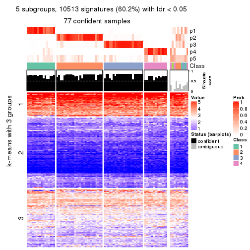</p>

</div>
<div id='tab-CV-kmeans-get-signatures-no-scale-5'>
<pre><code class="r">get_signatures(res, k = 6, scale_rows = FALSE)
</code></pre>

<p></p>

</div>
</div>


Compare the overlap of signatures from different k:

```r
compare_signatures(res)
```


`get_signature()` returns a data frame invisibly. TO get the list of signatures, the function
call should be assigned to a variable explicitly. In following code, if `plot` argument is set
to `FALSE`, no heatmap is plotted while only the differential analysis is performed.

```r
# code only for demonstration
tb = get_signature(res, k = ..., plot = FALSE)
```

An example of the output of `tb` is:

```
#>   which_row         fdr    mean_1    mean_2 scaled_mean_1 scaled_mean_2 km
#> 1        38 0.042760348  8.373488  9.131774    -0.5533452     0.5164555  1
#> 2        40 0.018707592  7.106213  8.469186    -0.6173731     0.5762149  1
#> 3        55 0.019134737 10.221463 11.207825    -0.6159697     0.5749050  1
#> 4        59 0.006059896  5.921854  7.869574    -0.6899429     0.6439467  1
#> 5        60 0.018055526  8.928898 10.211722    -0.6204761     0.5791110  1
#> 6        98 0.009384629 15.714769 14.887706     0.6635654    -0.6193277  2
...
```

The columns in `tb` are:

1. `which_row`: row indices corresponding to the input matrix.
2. `fdr`: FDR for the differential test. 
3. `mean_x`: The mean value in group x.
4. `scaled_mean_x`: The mean value in group x after rows are scaled.
5. `km`: Row groups if k-means clustering is applied to rows.


UMAP plot which shows how samples are separated.


<script>
$( function() {
	$( '#tabs-CV-kmeans-dimension-reduction' ).tabs();
} );
</script>
<div id='tabs-CV-kmeans-dimension-reduction'>
<ul>
<li><a href='#tab-CV-kmeans-dimension-reduction-1'>k = 2</a></li>
<li><a href='#tab-CV-kmeans-dimension-reduction-2'>k = 3</a></li>
<li><a href='#tab-CV-kmeans-dimension-reduction-3'>k = 4</a></li>
<li><a href='#tab-CV-kmeans-dimension-reduction-4'>k = 5</a></li>
<li><a href='#tab-CV-kmeans-dimension-reduction-5'>k = 6</a></li>
</ul>
<div id='tab-CV-kmeans-dimension-reduction-1'>
<pre><code class="r">dimension_reduction(res, k = 2, method = &quot;UMAP&quot;)
</code></pre>

<p></p>

</div>
<div id='tab-CV-kmeans-dimension-reduction-2'>
<pre><code class="r">dimension_reduction(res, k = 3, method = &quot;UMAP&quot;)
</code></pre>

<p></p>

</div>
<div id='tab-CV-kmeans-dimension-reduction-3'>
<pre><code class="r">dimension_reduction(res, k = 4, method = &quot;UMAP&quot;)
</code></pre>

<p></p>

</div>
<div id='tab-CV-kmeans-dimension-reduction-4'>
<pre><code class="r">dimension_reduction(res, k = 5, method = &quot;UMAP&quot;)
</code></pre>

<p></p>

</div>
<div id='tab-CV-kmeans-dimension-reduction-5'>
<pre><code class="r">dimension_reduction(res, k = 6, method = &quot;UMAP&quot;)
</code></pre>

<p></p>

</div>
</div>


Following heatmap shows how subgroups are split when increasing `k`:

```r
collect_classes(res)
```


If matrix rows can be associated to genes, consider to use `functional_enrichment(res,
...)` to perform function enrichment for the signature genes. See [this vignette](http://bioconductor.org/packages/devel/bioc/vignettes/cola/inst/doc/functional_enrichment.html) for more detailed explanations.


 

---------------------------------------------------


### CV:skmeans*


The object with results only for a single top-value method and a single partition method 
can be extracted as:

```r
res = res_list["CV", "skmeans"]
# you can also extract it by
# res = res_list["CV:skmeans"]
```

A summary of `res` and all the functions that can be applied to it:

```r
res
```

```
#> A 'ConsensusPartition' object with k = 2, 3, 4, 5, 6.
#>   On a matrix with 17471 rows and 87 columns.
#>   Top rows (1000, 2000, 3000, 4000, 5000) are extracted by 'CV' method.
#>   Subgroups are detected by 'skmeans' method.
#>   Performed in total 1250 partitions by row resampling.
#>   Best k for subgroups seems to be 2.
#> 
#> Following methods can be applied to this 'ConsensusPartition' object:
#>  [1] "cola_report"             "collect_classes"         "collect_plots"          
#>  [4] "collect_stats"           "colnames"                "compare_signatures"     
#>  [7] "consensus_heatmap"       "dimension_reduction"     "functional_enrichment"  
#> [10] "get_anno_col"            "get_anno"                "get_classes"            
#> [13] "get_consensus"           "get_matrix"              "get_membership"         
#> [16] "get_param"               "get_signatures"          "get_stats"              
#> [19] "is_best_k"               "is_stable_k"             "membership_heatmap"     
#> [22] "ncol"                    "nrow"                    "plot_ecdf"              
#> [25] "rownames"                "select_partition_number" "show"                   
#> [28] "suggest_best_k"          "test_to_known_factors"
```

`collect_plots()` function collects all the plots made from `res` for all `k` (number of partitions)
into one single page to provide an easy and fast comparison between different `k`.

```r
collect_plots(res)
```


The plots are:

- The first row: a plot of the ECDF (empirical cumulative distribution
  function) curves of the consensus matrix for each `k` and the heatmap of
  predicted classes for each `k`.
- The second row: heatmaps of the consensus matrix for each `k`.
- The third row: heatmaps of the membership matrix for each `k`.
- The fouth row: heatmaps of the signatures for each `k`.

All the plots in panels can be made by individual functions and they are
plotted later in this section.

`select_partition_number()` produces several plots showing different
statistics for choosing "optimized" `k`. There are following statistics:

- ECDF curves of the consensus matrix for each `k`;
- 1-PAC. [The PAC
  score](https://en.wikipedia.org/wiki/Consensus_clustering#Over-interpretation_potential_of_consensus_clustering)
  measures the proportion of the ambiguous subgrouping.
- Mean silhouette score.
- Concordance. The mean probability of fiting the consensus class ids in all
  partitions.
- Area increased. Denote $A_k$ as the area under the ECDF curve for current
  `k`, the area increased is defined as $A_k - A_{k-1}$.
- Rand index. The percent of pairs of samples that are both in a same cluster
  or both are not in a same cluster in the partition of k and k-1.
- Jaccard index. The ratio of pairs of samples are both in a same cluster in
  the partition of k and k-1 and the pairs of samples are both in a same
  cluster in the partition k or k-1.

The detailed explanations of these statistics can be found in [the _cola_
vignette](http://bioconductor.org/packages/devel/bioc/vignettes/cola/inst/doc/cola.html#toc_13).

Generally speaking, lower PAC score, higher mean silhouette score or higher
concordance corresponds to better partition. Rand index and Jaccard index
measure how similar the current partition is compared to partition with `k-1`.
If they are too similar, we won't accept `k` is better than `k-1`.

```r
select_partition_number(res)
```


The numeric values for all these statistics can be obtained by `get_stats()`.

```r
get_stats(res)
```

```
#>   k 1-PAC mean_silhouette concordance area_increased  Rand Jaccard
#> 2 2 0.906           0.946       0.975         0.4958 0.509   0.509
#> 3 3 0.732           0.848       0.913         0.3523 0.775   0.577
#> 4 4 0.893           0.876       0.949         0.1219 0.878   0.652
#> 5 5 0.817           0.781       0.883         0.0651 0.936   0.753
#> 6 6 0.748           0.643       0.798         0.0365 0.968   0.849
```

`suggest_best_k()` suggests the best $k$ based on these statistics. The rules are as follows:

- All $k$ with Jaccard index larger than 0.95 are removed because increasing
  $k$ does not provide enough extra information. If all $k$ are removed, it is
  marked as no subgroup is detected.
- For all $k$ with 1-PAC score larger than 0.9, the maximal $k$ is taken as
  the best $k$, and other $k$ are marked as optional $k$.
- If it does not fit the second rule. The $k$ with the maximal vote of the
  highest 1-PAC score, highest mean silhouette, and highest concordance is
  taken as the best $k$.

```r
suggest_best_k(res)
```

```
#> [1] 2
```


Following shows the table of the partitions (You need to click the **show/hide
code output** link to see it). The membership matrix (columns with name `p*`)
is inferred by
[`clue::cl_consensus()`](https://www.rdocumentation.org/link/cl_consensus?package=clue)
function with the `SE` method. Basically the value in the membership matrix
represents the probability to belong to a certain group. The finall class
label for an item is determined with the group with highest probability it
belongs to.

In `get_classes()` function, the entropy is calculated from the membership
matrix and the silhouette score is calculated from the consensus matrix.


<script>
$( function() {
	$( '#tabs-CV-skmeans-get-classes' ).tabs();
} );
</script>
<div id='tabs-CV-skmeans-get-classes'>
<ul>
<li><a href='#tab-CV-skmeans-get-classes-1'>k = 2</a></li>
<li><a href='#tab-CV-skmeans-get-classes-2'>k = 3</a></li>
<li><a href='#tab-CV-skmeans-get-classes-3'>k = 4</a></li>
<li><a href='#tab-CV-skmeans-get-classes-4'>k = 5</a></li>
<li><a href='#tab-CV-skmeans-get-classes-5'>k = 6</a></li>
</ul>

<div id='tab-CV-skmeans-get-classes-1'>
<p><a id='tab-CV-skmeans-get-classes-1-a' style='color:#0366d6' href='#'>show/hide code output</a></p>
<pre><code class="r">cbind(get_classes(res, k = 2), get_membership(res, k = 2))
</code></pre>

<pre><code>#&gt;                                      class entropy silhouette    p1    p2
#&gt; E6088A41-B0DC-4FBF-8D14-BE78024CF8CD     2  0.0000      0.963 0.000 1.000
#&gt; F569915C-8F77-4D67-9730-30824DB57EE5     2  0.0376      0.961 0.004 0.996
#&gt; E3B71CB7-673B-4741-8607-4F0A11633036     1  0.0376      0.987 0.996 0.004
#&gt; DAF84798-FE3F-403C-B589-7F256AF752BE     2  0.8661      0.620 0.288 0.712
#&gt; 2F38E3B1-4975-4877-9DCC-C00270602180     1  0.0000      0.989 1.000 0.000
#&gt; C79A4C2F-02C4-4C03-A5A5-DE06802EEB57     2  0.0000      0.963 0.000 1.000
#&gt; 92E3ED8F-5C74-4ED2-9B03-9FA5E7B491D6     1  0.0376      0.987 0.996 0.004
#&gt; E61D60BE-3BD3-4B5E-BC12-80F3684A0959     1  0.0000      0.989 1.000 0.000
#&gt; C9388FC7-DB1D-4416-BC2D-EA643584F1E6     2  0.0000      0.963 0.000 1.000
#&gt; D4219360-6344-4AF3-ACEB-1701A9F1F67D     1  0.0376      0.987 0.996 0.004
#&gt; 07D155E6-F27C-4D09-B786-8A9B71147B72     1  0.0000      0.989 1.000 0.000
#&gt; 10C8C361-85A5-40E8-A395-B92623E6F27C     1  0.0000      0.989 1.000 0.000
#&gt; BDF20891-7C98-4A55-BBF3-8A836BE303C6     2  0.0000      0.963 0.000 1.000
#&gt; 694B0504-095E-431A-84F2-B4387072138E     1  0.4815      0.879 0.896 0.104
#&gt; EDCF8E7F-8B1D-46F7-8AE0-84A1DC9647D2     2  0.0000      0.963 0.000 1.000
#&gt; 0EA8288E-824D-4304-A053-5A833361F5C5     1  0.0000      0.989 1.000 0.000
#&gt; C4ACCFA1-34A9-4F61-8A1F-35B3B60EA193     1  0.0376      0.987 0.996 0.004
#&gt; 760BA639-38AC-4BC9-9647-09F6893EA8ED     1  0.0376      0.987 0.996 0.004
#&gt; 082DFC6B-C6E6-48B9-BDE5-74FF3B3DC954     2  0.0376      0.961 0.004 0.996
#&gt; FE349848-D7C4-4C49-B670-0E20454DDD7E     2  0.7056      0.775 0.192 0.808
#&gt; 2E8937B3-9EA1-4528-8CEE-BF3D4137908A     2  0.0000      0.963 0.000 1.000
#&gt; 9942D04E-2767-4E39-BA16-7762EAC3DFC4     2  0.0000      0.963 0.000 1.000
#&gt; F9C23182-91C4-4145-AE52-526FE8EB199D     2  0.0000      0.963 0.000 1.000
#&gt; 01024EED-7811-4E24-A067-8E0B978FFE2D     2  0.0000      0.963 0.000 1.000
#&gt; 932C8E98-A352-409C-8744-3D49FABCE425     1  0.0376      0.987 0.996 0.004
#&gt; 6DFD9439-C659-4936-84E5-108F717E3E4D     2  0.0000      0.963 0.000 1.000
#&gt; 1D8B83B8-5DD7-4F45-9D59-487EC6906A8B     2  0.0000      0.963 0.000 1.000
#&gt; 804B8503-73F6-42DE-835F-39DE2C9F13E1     2  0.0000      0.963 0.000 1.000
#&gt; B9453C9B-84D5-43BD-85BB-1780F02F039C     1  0.0000      0.989 1.000 0.000
#&gt; 836E6CD6-4E88-4028-9844-FA3C892C254A     1  0.1843      0.963 0.972 0.028
#&gt; 36EDD202-A845-4CE7-95D5-A515C471262E     2  0.0000      0.963 0.000 1.000
#&gt; 181C156A-B8F4-4F9D-93AA-6AFBD197644D     2  0.2948      0.923 0.052 0.948
#&gt; 0580E798-6A98-4E46-AC96-9A869DFF502E     1  0.0000      0.989 1.000 0.000
#&gt; EA1B63CF-D389-4567-8D9E-B0EF1F804598     2  0.7139      0.758 0.196 0.804
#&gt; 5ABC3D06-B8E9-4831-B89B-7C1EC4006B47     2  0.0000      0.963 0.000 1.000
#&gt; 1CC01E74-A7C1-4A51-9E28-1703C352BE16     2  0.0000      0.963 0.000 1.000
#&gt; 97E55B75-DBDB-46BC-9E74-7828C070BF16     2  0.0000      0.963 0.000 1.000
#&gt; BEB37A2D-E8B0-4674-89AC-DC0F34E0AFD6     1  0.0000      0.989 1.000 0.000
#&gt; 558648BA-6551-4D34-97C2-AD5F677D63FB     1  0.0000      0.989 1.000 0.000
#&gt; FF7021BB-414B-4466-BC43-372D856E6A1D     2  0.0000      0.963 0.000 1.000
#&gt; 9C04B840-54E0-425D-BDBE-8CB6B9C2C722     2  0.0000      0.963 0.000 1.000
#&gt; 5F50B1F4-1A02-4506-AA6D-9BF21CD8059A     1  0.0000      0.989 1.000 0.000
#&gt; 7D4B8FF3-7977-4ABD-AE04-EED1C50B23CC     2  0.0000      0.963 0.000 1.000
#&gt; A005AF15-B98E-4623-8AD4-1E69EFA9BC7A     1  0.0000      0.989 1.000 0.000
#&gt; 1DF04345-5C93-4B18-B307-8D1FCA532999     2  0.0000      0.963 0.000 1.000
#&gt; 6AF30C18-347E-41ED-A4AB-6F81F42206C5     1  0.0000      0.989 1.000 0.000
#&gt; 88A44ED0-BDE1-401E-B0E1-D8C8D6DBAEFC     2  0.0376      0.961 0.004 0.996
#&gt; 117673A3-2918-4702-8583-B66ADE6E4338     2  0.0000      0.963 0.000 1.000
#&gt; 4903A571-E14D-43C9-A737-22CAFAC414CD     2  0.6048      0.832 0.148 0.852
#&gt; C175E68E-632A-4B4A-9DDB-4895C4760F20     1  0.0376      0.987 0.996 0.004
#&gt; FA5CA2F4-A1AD-4A79-B8F3-73A976EB2FB1     2  0.0000      0.963 0.000 1.000
#&gt; E1F883A7-8B1F-4C1D-8A1A-9749A9C09845     2  0.0000      0.963 0.000 1.000
#&gt; E74F0729-6000-4908-ADB0-7BDBAC0639E6     1  0.0000      0.989 1.000 0.000
#&gt; F92135A9-1981-4C79-99A5-4243EEC5D30D     2  0.0000      0.963 0.000 1.000
#&gt; 73C6919F-DEB4-4DA4-B4AE-4032AC8F96C5     1  0.0000      0.989 1.000 0.000
#&gt; 33977B40-2E92-48B6-8D3A-3EBE913F6F8A     1  0.0376      0.986 0.996 0.004
#&gt; 490BD607-2F08-4B4C-9612-F9BB5CBBC8BB     2  0.0376      0.961 0.004 0.996
#&gt; 6C666E17-2EB8-4244-BCC1-8DD34EE4173E     2  0.9661      0.398 0.392 0.608
#&gt; C41F3064-4483-4796-B860-82155BAA5157     1  0.0000      0.989 1.000 0.000
#&gt; F4232B90-51B9-43EE-9971-35B3A318758F     1  0.0000      0.989 1.000 0.000
#&gt; 291EA1F6-FC56-4429-A433-0C452A6A514C     2  0.0000      0.963 0.000 1.000
#&gt; CC4AF04D-CB8E-40DD-B12E-7AA39B38262A     2  0.0000      0.963 0.000 1.000
#&gt; 4DAE26B9-AB57-4763-BB9A-2ADDD5D9C007     1  0.0000      0.989 1.000 0.000
#&gt; 676B4AEE-FB41-4C16-AA91-03E4A1DA8E26     1  0.7219      0.736 0.800 0.200
#&gt; 1CC36859-357A-49E0-A367-4F57D47288BA     2  0.1843      0.943 0.028 0.972
#&gt; 7CCDDFC8-6DF6-4734-96AC-19EBC464FC50     2  0.0000      0.963 0.000 1.000
#&gt; 10F38C34-3956-48ED-AB62-3439EF00D46B     2  0.5408      0.856 0.124 0.876
#&gt; 80B2B393-9D6E-45B4-B696-2A5C203543B7     2  0.0938      0.957 0.012 0.988
#&gt; 5AC7B5EA-1AAC-4529-8E5A-F612E5E0719A     1  0.0000      0.989 1.000 0.000
#&gt; 3648E98D-4B3A-41B7-BE05-595D44F0150D     1  0.0376      0.987 0.996 0.004
#&gt; 252EC850-6026-473B-8FFC-2CF567EF42E4     1  0.0000      0.989 1.000 0.000
#&gt; 1790E7A3-99D8-447E-BC50-51C8A4A18853     2  0.0000      0.963 0.000 1.000
#&gt; DA61A4F8-350B-4DD1-A240-AD016520DB5B     2  0.1414      0.951 0.020 0.980
#&gt; 767E5BAF-2515-40D7-AE7D-0B24D77A03F4     2  0.0376      0.961 0.004 0.996
#&gt; 8CB9C903-D749-44EA-9137-7FB5A92C5932     1  0.0000      0.989 1.000 0.000
#&gt; A9B968AE-2243-41BC-852A-3A12C1FB4892     1  0.0000      0.989 1.000 0.000
#&gt; 3C582264-85BC-4569-A888-8EB3008E5198     2  0.0000      0.963 0.000 1.000
#&gt; F4EAF9A2-9938-4D9B-9080-C0A7542D5704     2  0.0000      0.963 0.000 1.000
#&gt; 328499D3-45DD-4B66-BD22-3C52BA92C2BB     1  0.0000      0.989 1.000 0.000
#&gt; AF8AB83D-2917-4752-8C38-CF84C565B565     1  0.0000      0.989 1.000 0.000
#&gt; 03A327CA-A9FE-42A4-844D-CA85206969FC     2  0.0376      0.961 0.004 0.996
#&gt; 4B0BEC44-87BB-4014-9A26-3529DD63760B     2  0.9129      0.547 0.328 0.672
#&gt; 05C7843E-DC89-4D8E-A78A-952C5DFD667B     2  0.0376      0.961 0.004 0.996
#&gt; 29A0FFF9-13D3-4D16-BE6A-8E48A2C4E315     2  0.0000      0.963 0.000 1.000
#&gt; 22947CC3-4F42-4F44-899C-2B7085E36C9D     2  0.0000      0.963 0.000 1.000
#&gt; A247D92D-253A-4BEC-B450-184AF90D17D0     2  0.0376      0.961 0.004 0.996
#&gt; 0D907A63-D23F-4684-80D9-0BA552435B86     1  0.0000      0.989 1.000 0.000
</code></pre>

<script>
$('#tab-CV-skmeans-get-classes-1-a').parent().next().next().hide();
$('#tab-CV-skmeans-get-classes-1-a').click(function(){
  $('#tab-CV-skmeans-get-classes-1-a').parent().next().next().toggle();
  return(false);
});
</script>
</div>

<div id='tab-CV-skmeans-get-classes-2'>
<p><a id='tab-CV-skmeans-get-classes-2-a' style='color:#0366d6' href='#'>show/hide code output</a></p>
<pre><code class="r">cbind(get_classes(res, k = 3), get_membership(res, k = 3))
</code></pre>

<pre><code>#&gt;                                      class entropy silhouette    p1    p2    p3
#&gt; E6088A41-B0DC-4FBF-8D14-BE78024CF8CD     3  0.5637      0.777 0.172 0.040 0.788
#&gt; F569915C-8F77-4D67-9730-30824DB57EE5     3  0.1129      0.856 0.020 0.004 0.976
#&gt; E3B71CB7-673B-4741-8607-4F0A11633036     1  0.0000      0.871 1.000 0.000 0.000
#&gt; DAF84798-FE3F-403C-B589-7F256AF752BE     2  0.6322      0.648 0.276 0.700 0.024
#&gt; 2F38E3B1-4975-4877-9DCC-C00270602180     1  0.0000      0.871 1.000 0.000 0.000
#&gt; C79A4C2F-02C4-4C03-A5A5-DE06802EEB57     3  0.6719      0.758 0.160 0.096 0.744
#&gt; 92E3ED8F-5C74-4ED2-9B03-9FA5E7B491D6     1  0.0000      0.871 1.000 0.000 0.000
#&gt; E61D60BE-3BD3-4B5E-BC12-80F3684A0959     1  0.4750      0.815 0.784 0.000 0.216
#&gt; C9388FC7-DB1D-4416-BC2D-EA643584F1E6     2  0.0424      0.959 0.000 0.992 0.008
#&gt; D4219360-6344-4AF3-ACEB-1701A9F1F67D     1  0.0000      0.871 1.000 0.000 0.000
#&gt; 07D155E6-F27C-4D09-B786-8A9B71147B72     1  0.4605      0.822 0.796 0.000 0.204
#&gt; 10C8C361-85A5-40E8-A395-B92623E6F27C     1  0.0000      0.871 1.000 0.000 0.000
#&gt; BDF20891-7C98-4A55-BBF3-8A836BE303C6     2  0.0000      0.964 0.000 1.000 0.000
#&gt; 694B0504-095E-431A-84F2-B4387072138E     1  0.0000      0.871 1.000 0.000 0.000
#&gt; EDCF8E7F-8B1D-46F7-8AE0-84A1DC9647D2     2  0.0747      0.953 0.000 0.984 0.016
#&gt; 0EA8288E-824D-4304-A053-5A833361F5C5     3  0.5216      0.492 0.260 0.000 0.740
#&gt; C4ACCFA1-34A9-4F61-8A1F-35B3B60EA193     1  0.0000      0.871 1.000 0.000 0.000
#&gt; 760BA639-38AC-4BC9-9647-09F6893EA8ED     1  0.0000      0.871 1.000 0.000 0.000
#&gt; 082DFC6B-C6E6-48B9-BDE5-74FF3B3DC954     3  0.2200      0.848 0.004 0.056 0.940
#&gt; FE349848-D7C4-4C49-B670-0E20454DDD7E     3  0.0747      0.855 0.016 0.000 0.984
#&gt; 2E8937B3-9EA1-4528-8CEE-BF3D4137908A     2  0.0000      0.964 0.000 1.000 0.000
#&gt; 9942D04E-2767-4E39-BA16-7762EAC3DFC4     2  0.0000      0.964 0.000 1.000 0.000
#&gt; F9C23182-91C4-4145-AE52-526FE8EB199D     2  0.0000      0.964 0.000 1.000 0.000
#&gt; 01024EED-7811-4E24-A067-8E0B978FFE2D     2  0.0237      0.961 0.000 0.996 0.004
#&gt; 932C8E98-A352-409C-8744-3D49FABCE425     1  0.0000      0.871 1.000 0.000 0.000
#&gt; 6DFD9439-C659-4936-84E5-108F717E3E4D     2  0.5778      0.734 0.200 0.768 0.032
#&gt; 1D8B83B8-5DD7-4F45-9D59-487EC6906A8B     3  0.5254      0.668 0.000 0.264 0.736
#&gt; 804B8503-73F6-42DE-835F-39DE2C9F13E1     2  0.0000      0.964 0.000 1.000 0.000
#&gt; B9453C9B-84D5-43BD-85BB-1780F02F039C     1  0.4346      0.832 0.816 0.000 0.184
#&gt; 836E6CD6-4E88-4028-9844-FA3C892C254A     3  0.4702      0.757 0.212 0.000 0.788
#&gt; 36EDD202-A845-4CE7-95D5-A515C471262E     2  0.0000      0.964 0.000 1.000 0.000
#&gt; 181C156A-B8F4-4F9D-93AA-6AFBD197644D     2  0.0000      0.964 0.000 1.000 0.000
#&gt; 0580E798-6A98-4E46-AC96-9A869DFF502E     1  0.4121      0.837 0.832 0.000 0.168
#&gt; EA1B63CF-D389-4567-8D9E-B0EF1F804598     2  0.5774      0.710 0.232 0.748 0.020
#&gt; 5ABC3D06-B8E9-4831-B89B-7C1EC4006B47     2  0.0000      0.964 0.000 1.000 0.000
#&gt; 1CC01E74-A7C1-4A51-9E28-1703C352BE16     2  0.0000      0.964 0.000 1.000 0.000
#&gt; 97E55B75-DBDB-46BC-9E74-7828C070BF16     2  0.0000      0.964 0.000 1.000 0.000
#&gt; BEB37A2D-E8B0-4674-89AC-DC0F34E0AFD6     1  0.1163      0.868 0.972 0.000 0.028
#&gt; 558648BA-6551-4D34-97C2-AD5F677D63FB     1  0.5988      0.626 0.632 0.000 0.368
#&gt; FF7021BB-414B-4466-BC43-372D856E6A1D     3  0.5058      0.695 0.000 0.244 0.756
#&gt; 9C04B840-54E0-425D-BDBE-8CB6B9C2C722     2  0.0000      0.964 0.000 1.000 0.000
#&gt; 5F50B1F4-1A02-4506-AA6D-9BF21CD8059A     3  0.5497      0.412 0.292 0.000 0.708
#&gt; 7D4B8FF3-7977-4ABD-AE04-EED1C50B23CC     2  0.1031      0.946 0.000 0.976 0.024
#&gt; A005AF15-B98E-4623-8AD4-1E69EFA9BC7A     1  0.4887      0.808 0.772 0.000 0.228
#&gt; 1DF04345-5C93-4B18-B307-8D1FCA532999     2  0.0000      0.964 0.000 1.000 0.000
#&gt; 6AF30C18-347E-41ED-A4AB-6F81F42206C5     1  0.0424      0.871 0.992 0.000 0.008
#&gt; 88A44ED0-BDE1-401E-B0E1-D8C8D6DBAEFC     3  0.1950      0.853 0.008 0.040 0.952
#&gt; 117673A3-2918-4702-8583-B66ADE6E4338     2  0.0747      0.953 0.000 0.984 0.016
#&gt; 4903A571-E14D-43C9-A737-22CAFAC414CD     3  0.0000      0.853 0.000 0.000 1.000
#&gt; C175E68E-632A-4B4A-9DDB-4895C4760F20     1  0.0000      0.871 1.000 0.000 0.000
#&gt; FA5CA2F4-A1AD-4A79-B8F3-73A976EB2FB1     3  0.5706      0.586 0.000 0.320 0.680
#&gt; E1F883A7-8B1F-4C1D-8A1A-9749A9C09845     2  0.0000      0.964 0.000 1.000 0.000
#&gt; E74F0729-6000-4908-ADB0-7BDBAC0639E6     1  0.0000      0.871 1.000 0.000 0.000
#&gt; F92135A9-1981-4C79-99A5-4243EEC5D30D     2  0.0000      0.964 0.000 1.000 0.000
#&gt; 73C6919F-DEB4-4DA4-B4AE-4032AC8F96C5     1  0.0000      0.871 1.000 0.000 0.000
#&gt; 33977B40-2E92-48B6-8D3A-3EBE913F6F8A     3  0.5178      0.716 0.256 0.000 0.744
#&gt; 490BD607-2F08-4B4C-9612-F9BB5CBBC8BB     3  0.0592      0.855 0.000 0.012 0.988
#&gt; 6C666E17-2EB8-4244-BCC1-8DD34EE4173E     3  0.0000      0.853 0.000 0.000 1.000
#&gt; C41F3064-4483-4796-B860-82155BAA5157     1  0.2537      0.860 0.920 0.000 0.080
#&gt; F4232B90-51B9-43EE-9971-35B3A318758F     1  0.0000      0.871 1.000 0.000 0.000
#&gt; 291EA1F6-FC56-4429-A433-0C452A6A514C     2  0.0000      0.964 0.000 1.000 0.000
#&gt; CC4AF04D-CB8E-40DD-B12E-7AA39B38262A     2  0.0000      0.964 0.000 1.000 0.000
#&gt; 4DAE26B9-AB57-4763-BB9A-2ADDD5D9C007     1  0.4452      0.827 0.808 0.000 0.192
#&gt; 676B4AEE-FB41-4C16-AA91-03E4A1DA8E26     1  0.9111      0.525 0.532 0.176 0.292
#&gt; 1CC36859-357A-49E0-A367-4F57D47288BA     3  0.4504      0.768 0.196 0.000 0.804
#&gt; 7CCDDFC8-6DF6-4734-96AC-19EBC464FC50     2  0.0000      0.964 0.000 1.000 0.000
#&gt; 10F38C34-3956-48ED-AB62-3439EF00D46B     3  0.0000      0.853 0.000 0.000 1.000
#&gt; 80B2B393-9D6E-45B4-B696-2A5C203543B7     2  0.3412      0.833 0.000 0.876 0.124
#&gt; 5AC7B5EA-1AAC-4529-8E5A-F612E5E0719A     1  0.5216      0.780 0.740 0.000 0.260
#&gt; 3648E98D-4B3A-41B7-BE05-595D44F0150D     1  0.0000      0.871 1.000 0.000 0.000
#&gt; 252EC850-6026-473B-8FFC-2CF567EF42E4     1  0.5216      0.780 0.740 0.000 0.260
#&gt; 1790E7A3-99D8-447E-BC50-51C8A4A18853     2  0.0000      0.964 0.000 1.000 0.000
#&gt; DA61A4F8-350B-4DD1-A240-AD016520DB5B     3  0.0892      0.855 0.020 0.000 0.980
#&gt; 767E5BAF-2515-40D7-AE7D-0B24D77A03F4     3  0.0000      0.853 0.000 0.000 1.000
#&gt; 8CB9C903-D749-44EA-9137-7FB5A92C5932     1  0.4796      0.813 0.780 0.000 0.220
#&gt; A9B968AE-2243-41BC-852A-3A12C1FB4892     1  0.4931      0.805 0.768 0.000 0.232
#&gt; 3C582264-85BC-4569-A888-8EB3008E5198     2  0.0000      0.964 0.000 1.000 0.000
#&gt; F4EAF9A2-9938-4D9B-9080-C0A7542D5704     2  0.0000      0.964 0.000 1.000 0.000
#&gt; 328499D3-45DD-4B66-BD22-3C52BA92C2BB     1  0.0000      0.871 1.000 0.000 0.000
#&gt; AF8AB83D-2917-4752-8C38-CF84C565B565     1  0.5291      0.773 0.732 0.000 0.268
#&gt; 03A327CA-A9FE-42A4-844D-CA85206969FC     3  0.1753      0.851 0.000 0.048 0.952
#&gt; 4B0BEC44-87BB-4014-9A26-3529DD63760B     3  0.0000      0.853 0.000 0.000 1.000
#&gt; 05C7843E-DC89-4D8E-A78A-952C5DFD667B     3  0.0592      0.855 0.000 0.012 0.988
#&gt; 29A0FFF9-13D3-4D16-BE6A-8E48A2C4E315     2  0.0000      0.964 0.000 1.000 0.000
#&gt; 22947CC3-4F42-4F44-899C-2B7085E36C9D     3  0.6518      0.762 0.168 0.080 0.752
#&gt; A247D92D-253A-4BEC-B450-184AF90D17D0     3  0.0000      0.853 0.000 0.000 1.000
#&gt; 0D907A63-D23F-4684-80D9-0BA552435B86     1  0.4887      0.808 0.772 0.000 0.228
</code></pre>

<script>
$('#tab-CV-skmeans-get-classes-2-a').parent().next().next().hide();
$('#tab-CV-skmeans-get-classes-2-a').click(function(){
  $('#tab-CV-skmeans-get-classes-2-a').parent().next().next().toggle();
  return(false);
});
</script>
</div>

<div id='tab-CV-skmeans-get-classes-3'>
<p><a id='tab-CV-skmeans-get-classes-3-a' style='color:#0366d6' href='#'>show/hide code output</a></p>
<pre><code class="r">cbind(get_classes(res, k = 4), get_membership(res, k = 4))
</code></pre>

<pre><code>#&gt;                                      class entropy silhouette    p1    p2    p3    p4
#&gt; E6088A41-B0DC-4FBF-8D14-BE78024CF8CD     3  0.0000      0.944 0.000 0.000 1.000 0.000
#&gt; F569915C-8F77-4D67-9730-30824DB57EE5     3  0.0000      0.944 0.000 0.000 1.000 0.000
#&gt; E3B71CB7-673B-4741-8607-4F0A11633036     1  0.0000      0.914 1.000 0.000 0.000 0.000
#&gt; DAF84798-FE3F-403C-B589-7F256AF752BE     1  0.0000      0.914 1.000 0.000 0.000 0.000
#&gt; 2F38E3B1-4975-4877-9DCC-C00270602180     1  0.0707      0.904 0.980 0.000 0.000 0.020
#&gt; C79A4C2F-02C4-4C03-A5A5-DE06802EEB57     3  0.0469      0.938 0.012 0.000 0.988 0.000
#&gt; 92E3ED8F-5C74-4ED2-9B03-9FA5E7B491D6     1  0.0000      0.914 1.000 0.000 0.000 0.000
#&gt; E61D60BE-3BD3-4B5E-BC12-80F3684A0959     4  0.0000      0.942 0.000 0.000 0.000 1.000
#&gt; C9388FC7-DB1D-4416-BC2D-EA643584F1E6     2  0.0000      0.960 0.000 1.000 0.000 0.000
#&gt; D4219360-6344-4AF3-ACEB-1701A9F1F67D     1  0.0000      0.914 1.000 0.000 0.000 0.000
#&gt; 07D155E6-F27C-4D09-B786-8A9B71147B72     4  0.0000      0.942 0.000 0.000 0.000 1.000
#&gt; 10C8C361-85A5-40E8-A395-B92623E6F27C     1  0.0000      0.914 1.000 0.000 0.000 0.000
#&gt; BDF20891-7C98-4A55-BBF3-8A836BE303C6     2  0.0000      0.960 0.000 1.000 0.000 0.000
#&gt; 694B0504-095E-431A-84F2-B4387072138E     1  0.0000      0.914 1.000 0.000 0.000 0.000
#&gt; EDCF8E7F-8B1D-46F7-8AE0-84A1DC9647D2     2  0.0188      0.958 0.000 0.996 0.004 0.000
#&gt; 0EA8288E-824D-4304-A053-5A833361F5C5     4  0.0000      0.942 0.000 0.000 0.000 1.000
#&gt; C4ACCFA1-34A9-4F61-8A1F-35B3B60EA193     1  0.0000      0.914 1.000 0.000 0.000 0.000
#&gt; 760BA639-38AC-4BC9-9647-09F6893EA8ED     1  0.0000      0.914 1.000 0.000 0.000 0.000
#&gt; 082DFC6B-C6E6-48B9-BDE5-74FF3B3DC954     3  0.0000      0.944 0.000 0.000 1.000 0.000
#&gt; FE349848-D7C4-4C49-B670-0E20454DDD7E     3  0.0000      0.944 0.000 0.000 1.000 0.000
#&gt; 2E8937B3-9EA1-4528-8CEE-BF3D4137908A     2  0.0000      0.960 0.000 1.000 0.000 0.000
#&gt; 9942D04E-2767-4E39-BA16-7762EAC3DFC4     2  0.0000      0.960 0.000 1.000 0.000 0.000
#&gt; F9C23182-91C4-4145-AE52-526FE8EB199D     2  0.4454      0.551 0.308 0.692 0.000 0.000
#&gt; 01024EED-7811-4E24-A067-8E0B978FFE2D     2  0.0000      0.960 0.000 1.000 0.000 0.000
#&gt; 932C8E98-A352-409C-8744-3D49FABCE425     1  0.0000      0.914 1.000 0.000 0.000 0.000
#&gt; 6DFD9439-C659-4936-84E5-108F717E3E4D     2  0.5467      0.391 0.364 0.612 0.024 0.000
#&gt; 1D8B83B8-5DD7-4F45-9D59-487EC6906A8B     3  0.0000      0.944 0.000 0.000 1.000 0.000
#&gt; 804B8503-73F6-42DE-835F-39DE2C9F13E1     2  0.0000      0.960 0.000 1.000 0.000 0.000
#&gt; B9453C9B-84D5-43BD-85BB-1780F02F039C     1  0.5220      0.264 0.568 0.000 0.008 0.424
#&gt; 836E6CD6-4E88-4028-9844-FA3C892C254A     3  0.4643      0.492 0.344 0.000 0.656 0.000
#&gt; 36EDD202-A845-4CE7-95D5-A515C471262E     2  0.0000      0.960 0.000 1.000 0.000 0.000
#&gt; 181C156A-B8F4-4F9D-93AA-6AFBD197644D     2  0.0188      0.957 0.004 0.996 0.000 0.000
#&gt; 0580E798-6A98-4E46-AC96-9A869DFF502E     4  0.0000      0.942 0.000 0.000 0.000 1.000
#&gt; EA1B63CF-D389-4567-8D9E-B0EF1F804598     1  0.2593      0.815 0.892 0.104 0.004 0.000
#&gt; 5ABC3D06-B8E9-4831-B89B-7C1EC4006B47     2  0.0000      0.960 0.000 1.000 0.000 0.000
#&gt; 1CC01E74-A7C1-4A51-9E28-1703C352BE16     2  0.0000      0.960 0.000 1.000 0.000 0.000
#&gt; 97E55B75-DBDB-46BC-9E74-7828C070BF16     2  0.0000      0.960 0.000 1.000 0.000 0.000
#&gt; BEB37A2D-E8B0-4674-89AC-DC0F34E0AFD6     4  0.2216      0.855 0.092 0.000 0.000 0.908
#&gt; 558648BA-6551-4D34-97C2-AD5F677D63FB     4  0.3760      0.798 0.028 0.000 0.136 0.836
#&gt; FF7021BB-414B-4466-BC43-372D856E6A1D     3  0.2831      0.831 0.000 0.120 0.876 0.004
#&gt; 9C04B840-54E0-425D-BDBE-8CB6B9C2C722     2  0.0000      0.960 0.000 1.000 0.000 0.000
#&gt; 5F50B1F4-1A02-4506-AA6D-9BF21CD8059A     4  0.0000      0.942 0.000 0.000 0.000 1.000
#&gt; 7D4B8FF3-7977-4ABD-AE04-EED1C50B23CC     2  0.0336      0.954 0.000 0.992 0.008 0.000
#&gt; A005AF15-B98E-4623-8AD4-1E69EFA9BC7A     4  0.0000      0.942 0.000 0.000 0.000 1.000
#&gt; 1DF04345-5C93-4B18-B307-8D1FCA532999     2  0.0000      0.960 0.000 1.000 0.000 0.000
#&gt; 6AF30C18-347E-41ED-A4AB-6F81F42206C5     1  0.4977      0.218 0.540 0.000 0.000 0.460
#&gt; 88A44ED0-BDE1-401E-B0E1-D8C8D6DBAEFC     3  0.0000      0.944 0.000 0.000 1.000 0.000
#&gt; 117673A3-2918-4702-8583-B66ADE6E4338     2  0.0188      0.958 0.000 0.996 0.004 0.000
#&gt; 4903A571-E14D-43C9-A737-22CAFAC414CD     4  0.4925      0.235 0.000 0.000 0.428 0.572
#&gt; C175E68E-632A-4B4A-9DDB-4895C4760F20     1  0.0000      0.914 1.000 0.000 0.000 0.000
#&gt; FA5CA2F4-A1AD-4A79-B8F3-73A976EB2FB1     3  0.3400      0.765 0.000 0.180 0.820 0.000
#&gt; E1F883A7-8B1F-4C1D-8A1A-9749A9C09845     2  0.0000      0.960 0.000 1.000 0.000 0.000
#&gt; E74F0729-6000-4908-ADB0-7BDBAC0639E6     1  0.0817      0.902 0.976 0.000 0.000 0.024
#&gt; F92135A9-1981-4C79-99A5-4243EEC5D30D     2  0.0000      0.960 0.000 1.000 0.000 0.000
#&gt; 73C6919F-DEB4-4DA4-B4AE-4032AC8F96C5     1  0.2053      0.865 0.924 0.000 0.004 0.072
#&gt; 33977B40-2E92-48B6-8D3A-3EBE913F6F8A     3  0.5040      0.432 0.364 0.000 0.628 0.008
#&gt; 490BD607-2F08-4B4C-9612-F9BB5CBBC8BB     3  0.0000      0.944 0.000 0.000 1.000 0.000
#&gt; 6C666E17-2EB8-4244-BCC1-8DD34EE4173E     3  0.0469      0.938 0.000 0.000 0.988 0.012
#&gt; C41F3064-4483-4796-B860-82155BAA5157     4  0.0000      0.942 0.000 0.000 0.000 1.000
#&gt; F4232B90-51B9-43EE-9971-35B3A318758F     1  0.4643      0.501 0.656 0.000 0.000 0.344
#&gt; 291EA1F6-FC56-4429-A433-0C452A6A514C     2  0.0000      0.960 0.000 1.000 0.000 0.000
#&gt; CC4AF04D-CB8E-40DD-B12E-7AA39B38262A     2  0.0000      0.960 0.000 1.000 0.000 0.000
#&gt; 4DAE26B9-AB57-4763-BB9A-2ADDD5D9C007     4  0.0000      0.942 0.000 0.000 0.000 1.000
#&gt; 676B4AEE-FB41-4C16-AA91-03E4A1DA8E26     4  0.0000      0.942 0.000 0.000 0.000 1.000
#&gt; 1CC36859-357A-49E0-A367-4F57D47288BA     3  0.0000      0.944 0.000 0.000 1.000 0.000
#&gt; 7CCDDFC8-6DF6-4734-96AC-19EBC464FC50     2  0.0000      0.960 0.000 1.000 0.000 0.000
#&gt; 10F38C34-3956-48ED-AB62-3439EF00D46B     3  0.0188      0.942 0.000 0.000 0.996 0.004
#&gt; 80B2B393-9D6E-45B4-B696-2A5C203543B7     2  0.4500      0.530 0.000 0.684 0.000 0.316
#&gt; 5AC7B5EA-1AAC-4529-8E5A-F612E5E0719A     4  0.0000      0.942 0.000 0.000 0.000 1.000
#&gt; 3648E98D-4B3A-41B7-BE05-595D44F0150D     1  0.0000      0.914 1.000 0.000 0.000 0.000
#&gt; 252EC850-6026-473B-8FFC-2CF567EF42E4     4  0.0000      0.942 0.000 0.000 0.000 1.000
#&gt; 1790E7A3-99D8-447E-BC50-51C8A4A18853     2  0.0000      0.960 0.000 1.000 0.000 0.000
#&gt; DA61A4F8-350B-4DD1-A240-AD016520DB5B     3  0.0000      0.944 0.000 0.000 1.000 0.000
#&gt; 767E5BAF-2515-40D7-AE7D-0B24D77A03F4     3  0.0469      0.938 0.000 0.000 0.988 0.012
#&gt; 8CB9C903-D749-44EA-9137-7FB5A92C5932     4  0.3444      0.738 0.184 0.000 0.000 0.816
#&gt; A9B968AE-2243-41BC-852A-3A12C1FB4892     4  0.0000      0.942 0.000 0.000 0.000 1.000
#&gt; 3C582264-85BC-4569-A888-8EB3008E5198     2  0.0000      0.960 0.000 1.000 0.000 0.000
#&gt; F4EAF9A2-9938-4D9B-9080-C0A7542D5704     2  0.0000      0.960 0.000 1.000 0.000 0.000
#&gt; 328499D3-45DD-4B66-BD22-3C52BA92C2BB     1  0.0000      0.914 1.000 0.000 0.000 0.000
#&gt; AF8AB83D-2917-4752-8C38-CF84C565B565     4  0.0000      0.942 0.000 0.000 0.000 1.000
#&gt; 03A327CA-A9FE-42A4-844D-CA85206969FC     3  0.0000      0.944 0.000 0.000 1.000 0.000
#&gt; 4B0BEC44-87BB-4014-9A26-3529DD63760B     3  0.0707      0.933 0.000 0.000 0.980 0.020
#&gt; 05C7843E-DC89-4D8E-A78A-952C5DFD667B     3  0.0000      0.944 0.000 0.000 1.000 0.000
#&gt; 29A0FFF9-13D3-4D16-BE6A-8E48A2C4E315     2  0.0000      0.960 0.000 1.000 0.000 0.000
#&gt; 22947CC3-4F42-4F44-899C-2B7085E36C9D     3  0.0000      0.944 0.000 0.000 1.000 0.000
#&gt; A247D92D-253A-4BEC-B450-184AF90D17D0     3  0.0000      0.944 0.000 0.000 1.000 0.000
#&gt; 0D907A63-D23F-4684-80D9-0BA552435B86     4  0.0000      0.942 0.000 0.000 0.000 1.000
</code></pre>

<script>
$('#tab-CV-skmeans-get-classes-3-a').parent().next().next().hide();
$('#tab-CV-skmeans-get-classes-3-a').click(function(){
  $('#tab-CV-skmeans-get-classes-3-a').parent().next().next().toggle();
  return(false);
});
</script>
</div>

<div id='tab-CV-skmeans-get-classes-4'>
<p><a id='tab-CV-skmeans-get-classes-4-a' style='color:#0366d6' href='#'>show/hide code output</a></p>
<pre><code class="r">cbind(get_classes(res, k = 5), get_membership(res, k = 5))
</code></pre>

<pre><code>#&gt;                                      class entropy silhouette    p1    p2    p3    p4    p5
#&gt; E6088A41-B0DC-4FBF-8D14-BE78024CF8CD     3  0.1408     0.8831 0.008 0.000 0.948 0.000 0.044
#&gt; F569915C-8F77-4D67-9730-30824DB57EE5     3  0.0290     0.8961 0.000 0.000 0.992 0.000 0.008
#&gt; E3B71CB7-673B-4741-8607-4F0A11633036     1  0.1270     0.9033 0.948 0.000 0.000 0.000 0.052
#&gt; DAF84798-FE3F-403C-B589-7F256AF752BE     5  0.3662     0.5711 0.252 0.004 0.000 0.000 0.744
#&gt; 2F38E3B1-4975-4877-9DCC-C00270602180     1  0.1403     0.8900 0.952 0.000 0.000 0.024 0.024
#&gt; C79A4C2F-02C4-4C03-A5A5-DE06802EEB57     3  0.2529     0.8506 0.036 0.032 0.908 0.000 0.024
#&gt; 92E3ED8F-5C74-4ED2-9B03-9FA5E7B491D6     1  0.1270     0.9033 0.948 0.000 0.000 0.000 0.052
#&gt; E61D60BE-3BD3-4B5E-BC12-80F3684A0959     4  0.2407     0.8481 0.012 0.004 0.000 0.896 0.088
#&gt; C9388FC7-DB1D-4416-BC2D-EA643584F1E6     5  0.4422     0.5702 0.000 0.300 0.004 0.016 0.680
#&gt; D4219360-6344-4AF3-ACEB-1701A9F1F67D     1  0.1270     0.9033 0.948 0.000 0.000 0.000 0.052
#&gt; 07D155E6-F27C-4D09-B786-8A9B71147B72     4  0.0162     0.9076 0.000 0.000 0.000 0.996 0.004
#&gt; 10C8C361-85A5-40E8-A395-B92623E6F27C     1  0.0404     0.8966 0.988 0.000 0.000 0.000 0.012
#&gt; BDF20891-7C98-4A55-BBF3-8A836BE303C6     2  0.1430     0.8561 0.004 0.944 0.000 0.000 0.052
#&gt; 694B0504-095E-431A-84F2-B4387072138E     1  0.1121     0.9036 0.956 0.000 0.000 0.000 0.044
#&gt; EDCF8E7F-8B1D-46F7-8AE0-84A1DC9647D2     5  0.3231     0.7465 0.000 0.196 0.004 0.000 0.800
#&gt; 0EA8288E-824D-4304-A053-5A833361F5C5     4  0.0671     0.9065 0.000 0.000 0.004 0.980 0.016
#&gt; C4ACCFA1-34A9-4F61-8A1F-35B3B60EA193     1  0.1197     0.9031 0.952 0.000 0.000 0.000 0.048
#&gt; 760BA639-38AC-4BC9-9647-09F6893EA8ED     1  0.1270     0.9033 0.948 0.000 0.000 0.000 0.052
#&gt; 082DFC6B-C6E6-48B9-BDE5-74FF3B3DC954     3  0.0290     0.8961 0.000 0.000 0.992 0.000 0.008
#&gt; FE349848-D7C4-4C49-B670-0E20454DDD7E     3  0.0963     0.8872 0.000 0.000 0.964 0.000 0.036
#&gt; 2E8937B3-9EA1-4528-8CEE-BF3D4137908A     2  0.2230     0.8306 0.000 0.884 0.000 0.000 0.116
#&gt; 9942D04E-2767-4E39-BA16-7762EAC3DFC4     2  0.4045     0.4285 0.000 0.644 0.000 0.000 0.356
#&gt; F9C23182-91C4-4145-AE52-526FE8EB199D     2  0.5542    -0.0343 0.068 0.500 0.000 0.000 0.432
#&gt; 01024EED-7811-4E24-A067-8E0B978FFE2D     2  0.0703     0.8659 0.000 0.976 0.000 0.000 0.024
#&gt; 932C8E98-A352-409C-8744-3D49FABCE425     1  0.1792     0.8878 0.916 0.000 0.000 0.000 0.084
#&gt; 6DFD9439-C659-4936-84E5-108F717E3E4D     5  0.3161     0.7717 0.032 0.100 0.008 0.000 0.860
#&gt; 1D8B83B8-5DD7-4F45-9D59-487EC6906A8B     3  0.3757     0.6997 0.000 0.020 0.772 0.000 0.208
#&gt; 804B8503-73F6-42DE-835F-39DE2C9F13E1     2  0.0510     0.8678 0.000 0.984 0.000 0.000 0.016
#&gt; B9453C9B-84D5-43BD-85BB-1780F02F039C     1  0.5286     0.6702 0.724 0.004 0.020 0.152 0.100
#&gt; 836E6CD6-4E88-4028-9844-FA3C892C254A     5  0.6349     0.2034 0.168 0.000 0.360 0.000 0.472
#&gt; 36EDD202-A845-4CE7-95D5-A515C471262E     2  0.4297     0.0703 0.000 0.528 0.000 0.000 0.472
#&gt; 181C156A-B8F4-4F9D-93AA-6AFBD197644D     2  0.2905     0.8007 0.036 0.868 0.000 0.000 0.096
#&gt; 0580E798-6A98-4E46-AC96-9A869DFF502E     4  0.1364     0.8868 0.036 0.000 0.000 0.952 0.012
#&gt; EA1B63CF-D389-4567-8D9E-B0EF1F804598     5  0.3267     0.7366 0.112 0.044 0.000 0.000 0.844
#&gt; 5ABC3D06-B8E9-4831-B89B-7C1EC4006B47     2  0.2230     0.8174 0.000 0.884 0.000 0.000 0.116
#&gt; 1CC01E74-A7C1-4A51-9E28-1703C352BE16     2  0.0404     0.8675 0.000 0.988 0.000 0.000 0.012
#&gt; 97E55B75-DBDB-46BC-9E74-7828C070BF16     2  0.2127     0.8417 0.000 0.892 0.000 0.000 0.108
#&gt; BEB37A2D-E8B0-4674-89AC-DC0F34E0AFD6     4  0.4801     0.5240 0.048 0.000 0.000 0.668 0.284
#&gt; 558648BA-6551-4D34-97C2-AD5F677D63FB     4  0.8119     0.2929 0.204 0.008 0.260 0.428 0.100
#&gt; FF7021BB-414B-4466-BC43-372D856E6A1D     5  0.3704     0.7578 0.000 0.088 0.092 0.000 0.820
#&gt; 9C04B840-54E0-425D-BDBE-8CB6B9C2C722     2  0.2813     0.7408 0.000 0.832 0.000 0.000 0.168
#&gt; 5F50B1F4-1A02-4506-AA6D-9BF21CD8059A     4  0.0671     0.9065 0.000 0.000 0.004 0.980 0.016
#&gt; 7D4B8FF3-7977-4ABD-AE04-EED1C50B23CC     5  0.3209     0.7399 0.000 0.180 0.008 0.000 0.812
#&gt; A005AF15-B98E-4623-8AD4-1E69EFA9BC7A     4  0.0162     0.9076 0.000 0.000 0.000 0.996 0.004
#&gt; 1DF04345-5C93-4B18-B307-8D1FCA532999     2  0.1732     0.8347 0.000 0.920 0.000 0.000 0.080
#&gt; 6AF30C18-347E-41ED-A4AB-6F81F42206C5     1  0.4086     0.6085 0.704 0.000 0.000 0.284 0.012
#&gt; 88A44ED0-BDE1-401E-B0E1-D8C8D6DBAEFC     3  0.0000     0.8956 0.000 0.000 1.000 0.000 0.000
#&gt; 117673A3-2918-4702-8583-B66ADE6E4338     5  0.3300     0.7411 0.004 0.204 0.000 0.000 0.792
#&gt; 4903A571-E14D-43C9-A737-22CAFAC414CD     5  0.5572     0.4940 0.000 0.000 0.124 0.248 0.628
#&gt; C175E68E-632A-4B4A-9DDB-4895C4760F20     1  0.1908     0.8810 0.908 0.000 0.000 0.000 0.092
#&gt; FA5CA2F4-A1AD-4A79-B8F3-73A976EB2FB1     3  0.3727     0.6494 0.000 0.216 0.768 0.000 0.016
#&gt; E1F883A7-8B1F-4C1D-8A1A-9749A9C09845     2  0.2020     0.8319 0.000 0.900 0.000 0.000 0.100
#&gt; E74F0729-6000-4908-ADB0-7BDBAC0639E6     1  0.0912     0.8904 0.972 0.000 0.000 0.012 0.016
#&gt; F92135A9-1981-4C79-99A5-4243EEC5D30D     2  0.0290     0.8673 0.000 0.992 0.000 0.000 0.008
#&gt; 73C6919F-DEB4-4DA4-B4AE-4032AC8F96C5     1  0.2196     0.8632 0.916 0.000 0.004 0.056 0.024
#&gt; 33977B40-2E92-48B6-8D3A-3EBE913F6F8A     3  0.7300    -0.0998 0.264 0.000 0.380 0.024 0.332
#&gt; 490BD607-2F08-4B4C-9612-F9BB5CBBC8BB     3  0.0162     0.8959 0.000 0.000 0.996 0.000 0.004
#&gt; 6C666E17-2EB8-4244-BCC1-8DD34EE4173E     3  0.0451     0.8930 0.000 0.000 0.988 0.008 0.004
#&gt; C41F3064-4483-4796-B860-82155BAA5157     4  0.0566     0.9042 0.004 0.000 0.000 0.984 0.012
#&gt; F4232B90-51B9-43EE-9971-35B3A318758F     1  0.4040     0.6493 0.724 0.000 0.000 0.260 0.016
#&gt; 291EA1F6-FC56-4429-A433-0C452A6A514C     2  0.0510     0.8678 0.000 0.984 0.000 0.000 0.016
#&gt; CC4AF04D-CB8E-40DD-B12E-7AA39B38262A     2  0.1478     0.8530 0.000 0.936 0.000 0.000 0.064
#&gt; 4DAE26B9-AB57-4763-BB9A-2ADDD5D9C007     4  0.0566     0.9039 0.004 0.000 0.000 0.984 0.012
#&gt; 676B4AEE-FB41-4C16-AA91-03E4A1DA8E26     4  0.0290     0.9082 0.000 0.000 0.000 0.992 0.008
#&gt; 1CC36859-357A-49E0-A367-4F57D47288BA     3  0.1331     0.8852 0.008 0.000 0.952 0.000 0.040
#&gt; 7CCDDFC8-6DF6-4734-96AC-19EBC464FC50     2  0.0510     0.8678 0.000 0.984 0.000 0.000 0.016
#&gt; 10F38C34-3956-48ED-AB62-3439EF00D46B     3  0.0162     0.8951 0.000 0.000 0.996 0.004 0.000
#&gt; 80B2B393-9D6E-45B4-B696-2A5C203543B7     2  0.4403     0.7271 0.000 0.772 0.004 0.092 0.132
#&gt; 5AC7B5EA-1AAC-4529-8E5A-F612E5E0719A     4  0.0566     0.9075 0.000 0.000 0.004 0.984 0.012
#&gt; 3648E98D-4B3A-41B7-BE05-595D44F0150D     1  0.1270     0.9037 0.948 0.000 0.000 0.000 0.052
#&gt; 252EC850-6026-473B-8FFC-2CF567EF42E4     4  0.0290     0.9082 0.000 0.000 0.000 0.992 0.008
#&gt; 1790E7A3-99D8-447E-BC50-51C8A4A18853     2  0.0510     0.8678 0.000 0.984 0.000 0.000 0.016
#&gt; DA61A4F8-350B-4DD1-A240-AD016520DB5B     3  0.0000     0.8956 0.000 0.000 1.000 0.000 0.000
#&gt; 767E5BAF-2515-40D7-AE7D-0B24D77A03F4     3  0.4276     0.3717 0.000 0.000 0.616 0.004 0.380
#&gt; 8CB9C903-D749-44EA-9137-7FB5A92C5932     4  0.4558     0.6198 0.252 0.000 0.004 0.708 0.036
#&gt; A9B968AE-2243-41BC-852A-3A12C1FB4892     4  0.0290     0.9082 0.000 0.000 0.000 0.992 0.008
#&gt; 3C582264-85BC-4569-A888-8EB3008E5198     2  0.0510     0.8678 0.000 0.984 0.000 0.000 0.016
#&gt; F4EAF9A2-9938-4D9B-9080-C0A7542D5704     2  0.0963     0.8637 0.000 0.964 0.000 0.000 0.036
#&gt; 328499D3-45DD-4B66-BD22-3C52BA92C2BB     1  0.0290     0.8968 0.992 0.000 0.000 0.000 0.008
#&gt; AF8AB83D-2917-4752-8C38-CF84C565B565     4  0.0671     0.9065 0.000 0.000 0.004 0.980 0.016
#&gt; 03A327CA-A9FE-42A4-844D-CA85206969FC     3  0.0290     0.8961 0.000 0.000 0.992 0.000 0.008
#&gt; 4B0BEC44-87BB-4014-9A26-3529DD63760B     3  0.1195     0.8793 0.000 0.000 0.960 0.028 0.012
#&gt; 05C7843E-DC89-4D8E-A78A-952C5DFD667B     3  0.0404     0.8960 0.000 0.000 0.988 0.000 0.012
#&gt; 29A0FFF9-13D3-4D16-BE6A-8E48A2C4E315     2  0.0510     0.8678 0.000 0.984 0.000 0.000 0.016
#&gt; 22947CC3-4F42-4F44-899C-2B7085E36C9D     3  0.1956     0.8645 0.008 0.000 0.916 0.000 0.076
#&gt; A247D92D-253A-4BEC-B450-184AF90D17D0     3  0.0000     0.8956 0.000 0.000 1.000 0.000 0.000
#&gt; 0D907A63-D23F-4684-80D9-0BA552435B86     4  0.0000     0.9081 0.000 0.000 0.000 1.000 0.000
</code></pre>

<script>
$('#tab-CV-skmeans-get-classes-4-a').parent().next().next().hide();
$('#tab-CV-skmeans-get-classes-4-a').click(function(){
  $('#tab-CV-skmeans-get-classes-4-a').parent().next().next().toggle();
  return(false);
});
</script>
</div>

<div id='tab-CV-skmeans-get-classes-5'>
<p><a id='tab-CV-skmeans-get-classes-5-a' style='color:#0366d6' href='#'>show/hide code output</a></p>
<pre><code class="r">cbind(get_classes(res, k = 6), get_membership(res, k = 6))
</code></pre>

<pre><code>#&gt;                                      class entropy silhouette    p1    p2    p3    p4    p5    p6
#&gt; E6088A41-B0DC-4FBF-8D14-BE78024CF8CD     3  0.2635     0.8603 0.004 0.004 0.880 0.000 0.036 0.076
#&gt; F569915C-8F77-4D67-9730-30824DB57EE5     3  0.0260     0.8789 0.000 0.000 0.992 0.000 0.000 0.008
#&gt; E3B71CB7-673B-4741-8607-4F0A11633036     1  0.0146     0.7695 0.996 0.000 0.000 0.000 0.004 0.000
#&gt; DAF84798-FE3F-403C-B589-7F256AF752BE     5  0.3984     0.4338 0.320 0.008 0.000 0.000 0.664 0.008
#&gt; 2F38E3B1-4975-4877-9DCC-C00270602180     1  0.5697     0.6010 0.608 0.000 0.000 0.080 0.060 0.252
#&gt; C79A4C2F-02C4-4C03-A5A5-DE06802EEB57     3  0.4224     0.7242 0.008 0.032 0.744 0.000 0.016 0.200
#&gt; 92E3ED8F-5C74-4ED2-9B03-9FA5E7B491D6     1  0.0909     0.7631 0.968 0.000 0.000 0.000 0.012 0.020
#&gt; E61D60BE-3BD3-4B5E-BC12-80F3684A0959     4  0.4663     0.2860 0.036 0.000 0.000 0.552 0.004 0.408
#&gt; C9388FC7-DB1D-4416-BC2D-EA643584F1E6     5  0.5667     0.5224 0.000 0.188 0.016 0.012 0.628 0.156
#&gt; D4219360-6344-4AF3-ACEB-1701A9F1F67D     1  0.0291     0.7699 0.992 0.000 0.000 0.000 0.004 0.004
#&gt; 07D155E6-F27C-4D09-B786-8A9B71147B72     4  0.0632     0.8038 0.000 0.000 0.000 0.976 0.000 0.024
#&gt; 10C8C361-85A5-40E8-A395-B92623E6F27C     1  0.3440     0.7072 0.776 0.000 0.000 0.000 0.028 0.196
#&gt; BDF20891-7C98-4A55-BBF3-8A836BE303C6     2  0.3412     0.6828 0.000 0.808 0.000 0.000 0.064 0.128
#&gt; 694B0504-095E-431A-84F2-B4387072138E     1  0.1367     0.7522 0.944 0.000 0.000 0.000 0.012 0.044
#&gt; EDCF8E7F-8B1D-46F7-8AE0-84A1DC9647D2     5  0.2558     0.6368 0.000 0.156 0.000 0.000 0.840 0.004
#&gt; 0EA8288E-824D-4304-A053-5A833361F5C5     4  0.2278     0.7791 0.000 0.000 0.000 0.868 0.004 0.128
#&gt; C4ACCFA1-34A9-4F61-8A1F-35B3B60EA193     1  0.1265     0.7537 0.948 0.000 0.000 0.000 0.008 0.044
#&gt; 760BA639-38AC-4BC9-9647-09F6893EA8ED     1  0.0622     0.7660 0.980 0.000 0.000 0.000 0.012 0.008
#&gt; 082DFC6B-C6E6-48B9-BDE5-74FF3B3DC954     3  0.0458     0.8786 0.000 0.000 0.984 0.000 0.000 0.016
#&gt; FE349848-D7C4-4C49-B670-0E20454DDD7E     3  0.2448     0.8527 0.000 0.000 0.884 0.000 0.064 0.052
#&gt; 2E8937B3-9EA1-4528-8CEE-BF3D4137908A     2  0.4630     0.4531 0.000 0.580 0.000 0.000 0.048 0.372
#&gt; 9942D04E-2767-4E39-BA16-7762EAC3DFC4     2  0.5289     0.3643 0.000 0.560 0.000 0.000 0.316 0.124
#&gt; F9C23182-91C4-4145-AE52-526FE8EB199D     2  0.6043    -0.1190 0.132 0.452 0.000 0.000 0.392 0.024
#&gt; 01024EED-7811-4E24-A067-8E0B978FFE2D     2  0.2266     0.7516 0.000 0.880 0.000 0.000 0.012 0.108
#&gt; 932C8E98-A352-409C-8744-3D49FABCE425     1  0.0865     0.7608 0.964 0.000 0.000 0.000 0.036 0.000
#&gt; 6DFD9439-C659-4936-84E5-108F717E3E4D     5  0.2434     0.6466 0.036 0.064 0.000 0.000 0.892 0.008
#&gt; 1D8B83B8-5DD7-4F45-9D59-487EC6906A8B     3  0.3804     0.6868 0.000 0.020 0.748 0.000 0.220 0.012
#&gt; 804B8503-73F6-42DE-835F-39DE2C9F13E1     2  0.0146     0.7749 0.000 0.996 0.000 0.000 0.000 0.004
#&gt; B9453C9B-84D5-43BD-85BB-1780F02F039C     6  0.5340     0.0672 0.352 0.000 0.012 0.072 0.004 0.560
#&gt; 836E6CD6-4E88-4028-9844-FA3C892C254A     5  0.7007     0.2409 0.196 0.000 0.308 0.000 0.412 0.084
#&gt; 36EDD202-A845-4CE7-95D5-A515C471262E     5  0.5421    -0.0672 0.000 0.432 0.000 0.000 0.452 0.116
#&gt; 181C156A-B8F4-4F9D-93AA-6AFBD197644D     2  0.4127     0.3701 0.012 0.620 0.000 0.000 0.004 0.364
#&gt; 0580E798-6A98-4E46-AC96-9A869DFF502E     4  0.4719     0.5435 0.016 0.000 0.000 0.676 0.060 0.248
#&gt; EA1B63CF-D389-4567-8D9E-B0EF1F804598     5  0.3593     0.5927 0.164 0.044 0.000 0.000 0.788 0.004
#&gt; 5ABC3D06-B8E9-4831-B89B-7C1EC4006B47     2  0.4513     0.6233 0.000 0.704 0.000 0.000 0.172 0.124
#&gt; 1CC01E74-A7C1-4A51-9E28-1703C352BE16     2  0.0806     0.7749 0.000 0.972 0.000 0.000 0.008 0.020
#&gt; 97E55B75-DBDB-46BC-9E74-7828C070BF16     2  0.4566     0.6466 0.000 0.700 0.000 0.000 0.140 0.160
#&gt; BEB37A2D-E8B0-4674-89AC-DC0F34E0AFD6     4  0.6349     0.3459 0.040 0.000 0.000 0.516 0.236 0.208
#&gt; 558648BA-6551-4D34-97C2-AD5F677D63FB     6  0.6584     0.2809 0.092 0.000 0.160 0.192 0.004 0.552
#&gt; FF7021BB-414B-4466-BC43-372D856E6A1D     5  0.3513     0.6379 0.000 0.052 0.048 0.004 0.840 0.056
#&gt; 9C04B840-54E0-425D-BDBE-8CB6B9C2C722     2  0.2613     0.7003 0.000 0.848 0.000 0.000 0.140 0.012
#&gt; 5F50B1F4-1A02-4506-AA6D-9BF21CD8059A     4  0.2146     0.7837 0.000 0.000 0.000 0.880 0.004 0.116
#&gt; 7D4B8FF3-7977-4ABD-AE04-EED1C50B23CC     5  0.3426     0.6368 0.004 0.116 0.000 0.000 0.816 0.064
#&gt; A005AF15-B98E-4623-8AD4-1E69EFA9BC7A     4  0.1074     0.8015 0.000 0.000 0.000 0.960 0.012 0.028
#&gt; 1DF04345-5C93-4B18-B307-8D1FCA532999     2  0.3189     0.6175 0.000 0.760 0.000 0.000 0.004 0.236
#&gt; 6AF30C18-347E-41ED-A4AB-6F81F42206C5     1  0.6377     0.4705 0.532 0.000 0.000 0.212 0.052 0.204
#&gt; 88A44ED0-BDE1-401E-B0E1-D8C8D6DBAEFC     3  0.0458     0.8786 0.000 0.000 0.984 0.000 0.000 0.016
#&gt; 117673A3-2918-4702-8583-B66ADE6E4338     5  0.2624     0.6413 0.004 0.148 0.000 0.000 0.844 0.004
#&gt; 4903A571-E14D-43C9-A737-22CAFAC414CD     5  0.6950     0.3419 0.000 0.004 0.108 0.192 0.500 0.196
#&gt; C175E68E-632A-4B4A-9DDB-4895C4760F20     1  0.1349     0.7459 0.940 0.000 0.000 0.000 0.056 0.004
#&gt; FA5CA2F4-A1AD-4A79-B8F3-73A976EB2FB1     3  0.3934     0.5251 0.000 0.304 0.676 0.000 0.000 0.020
#&gt; E1F883A7-8B1F-4C1D-8A1A-9749A9C09845     2  0.4167     0.4896 0.000 0.632 0.000 0.000 0.024 0.344
#&gt; E74F0729-6000-4908-ADB0-7BDBAC0639E6     1  0.5651     0.5888 0.592 0.000 0.000 0.064 0.060 0.284
#&gt; F92135A9-1981-4C79-99A5-4243EEC5D30D     2  0.1471     0.7663 0.000 0.932 0.000 0.000 0.004 0.064
#&gt; 73C6919F-DEB4-4DA4-B4AE-4032AC8F96C5     1  0.6209     0.5494 0.548 0.000 0.004 0.092 0.068 0.288
#&gt; 33977B40-2E92-48B6-8D3A-3EBE913F6F8A     5  0.8359     0.0394 0.188 0.000 0.152 0.064 0.308 0.288
#&gt; 490BD607-2F08-4B4C-9612-F9BB5CBBC8BB     3  0.0000     0.8788 0.000 0.000 1.000 0.000 0.000 0.000
#&gt; 6C666E17-2EB8-4244-BCC1-8DD34EE4173E     3  0.2085     0.8530 0.000 0.000 0.912 0.024 0.008 0.056
#&gt; C41F3064-4483-4796-B860-82155BAA5157     4  0.2215     0.7735 0.012 0.000 0.000 0.900 0.012 0.076
#&gt; F4232B90-51B9-43EE-9971-35B3A318758F     1  0.6595     0.4617 0.488 0.000 0.000 0.180 0.060 0.272
#&gt; 291EA1F6-FC56-4429-A433-0C452A6A514C     2  0.0260     0.7741 0.000 0.992 0.000 0.000 0.000 0.008
#&gt; CC4AF04D-CB8E-40DD-B12E-7AA39B38262A     2  0.3745     0.6953 0.000 0.784 0.000 0.000 0.100 0.116
#&gt; 4DAE26B9-AB57-4763-BB9A-2ADDD5D9C007     4  0.2527     0.7586 0.004 0.000 0.000 0.880 0.032 0.084
#&gt; 676B4AEE-FB41-4C16-AA91-03E4A1DA8E26     4  0.1411     0.8020 0.000 0.004 0.000 0.936 0.000 0.060
#&gt; 1CC36859-357A-49E0-A367-4F57D47288BA     3  0.3063     0.8472 0.024 0.000 0.860 0.000 0.052 0.064
#&gt; 7CCDDFC8-6DF6-4734-96AC-19EBC464FC50     2  0.0291     0.7748 0.000 0.992 0.000 0.000 0.004 0.004
#&gt; 10F38C34-3956-48ED-AB62-3439EF00D46B     3  0.0622     0.8787 0.000 0.000 0.980 0.000 0.012 0.008
#&gt; 80B2B393-9D6E-45B4-B696-2A5C203543B7     6  0.5443    -0.2767 0.000 0.416 0.000 0.052 0.032 0.500
#&gt; 5AC7B5EA-1AAC-4529-8E5A-F612E5E0719A     4  0.2558     0.7681 0.000 0.000 0.000 0.840 0.004 0.156
#&gt; 3648E98D-4B3A-41B7-BE05-595D44F0150D     1  0.2412     0.7501 0.880 0.000 0.000 0.000 0.028 0.092
#&gt; 252EC850-6026-473B-8FFC-2CF567EF42E4     4  0.0458     0.8095 0.000 0.000 0.000 0.984 0.000 0.016
#&gt; 1790E7A3-99D8-447E-BC50-51C8A4A18853     2  0.0146     0.7749 0.000 0.996 0.000 0.000 0.000 0.004
#&gt; DA61A4F8-350B-4DD1-A240-AD016520DB5B     3  0.0405     0.8796 0.000 0.000 0.988 0.000 0.004 0.008
#&gt; 767E5BAF-2515-40D7-AE7D-0B24D77A03F4     3  0.5608     0.2914 0.000 0.000 0.536 0.020 0.348 0.096
#&gt; 8CB9C903-D749-44EA-9137-7FB5A92C5932     4  0.5663     0.4965 0.196 0.000 0.004 0.616 0.020 0.164
#&gt; A9B968AE-2243-41BC-852A-3A12C1FB4892     4  0.1007     0.8052 0.000 0.000 0.000 0.956 0.000 0.044
#&gt; 3C582264-85BC-4569-A888-8EB3008E5198     2  0.0146     0.7749 0.000 0.996 0.000 0.000 0.000 0.004
#&gt; F4EAF9A2-9938-4D9B-9080-C0A7542D5704     2  0.1572     0.7689 0.000 0.936 0.000 0.000 0.028 0.036
#&gt; 328499D3-45DD-4B66-BD22-3C52BA92C2BB     1  0.2669     0.7205 0.836 0.000 0.000 0.000 0.008 0.156
#&gt; AF8AB83D-2917-4752-8C38-CF84C565B565     4  0.2234     0.7813 0.000 0.000 0.000 0.872 0.004 0.124
#&gt; 03A327CA-A9FE-42A4-844D-CA85206969FC     3  0.1787     0.8761 0.000 0.004 0.920 0.000 0.008 0.068
#&gt; 4B0BEC44-87BB-4014-9A26-3529DD63760B     3  0.2585     0.8407 0.000 0.000 0.888 0.048 0.016 0.048
#&gt; 05C7843E-DC89-4D8E-A78A-952C5DFD667B     3  0.0790     0.8781 0.000 0.000 0.968 0.000 0.000 0.032
#&gt; 29A0FFF9-13D3-4D16-BE6A-8E48A2C4E315     2  0.0146     0.7749 0.000 0.996 0.000 0.000 0.000 0.004
#&gt; 22947CC3-4F42-4F44-899C-2B7085E36C9D     3  0.3303     0.8340 0.004 0.004 0.836 0.000 0.080 0.076
#&gt; A247D92D-253A-4BEC-B450-184AF90D17D0     3  0.0922     0.8773 0.000 0.000 0.968 0.004 0.004 0.024
#&gt; 0D907A63-D23F-4684-80D9-0BA552435B86     4  0.0146     0.8073 0.000 0.000 0.000 0.996 0.000 0.004
</code></pre>

<script>
$('#tab-CV-skmeans-get-classes-5-a').parent().next().next().hide();
$('#tab-CV-skmeans-get-classes-5-a').click(function(){
  $('#tab-CV-skmeans-get-classes-5-a').parent().next().next().toggle();
  return(false);
});
</script>
</div>
</div>

Heatmaps for the consensus matrix. It visualizes the probability of two
samples to be in a same group.


<script>
$( function() {
	$( '#tabs-CV-skmeans-consensus-heatmap' ).tabs();
} );
</script>
<div id='tabs-CV-skmeans-consensus-heatmap'>
<ul>
<li><a href='#tab-CV-skmeans-consensus-heatmap-1'>k = 2</a></li>
<li><a href='#tab-CV-skmeans-consensus-heatmap-2'>k = 3</a></li>
<li><a href='#tab-CV-skmeans-consensus-heatmap-3'>k = 4</a></li>
<li><a href='#tab-CV-skmeans-consensus-heatmap-4'>k = 5</a></li>
<li><a href='#tab-CV-skmeans-consensus-heatmap-5'>k = 6</a></li>
</ul>
<div id='tab-CV-skmeans-consensus-heatmap-1'>
<pre><code class="r">consensus_heatmap(res, k = 2)
</code></pre>

<p></p>

</div>
<div id='tab-CV-skmeans-consensus-heatmap-2'>
<pre><code class="r">consensus_heatmap(res, k = 3)
</code></pre>

<p></p>

</div>
<div id='tab-CV-skmeans-consensus-heatmap-3'>
<pre><code class="r">consensus_heatmap(res, k = 4)
</code></pre>

<p>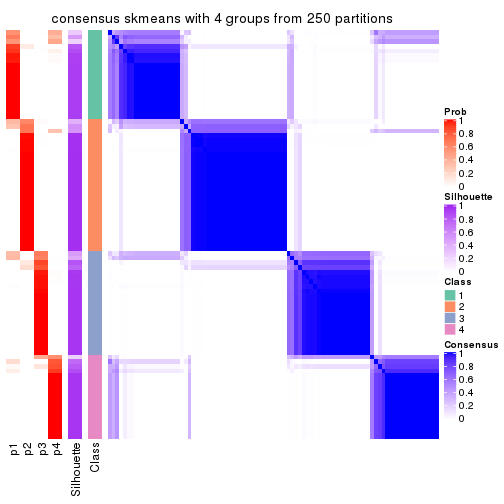</p>

</div>
<div id='tab-CV-skmeans-consensus-heatmap-4'>
<pre><code class="r">consensus_heatmap(res, k = 5)
</code></pre>

<p></p>

</div>
<div id='tab-CV-skmeans-consensus-heatmap-5'>
<pre><code class="r">consensus_heatmap(res, k = 6)
</code></pre>

<p></p>

</div>
</div>

Heatmaps for the membership of samples in all partitions to see how consistent they are:


<script>
$( function() {
	$( '#tabs-CV-skmeans-membership-heatmap' ).tabs();
} );
</script>
<div id='tabs-CV-skmeans-membership-heatmap'>
<ul>
<li><a href='#tab-CV-skmeans-membership-heatmap-1'>k = 2</a></li>
<li><a href='#tab-CV-skmeans-membership-heatmap-2'>k = 3</a></li>
<li><a href='#tab-CV-skmeans-membership-heatmap-3'>k = 4</a></li>
<li><a href='#tab-CV-skmeans-membership-heatmap-4'>k = 5</a></li>
<li><a href='#tab-CV-skmeans-membership-heatmap-5'>k = 6</a></li>
</ul>
<div id='tab-CV-skmeans-membership-heatmap-1'>
<pre><code class="r">membership_heatmap(res, k = 2)
</code></pre>

<p></p>

</div>
<div id='tab-CV-skmeans-membership-heatmap-2'>
<pre><code class="r">membership_heatmap(res, k = 3)
</code></pre>

<p></p>

</div>
<div id='tab-CV-skmeans-membership-heatmap-3'>
<pre><code class="r">membership_heatmap(res, k = 4)
</code></pre>

<p></p>

</div>
<div id='tab-CV-skmeans-membership-heatmap-4'>
<pre><code class="r">membership_heatmap(res, k = 5)
</code></pre>

<p></p>

</div>
<div id='tab-CV-skmeans-membership-heatmap-5'>
<pre><code class="r">membership_heatmap(res, k = 6)
</code></pre>

<p></p>

</div>
</div>

As soon as we have had the classes for columns, we can look for signatures
which are significantly different between classes which can be candidate marks
for certain classes. Following are the heatmaps for signatures.


Signature heatmaps where rows are scaled:


<script>
$( function() {
	$( '#tabs-CV-skmeans-get-signatures' ).tabs();
} );
</script>
<div id='tabs-CV-skmeans-get-signatures'>
<ul>
<li><a href='#tab-CV-skmeans-get-signatures-1'>k = 2</a></li>
<li><a href='#tab-CV-skmeans-get-signatures-2'>k = 3</a></li>
<li><a href='#tab-CV-skmeans-get-signatures-3'>k = 4</a></li>
<li><a href='#tab-CV-skmeans-get-signatures-4'>k = 5</a></li>
<li><a href='#tab-CV-skmeans-get-signatures-5'>k = 6</a></li>
</ul>
<div id='tab-CV-skmeans-get-signatures-1'>
<pre><code class="r">get_signatures(res, k = 2)
</code></pre>

<p></p>

</div>
<div id='tab-CV-skmeans-get-signatures-2'>
<pre><code class="r">get_signatures(res, k = 3)
</code></pre>

<p></p>

</div>
<div id='tab-CV-skmeans-get-signatures-3'>
<pre><code class="r">get_signatures(res, k = 4)
</code></pre>

<p></p>

</div>
<div id='tab-CV-skmeans-get-signatures-4'>
<pre><code class="r">get_signatures(res, k = 5)
</code></pre>

<p></p>

</div>
<div id='tab-CV-skmeans-get-signatures-5'>
<pre><code class="r">get_signatures(res, k = 6)
</code></pre>

<p></p>

</div>
</div>


Signature heatmaps where rows are not scaled:


<script>
$( function() {
	$( '#tabs-CV-skmeans-get-signatures-no-scale' ).tabs();
} );
</script>
<div id='tabs-CV-skmeans-get-signatures-no-scale'>
<ul>
<li><a href='#tab-CV-skmeans-get-signatures-no-scale-1'>k = 2</a></li>
<li><a href='#tab-CV-skmeans-get-signatures-no-scale-2'>k = 3</a></li>
<li><a href='#tab-CV-skmeans-get-signatures-no-scale-3'>k = 4</a></li>
<li><a href='#tab-CV-skmeans-get-signatures-no-scale-4'>k = 5</a></li>
<li><a href='#tab-CV-skmeans-get-signatures-no-scale-5'>k = 6</a></li>
</ul>
<div id='tab-CV-skmeans-get-signatures-no-scale-1'>
<pre><code class="r">get_signatures(res, k = 2, scale_rows = FALSE)
</code></pre>

<p></p>

</div>
<div id='tab-CV-skmeans-get-signatures-no-scale-2'>
<pre><code class="r">get_signatures(res, k = 3, scale_rows = FALSE)
</code></pre>

<p></p>

</div>
<div id='tab-CV-skmeans-get-signatures-no-scale-3'>
<pre><code class="r">get_signatures(res, k = 4, scale_rows = FALSE)
</code></pre>

<p></p>

</div>
<div id='tab-CV-skmeans-get-signatures-no-scale-4'>
<pre><code class="r">get_signatures(res, k = 5, scale_rows = FALSE)
</code></pre>

<p></p>

</div>
<div id='tab-CV-skmeans-get-signatures-no-scale-5'>
<pre><code class="r">get_signatures(res, k = 6, scale_rows = FALSE)
</code></pre>

<p></p>

</div>
</div>


Compare the overlap of signatures from different k:

```r
compare_signatures(res)
```


`get_signature()` returns a data frame invisibly. TO get the list of signatures, the function
call should be assigned to a variable explicitly. In following code, if `plot` argument is set
to `FALSE`, no heatmap is plotted while only the differential analysis is performed.

```r
# code only for demonstration
tb = get_signature(res, k = ..., plot = FALSE)
```

An example of the output of `tb` is:

```
#>   which_row         fdr    mean_1    mean_2 scaled_mean_1 scaled_mean_2 km
#> 1        38 0.042760348  8.373488  9.131774    -0.5533452     0.5164555  1
#> 2        40 0.018707592  7.106213  8.469186    -0.6173731     0.5762149  1
#> 3        55 0.019134737 10.221463 11.207825    -0.6159697     0.5749050  1
#> 4        59 0.006059896  5.921854  7.869574    -0.6899429     0.6439467  1
#> 5        60 0.018055526  8.928898 10.211722    -0.6204761     0.5791110  1
#> 6        98 0.009384629 15.714769 14.887706     0.6635654    -0.6193277  2
...
```

The columns in `tb` are:

1. `which_row`: row indices corresponding to the input matrix.
2. `fdr`: FDR for the differential test. 
3. `mean_x`: The mean value in group x.
4. `scaled_mean_x`: The mean value in group x after rows are scaled.
5. `km`: Row groups if k-means clustering is applied to rows.


UMAP plot which shows how samples are separated.


<script>
$( function() {
	$( '#tabs-CV-skmeans-dimension-reduction' ).tabs();
} );
</script>
<div id='tabs-CV-skmeans-dimension-reduction'>
<ul>
<li><a href='#tab-CV-skmeans-dimension-reduction-1'>k = 2</a></li>
<li><a href='#tab-CV-skmeans-dimension-reduction-2'>k = 3</a></li>
<li><a href='#tab-CV-skmeans-dimension-reduction-3'>k = 4</a></li>
<li><a href='#tab-CV-skmeans-dimension-reduction-4'>k = 5</a></li>
<li><a href='#tab-CV-skmeans-dimension-reduction-5'>k = 6</a></li>
</ul>
<div id='tab-CV-skmeans-dimension-reduction-1'>
<pre><code class="r">dimension_reduction(res, k = 2, method = &quot;UMAP&quot;)
</code></pre>

<p></p>

</div>
<div id='tab-CV-skmeans-dimension-reduction-2'>
<pre><code class="r">dimension_reduction(res, k = 3, method = &quot;UMAP&quot;)
</code></pre>

<p>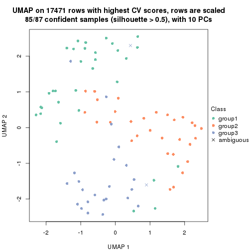</p>

</div>
<div id='tab-CV-skmeans-dimension-reduction-3'>
<pre><code class="r">dimension_reduction(res, k = 4, method = &quot;UMAP&quot;)
</code></pre>

<p></p>

</div>
<div id='tab-CV-skmeans-dimension-reduction-4'>
<pre><code class="r">dimension_reduction(res, k = 5, method = &quot;UMAP&quot;)
</code></pre>

<p></p>

</div>
<div id='tab-CV-skmeans-dimension-reduction-5'>
<pre><code class="r">dimension_reduction(res, k = 6, method = &quot;UMAP&quot;)
</code></pre>

<p></p>

</div>
</div>


Following heatmap shows how subgroups are split when increasing `k`:

```r
collect_classes(res)
```


If matrix rows can be associated to genes, consider to use `functional_enrichment(res,
...)` to perform function enrichment for the signature genes. See [this vignette](http://bioconductor.org/packages/devel/bioc/vignettes/cola/inst/doc/functional_enrichment.html) for more detailed explanations.


 

---------------------------------------------------


### CV:pam


The object with results only for a single top-value method and a single partition method 
can be extracted as:

```r
res = res_list["CV", "pam"]
# you can also extract it by
# res = res_list["CV:pam"]
```

A summary of `res` and all the functions that can be applied to it:

```r
res
```

```
#> A 'ConsensusPartition' object with k = 2, 3, 4, 5, 6.
#>   On a matrix with 17471 rows and 87 columns.
#>   Top rows (1000, 2000, 3000, 4000, 5000) are extracted by 'CV' method.
#>   Subgroups are detected by 'pam' method.
#>   Performed in total 1250 partitions by row resampling.
#>   Best k for subgroups seems to be 2.
#> 
#> Following methods can be applied to this 'ConsensusPartition' object:
#>  [1] "cola_report"             "collect_classes"         "collect_plots"          
#>  [4] "collect_stats"           "colnames"                "compare_signatures"     
#>  [7] "consensus_heatmap"       "dimension_reduction"     "functional_enrichment"  
#> [10] "get_anno_col"            "get_anno"                "get_classes"            
#> [13] "get_consensus"           "get_matrix"              "get_membership"         
#> [16] "get_param"               "get_signatures"          "get_stats"              
#> [19] "is_best_k"               "is_stable_k"             "membership_heatmap"     
#> [22] "ncol"                    "nrow"                    "plot_ecdf"              
#> [25] "rownames"                "select_partition_number" "show"                   
#> [28] "suggest_best_k"          "test_to_known_factors"
```

`collect_plots()` function collects all the plots made from `res` for all `k` (number of partitions)
into one single page to provide an easy and fast comparison between different `k`.

```r
collect_plots(res)
```

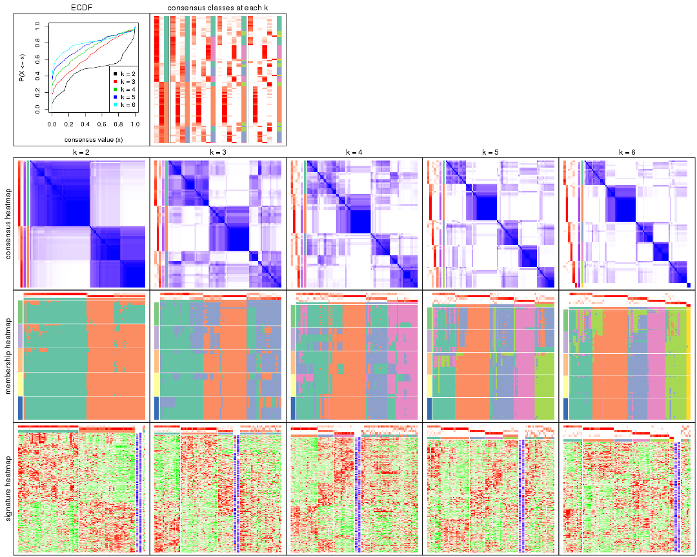

The plots are:

- The first row: a plot of the ECDF (empirical cumulative distribution
  function) curves of the consensus matrix for each `k` and the heatmap of
  predicted classes for each `k`.
- The second row: heatmaps of the consensus matrix for each `k`.
- The third row: heatmaps of the membership matrix for each `k`.
- The fouth row: heatmaps of the signatures for each `k`.

All the plots in panels can be made by individual functions and they are
plotted later in this section.

`select_partition_number()` produces several plots showing different
statistics for choosing "optimized" `k`. There are following statistics:

- ECDF curves of the consensus matrix for each `k`;
- 1-PAC. [The PAC
  score](https://en.wikipedia.org/wiki/Consensus_clustering#Over-interpretation_potential_of_consensus_clustering)
  measures the proportion of the ambiguous subgrouping.
- Mean silhouette score.
- Concordance. The mean probability of fiting the consensus class ids in all
  partitions.
- Area increased. Denote $A_k$ as the area under the ECDF curve for current
  `k`, the area increased is defined as $A_k - A_{k-1}$.
- Rand index. The percent of pairs of samples that are both in a same cluster
  or both are not in a same cluster in the partition of k and k-1.
- Jaccard index. The ratio of pairs of samples are both in a same cluster in
  the partition of k and k-1 and the pairs of samples are both in a same
  cluster in the partition k or k-1.

The detailed explanations of these statistics can be found in [the _cola_
vignette](http://bioconductor.org/packages/devel/bioc/vignettes/cola/inst/doc/cola.html#toc_13).

Generally speaking, lower PAC score, higher mean silhouette score or higher
concordance corresponds to better partition. Rand index and Jaccard index
measure how similar the current partition is compared to partition with `k-1`.
If they are too similar, we won't accept `k` is better than `k-1`.

```r
select_partition_number(res)
```


The numeric values for all these statistics can be obtained by `get_stats()`.

```r
get_stats(res)
```

```
#>   k 1-PAC mean_silhouette concordance area_increased  Rand Jaccard
#> 2 2 0.506           0.874       0.921         0.4811 0.495   0.495
#> 3 3 0.419           0.533       0.777         0.3652 0.752   0.537
#> 4 4 0.524           0.504       0.753         0.1120 0.782   0.453
#> 5 5 0.644           0.635       0.781         0.0582 0.872   0.558
#> 6 6 0.741           0.761       0.866         0.0380 0.957   0.804
```

`suggest_best_k()` suggests the best $k$ based on these statistics. The rules are as follows:

- All $k$ with Jaccard index larger than 0.95 are removed because increasing
  $k$ does not provide enough extra information. If all $k$ are removed, it is
  marked as no subgroup is detected.
- For all $k$ with 1-PAC score larger than 0.9, the maximal $k$ is taken as
  the best $k$, and other $k$ are marked as optional $k$.
- If it does not fit the second rule. The $k$ with the maximal vote of the
  highest 1-PAC score, highest mean silhouette, and highest concordance is
  taken as the best $k$.

```r
suggest_best_k(res)
```

```
#> [1] 2
```


Following shows the table of the partitions (You need to click the **show/hide
code output** link to see it). The membership matrix (columns with name `p*`)
is inferred by
[`clue::cl_consensus()`](https://www.rdocumentation.org/link/cl_consensus?package=clue)
function with the `SE` method. Basically the value in the membership matrix
represents the probability to belong to a certain group. The finall class
label for an item is determined with the group with highest probability it
belongs to.

In `get_classes()` function, the entropy is calculated from the membership
matrix and the silhouette score is calculated from the consensus matrix.


<script>
$( function() {
	$( '#tabs-CV-pam-get-classes' ).tabs();
} );
</script>
<div id='tabs-CV-pam-get-classes'>
<ul>
<li><a href='#tab-CV-pam-get-classes-1'>k = 2</a></li>
<li><a href='#tab-CV-pam-get-classes-2'>k = 3</a></li>
<li><a href='#tab-CV-pam-get-classes-3'>k = 4</a></li>
<li><a href='#tab-CV-pam-get-classes-4'>k = 5</a></li>
<li><a href='#tab-CV-pam-get-classes-5'>k = 6</a></li>
</ul>

<div id='tab-CV-pam-get-classes-1'>
<p><a id='tab-CV-pam-get-classes-1-a' style='color:#0366d6' href='#'>show/hide code output</a></p>
<pre><code class="r">cbind(get_classes(res, k = 2), get_membership(res, k = 2))
</code></pre>

<pre><code>#&gt;                                      class entropy silhouette    p1    p2
#&gt; E6088A41-B0DC-4FBF-8D14-BE78024CF8CD     1  0.9580      0.321 0.620 0.380
#&gt; F569915C-8F77-4D67-9730-30824DB57EE5     1  0.4690      0.888 0.900 0.100
#&gt; E3B71CB7-673B-4741-8607-4F0A11633036     1  0.0000      0.943 1.000 0.000
#&gt; DAF84798-FE3F-403C-B589-7F256AF752BE     2  0.9044      0.674 0.320 0.680
#&gt; 2F38E3B1-4975-4877-9DCC-C00270602180     1  0.0000      0.943 1.000 0.000
#&gt; C79A4C2F-02C4-4C03-A5A5-DE06802EEB57     1  0.7376      0.753 0.792 0.208
#&gt; 92E3ED8F-5C74-4ED2-9B03-9FA5E7B491D6     1  0.0938      0.942 0.988 0.012
#&gt; E61D60BE-3BD3-4B5E-BC12-80F3684A0959     1  0.0672      0.942 0.992 0.008
#&gt; C9388FC7-DB1D-4416-BC2D-EA643584F1E6     2  0.6438      0.868 0.164 0.836
#&gt; D4219360-6344-4AF3-ACEB-1701A9F1F67D     1  0.0000      0.943 1.000 0.000
#&gt; 07D155E6-F27C-4D09-B786-8A9B71147B72     1  0.3879      0.903 0.924 0.076
#&gt; 10C8C361-85A5-40E8-A395-B92623E6F27C     1  0.0000      0.943 1.000 0.000
#&gt; BDF20891-7C98-4A55-BBF3-8A836BE303C6     2  0.0672      0.872 0.008 0.992
#&gt; 694B0504-095E-431A-84F2-B4387072138E     1  0.4431      0.895 0.908 0.092
#&gt; EDCF8E7F-8B1D-46F7-8AE0-84A1DC9647D2     2  0.5408      0.878 0.124 0.876
#&gt; 0EA8288E-824D-4304-A053-5A833361F5C5     1  0.0938      0.942 0.988 0.012
#&gt; C4ACCFA1-34A9-4F61-8A1F-35B3B60EA193     1  0.1633      0.939 0.976 0.024
#&gt; 760BA639-38AC-4BC9-9647-09F6893EA8ED     1  0.0376      0.943 0.996 0.004
#&gt; 082DFC6B-C6E6-48B9-BDE5-74FF3B3DC954     2  0.6148      0.873 0.152 0.848
#&gt; FE349848-D7C4-4C49-B670-0E20454DDD7E     1  0.3274      0.923 0.940 0.060
#&gt; 2E8937B3-9EA1-4528-8CEE-BF3D4137908A     2  0.6247      0.872 0.156 0.844
#&gt; 9942D04E-2767-4E39-BA16-7762EAC3DFC4     2  0.6343      0.870 0.160 0.840
#&gt; F9C23182-91C4-4145-AE52-526FE8EB199D     2  0.1184      0.878 0.016 0.984
#&gt; 01024EED-7811-4E24-A067-8E0B978FFE2D     2  0.0000      0.875 0.000 1.000
#&gt; 932C8E98-A352-409C-8744-3D49FABCE425     1  0.1184      0.941 0.984 0.016
#&gt; 6DFD9439-C659-4936-84E5-108F717E3E4D     2  0.6712      0.861 0.176 0.824
#&gt; 1D8B83B8-5DD7-4F45-9D59-487EC6906A8B     2  0.6343      0.870 0.160 0.840
#&gt; 804B8503-73F6-42DE-835F-39DE2C9F13E1     2  0.0000      0.875 0.000 1.000
#&gt; B9453C9B-84D5-43BD-85BB-1780F02F039C     1  0.0000      0.943 1.000 0.000
#&gt; 836E6CD6-4E88-4028-9844-FA3C892C254A     1  0.1843      0.937 0.972 0.028
#&gt; 36EDD202-A845-4CE7-95D5-A515C471262E     2  0.6343      0.870 0.160 0.840
#&gt; 181C156A-B8F4-4F9D-93AA-6AFBD197644D     2  0.2423      0.857 0.040 0.960
#&gt; 0580E798-6A98-4E46-AC96-9A869DFF502E     1  0.0000      0.943 1.000 0.000
#&gt; EA1B63CF-D389-4567-8D9E-B0EF1F804598     1  0.7453      0.749 0.788 0.212
#&gt; 5ABC3D06-B8E9-4831-B89B-7C1EC4006B47     2  0.0672      0.877 0.008 0.992
#&gt; 1CC01E74-A7C1-4A51-9E28-1703C352BE16     2  0.0000      0.875 0.000 1.000
#&gt; 97E55B75-DBDB-46BC-9E74-7828C070BF16     2  0.2603      0.880 0.044 0.956
#&gt; BEB37A2D-E8B0-4674-89AC-DC0F34E0AFD6     1  0.0938      0.941 0.988 0.012
#&gt; 558648BA-6551-4D34-97C2-AD5F677D63FB     1  0.3733      0.911 0.928 0.072
#&gt; FF7021BB-414B-4466-BC43-372D856E6A1D     2  0.6531      0.866 0.168 0.832
#&gt; 9C04B840-54E0-425D-BDBE-8CB6B9C2C722     2  0.6343      0.870 0.160 0.840
#&gt; 5F50B1F4-1A02-4506-AA6D-9BF21CD8059A     1  0.0000      0.943 1.000 0.000
#&gt; 7D4B8FF3-7977-4ABD-AE04-EED1C50B23CC     2  0.6343      0.870 0.160 0.840
#&gt; A005AF15-B98E-4623-8AD4-1E69EFA9BC7A     1  0.0000      0.943 1.000 0.000
#&gt; 1DF04345-5C93-4B18-B307-8D1FCA532999     2  0.0000      0.875 0.000 1.000
#&gt; 6AF30C18-347E-41ED-A4AB-6F81F42206C5     1  0.0000      0.943 1.000 0.000
#&gt; 88A44ED0-BDE1-401E-B0E1-D8C8D6DBAEFC     2  0.9850      0.267 0.428 0.572
#&gt; 117673A3-2918-4702-8583-B66ADE6E4338     2  0.4815      0.879 0.104 0.896
#&gt; 4903A571-E14D-43C9-A737-22CAFAC414CD     1  0.6801      0.800 0.820 0.180
#&gt; C175E68E-632A-4B4A-9DDB-4895C4760F20     1  0.3274      0.922 0.940 0.060
#&gt; FA5CA2F4-A1AD-4A79-B8F3-73A976EB2FB1     2  0.0000      0.875 0.000 1.000
#&gt; E1F883A7-8B1F-4C1D-8A1A-9749A9C09845     2  0.0000      0.875 0.000 1.000
#&gt; E74F0729-6000-4908-ADB0-7BDBAC0639E6     1  0.0000      0.943 1.000 0.000
#&gt; F92135A9-1981-4C79-99A5-4243EEC5D30D     2  0.0000      0.875 0.000 1.000
#&gt; 73C6919F-DEB4-4DA4-B4AE-4032AC8F96C5     1  0.0000      0.943 1.000 0.000
#&gt; 33977B40-2E92-48B6-8D3A-3EBE913F6F8A     1  0.0000      0.943 1.000 0.000
#&gt; 490BD607-2F08-4B4C-9612-F9BB5CBBC8BB     2  0.7815      0.801 0.232 0.768
#&gt; 6C666E17-2EB8-4244-BCC1-8DD34EE4173E     1  0.5629      0.863 0.868 0.132
#&gt; C41F3064-4483-4796-B860-82155BAA5157     1  0.0376      0.942 0.996 0.004
#&gt; F4232B90-51B9-43EE-9971-35B3A318758F     1  0.0000      0.943 1.000 0.000
#&gt; 291EA1F6-FC56-4429-A433-0C452A6A514C     2  0.0000      0.875 0.000 1.000
#&gt; CC4AF04D-CB8E-40DD-B12E-7AA39B38262A     2  0.0000      0.875 0.000 1.000
#&gt; 4DAE26B9-AB57-4763-BB9A-2ADDD5D9C007     1  0.4022      0.899 0.920 0.080
#&gt; 676B4AEE-FB41-4C16-AA91-03E4A1DA8E26     2  0.8267      0.786 0.260 0.740
#&gt; 1CC36859-357A-49E0-A367-4F57D47288BA     1  0.4690      0.888 0.900 0.100
#&gt; 7CCDDFC8-6DF6-4734-96AC-19EBC464FC50     2  0.0000      0.875 0.000 1.000
#&gt; 10F38C34-3956-48ED-AB62-3439EF00D46B     2  0.9000      0.693 0.316 0.684
#&gt; 80B2B393-9D6E-45B4-B696-2A5C203543B7     2  0.6343      0.870 0.160 0.840
#&gt; 5AC7B5EA-1AAC-4529-8E5A-F612E5E0719A     1  0.0000      0.943 1.000 0.000
#&gt; 3648E98D-4B3A-41B7-BE05-595D44F0150D     1  0.0000      0.943 1.000 0.000
#&gt; 252EC850-6026-473B-8FFC-2CF567EF42E4     1  0.2423      0.928 0.960 0.040
#&gt; 1790E7A3-99D8-447E-BC50-51C8A4A18853     2  0.0000      0.875 0.000 1.000
#&gt; DA61A4F8-350B-4DD1-A240-AD016520DB5B     1  0.5059      0.880 0.888 0.112
#&gt; 767E5BAF-2515-40D7-AE7D-0B24D77A03F4     2  0.6712      0.861 0.176 0.824
#&gt; 8CB9C903-D749-44EA-9137-7FB5A92C5932     1  0.0938      0.942 0.988 0.012
#&gt; A9B968AE-2243-41BC-852A-3A12C1FB4892     1  0.2423      0.928 0.960 0.040
#&gt; 3C582264-85BC-4569-A888-8EB3008E5198     2  0.0000      0.875 0.000 1.000
#&gt; F4EAF9A2-9938-4D9B-9080-C0A7542D5704     2  0.0000      0.875 0.000 1.000
#&gt; 328499D3-45DD-4B66-BD22-3C52BA92C2BB     1  0.0000      0.943 1.000 0.000
#&gt; AF8AB83D-2917-4752-8C38-CF84C565B565     1  0.0000      0.943 1.000 0.000
#&gt; 03A327CA-A9FE-42A4-844D-CA85206969FC     2  0.7299      0.833 0.204 0.796
#&gt; 4B0BEC44-87BB-4014-9A26-3529DD63760B     1  0.5946      0.843 0.856 0.144
#&gt; 05C7843E-DC89-4D8E-A78A-952C5DFD667B     1  0.2043      0.935 0.968 0.032
#&gt; 29A0FFF9-13D3-4D16-BE6A-8E48A2C4E315     2  0.0000      0.875 0.000 1.000
#&gt; 22947CC3-4F42-4F44-899C-2B7085E36C9D     2  0.6247      0.872 0.156 0.844
#&gt; A247D92D-253A-4BEC-B450-184AF90D17D0     2  0.6343      0.870 0.160 0.840
#&gt; 0D907A63-D23F-4684-80D9-0BA552435B86     2  0.8267      0.786 0.260 0.740
</code></pre>

<script>
$('#tab-CV-pam-get-classes-1-a').parent().next().next().hide();
$('#tab-CV-pam-get-classes-1-a').click(function(){
  $('#tab-CV-pam-get-classes-1-a').parent().next().next().toggle();
  return(false);
});
</script>
</div>

<div id='tab-CV-pam-get-classes-2'>
<p><a id='tab-CV-pam-get-classes-2-a' style='color:#0366d6' href='#'>show/hide code output</a></p>
<pre><code class="r">cbind(get_classes(res, k = 3), get_membership(res, k = 3))
</code></pre>

<pre><code>#&gt;                                      class entropy silhouette    p1    p2    p3
#&gt; E6088A41-B0DC-4FBF-8D14-BE78024CF8CD     3  0.6920     0.4233 0.164 0.104 0.732
#&gt; F569915C-8F77-4D67-9730-30824DB57EE5     3  0.3695     0.5256 0.108 0.012 0.880
#&gt; E3B71CB7-673B-4741-8607-4F0A11633036     1  0.3192     0.6564 0.888 0.000 0.112
#&gt; DAF84798-FE3F-403C-B589-7F256AF752BE     3  0.8659    -0.0836 0.104 0.408 0.488
#&gt; 2F38E3B1-4975-4877-9DCC-C00270602180     1  0.2796     0.6385 0.908 0.000 0.092
#&gt; C79A4C2F-02C4-4C03-A5A5-DE06802EEB57     1  0.6567     0.5613 0.752 0.160 0.088
#&gt; 92E3ED8F-5C74-4ED2-9B03-9FA5E7B491D6     1  0.6111     0.4406 0.604 0.000 0.396
#&gt; E61D60BE-3BD3-4B5E-BC12-80F3684A0959     1  0.5178     0.5380 0.744 0.000 0.256
#&gt; C9388FC7-DB1D-4416-BC2D-EA643584F1E6     2  0.5733     0.5471 0.000 0.676 0.324
#&gt; D4219360-6344-4AF3-ACEB-1701A9F1F67D     1  0.3752     0.6417 0.856 0.000 0.144
#&gt; 07D155E6-F27C-4D09-B786-8A9B71147B72     3  0.6244     0.1955 0.440 0.000 0.560
#&gt; 10C8C361-85A5-40E8-A395-B92623E6F27C     1  0.0592     0.6672 0.988 0.000 0.012
#&gt; BDF20891-7C98-4A55-BBF3-8A836BE303C6     2  0.4316     0.6866 0.044 0.868 0.088
#&gt; 694B0504-095E-431A-84F2-B4387072138E     1  0.6813     0.3190 0.520 0.012 0.468
#&gt; EDCF8E7F-8B1D-46F7-8AE0-84A1DC9647D2     2  0.5650     0.5932 0.000 0.688 0.312
#&gt; 0EA8288E-824D-4304-A053-5A833361F5C5     1  0.5905     0.4288 0.648 0.000 0.352
#&gt; C4ACCFA1-34A9-4F61-8A1F-35B3B60EA193     1  0.6669     0.3265 0.524 0.008 0.468
#&gt; 760BA639-38AC-4BC9-9647-09F6893EA8ED     1  0.4452     0.6218 0.808 0.000 0.192
#&gt; 082DFC6B-C6E6-48B9-BDE5-74FF3B3DC954     3  0.5465     0.4734 0.000 0.288 0.712
#&gt; FE349848-D7C4-4C49-B670-0E20454DDD7E     3  0.0983     0.5507 0.004 0.016 0.980
#&gt; 2E8937B3-9EA1-4528-8CEE-BF3D4137908A     2  0.5560     0.5826 0.000 0.700 0.300
#&gt; 9942D04E-2767-4E39-BA16-7762EAC3DFC4     2  0.5706     0.5525 0.000 0.680 0.320
#&gt; F9C23182-91C4-4145-AE52-526FE8EB199D     2  0.3941     0.7083 0.000 0.844 0.156
#&gt; 01024EED-7811-4E24-A067-8E0B978FFE2D     2  0.0000     0.8111 0.000 1.000 0.000
#&gt; 932C8E98-A352-409C-8744-3D49FABCE425     1  0.6516     0.3210 0.516 0.004 0.480
#&gt; 6DFD9439-C659-4936-84E5-108F717E3E4D     2  0.6286     0.3429 0.000 0.536 0.464
#&gt; 1D8B83B8-5DD7-4F45-9D59-487EC6906A8B     2  0.6026     0.4777 0.000 0.624 0.376
#&gt; 804B8503-73F6-42DE-835F-39DE2C9F13E1     2  0.0000     0.8111 0.000 1.000 0.000
#&gt; B9453C9B-84D5-43BD-85BB-1780F02F039C     1  0.0592     0.6672 0.988 0.000 0.012
#&gt; 836E6CD6-4E88-4028-9844-FA3C892C254A     1  0.6813     0.3190 0.520 0.012 0.468
#&gt; 36EDD202-A845-4CE7-95D5-A515C471262E     2  0.5591     0.5774 0.000 0.696 0.304
#&gt; 181C156A-B8F4-4F9D-93AA-6AFBD197644D     2  0.0237     0.8083 0.004 0.996 0.000
#&gt; 0580E798-6A98-4E46-AC96-9A869DFF502E     1  0.2796     0.6385 0.908 0.000 0.092
#&gt; EA1B63CF-D389-4567-8D9E-B0EF1F804598     3  0.7841    -0.2774 0.472 0.052 0.476
#&gt; 5ABC3D06-B8E9-4831-B89B-7C1EC4006B47     2  0.0424     0.8090 0.000 0.992 0.008
#&gt; 1CC01E74-A7C1-4A51-9E28-1703C352BE16     2  0.0000     0.8111 0.000 1.000 0.000
#&gt; 97E55B75-DBDB-46BC-9E74-7828C070BF16     2  0.2066     0.7888 0.000 0.940 0.060
#&gt; BEB37A2D-E8B0-4674-89AC-DC0F34E0AFD6     1  0.3551     0.6326 0.868 0.000 0.132
#&gt; 558648BA-6551-4D34-97C2-AD5F677D63FB     1  0.6967     0.4564 0.668 0.044 0.288
#&gt; FF7021BB-414B-4466-BC43-372D856E6A1D     3  0.5291     0.3885 0.000 0.268 0.732
#&gt; 9C04B840-54E0-425D-BDBE-8CB6B9C2C722     2  0.4654     0.6858 0.000 0.792 0.208
#&gt; 5F50B1F4-1A02-4506-AA6D-9BF21CD8059A     3  0.5785     0.3194 0.332 0.000 0.668
#&gt; 7D4B8FF3-7977-4ABD-AE04-EED1C50B23CC     2  0.6291     0.3339 0.000 0.532 0.468
#&gt; A005AF15-B98E-4623-8AD4-1E69EFA9BC7A     3  0.6280     0.1700 0.460 0.000 0.540
#&gt; 1DF04345-5C93-4B18-B307-8D1FCA532999     2  0.0000     0.8111 0.000 1.000 0.000
#&gt; 6AF30C18-347E-41ED-A4AB-6F81F42206C5     1  0.2796     0.6385 0.908 0.000 0.092
#&gt; 88A44ED0-BDE1-401E-B0E1-D8C8D6DBAEFC     2  0.8228    -0.0408 0.076 0.512 0.412
#&gt; 117673A3-2918-4702-8583-B66ADE6E4338     2  0.5138     0.6547 0.000 0.748 0.252
#&gt; 4903A571-E14D-43C9-A737-22CAFAC414CD     3  0.4136     0.5163 0.116 0.020 0.864
#&gt; C175E68E-632A-4B4A-9DDB-4895C4760F20     1  0.6680     0.3090 0.508 0.008 0.484
#&gt; FA5CA2F4-A1AD-4A79-B8F3-73A976EB2FB1     2  0.0000     0.8111 0.000 1.000 0.000
#&gt; E1F883A7-8B1F-4C1D-8A1A-9749A9C09845     2  0.0000     0.8111 0.000 1.000 0.000
#&gt; E74F0729-6000-4908-ADB0-7BDBAC0639E6     1  0.2796     0.6385 0.908 0.000 0.092
#&gt; F92135A9-1981-4C79-99A5-4243EEC5D30D     2  0.0000     0.8111 0.000 1.000 0.000
#&gt; 73C6919F-DEB4-4DA4-B4AE-4032AC8F96C5     1  0.0592     0.6672 0.988 0.000 0.012
#&gt; 33977B40-2E92-48B6-8D3A-3EBE913F6F8A     1  0.5327     0.6214 0.728 0.000 0.272
#&gt; 490BD607-2F08-4B4C-9612-F9BB5CBBC8BB     3  0.5058     0.5156 0.000 0.244 0.756
#&gt; 6C666E17-2EB8-4244-BCC1-8DD34EE4173E     3  0.6634     0.5710 0.104 0.144 0.752
#&gt; C41F3064-4483-4796-B860-82155BAA5157     1  0.2959     0.6366 0.900 0.000 0.100
#&gt; F4232B90-51B9-43EE-9971-35B3A318758F     1  0.2796     0.6385 0.908 0.000 0.092
#&gt; 291EA1F6-FC56-4429-A433-0C452A6A514C     2  0.0000     0.8111 0.000 1.000 0.000
#&gt; CC4AF04D-CB8E-40DD-B12E-7AA39B38262A     2  0.0000     0.8111 0.000 1.000 0.000
#&gt; 4DAE26B9-AB57-4763-BB9A-2ADDD5D9C007     1  0.5706     0.3798 0.680 0.000 0.320
#&gt; 676B4AEE-FB41-4C16-AA91-03E4A1DA8E26     3  0.9520     0.3542 0.352 0.196 0.452
#&gt; 1CC36859-357A-49E0-A367-4F57D47288BA     1  0.6819     0.3061 0.512 0.012 0.476
#&gt; 7CCDDFC8-6DF6-4734-96AC-19EBC464FC50     2  0.0000     0.8111 0.000 1.000 0.000
#&gt; 10F38C34-3956-48ED-AB62-3439EF00D46B     3  0.7252     0.5664 0.100 0.196 0.704
#&gt; 80B2B393-9D6E-45B4-B696-2A5C203543B7     2  0.4452     0.6986 0.000 0.808 0.192
#&gt; 5AC7B5EA-1AAC-4529-8E5A-F612E5E0719A     1  0.5327     0.4486 0.728 0.000 0.272
#&gt; 3648E98D-4B3A-41B7-BE05-595D44F0150D     1  0.2066     0.6681 0.940 0.000 0.060
#&gt; 252EC850-6026-473B-8FFC-2CF567EF42E4     3  0.6274     0.1772 0.456 0.000 0.544
#&gt; 1790E7A3-99D8-447E-BC50-51C8A4A18853     2  0.0000     0.8111 0.000 1.000 0.000
#&gt; DA61A4F8-350B-4DD1-A240-AD016520DB5B     3  0.3690     0.5310 0.100 0.016 0.884
#&gt; 767E5BAF-2515-40D7-AE7D-0B24D77A03F4     3  0.3267     0.5823 0.000 0.116 0.884
#&gt; 8CB9C903-D749-44EA-9137-7FB5A92C5932     1  0.3784     0.6392 0.864 0.004 0.132
#&gt; A9B968AE-2243-41BC-852A-3A12C1FB4892     3  0.6267     0.1832 0.452 0.000 0.548
#&gt; 3C582264-85BC-4569-A888-8EB3008E5198     2  0.0000     0.8111 0.000 1.000 0.000
#&gt; F4EAF9A2-9938-4D9B-9080-C0A7542D5704     2  0.0000     0.8111 0.000 1.000 0.000
#&gt; 328499D3-45DD-4B66-BD22-3C52BA92C2BB     1  0.0592     0.6672 0.988 0.000 0.012
#&gt; AF8AB83D-2917-4752-8C38-CF84C565B565     1  0.6204     0.3269 0.576 0.000 0.424
#&gt; 03A327CA-A9FE-42A4-844D-CA85206969FC     3  0.5178     0.5010 0.000 0.256 0.744
#&gt; 4B0BEC44-87BB-4014-9A26-3529DD63760B     3  0.6486     0.5659 0.144 0.096 0.760
#&gt; 05C7843E-DC89-4D8E-A78A-952C5DFD667B     3  0.6813    -0.2516 0.468 0.012 0.520
#&gt; 29A0FFF9-13D3-4D16-BE6A-8E48A2C4E315     2  0.0000     0.8111 0.000 1.000 0.000
#&gt; 22947CC3-4F42-4F44-899C-2B7085E36C9D     3  0.3482     0.5809 0.000 0.128 0.872
#&gt; A247D92D-253A-4BEC-B450-184AF90D17D0     3  0.5621     0.4423 0.000 0.308 0.692
#&gt; 0D907A63-D23F-4684-80D9-0BA552435B86     3  0.6244     0.1955 0.440 0.000 0.560
</code></pre>

<script>
$('#tab-CV-pam-get-classes-2-a').parent().next().next().hide();
$('#tab-CV-pam-get-classes-2-a').click(function(){
  $('#tab-CV-pam-get-classes-2-a').parent().next().next().toggle();
  return(false);
});
</script>
</div>

<div id='tab-CV-pam-get-classes-3'>
<p><a id='tab-CV-pam-get-classes-3-a' style='color:#0366d6' href='#'>show/hide code output</a></p>
<pre><code class="r">cbind(get_classes(res, k = 4), get_membership(res, k = 4))
</code></pre>

<pre><code>#&gt;                                      class entropy silhouette    p1    p2    p3    p4
#&gt; E6088A41-B0DC-4FBF-8D14-BE78024CF8CD     1  0.5296   -0.15749 0.500 0.008 0.492 0.000
#&gt; F569915C-8F77-4D67-9730-30824DB57EE5     3  0.4888    0.57084 0.412 0.000 0.588 0.000
#&gt; E3B71CB7-673B-4741-8607-4F0A11633036     1  0.4888   -0.10298 0.588 0.000 0.000 0.412
#&gt; DAF84798-FE3F-403C-B589-7F256AF752BE     1  0.7377    0.31696 0.608 0.188 0.176 0.028
#&gt; 2F38E3B1-4975-4877-9DCC-C00270602180     4  0.0000    0.74846 0.000 0.000 0.000 1.000
#&gt; C79A4C2F-02C4-4C03-A5A5-DE06802EEB57     1  0.8729    0.02872 0.468 0.152 0.084 0.296
#&gt; 92E3ED8F-5C74-4ED2-9B03-9FA5E7B491D6     1  0.2647    0.44387 0.880 0.000 0.000 0.120
#&gt; E61D60BE-3BD3-4B5E-BC12-80F3684A0959     1  0.4866   -0.03311 0.596 0.000 0.000 0.404
#&gt; C9388FC7-DB1D-4416-BC2D-EA643584F1E6     2  0.6970    0.36645 0.256 0.576 0.168 0.000
#&gt; D4219360-6344-4AF3-ACEB-1701A9F1F67D     1  0.4543    0.12336 0.676 0.000 0.000 0.324
#&gt; 07D155E6-F27C-4D09-B786-8A9B71147B72     4  0.2861    0.72717 0.096 0.000 0.016 0.888
#&gt; 10C8C361-85A5-40E8-A395-B92623E6F27C     4  0.4790    0.46861 0.380 0.000 0.000 0.620
#&gt; BDF20891-7C98-4A55-BBF3-8A836BE303C6     2  0.4643    0.38277 0.000 0.656 0.000 0.344
#&gt; 694B0504-095E-431A-84F2-B4387072138E     1  0.1792    0.45277 0.932 0.000 0.000 0.068
#&gt; EDCF8E7F-8B1D-46F7-8AE0-84A1DC9647D2     1  0.6727    0.12638 0.520 0.384 0.096 0.000
#&gt; 0EA8288E-824D-4304-A053-5A833361F5C5     3  0.6421   -0.01988 0.368 0.000 0.556 0.076
#&gt; C4ACCFA1-34A9-4F61-8A1F-35B3B60EA193     1  0.1792    0.45277 0.932 0.000 0.000 0.068
#&gt; 760BA639-38AC-4BC9-9647-09F6893EA8ED     1  0.4328    0.22106 0.748 0.000 0.008 0.244
#&gt; 082DFC6B-C6E6-48B9-BDE5-74FF3B3DC954     3  0.5661    0.65171 0.220 0.080 0.700 0.000
#&gt; FE349848-D7C4-4C49-B670-0E20454DDD7E     3  0.4134    0.66151 0.260 0.000 0.740 0.000
#&gt; 2E8937B3-9EA1-4528-8CEE-BF3D4137908A     2  0.6784    0.41266 0.244 0.600 0.156 0.000
#&gt; 9942D04E-2767-4E39-BA16-7762EAC3DFC4     2  0.5935    0.50133 0.256 0.664 0.080 0.000
#&gt; F9C23182-91C4-4145-AE52-526FE8EB199D     2  0.5085    0.34151 0.376 0.616 0.008 0.000
#&gt; 01024EED-7811-4E24-A067-8E0B978FFE2D     2  0.0000    0.81648 0.000 1.000 0.000 0.000
#&gt; 932C8E98-A352-409C-8744-3D49FABCE425     1  0.3539    0.44012 0.820 0.000 0.176 0.004
#&gt; 6DFD9439-C659-4936-84E5-108F717E3E4D     1  0.6714    0.30849 0.616 0.208 0.176 0.000
#&gt; 1D8B83B8-5DD7-4F45-9D59-487EC6906A8B     2  0.7302    0.19866 0.332 0.500 0.168 0.000
#&gt; 804B8503-73F6-42DE-835F-39DE2C9F13E1     2  0.0000    0.81648 0.000 1.000 0.000 0.000
#&gt; B9453C9B-84D5-43BD-85BB-1780F02F039C     4  0.4804    0.46430 0.384 0.000 0.000 0.616
#&gt; 836E6CD6-4E88-4028-9844-FA3C892C254A     1  0.2892    0.45350 0.896 0.000 0.036 0.068
#&gt; 36EDD202-A845-4CE7-95D5-A515C471262E     2  0.6731    0.41935 0.248 0.604 0.148 0.000
#&gt; 181C156A-B8F4-4F9D-93AA-6AFBD197644D     2  0.0000    0.81648 0.000 1.000 0.000 0.000
#&gt; 0580E798-6A98-4E46-AC96-9A869DFF502E     4  0.0000    0.74846 0.000 0.000 0.000 1.000
#&gt; EA1B63CF-D389-4567-8D9E-B0EF1F804598     1  0.3356    0.43889 0.824 0.000 0.176 0.000
#&gt; 5ABC3D06-B8E9-4831-B89B-7C1EC4006B47     2  0.0336    0.81273 0.008 0.992 0.000 0.000
#&gt; 1CC01E74-A7C1-4A51-9E28-1703C352BE16     2  0.0000    0.81648 0.000 1.000 0.000 0.000
#&gt; 97E55B75-DBDB-46BC-9E74-7828C070BF16     2  0.3667    0.72977 0.056 0.856 0.088 0.000
#&gt; BEB37A2D-E8B0-4674-89AC-DC0F34E0AFD6     4  0.2345    0.72859 0.100 0.000 0.000 0.900
#&gt; 558648BA-6551-4D34-97C2-AD5F677D63FB     1  0.6610   -0.00157 0.604 0.004 0.292 0.100
#&gt; FF7021BB-414B-4466-BC43-372D856E6A1D     1  0.5527    0.18318 0.616 0.028 0.356 0.000
#&gt; 9C04B840-54E0-425D-BDBE-8CB6B9C2C722     2  0.4214    0.64866 0.204 0.780 0.016 0.000
#&gt; 5F50B1F4-1A02-4506-AA6D-9BF21CD8059A     3  0.3356    0.38217 0.000 0.000 0.824 0.176
#&gt; 7D4B8FF3-7977-4ABD-AE04-EED1C50B23CC     1  0.6745    0.30644 0.612 0.212 0.176 0.000
#&gt; A005AF15-B98E-4623-8AD4-1E69EFA9BC7A     4  0.3071    0.72387 0.044 0.000 0.068 0.888
#&gt; 1DF04345-5C93-4B18-B307-8D1FCA532999     2  0.0000    0.81648 0.000 1.000 0.000 0.000
#&gt; 6AF30C18-347E-41ED-A4AB-6F81F42206C5     4  0.0000    0.74846 0.000 0.000 0.000 1.000
#&gt; 88A44ED0-BDE1-401E-B0E1-D8C8D6DBAEFC     3  0.7159    0.38576 0.200 0.244 0.556 0.000
#&gt; 117673A3-2918-4702-8583-B66ADE6E4338     2  0.5292    0.14181 0.480 0.512 0.008 0.000
#&gt; 4903A571-E14D-43C9-A737-22CAFAC414CD     1  0.4941    0.02802 0.564 0.000 0.436 0.000
#&gt; C175E68E-632A-4B4A-9DDB-4895C4760F20     1  0.3356    0.43889 0.824 0.000 0.176 0.000
#&gt; FA5CA2F4-A1AD-4A79-B8F3-73A976EB2FB1     2  0.0000    0.81648 0.000 1.000 0.000 0.000
#&gt; E1F883A7-8B1F-4C1D-8A1A-9749A9C09845     2  0.0000    0.81648 0.000 1.000 0.000 0.000
#&gt; E74F0729-6000-4908-ADB0-7BDBAC0639E6     4  0.0000    0.74846 0.000 0.000 0.000 1.000
#&gt; F92135A9-1981-4C79-99A5-4243EEC5D30D     2  0.0000    0.81648 0.000 1.000 0.000 0.000
#&gt; 73C6919F-DEB4-4DA4-B4AE-4032AC8F96C5     4  0.4643    0.50576 0.344 0.000 0.000 0.656
#&gt; 33977B40-2E92-48B6-8D3A-3EBE913F6F8A     4  0.5244    0.27563 0.436 0.000 0.008 0.556
#&gt; 490BD607-2F08-4B4C-9612-F9BB5CBBC8BB     3  0.4422    0.66288 0.256 0.008 0.736 0.000
#&gt; 6C666E17-2EB8-4244-BCC1-8DD34EE4173E     3  0.4830    0.59374 0.392 0.000 0.608 0.000
#&gt; C41F3064-4483-4796-B860-82155BAA5157     4  0.1716    0.73364 0.064 0.000 0.000 0.936
#&gt; F4232B90-51B9-43EE-9971-35B3A318758F     4  0.0000    0.74846 0.000 0.000 0.000 1.000
#&gt; 291EA1F6-FC56-4429-A433-0C452A6A514C     2  0.0000    0.81648 0.000 1.000 0.000 0.000
#&gt; CC4AF04D-CB8E-40DD-B12E-7AA39B38262A     2  0.0000    0.81648 0.000 1.000 0.000 0.000
#&gt; 4DAE26B9-AB57-4763-BB9A-2ADDD5D9C007     4  0.2530    0.72320 0.112 0.000 0.000 0.888
#&gt; 676B4AEE-FB41-4C16-AA91-03E4A1DA8E26     3  0.8537    0.19270 0.044 0.204 0.448 0.304
#&gt; 1CC36859-357A-49E0-A367-4F57D47288BA     1  0.5825    0.33498 0.664 0.000 0.268 0.068
#&gt; 7CCDDFC8-6DF6-4734-96AC-19EBC464FC50     2  0.0000    0.81648 0.000 1.000 0.000 0.000
#&gt; 10F38C34-3956-48ED-AB62-3439EF00D46B     3  0.5374    0.66124 0.224 0.008 0.724 0.044
#&gt; 80B2B393-9D6E-45B4-B696-2A5C203543B7     2  0.3649    0.66305 0.204 0.796 0.000 0.000
#&gt; 5AC7B5EA-1AAC-4529-8E5A-F612E5E0719A     4  0.1724    0.74540 0.032 0.000 0.020 0.948
#&gt; 3648E98D-4B3A-41B7-BE05-595D44F0150D     4  0.4746    0.46523 0.368 0.000 0.000 0.632
#&gt; 252EC850-6026-473B-8FFC-2CF567EF42E4     4  0.5736    0.39374 0.044 0.000 0.328 0.628
#&gt; 1790E7A3-99D8-447E-BC50-51C8A4A18853     2  0.0000    0.81648 0.000 1.000 0.000 0.000
#&gt; DA61A4F8-350B-4DD1-A240-AD016520DB5B     3  0.4382    0.66288 0.296 0.000 0.704 0.000
#&gt; 767E5BAF-2515-40D7-AE7D-0B24D77A03F4     3  0.4605    0.55239 0.336 0.000 0.664 0.000
#&gt; 8CB9C903-D749-44EA-9137-7FB5A92C5932     4  0.5165    0.28041 0.484 0.000 0.004 0.512
#&gt; A9B968AE-2243-41BC-852A-3A12C1FB4892     4  0.4800    0.60979 0.044 0.000 0.196 0.760
#&gt; 3C582264-85BC-4569-A888-8EB3008E5198     2  0.0000    0.81648 0.000 1.000 0.000 0.000
#&gt; F4EAF9A2-9938-4D9B-9080-C0A7542D5704     2  0.0000    0.81648 0.000 1.000 0.000 0.000
#&gt; 328499D3-45DD-4B66-BD22-3C52BA92C2BB     4  0.4804    0.46430 0.384 0.000 0.000 0.616
#&gt; AF8AB83D-2917-4752-8C38-CF84C565B565     4  0.4699    0.54737 0.004 0.000 0.320 0.676
#&gt; 03A327CA-A9FE-42A4-844D-CA85206969FC     3  0.4422    0.66288 0.256 0.008 0.736 0.000
#&gt; 4B0BEC44-87BB-4014-9A26-3529DD63760B     3  0.4164    0.66215 0.264 0.000 0.736 0.000
#&gt; 05C7843E-DC89-4D8E-A78A-952C5DFD667B     1  0.6262   -0.25134 0.540 0.000 0.400 0.060
#&gt; 29A0FFF9-13D3-4D16-BE6A-8E48A2C4E315     2  0.0000    0.81648 0.000 1.000 0.000 0.000
#&gt; 22947CC3-4F42-4F44-899C-2B7085E36C9D     1  0.4978    0.14771 0.612 0.004 0.384 0.000
#&gt; A247D92D-253A-4BEC-B450-184AF90D17D0     3  0.6050    0.63497 0.232 0.100 0.668 0.000
#&gt; 0D907A63-D23F-4684-80D9-0BA552435B86     4  0.3071    0.72387 0.044 0.000 0.068 0.888
</code></pre>

<script>
$('#tab-CV-pam-get-classes-3-a').parent().next().next().hide();
$('#tab-CV-pam-get-classes-3-a').click(function(){
  $('#tab-CV-pam-get-classes-3-a').parent().next().next().toggle();
  return(false);
});
</script>
</div>

<div id='tab-CV-pam-get-classes-4'>
<p><a id='tab-CV-pam-get-classes-4-a' style='color:#0366d6' href='#'>show/hide code output</a></p>
<pre><code class="r">cbind(get_classes(res, k = 5), get_membership(res, k = 5))
</code></pre>

<pre><code>#&gt;                                      class entropy silhouette    p1    p2    p3    p4    p5
#&gt; E6088A41-B0DC-4FBF-8D14-BE78024CF8CD     3  0.4270   -0.09009 0.004 0.004 0.656 0.000 0.336
#&gt; F569915C-8F77-4D67-9730-30824DB57EE5     3  0.1965    0.66814 0.096 0.000 0.904 0.000 0.000
#&gt; E3B71CB7-673B-4741-8607-4F0A11633036     1  0.3866    0.68237 0.808 0.000 0.000 0.096 0.096
#&gt; DAF84798-FE3F-403C-B589-7F256AF752BE     5  0.5191    0.71308 0.044 0.000 0.324 0.008 0.624
#&gt; 2F38E3B1-4975-4877-9DCC-C00270602180     4  0.0794    0.88202 0.028 0.000 0.000 0.972 0.000
#&gt; C79A4C2F-02C4-4C03-A5A5-DE06802EEB57     1  0.7223    0.61793 0.608 0.160 0.048 0.132 0.052
#&gt; 92E3ED8F-5C74-4ED2-9B03-9FA5E7B491D6     1  0.5109    0.20206 0.580 0.000 0.028 0.008 0.384
#&gt; E61D60BE-3BD3-4B5E-BC12-80F3684A0959     1  0.5463    0.64714 0.688 0.000 0.144 0.156 0.012
#&gt; C9388FC7-DB1D-4416-BC2D-EA643584F1E6     2  0.4470    0.45936 0.000 0.616 0.372 0.000 0.012
#&gt; D4219360-6344-4AF3-ACEB-1701A9F1F67D     1  0.3370    0.64355 0.824 0.000 0.000 0.028 0.148
#&gt; 07D155E6-F27C-4D09-B786-8A9B71147B72     4  0.0324    0.88143 0.000 0.000 0.004 0.992 0.004
#&gt; 10C8C361-85A5-40E8-A395-B92623E6F27C     1  0.3895    0.59012 0.680 0.000 0.000 0.320 0.000
#&gt; BDF20891-7C98-4A55-BBF3-8A836BE303C6     2  0.4161    0.27787 0.000 0.608 0.000 0.392 0.000
#&gt; 694B0504-095E-431A-84F2-B4387072138E     1  0.5200    0.54715 0.688 0.000 0.152 0.000 0.160
#&gt; EDCF8E7F-8B1D-46F7-8AE0-84A1DC9647D2     5  0.5732    0.62693 0.000 0.184 0.192 0.000 0.624
#&gt; 0EA8288E-824D-4304-A053-5A833361F5C5     1  0.4238    0.45720 0.628 0.000 0.004 0.000 0.368
#&gt; C4ACCFA1-34A9-4F61-8A1F-35B3B60EA193     1  0.3495    0.61806 0.812 0.000 0.028 0.000 0.160
#&gt; 760BA639-38AC-4BC9-9647-09F6893EA8ED     5  0.4547    0.27529 0.400 0.000 0.000 0.012 0.588
#&gt; 082DFC6B-C6E6-48B9-BDE5-74FF3B3DC954     3  0.1544    0.67057 0.000 0.068 0.932 0.000 0.000
#&gt; FE349848-D7C4-4C49-B670-0E20454DDD7E     3  0.0324    0.68404 0.004 0.000 0.992 0.000 0.004
#&gt; 2E8937B3-9EA1-4528-8CEE-BF3D4137908A     2  0.4929    0.51612 0.024 0.640 0.324 0.000 0.012
#&gt; 9942D04E-2767-4E39-BA16-7762EAC3DFC4     2  0.4356    0.51048 0.000 0.648 0.340 0.000 0.012
#&gt; F9C23182-91C4-4145-AE52-526FE8EB199D     5  0.4688    0.43228 0.004 0.364 0.016 0.000 0.616
#&gt; 01024EED-7811-4E24-A067-8E0B978FFE2D     2  0.0000    0.85305 0.000 1.000 0.000 0.000 0.000
#&gt; 932C8E98-A352-409C-8744-3D49FABCE425     5  0.4790    0.72063 0.024 0.000 0.344 0.004 0.628
#&gt; 6DFD9439-C659-4936-84E5-108F717E3E4D     5  0.4101    0.71701 0.000 0.000 0.372 0.000 0.628
#&gt; 1D8B83B8-5DD7-4F45-9D59-487EC6906A8B     2  0.5682    0.30340 0.000 0.540 0.372 0.000 0.088
#&gt; 804B8503-73F6-42DE-835F-39DE2C9F13E1     2  0.0000    0.85305 0.000 1.000 0.000 0.000 0.000
#&gt; B9453C9B-84D5-43BD-85BB-1780F02F039C     1  0.3838    0.62586 0.716 0.000 0.004 0.280 0.000
#&gt; 836E6CD6-4E88-4028-9844-FA3C892C254A     1  0.6103    0.34491 0.548 0.000 0.292 0.000 0.160
#&gt; 36EDD202-A845-4CE7-95D5-A515C471262E     2  0.4402    0.49672 0.000 0.636 0.352 0.000 0.012
#&gt; 181C156A-B8F4-4F9D-93AA-6AFBD197644D     2  0.0000    0.85305 0.000 1.000 0.000 0.000 0.000
#&gt; 0580E798-6A98-4E46-AC96-9A869DFF502E     4  0.0794    0.88202 0.028 0.000 0.000 0.972 0.000
#&gt; EA1B63CF-D389-4567-8D9E-B0EF1F804598     5  0.4101    0.71701 0.000 0.000 0.372 0.000 0.628
#&gt; 5ABC3D06-B8E9-4831-B89B-7C1EC4006B47     2  0.0290    0.84919 0.000 0.992 0.008 0.000 0.000
#&gt; 1CC01E74-A7C1-4A51-9E28-1703C352BE16     2  0.0000    0.85305 0.000 1.000 0.000 0.000 0.000
#&gt; 97E55B75-DBDB-46BC-9E74-7828C070BF16     2  0.1952    0.80091 0.000 0.912 0.084 0.000 0.004
#&gt; BEB37A2D-E8B0-4674-89AC-DC0F34E0AFD6     4  0.1059    0.87432 0.008 0.000 0.020 0.968 0.004
#&gt; 558648BA-6551-4D34-97C2-AD5F677D63FB     1  0.3949    0.49393 0.696 0.004 0.300 0.000 0.000
#&gt; FF7021BB-414B-4466-BC43-372D856E6A1D     5  0.4101    0.71701 0.000 0.000 0.372 0.000 0.628
#&gt; 9C04B840-54E0-425D-BDBE-8CB6B9C2C722     2  0.3563    0.67986 0.000 0.780 0.208 0.000 0.012
#&gt; 5F50B1F4-1A02-4506-AA6D-9BF21CD8059A     3  0.6315    0.30544 0.160 0.000 0.468 0.000 0.372
#&gt; 7D4B8FF3-7977-4ABD-AE04-EED1C50B23CC     5  0.4251    0.71575 0.000 0.004 0.372 0.000 0.624
#&gt; A005AF15-B98E-4623-8AD4-1E69EFA9BC7A     4  0.0162    0.88090 0.000 0.000 0.000 0.996 0.004
#&gt; 1DF04345-5C93-4B18-B307-8D1FCA532999     2  0.0000    0.85305 0.000 1.000 0.000 0.000 0.000
#&gt; 6AF30C18-347E-41ED-A4AB-6F81F42206C5     4  0.0794    0.88202 0.028 0.000 0.000 0.972 0.000
#&gt; 88A44ED0-BDE1-401E-B0E1-D8C8D6DBAEFC     3  0.5555    0.42967 0.132 0.232 0.636 0.000 0.000
#&gt; 117673A3-2918-4702-8583-B66ADE6E4338     5  0.5579    0.55707 0.000 0.264 0.116 0.000 0.620
#&gt; 4903A571-E14D-43C9-A737-22CAFAC414CD     5  0.4305    0.53802 0.000 0.000 0.488 0.000 0.512
#&gt; C175E68E-632A-4B4A-9DDB-4895C4760F20     5  0.5632    0.66192 0.140 0.000 0.232 0.000 0.628
#&gt; FA5CA2F4-A1AD-4A79-B8F3-73A976EB2FB1     2  0.0000    0.85305 0.000 1.000 0.000 0.000 0.000
#&gt; E1F883A7-8B1F-4C1D-8A1A-9749A9C09845     2  0.0000    0.85305 0.000 1.000 0.000 0.000 0.000
#&gt; E74F0729-6000-4908-ADB0-7BDBAC0639E6     4  0.0794    0.88202 0.028 0.000 0.000 0.972 0.000
#&gt; F92135A9-1981-4C79-99A5-4243EEC5D30D     2  0.0000    0.85305 0.000 1.000 0.000 0.000 0.000
#&gt; 73C6919F-DEB4-4DA4-B4AE-4032AC8F96C5     1  0.4242    0.43634 0.572 0.000 0.000 0.428 0.000
#&gt; 33977B40-2E92-48B6-8D3A-3EBE913F6F8A     5  0.4984    0.34179 0.008 0.000 0.028 0.344 0.620
#&gt; 490BD607-2F08-4B4C-9612-F9BB5CBBC8BB     3  0.0000    0.68239 0.000 0.000 1.000 0.000 0.000
#&gt; 6C666E17-2EB8-4244-BCC1-8DD34EE4173E     3  0.2017    0.67789 0.080 0.000 0.912 0.000 0.008
#&gt; C41F3064-4483-4796-B860-82155BAA5157     4  0.0510    0.88291 0.016 0.000 0.000 0.984 0.000
#&gt; F4232B90-51B9-43EE-9971-35B3A318758F     4  0.0794    0.88202 0.028 0.000 0.000 0.972 0.000
#&gt; 291EA1F6-FC56-4429-A433-0C452A6A514C     2  0.0000    0.85305 0.000 1.000 0.000 0.000 0.000
#&gt; CC4AF04D-CB8E-40DD-B12E-7AA39B38262A     2  0.0000    0.85305 0.000 1.000 0.000 0.000 0.000
#&gt; 4DAE26B9-AB57-4763-BB9A-2ADDD5D9C007     4  0.0566    0.87913 0.000 0.000 0.012 0.984 0.004
#&gt; 676B4AEE-FB41-4C16-AA91-03E4A1DA8E26     3  0.6185    0.08753 0.000 0.124 0.500 0.372 0.004
#&gt; 1CC36859-357A-49E0-A367-4F57D47288BA     3  0.5509   -0.18217 0.468 0.000 0.468 0.000 0.064
#&gt; 7CCDDFC8-6DF6-4734-96AC-19EBC464FC50     2  0.0000    0.85305 0.000 1.000 0.000 0.000 0.000
#&gt; 10F38C34-3956-48ED-AB62-3439EF00D46B     3  0.1197    0.67727 0.000 0.000 0.952 0.048 0.000
#&gt; 80B2B393-9D6E-45B4-B696-2A5C203543B7     2  0.3427    0.69509 0.000 0.796 0.192 0.000 0.012
#&gt; 5AC7B5EA-1AAC-4529-8E5A-F612E5E0719A     4  0.1026    0.87023 0.004 0.000 0.024 0.968 0.004
#&gt; 3648E98D-4B3A-41B7-BE05-595D44F0150D     1  0.5405    0.33578 0.484 0.000 0.000 0.460 0.056
#&gt; 252EC850-6026-473B-8FFC-2CF567EF42E4     4  0.4276    0.40182 0.000 0.000 0.380 0.616 0.004
#&gt; 1790E7A3-99D8-447E-BC50-51C8A4A18853     2  0.0000    0.85305 0.000 1.000 0.000 0.000 0.000
#&gt; DA61A4F8-350B-4DD1-A240-AD016520DB5B     3  0.0880    0.69009 0.032 0.000 0.968 0.000 0.000
#&gt; 767E5BAF-2515-40D7-AE7D-0B24D77A03F4     3  0.2230    0.56597 0.000 0.000 0.884 0.000 0.116
#&gt; 8CB9C903-D749-44EA-9137-7FB5A92C5932     1  0.5946    0.60787 0.580 0.000 0.108 0.304 0.008
#&gt; A9B968AE-2243-41BC-852A-3A12C1FB4892     4  0.3300    0.67740 0.000 0.000 0.204 0.792 0.004
#&gt; 3C582264-85BC-4569-A888-8EB3008E5198     2  0.0000    0.85305 0.000 1.000 0.000 0.000 0.000
#&gt; F4EAF9A2-9938-4D9B-9080-C0A7542D5704     2  0.0000    0.85305 0.000 1.000 0.000 0.000 0.000
#&gt; 328499D3-45DD-4B66-BD22-3C52BA92C2BB     1  0.2732    0.67322 0.840 0.000 0.000 0.160 0.000
#&gt; AF8AB83D-2917-4752-8C38-CF84C565B565     4  0.6458    0.31518 0.160 0.000 0.004 0.464 0.372
#&gt; 03A327CA-A9FE-42A4-844D-CA85206969FC     3  0.0404    0.67805 0.000 0.000 0.988 0.000 0.012
#&gt; 4B0BEC44-87BB-4014-9A26-3529DD63760B     3  0.0404    0.67805 0.000 0.000 0.988 0.000 0.012
#&gt; 05C7843E-DC89-4D8E-A78A-952C5DFD667B     3  0.4278    0.00865 0.452 0.000 0.548 0.000 0.000
#&gt; 29A0FFF9-13D3-4D16-BE6A-8E48A2C4E315     2  0.0000    0.85305 0.000 1.000 0.000 0.000 0.000
#&gt; 22947CC3-4F42-4F44-899C-2B7085E36C9D     5  0.4238    0.71908 0.000 0.004 0.368 0.000 0.628
#&gt; A247D92D-253A-4BEC-B450-184AF90D17D0     3  0.1851    0.65636 0.000 0.088 0.912 0.000 0.000
#&gt; 0D907A63-D23F-4684-80D9-0BA552435B86     4  0.0162    0.88090 0.000 0.000 0.000 0.996 0.004
</code></pre>

<script>
$('#tab-CV-pam-get-classes-4-a').parent().next().next().hide();
$('#tab-CV-pam-get-classes-4-a').click(function(){
  $('#tab-CV-pam-get-classes-4-a').parent().next().next().toggle();
  return(false);
});
</script>
</div>

<div id='tab-CV-pam-get-classes-5'>
<p><a id='tab-CV-pam-get-classes-5-a' style='color:#0366d6' href='#'>show/hide code output</a></p>
<pre><code class="r">cbind(get_classes(res, k = 6), get_membership(res, k = 6))
</code></pre>

<pre><code>#&gt;                                      class entropy silhouette    p1    p2    p3    p4    p5    p6
#&gt; E6088A41-B0DC-4FBF-8D14-BE78024CF8CD     5  0.4182      0.361 0.024 0.004 0.312 0.000 0.660 0.000
#&gt; F569915C-8F77-4D67-9730-30824DB57EE5     3  0.1204      0.813 0.000 0.000 0.944 0.000 0.056 0.000
#&gt; E3B71CB7-673B-4741-8607-4F0A11633036     1  0.2609      0.679 0.868 0.000 0.000 0.036 0.096 0.000
#&gt; DAF84798-FE3F-403C-B589-7F256AF752BE     5  0.0891      0.836 0.024 0.000 0.000 0.008 0.968 0.000
#&gt; 2F38E3B1-4975-4877-9DCC-C00270602180     4  0.0260      0.951 0.008 0.000 0.000 0.992 0.000 0.000
#&gt; C79A4C2F-02C4-4C03-A5A5-DE06802EEB57     1  0.5619      0.647 0.692 0.108 0.092 0.088 0.020 0.000
#&gt; 92E3ED8F-5C74-4ED2-9B03-9FA5E7B491D6     1  0.3833     -0.108 0.556 0.000 0.000 0.000 0.444 0.000
#&gt; E61D60BE-3BD3-4B5E-BC12-80F3684A0959     1  0.2814      0.685 0.820 0.000 0.000 0.008 0.172 0.000
#&gt; C9388FC7-DB1D-4416-BC2D-EA643584F1E6     2  0.3189      0.730 0.000 0.760 0.000 0.004 0.236 0.000
#&gt; D4219360-6344-4AF3-ACEB-1701A9F1F67D     1  0.1908      0.682 0.900 0.000 0.000 0.004 0.096 0.000
#&gt; 07D155E6-F27C-4D09-B786-8A9B71147B72     4  0.0972      0.943 0.000 0.000 0.028 0.964 0.008 0.000
#&gt; 10C8C361-85A5-40E8-A395-B92623E6F27C     1  0.3101      0.650 0.756 0.000 0.000 0.244 0.000 0.000
#&gt; BDF20891-7C98-4A55-BBF3-8A836BE303C6     2  0.3737      0.307 0.000 0.608 0.000 0.392 0.000 0.000
#&gt; 694B0504-095E-431A-84F2-B4387072138E     1  0.3371      0.607 0.708 0.000 0.000 0.000 0.292 0.000
#&gt; EDCF8E7F-8B1D-46F7-8AE0-84A1DC9647D2     5  0.1663      0.804 0.000 0.088 0.000 0.000 0.912 0.000
#&gt; 0EA8288E-824D-4304-A053-5A833361F5C5     6  0.0508      0.981 0.012 0.000 0.000 0.000 0.004 0.984
#&gt; C4ACCFA1-34A9-4F61-8A1F-35B3B60EA193     1  0.0363      0.671 0.988 0.000 0.000 0.000 0.012 0.000
#&gt; 760BA639-38AC-4BC9-9647-09F6893EA8ED     5  0.3634      0.539 0.356 0.000 0.000 0.000 0.644 0.000
#&gt; 082DFC6B-C6E6-48B9-BDE5-74FF3B3DC954     3  0.1367      0.804 0.000 0.012 0.944 0.000 0.044 0.000
#&gt; FE349848-D7C4-4C49-B670-0E20454DDD7E     3  0.1814      0.816 0.000 0.000 0.900 0.000 0.100 0.000
#&gt; 2E8937B3-9EA1-4528-8CEE-BF3D4137908A     2  0.3290      0.747 0.016 0.776 0.000 0.000 0.208 0.000
#&gt; 9942D04E-2767-4E39-BA16-7762EAC3DFC4     2  0.3050      0.732 0.000 0.764 0.000 0.000 0.236 0.000
#&gt; F9C23182-91C4-4145-AE52-526FE8EB199D     5  0.3109      0.631 0.004 0.224 0.000 0.000 0.772 0.000
#&gt; 01024EED-7811-4E24-A067-8E0B978FFE2D     2  0.0000      0.886 0.000 1.000 0.000 0.000 0.000 0.000
#&gt; 932C8E98-A352-409C-8744-3D49FABCE425     5  0.0692      0.839 0.020 0.000 0.000 0.004 0.976 0.000
#&gt; 6DFD9439-C659-4936-84E5-108F717E3E4D     5  0.0000      0.840 0.000 0.000 0.000 0.000 1.000 0.000
#&gt; 1D8B83B8-5DD7-4F45-9D59-487EC6906A8B     2  0.3765      0.452 0.000 0.596 0.000 0.000 0.404 0.000
#&gt; 804B8503-73F6-42DE-835F-39DE2C9F13E1     2  0.0000      0.886 0.000 1.000 0.000 0.000 0.000 0.000
#&gt; B9453C9B-84D5-43BD-85BB-1780F02F039C     1  0.2907      0.681 0.828 0.000 0.020 0.152 0.000 0.000
#&gt; 836E6CD6-4E88-4028-9844-FA3C892C254A     1  0.3531      0.606 0.672 0.000 0.000 0.000 0.328 0.000
#&gt; 36EDD202-A845-4CE7-95D5-A515C471262E     2  0.3023      0.736 0.000 0.768 0.000 0.000 0.232 0.000
#&gt; 181C156A-B8F4-4F9D-93AA-6AFBD197644D     2  0.0000      0.886 0.000 1.000 0.000 0.000 0.000 0.000
#&gt; 0580E798-6A98-4E46-AC96-9A869DFF502E     4  0.0260      0.951 0.008 0.000 0.000 0.992 0.000 0.000
#&gt; EA1B63CF-D389-4567-8D9E-B0EF1F804598     5  0.0000      0.840 0.000 0.000 0.000 0.000 1.000 0.000
#&gt; 5ABC3D06-B8E9-4831-B89B-7C1EC4006B47     2  0.0260      0.883 0.000 0.992 0.000 0.000 0.008 0.000
#&gt; 1CC01E74-A7C1-4A51-9E28-1703C352BE16     2  0.0000      0.886 0.000 1.000 0.000 0.000 0.000 0.000
#&gt; 97E55B75-DBDB-46BC-9E74-7828C070BF16     2  0.1141      0.860 0.000 0.948 0.000 0.000 0.052 0.000
#&gt; BEB37A2D-E8B0-4674-89AC-DC0F34E0AFD6     4  0.0777      0.939 0.004 0.000 0.000 0.972 0.024 0.000
#&gt; 558648BA-6551-4D34-97C2-AD5F677D63FB     1  0.3908      0.654 0.764 0.004 0.188 0.008 0.036 0.000
#&gt; FF7021BB-414B-4466-BC43-372D856E6A1D     5  0.0000      0.840 0.000 0.000 0.000 0.000 1.000 0.000
#&gt; 9C04B840-54E0-425D-BDBE-8CB6B9C2C722     2  0.2854      0.757 0.000 0.792 0.000 0.000 0.208 0.000
#&gt; 5F50B1F4-1A02-4506-AA6D-9BF21CD8059A     6  0.0000      0.991 0.000 0.000 0.000 0.000 0.000 1.000
#&gt; 7D4B8FF3-7977-4ABD-AE04-EED1C50B23CC     5  0.0146      0.840 0.000 0.004 0.000 0.000 0.996 0.000
#&gt; A005AF15-B98E-4623-8AD4-1E69EFA9BC7A     4  0.0865      0.941 0.000 0.000 0.036 0.964 0.000 0.000
#&gt; 1DF04345-5C93-4B18-B307-8D1FCA532999     2  0.0000      0.886 0.000 1.000 0.000 0.000 0.000 0.000
#&gt; 6AF30C18-347E-41ED-A4AB-6F81F42206C5     4  0.0260      0.951 0.008 0.000 0.000 0.992 0.000 0.000
#&gt; 88A44ED0-BDE1-401E-B0E1-D8C8D6DBAEFC     3  0.4018      0.643 0.160 0.044 0.772 0.000 0.024 0.000
#&gt; 117673A3-2918-4702-8583-B66ADE6E4338     5  0.2003      0.778 0.000 0.116 0.000 0.000 0.884 0.000
#&gt; 4903A571-E14D-43C9-A737-22CAFAC414CD     5  0.1663      0.787 0.000 0.000 0.088 0.000 0.912 0.000
#&gt; C175E68E-632A-4B4A-9DDB-4895C4760F20     5  0.2597      0.717 0.176 0.000 0.000 0.000 0.824 0.000
#&gt; FA5CA2F4-A1AD-4A79-B8F3-73A976EB2FB1     2  0.0000      0.886 0.000 1.000 0.000 0.000 0.000 0.000
#&gt; E1F883A7-8B1F-4C1D-8A1A-9749A9C09845     2  0.0000      0.886 0.000 1.000 0.000 0.000 0.000 0.000
#&gt; E74F0729-6000-4908-ADB0-7BDBAC0639E6     4  0.0260      0.951 0.008 0.000 0.000 0.992 0.000 0.000
#&gt; F92135A9-1981-4C79-99A5-4243EEC5D30D     2  0.0000      0.886 0.000 1.000 0.000 0.000 0.000 0.000
#&gt; 73C6919F-DEB4-4DA4-B4AE-4032AC8F96C5     1  0.3592      0.558 0.656 0.000 0.000 0.344 0.000 0.000
#&gt; 33977B40-2E92-48B6-8D3A-3EBE913F6F8A     5  0.2823      0.643 0.000 0.000 0.000 0.204 0.796 0.000
#&gt; 490BD607-2F08-4B4C-9612-F9BB5CBBC8BB     3  0.1204      0.813 0.000 0.000 0.944 0.000 0.056 0.000
#&gt; 6C666E17-2EB8-4244-BCC1-8DD34EE4173E     3  0.2664      0.783 0.000 0.000 0.816 0.000 0.184 0.000
#&gt; C41F3064-4483-4796-B860-82155BAA5157     4  0.0405      0.950 0.004 0.000 0.008 0.988 0.000 0.000
#&gt; F4232B90-51B9-43EE-9971-35B3A318758F     4  0.0260      0.951 0.008 0.000 0.000 0.992 0.000 0.000
#&gt; 291EA1F6-FC56-4429-A433-0C452A6A514C     2  0.0000      0.886 0.000 1.000 0.000 0.000 0.000 0.000
#&gt; CC4AF04D-CB8E-40DD-B12E-7AA39B38262A     2  0.0000      0.886 0.000 1.000 0.000 0.000 0.000 0.000
#&gt; 4DAE26B9-AB57-4763-BB9A-2ADDD5D9C007     4  0.0909      0.946 0.000 0.000 0.020 0.968 0.012 0.000
#&gt; 676B4AEE-FB41-4C16-AA91-03E4A1DA8E26     3  0.4255      0.551 0.000 0.068 0.708 0.224 0.000 0.000
#&gt; 1CC36859-357A-49E0-A367-4F57D47288BA     1  0.4613      0.623 0.660 0.000 0.080 0.000 0.260 0.000
#&gt; 7CCDDFC8-6DF6-4734-96AC-19EBC464FC50     2  0.0000      0.886 0.000 1.000 0.000 0.000 0.000 0.000
#&gt; 10F38C34-3956-48ED-AB62-3439EF00D46B     3  0.1285      0.811 0.000 0.000 0.944 0.004 0.052 0.000
#&gt; 80B2B393-9D6E-45B4-B696-2A5C203543B7     2  0.3136      0.765 0.000 0.796 0.016 0.000 0.188 0.000
#&gt; 5AC7B5EA-1AAC-4529-8E5A-F612E5E0719A     4  0.0713      0.935 0.000 0.000 0.000 0.972 0.028 0.000
#&gt; 3648E98D-4B3A-41B7-BE05-595D44F0150D     1  0.5303      0.492 0.528 0.000 0.000 0.360 0.112 0.000
#&gt; 252EC850-6026-473B-8FFC-2CF567EF42E4     3  0.4141      0.180 0.000 0.000 0.556 0.432 0.012 0.000
#&gt; 1790E7A3-99D8-447E-BC50-51C8A4A18853     2  0.0000      0.886 0.000 1.000 0.000 0.000 0.000 0.000
#&gt; DA61A4F8-350B-4DD1-A240-AD016520DB5B     3  0.2003      0.813 0.000 0.000 0.884 0.000 0.116 0.000
#&gt; 767E5BAF-2515-40D7-AE7D-0B24D77A03F4     3  0.3578      0.619 0.000 0.000 0.660 0.000 0.340 0.000
#&gt; 8CB9C903-D749-44EA-9137-7FB5A92C5932     1  0.4585      0.678 0.692 0.000 0.000 0.192 0.116 0.000
#&gt; A9B968AE-2243-41BC-852A-3A12C1FB4892     4  0.3309      0.618 0.000 0.000 0.280 0.720 0.000 0.000
#&gt; 3C582264-85BC-4569-A888-8EB3008E5198     2  0.0000      0.886 0.000 1.000 0.000 0.000 0.000 0.000
#&gt; F4EAF9A2-9938-4D9B-9080-C0A7542D5704     2  0.0000      0.886 0.000 1.000 0.000 0.000 0.000 0.000
#&gt; 328499D3-45DD-4B66-BD22-3C52BA92C2BB     1  0.0146      0.668 0.996 0.000 0.004 0.000 0.000 0.000
#&gt; AF8AB83D-2917-4752-8C38-CF84C565B565     6  0.0000      0.991 0.000 0.000 0.000 0.000 0.000 1.000
#&gt; 03A327CA-A9FE-42A4-844D-CA85206969FC     3  0.2883      0.765 0.000 0.000 0.788 0.000 0.212 0.000
#&gt; 4B0BEC44-87BB-4014-9A26-3529DD63760B     3  0.2912      0.762 0.000 0.000 0.784 0.000 0.216 0.000
#&gt; 05C7843E-DC89-4D8E-A78A-952C5DFD667B     1  0.4994      0.386 0.544 0.000 0.380 0.000 0.076 0.000
#&gt; 29A0FFF9-13D3-4D16-BE6A-8E48A2C4E315     2  0.0000      0.886 0.000 1.000 0.000 0.000 0.000 0.000
#&gt; 22947CC3-4F42-4F44-899C-2B7085E36C9D     5  0.0146      0.841 0.000 0.004 0.000 0.000 0.996 0.000
#&gt; A247D92D-253A-4BEC-B450-184AF90D17D0     3  0.1204      0.813 0.000 0.000 0.944 0.000 0.056 0.000
#&gt; 0D907A63-D23F-4684-80D9-0BA552435B86     4  0.0865      0.941 0.000 0.000 0.036 0.964 0.000 0.000
</code></pre>

<script>
$('#tab-CV-pam-get-classes-5-a').parent().next().next().hide();
$('#tab-CV-pam-get-classes-5-a').click(function(){
  $('#tab-CV-pam-get-classes-5-a').parent().next().next().toggle();
  return(false);
});
</script>
</div>
</div>

Heatmaps for the consensus matrix. It visualizes the probability of two
samples to be in a same group.


<script>
$( function() {
	$( '#tabs-CV-pam-consensus-heatmap' ).tabs();
} );
</script>
<div id='tabs-CV-pam-consensus-heatmap'>
<ul>
<li><a href='#tab-CV-pam-consensus-heatmap-1'>k = 2</a></li>
<li><a href='#tab-CV-pam-consensus-heatmap-2'>k = 3</a></li>
<li><a href='#tab-CV-pam-consensus-heatmap-3'>k = 4</a></li>
<li><a href='#tab-CV-pam-consensus-heatmap-4'>k = 5</a></li>
<li><a href='#tab-CV-pam-consensus-heatmap-5'>k = 6</a></li>
</ul>
<div id='tab-CV-pam-consensus-heatmap-1'>
<pre><code class="r">consensus_heatmap(res, k = 2)
</code></pre>

<p></p>

</div>
<div id='tab-CV-pam-consensus-heatmap-2'>
<pre><code class="r">consensus_heatmap(res, k = 3)
</code></pre>

<p></p>

</div>
<div id='tab-CV-pam-consensus-heatmap-3'>
<pre><code class="r">consensus_heatmap(res, k = 4)
</code></pre>

<p></p>

</div>
<div id='tab-CV-pam-consensus-heatmap-4'>
<pre><code class="r">consensus_heatmap(res, k = 5)
</code></pre>

<p></p>

</div>
<div id='tab-CV-pam-consensus-heatmap-5'>
<pre><code class="r">consensus_heatmap(res, k = 6)
</code></pre>

<p></p>

</div>
</div>

Heatmaps for the membership of samples in all partitions to see how consistent they are:


<script>
$( function() {
	$( '#tabs-CV-pam-membership-heatmap' ).tabs();
} );
</script>
<div id='tabs-CV-pam-membership-heatmap'>
<ul>
<li><a href='#tab-CV-pam-membership-heatmap-1'>k = 2</a></li>
<li><a href='#tab-CV-pam-membership-heatmap-2'>k = 3</a></li>
<li><a href='#tab-CV-pam-membership-heatmap-3'>k = 4</a></li>
<li><a href='#tab-CV-pam-membership-heatmap-4'>k = 5</a></li>
<li><a href='#tab-CV-pam-membership-heatmap-5'>k = 6</a></li>
</ul>
<div id='tab-CV-pam-membership-heatmap-1'>
<pre><code class="r">membership_heatmap(res, k = 2)
</code></pre>

<p></p>

</div>
<div id='tab-CV-pam-membership-heatmap-2'>
<pre><code class="r">membership_heatmap(res, k = 3)
</code></pre>

<p></p>

</div>
<div id='tab-CV-pam-membership-heatmap-3'>
<pre><code class="r">membership_heatmap(res, k = 4)
</code></pre>

<p></p>

</div>
<div id='tab-CV-pam-membership-heatmap-4'>
<pre><code class="r">membership_heatmap(res, k = 5)
</code></pre>

<p></p>

</div>
<div id='tab-CV-pam-membership-heatmap-5'>
<pre><code class="r">membership_heatmap(res, k = 6)
</code></pre>

<p>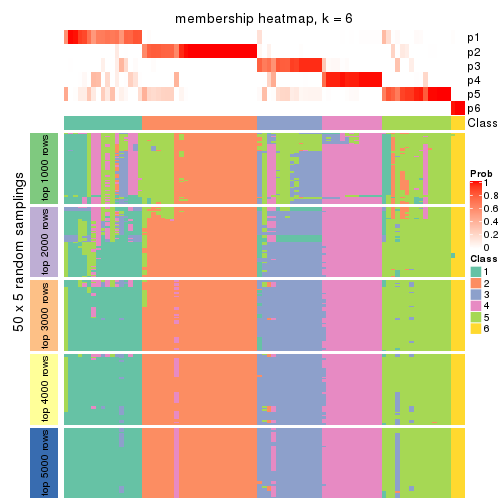</p>

</div>
</div>

As soon as we have had the classes for columns, we can look for signatures
which are significantly different between classes which can be candidate marks
for certain classes. Following are the heatmaps for signatures.


Signature heatmaps where rows are scaled:


<script>
$( function() {
	$( '#tabs-CV-pam-get-signatures' ).tabs();
} );
</script>
<div id='tabs-CV-pam-get-signatures'>
<ul>
<li><a href='#tab-CV-pam-get-signatures-1'>k = 2</a></li>
<li><a href='#tab-CV-pam-get-signatures-2'>k = 3</a></li>
<li><a href='#tab-CV-pam-get-signatures-3'>k = 4</a></li>
<li><a href='#tab-CV-pam-get-signatures-4'>k = 5</a></li>
<li><a href='#tab-CV-pam-get-signatures-5'>k = 6</a></li>
</ul>
<div id='tab-CV-pam-get-signatures-1'>
<pre><code class="r">get_signatures(res, k = 2)
</code></pre>

<p></p>

</div>
<div id='tab-CV-pam-get-signatures-2'>
<pre><code class="r">get_signatures(res, k = 3)
</code></pre>

<p></p>

</div>
<div id='tab-CV-pam-get-signatures-3'>
<pre><code class="r">get_signatures(res, k = 4)
</code></pre>

<p></p>

</div>
<div id='tab-CV-pam-get-signatures-4'>
<pre><code class="r">get_signatures(res, k = 5)
</code></pre>

<p></p>

</div>
<div id='tab-CV-pam-get-signatures-5'>
<pre><code class="r">get_signatures(res, k = 6)
</code></pre>

<p></p>

</div>
</div>


Signature heatmaps where rows are not scaled:


<script>
$( function() {
	$( '#tabs-CV-pam-get-signatures-no-scale' ).tabs();
} );
</script>
<div id='tabs-CV-pam-get-signatures-no-scale'>
<ul>
<li><a href='#tab-CV-pam-get-signatures-no-scale-1'>k = 2</a></li>
<li><a href='#tab-CV-pam-get-signatures-no-scale-2'>k = 3</a></li>
<li><a href='#tab-CV-pam-get-signatures-no-scale-3'>k = 4</a></li>
<li><a href='#tab-CV-pam-get-signatures-no-scale-4'>k = 5</a></li>
<li><a href='#tab-CV-pam-get-signatures-no-scale-5'>k = 6</a></li>
</ul>
<div id='tab-CV-pam-get-signatures-no-scale-1'>
<pre><code class="r">get_signatures(res, k = 2, scale_rows = FALSE)
</code></pre>

<p></p>

</div>
<div id='tab-CV-pam-get-signatures-no-scale-2'>
<pre><code class="r">get_signatures(res, k = 3, scale_rows = FALSE)
</code></pre>

<p></p>

</div>
<div id='tab-CV-pam-get-signatures-no-scale-3'>
<pre><code class="r">get_signatures(res, k = 4, scale_rows = FALSE)
</code></pre>

<p></p>

</div>
<div id='tab-CV-pam-get-signatures-no-scale-4'>
<pre><code class="r">get_signatures(res, k = 5, scale_rows = FALSE)
</code></pre>

<p></p>

</div>
<div id='tab-CV-pam-get-signatures-no-scale-5'>
<pre><code class="r">get_signatures(res, k = 6, scale_rows = FALSE)
</code></pre>

<p>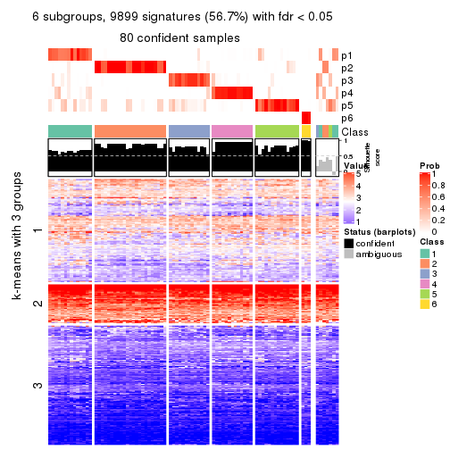</p>

</div>
</div>


Compare the overlap of signatures from different k:

```r
compare_signatures(res)
```


`get_signature()` returns a data frame invisibly. TO get the list of signatures, the function
call should be assigned to a variable explicitly. In following code, if `plot` argument is set
to `FALSE`, no heatmap is plotted while only the differential analysis is performed.

```r
# code only for demonstration
tb = get_signature(res, k = ..., plot = FALSE)
```

An example of the output of `tb` is:

```
#>   which_row         fdr    mean_1    mean_2 scaled_mean_1 scaled_mean_2 km
#> 1        38 0.042760348  8.373488  9.131774    -0.5533452     0.5164555  1
#> 2        40 0.018707592  7.106213  8.469186    -0.6173731     0.5762149  1
#> 3        55 0.019134737 10.221463 11.207825    -0.6159697     0.5749050  1
#> 4        59 0.006059896  5.921854  7.869574    -0.6899429     0.6439467  1
#> 5        60 0.018055526  8.928898 10.211722    -0.6204761     0.5791110  1
#> 6        98 0.009384629 15.714769 14.887706     0.6635654    -0.6193277  2
...
```

The columns in `tb` are:

1. `which_row`: row indices corresponding to the input matrix.
2. `fdr`: FDR for the differential test. 
3. `mean_x`: The mean value in group x.
4. `scaled_mean_x`: The mean value in group x after rows are scaled.
5. `km`: Row groups if k-means clustering is applied to rows.


UMAP plot which shows how samples are separated.


<script>
$( function() {
	$( '#tabs-CV-pam-dimension-reduction' ).tabs();
} );
</script>
<div id='tabs-CV-pam-dimension-reduction'>
<ul>
<li><a href='#tab-CV-pam-dimension-reduction-1'>k = 2</a></li>
<li><a href='#tab-CV-pam-dimension-reduction-2'>k = 3</a></li>
<li><a href='#tab-CV-pam-dimension-reduction-3'>k = 4</a></li>
<li><a href='#tab-CV-pam-dimension-reduction-4'>k = 5</a></li>
<li><a href='#tab-CV-pam-dimension-reduction-5'>k = 6</a></li>
</ul>
<div id='tab-CV-pam-dimension-reduction-1'>
<pre><code class="r">dimension_reduction(res, k = 2, method = &quot;UMAP&quot;)
</code></pre>

<p></p>

</div>
<div id='tab-CV-pam-dimension-reduction-2'>
<pre><code class="r">dimension_reduction(res, k = 3, method = &quot;UMAP&quot;)
</code></pre>

<p></p>

</div>
<div id='tab-CV-pam-dimension-reduction-3'>
<pre><code class="r">dimension_reduction(res, k = 4, method = &quot;UMAP&quot;)
</code></pre>

<p></p>

</div>
<div id='tab-CV-pam-dimension-reduction-4'>
<pre><code class="r">dimension_reduction(res, k = 5, method = &quot;UMAP&quot;)
</code></pre>

<p></p>

</div>
<div id='tab-CV-pam-dimension-reduction-5'>
<pre><code class="r">dimension_reduction(res, k = 6, method = &quot;UMAP&quot;)
</code></pre>

<p></p>

</div>
</div>


Following heatmap shows how subgroups are split when increasing `k`:

```r
collect_classes(res)
```


If matrix rows can be associated to genes, consider to use `functional_enrichment(res,
...)` to perform function enrichment for the signature genes. See [this vignette](http://bioconductor.org/packages/devel/bioc/vignettes/cola/inst/doc/functional_enrichment.html) for more detailed explanations.


 

---------------------------------------------------


### CV:mclust


The object with results only for a single top-value method and a single partition method 
can be extracted as:

```r
res = res_list["CV", "mclust"]
# you can also extract it by
# res = res_list["CV:mclust"]
```

A summary of `res` and all the functions that can be applied to it:

```r
res
```

```
#> A 'ConsensusPartition' object with k = 2, 3, 4, 5, 6.
#>   On a matrix with 17471 rows and 87 columns.
#>   Top rows (1000, 2000, 3000, 4000, 5000) are extracted by 'CV' method.
#>   Subgroups are detected by 'mclust' method.
#>   Performed in total 1250 partitions by row resampling.
#>   Best k for subgroups seems to be 4.
#> 
#> Following methods can be applied to this 'ConsensusPartition' object:
#>  [1] "cola_report"             "collect_classes"         "collect_plots"          
#>  [4] "collect_stats"           "colnames"                "compare_signatures"     
#>  [7] "consensus_heatmap"       "dimension_reduction"     "functional_enrichment"  
#> [10] "get_anno_col"            "get_anno"                "get_classes"            
#> [13] "get_consensus"           "get_matrix"              "get_membership"         
#> [16] "get_param"               "get_signatures"          "get_stats"              
#> [19] "is_best_k"               "is_stable_k"             "membership_heatmap"     
#> [22] "ncol"                    "nrow"                    "plot_ecdf"              
#> [25] "rownames"                "select_partition_number" "show"                   
#> [28] "suggest_best_k"          "test_to_known_factors"
```

`collect_plots()` function collects all the plots made from `res` for all `k` (number of partitions)
into one single page to provide an easy and fast comparison between different `k`.

```r
collect_plots(res)
```


The plots are:

- The first row: a plot of the ECDF (empirical cumulative distribution
  function) curves of the consensus matrix for each `k` and the heatmap of
  predicted classes for each `k`.
- The second row: heatmaps of the consensus matrix for each `k`.
- The third row: heatmaps of the membership matrix for each `k`.
- The fouth row: heatmaps of the signatures for each `k`.

All the plots in panels can be made by individual functions and they are
plotted later in this section.

`select_partition_number()` produces several plots showing different
statistics for choosing "optimized" `k`. There are following statistics:

- ECDF curves of the consensus matrix for each `k`;
- 1-PAC. [The PAC
  score](https://en.wikipedia.org/wiki/Consensus_clustering#Over-interpretation_potential_of_consensus_clustering)
  measures the proportion of the ambiguous subgrouping.
- Mean silhouette score.
- Concordance. The mean probability of fiting the consensus class ids in all
  partitions.
- Area increased. Denote $A_k$ as the area under the ECDF curve for current
  `k`, the area increased is defined as $A_k - A_{k-1}$.
- Rand index. The percent of pairs of samples that are both in a same cluster
  or both are not in a same cluster in the partition of k and k-1.
- Jaccard index. The ratio of pairs of samples are both in a same cluster in
  the partition of k and k-1 and the pairs of samples are both in a same
  cluster in the partition k or k-1.

The detailed explanations of these statistics can be found in [the _cola_
vignette](http://bioconductor.org/packages/devel/bioc/vignettes/cola/inst/doc/cola.html#toc_13).

Generally speaking, lower PAC score, higher mean silhouette score or higher
concordance corresponds to better partition. Rand index and Jaccard index
measure how similar the current partition is compared to partition with `k-1`.
If they are too similar, we won't accept `k` is better than `k-1`.

```r
select_partition_number(res)
```


The numeric values for all these statistics can be obtained by `get_stats()`.

```r
get_stats(res)
```

```
#>   k 1-PAC mean_silhouette concordance area_increased  Rand Jaccard
#> 2 2 0.351           0.604       0.840         0.4364 0.518   0.518
#> 3 3 0.496           0.729       0.834         0.4181 0.628   0.404
#> 4 4 0.743           0.816       0.902         0.1504 0.818   0.552
#> 5 5 0.716           0.592       0.788         0.0838 0.885   0.608
#> 6 6 0.766           0.698       0.846         0.0560 0.926   0.670
```

`suggest_best_k()` suggests the best $k$ based on these statistics. The rules are as follows:

- All $k$ with Jaccard index larger than 0.95 are removed because increasing
  $k$ does not provide enough extra information. If all $k$ are removed, it is
  marked as no subgroup is detected.
- For all $k$ with 1-PAC score larger than 0.9, the maximal $k$ is taken as
  the best $k$, and other $k$ are marked as optional $k$.
- If it does not fit the second rule. The $k$ with the maximal vote of the
  highest 1-PAC score, highest mean silhouette, and highest concordance is
  taken as the best $k$.

```r
suggest_best_k(res)
```

```
#> [1] 4
```


Following shows the table of the partitions (You need to click the **show/hide
code output** link to see it). The membership matrix (columns with name `p*`)
is inferred by
[`clue::cl_consensus()`](https://www.rdocumentation.org/link/cl_consensus?package=clue)
function with the `SE` method. Basically the value in the membership matrix
represents the probability to belong to a certain group. The finall class
label for an item is determined with the group with highest probability it
belongs to.

In `get_classes()` function, the entropy is calculated from the membership
matrix and the silhouette score is calculated from the consensus matrix.


<script>
$( function() {
	$( '#tabs-CV-mclust-get-classes' ).tabs();
} );
</script>
<div id='tabs-CV-mclust-get-classes'>
<ul>
<li><a href='#tab-CV-mclust-get-classes-1'>k = 2</a></li>
<li><a href='#tab-CV-mclust-get-classes-2'>k = 3</a></li>
<li><a href='#tab-CV-mclust-get-classes-3'>k = 4</a></li>
<li><a href='#tab-CV-mclust-get-classes-4'>k = 5</a></li>
<li><a href='#tab-CV-mclust-get-classes-5'>k = 6</a></li>
</ul>

<div id='tab-CV-mclust-get-classes-1'>
<p><a id='tab-CV-mclust-get-classes-1-a' style='color:#0366d6' href='#'>show/hide code output</a></p>
<pre><code class="r">cbind(get_classes(res, k = 2), get_membership(res, k = 2))
</code></pre>

<pre><code>#&gt;                                      class entropy silhouette    p1    p2
#&gt; E6088A41-B0DC-4FBF-8D14-BE78024CF8CD     2  0.9944      0.162 0.456 0.544
#&gt; F569915C-8F77-4D67-9730-30824DB57EE5     2  0.9993      0.054 0.484 0.516
#&gt; E3B71CB7-673B-4741-8607-4F0A11633036     1  0.0000      0.786 1.000 0.000
#&gt; DAF84798-FE3F-403C-B589-7F256AF752BE     1  0.8499      0.553 0.724 0.276
#&gt; 2F38E3B1-4975-4877-9DCC-C00270602180     1  0.0000      0.786 1.000 0.000
#&gt; C79A4C2F-02C4-4C03-A5A5-DE06802EEB57     1  0.9970      0.110 0.532 0.468
#&gt; 92E3ED8F-5C74-4ED2-9B03-9FA5E7B491D6     1  0.0000      0.786 1.000 0.000
#&gt; E61D60BE-3BD3-4B5E-BC12-80F3684A0959     1  0.0000      0.786 1.000 0.000
#&gt; C9388FC7-DB1D-4416-BC2D-EA643584F1E6     2  0.6887      0.697 0.184 0.816
#&gt; D4219360-6344-4AF3-ACEB-1701A9F1F67D     1  0.0000      0.786 1.000 0.000
#&gt; 07D155E6-F27C-4D09-B786-8A9B71147B72     1  0.0000      0.786 1.000 0.000
#&gt; 10C8C361-85A5-40E8-A395-B92623E6F27C     1  0.0000      0.786 1.000 0.000
#&gt; BDF20891-7C98-4A55-BBF3-8A836BE303C6     2  0.7056      0.688 0.192 0.808
#&gt; 694B0504-095E-431A-84F2-B4387072138E     1  0.0000      0.786 1.000 0.000
#&gt; EDCF8E7F-8B1D-46F7-8AE0-84A1DC9647D2     2  0.8555      0.591 0.280 0.720
#&gt; 0EA8288E-824D-4304-A053-5A833361F5C5     1  0.0000      0.786 1.000 0.000
#&gt; C4ACCFA1-34A9-4F61-8A1F-35B3B60EA193     1  0.0000      0.786 1.000 0.000
#&gt; 760BA639-38AC-4BC9-9647-09F6893EA8ED     1  0.0000      0.786 1.000 0.000
#&gt; 082DFC6B-C6E6-48B9-BDE5-74FF3B3DC954     2  0.9922      0.188 0.448 0.552
#&gt; FE349848-D7C4-4C49-B670-0E20454DDD7E     1  0.8909      0.507 0.692 0.308
#&gt; 2E8937B3-9EA1-4528-8CEE-BF3D4137908A     2  0.7056      0.685 0.192 0.808
#&gt; 9942D04E-2767-4E39-BA16-7762EAC3DFC4     2  0.0376      0.751 0.004 0.996
#&gt; F9C23182-91C4-4145-AE52-526FE8EB199D     2  0.9661      0.374 0.392 0.608
#&gt; 01024EED-7811-4E24-A067-8E0B978FFE2D     2  0.4298      0.740 0.088 0.912
#&gt; 932C8E98-A352-409C-8744-3D49FABCE425     1  0.0000      0.786 1.000 0.000
#&gt; 6DFD9439-C659-4936-84E5-108F717E3E4D     1  0.9963      0.126 0.536 0.464
#&gt; 1D8B83B8-5DD7-4F45-9D59-487EC6906A8B     2  0.9881      0.223 0.436 0.564
#&gt; 804B8503-73F6-42DE-835F-39DE2C9F13E1     2  0.0000      0.750 0.000 1.000
#&gt; B9453C9B-84D5-43BD-85BB-1780F02F039C     1  0.0000      0.786 1.000 0.000
#&gt; 836E6CD6-4E88-4028-9844-FA3C892C254A     1  0.8909      0.507 0.692 0.308
#&gt; 36EDD202-A845-4CE7-95D5-A515C471262E     2  0.1633      0.752 0.024 0.976
#&gt; 181C156A-B8F4-4F9D-93AA-6AFBD197644D     2  0.9323      0.484 0.348 0.652
#&gt; 0580E798-6A98-4E46-AC96-9A869DFF502E     1  0.0000      0.786 1.000 0.000
#&gt; EA1B63CF-D389-4567-8D9E-B0EF1F804598     1  0.9491      0.396 0.632 0.368
#&gt; 5ABC3D06-B8E9-4831-B89B-7C1EC4006B47     2  0.0000      0.750 0.000 1.000
#&gt; 1CC01E74-A7C1-4A51-9E28-1703C352BE16     2  0.0000      0.750 0.000 1.000
#&gt; 97E55B75-DBDB-46BC-9E74-7828C070BF16     2  0.0938      0.752 0.012 0.988
#&gt; BEB37A2D-E8B0-4674-89AC-DC0F34E0AFD6     1  0.1633      0.774 0.976 0.024
#&gt; 558648BA-6551-4D34-97C2-AD5F677D63FB     1  0.0000      0.786 1.000 0.000
#&gt; FF7021BB-414B-4466-BC43-372D856E6A1D     1  0.9933      0.169 0.548 0.452
#&gt; 9C04B840-54E0-425D-BDBE-8CB6B9C2C722     2  0.0938      0.752 0.012 0.988
#&gt; 5F50B1F4-1A02-4506-AA6D-9BF21CD8059A     1  0.0000      0.786 1.000 0.000
#&gt; 7D4B8FF3-7977-4ABD-AE04-EED1C50B23CC     2  0.6247      0.712 0.156 0.844
#&gt; A005AF15-B98E-4623-8AD4-1E69EFA9BC7A     1  0.0000      0.786 1.000 0.000
#&gt; 1DF04345-5C93-4B18-B307-8D1FCA532999     2  0.9000      0.534 0.316 0.684
#&gt; 6AF30C18-347E-41ED-A4AB-6F81F42206C5     1  0.0000      0.786 1.000 0.000
#&gt; 88A44ED0-BDE1-401E-B0E1-D8C8D6DBAEFC     2  0.9866      0.233 0.432 0.568
#&gt; 117673A3-2918-4702-8583-B66ADE6E4338     2  0.5737      0.724 0.136 0.864
#&gt; 4903A571-E14D-43C9-A737-22CAFAC414CD     1  0.9552      0.382 0.624 0.376
#&gt; C175E68E-632A-4B4A-9DDB-4895C4760F20     1  0.0376      0.784 0.996 0.004
#&gt; FA5CA2F4-A1AD-4A79-B8F3-73A976EB2FB1     2  0.9491      0.396 0.368 0.632
#&gt; E1F883A7-8B1F-4C1D-8A1A-9749A9C09845     2  0.9170      0.508 0.332 0.668
#&gt; E74F0729-6000-4908-ADB0-7BDBAC0639E6     1  0.0000      0.786 1.000 0.000
#&gt; F92135A9-1981-4C79-99A5-4243EEC5D30D     2  0.3114      0.747 0.056 0.944
#&gt; 73C6919F-DEB4-4DA4-B4AE-4032AC8F96C5     1  0.0000      0.786 1.000 0.000
#&gt; 33977B40-2E92-48B6-8D3A-3EBE913F6F8A     1  0.8713      0.531 0.708 0.292
#&gt; 490BD607-2F08-4B4C-9612-F9BB5CBBC8BB     1  0.9954      0.142 0.540 0.460
#&gt; 6C666E17-2EB8-4244-BCC1-8DD34EE4173E     1  0.9129      0.477 0.672 0.328
#&gt; C41F3064-4483-4796-B860-82155BAA5157     1  0.0000      0.786 1.000 0.000
#&gt; F4232B90-51B9-43EE-9971-35B3A318758F     1  0.0000      0.786 1.000 0.000
#&gt; 291EA1F6-FC56-4429-A433-0C452A6A514C     2  0.0000      0.750 0.000 1.000
#&gt; CC4AF04D-CB8E-40DD-B12E-7AA39B38262A     2  0.0000      0.750 0.000 1.000
#&gt; 4DAE26B9-AB57-4763-BB9A-2ADDD5D9C007     1  0.5294      0.712 0.880 0.120
#&gt; 676B4AEE-FB41-4C16-AA91-03E4A1DA8E26     1  0.6623      0.669 0.828 0.172
#&gt; 1CC36859-357A-49E0-A367-4F57D47288BA     1  0.9944      0.156 0.544 0.456
#&gt; 7CCDDFC8-6DF6-4734-96AC-19EBC464FC50     2  0.0000      0.750 0.000 1.000
#&gt; 10F38C34-3956-48ED-AB62-3439EF00D46B     1  0.9710      0.323 0.600 0.400
#&gt; 80B2B393-9D6E-45B4-B696-2A5C203543B7     2  0.9815      0.325 0.420 0.580
#&gt; 5AC7B5EA-1AAC-4529-8E5A-F612E5E0719A     1  0.0000      0.786 1.000 0.000
#&gt; 3648E98D-4B3A-41B7-BE05-595D44F0150D     1  0.0000      0.786 1.000 0.000
#&gt; 252EC850-6026-473B-8FFC-2CF567EF42E4     1  0.0000      0.786 1.000 0.000
#&gt; 1790E7A3-99D8-447E-BC50-51C8A4A18853     2  0.0000      0.750 0.000 1.000
#&gt; DA61A4F8-350B-4DD1-A240-AD016520DB5B     1  0.9944      0.156 0.544 0.456
#&gt; 767E5BAF-2515-40D7-AE7D-0B24D77A03F4     1  0.9580      0.373 0.620 0.380
#&gt; 8CB9C903-D749-44EA-9137-7FB5A92C5932     1  0.4690      0.727 0.900 0.100
#&gt; A9B968AE-2243-41BC-852A-3A12C1FB4892     1  0.0000      0.786 1.000 0.000
#&gt; 3C582264-85BC-4569-A888-8EB3008E5198     2  0.0000      0.750 0.000 1.000
#&gt; F4EAF9A2-9938-4D9B-9080-C0A7542D5704     2  0.0000      0.750 0.000 1.000
#&gt; 328499D3-45DD-4B66-BD22-3C52BA92C2BB     1  0.0000      0.786 1.000 0.000
#&gt; AF8AB83D-2917-4752-8C38-CF84C565B565     1  0.0000      0.786 1.000 0.000
#&gt; 03A327CA-A9FE-42A4-844D-CA85206969FC     1  0.9866      0.235 0.568 0.432
#&gt; 4B0BEC44-87BB-4014-9A26-3529DD63760B     1  0.8909      0.509 0.692 0.308
#&gt; 05C7843E-DC89-4D8E-A78A-952C5DFD667B     1  0.9896      0.210 0.560 0.440
#&gt; 29A0FFF9-13D3-4D16-BE6A-8E48A2C4E315     2  0.0000      0.750 0.000 1.000
#&gt; 22947CC3-4F42-4F44-899C-2B7085E36C9D     2  0.9944      0.162 0.456 0.544
#&gt; A247D92D-253A-4BEC-B450-184AF90D17D0     1  0.9170      0.470 0.668 0.332
#&gt; 0D907A63-D23F-4684-80D9-0BA552435B86     1  0.0000      0.786 1.000 0.000
</code></pre>

<script>
$('#tab-CV-mclust-get-classes-1-a').parent().next().next().hide();
$('#tab-CV-mclust-get-classes-1-a').click(function(){
  $('#tab-CV-mclust-get-classes-1-a').parent().next().next().toggle();
  return(false);
});
</script>
</div>

<div id='tab-CV-mclust-get-classes-2'>
<p><a id='tab-CV-mclust-get-classes-2-a' style='color:#0366d6' href='#'>show/hide code output</a></p>
<pre><code class="r">cbind(get_classes(res, k = 3), get_membership(res, k = 3))
</code></pre>

<pre><code>#&gt;                                      class entropy silhouette    p1    p2    p3
#&gt; E6088A41-B0DC-4FBF-8D14-BE78024CF8CD     3  0.0237     0.8541 0.000 0.004 0.996
#&gt; F569915C-8F77-4D67-9730-30824DB57EE5     3  0.0237     0.8541 0.000 0.004 0.996
#&gt; E3B71CB7-673B-4741-8607-4F0A11633036     1  0.5305     0.8005 0.788 0.020 0.192
#&gt; DAF84798-FE3F-403C-B589-7F256AF752BE     3  0.4963     0.6823 0.200 0.008 0.792
#&gt; 2F38E3B1-4975-4877-9DCC-C00270602180     1  0.5305     0.8005 0.788 0.020 0.192
#&gt; C79A4C2F-02C4-4C03-A5A5-DE06802EEB57     3  0.2681     0.8331 0.028 0.040 0.932
#&gt; 92E3ED8F-5C74-4ED2-9B03-9FA5E7B491D6     1  0.5305     0.8005 0.788 0.020 0.192
#&gt; E61D60BE-3BD3-4B5E-BC12-80F3684A0959     1  0.2804     0.7876 0.924 0.060 0.016
#&gt; C9388FC7-DB1D-4416-BC2D-EA643584F1E6     3  0.6737     0.4574 0.040 0.272 0.688
#&gt; D4219360-6344-4AF3-ACEB-1701A9F1F67D     1  0.5305     0.8005 0.788 0.020 0.192
#&gt; 07D155E6-F27C-4D09-B786-8A9B71147B72     1  0.2804     0.7876 0.924 0.060 0.016
#&gt; 10C8C361-85A5-40E8-A395-B92623E6F27C     1  0.5503     0.7957 0.772 0.020 0.208
#&gt; BDF20891-7C98-4A55-BBF3-8A836BE303C6     2  0.9786     0.1897 0.364 0.400 0.236
#&gt; 694B0504-095E-431A-84F2-B4387072138E     1  0.5305     0.8005 0.788 0.020 0.192
#&gt; EDCF8E7F-8B1D-46F7-8AE0-84A1DC9647D2     3  0.6142     0.5969 0.040 0.212 0.748
#&gt; 0EA8288E-824D-4304-A053-5A833361F5C5     1  0.2492     0.7878 0.936 0.048 0.016
#&gt; C4ACCFA1-34A9-4F61-8A1F-35B3B60EA193     1  0.5305     0.8005 0.788 0.020 0.192
#&gt; 760BA639-38AC-4BC9-9647-09F6893EA8ED     1  0.5305     0.8005 0.788 0.020 0.192
#&gt; 082DFC6B-C6E6-48B9-BDE5-74FF3B3DC954     3  0.0237     0.8541 0.000 0.004 0.996
#&gt; FE349848-D7C4-4C49-B670-0E20454DDD7E     3  0.0000     0.8538 0.000 0.000 1.000
#&gt; 2E8937B3-9EA1-4528-8CEE-BF3D4137908A     1  0.8128     0.1360 0.492 0.440 0.068
#&gt; 9942D04E-2767-4E39-BA16-7762EAC3DFC4     2  0.5397     0.7138 0.000 0.720 0.280
#&gt; F9C23182-91C4-4145-AE52-526FE8EB199D     3  0.8448     0.4765 0.164 0.220 0.616
#&gt; 01024EED-7811-4E24-A067-8E0B978FFE2D     2  0.6000     0.7840 0.040 0.760 0.200
#&gt; 932C8E98-A352-409C-8744-3D49FABCE425     1  0.5305     0.8005 0.788 0.020 0.192
#&gt; 6DFD9439-C659-4936-84E5-108F717E3E4D     3  0.3155     0.8242 0.044 0.040 0.916
#&gt; 1D8B83B8-5DD7-4F45-9D59-487EC6906A8B     3  0.0892     0.8497 0.000 0.020 0.980
#&gt; 804B8503-73F6-42DE-835F-39DE2C9F13E1     2  0.2261     0.8464 0.000 0.932 0.068
#&gt; B9453C9B-84D5-43BD-85BB-1780F02F039C     1  0.5092     0.8067 0.804 0.020 0.176
#&gt; 836E6CD6-4E88-4028-9844-FA3C892C254A     3  0.0892     0.8460 0.020 0.000 0.980
#&gt; 36EDD202-A845-4CE7-95D5-A515C471262E     2  0.6518     0.2815 0.004 0.512 0.484
#&gt; 181C156A-B8F4-4F9D-93AA-6AFBD197644D     1  0.7953     0.3416 0.564 0.368 0.068
#&gt; 0580E798-6A98-4E46-AC96-9A869DFF502E     1  0.2703     0.7879 0.928 0.056 0.016
#&gt; EA1B63CF-D389-4567-8D9E-B0EF1F804598     3  0.5581     0.6934 0.176 0.036 0.788
#&gt; 5ABC3D06-B8E9-4831-B89B-7C1EC4006B47     2  0.3752     0.8331 0.000 0.856 0.144
#&gt; 1CC01E74-A7C1-4A51-9E28-1703C352BE16     2  0.2711     0.8482 0.000 0.912 0.088
#&gt; 97E55B75-DBDB-46BC-9E74-7828C070BF16     2  0.5804     0.7918 0.088 0.800 0.112
#&gt; BEB37A2D-E8B0-4674-89AC-DC0F34E0AFD6     1  0.3120     0.7810 0.908 0.012 0.080
#&gt; 558648BA-6551-4D34-97C2-AD5F677D63FB     1  0.6255     0.7961 0.748 0.048 0.204
#&gt; FF7021BB-414B-4466-BC43-372D856E6A1D     3  0.2383     0.8370 0.044 0.016 0.940
#&gt; 9C04B840-54E0-425D-BDBE-8CB6B9C2C722     2  0.6215     0.4440 0.000 0.572 0.428
#&gt; 5F50B1F4-1A02-4506-AA6D-9BF21CD8059A     1  0.2492     0.7878 0.936 0.048 0.016
#&gt; 7D4B8FF3-7977-4ABD-AE04-EED1C50B23CC     3  0.6188     0.5905 0.040 0.216 0.744
#&gt; A005AF15-B98E-4623-8AD4-1E69EFA9BC7A     1  0.2703     0.7879 0.928 0.056 0.016
#&gt; 1DF04345-5C93-4B18-B307-8D1FCA532999     1  0.8140     0.0797 0.476 0.456 0.068
#&gt; 6AF30C18-347E-41ED-A4AB-6F81F42206C5     1  0.5253     0.8013 0.792 0.020 0.188
#&gt; 88A44ED0-BDE1-401E-B0E1-D8C8D6DBAEFC     3  0.0424     0.8536 0.000 0.008 0.992
#&gt; 117673A3-2918-4702-8583-B66ADE6E4338     3  0.6482     0.5372 0.040 0.244 0.716
#&gt; 4903A571-E14D-43C9-A737-22CAFAC414CD     3  0.2774     0.8233 0.072 0.008 0.920
#&gt; C175E68E-632A-4B4A-9DDB-4895C4760F20     1  0.5305     0.8005 0.788 0.020 0.192
#&gt; FA5CA2F4-A1AD-4A79-B8F3-73A976EB2FB1     3  0.7708     0.0492 0.048 0.424 0.528
#&gt; E1F883A7-8B1F-4C1D-8A1A-9749A9C09845     1  0.8046     0.2699 0.536 0.396 0.068
#&gt; E74F0729-6000-4908-ADB0-7BDBAC0639E6     1  0.5305     0.8005 0.788 0.020 0.192
#&gt; F92135A9-1981-4C79-99A5-4243EEC5D30D     2  0.4555     0.7962 0.000 0.800 0.200
#&gt; 73C6919F-DEB4-4DA4-B4AE-4032AC8F96C5     1  0.4883     0.7974 0.788 0.004 0.208
#&gt; 33977B40-2E92-48B6-8D3A-3EBE913F6F8A     3  0.5397     0.4750 0.280 0.000 0.720
#&gt; 490BD607-2F08-4B4C-9612-F9BB5CBBC8BB     3  0.0000     0.8538 0.000 0.000 1.000
#&gt; 6C666E17-2EB8-4244-BCC1-8DD34EE4173E     3  0.5363     0.4647 0.276 0.000 0.724
#&gt; C41F3064-4483-4796-B860-82155BAA5157     1  0.2703     0.7879 0.928 0.056 0.016
#&gt; F4232B90-51B9-43EE-9971-35B3A318758F     1  0.5792     0.8017 0.772 0.036 0.192
#&gt; 291EA1F6-FC56-4429-A433-0C452A6A514C     2  0.3715     0.8397 0.004 0.868 0.128
#&gt; CC4AF04D-CB8E-40DD-B12E-7AA39B38262A     2  0.2261     0.8464 0.000 0.932 0.068
#&gt; 4DAE26B9-AB57-4763-BB9A-2ADDD5D9C007     1  0.3207     0.7770 0.904 0.012 0.084
#&gt; 676B4AEE-FB41-4C16-AA91-03E4A1DA8E26     1  0.4915     0.6883 0.804 0.012 0.184
#&gt; 1CC36859-357A-49E0-A367-4F57D47288BA     3  0.0237     0.8541 0.000 0.004 0.996
#&gt; 7CCDDFC8-6DF6-4734-96AC-19EBC464FC50     2  0.2261     0.8464 0.000 0.932 0.068
#&gt; 10F38C34-3956-48ED-AB62-3439EF00D46B     3  0.0424     0.8526 0.008 0.000 0.992
#&gt; 80B2B393-9D6E-45B4-B696-2A5C203543B7     1  0.8068     0.4324 0.596 0.316 0.088
#&gt; 5AC7B5EA-1AAC-4529-8E5A-F612E5E0719A     1  0.2599     0.7881 0.932 0.052 0.016
#&gt; 3648E98D-4B3A-41B7-BE05-595D44F0150D     1  0.5305     0.8005 0.788 0.020 0.192
#&gt; 252EC850-6026-473B-8FFC-2CF567EF42E4     1  0.2492     0.7878 0.936 0.048 0.016
#&gt; 1790E7A3-99D8-447E-BC50-51C8A4A18853     2  0.2261     0.8464 0.000 0.932 0.068
#&gt; DA61A4F8-350B-4DD1-A240-AD016520DB5B     3  0.0000     0.8538 0.000 0.000 1.000
#&gt; 767E5BAF-2515-40D7-AE7D-0B24D77A03F4     3  0.0424     0.8526 0.008 0.000 0.992
#&gt; 8CB9C903-D749-44EA-9137-7FB5A92C5932     1  0.4575     0.7877 0.828 0.012 0.160
#&gt; A9B968AE-2243-41BC-852A-3A12C1FB4892     1  0.2804     0.7876 0.924 0.060 0.016
#&gt; 3C582264-85BC-4569-A888-8EB3008E5198     2  0.2261     0.8464 0.000 0.932 0.068
#&gt; F4EAF9A2-9938-4D9B-9080-C0A7542D5704     2  0.2711     0.8482 0.000 0.912 0.088
#&gt; 328499D3-45DD-4B66-BD22-3C52BA92C2BB     1  0.5305     0.8005 0.788 0.020 0.192
#&gt; AF8AB83D-2917-4752-8C38-CF84C565B565     1  0.2492     0.7878 0.936 0.048 0.016
#&gt; 03A327CA-A9FE-42A4-844D-CA85206969FC     3  0.0424     0.8526 0.008 0.000 0.992
#&gt; 4B0BEC44-87BB-4014-9A26-3529DD63760B     3  0.0592     0.8530 0.012 0.000 0.988
#&gt; 05C7843E-DC89-4D8E-A78A-952C5DFD667B     3  0.0000     0.8538 0.000 0.000 1.000
#&gt; 29A0FFF9-13D3-4D16-BE6A-8E48A2C4E315     2  0.2261     0.8464 0.000 0.932 0.068
#&gt; 22947CC3-4F42-4F44-899C-2B7085E36C9D     3  0.1411     0.8350 0.000 0.036 0.964
#&gt; A247D92D-253A-4BEC-B450-184AF90D17D0     3  0.0237     0.8537 0.004 0.000 0.996
#&gt; 0D907A63-D23F-4684-80D9-0BA552435B86     1  0.2804     0.7876 0.924 0.060 0.016
</code></pre>

<script>
$('#tab-CV-mclust-get-classes-2-a').parent().next().next().hide();
$('#tab-CV-mclust-get-classes-2-a').click(function(){
  $('#tab-CV-mclust-get-classes-2-a').parent().next().next().toggle();
  return(false);
});
</script>
</div>

<div id='tab-CV-mclust-get-classes-3'>
<p><a id='tab-CV-mclust-get-classes-3-a' style='color:#0366d6' href='#'>show/hide code output</a></p>
<pre><code class="r">cbind(get_classes(res, k = 4), get_membership(res, k = 4))
</code></pre>

<pre><code>#&gt;                                      class entropy silhouette    p1    p2    p3    p4
#&gt; E6088A41-B0DC-4FBF-8D14-BE78024CF8CD     3  0.0376     0.9134 0.004 0.004 0.992 0.000
#&gt; F569915C-8F77-4D67-9730-30824DB57EE5     3  0.0000     0.9140 0.000 0.000 1.000 0.000
#&gt; E3B71CB7-673B-4741-8607-4F0A11633036     1  0.0188     0.9087 0.996 0.000 0.000 0.004
#&gt; DAF84798-FE3F-403C-B589-7F256AF752BE     3  0.2976     0.8165 0.120 0.000 0.872 0.008
#&gt; 2F38E3B1-4975-4877-9DCC-C00270602180     1  0.0336     0.9079 0.992 0.000 0.000 0.008
#&gt; C79A4C2F-02C4-4C03-A5A5-DE06802EEB57     3  0.0524     0.9130 0.008 0.004 0.988 0.000
#&gt; 92E3ED8F-5C74-4ED2-9B03-9FA5E7B491D6     1  0.0188     0.9087 0.996 0.000 0.000 0.004
#&gt; E61D60BE-3BD3-4B5E-BC12-80F3684A0959     4  0.1824     0.8683 0.004 0.060 0.000 0.936
#&gt; C9388FC7-DB1D-4416-BC2D-EA643584F1E6     3  0.3975     0.6175 0.000 0.240 0.760 0.000
#&gt; D4219360-6344-4AF3-ACEB-1701A9F1F67D     1  0.0188     0.9087 0.996 0.000 0.000 0.004
#&gt; 07D155E6-F27C-4D09-B786-8A9B71147B72     4  0.0895     0.8901 0.020 0.000 0.004 0.976
#&gt; 10C8C361-85A5-40E8-A395-B92623E6F27C     1  0.3306     0.7755 0.840 0.000 0.156 0.004
#&gt; BDF20891-7C98-4A55-BBF3-8A836BE303C6     2  0.4936     0.5425 0.000 0.624 0.372 0.004
#&gt; 694B0504-095E-431A-84F2-B4387072138E     1  0.1816     0.8948 0.948 0.024 0.004 0.024
#&gt; EDCF8E7F-8B1D-46F7-8AE0-84A1DC9647D2     3  0.1209     0.9014 0.004 0.032 0.964 0.000
#&gt; 0EA8288E-824D-4304-A053-5A833361F5C5     4  0.0188     0.8990 0.000 0.000 0.004 0.996
#&gt; C4ACCFA1-34A9-4F61-8A1F-35B3B60EA193     1  0.1733     0.8936 0.948 0.028 0.000 0.024
#&gt; 760BA639-38AC-4BC9-9647-09F6893EA8ED     1  0.0188     0.9087 0.996 0.000 0.000 0.004
#&gt; 082DFC6B-C6E6-48B9-BDE5-74FF3B3DC954     3  0.0000     0.9140 0.000 0.000 1.000 0.000
#&gt; FE349848-D7C4-4C49-B670-0E20454DDD7E     3  0.0000     0.9140 0.000 0.000 1.000 0.000
#&gt; 2E8937B3-9EA1-4528-8CEE-BF3D4137908A     2  0.3978     0.8734 0.000 0.836 0.108 0.056
#&gt; 9942D04E-2767-4E39-BA16-7762EAC3DFC4     2  0.4040     0.7683 0.000 0.752 0.248 0.000
#&gt; F9C23182-91C4-4145-AE52-526FE8EB199D     3  0.1970     0.8780 0.008 0.060 0.932 0.000
#&gt; 01024EED-7811-4E24-A067-8E0B978FFE2D     2  0.6286     0.7007 0.000 0.660 0.140 0.200
#&gt; 932C8E98-A352-409C-8744-3D49FABCE425     1  0.0336     0.9076 0.992 0.000 0.000 0.008
#&gt; 6DFD9439-C659-4936-84E5-108F717E3E4D     3  0.1256     0.9030 0.008 0.028 0.964 0.000
#&gt; 1D8B83B8-5DD7-4F45-9D59-487EC6906A8B     3  0.0376     0.9134 0.004 0.004 0.992 0.000
#&gt; 804B8503-73F6-42DE-835F-39DE2C9F13E1     2  0.2081     0.8904 0.000 0.916 0.084 0.000
#&gt; B9453C9B-84D5-43BD-85BB-1780F02F039C     1  0.8365     0.3567 0.496 0.084 0.108 0.312
#&gt; 836E6CD6-4E88-4028-9844-FA3C892C254A     3  0.0188     0.9136 0.000 0.000 0.996 0.004
#&gt; 36EDD202-A845-4CE7-95D5-A515C471262E     3  0.4999    -0.1740 0.000 0.492 0.508 0.000
#&gt; 181C156A-B8F4-4F9D-93AA-6AFBD197644D     2  0.3292     0.8221 0.004 0.880 0.036 0.080
#&gt; 0580E798-6A98-4E46-AC96-9A869DFF502E     4  0.0188     0.8991 0.004 0.000 0.000 0.996
#&gt; EA1B63CF-D389-4567-8D9E-B0EF1F804598     3  0.1362     0.9045 0.012 0.020 0.964 0.004
#&gt; 5ABC3D06-B8E9-4831-B89B-7C1EC4006B47     2  0.2530     0.8879 0.000 0.888 0.112 0.000
#&gt; 1CC01E74-A7C1-4A51-9E28-1703C352BE16     2  0.2281     0.8915 0.000 0.904 0.096 0.000
#&gt; 97E55B75-DBDB-46BC-9E74-7828C070BF16     2  0.2868     0.8774 0.000 0.864 0.136 0.000
#&gt; BEB37A2D-E8B0-4674-89AC-DC0F34E0AFD6     3  0.5780    -0.0237 0.028 0.000 0.496 0.476
#&gt; 558648BA-6551-4D34-97C2-AD5F677D63FB     4  0.5710     0.6208 0.008 0.060 0.228 0.704
#&gt; FF7021BB-414B-4466-BC43-372D856E6A1D     3  0.0336     0.9131 0.000 0.008 0.992 0.000
#&gt; 9C04B840-54E0-425D-BDBE-8CB6B9C2C722     2  0.4843     0.4838 0.000 0.604 0.396 0.000
#&gt; 5F50B1F4-1A02-4506-AA6D-9BF21CD8059A     4  0.0188     0.8991 0.004 0.000 0.000 0.996
#&gt; 7D4B8FF3-7977-4ABD-AE04-EED1C50B23CC     3  0.1305     0.8990 0.004 0.036 0.960 0.000
#&gt; A005AF15-B98E-4623-8AD4-1E69EFA9BC7A     4  0.0188     0.8991 0.004 0.000 0.000 0.996
#&gt; 1DF04345-5C93-4B18-B307-8D1FCA532999     2  0.3286     0.8319 0.000 0.876 0.044 0.080
#&gt; 6AF30C18-347E-41ED-A4AB-6F81F42206C5     1  0.4072     0.6688 0.748 0.000 0.000 0.252
#&gt; 88A44ED0-BDE1-401E-B0E1-D8C8D6DBAEFC     3  0.1389     0.8845 0.000 0.048 0.952 0.000
#&gt; 117673A3-2918-4702-8583-B66ADE6E4338     3  0.1398     0.8962 0.004 0.040 0.956 0.000
#&gt; 4903A571-E14D-43C9-A737-22CAFAC414CD     3  0.0336     0.9128 0.000 0.000 0.992 0.008
#&gt; C175E68E-632A-4B4A-9DDB-4895C4760F20     1  0.0336     0.9076 0.992 0.000 0.000 0.008
#&gt; FA5CA2F4-A1AD-4A79-B8F3-73A976EB2FB1     3  0.4697     0.3339 0.000 0.356 0.644 0.000
#&gt; E1F883A7-8B1F-4C1D-8A1A-9749A9C09845     2  0.3107     0.8242 0.000 0.884 0.036 0.080
#&gt; E74F0729-6000-4908-ADB0-7BDBAC0639E6     1  0.0188     0.9087 0.996 0.000 0.000 0.004
#&gt; F92135A9-1981-4C79-99A5-4243EEC5D30D     2  0.2868     0.8774 0.000 0.864 0.136 0.000
#&gt; 73C6919F-DEB4-4DA4-B4AE-4032AC8F96C5     1  0.5212     0.6998 0.740 0.000 0.192 0.068
#&gt; 33977B40-2E92-48B6-8D3A-3EBE913F6F8A     3  0.1004     0.9018 0.024 0.000 0.972 0.004
#&gt; 490BD607-2F08-4B4C-9612-F9BB5CBBC8BB     3  0.0000     0.9140 0.000 0.000 1.000 0.000
#&gt; 6C666E17-2EB8-4244-BCC1-8DD34EE4173E     3  0.0336     0.9129 0.000 0.000 0.992 0.008
#&gt; C41F3064-4483-4796-B860-82155BAA5157     4  0.0817     0.8892 0.024 0.000 0.000 0.976
#&gt; F4232B90-51B9-43EE-9971-35B3A318758F     1  0.2011     0.8715 0.920 0.000 0.000 0.080
#&gt; 291EA1F6-FC56-4429-A433-0C452A6A514C     2  0.2345     0.8910 0.000 0.900 0.100 0.000
#&gt; CC4AF04D-CB8E-40DD-B12E-7AA39B38262A     2  0.2081     0.8904 0.000 0.916 0.084 0.000
#&gt; 4DAE26B9-AB57-4763-BB9A-2ADDD5D9C007     4  0.5498     0.2745 0.020 0.000 0.404 0.576
#&gt; 676B4AEE-FB41-4C16-AA91-03E4A1DA8E26     4  0.3942     0.6511 0.000 0.000 0.236 0.764
#&gt; 1CC36859-357A-49E0-A367-4F57D47288BA     3  0.0336     0.9135 0.008 0.000 0.992 0.000
#&gt; 7CCDDFC8-6DF6-4734-96AC-19EBC464FC50     2  0.2081     0.8904 0.000 0.916 0.084 0.000
#&gt; 10F38C34-3956-48ED-AB62-3439EF00D46B     3  0.0000     0.9140 0.000 0.000 1.000 0.000
#&gt; 80B2B393-9D6E-45B4-B696-2A5C203543B7     2  0.5393     0.5808 0.000 0.688 0.044 0.268
#&gt; 5AC7B5EA-1AAC-4529-8E5A-F612E5E0719A     4  0.0188     0.8991 0.004 0.000 0.000 0.996
#&gt; 3648E98D-4B3A-41B7-BE05-595D44F0150D     1  0.0188     0.9087 0.996 0.000 0.000 0.004
#&gt; 252EC850-6026-473B-8FFC-2CF567EF42E4     4  0.0895     0.8901 0.020 0.000 0.004 0.976
#&gt; 1790E7A3-99D8-447E-BC50-51C8A4A18853     2  0.2081     0.8904 0.000 0.916 0.084 0.000
#&gt; DA61A4F8-350B-4DD1-A240-AD016520DB5B     3  0.0000     0.9140 0.000 0.000 1.000 0.000
#&gt; 767E5BAF-2515-40D7-AE7D-0B24D77A03F4     3  0.0188     0.9135 0.000 0.000 0.996 0.004
#&gt; 8CB9C903-D749-44EA-9137-7FB5A92C5932     3  0.5291     0.4515 0.024 0.000 0.652 0.324
#&gt; A9B968AE-2243-41BC-852A-3A12C1FB4892     4  0.0188     0.8990 0.000 0.000 0.004 0.996
#&gt; 3C582264-85BC-4569-A888-8EB3008E5198     2  0.2081     0.8904 0.000 0.916 0.084 0.000
#&gt; F4EAF9A2-9938-4D9B-9080-C0A7542D5704     2  0.2281     0.8915 0.000 0.904 0.096 0.000
#&gt; 328499D3-45DD-4B66-BD22-3C52BA92C2BB     1  0.2871     0.8686 0.896 0.032 0.000 0.072
#&gt; AF8AB83D-2917-4752-8C38-CF84C565B565     4  0.0188     0.8991 0.004 0.000 0.000 0.996
#&gt; 03A327CA-A9FE-42A4-844D-CA85206969FC     3  0.0000     0.9140 0.000 0.000 1.000 0.000
#&gt; 4B0BEC44-87BB-4014-9A26-3529DD63760B     3  0.0188     0.9135 0.000 0.000 0.996 0.004
#&gt; 05C7843E-DC89-4D8E-A78A-952C5DFD667B     3  0.0000     0.9140 0.000 0.000 1.000 0.000
#&gt; 29A0FFF9-13D3-4D16-BE6A-8E48A2C4E315     2  0.2081     0.8904 0.000 0.916 0.084 0.000
#&gt; 22947CC3-4F42-4F44-899C-2B7085E36C9D     3  0.0524     0.9130 0.008 0.004 0.988 0.000
#&gt; A247D92D-253A-4BEC-B450-184AF90D17D0     3  0.0469     0.9113 0.000 0.000 0.988 0.012
#&gt; 0D907A63-D23F-4684-80D9-0BA552435B86     4  0.0188     0.8990 0.000 0.000 0.004 0.996
</code></pre>

<script>
$('#tab-CV-mclust-get-classes-3-a').parent().next().next().hide();
$('#tab-CV-mclust-get-classes-3-a').click(function(){
  $('#tab-CV-mclust-get-classes-3-a').parent().next().next().toggle();
  return(false);
});
</script>
</div>

<div id='tab-CV-mclust-get-classes-4'>
<p><a id='tab-CV-mclust-get-classes-4-a' style='color:#0366d6' href='#'>show/hide code output</a></p>
<pre><code class="r">cbind(get_classes(res, k = 5), get_membership(res, k = 5))
</code></pre>

<pre><code>#&gt;                                      class entropy silhouette    p1    p2    p3    p4    p5
#&gt; E6088A41-B0DC-4FBF-8D14-BE78024CF8CD     5  0.3010   0.523354 0.000 0.004 0.172 0.000 0.824
#&gt; F569915C-8F77-4D67-9730-30824DB57EE5     5  0.4410  -0.189597 0.000 0.004 0.440 0.000 0.556
#&gt; E3B71CB7-673B-4741-8607-4F0A11633036     1  0.0000   0.930455 1.000 0.000 0.000 0.000 0.000
#&gt; DAF84798-FE3F-403C-B589-7F256AF752BE     5  0.2463   0.511812 0.100 0.004 0.008 0.000 0.888
#&gt; 2F38E3B1-4975-4877-9DCC-C00270602180     1  0.0000   0.930455 1.000 0.000 0.000 0.000 0.000
#&gt; C79A4C2F-02C4-4C03-A5A5-DE06802EEB57     5  0.2361   0.556688 0.000 0.012 0.096 0.000 0.892
#&gt; 92E3ED8F-5C74-4ED2-9B03-9FA5E7B491D6     1  0.0000   0.930455 1.000 0.000 0.000 0.000 0.000
#&gt; E61D60BE-3BD3-4B5E-BC12-80F3684A0959     4  0.4251   0.606379 0.004 0.000 0.372 0.624 0.000
#&gt; C9388FC7-DB1D-4416-BC2D-EA643584F1E6     5  0.5441   0.239925 0.000 0.324 0.080 0.000 0.596
#&gt; D4219360-6344-4AF3-ACEB-1701A9F1F67D     1  0.0000   0.930455 1.000 0.000 0.000 0.000 0.000
#&gt; 07D155E6-F27C-4D09-B786-8A9B71147B72     4  0.0510   0.828340 0.016 0.000 0.000 0.984 0.000
#&gt; 10C8C361-85A5-40E8-A395-B92623E6F27C     1  0.2890   0.826338 0.836 0.000 0.004 0.000 0.160
#&gt; BDF20891-7C98-4A55-BBF3-8A836BE303C6     2  0.4742   0.399152 0.000 0.648 0.008 0.020 0.324
#&gt; 694B0504-095E-431A-84F2-B4387072138E     1  0.3561   0.864940 0.844 0.000 0.060 0.012 0.084
#&gt; EDCF8E7F-8B1D-46F7-8AE0-84A1DC9647D2     5  0.0671   0.550468 0.000 0.016 0.004 0.000 0.980
#&gt; 0EA8288E-824D-4304-A053-5A833361F5C5     4  0.0324   0.830469 0.004 0.000 0.004 0.992 0.000
#&gt; C4ACCFA1-34A9-4F61-8A1F-35B3B60EA193     1  0.1809   0.902001 0.928 0.000 0.060 0.012 0.000
#&gt; 760BA639-38AC-4BC9-9647-09F6893EA8ED     1  0.0162   0.929225 0.996 0.000 0.000 0.000 0.004
#&gt; 082DFC6B-C6E6-48B9-BDE5-74FF3B3DC954     5  0.4310   0.000683 0.000 0.004 0.392 0.000 0.604
#&gt; FE349848-D7C4-4C49-B670-0E20454DDD7E     3  0.4305   0.428757 0.000 0.000 0.512 0.000 0.488
#&gt; 2E8937B3-9EA1-4528-8CEE-BF3D4137908A     2  0.0798   0.865590 0.000 0.976 0.008 0.016 0.000
#&gt; 9942D04E-2767-4E39-BA16-7762EAC3DFC4     2  0.1544   0.835575 0.000 0.932 0.000 0.000 0.068
#&gt; F9C23182-91C4-4145-AE52-526FE8EB199D     5  0.3419   0.398186 0.000 0.180 0.016 0.000 0.804
#&gt; 01024EED-7811-4E24-A067-8E0B978FFE2D     2  0.3048   0.700364 0.000 0.820 0.004 0.176 0.000
#&gt; 932C8E98-A352-409C-8744-3D49FABCE425     1  0.0000   0.930455 1.000 0.000 0.000 0.000 0.000
#&gt; 6DFD9439-C659-4936-84E5-108F717E3E4D     5  0.0579   0.551527 0.000 0.008 0.008 0.000 0.984
#&gt; 1D8B83B8-5DD7-4F45-9D59-487EC6906A8B     5  0.4193   0.427737 0.000 0.024 0.256 0.000 0.720
#&gt; 804B8503-73F6-42DE-835F-39DE2C9F13E1     2  0.0000   0.874316 0.000 1.000 0.000 0.000 0.000
#&gt; B9453C9B-84D5-43BD-85BB-1780F02F039C     3  0.7320  -0.449732 0.180 0.000 0.420 0.356 0.044
#&gt; 836E6CD6-4E88-4028-9844-FA3C892C254A     5  0.3333   0.498367 0.004 0.000 0.208 0.000 0.788
#&gt; 36EDD202-A845-4CE7-95D5-A515C471262E     2  0.4150   0.287369 0.000 0.612 0.000 0.000 0.388
#&gt; 181C156A-B8F4-4F9D-93AA-6AFBD197644D     2  0.4829   0.632666 0.000 0.660 0.300 0.036 0.004
#&gt; 0580E798-6A98-4E46-AC96-9A869DFF502E     4  0.0404   0.828694 0.012 0.000 0.000 0.988 0.000
#&gt; EA1B63CF-D389-4567-8D9E-B0EF1F804598     5  0.0451   0.549914 0.000 0.008 0.004 0.000 0.988
#&gt; 5ABC3D06-B8E9-4831-B89B-7C1EC4006B47     2  0.0000   0.874316 0.000 1.000 0.000 0.000 0.000
#&gt; 1CC01E74-A7C1-4A51-9E28-1703C352BE16     2  0.0000   0.874316 0.000 1.000 0.000 0.000 0.000
#&gt; 97E55B75-DBDB-46BC-9E74-7828C070BF16     2  0.0000   0.874316 0.000 1.000 0.000 0.000 0.000
#&gt; BEB37A2D-E8B0-4674-89AC-DC0F34E0AFD6     4  0.5910  -0.068440 0.040 0.000 0.032 0.476 0.452
#&gt; 558648BA-6551-4D34-97C2-AD5F677D63FB     3  0.4590  -0.431694 0.000 0.000 0.568 0.420 0.012
#&gt; FF7021BB-414B-4466-BC43-372D856E6A1D     5  0.4414   0.080129 0.000 0.004 0.376 0.004 0.616
#&gt; 9C04B840-54E0-425D-BDBE-8CB6B9C2C722     2  0.3661   0.555102 0.000 0.724 0.000 0.000 0.276
#&gt; 5F50B1F4-1A02-4506-AA6D-9BF21CD8059A     4  0.0290   0.829062 0.000 0.000 0.008 0.992 0.000
#&gt; 7D4B8FF3-7977-4ABD-AE04-EED1C50B23CC     5  0.1648   0.546445 0.000 0.040 0.020 0.000 0.940
#&gt; A005AF15-B98E-4623-8AD4-1E69EFA9BC7A     4  0.0162   0.830687 0.004 0.000 0.000 0.996 0.000
#&gt; 1DF04345-5C93-4B18-B307-8D1FCA532999     2  0.1493   0.853940 0.000 0.948 0.028 0.024 0.000
#&gt; 6AF30C18-347E-41ED-A4AB-6F81F42206C5     1  0.3876   0.505710 0.684 0.000 0.000 0.316 0.000
#&gt; 88A44ED0-BDE1-401E-B0E1-D8C8D6DBAEFC     5  0.6468   0.139394 0.000 0.188 0.360 0.000 0.452
#&gt; 117673A3-2918-4702-8583-B66ADE6E4338     5  0.2130   0.503947 0.000 0.080 0.012 0.000 0.908
#&gt; 4903A571-E14D-43C9-A737-22CAFAC414CD     5  0.6012  -0.222829 0.000 0.000 0.400 0.116 0.484
#&gt; C175E68E-632A-4B4A-9DDB-4895C4760F20     1  0.0000   0.930455 1.000 0.000 0.000 0.000 0.000
#&gt; FA5CA2F4-A1AD-4A79-B8F3-73A976EB2FB1     2  0.5477   0.493513 0.000 0.648 0.220 0.000 0.132
#&gt; E1F883A7-8B1F-4C1D-8A1A-9749A9C09845     2  0.4677   0.635624 0.000 0.664 0.300 0.036 0.000
#&gt; E74F0729-6000-4908-ADB0-7BDBAC0639E6     1  0.0000   0.930455 1.000 0.000 0.000 0.000 0.000
#&gt; F92135A9-1981-4C79-99A5-4243EEC5D30D     2  0.0000   0.874316 0.000 1.000 0.000 0.000 0.000
#&gt; 73C6919F-DEB4-4DA4-B4AE-4032AC8F96C5     1  0.3977   0.796711 0.792 0.000 0.024 0.016 0.168
#&gt; 33977B40-2E92-48B6-8D3A-3EBE913F6F8A     5  0.3737   0.472208 0.004 0.000 0.224 0.008 0.764
#&gt; 490BD607-2F08-4B4C-9612-F9BB5CBBC8BB     3  0.4300   0.460041 0.000 0.000 0.524 0.000 0.476
#&gt; 6C666E17-2EB8-4244-BCC1-8DD34EE4173E     3  0.4552   0.456918 0.000 0.000 0.524 0.008 0.468
#&gt; C41F3064-4483-4796-B860-82155BAA5157     4  0.0510   0.828340 0.016 0.000 0.000 0.984 0.000
#&gt; F4232B90-51B9-43EE-9971-35B3A318758F     1  0.0290   0.927028 0.992 0.000 0.000 0.008 0.000
#&gt; 291EA1F6-FC56-4429-A433-0C452A6A514C     2  0.0290   0.871253 0.000 0.992 0.000 0.000 0.008
#&gt; CC4AF04D-CB8E-40DD-B12E-7AA39B38262A     2  0.0000   0.874316 0.000 1.000 0.000 0.000 0.000
#&gt; 4DAE26B9-AB57-4763-BB9A-2ADDD5D9C007     4  0.5426   0.105434 0.016 0.000 0.032 0.544 0.408
#&gt; 676B4AEE-FB41-4C16-AA91-03E4A1DA8E26     4  0.4452   0.460818 0.000 0.000 0.032 0.696 0.272
#&gt; 1CC36859-357A-49E0-A367-4F57D47288BA     5  0.3266   0.503054 0.000 0.004 0.200 0.000 0.796
#&gt; 7CCDDFC8-6DF6-4734-96AC-19EBC464FC50     2  0.0000   0.874316 0.000 1.000 0.000 0.000 0.000
#&gt; 10F38C34-3956-48ED-AB62-3439EF00D46B     3  0.4300   0.463431 0.000 0.000 0.524 0.000 0.476
#&gt; 80B2B393-9D6E-45B4-B696-2A5C203543B7     4  0.6905   0.210755 0.000 0.296 0.304 0.396 0.004
#&gt; 5AC7B5EA-1AAC-4529-8E5A-F612E5E0719A     4  0.0162   0.829746 0.000 0.000 0.004 0.996 0.000
#&gt; 3648E98D-4B3A-41B7-BE05-595D44F0150D     1  0.0451   0.927326 0.988 0.000 0.004 0.000 0.008
#&gt; 252EC850-6026-473B-8FFC-2CF567EF42E4     4  0.0486   0.828533 0.004 0.000 0.004 0.988 0.004
#&gt; 1790E7A3-99D8-447E-BC50-51C8A4A18853     2  0.0000   0.874316 0.000 1.000 0.000 0.000 0.000
#&gt; DA61A4F8-350B-4DD1-A240-AD016520DB5B     5  0.4268  -0.231388 0.000 0.000 0.444 0.000 0.556
#&gt; 767E5BAF-2515-40D7-AE7D-0B24D77A03F4     3  0.4443   0.454555 0.000 0.000 0.524 0.004 0.472
#&gt; 8CB9C903-D749-44EA-9137-7FB5A92C5932     5  0.5640   0.070095 0.028 0.000 0.028 0.448 0.496
#&gt; A9B968AE-2243-41BC-852A-3A12C1FB4892     4  0.0162   0.830687 0.004 0.000 0.000 0.996 0.000
#&gt; 3C582264-85BC-4569-A888-8EB3008E5198     2  0.0000   0.874316 0.000 1.000 0.000 0.000 0.000
#&gt; F4EAF9A2-9938-4D9B-9080-C0A7542D5704     2  0.0000   0.874316 0.000 1.000 0.000 0.000 0.000
#&gt; 328499D3-45DD-4B66-BD22-3C52BA92C2BB     1  0.3051   0.858143 0.852 0.000 0.120 0.028 0.000
#&gt; AF8AB83D-2917-4752-8C38-CF84C565B565     4  0.0290   0.829062 0.000 0.000 0.008 0.992 0.000
#&gt; 03A327CA-A9FE-42A4-844D-CA85206969FC     3  0.4302   0.449265 0.000 0.000 0.520 0.000 0.480
#&gt; 4B0BEC44-87BB-4014-9A26-3529DD63760B     3  0.4300   0.463431 0.000 0.000 0.524 0.000 0.476
#&gt; 05C7843E-DC89-4D8E-A78A-952C5DFD667B     3  0.4300   0.460041 0.000 0.000 0.524 0.000 0.476
#&gt; 29A0FFF9-13D3-4D16-BE6A-8E48A2C4E315     2  0.0000   0.874316 0.000 1.000 0.000 0.000 0.000
#&gt; 22947CC3-4F42-4F44-899C-2B7085E36C9D     5  0.3081   0.538040 0.000 0.012 0.156 0.000 0.832
#&gt; A247D92D-253A-4BEC-B450-184AF90D17D0     3  0.4294   0.461731 0.000 0.000 0.532 0.000 0.468
#&gt; 0D907A63-D23F-4684-80D9-0BA552435B86     4  0.0162   0.830687 0.004 0.000 0.000 0.996 0.000
</code></pre>

<script>
$('#tab-CV-mclust-get-classes-4-a').parent().next().next().hide();
$('#tab-CV-mclust-get-classes-4-a').click(function(){
  $('#tab-CV-mclust-get-classes-4-a').parent().next().next().toggle();
  return(false);
});
</script>
</div>

<div id='tab-CV-mclust-get-classes-5'>
<p><a id='tab-CV-mclust-get-classes-5-a' style='color:#0366d6' href='#'>show/hide code output</a></p>
<pre><code class="r">cbind(get_classes(res, k = 6), get_membership(res, k = 6))
</code></pre>

<pre><code>#&gt;                                      class entropy silhouette    p1    p2    p3    p4    p5    p6
#&gt; E6088A41-B0DC-4FBF-8D14-BE78024CF8CD     5  0.2165     0.8722 0.000 0.008 0.108 0.000 0.884 0.000
#&gt; F569915C-8F77-4D67-9730-30824DB57EE5     3  0.3081     0.6497 0.000 0.004 0.776 0.000 0.220 0.000
#&gt; E3B71CB7-673B-4741-8607-4F0A11633036     1  0.0000     0.9409 1.000 0.000 0.000 0.000 0.000 0.000
#&gt; DAF84798-FE3F-403C-B589-7F256AF752BE     5  0.2237     0.8499 0.064 0.004 0.024 0.000 0.904 0.004
#&gt; 2F38E3B1-4975-4877-9DCC-C00270602180     1  0.0260     0.9413 0.992 0.000 0.000 0.000 0.008 0.000
#&gt; C79A4C2F-02C4-4C03-A5A5-DE06802EEB57     5  0.2571     0.8675 0.000 0.060 0.064 0.000 0.876 0.000
#&gt; 92E3ED8F-5C74-4ED2-9B03-9FA5E7B491D6     1  0.0000     0.9409 1.000 0.000 0.000 0.000 0.000 0.000
#&gt; E61D60BE-3BD3-4B5E-BC12-80F3684A0959     4  0.3797     0.2507 0.000 0.000 0.000 0.580 0.000 0.420
#&gt; C9388FC7-DB1D-4416-BC2D-EA643584F1E6     3  0.6450     0.1785 0.000 0.332 0.420 0.016 0.228 0.004
#&gt; D4219360-6344-4AF3-ACEB-1701A9F1F67D     1  0.0146     0.9412 0.996 0.000 0.000 0.000 0.004 0.000
#&gt; 07D155E6-F27C-4D09-B786-8A9B71147B72     4  0.0551     0.7123 0.004 0.000 0.000 0.984 0.004 0.008
#&gt; 10C8C361-85A5-40E8-A395-B92623E6F27C     1  0.2092     0.8409 0.876 0.000 0.000 0.000 0.124 0.000
#&gt; BDF20891-7C98-4A55-BBF3-8A836BE303C6     2  0.5051     0.5009 0.000 0.676 0.020 0.000 0.192 0.112
#&gt; 694B0504-095E-431A-84F2-B4387072138E     1  0.2237     0.8903 0.896 0.000 0.000 0.000 0.036 0.068
#&gt; EDCF8E7F-8B1D-46F7-8AE0-84A1DC9647D2     5  0.1410     0.8864 0.000 0.008 0.044 0.000 0.944 0.004
#&gt; 0EA8288E-824D-4304-A053-5A833361F5C5     4  0.3390     0.5461 0.000 0.000 0.000 0.704 0.000 0.296
#&gt; C4ACCFA1-34A9-4F61-8A1F-35B3B60EA193     1  0.2145     0.8900 0.900 0.000 0.000 0.000 0.028 0.072
#&gt; 760BA639-38AC-4BC9-9647-09F6893EA8ED     1  0.0000     0.9409 1.000 0.000 0.000 0.000 0.000 0.000
#&gt; 082DFC6B-C6E6-48B9-BDE5-74FF3B3DC954     3  0.4067     0.1080 0.000 0.008 0.548 0.000 0.444 0.000
#&gt; FE349848-D7C4-4C49-B670-0E20454DDD7E     3  0.0865     0.8102 0.000 0.000 0.964 0.000 0.036 0.000
#&gt; 2E8937B3-9EA1-4528-8CEE-BF3D4137908A     2  0.2416     0.7340 0.000 0.844 0.000 0.000 0.000 0.156
#&gt; 9942D04E-2767-4E39-BA16-7762EAC3DFC4     2  0.2432     0.7360 0.000 0.876 0.024 0.000 0.100 0.000
#&gt; F9C23182-91C4-4145-AE52-526FE8EB199D     5  0.1672     0.8879 0.000 0.016 0.048 0.000 0.932 0.004
#&gt; 01024EED-7811-4E24-A067-8E0B978FFE2D     2  0.2482     0.7396 0.000 0.848 0.000 0.000 0.004 0.148
#&gt; 932C8E98-A352-409C-8744-3D49FABCE425     1  0.0260     0.9413 0.992 0.000 0.000 0.000 0.008 0.000
#&gt; 6DFD9439-C659-4936-84E5-108F717E3E4D     5  0.1268     0.8837 0.000 0.008 0.036 0.000 0.952 0.004
#&gt; 1D8B83B8-5DD7-4F45-9D59-487EC6906A8B     5  0.3422     0.7952 0.000 0.036 0.176 0.000 0.788 0.000
#&gt; 804B8503-73F6-42DE-835F-39DE2C9F13E1     2  0.0000     0.8448 0.000 1.000 0.000 0.000 0.000 0.000
#&gt; B9453C9B-84D5-43BD-85BB-1780F02F039C     6  0.7102     0.0959 0.252 0.000 0.008 0.216 0.076 0.448
#&gt; 836E6CD6-4E88-4028-9844-FA3C892C254A     5  0.2823     0.7845 0.000 0.000 0.204 0.000 0.796 0.000
#&gt; 36EDD202-A845-4CE7-95D5-A515C471262E     2  0.4089     0.4947 0.000 0.696 0.040 0.000 0.264 0.000
#&gt; 181C156A-B8F4-4F9D-93AA-6AFBD197644D     6  0.4095     0.1473 0.000 0.480 0.000 0.000 0.008 0.512
#&gt; 0580E798-6A98-4E46-AC96-9A869DFF502E     4  0.0260     0.7136 0.000 0.000 0.000 0.992 0.000 0.008
#&gt; EA1B63CF-D389-4567-8D9E-B0EF1F804598     5  0.1364     0.8873 0.000 0.004 0.048 0.000 0.944 0.004
#&gt; 5ABC3D06-B8E9-4831-B89B-7C1EC4006B47     2  0.0000     0.8448 0.000 1.000 0.000 0.000 0.000 0.000
#&gt; 1CC01E74-A7C1-4A51-9E28-1703C352BE16     2  0.0000     0.8448 0.000 1.000 0.000 0.000 0.000 0.000
#&gt; 97E55B75-DBDB-46BC-9E74-7828C070BF16     2  0.0937     0.8278 0.000 0.960 0.000 0.000 0.000 0.040
#&gt; BEB37A2D-E8B0-4674-89AC-DC0F34E0AFD6     4  0.6765     0.2953 0.072 0.000 0.312 0.476 0.132 0.008
#&gt; 558648BA-6551-4D34-97C2-AD5F677D63FB     6  0.6048    -0.1565 0.000 0.000 0.212 0.368 0.004 0.416
#&gt; FF7021BB-414B-4466-BC43-372D856E6A1D     3  0.3852     0.4748 0.000 0.012 0.664 0.000 0.324 0.000
#&gt; 9C04B840-54E0-425D-BDBE-8CB6B9C2C722     2  0.3642     0.5894 0.000 0.760 0.036 0.000 0.204 0.000
#&gt; 5F50B1F4-1A02-4506-AA6D-9BF21CD8059A     4  0.3769     0.4954 0.000 0.000 0.000 0.640 0.004 0.356
#&gt; 7D4B8FF3-7977-4ABD-AE04-EED1C50B23CC     5  0.2814     0.8462 0.000 0.080 0.052 0.000 0.864 0.004
#&gt; A005AF15-B98E-4623-8AD4-1E69EFA9BC7A     4  0.0000     0.7143 0.000 0.000 0.000 1.000 0.000 0.000
#&gt; 1DF04345-5C93-4B18-B307-8D1FCA532999     2  0.3126     0.5987 0.000 0.752 0.000 0.000 0.000 0.248
#&gt; 6AF30C18-347E-41ED-A4AB-6F81F42206C5     1  0.2068     0.8654 0.904 0.000 0.000 0.080 0.008 0.008
#&gt; 88A44ED0-BDE1-401E-B0E1-D8C8D6DBAEFC     3  0.6100     0.0365 0.000 0.304 0.384 0.000 0.312 0.000
#&gt; 117673A3-2918-4702-8583-B66ADE6E4338     5  0.1738     0.8884 0.000 0.016 0.052 0.000 0.928 0.004
#&gt; 4903A571-E14D-43C9-A737-22CAFAC414CD     3  0.1625     0.7970 0.000 0.000 0.928 0.012 0.060 0.000
#&gt; C175E68E-632A-4B4A-9DDB-4895C4760F20     1  0.0260     0.9413 0.992 0.000 0.000 0.000 0.008 0.000
#&gt; FA5CA2F4-A1AD-4A79-B8F3-73A976EB2FB1     2  0.5065     0.3631 0.000 0.636 0.192 0.000 0.172 0.000
#&gt; E1F883A7-8B1F-4C1D-8A1A-9749A9C09845     6  0.3866     0.1352 0.000 0.484 0.000 0.000 0.000 0.516
#&gt; E74F0729-6000-4908-ADB0-7BDBAC0639E6     1  0.0000     0.9409 1.000 0.000 0.000 0.000 0.000 0.000
#&gt; F92135A9-1981-4C79-99A5-4243EEC5D30D     2  0.1141     0.8204 0.000 0.948 0.000 0.000 0.000 0.052
#&gt; 73C6919F-DEB4-4DA4-B4AE-4032AC8F96C5     1  0.2730     0.7599 0.808 0.000 0.000 0.000 0.192 0.000
#&gt; 33977B40-2E92-48B6-8D3A-3EBE913F6F8A     5  0.3615     0.6227 0.008 0.000 0.292 0.000 0.700 0.000
#&gt; 490BD607-2F08-4B4C-9612-F9BB5CBBC8BB     3  0.0632     0.8117 0.000 0.000 0.976 0.000 0.024 0.000
#&gt; 6C666E17-2EB8-4244-BCC1-8DD34EE4173E     3  0.0993     0.8090 0.000 0.000 0.964 0.012 0.024 0.000
#&gt; C41F3064-4483-4796-B860-82155BAA5157     4  0.0767     0.7093 0.012 0.000 0.000 0.976 0.004 0.008
#&gt; F4232B90-51B9-43EE-9971-35B3A318758F     1  0.0260     0.9413 0.992 0.000 0.000 0.000 0.008 0.000
#&gt; 291EA1F6-FC56-4429-A433-0C452A6A514C     2  0.0000     0.8448 0.000 1.000 0.000 0.000 0.000 0.000
#&gt; CC4AF04D-CB8E-40DD-B12E-7AA39B38262A     2  0.0000     0.8448 0.000 1.000 0.000 0.000 0.000 0.000
#&gt; 4DAE26B9-AB57-4763-BB9A-2ADDD5D9C007     4  0.4537     0.3555 0.004 0.000 0.400 0.572 0.016 0.008
#&gt; 676B4AEE-FB41-4C16-AA91-03E4A1DA8E26     4  0.3578     0.4582 0.000 0.000 0.340 0.660 0.000 0.000
#&gt; 1CC36859-357A-49E0-A367-4F57D47288BA     5  0.3240     0.7419 0.000 0.004 0.244 0.000 0.752 0.000
#&gt; 7CCDDFC8-6DF6-4734-96AC-19EBC464FC50     2  0.0000     0.8448 0.000 1.000 0.000 0.000 0.000 0.000
#&gt; 10F38C34-3956-48ED-AB62-3439EF00D46B     3  0.0547     0.8111 0.000 0.000 0.980 0.000 0.020 0.000
#&gt; 80B2B393-9D6E-45B4-B696-2A5C203543B7     6  0.5731     0.4234 0.000 0.304 0.004 0.172 0.000 0.520
#&gt; 5AC7B5EA-1AAC-4529-8E5A-F612E5E0719A     4  0.0291     0.7142 0.000 0.000 0.004 0.992 0.000 0.004
#&gt; 3648E98D-4B3A-41B7-BE05-595D44F0150D     1  0.0260     0.9413 0.992 0.000 0.000 0.000 0.008 0.000
#&gt; 252EC850-6026-473B-8FFC-2CF567EF42E4     4  0.1053     0.7094 0.004 0.000 0.012 0.964 0.000 0.020
#&gt; 1790E7A3-99D8-447E-BC50-51C8A4A18853     2  0.0000     0.8448 0.000 1.000 0.000 0.000 0.000 0.000
#&gt; DA61A4F8-350B-4DD1-A240-AD016520DB5B     3  0.2902     0.6827 0.000 0.004 0.800 0.000 0.196 0.000
#&gt; 767E5BAF-2515-40D7-AE7D-0B24D77A03F4     3  0.0000     0.7978 0.000 0.000 1.000 0.000 0.000 0.000
#&gt; 8CB9C903-D749-44EA-9137-7FB5A92C5932     4  0.6682     0.2689 0.032 0.000 0.228 0.460 0.272 0.008
#&gt; A9B968AE-2243-41BC-852A-3A12C1FB4892     4  0.0000     0.7143 0.000 0.000 0.000 1.000 0.000 0.000
#&gt; 3C582264-85BC-4569-A888-8EB3008E5198     2  0.0000     0.8448 0.000 1.000 0.000 0.000 0.000 0.000
#&gt; F4EAF9A2-9938-4D9B-9080-C0A7542D5704     2  0.0000     0.8448 0.000 1.000 0.000 0.000 0.000 0.000
#&gt; 328499D3-45DD-4B66-BD22-3C52BA92C2BB     1  0.2968     0.8408 0.840 0.000 0.000 0.004 0.028 0.128
#&gt; AF8AB83D-2917-4752-8C38-CF84C565B565     4  0.3769     0.4954 0.000 0.000 0.000 0.640 0.004 0.356
#&gt; 03A327CA-A9FE-42A4-844D-CA85206969FC     3  0.0713     0.8113 0.000 0.000 0.972 0.000 0.028 0.000
#&gt; 4B0BEC44-87BB-4014-9A26-3529DD63760B     3  0.0547     0.8111 0.000 0.000 0.980 0.000 0.020 0.000
#&gt; 05C7843E-DC89-4D8E-A78A-952C5DFD667B     3  0.0632     0.8117 0.000 0.000 0.976 0.000 0.024 0.000
#&gt; 29A0FFF9-13D3-4D16-BE6A-8E48A2C4E315     2  0.0000     0.8448 0.000 1.000 0.000 0.000 0.000 0.000
#&gt; 22947CC3-4F42-4F44-899C-2B7085E36C9D     5  0.1757     0.8848 0.000 0.008 0.076 0.000 0.916 0.000
#&gt; A247D92D-253A-4BEC-B450-184AF90D17D0     3  0.0000     0.7978 0.000 0.000 1.000 0.000 0.000 0.000
#&gt; 0D907A63-D23F-4684-80D9-0BA552435B86     4  0.0000     0.7143 0.000 0.000 0.000 1.000 0.000 0.000
</code></pre>

<script>
$('#tab-CV-mclust-get-classes-5-a').parent().next().next().hide();
$('#tab-CV-mclust-get-classes-5-a').click(function(){
  $('#tab-CV-mclust-get-classes-5-a').parent().next().next().toggle();
  return(false);
});
</script>
</div>
</div>

Heatmaps for the consensus matrix. It visualizes the probability of two
samples to be in a same group.


<script>
$( function() {
	$( '#tabs-CV-mclust-consensus-heatmap' ).tabs();
} );
</script>
<div id='tabs-CV-mclust-consensus-heatmap'>
<ul>
<li><a href='#tab-CV-mclust-consensus-heatmap-1'>k = 2</a></li>
<li><a href='#tab-CV-mclust-consensus-heatmap-2'>k = 3</a></li>
<li><a href='#tab-CV-mclust-consensus-heatmap-3'>k = 4</a></li>
<li><a href='#tab-CV-mclust-consensus-heatmap-4'>k = 5</a></li>
<li><a href='#tab-CV-mclust-consensus-heatmap-5'>k = 6</a></li>
</ul>
<div id='tab-CV-mclust-consensus-heatmap-1'>
<pre><code class="r">consensus_heatmap(res, k = 2)
</code></pre>

<p></p>

</div>
<div id='tab-CV-mclust-consensus-heatmap-2'>
<pre><code class="r">consensus_heatmap(res, k = 3)
</code></pre>

<p></p>

</div>
<div id='tab-CV-mclust-consensus-heatmap-3'>
<pre><code class="r">consensus_heatmap(res, k = 4)
</code></pre>

<p></p>

</div>
<div id='tab-CV-mclust-consensus-heatmap-4'>
<pre><code class="r">consensus_heatmap(res, k = 5)
</code></pre>

<p></p>

</div>
<div id='tab-CV-mclust-consensus-heatmap-5'>
<pre><code class="r">consensus_heatmap(res, k = 6)
</code></pre>

<p></p>

</div>
</div>

Heatmaps for the membership of samples in all partitions to see how consistent they are:


<script>
$( function() {
	$( '#tabs-CV-mclust-membership-heatmap' ).tabs();
} );
</script>
<div id='tabs-CV-mclust-membership-heatmap'>
<ul>
<li><a href='#tab-CV-mclust-membership-heatmap-1'>k = 2</a></li>
<li><a href='#tab-CV-mclust-membership-heatmap-2'>k = 3</a></li>
<li><a href='#tab-CV-mclust-membership-heatmap-3'>k = 4</a></li>
<li><a href='#tab-CV-mclust-membership-heatmap-4'>k = 5</a></li>
<li><a href='#tab-CV-mclust-membership-heatmap-5'>k = 6</a></li>
</ul>
<div id='tab-CV-mclust-membership-heatmap-1'>
<pre><code class="r">membership_heatmap(res, k = 2)
</code></pre>

<p></p>

</div>
<div id='tab-CV-mclust-membership-heatmap-2'>
<pre><code class="r">membership_heatmap(res, k = 3)
</code></pre>

<p>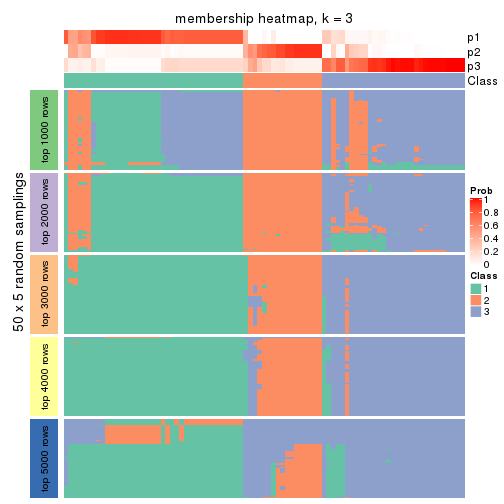</p>

</div>
<div id='tab-CV-mclust-membership-heatmap-3'>
<pre><code class="r">membership_heatmap(res, k = 4)
</code></pre>

<p></p>

</div>
<div id='tab-CV-mclust-membership-heatmap-4'>
<pre><code class="r">membership_heatmap(res, k = 5)
</code></pre>

<p>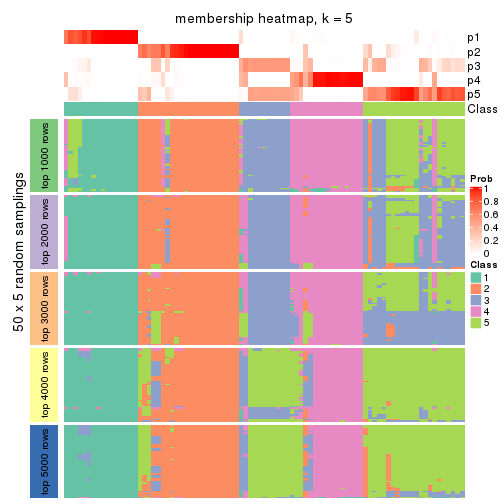</p>

</div>
<div id='tab-CV-mclust-membership-heatmap-5'>
<pre><code class="r">membership_heatmap(res, k = 6)
</code></pre>

<p></p>

</div>
</div>

As soon as we have had the classes for columns, we can look for signatures
which are significantly different between classes which can be candidate marks
for certain classes. Following are the heatmaps for signatures.


Signature heatmaps where rows are scaled:


<script>
$( function() {
	$( '#tabs-CV-mclust-get-signatures' ).tabs();
} );
</script>
<div id='tabs-CV-mclust-get-signatures'>
<ul>
<li><a href='#tab-CV-mclust-get-signatures-1'>k = 2</a></li>
<li><a href='#tab-CV-mclust-get-signatures-2'>k = 3</a></li>
<li><a href='#tab-CV-mclust-get-signatures-3'>k = 4</a></li>
<li><a href='#tab-CV-mclust-get-signatures-4'>k = 5</a></li>
<li><a href='#tab-CV-mclust-get-signatures-5'>k = 6</a></li>
</ul>
<div id='tab-CV-mclust-get-signatures-1'>
<pre><code class="r">get_signatures(res, k = 2)
</code></pre>

<p></p>

</div>
<div id='tab-CV-mclust-get-signatures-2'>
<pre><code class="r">get_signatures(res, k = 3)
</code></pre>

<p></p>

</div>
<div id='tab-CV-mclust-get-signatures-3'>
<pre><code class="r">get_signatures(res, k = 4)
</code></pre>

<p></p>

</div>
<div id='tab-CV-mclust-get-signatures-4'>
<pre><code class="r">get_signatures(res, k = 5)
</code></pre>

<p></p>

</div>
<div id='tab-CV-mclust-get-signatures-5'>
<pre><code class="r">get_signatures(res, k = 6)
</code></pre>

<p></p>

</div>
</div>


Signature heatmaps where rows are not scaled:


<script>
$( function() {
	$( '#tabs-CV-mclust-get-signatures-no-scale' ).tabs();
} );
</script>
<div id='tabs-CV-mclust-get-signatures-no-scale'>
<ul>
<li><a href='#tab-CV-mclust-get-signatures-no-scale-1'>k = 2</a></li>
<li><a href='#tab-CV-mclust-get-signatures-no-scale-2'>k = 3</a></li>
<li><a href='#tab-CV-mclust-get-signatures-no-scale-3'>k = 4</a></li>
<li><a href='#tab-CV-mclust-get-signatures-no-scale-4'>k = 5</a></li>
<li><a href='#tab-CV-mclust-get-signatures-no-scale-5'>k = 6</a></li>
</ul>
<div id='tab-CV-mclust-get-signatures-no-scale-1'>
<pre><code class="r">get_signatures(res, k = 2, scale_rows = FALSE)
</code></pre>

<p></p>

</div>
<div id='tab-CV-mclust-get-signatures-no-scale-2'>
<pre><code class="r">get_signatures(res, k = 3, scale_rows = FALSE)
</code></pre>

<p></p>

</div>
<div id='tab-CV-mclust-get-signatures-no-scale-3'>
<pre><code class="r">get_signatures(res, k = 4, scale_rows = FALSE)
</code></pre>

<p></p>

</div>
<div id='tab-CV-mclust-get-signatures-no-scale-4'>
<pre><code class="r">get_signatures(res, k = 5, scale_rows = FALSE)
</code></pre>

<p></p>

</div>
<div id='tab-CV-mclust-get-signatures-no-scale-5'>
<pre><code class="r">get_signatures(res, k = 6, scale_rows = FALSE)
</code></pre>

<p></p>

</div>
</div>


Compare the overlap of signatures from different k:

```r
compare_signatures(res)
```


`get_signature()` returns a data frame invisibly. TO get the list of signatures, the function
call should be assigned to a variable explicitly. In following code, if `plot` argument is set
to `FALSE`, no heatmap is plotted while only the differential analysis is performed.

```r
# code only for demonstration
tb = get_signature(res, k = ..., plot = FALSE)
```

An example of the output of `tb` is:

```
#>   which_row         fdr    mean_1    mean_2 scaled_mean_1 scaled_mean_2 km
#> 1        38 0.042760348  8.373488  9.131774    -0.5533452     0.5164555  1
#> 2        40 0.018707592  7.106213  8.469186    -0.6173731     0.5762149  1
#> 3        55 0.019134737 10.221463 11.207825    -0.6159697     0.5749050  1
#> 4        59 0.006059896  5.921854  7.869574    -0.6899429     0.6439467  1
#> 5        60 0.018055526  8.928898 10.211722    -0.6204761     0.5791110  1
#> 6        98 0.009384629 15.714769 14.887706     0.6635654    -0.6193277  2
...
```

The columns in `tb` are:

1. `which_row`: row indices corresponding to the input matrix.
2. `fdr`: FDR for the differential test. 
3. `mean_x`: The mean value in group x.
4. `scaled_mean_x`: The mean value in group x after rows are scaled.
5. `km`: Row groups if k-means clustering is applied to rows.


UMAP plot which shows how samples are separated.


<script>
$( function() {
	$( '#tabs-CV-mclust-dimension-reduction' ).tabs();
} );
</script>
<div id='tabs-CV-mclust-dimension-reduction'>
<ul>
<li><a href='#tab-CV-mclust-dimension-reduction-1'>k = 2</a></li>
<li><a href='#tab-CV-mclust-dimension-reduction-2'>k = 3</a></li>
<li><a href='#tab-CV-mclust-dimension-reduction-3'>k = 4</a></li>
<li><a href='#tab-CV-mclust-dimension-reduction-4'>k = 5</a></li>
<li><a href='#tab-CV-mclust-dimension-reduction-5'>k = 6</a></li>
</ul>
<div id='tab-CV-mclust-dimension-reduction-1'>
<pre><code class="r">dimension_reduction(res, k = 2, method = &quot;UMAP&quot;)
</code></pre>

<p></p>

</div>
<div id='tab-CV-mclust-dimension-reduction-2'>
<pre><code class="r">dimension_reduction(res, k = 3, method = &quot;UMAP&quot;)
</code></pre>

<p></p>

</div>
<div id='tab-CV-mclust-dimension-reduction-3'>
<pre><code class="r">dimension_reduction(res, k = 4, method = &quot;UMAP&quot;)
</code></pre>

<p></p>

</div>
<div id='tab-CV-mclust-dimension-reduction-4'>
<pre><code class="r">dimension_reduction(res, k = 5, method = &quot;UMAP&quot;)
</code></pre>

<p></p>

</div>
<div id='tab-CV-mclust-dimension-reduction-5'>
<pre><code class="r">dimension_reduction(res, k = 6, method = &quot;UMAP&quot;)
</code></pre>

<p></p>

</div>
</div>


Following heatmap shows how subgroups are split when increasing `k`:

```r
collect_classes(res)
```


If matrix rows can be associated to genes, consider to use `functional_enrichment(res,
...)` to perform function enrichment for the signature genes. See [this vignette](http://bioconductor.org/packages/devel/bioc/vignettes/cola/inst/doc/functional_enrichment.html) for more detailed explanations.


 

---------------------------------------------------


### CV:NMF*


The object with results only for a single top-value method and a single partition method 
can be extracted as:

```r
res = res_list["CV", "NMF"]
# you can also extract it by
# res = res_list["CV:NMF"]
```

A summary of `res` and all the functions that can be applied to it:

```r
res
```

```
#> A 'ConsensusPartition' object with k = 2, 3, 4, 5, 6.
#>   On a matrix with 17471 rows and 87 columns.
#>   Top rows (1000, 2000, 3000, 4000, 5000) are extracted by 'CV' method.
#>   Subgroups are detected by 'NMF' method.
#>   Performed in total 1250 partitions by row resampling.
#>   Best k for subgroups seems to be 4.
#> 
#> Following methods can be applied to this 'ConsensusPartition' object:
#>  [1] "cola_report"             "collect_classes"         "collect_plots"          
#>  [4] "collect_stats"           "colnames"                "compare_signatures"     
#>  [7] "consensus_heatmap"       "dimension_reduction"     "functional_enrichment"  
#> [10] "get_anno_col"            "get_anno"                "get_classes"            
#> [13] "get_consensus"           "get_matrix"              "get_membership"         
#> [16] "get_param"               "get_signatures"          "get_stats"              
#> [19] "is_best_k"               "is_stable_k"             "membership_heatmap"     
#> [22] "ncol"                    "nrow"                    "plot_ecdf"              
#> [25] "rownames"                "select_partition_number" "show"                   
#> [28] "suggest_best_k"          "test_to_known_factors"
```

`collect_plots()` function collects all the plots made from `res` for all `k` (number of partitions)
into one single page to provide an easy and fast comparison between different `k`.

```r
collect_plots(res)
```

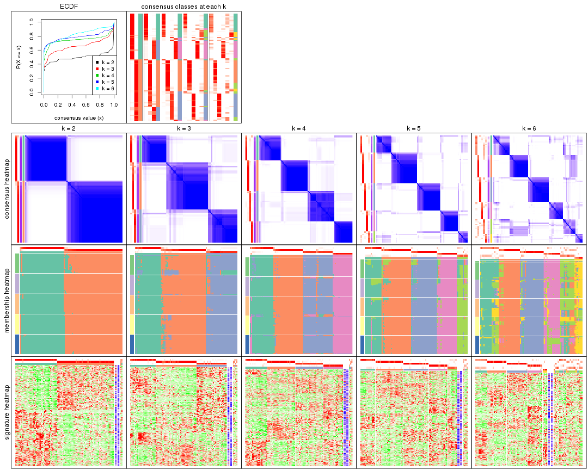

The plots are:

- The first row: a plot of the ECDF (empirical cumulative distribution
  function) curves of the consensus matrix for each `k` and the heatmap of
  predicted classes for each `k`.
- The second row: heatmaps of the consensus matrix for each `k`.
- The third row: heatmaps of the membership matrix for each `k`.
- The fouth row: heatmaps of the signatures for each `k`.

All the plots in panels can be made by individual functions and they are
plotted later in this section.

`select_partition_number()` produces several plots showing different
statistics for choosing "optimized" `k`. There are following statistics:

- ECDF curves of the consensus matrix for each `k`;
- 1-PAC. [The PAC
  score](https://en.wikipedia.org/wiki/Consensus_clustering#Over-interpretation_potential_of_consensus_clustering)
  measures the proportion of the ambiguous subgrouping.
- Mean silhouette score.
- Concordance. The mean probability of fiting the consensus class ids in all
  partitions.
- Area increased. Denote $A_k$ as the area under the ECDF curve for current
  `k`, the area increased is defined as $A_k - A_{k-1}$.
- Rand index. The percent of pairs of samples that are both in a same cluster
  or both are not in a same cluster in the partition of k and k-1.
- Jaccard index. The ratio of pairs of samples are both in a same cluster in
  the partition of k and k-1 and the pairs of samples are both in a same
  cluster in the partition k or k-1.

The detailed explanations of these statistics can be found in [the _cola_
vignette](http://bioconductor.org/packages/devel/bioc/vignettes/cola/inst/doc/cola.html#toc_13).

Generally speaking, lower PAC score, higher mean silhouette score or higher
concordance corresponds to better partition. Rand index and Jaccard index
measure how similar the current partition is compared to partition with `k-1`.
If they are too similar, we won't accept `k` is better than `k-1`.

```r
select_partition_number(res)
```


The numeric values for all these statistics can be obtained by `get_stats()`.

```r
get_stats(res)
```

```
#>   k 1-PAC mean_silhouette concordance area_increased  Rand Jaccard
#> 2 2 0.973           0.944       0.976         0.4964 0.505   0.505
#> 3 3 0.824           0.878       0.936         0.3284 0.733   0.521
#> 4 4 0.939           0.911       0.943         0.1371 0.806   0.506
#> 5 5 0.854           0.828       0.915         0.0561 0.925   0.720
#> 6 6 0.781           0.641       0.783         0.0413 0.892   0.560
```

`suggest_best_k()` suggests the best $k$ based on these statistics. The rules are as follows:

- All $k$ with Jaccard index larger than 0.95 are removed because increasing
  $k$ does not provide enough extra information. If all $k$ are removed, it is
  marked as no subgroup is detected.
- For all $k$ with 1-PAC score larger than 0.9, the maximal $k$ is taken as
  the best $k$, and other $k$ are marked as optional $k$.
- If it does not fit the second rule. The $k$ with the maximal vote of the
  highest 1-PAC score, highest mean silhouette, and highest concordance is
  taken as the best $k$.

```r
suggest_best_k(res)
```

```
#> [1] 4
#> attr(,"optional")
#> [1] 2
```

There is also optional best $k$ = 2 that is worth to check.

Following shows the table of the partitions (You need to click the **show/hide
code output** link to see it). The membership matrix (columns with name `p*`)
is inferred by
[`clue::cl_consensus()`](https://www.rdocumentation.org/link/cl_consensus?package=clue)
function with the `SE` method. Basically the value in the membership matrix
represents the probability to belong to a certain group. The finall class
label for an item is determined with the group with highest probability it
belongs to.

In `get_classes()` function, the entropy is calculated from the membership
matrix and the silhouette score is calculated from the consensus matrix.


<script>
$( function() {
	$( '#tabs-CV-NMF-get-classes' ).tabs();
} );
</script>
<div id='tabs-CV-NMF-get-classes'>
<ul>
<li><a href='#tab-CV-NMF-get-classes-1'>k = 2</a></li>
<li><a href='#tab-CV-NMF-get-classes-2'>k = 3</a></li>
<li><a href='#tab-CV-NMF-get-classes-3'>k = 4</a></li>
<li><a href='#tab-CV-NMF-get-classes-4'>k = 5</a></li>
<li><a href='#tab-CV-NMF-get-classes-5'>k = 6</a></li>
</ul>

<div id='tab-CV-NMF-get-classes-1'>
<p><a id='tab-CV-NMF-get-classes-1-a' style='color:#0366d6' href='#'>show/hide code output</a></p>
<pre><code class="r">cbind(get_classes(res, k = 2), get_membership(res, k = 2))
</code></pre>

<pre><code>#&gt;                                      class entropy silhouette    p1    p2
#&gt; E6088A41-B0DC-4FBF-8D14-BE78024CF8CD     2  0.0000      0.971 0.000 1.000
#&gt; F569915C-8F77-4D67-9730-30824DB57EE5     2  0.0000      0.971 0.000 1.000
#&gt; E3B71CB7-673B-4741-8607-4F0A11633036     1  0.0000      0.979 1.000 0.000
#&gt; DAF84798-FE3F-403C-B589-7F256AF752BE     1  0.0000      0.979 1.000 0.000
#&gt; 2F38E3B1-4975-4877-9DCC-C00270602180     1  0.0000      0.979 1.000 0.000
#&gt; C79A4C2F-02C4-4C03-A5A5-DE06802EEB57     2  0.0376      0.969 0.004 0.996
#&gt; 92E3ED8F-5C74-4ED2-9B03-9FA5E7B491D6     1  0.0000      0.979 1.000 0.000
#&gt; E61D60BE-3BD3-4B5E-BC12-80F3684A0959     1  0.0000      0.979 1.000 0.000
#&gt; C9388FC7-DB1D-4416-BC2D-EA643584F1E6     2  0.0376      0.969 0.004 0.996
#&gt; D4219360-6344-4AF3-ACEB-1701A9F1F67D     1  0.0000      0.979 1.000 0.000
#&gt; 07D155E6-F27C-4D09-B786-8A9B71147B72     1  0.0000      0.979 1.000 0.000
#&gt; 10C8C361-85A5-40E8-A395-B92623E6F27C     1  0.0000      0.979 1.000 0.000
#&gt; BDF20891-7C98-4A55-BBF3-8A836BE303C6     2  0.0000      0.971 0.000 1.000
#&gt; 694B0504-095E-431A-84F2-B4387072138E     1  0.0000      0.979 1.000 0.000
#&gt; EDCF8E7F-8B1D-46F7-8AE0-84A1DC9647D2     2  0.0000      0.971 0.000 1.000
#&gt; 0EA8288E-824D-4304-A053-5A833361F5C5     1  0.0376      0.976 0.996 0.004
#&gt; C4ACCFA1-34A9-4F61-8A1F-35B3B60EA193     1  0.0000      0.979 1.000 0.000
#&gt; 760BA639-38AC-4BC9-9647-09F6893EA8ED     1  0.0000      0.979 1.000 0.000
#&gt; 082DFC6B-C6E6-48B9-BDE5-74FF3B3DC954     2  0.0000      0.971 0.000 1.000
#&gt; FE349848-D7C4-4C49-B670-0E20454DDD7E     2  0.6973      0.779 0.188 0.812
#&gt; 2E8937B3-9EA1-4528-8CEE-BF3D4137908A     2  0.0000      0.971 0.000 1.000
#&gt; 9942D04E-2767-4E39-BA16-7762EAC3DFC4     2  0.0000      0.971 0.000 1.000
#&gt; F9C23182-91C4-4145-AE52-526FE8EB199D     2  0.1843      0.952 0.028 0.972
#&gt; 01024EED-7811-4E24-A067-8E0B978FFE2D     2  0.0000      0.971 0.000 1.000
#&gt; 932C8E98-A352-409C-8744-3D49FABCE425     1  0.0000      0.979 1.000 0.000
#&gt; 6DFD9439-C659-4936-84E5-108F717E3E4D     2  0.1414      0.959 0.020 0.980
#&gt; 1D8B83B8-5DD7-4F45-9D59-487EC6906A8B     2  0.0000      0.971 0.000 1.000
#&gt; 804B8503-73F6-42DE-835F-39DE2C9F13E1     2  0.0000      0.971 0.000 1.000
#&gt; B9453C9B-84D5-43BD-85BB-1780F02F039C     1  0.0000      0.979 1.000 0.000
#&gt; 836E6CD6-4E88-4028-9844-FA3C892C254A     1  0.3733      0.909 0.928 0.072
#&gt; 36EDD202-A845-4CE7-95D5-A515C471262E     2  0.0000      0.971 0.000 1.000
#&gt; 181C156A-B8F4-4F9D-93AA-6AFBD197644D     2  0.2236      0.945 0.036 0.964
#&gt; 0580E798-6A98-4E46-AC96-9A869DFF502E     1  0.0000      0.979 1.000 0.000
#&gt; EA1B63CF-D389-4567-8D9E-B0EF1F804598     2  0.9944      0.153 0.456 0.544
#&gt; 5ABC3D06-B8E9-4831-B89B-7C1EC4006B47     2  0.0000      0.971 0.000 1.000
#&gt; 1CC01E74-A7C1-4A51-9E28-1703C352BE16     2  0.0000      0.971 0.000 1.000
#&gt; 97E55B75-DBDB-46BC-9E74-7828C070BF16     2  0.0000      0.971 0.000 1.000
#&gt; BEB37A2D-E8B0-4674-89AC-DC0F34E0AFD6     1  0.0000      0.979 1.000 0.000
#&gt; 558648BA-6551-4D34-97C2-AD5F677D63FB     1  0.6973      0.763 0.812 0.188
#&gt; FF7021BB-414B-4466-BC43-372D856E6A1D     2  0.0376      0.969 0.004 0.996
#&gt; 9C04B840-54E0-425D-BDBE-8CB6B9C2C722     2  0.0000      0.971 0.000 1.000
#&gt; 5F50B1F4-1A02-4506-AA6D-9BF21CD8059A     1  0.1414      0.963 0.980 0.020
#&gt; 7D4B8FF3-7977-4ABD-AE04-EED1C50B23CC     2  0.0000      0.971 0.000 1.000
#&gt; A005AF15-B98E-4623-8AD4-1E69EFA9BC7A     1  0.0000      0.979 1.000 0.000
#&gt; 1DF04345-5C93-4B18-B307-8D1FCA532999     2  0.0000      0.971 0.000 1.000
#&gt; 6AF30C18-347E-41ED-A4AB-6F81F42206C5     1  0.0000      0.979 1.000 0.000
#&gt; 88A44ED0-BDE1-401E-B0E1-D8C8D6DBAEFC     2  0.0000      0.971 0.000 1.000
#&gt; 117673A3-2918-4702-8583-B66ADE6E4338     2  0.0000      0.971 0.000 1.000
#&gt; 4903A571-E14D-43C9-A737-22CAFAC414CD     2  0.3114      0.929 0.056 0.944
#&gt; C175E68E-632A-4B4A-9DDB-4895C4760F20     1  0.0000      0.979 1.000 0.000
#&gt; FA5CA2F4-A1AD-4A79-B8F3-73A976EB2FB1     2  0.0000      0.971 0.000 1.000
#&gt; E1F883A7-8B1F-4C1D-8A1A-9749A9C09845     2  0.0000      0.971 0.000 1.000
#&gt; E74F0729-6000-4908-ADB0-7BDBAC0639E6     1  0.0000      0.979 1.000 0.000
#&gt; F92135A9-1981-4C79-99A5-4243EEC5D30D     2  0.0000      0.971 0.000 1.000
#&gt; 73C6919F-DEB4-4DA4-B4AE-4032AC8F96C5     1  0.0000      0.979 1.000 0.000
#&gt; 33977B40-2E92-48B6-8D3A-3EBE913F6F8A     1  0.0000      0.979 1.000 0.000
#&gt; 490BD607-2F08-4B4C-9612-F9BB5CBBC8BB     2  0.0000      0.971 0.000 1.000
#&gt; 6C666E17-2EB8-4244-BCC1-8DD34EE4173E     2  0.7299      0.756 0.204 0.796
#&gt; C41F3064-4483-4796-B860-82155BAA5157     1  0.0000      0.979 1.000 0.000
#&gt; F4232B90-51B9-43EE-9971-35B3A318758F     1  0.0000      0.979 1.000 0.000
#&gt; 291EA1F6-FC56-4429-A433-0C452A6A514C     2  0.0000      0.971 0.000 1.000
#&gt; CC4AF04D-CB8E-40DD-B12E-7AA39B38262A     2  0.0000      0.971 0.000 1.000
#&gt; 4DAE26B9-AB57-4763-BB9A-2ADDD5D9C007     1  0.0000      0.979 1.000 0.000
#&gt; 676B4AEE-FB41-4C16-AA91-03E4A1DA8E26     1  0.9754      0.273 0.592 0.408
#&gt; 1CC36859-357A-49E0-A367-4F57D47288BA     2  0.3584      0.918 0.068 0.932
#&gt; 7CCDDFC8-6DF6-4734-96AC-19EBC464FC50     2  0.0000      0.971 0.000 1.000
#&gt; 10F38C34-3956-48ED-AB62-3439EF00D46B     2  0.3733      0.914 0.072 0.928
#&gt; 80B2B393-9D6E-45B4-B696-2A5C203543B7     2  0.0000      0.971 0.000 1.000
#&gt; 5AC7B5EA-1AAC-4529-8E5A-F612E5E0719A     1  0.1414      0.963 0.980 0.020
#&gt; 3648E98D-4B3A-41B7-BE05-595D44F0150D     1  0.0000      0.979 1.000 0.000
#&gt; 252EC850-6026-473B-8FFC-2CF567EF42E4     1  0.0000      0.979 1.000 0.000
#&gt; 1790E7A3-99D8-447E-BC50-51C8A4A18853     2  0.0000      0.971 0.000 1.000
#&gt; DA61A4F8-350B-4DD1-A240-AD016520DB5B     2  0.1414      0.959 0.020 0.980
#&gt; 767E5BAF-2515-40D7-AE7D-0B24D77A03F4     2  0.0000      0.971 0.000 1.000
#&gt; 8CB9C903-D749-44EA-9137-7FB5A92C5932     1  0.0000      0.979 1.000 0.000
#&gt; A9B968AE-2243-41BC-852A-3A12C1FB4892     1  0.0000      0.979 1.000 0.000
#&gt; 3C582264-85BC-4569-A888-8EB3008E5198     2  0.0000      0.971 0.000 1.000
#&gt; F4EAF9A2-9938-4D9B-9080-C0A7542D5704     2  0.0000      0.971 0.000 1.000
#&gt; 328499D3-45DD-4B66-BD22-3C52BA92C2BB     1  0.0000      0.979 1.000 0.000
#&gt; AF8AB83D-2917-4752-8C38-CF84C565B565     1  0.0000      0.979 1.000 0.000
#&gt; 03A327CA-A9FE-42A4-844D-CA85206969FC     2  0.0000      0.971 0.000 1.000
#&gt; 4B0BEC44-87BB-4014-9A26-3529DD63760B     2  0.7219      0.762 0.200 0.800
#&gt; 05C7843E-DC89-4D8E-A78A-952C5DFD667B     2  0.0000      0.971 0.000 1.000
#&gt; 29A0FFF9-13D3-4D16-BE6A-8E48A2C4E315     2  0.0000      0.971 0.000 1.000
#&gt; 22947CC3-4F42-4F44-899C-2B7085E36C9D     2  0.0000      0.971 0.000 1.000
#&gt; A247D92D-253A-4BEC-B450-184AF90D17D0     2  0.0000      0.971 0.000 1.000
#&gt; 0D907A63-D23F-4684-80D9-0BA552435B86     1  0.0000      0.979 1.000 0.000
</code></pre>

<script>
$('#tab-CV-NMF-get-classes-1-a').parent().next().next().hide();
$('#tab-CV-NMF-get-classes-1-a').click(function(){
  $('#tab-CV-NMF-get-classes-1-a').parent().next().next().toggle();
  return(false);
});
</script>
</div>

<div id='tab-CV-NMF-get-classes-2'>
<p><a id='tab-CV-NMF-get-classes-2-a' style='color:#0366d6' href='#'>show/hide code output</a></p>
<pre><code class="r">cbind(get_classes(res, k = 3), get_membership(res, k = 3))
</code></pre>

<pre><code>#&gt;                                      class entropy silhouette    p1    p2    p3
#&gt; E6088A41-B0DC-4FBF-8D14-BE78024CF8CD     2  0.4228      0.833 0.008 0.844 0.148
#&gt; F569915C-8F77-4D67-9730-30824DB57EE5     2  0.4452      0.786 0.000 0.808 0.192
#&gt; E3B71CB7-673B-4741-8607-4F0A11633036     1  0.0000      0.961 1.000 0.000 0.000
#&gt; DAF84798-FE3F-403C-B589-7F256AF752BE     1  0.0892      0.948 0.980 0.000 0.020
#&gt; 2F38E3B1-4975-4877-9DCC-C00270602180     1  0.0000      0.961 1.000 0.000 0.000
#&gt; C79A4C2F-02C4-4C03-A5A5-DE06802EEB57     2  0.7580      0.464 0.340 0.604 0.056
#&gt; 92E3ED8F-5C74-4ED2-9B03-9FA5E7B491D6     1  0.0000      0.961 1.000 0.000 0.000
#&gt; E61D60BE-3BD3-4B5E-BC12-80F3684A0959     1  0.4452      0.752 0.808 0.000 0.192
#&gt; C9388FC7-DB1D-4416-BC2D-EA643584F1E6     3  0.1964      0.891 0.000 0.056 0.944
#&gt; D4219360-6344-4AF3-ACEB-1701A9F1F67D     1  0.0000      0.961 1.000 0.000 0.000
#&gt; 07D155E6-F27C-4D09-B786-8A9B71147B72     3  0.1964      0.915 0.056 0.000 0.944
#&gt; 10C8C361-85A5-40E8-A395-B92623E6F27C     1  0.0000      0.961 1.000 0.000 0.000
#&gt; BDF20891-7C98-4A55-BBF3-8A836BE303C6     2  0.0000      0.929 0.000 1.000 0.000
#&gt; 694B0504-095E-431A-84F2-B4387072138E     1  0.0000      0.961 1.000 0.000 0.000
#&gt; EDCF8E7F-8B1D-46F7-8AE0-84A1DC9647D2     2  0.1643      0.913 0.000 0.956 0.044
#&gt; 0EA8288E-824D-4304-A053-5A833361F5C5     3  0.1529      0.915 0.040 0.000 0.960
#&gt; C4ACCFA1-34A9-4F61-8A1F-35B3B60EA193     1  0.0000      0.961 1.000 0.000 0.000
#&gt; 760BA639-38AC-4BC9-9647-09F6893EA8ED     1  0.0000      0.961 1.000 0.000 0.000
#&gt; 082DFC6B-C6E6-48B9-BDE5-74FF3B3DC954     2  0.2165      0.904 0.000 0.936 0.064
#&gt; FE349848-D7C4-4C49-B670-0E20454DDD7E     3  0.0237      0.903 0.000 0.004 0.996
#&gt; 2E8937B3-9EA1-4528-8CEE-BF3D4137908A     2  0.0000      0.929 0.000 1.000 0.000
#&gt; 9942D04E-2767-4E39-BA16-7762EAC3DFC4     2  0.0000      0.929 0.000 1.000 0.000
#&gt; F9C23182-91C4-4145-AE52-526FE8EB199D     2  0.5327      0.636 0.272 0.728 0.000
#&gt; 01024EED-7811-4E24-A067-8E0B978FFE2D     2  0.0424      0.926 0.000 0.992 0.008
#&gt; 932C8E98-A352-409C-8744-3D49FABCE425     1  0.0000      0.961 1.000 0.000 0.000
#&gt; 6DFD9439-C659-4936-84E5-108F717E3E4D     2  0.4628      0.851 0.088 0.856 0.056
#&gt; 1D8B83B8-5DD7-4F45-9D59-487EC6906A8B     2  0.1964      0.907 0.000 0.944 0.056
#&gt; 804B8503-73F6-42DE-835F-39DE2C9F13E1     2  0.0000      0.929 0.000 1.000 0.000
#&gt; B9453C9B-84D5-43BD-85BB-1780F02F039C     1  0.0000      0.961 1.000 0.000 0.000
#&gt; 836E6CD6-4E88-4028-9844-FA3C892C254A     1  0.4353      0.837 0.836 0.008 0.156
#&gt; 36EDD202-A845-4CE7-95D5-A515C471262E     2  0.0000      0.929 0.000 1.000 0.000
#&gt; 181C156A-B8F4-4F9D-93AA-6AFBD197644D     2  0.6095      0.359 0.392 0.608 0.000
#&gt; 0580E798-6A98-4E46-AC96-9A869DFF502E     3  0.2165      0.910 0.064 0.000 0.936
#&gt; EA1B63CF-D389-4567-8D9E-B0EF1F804598     1  0.5307      0.798 0.820 0.124 0.056
#&gt; 5ABC3D06-B8E9-4831-B89B-7C1EC4006B47     2  0.0000      0.929 0.000 1.000 0.000
#&gt; 1CC01E74-A7C1-4A51-9E28-1703C352BE16     2  0.0000      0.929 0.000 1.000 0.000
#&gt; 97E55B75-DBDB-46BC-9E74-7828C070BF16     2  0.0000      0.929 0.000 1.000 0.000
#&gt; BEB37A2D-E8B0-4674-89AC-DC0F34E0AFD6     3  0.1964      0.915 0.056 0.000 0.944
#&gt; 558648BA-6551-4D34-97C2-AD5F677D63FB     1  0.3589      0.888 0.900 0.048 0.052
#&gt; FF7021BB-414B-4466-BC43-372D856E6A1D     3  0.0424      0.902 0.000 0.008 0.992
#&gt; 9C04B840-54E0-425D-BDBE-8CB6B9C2C722     2  0.0000      0.929 0.000 1.000 0.000
#&gt; 5F50B1F4-1A02-4506-AA6D-9BF21CD8059A     3  0.1031      0.911 0.024 0.000 0.976
#&gt; 7D4B8FF3-7977-4ABD-AE04-EED1C50B23CC     2  0.1753      0.911 0.000 0.952 0.048
#&gt; A005AF15-B98E-4623-8AD4-1E69EFA9BC7A     3  0.1964      0.915 0.056 0.000 0.944
#&gt; 1DF04345-5C93-4B18-B307-8D1FCA532999     2  0.0000      0.929 0.000 1.000 0.000
#&gt; 6AF30C18-347E-41ED-A4AB-6F81F42206C5     1  0.0000      0.961 1.000 0.000 0.000
#&gt; 88A44ED0-BDE1-401E-B0E1-D8C8D6DBAEFC     2  0.1964      0.907 0.000 0.944 0.056
#&gt; 117673A3-2918-4702-8583-B66ADE6E4338     2  0.0424      0.927 0.000 0.992 0.008
#&gt; 4903A571-E14D-43C9-A737-22CAFAC414CD     3  0.1529      0.883 0.000 0.040 0.960
#&gt; C175E68E-632A-4B4A-9DDB-4895C4760F20     1  0.0000      0.961 1.000 0.000 0.000
#&gt; FA5CA2F4-A1AD-4A79-B8F3-73A976EB2FB1     2  0.0237      0.928 0.000 0.996 0.004
#&gt; E1F883A7-8B1F-4C1D-8A1A-9749A9C09845     2  0.0000      0.929 0.000 1.000 0.000
#&gt; E74F0729-6000-4908-ADB0-7BDBAC0639E6     1  0.0000      0.961 1.000 0.000 0.000
#&gt; F92135A9-1981-4C79-99A5-4243EEC5D30D     2  0.0000      0.929 0.000 1.000 0.000
#&gt; 73C6919F-DEB4-4DA4-B4AE-4032AC8F96C5     1  0.1411      0.936 0.964 0.000 0.036
#&gt; 33977B40-2E92-48B6-8D3A-3EBE913F6F8A     3  0.5926      0.417 0.356 0.000 0.644
#&gt; 490BD607-2F08-4B4C-9612-F9BB5CBBC8BB     2  0.4178      0.810 0.000 0.828 0.172
#&gt; 6C666E17-2EB8-4244-BCC1-8DD34EE4173E     3  0.0000      0.903 0.000 0.000 1.000
#&gt; C41F3064-4483-4796-B860-82155BAA5157     3  0.1964      0.915 0.056 0.000 0.944
#&gt; F4232B90-51B9-43EE-9971-35B3A318758F     1  0.2448      0.896 0.924 0.000 0.076
#&gt; 291EA1F6-FC56-4429-A433-0C452A6A514C     2  0.0000      0.929 0.000 1.000 0.000
#&gt; CC4AF04D-CB8E-40DD-B12E-7AA39B38262A     2  0.0000      0.929 0.000 1.000 0.000
#&gt; 4DAE26B9-AB57-4763-BB9A-2ADDD5D9C007     3  0.1964      0.915 0.056 0.000 0.944
#&gt; 676B4AEE-FB41-4C16-AA91-03E4A1DA8E26     3  0.1964      0.915 0.056 0.000 0.944
#&gt; 1CC36859-357A-49E0-A367-4F57D47288BA     2  0.5667      0.799 0.140 0.800 0.060
#&gt; 7CCDDFC8-6DF6-4734-96AC-19EBC464FC50     2  0.0000      0.929 0.000 1.000 0.000
#&gt; 10F38C34-3956-48ED-AB62-3439EF00D46B     3  0.0000      0.903 0.000 0.000 1.000
#&gt; 80B2B393-9D6E-45B4-B696-2A5C203543B7     2  0.0000      0.929 0.000 1.000 0.000
#&gt; 5AC7B5EA-1AAC-4529-8E5A-F612E5E0719A     3  0.1964      0.915 0.056 0.000 0.944
#&gt; 3648E98D-4B3A-41B7-BE05-595D44F0150D     1  0.0000      0.961 1.000 0.000 0.000
#&gt; 252EC850-6026-473B-8FFC-2CF567EF42E4     3  0.1753      0.915 0.048 0.000 0.952
#&gt; 1790E7A3-99D8-447E-BC50-51C8A4A18853     2  0.0000      0.929 0.000 1.000 0.000
#&gt; DA61A4F8-350B-4DD1-A240-AD016520DB5B     3  0.5465      0.561 0.000 0.288 0.712
#&gt; 767E5BAF-2515-40D7-AE7D-0B24D77A03F4     3  0.5431      0.570 0.000 0.284 0.716
#&gt; 8CB9C903-D749-44EA-9137-7FB5A92C5932     3  0.1964      0.915 0.056 0.000 0.944
#&gt; A9B968AE-2243-41BC-852A-3A12C1FB4892     3  0.1964      0.915 0.056 0.000 0.944
#&gt; 3C582264-85BC-4569-A888-8EB3008E5198     2  0.0000      0.929 0.000 1.000 0.000
#&gt; F4EAF9A2-9938-4D9B-9080-C0A7542D5704     2  0.0000      0.929 0.000 1.000 0.000
#&gt; 328499D3-45DD-4B66-BD22-3C52BA92C2BB     1  0.0000      0.961 1.000 0.000 0.000
#&gt; AF8AB83D-2917-4752-8C38-CF84C565B565     3  0.1964      0.915 0.056 0.000 0.944
#&gt; 03A327CA-A9FE-42A4-844D-CA85206969FC     3  0.5363      0.585 0.000 0.276 0.724
#&gt; 4B0BEC44-87BB-4014-9A26-3529DD63760B     3  0.0000      0.903 0.000 0.000 1.000
#&gt; 05C7843E-DC89-4D8E-A78A-952C5DFD667B     2  0.5948      0.488 0.000 0.640 0.360
#&gt; 29A0FFF9-13D3-4D16-BE6A-8E48A2C4E315     2  0.0000      0.929 0.000 1.000 0.000
#&gt; 22947CC3-4F42-4F44-899C-2B7085E36C9D     2  0.3237      0.894 0.032 0.912 0.056
#&gt; A247D92D-253A-4BEC-B450-184AF90D17D0     3  0.0747      0.898 0.000 0.016 0.984
#&gt; 0D907A63-D23F-4684-80D9-0BA552435B86     3  0.1964      0.915 0.056 0.000 0.944
</code></pre>

<script>
$('#tab-CV-NMF-get-classes-2-a').parent().next().next().hide();
$('#tab-CV-NMF-get-classes-2-a').click(function(){
  $('#tab-CV-NMF-get-classes-2-a').parent().next().next().toggle();
  return(false);
});
</script>
</div>

<div id='tab-CV-NMF-get-classes-3'>
<p><a id='tab-CV-NMF-get-classes-3-a' style='color:#0366d6' href='#'>show/hide code output</a></p>
<pre><code class="r">cbind(get_classes(res, k = 4), get_membership(res, k = 4))
</code></pre>

<pre><code>#&gt;                                      class entropy silhouette    p1    p2    p3    p4
#&gt; E6088A41-B0DC-4FBF-8D14-BE78024CF8CD     3  0.2032      0.928 0.028 0.036 0.936 0.000
#&gt; F569915C-8F77-4D67-9730-30824DB57EE5     3  0.1902      0.930 0.000 0.064 0.932 0.004
#&gt; E3B71CB7-673B-4741-8607-4F0A11633036     1  0.0188      0.926 0.996 0.000 0.004 0.000
#&gt; DAF84798-FE3F-403C-B589-7F256AF752BE     1  0.0188      0.926 0.996 0.000 0.004 0.000
#&gt; 2F38E3B1-4975-4877-9DCC-C00270602180     1  0.0376      0.926 0.992 0.000 0.004 0.004
#&gt; C79A4C2F-02C4-4C03-A5A5-DE06802EEB57     3  0.1690      0.891 0.032 0.008 0.952 0.008
#&gt; 92E3ED8F-5C74-4ED2-9B03-9FA5E7B491D6     1  0.0188      0.926 0.996 0.000 0.004 0.000
#&gt; E61D60BE-3BD3-4B5E-BC12-80F3684A0959     4  0.3547      0.847 0.072 0.000 0.064 0.864
#&gt; C9388FC7-DB1D-4416-BC2D-EA643584F1E6     4  0.1059      0.973 0.000 0.016 0.012 0.972
#&gt; D4219360-6344-4AF3-ACEB-1701A9F1F67D     1  0.0188      0.926 0.996 0.000 0.004 0.000
#&gt; 07D155E6-F27C-4D09-B786-8A9B71147B72     4  0.0469      0.987 0.000 0.000 0.012 0.988
#&gt; 10C8C361-85A5-40E8-A395-B92623E6F27C     1  0.1743      0.912 0.940 0.000 0.056 0.004
#&gt; BDF20891-7C98-4A55-BBF3-8A836BE303C6     2  0.0000      0.968 0.000 1.000 0.000 0.000
#&gt; 694B0504-095E-431A-84F2-B4387072138E     1  0.1118      0.919 0.964 0.000 0.036 0.000
#&gt; EDCF8E7F-8B1D-46F7-8AE0-84A1DC9647D2     3  0.5310      0.350 0.012 0.412 0.576 0.000
#&gt; 0EA8288E-824D-4304-A053-5A833361F5C5     4  0.0592      0.983 0.000 0.000 0.016 0.984
#&gt; C4ACCFA1-34A9-4F61-8A1F-35B3B60EA193     1  0.0469      0.924 0.988 0.000 0.012 0.000
#&gt; 760BA639-38AC-4BC9-9647-09F6893EA8ED     1  0.0188      0.926 0.996 0.000 0.004 0.000
#&gt; 082DFC6B-C6E6-48B9-BDE5-74FF3B3DC954     3  0.1792      0.928 0.000 0.068 0.932 0.000
#&gt; FE349848-D7C4-4C49-B670-0E20454DDD7E     3  0.1902      0.916 0.004 0.000 0.932 0.064
#&gt; 2E8937B3-9EA1-4528-8CEE-BF3D4137908A     2  0.0000      0.968 0.000 1.000 0.000 0.000
#&gt; 9942D04E-2767-4E39-BA16-7762EAC3DFC4     2  0.0000      0.968 0.000 1.000 0.000 0.000
#&gt; F9C23182-91C4-4145-AE52-526FE8EB199D     2  0.4730      0.425 0.364 0.636 0.000 0.000
#&gt; 01024EED-7811-4E24-A067-8E0B978FFE2D     2  0.0000      0.968 0.000 1.000 0.000 0.000
#&gt; 932C8E98-A352-409C-8744-3D49FABCE425     1  0.0188      0.926 0.996 0.000 0.004 0.000
#&gt; 6DFD9439-C659-4936-84E5-108F717E3E4D     3  0.2271      0.905 0.076 0.008 0.916 0.000
#&gt; 1D8B83B8-5DD7-4F45-9D59-487EC6906A8B     3  0.2011      0.921 0.000 0.080 0.920 0.000
#&gt; 804B8503-73F6-42DE-835F-39DE2C9F13E1     2  0.0000      0.968 0.000 1.000 0.000 0.000
#&gt; B9453C9B-84D5-43BD-85BB-1780F02F039C     1  0.2179      0.906 0.924 0.000 0.064 0.012
#&gt; 836E6CD6-4E88-4028-9844-FA3C892C254A     3  0.1940      0.904 0.076 0.000 0.924 0.000
#&gt; 36EDD202-A845-4CE7-95D5-A515C471262E     2  0.0000      0.968 0.000 1.000 0.000 0.000
#&gt; 181C156A-B8F4-4F9D-93AA-6AFBD197644D     2  0.2234      0.905 0.004 0.924 0.064 0.008
#&gt; 0580E798-6A98-4E46-AC96-9A869DFF502E     4  0.0707      0.962 0.000 0.000 0.020 0.980
#&gt; EA1B63CF-D389-4567-8D9E-B0EF1F804598     1  0.2216      0.868 0.908 0.000 0.092 0.000
#&gt; 5ABC3D06-B8E9-4831-B89B-7C1EC4006B47     2  0.0000      0.968 0.000 1.000 0.000 0.000
#&gt; 1CC01E74-A7C1-4A51-9E28-1703C352BE16     2  0.0000      0.968 0.000 1.000 0.000 0.000
#&gt; 97E55B75-DBDB-46BC-9E74-7828C070BF16     2  0.0000      0.968 0.000 1.000 0.000 0.000
#&gt; BEB37A2D-E8B0-4674-89AC-DC0F34E0AFD6     4  0.0469      0.987 0.000 0.000 0.012 0.988
#&gt; 558648BA-6551-4D34-97C2-AD5F677D63FB     1  0.3577      0.853 0.832 0.000 0.156 0.012
#&gt; FF7021BB-414B-4466-BC43-372D856E6A1D     3  0.2111      0.932 0.000 0.044 0.932 0.024
#&gt; 9C04B840-54E0-425D-BDBE-8CB6B9C2C722     2  0.0000      0.968 0.000 1.000 0.000 0.000
#&gt; 5F50B1F4-1A02-4506-AA6D-9BF21CD8059A     4  0.0469      0.987 0.000 0.000 0.012 0.988
#&gt; 7D4B8FF3-7977-4ABD-AE04-EED1C50B23CC     2  0.1867      0.899 0.000 0.928 0.072 0.000
#&gt; A005AF15-B98E-4623-8AD4-1E69EFA9BC7A     4  0.0469      0.987 0.000 0.000 0.012 0.988
#&gt; 1DF04345-5C93-4B18-B307-8D1FCA532999     2  0.0592      0.956 0.000 0.984 0.016 0.000
#&gt; 6AF30C18-347E-41ED-A4AB-6F81F42206C5     1  0.4360      0.669 0.744 0.000 0.008 0.248
#&gt; 88A44ED0-BDE1-401E-B0E1-D8C8D6DBAEFC     3  0.1940      0.922 0.000 0.076 0.924 0.000
#&gt; 117673A3-2918-4702-8583-B66ADE6E4338     2  0.3311      0.766 0.000 0.828 0.172 0.000
#&gt; 4903A571-E14D-43C9-A737-22CAFAC414CD     3  0.3404      0.885 0.000 0.032 0.864 0.104
#&gt; C175E68E-632A-4B4A-9DDB-4895C4760F20     1  0.0188      0.926 0.996 0.000 0.004 0.000
#&gt; FA5CA2F4-A1AD-4A79-B8F3-73A976EB2FB1     3  0.4040      0.733 0.000 0.248 0.752 0.000
#&gt; E1F883A7-8B1F-4C1D-8A1A-9749A9C09845     2  0.0000      0.968 0.000 1.000 0.000 0.000
#&gt; E74F0729-6000-4908-ADB0-7BDBAC0639E6     1  0.2021      0.910 0.932 0.000 0.056 0.012
#&gt; F92135A9-1981-4C79-99A5-4243EEC5D30D     2  0.0000      0.968 0.000 1.000 0.000 0.000
#&gt; 73C6919F-DEB4-4DA4-B4AE-4032AC8F96C5     1  0.3913      0.825 0.824 0.000 0.148 0.028
#&gt; 33977B40-2E92-48B6-8D3A-3EBE913F6F8A     3  0.1824      0.913 0.060 0.000 0.936 0.004
#&gt; 490BD607-2F08-4B4C-9612-F9BB5CBBC8BB     3  0.1902      0.930 0.000 0.064 0.932 0.004
#&gt; 6C666E17-2EB8-4244-BCC1-8DD34EE4173E     3  0.1792      0.914 0.000 0.000 0.932 0.068
#&gt; C41F3064-4483-4796-B860-82155BAA5157     4  0.0336      0.984 0.000 0.000 0.008 0.992
#&gt; F4232B90-51B9-43EE-9971-35B3A318758F     1  0.5497      0.183 0.524 0.000 0.016 0.460
#&gt; 291EA1F6-FC56-4429-A433-0C452A6A514C     2  0.0000      0.968 0.000 1.000 0.000 0.000
#&gt; CC4AF04D-CB8E-40DD-B12E-7AA39B38262A     2  0.0000      0.968 0.000 1.000 0.000 0.000
#&gt; 4DAE26B9-AB57-4763-BB9A-2ADDD5D9C007     4  0.0469      0.987 0.000 0.000 0.012 0.988
#&gt; 676B4AEE-FB41-4C16-AA91-03E4A1DA8E26     4  0.0469      0.987 0.000 0.000 0.012 0.988
#&gt; 1CC36859-357A-49E0-A367-4F57D47288BA     3  0.2124      0.910 0.068 0.008 0.924 0.000
#&gt; 7CCDDFC8-6DF6-4734-96AC-19EBC464FC50     2  0.0000      0.968 0.000 1.000 0.000 0.000
#&gt; 10F38C34-3956-48ED-AB62-3439EF00D46B     3  0.1792      0.914 0.000 0.000 0.932 0.068
#&gt; 80B2B393-9D6E-45B4-B696-2A5C203543B7     2  0.1118      0.941 0.000 0.964 0.036 0.000
#&gt; 5AC7B5EA-1AAC-4529-8E5A-F612E5E0719A     4  0.0000      0.978 0.000 0.000 0.000 1.000
#&gt; 3648E98D-4B3A-41B7-BE05-595D44F0150D     1  0.0188      0.926 0.996 0.000 0.004 0.000
#&gt; 252EC850-6026-473B-8FFC-2CF567EF42E4     4  0.0469      0.987 0.000 0.000 0.012 0.988
#&gt; 1790E7A3-99D8-447E-BC50-51C8A4A18853     2  0.0000      0.968 0.000 1.000 0.000 0.000
#&gt; DA61A4F8-350B-4DD1-A240-AD016520DB5B     3  0.2131      0.931 0.000 0.036 0.932 0.032
#&gt; 767E5BAF-2515-40D7-AE7D-0B24D77A03F4     3  0.2021      0.931 0.000 0.056 0.932 0.012
#&gt; 8CB9C903-D749-44EA-9137-7FB5A92C5932     4  0.0469      0.987 0.000 0.000 0.012 0.988
#&gt; A9B968AE-2243-41BC-852A-3A12C1FB4892     4  0.0469      0.987 0.000 0.000 0.012 0.988
#&gt; 3C582264-85BC-4569-A888-8EB3008E5198     2  0.0000      0.968 0.000 1.000 0.000 0.000
#&gt; F4EAF9A2-9938-4D9B-9080-C0A7542D5704     2  0.0000      0.968 0.000 1.000 0.000 0.000
#&gt; 328499D3-45DD-4B66-BD22-3C52BA92C2BB     1  0.2179      0.906 0.924 0.000 0.064 0.012
#&gt; AF8AB83D-2917-4752-8C38-CF84C565B565     4  0.0469      0.987 0.000 0.000 0.012 0.988
#&gt; 03A327CA-A9FE-42A4-844D-CA85206969FC     3  0.2131      0.931 0.000 0.036 0.932 0.032
#&gt; 4B0BEC44-87BB-4014-9A26-3529DD63760B     3  0.1792      0.914 0.000 0.000 0.932 0.068
#&gt; 05C7843E-DC89-4D8E-A78A-952C5DFD667B     3  0.1902      0.930 0.000 0.064 0.932 0.004
#&gt; 29A0FFF9-13D3-4D16-BE6A-8E48A2C4E315     2  0.0000      0.968 0.000 1.000 0.000 0.000
#&gt; 22947CC3-4F42-4F44-899C-2B7085E36C9D     3  0.2101      0.929 0.012 0.060 0.928 0.000
#&gt; A247D92D-253A-4BEC-B450-184AF90D17D0     3  0.1902      0.917 0.000 0.004 0.932 0.064
#&gt; 0D907A63-D23F-4684-80D9-0BA552435B86     4  0.0469      0.987 0.000 0.000 0.012 0.988
</code></pre>

<script>
$('#tab-CV-NMF-get-classes-3-a').parent().next().next().hide();
$('#tab-CV-NMF-get-classes-3-a').click(function(){
  $('#tab-CV-NMF-get-classes-3-a').parent().next().next().toggle();
  return(false);
});
</script>
</div>

<div id='tab-CV-NMF-get-classes-4'>
<p><a id='tab-CV-NMF-get-classes-4-a' style='color:#0366d6' href='#'>show/hide code output</a></p>
<pre><code class="r">cbind(get_classes(res, k = 5), get_membership(res, k = 5))
</code></pre>

<pre><code>#&gt;                                      class entropy silhouette    p1    p2    p3    p4    p5
#&gt; E6088A41-B0DC-4FBF-8D14-BE78024CF8CD     3  0.0000     0.9345 0.000 0.000 1.000 0.000 0.000
#&gt; F569915C-8F77-4D67-9730-30824DB57EE5     3  0.0000     0.9345 0.000 0.000 1.000 0.000 0.000
#&gt; E3B71CB7-673B-4741-8607-4F0A11633036     1  0.0000     0.8571 1.000 0.000 0.000 0.000 0.000
#&gt; DAF84798-FE3F-403C-B589-7F256AF752BE     1  0.2605     0.8045 0.852 0.000 0.000 0.000 0.148
#&gt; 2F38E3B1-4975-4877-9DCC-C00270602180     1  0.1121     0.8334 0.956 0.000 0.000 0.000 0.044
#&gt; C79A4C2F-02C4-4C03-A5A5-DE06802EEB57     5  0.4305     0.1137 0.000 0.000 0.488 0.000 0.512
#&gt; 92E3ED8F-5C74-4ED2-9B03-9FA5E7B491D6     1  0.0000     0.8571 1.000 0.000 0.000 0.000 0.000
#&gt; E61D60BE-3BD3-4B5E-BC12-80F3684A0959     5  0.3196     0.6518 0.004 0.000 0.000 0.192 0.804
#&gt; C9388FC7-DB1D-4416-BC2D-EA643584F1E6     4  0.4711     0.6564 0.000 0.116 0.000 0.736 0.148
#&gt; D4219360-6344-4AF3-ACEB-1701A9F1F67D     1  0.0290     0.8548 0.992 0.000 0.000 0.000 0.008
#&gt; 07D155E6-F27C-4D09-B786-8A9B71147B72     4  0.0000     0.9191 0.000 0.000 0.000 1.000 0.000
#&gt; 10C8C361-85A5-40E8-A395-B92623E6F27C     5  0.3039     0.7590 0.192 0.000 0.000 0.000 0.808
#&gt; BDF20891-7C98-4A55-BBF3-8A836BE303C6     2  0.0000     0.9287 0.000 1.000 0.000 0.000 0.000
#&gt; 694B0504-095E-431A-84F2-B4387072138E     1  0.2280     0.7601 0.880 0.000 0.000 0.000 0.120
#&gt; EDCF8E7F-8B1D-46F7-8AE0-84A1DC9647D2     2  0.6886     0.0707 0.380 0.440 0.024 0.000 0.156
#&gt; 0EA8288E-824D-4304-A053-5A833361F5C5     4  0.0162     0.9159 0.000 0.000 0.004 0.996 0.000
#&gt; C4ACCFA1-34A9-4F61-8A1F-35B3B60EA193     1  0.1043     0.8361 0.960 0.000 0.000 0.000 0.040
#&gt; 760BA639-38AC-4BC9-9647-09F6893EA8ED     1  0.0000     0.8571 1.000 0.000 0.000 0.000 0.000
#&gt; 082DFC6B-C6E6-48B9-BDE5-74FF3B3DC954     3  0.0000     0.9345 0.000 0.000 1.000 0.000 0.000
#&gt; FE349848-D7C4-4C49-B670-0E20454DDD7E     3  0.0162     0.9321 0.000 0.000 0.996 0.000 0.004
#&gt; 2E8937B3-9EA1-4528-8CEE-BF3D4137908A     2  0.0162     0.9276 0.000 0.996 0.000 0.000 0.004
#&gt; 9942D04E-2767-4E39-BA16-7762EAC3DFC4     2  0.2605     0.8335 0.000 0.852 0.000 0.000 0.148
#&gt; F9C23182-91C4-4145-AE52-526FE8EB199D     2  0.1121     0.9033 0.044 0.956 0.000 0.000 0.000
#&gt; 01024EED-7811-4E24-A067-8E0B978FFE2D     2  0.0000     0.9287 0.000 1.000 0.000 0.000 0.000
#&gt; 932C8E98-A352-409C-8744-3D49FABCE425     1  0.2020     0.8316 0.900 0.000 0.000 0.000 0.100
#&gt; 6DFD9439-C659-4936-84E5-108F717E3E4D     1  0.2690     0.7979 0.844 0.000 0.000 0.000 0.156
#&gt; 1D8B83B8-5DD7-4F45-9D59-487EC6906A8B     3  0.0000     0.9345 0.000 0.000 1.000 0.000 0.000
#&gt; 804B8503-73F6-42DE-835F-39DE2C9F13E1     2  0.0000     0.9287 0.000 1.000 0.000 0.000 0.000
#&gt; B9453C9B-84D5-43BD-85BB-1780F02F039C     5  0.2690     0.7722 0.156 0.000 0.000 0.000 0.844
#&gt; 836E6CD6-4E88-4028-9844-FA3C892C254A     3  0.5689     0.5042 0.248 0.000 0.616 0.000 0.136
#&gt; 36EDD202-A845-4CE7-95D5-A515C471262E     2  0.2848     0.8236 0.004 0.840 0.000 0.000 0.156
#&gt; 181C156A-B8F4-4F9D-93AA-6AFBD197644D     5  0.2929     0.6628 0.000 0.180 0.000 0.000 0.820
#&gt; 0580E798-6A98-4E46-AC96-9A869DFF502E     4  0.3210     0.6876 0.000 0.000 0.000 0.788 0.212
#&gt; EA1B63CF-D389-4567-8D9E-B0EF1F804598     1  0.2690     0.7979 0.844 0.000 0.000 0.000 0.156
#&gt; 5ABC3D06-B8E9-4831-B89B-7C1EC4006B47     2  0.1478     0.8974 0.000 0.936 0.000 0.000 0.064
#&gt; 1CC01E74-A7C1-4A51-9E28-1703C352BE16     2  0.0000     0.9287 0.000 1.000 0.000 0.000 0.000
#&gt; 97E55B75-DBDB-46BC-9E74-7828C070BF16     2  0.1270     0.9047 0.000 0.948 0.000 0.000 0.052
#&gt; BEB37A2D-E8B0-4674-89AC-DC0F34E0AFD6     4  0.3039     0.7703 0.012 0.000 0.000 0.836 0.152
#&gt; 558648BA-6551-4D34-97C2-AD5F677D63FB     5  0.3459     0.7607 0.080 0.004 0.072 0.000 0.844
#&gt; FF7021BB-414B-4466-BC43-372D856E6A1D     3  0.3943     0.7778 0.016 0.000 0.800 0.028 0.156
#&gt; 9C04B840-54E0-425D-BDBE-8CB6B9C2C722     2  0.0162     0.9276 0.000 0.996 0.000 0.000 0.004
#&gt; 5F50B1F4-1A02-4506-AA6D-9BF21CD8059A     4  0.0000     0.9191 0.000 0.000 0.000 1.000 0.000
#&gt; 7D4B8FF3-7977-4ABD-AE04-EED1C50B23CC     2  0.3771     0.7954 0.036 0.804 0.004 0.000 0.156
#&gt; A005AF15-B98E-4623-8AD4-1E69EFA9BC7A     4  0.0000     0.9191 0.000 0.000 0.000 1.000 0.000
#&gt; 1DF04345-5C93-4B18-B307-8D1FCA532999     2  0.0000     0.9287 0.000 1.000 0.000 0.000 0.000
#&gt; 6AF30C18-347E-41ED-A4AB-6F81F42206C5     1  0.5284     0.2514 0.568 0.000 0.000 0.376 0.056
#&gt; 88A44ED0-BDE1-401E-B0E1-D8C8D6DBAEFC     3  0.0000     0.9345 0.000 0.000 1.000 0.000 0.000
#&gt; 117673A3-2918-4702-8583-B66ADE6E4338     2  0.5267     0.7115 0.088 0.724 0.032 0.000 0.156
#&gt; 4903A571-E14D-43C9-A737-22CAFAC414CD     3  0.3991     0.7703 0.004 0.000 0.792 0.048 0.156
#&gt; C175E68E-632A-4B4A-9DDB-4895C4760F20     1  0.2329     0.8201 0.876 0.000 0.000 0.000 0.124
#&gt; FA5CA2F4-A1AD-4A79-B8F3-73A976EB2FB1     3  0.1410     0.8821 0.000 0.060 0.940 0.000 0.000
#&gt; E1F883A7-8B1F-4C1D-8A1A-9749A9C09845     2  0.0000     0.9287 0.000 1.000 0.000 0.000 0.000
#&gt; E74F0729-6000-4908-ADB0-7BDBAC0639E6     5  0.3752     0.6680 0.292 0.000 0.000 0.000 0.708
#&gt; F92135A9-1981-4C79-99A5-4243EEC5D30D     2  0.0000     0.9287 0.000 1.000 0.000 0.000 0.000
#&gt; 73C6919F-DEB4-4DA4-B4AE-4032AC8F96C5     5  0.5503     0.6127 0.300 0.000 0.072 0.008 0.620
#&gt; 33977B40-2E92-48B6-8D3A-3EBE913F6F8A     3  0.4049     0.7206 0.164 0.000 0.780 0.000 0.056
#&gt; 490BD607-2F08-4B4C-9612-F9BB5CBBC8BB     3  0.0000     0.9345 0.000 0.000 1.000 0.000 0.000
#&gt; 6C666E17-2EB8-4244-BCC1-8DD34EE4173E     3  0.0000     0.9345 0.000 0.000 1.000 0.000 0.000
#&gt; C41F3064-4483-4796-B860-82155BAA5157     4  0.0000     0.9191 0.000 0.000 0.000 1.000 0.000
#&gt; F4232B90-51B9-43EE-9971-35B3A318758F     4  0.6433     0.1360 0.312 0.000 0.000 0.488 0.200
#&gt; 291EA1F6-FC56-4429-A433-0C452A6A514C     2  0.0000     0.9287 0.000 1.000 0.000 0.000 0.000
#&gt; CC4AF04D-CB8E-40DD-B12E-7AA39B38262A     2  0.0290     0.9263 0.000 0.992 0.000 0.000 0.008
#&gt; 4DAE26B9-AB57-4763-BB9A-2ADDD5D9C007     4  0.0000     0.9191 0.000 0.000 0.000 1.000 0.000
#&gt; 676B4AEE-FB41-4C16-AA91-03E4A1DA8E26     4  0.0000     0.9191 0.000 0.000 0.000 1.000 0.000
#&gt; 1CC36859-357A-49E0-A367-4F57D47288BA     3  0.0000     0.9345 0.000 0.000 1.000 0.000 0.000
#&gt; 7CCDDFC8-6DF6-4734-96AC-19EBC464FC50     2  0.0000     0.9287 0.000 1.000 0.000 0.000 0.000
#&gt; 10F38C34-3956-48ED-AB62-3439EF00D46B     3  0.0000     0.9345 0.000 0.000 1.000 0.000 0.000
#&gt; 80B2B393-9D6E-45B4-B696-2A5C203543B7     2  0.2471     0.8171 0.000 0.864 0.000 0.000 0.136
#&gt; 5AC7B5EA-1AAC-4529-8E5A-F612E5E0719A     4  0.0510     0.9080 0.000 0.000 0.000 0.984 0.016
#&gt; 3648E98D-4B3A-41B7-BE05-595D44F0150D     1  0.0290     0.8548 0.992 0.000 0.000 0.000 0.008
#&gt; 252EC850-6026-473B-8FFC-2CF567EF42E4     4  0.0000     0.9191 0.000 0.000 0.000 1.000 0.000
#&gt; 1790E7A3-99D8-447E-BC50-51C8A4A18853     2  0.0000     0.9287 0.000 1.000 0.000 0.000 0.000
#&gt; DA61A4F8-350B-4DD1-A240-AD016520DB5B     3  0.0000     0.9345 0.000 0.000 1.000 0.000 0.000
#&gt; 767E5BAF-2515-40D7-AE7D-0B24D77A03F4     3  0.2605     0.8188 0.000 0.000 0.852 0.000 0.148
#&gt; 8CB9C903-D749-44EA-9137-7FB5A92C5932     4  0.0000     0.9191 0.000 0.000 0.000 1.000 0.000
#&gt; A9B968AE-2243-41BC-852A-3A12C1FB4892     4  0.0000     0.9191 0.000 0.000 0.000 1.000 0.000
#&gt; 3C582264-85BC-4569-A888-8EB3008E5198     2  0.0000     0.9287 0.000 1.000 0.000 0.000 0.000
#&gt; F4EAF9A2-9938-4D9B-9080-C0A7542D5704     2  0.0000     0.9287 0.000 1.000 0.000 0.000 0.000
#&gt; 328499D3-45DD-4B66-BD22-3C52BA92C2BB     5  0.2690     0.7722 0.156 0.000 0.000 0.000 0.844
#&gt; AF8AB83D-2917-4752-8C38-CF84C565B565     4  0.0000     0.9191 0.000 0.000 0.000 1.000 0.000
#&gt; 03A327CA-A9FE-42A4-844D-CA85206969FC     3  0.0000     0.9345 0.000 0.000 1.000 0.000 0.000
#&gt; 4B0BEC44-87BB-4014-9A26-3529DD63760B     3  0.0000     0.9345 0.000 0.000 1.000 0.000 0.000
#&gt; 05C7843E-DC89-4D8E-A78A-952C5DFD667B     3  0.0000     0.9345 0.000 0.000 1.000 0.000 0.000
#&gt; 29A0FFF9-13D3-4D16-BE6A-8E48A2C4E315     2  0.0000     0.9287 0.000 1.000 0.000 0.000 0.000
#&gt; 22947CC3-4F42-4F44-899C-2B7085E36C9D     3  0.0000     0.9345 0.000 0.000 1.000 0.000 0.000
#&gt; A247D92D-253A-4BEC-B450-184AF90D17D0     3  0.0000     0.9345 0.000 0.000 1.000 0.000 0.000
#&gt; 0D907A63-D23F-4684-80D9-0BA552435B86     4  0.0000     0.9191 0.000 0.000 0.000 1.000 0.000
</code></pre>

<script>
$('#tab-CV-NMF-get-classes-4-a').parent().next().next().hide();
$('#tab-CV-NMF-get-classes-4-a').click(function(){
  $('#tab-CV-NMF-get-classes-4-a').parent().next().next().toggle();
  return(false);
});
</script>
</div>

<div id='tab-CV-NMF-get-classes-5'>
<p><a id='tab-CV-NMF-get-classes-5-a' style='color:#0366d6' href='#'>show/hide code output</a></p>
<pre><code class="r">cbind(get_classes(res, k = 6), get_membership(res, k = 6))
</code></pre>

<pre><code>#&gt;                                      class entropy silhouette    p1    p2    p3    p4    p5    p6
#&gt; E6088A41-B0DC-4FBF-8D14-BE78024CF8CD     3  0.0000     0.9154 0.000 0.000 1.000 0.000 0.000 0.000
#&gt; F569915C-8F77-4D67-9730-30824DB57EE5     3  0.0146     0.9158 0.000 0.000 0.996 0.000 0.000 0.004
#&gt; E3B71CB7-673B-4741-8607-4F0A11633036     1  0.4356     0.6300 0.608 0.000 0.000 0.000 0.360 0.032
#&gt; DAF84798-FE3F-403C-B589-7F256AF752BE     1  0.4114     0.5499 0.532 0.000 0.004 0.000 0.460 0.004
#&gt; 2F38E3B1-4975-4877-9DCC-C00270602180     1  0.2701     0.4134 0.864 0.000 0.000 0.028 0.004 0.104
#&gt; C79A4C2F-02C4-4C03-A5A5-DE06802EEB57     3  0.3479     0.6701 0.012 0.008 0.768 0.000 0.000 0.212
#&gt; 92E3ED8F-5C74-4ED2-9B03-9FA5E7B491D6     1  0.4470     0.6284 0.604 0.000 0.000 0.000 0.356 0.040
#&gt; E61D60BE-3BD3-4B5E-BC12-80F3684A0959     6  0.3518     0.4873 0.012 0.000 0.000 0.256 0.000 0.732
#&gt; C9388FC7-DB1D-4416-BC2D-EA643584F1E6     5  0.4531     0.4261 0.004 0.352 0.000 0.036 0.608 0.000
#&gt; D4219360-6344-4AF3-ACEB-1701A9F1F67D     1  0.4312     0.6278 0.604 0.000 0.000 0.000 0.368 0.028
#&gt; 07D155E6-F27C-4D09-B786-8A9B71147B72     4  0.0632     0.8268 0.024 0.000 0.000 0.976 0.000 0.000
#&gt; 10C8C361-85A5-40E8-A395-B92623E6F27C     6  0.3371     0.4504 0.292 0.000 0.000 0.000 0.000 0.708
#&gt; BDF20891-7C98-4A55-BBF3-8A836BE303C6     2  0.1049     0.8718 0.008 0.960 0.000 0.000 0.000 0.032
#&gt; 694B0504-095E-431A-84F2-B4387072138E     1  0.5682     0.5187 0.528 0.000 0.000 0.000 0.248 0.224
#&gt; EDCF8E7F-8B1D-46F7-8AE0-84A1DC9647D2     5  0.6010     0.4223 0.108 0.360 0.028 0.000 0.500 0.004
#&gt; 0EA8288E-824D-4304-A053-5A833361F5C5     4  0.3370     0.6710 0.000 0.000 0.012 0.772 0.212 0.004
#&gt; C4ACCFA1-34A9-4F61-8A1F-35B3B60EA193     1  0.4904     0.6212 0.600 0.000 0.000 0.000 0.316 0.084
#&gt; 760BA639-38AC-4BC9-9647-09F6893EA8ED     1  0.4470     0.6284 0.604 0.000 0.000 0.000 0.356 0.040
#&gt; 082DFC6B-C6E6-48B9-BDE5-74FF3B3DC954     3  0.0000     0.9154 0.000 0.000 1.000 0.000 0.000 0.000
#&gt; FE349848-D7C4-4C49-B670-0E20454DDD7E     3  0.1285     0.8801 0.000 0.000 0.944 0.000 0.052 0.004
#&gt; 2E8937B3-9EA1-4528-8CEE-BF3D4137908A     2  0.3288     0.5316 0.000 0.724 0.000 0.000 0.276 0.000
#&gt; 9942D04E-2767-4E39-BA16-7762EAC3DFC4     5  0.3945     0.3926 0.000 0.380 0.000 0.008 0.612 0.000
#&gt; F9C23182-91C4-4145-AE52-526FE8EB199D     2  0.0146     0.9091 0.004 0.996 0.000 0.000 0.000 0.000
#&gt; 01024EED-7811-4E24-A067-8E0B978FFE2D     2  0.0260     0.9068 0.000 0.992 0.000 0.000 0.008 0.000
#&gt; 932C8E98-A352-409C-8744-3D49FABCE425     1  0.4199     0.6210 0.600 0.000 0.000 0.000 0.380 0.020
#&gt; 6DFD9439-C659-4936-84E5-108F717E3E4D     5  0.2442     0.1618 0.144 0.000 0.000 0.000 0.852 0.004
#&gt; 1D8B83B8-5DD7-4F45-9D59-487EC6906A8B     3  0.0405     0.9106 0.000 0.000 0.988 0.000 0.008 0.004
#&gt; 804B8503-73F6-42DE-835F-39DE2C9F13E1     2  0.0000     0.9123 0.000 1.000 0.000 0.000 0.000 0.000
#&gt; B9453C9B-84D5-43BD-85BB-1780F02F039C     6  0.0260     0.6967 0.008 0.000 0.000 0.000 0.000 0.992
#&gt; 836E6CD6-4E88-4028-9844-FA3C892C254A     3  0.4900     0.4415 0.080 0.000 0.624 0.000 0.292 0.004
#&gt; 36EDD202-A845-4CE7-95D5-A515C471262E     5  0.3747     0.3729 0.000 0.396 0.000 0.000 0.604 0.000
#&gt; 181C156A-B8F4-4F9D-93AA-6AFBD197644D     6  0.3464     0.5282 0.000 0.312 0.000 0.000 0.000 0.688
#&gt; 0580E798-6A98-4E46-AC96-9A869DFF502E     4  0.5598     0.2825 0.396 0.000 0.000 0.460 0.000 0.144
#&gt; EA1B63CF-D389-4567-8D9E-B0EF1F804598     5  0.3872    -0.3989 0.392 0.000 0.000 0.000 0.604 0.004
#&gt; 5ABC3D06-B8E9-4831-B89B-7C1EC4006B47     5  0.4067     0.2407 0.000 0.444 0.000 0.008 0.548 0.000
#&gt; 1CC01E74-A7C1-4A51-9E28-1703C352BE16     2  0.0000     0.9123 0.000 1.000 0.000 0.000 0.000 0.000
#&gt; 97E55B75-DBDB-46BC-9E74-7828C070BF16     2  0.3547     0.4258 0.000 0.668 0.000 0.000 0.332 0.000
#&gt; BEB37A2D-E8B0-4674-89AC-DC0F34E0AFD6     5  0.4880     0.3051 0.288 0.000 0.000 0.092 0.620 0.000
#&gt; 558648BA-6551-4D34-97C2-AD5F677D63FB     6  0.0937     0.6913 0.000 0.000 0.040 0.000 0.000 0.960
#&gt; FF7021BB-414B-4466-BC43-372D856E6A1D     5  0.4954     0.3512 0.000 0.000 0.128 0.232 0.640 0.000
#&gt; 9C04B840-54E0-425D-BDBE-8CB6B9C2C722     2  0.0000     0.9123 0.000 1.000 0.000 0.000 0.000 0.000
#&gt; 5F50B1F4-1A02-4506-AA6D-9BF21CD8059A     4  0.0551     0.8277 0.000 0.000 0.004 0.984 0.008 0.004
#&gt; 7D4B8FF3-7977-4ABD-AE04-EED1C50B23CC     5  0.3207     0.3935 0.044 0.124 0.000 0.000 0.828 0.004
#&gt; A005AF15-B98E-4623-8AD4-1E69EFA9BC7A     4  0.1610     0.8021 0.084 0.000 0.000 0.916 0.000 0.000
#&gt; 1DF04345-5C93-4B18-B307-8D1FCA532999     2  0.0000     0.9123 0.000 1.000 0.000 0.000 0.000 0.000
#&gt; 6AF30C18-347E-41ED-A4AB-6F81F42206C5     1  0.4771     0.3498 0.728 0.000 0.000 0.124 0.036 0.112
#&gt; 88A44ED0-BDE1-401E-B0E1-D8C8D6DBAEFC     3  0.0146     0.9158 0.000 0.000 0.996 0.000 0.000 0.004
#&gt; 117673A3-2918-4702-8583-B66ADE6E4338     5  0.5597     0.3328 0.048 0.384 0.040 0.000 0.524 0.004
#&gt; 4903A571-E14D-43C9-A737-22CAFAC414CD     5  0.4131     0.2334 0.000 0.000 0.356 0.020 0.624 0.000
#&gt; C175E68E-632A-4B4A-9DDB-4895C4760F20     1  0.4209     0.6201 0.596 0.000 0.000 0.000 0.384 0.020
#&gt; FA5CA2F4-A1AD-4A79-B8F3-73A976EB2FB1     3  0.3198     0.6091 0.000 0.260 0.740 0.000 0.000 0.000
#&gt; E1F883A7-8B1F-4C1D-8A1A-9749A9C09845     2  0.0000     0.9123 0.000 1.000 0.000 0.000 0.000 0.000
#&gt; E74F0729-6000-4908-ADB0-7BDBAC0639E6     1  0.3769     0.0560 0.640 0.000 0.000 0.004 0.000 0.356
#&gt; F92135A9-1981-4C79-99A5-4243EEC5D30D     2  0.0000     0.9123 0.000 1.000 0.000 0.000 0.000 0.000
#&gt; 73C6919F-DEB4-4DA4-B4AE-4032AC8F96C5     1  0.4856     0.1948 0.672 0.000 0.044 0.036 0.000 0.248
#&gt; 33977B40-2E92-48B6-8D3A-3EBE913F6F8A     1  0.5333    -0.0593 0.480 0.000 0.432 0.000 0.080 0.008
#&gt; 490BD607-2F08-4B4C-9612-F9BB5CBBC8BB     3  0.0146     0.9158 0.000 0.000 0.996 0.000 0.000 0.004
#&gt; 6C666E17-2EB8-4244-BCC1-8DD34EE4173E     3  0.0508     0.9102 0.000 0.000 0.984 0.000 0.012 0.004
#&gt; C41F3064-4483-4796-B860-82155BAA5157     4  0.3499     0.5912 0.320 0.000 0.000 0.680 0.000 0.000
#&gt; F4232B90-51B9-43EE-9971-35B3A318758F     1  0.5170     0.1432 0.620 0.000 0.000 0.204 0.000 0.176
#&gt; 291EA1F6-FC56-4429-A433-0C452A6A514C     2  0.0000     0.9123 0.000 1.000 0.000 0.000 0.000 0.000
#&gt; CC4AF04D-CB8E-40DD-B12E-7AA39B38262A     2  0.3126     0.6146 0.000 0.752 0.000 0.000 0.248 0.000
#&gt; 4DAE26B9-AB57-4763-BB9A-2ADDD5D9C007     4  0.2378     0.7583 0.152 0.000 0.000 0.848 0.000 0.000
#&gt; 676B4AEE-FB41-4C16-AA91-03E4A1DA8E26     4  0.0363     0.8266 0.000 0.000 0.000 0.988 0.012 0.000
#&gt; 1CC36859-357A-49E0-A367-4F57D47288BA     3  0.0146     0.9142 0.000 0.000 0.996 0.000 0.004 0.000
#&gt; 7CCDDFC8-6DF6-4734-96AC-19EBC464FC50     2  0.0000     0.9123 0.000 1.000 0.000 0.000 0.000 0.000
#&gt; 10F38C34-3956-48ED-AB62-3439EF00D46B     3  0.0146     0.9158 0.000 0.000 0.996 0.000 0.000 0.004
#&gt; 80B2B393-9D6E-45B4-B696-2A5C203543B7     6  0.5757     0.2024 0.000 0.320 0.000 0.000 0.192 0.488
#&gt; 5AC7B5EA-1AAC-4529-8E5A-F612E5E0719A     4  0.3888     0.5981 0.000 0.000 0.000 0.716 0.032 0.252
#&gt; 3648E98D-4B3A-41B7-BE05-595D44F0150D     1  0.2489     0.5622 0.860 0.000 0.000 0.000 0.128 0.012
#&gt; 252EC850-6026-473B-8FFC-2CF567EF42E4     4  0.0146     0.8295 0.004 0.000 0.000 0.996 0.000 0.000
#&gt; 1790E7A3-99D8-447E-BC50-51C8A4A18853     2  0.0000     0.9123 0.000 1.000 0.000 0.000 0.000 0.000
#&gt; DA61A4F8-350B-4DD1-A240-AD016520DB5B     3  0.0146     0.9158 0.000 0.000 0.996 0.000 0.000 0.004
#&gt; 767E5BAF-2515-40D7-AE7D-0B24D77A03F4     3  0.3810     0.2496 0.000 0.000 0.572 0.000 0.428 0.000
#&gt; 8CB9C903-D749-44EA-9137-7FB5A92C5932     4  0.4358     0.6146 0.000 0.000 0.000 0.712 0.196 0.092
#&gt; A9B968AE-2243-41BC-852A-3A12C1FB4892     4  0.0000     0.8292 0.000 0.000 0.000 1.000 0.000 0.000
#&gt; 3C582264-85BC-4569-A888-8EB3008E5198     2  0.0000     0.9123 0.000 1.000 0.000 0.000 0.000 0.000
#&gt; F4EAF9A2-9938-4D9B-9080-C0A7542D5704     2  0.2664     0.7135 0.000 0.816 0.000 0.000 0.184 0.000
#&gt; 328499D3-45DD-4B66-BD22-3C52BA92C2BB     6  0.0713     0.6932 0.028 0.000 0.000 0.000 0.000 0.972
#&gt; AF8AB83D-2917-4752-8C38-CF84C565B565     4  0.0777     0.8227 0.000 0.000 0.000 0.972 0.024 0.004
#&gt; 03A327CA-A9FE-42A4-844D-CA85206969FC     3  0.0000     0.9154 0.000 0.000 1.000 0.000 0.000 0.000
#&gt; 4B0BEC44-87BB-4014-9A26-3529DD63760B     3  0.0508     0.9102 0.000 0.000 0.984 0.000 0.012 0.004
#&gt; 05C7843E-DC89-4D8E-A78A-952C5DFD667B     3  0.0146     0.9158 0.000 0.000 0.996 0.000 0.000 0.004
#&gt; 29A0FFF9-13D3-4D16-BE6A-8E48A2C4E315     2  0.0000     0.9123 0.000 1.000 0.000 0.000 0.000 0.000
#&gt; 22947CC3-4F42-4F44-899C-2B7085E36C9D     3  0.0146     0.9142 0.000 0.000 0.996 0.000 0.004 0.000
#&gt; A247D92D-253A-4BEC-B450-184AF90D17D0     3  0.0146     0.9158 0.000 0.000 0.996 0.000 0.000 0.004
#&gt; 0D907A63-D23F-4684-80D9-0BA552435B86     4  0.0260     0.8294 0.008 0.000 0.000 0.992 0.000 0.000
</code></pre>

<script>
$('#tab-CV-NMF-get-classes-5-a').parent().next().next().hide();
$('#tab-CV-NMF-get-classes-5-a').click(function(){
  $('#tab-CV-NMF-get-classes-5-a').parent().next().next().toggle();
  return(false);
});
</script>
</div>
</div>

Heatmaps for the consensus matrix. It visualizes the probability of two
samples to be in a same group.


<script>
$( function() {
	$( '#tabs-CV-NMF-consensus-heatmap' ).tabs();
} );
</script>
<div id='tabs-CV-NMF-consensus-heatmap'>
<ul>
<li><a href='#tab-CV-NMF-consensus-heatmap-1'>k = 2</a></li>
<li><a href='#tab-CV-NMF-consensus-heatmap-2'>k = 3</a></li>
<li><a href='#tab-CV-NMF-consensus-heatmap-3'>k = 4</a></li>
<li><a href='#tab-CV-NMF-consensus-heatmap-4'>k = 5</a></li>
<li><a href='#tab-CV-NMF-consensus-heatmap-5'>k = 6</a></li>
</ul>
<div id='tab-CV-NMF-consensus-heatmap-1'>
<pre><code class="r">consensus_heatmap(res, k = 2)
</code></pre>

<p></p>

</div>
<div id='tab-CV-NMF-consensus-heatmap-2'>
<pre><code class="r">consensus_heatmap(res, k = 3)
</code></pre>

<p></p>

</div>
<div id='tab-CV-NMF-consensus-heatmap-3'>
<pre><code class="r">consensus_heatmap(res, k = 4)
</code></pre>

<p></p>

</div>
<div id='tab-CV-NMF-consensus-heatmap-4'>
<pre><code class="r">consensus_heatmap(res, k = 5)
</code></pre>

<p></p>

</div>
<div id='tab-CV-NMF-consensus-heatmap-5'>
<pre><code class="r">consensus_heatmap(res, k = 6)
</code></pre>

<p></p>

</div>
</div>

Heatmaps for the membership of samples in all partitions to see how consistent they are:


<script>
$( function() {
	$( '#tabs-CV-NMF-membership-heatmap' ).tabs();
} );
</script>
<div id='tabs-CV-NMF-membership-heatmap'>
<ul>
<li><a href='#tab-CV-NMF-membership-heatmap-1'>k = 2</a></li>
<li><a href='#tab-CV-NMF-membership-heatmap-2'>k = 3</a></li>
<li><a href='#tab-CV-NMF-membership-heatmap-3'>k = 4</a></li>
<li><a href='#tab-CV-NMF-membership-heatmap-4'>k = 5</a></li>
<li><a href='#tab-CV-NMF-membership-heatmap-5'>k = 6</a></li>
</ul>
<div id='tab-CV-NMF-membership-heatmap-1'>
<pre><code class="r">membership_heatmap(res, k = 2)
</code></pre>

<p></p>

</div>
<div id='tab-CV-NMF-membership-heatmap-2'>
<pre><code class="r">membership_heatmap(res, k = 3)
</code></pre>

<p></p>

</div>
<div id='tab-CV-NMF-membership-heatmap-3'>
<pre><code class="r">membership_heatmap(res, k = 4)
</code></pre>

<p></p>

</div>
<div id='tab-CV-NMF-membership-heatmap-4'>
<pre><code class="r">membership_heatmap(res, k = 5)
</code></pre>

<p></p>

</div>
<div id='tab-CV-NMF-membership-heatmap-5'>
<pre><code class="r">membership_heatmap(res, k = 6)
</code></pre>

<p></p>

</div>
</div>

As soon as we have had the classes for columns, we can look for signatures
which are significantly different between classes which can be candidate marks
for certain classes. Following are the heatmaps for signatures.


Signature heatmaps where rows are scaled:


<script>
$( function() {
	$( '#tabs-CV-NMF-get-signatures' ).tabs();
} );
</script>
<div id='tabs-CV-NMF-get-signatures'>
<ul>
<li><a href='#tab-CV-NMF-get-signatures-1'>k = 2</a></li>
<li><a href='#tab-CV-NMF-get-signatures-2'>k = 3</a></li>
<li><a href='#tab-CV-NMF-get-signatures-3'>k = 4</a></li>
<li><a href='#tab-CV-NMF-get-signatures-4'>k = 5</a></li>
<li><a href='#tab-CV-NMF-get-signatures-5'>k = 6</a></li>
</ul>
<div id='tab-CV-NMF-get-signatures-1'>
<pre><code class="r">get_signatures(res, k = 2)
</code></pre>

<p></p>

</div>
<div id='tab-CV-NMF-get-signatures-2'>
<pre><code class="r">get_signatures(res, k = 3)
</code></pre>

<p></p>

</div>
<div id='tab-CV-NMF-get-signatures-3'>
<pre><code class="r">get_signatures(res, k = 4)
</code></pre>

<p></p>

</div>
<div id='tab-CV-NMF-get-signatures-4'>
<pre><code class="r">get_signatures(res, k = 5)
</code></pre>

<p></p>

</div>
<div id='tab-CV-NMF-get-signatures-5'>
<pre><code class="r">get_signatures(res, k = 6)
</code></pre>

<p></p>

</div>
</div>


Signature heatmaps where rows are not scaled:


<script>
$( function() {
	$( '#tabs-CV-NMF-get-signatures-no-scale' ).tabs();
} );
</script>
<div id='tabs-CV-NMF-get-signatures-no-scale'>
<ul>
<li><a href='#tab-CV-NMF-get-signatures-no-scale-1'>k = 2</a></li>
<li><a href='#tab-CV-NMF-get-signatures-no-scale-2'>k = 3</a></li>
<li><a href='#tab-CV-NMF-get-signatures-no-scale-3'>k = 4</a></li>
<li><a href='#tab-CV-NMF-get-signatures-no-scale-4'>k = 5</a></li>
<li><a href='#tab-CV-NMF-get-signatures-no-scale-5'>k = 6</a></li>
</ul>
<div id='tab-CV-NMF-get-signatures-no-scale-1'>
<pre><code class="r">get_signatures(res, k = 2, scale_rows = FALSE)
</code></pre>

<p></p>

</div>
<div id='tab-CV-NMF-get-signatures-no-scale-2'>
<pre><code class="r">get_signatures(res, k = 3, scale_rows = FALSE)
</code></pre>

<p></p>

</div>
<div id='tab-CV-NMF-get-signatures-no-scale-3'>
<pre><code class="r">get_signatures(res, k = 4, scale_rows = FALSE)
</code></pre>

<p></p>

</div>
<div id='tab-CV-NMF-get-signatures-no-scale-4'>
<pre><code class="r">get_signatures(res, k = 5, scale_rows = FALSE)
</code></pre>

<p></p>

</div>
<div id='tab-CV-NMF-get-signatures-no-scale-5'>
<pre><code class="r">get_signatures(res, k = 6, scale_rows = FALSE)
</code></pre>

<p></p>

</div>
</div>


Compare the overlap of signatures from different k:

```r
compare_signatures(res)
```


`get_signature()` returns a data frame invisibly. TO get the list of signatures, the function
call should be assigned to a variable explicitly. In following code, if `plot` argument is set
to `FALSE`, no heatmap is plotted while only the differential analysis is performed.

```r
# code only for demonstration
tb = get_signature(res, k = ..., plot = FALSE)
```

An example of the output of `tb` is:

```
#>   which_row         fdr    mean_1    mean_2 scaled_mean_1 scaled_mean_2 km
#> 1        38 0.042760348  8.373488  9.131774    -0.5533452     0.5164555  1
#> 2        40 0.018707592  7.106213  8.469186    -0.6173731     0.5762149  1
#> 3        55 0.019134737 10.221463 11.207825    -0.6159697     0.5749050  1
#> 4        59 0.006059896  5.921854  7.869574    -0.6899429     0.6439467  1
#> 5        60 0.018055526  8.928898 10.211722    -0.6204761     0.5791110  1
#> 6        98 0.009384629 15.714769 14.887706     0.6635654    -0.6193277  2
...
```

The columns in `tb` are:

1. `which_row`: row indices corresponding to the input matrix.
2. `fdr`: FDR for the differential test. 
3. `mean_x`: The mean value in group x.
4. `scaled_mean_x`: The mean value in group x after rows are scaled.
5. `km`: Row groups if k-means clustering is applied to rows.


UMAP plot which shows how samples are separated.


<script>
$( function() {
	$( '#tabs-CV-NMF-dimension-reduction' ).tabs();
} );
</script>
<div id='tabs-CV-NMF-dimension-reduction'>
<ul>
<li><a href='#tab-CV-NMF-dimension-reduction-1'>k = 2</a></li>
<li><a href='#tab-CV-NMF-dimension-reduction-2'>k = 3</a></li>
<li><a href='#tab-CV-NMF-dimension-reduction-3'>k = 4</a></li>
<li><a href='#tab-CV-NMF-dimension-reduction-4'>k = 5</a></li>
<li><a href='#tab-CV-NMF-dimension-reduction-5'>k = 6</a></li>
</ul>
<div id='tab-CV-NMF-dimension-reduction-1'>
<pre><code class="r">dimension_reduction(res, k = 2, method = &quot;UMAP&quot;)
</code></pre>

<p></p>

</div>
<div id='tab-CV-NMF-dimension-reduction-2'>
<pre><code class="r">dimension_reduction(res, k = 3, method = &quot;UMAP&quot;)
</code></pre>

<p></p>

</div>
<div id='tab-CV-NMF-dimension-reduction-3'>
<pre><code class="r">dimension_reduction(res, k = 4, method = &quot;UMAP&quot;)
</code></pre>

<p></p>

</div>
<div id='tab-CV-NMF-dimension-reduction-4'>
<pre><code class="r">dimension_reduction(res, k = 5, method = &quot;UMAP&quot;)
</code></pre>

<p></p>

</div>
<div id='tab-CV-NMF-dimension-reduction-5'>
<pre><code class="r">dimension_reduction(res, k = 6, method = &quot;UMAP&quot;)
</code></pre>

<p></p>

</div>
</div>


Following heatmap shows how subgroups are split when increasing `k`:

```r
collect_classes(res)
```

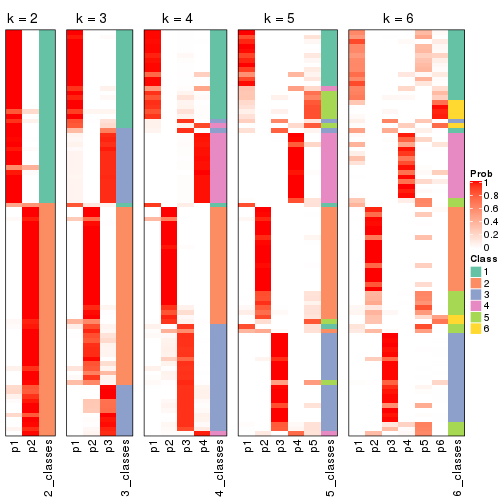


If matrix rows can be associated to genes, consider to use `functional_enrichment(res,
...)` to perform function enrichment for the signature genes. See [this vignette](http://bioconductor.org/packages/devel/bioc/vignettes/cola/inst/doc/functional_enrichment.html) for more detailed explanations.


 

---------------------------------------------------


### MAD:hclust


The object with results only for a single top-value method and a single partition method 
can be extracted as:

```r
res = res_list["MAD", "hclust"]
# you can also extract it by
# res = res_list["MAD:hclust"]
```

A summary of `res` and all the functions that can be applied to it:

```r
res
```

```
#> A 'ConsensusPartition' object with k = 2, 3, 4, 5, 6.
#>   On a matrix with 17471 rows and 87 columns.
#>   Top rows (1000, 2000, 3000, 4000, 5000) are extracted by 'MAD' method.
#>   Subgroups are detected by 'hclust' method.
#>   Performed in total 1250 partitions by row resampling.
#>   Best k for subgroups seems to be 2.
#> 
#> Following methods can be applied to this 'ConsensusPartition' object:
#>  [1] "cola_report"             "collect_classes"         "collect_plots"          
#>  [4] "collect_stats"           "colnames"                "compare_signatures"     
#>  [7] "consensus_heatmap"       "dimension_reduction"     "functional_enrichment"  
#> [10] "get_anno_col"            "get_anno"                "get_classes"            
#> [13] "get_consensus"           "get_matrix"              "get_membership"         
#> [16] "get_param"               "get_signatures"          "get_stats"              
#> [19] "is_best_k"               "is_stable_k"             "membership_heatmap"     
#> [22] "ncol"                    "nrow"                    "plot_ecdf"              
#> [25] "rownames"                "select_partition_number" "show"                   
#> [28] "suggest_best_k"          "test_to_known_factors"
```

`collect_plots()` function collects all the plots made from `res` for all `k` (number of partitions)
into one single page to provide an easy and fast comparison between different `k`.

```r
collect_plots(res)
```


The plots are:

- The first row: a plot of the ECDF (empirical cumulative distribution
  function) curves of the consensus matrix for each `k` and the heatmap of
  predicted classes for each `k`.
- The second row: heatmaps of the consensus matrix for each `k`.
- The third row: heatmaps of the membership matrix for each `k`.
- The fouth row: heatmaps of the signatures for each `k`.

All the plots in panels can be made by individual functions and they are
plotted later in this section.

`select_partition_number()` produces several plots showing different
statistics for choosing "optimized" `k`. There are following statistics:

- ECDF curves of the consensus matrix for each `k`;
- 1-PAC. [The PAC
  score](https://en.wikipedia.org/wiki/Consensus_clustering#Over-interpretation_potential_of_consensus_clustering)
  measures the proportion of the ambiguous subgrouping.
- Mean silhouette score.
- Concordance. The mean probability of fiting the consensus class ids in all
  partitions.
- Area increased. Denote $A_k$ as the area under the ECDF curve for current
  `k`, the area increased is defined as $A_k - A_{k-1}$.
- Rand index. The percent of pairs of samples that are both in a same cluster
  or both are not in a same cluster in the partition of k and k-1.
- Jaccard index. The ratio of pairs of samples are both in a same cluster in
  the partition of k and k-1 and the pairs of samples are both in a same
  cluster in the partition k or k-1.

The detailed explanations of these statistics can be found in [the _cola_
vignette](http://bioconductor.org/packages/devel/bioc/vignettes/cola/inst/doc/cola.html#toc_13).

Generally speaking, lower PAC score, higher mean silhouette score or higher
concordance corresponds to better partition. Rand index and Jaccard index
measure how similar the current partition is compared to partition with `k-1`.
If they are too similar, we won't accept `k` is better than `k-1`.

```r
select_partition_number(res)
```


The numeric values for all these statistics can be obtained by `get_stats()`.

```r
get_stats(res)
```

```
#>   k 1-PAC mean_silhouette concordance area_increased  Rand Jaccard
#> 2 2 0.444           0.778       0.878         0.4396 0.513   0.513
#> 3 3 0.304           0.665       0.790         0.2093 0.926   0.856
#> 4 4 0.446           0.525       0.733         0.1665 0.924   0.835
#> 5 5 0.482           0.234       0.591         0.1159 0.822   0.598
#> 6 6 0.461           0.591       0.749         0.0723 0.778   0.424
```

`suggest_best_k()` suggests the best $k$ based on these statistics. The rules are as follows:

- All $k$ with Jaccard index larger than 0.95 are removed because increasing
  $k$ does not provide enough extra information. If all $k$ are removed, it is
  marked as no subgroup is detected.
- For all $k$ with 1-PAC score larger than 0.9, the maximal $k$ is taken as
  the best $k$, and other $k$ are marked as optional $k$.
- If it does not fit the second rule. The $k$ with the maximal vote of the
  highest 1-PAC score, highest mean silhouette, and highest concordance is
  taken as the best $k$.

```r
suggest_best_k(res)
```

```
#> [1] 2
```


Following shows the table of the partitions (You need to click the **show/hide
code output** link to see it). The membership matrix (columns with name `p*`)
is inferred by
[`clue::cl_consensus()`](https://www.rdocumentation.org/link/cl_consensus?package=clue)
function with the `SE` method. Basically the value in the membership matrix
represents the probability to belong to a certain group. The finall class
label for an item is determined with the group with highest probability it
belongs to.

In `get_classes()` function, the entropy is calculated from the membership
matrix and the silhouette score is calculated from the consensus matrix.


<script>
$( function() {
	$( '#tabs-MAD-hclust-get-classes' ).tabs();
} );
</script>
<div id='tabs-MAD-hclust-get-classes'>
<ul>
<li><a href='#tab-MAD-hclust-get-classes-1'>k = 2</a></li>
<li><a href='#tab-MAD-hclust-get-classes-2'>k = 3</a></li>
<li><a href='#tab-MAD-hclust-get-classes-3'>k = 4</a></li>
<li><a href='#tab-MAD-hclust-get-classes-4'>k = 5</a></li>
<li><a href='#tab-MAD-hclust-get-classes-5'>k = 6</a></li>
</ul>

<div id='tab-MAD-hclust-get-classes-1'>
<p><a id='tab-MAD-hclust-get-classes-1-a' style='color:#0366d6' href='#'>show/hide code output</a></p>
<pre><code class="r">cbind(get_classes(res, k = 2), get_membership(res, k = 2))
</code></pre>

<pre><code>#&gt;                                      class entropy silhouette    p1    p2
#&gt; E6088A41-B0DC-4FBF-8D14-BE78024CF8CD     2  0.3879     0.8956 0.076 0.924
#&gt; F569915C-8F77-4D67-9730-30824DB57EE5     2  0.4022     0.8944 0.080 0.920
#&gt; E3B71CB7-673B-4741-8607-4F0A11633036     1  0.0672     0.7919 0.992 0.008
#&gt; DAF84798-FE3F-403C-B589-7F256AF752BE     2  0.6712     0.8246 0.176 0.824
#&gt; 2F38E3B1-4975-4877-9DCC-C00270602180     1  0.0672     0.7919 0.992 0.008
#&gt; C79A4C2F-02C4-4C03-A5A5-DE06802EEB57     2  0.7139     0.7896 0.196 0.804
#&gt; 92E3ED8F-5C74-4ED2-9B03-9FA5E7B491D6     1  0.0672     0.7919 0.992 0.008
#&gt; E61D60BE-3BD3-4B5E-BC12-80F3684A0959     1  0.8909     0.6498 0.692 0.308
#&gt; C9388FC7-DB1D-4416-BC2D-EA643584F1E6     1  0.9977     0.2756 0.528 0.472
#&gt; D4219360-6344-4AF3-ACEB-1701A9F1F67D     1  0.0672     0.7919 0.992 0.008
#&gt; 07D155E6-F27C-4D09-B786-8A9B71147B72     1  0.3879     0.7891 0.924 0.076
#&gt; 10C8C361-85A5-40E8-A395-B92623E6F27C     1  0.1633     0.7949 0.976 0.024
#&gt; BDF20891-7C98-4A55-BBF3-8A836BE303C6     2  0.2043     0.8968 0.032 0.968
#&gt; 694B0504-095E-431A-84F2-B4387072138E     1  0.0938     0.7931 0.988 0.012
#&gt; EDCF8E7F-8B1D-46F7-8AE0-84A1DC9647D2     2  0.5408     0.8691 0.124 0.876
#&gt; 0EA8288E-824D-4304-A053-5A833361F5C5     1  0.9661     0.4896 0.608 0.392
#&gt; C4ACCFA1-34A9-4F61-8A1F-35B3B60EA193     1  0.1184     0.7934 0.984 0.016
#&gt; 760BA639-38AC-4BC9-9647-09F6893EA8ED     1  0.0672     0.7919 0.992 0.008
#&gt; 082DFC6B-C6E6-48B9-BDE5-74FF3B3DC954     2  0.3733     0.8963 0.072 0.928
#&gt; FE349848-D7C4-4C49-B670-0E20454DDD7E     2  0.7376     0.7762 0.208 0.792
#&gt; 2E8937B3-9EA1-4528-8CEE-BF3D4137908A     2  0.0376     0.8925 0.004 0.996
#&gt; 9942D04E-2767-4E39-BA16-7762EAC3DFC4     2  0.0672     0.8856 0.008 0.992
#&gt; F9C23182-91C4-4145-AE52-526FE8EB199D     2  0.7056     0.8025 0.192 0.808
#&gt; 01024EED-7811-4E24-A067-8E0B978FFE2D     2  0.0000     0.8909 0.000 1.000
#&gt; 932C8E98-A352-409C-8744-3D49FABCE425     1  0.1633     0.7929 0.976 0.024
#&gt; 6DFD9439-C659-4936-84E5-108F717E3E4D     2  0.5629     0.8621 0.132 0.868
#&gt; 1D8B83B8-5DD7-4F45-9D59-487EC6906A8B     2  0.3733     0.8981 0.072 0.928
#&gt; 804B8503-73F6-42DE-835F-39DE2C9F13E1     2  0.0000     0.8909 0.000 1.000
#&gt; B9453C9B-84D5-43BD-85BB-1780F02F039C     1  0.0672     0.7919 0.992 0.008
#&gt; 836E6CD6-4E88-4028-9844-FA3C892C254A     1  0.9933     0.3132 0.548 0.452
#&gt; 36EDD202-A845-4CE7-95D5-A515C471262E     2  0.0376     0.8922 0.004 0.996
#&gt; 181C156A-B8F4-4F9D-93AA-6AFBD197644D     2  0.6887     0.7585 0.184 0.816
#&gt; 0580E798-6A98-4E46-AC96-9A869DFF502E     1  0.4022     0.7875 0.920 0.080
#&gt; EA1B63CF-D389-4567-8D9E-B0EF1F804598     2  0.7056     0.8025 0.192 0.808
#&gt; 5ABC3D06-B8E9-4831-B89B-7C1EC4006B47     2  0.0672     0.8856 0.008 0.992
#&gt; 1CC01E74-A7C1-4A51-9E28-1703C352BE16     2  0.0000     0.8909 0.000 1.000
#&gt; 97E55B75-DBDB-46BC-9E74-7828C070BF16     2  0.0376     0.8925 0.004 0.996
#&gt; BEB37A2D-E8B0-4674-89AC-DC0F34E0AFD6     1  0.9754     0.4673 0.592 0.408
#&gt; 558648BA-6551-4D34-97C2-AD5F677D63FB     2  0.8207     0.6829 0.256 0.744
#&gt; FF7021BB-414B-4466-BC43-372D856E6A1D     2  0.4815     0.8734 0.104 0.896
#&gt; 9C04B840-54E0-425D-BDBE-8CB6B9C2C722     2  0.4161     0.8926 0.084 0.916
#&gt; 5F50B1F4-1A02-4506-AA6D-9BF21CD8059A     1  0.9209     0.6122 0.664 0.336
#&gt; 7D4B8FF3-7977-4ABD-AE04-EED1C50B23CC     2  0.6973     0.8080 0.188 0.812
#&gt; A005AF15-B98E-4623-8AD4-1E69EFA9BC7A     1  0.8909     0.6498 0.692 0.308
#&gt; 1DF04345-5C93-4B18-B307-8D1FCA532999     2  0.0376     0.8925 0.004 0.996
#&gt; 6AF30C18-347E-41ED-A4AB-6F81F42206C5     1  0.8499     0.6780 0.724 0.276
#&gt; 88A44ED0-BDE1-401E-B0E1-D8C8D6DBAEFC     2  0.3733     0.8963 0.072 0.928
#&gt; 117673A3-2918-4702-8583-B66ADE6E4338     2  0.5519     0.8651 0.128 0.872
#&gt; 4903A571-E14D-43C9-A737-22CAFAC414CD     2  0.6973     0.8080 0.188 0.812
#&gt; C175E68E-632A-4B4A-9DDB-4895C4760F20     1  0.1414     0.7934 0.980 0.020
#&gt; FA5CA2F4-A1AD-4A79-B8F3-73A976EB2FB1     2  0.2603     0.8974 0.044 0.956
#&gt; E1F883A7-8B1F-4C1D-8A1A-9749A9C09845     2  0.0376     0.8925 0.004 0.996
#&gt; E74F0729-6000-4908-ADB0-7BDBAC0639E6     1  0.0672     0.7919 0.992 0.008
#&gt; F92135A9-1981-4C79-99A5-4243EEC5D30D     2  0.0000     0.8909 0.000 1.000
#&gt; 73C6919F-DEB4-4DA4-B4AE-4032AC8F96C5     1  0.1633     0.7949 0.976 0.024
#&gt; 33977B40-2E92-48B6-8D3A-3EBE913F6F8A     1  0.9866     0.3956 0.568 0.432
#&gt; 490BD607-2F08-4B4C-9612-F9BB5CBBC8BB     2  0.4022     0.8944 0.080 0.920
#&gt; 6C666E17-2EB8-4244-BCC1-8DD34EE4173E     2  0.4298     0.8921 0.088 0.912
#&gt; C41F3064-4483-4796-B860-82155BAA5157     1  0.3733     0.7899 0.928 0.072
#&gt; F4232B90-51B9-43EE-9971-35B3A318758F     1  0.4022     0.7875 0.920 0.080
#&gt; 291EA1F6-FC56-4429-A433-0C452A6A514C     2  0.0000     0.8909 0.000 1.000
#&gt; CC4AF04D-CB8E-40DD-B12E-7AA39B38262A     2  0.0672     0.8856 0.008 0.992
#&gt; 4DAE26B9-AB57-4763-BB9A-2ADDD5D9C007     1  0.8861     0.6539 0.696 0.304
#&gt; 676B4AEE-FB41-4C16-AA91-03E4A1DA8E26     2  0.9977    -0.0934 0.472 0.528
#&gt; 1CC36859-357A-49E0-A367-4F57D47288BA     2  0.7453     0.7731 0.212 0.788
#&gt; 7CCDDFC8-6DF6-4734-96AC-19EBC464FC50     2  0.0000     0.8909 0.000 1.000
#&gt; 10F38C34-3956-48ED-AB62-3439EF00D46B     2  0.3431     0.8943 0.064 0.936
#&gt; 80B2B393-9D6E-45B4-B696-2A5C203543B7     2  0.0376     0.8925 0.004 0.996
#&gt; 5AC7B5EA-1AAC-4529-8E5A-F612E5E0719A     1  0.9998     0.2512 0.508 0.492
#&gt; 3648E98D-4B3A-41B7-BE05-595D44F0150D     1  0.0000     0.7866 1.000 0.000
#&gt; 252EC850-6026-473B-8FFC-2CF567EF42E4     1  0.9129     0.6234 0.672 0.328
#&gt; 1790E7A3-99D8-447E-BC50-51C8A4A18853     2  0.0000     0.8909 0.000 1.000
#&gt; DA61A4F8-350B-4DD1-A240-AD016520DB5B     2  0.4022     0.8944 0.080 0.920
#&gt; 767E5BAF-2515-40D7-AE7D-0B24D77A03F4     2  0.7376     0.7762 0.208 0.792
#&gt; 8CB9C903-D749-44EA-9137-7FB5A92C5932     1  0.3274     0.7877 0.940 0.060
#&gt; A9B968AE-2243-41BC-852A-3A12C1FB4892     1  0.8909     0.6506 0.692 0.308
#&gt; 3C582264-85BC-4569-A888-8EB3008E5198     2  0.0000     0.8909 0.000 1.000
#&gt; F4EAF9A2-9938-4D9B-9080-C0A7542D5704     2  0.0000     0.8909 0.000 1.000
#&gt; 328499D3-45DD-4B66-BD22-3C52BA92C2BB     1  0.0672     0.7919 0.992 0.008
#&gt; AF8AB83D-2917-4752-8C38-CF84C565B565     1  0.9635     0.4989 0.612 0.388
#&gt; 03A327CA-A9FE-42A4-844D-CA85206969FC     2  0.3431     0.8979 0.064 0.936
#&gt; 4B0BEC44-87BB-4014-9A26-3529DD63760B     2  0.4022     0.8944 0.080 0.920
#&gt; 05C7843E-DC89-4D8E-A78A-952C5DFD667B     2  0.7139     0.7896 0.196 0.804
#&gt; 29A0FFF9-13D3-4D16-BE6A-8E48A2C4E315     2  0.0000     0.8909 0.000 1.000
#&gt; 22947CC3-4F42-4F44-899C-2B7085E36C9D     2  0.3879     0.8956 0.076 0.924
#&gt; A247D92D-253A-4BEC-B450-184AF90D17D0     2  0.3733     0.8963 0.072 0.928
#&gt; 0D907A63-D23F-4684-80D9-0BA552435B86     1  0.8909     0.6498 0.692 0.308
</code></pre>

<script>
$('#tab-MAD-hclust-get-classes-1-a').parent().next().next().hide();
$('#tab-MAD-hclust-get-classes-1-a').click(function(){
  $('#tab-MAD-hclust-get-classes-1-a').parent().next().next().toggle();
  return(false);
});
</script>
</div>

<div id='tab-MAD-hclust-get-classes-2'>
<p><a id='tab-MAD-hclust-get-classes-2-a' style='color:#0366d6' href='#'>show/hide code output</a></p>
<pre><code class="r">cbind(get_classes(res, k = 3), get_membership(res, k = 3))
</code></pre>

<pre><code>#&gt;                                      class entropy silhouette    p1    p2    p3
#&gt; E6088A41-B0DC-4FBF-8D14-BE78024CF8CD     2  0.4399      0.815 0.188 0.812 0.000
#&gt; F569915C-8F77-4D67-9730-30824DB57EE5     2  0.4504      0.811 0.196 0.804 0.000
#&gt; E3B71CB7-673B-4741-8607-4F0A11633036     3  0.5178      0.901 0.256 0.000 0.744
#&gt; DAF84798-FE3F-403C-B589-7F256AF752BE     2  0.6295      0.758 0.236 0.728 0.036
#&gt; 2F38E3B1-4975-4877-9DCC-C00270602180     1  0.5706     -0.210 0.680 0.000 0.320
#&gt; C79A4C2F-02C4-4C03-A5A5-DE06802EEB57     2  0.6224      0.701 0.296 0.688 0.016
#&gt; 92E3ED8F-5C74-4ED2-9B03-9FA5E7B491D6     3  0.5178      0.901 0.256 0.000 0.744
#&gt; E61D60BE-3BD3-4B5E-BC12-80F3684A0959     1  0.5115      0.657 0.796 0.188 0.016
#&gt; C9388FC7-DB1D-4416-BC2D-EA643584F1E6     1  0.5859      0.437 0.656 0.344 0.000
#&gt; D4219360-6344-4AF3-ACEB-1701A9F1F67D     3  0.5178      0.901 0.256 0.000 0.744
#&gt; 07D155E6-F27C-4D09-B786-8A9B71147B72     1  0.3918      0.257 0.856 0.004 0.140
#&gt; 10C8C361-85A5-40E8-A395-B92623E6F27C     1  0.6735     -0.429 0.564 0.012 0.424
#&gt; BDF20891-7C98-4A55-BBF3-8A836BE303C6     2  0.1860      0.816 0.052 0.948 0.000
#&gt; 694B0504-095E-431A-84F2-B4387072138E     3  0.5404      0.899 0.256 0.004 0.740
#&gt; EDCF8E7F-8B1D-46F7-8AE0-84A1DC9647D2     2  0.4974      0.789 0.236 0.764 0.000
#&gt; 0EA8288E-824D-4304-A053-5A833361F5C5     1  0.6632      0.593 0.692 0.272 0.036
#&gt; C4ACCFA1-34A9-4F61-8A1F-35B3B60EA193     3  0.5656      0.891 0.264 0.008 0.728
#&gt; 760BA639-38AC-4BC9-9647-09F6893EA8ED     3  0.5178      0.901 0.256 0.000 0.744
#&gt; 082DFC6B-C6E6-48B9-BDE5-74FF3B3DC954     2  0.4399      0.814 0.188 0.812 0.000
#&gt; FE349848-D7C4-4C49-B670-0E20454DDD7E     2  0.5785      0.665 0.332 0.668 0.000
#&gt; 2E8937B3-9EA1-4528-8CEE-BF3D4137908A     2  0.0237      0.809 0.004 0.996 0.000
#&gt; 9942D04E-2767-4E39-BA16-7762EAC3DFC4     2  0.1877      0.785 0.012 0.956 0.032
#&gt; F9C23182-91C4-4145-AE52-526FE8EB199D     2  0.6940      0.740 0.224 0.708 0.068
#&gt; 01024EED-7811-4E24-A067-8E0B978FFE2D     2  0.0000      0.808 0.000 1.000 0.000
#&gt; 932C8E98-A352-409C-8744-3D49FABCE425     3  0.5992      0.877 0.268 0.016 0.716
#&gt; 6DFD9439-C659-4936-84E5-108F717E3E4D     2  0.4931      0.787 0.232 0.768 0.000
#&gt; 1D8B83B8-5DD7-4F45-9D59-487EC6906A8B     2  0.4645      0.819 0.176 0.816 0.008
#&gt; 804B8503-73F6-42DE-835F-39DE2C9F13E1     2  0.0000      0.808 0.000 1.000 0.000
#&gt; B9453C9B-84D5-43BD-85BB-1780F02F039C     3  0.4796      0.866 0.220 0.000 0.780
#&gt; 836E6CD6-4E88-4028-9844-FA3C892C254A     1  0.6955      0.452 0.636 0.332 0.032
#&gt; 36EDD202-A845-4CE7-95D5-A515C471262E     2  0.0424      0.810 0.008 0.992 0.000
#&gt; 181C156A-B8F4-4F9D-93AA-6AFBD197644D     2  0.5053      0.645 0.164 0.812 0.024
#&gt; 0580E798-6A98-4E46-AC96-9A869DFF502E     1  0.7124      0.100 0.672 0.056 0.272
#&gt; EA1B63CF-D389-4567-8D9E-B0EF1F804598     2  0.6940      0.740 0.224 0.708 0.068
#&gt; 5ABC3D06-B8E9-4831-B89B-7C1EC4006B47     2  0.1877      0.785 0.012 0.956 0.032
#&gt; 1CC01E74-A7C1-4A51-9E28-1703C352BE16     2  0.0424      0.804 0.008 0.992 0.000
#&gt; 97E55B75-DBDB-46BC-9E74-7828C070BF16     2  0.1337      0.798 0.016 0.972 0.012
#&gt; BEB37A2D-E8B0-4674-89AC-DC0F34E0AFD6     1  0.6193      0.574 0.692 0.292 0.016
#&gt; 558648BA-6551-4D34-97C2-AD5F677D63FB     2  0.6867      0.598 0.336 0.636 0.028
#&gt; FF7021BB-414B-4466-BC43-372D856E6A1D     2  0.5891      0.782 0.200 0.764 0.036
#&gt; 9C04B840-54E0-425D-BDBE-8CB6B9C2C722     2  0.3340      0.817 0.120 0.880 0.000
#&gt; 5F50B1F4-1A02-4506-AA6D-9BF21CD8059A     1  0.5109      0.655 0.780 0.212 0.008
#&gt; 7D4B8FF3-7977-4ABD-AE04-EED1C50B23CC     2  0.6416      0.735 0.260 0.708 0.032
#&gt; A005AF15-B98E-4623-8AD4-1E69EFA9BC7A     1  0.5115      0.657 0.796 0.188 0.016
#&gt; 1DF04345-5C93-4B18-B307-8D1FCA532999     2  0.0237      0.809 0.004 0.996 0.000
#&gt; 6AF30C18-347E-41ED-A4AB-6F81F42206C5     1  0.5891      0.630 0.780 0.168 0.052
#&gt; 88A44ED0-BDE1-401E-B0E1-D8C8D6DBAEFC     2  0.4399      0.814 0.188 0.812 0.000
#&gt; 117673A3-2918-4702-8583-B66ADE6E4338     2  0.4887      0.789 0.228 0.772 0.000
#&gt; 4903A571-E14D-43C9-A737-22CAFAC414CD     2  0.6416      0.735 0.260 0.708 0.032
#&gt; C175E68E-632A-4B4A-9DDB-4895C4760F20     3  0.5848      0.883 0.268 0.012 0.720
#&gt; FA5CA2F4-A1AD-4A79-B8F3-73A976EB2FB1     2  0.3816      0.822 0.148 0.852 0.000
#&gt; E1F883A7-8B1F-4C1D-8A1A-9749A9C09845     2  0.0237      0.809 0.004 0.996 0.000
#&gt; E74F0729-6000-4908-ADB0-7BDBAC0639E6     1  0.5882     -0.275 0.652 0.000 0.348
#&gt; F92135A9-1981-4C79-99A5-4243EEC5D30D     2  0.0000      0.808 0.000 1.000 0.000
#&gt; 73C6919F-DEB4-4DA4-B4AE-4032AC8F96C5     1  0.6357     -0.224 0.652 0.012 0.336
#&gt; 33977B40-2E92-48B6-8D3A-3EBE913F6F8A     1  0.6143      0.529 0.684 0.304 0.012
#&gt; 490BD607-2F08-4B4C-9612-F9BB5CBBC8BB     2  0.4504      0.811 0.196 0.804 0.000
#&gt; 6C666E17-2EB8-4244-BCC1-8DD34EE4173E     2  0.4784      0.808 0.200 0.796 0.004
#&gt; C41F3064-4483-4796-B860-82155BAA5157     1  0.3784      0.256 0.864 0.004 0.132
#&gt; F4232B90-51B9-43EE-9971-35B3A318758F     1  0.7124      0.100 0.672 0.056 0.272
#&gt; 291EA1F6-FC56-4429-A433-0C452A6A514C     2  0.0747      0.813 0.016 0.984 0.000
#&gt; CC4AF04D-CB8E-40DD-B12E-7AA39B38262A     2  0.1482      0.792 0.012 0.968 0.020
#&gt; 4DAE26B9-AB57-4763-BB9A-2ADDD5D9C007     1  0.5384      0.655 0.788 0.188 0.024
#&gt; 676B4AEE-FB41-4C16-AA91-03E4A1DA8E26     2  0.9544     -0.205 0.364 0.440 0.196
#&gt; 1CC36859-357A-49E0-A367-4F57D47288BA     2  0.6621      0.702 0.284 0.684 0.032
#&gt; 7CCDDFC8-6DF6-4734-96AC-19EBC464FC50     2  0.0237      0.806 0.004 0.996 0.000
#&gt; 10F38C34-3956-48ED-AB62-3439EF00D46B     2  0.4521      0.813 0.180 0.816 0.004
#&gt; 80B2B393-9D6E-45B4-B696-2A5C203543B7     2  0.0237      0.809 0.004 0.996 0.000
#&gt; 5AC7B5EA-1AAC-4529-8E5A-F612E5E0719A     1  0.7279      0.376 0.588 0.376 0.036
#&gt; 3648E98D-4B3A-41B7-BE05-595D44F0150D     3  0.6204      0.537 0.424 0.000 0.576
#&gt; 252EC850-6026-473B-8FFC-2CF567EF42E4     1  0.5318      0.656 0.780 0.204 0.016
#&gt; 1790E7A3-99D8-447E-BC50-51C8A4A18853     2  0.0000      0.808 0.000 1.000 0.000
#&gt; DA61A4F8-350B-4DD1-A240-AD016520DB5B     2  0.4504      0.811 0.196 0.804 0.000
#&gt; 767E5BAF-2515-40D7-AE7D-0B24D77A03F4     2  0.5785      0.665 0.332 0.668 0.000
#&gt; 8CB9C903-D749-44EA-9137-7FB5A92C5932     3  0.5431      0.451 0.284 0.000 0.716
#&gt; A9B968AE-2243-41BC-852A-3A12C1FB4892     1  0.6585      0.642 0.736 0.200 0.064
#&gt; 3C582264-85BC-4569-A888-8EB3008E5198     2  0.0237      0.806 0.004 0.996 0.000
#&gt; F4EAF9A2-9938-4D9B-9080-C0A7542D5704     2  0.0475      0.805 0.004 0.992 0.004
#&gt; 328499D3-45DD-4B66-BD22-3C52BA92C2BB     3  0.5178      0.901 0.256 0.000 0.744
#&gt; AF8AB83D-2917-4752-8C38-CF84C565B565     1  0.6597      0.599 0.696 0.268 0.036
#&gt; 03A327CA-A9FE-42A4-844D-CA85206969FC     2  0.4235      0.818 0.176 0.824 0.000
#&gt; 4B0BEC44-87BB-4014-9A26-3529DD63760B     2  0.4504      0.811 0.196 0.804 0.000
#&gt; 05C7843E-DC89-4D8E-A78A-952C5DFD667B     2  0.6224      0.701 0.296 0.688 0.016
#&gt; 29A0FFF9-13D3-4D16-BE6A-8E48A2C4E315     2  0.0000      0.808 0.000 1.000 0.000
#&gt; 22947CC3-4F42-4F44-899C-2B7085E36C9D     2  0.4399      0.815 0.188 0.812 0.000
#&gt; A247D92D-253A-4BEC-B450-184AF90D17D0     2  0.4399      0.814 0.188 0.812 0.000
#&gt; 0D907A63-D23F-4684-80D9-0BA552435B86     1  0.5115      0.657 0.796 0.188 0.016
</code></pre>

<script>
$('#tab-MAD-hclust-get-classes-2-a').parent().next().next().hide();
$('#tab-MAD-hclust-get-classes-2-a').click(function(){
  $('#tab-MAD-hclust-get-classes-2-a').parent().next().next().toggle();
  return(false);
});
</script>
</div>

<div id='tab-MAD-hclust-get-classes-3'>
<p><a id='tab-MAD-hclust-get-classes-3-a' style='color:#0366d6' href='#'>show/hide code output</a></p>
<pre><code class="r">cbind(get_classes(res, k = 4), get_membership(res, k = 4))
</code></pre>

<pre><code>#&gt;                                      class entropy silhouette    p1    p2    p3    p4
#&gt; E6088A41-B0DC-4FBF-8D14-BE78024CF8CD     2  0.5429     0.6239 0.004 0.592 0.012 0.392
#&gt; F569915C-8F77-4D67-9730-30824DB57EE5     2  0.5244     0.6277 0.000 0.600 0.012 0.388
#&gt; E3B71CB7-673B-4741-8607-4F0A11633036     1  0.0000     0.7901 1.000 0.000 0.000 0.000
#&gt; DAF84798-FE3F-403C-B589-7F256AF752BE     2  0.6592     0.5300 0.048 0.532 0.016 0.404
#&gt; 2F38E3B1-4975-4877-9DCC-C00270602180     4  0.7640    -0.1290 0.356 0.000 0.212 0.432
#&gt; C79A4C2F-02C4-4C03-A5A5-DE06802EEB57     2  0.6186     0.4754 0.028 0.492 0.012 0.468
#&gt; 92E3ED8F-5C74-4ED2-9B03-9FA5E7B491D6     1  0.0000     0.7901 1.000 0.000 0.000 0.000
#&gt; E61D60BE-3BD3-4B5E-BC12-80F3684A0959     4  0.3050     0.6235 0.044 0.012 0.044 0.900
#&gt; C9388FC7-DB1D-4416-BC2D-EA643584F1E6     4  0.4358     0.5605 0.016 0.124 0.036 0.824
#&gt; D4219360-6344-4AF3-ACEB-1701A9F1F67D     1  0.0000     0.7901 1.000 0.000 0.000 0.000
#&gt; 07D155E6-F27C-4D09-B786-8A9B71147B72     4  0.6392     0.0449 0.068 0.000 0.404 0.528
#&gt; 10C8C361-85A5-40E8-A395-B92623E6F27C     1  0.6503     0.3666 0.640 0.000 0.164 0.196
#&gt; BDF20891-7C98-4A55-BBF3-8A836BE303C6     2  0.2593     0.6780 0.004 0.892 0.000 0.104
#&gt; 694B0504-095E-431A-84F2-B4387072138E     1  0.0188     0.7894 0.996 0.000 0.000 0.004
#&gt; EDCF8E7F-8B1D-46F7-8AE0-84A1DC9647D2     2  0.5689     0.5738 0.004 0.564 0.020 0.412
#&gt; 0EA8288E-824D-4304-A053-5A833361F5C5     4  0.5689     0.6070 0.048 0.120 0.068 0.764
#&gt; C4ACCFA1-34A9-4F61-8A1F-35B3B60EA193     1  0.0657     0.7851 0.984 0.000 0.004 0.012
#&gt; 760BA639-38AC-4BC9-9647-09F6893EA8ED     1  0.0000     0.7901 1.000 0.000 0.000 0.000
#&gt; 082DFC6B-C6E6-48B9-BDE5-74FF3B3DC954     2  0.5217     0.6326 0.000 0.608 0.012 0.380
#&gt; FE349848-D7C4-4C49-B670-0E20454DDD7E     4  0.5628    -0.3704 0.000 0.420 0.024 0.556
#&gt; 2E8937B3-9EA1-4528-8CEE-BF3D4137908A     2  0.0336     0.6759 0.000 0.992 0.000 0.008
#&gt; 9942D04E-2767-4E39-BA16-7762EAC3DFC4     2  0.1211     0.6501 0.000 0.960 0.040 0.000
#&gt; F9C23182-91C4-4145-AE52-526FE8EB199D     2  0.6993     0.5149 0.076 0.520 0.016 0.388
#&gt; 01024EED-7811-4E24-A067-8E0B978FFE2D     2  0.0188     0.6748 0.000 0.996 0.000 0.004
#&gt; 932C8E98-A352-409C-8744-3D49FABCE425     1  0.1229     0.7707 0.968 0.008 0.004 0.020
#&gt; 6DFD9439-C659-4936-84E5-108F717E3E4D     2  0.5589     0.5672 0.004 0.568 0.016 0.412
#&gt; 1D8B83B8-5DD7-4F45-9D59-487EC6906A8B     2  0.5498     0.6474 0.004 0.624 0.020 0.352
#&gt; 804B8503-73F6-42DE-835F-39DE2C9F13E1     2  0.0188     0.6748 0.000 0.996 0.000 0.004
#&gt; B9453C9B-84D5-43BD-85BB-1780F02F039C     1  0.2647     0.6409 0.880 0.000 0.120 0.000
#&gt; 836E6CD6-4E88-4028-9844-FA3C892C254A     4  0.7190     0.4878 0.108 0.180 0.060 0.652
#&gt; 36EDD202-A845-4CE7-95D5-A515C471262E     2  0.2021     0.6750 0.000 0.932 0.012 0.056
#&gt; 181C156A-B8F4-4F9D-93AA-6AFBD197644D     2  0.3808     0.4895 0.184 0.808 0.004 0.004
#&gt; 0580E798-6A98-4E46-AC96-9A869DFF502E     4  0.7164     0.1775 0.296 0.004 0.148 0.552
#&gt; EA1B63CF-D389-4567-8D9E-B0EF1F804598     2  0.7001     0.5126 0.076 0.516 0.016 0.392
#&gt; 5ABC3D06-B8E9-4831-B89B-7C1EC4006B47     2  0.1211     0.6501 0.000 0.960 0.040 0.000
#&gt; 1CC01E74-A7C1-4A51-9E28-1703C352BE16     2  0.0188     0.6712 0.000 0.996 0.004 0.000
#&gt; 97E55B75-DBDB-46BC-9E74-7828C070BF16     2  0.0895     0.6644 0.000 0.976 0.020 0.004
#&gt; BEB37A2D-E8B0-4674-89AC-DC0F34E0AFD6     4  0.5122     0.6220 0.044 0.112 0.048 0.796
#&gt; 558648BA-6551-4D34-97C2-AD5F677D63FB     2  0.6835     0.3986 0.048 0.476 0.024 0.452
#&gt; FF7021BB-414B-4466-BC43-372D856E6A1D     2  0.6147     0.5711 0.000 0.564 0.056 0.380
#&gt; 9C04B840-54E0-425D-BDBE-8CB6B9C2C722     2  0.4368     0.6600 0.004 0.748 0.004 0.244
#&gt; 5F50B1F4-1A02-4506-AA6D-9BF21CD8059A     4  0.3210     0.6272 0.036 0.024 0.044 0.896
#&gt; 7D4B8FF3-7977-4ABD-AE04-EED1C50B23CC     2  0.6655     0.4633 0.048 0.472 0.016 0.464
#&gt; A005AF15-B98E-4623-8AD4-1E69EFA9BC7A     4  0.3050     0.6235 0.044 0.012 0.044 0.900
#&gt; 1DF04345-5C93-4B18-B307-8D1FCA532999     2  0.0336     0.6759 0.000 0.992 0.000 0.008
#&gt; 6AF30C18-347E-41ED-A4AB-6F81F42206C5     4  0.3909     0.6010 0.080 0.012 0.052 0.856
#&gt; 88A44ED0-BDE1-401E-B0E1-D8C8D6DBAEFC     2  0.5217     0.6326 0.000 0.608 0.012 0.380
#&gt; 117673A3-2918-4702-8583-B66ADE6E4338     2  0.5580     0.5721 0.004 0.572 0.016 0.408
#&gt; 4903A571-E14D-43C9-A737-22CAFAC414CD     2  0.6655     0.4633 0.048 0.472 0.016 0.464
#&gt; C175E68E-632A-4B4A-9DDB-4895C4760F20     1  0.1082     0.7756 0.972 0.004 0.004 0.020
#&gt; FA5CA2F4-A1AD-4A79-B8F3-73A976EB2FB1     2  0.4836     0.6578 0.000 0.672 0.008 0.320
#&gt; E1F883A7-8B1F-4C1D-8A1A-9749A9C09845     2  0.0336     0.6759 0.000 0.992 0.000 0.008
#&gt; E74F0729-6000-4908-ADB0-7BDBAC0639E6     1  0.7629     0.0425 0.400 0.000 0.204 0.396
#&gt; F92135A9-1981-4C79-99A5-4243EEC5D30D     2  0.0188     0.6748 0.000 0.996 0.000 0.004
#&gt; 73C6919F-DEB4-4DA4-B4AE-4032AC8F96C5     4  0.7586    -0.1809 0.388 0.000 0.196 0.416
#&gt; 33977B40-2E92-48B6-8D3A-3EBE913F6F8A     4  0.5634     0.5672 0.044 0.152 0.048 0.756
#&gt; 490BD607-2F08-4B4C-9612-F9BB5CBBC8BB     2  0.5244     0.6277 0.000 0.600 0.012 0.388
#&gt; 6C666E17-2EB8-4244-BCC1-8DD34EE4173E     2  0.5429     0.6224 0.004 0.592 0.012 0.392
#&gt; C41F3064-4483-4796-B860-82155BAA5157     4  0.6804     0.0594 0.104 0.000 0.376 0.520
#&gt; F4232B90-51B9-43EE-9971-35B3A318758F     4  0.7164     0.1775 0.296 0.004 0.148 0.552
#&gt; 291EA1F6-FC56-4429-A433-0C452A6A514C     2  0.2760     0.6824 0.000 0.872 0.000 0.128
#&gt; CC4AF04D-CB8E-40DD-B12E-7AA39B38262A     2  0.0921     0.6583 0.000 0.972 0.028 0.000
#&gt; 4DAE26B9-AB57-4763-BB9A-2ADDD5D9C007     4  0.3221     0.6209 0.048 0.012 0.048 0.892
#&gt; 676B4AEE-FB41-4C16-AA91-03E4A1DA8E26     2  0.8641    -0.0868 0.048 0.384 0.376 0.192
#&gt; 1CC36859-357A-49E0-A367-4F57D47288BA     4  0.6780    -0.4507 0.056 0.452 0.016 0.476
#&gt; 7CCDDFC8-6DF6-4734-96AC-19EBC464FC50     2  0.0000     0.6735 0.000 1.000 0.000 0.000
#&gt; 10F38C34-3956-48ED-AB62-3439EF00D46B     2  0.5298     0.6351 0.000 0.612 0.016 0.372
#&gt; 80B2B393-9D6E-45B4-B696-2A5C203543B7     2  0.0336     0.6759 0.000 0.992 0.000 0.008
#&gt; 5AC7B5EA-1AAC-4529-8E5A-F612E5E0719A     4  0.6817     0.4756 0.044 0.224 0.076 0.656
#&gt; 3648E98D-4B3A-41B7-BE05-595D44F0150D     1  0.6970     0.2281 0.576 0.000 0.256 0.168
#&gt; 252EC850-6026-473B-8FFC-2CF567EF42E4     4  0.3272     0.6257 0.036 0.020 0.052 0.892
#&gt; 1790E7A3-99D8-447E-BC50-51C8A4A18853     2  0.0188     0.6748 0.000 0.996 0.000 0.004
#&gt; DA61A4F8-350B-4DD1-A240-AD016520DB5B     2  0.5244     0.6277 0.000 0.600 0.012 0.388
#&gt; 767E5BAF-2515-40D7-AE7D-0B24D77A03F4     4  0.5628    -0.3704 0.000 0.420 0.024 0.556
#&gt; 8CB9C903-D749-44EA-9137-7FB5A92C5932     3  0.4054     0.0000 0.188 0.000 0.796 0.016
#&gt; A9B968AE-2243-41BC-852A-3A12C1FB4892     4  0.4041     0.6060 0.044 0.020 0.084 0.852
#&gt; 3C582264-85BC-4569-A888-8EB3008E5198     2  0.0000     0.6735 0.000 1.000 0.000 0.000
#&gt; F4EAF9A2-9938-4D9B-9080-C0A7542D5704     2  0.0188     0.6720 0.000 0.996 0.004 0.000
#&gt; 328499D3-45DD-4B66-BD22-3C52BA92C2BB     1  0.0000     0.7901 1.000 0.000 0.000 0.000
#&gt; AF8AB83D-2917-4752-8C38-CF84C565B565     4  0.5635     0.6107 0.048 0.116 0.068 0.768
#&gt; 03A327CA-A9FE-42A4-844D-CA85206969FC     2  0.5339     0.6304 0.000 0.600 0.016 0.384
#&gt; 4B0BEC44-87BB-4014-9A26-3529DD63760B     2  0.5244     0.6277 0.000 0.600 0.012 0.388
#&gt; 05C7843E-DC89-4D8E-A78A-952C5DFD667B     2  0.6186     0.4754 0.028 0.492 0.012 0.468
#&gt; 29A0FFF9-13D3-4D16-BE6A-8E48A2C4E315     2  0.0188     0.6748 0.000 0.996 0.000 0.004
#&gt; 22947CC3-4F42-4F44-899C-2B7085E36C9D     2  0.5429     0.6239 0.004 0.592 0.012 0.392
#&gt; A247D92D-253A-4BEC-B450-184AF90D17D0     2  0.5217     0.6326 0.000 0.608 0.012 0.380
#&gt; 0D907A63-D23F-4684-80D9-0BA552435B86     4  0.3050     0.6235 0.044 0.012 0.044 0.900
</code></pre>

<script>
$('#tab-MAD-hclust-get-classes-3-a').parent().next().next().hide();
$('#tab-MAD-hclust-get-classes-3-a').click(function(){
  $('#tab-MAD-hclust-get-classes-3-a').parent().next().next().toggle();
  return(false);
});
</script>
</div>

<div id='tab-MAD-hclust-get-classes-4'>
<p><a id='tab-MAD-hclust-get-classes-4-a' style='color:#0366d6' href='#'>show/hide code output</a></p>
<pre><code class="r">cbind(get_classes(res, k = 5), get_membership(res, k = 5))
</code></pre>

<pre><code>#&gt;                                      class entropy silhouette    p1    p2    p3    p4    p5
#&gt; E6088A41-B0DC-4FBF-8D14-BE78024CF8CD     2  0.6868     -0.472 0.004 0.400 0.000 0.260 0.336
#&gt; F569915C-8F77-4D67-9730-30824DB57EE5     2  0.6658     -0.322 0.000 0.444 0.000 0.264 0.292
#&gt; E3B71CB7-673B-4741-8607-4F0A11633036     1  0.0609      0.778 0.980 0.000 0.000 0.020 0.000
#&gt; DAF84798-FE3F-403C-B589-7F256AF752BE     5  0.7668      0.856 0.048 0.292 0.000 0.300 0.360
#&gt; 2F38E3B1-4975-4877-9DCC-C00270602180     4  0.7443     -0.352 0.336 0.000 0.036 0.384 0.244
#&gt; C79A4C2F-02C4-4C03-A5A5-DE06802EEB57     4  0.7068     -0.503 0.012 0.360 0.000 0.372 0.256
#&gt; 92E3ED8F-5C74-4ED2-9B03-9FA5E7B491D6     1  0.0609      0.778 0.980 0.000 0.000 0.020 0.000
#&gt; E61D60BE-3BD3-4B5E-BC12-80F3684A0959     4  0.0324      0.479 0.000 0.000 0.004 0.992 0.004
#&gt; C9388FC7-DB1D-4416-BC2D-EA643584F1E6     4  0.3565      0.326 0.000 0.024 0.000 0.800 0.176
#&gt; D4219360-6344-4AF3-ACEB-1701A9F1F67D     1  0.0609      0.778 0.980 0.000 0.000 0.020 0.000
#&gt; 07D155E6-F27C-4D09-B786-8A9B71147B72     4  0.6916     -0.170 0.024 0.000 0.228 0.508 0.240
#&gt; 10C8C361-85A5-40E8-A395-B92623E6F27C     1  0.6255      0.526 0.616 0.004 0.016 0.176 0.188
#&gt; BDF20891-7C98-4A55-BBF3-8A836BE303C6     2  0.3169      0.406 0.000 0.856 0.000 0.084 0.060
#&gt; 694B0504-095E-431A-84F2-B4387072138E     1  0.0771      0.777 0.976 0.000 0.000 0.020 0.004
#&gt; EDCF8E7F-8B1D-46F7-8AE0-84A1DC9647D2     5  0.6898      0.831 0.004 0.300 0.000 0.296 0.400
#&gt; 0EA8288E-824D-4304-A053-5A833361F5C5     4  0.4244      0.381 0.012 0.000 0.012 0.728 0.248
#&gt; C4ACCFA1-34A9-4F61-8A1F-35B3B60EA193     1  0.1082      0.774 0.964 0.000 0.000 0.028 0.008
#&gt; 760BA639-38AC-4BC9-9647-09F6893EA8ED     1  0.0609      0.778 0.980 0.000 0.000 0.020 0.000
#&gt; 082DFC6B-C6E6-48B9-BDE5-74FF3B3DC954     2  0.6631     -0.307 0.000 0.452 0.000 0.256 0.292
#&gt; FE349848-D7C4-4C49-B670-0E20454DDD7E     4  0.6642     -0.549 0.000 0.228 0.000 0.420 0.352
#&gt; 2E8937B3-9EA1-4528-8CEE-BF3D4137908A     2  0.0162      0.500 0.000 0.996 0.000 0.004 0.000
#&gt; 9942D04E-2767-4E39-BA16-7762EAC3DFC4     2  0.3731      0.423 0.000 0.800 0.040 0.000 0.160
#&gt; F9C23182-91C4-4145-AE52-526FE8EB199D     5  0.7947      0.832 0.076 0.276 0.000 0.296 0.352
#&gt; 01024EED-7811-4E24-A067-8E0B978FFE2D     2  0.0609      0.497 0.000 0.980 0.000 0.000 0.020
#&gt; 932C8E98-A352-409C-8744-3D49FABCE425     1  0.1525      0.764 0.948 0.004 0.000 0.036 0.012
#&gt; 6DFD9439-C659-4936-84E5-108F717E3E4D     5  0.6941      0.847 0.004 0.324 0.000 0.304 0.368
#&gt; 1D8B83B8-5DD7-4F45-9D59-487EC6906A8B     2  0.6935     -0.326 0.004 0.460 0.008 0.228 0.300
#&gt; 804B8503-73F6-42DE-835F-39DE2C9F13E1     2  0.0000      0.501 0.000 1.000 0.000 0.000 0.000
#&gt; B9453C9B-84D5-43BD-85BB-1780F02F039C     1  0.5258      0.401 0.664 0.000 0.104 0.000 0.232
#&gt; 836E6CD6-4E88-4028-9844-FA3C892C254A     4  0.6661      0.235 0.076 0.060 0.016 0.612 0.236
#&gt; 36EDD202-A845-4CE7-95D5-A515C471262E     2  0.2905      0.425 0.000 0.868 0.000 0.036 0.096
#&gt; 181C156A-B8F4-4F9D-93AA-6AFBD197644D     2  0.3280      0.373 0.176 0.812 0.000 0.000 0.012
#&gt; 0580E798-6A98-4E46-AC96-9A869DFF502E     4  0.6701     -0.120 0.268 0.000 0.016 0.520 0.196
#&gt; EA1B63CF-D389-4567-8D9E-B0EF1F804598     5  0.7929      0.836 0.076 0.268 0.000 0.292 0.364
#&gt; 5ABC3D06-B8E9-4831-B89B-7C1EC4006B47     2  0.3731      0.423 0.000 0.800 0.040 0.000 0.160
#&gt; 1CC01E74-A7C1-4A51-9E28-1703C352BE16     2  0.2848      0.457 0.000 0.840 0.004 0.000 0.156
#&gt; 97E55B75-DBDB-46BC-9E74-7828C070BF16     2  0.3264      0.455 0.000 0.836 0.020 0.004 0.140
#&gt; BEB37A2D-E8B0-4674-89AC-DC0F34E0AFD6     4  0.2756      0.416 0.000 0.024 0.004 0.880 0.092
#&gt; 558648BA-6551-4D34-97C2-AD5F677D63FB     4  0.7070     -0.464 0.012 0.348 0.004 0.420 0.216
#&gt; FF7021BB-414B-4466-BC43-372D856E6A1D     5  0.7415      0.580 0.000 0.304 0.032 0.272 0.392
#&gt; 9C04B840-54E0-425D-BDBE-8CB6B9C2C722     2  0.6459     -0.371 0.004 0.508 0.000 0.184 0.304
#&gt; 5F50B1F4-1A02-4506-AA6D-9BF21CD8059A     4  0.1121      0.479 0.000 0.000 0.000 0.956 0.044
#&gt; 7D4B8FF3-7977-4ABD-AE04-EED1C50B23CC     4  0.7682     -0.662 0.048 0.292 0.000 0.344 0.316
#&gt; A005AF15-B98E-4623-8AD4-1E69EFA9BC7A     4  0.0324      0.479 0.000 0.000 0.004 0.992 0.004
#&gt; 1DF04345-5C93-4B18-B307-8D1FCA532999     2  0.0162      0.500 0.000 0.996 0.000 0.004 0.000
#&gt; 6AF30C18-347E-41ED-A4AB-6F81F42206C5     4  0.1682      0.451 0.032 0.000 0.012 0.944 0.012
#&gt; 88A44ED0-BDE1-401E-B0E1-D8C8D6DBAEFC     2  0.6631     -0.307 0.000 0.452 0.000 0.256 0.292
#&gt; 117673A3-2918-4702-8583-B66ADE6E4338     5  0.6936      0.846 0.004 0.324 0.000 0.300 0.372
#&gt; 4903A571-E14D-43C9-A737-22CAFAC414CD     4  0.7682     -0.662 0.048 0.292 0.000 0.344 0.316
#&gt; C175E68E-632A-4B4A-9DDB-4895C4760F20     1  0.1364      0.768 0.952 0.000 0.000 0.036 0.012
#&gt; FA5CA2F4-A1AD-4A79-B8F3-73A976EB2FB1     2  0.6301     -0.229 0.000 0.532 0.000 0.216 0.252
#&gt; E1F883A7-8B1F-4C1D-8A1A-9749A9C09845     2  0.0324      0.500 0.000 0.992 0.000 0.004 0.004
#&gt; E74F0729-6000-4908-ADB0-7BDBAC0639E6     1  0.7155      0.281 0.376 0.000 0.016 0.348 0.260
#&gt; F92135A9-1981-4C79-99A5-4243EEC5D30D     2  0.0609      0.497 0.000 0.980 0.000 0.000 0.020
#&gt; 73C6919F-DEB4-4DA4-B4AE-4032AC8F96C5     1  0.7302      0.266 0.364 0.004 0.016 0.352 0.264
#&gt; 33977B40-2E92-48B6-8D3A-3EBE913F6F8A     4  0.4674      0.326 0.012 0.024 0.004 0.712 0.248
#&gt; 490BD607-2F08-4B4C-9612-F9BB5CBBC8BB     2  0.6658     -0.322 0.000 0.444 0.000 0.264 0.292
#&gt; 6C666E17-2EB8-4244-BCC1-8DD34EE4173E     2  0.6810     -0.336 0.004 0.436 0.000 0.264 0.296
#&gt; C41F3064-4483-4796-B860-82155BAA5157     4  0.7392     -0.138 0.076 0.000 0.172 0.504 0.248
#&gt; F4232B90-51B9-43EE-9971-35B3A318758F     4  0.6453     -0.055 0.268 0.000 0.016 0.556 0.160
#&gt; 291EA1F6-FC56-4429-A433-0C452A6A514C     2  0.4016      0.305 0.000 0.796 0.000 0.092 0.112
#&gt; CC4AF04D-CB8E-40DD-B12E-7AA39B38262A     2  0.3412      0.444 0.000 0.820 0.028 0.000 0.152
#&gt; 4DAE26B9-AB57-4763-BB9A-2ADDD5D9C007     4  0.0671      0.475 0.000 0.000 0.004 0.980 0.016
#&gt; 676B4AEE-FB41-4C16-AA91-03E4A1DA8E26     3  0.8355      0.381 0.000 0.232 0.372 0.224 0.172
#&gt; 1CC36859-357A-49E0-A367-4F57D47288BA     4  0.7655     -0.637 0.048 0.280 0.000 0.368 0.304
#&gt; 7CCDDFC8-6DF6-4734-96AC-19EBC464FC50     2  0.2732      0.457 0.000 0.840 0.000 0.000 0.160
#&gt; 10F38C34-3956-48ED-AB62-3439EF00D46B     2  0.6815     -0.335 0.000 0.432 0.004 0.260 0.304
#&gt; 80B2B393-9D6E-45B4-B696-2A5C203543B7     2  0.0162      0.500 0.000 0.996 0.000 0.004 0.000
#&gt; 5AC7B5EA-1AAC-4529-8E5A-F612E5E0719A     4  0.5849      0.304 0.008 0.080 0.016 0.640 0.256
#&gt; 3648E98D-4B3A-41B7-BE05-595D44F0150D     1  0.7565      0.431 0.520 0.000 0.176 0.164 0.140
#&gt; 252EC850-6026-473B-8FFC-2CF567EF42E4     4  0.1251      0.481 0.000 0.000 0.008 0.956 0.036
#&gt; 1790E7A3-99D8-447E-BC50-51C8A4A18853     2  0.0000      0.501 0.000 1.000 0.000 0.000 0.000
#&gt; DA61A4F8-350B-4DD1-A240-AD016520DB5B     2  0.6658     -0.322 0.000 0.444 0.000 0.264 0.292
#&gt; 767E5BAF-2515-40D7-AE7D-0B24D77A03F4     4  0.6642     -0.549 0.000 0.228 0.000 0.420 0.352
#&gt; 8CB9C903-D749-44EA-9137-7FB5A92C5932     3  0.0609      0.358 0.020 0.000 0.980 0.000 0.000
#&gt; A9B968AE-2243-41BC-852A-3A12C1FB4892     4  0.2359      0.453 0.000 0.000 0.060 0.904 0.036
#&gt; 3C582264-85BC-4569-A888-8EB3008E5198     2  0.2732      0.457 0.000 0.840 0.000 0.000 0.160
#&gt; F4EAF9A2-9938-4D9B-9080-C0A7542D5704     2  0.2890      0.456 0.000 0.836 0.004 0.000 0.160
#&gt; 328499D3-45DD-4B66-BD22-3C52BA92C2BB     1  0.0609      0.778 0.980 0.000 0.000 0.020 0.000
#&gt; AF8AB83D-2917-4752-8C38-CF84C565B565     4  0.4217      0.386 0.012 0.000 0.012 0.732 0.244
#&gt; 03A327CA-A9FE-42A4-844D-CA85206969FC     2  0.6718     -0.471 0.000 0.412 0.000 0.260 0.328
#&gt; 4B0BEC44-87BB-4014-9A26-3529DD63760B     2  0.6658     -0.322 0.000 0.444 0.000 0.264 0.292
#&gt; 05C7843E-DC89-4D8E-A78A-952C5DFD667B     4  0.7068     -0.503 0.012 0.360 0.000 0.372 0.256
#&gt; 29A0FFF9-13D3-4D16-BE6A-8E48A2C4E315     2  0.0000      0.501 0.000 1.000 0.000 0.000 0.000
#&gt; 22947CC3-4F42-4F44-899C-2B7085E36C9D     2  0.6868     -0.472 0.004 0.400 0.000 0.260 0.336
#&gt; A247D92D-253A-4BEC-B450-184AF90D17D0     2  0.6641     -0.313 0.000 0.448 0.000 0.256 0.296
#&gt; 0D907A63-D23F-4684-80D9-0BA552435B86     4  0.0324      0.481 0.000 0.000 0.004 0.992 0.004
</code></pre>

<script>
$('#tab-MAD-hclust-get-classes-4-a').parent().next().next().hide();
$('#tab-MAD-hclust-get-classes-4-a').click(function(){
  $('#tab-MAD-hclust-get-classes-4-a').parent().next().next().toggle();
  return(false);
});
</script>
</div>

<div id='tab-MAD-hclust-get-classes-5'>
<p><a id='tab-MAD-hclust-get-classes-5-a' style='color:#0366d6' href='#'>show/hide code output</a></p>
<pre><code class="r">cbind(get_classes(res, k = 6), get_membership(res, k = 6))
</code></pre>

<pre><code>#&gt;                                      class entropy silhouette    p1    p2    p3    p4    p5    p6
#&gt; E6088A41-B0DC-4FBF-8D14-BE78024CF8CD     3  0.2660    0.76725 0.004 0.100 0.872 0.016 0.008 0.000
#&gt; F569915C-8F77-4D67-9730-30824DB57EE5     3  0.1866    0.75630 0.000 0.084 0.908 0.008 0.000 0.000
#&gt; E3B71CB7-673B-4741-8607-4F0A11633036     1  0.0000    0.84554 1.000 0.000 0.000 0.000 0.000 0.000
#&gt; DAF84798-FE3F-403C-B589-7F256AF752BE     3  0.6060    0.62503 0.048 0.164 0.648 0.096 0.044 0.000
#&gt; 2F38E3B1-4975-4877-9DCC-C00270602180     4  0.6302   -0.03917 0.348 0.000 0.000 0.452 0.172 0.028
#&gt; C79A4C2F-02C4-4C03-A5A5-DE06802EEB57     3  0.3665    0.70559 0.008 0.036 0.812 0.128 0.016 0.000
#&gt; 92E3ED8F-5C74-4ED2-9B03-9FA5E7B491D6     1  0.0000    0.84554 1.000 0.000 0.000 0.000 0.000 0.000
#&gt; E61D60BE-3BD3-4B5E-BC12-80F3684A0959     4  0.2700    0.59945 0.000 0.000 0.156 0.836 0.004 0.004
#&gt; C9388FC7-DB1D-4416-BC2D-EA643584F1E6     4  0.4046    0.42940 0.000 0.008 0.368 0.620 0.004 0.000
#&gt; D4219360-6344-4AF3-ACEB-1701A9F1F67D     1  0.0000    0.84554 1.000 0.000 0.000 0.000 0.000 0.000
#&gt; 07D155E6-F27C-4D09-B786-8A9B71147B72     4  0.5503    0.05703 0.020 0.000 0.000 0.604 0.120 0.256
#&gt; 10C8C361-85A5-40E8-A395-B92623E6F27C     1  0.5547    0.36235 0.624 0.000 0.012 0.232 0.120 0.012
#&gt; BDF20891-7C98-4A55-BBF3-8A836BE303C6     2  0.4488    0.65444 0.000 0.652 0.304 0.032 0.012 0.000
#&gt; 694B0504-095E-431A-84F2-B4387072138E     1  0.0291    0.84382 0.992 0.000 0.004 0.000 0.004 0.000
#&gt; EDCF8E7F-8B1D-46F7-8AE0-84A1DC9647D2     3  0.5099    0.65493 0.004 0.160 0.704 0.088 0.044 0.000
#&gt; 0EA8288E-824D-4304-A053-5A833361F5C5     4  0.5605    0.52434 0.012 0.016 0.280 0.612 0.072 0.008
#&gt; C4ACCFA1-34A9-4F61-8A1F-35B3B60EA193     1  0.0665    0.83839 0.980 0.000 0.008 0.008 0.004 0.000
#&gt; 760BA639-38AC-4BC9-9647-09F6893EA8ED     1  0.0000    0.84554 1.000 0.000 0.000 0.000 0.000 0.000
#&gt; 082DFC6B-C6E6-48B9-BDE5-74FF3B3DC954     3  0.1958    0.74589 0.000 0.100 0.896 0.004 0.000 0.000
#&gt; FE349848-D7C4-4C49-B670-0E20454DDD7E     3  0.3460    0.66325 0.000 0.036 0.796 0.164 0.004 0.000
#&gt; 2E8937B3-9EA1-4528-8CEE-BF3D4137908A     2  0.3398    0.76276 0.000 0.740 0.252 0.000 0.008 0.000
#&gt; 9942D04E-2767-4E39-BA16-7762EAC3DFC4     2  0.2789    0.58849 0.000 0.872 0.020 0.004 0.016 0.088
#&gt; F9C23182-91C4-4145-AE52-526FE8EB199D     3  0.6379    0.60730 0.072 0.176 0.620 0.088 0.044 0.000
#&gt; 01024EED-7811-4E24-A067-8E0B978FFE2D     2  0.3404    0.75927 0.000 0.760 0.224 0.000 0.016 0.000
#&gt; 932C8E98-A352-409C-8744-3D49FABCE425     1  0.0909    0.82102 0.968 0.000 0.020 0.012 0.000 0.000
#&gt; 6DFD9439-C659-4936-84E5-108F717E3E4D     3  0.5316    0.64834 0.004 0.176 0.680 0.096 0.044 0.000
#&gt; 1D8B83B8-5DD7-4F45-9D59-487EC6906A8B     3  0.2939    0.73085 0.004 0.140 0.840 0.004 0.008 0.004
#&gt; 804B8503-73F6-42DE-835F-39DE2C9F13E1     2  0.3445    0.76218 0.000 0.744 0.244 0.000 0.012 0.000
#&gt; B9453C9B-84D5-43BD-85BB-1780F02F039C     5  0.3819    0.00000 0.316 0.000 0.000 0.000 0.672 0.012
#&gt; 836E6CD6-4E88-4028-9844-FA3C892C254A     4  0.6495    0.34089 0.076 0.020 0.348 0.500 0.052 0.004
#&gt; 36EDD202-A845-4CE7-95D5-A515C471262E     2  0.4397    0.59960 0.000 0.632 0.336 0.012 0.020 0.000
#&gt; 181C156A-B8F4-4F9D-93AA-6AFBD197644D     2  0.5878    0.63726 0.100 0.628 0.176 0.000 0.096 0.000
#&gt; 0580E798-6A98-4E46-AC96-9A869DFF502E     4  0.5812    0.27764 0.280 0.000 0.028 0.588 0.092 0.012
#&gt; EA1B63CF-D389-4567-8D9E-B0EF1F804598     3  0.6379    0.61036 0.072 0.168 0.624 0.088 0.048 0.000
#&gt; 5ABC3D06-B8E9-4831-B89B-7C1EC4006B47     2  0.2789    0.58849 0.000 0.872 0.020 0.004 0.016 0.088
#&gt; 1CC01E74-A7C1-4A51-9E28-1703C352BE16     2  0.2527    0.66823 0.000 0.892 0.040 0.004 0.008 0.056
#&gt; 97E55B75-DBDB-46BC-9E74-7828C070BF16     2  0.3183    0.65429 0.000 0.852 0.068 0.004 0.012 0.064
#&gt; BEB37A2D-E8B0-4674-89AC-DC0F34E0AFD6     4  0.3512    0.55980 0.000 0.008 0.272 0.720 0.000 0.000
#&gt; 558648BA-6551-4D34-97C2-AD5F677D63FB     3  0.4423    0.62093 0.008 0.024 0.740 0.196 0.028 0.004
#&gt; FF7021BB-414B-4466-BC43-372D856E6A1D     3  0.7291    0.40240 0.000 0.236 0.512 0.092 0.072 0.088
#&gt; 9C04B840-54E0-425D-BDBE-8CB6B9C2C722     3  0.5733    0.32296 0.004 0.420 0.480 0.060 0.036 0.000
#&gt; 5F50B1F4-1A02-4506-AA6D-9BF21CD8059A     4  0.3669    0.59427 0.000 0.000 0.208 0.760 0.004 0.028
#&gt; 7D4B8FF3-7977-4ABD-AE04-EED1C50B23CC     3  0.4337    0.71497 0.048 0.076 0.780 0.092 0.004 0.000
#&gt; A005AF15-B98E-4623-8AD4-1E69EFA9BC7A     4  0.2700    0.59945 0.000 0.000 0.156 0.836 0.004 0.004
#&gt; 1DF04345-5C93-4B18-B307-8D1FCA532999     2  0.3398    0.76065 0.000 0.740 0.252 0.000 0.008 0.000
#&gt; 6AF30C18-347E-41ED-A4AB-6F81F42206C5     4  0.3763    0.59315 0.028 0.000 0.152 0.796 0.012 0.012
#&gt; 88A44ED0-BDE1-401E-B0E1-D8C8D6DBAEFC     3  0.1958    0.74589 0.000 0.100 0.896 0.004 0.000 0.000
#&gt; 117673A3-2918-4702-8583-B66ADE6E4338     3  0.5272    0.65110 0.004 0.176 0.684 0.092 0.044 0.000
#&gt; 4903A571-E14D-43C9-A737-22CAFAC414CD     3  0.4337    0.71497 0.048 0.076 0.780 0.092 0.004 0.000
#&gt; C175E68E-632A-4B4A-9DDB-4895C4760F20     1  0.0820    0.82642 0.972 0.000 0.016 0.012 0.000 0.000
#&gt; FA5CA2F4-A1AD-4A79-B8F3-73A976EB2FB1     3  0.2772    0.66237 0.000 0.180 0.816 0.004 0.000 0.000
#&gt; E1F883A7-8B1F-4C1D-8A1A-9749A9C09845     2  0.3421    0.76105 0.000 0.736 0.256 0.000 0.008 0.000
#&gt; E74F0729-6000-4908-ADB0-7BDBAC0639E6     4  0.6119   -0.12546 0.384 0.000 0.000 0.420 0.184 0.012
#&gt; F92135A9-1981-4C79-99A5-4243EEC5D30D     2  0.3404    0.75927 0.000 0.760 0.224 0.000 0.016 0.000
#&gt; 73C6919F-DEB4-4DA4-B4AE-4032AC8F96C5     4  0.6435   -0.09760 0.372 0.000 0.012 0.416 0.188 0.012
#&gt; 33977B40-2E92-48B6-8D3A-3EBE913F6F8A     4  0.5115    0.41553 0.012 0.012 0.352 0.584 0.040 0.000
#&gt; 490BD607-2F08-4B4C-9612-F9BB5CBBC8BB     3  0.1866    0.75630 0.000 0.084 0.908 0.008 0.000 0.000
#&gt; 6C666E17-2EB8-4244-BCC1-8DD34EE4173E     3  0.2162    0.75299 0.004 0.088 0.896 0.012 0.000 0.000
#&gt; C41F3064-4483-4796-B860-82155BAA5157     4  0.6374    0.07356 0.092 0.000 0.000 0.568 0.156 0.184
#&gt; F4232B90-51B9-43EE-9971-35B3A318758F     4  0.6045    0.32307 0.280 0.000 0.052 0.576 0.080 0.012
#&gt; 291EA1F6-FC56-4429-A433-0C452A6A514C     2  0.3991    0.32617 0.000 0.524 0.472 0.000 0.004 0.000
#&gt; CC4AF04D-CB8E-40DD-B12E-7AA39B38262A     2  0.2917    0.63091 0.000 0.868 0.040 0.004 0.012 0.076
#&gt; 4DAE26B9-AB57-4763-BB9A-2ADDD5D9C007     4  0.3118    0.59862 0.000 0.000 0.156 0.820 0.012 0.012
#&gt; 676B4AEE-FB41-4C16-AA91-03E4A1DA8E26     6  0.7092    0.26188 0.000 0.308 0.048 0.160 0.032 0.452
#&gt; 1CC36859-357A-49E0-A367-4F57D47288BA     3  0.4499    0.70421 0.048 0.068 0.764 0.116 0.004 0.000
#&gt; 7CCDDFC8-6DF6-4734-96AC-19EBC464FC50     2  0.2384    0.66057 0.000 0.900 0.032 0.004 0.008 0.056
#&gt; 10F38C34-3956-48ED-AB62-3439EF00D46B     3  0.4481    0.63027 0.000 0.176 0.736 0.032 0.000 0.056
#&gt; 80B2B393-9D6E-45B4-B696-2A5C203543B7     2  0.3398    0.76276 0.000 0.740 0.252 0.000 0.008 0.000
#&gt; 5AC7B5EA-1AAC-4529-8E5A-F612E5E0719A     4  0.7210    0.40212 0.008 0.108 0.196 0.552 0.072 0.064
#&gt; 3648E98D-4B3A-41B7-BE05-595D44F0150D     1  0.6781    0.25873 0.536 0.004 0.000 0.176 0.156 0.128
#&gt; 252EC850-6026-473B-8FFC-2CF567EF42E4     4  0.3752    0.59415 0.000 0.000 0.200 0.760 0.004 0.036
#&gt; 1790E7A3-99D8-447E-BC50-51C8A4A18853     2  0.3470    0.76108 0.000 0.740 0.248 0.000 0.012 0.000
#&gt; DA61A4F8-350B-4DD1-A240-AD016520DB5B     3  0.1866    0.75630 0.000 0.084 0.908 0.008 0.000 0.000
#&gt; 767E5BAF-2515-40D7-AE7D-0B24D77A03F4     3  0.3460    0.66325 0.000 0.036 0.796 0.164 0.004 0.000
#&gt; 8CB9C903-D749-44EA-9137-7FB5A92C5932     6  0.2454   -0.00149 0.020 0.008 0.000 0.000 0.088 0.884
#&gt; A9B968AE-2243-41BC-852A-3A12C1FB4892     4  0.4437    0.57186 0.000 0.000 0.188 0.716 0.004 0.092
#&gt; 3C582264-85BC-4569-A888-8EB3008E5198     2  0.2384    0.66162 0.000 0.900 0.032 0.004 0.008 0.056
#&gt; F4EAF9A2-9938-4D9B-9080-C0A7542D5704     2  0.2445    0.65842 0.000 0.896 0.032 0.004 0.008 0.060
#&gt; 328499D3-45DD-4B66-BD22-3C52BA92C2BB     1  0.0146    0.84421 0.996 0.000 0.000 0.000 0.004 0.000
#&gt; AF8AB83D-2917-4752-8C38-CF84C565B565     4  0.5587    0.53054 0.012 0.016 0.276 0.616 0.072 0.008
#&gt; 03A327CA-A9FE-42A4-844D-CA85206969FC     3  0.2501    0.76425 0.000 0.108 0.872 0.016 0.004 0.000
#&gt; 4B0BEC44-87BB-4014-9A26-3529DD63760B     3  0.1866    0.75630 0.000 0.084 0.908 0.008 0.000 0.000
#&gt; 05C7843E-DC89-4D8E-A78A-952C5DFD667B     3  0.3665    0.70559 0.008 0.036 0.812 0.128 0.016 0.000
#&gt; 29A0FFF9-13D3-4D16-BE6A-8E48A2C4E315     2  0.3470    0.76108 0.000 0.740 0.248 0.000 0.012 0.000
#&gt; 22947CC3-4F42-4F44-899C-2B7085E36C9D     3  0.2660    0.76725 0.004 0.100 0.872 0.016 0.008 0.000
#&gt; A247D92D-253A-4BEC-B450-184AF90D17D0     3  0.1908    0.74770 0.000 0.096 0.900 0.004 0.000 0.000
#&gt; 0D907A63-D23F-4684-80D9-0BA552435B86     4  0.2848    0.59872 0.000 0.000 0.160 0.828 0.004 0.008
</code></pre>

<script>
$('#tab-MAD-hclust-get-classes-5-a').parent().next().next().hide();
$('#tab-MAD-hclust-get-classes-5-a').click(function(){
  $('#tab-MAD-hclust-get-classes-5-a').parent().next().next().toggle();
  return(false);
});
</script>
</div>
</div>

Heatmaps for the consensus matrix. It visualizes the probability of two
samples to be in a same group.


<script>
$( function() {
	$( '#tabs-MAD-hclust-consensus-heatmap' ).tabs();
} );
</script>
<div id='tabs-MAD-hclust-consensus-heatmap'>
<ul>
<li><a href='#tab-MAD-hclust-consensus-heatmap-1'>k = 2</a></li>
<li><a href='#tab-MAD-hclust-consensus-heatmap-2'>k = 3</a></li>
<li><a href='#tab-MAD-hclust-consensus-heatmap-3'>k = 4</a></li>
<li><a href='#tab-MAD-hclust-consensus-heatmap-4'>k = 5</a></li>
<li><a href='#tab-MAD-hclust-consensus-heatmap-5'>k = 6</a></li>
</ul>
<div id='tab-MAD-hclust-consensus-heatmap-1'>
<pre><code class="r">consensus_heatmap(res, k = 2)
</code></pre>

<p></p>

</div>
<div id='tab-MAD-hclust-consensus-heatmap-2'>
<pre><code class="r">consensus_heatmap(res, k = 3)
</code></pre>

<p></p>

</div>
<div id='tab-MAD-hclust-consensus-heatmap-3'>
<pre><code class="r">consensus_heatmap(res, k = 4)
</code></pre>

<p></p>

</div>
<div id='tab-MAD-hclust-consensus-heatmap-4'>
<pre><code class="r">consensus_heatmap(res, k = 5)
</code></pre>

<p>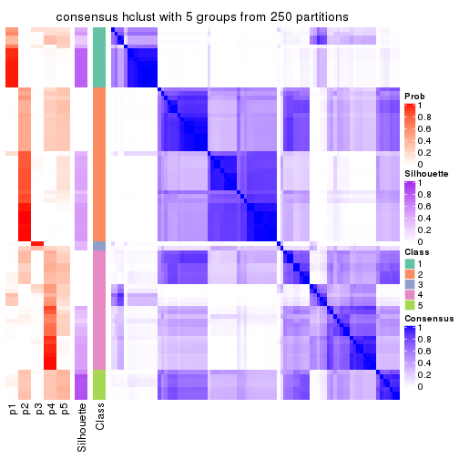</p>

</div>
<div id='tab-MAD-hclust-consensus-heatmap-5'>
<pre><code class="r">consensus_heatmap(res, k = 6)
</code></pre>

<p></p>

</div>
</div>

Heatmaps for the membership of samples in all partitions to see how consistent they are:


<script>
$( function() {
	$( '#tabs-MAD-hclust-membership-heatmap' ).tabs();
} );
</script>
<div id='tabs-MAD-hclust-membership-heatmap'>
<ul>
<li><a href='#tab-MAD-hclust-membership-heatmap-1'>k = 2</a></li>
<li><a href='#tab-MAD-hclust-membership-heatmap-2'>k = 3</a></li>
<li><a href='#tab-MAD-hclust-membership-heatmap-3'>k = 4</a></li>
<li><a href='#tab-MAD-hclust-membership-heatmap-4'>k = 5</a></li>
<li><a href='#tab-MAD-hclust-membership-heatmap-5'>k = 6</a></li>
</ul>
<div id='tab-MAD-hclust-membership-heatmap-1'>
<pre><code class="r">membership_heatmap(res, k = 2)
</code></pre>

<p></p>

</div>
<div id='tab-MAD-hclust-membership-heatmap-2'>
<pre><code class="r">membership_heatmap(res, k = 3)
</code></pre>

<p></p>

</div>
<div id='tab-MAD-hclust-membership-heatmap-3'>
<pre><code class="r">membership_heatmap(res, k = 4)
</code></pre>

<p></p>

</div>
<div id='tab-MAD-hclust-membership-heatmap-4'>
<pre><code class="r">membership_heatmap(res, k = 5)
</code></pre>

<p></p>

</div>
<div id='tab-MAD-hclust-membership-heatmap-5'>
<pre><code class="r">membership_heatmap(res, k = 6)
</code></pre>

<p></p>

</div>
</div>

As soon as we have had the classes for columns, we can look for signatures
which are significantly different between classes which can be candidate marks
for certain classes. Following are the heatmaps for signatures.


Signature heatmaps where rows are scaled:


<script>
$( function() {
	$( '#tabs-MAD-hclust-get-signatures' ).tabs();
} );
</script>
<div id='tabs-MAD-hclust-get-signatures'>
<ul>
<li><a href='#tab-MAD-hclust-get-signatures-1'>k = 2</a></li>
<li><a href='#tab-MAD-hclust-get-signatures-2'>k = 3</a></li>
<li><a href='#tab-MAD-hclust-get-signatures-3'>k = 4</a></li>
<li><a href='#tab-MAD-hclust-get-signatures-4'>k = 5</a></li>
<li><a href='#tab-MAD-hclust-get-signatures-5'>k = 6</a></li>
</ul>
<div id='tab-MAD-hclust-get-signatures-1'>
<pre><code class="r">get_signatures(res, k = 2)
</code></pre>

<p></p>

</div>
<div id='tab-MAD-hclust-get-signatures-2'>
<pre><code class="r">get_signatures(res, k = 3)
</code></pre>

<p></p>

</div>
<div id='tab-MAD-hclust-get-signatures-3'>
<pre><code class="r">get_signatures(res, k = 4)
</code></pre>

<p></p>

</div>
<div id='tab-MAD-hclust-get-signatures-4'>
<pre><code class="r">get_signatures(res, k = 5)
</code></pre>

<p></p>

</div>
<div id='tab-MAD-hclust-get-signatures-5'>
<pre><code class="r">get_signatures(res, k = 6)
</code></pre>

<p></p>

</div>
</div>


Signature heatmaps where rows are not scaled:


<script>
$( function() {
	$( '#tabs-MAD-hclust-get-signatures-no-scale' ).tabs();
} );
</script>
<div id='tabs-MAD-hclust-get-signatures-no-scale'>
<ul>
<li><a href='#tab-MAD-hclust-get-signatures-no-scale-1'>k = 2</a></li>
<li><a href='#tab-MAD-hclust-get-signatures-no-scale-2'>k = 3</a></li>
<li><a href='#tab-MAD-hclust-get-signatures-no-scale-3'>k = 4</a></li>
<li><a href='#tab-MAD-hclust-get-signatures-no-scale-4'>k = 5</a></li>
<li><a href='#tab-MAD-hclust-get-signatures-no-scale-5'>k = 6</a></li>
</ul>
<div id='tab-MAD-hclust-get-signatures-no-scale-1'>
<pre><code class="r">get_signatures(res, k = 2, scale_rows = FALSE)
</code></pre>

<p></p>

</div>
<div id='tab-MAD-hclust-get-signatures-no-scale-2'>
<pre><code class="r">get_signatures(res, k = 3, scale_rows = FALSE)
</code></pre>

<p></p>

</div>
<div id='tab-MAD-hclust-get-signatures-no-scale-3'>
<pre><code class="r">get_signatures(res, k = 4, scale_rows = FALSE)
</code></pre>

<p></p>

</div>
<div id='tab-MAD-hclust-get-signatures-no-scale-4'>
<pre><code class="r">get_signatures(res, k = 5, scale_rows = FALSE)
</code></pre>

<p></p>

</div>
<div id='tab-MAD-hclust-get-signatures-no-scale-5'>
<pre><code class="r">get_signatures(res, k = 6, scale_rows = FALSE)
</code></pre>

<p></p>

</div>
</div>


Compare the overlap of signatures from different k:

```r
compare_signatures(res)
```


`get_signature()` returns a data frame invisibly. TO get the list of signatures, the function
call should be assigned to a variable explicitly. In following code, if `plot` argument is set
to `FALSE`, no heatmap is plotted while only the differential analysis is performed.

```r
# code only for demonstration
tb = get_signature(res, k = ..., plot = FALSE)
```

An example of the output of `tb` is:

```
#>   which_row         fdr    mean_1    mean_2 scaled_mean_1 scaled_mean_2 km
#> 1        38 0.042760348  8.373488  9.131774    -0.5533452     0.5164555  1
#> 2        40 0.018707592  7.106213  8.469186    -0.6173731     0.5762149  1
#> 3        55 0.019134737 10.221463 11.207825    -0.6159697     0.5749050  1
#> 4        59 0.006059896  5.921854  7.869574    -0.6899429     0.6439467  1
#> 5        60 0.018055526  8.928898 10.211722    -0.6204761     0.5791110  1
#> 6        98 0.009384629 15.714769 14.887706     0.6635654    -0.6193277  2
...
```

The columns in `tb` are:

1. `which_row`: row indices corresponding to the input matrix.
2. `fdr`: FDR for the differential test. 
3. `mean_x`: The mean value in group x.
4. `scaled_mean_x`: The mean value in group x after rows are scaled.
5. `km`: Row groups if k-means clustering is applied to rows.


UMAP plot which shows how samples are separated.


<script>
$( function() {
	$( '#tabs-MAD-hclust-dimension-reduction' ).tabs();
} );
</script>
<div id='tabs-MAD-hclust-dimension-reduction'>
<ul>
<li><a href='#tab-MAD-hclust-dimension-reduction-1'>k = 2</a></li>
<li><a href='#tab-MAD-hclust-dimension-reduction-2'>k = 3</a></li>
<li><a href='#tab-MAD-hclust-dimension-reduction-3'>k = 4</a></li>
<li><a href='#tab-MAD-hclust-dimension-reduction-4'>k = 5</a></li>
<li><a href='#tab-MAD-hclust-dimension-reduction-5'>k = 6</a></li>
</ul>
<div id='tab-MAD-hclust-dimension-reduction-1'>
<pre><code class="r">dimension_reduction(res, k = 2, method = &quot;UMAP&quot;)
</code></pre>

<p></p>

</div>
<div id='tab-MAD-hclust-dimension-reduction-2'>
<pre><code class="r">dimension_reduction(res, k = 3, method = &quot;UMAP&quot;)
</code></pre>

<p></p>

</div>
<div id='tab-MAD-hclust-dimension-reduction-3'>
<pre><code class="r">dimension_reduction(res, k = 4, method = &quot;UMAP&quot;)
</code></pre>

<p></p>

</div>
<div id='tab-MAD-hclust-dimension-reduction-4'>
<pre><code class="r">dimension_reduction(res, k = 5, method = &quot;UMAP&quot;)
</code></pre>

<p></p>

</div>
<div id='tab-MAD-hclust-dimension-reduction-5'>
<pre><code class="r">dimension_reduction(res, k = 6, method = &quot;UMAP&quot;)
</code></pre>

<p></p>

</div>
</div>


Following heatmap shows how subgroups are split when increasing `k`:

```r
collect_classes(res)
```


If matrix rows can be associated to genes, consider to use `functional_enrichment(res,
...)` to perform function enrichment for the signature genes. See [this vignette](http://bioconductor.org/packages/devel/bioc/vignettes/cola/inst/doc/functional_enrichment.html) for more detailed explanations.


 

---------------------------------------------------


### MAD:kmeans**


The object with results only for a single top-value method and a single partition method 
can be extracted as:

```r
res = res_list["MAD", "kmeans"]
# you can also extract it by
# res = res_list["MAD:kmeans"]
```

A summary of `res` and all the functions that can be applied to it:

```r
res
```

```
#> A 'ConsensusPartition' object with k = 2, 3, 4, 5, 6.
#>   On a matrix with 17471 rows and 87 columns.
#>   Top rows (1000, 2000, 3000, 4000, 5000) are extracted by 'MAD' method.
#>   Subgroups are detected by 'kmeans' method.
#>   Performed in total 1250 partitions by row resampling.
#>   Best k for subgroups seems to be 2.
#> 
#> Following methods can be applied to this 'ConsensusPartition' object:
#>  [1] "cola_report"             "collect_classes"         "collect_plots"          
#>  [4] "collect_stats"           "colnames"                "compare_signatures"     
#>  [7] "consensus_heatmap"       "dimension_reduction"     "functional_enrichment"  
#> [10] "get_anno_col"            "get_anno"                "get_classes"            
#> [13] "get_consensus"           "get_matrix"              "get_membership"         
#> [16] "get_param"               "get_signatures"          "get_stats"              
#> [19] "is_best_k"               "is_stable_k"             "membership_heatmap"     
#> [22] "ncol"                    "nrow"                    "plot_ecdf"              
#> [25] "rownames"                "select_partition_number" "show"                   
#> [28] "suggest_best_k"          "test_to_known_factors"
```

`collect_plots()` function collects all the plots made from `res` for all `k` (number of partitions)
into one single page to provide an easy and fast comparison between different `k`.

```r
collect_plots(res)
```


The plots are:

- The first row: a plot of the ECDF (empirical cumulative distribution
  function) curves of the consensus matrix for each `k` and the heatmap of
  predicted classes for each `k`.
- The second row: heatmaps of the consensus matrix for each `k`.
- The third row: heatmaps of the membership matrix for each `k`.
- The fouth row: heatmaps of the signatures for each `k`.

All the plots in panels can be made by individual functions and they are
plotted later in this section.

`select_partition_number()` produces several plots showing different
statistics for choosing "optimized" `k`. There are following statistics:

- ECDF curves of the consensus matrix for each `k`;
- 1-PAC. [The PAC
  score](https://en.wikipedia.org/wiki/Consensus_clustering#Over-interpretation_potential_of_consensus_clustering)
  measures the proportion of the ambiguous subgrouping.
- Mean silhouette score.
- Concordance. The mean probability of fiting the consensus class ids in all
  partitions.
- Area increased. Denote $A_k$ as the area under the ECDF curve for current
  `k`, the area increased is defined as $A_k - A_{k-1}$.
- Rand index. The percent of pairs of samples that are both in a same cluster
  or both are not in a same cluster in the partition of k and k-1.
- Jaccard index. The ratio of pairs of samples are both in a same cluster in
  the partition of k and k-1 and the pairs of samples are both in a same
  cluster in the partition k or k-1.

The detailed explanations of these statistics can be found in [the _cola_
vignette](http://bioconductor.org/packages/devel/bioc/vignettes/cola/inst/doc/cola.html#toc_13).

Generally speaking, lower PAC score, higher mean silhouette score or higher
concordance corresponds to better partition. Rand index and Jaccard index
measure how similar the current partition is compared to partition with `k-1`.
If they are too similar, we won't accept `k` is better than `k-1`.

```r
select_partition_number(res)
```


The numeric values for all these statistics can be obtained by `get_stats()`.

```r
get_stats(res)
```

```
#>   k 1-PAC mean_silhouette concordance area_increased  Rand Jaccard
#> 2 2 1.000           0.974       0.989         0.4947 0.505   0.505
#> 3 3 0.525           0.665       0.764         0.2851 0.636   0.406
#> 4 4 0.829           0.838       0.893         0.1505 0.805   0.523
#> 5 5 0.761           0.649       0.799         0.0761 0.921   0.721
#> 6 6 0.745           0.670       0.810         0.0461 0.909   0.631
```

`suggest_best_k()` suggests the best $k$ based on these statistics. The rules are as follows:

- All $k$ with Jaccard index larger than 0.95 are removed because increasing
  $k$ does not provide enough extra information. If all $k$ are removed, it is
  marked as no subgroup is detected.
- For all $k$ with 1-PAC score larger than 0.9, the maximal $k$ is taken as
  the best $k$, and other $k$ are marked as optional $k$.
- If it does not fit the second rule. The $k$ with the maximal vote of the
  highest 1-PAC score, highest mean silhouette, and highest concordance is
  taken as the best $k$.

```r
suggest_best_k(res)
```

```
#> [1] 2
```


Following shows the table of the partitions (You need to click the **show/hide
code output** link to see it). The membership matrix (columns with name `p*`)
is inferred by
[`clue::cl_consensus()`](https://www.rdocumentation.org/link/cl_consensus?package=clue)
function with the `SE` method. Basically the value in the membership matrix
represents the probability to belong to a certain group. The finall class
label for an item is determined with the group with highest probability it
belongs to.

In `get_classes()` function, the entropy is calculated from the membership
matrix and the silhouette score is calculated from the consensus matrix.


<script>
$( function() {
	$( '#tabs-MAD-kmeans-get-classes' ).tabs();
} );
</script>
<div id='tabs-MAD-kmeans-get-classes'>
<ul>
<li><a href='#tab-MAD-kmeans-get-classes-1'>k = 2</a></li>
<li><a href='#tab-MAD-kmeans-get-classes-2'>k = 3</a></li>
<li><a href='#tab-MAD-kmeans-get-classes-3'>k = 4</a></li>
<li><a href='#tab-MAD-kmeans-get-classes-4'>k = 5</a></li>
<li><a href='#tab-MAD-kmeans-get-classes-5'>k = 6</a></li>
</ul>

<div id='tab-MAD-kmeans-get-classes-1'>
<p><a id='tab-MAD-kmeans-get-classes-1-a' style='color:#0366d6' href='#'>show/hide code output</a></p>
<pre><code class="r">cbind(get_classes(res, k = 2), get_membership(res, k = 2))
</code></pre>

<pre><code>#&gt;                                      class entropy silhouette    p1    p2
#&gt; E6088A41-B0DC-4FBF-8D14-BE78024CF8CD     2  0.0376      0.988 0.004 0.996
#&gt; F569915C-8F77-4D67-9730-30824DB57EE5     2  0.0376      0.988 0.004 0.996
#&gt; E3B71CB7-673B-4741-8607-4F0A11633036     1  0.0000      0.988 1.000 0.000
#&gt; DAF84798-FE3F-403C-B589-7F256AF752BE     1  0.0000      0.988 1.000 0.000
#&gt; 2F38E3B1-4975-4877-9DCC-C00270602180     1  0.0000      0.988 1.000 0.000
#&gt; C79A4C2F-02C4-4C03-A5A5-DE06802EEB57     2  0.0376      0.988 0.004 0.996
#&gt; 92E3ED8F-5C74-4ED2-9B03-9FA5E7B491D6     1  0.0000      0.988 1.000 0.000
#&gt; E61D60BE-3BD3-4B5E-BC12-80F3684A0959     1  0.0000      0.988 1.000 0.000
#&gt; C9388FC7-DB1D-4416-BC2D-EA643584F1E6     2  0.0376      0.988 0.004 0.996
#&gt; D4219360-6344-4AF3-ACEB-1701A9F1F67D     1  0.0000      0.988 1.000 0.000
#&gt; 07D155E6-F27C-4D09-B786-8A9B71147B72     1  0.0000      0.988 1.000 0.000
#&gt; 10C8C361-85A5-40E8-A395-B92623E6F27C     1  0.0000      0.988 1.000 0.000
#&gt; BDF20891-7C98-4A55-BBF3-8A836BE303C6     2  0.0000      0.988 0.000 1.000
#&gt; 694B0504-095E-431A-84F2-B4387072138E     1  0.0000      0.988 1.000 0.000
#&gt; EDCF8E7F-8B1D-46F7-8AE0-84A1DC9647D2     2  0.0376      0.988 0.004 0.996
#&gt; 0EA8288E-824D-4304-A053-5A833361F5C5     1  0.0000      0.988 1.000 0.000
#&gt; C4ACCFA1-34A9-4F61-8A1F-35B3B60EA193     1  0.0000      0.988 1.000 0.000
#&gt; 760BA639-38AC-4BC9-9647-09F6893EA8ED     1  0.0000      0.988 1.000 0.000
#&gt; 082DFC6B-C6E6-48B9-BDE5-74FF3B3DC954     2  0.0376      0.988 0.004 0.996
#&gt; FE349848-D7C4-4C49-B670-0E20454DDD7E     2  0.0376      0.988 0.004 0.996
#&gt; 2E8937B3-9EA1-4528-8CEE-BF3D4137908A     2  0.0000      0.988 0.000 1.000
#&gt; 9942D04E-2767-4E39-BA16-7762EAC3DFC4     2  0.0000      0.988 0.000 1.000
#&gt; F9C23182-91C4-4145-AE52-526FE8EB199D     2  0.0376      0.988 0.004 0.996
#&gt; 01024EED-7811-4E24-A067-8E0B978FFE2D     2  0.0000      0.988 0.000 1.000
#&gt; 932C8E98-A352-409C-8744-3D49FABCE425     1  0.0000      0.988 1.000 0.000
#&gt; 6DFD9439-C659-4936-84E5-108F717E3E4D     2  0.0376      0.988 0.004 0.996
#&gt; 1D8B83B8-5DD7-4F45-9D59-487EC6906A8B     2  0.0000      0.988 0.000 1.000
#&gt; 804B8503-73F6-42DE-835F-39DE2C9F13E1     2  0.0000      0.988 0.000 1.000
#&gt; B9453C9B-84D5-43BD-85BB-1780F02F039C     1  0.0000      0.988 1.000 0.000
#&gt; 836E6CD6-4E88-4028-9844-FA3C892C254A     1  0.0000      0.988 1.000 0.000
#&gt; 36EDD202-A845-4CE7-95D5-A515C471262E     2  0.0000      0.988 0.000 1.000
#&gt; 181C156A-B8F4-4F9D-93AA-6AFBD197644D     2  0.0000      0.988 0.000 1.000
#&gt; 0580E798-6A98-4E46-AC96-9A869DFF502E     1  0.0000      0.988 1.000 0.000
#&gt; EA1B63CF-D389-4567-8D9E-B0EF1F804598     1  0.9686      0.332 0.604 0.396
#&gt; 5ABC3D06-B8E9-4831-B89B-7C1EC4006B47     2  0.0000      0.988 0.000 1.000
#&gt; 1CC01E74-A7C1-4A51-9E28-1703C352BE16     2  0.0000      0.988 0.000 1.000
#&gt; 97E55B75-DBDB-46BC-9E74-7828C070BF16     2  0.0000      0.988 0.000 1.000
#&gt; BEB37A2D-E8B0-4674-89AC-DC0F34E0AFD6     1  0.0000      0.988 1.000 0.000
#&gt; 558648BA-6551-4D34-97C2-AD5F677D63FB     1  0.0000      0.988 1.000 0.000
#&gt; FF7021BB-414B-4466-BC43-372D856E6A1D     2  0.0376      0.988 0.004 0.996
#&gt; 9C04B840-54E0-425D-BDBE-8CB6B9C2C722     2  0.0000      0.988 0.000 1.000
#&gt; 5F50B1F4-1A02-4506-AA6D-9BF21CD8059A     1  0.1843      0.960 0.972 0.028
#&gt; 7D4B8FF3-7977-4ABD-AE04-EED1C50B23CC     2  0.0376      0.988 0.004 0.996
#&gt; A005AF15-B98E-4623-8AD4-1E69EFA9BC7A     1  0.0000      0.988 1.000 0.000
#&gt; 1DF04345-5C93-4B18-B307-8D1FCA532999     2  0.0000      0.988 0.000 1.000
#&gt; 6AF30C18-347E-41ED-A4AB-6F81F42206C5     1  0.0000      0.988 1.000 0.000
#&gt; 88A44ED0-BDE1-401E-B0E1-D8C8D6DBAEFC     2  0.0376      0.988 0.004 0.996
#&gt; 117673A3-2918-4702-8583-B66ADE6E4338     2  0.0376      0.988 0.004 0.996
#&gt; 4903A571-E14D-43C9-A737-22CAFAC414CD     2  0.6048      0.831 0.148 0.852
#&gt; C175E68E-632A-4B4A-9DDB-4895C4760F20     1  0.0000      0.988 1.000 0.000
#&gt; FA5CA2F4-A1AD-4A79-B8F3-73A976EB2FB1     2  0.0000      0.988 0.000 1.000
#&gt; E1F883A7-8B1F-4C1D-8A1A-9749A9C09845     2  0.0000      0.988 0.000 1.000
#&gt; E74F0729-6000-4908-ADB0-7BDBAC0639E6     1  0.0000      0.988 1.000 0.000
#&gt; F92135A9-1981-4C79-99A5-4243EEC5D30D     2  0.0000      0.988 0.000 1.000
#&gt; 73C6919F-DEB4-4DA4-B4AE-4032AC8F96C5     1  0.0000      0.988 1.000 0.000
#&gt; 33977B40-2E92-48B6-8D3A-3EBE913F6F8A     1  0.0000      0.988 1.000 0.000
#&gt; 490BD607-2F08-4B4C-9612-F9BB5CBBC8BB     2  0.0376      0.988 0.004 0.996
#&gt; 6C666E17-2EB8-4244-BCC1-8DD34EE4173E     2  0.0376      0.988 0.004 0.996
#&gt; C41F3064-4483-4796-B860-82155BAA5157     1  0.0000      0.988 1.000 0.000
#&gt; F4232B90-51B9-43EE-9971-35B3A318758F     1  0.0000      0.988 1.000 0.000
#&gt; 291EA1F6-FC56-4429-A433-0C452A6A514C     2  0.0000      0.988 0.000 1.000
#&gt; CC4AF04D-CB8E-40DD-B12E-7AA39B38262A     2  0.0000      0.988 0.000 1.000
#&gt; 4DAE26B9-AB57-4763-BB9A-2ADDD5D9C007     1  0.0000      0.988 1.000 0.000
#&gt; 676B4AEE-FB41-4C16-AA91-03E4A1DA8E26     2  0.7219      0.750 0.200 0.800
#&gt; 1CC36859-357A-49E0-A367-4F57D47288BA     2  0.5519      0.856 0.128 0.872
#&gt; 7CCDDFC8-6DF6-4734-96AC-19EBC464FC50     2  0.0000      0.988 0.000 1.000
#&gt; 10F38C34-3956-48ED-AB62-3439EF00D46B     2  0.0376      0.988 0.004 0.996
#&gt; 80B2B393-9D6E-45B4-B696-2A5C203543B7     2  0.0000      0.988 0.000 1.000
#&gt; 5AC7B5EA-1AAC-4529-8E5A-F612E5E0719A     1  0.0000      0.988 1.000 0.000
#&gt; 3648E98D-4B3A-41B7-BE05-595D44F0150D     1  0.0000      0.988 1.000 0.000
#&gt; 252EC850-6026-473B-8FFC-2CF567EF42E4     1  0.0000      0.988 1.000 0.000
#&gt; 1790E7A3-99D8-447E-BC50-51C8A4A18853     2  0.0000      0.988 0.000 1.000
#&gt; DA61A4F8-350B-4DD1-A240-AD016520DB5B     2  0.0376      0.988 0.004 0.996
#&gt; 767E5BAF-2515-40D7-AE7D-0B24D77A03F4     2  0.0376      0.988 0.004 0.996
#&gt; 8CB9C903-D749-44EA-9137-7FB5A92C5932     1  0.0000      0.988 1.000 0.000
#&gt; A9B968AE-2243-41BC-852A-3A12C1FB4892     1  0.0000      0.988 1.000 0.000
#&gt; 3C582264-85BC-4569-A888-8EB3008E5198     2  0.0000      0.988 0.000 1.000
#&gt; F4EAF9A2-9938-4D9B-9080-C0A7542D5704     2  0.0000      0.988 0.000 1.000
#&gt; 328499D3-45DD-4B66-BD22-3C52BA92C2BB     1  0.0000      0.988 1.000 0.000
#&gt; AF8AB83D-2917-4752-8C38-CF84C565B565     1  0.0000      0.988 1.000 0.000
#&gt; 03A327CA-A9FE-42A4-844D-CA85206969FC     2  0.0376      0.988 0.004 0.996
#&gt; 4B0BEC44-87BB-4014-9A26-3529DD63760B     2  0.0376      0.988 0.004 0.996
#&gt; 05C7843E-DC89-4D8E-A78A-952C5DFD667B     2  0.0376      0.988 0.004 0.996
#&gt; 29A0FFF9-13D3-4D16-BE6A-8E48A2C4E315     2  0.0000      0.988 0.000 1.000
#&gt; 22947CC3-4F42-4F44-899C-2B7085E36C9D     2  0.0376      0.988 0.004 0.996
#&gt; A247D92D-253A-4BEC-B450-184AF90D17D0     2  0.0376      0.988 0.004 0.996
#&gt; 0D907A63-D23F-4684-80D9-0BA552435B86     1  0.0000      0.988 1.000 0.000
</code></pre>

<script>
$('#tab-MAD-kmeans-get-classes-1-a').parent().next().next().hide();
$('#tab-MAD-kmeans-get-classes-1-a').click(function(){
  $('#tab-MAD-kmeans-get-classes-1-a').parent().next().next().toggle();
  return(false);
});
</script>
</div>

<div id='tab-MAD-kmeans-get-classes-2'>
<p><a id='tab-MAD-kmeans-get-classes-2-a' style='color:#0366d6' href='#'>show/hide code output</a></p>
<pre><code class="r">cbind(get_classes(res, k = 3), get_membership(res, k = 3))
</code></pre>

<pre><code>#&gt;                                      class entropy silhouette    p1    p2    p3
#&gt; E6088A41-B0DC-4FBF-8D14-BE78024CF8CD     3  0.5365     0.6548 0.004 0.252 0.744
#&gt; F569915C-8F77-4D67-9730-30824DB57EE5     3  0.5365     0.6877 0.004 0.252 0.744
#&gt; E3B71CB7-673B-4741-8607-4F0A11633036     1  0.0237     0.8636 0.996 0.000 0.004
#&gt; DAF84798-FE3F-403C-B589-7F256AF752BE     3  0.6654     0.2558 0.456 0.008 0.536
#&gt; 2F38E3B1-4975-4877-9DCC-C00270602180     1  0.3619     0.8119 0.864 0.000 0.136
#&gt; C79A4C2F-02C4-4C03-A5A5-DE06802EEB57     3  0.5365     0.6877 0.004 0.252 0.744
#&gt; 92E3ED8F-5C74-4ED2-9B03-9FA5E7B491D6     1  0.0237     0.8636 0.996 0.000 0.004
#&gt; E61D60BE-3BD3-4B5E-BC12-80F3684A0959     3  0.5497     0.3526 0.292 0.000 0.708
#&gt; C9388FC7-DB1D-4416-BC2D-EA643584F1E6     3  0.5158     0.6952 0.004 0.232 0.764
#&gt; D4219360-6344-4AF3-ACEB-1701A9F1F67D     1  0.0237     0.8636 0.996 0.000 0.004
#&gt; 07D155E6-F27C-4D09-B786-8A9B71147B72     1  0.6204     0.5060 0.576 0.000 0.424
#&gt; 10C8C361-85A5-40E8-A395-B92623E6F27C     1  0.0237     0.8636 0.996 0.000 0.004
#&gt; BDF20891-7C98-4A55-BBF3-8A836BE303C6     2  0.5926     0.2756 0.000 0.644 0.356
#&gt; 694B0504-095E-431A-84F2-B4387072138E     1  0.0237     0.8636 0.996 0.000 0.004
#&gt; EDCF8E7F-8B1D-46F7-8AE0-84A1DC9647D2     3  0.5517     0.6726 0.004 0.268 0.728
#&gt; 0EA8288E-824D-4304-A053-5A833361F5C5     3  0.3038     0.5742 0.104 0.000 0.896
#&gt; C4ACCFA1-34A9-4F61-8A1F-35B3B60EA193     1  0.0237     0.8636 0.996 0.000 0.004
#&gt; 760BA639-38AC-4BC9-9647-09F6893EA8ED     1  0.0237     0.8636 0.996 0.000 0.004
#&gt; 082DFC6B-C6E6-48B9-BDE5-74FF3B3DC954     3  0.5690     0.6493 0.004 0.288 0.708
#&gt; FE349848-D7C4-4C49-B670-0E20454DDD7E     3  0.1860     0.6683 0.000 0.052 0.948
#&gt; 2E8937B3-9EA1-4528-8CEE-BF3D4137908A     2  0.0000     0.8933 0.000 1.000 0.000
#&gt; 9942D04E-2767-4E39-BA16-7762EAC3DFC4     2  0.1643     0.8691 0.000 0.956 0.044
#&gt; F9C23182-91C4-4145-AE52-526FE8EB199D     2  0.6520    -0.1720 0.004 0.508 0.488
#&gt; 01024EED-7811-4E24-A067-8E0B978FFE2D     2  0.0000     0.8933 0.000 1.000 0.000
#&gt; 932C8E98-A352-409C-8744-3D49FABCE425     1  0.0592     0.8619 0.988 0.000 0.012
#&gt; 6DFD9439-C659-4936-84E5-108F717E3E4D     3  0.5201     0.6943 0.004 0.236 0.760
#&gt; 1D8B83B8-5DD7-4F45-9D59-487EC6906A8B     3  0.6483     0.3091 0.004 0.452 0.544
#&gt; 804B8503-73F6-42DE-835F-39DE2C9F13E1     2  0.0000     0.8933 0.000 1.000 0.000
#&gt; B9453C9B-84D5-43BD-85BB-1780F02F039C     1  0.0237     0.8636 0.996 0.000 0.004
#&gt; 836E6CD6-4E88-4028-9844-FA3C892C254A     3  0.6026     0.3546 0.376 0.000 0.624
#&gt; 36EDD202-A845-4CE7-95D5-A515C471262E     2  0.0000     0.8933 0.000 1.000 0.000
#&gt; 181C156A-B8F4-4F9D-93AA-6AFBD197644D     2  0.0000     0.8933 0.000 1.000 0.000
#&gt; 0580E798-6A98-4E46-AC96-9A869DFF502E     1  0.6204     0.5060 0.576 0.000 0.424
#&gt; EA1B63CF-D389-4567-8D9E-B0EF1F804598     3  0.7699     0.3390 0.420 0.048 0.532
#&gt; 5ABC3D06-B8E9-4831-B89B-7C1EC4006B47     2  0.1643     0.8691 0.000 0.956 0.044
#&gt; 1CC01E74-A7C1-4A51-9E28-1703C352BE16     2  0.1529     0.8718 0.000 0.960 0.040
#&gt; 97E55B75-DBDB-46BC-9E74-7828C070BF16     2  0.1529     0.8718 0.000 0.960 0.040
#&gt; BEB37A2D-E8B0-4674-89AC-DC0F34E0AFD6     3  0.5497     0.3526 0.292 0.000 0.708
#&gt; 558648BA-6551-4D34-97C2-AD5F677D63FB     3  0.6026     0.3134 0.376 0.000 0.624
#&gt; FF7021BB-414B-4466-BC43-372D856E6A1D     3  0.4452     0.6897 0.000 0.192 0.808
#&gt; 9C04B840-54E0-425D-BDBE-8CB6B9C2C722     2  0.5810     0.3484 0.000 0.664 0.336
#&gt; 5F50B1F4-1A02-4506-AA6D-9BF21CD8059A     3  0.1753     0.6311 0.048 0.000 0.952
#&gt; 7D4B8FF3-7977-4ABD-AE04-EED1C50B23CC     3  0.6460     0.3429 0.004 0.440 0.556
#&gt; A005AF15-B98E-4623-8AD4-1E69EFA9BC7A     3  0.5497     0.3526 0.292 0.000 0.708
#&gt; 1DF04345-5C93-4B18-B307-8D1FCA532999     2  0.0000     0.8933 0.000 1.000 0.000
#&gt; 6AF30C18-347E-41ED-A4AB-6F81F42206C5     1  0.5859     0.6412 0.656 0.000 0.344
#&gt; 88A44ED0-BDE1-401E-B0E1-D8C8D6DBAEFC     3  0.5902     0.6091 0.004 0.316 0.680
#&gt; 117673A3-2918-4702-8583-B66ADE6E4338     2  0.6489    -0.0505 0.004 0.540 0.456
#&gt; 4903A571-E14D-43C9-A737-22CAFAC414CD     3  0.4293     0.6968 0.004 0.164 0.832
#&gt; C175E68E-632A-4B4A-9DDB-4895C4760F20     1  0.0237     0.8636 0.996 0.000 0.004
#&gt; FA5CA2F4-A1AD-4A79-B8F3-73A976EB2FB1     2  0.0747     0.8810 0.000 0.984 0.016
#&gt; E1F883A7-8B1F-4C1D-8A1A-9749A9C09845     2  0.0000     0.8933 0.000 1.000 0.000
#&gt; E74F0729-6000-4908-ADB0-7BDBAC0639E6     1  0.3482     0.8159 0.872 0.000 0.128
#&gt; F92135A9-1981-4C79-99A5-4243EEC5D30D     2  0.0000     0.8933 0.000 1.000 0.000
#&gt; 73C6919F-DEB4-4DA4-B4AE-4032AC8F96C5     1  0.5098     0.7393 0.752 0.000 0.248
#&gt; 33977B40-2E92-48B6-8D3A-3EBE913F6F8A     3  0.2796     0.6013 0.092 0.000 0.908
#&gt; 490BD607-2F08-4B4C-9612-F9BB5CBBC8BB     3  0.5365     0.6877 0.004 0.252 0.744
#&gt; 6C666E17-2EB8-4244-BCC1-8DD34EE4173E     3  0.5365     0.6877 0.004 0.252 0.744
#&gt; C41F3064-4483-4796-B860-82155BAA5157     1  0.5968     0.6101 0.636 0.000 0.364
#&gt; F4232B90-51B9-43EE-9971-35B3A318758F     1  0.6008     0.6018 0.628 0.000 0.372
#&gt; 291EA1F6-FC56-4429-A433-0C452A6A514C     2  0.0000     0.8933 0.000 1.000 0.000
#&gt; CC4AF04D-CB8E-40DD-B12E-7AA39B38262A     2  0.1643     0.8691 0.000 0.956 0.044
#&gt; 4DAE26B9-AB57-4763-BB9A-2ADDD5D9C007     3  0.5397     0.3764 0.280 0.000 0.720
#&gt; 676B4AEE-FB41-4C16-AA91-03E4A1DA8E26     3  0.7741     0.4075 0.068 0.324 0.608
#&gt; 1CC36859-357A-49E0-A367-4F57D47288BA     3  0.5365     0.6877 0.004 0.252 0.744
#&gt; 7CCDDFC8-6DF6-4734-96AC-19EBC464FC50     2  0.0000     0.8933 0.000 1.000 0.000
#&gt; 10F38C34-3956-48ED-AB62-3439EF00D46B     3  0.4346     0.6975 0.000 0.184 0.816
#&gt; 80B2B393-9D6E-45B4-B696-2A5C203543B7     2  0.0000     0.8933 0.000 1.000 0.000
#&gt; 5AC7B5EA-1AAC-4529-8E5A-F612E5E0719A     3  0.4842     0.4215 0.224 0.000 0.776
#&gt; 3648E98D-4B3A-41B7-BE05-595D44F0150D     1  0.0424     0.8625 0.992 0.000 0.008
#&gt; 252EC850-6026-473B-8FFC-2CF567EF42E4     3  0.5431     0.3690 0.284 0.000 0.716
#&gt; 1790E7A3-99D8-447E-BC50-51C8A4A18853     2  0.0000     0.8933 0.000 1.000 0.000
#&gt; DA61A4F8-350B-4DD1-A240-AD016520DB5B     3  0.5365     0.6877 0.004 0.252 0.744
#&gt; 767E5BAF-2515-40D7-AE7D-0B24D77A03F4     3  0.4974     0.6945 0.000 0.236 0.764
#&gt; 8CB9C903-D749-44EA-9137-7FB5A92C5932     1  0.1860     0.8319 0.948 0.000 0.052
#&gt; A9B968AE-2243-41BC-852A-3A12C1FB4892     3  0.5497     0.3526 0.292 0.000 0.708
#&gt; 3C582264-85BC-4569-A888-8EB3008E5198     2  0.0000     0.8933 0.000 1.000 0.000
#&gt; F4EAF9A2-9938-4D9B-9080-C0A7542D5704     2  0.1643     0.8691 0.000 0.956 0.044
#&gt; 328499D3-45DD-4B66-BD22-3C52BA92C2BB     1  0.0237     0.8636 0.996 0.000 0.004
#&gt; AF8AB83D-2917-4752-8C38-CF84C565B565     3  0.5397     0.3764 0.280 0.000 0.720
#&gt; 03A327CA-A9FE-42A4-844D-CA85206969FC     3  0.5404     0.6845 0.004 0.256 0.740
#&gt; 4B0BEC44-87BB-4014-9A26-3529DD63760B     3  0.5158     0.6955 0.004 0.232 0.764
#&gt; 05C7843E-DC89-4D8E-A78A-952C5DFD667B     3  0.5201     0.6943 0.004 0.236 0.760
#&gt; 29A0FFF9-13D3-4D16-BE6A-8E48A2C4E315     2  0.0000     0.8933 0.000 1.000 0.000
#&gt; 22947CC3-4F42-4F44-899C-2B7085E36C9D     3  0.5690     0.6493 0.004 0.288 0.708
#&gt; A247D92D-253A-4BEC-B450-184AF90D17D0     3  0.5178     0.6857 0.000 0.256 0.744
#&gt; 0D907A63-D23F-4684-80D9-0BA552435B86     3  0.5397     0.3764 0.280 0.000 0.720
</code></pre>

<script>
$('#tab-MAD-kmeans-get-classes-2-a').parent().next().next().hide();
$('#tab-MAD-kmeans-get-classes-2-a').click(function(){
  $('#tab-MAD-kmeans-get-classes-2-a').parent().next().next().toggle();
  return(false);
});
</script>
</div>

<div id='tab-MAD-kmeans-get-classes-3'>
<p><a id='tab-MAD-kmeans-get-classes-3-a' style='color:#0366d6' href='#'>show/hide code output</a></p>
<pre><code class="r">cbind(get_classes(res, k = 4), get_membership(res, k = 4))
</code></pre>

<pre><code>#&gt;                                      class entropy silhouette    p1    p2    p3    p4
#&gt; E6088A41-B0DC-4FBF-8D14-BE78024CF8CD     3  0.1888      0.867 0.000 0.044 0.940 0.016
#&gt; F569915C-8F77-4D67-9730-30824DB57EE5     3  0.0592      0.889 0.000 0.000 0.984 0.016
#&gt; E3B71CB7-673B-4741-8607-4F0A11633036     1  0.1557      0.949 0.944 0.000 0.000 0.056
#&gt; DAF84798-FE3F-403C-B589-7F256AF752BE     3  0.5593      0.637 0.260 0.004 0.688 0.048
#&gt; 2F38E3B1-4975-4877-9DCC-C00270602180     4  0.5203      0.233 0.416 0.008 0.000 0.576
#&gt; C79A4C2F-02C4-4C03-A5A5-DE06802EEB57     3  0.0592      0.889 0.000 0.000 0.984 0.016
#&gt; 92E3ED8F-5C74-4ED2-9B03-9FA5E7B491D6     1  0.1743      0.949 0.940 0.004 0.000 0.056
#&gt; E61D60BE-3BD3-4B5E-BC12-80F3684A0959     4  0.1398      0.896 0.004 0.000 0.040 0.956
#&gt; C9388FC7-DB1D-4416-BC2D-EA643584F1E6     3  0.2636      0.878 0.020 0.012 0.916 0.052
#&gt; D4219360-6344-4AF3-ACEB-1701A9F1F67D     1  0.1557      0.949 0.944 0.000 0.000 0.056
#&gt; 07D155E6-F27C-4D09-B786-8A9B71147B72     4  0.2125      0.870 0.076 0.004 0.000 0.920
#&gt; 10C8C361-85A5-40E8-A395-B92623E6F27C     1  0.1637      0.948 0.940 0.000 0.000 0.060
#&gt; BDF20891-7C98-4A55-BBF3-8A836BE303C6     3  0.5920      0.335 0.016 0.368 0.596 0.020
#&gt; 694B0504-095E-431A-84F2-B4387072138E     1  0.1847      0.947 0.940 0.004 0.004 0.052
#&gt; EDCF8E7F-8B1D-46F7-8AE0-84A1DC9647D2     3  0.2392      0.875 0.024 0.012 0.928 0.036
#&gt; 0EA8288E-824D-4304-A053-5A833361F5C5     4  0.3325      0.855 0.008 0.044 0.064 0.884
#&gt; C4ACCFA1-34A9-4F61-8A1F-35B3B60EA193     1  0.1847      0.947 0.940 0.004 0.004 0.052
#&gt; 760BA639-38AC-4BC9-9647-09F6893EA8ED     1  0.1743      0.949 0.940 0.004 0.000 0.056
#&gt; 082DFC6B-C6E6-48B9-BDE5-74FF3B3DC954     3  0.0336      0.888 0.000 0.000 0.992 0.008
#&gt; FE349848-D7C4-4C49-B670-0E20454DDD7E     3  0.1970      0.879 0.008 0.000 0.932 0.060
#&gt; 2E8937B3-9EA1-4528-8CEE-BF3D4137908A     2  0.2748      0.940 0.020 0.904 0.072 0.004
#&gt; 9942D04E-2767-4E39-BA16-7762EAC3DFC4     2  0.2929      0.891 0.028 0.908 0.024 0.040
#&gt; F9C23182-91C4-4145-AE52-526FE8EB199D     3  0.2605      0.866 0.024 0.040 0.920 0.016
#&gt; 01024EED-7811-4E24-A067-8E0B978FFE2D     2  0.2238      0.944 0.004 0.920 0.072 0.004
#&gt; 932C8E98-A352-409C-8744-3D49FABCE425     1  0.1930      0.946 0.936 0.004 0.004 0.056
#&gt; 6DFD9439-C659-4936-84E5-108F717E3E4D     3  0.2484      0.875 0.024 0.012 0.924 0.040
#&gt; 1D8B83B8-5DD7-4F45-9D59-487EC6906A8B     3  0.0376      0.885 0.004 0.000 0.992 0.004
#&gt; 804B8503-73F6-42DE-835F-39DE2C9F13E1     2  0.2053      0.944 0.004 0.924 0.072 0.000
#&gt; B9453C9B-84D5-43BD-85BB-1780F02F039C     1  0.1890      0.946 0.936 0.008 0.000 0.056
#&gt; 836E6CD6-4E88-4028-9844-FA3C892C254A     3  0.7330      0.400 0.336 0.048 0.552 0.064
#&gt; 36EDD202-A845-4CE7-95D5-A515C471262E     2  0.3731      0.911 0.032 0.856 0.104 0.008
#&gt; 181C156A-B8F4-4F9D-93AA-6AFBD197644D     2  0.1902      0.941 0.004 0.932 0.064 0.000
#&gt; 0580E798-6A98-4E46-AC96-9A869DFF502E     4  0.2197      0.868 0.080 0.004 0.000 0.916
#&gt; EA1B63CF-D389-4567-8D9E-B0EF1F804598     3  0.6178      0.356 0.408 0.004 0.544 0.044
#&gt; 5ABC3D06-B8E9-4831-B89B-7C1EC4006B47     2  0.2929      0.891 0.028 0.908 0.024 0.040
#&gt; 1CC01E74-A7C1-4A51-9E28-1703C352BE16     2  0.2352      0.927 0.016 0.928 0.044 0.012
#&gt; 97E55B75-DBDB-46BC-9E74-7828C070BF16     2  0.2673      0.923 0.016 0.916 0.048 0.020
#&gt; BEB37A2D-E8B0-4674-89AC-DC0F34E0AFD6     4  0.1585      0.896 0.004 0.004 0.040 0.952
#&gt; 558648BA-6551-4D34-97C2-AD5F677D63FB     3  0.7369      0.434 0.212 0.008 0.564 0.216
#&gt; FF7021BB-414B-4466-BC43-372D856E6A1D     3  0.4081      0.841 0.032 0.052 0.856 0.060
#&gt; 9C04B840-54E0-425D-BDBE-8CB6B9C2C722     3  0.5328      0.476 0.020 0.316 0.660 0.004
#&gt; 5F50B1F4-1A02-4506-AA6D-9BF21CD8059A     4  0.2654      0.844 0.000 0.004 0.108 0.888
#&gt; 7D4B8FF3-7977-4ABD-AE04-EED1C50B23CC     3  0.2418      0.875 0.024 0.016 0.928 0.032
#&gt; A005AF15-B98E-4623-8AD4-1E69EFA9BC7A     4  0.1585      0.896 0.004 0.004 0.040 0.952
#&gt; 1DF04345-5C93-4B18-B307-8D1FCA532999     2  0.1867      0.944 0.000 0.928 0.072 0.000
#&gt; 6AF30C18-347E-41ED-A4AB-6F81F42206C5     4  0.2197      0.868 0.080 0.004 0.000 0.916
#&gt; 88A44ED0-BDE1-401E-B0E1-D8C8D6DBAEFC     3  0.0469      0.888 0.000 0.000 0.988 0.012
#&gt; 117673A3-2918-4702-8583-B66ADE6E4338     3  0.2432      0.871 0.024 0.028 0.928 0.020
#&gt; 4903A571-E14D-43C9-A737-22CAFAC414CD     3  0.2335      0.878 0.020 0.000 0.920 0.060
#&gt; C175E68E-632A-4B4A-9DDB-4895C4760F20     1  0.1994      0.944 0.936 0.004 0.008 0.052
#&gt; FA5CA2F4-A1AD-4A79-B8F3-73A976EB2FB1     2  0.5330      0.203 0.004 0.516 0.476 0.004
#&gt; E1F883A7-8B1F-4C1D-8A1A-9749A9C09845     2  0.1867      0.944 0.000 0.928 0.072 0.000
#&gt; E74F0729-6000-4908-ADB0-7BDBAC0639E6     1  0.5137      0.153 0.544 0.004 0.000 0.452
#&gt; F92135A9-1981-4C79-99A5-4243EEC5D30D     2  0.2238      0.944 0.004 0.920 0.072 0.004
#&gt; 73C6919F-DEB4-4DA4-B4AE-4032AC8F96C5     4  0.2714      0.843 0.112 0.004 0.000 0.884
#&gt; 33977B40-2E92-48B6-8D3A-3EBE913F6F8A     3  0.5125      0.451 0.004 0.004 0.616 0.376
#&gt; 490BD607-2F08-4B4C-9612-F9BB5CBBC8BB     3  0.0592      0.889 0.000 0.000 0.984 0.016
#&gt; 6C666E17-2EB8-4244-BCC1-8DD34EE4173E     3  0.0592      0.889 0.000 0.000 0.984 0.016
#&gt; C41F3064-4483-4796-B860-82155BAA5157     4  0.2412      0.864 0.084 0.008 0.000 0.908
#&gt; F4232B90-51B9-43EE-9971-35B3A318758F     4  0.2197      0.868 0.080 0.004 0.000 0.916
#&gt; 291EA1F6-FC56-4429-A433-0C452A6A514C     2  0.2238      0.944 0.004 0.920 0.072 0.004
#&gt; CC4AF04D-CB8E-40DD-B12E-7AA39B38262A     2  0.2437      0.900 0.024 0.928 0.024 0.024
#&gt; 4DAE26B9-AB57-4763-BB9A-2ADDD5D9C007     4  0.1398      0.896 0.004 0.000 0.040 0.956
#&gt; 676B4AEE-FB41-4C16-AA91-03E4A1DA8E26     4  0.5618      0.535 0.028 0.288 0.012 0.672
#&gt; 1CC36859-357A-49E0-A367-4F57D47288BA     3  0.1124      0.888 0.012 0.004 0.972 0.012
#&gt; 7CCDDFC8-6DF6-4734-96AC-19EBC464FC50     2  0.2053      0.944 0.004 0.924 0.072 0.000
#&gt; 10F38C34-3956-48ED-AB62-3439EF00D46B     3  0.1406      0.881 0.000 0.024 0.960 0.016
#&gt; 80B2B393-9D6E-45B4-B696-2A5C203543B7     2  0.2515      0.942 0.012 0.912 0.072 0.004
#&gt; 5AC7B5EA-1AAC-4529-8E5A-F612E5E0719A     4  0.3005      0.866 0.008 0.044 0.048 0.900
#&gt; 3648E98D-4B3A-41B7-BE05-595D44F0150D     1  0.1557      0.949 0.944 0.000 0.000 0.056
#&gt; 252EC850-6026-473B-8FFC-2CF567EF42E4     4  0.1489      0.895 0.000 0.004 0.044 0.952
#&gt; 1790E7A3-99D8-447E-BC50-51C8A4A18853     2  0.2053      0.944 0.004 0.924 0.072 0.000
#&gt; DA61A4F8-350B-4DD1-A240-AD016520DB5B     3  0.0592      0.889 0.000 0.000 0.984 0.016
#&gt; 767E5BAF-2515-40D7-AE7D-0B24D77A03F4     3  0.1854      0.883 0.012 0.000 0.940 0.048
#&gt; 8CB9C903-D749-44EA-9137-7FB5A92C5932     1  0.3577      0.863 0.868 0.056 0.004 0.072
#&gt; A9B968AE-2243-41BC-852A-3A12C1FB4892     4  0.1639      0.896 0.008 0.004 0.036 0.952
#&gt; 3C582264-85BC-4569-A888-8EB3008E5198     2  0.2053      0.944 0.004 0.924 0.072 0.000
#&gt; F4EAF9A2-9938-4D9B-9080-C0A7542D5704     2  0.2432      0.901 0.024 0.928 0.020 0.028
#&gt; 328499D3-45DD-4B66-BD22-3C52BA92C2BB     1  0.1557      0.949 0.944 0.000 0.000 0.056
#&gt; AF8AB83D-2917-4752-8C38-CF84C565B565     4  0.1474      0.893 0.000 0.000 0.052 0.948
#&gt; 03A327CA-A9FE-42A4-844D-CA85206969FC     3  0.0592      0.889 0.000 0.000 0.984 0.016
#&gt; 4B0BEC44-87BB-4014-9A26-3529DD63760B     3  0.0592      0.889 0.000 0.000 0.984 0.016
#&gt; 05C7843E-DC89-4D8E-A78A-952C5DFD667B     3  0.0592      0.889 0.000 0.000 0.984 0.016
#&gt; 29A0FFF9-13D3-4D16-BE6A-8E48A2C4E315     2  0.2053      0.944 0.004 0.924 0.072 0.000
#&gt; 22947CC3-4F42-4F44-899C-2B7085E36C9D     3  0.0188      0.886 0.004 0.000 0.996 0.000
#&gt; A247D92D-253A-4BEC-B450-184AF90D17D0     3  0.0592      0.889 0.000 0.000 0.984 0.016
#&gt; 0D907A63-D23F-4684-80D9-0BA552435B86     4  0.1489      0.895 0.000 0.004 0.044 0.952
</code></pre>

<script>
$('#tab-MAD-kmeans-get-classes-3-a').parent().next().next().hide();
$('#tab-MAD-kmeans-get-classes-3-a').click(function(){
  $('#tab-MAD-kmeans-get-classes-3-a').parent().next().next().toggle();
  return(false);
});
</script>
</div>

<div id='tab-MAD-kmeans-get-classes-4'>
<p><a id='tab-MAD-kmeans-get-classes-4-a' style='color:#0366d6' href='#'>show/hide code output</a></p>
<pre><code class="r">cbind(get_classes(res, k = 5), get_membership(res, k = 5))
</code></pre>

<pre><code>#&gt;                                      class entropy silhouette    p1    p2    p3    p4    p5
#&gt; E6088A41-B0DC-4FBF-8D14-BE78024CF8CD     3  0.0609     0.6988 0.000 0.000 0.980 0.000 0.020
#&gt; F569915C-8F77-4D67-9730-30824DB57EE5     3  0.0290     0.7034 0.000 0.000 0.992 0.000 0.008
#&gt; E3B71CB7-673B-4741-8607-4F0A11633036     1  0.0671     0.8687 0.980 0.000 0.000 0.004 0.016
#&gt; DAF84798-FE3F-403C-B589-7F256AF752BE     5  0.6659     0.5825 0.268 0.000 0.204 0.012 0.516
#&gt; 2F38E3B1-4975-4877-9DCC-C00270602180     4  0.5714     0.3671 0.312 0.000 0.000 0.580 0.108
#&gt; C79A4C2F-02C4-4C03-A5A5-DE06802EEB57     3  0.0510     0.7017 0.000 0.000 0.984 0.000 0.016
#&gt; 92E3ED8F-5C74-4ED2-9B03-9FA5E7B491D6     1  0.0865     0.8678 0.972 0.000 0.000 0.004 0.024
#&gt; E61D60BE-3BD3-4B5E-BC12-80F3684A0959     4  0.1041     0.8653 0.000 0.000 0.004 0.964 0.032
#&gt; C9388FC7-DB1D-4416-BC2D-EA643584F1E6     3  0.6029    -0.1763 0.000 0.020 0.512 0.068 0.400
#&gt; D4219360-6344-4AF3-ACEB-1701A9F1F67D     1  0.0671     0.8687 0.980 0.000 0.000 0.004 0.016
#&gt; 07D155E6-F27C-4D09-B786-8A9B71147B72     4  0.2189     0.8495 0.012 0.000 0.000 0.904 0.084
#&gt; 10C8C361-85A5-40E8-A395-B92623E6F27C     1  0.2376     0.8389 0.904 0.000 0.000 0.044 0.052
#&gt; BDF20891-7C98-4A55-BBF3-8A836BE303C6     2  0.6635     0.0322 0.004 0.508 0.168 0.008 0.312
#&gt; 694B0504-095E-431A-84F2-B4387072138E     1  0.1124     0.8661 0.960 0.000 0.000 0.004 0.036
#&gt; EDCF8E7F-8B1D-46F7-8AE0-84A1DC9647D2     3  0.5084    -0.2545 0.000 0.020 0.488 0.008 0.484
#&gt; 0EA8288E-824D-4304-A053-5A833361F5C5     4  0.3876     0.7675 0.000 0.000 0.032 0.776 0.192
#&gt; C4ACCFA1-34A9-4F61-8A1F-35B3B60EA193     1  0.2286     0.8326 0.888 0.000 0.000 0.004 0.108
#&gt; 760BA639-38AC-4BC9-9647-09F6893EA8ED     1  0.1205     0.8654 0.956 0.000 0.000 0.004 0.040
#&gt; 082DFC6B-C6E6-48B9-BDE5-74FF3B3DC954     3  0.0290     0.7024 0.000 0.000 0.992 0.000 0.008
#&gt; FE349848-D7C4-4C49-B670-0E20454DDD7E     3  0.3628     0.4762 0.000 0.000 0.772 0.012 0.216
#&gt; 2E8937B3-9EA1-4528-8CEE-BF3D4137908A     2  0.1990     0.8747 0.004 0.920 0.008 0.000 0.068
#&gt; 9942D04E-2767-4E39-BA16-7762EAC3DFC4     2  0.4385     0.7123 0.004 0.672 0.012 0.000 0.312
#&gt; F9C23182-91C4-4145-AE52-526FE8EB199D     5  0.5708     0.2185 0.000 0.060 0.452 0.008 0.480
#&gt; 01024EED-7811-4E24-A067-8E0B978FFE2D     2  0.0324     0.8883 0.000 0.992 0.004 0.000 0.004
#&gt; 932C8E98-A352-409C-8744-3D49FABCE425     1  0.3391     0.7561 0.800 0.000 0.000 0.012 0.188
#&gt; 6DFD9439-C659-4936-84E5-108F717E3E4D     3  0.5180    -0.2622 0.000 0.020 0.488 0.012 0.480
#&gt; 1D8B83B8-5DD7-4F45-9D59-487EC6906A8B     3  0.0162     0.7041 0.000 0.000 0.996 0.000 0.004
#&gt; 804B8503-73F6-42DE-835F-39DE2C9F13E1     2  0.0162     0.8887 0.000 0.996 0.004 0.000 0.000
#&gt; B9453C9B-84D5-43BD-85BB-1780F02F039C     1  0.2407     0.8366 0.896 0.004 0.000 0.012 0.088
#&gt; 836E6CD6-4E88-4028-9844-FA3C892C254A     5  0.7519     0.4933 0.220 0.000 0.248 0.064 0.468
#&gt; 36EDD202-A845-4CE7-95D5-A515C471262E     2  0.4937     0.4544 0.004 0.604 0.028 0.000 0.364
#&gt; 181C156A-B8F4-4F9D-93AA-6AFBD197644D     2  0.1282     0.8731 0.000 0.952 0.000 0.004 0.044
#&gt; 0580E798-6A98-4E46-AC96-9A869DFF502E     4  0.1251     0.8572 0.008 0.000 0.000 0.956 0.036
#&gt; EA1B63CF-D389-4567-8D9E-B0EF1F804598     5  0.6584     0.5815 0.280 0.000 0.200 0.008 0.512
#&gt; 5ABC3D06-B8E9-4831-B89B-7C1EC4006B47     2  0.4162     0.7203 0.004 0.680 0.004 0.000 0.312
#&gt; 1CC01E74-A7C1-4A51-9E28-1703C352BE16     2  0.1365     0.8852 0.004 0.952 0.004 0.000 0.040
#&gt; 97E55B75-DBDB-46BC-9E74-7828C070BF16     2  0.2877     0.8438 0.004 0.848 0.004 0.000 0.144
#&gt; BEB37A2D-E8B0-4674-89AC-DC0F34E0AFD6     4  0.1430     0.8599 0.000 0.000 0.004 0.944 0.052
#&gt; 558648BA-6551-4D34-97C2-AD5F677D63FB     3  0.6682     0.2133 0.092 0.004 0.628 0.164 0.112
#&gt; FF7021BB-414B-4466-BC43-372D856E6A1D     5  0.4313     0.4052 0.000 0.000 0.356 0.008 0.636
#&gt; 9C04B840-54E0-425D-BDBE-8CB6B9C2C722     5  0.7044     0.3483 0.004 0.276 0.336 0.004 0.380
#&gt; 5F50B1F4-1A02-4506-AA6D-9BF21CD8059A     4  0.3303     0.8176 0.000 0.000 0.076 0.848 0.076
#&gt; 7D4B8FF3-7977-4ABD-AE04-EED1C50B23CC     3  0.5159    -0.2468 0.000 0.024 0.496 0.008 0.472
#&gt; A005AF15-B98E-4623-8AD4-1E69EFA9BC7A     4  0.0865     0.8632 0.000 0.000 0.004 0.972 0.024
#&gt; 1DF04345-5C93-4B18-B307-8D1FCA532999     2  0.0671     0.8882 0.000 0.980 0.004 0.000 0.016
#&gt; 6AF30C18-347E-41ED-A4AB-6F81F42206C5     4  0.1082     0.8585 0.008 0.000 0.000 0.964 0.028
#&gt; 88A44ED0-BDE1-401E-B0E1-D8C8D6DBAEFC     3  0.0000     0.7036 0.000 0.000 1.000 0.000 0.000
#&gt; 117673A3-2918-4702-8583-B66ADE6E4338     3  0.5232    -0.2584 0.000 0.028 0.492 0.008 0.472
#&gt; 4903A571-E14D-43C9-A737-22CAFAC414CD     3  0.5096    -0.1550 0.000 0.000 0.520 0.036 0.444
#&gt; C175E68E-632A-4B4A-9DDB-4895C4760F20     1  0.2930     0.7841 0.832 0.000 0.000 0.004 0.164
#&gt; FA5CA2F4-A1AD-4A79-B8F3-73A976EB2FB1     3  0.3628     0.3852 0.000 0.216 0.772 0.000 0.012
#&gt; E1F883A7-8B1F-4C1D-8A1A-9749A9C09845     2  0.1116     0.8860 0.004 0.964 0.004 0.000 0.028
#&gt; E74F0729-6000-4908-ADB0-7BDBAC0639E6     1  0.5626     0.1625 0.504 0.000 0.000 0.420 0.076
#&gt; F92135A9-1981-4C79-99A5-4243EEC5D30D     2  0.0324     0.8883 0.000 0.992 0.004 0.000 0.004
#&gt; 73C6919F-DEB4-4DA4-B4AE-4032AC8F96C5     4  0.2853     0.8161 0.052 0.000 0.000 0.876 0.072
#&gt; 33977B40-2E92-48B6-8D3A-3EBE913F6F8A     4  0.6022     0.1173 0.000 0.000 0.324 0.540 0.136
#&gt; 490BD607-2F08-4B4C-9612-F9BB5CBBC8BB     3  0.0290     0.7024 0.000 0.000 0.992 0.000 0.008
#&gt; 6C666E17-2EB8-4244-BCC1-8DD34EE4173E     3  0.0162     0.7025 0.000 0.000 0.996 0.000 0.004
#&gt; C41F3064-4483-4796-B860-82155BAA5157     4  0.2654     0.8380 0.032 0.000 0.000 0.884 0.084
#&gt; F4232B90-51B9-43EE-9971-35B3A318758F     4  0.1082     0.8585 0.008 0.000 0.000 0.964 0.028
#&gt; 291EA1F6-FC56-4429-A433-0C452A6A514C     2  0.0324     0.8883 0.000 0.992 0.004 0.000 0.004
#&gt; CC4AF04D-CB8E-40DD-B12E-7AA39B38262A     2  0.3647     0.7915 0.004 0.764 0.004 0.000 0.228
#&gt; 4DAE26B9-AB57-4763-BB9A-2ADDD5D9C007     4  0.1357     0.8613 0.000 0.000 0.004 0.948 0.048
#&gt; 676B4AEE-FB41-4C16-AA91-03E4A1DA8E26     4  0.6467     0.5070 0.000 0.116 0.024 0.532 0.328
#&gt; 1CC36859-357A-49E0-A367-4F57D47288BA     3  0.3876     0.2985 0.000 0.000 0.684 0.000 0.316
#&gt; 7CCDDFC8-6DF6-4734-96AC-19EBC464FC50     2  0.0324     0.8890 0.000 0.992 0.004 0.000 0.004
#&gt; 10F38C34-3956-48ED-AB62-3439EF00D46B     3  0.0404     0.7005 0.000 0.000 0.988 0.000 0.012
#&gt; 80B2B393-9D6E-45B4-B696-2A5C203543B7     2  0.1443     0.8834 0.004 0.948 0.004 0.000 0.044
#&gt; 5AC7B5EA-1AAC-4529-8E5A-F612E5E0719A     4  0.3536     0.7828 0.000 0.000 0.032 0.812 0.156
#&gt; 3648E98D-4B3A-41B7-BE05-595D44F0150D     1  0.0865     0.8644 0.972 0.000 0.000 0.004 0.024
#&gt; 252EC850-6026-473B-8FFC-2CF567EF42E4     4  0.2068     0.8564 0.000 0.000 0.004 0.904 0.092
#&gt; 1790E7A3-99D8-447E-BC50-51C8A4A18853     2  0.0162     0.8887 0.000 0.996 0.004 0.000 0.000
#&gt; DA61A4F8-350B-4DD1-A240-AD016520DB5B     3  0.0162     0.7025 0.000 0.000 0.996 0.000 0.004
#&gt; 767E5BAF-2515-40D7-AE7D-0B24D77A03F4     3  0.4108     0.2985 0.000 0.000 0.684 0.008 0.308
#&gt; 8CB9C903-D749-44EA-9137-7FB5A92C5932     1  0.4240     0.6283 0.684 0.000 0.008 0.004 0.304
#&gt; A9B968AE-2243-41BC-852A-3A12C1FB4892     4  0.2286     0.8542 0.000 0.000 0.004 0.888 0.108
#&gt; 3C582264-85BC-4569-A888-8EB3008E5198     2  0.0162     0.8887 0.000 0.996 0.004 0.000 0.000
#&gt; F4EAF9A2-9938-4D9B-9080-C0A7542D5704     2  0.3317     0.8080 0.004 0.804 0.004 0.000 0.188
#&gt; 328499D3-45DD-4B66-BD22-3C52BA92C2BB     1  0.1205     0.8594 0.956 0.000 0.000 0.004 0.040
#&gt; AF8AB83D-2917-4752-8C38-CF84C565B565     4  0.1704     0.8574 0.000 0.000 0.004 0.928 0.068
#&gt; 03A327CA-A9FE-42A4-844D-CA85206969FC     3  0.0703     0.6979 0.000 0.000 0.976 0.000 0.024
#&gt; 4B0BEC44-87BB-4014-9A26-3529DD63760B     3  0.0404     0.7035 0.000 0.000 0.988 0.000 0.012
#&gt; 05C7843E-DC89-4D8E-A78A-952C5DFD667B     3  0.0510     0.7030 0.000 0.000 0.984 0.000 0.016
#&gt; 29A0FFF9-13D3-4D16-BE6A-8E48A2C4E315     2  0.0162     0.8887 0.000 0.996 0.004 0.000 0.000
#&gt; 22947CC3-4F42-4F44-899C-2B7085E36C9D     3  0.0794     0.6956 0.000 0.000 0.972 0.000 0.028
#&gt; A247D92D-253A-4BEC-B450-184AF90D17D0     3  0.0290     0.7024 0.000 0.000 0.992 0.000 0.008
#&gt; 0D907A63-D23F-4684-80D9-0BA552435B86     4  0.1282     0.8642 0.000 0.000 0.004 0.952 0.044
</code></pre>

<script>
$('#tab-MAD-kmeans-get-classes-4-a').parent().next().next().hide();
$('#tab-MAD-kmeans-get-classes-4-a').click(function(){
  $('#tab-MAD-kmeans-get-classes-4-a').parent().next().next().toggle();
  return(false);
});
</script>
</div>

<div id='tab-MAD-kmeans-get-classes-5'>
<p><a id='tab-MAD-kmeans-get-classes-5-a' style='color:#0366d6' href='#'>show/hide code output</a></p>
<pre><code class="r">cbind(get_classes(res, k = 6), get_membership(res, k = 6))
</code></pre>

<pre><code>#&gt;                                      class entropy silhouette    p1    p2    p3    p4    p5    p6
#&gt; E6088A41-B0DC-4FBF-8D14-BE78024CF8CD     3  0.0972     0.8783 0.000 0.000 0.964 0.000 0.008 0.028
#&gt; F569915C-8F77-4D67-9730-30824DB57EE5     3  0.0405     0.8832 0.000 0.000 0.988 0.000 0.008 0.004
#&gt; E3B71CB7-673B-4741-8607-4F0A11633036     1  0.0260     0.8864 0.992 0.000 0.000 0.000 0.000 0.008
#&gt; DAF84798-FE3F-403C-B589-7F256AF752BE     5  0.3744     0.6905 0.116 0.000 0.072 0.000 0.800 0.012
#&gt; 2F38E3B1-4975-4877-9DCC-C00270602180     4  0.5641     0.4348 0.212 0.000 0.000 0.608 0.024 0.156
#&gt; C79A4C2F-02C4-4C03-A5A5-DE06802EEB57     3  0.0603     0.8792 0.000 0.000 0.980 0.000 0.004 0.016
#&gt; 92E3ED8F-5C74-4ED2-9B03-9FA5E7B491D6     1  0.0717     0.8874 0.976 0.000 0.000 0.000 0.016 0.008
#&gt; E61D60BE-3BD3-4B5E-BC12-80F3684A0959     4  0.3248     0.7628 0.000 0.000 0.004 0.828 0.052 0.116
#&gt; C9388FC7-DB1D-4416-BC2D-EA643584F1E6     5  0.5579     0.6762 0.000 0.000 0.188 0.060 0.648 0.104
#&gt; D4219360-6344-4AF3-ACEB-1701A9F1F67D     1  0.0146     0.8870 0.996 0.000 0.000 0.000 0.000 0.004
#&gt; 07D155E6-F27C-4D09-B786-8A9B71147B72     4  0.3320     0.6970 0.000 0.000 0.000 0.772 0.016 0.212
#&gt; 10C8C361-85A5-40E8-A395-B92623E6F27C     1  0.3590     0.7969 0.828 0.000 0.000 0.072 0.040 0.060
#&gt; BDF20891-7C98-4A55-BBF3-8A836BE303C6     5  0.6051     0.1602 0.000 0.388 0.056 0.000 0.476 0.080
#&gt; 694B0504-095E-431A-84F2-B4387072138E     1  0.1245     0.8871 0.952 0.000 0.000 0.000 0.032 0.016
#&gt; EDCF8E7F-8B1D-46F7-8AE0-84A1DC9647D2     5  0.3261     0.7368 0.000 0.000 0.204 0.000 0.780 0.016
#&gt; 0EA8288E-824D-4304-A053-5A833361F5C5     4  0.5097     0.5775 0.000 0.000 0.016 0.600 0.064 0.320
#&gt; C4ACCFA1-34A9-4F61-8A1F-35B3B60EA193     1  0.1829     0.8716 0.920 0.000 0.000 0.000 0.056 0.024
#&gt; 760BA639-38AC-4BC9-9647-09F6893EA8ED     1  0.0820     0.8870 0.972 0.000 0.000 0.000 0.016 0.012
#&gt; 082DFC6B-C6E6-48B9-BDE5-74FF3B3DC954     3  0.0508     0.8828 0.000 0.000 0.984 0.000 0.004 0.012
#&gt; FE349848-D7C4-4C49-B670-0E20454DDD7E     3  0.4346     0.2503 0.000 0.000 0.632 0.004 0.336 0.028
#&gt; 2E8937B3-9EA1-4528-8CEE-BF3D4137908A     2  0.3563     0.7845 0.000 0.796 0.000 0.000 0.072 0.132
#&gt; 9942D04E-2767-4E39-BA16-7762EAC3DFC4     6  0.4584    -0.0315 0.000 0.444 0.004 0.000 0.028 0.524
#&gt; F9C23182-91C4-4145-AE52-526FE8EB199D     5  0.3564     0.7396 0.000 0.040 0.136 0.000 0.808 0.016
#&gt; 01024EED-7811-4E24-A067-8E0B978FFE2D     2  0.1616     0.8293 0.000 0.932 0.000 0.000 0.020 0.048
#&gt; 932C8E98-A352-409C-8744-3D49FABCE425     1  0.3790     0.6627 0.716 0.000 0.000 0.004 0.264 0.016
#&gt; 6DFD9439-C659-4936-84E5-108F717E3E4D     5  0.2664     0.7439 0.000 0.000 0.184 0.000 0.816 0.000
#&gt; 1D8B83B8-5DD7-4F45-9D59-487EC6906A8B     3  0.0692     0.8817 0.000 0.000 0.976 0.000 0.004 0.020
#&gt; 804B8503-73F6-42DE-835F-39DE2C9F13E1     2  0.0000     0.8408 0.000 1.000 0.000 0.000 0.000 0.000
#&gt; B9453C9B-84D5-43BD-85BB-1780F02F039C     1  0.2846     0.8387 0.856 0.000 0.000 0.000 0.060 0.084
#&gt; 836E6CD6-4E88-4028-9844-FA3C892C254A     5  0.8069     0.3398 0.080 0.000 0.156 0.108 0.404 0.252
#&gt; 36EDD202-A845-4CE7-95D5-A515C471262E     5  0.5500     0.2513 0.000 0.360 0.008 0.000 0.524 0.108
#&gt; 181C156A-B8F4-4F9D-93AA-6AFBD197644D     2  0.2389     0.8128 0.000 0.888 0.000 0.000 0.052 0.060
#&gt; 0580E798-6A98-4E46-AC96-9A869DFF502E     4  0.0767     0.7510 0.004 0.000 0.000 0.976 0.008 0.012
#&gt; EA1B63CF-D389-4567-8D9E-B0EF1F804598     5  0.3646     0.6914 0.116 0.000 0.072 0.000 0.804 0.008
#&gt; 5ABC3D06-B8E9-4831-B89B-7C1EC4006B47     6  0.4399    -0.0782 0.000 0.460 0.000 0.000 0.024 0.516
#&gt; 1CC01E74-A7C1-4A51-9E28-1703C352BE16     2  0.2999     0.7938 0.000 0.836 0.000 0.000 0.040 0.124
#&gt; 97E55B75-DBDB-46BC-9E74-7828C070BF16     2  0.4215     0.6366 0.000 0.700 0.000 0.000 0.056 0.244
#&gt; BEB37A2D-E8B0-4674-89AC-DC0F34E0AFD6     4  0.3104     0.7609 0.000 0.000 0.004 0.844 0.084 0.068
#&gt; 558648BA-6551-4D34-97C2-AD5F677D63FB     3  0.7276     0.3597 0.092 0.000 0.548 0.140 0.084 0.136
#&gt; FF7021BB-414B-4466-BC43-372D856E6A1D     5  0.5164     0.5221 0.000 0.000 0.096 0.004 0.584 0.316
#&gt; 9C04B840-54E0-425D-BDBE-8CB6B9C2C722     5  0.4936     0.6748 0.000 0.148 0.120 0.000 0.704 0.028
#&gt; 5F50B1F4-1A02-4506-AA6D-9BF21CD8059A     4  0.5746     0.6879 0.000 0.000 0.104 0.648 0.100 0.148
#&gt; 7D4B8FF3-7977-4ABD-AE04-EED1C50B23CC     5  0.3231     0.7363 0.000 0.000 0.200 0.000 0.784 0.016
#&gt; A005AF15-B98E-4623-8AD4-1E69EFA9BC7A     4  0.0405     0.7562 0.000 0.000 0.000 0.988 0.004 0.008
#&gt; 1DF04345-5C93-4B18-B307-8D1FCA532999     2  0.1863     0.8317 0.000 0.920 0.000 0.000 0.036 0.044
#&gt; 6AF30C18-347E-41ED-A4AB-6F81F42206C5     4  0.0551     0.7515 0.004 0.000 0.000 0.984 0.004 0.008
#&gt; 88A44ED0-BDE1-401E-B0E1-D8C8D6DBAEFC     3  0.0405     0.8828 0.000 0.000 0.988 0.000 0.004 0.008
#&gt; 117673A3-2918-4702-8583-B66ADE6E4338     5  0.2933     0.7386 0.000 0.004 0.200 0.000 0.796 0.000
#&gt; 4903A571-E14D-43C9-A737-22CAFAC414CD     5  0.4369     0.7283 0.000 0.000 0.176 0.020 0.740 0.064
#&gt; C175E68E-632A-4B4A-9DDB-4895C4760F20     1  0.3136     0.7557 0.796 0.000 0.000 0.000 0.188 0.016
#&gt; FA5CA2F4-A1AD-4A79-B8F3-73A976EB2FB1     3  0.3348     0.6945 0.000 0.152 0.812 0.000 0.016 0.020
#&gt; E1F883A7-8B1F-4C1D-8A1A-9749A9C09845     2  0.2629     0.8233 0.000 0.872 0.000 0.000 0.060 0.068
#&gt; E74F0729-6000-4908-ADB0-7BDBAC0639E6     4  0.5985    -0.1163 0.420 0.000 0.000 0.448 0.040 0.092
#&gt; F92135A9-1981-4C79-99A5-4243EEC5D30D     2  0.1003     0.8398 0.000 0.964 0.000 0.000 0.016 0.020
#&gt; 73C6919F-DEB4-4DA4-B4AE-4032AC8F96C5     4  0.3020     0.6976 0.032 0.000 0.000 0.864 0.040 0.064
#&gt; 33977B40-2E92-48B6-8D3A-3EBE913F6F8A     4  0.5784     0.5027 0.000 0.000 0.164 0.628 0.152 0.056
#&gt; 490BD607-2F08-4B4C-9612-F9BB5CBBC8BB     3  0.0146     0.8832 0.000 0.000 0.996 0.000 0.000 0.004
#&gt; 6C666E17-2EB8-4244-BCC1-8DD34EE4173E     3  0.0260     0.8830 0.000 0.000 0.992 0.000 0.000 0.008
#&gt; C41F3064-4483-4796-B860-82155BAA5157     4  0.3104     0.6777 0.000 0.000 0.000 0.800 0.016 0.184
#&gt; F4232B90-51B9-43EE-9971-35B3A318758F     4  0.0551     0.7515 0.004 0.000 0.000 0.984 0.004 0.008
#&gt; 291EA1F6-FC56-4429-A433-0C452A6A514C     2  0.0914     0.8363 0.000 0.968 0.000 0.000 0.016 0.016
#&gt; CC4AF04D-CB8E-40DD-B12E-7AA39B38262A     2  0.4747     0.3167 0.000 0.568 0.000 0.000 0.056 0.376
#&gt; 4DAE26B9-AB57-4763-BB9A-2ADDD5D9C007     4  0.3466     0.7600 0.000 0.000 0.004 0.816 0.084 0.096
#&gt; 676B4AEE-FB41-4C16-AA91-03E4A1DA8E26     6  0.4342    -0.1157 0.000 0.016 0.004 0.272 0.020 0.688
#&gt; 1CC36859-357A-49E0-A367-4F57D47288BA     3  0.4702    -0.2130 0.000 0.000 0.496 0.000 0.460 0.044
#&gt; 7CCDDFC8-6DF6-4734-96AC-19EBC464FC50     2  0.0508     0.8408 0.000 0.984 0.000 0.000 0.004 0.012
#&gt; 10F38C34-3956-48ED-AB62-3439EF00D46B     3  0.0405     0.8824 0.000 0.000 0.988 0.000 0.004 0.008
#&gt; 80B2B393-9D6E-45B4-B696-2A5C203543B7     2  0.3227     0.7986 0.000 0.824 0.000 0.000 0.060 0.116
#&gt; 5AC7B5EA-1AAC-4529-8E5A-F612E5E0719A     4  0.4719     0.5896 0.000 0.000 0.016 0.636 0.040 0.308
#&gt; 3648E98D-4B3A-41B7-BE05-595D44F0150D     1  0.2068     0.8484 0.904 0.000 0.000 0.008 0.008 0.080
#&gt; 252EC850-6026-473B-8FFC-2CF567EF42E4     4  0.4238     0.7408 0.000 0.000 0.000 0.728 0.092 0.180
#&gt; 1790E7A3-99D8-447E-BC50-51C8A4A18853     2  0.0146     0.8403 0.000 0.996 0.000 0.000 0.000 0.004
#&gt; DA61A4F8-350B-4DD1-A240-AD016520DB5B     3  0.0405     0.8828 0.000 0.000 0.988 0.000 0.004 0.008
#&gt; 767E5BAF-2515-40D7-AE7D-0B24D77A03F4     5  0.4596     0.2971 0.000 0.000 0.460 0.004 0.508 0.028
#&gt; 8CB9C903-D749-44EA-9137-7FB5A92C5932     6  0.4504    -0.2146 0.432 0.000 0.004 0.000 0.024 0.540
#&gt; A9B968AE-2243-41BC-852A-3A12C1FB4892     4  0.4486     0.7334 0.000 0.000 0.000 0.696 0.096 0.208
#&gt; 3C582264-85BC-4569-A888-8EB3008E5198     2  0.0146     0.8403 0.000 0.996 0.000 0.000 0.000 0.004
#&gt; F4EAF9A2-9938-4D9B-9080-C0A7542D5704     2  0.4224     0.0951 0.000 0.552 0.000 0.000 0.016 0.432
#&gt; 328499D3-45DD-4B66-BD22-3C52BA92C2BB     1  0.1995     0.8629 0.912 0.000 0.000 0.000 0.036 0.052
#&gt; AF8AB83D-2917-4752-8C38-CF84C565B565     4  0.4032     0.7435 0.000 0.000 0.004 0.764 0.092 0.140
#&gt; 03A327CA-A9FE-42A4-844D-CA85206969FC     3  0.0717     0.8809 0.000 0.000 0.976 0.000 0.008 0.016
#&gt; 4B0BEC44-87BB-4014-9A26-3529DD63760B     3  0.0603     0.8792 0.000 0.000 0.980 0.000 0.004 0.016
#&gt; 05C7843E-DC89-4D8E-A78A-952C5DFD667B     3  0.0692     0.8787 0.000 0.000 0.976 0.000 0.004 0.020
#&gt; 29A0FFF9-13D3-4D16-BE6A-8E48A2C4E315     2  0.0000     0.8408 0.000 1.000 0.000 0.000 0.000 0.000
#&gt; 22947CC3-4F42-4F44-899C-2B7085E36C9D     3  0.1092     0.8706 0.000 0.000 0.960 0.000 0.020 0.020
#&gt; A247D92D-253A-4BEC-B450-184AF90D17D0     3  0.0458     0.8820 0.000 0.000 0.984 0.000 0.000 0.016
#&gt; 0D907A63-D23F-4684-80D9-0BA552435B86     4  0.3487     0.7544 0.000 0.000 0.000 0.788 0.044 0.168
</code></pre>

<script>
$('#tab-MAD-kmeans-get-classes-5-a').parent().next().next().hide();
$('#tab-MAD-kmeans-get-classes-5-a').click(function(){
  $('#tab-MAD-kmeans-get-classes-5-a').parent().next().next().toggle();
  return(false);
});
</script>
</div>
</div>

Heatmaps for the consensus matrix. It visualizes the probability of two
samples to be in a same group.


<script>
$( function() {
	$( '#tabs-MAD-kmeans-consensus-heatmap' ).tabs();
} );
</script>
<div id='tabs-MAD-kmeans-consensus-heatmap'>
<ul>
<li><a href='#tab-MAD-kmeans-consensus-heatmap-1'>k = 2</a></li>
<li><a href='#tab-MAD-kmeans-consensus-heatmap-2'>k = 3</a></li>
<li><a href='#tab-MAD-kmeans-consensus-heatmap-3'>k = 4</a></li>
<li><a href='#tab-MAD-kmeans-consensus-heatmap-4'>k = 5</a></li>
<li><a href='#tab-MAD-kmeans-consensus-heatmap-5'>k = 6</a></li>
</ul>
<div id='tab-MAD-kmeans-consensus-heatmap-1'>
<pre><code class="r">consensus_heatmap(res, k = 2)
</code></pre>

<p></p>

</div>
<div id='tab-MAD-kmeans-consensus-heatmap-2'>
<pre><code class="r">consensus_heatmap(res, k = 3)
</code></pre>

<p></p>

</div>
<div id='tab-MAD-kmeans-consensus-heatmap-3'>
<pre><code class="r">consensus_heatmap(res, k = 4)
</code></pre>

<p></p>

</div>
<div id='tab-MAD-kmeans-consensus-heatmap-4'>
<pre><code class="r">consensus_heatmap(res, k = 5)
</code></pre>

<p></p>

</div>
<div id='tab-MAD-kmeans-consensus-heatmap-5'>
<pre><code class="r">consensus_heatmap(res, k = 6)
</code></pre>

<p></p>

</div>
</div>

Heatmaps for the membership of samples in all partitions to see how consistent they are:


<script>
$( function() {
	$( '#tabs-MAD-kmeans-membership-heatmap' ).tabs();
} );
</script>
<div id='tabs-MAD-kmeans-membership-heatmap'>
<ul>
<li><a href='#tab-MAD-kmeans-membership-heatmap-1'>k = 2</a></li>
<li><a href='#tab-MAD-kmeans-membership-heatmap-2'>k = 3</a></li>
<li><a href='#tab-MAD-kmeans-membership-heatmap-3'>k = 4</a></li>
<li><a href='#tab-MAD-kmeans-membership-heatmap-4'>k = 5</a></li>
<li><a href='#tab-MAD-kmeans-membership-heatmap-5'>k = 6</a></li>
</ul>
<div id='tab-MAD-kmeans-membership-heatmap-1'>
<pre><code class="r">membership_heatmap(res, k = 2)
</code></pre>

<p></p>

</div>
<div id='tab-MAD-kmeans-membership-heatmap-2'>
<pre><code class="r">membership_heatmap(res, k = 3)
</code></pre>

<p></p>

</div>
<div id='tab-MAD-kmeans-membership-heatmap-3'>
<pre><code class="r">membership_heatmap(res, k = 4)
</code></pre>

<p></p>

</div>
<div id='tab-MAD-kmeans-membership-heatmap-4'>
<pre><code class="r">membership_heatmap(res, k = 5)
</code></pre>

<p></p>

</div>
<div id='tab-MAD-kmeans-membership-heatmap-5'>
<pre><code class="r">membership_heatmap(res, k = 6)
</code></pre>

<p></p>

</div>
</div>

As soon as we have had the classes for columns, we can look for signatures
which are significantly different between classes which can be candidate marks
for certain classes. Following are the heatmaps for signatures.


Signature heatmaps where rows are scaled:


<script>
$( function() {
	$( '#tabs-MAD-kmeans-get-signatures' ).tabs();
} );
</script>
<div id='tabs-MAD-kmeans-get-signatures'>
<ul>
<li><a href='#tab-MAD-kmeans-get-signatures-1'>k = 2</a></li>
<li><a href='#tab-MAD-kmeans-get-signatures-2'>k = 3</a></li>
<li><a href='#tab-MAD-kmeans-get-signatures-3'>k = 4</a></li>
<li><a href='#tab-MAD-kmeans-get-signatures-4'>k = 5</a></li>
<li><a href='#tab-MAD-kmeans-get-signatures-5'>k = 6</a></li>
</ul>
<div id='tab-MAD-kmeans-get-signatures-1'>
<pre><code class="r">get_signatures(res, k = 2)
</code></pre>

<p></p>

</div>
<div id='tab-MAD-kmeans-get-signatures-2'>
<pre><code class="r">get_signatures(res, k = 3)
</code></pre>

<p></p>

</div>
<div id='tab-MAD-kmeans-get-signatures-3'>
<pre><code class="r">get_signatures(res, k = 4)
</code></pre>

<p></p>

</div>
<div id='tab-MAD-kmeans-get-signatures-4'>
<pre><code class="r">get_signatures(res, k = 5)
</code></pre>

<p></p>

</div>
<div id='tab-MAD-kmeans-get-signatures-5'>
<pre><code class="r">get_signatures(res, k = 6)
</code></pre>

<p></p>

</div>
</div>


Signature heatmaps where rows are not scaled:


<script>
$( function() {
	$( '#tabs-MAD-kmeans-get-signatures-no-scale' ).tabs();
} );
</script>
<div id='tabs-MAD-kmeans-get-signatures-no-scale'>
<ul>
<li><a href='#tab-MAD-kmeans-get-signatures-no-scale-1'>k = 2</a></li>
<li><a href='#tab-MAD-kmeans-get-signatures-no-scale-2'>k = 3</a></li>
<li><a href='#tab-MAD-kmeans-get-signatures-no-scale-3'>k = 4</a></li>
<li><a href='#tab-MAD-kmeans-get-signatures-no-scale-4'>k = 5</a></li>
<li><a href='#tab-MAD-kmeans-get-signatures-no-scale-5'>k = 6</a></li>
</ul>
<div id='tab-MAD-kmeans-get-signatures-no-scale-1'>
<pre><code class="r">get_signatures(res, k = 2, scale_rows = FALSE)
</code></pre>

<p></p>

</div>
<div id='tab-MAD-kmeans-get-signatures-no-scale-2'>
<pre><code class="r">get_signatures(res, k = 3, scale_rows = FALSE)
</code></pre>

<p></p>

</div>
<div id='tab-MAD-kmeans-get-signatures-no-scale-3'>
<pre><code class="r">get_signatures(res, k = 4, scale_rows = FALSE)
</code></pre>

<p>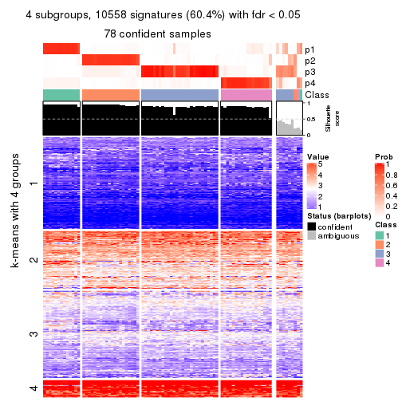</p>

</div>
<div id='tab-MAD-kmeans-get-signatures-no-scale-4'>
<pre><code class="r">get_signatures(res, k = 5, scale_rows = FALSE)
</code></pre>

<p></p>

</div>
<div id='tab-MAD-kmeans-get-signatures-no-scale-5'>
<pre><code class="r">get_signatures(res, k = 6, scale_rows = FALSE)
</code></pre>

<p></p>

</div>
</div>


Compare the overlap of signatures from different k:

```r
compare_signatures(res)
```


`get_signature()` returns a data frame invisibly. TO get the list of signatures, the function
call should be assigned to a variable explicitly. In following code, if `plot` argument is set
to `FALSE`, no heatmap is plotted while only the differential analysis is performed.

```r
# code only for demonstration
tb = get_signature(res, k = ..., plot = FALSE)
```

An example of the output of `tb` is:

```
#>   which_row         fdr    mean_1    mean_2 scaled_mean_1 scaled_mean_2 km
#> 1        38 0.042760348  8.373488  9.131774    -0.5533452     0.5164555  1
#> 2        40 0.018707592  7.106213  8.469186    -0.6173731     0.5762149  1
#> 3        55 0.019134737 10.221463 11.207825    -0.6159697     0.5749050  1
#> 4        59 0.006059896  5.921854  7.869574    -0.6899429     0.6439467  1
#> 5        60 0.018055526  8.928898 10.211722    -0.6204761     0.5791110  1
#> 6        98 0.009384629 15.714769 14.887706     0.6635654    -0.6193277  2
...
```

The columns in `tb` are:

1. `which_row`: row indices corresponding to the input matrix.
2. `fdr`: FDR for the differential test. 
3. `mean_x`: The mean value in group x.
4. `scaled_mean_x`: The mean value in group x after rows are scaled.
5. `km`: Row groups if k-means clustering is applied to rows.


UMAP plot which shows how samples are separated.


<script>
$( function() {
	$( '#tabs-MAD-kmeans-dimension-reduction' ).tabs();
} );
</script>
<div id='tabs-MAD-kmeans-dimension-reduction'>
<ul>
<li><a href='#tab-MAD-kmeans-dimension-reduction-1'>k = 2</a></li>
<li><a href='#tab-MAD-kmeans-dimension-reduction-2'>k = 3</a></li>
<li><a href='#tab-MAD-kmeans-dimension-reduction-3'>k = 4</a></li>
<li><a href='#tab-MAD-kmeans-dimension-reduction-4'>k = 5</a></li>
<li><a href='#tab-MAD-kmeans-dimension-reduction-5'>k = 6</a></li>
</ul>
<div id='tab-MAD-kmeans-dimension-reduction-1'>
<pre><code class="r">dimension_reduction(res, k = 2, method = &quot;UMAP&quot;)
</code></pre>

<p></p>

</div>
<div id='tab-MAD-kmeans-dimension-reduction-2'>
<pre><code class="r">dimension_reduction(res, k = 3, method = &quot;UMAP&quot;)
</code></pre>

<p></p>

</div>
<div id='tab-MAD-kmeans-dimension-reduction-3'>
<pre><code class="r">dimension_reduction(res, k = 4, method = &quot;UMAP&quot;)
</code></pre>

<p></p>

</div>
<div id='tab-MAD-kmeans-dimension-reduction-4'>
<pre><code class="r">dimension_reduction(res, k = 5, method = &quot;UMAP&quot;)
</code></pre>

<p></p>

</div>
<div id='tab-MAD-kmeans-dimension-reduction-5'>
<pre><code class="r">dimension_reduction(res, k = 6, method = &quot;UMAP&quot;)
</code></pre>

<p></p>

</div>
</div>


Following heatmap shows how subgroups are split when increasing `k`:

```r
collect_classes(res)
```


If matrix rows can be associated to genes, consider to use `functional_enrichment(res,
...)` to perform function enrichment for the signature genes. See [this vignette](http://bioconductor.org/packages/devel/bioc/vignettes/cola/inst/doc/functional_enrichment.html) for more detailed explanations.


 

---------------------------------------------------


### MAD:skmeans*


The object with results only for a single top-value method and a single partition method 
can be extracted as:

```r
res = res_list["MAD", "skmeans"]
# you can also extract it by
# res = res_list["MAD:skmeans"]
```

A summary of `res` and all the functions that can be applied to it:

```r
res
```

```
#> A 'ConsensusPartition' object with k = 2, 3, 4, 5, 6.
#>   On a matrix with 17471 rows and 87 columns.
#>   Top rows (1000, 2000, 3000, 4000, 5000) are extracted by 'MAD' method.
#>   Subgroups are detected by 'skmeans' method.
#>   Performed in total 1250 partitions by row resampling.
#>   Best k for subgroups seems to be 4.
#> 
#> Following methods can be applied to this 'ConsensusPartition' object:
#>  [1] "cola_report"             "collect_classes"         "collect_plots"          
#>  [4] "collect_stats"           "colnames"                "compare_signatures"     
#>  [7] "consensus_heatmap"       "dimension_reduction"     "functional_enrichment"  
#> [10] "get_anno_col"            "get_anno"                "get_classes"            
#> [13] "get_consensus"           "get_matrix"              "get_membership"         
#> [16] "get_param"               "get_signatures"          "get_stats"              
#> [19] "is_best_k"               "is_stable_k"             "membership_heatmap"     
#> [22] "ncol"                    "nrow"                    "plot_ecdf"              
#> [25] "rownames"                "select_partition_number" "show"                   
#> [28] "suggest_best_k"          "test_to_known_factors"
```

`collect_plots()` function collects all the plots made from `res` for all `k` (number of partitions)
into one single page to provide an easy and fast comparison between different `k`.

```r
collect_plots(res)
```


The plots are:

- The first row: a plot of the ECDF (empirical cumulative distribution
  function) curves of the consensus matrix for each `k` and the heatmap of
  predicted classes for each `k`.
- The second row: heatmaps of the consensus matrix for each `k`.
- The third row: heatmaps of the membership matrix for each `k`.
- The fouth row: heatmaps of the signatures for each `k`.

All the plots in panels can be made by individual functions and they are
plotted later in this section.

`select_partition_number()` produces several plots showing different
statistics for choosing "optimized" `k`. There are following statistics:

- ECDF curves of the consensus matrix for each `k`;
- 1-PAC. [The PAC
  score](https://en.wikipedia.org/wiki/Consensus_clustering#Over-interpretation_potential_of_consensus_clustering)
  measures the proportion of the ambiguous subgrouping.
- Mean silhouette score.
- Concordance. The mean probability of fiting the consensus class ids in all
  partitions.
- Area increased. Denote $A_k$ as the area under the ECDF curve for current
  `k`, the area increased is defined as $A_k - A_{k-1}$.
- Rand index. The percent of pairs of samples that are both in a same cluster
  or both are not in a same cluster in the partition of k and k-1.
- Jaccard index. The ratio of pairs of samples are both in a same cluster in
  the partition of k and k-1 and the pairs of samples are both in a same
  cluster in the partition k or k-1.

The detailed explanations of these statistics can be found in [the _cola_
vignette](http://bioconductor.org/packages/devel/bioc/vignettes/cola/inst/doc/cola.html#toc_13).

Generally speaking, lower PAC score, higher mean silhouette score or higher
concordance corresponds to better partition. Rand index and Jaccard index
measure how similar the current partition is compared to partition with `k-1`.
If they are too similar, we won't accept `k` is better than `k-1`.

```r
select_partition_number(res)
```


The numeric values for all these statistics can be obtained by `get_stats()`.

```r
get_stats(res)
```

```
#>   k 1-PAC mean_silhouette concordance area_increased  Rand Jaccard
#> 2 2 1.000           0.977       0.989         0.5011 0.500   0.500
#> 3 3 0.954           0.949       0.967         0.3213 0.809   0.628
#> 4 4 0.923           0.902       0.955         0.1375 0.870   0.638
#> 5 5 0.891           0.820       0.919         0.0629 0.920   0.698
#> 6 6 0.812           0.684       0.838         0.0349 0.976   0.885
```

`suggest_best_k()` suggests the best $k$ based on these statistics. The rules are as follows:

- All $k$ with Jaccard index larger than 0.95 are removed because increasing
  $k$ does not provide enough extra information. If all $k$ are removed, it is
  marked as no subgroup is detected.
- For all $k$ with 1-PAC score larger than 0.9, the maximal $k$ is taken as
  the best $k$, and other $k$ are marked as optional $k$.
- If it does not fit the second rule. The $k$ with the maximal vote of the
  highest 1-PAC score, highest mean silhouette, and highest concordance is
  taken as the best $k$.

```r
suggest_best_k(res)
```

```
#> [1] 4
#> attr(,"optional")
#> [1] 2 3
```

There is also optional best $k$ = 2 3 that is worth to check.

Following shows the table of the partitions (You need to click the **show/hide
code output** link to see it). The membership matrix (columns with name `p*`)
is inferred by
[`clue::cl_consensus()`](https://www.rdocumentation.org/link/cl_consensus?package=clue)
function with the `SE` method. Basically the value in the membership matrix
represents the probability to belong to a certain group. The finall class
label for an item is determined with the group with highest probability it
belongs to.

In `get_classes()` function, the entropy is calculated from the membership
matrix and the silhouette score is calculated from the consensus matrix.


<script>
$( function() {
	$( '#tabs-MAD-skmeans-get-classes' ).tabs();
} );
</script>
<div id='tabs-MAD-skmeans-get-classes'>
<ul>
<li><a href='#tab-MAD-skmeans-get-classes-1'>k = 2</a></li>
<li><a href='#tab-MAD-skmeans-get-classes-2'>k = 3</a></li>
<li><a href='#tab-MAD-skmeans-get-classes-3'>k = 4</a></li>
<li><a href='#tab-MAD-skmeans-get-classes-4'>k = 5</a></li>
<li><a href='#tab-MAD-skmeans-get-classes-5'>k = 6</a></li>
</ul>

<div id='tab-MAD-skmeans-get-classes-1'>
<p><a id='tab-MAD-skmeans-get-classes-1-a' style='color:#0366d6' href='#'>show/hide code output</a></p>
<pre><code class="r">cbind(get_classes(res, k = 2), get_membership(res, k = 2))
</code></pre>

<pre><code>#&gt;                                      class entropy silhouette    p1    p2
#&gt; E6088A41-B0DC-4FBF-8D14-BE78024CF8CD     2  0.0000      0.989 0.000 1.000
#&gt; F569915C-8F77-4D67-9730-30824DB57EE5     2  0.0000      0.989 0.000 1.000
#&gt; E3B71CB7-673B-4741-8607-4F0A11633036     1  0.0000      0.989 1.000 0.000
#&gt; DAF84798-FE3F-403C-B589-7F256AF752BE     1  0.0000      0.989 1.000 0.000
#&gt; 2F38E3B1-4975-4877-9DCC-C00270602180     1  0.0000      0.989 1.000 0.000
#&gt; C79A4C2F-02C4-4C03-A5A5-DE06802EEB57     2  0.0000      0.989 0.000 1.000
#&gt; 92E3ED8F-5C74-4ED2-9B03-9FA5E7B491D6     1  0.0000      0.989 1.000 0.000
#&gt; E61D60BE-3BD3-4B5E-BC12-80F3684A0959     1  0.0000      0.989 1.000 0.000
#&gt; C9388FC7-DB1D-4416-BC2D-EA643584F1E6     2  0.0000      0.989 0.000 1.000
#&gt; D4219360-6344-4AF3-ACEB-1701A9F1F67D     1  0.0000      0.989 1.000 0.000
#&gt; 07D155E6-F27C-4D09-B786-8A9B71147B72     1  0.0000      0.989 1.000 0.000
#&gt; 10C8C361-85A5-40E8-A395-B92623E6F27C     1  0.0000      0.989 1.000 0.000
#&gt; BDF20891-7C98-4A55-BBF3-8A836BE303C6     2  0.0000      0.989 0.000 1.000
#&gt; 694B0504-095E-431A-84F2-B4387072138E     1  0.0000      0.989 1.000 0.000
#&gt; EDCF8E7F-8B1D-46F7-8AE0-84A1DC9647D2     2  0.0000      0.989 0.000 1.000
#&gt; 0EA8288E-824D-4304-A053-5A833361F5C5     1  0.0000      0.989 1.000 0.000
#&gt; C4ACCFA1-34A9-4F61-8A1F-35B3B60EA193     1  0.0000      0.989 1.000 0.000
#&gt; 760BA639-38AC-4BC9-9647-09F6893EA8ED     1  0.0000      0.989 1.000 0.000
#&gt; 082DFC6B-C6E6-48B9-BDE5-74FF3B3DC954     2  0.0000      0.989 0.000 1.000
#&gt; FE349848-D7C4-4C49-B670-0E20454DDD7E     2  0.7219      0.757 0.200 0.800
#&gt; 2E8937B3-9EA1-4528-8CEE-BF3D4137908A     2  0.0000      0.989 0.000 1.000
#&gt; 9942D04E-2767-4E39-BA16-7762EAC3DFC4     2  0.0000      0.989 0.000 1.000
#&gt; F9C23182-91C4-4145-AE52-526FE8EB199D     2  0.0000      0.989 0.000 1.000
#&gt; 01024EED-7811-4E24-A067-8E0B978FFE2D     2  0.0000      0.989 0.000 1.000
#&gt; 932C8E98-A352-409C-8744-3D49FABCE425     1  0.0000      0.989 1.000 0.000
#&gt; 6DFD9439-C659-4936-84E5-108F717E3E4D     2  0.0376      0.985 0.004 0.996
#&gt; 1D8B83B8-5DD7-4F45-9D59-487EC6906A8B     2  0.0000      0.989 0.000 1.000
#&gt; 804B8503-73F6-42DE-835F-39DE2C9F13E1     2  0.0000      0.989 0.000 1.000
#&gt; B9453C9B-84D5-43BD-85BB-1780F02F039C     1  0.0000      0.989 1.000 0.000
#&gt; 836E6CD6-4E88-4028-9844-FA3C892C254A     1  0.0000      0.989 1.000 0.000
#&gt; 36EDD202-A845-4CE7-95D5-A515C471262E     2  0.0000      0.989 0.000 1.000
#&gt; 181C156A-B8F4-4F9D-93AA-6AFBD197644D     2  0.0000      0.989 0.000 1.000
#&gt; 0580E798-6A98-4E46-AC96-9A869DFF502E     1  0.0000      0.989 1.000 0.000
#&gt; EA1B63CF-D389-4567-8D9E-B0EF1F804598     1  0.7219      0.756 0.800 0.200
#&gt; 5ABC3D06-B8E9-4831-B89B-7C1EC4006B47     2  0.0000      0.989 0.000 1.000
#&gt; 1CC01E74-A7C1-4A51-9E28-1703C352BE16     2  0.0000      0.989 0.000 1.000
#&gt; 97E55B75-DBDB-46BC-9E74-7828C070BF16     2  0.0000      0.989 0.000 1.000
#&gt; BEB37A2D-E8B0-4674-89AC-DC0F34E0AFD6     1  0.0000      0.989 1.000 0.000
#&gt; 558648BA-6551-4D34-97C2-AD5F677D63FB     1  0.0000      0.989 1.000 0.000
#&gt; FF7021BB-414B-4466-BC43-372D856E6A1D     2  0.0000      0.989 0.000 1.000
#&gt; 9C04B840-54E0-425D-BDBE-8CB6B9C2C722     2  0.0000      0.989 0.000 1.000
#&gt; 5F50B1F4-1A02-4506-AA6D-9BF21CD8059A     1  0.0000      0.989 1.000 0.000
#&gt; 7D4B8FF3-7977-4ABD-AE04-EED1C50B23CC     2  0.0000      0.989 0.000 1.000
#&gt; A005AF15-B98E-4623-8AD4-1E69EFA9BC7A     1  0.0000      0.989 1.000 0.000
#&gt; 1DF04345-5C93-4B18-B307-8D1FCA532999     2  0.0000      0.989 0.000 1.000
#&gt; 6AF30C18-347E-41ED-A4AB-6F81F42206C5     1  0.0000      0.989 1.000 0.000
#&gt; 88A44ED0-BDE1-401E-B0E1-D8C8D6DBAEFC     2  0.0000      0.989 0.000 1.000
#&gt; 117673A3-2918-4702-8583-B66ADE6E4338     2  0.0000      0.989 0.000 1.000
#&gt; 4903A571-E14D-43C9-A737-22CAFAC414CD     1  0.7299      0.750 0.796 0.204
#&gt; C175E68E-632A-4B4A-9DDB-4895C4760F20     1  0.0000      0.989 1.000 0.000
#&gt; FA5CA2F4-A1AD-4A79-B8F3-73A976EB2FB1     2  0.0000      0.989 0.000 1.000
#&gt; E1F883A7-8B1F-4C1D-8A1A-9749A9C09845     2  0.0000      0.989 0.000 1.000
#&gt; E74F0729-6000-4908-ADB0-7BDBAC0639E6     1  0.0000      0.989 1.000 0.000
#&gt; F92135A9-1981-4C79-99A5-4243EEC5D30D     2  0.0000      0.989 0.000 1.000
#&gt; 73C6919F-DEB4-4DA4-B4AE-4032AC8F96C5     1  0.0000      0.989 1.000 0.000
#&gt; 33977B40-2E92-48B6-8D3A-3EBE913F6F8A     1  0.0000      0.989 1.000 0.000
#&gt; 490BD607-2F08-4B4C-9612-F9BB5CBBC8BB     2  0.0000      0.989 0.000 1.000
#&gt; 6C666E17-2EB8-4244-BCC1-8DD34EE4173E     2  0.0000      0.989 0.000 1.000
#&gt; C41F3064-4483-4796-B860-82155BAA5157     1  0.0000      0.989 1.000 0.000
#&gt; F4232B90-51B9-43EE-9971-35B3A318758F     1  0.0000      0.989 1.000 0.000
#&gt; 291EA1F6-FC56-4429-A433-0C452A6A514C     2  0.0000      0.989 0.000 1.000
#&gt; CC4AF04D-CB8E-40DD-B12E-7AA39B38262A     2  0.0000      0.989 0.000 1.000
#&gt; 4DAE26B9-AB57-4763-BB9A-2ADDD5D9C007     1  0.0000      0.989 1.000 0.000
#&gt; 676B4AEE-FB41-4C16-AA91-03E4A1DA8E26     2  0.7299      0.751 0.204 0.796
#&gt; 1CC36859-357A-49E0-A367-4F57D47288BA     1  0.0672      0.982 0.992 0.008
#&gt; 7CCDDFC8-6DF6-4734-96AC-19EBC464FC50     2  0.0000      0.989 0.000 1.000
#&gt; 10F38C34-3956-48ED-AB62-3439EF00D46B     2  0.0000      0.989 0.000 1.000
#&gt; 80B2B393-9D6E-45B4-B696-2A5C203543B7     2  0.0000      0.989 0.000 1.000
#&gt; 5AC7B5EA-1AAC-4529-8E5A-F612E5E0719A     1  0.0000      0.989 1.000 0.000
#&gt; 3648E98D-4B3A-41B7-BE05-595D44F0150D     1  0.0000      0.989 1.000 0.000
#&gt; 252EC850-6026-473B-8FFC-2CF567EF42E4     1  0.0000      0.989 1.000 0.000
#&gt; 1790E7A3-99D8-447E-BC50-51C8A4A18853     2  0.0000      0.989 0.000 1.000
#&gt; DA61A4F8-350B-4DD1-A240-AD016520DB5B     2  0.4562      0.891 0.096 0.904
#&gt; 767E5BAF-2515-40D7-AE7D-0B24D77A03F4     2  0.0000      0.989 0.000 1.000
#&gt; 8CB9C903-D749-44EA-9137-7FB5A92C5932     1  0.0000      0.989 1.000 0.000
#&gt; A9B968AE-2243-41BC-852A-3A12C1FB4892     1  0.0000      0.989 1.000 0.000
#&gt; 3C582264-85BC-4569-A888-8EB3008E5198     2  0.0000      0.989 0.000 1.000
#&gt; F4EAF9A2-9938-4D9B-9080-C0A7542D5704     2  0.0000      0.989 0.000 1.000
#&gt; 328499D3-45DD-4B66-BD22-3C52BA92C2BB     1  0.0000      0.989 1.000 0.000
#&gt; AF8AB83D-2917-4752-8C38-CF84C565B565     1  0.0000      0.989 1.000 0.000
#&gt; 03A327CA-A9FE-42A4-844D-CA85206969FC     2  0.0000      0.989 0.000 1.000
#&gt; 4B0BEC44-87BB-4014-9A26-3529DD63760B     2  0.0000      0.989 0.000 1.000
#&gt; 05C7843E-DC89-4D8E-A78A-952C5DFD667B     2  0.0000      0.989 0.000 1.000
#&gt; 29A0FFF9-13D3-4D16-BE6A-8E48A2C4E315     2  0.0000      0.989 0.000 1.000
#&gt; 22947CC3-4F42-4F44-899C-2B7085E36C9D     2  0.0000      0.989 0.000 1.000
#&gt; A247D92D-253A-4BEC-B450-184AF90D17D0     2  0.0000      0.989 0.000 1.000
#&gt; 0D907A63-D23F-4684-80D9-0BA552435B86     1  0.0000      0.989 1.000 0.000
</code></pre>

<script>
$('#tab-MAD-skmeans-get-classes-1-a').parent().next().next().hide();
$('#tab-MAD-skmeans-get-classes-1-a').click(function(){
  $('#tab-MAD-skmeans-get-classes-1-a').parent().next().next().toggle();
  return(false);
});
</script>
</div>

<div id='tab-MAD-skmeans-get-classes-2'>
<p><a id='tab-MAD-skmeans-get-classes-2-a' style='color:#0366d6' href='#'>show/hide code output</a></p>
<pre><code class="r">cbind(get_classes(res, k = 3), get_membership(res, k = 3))
</code></pre>

<pre><code>#&gt;                                      class entropy silhouette    p1    p2    p3
#&gt; E6088A41-B0DC-4FBF-8D14-BE78024CF8CD     3  0.1411      0.964 0.000 0.036 0.964
#&gt; F569915C-8F77-4D67-9730-30824DB57EE5     3  0.1529      0.964 0.000 0.040 0.960
#&gt; E3B71CB7-673B-4741-8607-4F0A11633036     1  0.0000      0.965 1.000 0.000 0.000
#&gt; DAF84798-FE3F-403C-B589-7F256AF752BE     1  0.0000      0.965 1.000 0.000 0.000
#&gt; 2F38E3B1-4975-4877-9DCC-C00270602180     1  0.0000      0.965 1.000 0.000 0.000
#&gt; C79A4C2F-02C4-4C03-A5A5-DE06802EEB57     3  0.1411      0.964 0.000 0.036 0.964
#&gt; 92E3ED8F-5C74-4ED2-9B03-9FA5E7B491D6     1  0.0000      0.965 1.000 0.000 0.000
#&gt; E61D60BE-3BD3-4B5E-BC12-80F3684A0959     1  0.1529      0.961 0.960 0.000 0.040
#&gt; C9388FC7-DB1D-4416-BC2D-EA643584F1E6     2  0.2165      0.929 0.000 0.936 0.064
#&gt; D4219360-6344-4AF3-ACEB-1701A9F1F67D     1  0.0000      0.965 1.000 0.000 0.000
#&gt; 07D155E6-F27C-4D09-B786-8A9B71147B72     1  0.1529      0.961 0.960 0.000 0.040
#&gt; 10C8C361-85A5-40E8-A395-B92623E6F27C     1  0.0000      0.965 1.000 0.000 0.000
#&gt; BDF20891-7C98-4A55-BBF3-8A836BE303C6     2  0.0000      0.977 0.000 1.000 0.000
#&gt; 694B0504-095E-431A-84F2-B4387072138E     1  0.0000      0.965 1.000 0.000 0.000
#&gt; EDCF8E7F-8B1D-46F7-8AE0-84A1DC9647D2     2  0.1753      0.942 0.000 0.952 0.048
#&gt; 0EA8288E-824D-4304-A053-5A833361F5C5     1  0.4399      0.820 0.812 0.000 0.188
#&gt; C4ACCFA1-34A9-4F61-8A1F-35B3B60EA193     1  0.0000      0.965 1.000 0.000 0.000
#&gt; 760BA639-38AC-4BC9-9647-09F6893EA8ED     1  0.0000      0.965 1.000 0.000 0.000
#&gt; 082DFC6B-C6E6-48B9-BDE5-74FF3B3DC954     3  0.1529      0.964 0.000 0.040 0.960
#&gt; FE349848-D7C4-4C49-B670-0E20454DDD7E     3  0.0000      0.951 0.000 0.000 1.000
#&gt; 2E8937B3-9EA1-4528-8CEE-BF3D4137908A     2  0.0000      0.977 0.000 1.000 0.000
#&gt; 9942D04E-2767-4E39-BA16-7762EAC3DFC4     2  0.0000      0.977 0.000 1.000 0.000
#&gt; F9C23182-91C4-4145-AE52-526FE8EB199D     2  0.1163      0.953 0.028 0.972 0.000
#&gt; 01024EED-7811-4E24-A067-8E0B978FFE2D     2  0.0000      0.977 0.000 1.000 0.000
#&gt; 932C8E98-A352-409C-8744-3D49FABCE425     1  0.0000      0.965 1.000 0.000 0.000
#&gt; 6DFD9439-C659-4936-84E5-108F717E3E4D     2  0.4351      0.815 0.004 0.828 0.168
#&gt; 1D8B83B8-5DD7-4F45-9D59-487EC6906A8B     3  0.1643      0.961 0.000 0.044 0.956
#&gt; 804B8503-73F6-42DE-835F-39DE2C9F13E1     2  0.0000      0.977 0.000 1.000 0.000
#&gt; B9453C9B-84D5-43BD-85BB-1780F02F039C     1  0.0000      0.965 1.000 0.000 0.000
#&gt; 836E6CD6-4E88-4028-9844-FA3C892C254A     1  0.2066      0.925 0.940 0.000 0.060
#&gt; 36EDD202-A845-4CE7-95D5-A515C471262E     2  0.0000      0.977 0.000 1.000 0.000
#&gt; 181C156A-B8F4-4F9D-93AA-6AFBD197644D     2  0.0000      0.977 0.000 1.000 0.000
#&gt; 0580E798-6A98-4E46-AC96-9A869DFF502E     1  0.1529      0.961 0.960 0.000 0.040
#&gt; EA1B63CF-D389-4567-8D9E-B0EF1F804598     1  0.5115      0.692 0.768 0.228 0.004
#&gt; 5ABC3D06-B8E9-4831-B89B-7C1EC4006B47     2  0.0000      0.977 0.000 1.000 0.000
#&gt; 1CC01E74-A7C1-4A51-9E28-1703C352BE16     2  0.0000      0.977 0.000 1.000 0.000
#&gt; 97E55B75-DBDB-46BC-9E74-7828C070BF16     2  0.0000      0.977 0.000 1.000 0.000
#&gt; BEB37A2D-E8B0-4674-89AC-DC0F34E0AFD6     1  0.1529      0.961 0.960 0.000 0.040
#&gt; 558648BA-6551-4D34-97C2-AD5F677D63FB     1  0.0237      0.963 0.996 0.000 0.004
#&gt; FF7021BB-414B-4466-BC43-372D856E6A1D     3  0.3116      0.876 0.000 0.108 0.892
#&gt; 9C04B840-54E0-425D-BDBE-8CB6B9C2C722     2  0.0000      0.977 0.000 1.000 0.000
#&gt; 5F50B1F4-1A02-4506-AA6D-9BF21CD8059A     3  0.2796      0.885 0.092 0.000 0.908
#&gt; 7D4B8FF3-7977-4ABD-AE04-EED1C50B23CC     2  0.1289      0.954 0.000 0.968 0.032
#&gt; A005AF15-B98E-4623-8AD4-1E69EFA9BC7A     1  0.1529      0.961 0.960 0.000 0.040
#&gt; 1DF04345-5C93-4B18-B307-8D1FCA532999     2  0.0000      0.977 0.000 1.000 0.000
#&gt; 6AF30C18-347E-41ED-A4AB-6F81F42206C5     1  0.1411      0.962 0.964 0.000 0.036
#&gt; 88A44ED0-BDE1-401E-B0E1-D8C8D6DBAEFC     3  0.1529      0.964 0.000 0.040 0.960
#&gt; 117673A3-2918-4702-8583-B66ADE6E4338     2  0.0424      0.972 0.000 0.992 0.008
#&gt; 4903A571-E14D-43C9-A737-22CAFAC414CD     3  0.3425      0.862 0.112 0.004 0.884
#&gt; C175E68E-632A-4B4A-9DDB-4895C4760F20     1  0.0000      0.965 1.000 0.000 0.000
#&gt; FA5CA2F4-A1AD-4A79-B8F3-73A976EB2FB1     3  0.2261      0.944 0.000 0.068 0.932
#&gt; E1F883A7-8B1F-4C1D-8A1A-9749A9C09845     2  0.0000      0.977 0.000 1.000 0.000
#&gt; E74F0729-6000-4908-ADB0-7BDBAC0639E6     1  0.0000      0.965 1.000 0.000 0.000
#&gt; F92135A9-1981-4C79-99A5-4243EEC5D30D     2  0.0000      0.977 0.000 1.000 0.000
#&gt; 73C6919F-DEB4-4DA4-B4AE-4032AC8F96C5     1  0.0000      0.965 1.000 0.000 0.000
#&gt; 33977B40-2E92-48B6-8D3A-3EBE913F6F8A     1  0.1643      0.960 0.956 0.000 0.044
#&gt; 490BD607-2F08-4B4C-9612-F9BB5CBBC8BB     3  0.1529      0.964 0.000 0.040 0.960
#&gt; 6C666E17-2EB8-4244-BCC1-8DD34EE4173E     3  0.1411      0.964 0.000 0.036 0.964
#&gt; C41F3064-4483-4796-B860-82155BAA5157     1  0.1411      0.962 0.964 0.000 0.036
#&gt; F4232B90-51B9-43EE-9971-35B3A318758F     1  0.1529      0.961 0.960 0.000 0.040
#&gt; 291EA1F6-FC56-4429-A433-0C452A6A514C     2  0.0000      0.977 0.000 1.000 0.000
#&gt; CC4AF04D-CB8E-40DD-B12E-7AA39B38262A     2  0.0000      0.977 0.000 1.000 0.000
#&gt; 4DAE26B9-AB57-4763-BB9A-2ADDD5D9C007     1  0.1529      0.961 0.960 0.000 0.040
#&gt; 676B4AEE-FB41-4C16-AA91-03E4A1DA8E26     2  0.6841      0.663 0.200 0.724 0.076
#&gt; 1CC36859-357A-49E0-A367-4F57D47288BA     3  0.2878      0.908 0.096 0.000 0.904
#&gt; 7CCDDFC8-6DF6-4734-96AC-19EBC464FC50     2  0.0000      0.977 0.000 1.000 0.000
#&gt; 10F38C34-3956-48ED-AB62-3439EF00D46B     3  0.0237      0.953 0.000 0.004 0.996
#&gt; 80B2B393-9D6E-45B4-B696-2A5C203543B7     2  0.0000      0.977 0.000 1.000 0.000
#&gt; 5AC7B5EA-1AAC-4529-8E5A-F612E5E0719A     1  0.4178      0.841 0.828 0.000 0.172
#&gt; 3648E98D-4B3A-41B7-BE05-595D44F0150D     1  0.0000      0.965 1.000 0.000 0.000
#&gt; 252EC850-6026-473B-8FFC-2CF567EF42E4     1  0.1529      0.961 0.960 0.000 0.040
#&gt; 1790E7A3-99D8-447E-BC50-51C8A4A18853     2  0.0000      0.977 0.000 1.000 0.000
#&gt; DA61A4F8-350B-4DD1-A240-AD016520DB5B     3  0.1411      0.964 0.000 0.036 0.964
#&gt; 767E5BAF-2515-40D7-AE7D-0B24D77A03F4     3  0.0000      0.951 0.000 0.000 1.000
#&gt; 8CB9C903-D749-44EA-9137-7FB5A92C5932     1  0.2066      0.925 0.940 0.000 0.060
#&gt; A9B968AE-2243-41BC-852A-3A12C1FB4892     1  0.1529      0.961 0.960 0.000 0.040
#&gt; 3C582264-85BC-4569-A888-8EB3008E5198     2  0.0000      0.977 0.000 1.000 0.000
#&gt; F4EAF9A2-9938-4D9B-9080-C0A7542D5704     2  0.0000      0.977 0.000 1.000 0.000
#&gt; 328499D3-45DD-4B66-BD22-3C52BA92C2BB     1  0.0000      0.965 1.000 0.000 0.000
#&gt; AF8AB83D-2917-4752-8C38-CF84C565B565     1  0.1529      0.961 0.960 0.000 0.040
#&gt; 03A327CA-A9FE-42A4-844D-CA85206969FC     3  0.1529      0.964 0.000 0.040 0.960
#&gt; 4B0BEC44-87BB-4014-9A26-3529DD63760B     3  0.0000      0.951 0.000 0.000 1.000
#&gt; 05C7843E-DC89-4D8E-A78A-952C5DFD667B     3  0.0000      0.951 0.000 0.000 1.000
#&gt; 29A0FFF9-13D3-4D16-BE6A-8E48A2C4E315     2  0.0000      0.977 0.000 1.000 0.000
#&gt; 22947CC3-4F42-4F44-899C-2B7085E36C9D     3  0.1529      0.964 0.000 0.040 0.960
#&gt; A247D92D-253A-4BEC-B450-184AF90D17D0     3  0.1529      0.964 0.000 0.040 0.960
#&gt; 0D907A63-D23F-4684-80D9-0BA552435B86     1  0.1529      0.961 0.960 0.000 0.040
</code></pre>

<script>
$('#tab-MAD-skmeans-get-classes-2-a').parent().next().next().hide();
$('#tab-MAD-skmeans-get-classes-2-a').click(function(){
  $('#tab-MAD-skmeans-get-classes-2-a').parent().next().next().toggle();
  return(false);
});
</script>
</div>

<div id='tab-MAD-skmeans-get-classes-3'>
<p><a id='tab-MAD-skmeans-get-classes-3-a' style='color:#0366d6' href='#'>show/hide code output</a></p>
<pre><code class="r">cbind(get_classes(res, k = 4), get_membership(res, k = 4))
</code></pre>

<pre><code>#&gt;                                      class entropy silhouette    p1    p2    p3    p4
#&gt; E6088A41-B0DC-4FBF-8D14-BE78024CF8CD     3  0.0000      0.992 0.000 0.000 1.000 0.000
#&gt; F569915C-8F77-4D67-9730-30824DB57EE5     3  0.0000      0.992 0.000 0.000 1.000 0.000
#&gt; E3B71CB7-673B-4741-8607-4F0A11633036     1  0.0469      0.953 0.988 0.000 0.000 0.012
#&gt; DAF84798-FE3F-403C-B589-7F256AF752BE     1  0.0000      0.955 1.000 0.000 0.000 0.000
#&gt; 2F38E3B1-4975-4877-9DCC-C00270602180     4  0.4605      0.546 0.336 0.000 0.000 0.664
#&gt; C79A4C2F-02C4-4C03-A5A5-DE06802EEB57     3  0.0000      0.992 0.000 0.000 1.000 0.000
#&gt; 92E3ED8F-5C74-4ED2-9B03-9FA5E7B491D6     1  0.0000      0.955 1.000 0.000 0.000 0.000
#&gt; E61D60BE-3BD3-4B5E-BC12-80F3684A0959     4  0.0000      0.922 0.000 0.000 0.000 1.000
#&gt; C9388FC7-DB1D-4416-BC2D-EA643584F1E6     2  0.5912      0.155 0.000 0.524 0.036 0.440
#&gt; D4219360-6344-4AF3-ACEB-1701A9F1F67D     1  0.0188      0.955 0.996 0.000 0.000 0.004
#&gt; 07D155E6-F27C-4D09-B786-8A9B71147B72     4  0.1118      0.907 0.036 0.000 0.000 0.964
#&gt; 10C8C361-85A5-40E8-A395-B92623E6F27C     1  0.1389      0.933 0.952 0.000 0.000 0.048
#&gt; BDF20891-7C98-4A55-BBF3-8A836BE303C6     2  0.0000      0.944 0.000 1.000 0.000 0.000
#&gt; 694B0504-095E-431A-84F2-B4387072138E     1  0.0000      0.955 1.000 0.000 0.000 0.000
#&gt; EDCF8E7F-8B1D-46F7-8AE0-84A1DC9647D2     2  0.3751      0.749 0.004 0.800 0.196 0.000
#&gt; 0EA8288E-824D-4304-A053-5A833361F5C5     4  0.0000      0.922 0.000 0.000 0.000 1.000
#&gt; C4ACCFA1-34A9-4F61-8A1F-35B3B60EA193     1  0.0000      0.955 1.000 0.000 0.000 0.000
#&gt; 760BA639-38AC-4BC9-9647-09F6893EA8ED     1  0.0000      0.955 1.000 0.000 0.000 0.000
#&gt; 082DFC6B-C6E6-48B9-BDE5-74FF3B3DC954     3  0.0000      0.992 0.000 0.000 1.000 0.000
#&gt; FE349848-D7C4-4C49-B670-0E20454DDD7E     3  0.0000      0.992 0.000 0.000 1.000 0.000
#&gt; 2E8937B3-9EA1-4528-8CEE-BF3D4137908A     2  0.0000      0.944 0.000 1.000 0.000 0.000
#&gt; 9942D04E-2767-4E39-BA16-7762EAC3DFC4     2  0.0000      0.944 0.000 1.000 0.000 0.000
#&gt; F9C23182-91C4-4145-AE52-526FE8EB199D     2  0.4564      0.517 0.328 0.672 0.000 0.000
#&gt; 01024EED-7811-4E24-A067-8E0B978FFE2D     2  0.0000      0.944 0.000 1.000 0.000 0.000
#&gt; 932C8E98-A352-409C-8744-3D49FABCE425     1  0.0000      0.955 1.000 0.000 0.000 0.000
#&gt; 6DFD9439-C659-4936-84E5-108F717E3E4D     2  0.7817      0.567 0.084 0.608 0.176 0.132
#&gt; 1D8B83B8-5DD7-4F45-9D59-487EC6906A8B     3  0.0000      0.992 0.000 0.000 1.000 0.000
#&gt; 804B8503-73F6-42DE-835F-39DE2C9F13E1     2  0.0000      0.944 0.000 1.000 0.000 0.000
#&gt; B9453C9B-84D5-43BD-85BB-1780F02F039C     1  0.0592      0.952 0.984 0.000 0.000 0.016
#&gt; 836E6CD6-4E88-4028-9844-FA3C892C254A     1  0.1118      0.934 0.964 0.000 0.000 0.036
#&gt; 36EDD202-A845-4CE7-95D5-A515C471262E     2  0.0000      0.944 0.000 1.000 0.000 0.000
#&gt; 181C156A-B8F4-4F9D-93AA-6AFBD197644D     2  0.0000      0.944 0.000 1.000 0.000 0.000
#&gt; 0580E798-6A98-4E46-AC96-9A869DFF502E     4  0.0000      0.922 0.000 0.000 0.000 1.000
#&gt; EA1B63CF-D389-4567-8D9E-B0EF1F804598     1  0.0000      0.955 1.000 0.000 0.000 0.000
#&gt; 5ABC3D06-B8E9-4831-B89B-7C1EC4006B47     2  0.0000      0.944 0.000 1.000 0.000 0.000
#&gt; 1CC01E74-A7C1-4A51-9E28-1703C352BE16     2  0.0000      0.944 0.000 1.000 0.000 0.000
#&gt; 97E55B75-DBDB-46BC-9E74-7828C070BF16     2  0.0000      0.944 0.000 1.000 0.000 0.000
#&gt; BEB37A2D-E8B0-4674-89AC-DC0F34E0AFD6     4  0.0000      0.922 0.000 0.000 0.000 1.000
#&gt; 558648BA-6551-4D34-97C2-AD5F677D63FB     1  0.3444      0.780 0.816 0.000 0.000 0.184
#&gt; FF7021BB-414B-4466-BC43-372D856E6A1D     3  0.2142      0.926 0.000 0.016 0.928 0.056
#&gt; 9C04B840-54E0-425D-BDBE-8CB6B9C2C722     2  0.0000      0.944 0.000 1.000 0.000 0.000
#&gt; 5F50B1F4-1A02-4506-AA6D-9BF21CD8059A     4  0.2081      0.866 0.000 0.000 0.084 0.916
#&gt; 7D4B8FF3-7977-4ABD-AE04-EED1C50B23CC     2  0.1888      0.903 0.016 0.940 0.044 0.000
#&gt; A005AF15-B98E-4623-8AD4-1E69EFA9BC7A     4  0.0000      0.922 0.000 0.000 0.000 1.000
#&gt; 1DF04345-5C93-4B18-B307-8D1FCA532999     2  0.0000      0.944 0.000 1.000 0.000 0.000
#&gt; 6AF30C18-347E-41ED-A4AB-6F81F42206C5     4  0.0000      0.922 0.000 0.000 0.000 1.000
#&gt; 88A44ED0-BDE1-401E-B0E1-D8C8D6DBAEFC     3  0.0000      0.992 0.000 0.000 1.000 0.000
#&gt; 117673A3-2918-4702-8583-B66ADE6E4338     2  0.2611      0.861 0.008 0.896 0.096 0.000
#&gt; 4903A571-E14D-43C9-A737-22CAFAC414CD     4  0.4379      0.745 0.036 0.000 0.172 0.792
#&gt; C175E68E-632A-4B4A-9DDB-4895C4760F20     1  0.0000      0.955 1.000 0.000 0.000 0.000
#&gt; FA5CA2F4-A1AD-4A79-B8F3-73A976EB2FB1     3  0.1557      0.932 0.000 0.056 0.944 0.000
#&gt; E1F883A7-8B1F-4C1D-8A1A-9749A9C09845     2  0.0000      0.944 0.000 1.000 0.000 0.000
#&gt; E74F0729-6000-4908-ADB0-7BDBAC0639E6     4  0.4164      0.654 0.264 0.000 0.000 0.736
#&gt; F92135A9-1981-4C79-99A5-4243EEC5D30D     2  0.0000      0.944 0.000 1.000 0.000 0.000
#&gt; 73C6919F-DEB4-4DA4-B4AE-4032AC8F96C5     4  0.3801      0.711 0.220 0.000 0.000 0.780
#&gt; 33977B40-2E92-48B6-8D3A-3EBE913F6F8A     4  0.0336      0.919 0.008 0.000 0.000 0.992
#&gt; 490BD607-2F08-4B4C-9612-F9BB5CBBC8BB     3  0.0000      0.992 0.000 0.000 1.000 0.000
#&gt; 6C666E17-2EB8-4244-BCC1-8DD34EE4173E     3  0.0000      0.992 0.000 0.000 1.000 0.000
#&gt; C41F3064-4483-4796-B860-82155BAA5157     4  0.1118      0.907 0.036 0.000 0.000 0.964
#&gt; F4232B90-51B9-43EE-9971-35B3A318758F     4  0.0000      0.922 0.000 0.000 0.000 1.000
#&gt; 291EA1F6-FC56-4429-A433-0C452A6A514C     2  0.0000      0.944 0.000 1.000 0.000 0.000
#&gt; CC4AF04D-CB8E-40DD-B12E-7AA39B38262A     2  0.0000      0.944 0.000 1.000 0.000 0.000
#&gt; 4DAE26B9-AB57-4763-BB9A-2ADDD5D9C007     4  0.0000      0.922 0.000 0.000 0.000 1.000
#&gt; 676B4AEE-FB41-4C16-AA91-03E4A1DA8E26     4  0.5282      0.581 0.036 0.276 0.000 0.688
#&gt; 1CC36859-357A-49E0-A367-4F57D47288BA     1  0.4730      0.433 0.636 0.000 0.364 0.000
#&gt; 7CCDDFC8-6DF6-4734-96AC-19EBC464FC50     2  0.0000      0.944 0.000 1.000 0.000 0.000
#&gt; 10F38C34-3956-48ED-AB62-3439EF00D46B     3  0.0000      0.992 0.000 0.000 1.000 0.000
#&gt; 80B2B393-9D6E-45B4-B696-2A5C203543B7     2  0.0000      0.944 0.000 1.000 0.000 0.000
#&gt; 5AC7B5EA-1AAC-4529-8E5A-F612E5E0719A     4  0.0000      0.922 0.000 0.000 0.000 1.000
#&gt; 3648E98D-4B3A-41B7-BE05-595D44F0150D     1  0.0707      0.949 0.980 0.000 0.000 0.020
#&gt; 252EC850-6026-473B-8FFC-2CF567EF42E4     4  0.0000      0.922 0.000 0.000 0.000 1.000
#&gt; 1790E7A3-99D8-447E-BC50-51C8A4A18853     2  0.0000      0.944 0.000 1.000 0.000 0.000
#&gt; DA61A4F8-350B-4DD1-A240-AD016520DB5B     3  0.0000      0.992 0.000 0.000 1.000 0.000
#&gt; 767E5BAF-2515-40D7-AE7D-0B24D77A03F4     3  0.0000      0.992 0.000 0.000 1.000 0.000
#&gt; 8CB9C903-D749-44EA-9137-7FB5A92C5932     1  0.0921      0.944 0.972 0.000 0.000 0.028
#&gt; A9B968AE-2243-41BC-852A-3A12C1FB4892     4  0.1118      0.907 0.036 0.000 0.000 0.964
#&gt; 3C582264-85BC-4569-A888-8EB3008E5198     2  0.0000      0.944 0.000 1.000 0.000 0.000
#&gt; F4EAF9A2-9938-4D9B-9080-C0A7542D5704     2  0.0000      0.944 0.000 1.000 0.000 0.000
#&gt; 328499D3-45DD-4B66-BD22-3C52BA92C2BB     1  0.0592      0.952 0.984 0.000 0.000 0.016
#&gt; AF8AB83D-2917-4752-8C38-CF84C565B565     4  0.0000      0.922 0.000 0.000 0.000 1.000
#&gt; 03A327CA-A9FE-42A4-844D-CA85206969FC     3  0.0000      0.992 0.000 0.000 1.000 0.000
#&gt; 4B0BEC44-87BB-4014-9A26-3529DD63760B     3  0.0000      0.992 0.000 0.000 1.000 0.000
#&gt; 05C7843E-DC89-4D8E-A78A-952C5DFD667B     3  0.0000      0.992 0.000 0.000 1.000 0.000
#&gt; 29A0FFF9-13D3-4D16-BE6A-8E48A2C4E315     2  0.0000      0.944 0.000 1.000 0.000 0.000
#&gt; 22947CC3-4F42-4F44-899C-2B7085E36C9D     3  0.0000      0.992 0.000 0.000 1.000 0.000
#&gt; A247D92D-253A-4BEC-B450-184AF90D17D0     3  0.0000      0.992 0.000 0.000 1.000 0.000
#&gt; 0D907A63-D23F-4684-80D9-0BA552435B86     4  0.0000      0.922 0.000 0.000 0.000 1.000
</code></pre>

<script>
$('#tab-MAD-skmeans-get-classes-3-a').parent().next().next().hide();
$('#tab-MAD-skmeans-get-classes-3-a').click(function(){
  $('#tab-MAD-skmeans-get-classes-3-a').parent().next().next().toggle();
  return(false);
});
</script>
</div>

<div id='tab-MAD-skmeans-get-classes-4'>
<p><a id='tab-MAD-skmeans-get-classes-4-a' style='color:#0366d6' href='#'>show/hide code output</a></p>
<pre><code class="r">cbind(get_classes(res, k = 5), get_membership(res, k = 5))
</code></pre>

<pre><code>#&gt;                                      class entropy silhouette    p1    p2    p3    p4    p5
#&gt; E6088A41-B0DC-4FBF-8D14-BE78024CF8CD     3  0.1197     0.8900 0.000 0.000 0.952 0.000 0.048
#&gt; F569915C-8F77-4D67-9730-30824DB57EE5     3  0.0000     0.9159 0.000 0.000 1.000 0.000 0.000
#&gt; E3B71CB7-673B-4741-8607-4F0A11633036     1  0.0000     0.9125 1.000 0.000 0.000 0.000 0.000
#&gt; DAF84798-FE3F-403C-B589-7F256AF752BE     5  0.2329     0.7717 0.124 0.000 0.000 0.000 0.876
#&gt; 2F38E3B1-4975-4877-9DCC-C00270602180     4  0.4305     0.0762 0.488 0.000 0.000 0.512 0.000
#&gt; C79A4C2F-02C4-4C03-A5A5-DE06802EEB57     3  0.0162     0.9145 0.000 0.000 0.996 0.000 0.004
#&gt; 92E3ED8F-5C74-4ED2-9B03-9FA5E7B491D6     1  0.0162     0.9122 0.996 0.000 0.000 0.000 0.004
#&gt; E61D60BE-3BD3-4B5E-BC12-80F3684A0959     4  0.0000     0.8883 0.000 0.000 0.000 1.000 0.000
#&gt; C9388FC7-DB1D-4416-BC2D-EA643584F1E6     5  0.5707     0.2830 0.000 0.092 0.000 0.364 0.544
#&gt; D4219360-6344-4AF3-ACEB-1701A9F1F67D     1  0.0000     0.9125 1.000 0.000 0.000 0.000 0.000
#&gt; 07D155E6-F27C-4D09-B786-8A9B71147B72     4  0.1197     0.8695 0.048 0.000 0.000 0.952 0.000
#&gt; 10C8C361-85A5-40E8-A395-B92623E6F27C     1  0.0955     0.8990 0.968 0.000 0.000 0.028 0.004
#&gt; BDF20891-7C98-4A55-BBF3-8A836BE303C6     2  0.0000     0.9475 0.000 1.000 0.000 0.000 0.000
#&gt; 694B0504-095E-431A-84F2-B4387072138E     1  0.0510     0.9087 0.984 0.000 0.000 0.000 0.016
#&gt; EDCF8E7F-8B1D-46F7-8AE0-84A1DC9647D2     5  0.1281     0.8183 0.000 0.032 0.012 0.000 0.956
#&gt; 0EA8288E-824D-4304-A053-5A833361F5C5     4  0.1544     0.8514 0.000 0.000 0.000 0.932 0.068
#&gt; C4ACCFA1-34A9-4F61-8A1F-35B3B60EA193     1  0.0609     0.9073 0.980 0.000 0.000 0.000 0.020
#&gt; 760BA639-38AC-4BC9-9647-09F6893EA8ED     1  0.0290     0.9113 0.992 0.000 0.000 0.000 0.008
#&gt; 082DFC6B-C6E6-48B9-BDE5-74FF3B3DC954     3  0.0000     0.9159 0.000 0.000 1.000 0.000 0.000
#&gt; FE349848-D7C4-4C49-B670-0E20454DDD7E     3  0.3913     0.5371 0.000 0.000 0.676 0.000 0.324
#&gt; 2E8937B3-9EA1-4528-8CEE-BF3D4137908A     2  0.0000     0.9475 0.000 1.000 0.000 0.000 0.000
#&gt; 9942D04E-2767-4E39-BA16-7762EAC3DFC4     2  0.2074     0.8846 0.000 0.896 0.000 0.000 0.104
#&gt; F9C23182-91C4-4145-AE52-526FE8EB199D     5  0.5906     0.5252 0.140 0.284 0.000 0.000 0.576
#&gt; 01024EED-7811-4E24-A067-8E0B978FFE2D     2  0.0162     0.9478 0.000 0.996 0.000 0.000 0.004
#&gt; 932C8E98-A352-409C-8744-3D49FABCE425     1  0.2280     0.8242 0.880 0.000 0.000 0.000 0.120
#&gt; 6DFD9439-C659-4936-84E5-108F717E3E4D     5  0.1616     0.8194 0.004 0.008 0.008 0.032 0.948
#&gt; 1D8B83B8-5DD7-4F45-9D59-487EC6906A8B     3  0.0703     0.9061 0.000 0.000 0.976 0.000 0.024
#&gt; 804B8503-73F6-42DE-835F-39DE2C9F13E1     2  0.0162     0.9478 0.000 0.996 0.000 0.000 0.004
#&gt; B9453C9B-84D5-43BD-85BB-1780F02F039C     1  0.0162     0.9120 0.996 0.000 0.000 0.000 0.004
#&gt; 836E6CD6-4E88-4028-9844-FA3C892C254A     1  0.2962     0.8374 0.868 0.000 0.000 0.048 0.084
#&gt; 36EDD202-A845-4CE7-95D5-A515C471262E     2  0.4171     0.3128 0.000 0.604 0.000 0.000 0.396
#&gt; 181C156A-B8F4-4F9D-93AA-6AFBD197644D     2  0.0000     0.9475 0.000 1.000 0.000 0.000 0.000
#&gt; 0580E798-6A98-4E46-AC96-9A869DFF502E     4  0.0290     0.8876 0.008 0.000 0.000 0.992 0.000
#&gt; EA1B63CF-D389-4567-8D9E-B0EF1F804598     5  0.3534     0.6218 0.256 0.000 0.000 0.000 0.744
#&gt; 5ABC3D06-B8E9-4831-B89B-7C1EC4006B47     2  0.2020     0.8872 0.000 0.900 0.000 0.000 0.100
#&gt; 1CC01E74-A7C1-4A51-9E28-1703C352BE16     2  0.0000     0.9475 0.000 1.000 0.000 0.000 0.000
#&gt; 97E55B75-DBDB-46BC-9E74-7828C070BF16     2  0.0794     0.9350 0.000 0.972 0.000 0.000 0.028
#&gt; BEB37A2D-E8B0-4674-89AC-DC0F34E0AFD6     4  0.0000     0.8883 0.000 0.000 0.000 1.000 0.000
#&gt; 558648BA-6551-4D34-97C2-AD5F677D63FB     1  0.2284     0.8659 0.912 0.000 0.028 0.056 0.004
#&gt; FF7021BB-414B-4466-BC43-372D856E6A1D     5  0.1331     0.8026 0.000 0.000 0.040 0.008 0.952
#&gt; 9C04B840-54E0-425D-BDBE-8CB6B9C2C722     2  0.3210     0.7020 0.000 0.788 0.000 0.000 0.212
#&gt; 5F50B1F4-1A02-4506-AA6D-9BF21CD8059A     4  0.1571     0.8498 0.000 0.000 0.060 0.936 0.004
#&gt; 7D4B8FF3-7977-4ABD-AE04-EED1C50B23CC     5  0.1851     0.8084 0.000 0.088 0.000 0.000 0.912
#&gt; A005AF15-B98E-4623-8AD4-1E69EFA9BC7A     4  0.0000     0.8883 0.000 0.000 0.000 1.000 0.000
#&gt; 1DF04345-5C93-4B18-B307-8D1FCA532999     2  0.0000     0.9475 0.000 1.000 0.000 0.000 0.000
#&gt; 6AF30C18-347E-41ED-A4AB-6F81F42206C5     4  0.0290     0.8876 0.008 0.000 0.000 0.992 0.000
#&gt; 88A44ED0-BDE1-401E-B0E1-D8C8D6DBAEFC     3  0.0000     0.9159 0.000 0.000 1.000 0.000 0.000
#&gt; 117673A3-2918-4702-8583-B66ADE6E4338     5  0.1591     0.8207 0.004 0.052 0.004 0.000 0.940
#&gt; 4903A571-E14D-43C9-A737-22CAFAC414CD     5  0.2517     0.7898 0.000 0.004 0.008 0.104 0.884
#&gt; C175E68E-632A-4B4A-9DDB-4895C4760F20     1  0.2929     0.7444 0.820 0.000 0.000 0.000 0.180
#&gt; FA5CA2F4-A1AD-4A79-B8F3-73A976EB2FB1     3  0.0703     0.9003 0.000 0.024 0.976 0.000 0.000
#&gt; E1F883A7-8B1F-4C1D-8A1A-9749A9C09845     2  0.0000     0.9475 0.000 1.000 0.000 0.000 0.000
#&gt; E74F0729-6000-4908-ADB0-7BDBAC0639E6     1  0.4359     0.2231 0.584 0.000 0.000 0.412 0.004
#&gt; F92135A9-1981-4C79-99A5-4243EEC5D30D     2  0.0162     0.9478 0.000 0.996 0.000 0.000 0.004
#&gt; 73C6919F-DEB4-4DA4-B4AE-4032AC8F96C5     4  0.4437     0.0802 0.464 0.000 0.000 0.532 0.004
#&gt; 33977B40-2E92-48B6-8D3A-3EBE913F6F8A     4  0.3092     0.8186 0.048 0.000 0.036 0.880 0.036
#&gt; 490BD607-2F08-4B4C-9612-F9BB5CBBC8BB     3  0.0000     0.9159 0.000 0.000 1.000 0.000 0.000
#&gt; 6C666E17-2EB8-4244-BCC1-8DD34EE4173E     3  0.0000     0.9159 0.000 0.000 1.000 0.000 0.000
#&gt; C41F3064-4483-4796-B860-82155BAA5157     4  0.1341     0.8672 0.056 0.000 0.000 0.944 0.000
#&gt; F4232B90-51B9-43EE-9971-35B3A318758F     4  0.0290     0.8876 0.008 0.000 0.000 0.992 0.000
#&gt; 291EA1F6-FC56-4429-A433-0C452A6A514C     2  0.0162     0.9478 0.000 0.996 0.000 0.000 0.004
#&gt; CC4AF04D-CB8E-40DD-B12E-7AA39B38262A     2  0.1608     0.9063 0.000 0.928 0.000 0.000 0.072
#&gt; 4DAE26B9-AB57-4763-BB9A-2ADDD5D9C007     4  0.0000     0.8883 0.000 0.000 0.000 1.000 0.000
#&gt; 676B4AEE-FB41-4C16-AA91-03E4A1DA8E26     4  0.6114     0.4898 0.048 0.220 0.000 0.640 0.092
#&gt; 1CC36859-357A-49E0-A367-4F57D47288BA     3  0.6612     0.0494 0.240 0.000 0.452 0.000 0.308
#&gt; 7CCDDFC8-6DF6-4734-96AC-19EBC464FC50     2  0.0162     0.9478 0.000 0.996 0.000 0.000 0.004
#&gt; 10F38C34-3956-48ED-AB62-3439EF00D46B     3  0.0162     0.9146 0.000 0.000 0.996 0.000 0.004
#&gt; 80B2B393-9D6E-45B4-B696-2A5C203543B7     2  0.0000     0.9475 0.000 1.000 0.000 0.000 0.000
#&gt; 5AC7B5EA-1AAC-4529-8E5A-F612E5E0719A     4  0.1341     0.8588 0.000 0.000 0.000 0.944 0.056
#&gt; 3648E98D-4B3A-41B7-BE05-595D44F0150D     1  0.0000     0.9125 1.000 0.000 0.000 0.000 0.000
#&gt; 252EC850-6026-473B-8FFC-2CF567EF42E4     4  0.0000     0.8883 0.000 0.000 0.000 1.000 0.000
#&gt; 1790E7A3-99D8-447E-BC50-51C8A4A18853     2  0.0162     0.9478 0.000 0.996 0.000 0.000 0.004
#&gt; DA61A4F8-350B-4DD1-A240-AD016520DB5B     3  0.0000     0.9159 0.000 0.000 1.000 0.000 0.000
#&gt; 767E5BAF-2515-40D7-AE7D-0B24D77A03F4     3  0.4150     0.4089 0.000 0.000 0.612 0.000 0.388
#&gt; 8CB9C903-D749-44EA-9137-7FB5A92C5932     1  0.1792     0.8592 0.916 0.000 0.000 0.000 0.084
#&gt; A9B968AE-2243-41BC-852A-3A12C1FB4892     4  0.1270     0.8681 0.052 0.000 0.000 0.948 0.000
#&gt; 3C582264-85BC-4569-A888-8EB3008E5198     2  0.0162     0.9478 0.000 0.996 0.000 0.000 0.004
#&gt; F4EAF9A2-9938-4D9B-9080-C0A7542D5704     2  0.1732     0.9034 0.000 0.920 0.000 0.000 0.080
#&gt; 328499D3-45DD-4B66-BD22-3C52BA92C2BB     1  0.0162     0.9120 0.996 0.000 0.000 0.000 0.004
#&gt; AF8AB83D-2917-4752-8C38-CF84C565B565     4  0.0162     0.8873 0.000 0.000 0.000 0.996 0.004
#&gt; 03A327CA-A9FE-42A4-844D-CA85206969FC     3  0.0693     0.9094 0.000 0.008 0.980 0.000 0.012
#&gt; 4B0BEC44-87BB-4014-9A26-3529DD63760B     3  0.0000     0.9159 0.000 0.000 1.000 0.000 0.000
#&gt; 05C7843E-DC89-4D8E-A78A-952C5DFD667B     3  0.0290     0.9138 0.000 0.000 0.992 0.000 0.008
#&gt; 29A0FFF9-13D3-4D16-BE6A-8E48A2C4E315     2  0.0162     0.9478 0.000 0.996 0.000 0.000 0.004
#&gt; 22947CC3-4F42-4F44-899C-2B7085E36C9D     3  0.1197     0.8903 0.000 0.000 0.952 0.000 0.048
#&gt; A247D92D-253A-4BEC-B450-184AF90D17D0     3  0.0000     0.9159 0.000 0.000 1.000 0.000 0.000
#&gt; 0D907A63-D23F-4684-80D9-0BA552435B86     4  0.0000     0.8883 0.000 0.000 0.000 1.000 0.000
</code></pre>

<script>
$('#tab-MAD-skmeans-get-classes-4-a').parent().next().next().hide();
$('#tab-MAD-skmeans-get-classes-4-a').click(function(){
  $('#tab-MAD-skmeans-get-classes-4-a').parent().next().next().toggle();
  return(false);
});
</script>
</div>

<div id='tab-MAD-skmeans-get-classes-5'>
<p><a id='tab-MAD-skmeans-get-classes-5-a' style='color:#0366d6' href='#'>show/hide code output</a></p>
<pre><code class="r">cbind(get_classes(res, k = 6), get_membership(res, k = 6))
</code></pre>

<pre><code>#&gt;                                      class entropy silhouette    p1    p2    p3    p4    p5    p6
#&gt; E6088A41-B0DC-4FBF-8D14-BE78024CF8CD     3  0.2841     0.7990 0.000 0.000 0.824 0.000 0.012 0.164
#&gt; F569915C-8F77-4D67-9730-30824DB57EE5     3  0.0458     0.9083 0.000 0.000 0.984 0.000 0.000 0.016
#&gt; E3B71CB7-673B-4741-8607-4F0A11633036     1  0.0146     0.8520 0.996 0.000 0.000 0.000 0.000 0.004
#&gt; DAF84798-FE3F-403C-B589-7F256AF752BE     5  0.2147     0.6560 0.084 0.000 0.000 0.000 0.896 0.020
#&gt; 2F38E3B1-4975-4877-9DCC-C00270602180     4  0.4705     0.3984 0.292 0.000 0.000 0.640 0.004 0.064
#&gt; C79A4C2F-02C4-4C03-A5A5-DE06802EEB57     3  0.1141     0.9001 0.000 0.000 0.948 0.000 0.000 0.052
#&gt; 92E3ED8F-5C74-4ED2-9B03-9FA5E7B491D6     1  0.0806     0.8503 0.972 0.000 0.000 0.000 0.008 0.020
#&gt; E61D60BE-3BD3-4B5E-BC12-80F3684A0959     4  0.1531     0.6787 0.000 0.000 0.000 0.928 0.004 0.068
#&gt; C9388FC7-DB1D-4416-BC2D-EA643584F1E6     6  0.7066     0.0695 0.000 0.088 0.000 0.192 0.352 0.368
#&gt; D4219360-6344-4AF3-ACEB-1701A9F1F67D     1  0.0146     0.8520 0.996 0.000 0.000 0.000 0.000 0.004
#&gt; 07D155E6-F27C-4D09-B786-8A9B71147B72     4  0.3023     0.6305 0.008 0.000 0.000 0.808 0.004 0.180
#&gt; 10C8C361-85A5-40E8-A395-B92623E6F27C     1  0.2506     0.8024 0.880 0.000 0.000 0.052 0.000 0.068
#&gt; BDF20891-7C98-4A55-BBF3-8A836BE303C6     2  0.1462     0.8615 0.000 0.936 0.000 0.000 0.008 0.056
#&gt; 694B0504-095E-431A-84F2-B4387072138E     1  0.1176     0.8464 0.956 0.000 0.000 0.000 0.020 0.024
#&gt; EDCF8E7F-8B1D-46F7-8AE0-84A1DC9647D2     5  0.2890     0.6178 0.000 0.024 0.004 0.000 0.844 0.128
#&gt; 0EA8288E-824D-4304-A053-5A833361F5C5     4  0.3979     0.1391 0.000 0.000 0.000 0.540 0.004 0.456
#&gt; C4ACCFA1-34A9-4F61-8A1F-35B3B60EA193     1  0.1970     0.8232 0.912 0.000 0.000 0.000 0.060 0.028
#&gt; 760BA639-38AC-4BC9-9647-09F6893EA8ED     1  0.1257     0.8464 0.952 0.000 0.000 0.000 0.020 0.028
#&gt; 082DFC6B-C6E6-48B9-BDE5-74FF3B3DC954     3  0.0146     0.9079 0.000 0.000 0.996 0.000 0.000 0.004
#&gt; FE349848-D7C4-4C49-B670-0E20454DDD7E     3  0.5220     0.4797 0.000 0.000 0.596 0.000 0.264 0.140
#&gt; 2E8937B3-9EA1-4528-8CEE-BF3D4137908A     2  0.1204     0.8675 0.000 0.944 0.000 0.000 0.000 0.056
#&gt; 9942D04E-2767-4E39-BA16-7762EAC3DFC4     2  0.4550     0.4192 0.000 0.544 0.000 0.000 0.036 0.420
#&gt; F9C23182-91C4-4145-AE52-526FE8EB199D     5  0.5136     0.4427 0.048 0.244 0.000 0.000 0.656 0.052
#&gt; 01024EED-7811-4E24-A067-8E0B978FFE2D     2  0.0713     0.8712 0.000 0.972 0.000 0.000 0.000 0.028
#&gt; 932C8E98-A352-409C-8744-3D49FABCE425     1  0.4023     0.6365 0.720 0.000 0.000 0.004 0.240 0.036
#&gt; 6DFD9439-C659-4936-84E5-108F717E3E4D     5  0.0603     0.6591 0.004 0.000 0.000 0.000 0.980 0.016
#&gt; 1D8B83B8-5DD7-4F45-9D59-487EC6906A8B     3  0.2432     0.8516 0.000 0.008 0.888 0.000 0.024 0.080
#&gt; 804B8503-73F6-42DE-835F-39DE2C9F13E1     2  0.0000     0.8729 0.000 1.000 0.000 0.000 0.000 0.000
#&gt; B9453C9B-84D5-43BD-85BB-1780F02F039C     1  0.1007     0.8461 0.956 0.000 0.000 0.000 0.000 0.044
#&gt; 836E6CD6-4E88-4028-9844-FA3C892C254A     1  0.5229     0.5325 0.596 0.000 0.000 0.052 0.032 0.320
#&gt; 36EDD202-A845-4CE7-95D5-A515C471262E     2  0.5232     0.3547 0.000 0.564 0.000 0.000 0.320 0.116
#&gt; 181C156A-B8F4-4F9D-93AA-6AFBD197644D     2  0.0363     0.8720 0.000 0.988 0.000 0.000 0.000 0.012
#&gt; 0580E798-6A98-4E46-AC96-9A869DFF502E     4  0.1268     0.6748 0.008 0.000 0.000 0.952 0.004 0.036
#&gt; EA1B63CF-D389-4567-8D9E-B0EF1F804598     5  0.3578     0.6009 0.164 0.000 0.000 0.000 0.784 0.052
#&gt; 5ABC3D06-B8E9-4831-B89B-7C1EC4006B47     2  0.4353     0.4988 0.000 0.588 0.000 0.000 0.028 0.384
#&gt; 1CC01E74-A7C1-4A51-9E28-1703C352BE16     2  0.1501     0.8567 0.000 0.924 0.000 0.000 0.000 0.076
#&gt; 97E55B75-DBDB-46BC-9E74-7828C070BF16     2  0.3202     0.7769 0.000 0.800 0.000 0.000 0.024 0.176
#&gt; BEB37A2D-E8B0-4674-89AC-DC0F34E0AFD6     4  0.1938     0.6714 0.004 0.000 0.000 0.920 0.036 0.040
#&gt; 558648BA-6551-4D34-97C2-AD5F677D63FB     1  0.4025     0.7421 0.788 0.000 0.032 0.060 0.000 0.120
#&gt; FF7021BB-414B-4466-BC43-372D856E6A1D     5  0.4325     0.0115 0.000 0.000 0.008 0.008 0.504 0.480
#&gt; 9C04B840-54E0-425D-BDBE-8CB6B9C2C722     2  0.2988     0.7280 0.000 0.824 0.000 0.000 0.152 0.024
#&gt; 5F50B1F4-1A02-4506-AA6D-9BF21CD8059A     4  0.4435     0.5126 0.000 0.000 0.032 0.664 0.012 0.292
#&gt; 7D4B8FF3-7977-4ABD-AE04-EED1C50B23CC     5  0.1633     0.6620 0.000 0.024 0.000 0.000 0.932 0.044
#&gt; A005AF15-B98E-4623-8AD4-1E69EFA9BC7A     4  0.0146     0.6822 0.000 0.000 0.000 0.996 0.000 0.004
#&gt; 1DF04345-5C93-4B18-B307-8D1FCA532999     2  0.0458     0.8727 0.000 0.984 0.000 0.000 0.000 0.016
#&gt; 6AF30C18-347E-41ED-A4AB-6F81F42206C5     4  0.0951     0.6790 0.008 0.000 0.000 0.968 0.004 0.020
#&gt; 88A44ED0-BDE1-401E-B0E1-D8C8D6DBAEFC     3  0.0146     0.9079 0.000 0.000 0.996 0.000 0.000 0.004
#&gt; 117673A3-2918-4702-8583-B66ADE6E4338     5  0.2325     0.6509 0.000 0.048 0.000 0.000 0.892 0.060
#&gt; 4903A571-E14D-43C9-A737-22CAFAC414CD     5  0.4275     0.4737 0.000 0.000 0.004 0.076 0.728 0.192
#&gt; C175E68E-632A-4B4A-9DDB-4895C4760F20     1  0.3934     0.6050 0.708 0.000 0.000 0.000 0.260 0.032
#&gt; FA5CA2F4-A1AD-4A79-B8F3-73A976EB2FB1     3  0.1204     0.8790 0.000 0.056 0.944 0.000 0.000 0.000
#&gt; E1F883A7-8B1F-4C1D-8A1A-9749A9C09845     2  0.0865     0.8709 0.000 0.964 0.000 0.000 0.000 0.036
#&gt; E74F0729-6000-4908-ADB0-7BDBAC0639E6     4  0.5032     0.0425 0.464 0.000 0.000 0.472 0.004 0.060
#&gt; F92135A9-1981-4C79-99A5-4243EEC5D30D     2  0.0547     0.8730 0.000 0.980 0.000 0.000 0.000 0.020
#&gt; 73C6919F-DEB4-4DA4-B4AE-4032AC8F96C5     4  0.5064     0.3248 0.300 0.000 0.000 0.604 0.004 0.092
#&gt; 33977B40-2E92-48B6-8D3A-3EBE913F6F8A     4  0.5222     0.4272 0.060 0.000 0.000 0.676 0.068 0.196
#&gt; 490BD607-2F08-4B4C-9612-F9BB5CBBC8BB     3  0.0547     0.9084 0.000 0.000 0.980 0.000 0.000 0.020
#&gt; 6C666E17-2EB8-4244-BCC1-8DD34EE4173E     3  0.0000     0.9078 0.000 0.000 1.000 0.000 0.000 0.000
#&gt; C41F3064-4483-4796-B860-82155BAA5157     4  0.2776     0.6551 0.032 0.000 0.000 0.860 0.004 0.104
#&gt; F4232B90-51B9-43EE-9971-35B3A318758F     4  0.1036     0.6783 0.008 0.000 0.000 0.964 0.004 0.024
#&gt; 291EA1F6-FC56-4429-A433-0C452A6A514C     2  0.0146     0.8724 0.000 0.996 0.000 0.000 0.000 0.004
#&gt; CC4AF04D-CB8E-40DD-B12E-7AA39B38262A     2  0.3558     0.7086 0.000 0.736 0.000 0.000 0.016 0.248
#&gt; 4DAE26B9-AB57-4763-BB9A-2ADDD5D9C007     4  0.1390     0.6841 0.004 0.000 0.000 0.948 0.016 0.032
#&gt; 676B4AEE-FB41-4C16-AA91-03E4A1DA8E26     6  0.4915     0.1655 0.004 0.048 0.004 0.332 0.004 0.608
#&gt; 1CC36859-357A-49E0-A367-4F57D47288BA     5  0.7434     0.2434 0.184 0.000 0.252 0.000 0.388 0.176
#&gt; 7CCDDFC8-6DF6-4734-96AC-19EBC464FC50     2  0.0260     0.8733 0.000 0.992 0.000 0.000 0.000 0.008
#&gt; 10F38C34-3956-48ED-AB62-3439EF00D46B     3  0.0713     0.9067 0.000 0.000 0.972 0.000 0.000 0.028
#&gt; 80B2B393-9D6E-45B4-B696-2A5C203543B7     2  0.1327     0.8645 0.000 0.936 0.000 0.000 0.000 0.064
#&gt; 5AC7B5EA-1AAC-4529-8E5A-F612E5E0719A     4  0.3782     0.2500 0.000 0.000 0.000 0.636 0.004 0.360
#&gt; 3648E98D-4B3A-41B7-BE05-595D44F0150D     1  0.0777     0.8493 0.972 0.000 0.000 0.004 0.000 0.024
#&gt; 252EC850-6026-473B-8FFC-2CF567EF42E4     4  0.3323     0.5902 0.000 0.000 0.000 0.752 0.008 0.240
#&gt; 1790E7A3-99D8-447E-BC50-51C8A4A18853     2  0.0000     0.8729 0.000 1.000 0.000 0.000 0.000 0.000
#&gt; DA61A4F8-350B-4DD1-A240-AD016520DB5B     3  0.0000     0.9078 0.000 0.000 1.000 0.000 0.000 0.000
#&gt; 767E5BAF-2515-40D7-AE7D-0B24D77A03F4     3  0.5400     0.3409 0.000 0.000 0.536 0.000 0.332 0.132
#&gt; 8CB9C903-D749-44EA-9137-7FB5A92C5932     1  0.4150     0.4742 0.616 0.000 0.000 0.008 0.008 0.368
#&gt; A9B968AE-2243-41BC-852A-3A12C1FB4892     4  0.3838     0.5757 0.020 0.000 0.000 0.732 0.008 0.240
#&gt; 3C582264-85BC-4569-A888-8EB3008E5198     2  0.0000     0.8729 0.000 1.000 0.000 0.000 0.000 0.000
#&gt; F4EAF9A2-9938-4D9B-9080-C0A7542D5704     2  0.3555     0.6690 0.000 0.712 0.000 0.000 0.008 0.280
#&gt; 328499D3-45DD-4B66-BD22-3C52BA92C2BB     1  0.0713     0.8488 0.972 0.000 0.000 0.000 0.000 0.028
#&gt; AF8AB83D-2917-4752-8C38-CF84C565B565     4  0.3398     0.5976 0.000 0.000 0.000 0.740 0.008 0.252
#&gt; 03A327CA-A9FE-42A4-844D-CA85206969FC     3  0.1605     0.8986 0.000 0.016 0.936 0.000 0.004 0.044
#&gt; 4B0BEC44-87BB-4014-9A26-3529DD63760B     3  0.1285     0.8999 0.000 0.000 0.944 0.000 0.004 0.052
#&gt; 05C7843E-DC89-4D8E-A78A-952C5DFD667B     3  0.1297     0.9025 0.000 0.000 0.948 0.000 0.012 0.040
#&gt; 29A0FFF9-13D3-4D16-BE6A-8E48A2C4E315     2  0.0000     0.8729 0.000 1.000 0.000 0.000 0.000 0.000
#&gt; 22947CC3-4F42-4F44-899C-2B7085E36C9D     3  0.2201     0.8780 0.000 0.000 0.900 0.000 0.052 0.048
#&gt; A247D92D-253A-4BEC-B450-184AF90D17D0     3  0.0260     0.9081 0.000 0.000 0.992 0.000 0.000 0.008
#&gt; 0D907A63-D23F-4684-80D9-0BA552435B86     4  0.2948     0.6223 0.000 0.000 0.000 0.804 0.008 0.188
</code></pre>

<script>
$('#tab-MAD-skmeans-get-classes-5-a').parent().next().next().hide();
$('#tab-MAD-skmeans-get-classes-5-a').click(function(){
  $('#tab-MAD-skmeans-get-classes-5-a').parent().next().next().toggle();
  return(false);
});
</script>
</div>
</div>

Heatmaps for the consensus matrix. It visualizes the probability of two
samples to be in a same group.


<script>
$( function() {
	$( '#tabs-MAD-skmeans-consensus-heatmap' ).tabs();
} );
</script>
<div id='tabs-MAD-skmeans-consensus-heatmap'>
<ul>
<li><a href='#tab-MAD-skmeans-consensus-heatmap-1'>k = 2</a></li>
<li><a href='#tab-MAD-skmeans-consensus-heatmap-2'>k = 3</a></li>
<li><a href='#tab-MAD-skmeans-consensus-heatmap-3'>k = 4</a></li>
<li><a href='#tab-MAD-skmeans-consensus-heatmap-4'>k = 5</a></li>
<li><a href='#tab-MAD-skmeans-consensus-heatmap-5'>k = 6</a></li>
</ul>
<div id='tab-MAD-skmeans-consensus-heatmap-1'>
<pre><code class="r">consensus_heatmap(res, k = 2)
</code></pre>

<p></p>

</div>
<div id='tab-MAD-skmeans-consensus-heatmap-2'>
<pre><code class="r">consensus_heatmap(res, k = 3)
</code></pre>

<p></p>

</div>
<div id='tab-MAD-skmeans-consensus-heatmap-3'>
<pre><code class="r">consensus_heatmap(res, k = 4)
</code></pre>

<p></p>

</div>
<div id='tab-MAD-skmeans-consensus-heatmap-4'>
<pre><code class="r">consensus_heatmap(res, k = 5)
</code></pre>

<p></p>

</div>
<div id='tab-MAD-skmeans-consensus-heatmap-5'>
<pre><code class="r">consensus_heatmap(res, k = 6)
</code></pre>

<p></p>

</div>
</div>

Heatmaps for the membership of samples in all partitions to see how consistent they are:


<script>
$( function() {
	$( '#tabs-MAD-skmeans-membership-heatmap' ).tabs();
} );
</script>
<div id='tabs-MAD-skmeans-membership-heatmap'>
<ul>
<li><a href='#tab-MAD-skmeans-membership-heatmap-1'>k = 2</a></li>
<li><a href='#tab-MAD-skmeans-membership-heatmap-2'>k = 3</a></li>
<li><a href='#tab-MAD-skmeans-membership-heatmap-3'>k = 4</a></li>
<li><a href='#tab-MAD-skmeans-membership-heatmap-4'>k = 5</a></li>
<li><a href='#tab-MAD-skmeans-membership-heatmap-5'>k = 6</a></li>
</ul>
<div id='tab-MAD-skmeans-membership-heatmap-1'>
<pre><code class="r">membership_heatmap(res, k = 2)
</code></pre>

<p></p>

</div>
<div id='tab-MAD-skmeans-membership-heatmap-2'>
<pre><code class="r">membership_heatmap(res, k = 3)
</code></pre>

<p></p>

</div>
<div id='tab-MAD-skmeans-membership-heatmap-3'>
<pre><code class="r">membership_heatmap(res, k = 4)
</code></pre>

<p></p>

</div>
<div id='tab-MAD-skmeans-membership-heatmap-4'>
<pre><code class="r">membership_heatmap(res, k = 5)
</code></pre>

<p></p>

</div>
<div id='tab-MAD-skmeans-membership-heatmap-5'>
<pre><code class="r">membership_heatmap(res, k = 6)
</code></pre>

<p></p>

</div>
</div>

As soon as we have had the classes for columns, we can look for signatures
which are significantly different between classes which can be candidate marks
for certain classes. Following are the heatmaps for signatures.


Signature heatmaps where rows are scaled:


<script>
$( function() {
	$( '#tabs-MAD-skmeans-get-signatures' ).tabs();
} );
</script>
<div id='tabs-MAD-skmeans-get-signatures'>
<ul>
<li><a href='#tab-MAD-skmeans-get-signatures-1'>k = 2</a></li>
<li><a href='#tab-MAD-skmeans-get-signatures-2'>k = 3</a></li>
<li><a href='#tab-MAD-skmeans-get-signatures-3'>k = 4</a></li>
<li><a href='#tab-MAD-skmeans-get-signatures-4'>k = 5</a></li>
<li><a href='#tab-MAD-skmeans-get-signatures-5'>k = 6</a></li>
</ul>
<div id='tab-MAD-skmeans-get-signatures-1'>
<pre><code class="r">get_signatures(res, k = 2)
</code></pre>

<p></p>

</div>
<div id='tab-MAD-skmeans-get-signatures-2'>
<pre><code class="r">get_signatures(res, k = 3)
</code></pre>

<p></p>

</div>
<div id='tab-MAD-skmeans-get-signatures-3'>
<pre><code class="r">get_signatures(res, k = 4)
</code></pre>

<p></p>

</div>
<div id='tab-MAD-skmeans-get-signatures-4'>
<pre><code class="r">get_signatures(res, k = 5)
</code></pre>

<p></p>

</div>
<div id='tab-MAD-skmeans-get-signatures-5'>
<pre><code class="r">get_signatures(res, k = 6)
</code></pre>

<p></p>

</div>
</div>


Signature heatmaps where rows are not scaled:


<script>
$( function() {
	$( '#tabs-MAD-skmeans-get-signatures-no-scale' ).tabs();
} );
</script>
<div id='tabs-MAD-skmeans-get-signatures-no-scale'>
<ul>
<li><a href='#tab-MAD-skmeans-get-signatures-no-scale-1'>k = 2</a></li>
<li><a href='#tab-MAD-skmeans-get-signatures-no-scale-2'>k = 3</a></li>
<li><a href='#tab-MAD-skmeans-get-signatures-no-scale-3'>k = 4</a></li>
<li><a href='#tab-MAD-skmeans-get-signatures-no-scale-4'>k = 5</a></li>
<li><a href='#tab-MAD-skmeans-get-signatures-no-scale-5'>k = 6</a></li>
</ul>
<div id='tab-MAD-skmeans-get-signatures-no-scale-1'>
<pre><code class="r">get_signatures(res, k = 2, scale_rows = FALSE)
</code></pre>

<p></p>

</div>
<div id='tab-MAD-skmeans-get-signatures-no-scale-2'>
<pre><code class="r">get_signatures(res, k = 3, scale_rows = FALSE)
</code></pre>

<p></p>

</div>
<div id='tab-MAD-skmeans-get-signatures-no-scale-3'>
<pre><code class="r">get_signatures(res, k = 4, scale_rows = FALSE)
</code></pre>

<p></p>

</div>
<div id='tab-MAD-skmeans-get-signatures-no-scale-4'>
<pre><code class="r">get_signatures(res, k = 5, scale_rows = FALSE)
</code></pre>

<p></p>

</div>
<div id='tab-MAD-skmeans-get-signatures-no-scale-5'>
<pre><code class="r">get_signatures(res, k = 6, scale_rows = FALSE)
</code></pre>

<p></p>

</div>
</div>


Compare the overlap of signatures from different k:

```r
compare_signatures(res)
```


`get_signature()` returns a data frame invisibly. TO get the list of signatures, the function
call should be assigned to a variable explicitly. In following code, if `plot` argument is set
to `FALSE`, no heatmap is plotted while only the differential analysis is performed.

```r
# code only for demonstration
tb = get_signature(res, k = ..., plot = FALSE)
```

An example of the output of `tb` is:

```
#>   which_row         fdr    mean_1    mean_2 scaled_mean_1 scaled_mean_2 km
#> 1        38 0.042760348  8.373488  9.131774    -0.5533452     0.5164555  1
#> 2        40 0.018707592  7.106213  8.469186    -0.6173731     0.5762149  1
#> 3        55 0.019134737 10.221463 11.207825    -0.6159697     0.5749050  1
#> 4        59 0.006059896  5.921854  7.869574    -0.6899429     0.6439467  1
#> 5        60 0.018055526  8.928898 10.211722    -0.6204761     0.5791110  1
#> 6        98 0.009384629 15.714769 14.887706     0.6635654    -0.6193277  2
...
```

The columns in `tb` are:

1. `which_row`: row indices corresponding to the input matrix.
2. `fdr`: FDR for the differential test. 
3. `mean_x`: The mean value in group x.
4. `scaled_mean_x`: The mean value in group x after rows are scaled.
5. `km`: Row groups if k-means clustering is applied to rows.


UMAP plot which shows how samples are separated.


<script>
$( function() {
	$( '#tabs-MAD-skmeans-dimension-reduction' ).tabs();
} );
</script>
<div id='tabs-MAD-skmeans-dimension-reduction'>
<ul>
<li><a href='#tab-MAD-skmeans-dimension-reduction-1'>k = 2</a></li>
<li><a href='#tab-MAD-skmeans-dimension-reduction-2'>k = 3</a></li>
<li><a href='#tab-MAD-skmeans-dimension-reduction-3'>k = 4</a></li>
<li><a href='#tab-MAD-skmeans-dimension-reduction-4'>k = 5</a></li>
<li><a href='#tab-MAD-skmeans-dimension-reduction-5'>k = 6</a></li>
</ul>
<div id='tab-MAD-skmeans-dimension-reduction-1'>
<pre><code class="r">dimension_reduction(res, k = 2, method = &quot;UMAP&quot;)
</code></pre>

<p></p>

</div>
<div id='tab-MAD-skmeans-dimension-reduction-2'>
<pre><code class="r">dimension_reduction(res, k = 3, method = &quot;UMAP&quot;)
</code></pre>

<p></p>

</div>
<div id='tab-MAD-skmeans-dimension-reduction-3'>
<pre><code class="r">dimension_reduction(res, k = 4, method = &quot;UMAP&quot;)
</code></pre>

<p></p>

</div>
<div id='tab-MAD-skmeans-dimension-reduction-4'>
<pre><code class="r">dimension_reduction(res, k = 5, method = &quot;UMAP&quot;)
</code></pre>

<p></p>

</div>
<div id='tab-MAD-skmeans-dimension-reduction-5'>
<pre><code class="r">dimension_reduction(res, k = 6, method = &quot;UMAP&quot;)
</code></pre>

<p></p>

</div>
</div>


Following heatmap shows how subgroups are split when increasing `k`:

```r
collect_classes(res)
```


If matrix rows can be associated to genes, consider to use `functional_enrichment(res,
...)` to perform function enrichment for the signature genes. See [this vignette](http://bioconductor.org/packages/devel/bioc/vignettes/cola/inst/doc/functional_enrichment.html) for more detailed explanations.


 

---------------------------------------------------


### MAD:pam*


The object with results only for a single top-value method and a single partition method 
can be extracted as:

```r
res = res_list["MAD", "pam"]
# you can also extract it by
# res = res_list["MAD:pam"]
```

A summary of `res` and all the functions that can be applied to it:

```r
res
```

```
#> A 'ConsensusPartition' object with k = 2, 3, 4, 5, 6.
#>   On a matrix with 17471 rows and 87 columns.
#>   Top rows (1000, 2000, 3000, 4000, 5000) are extracted by 'MAD' method.
#>   Subgroups are detected by 'pam' method.
#>   Performed in total 1250 partitions by row resampling.
#>   Best k for subgroups seems to be 6.
#> 
#> Following methods can be applied to this 'ConsensusPartition' object:
#>  [1] "cola_report"             "collect_classes"         "collect_plots"          
#>  [4] "collect_stats"           "colnames"                "compare_signatures"     
#>  [7] "consensus_heatmap"       "dimension_reduction"     "functional_enrichment"  
#> [10] "get_anno_col"            "get_anno"                "get_classes"            
#> [13] "get_consensus"           "get_matrix"              "get_membership"         
#> [16] "get_param"               "get_signatures"          "get_stats"              
#> [19] "is_best_k"               "is_stable_k"             "membership_heatmap"     
#> [22] "ncol"                    "nrow"                    "plot_ecdf"              
#> [25] "rownames"                "select_partition_number" "show"                   
#> [28] "suggest_best_k"          "test_to_known_factors"
```

`collect_plots()` function collects all the plots made from `res` for all `k` (number of partitions)
into one single page to provide an easy and fast comparison between different `k`.

```r
collect_plots(res)
```


The plots are:

- The first row: a plot of the ECDF (empirical cumulative distribution
  function) curves of the consensus matrix for each `k` and the heatmap of
  predicted classes for each `k`.
- The second row: heatmaps of the consensus matrix for each `k`.
- The third row: heatmaps of the membership matrix for each `k`.
- The fouth row: heatmaps of the signatures for each `k`.

All the plots in panels can be made by individual functions and they are
plotted later in this section.

`select_partition_number()` produces several plots showing different
statistics for choosing "optimized" `k`. There are following statistics:

- ECDF curves of the consensus matrix for each `k`;
- 1-PAC. [The PAC
  score](https://en.wikipedia.org/wiki/Consensus_clustering#Over-interpretation_potential_of_consensus_clustering)
  measures the proportion of the ambiguous subgrouping.
- Mean silhouette score.
- Concordance. The mean probability of fiting the consensus class ids in all
  partitions.
- Area increased. Denote $A_k$ as the area under the ECDF curve for current
  `k`, the area increased is defined as $A_k - A_{k-1}$.
- Rand index. The percent of pairs of samples that are both in a same cluster
  or both are not in a same cluster in the partition of k and k-1.
- Jaccard index. The ratio of pairs of samples are both in a same cluster in
  the partition of k and k-1 and the pairs of samples are both in a same
  cluster in the partition k or k-1.

The detailed explanations of these statistics can be found in [the _cola_
vignette](http://bioconductor.org/packages/devel/bioc/vignettes/cola/inst/doc/cola.html#toc_13).

Generally speaking, lower PAC score, higher mean silhouette score or higher
concordance corresponds to better partition. Rand index and Jaccard index
measure how similar the current partition is compared to partition with `k-1`.
If they are too similar, we won't accept `k` is better than `k-1`.

```r
select_partition_number(res)
```


The numeric values for all these statistics can be obtained by `get_stats()`.

```r
get_stats(res)
```

```
#>   k 1-PAC mean_silhouette concordance area_increased  Rand Jaccard
#> 2 2 0.567           0.771       0.900         0.4757 0.530   0.530
#> 3 3 0.655           0.711       0.867         0.3760 0.596   0.365
#> 4 4 0.892           0.884       0.942         0.1538 0.837   0.563
#> 5 5 0.833           0.778       0.885         0.0647 0.893   0.605
#> 6 6 0.932           0.905       0.951         0.0368 0.967   0.832
```

`suggest_best_k()` suggests the best $k$ based on these statistics. The rules are as follows:

- All $k$ with Jaccard index larger than 0.95 are removed because increasing
  $k$ does not provide enough extra information. If all $k$ are removed, it is
  marked as no subgroup is detected.
- For all $k$ with 1-PAC score larger than 0.9, the maximal $k$ is taken as
  the best $k$, and other $k$ are marked as optional $k$.
- If it does not fit the second rule. The $k$ with the maximal vote of the
  highest 1-PAC score, highest mean silhouette, and highest concordance is
  taken as the best $k$.

```r
suggest_best_k(res)
```

```
#> [1] 6
```


Following shows the table of the partitions (You need to click the **show/hide
code output** link to see it). The membership matrix (columns with name `p*`)
is inferred by
[`clue::cl_consensus()`](https://www.rdocumentation.org/link/cl_consensus?package=clue)
function with the `SE` method. Basically the value in the membership matrix
represents the probability to belong to a certain group. The finall class
label for an item is determined with the group with highest probability it
belongs to.

In `get_classes()` function, the entropy is calculated from the membership
matrix and the silhouette score is calculated from the consensus matrix.


<script>
$( function() {
	$( '#tabs-MAD-pam-get-classes' ).tabs();
} );
</script>
<div id='tabs-MAD-pam-get-classes'>
<ul>
<li><a href='#tab-MAD-pam-get-classes-1'>k = 2</a></li>
<li><a href='#tab-MAD-pam-get-classes-2'>k = 3</a></li>
<li><a href='#tab-MAD-pam-get-classes-3'>k = 4</a></li>
<li><a href='#tab-MAD-pam-get-classes-4'>k = 5</a></li>
<li><a href='#tab-MAD-pam-get-classes-5'>k = 6</a></li>
</ul>

<div id='tab-MAD-pam-get-classes-1'>
<p><a id='tab-MAD-pam-get-classes-1-a' style='color:#0366d6' href='#'>show/hide code output</a></p>
<pre><code class="r">cbind(get_classes(res, k = 2), get_membership(res, k = 2))
</code></pre>

<pre><code>#&gt;                                      class entropy silhouette    p1    p2
#&gt; E6088A41-B0DC-4FBF-8D14-BE78024CF8CD     2  0.8955      0.567 0.312 0.688
#&gt; F569915C-8F77-4D67-9730-30824DB57EE5     2  0.8267      0.648 0.260 0.740
#&gt; E3B71CB7-673B-4741-8607-4F0A11633036     1  0.0000      0.856 1.000 0.000
#&gt; DAF84798-FE3F-403C-B589-7F256AF752BE     1  0.8861      0.608 0.696 0.304
#&gt; 2F38E3B1-4975-4877-9DCC-C00270602180     1  0.0000      0.856 1.000 0.000
#&gt; C79A4C2F-02C4-4C03-A5A5-DE06802EEB57     2  0.9358      0.504 0.352 0.648
#&gt; 92E3ED8F-5C74-4ED2-9B03-9FA5E7B491D6     2  0.9909      0.339 0.444 0.556
#&gt; E61D60BE-3BD3-4B5E-BC12-80F3684A0959     2  0.9286      0.516 0.344 0.656
#&gt; C9388FC7-DB1D-4416-BC2D-EA643584F1E6     2  0.0000      0.890 0.000 1.000
#&gt; D4219360-6344-4AF3-ACEB-1701A9F1F67D     1  0.0000      0.856 1.000 0.000
#&gt; 07D155E6-F27C-4D09-B786-8A9B71147B72     1  0.8861      0.610 0.696 0.304
#&gt; 10C8C361-85A5-40E8-A395-B92623E6F27C     1  0.0000      0.856 1.000 0.000
#&gt; BDF20891-7C98-4A55-BBF3-8A836BE303C6     2  0.1184      0.880 0.016 0.984
#&gt; 694B0504-095E-431A-84F2-B4387072138E     2  0.9909      0.339 0.444 0.556
#&gt; EDCF8E7F-8B1D-46F7-8AE0-84A1DC9647D2     2  0.3274      0.838 0.060 0.940
#&gt; 0EA8288E-824D-4304-A053-5A833361F5C5     1  0.0672      0.853 0.992 0.008
#&gt; C4ACCFA1-34A9-4F61-8A1F-35B3B60EA193     2  0.9909      0.339 0.444 0.556
#&gt; 760BA639-38AC-4BC9-9647-09F6893EA8ED     1  0.0000      0.856 1.000 0.000
#&gt; 082DFC6B-C6E6-48B9-BDE5-74FF3B3DC954     2  0.0000      0.890 0.000 1.000
#&gt; FE349848-D7C4-4C49-B670-0E20454DDD7E     1  0.9286      0.557 0.656 0.344
#&gt; 2E8937B3-9EA1-4528-8CEE-BF3D4137908A     2  0.0000      0.890 0.000 1.000
#&gt; 9942D04E-2767-4E39-BA16-7762EAC3DFC4     2  0.0000      0.890 0.000 1.000
#&gt; F9C23182-91C4-4145-AE52-526FE8EB199D     2  0.1414      0.881 0.020 0.980
#&gt; 01024EED-7811-4E24-A067-8E0B978FFE2D     2  0.0000      0.890 0.000 1.000
#&gt; 932C8E98-A352-409C-8744-3D49FABCE425     1  0.0000      0.856 1.000 0.000
#&gt; 6DFD9439-C659-4936-84E5-108F717E3E4D     2  0.0000      0.890 0.000 1.000
#&gt; 1D8B83B8-5DD7-4F45-9D59-487EC6906A8B     2  0.0938      0.884 0.012 0.988
#&gt; 804B8503-73F6-42DE-835F-39DE2C9F13E1     2  0.0000      0.890 0.000 1.000
#&gt; B9453C9B-84D5-43BD-85BB-1780F02F039C     2  0.9909      0.339 0.444 0.556
#&gt; 836E6CD6-4E88-4028-9844-FA3C892C254A     1  0.9686      0.165 0.604 0.396
#&gt; 36EDD202-A845-4CE7-95D5-A515C471262E     2  0.0000      0.890 0.000 1.000
#&gt; 181C156A-B8F4-4F9D-93AA-6AFBD197644D     2  0.0000      0.890 0.000 1.000
#&gt; 0580E798-6A98-4E46-AC96-9A869DFF502E     1  0.0000      0.856 1.000 0.000
#&gt; EA1B63CF-D389-4567-8D9E-B0EF1F804598     2  0.3879      0.837 0.076 0.924
#&gt; 5ABC3D06-B8E9-4831-B89B-7C1EC4006B47     2  0.0000      0.890 0.000 1.000
#&gt; 1CC01E74-A7C1-4A51-9E28-1703C352BE16     2  0.0000      0.890 0.000 1.000
#&gt; 97E55B75-DBDB-46BC-9E74-7828C070BF16     2  0.0000      0.890 0.000 1.000
#&gt; BEB37A2D-E8B0-4674-89AC-DC0F34E0AFD6     1  0.4431      0.801 0.908 0.092
#&gt; 558648BA-6551-4D34-97C2-AD5F677D63FB     2  0.9909      0.339 0.444 0.556
#&gt; FF7021BB-414B-4466-BC43-372D856E6A1D     1  0.9909      0.384 0.556 0.444
#&gt; 9C04B840-54E0-425D-BDBE-8CB6B9C2C722     2  0.0000      0.890 0.000 1.000
#&gt; 5F50B1F4-1A02-4506-AA6D-9BF21CD8059A     1  0.9460      0.523 0.636 0.364
#&gt; 7D4B8FF3-7977-4ABD-AE04-EED1C50B23CC     2  0.0000      0.890 0.000 1.000
#&gt; A005AF15-B98E-4623-8AD4-1E69EFA9BC7A     1  0.1184      0.850 0.984 0.016
#&gt; 1DF04345-5C93-4B18-B307-8D1FCA532999     2  0.0000      0.890 0.000 1.000
#&gt; 6AF30C18-347E-41ED-A4AB-6F81F42206C5     1  0.0000      0.856 1.000 0.000
#&gt; 88A44ED0-BDE1-401E-B0E1-D8C8D6DBAEFC     2  0.6887      0.734 0.184 0.816
#&gt; 117673A3-2918-4702-8583-B66ADE6E4338     2  0.0000      0.890 0.000 1.000
#&gt; 4903A571-E14D-43C9-A737-22CAFAC414CD     2  0.0938      0.885 0.012 0.988
#&gt; C175E68E-632A-4B4A-9DDB-4895C4760F20     1  0.4562      0.780 0.904 0.096
#&gt; FA5CA2F4-A1AD-4A79-B8F3-73A976EB2FB1     2  0.0000      0.890 0.000 1.000
#&gt; E1F883A7-8B1F-4C1D-8A1A-9749A9C09845     2  0.0000      0.890 0.000 1.000
#&gt; E74F0729-6000-4908-ADB0-7BDBAC0639E6     1  0.0000      0.856 1.000 0.000
#&gt; F92135A9-1981-4C79-99A5-4243EEC5D30D     2  0.0000      0.890 0.000 1.000
#&gt; 73C6919F-DEB4-4DA4-B4AE-4032AC8F96C5     1  0.0000      0.856 1.000 0.000
#&gt; 33977B40-2E92-48B6-8D3A-3EBE913F6F8A     1  0.0000      0.856 1.000 0.000
#&gt; 490BD607-2F08-4B4C-9612-F9BB5CBBC8BB     2  0.0000      0.890 0.000 1.000
#&gt; 6C666E17-2EB8-4244-BCC1-8DD34EE4173E     2  0.0938      0.885 0.012 0.988
#&gt; C41F3064-4483-4796-B860-82155BAA5157     1  0.0000      0.856 1.000 0.000
#&gt; F4232B90-51B9-43EE-9971-35B3A318758F     1  0.0000      0.856 1.000 0.000
#&gt; 291EA1F6-FC56-4429-A433-0C452A6A514C     2  0.0000      0.890 0.000 1.000
#&gt; CC4AF04D-CB8E-40DD-B12E-7AA39B38262A     2  0.0000      0.890 0.000 1.000
#&gt; 4DAE26B9-AB57-4763-BB9A-2ADDD5D9C007     1  0.7056      0.732 0.808 0.192
#&gt; 676B4AEE-FB41-4C16-AA91-03E4A1DA8E26     2  0.0000      0.890 0.000 1.000
#&gt; 1CC36859-357A-49E0-A367-4F57D47288BA     2  0.9909      0.339 0.444 0.556
#&gt; 7CCDDFC8-6DF6-4734-96AC-19EBC464FC50     2  0.0000      0.890 0.000 1.000
#&gt; 10F38C34-3956-48ED-AB62-3439EF00D46B     1  0.9909      0.384 0.556 0.444
#&gt; 80B2B393-9D6E-45B4-B696-2A5C203543B7     2  0.0000      0.890 0.000 1.000
#&gt; 5AC7B5EA-1AAC-4529-8E5A-F612E5E0719A     1  0.1414      0.848 0.980 0.020
#&gt; 3648E98D-4B3A-41B7-BE05-595D44F0150D     1  0.0000      0.856 1.000 0.000
#&gt; 252EC850-6026-473B-8FFC-2CF567EF42E4     1  0.8861      0.607 0.696 0.304
#&gt; 1790E7A3-99D8-447E-BC50-51C8A4A18853     2  0.0000      0.890 0.000 1.000
#&gt; DA61A4F8-350B-4DD1-A240-AD016520DB5B     2  0.7815      0.683 0.232 0.768
#&gt; 767E5BAF-2515-40D7-AE7D-0B24D77A03F4     2  0.0000      0.890 0.000 1.000
#&gt; 8CB9C903-D749-44EA-9137-7FB5A92C5932     1  0.0000      0.856 1.000 0.000
#&gt; A9B968AE-2243-41BC-852A-3A12C1FB4892     2  0.1843      0.876 0.028 0.972
#&gt; 3C582264-85BC-4569-A888-8EB3008E5198     2  0.0000      0.890 0.000 1.000
#&gt; F4EAF9A2-9938-4D9B-9080-C0A7542D5704     2  0.0000      0.890 0.000 1.000
#&gt; 328499D3-45DD-4B66-BD22-3C52BA92C2BB     1  0.0000      0.856 1.000 0.000
#&gt; AF8AB83D-2917-4752-8C38-CF84C565B565     1  0.0000      0.856 1.000 0.000
#&gt; 03A327CA-A9FE-42A4-844D-CA85206969FC     2  0.0000      0.890 0.000 1.000
#&gt; 4B0BEC44-87BB-4014-9A26-3529DD63760B     2  0.1414      0.881 0.020 0.980
#&gt; 05C7843E-DC89-4D8E-A78A-952C5DFD667B     2  0.9044      0.555 0.320 0.680
#&gt; 29A0FFF9-13D3-4D16-BE6A-8E48A2C4E315     2  0.0000      0.890 0.000 1.000
#&gt; 22947CC3-4F42-4F44-899C-2B7085E36C9D     2  0.0938      0.885 0.012 0.988
#&gt; A247D92D-253A-4BEC-B450-184AF90D17D0     2  0.1414      0.877 0.020 0.980
#&gt; 0D907A63-D23F-4684-80D9-0BA552435B86     1  0.9896      0.390 0.560 0.440
</code></pre>

<script>
$('#tab-MAD-pam-get-classes-1-a').parent().next().next().hide();
$('#tab-MAD-pam-get-classes-1-a').click(function(){
  $('#tab-MAD-pam-get-classes-1-a').parent().next().next().toggle();
  return(false);
});
</script>
</div>

<div id='tab-MAD-pam-get-classes-2'>
<p><a id='tab-MAD-pam-get-classes-2-a' style='color:#0366d6' href='#'>show/hide code output</a></p>
<pre><code class="r">cbind(get_classes(res, k = 3), get_membership(res, k = 3))
</code></pre>

<pre><code>#&gt;                                      class entropy silhouette    p1    p2    p3
#&gt; E6088A41-B0DC-4FBF-8D14-BE78024CF8CD     3  0.1751    0.84758 0.012 0.028 0.960
#&gt; F569915C-8F77-4D67-9730-30824DB57EE5     3  0.6126    0.32707 0.400 0.000 0.600
#&gt; E3B71CB7-673B-4741-8607-4F0A11633036     1  0.0000    0.80282 1.000 0.000 0.000
#&gt; DAF84798-FE3F-403C-B589-7F256AF752BE     1  0.6286    0.40068 0.536 0.000 0.464
#&gt; 2F38E3B1-4975-4877-9DCC-C00270602180     1  0.1289    0.79785 0.968 0.000 0.032
#&gt; C79A4C2F-02C4-4C03-A5A5-DE06802EEB57     1  0.3028    0.79115 0.920 0.032 0.048
#&gt; 92E3ED8F-5C74-4ED2-9B03-9FA5E7B491D6     1  0.1753    0.79966 0.952 0.000 0.048
#&gt; E61D60BE-3BD3-4B5E-BC12-80F3684A0959     3  0.6012    0.63766 0.220 0.032 0.748
#&gt; C9388FC7-DB1D-4416-BC2D-EA643584F1E6     3  0.3028    0.83343 0.048 0.032 0.920
#&gt; D4219360-6344-4AF3-ACEB-1701A9F1F67D     1  0.0424    0.80346 0.992 0.000 0.008
#&gt; 07D155E6-F27C-4D09-B786-8A9B71147B72     1  0.6180    0.40900 0.584 0.000 0.416
#&gt; 10C8C361-85A5-40E8-A395-B92623E6F27C     1  0.1753    0.79966 0.952 0.000 0.048
#&gt; BDF20891-7C98-4A55-BBF3-8A836BE303C6     3  0.3148    0.83249 0.048 0.036 0.916
#&gt; 694B0504-095E-431A-84F2-B4387072138E     1  0.1753    0.79966 0.952 0.000 0.048
#&gt; EDCF8E7F-8B1D-46F7-8AE0-84A1DC9647D2     3  0.3669    0.82340 0.040 0.064 0.896
#&gt; 0EA8288E-824D-4304-A053-5A833361F5C5     1  0.6305   -0.00131 0.516 0.000 0.484
#&gt; C4ACCFA1-34A9-4F61-8A1F-35B3B60EA193     1  0.1753    0.79966 0.952 0.000 0.048
#&gt; 760BA639-38AC-4BC9-9647-09F6893EA8ED     1  0.0000    0.80282 1.000 0.000 0.000
#&gt; 082DFC6B-C6E6-48B9-BDE5-74FF3B3DC954     3  0.1289    0.84882 0.000 0.032 0.968
#&gt; FE349848-D7C4-4C49-B670-0E20454DDD7E     3  0.0000    0.84069 0.000 0.000 1.000
#&gt; 2E8937B3-9EA1-4528-8CEE-BF3D4137908A     3  0.4700    0.69163 0.008 0.180 0.812
#&gt; 9942D04E-2767-4E39-BA16-7762EAC3DFC4     2  0.5926    0.46799 0.000 0.644 0.356
#&gt; F9C23182-91C4-4145-AE52-526FE8EB199D     1  0.4708    0.74602 0.844 0.036 0.120
#&gt; 01024EED-7811-4E24-A067-8E0B978FFE2D     2  0.5988    0.44283 0.000 0.632 0.368
#&gt; 932C8E98-A352-409C-8744-3D49FABCE425     1  0.2165    0.80257 0.936 0.000 0.064
#&gt; 6DFD9439-C659-4936-84E5-108F717E3E4D     3  0.1289    0.84882 0.000 0.032 0.968
#&gt; 1D8B83B8-5DD7-4F45-9D59-487EC6906A8B     3  0.3237    0.81315 0.032 0.056 0.912
#&gt; 804B8503-73F6-42DE-835F-39DE2C9F13E1     2  0.0000    0.88229 0.000 1.000 0.000
#&gt; B9453C9B-84D5-43BD-85BB-1780F02F039C     1  0.1753    0.79966 0.952 0.000 0.048
#&gt; 836E6CD6-4E88-4028-9844-FA3C892C254A     1  0.1753    0.79966 0.952 0.000 0.048
#&gt; 36EDD202-A845-4CE7-95D5-A515C471262E     2  0.5178    0.63620 0.000 0.744 0.256
#&gt; 181C156A-B8F4-4F9D-93AA-6AFBD197644D     2  0.0000    0.88229 0.000 1.000 0.000
#&gt; 0580E798-6A98-4E46-AC96-9A869DFF502E     1  0.1289    0.79785 0.968 0.000 0.032
#&gt; EA1B63CF-D389-4567-8D9E-B0EF1F804598     1  0.3267    0.76875 0.884 0.000 0.116
#&gt; 5ABC3D06-B8E9-4831-B89B-7C1EC4006B47     2  0.0000    0.88229 0.000 1.000 0.000
#&gt; 1CC01E74-A7C1-4A51-9E28-1703C352BE16     2  0.0000    0.88229 0.000 1.000 0.000
#&gt; 97E55B75-DBDB-46BC-9E74-7828C070BF16     2  0.0000    0.88229 0.000 1.000 0.000
#&gt; BEB37A2D-E8B0-4674-89AC-DC0F34E0AFD6     1  0.6260    0.36293 0.552 0.000 0.448
#&gt; 558648BA-6551-4D34-97C2-AD5F677D63FB     1  0.1753    0.79966 0.952 0.000 0.048
#&gt; FF7021BB-414B-4466-BC43-372D856E6A1D     3  0.1753    0.82052 0.048 0.000 0.952
#&gt; 9C04B840-54E0-425D-BDBE-8CB6B9C2C722     2  0.6215    0.32263 0.000 0.572 0.428
#&gt; 5F50B1F4-1A02-4506-AA6D-9BF21CD8059A     3  0.0000    0.84069 0.000 0.000 1.000
#&gt; 7D4B8FF3-7977-4ABD-AE04-EED1C50B23CC     3  0.1289    0.84882 0.000 0.032 0.968
#&gt; A005AF15-B98E-4623-8AD4-1E69EFA9BC7A     1  0.6180    0.40600 0.584 0.000 0.416
#&gt; 1DF04345-5C93-4B18-B307-8D1FCA532999     2  0.0000    0.88229 0.000 1.000 0.000
#&gt; 6AF30C18-347E-41ED-A4AB-6F81F42206C5     1  0.4974    0.65274 0.764 0.000 0.236
#&gt; 88A44ED0-BDE1-401E-B0E1-D8C8D6DBAEFC     3  0.7141    0.37466 0.368 0.032 0.600
#&gt; 117673A3-2918-4702-8583-B66ADE6E4338     2  0.4974    0.66617 0.000 0.764 0.236
#&gt; 4903A571-E14D-43C9-A737-22CAFAC414CD     3  0.1289    0.84882 0.000 0.032 0.968
#&gt; C175E68E-632A-4B4A-9DDB-4895C4760F20     1  0.2066    0.79738 0.940 0.000 0.060
#&gt; FA5CA2F4-A1AD-4A79-B8F3-73A976EB2FB1     2  0.6302    0.03220 0.000 0.520 0.480
#&gt; E1F883A7-8B1F-4C1D-8A1A-9749A9C09845     2  0.0000    0.88229 0.000 1.000 0.000
#&gt; E74F0729-6000-4908-ADB0-7BDBAC0639E6     1  0.1289    0.79785 0.968 0.000 0.032
#&gt; F92135A9-1981-4C79-99A5-4243EEC5D30D     2  0.0000    0.88229 0.000 1.000 0.000
#&gt; 73C6919F-DEB4-4DA4-B4AE-4032AC8F96C5     1  0.0000    0.80282 1.000 0.000 0.000
#&gt; 33977B40-2E92-48B6-8D3A-3EBE913F6F8A     1  0.5905    0.52640 0.648 0.000 0.352
#&gt; 490BD607-2F08-4B4C-9612-F9BB5CBBC8BB     3  0.1289    0.84882 0.000 0.032 0.968
#&gt; 6C666E17-2EB8-4244-BCC1-8DD34EE4173E     3  0.7141    0.37466 0.368 0.032 0.600
#&gt; C41F3064-4483-4796-B860-82155BAA5157     1  0.6126    0.43222 0.600 0.000 0.400
#&gt; F4232B90-51B9-43EE-9971-35B3A318758F     1  0.2356    0.78615 0.928 0.000 0.072
#&gt; 291EA1F6-FC56-4429-A433-0C452A6A514C     2  0.0000    0.88229 0.000 1.000 0.000
#&gt; CC4AF04D-CB8E-40DD-B12E-7AA39B38262A     2  0.0000    0.88229 0.000 1.000 0.000
#&gt; 4DAE26B9-AB57-4763-BB9A-2ADDD5D9C007     1  0.6260    0.36293 0.552 0.000 0.448
#&gt; 676B4AEE-FB41-4C16-AA91-03E4A1DA8E26     3  0.2711    0.81240 0.000 0.088 0.912
#&gt; 1CC36859-357A-49E0-A367-4F57D47288BA     1  0.3816    0.73911 0.852 0.000 0.148
#&gt; 7CCDDFC8-6DF6-4734-96AC-19EBC464FC50     2  0.0000    0.88229 0.000 1.000 0.000
#&gt; 10F38C34-3956-48ED-AB62-3439EF00D46B     3  0.1529    0.82593 0.040 0.000 0.960
#&gt; 80B2B393-9D6E-45B4-B696-2A5C203543B7     2  0.0000    0.88229 0.000 1.000 0.000
#&gt; 5AC7B5EA-1AAC-4529-8E5A-F612E5E0719A     3  0.4887    0.61542 0.228 0.000 0.772
#&gt; 3648E98D-4B3A-41B7-BE05-595D44F0150D     1  0.0000    0.80282 1.000 0.000 0.000
#&gt; 252EC850-6026-473B-8FFC-2CF567EF42E4     1  0.6291    0.32114 0.532 0.000 0.468
#&gt; 1790E7A3-99D8-447E-BC50-51C8A4A18853     2  0.0000    0.88229 0.000 1.000 0.000
#&gt; DA61A4F8-350B-4DD1-A240-AD016520DB5B     3  0.6244    0.24882 0.440 0.000 0.560
#&gt; 767E5BAF-2515-40D7-AE7D-0B24D77A03F4     3  0.1289    0.84882 0.000 0.032 0.968
#&gt; 8CB9C903-D749-44EA-9137-7FB5A92C5932     1  0.0000    0.80282 1.000 0.000 0.000
#&gt; A9B968AE-2243-41BC-852A-3A12C1FB4892     1  0.7377    0.27588 0.516 0.032 0.452
#&gt; 3C582264-85BC-4569-A888-8EB3008E5198     2  0.0000    0.88229 0.000 1.000 0.000
#&gt; F4EAF9A2-9938-4D9B-9080-C0A7542D5704     2  0.0000    0.88229 0.000 1.000 0.000
#&gt; 328499D3-45DD-4B66-BD22-3C52BA92C2BB     1  0.0000    0.80282 1.000 0.000 0.000
#&gt; AF8AB83D-2917-4752-8C38-CF84C565B565     1  0.2537    0.78743 0.920 0.000 0.080
#&gt; 03A327CA-A9FE-42A4-844D-CA85206969FC     3  0.1289    0.84882 0.000 0.032 0.968
#&gt; 4B0BEC44-87BB-4014-9A26-3529DD63760B     3  0.1711    0.84087 0.032 0.008 0.960
#&gt; 05C7843E-DC89-4D8E-A78A-952C5DFD667B     3  0.7141    0.37466 0.368 0.032 0.600
#&gt; 29A0FFF9-13D3-4D16-BE6A-8E48A2C4E315     2  0.0000    0.88229 0.000 1.000 0.000
#&gt; 22947CC3-4F42-4F44-899C-2B7085E36C9D     3  0.1289    0.84882 0.000 0.032 0.968
#&gt; A247D92D-253A-4BEC-B450-184AF90D17D0     3  0.1289    0.84882 0.000 0.032 0.968
#&gt; 0D907A63-D23F-4684-80D9-0BA552435B86     3  0.1753    0.82052 0.048 0.000 0.952
</code></pre>

<script>
$('#tab-MAD-pam-get-classes-2-a').parent().next().next().hide();
$('#tab-MAD-pam-get-classes-2-a').click(function(){
  $('#tab-MAD-pam-get-classes-2-a').parent().next().next().toggle();
  return(false);
});
</script>
</div>

<div id='tab-MAD-pam-get-classes-3'>
<p><a id='tab-MAD-pam-get-classes-3-a' style='color:#0366d6' href='#'>show/hide code output</a></p>
<pre><code class="r">cbind(get_classes(res, k = 4), get_membership(res, k = 4))
</code></pre>

<pre><code>#&gt;                                      class entropy silhouette    p1    p2    p3    p4
#&gt; E6088A41-B0DC-4FBF-8D14-BE78024CF8CD     3  0.2345      0.851 0.100 0.000 0.900 0.000
#&gt; F569915C-8F77-4D67-9730-30824DB57EE5     3  0.0000      0.933 0.000 0.000 1.000 0.000
#&gt; E3B71CB7-673B-4741-8607-4F0A11633036     1  0.1474      0.926 0.948 0.000 0.000 0.052
#&gt; DAF84798-FE3F-403C-B589-7F256AF752BE     4  0.3768      0.792 0.184 0.000 0.008 0.808
#&gt; 2F38E3B1-4975-4877-9DCC-C00270602180     4  0.0592      0.914 0.016 0.000 0.000 0.984
#&gt; C79A4C2F-02C4-4C03-A5A5-DE06802EEB57     1  0.2281      0.899 0.904 0.000 0.096 0.000
#&gt; 92E3ED8F-5C74-4ED2-9B03-9FA5E7B491D6     1  0.0000      0.930 1.000 0.000 0.000 0.000
#&gt; E61D60BE-3BD3-4B5E-BC12-80F3684A0959     4  0.0336      0.910 0.000 0.000 0.008 0.992
#&gt; C9388FC7-DB1D-4416-BC2D-EA643584F1E6     3  0.0592      0.928 0.000 0.000 0.984 0.016
#&gt; D4219360-6344-4AF3-ACEB-1701A9F1F67D     1  0.0188      0.930 0.996 0.000 0.000 0.004
#&gt; 07D155E6-F27C-4D09-B786-8A9B71147B72     4  0.0672      0.913 0.008 0.000 0.008 0.984
#&gt; 10C8C361-85A5-40E8-A395-B92623E6F27C     1  0.2216      0.910 0.908 0.000 0.000 0.092
#&gt; BDF20891-7C98-4A55-BBF3-8A836BE303C6     4  0.4843      0.350 0.000 0.000 0.396 0.604
#&gt; 694B0504-095E-431A-84F2-B4387072138E     1  0.0000      0.930 1.000 0.000 0.000 0.000
#&gt; EDCF8E7F-8B1D-46F7-8AE0-84A1DC9647D2     4  0.3383      0.842 0.052 0.000 0.076 0.872
#&gt; 0EA8288E-824D-4304-A053-5A833361F5C5     4  0.4888      0.781 0.096 0.000 0.124 0.780
#&gt; C4ACCFA1-34A9-4F61-8A1F-35B3B60EA193     1  0.0000      0.930 1.000 0.000 0.000 0.000
#&gt; 760BA639-38AC-4BC9-9647-09F6893EA8ED     1  0.0000      0.930 1.000 0.000 0.000 0.000
#&gt; 082DFC6B-C6E6-48B9-BDE5-74FF3B3DC954     3  0.0000      0.933 0.000 0.000 1.000 0.000
#&gt; FE349848-D7C4-4C49-B670-0E20454DDD7E     3  0.0000      0.933 0.000 0.000 1.000 0.000
#&gt; 2E8937B3-9EA1-4528-8CEE-BF3D4137908A     2  0.5646      0.298 0.008 0.592 0.384 0.016
#&gt; 9942D04E-2767-4E39-BA16-7762EAC3DFC4     2  0.0000      0.972 0.000 1.000 0.000 0.000
#&gt; F9C23182-91C4-4145-AE52-526FE8EB199D     1  0.2161      0.909 0.932 0.004 0.048 0.016
#&gt; 01024EED-7811-4E24-A067-8E0B978FFE2D     2  0.0000      0.972 0.000 1.000 0.000 0.000
#&gt; 932C8E98-A352-409C-8744-3D49FABCE425     1  0.3172      0.773 0.840 0.000 0.000 0.160
#&gt; 6DFD9439-C659-4936-84E5-108F717E3E4D     3  0.2060      0.894 0.052 0.000 0.932 0.016
#&gt; 1D8B83B8-5DD7-4F45-9D59-487EC6906A8B     3  0.0336      0.929 0.000 0.008 0.992 0.000
#&gt; 804B8503-73F6-42DE-835F-39DE2C9F13E1     2  0.0000      0.972 0.000 1.000 0.000 0.000
#&gt; B9453C9B-84D5-43BD-85BB-1780F02F039C     1  0.1661      0.927 0.944 0.000 0.004 0.052
#&gt; 836E6CD6-4E88-4028-9844-FA3C892C254A     1  0.2281      0.899 0.904 0.000 0.096 0.000
#&gt; 36EDD202-A845-4CE7-95D5-A515C471262E     2  0.1661      0.931 0.052 0.944 0.000 0.004
#&gt; 181C156A-B8F4-4F9D-93AA-6AFBD197644D     2  0.0000      0.972 0.000 1.000 0.000 0.000
#&gt; 0580E798-6A98-4E46-AC96-9A869DFF502E     4  0.0592      0.914 0.016 0.000 0.000 0.984
#&gt; EA1B63CF-D389-4567-8D9E-B0EF1F804598     1  0.0927      0.923 0.976 0.000 0.008 0.016
#&gt; 5ABC3D06-B8E9-4831-B89B-7C1EC4006B47     2  0.0000      0.972 0.000 1.000 0.000 0.000
#&gt; 1CC01E74-A7C1-4A51-9E28-1703C352BE16     2  0.0000      0.972 0.000 1.000 0.000 0.000
#&gt; 97E55B75-DBDB-46BC-9E74-7828C070BF16     2  0.0000      0.972 0.000 1.000 0.000 0.000
#&gt; BEB37A2D-E8B0-4674-89AC-DC0F34E0AFD6     4  0.0188      0.911 0.000 0.000 0.004 0.996
#&gt; 558648BA-6551-4D34-97C2-AD5F677D63FB     1  0.2281      0.899 0.904 0.000 0.096 0.000
#&gt; FF7021BB-414B-4466-BC43-372D856E6A1D     3  0.0000      0.933 0.000 0.000 1.000 0.000
#&gt; 9C04B840-54E0-425D-BDBE-8CB6B9C2C722     2  0.1174      0.948 0.000 0.968 0.020 0.012
#&gt; 5F50B1F4-1A02-4506-AA6D-9BF21CD8059A     3  0.4277      0.581 0.000 0.000 0.720 0.280
#&gt; 7D4B8FF3-7977-4ABD-AE04-EED1C50B23CC     3  0.2060      0.894 0.052 0.000 0.932 0.016
#&gt; A005AF15-B98E-4623-8AD4-1E69EFA9BC7A     4  0.0592      0.914 0.016 0.000 0.000 0.984
#&gt; 1DF04345-5C93-4B18-B307-8D1FCA532999     2  0.0000      0.972 0.000 1.000 0.000 0.000
#&gt; 6AF30C18-347E-41ED-A4AB-6F81F42206C5     4  0.0592      0.914 0.016 0.000 0.000 0.984
#&gt; 88A44ED0-BDE1-401E-B0E1-D8C8D6DBAEFC     3  0.0000      0.933 0.000 0.000 1.000 0.000
#&gt; 117673A3-2918-4702-8583-B66ADE6E4338     2  0.2522      0.913 0.052 0.920 0.012 0.016
#&gt; 4903A571-E14D-43C9-A737-22CAFAC414CD     3  0.0592      0.928 0.000 0.000 0.984 0.016
#&gt; C175E68E-632A-4B4A-9DDB-4895C4760F20     1  0.0000      0.930 1.000 0.000 0.000 0.000
#&gt; FA5CA2F4-A1AD-4A79-B8F3-73A976EB2FB1     3  0.0707      0.923 0.000 0.020 0.980 0.000
#&gt; E1F883A7-8B1F-4C1D-8A1A-9749A9C09845     2  0.0000      0.972 0.000 1.000 0.000 0.000
#&gt; E74F0729-6000-4908-ADB0-7BDBAC0639E6     4  0.0707      0.913 0.020 0.000 0.000 0.980
#&gt; F92135A9-1981-4C79-99A5-4243EEC5D30D     2  0.0000      0.972 0.000 1.000 0.000 0.000
#&gt; 73C6919F-DEB4-4DA4-B4AE-4032AC8F96C5     1  0.2281      0.908 0.904 0.000 0.000 0.096
#&gt; 33977B40-2E92-48B6-8D3A-3EBE913F6F8A     4  0.1452      0.897 0.036 0.000 0.008 0.956
#&gt; 490BD607-2F08-4B4C-9612-F9BB5CBBC8BB     3  0.0188      0.933 0.000 0.000 0.996 0.004
#&gt; 6C666E17-2EB8-4244-BCC1-8DD34EE4173E     3  0.0000      0.933 0.000 0.000 1.000 0.000
#&gt; C41F3064-4483-4796-B860-82155BAA5157     4  0.0592      0.914 0.016 0.000 0.000 0.984
#&gt; F4232B90-51B9-43EE-9971-35B3A318758F     4  0.0592      0.914 0.016 0.000 0.000 0.984
#&gt; 291EA1F6-FC56-4429-A433-0C452A6A514C     2  0.0000      0.972 0.000 1.000 0.000 0.000
#&gt; CC4AF04D-CB8E-40DD-B12E-7AA39B38262A     2  0.0000      0.972 0.000 1.000 0.000 0.000
#&gt; 4DAE26B9-AB57-4763-BB9A-2ADDD5D9C007     4  0.0000      0.911 0.000 0.000 0.000 1.000
#&gt; 676B4AEE-FB41-4C16-AA91-03E4A1DA8E26     3  0.7307      0.156 0.000 0.376 0.468 0.156
#&gt; 1CC36859-357A-49E0-A367-4F57D47288BA     1  0.3335      0.862 0.856 0.000 0.128 0.016
#&gt; 7CCDDFC8-6DF6-4734-96AC-19EBC464FC50     2  0.0000      0.972 0.000 1.000 0.000 0.000
#&gt; 10F38C34-3956-48ED-AB62-3439EF00D46B     3  0.0000      0.933 0.000 0.000 1.000 0.000
#&gt; 80B2B393-9D6E-45B4-B696-2A5C203543B7     2  0.0000      0.972 0.000 1.000 0.000 0.000
#&gt; 5AC7B5EA-1AAC-4529-8E5A-F612E5E0719A     4  0.0592      0.914 0.016 0.000 0.000 0.984
#&gt; 3648E98D-4B3A-41B7-BE05-595D44F0150D     1  0.2216      0.910 0.908 0.000 0.000 0.092
#&gt; 252EC850-6026-473B-8FFC-2CF567EF42E4     4  0.0188      0.911 0.000 0.000 0.004 0.996
#&gt; 1790E7A3-99D8-447E-BC50-51C8A4A18853     2  0.0000      0.972 0.000 1.000 0.000 0.000
#&gt; DA61A4F8-350B-4DD1-A240-AD016520DB5B     3  0.0188      0.931 0.004 0.000 0.996 0.000
#&gt; 767E5BAF-2515-40D7-AE7D-0B24D77A03F4     3  0.0469      0.930 0.000 0.000 0.988 0.012
#&gt; 8CB9C903-D749-44EA-9137-7FB5A92C5932     1  0.2773      0.891 0.880 0.000 0.004 0.116
#&gt; A9B968AE-2243-41BC-852A-3A12C1FB4892     4  0.5018      0.479 0.332 0.000 0.012 0.656
#&gt; 3C582264-85BC-4569-A888-8EB3008E5198     2  0.0000      0.972 0.000 1.000 0.000 0.000
#&gt; F4EAF9A2-9938-4D9B-9080-C0A7542D5704     2  0.0000      0.972 0.000 1.000 0.000 0.000
#&gt; 328499D3-45DD-4B66-BD22-3C52BA92C2BB     1  0.1474      0.926 0.948 0.000 0.000 0.052
#&gt; AF8AB83D-2917-4752-8C38-CF84C565B565     4  0.4290      0.716 0.212 0.000 0.016 0.772
#&gt; 03A327CA-A9FE-42A4-844D-CA85206969FC     3  0.0188      0.933 0.000 0.000 0.996 0.004
#&gt; 4B0BEC44-87BB-4014-9A26-3529DD63760B     3  0.4990      0.430 0.352 0.000 0.640 0.008
#&gt; 05C7843E-DC89-4D8E-A78A-952C5DFD667B     3  0.0336      0.931 0.000 0.000 0.992 0.008
#&gt; 29A0FFF9-13D3-4D16-BE6A-8E48A2C4E315     2  0.0000      0.972 0.000 1.000 0.000 0.000
#&gt; 22947CC3-4F42-4F44-899C-2B7085E36C9D     3  0.0000      0.933 0.000 0.000 1.000 0.000
#&gt; A247D92D-253A-4BEC-B450-184AF90D17D0     3  0.0000      0.933 0.000 0.000 1.000 0.000
#&gt; 0D907A63-D23F-4684-80D9-0BA552435B86     4  0.0000      0.911 0.000 0.000 0.000 1.000
</code></pre>

<script>
$('#tab-MAD-pam-get-classes-3-a').parent().next().next().hide();
$('#tab-MAD-pam-get-classes-3-a').click(function(){
  $('#tab-MAD-pam-get-classes-3-a').parent().next().next().toggle();
  return(false);
});
</script>
</div>

<div id='tab-MAD-pam-get-classes-4'>
<p><a id='tab-MAD-pam-get-classes-4-a' style='color:#0366d6' href='#'>show/hide code output</a></p>
<pre><code class="r">cbind(get_classes(res, k = 5), get_membership(res, k = 5))
</code></pre>

<pre><code>#&gt;                                      class entropy silhouette    p1    p2    p3    p4    p5
#&gt; E6088A41-B0DC-4FBF-8D14-BE78024CF8CD     3  0.4087      0.608 0.036 0.000 0.756 0.000 0.208
#&gt; F569915C-8F77-4D67-9730-30824DB57EE5     3  0.0000      0.932 0.000 0.000 1.000 0.000 0.000
#&gt; E3B71CB7-673B-4741-8607-4F0A11633036     1  0.0000      0.878 1.000 0.000 0.000 0.000 0.000
#&gt; DAF84798-FE3F-403C-B589-7F256AF752BE     4  0.4242      0.426 0.000 0.000 0.000 0.572 0.428
#&gt; 2F38E3B1-4975-4877-9DCC-C00270602180     4  0.0000      0.924 0.000 0.000 0.000 1.000 0.000
#&gt; C79A4C2F-02C4-4C03-A5A5-DE06802EEB57     5  0.4489      0.322 0.420 0.000 0.008 0.000 0.572
#&gt; 92E3ED8F-5C74-4ED2-9B03-9FA5E7B491D6     1  0.0162      0.877 0.996 0.000 0.000 0.000 0.004
#&gt; E61D60BE-3BD3-4B5E-BC12-80F3684A0959     5  0.4235      0.344 0.000 0.000 0.000 0.424 0.576
#&gt; C9388FC7-DB1D-4416-BC2D-EA643584F1E6     5  0.4182      0.407 0.000 0.000 0.400 0.000 0.600
#&gt; D4219360-6344-4AF3-ACEB-1701A9F1F67D     1  0.0000      0.878 1.000 0.000 0.000 0.000 0.000
#&gt; 07D155E6-F27C-4D09-B786-8A9B71147B72     4  0.0000      0.924 0.000 0.000 0.000 1.000 0.000
#&gt; 10C8C361-85A5-40E8-A395-B92623E6F27C     1  0.0162      0.877 0.996 0.000 0.000 0.004 0.000
#&gt; BDF20891-7C98-4A55-BBF3-8A836BE303C6     5  0.5439      0.431 0.000 0.000 0.372 0.068 0.560
#&gt; 694B0504-095E-431A-84F2-B4387072138E     1  0.0000      0.878 1.000 0.000 0.000 0.000 0.000
#&gt; EDCF8E7F-8B1D-46F7-8AE0-84A1DC9647D2     5  0.1430      0.598 0.000 0.000 0.004 0.052 0.944
#&gt; 0EA8288E-824D-4304-A053-5A833361F5C5     4  0.4627      0.694 0.188 0.000 0.080 0.732 0.000
#&gt; C4ACCFA1-34A9-4F61-8A1F-35B3B60EA193     1  0.3274      0.751 0.780 0.000 0.000 0.000 0.220
#&gt; 760BA639-38AC-4BC9-9647-09F6893EA8ED     1  0.3242      0.757 0.784 0.000 0.000 0.000 0.216
#&gt; 082DFC6B-C6E6-48B9-BDE5-74FF3B3DC954     3  0.0000      0.932 0.000 0.000 1.000 0.000 0.000
#&gt; FE349848-D7C4-4C49-B670-0E20454DDD7E     3  0.0000      0.932 0.000 0.000 1.000 0.000 0.000
#&gt; 2E8937B3-9EA1-4528-8CEE-BF3D4137908A     5  0.5324      0.491 0.004 0.056 0.340 0.000 0.600
#&gt; 9942D04E-2767-4E39-BA16-7762EAC3DFC4     2  0.0794      0.925 0.000 0.972 0.000 0.000 0.028
#&gt; F9C23182-91C4-4145-AE52-526FE8EB199D     5  0.0510      0.619 0.016 0.000 0.000 0.000 0.984
#&gt; 01024EED-7811-4E24-A067-8E0B978FFE2D     2  0.0000      0.952 0.000 1.000 0.000 0.000 0.000
#&gt; 932C8E98-A352-409C-8744-3D49FABCE425     1  0.6318      0.402 0.444 0.000 0.000 0.156 0.400
#&gt; 6DFD9439-C659-4936-84E5-108F717E3E4D     5  0.0000      0.619 0.000 0.000 0.000 0.000 1.000
#&gt; 1D8B83B8-5DD7-4F45-9D59-487EC6906A8B     3  0.0162      0.931 0.000 0.000 0.996 0.000 0.004
#&gt; 804B8503-73F6-42DE-835F-39DE2C9F13E1     2  0.0000      0.952 0.000 1.000 0.000 0.000 0.000
#&gt; B9453C9B-84D5-43BD-85BB-1780F02F039C     1  0.0162      0.877 0.996 0.000 0.000 0.000 0.004
#&gt; 836E6CD6-4E88-4028-9844-FA3C892C254A     1  0.0162      0.877 0.996 0.000 0.000 0.000 0.004
#&gt; 36EDD202-A845-4CE7-95D5-A515C471262E     5  0.1965      0.634 0.000 0.096 0.000 0.000 0.904
#&gt; 181C156A-B8F4-4F9D-93AA-6AFBD197644D     2  0.2424      0.778 0.000 0.868 0.000 0.000 0.132
#&gt; 0580E798-6A98-4E46-AC96-9A869DFF502E     4  0.0000      0.924 0.000 0.000 0.000 1.000 0.000
#&gt; EA1B63CF-D389-4567-8D9E-B0EF1F804598     1  0.4273      0.523 0.552 0.000 0.000 0.000 0.448
#&gt; 5ABC3D06-B8E9-4831-B89B-7C1EC4006B47     2  0.0000      0.952 0.000 1.000 0.000 0.000 0.000
#&gt; 1CC01E74-A7C1-4A51-9E28-1703C352BE16     2  0.0000      0.952 0.000 1.000 0.000 0.000 0.000
#&gt; 97E55B75-DBDB-46BC-9E74-7828C070BF16     5  0.4192      0.427 0.000 0.404 0.000 0.000 0.596
#&gt; BEB37A2D-E8B0-4674-89AC-DC0F34E0AFD6     4  0.0000      0.924 0.000 0.000 0.000 1.000 0.000
#&gt; 558648BA-6551-4D34-97C2-AD5F677D63FB     1  0.0162      0.876 0.996 0.000 0.004 0.000 0.000
#&gt; FF7021BB-414B-4466-BC43-372D856E6A1D     3  0.0162      0.931 0.000 0.000 0.996 0.000 0.004
#&gt; 9C04B840-54E0-425D-BDBE-8CB6B9C2C722     5  0.4517      0.449 0.000 0.388 0.012 0.000 0.600
#&gt; 5F50B1F4-1A02-4506-AA6D-9BF21CD8059A     3  0.3766      0.591 0.000 0.000 0.728 0.268 0.004
#&gt; 7D4B8FF3-7977-4ABD-AE04-EED1C50B23CC     5  0.0290      0.623 0.000 0.000 0.008 0.000 0.992
#&gt; A005AF15-B98E-4623-8AD4-1E69EFA9BC7A     4  0.0000      0.924 0.000 0.000 0.000 1.000 0.000
#&gt; 1DF04345-5C93-4B18-B307-8D1FCA532999     2  0.0000      0.952 0.000 1.000 0.000 0.000 0.000
#&gt; 6AF30C18-347E-41ED-A4AB-6F81F42206C5     4  0.0000      0.924 0.000 0.000 0.000 1.000 0.000
#&gt; 88A44ED0-BDE1-401E-B0E1-D8C8D6DBAEFC     3  0.0000      0.932 0.000 0.000 1.000 0.000 0.000
#&gt; 117673A3-2918-4702-8583-B66ADE6E4338     2  0.4242      0.346 0.000 0.572 0.000 0.000 0.428
#&gt; 4903A571-E14D-43C9-A737-22CAFAC414CD     5  0.4182      0.407 0.000 0.000 0.400 0.000 0.600
#&gt; C175E68E-632A-4B4A-9DDB-4895C4760F20     1  0.4235      0.552 0.576 0.000 0.000 0.000 0.424
#&gt; FA5CA2F4-A1AD-4A79-B8F3-73A976EB2FB1     3  0.0290      0.926 0.000 0.008 0.992 0.000 0.000
#&gt; E1F883A7-8B1F-4C1D-8A1A-9749A9C09845     5  0.4242      0.390 0.000 0.428 0.000 0.000 0.572
#&gt; E74F0729-6000-4908-ADB0-7BDBAC0639E6     4  0.0290      0.919 0.008 0.000 0.000 0.992 0.000
#&gt; F92135A9-1981-4C79-99A5-4243EEC5D30D     2  0.0000      0.952 0.000 1.000 0.000 0.000 0.000
#&gt; 73C6919F-DEB4-4DA4-B4AE-4032AC8F96C5     1  0.0162      0.877 0.996 0.000 0.000 0.004 0.000
#&gt; 33977B40-2E92-48B6-8D3A-3EBE913F6F8A     4  0.1952      0.860 0.084 0.000 0.000 0.912 0.004
#&gt; 490BD607-2F08-4B4C-9612-F9BB5CBBC8BB     3  0.0162      0.931 0.000 0.000 0.996 0.000 0.004
#&gt; 6C666E17-2EB8-4244-BCC1-8DD34EE4173E     3  0.0000      0.932 0.000 0.000 1.000 0.000 0.000
#&gt; C41F3064-4483-4796-B860-82155BAA5157     4  0.0000      0.924 0.000 0.000 0.000 1.000 0.000
#&gt; F4232B90-51B9-43EE-9971-35B3A318758F     4  0.0000      0.924 0.000 0.000 0.000 1.000 0.000
#&gt; 291EA1F6-FC56-4429-A433-0C452A6A514C     2  0.0000      0.952 0.000 1.000 0.000 0.000 0.000
#&gt; CC4AF04D-CB8E-40DD-B12E-7AA39B38262A     2  0.0162      0.948 0.000 0.996 0.000 0.000 0.004
#&gt; 4DAE26B9-AB57-4763-BB9A-2ADDD5D9C007     4  0.0000      0.924 0.000 0.000 0.000 1.000 0.000
#&gt; 676B4AEE-FB41-4C16-AA91-03E4A1DA8E26     5  0.6152      0.539 0.000 0.004 0.256 0.168 0.572
#&gt; 1CC36859-357A-49E0-A367-4F57D47288BA     1  0.2325      0.816 0.904 0.000 0.068 0.000 0.028
#&gt; 7CCDDFC8-6DF6-4734-96AC-19EBC464FC50     2  0.0000      0.952 0.000 1.000 0.000 0.000 0.000
#&gt; 10F38C34-3956-48ED-AB62-3439EF00D46B     3  0.0000      0.932 0.000 0.000 1.000 0.000 0.000
#&gt; 80B2B393-9D6E-45B4-B696-2A5C203543B7     5  0.4242      0.390 0.000 0.428 0.000 0.000 0.572
#&gt; 5AC7B5EA-1AAC-4529-8E5A-F612E5E0719A     4  0.0000      0.924 0.000 0.000 0.000 1.000 0.000
#&gt; 3648E98D-4B3A-41B7-BE05-595D44F0150D     1  0.0000      0.878 1.000 0.000 0.000 0.000 0.000
#&gt; 252EC850-6026-473B-8FFC-2CF567EF42E4     4  0.0324      0.919 0.000 0.000 0.004 0.992 0.004
#&gt; 1790E7A3-99D8-447E-BC50-51C8A4A18853     2  0.0000      0.952 0.000 1.000 0.000 0.000 0.000
#&gt; DA61A4F8-350B-4DD1-A240-AD016520DB5B     3  0.0000      0.932 0.000 0.000 1.000 0.000 0.000
#&gt; 767E5BAF-2515-40D7-AE7D-0B24D77A03F4     3  0.0162      0.931 0.000 0.000 0.996 0.000 0.004
#&gt; 8CB9C903-D749-44EA-9137-7FB5A92C5932     1  0.1792      0.824 0.916 0.000 0.000 0.084 0.000
#&gt; A9B968AE-2243-41BC-852A-3A12C1FB4892     5  0.5811      0.506 0.120 0.000 0.004 0.272 0.604
#&gt; 3C582264-85BC-4569-A888-8EB3008E5198     2  0.0000      0.952 0.000 1.000 0.000 0.000 0.000
#&gt; F4EAF9A2-9938-4D9B-9080-C0A7542D5704     2  0.0000      0.952 0.000 1.000 0.000 0.000 0.000
#&gt; 328499D3-45DD-4B66-BD22-3C52BA92C2BB     1  0.0000      0.878 1.000 0.000 0.000 0.000 0.000
#&gt; AF8AB83D-2917-4752-8C38-CF84C565B565     4  0.4066      0.558 0.324 0.000 0.000 0.672 0.004
#&gt; 03A327CA-A9FE-42A4-844D-CA85206969FC     3  0.0162      0.931 0.000 0.000 0.996 0.000 0.004
#&gt; 4B0BEC44-87BB-4014-9A26-3529DD63760B     3  0.6387      0.184 0.272 0.000 0.512 0.000 0.216
#&gt; 05C7843E-DC89-4D8E-A78A-952C5DFD667B     3  0.0000      0.932 0.000 0.000 1.000 0.000 0.000
#&gt; 29A0FFF9-13D3-4D16-BE6A-8E48A2C4E315     2  0.0000      0.952 0.000 1.000 0.000 0.000 0.000
#&gt; 22947CC3-4F42-4F44-899C-2B7085E36C9D     3  0.0162      0.931 0.000 0.000 0.996 0.000 0.004
#&gt; A247D92D-253A-4BEC-B450-184AF90D17D0     3  0.0000      0.932 0.000 0.000 1.000 0.000 0.000
#&gt; 0D907A63-D23F-4684-80D9-0BA552435B86     4  0.0000      0.924 0.000 0.000 0.000 1.000 0.000
</code></pre>

<script>
$('#tab-MAD-pam-get-classes-4-a').parent().next().next().hide();
$('#tab-MAD-pam-get-classes-4-a').click(function(){
  $('#tab-MAD-pam-get-classes-4-a').parent().next().next().toggle();
  return(false);
});
</script>
</div>

<div id='tab-MAD-pam-get-classes-5'>
<p><a id='tab-MAD-pam-get-classes-5-a' style='color:#0366d6' href='#'>show/hide code output</a></p>
<pre><code class="r">cbind(get_classes(res, k = 6), get_membership(res, k = 6))
</code></pre>

<pre><code>#&gt;                                      class entropy silhouette    p1    p2    p3    p4    p5    p6
#&gt; E6088A41-B0DC-4FBF-8D14-BE78024CF8CD     3  0.3671      0.681 0.036 0.000 0.756 0.000 0.000 0.208
#&gt; F569915C-8F77-4D67-9730-30824DB57EE5     3  0.0000      0.935 0.000 0.000 1.000 0.000 0.000 0.000
#&gt; E3B71CB7-673B-4741-8607-4F0A11633036     1  0.0000      0.932 1.000 0.000 0.000 0.000 0.000 0.000
#&gt; DAF84798-FE3F-403C-B589-7F256AF752BE     5  0.0146      0.987 0.000 0.000 0.000 0.000 0.996 0.004
#&gt; 2F38E3B1-4975-4877-9DCC-C00270602180     4  0.0000      0.952 0.000 0.000 0.000 1.000 0.000 0.000
#&gt; C79A4C2F-02C4-4C03-A5A5-DE06802EEB57     6  0.1151      0.926 0.032 0.000 0.012 0.000 0.000 0.956
#&gt; 92E3ED8F-5C74-4ED2-9B03-9FA5E7B491D6     1  0.0858      0.925 0.968 0.000 0.000 0.000 0.028 0.004
#&gt; E61D60BE-3BD3-4B5E-BC12-80F3684A0959     6  0.0363      0.934 0.000 0.000 0.000 0.012 0.000 0.988
#&gt; C9388FC7-DB1D-4416-BC2D-EA643584F1E6     6  0.0146      0.934 0.000 0.000 0.004 0.000 0.000 0.996
#&gt; D4219360-6344-4AF3-ACEB-1701A9F1F67D     1  0.0000      0.932 1.000 0.000 0.000 0.000 0.000 0.000
#&gt; 07D155E6-F27C-4D09-B786-8A9B71147B72     4  0.0000      0.952 0.000 0.000 0.000 1.000 0.000 0.000
#&gt; 10C8C361-85A5-40E8-A395-B92623E6F27C     1  0.0458      0.930 0.984 0.000 0.000 0.016 0.000 0.000
#&gt; BDF20891-7C98-4A55-BBF3-8A836BE303C6     6  0.1391      0.921 0.000 0.000 0.040 0.016 0.000 0.944
#&gt; 694B0504-095E-431A-84F2-B4387072138E     1  0.1152      0.921 0.952 0.000 0.000 0.000 0.044 0.004
#&gt; EDCF8E7F-8B1D-46F7-8AE0-84A1DC9647D2     5  0.0632      0.984 0.000 0.000 0.000 0.000 0.976 0.024
#&gt; 0EA8288E-824D-4304-A053-5A833361F5C5     4  0.3979      0.734 0.172 0.000 0.076 0.752 0.000 0.000
#&gt; C4ACCFA1-34A9-4F61-8A1F-35B3B60EA193     1  0.3163      0.733 0.764 0.000 0.000 0.000 0.232 0.004
#&gt; 760BA639-38AC-4BC9-9647-09F6893EA8ED     1  0.3728      0.524 0.652 0.000 0.000 0.000 0.344 0.004
#&gt; 082DFC6B-C6E6-48B9-BDE5-74FF3B3DC954     3  0.0000      0.935 0.000 0.000 1.000 0.000 0.000 0.000
#&gt; FE349848-D7C4-4C49-B670-0E20454DDD7E     3  0.0000      0.935 0.000 0.000 1.000 0.000 0.000 0.000
#&gt; 2E8937B3-9EA1-4528-8CEE-BF3D4137908A     6  0.0146      0.934 0.000 0.000 0.004 0.000 0.000 0.996
#&gt; 9942D04E-2767-4E39-BA16-7762EAC3DFC4     2  0.2340      0.830 0.000 0.852 0.000 0.000 0.000 0.148
#&gt; F9C23182-91C4-4145-AE52-526FE8EB199D     6  0.1007      0.922 0.000 0.000 0.000 0.000 0.044 0.956
#&gt; 01024EED-7811-4E24-A067-8E0B978FFE2D     2  0.0000      0.964 0.000 1.000 0.000 0.000 0.000 0.000
#&gt; 932C8E98-A352-409C-8744-3D49FABCE425     5  0.0000      0.985 0.000 0.000 0.000 0.000 1.000 0.000
#&gt; 6DFD9439-C659-4936-84E5-108F717E3E4D     5  0.0632      0.984 0.000 0.000 0.000 0.000 0.976 0.024
#&gt; 1D8B83B8-5DD7-4F45-9D59-487EC6906A8B     3  0.0260      0.929 0.000 0.000 0.992 0.000 0.000 0.008
#&gt; 804B8503-73F6-42DE-835F-39DE2C9F13E1     2  0.0000      0.964 0.000 1.000 0.000 0.000 0.000 0.000
#&gt; B9453C9B-84D5-43BD-85BB-1780F02F039C     1  0.0632      0.929 0.976 0.000 0.000 0.000 0.000 0.024
#&gt; 836E6CD6-4E88-4028-9844-FA3C892C254A     1  0.0603      0.929 0.980 0.000 0.004 0.000 0.000 0.016
#&gt; 36EDD202-A845-4CE7-95D5-A515C471262E     6  0.2214      0.885 0.000 0.016 0.000 0.000 0.096 0.888
#&gt; 181C156A-B8F4-4F9D-93AA-6AFBD197644D     2  0.2178      0.839 0.000 0.868 0.000 0.000 0.000 0.132
#&gt; 0580E798-6A98-4E46-AC96-9A869DFF502E     4  0.0000      0.952 0.000 0.000 0.000 1.000 0.000 0.000
#&gt; EA1B63CF-D389-4567-8D9E-B0EF1F804598     5  0.0260      0.987 0.000 0.000 0.000 0.000 0.992 0.008
#&gt; 5ABC3D06-B8E9-4831-B89B-7C1EC4006B47     2  0.0000      0.964 0.000 1.000 0.000 0.000 0.000 0.000
#&gt; 1CC01E74-A7C1-4A51-9E28-1703C352BE16     2  0.0000      0.964 0.000 1.000 0.000 0.000 0.000 0.000
#&gt; 97E55B75-DBDB-46BC-9E74-7828C070BF16     6  0.1007      0.924 0.000 0.044 0.000 0.000 0.000 0.956
#&gt; BEB37A2D-E8B0-4674-89AC-DC0F34E0AFD6     4  0.0260      0.948 0.000 0.000 0.000 0.992 0.000 0.008
#&gt; 558648BA-6551-4D34-97C2-AD5F677D63FB     1  0.0547      0.927 0.980 0.000 0.020 0.000 0.000 0.000
#&gt; FF7021BB-414B-4466-BC43-372D856E6A1D     3  0.0000      0.935 0.000 0.000 1.000 0.000 0.000 0.000
#&gt; 9C04B840-54E0-425D-BDBE-8CB6B9C2C722     6  0.0458      0.935 0.000 0.016 0.000 0.000 0.000 0.984
#&gt; 5F50B1F4-1A02-4506-AA6D-9BF21CD8059A     3  0.3978      0.583 0.000 0.000 0.700 0.268 0.000 0.032
#&gt; 7D4B8FF3-7977-4ABD-AE04-EED1C50B23CC     6  0.0790      0.928 0.000 0.000 0.000 0.000 0.032 0.968
#&gt; A005AF15-B98E-4623-8AD4-1E69EFA9BC7A     4  0.0000      0.952 0.000 0.000 0.000 1.000 0.000 0.000
#&gt; 1DF04345-5C93-4B18-B307-8D1FCA532999     2  0.0000      0.964 0.000 1.000 0.000 0.000 0.000 0.000
#&gt; 6AF30C18-347E-41ED-A4AB-6F81F42206C5     4  0.0000      0.952 0.000 0.000 0.000 1.000 0.000 0.000
#&gt; 88A44ED0-BDE1-401E-B0E1-D8C8D6DBAEFC     3  0.0000      0.935 0.000 0.000 1.000 0.000 0.000 0.000
#&gt; 117673A3-2918-4702-8583-B66ADE6E4338     5  0.0632      0.984 0.000 0.000 0.000 0.000 0.976 0.024
#&gt; 4903A571-E14D-43C9-A737-22CAFAC414CD     6  0.0547      0.931 0.000 0.000 0.020 0.000 0.000 0.980
#&gt; C175E68E-632A-4B4A-9DDB-4895C4760F20     5  0.0000      0.985 0.000 0.000 0.000 0.000 1.000 0.000
#&gt; FA5CA2F4-A1AD-4A79-B8F3-73A976EB2FB1     3  0.0146      0.932 0.000 0.004 0.996 0.000 0.000 0.000
#&gt; E1F883A7-8B1F-4C1D-8A1A-9749A9C09845     6  0.1075      0.922 0.000 0.048 0.000 0.000 0.000 0.952
#&gt; E74F0729-6000-4908-ADB0-7BDBAC0639E6     4  0.0260      0.948 0.008 0.000 0.000 0.992 0.000 0.000
#&gt; F92135A9-1981-4C79-99A5-4243EEC5D30D     2  0.0000      0.964 0.000 1.000 0.000 0.000 0.000 0.000
#&gt; 73C6919F-DEB4-4DA4-B4AE-4032AC8F96C5     1  0.0547      0.928 0.980 0.000 0.000 0.020 0.000 0.000
#&gt; 33977B40-2E92-48B6-8D3A-3EBE913F6F8A     4  0.2179      0.880 0.064 0.000 0.000 0.900 0.000 0.036
#&gt; 490BD607-2F08-4B4C-9612-F9BB5CBBC8BB     3  0.0000      0.935 0.000 0.000 1.000 0.000 0.000 0.000
#&gt; 6C666E17-2EB8-4244-BCC1-8DD34EE4173E     3  0.0000      0.935 0.000 0.000 1.000 0.000 0.000 0.000
#&gt; C41F3064-4483-4796-B860-82155BAA5157     4  0.0000      0.952 0.000 0.000 0.000 1.000 0.000 0.000
#&gt; F4232B90-51B9-43EE-9971-35B3A318758F     4  0.0000      0.952 0.000 0.000 0.000 1.000 0.000 0.000
#&gt; 291EA1F6-FC56-4429-A433-0C452A6A514C     2  0.0000      0.964 0.000 1.000 0.000 0.000 0.000 0.000
#&gt; CC4AF04D-CB8E-40DD-B12E-7AA39B38262A     2  0.2491      0.818 0.000 0.836 0.000 0.000 0.000 0.164
#&gt; 4DAE26B9-AB57-4763-BB9A-2ADDD5D9C007     4  0.0000      0.952 0.000 0.000 0.000 1.000 0.000 0.000
#&gt; 676B4AEE-FB41-4C16-AA91-03E4A1DA8E26     6  0.3978      0.760 0.000 0.000 0.084 0.160 0.000 0.756
#&gt; 1CC36859-357A-49E0-A367-4F57D47288BA     1  0.2258      0.874 0.896 0.000 0.060 0.000 0.000 0.044
#&gt; 7CCDDFC8-6DF6-4734-96AC-19EBC464FC50     2  0.0000      0.964 0.000 1.000 0.000 0.000 0.000 0.000
#&gt; 10F38C34-3956-48ED-AB62-3439EF00D46B     3  0.0000      0.935 0.000 0.000 1.000 0.000 0.000 0.000
#&gt; 80B2B393-9D6E-45B4-B696-2A5C203543B7     6  0.1075      0.922 0.000 0.048 0.000 0.000 0.000 0.952
#&gt; 5AC7B5EA-1AAC-4529-8E5A-F612E5E0719A     4  0.0000      0.952 0.000 0.000 0.000 1.000 0.000 0.000
#&gt; 3648E98D-4B3A-41B7-BE05-595D44F0150D     1  0.0000      0.932 1.000 0.000 0.000 0.000 0.000 0.000
#&gt; 252EC850-6026-473B-8FFC-2CF567EF42E4     4  0.0363      0.945 0.000 0.000 0.000 0.988 0.000 0.012
#&gt; 1790E7A3-99D8-447E-BC50-51C8A4A18853     2  0.0000      0.964 0.000 1.000 0.000 0.000 0.000 0.000
#&gt; DA61A4F8-350B-4DD1-A240-AD016520DB5B     3  0.0000      0.935 0.000 0.000 1.000 0.000 0.000 0.000
#&gt; 767E5BAF-2515-40D7-AE7D-0B24D77A03F4     3  0.0363      0.927 0.000 0.000 0.988 0.000 0.000 0.012
#&gt; 8CB9C903-D749-44EA-9137-7FB5A92C5932     1  0.1753      0.873 0.912 0.000 0.000 0.084 0.000 0.004
#&gt; A9B968AE-2243-41BC-852A-3A12C1FB4892     6  0.3284      0.794 0.000 0.000 0.000 0.168 0.032 0.800
#&gt; 3C582264-85BC-4569-A888-8EB3008E5198     2  0.0000      0.964 0.000 1.000 0.000 0.000 0.000 0.000
#&gt; F4EAF9A2-9938-4D9B-9080-C0A7542D5704     2  0.0000      0.964 0.000 1.000 0.000 0.000 0.000 0.000
#&gt; 328499D3-45DD-4B66-BD22-3C52BA92C2BB     1  0.0000      0.932 1.000 0.000 0.000 0.000 0.000 0.000
#&gt; AF8AB83D-2917-4752-8C38-CF84C565B565     4  0.4146      0.596 0.288 0.000 0.000 0.676 0.000 0.036
#&gt; 03A327CA-A9FE-42A4-844D-CA85206969FC     3  0.0000      0.935 0.000 0.000 1.000 0.000 0.000 0.000
#&gt; 4B0BEC44-87BB-4014-9A26-3529DD63760B     3  0.5940      0.241 0.268 0.000 0.460 0.000 0.000 0.272
#&gt; 05C7843E-DC89-4D8E-A78A-952C5DFD667B     3  0.0000      0.935 0.000 0.000 1.000 0.000 0.000 0.000
#&gt; 29A0FFF9-13D3-4D16-BE6A-8E48A2C4E315     2  0.0000      0.964 0.000 1.000 0.000 0.000 0.000 0.000
#&gt; 22947CC3-4F42-4F44-899C-2B7085E36C9D     3  0.0000      0.935 0.000 0.000 1.000 0.000 0.000 0.000
#&gt; A247D92D-253A-4BEC-B450-184AF90D17D0     3  0.0000      0.935 0.000 0.000 1.000 0.000 0.000 0.000
#&gt; 0D907A63-D23F-4684-80D9-0BA552435B86     4  0.0000      0.952 0.000 0.000 0.000 1.000 0.000 0.000
</code></pre>

<script>
$('#tab-MAD-pam-get-classes-5-a').parent().next().next().hide();
$('#tab-MAD-pam-get-classes-5-a').click(function(){
  $('#tab-MAD-pam-get-classes-5-a').parent().next().next().toggle();
  return(false);
});
</script>
</div>
</div>

Heatmaps for the consensus matrix. It visualizes the probability of two
samples to be in a same group.


<script>
$( function() {
	$( '#tabs-MAD-pam-consensus-heatmap' ).tabs();
} );
</script>
<div id='tabs-MAD-pam-consensus-heatmap'>
<ul>
<li><a href='#tab-MAD-pam-consensus-heatmap-1'>k = 2</a></li>
<li><a href='#tab-MAD-pam-consensus-heatmap-2'>k = 3</a></li>
<li><a href='#tab-MAD-pam-consensus-heatmap-3'>k = 4</a></li>
<li><a href='#tab-MAD-pam-consensus-heatmap-4'>k = 5</a></li>
<li><a href='#tab-MAD-pam-consensus-heatmap-5'>k = 6</a></li>
</ul>
<div id='tab-MAD-pam-consensus-heatmap-1'>
<pre><code class="r">consensus_heatmap(res, k = 2)
</code></pre>

<p></p>

</div>
<div id='tab-MAD-pam-consensus-heatmap-2'>
<pre><code class="r">consensus_heatmap(res, k = 3)
</code></pre>

<p></p>

</div>
<div id='tab-MAD-pam-consensus-heatmap-3'>
<pre><code class="r">consensus_heatmap(res, k = 4)
</code></pre>

<p></p>

</div>
<div id='tab-MAD-pam-consensus-heatmap-4'>
<pre><code class="r">consensus_heatmap(res, k = 5)
</code></pre>

<p></p>

</div>
<div id='tab-MAD-pam-consensus-heatmap-5'>
<pre><code class="r">consensus_heatmap(res, k = 6)
</code></pre>

<p></p>

</div>
</div>

Heatmaps for the membership of samples in all partitions to see how consistent they are:


<script>
$( function() {
	$( '#tabs-MAD-pam-membership-heatmap' ).tabs();
} );
</script>
<div id='tabs-MAD-pam-membership-heatmap'>
<ul>
<li><a href='#tab-MAD-pam-membership-heatmap-1'>k = 2</a></li>
<li><a href='#tab-MAD-pam-membership-heatmap-2'>k = 3</a></li>
<li><a href='#tab-MAD-pam-membership-heatmap-3'>k = 4</a></li>
<li><a href='#tab-MAD-pam-membership-heatmap-4'>k = 5</a></li>
<li><a href='#tab-MAD-pam-membership-heatmap-5'>k = 6</a></li>
</ul>
<div id='tab-MAD-pam-membership-heatmap-1'>
<pre><code class="r">membership_heatmap(res, k = 2)
</code></pre>

<p></p>

</div>
<div id='tab-MAD-pam-membership-heatmap-2'>
<pre><code class="r">membership_heatmap(res, k = 3)
</code></pre>

<p></p>

</div>
<div id='tab-MAD-pam-membership-heatmap-3'>
<pre><code class="r">membership_heatmap(res, k = 4)
</code></pre>

<p></p>

</div>
<div id='tab-MAD-pam-membership-heatmap-4'>
<pre><code class="r">membership_heatmap(res, k = 5)
</code></pre>

<p></p>

</div>
<div id='tab-MAD-pam-membership-heatmap-5'>
<pre><code class="r">membership_heatmap(res, k = 6)
</code></pre>

<p></p>

</div>
</div>

As soon as we have had the classes for columns, we can look for signatures
which are significantly different between classes which can be candidate marks
for certain classes. Following are the heatmaps for signatures.


Signature heatmaps where rows are scaled:


<script>
$( function() {
	$( '#tabs-MAD-pam-get-signatures' ).tabs();
} );
</script>
<div id='tabs-MAD-pam-get-signatures'>
<ul>
<li><a href='#tab-MAD-pam-get-signatures-1'>k = 2</a></li>
<li><a href='#tab-MAD-pam-get-signatures-2'>k = 3</a></li>
<li><a href='#tab-MAD-pam-get-signatures-3'>k = 4</a></li>
<li><a href='#tab-MAD-pam-get-signatures-4'>k = 5</a></li>
<li><a href='#tab-MAD-pam-get-signatures-5'>k = 6</a></li>
</ul>
<div id='tab-MAD-pam-get-signatures-1'>
<pre><code class="r">get_signatures(res, k = 2)
</code></pre>

<p></p>

</div>
<div id='tab-MAD-pam-get-signatures-2'>
<pre><code class="r">get_signatures(res, k = 3)
</code></pre>

<p></p>

</div>
<div id='tab-MAD-pam-get-signatures-3'>
<pre><code class="r">get_signatures(res, k = 4)
</code></pre>

<p></p>

</div>
<div id='tab-MAD-pam-get-signatures-4'>
<pre><code class="r">get_signatures(res, k = 5)
</code></pre>

<p></p>

</div>
<div id='tab-MAD-pam-get-signatures-5'>
<pre><code class="r">get_signatures(res, k = 6)
</code></pre>

<p></p>

</div>
</div>


Signature heatmaps where rows are not scaled:


<script>
$( function() {
	$( '#tabs-MAD-pam-get-signatures-no-scale' ).tabs();
} );
</script>
<div id='tabs-MAD-pam-get-signatures-no-scale'>
<ul>
<li><a href='#tab-MAD-pam-get-signatures-no-scale-1'>k = 2</a></li>
<li><a href='#tab-MAD-pam-get-signatures-no-scale-2'>k = 3</a></li>
<li><a href='#tab-MAD-pam-get-signatures-no-scale-3'>k = 4</a></li>
<li><a href='#tab-MAD-pam-get-signatures-no-scale-4'>k = 5</a></li>
<li><a href='#tab-MAD-pam-get-signatures-no-scale-5'>k = 6</a></li>
</ul>
<div id='tab-MAD-pam-get-signatures-no-scale-1'>
<pre><code class="r">get_signatures(res, k = 2, scale_rows = FALSE)
</code></pre>

<p></p>

</div>
<div id='tab-MAD-pam-get-signatures-no-scale-2'>
<pre><code class="r">get_signatures(res, k = 3, scale_rows = FALSE)
</code></pre>

<p></p>

</div>
<div id='tab-MAD-pam-get-signatures-no-scale-3'>
<pre><code class="r">get_signatures(res, k = 4, scale_rows = FALSE)
</code></pre>

<p></p>

</div>
<div id='tab-MAD-pam-get-signatures-no-scale-4'>
<pre><code class="r">get_signatures(res, k = 5, scale_rows = FALSE)
</code></pre>

<p></p>

</div>
<div id='tab-MAD-pam-get-signatures-no-scale-5'>
<pre><code class="r">get_signatures(res, k = 6, scale_rows = FALSE)
</code></pre>

<p></p>

</div>
</div>


Compare the overlap of signatures from different k:

```r
compare_signatures(res)
```


`get_signature()` returns a data frame invisibly. TO get the list of signatures, the function
call should be assigned to a variable explicitly. In following code, if `plot` argument is set
to `FALSE`, no heatmap is plotted while only the differential analysis is performed.

```r
# code only for demonstration
tb = get_signature(res, k = ..., plot = FALSE)
```

An example of the output of `tb` is:

```
#>   which_row         fdr    mean_1    mean_2 scaled_mean_1 scaled_mean_2 km
#> 1        38 0.042760348  8.373488  9.131774    -0.5533452     0.5164555  1
#> 2        40 0.018707592  7.106213  8.469186    -0.6173731     0.5762149  1
#> 3        55 0.019134737 10.221463 11.207825    -0.6159697     0.5749050  1
#> 4        59 0.006059896  5.921854  7.869574    -0.6899429     0.6439467  1
#> 5        60 0.018055526  8.928898 10.211722    -0.6204761     0.5791110  1
#> 6        98 0.009384629 15.714769 14.887706     0.6635654    -0.6193277  2
...
```

The columns in `tb` are:

1. `which_row`: row indices corresponding to the input matrix.
2. `fdr`: FDR for the differential test. 
3. `mean_x`: The mean value in group x.
4. `scaled_mean_x`: The mean value in group x after rows are scaled.
5. `km`: Row groups if k-means clustering is applied to rows.


UMAP plot which shows how samples are separated.


<script>
$( function() {
	$( '#tabs-MAD-pam-dimension-reduction' ).tabs();
} );
</script>
<div id='tabs-MAD-pam-dimension-reduction'>
<ul>
<li><a href='#tab-MAD-pam-dimension-reduction-1'>k = 2</a></li>
<li><a href='#tab-MAD-pam-dimension-reduction-2'>k = 3</a></li>
<li><a href='#tab-MAD-pam-dimension-reduction-3'>k = 4</a></li>
<li><a href='#tab-MAD-pam-dimension-reduction-4'>k = 5</a></li>
<li><a href='#tab-MAD-pam-dimension-reduction-5'>k = 6</a></li>
</ul>
<div id='tab-MAD-pam-dimension-reduction-1'>
<pre><code class="r">dimension_reduction(res, k = 2, method = &quot;UMAP&quot;)
</code></pre>

<p></p>

</div>
<div id='tab-MAD-pam-dimension-reduction-2'>
<pre><code class="r">dimension_reduction(res, k = 3, method = &quot;UMAP&quot;)
</code></pre>

<p></p>

</div>
<div id='tab-MAD-pam-dimension-reduction-3'>
<pre><code class="r">dimension_reduction(res, k = 4, method = &quot;UMAP&quot;)
</code></pre>

<p></p>

</div>
<div id='tab-MAD-pam-dimension-reduction-4'>
<pre><code class="r">dimension_reduction(res, k = 5, method = &quot;UMAP&quot;)
</code></pre>

<p></p>

</div>
<div id='tab-MAD-pam-dimension-reduction-5'>
<pre><code class="r">dimension_reduction(res, k = 6, method = &quot;UMAP&quot;)
</code></pre>

<p></p>

</div>
</div>


Following heatmap shows how subgroups are split when increasing `k`:

```r
collect_classes(res)
```


If matrix rows can be associated to genes, consider to use `functional_enrichment(res,
...)` to perform function enrichment for the signature genes. See [this vignette](http://bioconductor.org/packages/devel/bioc/vignettes/cola/inst/doc/functional_enrichment.html) for more detailed explanations.


 

---------------------------------------------------


### MAD:mclust


The object with results only for a single top-value method and a single partition method 
can be extracted as:

```r
res = res_list["MAD", "mclust"]
# you can also extract it by
# res = res_list["MAD:mclust"]
```

A summary of `res` and all the functions that can be applied to it:

```r
res
```

```
#> A 'ConsensusPartition' object with k = 2, 3, 4, 5, 6.
#>   On a matrix with 17471 rows and 87 columns.
#>   Top rows (1000, 2000, 3000, 4000, 5000) are extracted by 'MAD' method.
#>   Subgroups are detected by 'mclust' method.
#>   Performed in total 1250 partitions by row resampling.
#>   Best k for subgroups seems to be 2.
#> 
#> Following methods can be applied to this 'ConsensusPartition' object:
#>  [1] "cola_report"             "collect_classes"         "collect_plots"          
#>  [4] "collect_stats"           "colnames"                "compare_signatures"     
#>  [7] "consensus_heatmap"       "dimension_reduction"     "functional_enrichment"  
#> [10] "get_anno_col"            "get_anno"                "get_classes"            
#> [13] "get_consensus"           "get_matrix"              "get_membership"         
#> [16] "get_param"               "get_signatures"          "get_stats"              
#> [19] "is_best_k"               "is_stable_k"             "membership_heatmap"     
#> [22] "ncol"                    "nrow"                    "plot_ecdf"              
#> [25] "rownames"                "select_partition_number" "show"                   
#> [28] "suggest_best_k"          "test_to_known_factors"
```

`collect_plots()` function collects all the plots made from `res` for all `k` (number of partitions)
into one single page to provide an easy and fast comparison between different `k`.

```r
collect_plots(res)
```


The plots are:

- The first row: a plot of the ECDF (empirical cumulative distribution
  function) curves of the consensus matrix for each `k` and the heatmap of
  predicted classes for each `k`.
- The second row: heatmaps of the consensus matrix for each `k`.
- The third row: heatmaps of the membership matrix for each `k`.
- The fouth row: heatmaps of the signatures for each `k`.

All the plots in panels can be made by individual functions and they are
plotted later in this section.

`select_partition_number()` produces several plots showing different
statistics for choosing "optimized" `k`. There are following statistics:

- ECDF curves of the consensus matrix for each `k`;
- 1-PAC. [The PAC
  score](https://en.wikipedia.org/wiki/Consensus_clustering#Over-interpretation_potential_of_consensus_clustering)
  measures the proportion of the ambiguous subgrouping.
- Mean silhouette score.
- Concordance. The mean probability of fiting the consensus class ids in all
  partitions.
- Area increased. Denote $A_k$ as the area under the ECDF curve for current
  `k`, the area increased is defined as $A_k - A_{k-1}$.
- Rand index. The percent of pairs of samples that are both in a same cluster
  or both are not in a same cluster in the partition of k and k-1.
- Jaccard index. The ratio of pairs of samples are both in a same cluster in
  the partition of k and k-1 and the pairs of samples are both in a same
  cluster in the partition k or k-1.

The detailed explanations of these statistics can be found in [the _cola_
vignette](http://bioconductor.org/packages/devel/bioc/vignettes/cola/inst/doc/cola.html#toc_13).

Generally speaking, lower PAC score, higher mean silhouette score or higher
concordance corresponds to better partition. Rand index and Jaccard index
measure how similar the current partition is compared to partition with `k-1`.
If they are too similar, we won't accept `k` is better than `k-1`.

```r
select_partition_number(res)
```


The numeric values for all these statistics can be obtained by `get_stats()`.

```r
get_stats(res)
```

```
#>   k 1-PAC mean_silhouette concordance area_increased  Rand Jaccard
#> 2 2 0.345           0.818       0.865         0.4629 0.505   0.505
#> 3 3 0.502           0.599       0.816         0.3222 0.649   0.431
#> 4 4 0.645           0.748       0.822         0.1212 0.737   0.426
#> 5 5 0.667           0.631       0.827         0.0929 0.921   0.741
#> 6 6 0.675           0.611       0.799         0.0507 0.915   0.693
```

`suggest_best_k()` suggests the best $k$ based on these statistics. The rules are as follows:

- All $k$ with Jaccard index larger than 0.95 are removed because increasing
  $k$ does not provide enough extra information. If all $k$ are removed, it is
  marked as no subgroup is detected.
- For all $k$ with 1-PAC score larger than 0.9, the maximal $k$ is taken as
  the best $k$, and other $k$ are marked as optional $k$.
- If it does not fit the second rule. The $k$ with the maximal vote of the
  highest 1-PAC score, highest mean silhouette, and highest concordance is
  taken as the best $k$.

```r
suggest_best_k(res)
```

```
#> [1] 2
```


Following shows the table of the partitions (You need to click the **show/hide
code output** link to see it). The membership matrix (columns with name `p*`)
is inferred by
[`clue::cl_consensus()`](https://www.rdocumentation.org/link/cl_consensus?package=clue)
function with the `SE` method. Basically the value in the membership matrix
represents the probability to belong to a certain group. The finall class
label for an item is determined with the group with highest probability it
belongs to.

In `get_classes()` function, the entropy is calculated from the membership
matrix and the silhouette score is calculated from the consensus matrix.


<script>
$( function() {
	$( '#tabs-MAD-mclust-get-classes' ).tabs();
} );
</script>
<div id='tabs-MAD-mclust-get-classes'>
<ul>
<li><a href='#tab-MAD-mclust-get-classes-1'>k = 2</a></li>
<li><a href='#tab-MAD-mclust-get-classes-2'>k = 3</a></li>
<li><a href='#tab-MAD-mclust-get-classes-3'>k = 4</a></li>
<li><a href='#tab-MAD-mclust-get-classes-4'>k = 5</a></li>
<li><a href='#tab-MAD-mclust-get-classes-5'>k = 6</a></li>
</ul>

<div id='tab-MAD-mclust-get-classes-1'>
<p><a id='tab-MAD-mclust-get-classes-1-a' style='color:#0366d6' href='#'>show/hide code output</a></p>
<pre><code class="r">cbind(get_classes(res, k = 2), get_membership(res, k = 2))
</code></pre>

<pre><code>#&gt;                                      class entropy silhouette    p1    p2
#&gt; E6088A41-B0DC-4FBF-8D14-BE78024CF8CD     2   0.311     0.8886 0.056 0.944
#&gt; F569915C-8F77-4D67-9730-30824DB57EE5     2   0.529     0.8689 0.120 0.880
#&gt; E3B71CB7-673B-4741-8607-4F0A11633036     1   0.625     0.8656 0.844 0.156
#&gt; DAF84798-FE3F-403C-B589-7F256AF752BE     1   0.795     0.8316 0.760 0.240
#&gt; 2F38E3B1-4975-4877-9DCC-C00270602180     1   0.615     0.8661 0.848 0.152
#&gt; C79A4C2F-02C4-4C03-A5A5-DE06802EEB57     2   0.653     0.8145 0.168 0.832
#&gt; 92E3ED8F-5C74-4ED2-9B03-9FA5E7B491D6     1   0.625     0.8656 0.844 0.156
#&gt; E61D60BE-3BD3-4B5E-BC12-80F3684A0959     1   0.343     0.8200 0.936 0.064
#&gt; C9388FC7-DB1D-4416-BC2D-EA643584F1E6     2   0.795     0.8082 0.240 0.760
#&gt; D4219360-6344-4AF3-ACEB-1701A9F1F67D     1   0.625     0.8656 0.844 0.156
#&gt; 07D155E6-F27C-4D09-B786-8A9B71147B72     1   0.204     0.8245 0.968 0.032
#&gt; 10C8C361-85A5-40E8-A395-B92623E6F27C     1   0.625     0.8656 0.844 0.156
#&gt; BDF20891-7C98-4A55-BBF3-8A836BE303C6     2   0.518     0.8862 0.116 0.884
#&gt; 694B0504-095E-431A-84F2-B4387072138E     1   0.625     0.8656 0.844 0.156
#&gt; EDCF8E7F-8B1D-46F7-8AE0-84A1DC9647D2     2   0.327     0.8869 0.060 0.940
#&gt; 0EA8288E-824D-4304-A053-5A833361F5C5     1   0.402     0.8089 0.920 0.080
#&gt; C4ACCFA1-34A9-4F61-8A1F-35B3B60EA193     1   0.625     0.8656 0.844 0.156
#&gt; 760BA639-38AC-4BC9-9647-09F6893EA8ED     1   0.625     0.8656 0.844 0.156
#&gt; 082DFC6B-C6E6-48B9-BDE5-74FF3B3DC954     2   0.738     0.8047 0.208 0.792
#&gt; FE349848-D7C4-4C49-B670-0E20454DDD7E     2   0.855     0.7525 0.280 0.720
#&gt; 2E8937B3-9EA1-4528-8CEE-BF3D4137908A     2   0.388     0.8890 0.076 0.924
#&gt; 9942D04E-2767-4E39-BA16-7762EAC3DFC4     2   0.388     0.8890 0.076 0.924
#&gt; F9C23182-91C4-4145-AE52-526FE8EB199D     2   0.402     0.8882 0.080 0.920
#&gt; 01024EED-7811-4E24-A067-8E0B978FFE2D     2   0.738     0.8305 0.208 0.792
#&gt; 932C8E98-A352-409C-8744-3D49FABCE425     1   0.634     0.8649 0.840 0.160
#&gt; 6DFD9439-C659-4936-84E5-108F717E3E4D     2   0.494     0.8571 0.108 0.892
#&gt; 1D8B83B8-5DD7-4F45-9D59-487EC6906A8B     2   0.295     0.8886 0.052 0.948
#&gt; 804B8503-73F6-42DE-835F-39DE2C9F13E1     2   0.184     0.8775 0.028 0.972
#&gt; B9453C9B-84D5-43BD-85BB-1780F02F039C     1   0.634     0.8633 0.840 0.160
#&gt; 836E6CD6-4E88-4028-9844-FA3C892C254A     1   0.781     0.8444 0.768 0.232
#&gt; 36EDD202-A845-4CE7-95D5-A515C471262E     2   0.295     0.8886 0.052 0.948
#&gt; 181C156A-B8F4-4F9D-93AA-6AFBD197644D     2   0.327     0.8900 0.060 0.940
#&gt; 0580E798-6A98-4E46-AC96-9A869DFF502E     1   0.595     0.8631 0.856 0.144
#&gt; EA1B63CF-D389-4567-8D9E-B0EF1F804598     1   0.971     0.5731 0.600 0.400
#&gt; 5ABC3D06-B8E9-4831-B89B-7C1EC4006B47     2   0.388     0.8890 0.076 0.924
#&gt; 1CC01E74-A7C1-4A51-9E28-1703C352BE16     2   0.184     0.8775 0.028 0.972
#&gt; 97E55B75-DBDB-46BC-9E74-7828C070BF16     2   0.388     0.8890 0.076 0.924
#&gt; BEB37A2D-E8B0-4674-89AC-DC0F34E0AFD6     1   0.224     0.8244 0.964 0.036
#&gt; 558648BA-6551-4D34-97C2-AD5F677D63FB     1   0.714     0.8517 0.804 0.196
#&gt; FF7021BB-414B-4466-BC43-372D856E6A1D     2   0.456     0.8666 0.096 0.904
#&gt; 9C04B840-54E0-425D-BDBE-8CB6B9C2C722     2   0.402     0.8882 0.080 0.920
#&gt; 5F50B1F4-1A02-4506-AA6D-9BF21CD8059A     1   0.753     0.6611 0.784 0.216
#&gt; 7D4B8FF3-7977-4ABD-AE04-EED1C50B23CC     2   0.295     0.8886 0.052 0.948
#&gt; A005AF15-B98E-4623-8AD4-1E69EFA9BC7A     1   0.242     0.8270 0.960 0.040
#&gt; 1DF04345-5C93-4B18-B307-8D1FCA532999     2   0.184     0.8775 0.028 0.972
#&gt; 6AF30C18-347E-41ED-A4AB-6F81F42206C5     1   0.163     0.8265 0.976 0.024
#&gt; 88A44ED0-BDE1-401E-B0E1-D8C8D6DBAEFC     2   0.373     0.8900 0.072 0.928
#&gt; 117673A3-2918-4702-8583-B66ADE6E4338     2   0.295     0.8886 0.052 0.948
#&gt; 4903A571-E14D-43C9-A737-22CAFAC414CD     2   0.876     0.6924 0.296 0.704
#&gt; C175E68E-632A-4B4A-9DDB-4895C4760F20     1   0.689     0.8545 0.816 0.184
#&gt; FA5CA2F4-A1AD-4A79-B8F3-73A976EB2FB1     2   0.430     0.8911 0.088 0.912
#&gt; E1F883A7-8B1F-4C1D-8A1A-9749A9C09845     2   0.260     0.8855 0.044 0.956
#&gt; E74F0729-6000-4908-ADB0-7BDBAC0639E6     1   0.625     0.8656 0.844 0.156
#&gt; F92135A9-1981-4C79-99A5-4243EEC5D30D     2   0.373     0.8896 0.072 0.928
#&gt; 73C6919F-DEB4-4DA4-B4AE-4032AC8F96C5     1   0.662     0.8622 0.828 0.172
#&gt; 33977B40-2E92-48B6-8D3A-3EBE913F6F8A     1   0.358     0.8104 0.932 0.068
#&gt; 490BD607-2F08-4B4C-9612-F9BB5CBBC8BB     2   0.738     0.8047 0.208 0.792
#&gt; 6C666E17-2EB8-4244-BCC1-8DD34EE4173E     2   0.584     0.8763 0.140 0.860
#&gt; C41F3064-4483-4796-B860-82155BAA5157     1   0.242     0.8292 0.960 0.040
#&gt; F4232B90-51B9-43EE-9971-35B3A318758F     1   0.141     0.8240 0.980 0.020
#&gt; 291EA1F6-FC56-4429-A433-0C452A6A514C     2   0.260     0.8855 0.044 0.956
#&gt; CC4AF04D-CB8E-40DD-B12E-7AA39B38262A     2   0.184     0.8775 0.028 0.972
#&gt; 4DAE26B9-AB57-4763-BB9A-2ADDD5D9C007     1   0.416     0.8029 0.916 0.084
#&gt; 676B4AEE-FB41-4C16-AA91-03E4A1DA8E26     2   0.921     0.7144 0.336 0.664
#&gt; 1CC36859-357A-49E0-A367-4F57D47288BA     2   0.990    -0.0525 0.440 0.560
#&gt; 7CCDDFC8-6DF6-4734-96AC-19EBC464FC50     2   0.260     0.8855 0.044 0.956
#&gt; 10F38C34-3956-48ED-AB62-3439EF00D46B     2   0.900     0.7283 0.316 0.684
#&gt; 80B2B393-9D6E-45B4-B696-2A5C203543B7     2   0.260     0.8855 0.044 0.956
#&gt; 5AC7B5EA-1AAC-4529-8E5A-F612E5E0719A     1   0.994    -0.1695 0.544 0.456
#&gt; 3648E98D-4B3A-41B7-BE05-595D44F0150D     1   0.625     0.8656 0.844 0.156
#&gt; 252EC850-6026-473B-8FFC-2CF567EF42E4     1   0.260     0.8230 0.956 0.044
#&gt; 1790E7A3-99D8-447E-BC50-51C8A4A18853     2   0.184     0.8775 0.028 0.972
#&gt; DA61A4F8-350B-4DD1-A240-AD016520DB5B     2   0.722     0.8092 0.200 0.800
#&gt; 767E5BAF-2515-40D7-AE7D-0B24D77A03F4     2   0.788     0.7915 0.236 0.764
#&gt; 8CB9C903-D749-44EA-9137-7FB5A92C5932     1   0.722     0.8475 0.800 0.200
#&gt; A9B968AE-2243-41BC-852A-3A12C1FB4892     1   0.775     0.8269 0.772 0.228
#&gt; 3C582264-85BC-4569-A888-8EB3008E5198     2   0.242     0.8838 0.040 0.960
#&gt; F4EAF9A2-9938-4D9B-9080-C0A7542D5704     2   0.278     0.8867 0.048 0.952
#&gt; 328499D3-45DD-4B66-BD22-3C52BA92C2BB     1   0.625     0.8656 0.844 0.156
#&gt; AF8AB83D-2917-4752-8C38-CF84C565B565     1   0.242     0.8270 0.960 0.040
#&gt; 03A327CA-A9FE-42A4-844D-CA85206969FC     2   0.706     0.8240 0.192 0.808
#&gt; 4B0BEC44-87BB-4014-9A26-3529DD63760B     2   0.767     0.7988 0.224 0.776
#&gt; 05C7843E-DC89-4D8E-A78A-952C5DFD667B     2   0.814     0.7805 0.252 0.748
#&gt; 29A0FFF9-13D3-4D16-BE6A-8E48A2C4E315     2   0.184     0.8775 0.028 0.972
#&gt; 22947CC3-4F42-4F44-899C-2B7085E36C9D     2   0.295     0.8886 0.052 0.948
#&gt; A247D92D-253A-4BEC-B450-184AF90D17D0     2   0.738     0.8047 0.208 0.792
#&gt; 0D907A63-D23F-4684-80D9-0BA552435B86     1   0.876     0.4372 0.704 0.296
</code></pre>

<script>
$('#tab-MAD-mclust-get-classes-1-a').parent().next().next().hide();
$('#tab-MAD-mclust-get-classes-1-a').click(function(){
  $('#tab-MAD-mclust-get-classes-1-a').parent().next().next().toggle();
  return(false);
});
</script>
</div>

<div id='tab-MAD-mclust-get-classes-2'>
<p><a id='tab-MAD-mclust-get-classes-2-a' style='color:#0366d6' href='#'>show/hide code output</a></p>
<pre><code class="r">cbind(get_classes(res, k = 3), get_membership(res, k = 3))
</code></pre>

<pre><code>#&gt;                                      class entropy silhouette    p1    p2    p3
#&gt; E6088A41-B0DC-4FBF-8D14-BE78024CF8CD     3  0.6305    -0.1112 0.000 0.484 0.516
#&gt; F569915C-8F77-4D67-9730-30824DB57EE5     3  0.6267     0.0184 0.000 0.452 0.548
#&gt; E3B71CB7-673B-4741-8607-4F0A11633036     1  0.0000     0.9547 1.000 0.000 0.000
#&gt; DAF84798-FE3F-403C-B589-7F256AF752BE     3  0.4047     0.5767 0.148 0.004 0.848
#&gt; 2F38E3B1-4975-4877-9DCC-C00270602180     3  0.6314     0.1554 0.392 0.004 0.604
#&gt; C79A4C2F-02C4-4C03-A5A5-DE06802EEB57     3  0.7853     0.2717 0.060 0.384 0.556
#&gt; 92E3ED8F-5C74-4ED2-9B03-9FA5E7B491D6     1  0.0000     0.9547 1.000 0.000 0.000
#&gt; E61D60BE-3BD3-4B5E-BC12-80F3684A0959     3  0.3784     0.5956 0.132 0.004 0.864
#&gt; C9388FC7-DB1D-4416-BC2D-EA643584F1E6     3  0.6359     0.1731 0.004 0.404 0.592
#&gt; D4219360-6344-4AF3-ACEB-1701A9F1F67D     1  0.0000     0.9547 1.000 0.000 0.000
#&gt; 07D155E6-F27C-4D09-B786-8A9B71147B72     3  0.4931     0.5422 0.212 0.004 0.784
#&gt; 10C8C361-85A5-40E8-A395-B92623E6F27C     1  0.0000     0.9547 1.000 0.000 0.000
#&gt; BDF20891-7C98-4A55-BBF3-8A836BE303C6     2  0.7107     0.4178 0.036 0.624 0.340
#&gt; 694B0504-095E-431A-84F2-B4387072138E     1  0.0000     0.9547 1.000 0.000 0.000
#&gt; EDCF8E7F-8B1D-46F7-8AE0-84A1DC9647D2     3  0.6286    -0.0290 0.000 0.464 0.536
#&gt; 0EA8288E-824D-4304-A053-5A833361F5C5     3  0.4178     0.5708 0.172 0.000 0.828
#&gt; C4ACCFA1-34A9-4F61-8A1F-35B3B60EA193     1  0.0000     0.9547 1.000 0.000 0.000
#&gt; 760BA639-38AC-4BC9-9647-09F6893EA8ED     1  0.0000     0.9547 1.000 0.000 0.000
#&gt; 082DFC6B-C6E6-48B9-BDE5-74FF3B3DC954     2  0.5968     0.5473 0.000 0.636 0.364
#&gt; FE349848-D7C4-4C49-B670-0E20454DDD7E     3  0.0237     0.6092 0.000 0.004 0.996
#&gt; 2E8937B3-9EA1-4528-8CEE-BF3D4137908A     2  0.2959     0.8009 0.000 0.900 0.100
#&gt; 9942D04E-2767-4E39-BA16-7762EAC3DFC4     2  0.3482     0.7904 0.000 0.872 0.128
#&gt; F9C23182-91C4-4145-AE52-526FE8EB199D     2  0.5618     0.7048 0.008 0.732 0.260
#&gt; 01024EED-7811-4E24-A067-8E0B978FFE2D     2  0.2165     0.8141 0.000 0.936 0.064
#&gt; 932C8E98-A352-409C-8744-3D49FABCE425     1  0.5024     0.7228 0.776 0.004 0.220
#&gt; 6DFD9439-C659-4936-84E5-108F717E3E4D     3  0.6244     0.0617 0.000 0.440 0.560
#&gt; 1D8B83B8-5DD7-4F45-9D59-487EC6906A8B     2  0.5327     0.7001 0.000 0.728 0.272
#&gt; 804B8503-73F6-42DE-835F-39DE2C9F13E1     2  0.0000     0.8298 0.000 1.000 0.000
#&gt; B9453C9B-84D5-43BD-85BB-1780F02F039C     1  0.0000     0.9547 1.000 0.000 0.000
#&gt; 836E6CD6-4E88-4028-9844-FA3C892C254A     3  0.9049     0.3181 0.400 0.136 0.464
#&gt; 36EDD202-A845-4CE7-95D5-A515C471262E     2  0.5291     0.7040 0.000 0.732 0.268
#&gt; 181C156A-B8F4-4F9D-93AA-6AFBD197644D     2  0.0000     0.8298 0.000 1.000 0.000
#&gt; 0580E798-6A98-4E46-AC96-9A869DFF502E     3  0.4931     0.5422 0.212 0.004 0.784
#&gt; EA1B63CF-D389-4567-8D9E-B0EF1F804598     3  0.8937     0.0262 0.124 0.428 0.448
#&gt; 5ABC3D06-B8E9-4831-B89B-7C1EC4006B47     2  0.0237     0.8261 0.000 0.996 0.004
#&gt; 1CC01E74-A7C1-4A51-9E28-1703C352BE16     2  0.0000     0.8298 0.000 1.000 0.000
#&gt; 97E55B75-DBDB-46BC-9E74-7828C070BF16     2  0.0000     0.8298 0.000 1.000 0.000
#&gt; BEB37A2D-E8B0-4674-89AC-DC0F34E0AFD6     3  0.4682     0.5590 0.192 0.004 0.804
#&gt; 558648BA-6551-4D34-97C2-AD5F677D63FB     3  0.4931     0.5422 0.212 0.004 0.784
#&gt; FF7021BB-414B-4466-BC43-372D856E6A1D     3  0.6204     0.1004 0.000 0.424 0.576
#&gt; 9C04B840-54E0-425D-BDBE-8CB6B9C2C722     2  0.5178     0.7135 0.000 0.744 0.256
#&gt; 5F50B1F4-1A02-4506-AA6D-9BF21CD8059A     3  0.0661     0.6099 0.008 0.004 0.988
#&gt; 7D4B8FF3-7977-4ABD-AE04-EED1C50B23CC     2  0.5431     0.6852 0.000 0.716 0.284
#&gt; A005AF15-B98E-4623-8AD4-1E69EFA9BC7A     3  0.4931     0.5422 0.212 0.004 0.784
#&gt; 1DF04345-5C93-4B18-B307-8D1FCA532999     2  0.0000     0.8298 0.000 1.000 0.000
#&gt; 6AF30C18-347E-41ED-A4AB-6F81F42206C5     3  0.4978     0.5377 0.216 0.004 0.780
#&gt; 88A44ED0-BDE1-401E-B0E1-D8C8D6DBAEFC     2  0.5397     0.6906 0.000 0.720 0.280
#&gt; 117673A3-2918-4702-8583-B66ADE6E4338     2  0.5291     0.7040 0.000 0.732 0.268
#&gt; 4903A571-E14D-43C9-A737-22CAFAC414CD     3  0.1031     0.6114 0.000 0.024 0.976
#&gt; C175E68E-632A-4B4A-9DDB-4895C4760F20     1  0.0000     0.9547 1.000 0.000 0.000
#&gt; FA5CA2F4-A1AD-4A79-B8F3-73A976EB2FB1     2  0.0747     0.8272 0.000 0.984 0.016
#&gt; E1F883A7-8B1F-4C1D-8A1A-9749A9C09845     2  0.0000     0.8298 0.000 1.000 0.000
#&gt; E74F0729-6000-4908-ADB0-7BDBAC0639E6     1  0.5058     0.6954 0.756 0.000 0.244
#&gt; F92135A9-1981-4C79-99A5-4243EEC5D30D     2  0.0000     0.8298 0.000 1.000 0.000
#&gt; 73C6919F-DEB4-4DA4-B4AE-4032AC8F96C5     3  0.5115     0.5215 0.228 0.004 0.768
#&gt; 33977B40-2E92-48B6-8D3A-3EBE913F6F8A     3  0.3918     0.5918 0.140 0.004 0.856
#&gt; 490BD607-2F08-4B4C-9612-F9BB5CBBC8BB     3  0.6299    -0.0775 0.000 0.476 0.524
#&gt; 6C666E17-2EB8-4244-BCC1-8DD34EE4173E     3  0.6260     0.0329 0.000 0.448 0.552
#&gt; C41F3064-4483-4796-B860-82155BAA5157     3  0.5158     0.5148 0.232 0.004 0.764
#&gt; F4232B90-51B9-43EE-9971-35B3A318758F     3  0.4931     0.5422 0.212 0.004 0.784
#&gt; 291EA1F6-FC56-4429-A433-0C452A6A514C     2  0.0000     0.8298 0.000 1.000 0.000
#&gt; CC4AF04D-CB8E-40DD-B12E-7AA39B38262A     2  0.0000     0.8298 0.000 1.000 0.000
#&gt; 4DAE26B9-AB57-4763-BB9A-2ADDD5D9C007     3  0.3112     0.6062 0.096 0.004 0.900
#&gt; 676B4AEE-FB41-4C16-AA91-03E4A1DA8E26     3  0.8466     0.2509 0.092 0.400 0.508
#&gt; 1CC36859-357A-49E0-A367-4F57D47288BA     3  0.5968     0.2578 0.000 0.364 0.636
#&gt; 7CCDDFC8-6DF6-4734-96AC-19EBC464FC50     2  0.0000     0.8298 0.000 1.000 0.000
#&gt; 10F38C34-3956-48ED-AB62-3439EF00D46B     3  0.6026     0.2342 0.000 0.376 0.624
#&gt; 80B2B393-9D6E-45B4-B696-2A5C203543B7     2  0.0000     0.8298 0.000 1.000 0.000
#&gt; 5AC7B5EA-1AAC-4529-8E5A-F612E5E0719A     3  0.4931     0.5422 0.212 0.004 0.784
#&gt; 3648E98D-4B3A-41B7-BE05-595D44F0150D     1  0.0000     0.9547 1.000 0.000 0.000
#&gt; 252EC850-6026-473B-8FFC-2CF567EF42E4     3  0.3500     0.6018 0.116 0.004 0.880
#&gt; 1790E7A3-99D8-447E-BC50-51C8A4A18853     2  0.0000     0.8298 0.000 1.000 0.000
#&gt; DA61A4F8-350B-4DD1-A240-AD016520DB5B     3  0.6154     0.1578 0.000 0.408 0.592
#&gt; 767E5BAF-2515-40D7-AE7D-0B24D77A03F4     3  0.6026     0.2343 0.000 0.376 0.624
#&gt; 8CB9C903-D749-44EA-9137-7FB5A92C5932     1  0.1989     0.9055 0.948 0.004 0.048
#&gt; A9B968AE-2243-41BC-852A-3A12C1FB4892     3  0.3112     0.6061 0.096 0.004 0.900
#&gt; 3C582264-85BC-4569-A888-8EB3008E5198     2  0.0000     0.8298 0.000 1.000 0.000
#&gt; F4EAF9A2-9938-4D9B-9080-C0A7542D5704     2  0.0000     0.8298 0.000 1.000 0.000
#&gt; 328499D3-45DD-4B66-BD22-3C52BA92C2BB     1  0.0000     0.9547 1.000 0.000 0.000
#&gt; AF8AB83D-2917-4752-8C38-CF84C565B565     3  0.4883     0.5460 0.208 0.004 0.788
#&gt; 03A327CA-A9FE-42A4-844D-CA85206969FC     2  0.6062     0.5023 0.000 0.616 0.384
#&gt; 4B0BEC44-87BB-4014-9A26-3529DD63760B     3  0.5431     0.3855 0.000 0.284 0.716
#&gt; 05C7843E-DC89-4D8E-A78A-952C5DFD667B     3  0.1163     0.6116 0.000 0.028 0.972
#&gt; 29A0FFF9-13D3-4D16-BE6A-8E48A2C4E315     2  0.0000     0.8298 0.000 1.000 0.000
#&gt; 22947CC3-4F42-4F44-899C-2B7085E36C9D     2  0.6026     0.5216 0.000 0.624 0.376
#&gt; A247D92D-253A-4BEC-B450-184AF90D17D0     2  0.6267     0.3024 0.000 0.548 0.452
#&gt; 0D907A63-D23F-4684-80D9-0BA552435B86     3  0.3500     0.6016 0.116 0.004 0.880
</code></pre>

<script>
$('#tab-MAD-mclust-get-classes-2-a').parent().next().next().hide();
$('#tab-MAD-mclust-get-classes-2-a').click(function(){
  $('#tab-MAD-mclust-get-classes-2-a').parent().next().next().toggle();
  return(false);
});
</script>
</div>

<div id='tab-MAD-mclust-get-classes-3'>
<p><a id='tab-MAD-mclust-get-classes-3-a' style='color:#0366d6' href='#'>show/hide code output</a></p>
<pre><code class="r">cbind(get_classes(res, k = 4), get_membership(res, k = 4))
</code></pre>

<pre><code>#&gt;                                      class entropy silhouette    p1    p2    p3    p4
#&gt; E6088A41-B0DC-4FBF-8D14-BE78024CF8CD     3  0.5673     0.7519 0.000 0.372 0.596 0.032
#&gt; F569915C-8F77-4D67-9730-30824DB57EE5     3  0.6028     0.7561 0.000 0.364 0.584 0.052
#&gt; E3B71CB7-673B-4741-8607-4F0A11633036     1  0.0000     0.9323 1.000 0.000 0.000 0.000
#&gt; DAF84798-FE3F-403C-B589-7F256AF752BE     3  0.5345     0.3213 0.008 0.004 0.584 0.404
#&gt; 2F38E3B1-4975-4877-9DCC-C00270602180     4  0.2589     0.8224 0.116 0.000 0.000 0.884
#&gt; C79A4C2F-02C4-4C03-A5A5-DE06802EEB57     3  0.6263     0.7561 0.000 0.356 0.576 0.068
#&gt; 92E3ED8F-5C74-4ED2-9B03-9FA5E7B491D6     1  0.0000     0.9323 1.000 0.000 0.000 0.000
#&gt; E61D60BE-3BD3-4B5E-BC12-80F3684A0959     4  0.0817     0.8968 0.000 0.000 0.024 0.976
#&gt; C9388FC7-DB1D-4416-BC2D-EA643584F1E6     3  0.6446     0.7504 0.000 0.328 0.584 0.088
#&gt; D4219360-6344-4AF3-ACEB-1701A9F1F67D     1  0.0000     0.9323 1.000 0.000 0.000 0.000
#&gt; 07D155E6-F27C-4D09-B786-8A9B71147B72     4  0.0000     0.8978 0.000 0.000 0.000 1.000
#&gt; 10C8C361-85A5-40E8-A395-B92623E6F27C     1  0.4553     0.7523 0.780 0.000 0.040 0.180
#&gt; BDF20891-7C98-4A55-BBF3-8A836BE303C6     3  0.5681     0.7355 0.000 0.404 0.568 0.028
#&gt; 694B0504-095E-431A-84F2-B4387072138E     1  0.0000     0.9323 1.000 0.000 0.000 0.000
#&gt; EDCF8E7F-8B1D-46F7-8AE0-84A1DC9647D2     3  0.5839     0.7566 0.000 0.352 0.604 0.044
#&gt; 0EA8288E-824D-4304-A053-5A833361F5C5     4  0.1389     0.8892 0.000 0.000 0.048 0.952
#&gt; C4ACCFA1-34A9-4F61-8A1F-35B3B60EA193     1  0.0188     0.9314 0.996 0.000 0.004 0.000
#&gt; 760BA639-38AC-4BC9-9647-09F6893EA8ED     1  0.0000     0.9323 1.000 0.000 0.000 0.000
#&gt; 082DFC6B-C6E6-48B9-BDE5-74FF3B3DC954     3  0.5060     0.7238 0.000 0.412 0.584 0.004
#&gt; FE349848-D7C4-4C49-B670-0E20454DDD7E     3  0.4977     0.2080 0.000 0.000 0.540 0.460
#&gt; 2E8937B3-9EA1-4528-8CEE-BF3D4137908A     2  0.4643    -0.0367 0.000 0.656 0.344 0.000
#&gt; 9942D04E-2767-4E39-BA16-7762EAC3DFC4     3  0.4477    -0.0798 0.000 0.312 0.688 0.000
#&gt; F9C23182-91C4-4145-AE52-526FE8EB199D     3  0.4941     0.6970 0.000 0.436 0.564 0.000
#&gt; 01024EED-7811-4E24-A067-8E0B978FFE2D     2  0.3751     0.5594 0.000 0.800 0.196 0.004
#&gt; 932C8E98-A352-409C-8744-3D49FABCE425     1  0.3649     0.7026 0.796 0.000 0.000 0.204
#&gt; 6DFD9439-C659-4936-84E5-108F717E3E4D     3  0.5954     0.7575 0.000 0.344 0.604 0.052
#&gt; 1D8B83B8-5DD7-4F45-9D59-487EC6906A8B     3  0.4907     0.7119 0.000 0.420 0.580 0.000
#&gt; 804B8503-73F6-42DE-835F-39DE2C9F13E1     2  0.0000     0.9067 0.000 1.000 0.000 0.000
#&gt; B9453C9B-84D5-43BD-85BB-1780F02F039C     1  0.1211     0.9190 0.960 0.000 0.040 0.000
#&gt; 836E6CD6-4E88-4028-9844-FA3C892C254A     3  0.5174     0.4646 0.092 0.000 0.756 0.152
#&gt; 36EDD202-A845-4CE7-95D5-A515C471262E     3  0.4916     0.7052 0.000 0.424 0.576 0.000
#&gt; 181C156A-B8F4-4F9D-93AA-6AFBD197644D     2  0.0707     0.8997 0.000 0.980 0.020 0.000
#&gt; 0580E798-6A98-4E46-AC96-9A869DFF502E     4  0.0188     0.8960 0.000 0.000 0.004 0.996
#&gt; EA1B63CF-D389-4567-8D9E-B0EF1F804598     3  0.6931     0.5795 0.228 0.184 0.588 0.000
#&gt; 5ABC3D06-B8E9-4831-B89B-7C1EC4006B47     2  0.4855     0.3945 0.000 0.600 0.400 0.000
#&gt; 1CC01E74-A7C1-4A51-9E28-1703C352BE16     2  0.0000     0.9067 0.000 1.000 0.000 0.000
#&gt; 97E55B75-DBDB-46BC-9E74-7828C070BF16     2  0.0592     0.9030 0.000 0.984 0.016 0.000
#&gt; BEB37A2D-E8B0-4674-89AC-DC0F34E0AFD6     4  0.0469     0.8981 0.000 0.000 0.012 0.988
#&gt; 558648BA-6551-4D34-97C2-AD5F677D63FB     4  0.1902     0.8837 0.000 0.004 0.064 0.932
#&gt; FF7021BB-414B-4466-BC43-372D856E6A1D     3  0.1211     0.4887 0.000 0.000 0.960 0.040
#&gt; 9C04B840-54E0-425D-BDBE-8CB6B9C2C722     3  0.4907     0.7144 0.000 0.420 0.580 0.000
#&gt; 5F50B1F4-1A02-4506-AA6D-9BF21CD8059A     4  0.4790     0.2943 0.000 0.000 0.380 0.620
#&gt; 7D4B8FF3-7977-4ABD-AE04-EED1C50B23CC     3  0.4866     0.7253 0.000 0.404 0.596 0.000
#&gt; A005AF15-B98E-4623-8AD4-1E69EFA9BC7A     4  0.0000     0.8978 0.000 0.000 0.000 1.000
#&gt; 1DF04345-5C93-4B18-B307-8D1FCA532999     2  0.0000     0.9067 0.000 1.000 0.000 0.000
#&gt; 6AF30C18-347E-41ED-A4AB-6F81F42206C5     4  0.0000     0.8978 0.000 0.000 0.000 1.000
#&gt; 88A44ED0-BDE1-401E-B0E1-D8C8D6DBAEFC     3  0.4916     0.7114 0.000 0.424 0.576 0.000
#&gt; 117673A3-2918-4702-8583-B66ADE6E4338     3  0.4877     0.7204 0.000 0.408 0.592 0.000
#&gt; 4903A571-E14D-43C9-A737-22CAFAC414CD     3  0.5805     0.3996 0.000 0.036 0.576 0.388
#&gt; C175E68E-632A-4B4A-9DDB-4895C4760F20     1  0.0000     0.9323 1.000 0.000 0.000 0.000
#&gt; FA5CA2F4-A1AD-4A79-B8F3-73A976EB2FB1     2  0.1211     0.8801 0.000 0.960 0.040 0.000
#&gt; E1F883A7-8B1F-4C1D-8A1A-9749A9C09845     2  0.0592     0.9026 0.000 0.984 0.016 0.000
#&gt; E74F0729-6000-4908-ADB0-7BDBAC0639E6     4  0.5312     0.4815 0.268 0.000 0.040 0.692
#&gt; F92135A9-1981-4C79-99A5-4243EEC5D30D     2  0.0336     0.9063 0.000 0.992 0.008 0.000
#&gt; 73C6919F-DEB4-4DA4-B4AE-4032AC8F96C5     4  0.1211     0.8687 0.000 0.000 0.040 0.960
#&gt; 33977B40-2E92-48B6-8D3A-3EBE913F6F8A     4  0.1211     0.8917 0.000 0.000 0.040 0.960
#&gt; 490BD607-2F08-4B4C-9612-F9BB5CBBC8BB     3  0.6028     0.7561 0.000 0.364 0.584 0.052
#&gt; 6C666E17-2EB8-4244-BCC1-8DD34EE4173E     3  0.6028     0.7561 0.000 0.364 0.584 0.052
#&gt; C41F3064-4483-4796-B860-82155BAA5157     4  0.0000     0.8978 0.000 0.000 0.000 1.000
#&gt; F4232B90-51B9-43EE-9971-35B3A318758F     4  0.0000     0.8978 0.000 0.000 0.000 1.000
#&gt; 291EA1F6-FC56-4429-A433-0C452A6A514C     2  0.0336     0.9063 0.000 0.992 0.008 0.000
#&gt; CC4AF04D-CB8E-40DD-B12E-7AA39B38262A     2  0.0469     0.9043 0.000 0.988 0.012 0.000
#&gt; 4DAE26B9-AB57-4763-BB9A-2ADDD5D9C007     4  0.2868     0.8155 0.000 0.000 0.136 0.864
#&gt; 676B4AEE-FB41-4C16-AA91-03E4A1DA8E26     3  0.6910     0.6416 0.000 0.252 0.584 0.164
#&gt; 1CC36859-357A-49E0-A367-4F57D47288BA     3  0.6263     0.7561 0.000 0.356 0.576 0.068
#&gt; 7CCDDFC8-6DF6-4734-96AC-19EBC464FC50     2  0.0000     0.9067 0.000 1.000 0.000 0.000
#&gt; 10F38C34-3956-48ED-AB62-3439EF00D46B     3  0.6616     0.7408 0.000 0.308 0.584 0.108
#&gt; 80B2B393-9D6E-45B4-B696-2A5C203543B7     2  0.0817     0.8978 0.000 0.976 0.024 0.000
#&gt; 5AC7B5EA-1AAC-4529-8E5A-F612E5E0719A     4  0.1867     0.8731 0.000 0.000 0.072 0.928
#&gt; 3648E98D-4B3A-41B7-BE05-595D44F0150D     1  0.0000     0.9323 1.000 0.000 0.000 0.000
#&gt; 252EC850-6026-473B-8FFC-2CF567EF42E4     4  0.2704     0.8267 0.000 0.000 0.124 0.876
#&gt; 1790E7A3-99D8-447E-BC50-51C8A4A18853     2  0.0000     0.9067 0.000 1.000 0.000 0.000
#&gt; DA61A4F8-350B-4DD1-A240-AD016520DB5B     3  0.6234     0.7562 0.000 0.348 0.584 0.068
#&gt; 767E5BAF-2515-40D7-AE7D-0B24D77A03F4     3  0.6553     0.7452 0.000 0.316 0.584 0.100
#&gt; 8CB9C903-D749-44EA-9137-7FB5A92C5932     1  0.5138     0.6565 0.600 0.000 0.392 0.008
#&gt; A9B968AE-2243-41BC-852A-3A12C1FB4892     3  0.5000     0.1015 0.000 0.000 0.504 0.496
#&gt; 3C582264-85BC-4569-A888-8EB3008E5198     2  0.0000     0.9067 0.000 1.000 0.000 0.000
#&gt; F4EAF9A2-9938-4D9B-9080-C0A7542D5704     2  0.0707     0.8990 0.000 0.980 0.020 0.000
#&gt; 328499D3-45DD-4B66-BD22-3C52BA92C2BB     1  0.1211     0.9190 0.960 0.000 0.040 0.000
#&gt; AF8AB83D-2917-4752-8C38-CF84C565B565     4  0.0000     0.8978 0.000 0.000 0.000 1.000
#&gt; 03A327CA-A9FE-42A4-844D-CA85206969FC     3  0.5193     0.7262 0.000 0.412 0.580 0.008
#&gt; 4B0BEC44-87BB-4014-9A26-3529DD63760B     3  0.6897     0.6333 0.000 0.160 0.584 0.256
#&gt; 05C7843E-DC89-4D8E-A78A-952C5DFD667B     3  0.5735     0.3899 0.000 0.032 0.576 0.392
#&gt; 29A0FFF9-13D3-4D16-BE6A-8E48A2C4E315     2  0.0000     0.9067 0.000 1.000 0.000 0.000
#&gt; 22947CC3-4F42-4F44-899C-2B7085E36C9D     3  0.4855     0.7273 0.000 0.400 0.600 0.000
#&gt; A247D92D-253A-4BEC-B450-184AF90D17D0     3  0.5781     0.7495 0.000 0.380 0.584 0.036
#&gt; 0D907A63-D23F-4684-80D9-0BA552435B86     4  0.3266     0.7723 0.000 0.000 0.168 0.832
</code></pre>

<script>
$('#tab-MAD-mclust-get-classes-3-a').parent().next().next().hide();
$('#tab-MAD-mclust-get-classes-3-a').click(function(){
  $('#tab-MAD-mclust-get-classes-3-a').parent().next().next().toggle();
  return(false);
});
</script>
</div>

<div id='tab-MAD-mclust-get-classes-4'>
<p><a id='tab-MAD-mclust-get-classes-4-a' style='color:#0366d6' href='#'>show/hide code output</a></p>
<pre><code class="r">cbind(get_classes(res, k = 5), get_membership(res, k = 5))
</code></pre>

<pre><code>#&gt;                                      class entropy silhouette    p1    p2    p3    p4    p5
#&gt; E6088A41-B0DC-4FBF-8D14-BE78024CF8CD     3  0.1478    0.70321 0.000 0.000 0.936 0.000 0.064
#&gt; F569915C-8F77-4D67-9730-30824DB57EE5     3  0.1211    0.71352 0.000 0.016 0.960 0.000 0.024
#&gt; E3B71CB7-673B-4741-8607-4F0A11633036     1  0.0290    0.89110 0.992 0.000 0.000 0.000 0.008
#&gt; DAF84798-FE3F-403C-B589-7F256AF752BE     3  0.6426    0.00992 0.044 0.000 0.500 0.068 0.388
#&gt; 2F38E3B1-4975-4877-9DCC-C00270602180     4  0.3327    0.75639 0.072 0.000 0.036 0.864 0.028
#&gt; C79A4C2F-02C4-4C03-A5A5-DE06802EEB57     3  0.1921    0.70455 0.000 0.044 0.932 0.012 0.012
#&gt; 92E3ED8F-5C74-4ED2-9B03-9FA5E7B491D6     1  0.0000    0.89171 1.000 0.000 0.000 0.000 0.000
#&gt; E61D60BE-3BD3-4B5E-BC12-80F3684A0959     4  0.3796    0.72142 0.000 0.000 0.300 0.700 0.000
#&gt; C9388FC7-DB1D-4416-BC2D-EA643584F1E6     3  0.0880    0.71085 0.000 0.000 0.968 0.000 0.032
#&gt; D4219360-6344-4AF3-ACEB-1701A9F1F67D     1  0.0000    0.89171 1.000 0.000 0.000 0.000 0.000
#&gt; 07D155E6-F27C-4D09-B786-8A9B71147B72     4  0.1197    0.79541 0.000 0.000 0.048 0.952 0.000
#&gt; 10C8C361-85A5-40E8-A395-B92623E6F27C     1  0.5102    0.66993 0.684 0.000 0.000 0.216 0.100
#&gt; BDF20891-7C98-4A55-BBF3-8A836BE303C6     3  0.1557    0.70706 0.000 0.052 0.940 0.000 0.008
#&gt; 694B0504-095E-431A-84F2-B4387072138E     1  0.0000    0.89171 1.000 0.000 0.000 0.000 0.000
#&gt; EDCF8E7F-8B1D-46F7-8AE0-84A1DC9647D2     3  0.3707    0.43605 0.000 0.000 0.716 0.000 0.284
#&gt; 0EA8288E-824D-4304-A053-5A833361F5C5     4  0.4504    0.41352 0.000 0.000 0.428 0.564 0.008
#&gt; C4ACCFA1-34A9-4F61-8A1F-35B3B60EA193     1  0.0162    0.89155 0.996 0.000 0.000 0.000 0.004
#&gt; 760BA639-38AC-4BC9-9647-09F6893EA8ED     1  0.0000    0.89171 1.000 0.000 0.000 0.000 0.000
#&gt; 082DFC6B-C6E6-48B9-BDE5-74FF3B3DC954     3  0.1195    0.71642 0.000 0.012 0.960 0.000 0.028
#&gt; FE349848-D7C4-4C49-B670-0E20454DDD7E     3  0.4763    0.12386 0.000 0.000 0.632 0.336 0.032
#&gt; 2E8937B3-9EA1-4528-8CEE-BF3D4137908A     2  0.4446   -0.05244 0.000 0.520 0.476 0.000 0.004
#&gt; 9942D04E-2767-4E39-BA16-7762EAC3DFC4     5  0.5060    0.40856 0.000 0.204 0.104 0.000 0.692
#&gt; F9C23182-91C4-4145-AE52-526FE8EB199D     3  0.5562    0.35495 0.000 0.200 0.644 0.000 0.156
#&gt; 01024EED-7811-4E24-A067-8E0B978FFE2D     3  0.4291    0.02070 0.000 0.464 0.536 0.000 0.000
#&gt; 932C8E98-A352-409C-8744-3D49FABCE425     1  0.3074    0.70833 0.804 0.000 0.000 0.196 0.000
#&gt; 6DFD9439-C659-4936-84E5-108F717E3E4D     3  0.4446    0.20258 0.000 0.008 0.592 0.000 0.400
#&gt; 1D8B83B8-5DD7-4F45-9D59-487EC6906A8B     3  0.4885    0.16260 0.000 0.028 0.572 0.000 0.400
#&gt; 804B8503-73F6-42DE-835F-39DE2C9F13E1     2  0.0162    0.87191 0.000 0.996 0.004 0.000 0.000
#&gt; B9453C9B-84D5-43BD-85BB-1780F02F039C     1  0.2983    0.83883 0.864 0.000 0.000 0.040 0.096
#&gt; 836E6CD6-4E88-4028-9844-FA3C892C254A     3  0.3559    0.60202 0.012 0.000 0.804 0.008 0.176
#&gt; 36EDD202-A845-4CE7-95D5-A515C471262E     5  0.6480    0.18151 0.000 0.184 0.404 0.000 0.412
#&gt; 181C156A-B8F4-4F9D-93AA-6AFBD197644D     2  0.2295    0.79537 0.000 0.900 0.088 0.008 0.004
#&gt; 0580E798-6A98-4E46-AC96-9A869DFF502E     4  0.0510    0.76458 0.000 0.000 0.000 0.984 0.016
#&gt; EA1B63CF-D389-4567-8D9E-B0EF1F804598     5  0.6684    0.26182 0.240 0.000 0.352 0.000 0.408
#&gt; 5ABC3D06-B8E9-4831-B89B-7C1EC4006B47     5  0.4278   -0.17398 0.000 0.452 0.000 0.000 0.548
#&gt; 1CC01E74-A7C1-4A51-9E28-1703C352BE16     2  0.0162    0.87191 0.000 0.996 0.004 0.000 0.000
#&gt; 97E55B75-DBDB-46BC-9E74-7828C070BF16     2  0.2077    0.79091 0.000 0.908 0.008 0.000 0.084
#&gt; BEB37A2D-E8B0-4674-89AC-DC0F34E0AFD6     4  0.3274    0.76335 0.000 0.000 0.220 0.780 0.000
#&gt; 558648BA-6551-4D34-97C2-AD5F677D63FB     3  0.5313    0.17580 0.004 0.000 0.504 0.452 0.040
#&gt; FF7021BB-414B-4466-BC43-372D856E6A1D     5  0.4235    0.20656 0.000 0.000 0.424 0.000 0.576
#&gt; 9C04B840-54E0-425D-BDBE-8CB6B9C2C722     3  0.4489    0.49207 0.000 0.192 0.740 0.000 0.068
#&gt; 5F50B1F4-1A02-4506-AA6D-9BF21CD8059A     4  0.4989    0.53148 0.000 0.000 0.416 0.552 0.032
#&gt; 7D4B8FF3-7977-4ABD-AE04-EED1C50B23CC     3  0.5304    0.14786 0.000 0.056 0.560 0.000 0.384
#&gt; A005AF15-B98E-4623-8AD4-1E69EFA9BC7A     4  0.1043    0.79334 0.000 0.000 0.040 0.960 0.000
#&gt; 1DF04345-5C93-4B18-B307-8D1FCA532999     2  0.0162    0.87191 0.000 0.996 0.004 0.000 0.000
#&gt; 6AF30C18-347E-41ED-A4AB-6F81F42206C5     4  0.1444    0.79195 0.000 0.000 0.040 0.948 0.012
#&gt; 88A44ED0-BDE1-401E-B0E1-D8C8D6DBAEFC     3  0.2722    0.65273 0.000 0.108 0.872 0.000 0.020
#&gt; 117673A3-2918-4702-8583-B66ADE6E4338     3  0.5182    0.08097 0.000 0.044 0.544 0.000 0.412
#&gt; 4903A571-E14D-43C9-A737-22CAFAC414CD     3  0.1444    0.70519 0.000 0.000 0.948 0.040 0.012
#&gt; C175E68E-632A-4B4A-9DDB-4895C4760F20     1  0.0794    0.87902 0.972 0.000 0.000 0.000 0.028
#&gt; FA5CA2F4-A1AD-4A79-B8F3-73A976EB2FB1     2  0.3766    0.45954 0.000 0.728 0.268 0.000 0.004
#&gt; E1F883A7-8B1F-4C1D-8A1A-9749A9C09845     2  0.0794    0.86031 0.000 0.972 0.028 0.000 0.000
#&gt; E74F0729-6000-4908-ADB0-7BDBAC0639E6     4  0.3521    0.64895 0.040 0.000 0.000 0.820 0.140
#&gt; F92135A9-1981-4C79-99A5-4243EEC5D30D     2  0.0290    0.87188 0.000 0.992 0.008 0.000 0.000
#&gt; 73C6919F-DEB4-4DA4-B4AE-4032AC8F96C5     4  0.1502    0.74554 0.004 0.000 0.000 0.940 0.056
#&gt; 33977B40-2E92-48B6-8D3A-3EBE913F6F8A     4  0.3671    0.75616 0.000 0.000 0.236 0.756 0.008
#&gt; 490BD607-2F08-4B4C-9612-F9BB5CBBC8BB     3  0.1041    0.71194 0.000 0.004 0.964 0.000 0.032
#&gt; 6C666E17-2EB8-4244-BCC1-8DD34EE4173E     3  0.0771    0.71535 0.000 0.020 0.976 0.000 0.004
#&gt; C41F3064-4483-4796-B860-82155BAA5157     4  0.1331    0.79281 0.000 0.000 0.040 0.952 0.008
#&gt; F4232B90-51B9-43EE-9971-35B3A318758F     4  0.1444    0.79195 0.000 0.000 0.040 0.948 0.012
#&gt; 291EA1F6-FC56-4429-A433-0C452A6A514C     2  0.0290    0.87188 0.000 0.992 0.008 0.000 0.000
#&gt; CC4AF04D-CB8E-40DD-B12E-7AA39B38262A     2  0.0290    0.87188 0.000 0.992 0.008 0.000 0.000
#&gt; 4DAE26B9-AB57-4763-BB9A-2ADDD5D9C007     4  0.4118    0.68313 0.000 0.000 0.336 0.660 0.004
#&gt; 676B4AEE-FB41-4C16-AA91-03E4A1DA8E26     3  0.1740    0.68912 0.000 0.000 0.932 0.056 0.012
#&gt; 1CC36859-357A-49E0-A367-4F57D47288BA     3  0.2770    0.67973 0.000 0.044 0.880 0.000 0.076
#&gt; 7CCDDFC8-6DF6-4734-96AC-19EBC464FC50     2  0.0162    0.87191 0.000 0.996 0.004 0.000 0.000
#&gt; 10F38C34-3956-48ED-AB62-3439EF00D46B     3  0.1041    0.70954 0.000 0.000 0.964 0.004 0.032
#&gt; 80B2B393-9D6E-45B4-B696-2A5C203543B7     2  0.3074    0.61754 0.000 0.804 0.196 0.000 0.000
#&gt; 5AC7B5EA-1AAC-4529-8E5A-F612E5E0719A     3  0.4383    0.25447 0.000 0.000 0.572 0.424 0.004
#&gt; 3648E98D-4B3A-41B7-BE05-595D44F0150D     1  0.0290    0.89110 0.992 0.000 0.000 0.000 0.008
#&gt; 252EC850-6026-473B-8FFC-2CF567EF42E4     4  0.3990    0.71285 0.000 0.000 0.308 0.688 0.004
#&gt; 1790E7A3-99D8-447E-BC50-51C8A4A18853     2  0.0162    0.87191 0.000 0.996 0.004 0.000 0.000
#&gt; DA61A4F8-350B-4DD1-A240-AD016520DB5B     3  0.0510    0.71435 0.000 0.000 0.984 0.000 0.016
#&gt; 767E5BAF-2515-40D7-AE7D-0B24D77A03F4     3  0.0963    0.71295 0.000 0.000 0.964 0.000 0.036
#&gt; 8CB9C903-D749-44EA-9137-7FB5A92C5932     1  0.4549    0.42603 0.528 0.000 0.000 0.008 0.464
#&gt; A9B968AE-2243-41BC-852A-3A12C1FB4892     3  0.2843    0.62393 0.000 0.000 0.848 0.144 0.008
#&gt; 3C582264-85BC-4569-A888-8EB3008E5198     2  0.0162    0.87191 0.000 0.996 0.004 0.000 0.000
#&gt; F4EAF9A2-9938-4D9B-9080-C0A7542D5704     2  0.1544    0.82206 0.000 0.932 0.068 0.000 0.000
#&gt; 328499D3-45DD-4B66-BD22-3C52BA92C2BB     1  0.3090    0.83659 0.856 0.000 0.000 0.040 0.104
#&gt; AF8AB83D-2917-4752-8C38-CF84C565B565     4  0.1410    0.79538 0.000 0.000 0.060 0.940 0.000
#&gt; 03A327CA-A9FE-42A4-844D-CA85206969FC     3  0.0992    0.71475 0.000 0.024 0.968 0.000 0.008
#&gt; 4B0BEC44-87BB-4014-9A26-3529DD63760B     3  0.0609    0.71363 0.000 0.000 0.980 0.000 0.020
#&gt; 05C7843E-DC89-4D8E-A78A-952C5DFD667B     3  0.1211    0.71095 0.000 0.000 0.960 0.016 0.024
#&gt; 29A0FFF9-13D3-4D16-BE6A-8E48A2C4E315     2  0.0162    0.87191 0.000 0.996 0.004 0.000 0.000
#&gt; 22947CC3-4F42-4F44-899C-2B7085E36C9D     3  0.4508    0.35450 0.000 0.020 0.648 0.000 0.332
#&gt; A247D92D-253A-4BEC-B450-184AF90D17D0     3  0.0794    0.71189 0.000 0.000 0.972 0.000 0.028
#&gt; 0D907A63-D23F-4684-80D9-0BA552435B86     4  0.4268    0.66964 0.000 0.000 0.344 0.648 0.008
</code></pre>

<script>
$('#tab-MAD-mclust-get-classes-4-a').parent().next().next().hide();
$('#tab-MAD-mclust-get-classes-4-a').click(function(){
  $('#tab-MAD-mclust-get-classes-4-a').parent().next().next().toggle();
  return(false);
});
</script>
</div>

<div id='tab-MAD-mclust-get-classes-5'>
<p><a id='tab-MAD-mclust-get-classes-5-a' style='color:#0366d6' href='#'>show/hide code output</a></p>
<pre><code class="r">cbind(get_classes(res, k = 6), get_membership(res, k = 6))
</code></pre>

<pre><code>#&gt;                                      class entropy silhouette    p1    p2    p3    p4    p5 p6
#&gt; E6088A41-B0DC-4FBF-8D14-BE78024CF8CD     3  0.3103     0.5585 0.000 0.000 0.784 0.008 0.208 NA
#&gt; F569915C-8F77-4D67-9730-30824DB57EE5     3  0.1588     0.6489 0.000 0.000 0.924 0.004 0.072 NA
#&gt; E3B71CB7-673B-4741-8607-4F0A11633036     1  0.1267     0.8442 0.940 0.000 0.000 0.000 0.000 NA
#&gt; DAF84798-FE3F-403C-B589-7F256AF752BE     5  0.5835     0.5175 0.116 0.000 0.392 0.004 0.476 NA
#&gt; 2F38E3B1-4975-4877-9DCC-C00270602180     4  0.3017     0.7496 0.072 0.000 0.000 0.844 0.000 NA
#&gt; C79A4C2F-02C4-4C03-A5A5-DE06802EEB57     3  0.1590     0.6701 0.000 0.000 0.936 0.008 0.048 NA
#&gt; 92E3ED8F-5C74-4ED2-9B03-9FA5E7B491D6     1  0.0000     0.8535 1.000 0.000 0.000 0.000 0.000 NA
#&gt; E61D60BE-3BD3-4B5E-BC12-80F3684A0959     4  0.1663     0.8065 0.000 0.000 0.088 0.912 0.000 NA
#&gt; C9388FC7-DB1D-4416-BC2D-EA643584F1E6     3  0.2001     0.6706 0.000 0.000 0.912 0.012 0.068 NA
#&gt; D4219360-6344-4AF3-ACEB-1701A9F1F67D     1  0.0146     0.8529 0.996 0.000 0.000 0.000 0.000 NA
#&gt; 07D155E6-F27C-4D09-B786-8A9B71147B72     4  0.0363     0.8128 0.000 0.000 0.012 0.988 0.000 NA
#&gt; 10C8C361-85A5-40E8-A395-B92623E6F27C     1  0.5350     0.6147 0.564 0.000 0.000 0.140 0.000 NA
#&gt; BDF20891-7C98-4A55-BBF3-8A836BE303C6     3  0.1785     0.6629 0.000 0.008 0.928 0.000 0.016 NA
#&gt; 694B0504-095E-431A-84F2-B4387072138E     1  0.0146     0.8535 0.996 0.000 0.000 0.000 0.000 NA
#&gt; EDCF8E7F-8B1D-46F7-8AE0-84A1DC9647D2     3  0.3684    -0.1311 0.000 0.000 0.628 0.000 0.372 NA
#&gt; 0EA8288E-824D-4304-A053-5A833361F5C5     4  0.4492     0.6563 0.000 0.000 0.080 0.700 0.216 NA
#&gt; C4ACCFA1-34A9-4F61-8A1F-35B3B60EA193     1  0.0260     0.8534 0.992 0.000 0.000 0.000 0.000 NA
#&gt; 760BA639-38AC-4BC9-9647-09F6893EA8ED     1  0.0000     0.8535 1.000 0.000 0.000 0.000 0.000 NA
#&gt; 082DFC6B-C6E6-48B9-BDE5-74FF3B3DC954     3  0.1563     0.6799 0.000 0.000 0.932 0.000 0.056 NA
#&gt; FE349848-D7C4-4C49-B670-0E20454DDD7E     3  0.5258     0.0922 0.000 0.000 0.544 0.380 0.052 NA
#&gt; 2E8937B3-9EA1-4528-8CEE-BF3D4137908A     3  0.5803     0.1489 0.000 0.312 0.560 0.000 0.068 NA
#&gt; 9942D04E-2767-4E39-BA16-7762EAC3DFC4     5  0.6036     0.1876 0.000 0.164 0.020 0.000 0.508 NA
#&gt; F9C23182-91C4-4145-AE52-526FE8EB199D     3  0.5701     0.0601 0.000 0.104 0.588 0.000 0.272 NA
#&gt; 01024EED-7811-4E24-A067-8E0B978FFE2D     3  0.5546     0.3414 0.000 0.196 0.644 0.000 0.048 NA
#&gt; 932C8E98-A352-409C-8744-3D49FABCE425     1  0.2980     0.6976 0.808 0.000 0.000 0.180 0.000 NA
#&gt; 6DFD9439-C659-4936-84E5-108F717E3E4D     5  0.3862     0.5239 0.000 0.000 0.476 0.000 0.524 NA
#&gt; 1D8B83B8-5DD7-4F45-9D59-487EC6906A8B     5  0.4089     0.5399 0.000 0.008 0.468 0.000 0.524 NA
#&gt; 804B8503-73F6-42DE-835F-39DE2C9F13E1     2  0.0000     0.8449 0.000 1.000 0.000 0.000 0.000 NA
#&gt; B9453C9B-84D5-43BD-85BB-1780F02F039C     1  0.3578     0.7054 0.660 0.000 0.000 0.000 0.000 NA
#&gt; 836E6CD6-4E88-4028-9844-FA3C892C254A     3  0.6828    -0.1896 0.140 0.000 0.404 0.064 0.384 NA
#&gt; 36EDD202-A845-4CE7-95D5-A515C471262E     5  0.4756     0.5714 0.000 0.052 0.408 0.000 0.540 NA
#&gt; 181C156A-B8F4-4F9D-93AA-6AFBD197644D     2  0.4526     0.5434 0.000 0.692 0.244 0.000 0.048 NA
#&gt; 0580E798-6A98-4E46-AC96-9A869DFF502E     4  0.1387     0.7977 0.000 0.000 0.000 0.932 0.000 NA
#&gt; EA1B63CF-D389-4567-8D9E-B0EF1F804598     5  0.5840     0.3615 0.316 0.000 0.168 0.000 0.508 NA
#&gt; 5ABC3D06-B8E9-4831-B89B-7C1EC4006B47     2  0.6069     0.2642 0.000 0.404 0.000 0.000 0.288 NA
#&gt; 1CC01E74-A7C1-4A51-9E28-1703C352BE16     2  0.0260     0.8443 0.000 0.992 0.000 0.000 0.000 NA
#&gt; 97E55B75-DBDB-46BC-9E74-7828C070BF16     2  0.2579     0.7819 0.000 0.872 0.000 0.000 0.088 NA
#&gt; BEB37A2D-E8B0-4674-89AC-DC0F34E0AFD6     4  0.0937     0.8117 0.000 0.000 0.040 0.960 0.000 NA
#&gt; 558648BA-6551-4D34-97C2-AD5F677D63FB     4  0.6980    -0.1126 0.000 0.000 0.340 0.372 0.068 NA
#&gt; FF7021BB-414B-4466-BC43-372D856E6A1D     5  0.4173     0.3233 0.000 0.000 0.228 0.000 0.712 NA
#&gt; 9C04B840-54E0-425D-BDBE-8CB6B9C2C722     3  0.3516     0.5857 0.000 0.036 0.832 0.000 0.076 NA
#&gt; 5F50B1F4-1A02-4506-AA6D-9BF21CD8059A     4  0.4667     0.5634 0.000 0.000 0.292 0.652 0.036 NA
#&gt; 7D4B8FF3-7977-4ABD-AE04-EED1C50B23CC     5  0.3998     0.4612 0.000 0.004 0.492 0.000 0.504 NA
#&gt; A005AF15-B98E-4623-8AD4-1E69EFA9BC7A     4  0.0146     0.8117 0.000 0.000 0.000 0.996 0.004 NA
#&gt; 1DF04345-5C93-4B18-B307-8D1FCA532999     2  0.0260     0.8441 0.000 0.992 0.000 0.000 0.000 NA
#&gt; 6AF30C18-347E-41ED-A4AB-6F81F42206C5     4  0.0632     0.8094 0.000 0.000 0.000 0.976 0.000 NA
#&gt; 88A44ED0-BDE1-401E-B0E1-D8C8D6DBAEFC     3  0.3216     0.6107 0.000 0.052 0.852 0.000 0.064 NA
#&gt; 117673A3-2918-4702-8583-B66ADE6E4338     5  0.4141     0.5731 0.000 0.012 0.432 0.000 0.556 NA
#&gt; 4903A571-E14D-43C9-A737-22CAFAC414CD     3  0.1584     0.6639 0.000 0.000 0.928 0.008 0.064 NA
#&gt; C175E68E-632A-4B4A-9DDB-4895C4760F20     1  0.0520     0.8505 0.984 0.000 0.000 0.000 0.008 NA
#&gt; FA5CA2F4-A1AD-4A79-B8F3-73A976EB2FB1     2  0.5530     0.3372 0.000 0.560 0.320 0.000 0.016 NA
#&gt; E1F883A7-8B1F-4C1D-8A1A-9749A9C09845     2  0.3669     0.6344 0.000 0.760 0.208 0.000 0.004 NA
#&gt; E74F0729-6000-4908-ADB0-7BDBAC0639E6     4  0.4086     0.4623 0.008 0.000 0.000 0.528 0.000 NA
#&gt; F92135A9-1981-4C79-99A5-4243EEC5D30D     2  0.1088     0.8361 0.000 0.960 0.016 0.000 0.000 NA
#&gt; 73C6919F-DEB4-4DA4-B4AE-4032AC8F96C5     4  0.2854     0.7158 0.000 0.000 0.000 0.792 0.000 NA
#&gt; 33977B40-2E92-48B6-8D3A-3EBE913F6F8A     4  0.1219     0.8114 0.000 0.000 0.048 0.948 0.004 NA
#&gt; 490BD607-2F08-4B4C-9612-F9BB5CBBC8BB     3  0.1398     0.6801 0.000 0.000 0.940 0.000 0.052 NA
#&gt; 6C666E17-2EB8-4244-BCC1-8DD34EE4173E     3  0.0146     0.6792 0.000 0.000 0.996 0.004 0.000 NA
#&gt; C41F3064-4483-4796-B860-82155BAA5157     4  0.0363     0.8107 0.000 0.000 0.000 0.988 0.000 NA
#&gt; F4232B90-51B9-43EE-9971-35B3A318758F     4  0.0458     0.8103 0.000 0.000 0.000 0.984 0.000 NA
#&gt; 291EA1F6-FC56-4429-A433-0C452A6A514C     2  0.0964     0.8397 0.000 0.968 0.012 0.000 0.004 NA
#&gt; CC4AF04D-CB8E-40DD-B12E-7AA39B38262A     2  0.1141     0.8341 0.000 0.948 0.000 0.000 0.000 NA
#&gt; 4DAE26B9-AB57-4763-BB9A-2ADDD5D9C007     4  0.2462     0.7824 0.000 0.000 0.132 0.860 0.004 NA
#&gt; 676B4AEE-FB41-4C16-AA91-03E4A1DA8E26     3  0.4832     0.4419 0.000 0.000 0.680 0.092 0.216 NA
#&gt; 1CC36859-357A-49E0-A367-4F57D47288BA     3  0.3361     0.5342 0.000 0.000 0.788 0.004 0.188 NA
#&gt; 7CCDDFC8-6DF6-4734-96AC-19EBC464FC50     2  0.0146     0.8448 0.000 0.996 0.000 0.000 0.000 NA
#&gt; 10F38C34-3956-48ED-AB62-3439EF00D46B     3  0.3972     0.4950 0.000 0.000 0.732 0.016 0.232 NA
#&gt; 80B2B393-9D6E-45B4-B696-2A5C203543B7     2  0.4407     0.4805 0.000 0.664 0.292 0.000 0.008 NA
#&gt; 5AC7B5EA-1AAC-4529-8E5A-F612E5E0719A     4  0.6274     0.2016 0.000 0.000 0.288 0.472 0.220 NA
#&gt; 3648E98D-4B3A-41B7-BE05-595D44F0150D     1  0.1745     0.8417 0.920 0.000 0.000 0.000 0.012 NA
#&gt; 252EC850-6026-473B-8FFC-2CF567EF42E4     4  0.2135     0.7810 0.000 0.000 0.128 0.872 0.000 NA
#&gt; 1790E7A3-99D8-447E-BC50-51C8A4A18853     2  0.0000     0.8449 0.000 1.000 0.000 0.000 0.000 NA
#&gt; DA61A4F8-350B-4DD1-A240-AD016520DB5B     3  0.1462     0.6570 0.000 0.000 0.936 0.008 0.056 NA
#&gt; 767E5BAF-2515-40D7-AE7D-0B24D77A03F4     3  0.2339     0.6657 0.000 0.000 0.896 0.012 0.072 NA
#&gt; 8CB9C903-D749-44EA-9137-7FB5A92C5932     1  0.5601     0.5229 0.560 0.000 0.000 0.008 0.148 NA
#&gt; A9B968AE-2243-41BC-852A-3A12C1FB4892     3  0.3697     0.4706 0.000 0.000 0.732 0.248 0.016 NA
#&gt; 3C582264-85BC-4569-A888-8EB3008E5198     2  0.0000     0.8449 0.000 1.000 0.000 0.000 0.000 NA
#&gt; F4EAF9A2-9938-4D9B-9080-C0A7542D5704     2  0.1889     0.8276 0.000 0.920 0.020 0.000 0.004 NA
#&gt; 328499D3-45DD-4B66-BD22-3C52BA92C2BB     1  0.3695     0.6906 0.624 0.000 0.000 0.000 0.000 NA
#&gt; AF8AB83D-2917-4752-8C38-CF84C565B565     4  0.0146     0.8105 0.000 0.000 0.000 0.996 0.000 NA
#&gt; 03A327CA-A9FE-42A4-844D-CA85206969FC     3  0.0622     0.6763 0.000 0.000 0.980 0.000 0.012 NA
#&gt; 4B0BEC44-87BB-4014-9A26-3529DD63760B     3  0.1453     0.6814 0.000 0.000 0.944 0.008 0.040 NA
#&gt; 05C7843E-DC89-4D8E-A78A-952C5DFD667B     3  0.1555     0.6814 0.000 0.000 0.940 0.008 0.040 NA
#&gt; 29A0FFF9-13D3-4D16-BE6A-8E48A2C4E315     2  0.0000     0.8449 0.000 1.000 0.000 0.000 0.000 NA
#&gt; 22947CC3-4F42-4F44-899C-2B7085E36C9D     3  0.3789    -0.2943 0.000 0.000 0.584 0.000 0.416 NA
#&gt; A247D92D-253A-4BEC-B450-184AF90D17D0     3  0.2088     0.6711 0.000 0.000 0.904 0.000 0.068 NA
#&gt; 0D907A63-D23F-4684-80D9-0BA552435B86     4  0.3452     0.7238 0.000 0.000 0.184 0.788 0.012 NA
</code></pre>

<script>
$('#tab-MAD-mclust-get-classes-5-a').parent().next().next().hide();
$('#tab-MAD-mclust-get-classes-5-a').click(function(){
  $('#tab-MAD-mclust-get-classes-5-a').parent().next().next().toggle();
  return(false);
});
</script>
</div>
</div>

Heatmaps for the consensus matrix. It visualizes the probability of two
samples to be in a same group.


<script>
$( function() {
	$( '#tabs-MAD-mclust-consensus-heatmap' ).tabs();
} );
</script>
<div id='tabs-MAD-mclust-consensus-heatmap'>
<ul>
<li><a href='#tab-MAD-mclust-consensus-heatmap-1'>k = 2</a></li>
<li><a href='#tab-MAD-mclust-consensus-heatmap-2'>k = 3</a></li>
<li><a href='#tab-MAD-mclust-consensus-heatmap-3'>k = 4</a></li>
<li><a href='#tab-MAD-mclust-consensus-heatmap-4'>k = 5</a></li>
<li><a href='#tab-MAD-mclust-consensus-heatmap-5'>k = 6</a></li>
</ul>
<div id='tab-MAD-mclust-consensus-heatmap-1'>
<pre><code class="r">consensus_heatmap(res, k = 2)
</code></pre>

<p></p>

</div>
<div id='tab-MAD-mclust-consensus-heatmap-2'>
<pre><code class="r">consensus_heatmap(res, k = 3)
</code></pre>

<p></p>

</div>
<div id='tab-MAD-mclust-consensus-heatmap-3'>
<pre><code class="r">consensus_heatmap(res, k = 4)
</code></pre>

<p></p>

</div>
<div id='tab-MAD-mclust-consensus-heatmap-4'>
<pre><code class="r">consensus_heatmap(res, k = 5)
</code></pre>

<p></p>

</div>
<div id='tab-MAD-mclust-consensus-heatmap-5'>
<pre><code class="r">consensus_heatmap(res, k = 6)
</code></pre>

<p></p>

</div>
</div>

Heatmaps for the membership of samples in all partitions to see how consistent they are:


<script>
$( function() {
	$( '#tabs-MAD-mclust-membership-heatmap' ).tabs();
} );
</script>
<div id='tabs-MAD-mclust-membership-heatmap'>
<ul>
<li><a href='#tab-MAD-mclust-membership-heatmap-1'>k = 2</a></li>
<li><a href='#tab-MAD-mclust-membership-heatmap-2'>k = 3</a></li>
<li><a href='#tab-MAD-mclust-membership-heatmap-3'>k = 4</a></li>
<li><a href='#tab-MAD-mclust-membership-heatmap-4'>k = 5</a></li>
<li><a href='#tab-MAD-mclust-membership-heatmap-5'>k = 6</a></li>
</ul>
<div id='tab-MAD-mclust-membership-heatmap-1'>
<pre><code class="r">membership_heatmap(res, k = 2)
</code></pre>

<p></p>

</div>
<div id='tab-MAD-mclust-membership-heatmap-2'>
<pre><code class="r">membership_heatmap(res, k = 3)
</code></pre>

<p></p>

</div>
<div id='tab-MAD-mclust-membership-heatmap-3'>
<pre><code class="r">membership_heatmap(res, k = 4)
</code></pre>

<p></p>

</div>
<div id='tab-MAD-mclust-membership-heatmap-4'>
<pre><code class="r">membership_heatmap(res, k = 5)
</code></pre>

<p></p>

</div>
<div id='tab-MAD-mclust-membership-heatmap-5'>
<pre><code class="r">membership_heatmap(res, k = 6)
</code></pre>

<p></p>

</div>
</div>

As soon as we have had the classes for columns, we can look for signatures
which are significantly different between classes which can be candidate marks
for certain classes. Following are the heatmaps for signatures.


Signature heatmaps where rows are scaled:


<script>
$( function() {
	$( '#tabs-MAD-mclust-get-signatures' ).tabs();
} );
</script>
<div id='tabs-MAD-mclust-get-signatures'>
<ul>
<li><a href='#tab-MAD-mclust-get-signatures-1'>k = 2</a></li>
<li><a href='#tab-MAD-mclust-get-signatures-2'>k = 3</a></li>
<li><a href='#tab-MAD-mclust-get-signatures-3'>k = 4</a></li>
<li><a href='#tab-MAD-mclust-get-signatures-4'>k = 5</a></li>
<li><a href='#tab-MAD-mclust-get-signatures-5'>k = 6</a></li>
</ul>
<div id='tab-MAD-mclust-get-signatures-1'>
<pre><code class="r">get_signatures(res, k = 2)
</code></pre>

<p></p>

</div>
<div id='tab-MAD-mclust-get-signatures-2'>
<pre><code class="r">get_signatures(res, k = 3)
</code></pre>

<p>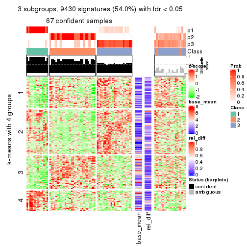</p>

</div>
<div id='tab-MAD-mclust-get-signatures-3'>
<pre><code class="r">get_signatures(res, k = 4)
</code></pre>

<p></p>

</div>
<div id='tab-MAD-mclust-get-signatures-4'>
<pre><code class="r">get_signatures(res, k = 5)
</code></pre>

<p></p>

</div>
<div id='tab-MAD-mclust-get-signatures-5'>
<pre><code class="r">get_signatures(res, k = 6)
</code></pre>

<p></p>

</div>
</div>


Signature heatmaps where rows are not scaled:


<script>
$( function() {
	$( '#tabs-MAD-mclust-get-signatures-no-scale' ).tabs();
} );
</script>
<div id='tabs-MAD-mclust-get-signatures-no-scale'>
<ul>
<li><a href='#tab-MAD-mclust-get-signatures-no-scale-1'>k = 2</a></li>
<li><a href='#tab-MAD-mclust-get-signatures-no-scale-2'>k = 3</a></li>
<li><a href='#tab-MAD-mclust-get-signatures-no-scale-3'>k = 4</a></li>
<li><a href='#tab-MAD-mclust-get-signatures-no-scale-4'>k = 5</a></li>
<li><a href='#tab-MAD-mclust-get-signatures-no-scale-5'>k = 6</a></li>
</ul>
<div id='tab-MAD-mclust-get-signatures-no-scale-1'>
<pre><code class="r">get_signatures(res, k = 2, scale_rows = FALSE)
</code></pre>

<p></p>

</div>
<div id='tab-MAD-mclust-get-signatures-no-scale-2'>
<pre><code class="r">get_signatures(res, k = 3, scale_rows = FALSE)
</code></pre>

<p></p>

</div>
<div id='tab-MAD-mclust-get-signatures-no-scale-3'>
<pre><code class="r">get_signatures(res, k = 4, scale_rows = FALSE)
</code></pre>

<p></p>

</div>
<div id='tab-MAD-mclust-get-signatures-no-scale-4'>
<pre><code class="r">get_signatures(res, k = 5, scale_rows = FALSE)
</code></pre>

<p></p>

</div>
<div id='tab-MAD-mclust-get-signatures-no-scale-5'>
<pre><code class="r">get_signatures(res, k = 6, scale_rows = FALSE)
</code></pre>

<p></p>

</div>
</div>


Compare the overlap of signatures from different k:

```r
compare_signatures(res)
```


`get_signature()` returns a data frame invisibly. TO get the list of signatures, the function
call should be assigned to a variable explicitly. In following code, if `plot` argument is set
to `FALSE`, no heatmap is plotted while only the differential analysis is performed.

```r
# code only for demonstration
tb = get_signature(res, k = ..., plot = FALSE)
```

An example of the output of `tb` is:

```
#>   which_row         fdr    mean_1    mean_2 scaled_mean_1 scaled_mean_2 km
#> 1        38 0.042760348  8.373488  9.131774    -0.5533452     0.5164555  1
#> 2        40 0.018707592  7.106213  8.469186    -0.6173731     0.5762149  1
#> 3        55 0.019134737 10.221463 11.207825    -0.6159697     0.5749050  1
#> 4        59 0.006059896  5.921854  7.869574    -0.6899429     0.6439467  1
#> 5        60 0.018055526  8.928898 10.211722    -0.6204761     0.5791110  1
#> 6        98 0.009384629 15.714769 14.887706     0.6635654    -0.6193277  2
...
```

The columns in `tb` are:

1. `which_row`: row indices corresponding to the input matrix.
2. `fdr`: FDR for the differential test. 
3. `mean_x`: The mean value in group x.
4. `scaled_mean_x`: The mean value in group x after rows are scaled.
5. `km`: Row groups if k-means clustering is applied to rows.


UMAP plot which shows how samples are separated.


<script>
$( function() {
	$( '#tabs-MAD-mclust-dimension-reduction' ).tabs();
} );
</script>
<div id='tabs-MAD-mclust-dimension-reduction'>
<ul>
<li><a href='#tab-MAD-mclust-dimension-reduction-1'>k = 2</a></li>
<li><a href='#tab-MAD-mclust-dimension-reduction-2'>k = 3</a></li>
<li><a href='#tab-MAD-mclust-dimension-reduction-3'>k = 4</a></li>
<li><a href='#tab-MAD-mclust-dimension-reduction-4'>k = 5</a></li>
<li><a href='#tab-MAD-mclust-dimension-reduction-5'>k = 6</a></li>
</ul>
<div id='tab-MAD-mclust-dimension-reduction-1'>
<pre><code class="r">dimension_reduction(res, k = 2, method = &quot;UMAP&quot;)
</code></pre>

<p></p>

</div>
<div id='tab-MAD-mclust-dimension-reduction-2'>
<pre><code class="r">dimension_reduction(res, k = 3, method = &quot;UMAP&quot;)
</code></pre>

<p></p>

</div>
<div id='tab-MAD-mclust-dimension-reduction-3'>
<pre><code class="r">dimension_reduction(res, k = 4, method = &quot;UMAP&quot;)
</code></pre>

<p></p>

</div>
<div id='tab-MAD-mclust-dimension-reduction-4'>
<pre><code class="r">dimension_reduction(res, k = 5, method = &quot;UMAP&quot;)
</code></pre>

<p></p>

</div>
<div id='tab-MAD-mclust-dimension-reduction-5'>
<pre><code class="r">dimension_reduction(res, k = 6, method = &quot;UMAP&quot;)
</code></pre>

<p></p>

</div>
</div>


Following heatmap shows how subgroups are split when increasing `k`:

```r
collect_classes(res)
```


If matrix rows can be associated to genes, consider to use `functional_enrichment(res,
...)` to perform function enrichment for the signature genes. See [this vignette](http://bioconductor.org/packages/devel/bioc/vignettes/cola/inst/doc/functional_enrichment.html) for more detailed explanations.


 

---------------------------------------------------


### MAD:NMF**


The object with results only for a single top-value method and a single partition method 
can be extracted as:

```r
res = res_list["MAD", "NMF"]
# you can also extract it by
# res = res_list["MAD:NMF"]
```

A summary of `res` and all the functions that can be applied to it:

```r
res
```

```
#> A 'ConsensusPartition' object with k = 2, 3, 4, 5, 6.
#>   On a matrix with 17471 rows and 87 columns.
#>   Top rows (1000, 2000, 3000, 4000, 5000) are extracted by 'MAD' method.
#>   Subgroups are detected by 'NMF' method.
#>   Performed in total 1250 partitions by row resampling.
#>   Best k for subgroups seems to be 2.
#> 
#> Following methods can be applied to this 'ConsensusPartition' object:
#>  [1] "cola_report"             "collect_classes"         "collect_plots"          
#>  [4] "collect_stats"           "colnames"                "compare_signatures"     
#>  [7] "consensus_heatmap"       "dimension_reduction"     "functional_enrichment"  
#> [10] "get_anno_col"            "get_anno"                "get_classes"            
#> [13] "get_consensus"           "get_matrix"              "get_membership"         
#> [16] "get_param"               "get_signatures"          "get_stats"              
#> [19] "is_best_k"               "is_stable_k"             "membership_heatmap"     
#> [22] "ncol"                    "nrow"                    "plot_ecdf"              
#> [25] "rownames"                "select_partition_number" "show"                   
#> [28] "suggest_best_k"          "test_to_known_factors"
```

`collect_plots()` function collects all the plots made from `res` for all `k` (number of partitions)
into one single page to provide an easy and fast comparison between different `k`.

```r
collect_plots(res)
```


The plots are:

- The first row: a plot of the ECDF (empirical cumulative distribution
  function) curves of the consensus matrix for each `k` and the heatmap of
  predicted classes for each `k`.
- The second row: heatmaps of the consensus matrix for each `k`.
- The third row: heatmaps of the membership matrix for each `k`.
- The fouth row: heatmaps of the signatures for each `k`.

All the plots in panels can be made by individual functions and they are
plotted later in this section.

`select_partition_number()` produces several plots showing different
statistics for choosing "optimized" `k`. There are following statistics:

- ECDF curves of the consensus matrix for each `k`;
- 1-PAC. [The PAC
  score](https://en.wikipedia.org/wiki/Consensus_clustering#Over-interpretation_potential_of_consensus_clustering)
  measures the proportion of the ambiguous subgrouping.
- Mean silhouette score.
- Concordance. The mean probability of fiting the consensus class ids in all
  partitions.
- Area increased. Denote $A_k$ as the area under the ECDF curve for current
  `k`, the area increased is defined as $A_k - A_{k-1}$.
- Rand index. The percent of pairs of samples that are both in a same cluster
  or both are not in a same cluster in the partition of k and k-1.
- Jaccard index. The ratio of pairs of samples are both in a same cluster in
  the partition of k and k-1 and the pairs of samples are both in a same
  cluster in the partition k or k-1.

The detailed explanations of these statistics can be found in [the _cola_
vignette](http://bioconductor.org/packages/devel/bioc/vignettes/cola/inst/doc/cola.html#toc_13).

Generally speaking, lower PAC score, higher mean silhouette score or higher
concordance corresponds to better partition. Rand index and Jaccard index
measure how similar the current partition is compared to partition with `k-1`.
If they are too similar, we won't accept `k` is better than `k-1`.

```r
select_partition_number(res)
```


The numeric values for all these statistics can be obtained by `get_stats()`.

```r
get_stats(res)
```

```
#>   k 1-PAC mean_silhouette concordance area_increased  Rand Jaccard
#> 2 2 1.000           0.963       0.985         0.4995 0.502   0.502
#> 3 3 0.656           0.764       0.894         0.2896 0.746   0.541
#> 4 4 0.596           0.685       0.794         0.1466 0.767   0.443
#> 5 5 0.721           0.611       0.791         0.0664 0.909   0.680
#> 6 6 0.805           0.696       0.836         0.0392 0.936   0.731
```

`suggest_best_k()` suggests the best $k$ based on these statistics. The rules are as follows:

- All $k$ with Jaccard index larger than 0.95 are removed because increasing
  $k$ does not provide enough extra information. If all $k$ are removed, it is
  marked as no subgroup is detected.
- For all $k$ with 1-PAC score larger than 0.9, the maximal $k$ is taken as
  the best $k$, and other $k$ are marked as optional $k$.
- If it does not fit the second rule. The $k$ with the maximal vote of the
  highest 1-PAC score, highest mean silhouette, and highest concordance is
  taken as the best $k$.

```r
suggest_best_k(res)
```

```
#> [1] 2
```


Following shows the table of the partitions (You need to click the **show/hide
code output** link to see it). The membership matrix (columns with name `p*`)
is inferred by
[`clue::cl_consensus()`](https://www.rdocumentation.org/link/cl_consensus?package=clue)
function with the `SE` method. Basically the value in the membership matrix
represents the probability to belong to a certain group. The finall class
label for an item is determined with the group with highest probability it
belongs to.

In `get_classes()` function, the entropy is calculated from the membership
matrix and the silhouette score is calculated from the consensus matrix.


<script>
$( function() {
	$( '#tabs-MAD-NMF-get-classes' ).tabs();
} );
</script>
<div id='tabs-MAD-NMF-get-classes'>
<ul>
<li><a href='#tab-MAD-NMF-get-classes-1'>k = 2</a></li>
<li><a href='#tab-MAD-NMF-get-classes-2'>k = 3</a></li>
<li><a href='#tab-MAD-NMF-get-classes-3'>k = 4</a></li>
<li><a href='#tab-MAD-NMF-get-classes-4'>k = 5</a></li>
<li><a href='#tab-MAD-NMF-get-classes-5'>k = 6</a></li>
</ul>

<div id='tab-MAD-NMF-get-classes-1'>
<p><a id='tab-MAD-NMF-get-classes-1-a' style='color:#0366d6' href='#'>show/hide code output</a></p>
<pre><code class="r">cbind(get_classes(res, k = 2), get_membership(res, k = 2))
</code></pre>

<pre><code>#&gt;                                      class entropy silhouette    p1    p2
#&gt; E6088A41-B0DC-4FBF-8D14-BE78024CF8CD     2  0.0000      0.979 0.000 1.000
#&gt; F569915C-8F77-4D67-9730-30824DB57EE5     2  0.0000      0.979 0.000 1.000
#&gt; E3B71CB7-673B-4741-8607-4F0A11633036     1  0.0000      0.991 1.000 0.000
#&gt; DAF84798-FE3F-403C-B589-7F256AF752BE     1  0.0000      0.991 1.000 0.000
#&gt; 2F38E3B1-4975-4877-9DCC-C00270602180     1  0.0000      0.991 1.000 0.000
#&gt; C79A4C2F-02C4-4C03-A5A5-DE06802EEB57     2  0.4298      0.893 0.088 0.912
#&gt; 92E3ED8F-5C74-4ED2-9B03-9FA5E7B491D6     1  0.0000      0.991 1.000 0.000
#&gt; E61D60BE-3BD3-4B5E-BC12-80F3684A0959     1  0.0000      0.991 1.000 0.000
#&gt; C9388FC7-DB1D-4416-BC2D-EA643584F1E6     2  0.0000      0.979 0.000 1.000
#&gt; D4219360-6344-4AF3-ACEB-1701A9F1F67D     1  0.0000      0.991 1.000 0.000
#&gt; 07D155E6-F27C-4D09-B786-8A9B71147B72     1  0.0000      0.991 1.000 0.000
#&gt; 10C8C361-85A5-40E8-A395-B92623E6F27C     1  0.0000      0.991 1.000 0.000
#&gt; BDF20891-7C98-4A55-BBF3-8A836BE303C6     2  0.0000      0.979 0.000 1.000
#&gt; 694B0504-095E-431A-84F2-B4387072138E     1  0.0000      0.991 1.000 0.000
#&gt; EDCF8E7F-8B1D-46F7-8AE0-84A1DC9647D2     2  0.0000      0.979 0.000 1.000
#&gt; 0EA8288E-824D-4304-A053-5A833361F5C5     1  0.0000      0.991 1.000 0.000
#&gt; C4ACCFA1-34A9-4F61-8A1F-35B3B60EA193     1  0.0000      0.991 1.000 0.000
#&gt; 760BA639-38AC-4BC9-9647-09F6893EA8ED     1  0.0000      0.991 1.000 0.000
#&gt; 082DFC6B-C6E6-48B9-BDE5-74FF3B3DC954     2  0.0000      0.979 0.000 1.000
#&gt; FE349848-D7C4-4C49-B670-0E20454DDD7E     2  0.9909      0.214 0.444 0.556
#&gt; 2E8937B3-9EA1-4528-8CEE-BF3D4137908A     2  0.0000      0.979 0.000 1.000
#&gt; 9942D04E-2767-4E39-BA16-7762EAC3DFC4     2  0.0000      0.979 0.000 1.000
#&gt; F9C23182-91C4-4145-AE52-526FE8EB199D     2  0.0376      0.976 0.004 0.996
#&gt; 01024EED-7811-4E24-A067-8E0B978FFE2D     2  0.0000      0.979 0.000 1.000
#&gt; 932C8E98-A352-409C-8744-3D49FABCE425     1  0.0000      0.991 1.000 0.000
#&gt; 6DFD9439-C659-4936-84E5-108F717E3E4D     2  0.0938      0.970 0.012 0.988
#&gt; 1D8B83B8-5DD7-4F45-9D59-487EC6906A8B     2  0.0000      0.979 0.000 1.000
#&gt; 804B8503-73F6-42DE-835F-39DE2C9F13E1     2  0.0000      0.979 0.000 1.000
#&gt; B9453C9B-84D5-43BD-85BB-1780F02F039C     1  0.0000      0.991 1.000 0.000
#&gt; 836E6CD6-4E88-4028-9844-FA3C892C254A     1  0.0000      0.991 1.000 0.000
#&gt; 36EDD202-A845-4CE7-95D5-A515C471262E     2  0.0000      0.979 0.000 1.000
#&gt; 181C156A-B8F4-4F9D-93AA-6AFBD197644D     2  0.0000      0.979 0.000 1.000
#&gt; 0580E798-6A98-4E46-AC96-9A869DFF502E     1  0.0000      0.991 1.000 0.000
#&gt; EA1B63CF-D389-4567-8D9E-B0EF1F804598     1  0.6801      0.779 0.820 0.180
#&gt; 5ABC3D06-B8E9-4831-B89B-7C1EC4006B47     2  0.0000      0.979 0.000 1.000
#&gt; 1CC01E74-A7C1-4A51-9E28-1703C352BE16     2  0.0000      0.979 0.000 1.000
#&gt; 97E55B75-DBDB-46BC-9E74-7828C070BF16     2  0.0000      0.979 0.000 1.000
#&gt; BEB37A2D-E8B0-4674-89AC-DC0F34E0AFD6     1  0.0000      0.991 1.000 0.000
#&gt; 558648BA-6551-4D34-97C2-AD5F677D63FB     1  0.0000      0.991 1.000 0.000
#&gt; FF7021BB-414B-4466-BC43-372D856E6A1D     2  0.0000      0.979 0.000 1.000
#&gt; 9C04B840-54E0-425D-BDBE-8CB6B9C2C722     2  0.0000      0.979 0.000 1.000
#&gt; 5F50B1F4-1A02-4506-AA6D-9BF21CD8059A     1  0.1633      0.970 0.976 0.024
#&gt; 7D4B8FF3-7977-4ABD-AE04-EED1C50B23CC     2  0.0000      0.979 0.000 1.000
#&gt; A005AF15-B98E-4623-8AD4-1E69EFA9BC7A     1  0.0000      0.991 1.000 0.000
#&gt; 1DF04345-5C93-4B18-B307-8D1FCA532999     2  0.0000      0.979 0.000 1.000
#&gt; 6AF30C18-347E-41ED-A4AB-6F81F42206C5     1  0.0000      0.991 1.000 0.000
#&gt; 88A44ED0-BDE1-401E-B0E1-D8C8D6DBAEFC     2  0.0000      0.979 0.000 1.000
#&gt; 117673A3-2918-4702-8583-B66ADE6E4338     2  0.0000      0.979 0.000 1.000
#&gt; 4903A571-E14D-43C9-A737-22CAFAC414CD     2  0.9608      0.382 0.384 0.616
#&gt; C175E68E-632A-4B4A-9DDB-4895C4760F20     1  0.0000      0.991 1.000 0.000
#&gt; FA5CA2F4-A1AD-4A79-B8F3-73A976EB2FB1     2  0.0000      0.979 0.000 1.000
#&gt; E1F883A7-8B1F-4C1D-8A1A-9749A9C09845     2  0.0000      0.979 0.000 1.000
#&gt; E74F0729-6000-4908-ADB0-7BDBAC0639E6     1  0.0000      0.991 1.000 0.000
#&gt; F92135A9-1981-4C79-99A5-4243EEC5D30D     2  0.0000      0.979 0.000 1.000
#&gt; 73C6919F-DEB4-4DA4-B4AE-4032AC8F96C5     1  0.0000      0.991 1.000 0.000
#&gt; 33977B40-2E92-48B6-8D3A-3EBE913F6F8A     1  0.0000      0.991 1.000 0.000
#&gt; 490BD607-2F08-4B4C-9612-F9BB5CBBC8BB     2  0.0000      0.979 0.000 1.000
#&gt; 6C666E17-2EB8-4244-BCC1-8DD34EE4173E     2  0.0000      0.979 0.000 1.000
#&gt; C41F3064-4483-4796-B860-82155BAA5157     1  0.0000      0.991 1.000 0.000
#&gt; F4232B90-51B9-43EE-9971-35B3A318758F     1  0.0000      0.991 1.000 0.000
#&gt; 291EA1F6-FC56-4429-A433-0C452A6A514C     2  0.0000      0.979 0.000 1.000
#&gt; CC4AF04D-CB8E-40DD-B12E-7AA39B38262A     2  0.0000      0.979 0.000 1.000
#&gt; 4DAE26B9-AB57-4763-BB9A-2ADDD5D9C007     1  0.0000      0.991 1.000 0.000
#&gt; 676B4AEE-FB41-4C16-AA91-03E4A1DA8E26     2  0.0000      0.979 0.000 1.000
#&gt; 1CC36859-357A-49E0-A367-4F57D47288BA     1  0.4690      0.887 0.900 0.100
#&gt; 7CCDDFC8-6DF6-4734-96AC-19EBC464FC50     2  0.0000      0.979 0.000 1.000
#&gt; 10F38C34-3956-48ED-AB62-3439EF00D46B     2  0.0000      0.979 0.000 1.000
#&gt; 80B2B393-9D6E-45B4-B696-2A5C203543B7     2  0.0000      0.979 0.000 1.000
#&gt; 5AC7B5EA-1AAC-4529-8E5A-F612E5E0719A     1  0.1414      0.973 0.980 0.020
#&gt; 3648E98D-4B3A-41B7-BE05-595D44F0150D     1  0.0000      0.991 1.000 0.000
#&gt; 252EC850-6026-473B-8FFC-2CF567EF42E4     1  0.0000      0.991 1.000 0.000
#&gt; 1790E7A3-99D8-447E-BC50-51C8A4A18853     2  0.0000      0.979 0.000 1.000
#&gt; DA61A4F8-350B-4DD1-A240-AD016520DB5B     2  0.1633      0.959 0.024 0.976
#&gt; 767E5BAF-2515-40D7-AE7D-0B24D77A03F4     2  0.0000      0.979 0.000 1.000
#&gt; 8CB9C903-D749-44EA-9137-7FB5A92C5932     1  0.0000      0.991 1.000 0.000
#&gt; A9B968AE-2243-41BC-852A-3A12C1FB4892     1  0.0000      0.991 1.000 0.000
#&gt; 3C582264-85BC-4569-A888-8EB3008E5198     2  0.0000      0.979 0.000 1.000
#&gt; F4EAF9A2-9938-4D9B-9080-C0A7542D5704     2  0.0000      0.979 0.000 1.000
#&gt; 328499D3-45DD-4B66-BD22-3C52BA92C2BB     1  0.0000      0.991 1.000 0.000
#&gt; AF8AB83D-2917-4752-8C38-CF84C565B565     1  0.0000      0.991 1.000 0.000
#&gt; 03A327CA-A9FE-42A4-844D-CA85206969FC     2  0.0000      0.979 0.000 1.000
#&gt; 4B0BEC44-87BB-4014-9A26-3529DD63760B     2  0.0938      0.970 0.012 0.988
#&gt; 05C7843E-DC89-4D8E-A78A-952C5DFD667B     2  0.1843      0.955 0.028 0.972
#&gt; 29A0FFF9-13D3-4D16-BE6A-8E48A2C4E315     2  0.0000      0.979 0.000 1.000
#&gt; 22947CC3-4F42-4F44-899C-2B7085E36C9D     2  0.0000      0.979 0.000 1.000
#&gt; A247D92D-253A-4BEC-B450-184AF90D17D0     2  0.0000      0.979 0.000 1.000
#&gt; 0D907A63-D23F-4684-80D9-0BA552435B86     1  0.0376      0.988 0.996 0.004
</code></pre>

<script>
$('#tab-MAD-NMF-get-classes-1-a').parent().next().next().hide();
$('#tab-MAD-NMF-get-classes-1-a').click(function(){
  $('#tab-MAD-NMF-get-classes-1-a').parent().next().next().toggle();
  return(false);
});
</script>
</div>

<div id='tab-MAD-NMF-get-classes-2'>
<p><a id='tab-MAD-NMF-get-classes-2-a' style='color:#0366d6' href='#'>show/hide code output</a></p>
<pre><code class="r">cbind(get_classes(res, k = 3), get_membership(res, k = 3))
</code></pre>

<pre><code>#&gt;                                      class entropy silhouette    p1    p2    p3
#&gt; E6088A41-B0DC-4FBF-8D14-BE78024CF8CD     2  0.4665      0.816 0.048 0.852 0.100
#&gt; F569915C-8F77-4D67-9730-30824DB57EE5     2  0.5760      0.528 0.000 0.672 0.328
#&gt; E3B71CB7-673B-4741-8607-4F0A11633036     1  0.1860      0.893 0.948 0.000 0.052
#&gt; DAF84798-FE3F-403C-B589-7F256AF752BE     1  0.2537      0.881 0.920 0.000 0.080
#&gt; 2F38E3B1-4975-4877-9DCC-C00270602180     3  0.6079      0.153 0.388 0.000 0.612
#&gt; C79A4C2F-02C4-4C03-A5A5-DE06802EEB57     2  0.5650      0.563 0.000 0.688 0.312
#&gt; 92E3ED8F-5C74-4ED2-9B03-9FA5E7B491D6     1  0.0237      0.889 0.996 0.000 0.004
#&gt; E61D60BE-3BD3-4B5E-BC12-80F3684A0959     3  0.0237      0.843 0.000 0.004 0.996
#&gt; C9388FC7-DB1D-4416-BC2D-EA643584F1E6     3  0.5327      0.613 0.000 0.272 0.728
#&gt; D4219360-6344-4AF3-ACEB-1701A9F1F67D     1  0.2165      0.889 0.936 0.000 0.064
#&gt; 07D155E6-F27C-4D09-B786-8A9B71147B72     3  0.0000      0.843 0.000 0.000 1.000
#&gt; 10C8C361-85A5-40E8-A395-B92623E6F27C     1  0.2625      0.883 0.916 0.000 0.084
#&gt; BDF20891-7C98-4A55-BBF3-8A836BE303C6     2  0.0592      0.883 0.000 0.988 0.012
#&gt; 694B0504-095E-431A-84F2-B4387072138E     1  0.0000      0.887 1.000 0.000 0.000
#&gt; EDCF8E7F-8B1D-46F7-8AE0-84A1DC9647D2     2  0.3038      0.826 0.000 0.896 0.104
#&gt; 0EA8288E-824D-4304-A053-5A833361F5C5     3  0.0424      0.842 0.008 0.000 0.992
#&gt; C4ACCFA1-34A9-4F61-8A1F-35B3B60EA193     1  0.1643      0.893 0.956 0.000 0.044
#&gt; 760BA639-38AC-4BC9-9647-09F6893EA8ED     1  0.0424      0.890 0.992 0.000 0.008
#&gt; 082DFC6B-C6E6-48B9-BDE5-74FF3B3DC954     2  0.4842      0.697 0.000 0.776 0.224
#&gt; FE349848-D7C4-4C49-B670-0E20454DDD7E     3  0.1163      0.835 0.000 0.028 0.972
#&gt; 2E8937B3-9EA1-4528-8CEE-BF3D4137908A     2  0.0000      0.884 0.000 1.000 0.000
#&gt; 9942D04E-2767-4E39-BA16-7762EAC3DFC4     2  0.2356      0.846 0.072 0.928 0.000
#&gt; F9C23182-91C4-4145-AE52-526FE8EB199D     1  0.6291      0.133 0.532 0.468 0.000
#&gt; 01024EED-7811-4E24-A067-8E0B978FFE2D     2  0.1860      0.863 0.000 0.948 0.052
#&gt; 932C8E98-A352-409C-8744-3D49FABCE425     1  0.3879      0.832 0.848 0.000 0.152
#&gt; 6DFD9439-C659-4936-84E5-108F717E3E4D     2  0.5551      0.690 0.016 0.760 0.224
#&gt; 1D8B83B8-5DD7-4F45-9D59-487EC6906A8B     2  0.0424      0.882 0.008 0.992 0.000
#&gt; 804B8503-73F6-42DE-835F-39DE2C9F13E1     2  0.0000      0.884 0.000 1.000 0.000
#&gt; B9453C9B-84D5-43BD-85BB-1780F02F039C     1  0.1031      0.893 0.976 0.000 0.024
#&gt; 836E6CD6-4E88-4028-9844-FA3C892C254A     1  0.1411      0.890 0.964 0.000 0.036
#&gt; 36EDD202-A845-4CE7-95D5-A515C471262E     2  0.0424      0.884 0.000 0.992 0.008
#&gt; 181C156A-B8F4-4F9D-93AA-6AFBD197644D     2  0.0237      0.884 0.000 0.996 0.004
#&gt; 0580E798-6A98-4E46-AC96-9A869DFF502E     3  0.0747      0.838 0.016 0.000 0.984
#&gt; EA1B63CF-D389-4567-8D9E-B0EF1F804598     1  0.1411      0.870 0.964 0.036 0.000
#&gt; 5ABC3D06-B8E9-4831-B89B-7C1EC4006B47     2  0.1964      0.857 0.056 0.944 0.000
#&gt; 1CC01E74-A7C1-4A51-9E28-1703C352BE16     2  0.1031      0.876 0.024 0.976 0.000
#&gt; 97E55B75-DBDB-46BC-9E74-7828C070BF16     2  0.4750      0.669 0.216 0.784 0.000
#&gt; BEB37A2D-E8B0-4674-89AC-DC0F34E0AFD6     3  0.0424      0.842 0.008 0.000 0.992
#&gt; 558648BA-6551-4D34-97C2-AD5F677D63FB     1  0.4291      0.810 0.820 0.000 0.180
#&gt; FF7021BB-414B-4466-BC43-372D856E6A1D     3  0.6421      0.258 0.004 0.424 0.572
#&gt; 9C04B840-54E0-425D-BDBE-8CB6B9C2C722     2  0.0424      0.884 0.000 0.992 0.008
#&gt; 5F50B1F4-1A02-4506-AA6D-9BF21CD8059A     3  0.0237      0.843 0.000 0.004 0.996
#&gt; 7D4B8FF3-7977-4ABD-AE04-EED1C50B23CC     2  0.0000      0.884 0.000 1.000 0.000
#&gt; A005AF15-B98E-4623-8AD4-1E69EFA9BC7A     3  0.0000      0.843 0.000 0.000 1.000
#&gt; 1DF04345-5C93-4B18-B307-8D1FCA532999     2  0.0424      0.882 0.008 0.992 0.000
#&gt; 6AF30C18-347E-41ED-A4AB-6F81F42206C5     3  0.2165      0.797 0.064 0.000 0.936
#&gt; 88A44ED0-BDE1-401E-B0E1-D8C8D6DBAEFC     2  0.0000      0.884 0.000 1.000 0.000
#&gt; 117673A3-2918-4702-8583-B66ADE6E4338     2  0.1163      0.874 0.028 0.972 0.000
#&gt; 4903A571-E14D-43C9-A737-22CAFAC414CD     3  0.5706      0.503 0.000 0.320 0.680
#&gt; C175E68E-632A-4B4A-9DDB-4895C4760F20     1  0.0424      0.890 0.992 0.000 0.008
#&gt; FA5CA2F4-A1AD-4A79-B8F3-73A976EB2FB1     2  0.0424      0.884 0.000 0.992 0.008
#&gt; E1F883A7-8B1F-4C1D-8A1A-9749A9C09845     2  0.0424      0.884 0.000 0.992 0.008
#&gt; E74F0729-6000-4908-ADB0-7BDBAC0639E6     1  0.6215      0.393 0.572 0.000 0.428
#&gt; F92135A9-1981-4C79-99A5-4243EEC5D30D     2  0.0424      0.884 0.000 0.992 0.008
#&gt; 73C6919F-DEB4-4DA4-B4AE-4032AC8F96C5     3  0.5497      0.433 0.292 0.000 0.708
#&gt; 33977B40-2E92-48B6-8D3A-3EBE913F6F8A     3  0.0424      0.842 0.008 0.000 0.992
#&gt; 490BD607-2F08-4B4C-9612-F9BB5CBBC8BB     2  0.6302      0.101 0.000 0.520 0.480
#&gt; 6C666E17-2EB8-4244-BCC1-8DD34EE4173E     2  0.6079      0.393 0.000 0.612 0.388
#&gt; C41F3064-4483-4796-B860-82155BAA5157     3  0.1860      0.809 0.052 0.000 0.948
#&gt; F4232B90-51B9-43EE-9971-35B3A318758F     3  0.0747      0.838 0.016 0.000 0.984
#&gt; 291EA1F6-FC56-4429-A433-0C452A6A514C     2  0.0424      0.884 0.000 0.992 0.008
#&gt; CC4AF04D-CB8E-40DD-B12E-7AA39B38262A     2  0.2066      0.854 0.060 0.940 0.000
#&gt; 4DAE26B9-AB57-4763-BB9A-2ADDD5D9C007     3  0.0237      0.843 0.000 0.004 0.996
#&gt; 676B4AEE-FB41-4C16-AA91-03E4A1DA8E26     3  0.6026      0.393 0.000 0.376 0.624
#&gt; 1CC36859-357A-49E0-A367-4F57D47288BA     1  0.6975      0.703 0.732 0.124 0.144
#&gt; 7CCDDFC8-6DF6-4734-96AC-19EBC464FC50     2  0.0424      0.882 0.008 0.992 0.000
#&gt; 10F38C34-3956-48ED-AB62-3439EF00D46B     3  0.5058      0.655 0.000 0.244 0.756
#&gt; 80B2B393-9D6E-45B4-B696-2A5C203543B7     2  0.0000      0.884 0.000 1.000 0.000
#&gt; 5AC7B5EA-1AAC-4529-8E5A-F612E5E0719A     3  0.0237      0.843 0.000 0.004 0.996
#&gt; 3648E98D-4B3A-41B7-BE05-595D44F0150D     1  0.3038      0.864 0.896 0.000 0.104
#&gt; 252EC850-6026-473B-8FFC-2CF567EF42E4     3  0.0424      0.842 0.008 0.000 0.992
#&gt; 1790E7A3-99D8-447E-BC50-51C8A4A18853     2  0.0000      0.884 0.000 1.000 0.000
#&gt; DA61A4F8-350B-4DD1-A240-AD016520DB5B     2  0.6280      0.175 0.000 0.540 0.460
#&gt; 767E5BAF-2515-40D7-AE7D-0B24D77A03F4     3  0.5363      0.606 0.000 0.276 0.724
#&gt; 8CB9C903-D749-44EA-9137-7FB5A92C5932     1  0.0424      0.884 0.992 0.008 0.000
#&gt; A9B968AE-2243-41BC-852A-3A12C1FB4892     3  0.0592      0.840 0.012 0.000 0.988
#&gt; 3C582264-85BC-4569-A888-8EB3008E5198     2  0.0237      0.883 0.004 0.996 0.000
#&gt; F4EAF9A2-9938-4D9B-9080-C0A7542D5704     2  0.0747      0.879 0.016 0.984 0.000
#&gt; 328499D3-45DD-4B66-BD22-3C52BA92C2BB     1  0.1753      0.894 0.952 0.000 0.048
#&gt; AF8AB83D-2917-4752-8C38-CF84C565B565     3  0.0424      0.842 0.008 0.000 0.992
#&gt; 03A327CA-A9FE-42A4-844D-CA85206969FC     2  0.3551      0.802 0.000 0.868 0.132
#&gt; 4B0BEC44-87BB-4014-9A26-3529DD63760B     3  0.4887      0.677 0.000 0.228 0.772
#&gt; 05C7843E-DC89-4D8E-A78A-952C5DFD667B     3  0.3941      0.755 0.000 0.156 0.844
#&gt; 29A0FFF9-13D3-4D16-BE6A-8E48A2C4E315     2  0.0000      0.884 0.000 1.000 0.000
#&gt; 22947CC3-4F42-4F44-899C-2B7085E36C9D     2  0.1129      0.880 0.004 0.976 0.020
#&gt; A247D92D-253A-4BEC-B450-184AF90D17D0     2  0.6244      0.244 0.000 0.560 0.440
#&gt; 0D907A63-D23F-4684-80D9-0BA552435B86     3  0.0424      0.842 0.000 0.008 0.992
</code></pre>

<script>
$('#tab-MAD-NMF-get-classes-2-a').parent().next().next().hide();
$('#tab-MAD-NMF-get-classes-2-a').click(function(){
  $('#tab-MAD-NMF-get-classes-2-a').parent().next().next().toggle();
  return(false);
});
</script>
</div>

<div id='tab-MAD-NMF-get-classes-3'>
<p><a id='tab-MAD-NMF-get-classes-3-a' style='color:#0366d6' href='#'>show/hide code output</a></p>
<pre><code class="r">cbind(get_classes(res, k = 4), get_membership(res, k = 4))
</code></pre>

<pre><code>#&gt;                                      class entropy silhouette    p1    p2    p3    p4
#&gt; E6088A41-B0DC-4FBF-8D14-BE78024CF8CD     3  0.2266    0.63037 0.004 0.084 0.912 0.000
#&gt; F569915C-8F77-4D67-9730-30824DB57EE5     3  0.6350    0.67889 0.000 0.252 0.636 0.112
#&gt; E3B71CB7-673B-4741-8607-4F0A11633036     1  0.0469    0.88741 0.988 0.000 0.000 0.012
#&gt; DAF84798-FE3F-403C-B589-7F256AF752BE     1  0.3464    0.85887 0.856 0.004 0.124 0.016
#&gt; 2F38E3B1-4975-4877-9DCC-C00270602180     4  0.5267    0.50257 0.240 0.000 0.048 0.712
#&gt; C79A4C2F-02C4-4C03-A5A5-DE06802EEB57     3  0.7381    0.42901 0.004 0.380 0.472 0.144
#&gt; 92E3ED8F-5C74-4ED2-9B03-9FA5E7B491D6     1  0.0188    0.88781 0.996 0.000 0.004 0.000
#&gt; E61D60BE-3BD3-4B5E-BC12-80F3684A0959     4  0.0779    0.82439 0.004 0.000 0.016 0.980
#&gt; C9388FC7-DB1D-4416-BC2D-EA643584F1E6     4  0.6548    0.15848 0.000 0.116 0.276 0.608
#&gt; D4219360-6344-4AF3-ACEB-1701A9F1F67D     1  0.1489    0.88836 0.952 0.000 0.044 0.004
#&gt; 07D155E6-F27C-4D09-B786-8A9B71147B72     4  0.0336    0.82487 0.000 0.000 0.008 0.992
#&gt; 10C8C361-85A5-40E8-A395-B92623E6F27C     1  0.2281    0.86291 0.904 0.000 0.000 0.096
#&gt; BDF20891-7C98-4A55-BBF3-8A836BE303C6     2  0.0188    0.87755 0.000 0.996 0.000 0.004
#&gt; 694B0504-095E-431A-84F2-B4387072138E     1  0.0000    0.88780 1.000 0.000 0.000 0.000
#&gt; EDCF8E7F-8B1D-46F7-8AE0-84A1DC9647D2     3  0.5649    0.62129 0.008 0.120 0.740 0.132
#&gt; 0EA8288E-824D-4304-A053-5A833361F5C5     3  0.4250    0.47489 0.000 0.000 0.724 0.276
#&gt; C4ACCFA1-34A9-4F61-8A1F-35B3B60EA193     1  0.0524    0.88830 0.988 0.000 0.004 0.008
#&gt; 760BA639-38AC-4BC9-9647-09F6893EA8ED     1  0.1474    0.88633 0.948 0.000 0.052 0.000
#&gt; 082DFC6B-C6E6-48B9-BDE5-74FF3B3DC954     3  0.6326    0.67003 0.000 0.264 0.632 0.104
#&gt; FE349848-D7C4-4C49-B670-0E20454DDD7E     3  0.4543    0.59033 0.000 0.000 0.676 0.324
#&gt; 2E8937B3-9EA1-4528-8CEE-BF3D4137908A     2  0.0000    0.87900 0.000 1.000 0.000 0.000
#&gt; 9942D04E-2767-4E39-BA16-7762EAC3DFC4     2  0.4560    0.64797 0.004 0.700 0.296 0.000
#&gt; F9C23182-91C4-4145-AE52-526FE8EB199D     2  0.4998    0.04086 0.488 0.512 0.000 0.000
#&gt; 01024EED-7811-4E24-A067-8E0B978FFE2D     2  0.0779    0.86856 0.000 0.980 0.016 0.004
#&gt; 932C8E98-A352-409C-8744-3D49FABCE425     1  0.3505    0.86726 0.864 0.000 0.088 0.048
#&gt; 6DFD9439-C659-4936-84E5-108F717E3E4D     3  0.7602    0.58483 0.068 0.104 0.608 0.220
#&gt; 1D8B83B8-5DD7-4F45-9D59-487EC6906A8B     3  0.3208    0.64011 0.004 0.148 0.848 0.000
#&gt; 804B8503-73F6-42DE-835F-39DE2C9F13E1     2  0.0336    0.87508 0.000 0.992 0.008 0.000
#&gt; B9453C9B-84D5-43BD-85BB-1780F02F039C     1  0.2675    0.85737 0.892 0.008 0.000 0.100
#&gt; 836E6CD6-4E88-4028-9844-FA3C892C254A     3  0.5163   -0.41253 0.480 0.000 0.516 0.004
#&gt; 36EDD202-A845-4CE7-95D5-A515C471262E     2  0.2281    0.79387 0.000 0.904 0.096 0.000
#&gt; 181C156A-B8F4-4F9D-93AA-6AFBD197644D     2  0.1970    0.84197 0.060 0.932 0.008 0.000
#&gt; 0580E798-6A98-4E46-AC96-9A869DFF502E     4  0.0188    0.82322 0.004 0.000 0.000 0.996
#&gt; EA1B63CF-D389-4567-8D9E-B0EF1F804598     1  0.3547    0.84999 0.840 0.016 0.144 0.000
#&gt; 5ABC3D06-B8E9-4831-B89B-7C1EC4006B47     2  0.4509    0.65568 0.004 0.708 0.288 0.000
#&gt; 1CC01E74-A7C1-4A51-9E28-1703C352BE16     2  0.0336    0.87634 0.000 0.992 0.008 0.000
#&gt; 97E55B75-DBDB-46BC-9E74-7828C070BF16     2  0.3523    0.80136 0.032 0.856 0.112 0.000
#&gt; BEB37A2D-E8B0-4674-89AC-DC0F34E0AFD6     4  0.1637    0.81084 0.000 0.000 0.060 0.940
#&gt; 558648BA-6551-4D34-97C2-AD5F677D63FB     1  0.6355    0.62367 0.656 0.004 0.112 0.228
#&gt; FF7021BB-414B-4466-BC43-372D856E6A1D     3  0.2111    0.57462 0.000 0.024 0.932 0.044
#&gt; 9C04B840-54E0-425D-BDBE-8CB6B9C2C722     2  0.0000    0.87900 0.000 1.000 0.000 0.000
#&gt; 5F50B1F4-1A02-4506-AA6D-9BF21CD8059A     3  0.4989    0.39542 0.000 0.000 0.528 0.472
#&gt; 7D4B8FF3-7977-4ABD-AE04-EED1C50B23CC     3  0.6844    0.32968 0.100 0.444 0.456 0.000
#&gt; A005AF15-B98E-4623-8AD4-1E69EFA9BC7A     4  0.0469    0.82476 0.000 0.000 0.012 0.988
#&gt; 1DF04345-5C93-4B18-B307-8D1FCA532999     2  0.0000    0.87900 0.000 1.000 0.000 0.000
#&gt; 6AF30C18-347E-41ED-A4AB-6F81F42206C5     4  0.0592    0.81892 0.016 0.000 0.000 0.984
#&gt; 88A44ED0-BDE1-401E-B0E1-D8C8D6DBAEFC     3  0.4994    0.32882 0.000 0.480 0.520 0.000
#&gt; 117673A3-2918-4702-8583-B66ADE6E4338     3  0.7065    0.15680 0.124 0.404 0.472 0.000
#&gt; 4903A571-E14D-43C9-A737-22CAFAC414CD     3  0.6412    0.65359 0.004 0.084 0.616 0.296
#&gt; C175E68E-632A-4B4A-9DDB-4895C4760F20     1  0.2654    0.87246 0.888 0.000 0.108 0.004
#&gt; FA5CA2F4-A1AD-4A79-B8F3-73A976EB2FB1     2  0.4866   -0.00631 0.000 0.596 0.404 0.000
#&gt; E1F883A7-8B1F-4C1D-8A1A-9749A9C09845     2  0.0000    0.87900 0.000 1.000 0.000 0.000
#&gt; E74F0729-6000-4908-ADB0-7BDBAC0639E6     4  0.4624    0.34770 0.340 0.000 0.000 0.660
#&gt; F92135A9-1981-4C79-99A5-4243EEC5D30D     2  0.0000    0.87900 0.000 1.000 0.000 0.000
#&gt; 73C6919F-DEB4-4DA4-B4AE-4032AC8F96C5     4  0.3942    0.57871 0.236 0.000 0.000 0.764
#&gt; 33977B40-2E92-48B6-8D3A-3EBE913F6F8A     3  0.4855    0.52661 0.000 0.000 0.600 0.400
#&gt; 490BD607-2F08-4B4C-9612-F9BB5CBBC8BB     3  0.6542    0.67490 0.000 0.128 0.620 0.252
#&gt; 6C666E17-2EB8-4244-BCC1-8DD34EE4173E     3  0.6756    0.68135 0.000 0.188 0.612 0.200
#&gt; C41F3064-4483-4796-B860-82155BAA5157     4  0.0524    0.82528 0.004 0.000 0.008 0.988
#&gt; F4232B90-51B9-43EE-9971-35B3A318758F     4  0.0000    0.82408 0.000 0.000 0.000 1.000
#&gt; 291EA1F6-FC56-4429-A433-0C452A6A514C     2  0.1474    0.83924 0.000 0.948 0.052 0.000
#&gt; CC4AF04D-CB8E-40DD-B12E-7AA39B38262A     2  0.3873    0.71927 0.000 0.772 0.228 0.000
#&gt; 4DAE26B9-AB57-4763-BB9A-2ADDD5D9C007     4  0.0592    0.82384 0.000 0.000 0.016 0.984
#&gt; 676B4AEE-FB41-4C16-AA91-03E4A1DA8E26     4  0.7627    0.26847 0.000 0.272 0.256 0.472
#&gt; 1CC36859-357A-49E0-A367-4F57D47288BA     3  0.6078    0.45992 0.312 0.068 0.620 0.000
#&gt; 7CCDDFC8-6DF6-4734-96AC-19EBC464FC50     2  0.0000    0.87900 0.000 1.000 0.000 0.000
#&gt; 10F38C34-3956-48ED-AB62-3439EF00D46B     3  0.5986    0.63185 0.000 0.060 0.620 0.320
#&gt; 80B2B393-9D6E-45B4-B696-2A5C203543B7     2  0.0000    0.87900 0.000 1.000 0.000 0.000
#&gt; 5AC7B5EA-1AAC-4529-8E5A-F612E5E0719A     4  0.1557    0.80645 0.000 0.000 0.056 0.944
#&gt; 3648E98D-4B3A-41B7-BE05-595D44F0150D     1  0.4624    0.80422 0.784 0.000 0.052 0.164
#&gt; 252EC850-6026-473B-8FFC-2CF567EF42E4     4  0.3123    0.67597 0.000 0.000 0.156 0.844
#&gt; 1790E7A3-99D8-447E-BC50-51C8A4A18853     2  0.0000    0.87900 0.000 1.000 0.000 0.000
#&gt; DA61A4F8-350B-4DD1-A240-AD016520DB5B     3  0.6084    0.67746 0.000 0.096 0.660 0.244
#&gt; 767E5BAF-2515-40D7-AE7D-0B24D77A03F4     3  0.6075    0.65537 0.000 0.076 0.636 0.288
#&gt; 8CB9C903-D749-44EA-9137-7FB5A92C5932     1  0.6654    0.61583 0.588 0.000 0.296 0.116
#&gt; A9B968AE-2243-41BC-852A-3A12C1FB4892     4  0.3392    0.73176 0.020 0.000 0.124 0.856
#&gt; 3C582264-85BC-4569-A888-8EB3008E5198     2  0.0000    0.87900 0.000 1.000 0.000 0.000
#&gt; F4EAF9A2-9938-4D9B-9080-C0A7542D5704     2  0.3400    0.76358 0.000 0.820 0.180 0.000
#&gt; 328499D3-45DD-4B66-BD22-3C52BA92C2BB     1  0.2345    0.85949 0.900 0.000 0.000 0.100
#&gt; AF8AB83D-2917-4752-8C38-CF84C565B565     4  0.1022    0.81642 0.000 0.000 0.032 0.968
#&gt; 03A327CA-A9FE-42A4-844D-CA85206969FC     3  0.5269    0.55274 0.000 0.364 0.620 0.016
#&gt; 4B0BEC44-87BB-4014-9A26-3529DD63760B     3  0.5966    0.63568 0.000 0.060 0.624 0.316
#&gt; 05C7843E-DC89-4D8E-A78A-952C5DFD667B     3  0.5917    0.63178 0.000 0.056 0.624 0.320
#&gt; 29A0FFF9-13D3-4D16-BE6A-8E48A2C4E315     2  0.0000    0.87900 0.000 1.000 0.000 0.000
#&gt; 22947CC3-4F42-4F44-899C-2B7085E36C9D     3  0.4049    0.64045 0.008 0.212 0.780 0.000
#&gt; A247D92D-253A-4BEC-B450-184AF90D17D0     3  0.6448    0.67537 0.000 0.120 0.628 0.252
#&gt; 0D907A63-D23F-4684-80D9-0BA552435B86     4  0.2469    0.74669 0.000 0.000 0.108 0.892
</code></pre>

<script>
$('#tab-MAD-NMF-get-classes-3-a').parent().next().next().hide();
$('#tab-MAD-NMF-get-classes-3-a').click(function(){
  $('#tab-MAD-NMF-get-classes-3-a').parent().next().next().toggle();
  return(false);
});
</script>
</div>

<div id='tab-MAD-NMF-get-classes-4'>
<p><a id='tab-MAD-NMF-get-classes-4-a' style='color:#0366d6' href='#'>show/hide code output</a></p>
<pre><code class="r">cbind(get_classes(res, k = 5), get_membership(res, k = 5))
</code></pre>

<pre><code>#&gt;                                      class entropy silhouette    p1    p2    p3    p4    p5
#&gt; E6088A41-B0DC-4FBF-8D14-BE78024CF8CD     3  0.1740     0.8058 0.000 0.012 0.932 0.000 0.056
#&gt; F569915C-8F77-4D67-9730-30824DB57EE5     3  0.1956     0.8460 0.000 0.076 0.916 0.008 0.000
#&gt; E3B71CB7-673B-4741-8607-4F0A11633036     1  0.4276    -0.0413 0.616 0.000 0.000 0.004 0.380
#&gt; DAF84798-FE3F-403C-B589-7F256AF752BE     1  0.2761     0.3671 0.896 0.000 0.048 0.028 0.028
#&gt; 2F38E3B1-4975-4877-9DCC-C00270602180     4  0.5064     0.7205 0.132 0.000 0.024 0.740 0.104
#&gt; C79A4C2F-02C4-4C03-A5A5-DE06802EEB57     3  0.3492     0.8265 0.008 0.092 0.852 0.008 0.040
#&gt; 92E3ED8F-5C74-4ED2-9B03-9FA5E7B491D6     1  0.4114    -0.0229 0.624 0.000 0.000 0.000 0.376
#&gt; E61D60BE-3BD3-4B5E-BC12-80F3684A0959     4  0.1682     0.8381 0.004 0.000 0.012 0.940 0.044
#&gt; C9388FC7-DB1D-4416-BC2D-EA643584F1E6     4  0.6833     0.5122 0.024 0.204 0.032 0.604 0.136
#&gt; D4219360-6344-4AF3-ACEB-1701A9F1F67D     1  0.3817     0.1736 0.740 0.000 0.004 0.004 0.252
#&gt; 07D155E6-F27C-4D09-B786-8A9B71147B72     4  0.0771     0.8384 0.000 0.000 0.020 0.976 0.004
#&gt; 10C8C361-85A5-40E8-A395-B92623E6F27C     5  0.5148     0.2776 0.432 0.000 0.000 0.040 0.528
#&gt; BDF20891-7C98-4A55-BBF3-8A836BE303C6     2  0.0324     0.8811 0.000 0.992 0.004 0.000 0.004
#&gt; 694B0504-095E-431A-84F2-B4387072138E     1  0.4219    -0.1130 0.584 0.000 0.000 0.000 0.416
#&gt; EDCF8E7F-8B1D-46F7-8AE0-84A1DC9647D2     1  0.8613     0.1323 0.444 0.044 0.188 0.112 0.212
#&gt; 0EA8288E-824D-4304-A053-5A833361F5C5     3  0.7028     0.0806 0.004 0.004 0.392 0.272 0.328
#&gt; C4ACCFA1-34A9-4F61-8A1F-35B3B60EA193     1  0.3857     0.0871 0.688 0.000 0.000 0.000 0.312
#&gt; 760BA639-38AC-4BC9-9647-09F6893EA8ED     1  0.2462     0.2977 0.880 0.000 0.000 0.008 0.112
#&gt; 082DFC6B-C6E6-48B9-BDE5-74FF3B3DC954     3  0.2130     0.8455 0.000 0.080 0.908 0.012 0.000
#&gt; FE349848-D7C4-4C49-B670-0E20454DDD7E     3  0.3160     0.8032 0.040 0.000 0.876 0.052 0.032
#&gt; 2E8937B3-9EA1-4528-8CEE-BF3D4137908A     2  0.0486     0.8808 0.000 0.988 0.004 0.004 0.004
#&gt; 9942D04E-2767-4E39-BA16-7762EAC3DFC4     2  0.5940     0.4439 0.012 0.532 0.056 0.008 0.392
#&gt; F9C23182-91C4-4145-AE52-526FE8EB199D     2  0.5635     0.4325 0.240 0.636 0.004 0.000 0.120
#&gt; 01024EED-7811-4E24-A067-8E0B978FFE2D     2  0.0960     0.8753 0.000 0.972 0.004 0.016 0.008
#&gt; 932C8E98-A352-409C-8744-3D49FABCE425     1  0.2684     0.3641 0.900 0.000 0.032 0.044 0.024
#&gt; 6DFD9439-C659-4936-84E5-108F717E3E4D     1  0.8124     0.1498 0.472 0.012 0.216 0.148 0.152
#&gt; 1D8B83B8-5DD7-4F45-9D59-487EC6906A8B     3  0.1992     0.8340 0.000 0.044 0.924 0.000 0.032
#&gt; 804B8503-73F6-42DE-835F-39DE2C9F13E1     2  0.0324     0.8812 0.000 0.992 0.004 0.000 0.004
#&gt; B9453C9B-84D5-43BD-85BB-1780F02F039C     5  0.5343     0.2875 0.388 0.004 0.000 0.048 0.560
#&gt; 836E6CD6-4E88-4028-9844-FA3C892C254A     1  0.6923    -0.0397 0.372 0.004 0.284 0.000 0.340
#&gt; 36EDD202-A845-4CE7-95D5-A515C471262E     2  0.4338     0.7497 0.040 0.800 0.048 0.000 0.112
#&gt; 181C156A-B8F4-4F9D-93AA-6AFBD197644D     2  0.1082     0.8702 0.008 0.964 0.000 0.000 0.028
#&gt; 0580E798-6A98-4E46-AC96-9A869DFF502E     4  0.2464     0.8167 0.000 0.000 0.016 0.888 0.096
#&gt; EA1B63CF-D389-4567-8D9E-B0EF1F804598     1  0.2635     0.3634 0.900 0.004 0.020 0.012 0.064
#&gt; 5ABC3D06-B8E9-4831-B89B-7C1EC4006B47     2  0.5324     0.5346 0.004 0.600 0.056 0.000 0.340
#&gt; 1CC01E74-A7C1-4A51-9E28-1703C352BE16     2  0.0693     0.8737 0.000 0.980 0.008 0.000 0.012
#&gt; 97E55B75-DBDB-46BC-9E74-7828C070BF16     2  0.2886     0.8242 0.012 0.884 0.036 0.000 0.068
#&gt; BEB37A2D-E8B0-4674-89AC-DC0F34E0AFD6     4  0.4457     0.7398 0.104 0.000 0.016 0.784 0.096
#&gt; 558648BA-6551-4D34-97C2-AD5F677D63FB     3  0.7412    -0.1862 0.304 0.004 0.400 0.024 0.268
#&gt; FF7021BB-414B-4466-BC43-372D856E6A1D     5  0.7814    -0.1607 0.328 0.008 0.148 0.084 0.432
#&gt; 9C04B840-54E0-425D-BDBE-8CB6B9C2C722     2  0.0162     0.8817 0.000 0.996 0.004 0.000 0.000
#&gt; 5F50B1F4-1A02-4506-AA6D-9BF21CD8059A     3  0.4504     0.2796 0.000 0.000 0.564 0.428 0.008
#&gt; 7D4B8FF3-7977-4ABD-AE04-EED1C50B23CC     2  0.7912    -0.0574 0.356 0.396 0.152 0.008 0.088
#&gt; A005AF15-B98E-4623-8AD4-1E69EFA9BC7A     4  0.1386     0.8379 0.000 0.000 0.016 0.952 0.032
#&gt; 1DF04345-5C93-4B18-B307-8D1FCA532999     2  0.0324     0.8812 0.000 0.992 0.004 0.000 0.004
#&gt; 6AF30C18-347E-41ED-A4AB-6F81F42206C5     4  0.2551     0.8252 0.044 0.000 0.012 0.904 0.040
#&gt; 88A44ED0-BDE1-401E-B0E1-D8C8D6DBAEFC     3  0.2411     0.8314 0.000 0.108 0.884 0.000 0.008
#&gt; 117673A3-2918-4702-8583-B66ADE6E4338     1  0.8023     0.1481 0.468 0.176 0.228 0.008 0.120
#&gt; 4903A571-E14D-43C9-A737-22CAFAC414CD     3  0.6713     0.6486 0.072 0.048 0.664 0.136 0.080
#&gt; C175E68E-632A-4B4A-9DDB-4895C4760F20     1  0.2095     0.3705 0.928 0.000 0.028 0.020 0.024
#&gt; FA5CA2F4-A1AD-4A79-B8F3-73A976EB2FB1     3  0.2753     0.8133 0.000 0.136 0.856 0.000 0.008
#&gt; E1F883A7-8B1F-4C1D-8A1A-9749A9C09845     2  0.0162     0.8817 0.000 0.996 0.004 0.000 0.000
#&gt; E74F0729-6000-4908-ADB0-7BDBAC0639E6     4  0.5256     0.5756 0.116 0.000 0.000 0.672 0.212
#&gt; F92135A9-1981-4C79-99A5-4243EEC5D30D     2  0.0162     0.8817 0.000 0.996 0.004 0.000 0.000
#&gt; 73C6919F-DEB4-4DA4-B4AE-4032AC8F96C5     4  0.4895     0.6735 0.072 0.000 0.012 0.728 0.188
#&gt; 33977B40-2E92-48B6-8D3A-3EBE913F6F8A     3  0.3265     0.7980 0.040 0.000 0.860 0.088 0.012
#&gt; 490BD607-2F08-4B4C-9612-F9BB5CBBC8BB     3  0.2291     0.8489 0.000 0.056 0.908 0.036 0.000
#&gt; 6C666E17-2EB8-4244-BCC1-8DD34EE4173E     3  0.2544     0.8430 0.000 0.028 0.900 0.064 0.008
#&gt; C41F3064-4483-4796-B860-82155BAA5157     4  0.1280     0.8382 0.008 0.000 0.008 0.960 0.024
#&gt; F4232B90-51B9-43EE-9971-35B3A318758F     4  0.2233     0.8233 0.000 0.000 0.016 0.904 0.080
#&gt; 291EA1F6-FC56-4429-A433-0C452A6A514C     2  0.1484     0.8504 0.000 0.944 0.048 0.000 0.008
#&gt; CC4AF04D-CB8E-40DD-B12E-7AA39B38262A     2  0.3759     0.7625 0.000 0.808 0.056 0.000 0.136
#&gt; 4DAE26B9-AB57-4763-BB9A-2ADDD5D9C007     4  0.1843     0.8311 0.012 0.004 0.012 0.940 0.032
#&gt; 676B4AEE-FB41-4C16-AA91-03E4A1DA8E26     4  0.6482     0.4456 0.000 0.080 0.052 0.560 0.308
#&gt; 1CC36859-357A-49E0-A367-4F57D47288BA     3  0.2388     0.8377 0.028 0.072 0.900 0.000 0.000
#&gt; 7CCDDFC8-6DF6-4734-96AC-19EBC464FC50     2  0.0162     0.8817 0.000 0.996 0.004 0.000 0.000
#&gt; 10F38C34-3956-48ED-AB62-3439EF00D46B     3  0.2291     0.8345 0.000 0.012 0.908 0.072 0.008
#&gt; 80B2B393-9D6E-45B4-B696-2A5C203543B7     2  0.0486     0.8808 0.000 0.988 0.004 0.004 0.004
#&gt; 5AC7B5EA-1AAC-4529-8E5A-F612E5E0719A     4  0.3193     0.8043 0.000 0.000 0.028 0.840 0.132
#&gt; 3648E98D-4B3A-41B7-BE05-595D44F0150D     1  0.5953    -0.1485 0.540 0.000 0.000 0.124 0.336
#&gt; 252EC850-6026-473B-8FFC-2CF567EF42E4     4  0.2046     0.8236 0.000 0.000 0.016 0.916 0.068
#&gt; 1790E7A3-99D8-447E-BC50-51C8A4A18853     2  0.0451     0.8800 0.000 0.988 0.004 0.000 0.008
#&gt; DA61A4F8-350B-4DD1-A240-AD016520DB5B     3  0.1954     0.8472 0.000 0.032 0.932 0.028 0.008
#&gt; 767E5BAF-2515-40D7-AE7D-0B24D77A03F4     3  0.5098     0.7311 0.052 0.020 0.776 0.076 0.076
#&gt; 8CB9C903-D749-44EA-9137-7FB5A92C5932     5  0.5956     0.0927 0.228 0.004 0.056 0.056 0.656
#&gt; A9B968AE-2243-41BC-852A-3A12C1FB4892     4  0.3681     0.7895 0.048 0.008 0.016 0.848 0.080
#&gt; 3C582264-85BC-4569-A888-8EB3008E5198     2  0.0162     0.8817 0.000 0.996 0.004 0.000 0.000
#&gt; F4EAF9A2-9938-4D9B-9080-C0A7542D5704     2  0.3255     0.7951 0.000 0.848 0.052 0.000 0.100
#&gt; 328499D3-45DD-4B66-BD22-3C52BA92C2BB     5  0.4953     0.2651 0.440 0.000 0.000 0.028 0.532
#&gt; AF8AB83D-2917-4752-8C38-CF84C565B565     4  0.1386     0.8369 0.000 0.000 0.016 0.952 0.032
#&gt; 03A327CA-A9FE-42A4-844D-CA85206969FC     3  0.2445     0.8319 0.000 0.108 0.884 0.004 0.004
#&gt; 4B0BEC44-87BB-4014-9A26-3529DD63760B     3  0.2162     0.8378 0.000 0.012 0.916 0.064 0.008
#&gt; 05C7843E-DC89-4D8E-A78A-952C5DFD667B     3  0.2149     0.8469 0.000 0.036 0.916 0.048 0.000
#&gt; 29A0FFF9-13D3-4D16-BE6A-8E48A2C4E315     2  0.0324     0.8812 0.000 0.992 0.004 0.000 0.004
#&gt; 22947CC3-4F42-4F44-899C-2B7085E36C9D     3  0.2393     0.8364 0.016 0.080 0.900 0.000 0.004
#&gt; A247D92D-253A-4BEC-B450-184AF90D17D0     3  0.2284     0.8495 0.000 0.056 0.912 0.028 0.004
#&gt; 0D907A63-D23F-4684-80D9-0BA552435B86     4  0.2548     0.8180 0.000 0.004 0.028 0.896 0.072
</code></pre>

<script>
$('#tab-MAD-NMF-get-classes-4-a').parent().next().next().hide();
$('#tab-MAD-NMF-get-classes-4-a').click(function(){
  $('#tab-MAD-NMF-get-classes-4-a').parent().next().next().toggle();
  return(false);
});
</script>
</div>

<div id='tab-MAD-NMF-get-classes-5'>
<p><a id='tab-MAD-NMF-get-classes-5-a' style='color:#0366d6' href='#'>show/hide code output</a></p>
<pre><code class="r">cbind(get_classes(res, k = 6), get_membership(res, k = 6))
</code></pre>

<pre><code>#&gt;                                      class entropy silhouette    p1    p2    p3    p4    p5    p6
#&gt; E6088A41-B0DC-4FBF-8D14-BE78024CF8CD     3  0.0000     0.9127 0.000 0.000 1.000 0.000 0.000 0.000
#&gt; F569915C-8F77-4D67-9730-30824DB57EE5     3  0.0000     0.9127 0.000 0.000 1.000 0.000 0.000 0.000
#&gt; E3B71CB7-673B-4741-8607-4F0A11633036     1  0.4775     0.6904 0.692 0.000 0.000 0.084 0.208 0.016
#&gt; DAF84798-FE3F-403C-B589-7F256AF752BE     5  0.0508     0.7577 0.012 0.000 0.004 0.000 0.984 0.000
#&gt; 2F38E3B1-4975-4877-9DCC-C00270602180     5  0.4702     0.0274 0.044 0.000 0.000 0.460 0.496 0.000
#&gt; C79A4C2F-02C4-4C03-A5A5-DE06802EEB57     3  0.0858     0.8960 0.028 0.004 0.968 0.000 0.000 0.000
#&gt; 92E3ED8F-5C74-4ED2-9B03-9FA5E7B491D6     1  0.3229     0.6981 0.816 0.000 0.000 0.000 0.140 0.044
#&gt; E61D60BE-3BD3-4B5E-BC12-80F3684A0959     4  0.3014     0.7552 0.000 0.000 0.000 0.804 0.012 0.184
#&gt; C9388FC7-DB1D-4416-BC2D-EA643584F1E6     4  0.6611     0.2126 0.000 0.116 0.000 0.404 0.080 0.400
#&gt; D4219360-6344-4AF3-ACEB-1701A9F1F67D     1  0.4308     0.3270 0.516 0.000 0.000 0.012 0.468 0.004
#&gt; 07D155E6-F27C-4D09-B786-8A9B71147B72     4  0.2869     0.7657 0.000 0.000 0.000 0.832 0.020 0.148
#&gt; 10C8C361-85A5-40E8-A395-B92623E6F27C     1  0.3394     0.6864 0.776 0.000 0.000 0.200 0.024 0.000
#&gt; BDF20891-7C98-4A55-BBF3-8A836BE303C6     2  0.0000     0.8936 0.000 1.000 0.000 0.000 0.000 0.000
#&gt; 694B0504-095E-431A-84F2-B4387072138E     1  0.2728     0.7061 0.860 0.000 0.000 0.000 0.100 0.040
#&gt; EDCF8E7F-8B1D-46F7-8AE0-84A1DC9647D2     5  0.2649     0.7120 0.000 0.060 0.004 0.028 0.888 0.020
#&gt; 0EA8288E-824D-4304-A053-5A833361F5C5     6  0.3809     0.4647 0.016 0.000 0.048 0.148 0.000 0.788
#&gt; C4ACCFA1-34A9-4F61-8A1F-35B3B60EA193     1  0.4110     0.4976 0.608 0.000 0.000 0.000 0.376 0.016
#&gt; 760BA639-38AC-4BC9-9647-09F6893EA8ED     5  0.4139     0.1944 0.336 0.000 0.000 0.000 0.640 0.024
#&gt; 082DFC6B-C6E6-48B9-BDE5-74FF3B3DC954     3  0.0000     0.9127 0.000 0.000 1.000 0.000 0.000 0.000
#&gt; FE349848-D7C4-4C49-B670-0E20454DDD7E     3  0.0935     0.8937 0.000 0.000 0.964 0.004 0.032 0.000
#&gt; 2E8937B3-9EA1-4528-8CEE-BF3D4137908A     2  0.0937     0.8728 0.000 0.960 0.000 0.000 0.000 0.040
#&gt; 9942D04E-2767-4E39-BA16-7762EAC3DFC4     6  0.3053     0.6156 0.000 0.172 0.000 0.004 0.012 0.812
#&gt; F9C23182-91C4-4145-AE52-526FE8EB199D     2  0.0972     0.8724 0.028 0.964 0.000 0.000 0.008 0.000
#&gt; 01024EED-7811-4E24-A067-8E0B978FFE2D     2  0.1349     0.8545 0.000 0.940 0.000 0.004 0.000 0.056
#&gt; 932C8E98-A352-409C-8744-3D49FABCE425     5  0.0858     0.7552 0.028 0.000 0.000 0.004 0.968 0.000
#&gt; 6DFD9439-C659-4936-84E5-108F717E3E4D     5  0.1232     0.7458 0.000 0.000 0.004 0.016 0.956 0.024
#&gt; 1D8B83B8-5DD7-4F45-9D59-487EC6906A8B     3  0.0000     0.9127 0.000 0.000 1.000 0.000 0.000 0.000
#&gt; 804B8503-73F6-42DE-835F-39DE2C9F13E1     2  0.0000     0.8936 0.000 1.000 0.000 0.000 0.000 0.000
#&gt; B9453C9B-84D5-43BD-85BB-1780F02F039C     1  0.1812     0.6935 0.912 0.000 0.000 0.080 0.000 0.008
#&gt; 836E6CD6-4E88-4028-9844-FA3C892C254A     6  0.6601     0.2551 0.148 0.000 0.280 0.000 0.076 0.496
#&gt; 36EDD202-A845-4CE7-95D5-A515C471262E     2  0.3563     0.7196 0.000 0.800 0.000 0.000 0.108 0.092
#&gt; 181C156A-B8F4-4F9D-93AA-6AFBD197644D     2  0.0622     0.8851 0.012 0.980 0.000 0.000 0.000 0.008
#&gt; 0580E798-6A98-4E46-AC96-9A869DFF502E     4  0.1387     0.7307 0.068 0.000 0.000 0.932 0.000 0.000
#&gt; EA1B63CF-D389-4567-8D9E-B0EF1F804598     5  0.1838     0.7151 0.068 0.000 0.000 0.000 0.916 0.016
#&gt; 5ABC3D06-B8E9-4831-B89B-7C1EC4006B47     6  0.3076     0.5804 0.000 0.240 0.000 0.000 0.000 0.760
#&gt; 1CC01E74-A7C1-4A51-9E28-1703C352BE16     2  0.0146     0.8928 0.000 0.996 0.000 0.000 0.000 0.004
#&gt; 97E55B75-DBDB-46BC-9E74-7828C070BF16     2  0.4122     0.4434 0.020 0.660 0.000 0.000 0.004 0.316
#&gt; BEB37A2D-E8B0-4674-89AC-DC0F34E0AFD6     4  0.5671     0.4525 0.000 0.000 0.000 0.508 0.312 0.180
#&gt; 558648BA-6551-4D34-97C2-AD5F677D63FB     3  0.4325     0.1043 0.480 0.000 0.504 0.008 0.000 0.008
#&gt; FF7021BB-414B-4466-BC43-372D856E6A1D     6  0.3551     0.5524 0.000 0.000 0.040 0.012 0.144 0.804
#&gt; 9C04B840-54E0-425D-BDBE-8CB6B9C2C722     2  0.0000     0.8936 0.000 1.000 0.000 0.000 0.000 0.000
#&gt; 5F50B1F4-1A02-4506-AA6D-9BF21CD8059A     3  0.5598     0.4100 0.000 0.000 0.612 0.240 0.032 0.116
#&gt; 7D4B8FF3-7977-4ABD-AE04-EED1C50B23CC     2  0.5061     0.0355 0.004 0.476 0.008 0.000 0.468 0.044
#&gt; A005AF15-B98E-4623-8AD4-1E69EFA9BC7A     4  0.2357     0.7691 0.012 0.000 0.000 0.872 0.000 0.116
#&gt; 1DF04345-5C93-4B18-B307-8D1FCA532999     2  0.0146     0.8928 0.000 0.996 0.000 0.000 0.000 0.004
#&gt; 6AF30C18-347E-41ED-A4AB-6F81F42206C5     4  0.2446     0.7329 0.012 0.000 0.000 0.864 0.124 0.000
#&gt; 88A44ED0-BDE1-401E-B0E1-D8C8D6DBAEFC     3  0.0000     0.9127 0.000 0.000 1.000 0.000 0.000 0.000
#&gt; 117673A3-2918-4702-8583-B66ADE6E4338     5  0.3171     0.6153 0.008 0.168 0.004 0.000 0.812 0.008
#&gt; 4903A571-E14D-43C9-A737-22CAFAC414CD     3  0.5907     0.3820 0.000 0.020 0.568 0.020 0.300 0.092
#&gt; C175E68E-632A-4B4A-9DDB-4895C4760F20     5  0.0935     0.7520 0.032 0.000 0.000 0.000 0.964 0.004
#&gt; FA5CA2F4-A1AD-4A79-B8F3-73A976EB2FB1     3  0.0865     0.8891 0.000 0.036 0.964 0.000 0.000 0.000
#&gt; E1F883A7-8B1F-4C1D-8A1A-9749A9C09845     2  0.0000     0.8936 0.000 1.000 0.000 0.000 0.000 0.000
#&gt; E74F0729-6000-4908-ADB0-7BDBAC0639E6     4  0.2969     0.5534 0.224 0.000 0.000 0.776 0.000 0.000
#&gt; F92135A9-1981-4C79-99A5-4243EEC5D30D     2  0.0000     0.8936 0.000 1.000 0.000 0.000 0.000 0.000
#&gt; 73C6919F-DEB4-4DA4-B4AE-4032AC8F96C5     4  0.2340     0.6602 0.148 0.000 0.000 0.852 0.000 0.000
#&gt; 33977B40-2E92-48B6-8D3A-3EBE913F6F8A     3  0.3388     0.7412 0.004 0.000 0.804 0.156 0.036 0.000
#&gt; 490BD607-2F08-4B4C-9612-F9BB5CBBC8BB     3  0.0000     0.9127 0.000 0.000 1.000 0.000 0.000 0.000
#&gt; 6C666E17-2EB8-4244-BCC1-8DD34EE4173E     3  0.0146     0.9113 0.000 0.000 0.996 0.000 0.000 0.004
#&gt; C41F3064-4483-4796-B860-82155BAA5157     4  0.2119     0.7702 0.000 0.000 0.000 0.904 0.060 0.036
#&gt; F4232B90-51B9-43EE-9971-35B3A318758F     4  0.1196     0.7426 0.040 0.000 0.000 0.952 0.008 0.000
#&gt; 291EA1F6-FC56-4429-A433-0C452A6A514C     2  0.0363     0.8865 0.000 0.988 0.012 0.000 0.000 0.000
#&gt; CC4AF04D-CB8E-40DD-B12E-7AA39B38262A     2  0.3860    -0.0177 0.000 0.528 0.000 0.000 0.000 0.472
#&gt; 4DAE26B9-AB57-4763-BB9A-2ADDD5D9C007     4  0.4233     0.7185 0.000 0.004 0.000 0.736 0.180 0.080
#&gt; 676B4AEE-FB41-4C16-AA91-03E4A1DA8E26     6  0.2597     0.4179 0.000 0.000 0.000 0.176 0.000 0.824
#&gt; 1CC36859-357A-49E0-A367-4F57D47288BA     3  0.0146     0.9113 0.000 0.004 0.996 0.000 0.000 0.000
#&gt; 7CCDDFC8-6DF6-4734-96AC-19EBC464FC50     2  0.0146     0.8928 0.000 0.996 0.000 0.000 0.000 0.004
#&gt; 10F38C34-3956-48ED-AB62-3439EF00D46B     3  0.0146     0.9113 0.000 0.000 0.996 0.000 0.000 0.004
#&gt; 80B2B393-9D6E-45B4-B696-2A5C203543B7     2  0.1765     0.8294 0.000 0.904 0.000 0.000 0.000 0.096
#&gt; 5AC7B5EA-1AAC-4529-8E5A-F612E5E0719A     4  0.3020     0.7396 0.080 0.000 0.000 0.844 0.000 0.076
#&gt; 3648E98D-4B3A-41B7-BE05-595D44F0150D     1  0.6158     0.5939 0.568 0.000 0.000 0.248 0.076 0.108
#&gt; 252EC850-6026-473B-8FFC-2CF567EF42E4     4  0.3855     0.7113 0.000 0.000 0.000 0.704 0.024 0.272
#&gt; 1790E7A3-99D8-447E-BC50-51C8A4A18853     2  0.0000     0.8936 0.000 1.000 0.000 0.000 0.000 0.000
#&gt; DA61A4F8-350B-4DD1-A240-AD016520DB5B     3  0.0000     0.9127 0.000 0.000 1.000 0.000 0.000 0.000
#&gt; 767E5BAF-2515-40D7-AE7D-0B24D77A03F4     3  0.2571     0.8216 0.000 0.000 0.876 0.000 0.064 0.060
#&gt; 8CB9C903-D749-44EA-9137-7FB5A92C5932     6  0.4362     0.3263 0.344 0.000 0.004 0.004 0.020 0.628
#&gt; A9B968AE-2243-41BC-852A-3A12C1FB4892     4  0.5089     0.6450 0.000 0.000 0.000 0.592 0.108 0.300
#&gt; 3C582264-85BC-4569-A888-8EB3008E5198     2  0.0000     0.8936 0.000 1.000 0.000 0.000 0.000 0.000
#&gt; F4EAF9A2-9938-4D9B-9080-C0A7542D5704     6  0.3854     0.0739 0.000 0.464 0.000 0.000 0.000 0.536
#&gt; 328499D3-45DD-4B66-BD22-3C52BA92C2BB     1  0.2726     0.7016 0.848 0.000 0.000 0.136 0.008 0.008
#&gt; AF8AB83D-2917-4752-8C38-CF84C565B565     4  0.3309     0.7557 0.016 0.000 0.000 0.788 0.004 0.192
#&gt; 03A327CA-A9FE-42A4-844D-CA85206969FC     3  0.0146     0.9113 0.000 0.004 0.996 0.000 0.000 0.000
#&gt; 4B0BEC44-87BB-4014-9A26-3529DD63760B     3  0.0000     0.9127 0.000 0.000 1.000 0.000 0.000 0.000
#&gt; 05C7843E-DC89-4D8E-A78A-952C5DFD667B     3  0.0000     0.9127 0.000 0.000 1.000 0.000 0.000 0.000
#&gt; 29A0FFF9-13D3-4D16-BE6A-8E48A2C4E315     2  0.0000     0.8936 0.000 1.000 0.000 0.000 0.000 0.000
#&gt; 22947CC3-4F42-4F44-899C-2B7085E36C9D     3  0.0458     0.9058 0.000 0.000 0.984 0.000 0.016 0.000
#&gt; A247D92D-253A-4BEC-B450-184AF90D17D0     3  0.0000     0.9127 0.000 0.000 1.000 0.000 0.000 0.000
#&gt; 0D907A63-D23F-4684-80D9-0BA552435B86     4  0.4408     0.6959 0.000 0.000 0.000 0.664 0.056 0.280
</code></pre>

<script>
$('#tab-MAD-NMF-get-classes-5-a').parent().next().next().hide();
$('#tab-MAD-NMF-get-classes-5-a').click(function(){
  $('#tab-MAD-NMF-get-classes-5-a').parent().next().next().toggle();
  return(false);
});
</script>
</div>
</div>

Heatmaps for the consensus matrix. It visualizes the probability of two
samples to be in a same group.


<script>
$( function() {
	$( '#tabs-MAD-NMF-consensus-heatmap' ).tabs();
} );
</script>
<div id='tabs-MAD-NMF-consensus-heatmap'>
<ul>
<li><a href='#tab-MAD-NMF-consensus-heatmap-1'>k = 2</a></li>
<li><a href='#tab-MAD-NMF-consensus-heatmap-2'>k = 3</a></li>
<li><a href='#tab-MAD-NMF-consensus-heatmap-3'>k = 4</a></li>
<li><a href='#tab-MAD-NMF-consensus-heatmap-4'>k = 5</a></li>
<li><a href='#tab-MAD-NMF-consensus-heatmap-5'>k = 6</a></li>
</ul>
<div id='tab-MAD-NMF-consensus-heatmap-1'>
<pre><code class="r">consensus_heatmap(res, k = 2)
</code></pre>

<p></p>

</div>
<div id='tab-MAD-NMF-consensus-heatmap-2'>
<pre><code class="r">consensus_heatmap(res, k = 3)
</code></pre>

<p></p>

</div>
<div id='tab-MAD-NMF-consensus-heatmap-3'>
<pre><code class="r">consensus_heatmap(res, k = 4)
</code></pre>

<p></p>

</div>
<div id='tab-MAD-NMF-consensus-heatmap-4'>
<pre><code class="r">consensus_heatmap(res, k = 5)
</code></pre>

<p></p>

</div>
<div id='tab-MAD-NMF-consensus-heatmap-5'>
<pre><code class="r">consensus_heatmap(res, k = 6)
</code></pre>

<p></p>

</div>
</div>

Heatmaps for the membership of samples in all partitions to see how consistent they are:


<script>
$( function() {
	$( '#tabs-MAD-NMF-membership-heatmap' ).tabs();
} );
</script>
<div id='tabs-MAD-NMF-membership-heatmap'>
<ul>
<li><a href='#tab-MAD-NMF-membership-heatmap-1'>k = 2</a></li>
<li><a href='#tab-MAD-NMF-membership-heatmap-2'>k = 3</a></li>
<li><a href='#tab-MAD-NMF-membership-heatmap-3'>k = 4</a></li>
<li><a href='#tab-MAD-NMF-membership-heatmap-4'>k = 5</a></li>
<li><a href='#tab-MAD-NMF-membership-heatmap-5'>k = 6</a></li>
</ul>
<div id='tab-MAD-NMF-membership-heatmap-1'>
<pre><code class="r">membership_heatmap(res, k = 2)
</code></pre>

<p></p>

</div>
<div id='tab-MAD-NMF-membership-heatmap-2'>
<pre><code class="r">membership_heatmap(res, k = 3)
</code></pre>

<p></p>

</div>
<div id='tab-MAD-NMF-membership-heatmap-3'>
<pre><code class="r">membership_heatmap(res, k = 4)
</code></pre>

<p></p>

</div>
<div id='tab-MAD-NMF-membership-heatmap-4'>
<pre><code class="r">membership_heatmap(res, k = 5)
</code></pre>

<p></p>

</div>
<div id='tab-MAD-NMF-membership-heatmap-5'>
<pre><code class="r">membership_heatmap(res, k = 6)
</code></pre>

<p></p>

</div>
</div>

As soon as we have had the classes for columns, we can look for signatures
which are significantly different between classes which can be candidate marks
for certain classes. Following are the heatmaps for signatures.


Signature heatmaps where rows are scaled:


<script>
$( function() {
	$( '#tabs-MAD-NMF-get-signatures' ).tabs();
} );
</script>
<div id='tabs-MAD-NMF-get-signatures'>
<ul>
<li><a href='#tab-MAD-NMF-get-signatures-1'>k = 2</a></li>
<li><a href='#tab-MAD-NMF-get-signatures-2'>k = 3</a></li>
<li><a href='#tab-MAD-NMF-get-signatures-3'>k = 4</a></li>
<li><a href='#tab-MAD-NMF-get-signatures-4'>k = 5</a></li>
<li><a href='#tab-MAD-NMF-get-signatures-5'>k = 6</a></li>
</ul>
<div id='tab-MAD-NMF-get-signatures-1'>
<pre><code class="r">get_signatures(res, k = 2)
</code></pre>

<p>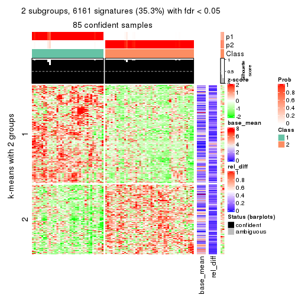</p>

</div>
<div id='tab-MAD-NMF-get-signatures-2'>
<pre><code class="r">get_signatures(res, k = 3)
</code></pre>

<p></p>

</div>
<div id='tab-MAD-NMF-get-signatures-3'>
<pre><code class="r">get_signatures(res, k = 4)
</code></pre>

<p></p>

</div>
<div id='tab-MAD-NMF-get-signatures-4'>
<pre><code class="r">get_signatures(res, k = 5)
</code></pre>

<p></p>

</div>
<div id='tab-MAD-NMF-get-signatures-5'>
<pre><code class="r">get_signatures(res, k = 6)
</code></pre>

<p></p>

</div>
</div>


Signature heatmaps where rows are not scaled:


<script>
$( function() {
	$( '#tabs-MAD-NMF-get-signatures-no-scale' ).tabs();
} );
</script>
<div id='tabs-MAD-NMF-get-signatures-no-scale'>
<ul>
<li><a href='#tab-MAD-NMF-get-signatures-no-scale-1'>k = 2</a></li>
<li><a href='#tab-MAD-NMF-get-signatures-no-scale-2'>k = 3</a></li>
<li><a href='#tab-MAD-NMF-get-signatures-no-scale-3'>k = 4</a></li>
<li><a href='#tab-MAD-NMF-get-signatures-no-scale-4'>k = 5</a></li>
<li><a href='#tab-MAD-NMF-get-signatures-no-scale-5'>k = 6</a></li>
</ul>
<div id='tab-MAD-NMF-get-signatures-no-scale-1'>
<pre><code class="r">get_signatures(res, k = 2, scale_rows = FALSE)
</code></pre>

<p></p>

</div>
<div id='tab-MAD-NMF-get-signatures-no-scale-2'>
<pre><code class="r">get_signatures(res, k = 3, scale_rows = FALSE)
</code></pre>

<p></p>

</div>
<div id='tab-MAD-NMF-get-signatures-no-scale-3'>
<pre><code class="r">get_signatures(res, k = 4, scale_rows = FALSE)
</code></pre>

<p></p>

</div>
<div id='tab-MAD-NMF-get-signatures-no-scale-4'>
<pre><code class="r">get_signatures(res, k = 5, scale_rows = FALSE)
</code></pre>

<p></p>

</div>
<div id='tab-MAD-NMF-get-signatures-no-scale-5'>
<pre><code class="r">get_signatures(res, k = 6, scale_rows = FALSE)
</code></pre>

<p></p>

</div>
</div>


Compare the overlap of signatures from different k:

```r
compare_signatures(res)
```


`get_signature()` returns a data frame invisibly. TO get the list of signatures, the function
call should be assigned to a variable explicitly. In following code, if `plot` argument is set
to `FALSE`, no heatmap is plotted while only the differential analysis is performed.

```r
# code only for demonstration
tb = get_signature(res, k = ..., plot = FALSE)
```

An example of the output of `tb` is:

```
#>   which_row         fdr    mean_1    mean_2 scaled_mean_1 scaled_mean_2 km
#> 1        38 0.042760348  8.373488  9.131774    -0.5533452     0.5164555  1
#> 2        40 0.018707592  7.106213  8.469186    -0.6173731     0.5762149  1
#> 3        55 0.019134737 10.221463 11.207825    -0.6159697     0.5749050  1
#> 4        59 0.006059896  5.921854  7.869574    -0.6899429     0.6439467  1
#> 5        60 0.018055526  8.928898 10.211722    -0.6204761     0.5791110  1
#> 6        98 0.009384629 15.714769 14.887706     0.6635654    -0.6193277  2
...
```

The columns in `tb` are:

1. `which_row`: row indices corresponding to the input matrix.
2. `fdr`: FDR for the differential test. 
3. `mean_x`: The mean value in group x.
4. `scaled_mean_x`: The mean value in group x after rows are scaled.
5. `km`: Row groups if k-means clustering is applied to rows.


UMAP plot which shows how samples are separated.


<script>
$( function() {
	$( '#tabs-MAD-NMF-dimension-reduction' ).tabs();
} );
</script>
<div id='tabs-MAD-NMF-dimension-reduction'>
<ul>
<li><a href='#tab-MAD-NMF-dimension-reduction-1'>k = 2</a></li>
<li><a href='#tab-MAD-NMF-dimension-reduction-2'>k = 3</a></li>
<li><a href='#tab-MAD-NMF-dimension-reduction-3'>k = 4</a></li>
<li><a href='#tab-MAD-NMF-dimension-reduction-4'>k = 5</a></li>
<li><a href='#tab-MAD-NMF-dimension-reduction-5'>k = 6</a></li>
</ul>
<div id='tab-MAD-NMF-dimension-reduction-1'>
<pre><code class="r">dimension_reduction(res, k = 2, method = &quot;UMAP&quot;)
</code></pre>

<p></p>

</div>
<div id='tab-MAD-NMF-dimension-reduction-2'>
<pre><code class="r">dimension_reduction(res, k = 3, method = &quot;UMAP&quot;)
</code></pre>

<p></p>

</div>
<div id='tab-MAD-NMF-dimension-reduction-3'>
<pre><code class="r">dimension_reduction(res, k = 4, method = &quot;UMAP&quot;)
</code></pre>

<p></p>

</div>
<div id='tab-MAD-NMF-dimension-reduction-4'>
<pre><code class="r">dimension_reduction(res, k = 5, method = &quot;UMAP&quot;)
</code></pre>

<p></p>

</div>
<div id='tab-MAD-NMF-dimension-reduction-5'>
<pre><code class="r">dimension_reduction(res, k = 6, method = &quot;UMAP&quot;)
</code></pre>

<p></p>

</div>
</div>


Following heatmap shows how subgroups are split when increasing `k`:

```r
collect_classes(res)
```


If matrix rows can be associated to genes, consider to use `functional_enrichment(res,
...)` to perform function enrichment for the signature genes. See [this vignette](http://bioconductor.org/packages/devel/bioc/vignettes/cola/inst/doc/functional_enrichment.html) for more detailed explanations.


 

---------------------------------------------------


### ATC:hclust**


The object with results only for a single top-value method and a single partition method 
can be extracted as:

```r
res = res_list["ATC", "hclust"]
# you can also extract it by
# res = res_list["ATC:hclust"]
```

A summary of `res` and all the functions that can be applied to it:

```r
res
```

```
#> A 'ConsensusPartition' object with k = 2, 3, 4, 5, 6.
#>   On a matrix with 17471 rows and 87 columns.
#>   Top rows (1000, 2000, 3000, 4000, 5000) are extracted by 'ATC' method.
#>   Subgroups are detected by 'hclust' method.
#>   Performed in total 1250 partitions by row resampling.
#>   Best k for subgroups seems to be 2.
#> 
#> Following methods can be applied to this 'ConsensusPartition' object:
#>  [1] "cola_report"             "collect_classes"         "collect_plots"          
#>  [4] "collect_stats"           "colnames"                "compare_signatures"     
#>  [7] "consensus_heatmap"       "dimension_reduction"     "functional_enrichment"  
#> [10] "get_anno_col"            "get_anno"                "get_classes"            
#> [13] "get_consensus"           "get_matrix"              "get_membership"         
#> [16] "get_param"               "get_signatures"          "get_stats"              
#> [19] "is_best_k"               "is_stable_k"             "membership_heatmap"     
#> [22] "ncol"                    "nrow"                    "plot_ecdf"              
#> [25] "rownames"                "select_partition_number" "show"                   
#> [28] "suggest_best_k"          "test_to_known_factors"
```

`collect_plots()` function collects all the plots made from `res` for all `k` (number of partitions)
into one single page to provide an easy and fast comparison between different `k`.

```r
collect_plots(res)
```

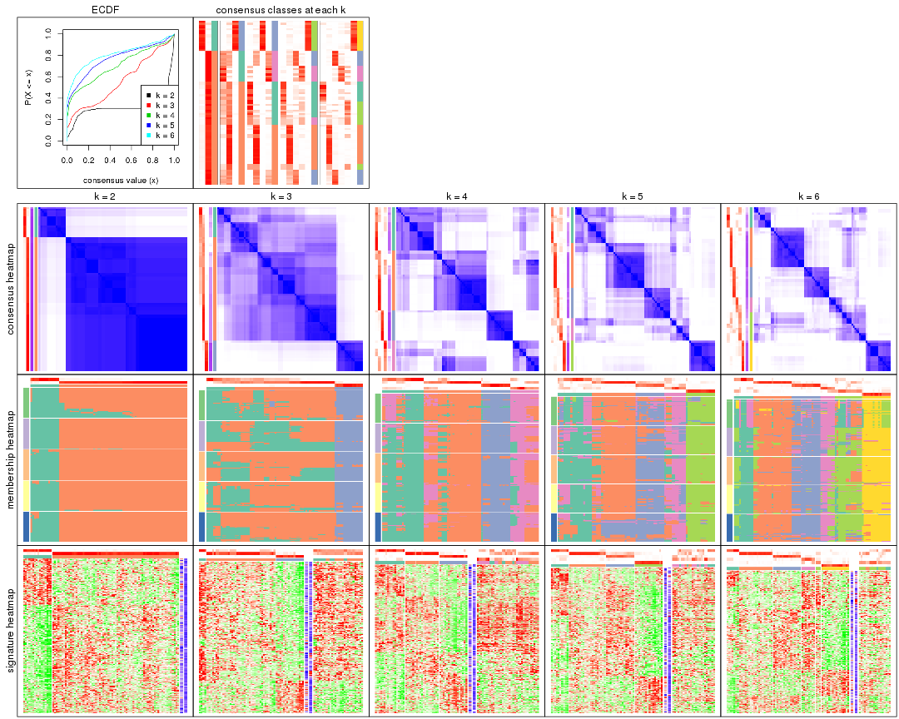

The plots are:

- The first row: a plot of the ECDF (empirical cumulative distribution
  function) curves of the consensus matrix for each `k` and the heatmap of
  predicted classes for each `k`.
- The second row: heatmaps of the consensus matrix for each `k`.
- The third row: heatmaps of the membership matrix for each `k`.
- The fouth row: heatmaps of the signatures for each `k`.

All the plots in panels can be made by individual functions and they are
plotted later in this section.

`select_partition_number()` produces several plots showing different
statistics for choosing "optimized" `k`. There are following statistics:

- ECDF curves of the consensus matrix for each `k`;
- 1-PAC. [The PAC
  score](https://en.wikipedia.org/wiki/Consensus_clustering#Over-interpretation_potential_of_consensus_clustering)
  measures the proportion of the ambiguous subgrouping.
- Mean silhouette score.
- Concordance. The mean probability of fiting the consensus class ids in all
  partitions.
- Area increased. Denote $A_k$ as the area under the ECDF curve for current
  `k`, the area increased is defined as $A_k - A_{k-1}$.
- Rand index. The percent of pairs of samples that are both in a same cluster
  or both are not in a same cluster in the partition of k and k-1.
- Jaccard index. The ratio of pairs of samples are both in a same cluster in
  the partition of k and k-1 and the pairs of samples are both in a same
  cluster in the partition k or k-1.

The detailed explanations of these statistics can be found in [the _cola_
vignette](http://bioconductor.org/packages/devel/bioc/vignettes/cola/inst/doc/cola.html#toc_13).

Generally speaking, lower PAC score, higher mean silhouette score or higher
concordance corresponds to better partition. Rand index and Jaccard index
measure how similar the current partition is compared to partition with `k-1`.
If they are too similar, we won't accept `k` is better than `k-1`.

```r
select_partition_number(res)
```


The numeric values for all these statistics can be obtained by `get_stats()`.

```r
get_stats(res)
```

```
#>   k 1-PAC mean_silhouette concordance area_increased  Rand Jaccard
#> 2 2 0.953           0.960       0.967         0.3078 0.696   0.696
#> 3 3 0.396           0.526       0.745         0.8189 0.765   0.662
#> 4 4 0.578           0.561       0.809         0.2636 0.803   0.573
#> 5 5 0.628           0.638       0.767         0.0909 0.886   0.606
#> 6 6 0.690           0.690       0.792         0.0505 0.933   0.694
```

`suggest_best_k()` suggests the best $k$ based on these statistics. The rules are as follows:

- All $k$ with Jaccard index larger than 0.95 are removed because increasing
  $k$ does not provide enough extra information. If all $k$ are removed, it is
  marked as no subgroup is detected.
- For all $k$ with 1-PAC score larger than 0.9, the maximal $k$ is taken as
  the best $k$, and other $k$ are marked as optional $k$.
- If it does not fit the second rule. The $k$ with the maximal vote of the
  highest 1-PAC score, highest mean silhouette, and highest concordance is
  taken as the best $k$.

```r
suggest_best_k(res)
```

```
#> [1] 2
```


Following shows the table of the partitions (You need to click the **show/hide
code output** link to see it). The membership matrix (columns with name `p*`)
is inferred by
[`clue::cl_consensus()`](https://www.rdocumentation.org/link/cl_consensus?package=clue)
function with the `SE` method. Basically the value in the membership matrix
represents the probability to belong to a certain group. The finall class
label for an item is determined with the group with highest probability it
belongs to.

In `get_classes()` function, the entropy is calculated from the membership
matrix and the silhouette score is calculated from the consensus matrix.


<script>
$( function() {
	$( '#tabs-ATC-hclust-get-classes' ).tabs();
} );
</script>
<div id='tabs-ATC-hclust-get-classes'>
<ul>
<li><a href='#tab-ATC-hclust-get-classes-1'>k = 2</a></li>
<li><a href='#tab-ATC-hclust-get-classes-2'>k = 3</a></li>
<li><a href='#tab-ATC-hclust-get-classes-3'>k = 4</a></li>
<li><a href='#tab-ATC-hclust-get-classes-4'>k = 5</a></li>
<li><a href='#tab-ATC-hclust-get-classes-5'>k = 6</a></li>
</ul>

<div id='tab-ATC-hclust-get-classes-1'>
<p><a id='tab-ATC-hclust-get-classes-1-a' style='color:#0366d6' href='#'>show/hide code output</a></p>
<pre><code class="r">cbind(get_classes(res, k = 2), get_membership(res, k = 2))
</code></pre>

<pre><code>#&gt;                                      class entropy silhouette    p1    p2
#&gt; E6088A41-B0DC-4FBF-8D14-BE78024CF8CD     1  0.1184      0.958 0.984 0.016
#&gt; F569915C-8F77-4D67-9730-30824DB57EE5     2  0.0000      0.970 0.000 1.000
#&gt; E3B71CB7-673B-4741-8607-4F0A11633036     2  0.2948      0.966 0.052 0.948
#&gt; DAF84798-FE3F-403C-B589-7F256AF752BE     2  0.0000      0.970 0.000 1.000
#&gt; 2F38E3B1-4975-4877-9DCC-C00270602180     2  0.0000      0.970 0.000 1.000
#&gt; C79A4C2F-02C4-4C03-A5A5-DE06802EEB57     2  0.3431      0.963 0.064 0.936
#&gt; 92E3ED8F-5C74-4ED2-9B03-9FA5E7B491D6     1  0.7528      0.736 0.784 0.216
#&gt; E61D60BE-3BD3-4B5E-BC12-80F3684A0959     2  0.0000      0.970 0.000 1.000
#&gt; C9388FC7-DB1D-4416-BC2D-EA643584F1E6     2  0.3114      0.966 0.056 0.944
#&gt; D4219360-6344-4AF3-ACEB-1701A9F1F67D     2  0.2948      0.966 0.052 0.948
#&gt; 07D155E6-F27C-4D09-B786-8A9B71147B72     2  0.0000      0.970 0.000 1.000
#&gt; 10C8C361-85A5-40E8-A395-B92623E6F27C     2  0.4690      0.930 0.100 0.900
#&gt; BDF20891-7C98-4A55-BBF3-8A836BE303C6     2  0.3114      0.966 0.056 0.944
#&gt; 694B0504-095E-431A-84F2-B4387072138E     2  0.4690      0.930 0.100 0.900
#&gt; EDCF8E7F-8B1D-46F7-8AE0-84A1DC9647D2     2  0.2948      0.968 0.052 0.948
#&gt; 0EA8288E-824D-4304-A053-5A833361F5C5     1  0.1633      0.957 0.976 0.024
#&gt; C4ACCFA1-34A9-4F61-8A1F-35B3B60EA193     2  0.0000      0.970 0.000 1.000
#&gt; 760BA639-38AC-4BC9-9647-09F6893EA8ED     2  0.2948      0.966 0.052 0.948
#&gt; 082DFC6B-C6E6-48B9-BDE5-74FF3B3DC954     2  0.3584      0.960 0.068 0.932
#&gt; FE349848-D7C4-4C49-B670-0E20454DDD7E     2  0.0000      0.970 0.000 1.000
#&gt; 2E8937B3-9EA1-4528-8CEE-BF3D4137908A     2  0.2948      0.967 0.052 0.948
#&gt; 9942D04E-2767-4E39-BA16-7762EAC3DFC4     1  0.0000      0.952 1.000 0.000
#&gt; F9C23182-91C4-4145-AE52-526FE8EB199D     2  0.2948      0.968 0.052 0.948
#&gt; 01024EED-7811-4E24-A067-8E0B978FFE2D     2  0.0000      0.970 0.000 1.000
#&gt; 932C8E98-A352-409C-8744-3D49FABCE425     2  0.0000      0.970 0.000 1.000
#&gt; 6DFD9439-C659-4936-84E5-108F717E3E4D     2  0.0000      0.970 0.000 1.000
#&gt; 1D8B83B8-5DD7-4F45-9D59-487EC6906A8B     1  0.4562      0.914 0.904 0.096
#&gt; 804B8503-73F6-42DE-835F-39DE2C9F13E1     2  0.1414      0.972 0.020 0.980
#&gt; B9453C9B-84D5-43BD-85BB-1780F02F039C     2  0.2948      0.966 0.052 0.948
#&gt; 836E6CD6-4E88-4028-9844-FA3C892C254A     1  0.0000      0.952 1.000 0.000
#&gt; 36EDD202-A845-4CE7-95D5-A515C471262E     2  0.0376      0.970 0.004 0.996
#&gt; 181C156A-B8F4-4F9D-93AA-6AFBD197644D     2  0.2948      0.966 0.052 0.948
#&gt; 0580E798-6A98-4E46-AC96-9A869DFF502E     2  0.0000      0.970 0.000 1.000
#&gt; EA1B63CF-D389-4567-8D9E-B0EF1F804598     2  0.2948      0.968 0.052 0.948
#&gt; 5ABC3D06-B8E9-4831-B89B-7C1EC4006B47     1  0.0000      0.952 1.000 0.000
#&gt; 1CC01E74-A7C1-4A51-9E28-1703C352BE16     1  0.4298      0.922 0.912 0.088
#&gt; 97E55B75-DBDB-46BC-9E74-7828C070BF16     1  0.4298      0.922 0.912 0.088
#&gt; BEB37A2D-E8B0-4674-89AC-DC0F34E0AFD6     2  0.0000      0.970 0.000 1.000
#&gt; 558648BA-6551-4D34-97C2-AD5F677D63FB     2  0.1843      0.971 0.028 0.972
#&gt; FF7021BB-414B-4466-BC43-372D856E6A1D     1  0.1633      0.957 0.976 0.024
#&gt; 9C04B840-54E0-425D-BDBE-8CB6B9C2C722     2  0.2603      0.970 0.044 0.956
#&gt; 5F50B1F4-1A02-4506-AA6D-9BF21CD8059A     2  0.0000      0.970 0.000 1.000
#&gt; 7D4B8FF3-7977-4ABD-AE04-EED1C50B23CC     2  0.0376      0.970 0.004 0.996
#&gt; A005AF15-B98E-4623-8AD4-1E69EFA9BC7A     2  0.0000      0.970 0.000 1.000
#&gt; 1DF04345-5C93-4B18-B307-8D1FCA532999     2  0.2948      0.967 0.052 0.948
#&gt; 6AF30C18-347E-41ED-A4AB-6F81F42206C5     2  0.0000      0.970 0.000 1.000
#&gt; 88A44ED0-BDE1-401E-B0E1-D8C8D6DBAEFC     2  0.3584      0.960 0.068 0.932
#&gt; 117673A3-2918-4702-8583-B66ADE6E4338     2  0.2948      0.968 0.052 0.948
#&gt; 4903A571-E14D-43C9-A737-22CAFAC414CD     2  0.0000      0.970 0.000 1.000
#&gt; C175E68E-632A-4B4A-9DDB-4895C4760F20     2  0.4690      0.930 0.100 0.900
#&gt; FA5CA2F4-A1AD-4A79-B8F3-73A976EB2FB1     2  0.3584      0.960 0.068 0.932
#&gt; E1F883A7-8B1F-4C1D-8A1A-9749A9C09845     2  0.0000      0.970 0.000 1.000
#&gt; E74F0729-6000-4908-ADB0-7BDBAC0639E6     2  0.2948      0.966 0.052 0.948
#&gt; F92135A9-1981-4C79-99A5-4243EEC5D30D     2  0.0000      0.970 0.000 1.000
#&gt; 73C6919F-DEB4-4DA4-B4AE-4032AC8F96C5     2  0.0000      0.970 0.000 1.000
#&gt; 33977B40-2E92-48B6-8D3A-3EBE913F6F8A     2  0.2948      0.968 0.052 0.948
#&gt; 490BD607-2F08-4B4C-9612-F9BB5CBBC8BB     2  0.2948      0.967 0.052 0.948
#&gt; 6C666E17-2EB8-4244-BCC1-8DD34EE4173E     2  0.1184      0.971 0.016 0.984
#&gt; C41F3064-4483-4796-B860-82155BAA5157     2  0.0000      0.970 0.000 1.000
#&gt; F4232B90-51B9-43EE-9971-35B3A318758F     2  0.0000      0.970 0.000 1.000
#&gt; 291EA1F6-FC56-4429-A433-0C452A6A514C     2  0.3431      0.962 0.064 0.936
#&gt; CC4AF04D-CB8E-40DD-B12E-7AA39B38262A     1  0.1184      0.958 0.984 0.016
#&gt; 4DAE26B9-AB57-4763-BB9A-2ADDD5D9C007     2  0.0000      0.970 0.000 1.000
#&gt; 676B4AEE-FB41-4C16-AA91-03E4A1DA8E26     1  0.2236      0.953 0.964 0.036
#&gt; 1CC36859-357A-49E0-A367-4F57D47288BA     2  0.0000      0.970 0.000 1.000
#&gt; 7CCDDFC8-6DF6-4734-96AC-19EBC464FC50     2  0.3733      0.957 0.072 0.928
#&gt; 10F38C34-3956-48ED-AB62-3439EF00D46B     2  0.2948      0.967 0.052 0.948
#&gt; 80B2B393-9D6E-45B4-B696-2A5C203543B7     2  0.2948      0.967 0.052 0.948
#&gt; 5AC7B5EA-1AAC-4529-8E5A-F612E5E0719A     1  0.1184      0.958 0.984 0.016
#&gt; 3648E98D-4B3A-41B7-BE05-595D44F0150D     1  0.0000      0.952 1.000 0.000
#&gt; 252EC850-6026-473B-8FFC-2CF567EF42E4     2  0.1633      0.971 0.024 0.976
#&gt; 1790E7A3-99D8-447E-BC50-51C8A4A18853     2  0.2603      0.969 0.044 0.956
#&gt; DA61A4F8-350B-4DD1-A240-AD016520DB5B     2  0.2948      0.967 0.052 0.948
#&gt; 767E5BAF-2515-40D7-AE7D-0B24D77A03F4     2  0.0000      0.970 0.000 1.000
#&gt; 8CB9C903-D749-44EA-9137-7FB5A92C5932     1  0.0000      0.952 1.000 0.000
#&gt; A9B968AE-2243-41BC-852A-3A12C1FB4892     2  0.1843      0.971 0.028 0.972
#&gt; 3C582264-85BC-4569-A888-8EB3008E5198     2  0.3733      0.957 0.072 0.928
#&gt; F4EAF9A2-9938-4D9B-9080-C0A7542D5704     1  0.3274      0.941 0.940 0.060
#&gt; 328499D3-45DD-4B66-BD22-3C52BA92C2BB     2  0.2948      0.966 0.052 0.948
#&gt; AF8AB83D-2917-4752-8C38-CF84C565B565     2  0.1633      0.971 0.024 0.976
#&gt; 03A327CA-A9FE-42A4-844D-CA85206969FC     2  0.0000      0.970 0.000 1.000
#&gt; 4B0BEC44-87BB-4014-9A26-3529DD63760B     2  0.2948      0.967 0.052 0.948
#&gt; 05C7843E-DC89-4D8E-A78A-952C5DFD667B     2  0.0000      0.970 0.000 1.000
#&gt; 29A0FFF9-13D3-4D16-BE6A-8E48A2C4E315     2  0.0000      0.970 0.000 1.000
#&gt; 22947CC3-4F42-4F44-899C-2B7085E36C9D     2  0.3584      0.960 0.068 0.932
#&gt; A247D92D-253A-4BEC-B450-184AF90D17D0     2  0.2948      0.967 0.052 0.948
#&gt; 0D907A63-D23F-4684-80D9-0BA552435B86     2  0.0000      0.970 0.000 1.000
</code></pre>

<script>
$('#tab-ATC-hclust-get-classes-1-a').parent().next().next().hide();
$('#tab-ATC-hclust-get-classes-1-a').click(function(){
  $('#tab-ATC-hclust-get-classes-1-a').parent().next().next().toggle();
  return(false);
});
</script>
</div>

<div id='tab-ATC-hclust-get-classes-2'>
<p><a id='tab-ATC-hclust-get-classes-2-a' style='color:#0366d6' href='#'>show/hide code output</a></p>
<pre><code class="r">cbind(get_classes(res, k = 3), get_membership(res, k = 3))
</code></pre>

<pre><code>#&gt;                                      class entropy silhouette    p1    p2    p3
#&gt; E6088A41-B0DC-4FBF-8D14-BE78024CF8CD     3  0.1765   0.929777 0.004 0.040 0.956
#&gt; F569915C-8F77-4D67-9730-30824DB57EE5     1  0.6307   0.369989 0.512 0.488 0.000
#&gt; E3B71CB7-673B-4741-8607-4F0A11633036     2  0.6075   0.542112 0.316 0.676 0.008
#&gt; DAF84798-FE3F-403C-B589-7F256AF752BE     2  0.6180   0.375486 0.416 0.584 0.000
#&gt; 2F38E3B1-4975-4877-9DCC-C00270602180     1  0.5178   0.369088 0.744 0.256 0.000
#&gt; C79A4C2F-02C4-4C03-A5A5-DE06802EEB57     2  0.1267   0.629995 0.024 0.972 0.004
#&gt; 92E3ED8F-5C74-4ED2-9B03-9FA5E7B491D6     3  0.5480   0.594900 0.004 0.264 0.732
#&gt; E61D60BE-3BD3-4B5E-BC12-80F3684A0959     1  0.5760   0.498337 0.672 0.328 0.000
#&gt; C9388FC7-DB1D-4416-BC2D-EA643584F1E6     2  0.1031   0.624737 0.024 0.976 0.000
#&gt; D4219360-6344-4AF3-ACEB-1701A9F1F67D     2  0.6075   0.542112 0.316 0.676 0.008
#&gt; 07D155E6-F27C-4D09-B786-8A9B71147B72     1  0.0592   0.537402 0.988 0.012 0.000
#&gt; 10C8C361-85A5-40E8-A395-B92623E6F27C     2  0.7065   0.532487 0.288 0.664 0.048
#&gt; BDF20891-7C98-4A55-BBF3-8A836BE303C6     2  0.1964   0.631599 0.056 0.944 0.000
#&gt; 694B0504-095E-431A-84F2-B4387072138E     2  0.7065   0.532487 0.288 0.664 0.048
#&gt; EDCF8E7F-8B1D-46F7-8AE0-84A1DC9647D2     2  0.4062   0.624317 0.164 0.836 0.000
#&gt; 0EA8288E-824D-4304-A053-5A833361F5C5     3  0.1411   0.929220 0.000 0.036 0.964
#&gt; C4ACCFA1-34A9-4F61-8A1F-35B3B60EA193     1  0.5529   0.321647 0.704 0.296 0.000
#&gt; 760BA639-38AC-4BC9-9647-09F6893EA8ED     2  0.6075   0.542112 0.316 0.676 0.008
#&gt; 082DFC6B-C6E6-48B9-BDE5-74FF3B3DC954     2  0.0848   0.621146 0.008 0.984 0.008
#&gt; FE349848-D7C4-4C49-B670-0E20454DDD7E     1  0.6307   0.369989 0.512 0.488 0.000
#&gt; 2E8937B3-9EA1-4528-8CEE-BF3D4137908A     2  0.0892   0.622593 0.020 0.980 0.000
#&gt; 9942D04E-2767-4E39-BA16-7762EAC3DFC4     3  0.0424   0.917475 0.008 0.000 0.992
#&gt; F9C23182-91C4-4145-AE52-526FE8EB199D     2  0.4002   0.625643 0.160 0.840 0.000
#&gt; 01024EED-7811-4E24-A067-8E0B978FFE2D     2  0.5810  -0.000407 0.336 0.664 0.000
#&gt; 932C8E98-A352-409C-8744-3D49FABCE425     1  0.5529   0.321647 0.704 0.296 0.000
#&gt; 6DFD9439-C659-4936-84E5-108F717E3E4D     2  0.6008   0.451752 0.372 0.628 0.000
#&gt; 1D8B83B8-5DD7-4F45-9D59-487EC6906A8B     3  0.3644   0.882790 0.004 0.124 0.872
#&gt; 804B8503-73F6-42DE-835F-39DE2C9F13E1     2  0.5529   0.111552 0.296 0.704 0.000
#&gt; B9453C9B-84D5-43BD-85BB-1780F02F039C     2  0.6047   0.545738 0.312 0.680 0.008
#&gt; 836E6CD6-4E88-4028-9844-FA3C892C254A     3  0.0424   0.917475 0.008 0.000 0.992
#&gt; 36EDD202-A845-4CE7-95D5-A515C471262E     2  0.5678   0.059320 0.316 0.684 0.000
#&gt; 181C156A-B8F4-4F9D-93AA-6AFBD197644D     2  0.6047   0.545738 0.312 0.680 0.008
#&gt; 0580E798-6A98-4E46-AC96-9A869DFF502E     2  0.6307   0.252777 0.488 0.512 0.000
#&gt; EA1B63CF-D389-4567-8D9E-B0EF1F804598     2  0.4178   0.622323 0.172 0.828 0.000
#&gt; 5ABC3D06-B8E9-4831-B89B-7C1EC4006B47     3  0.0424   0.917475 0.008 0.000 0.992
#&gt; 1CC01E74-A7C1-4A51-9E28-1703C352BE16     3  0.3644   0.884887 0.004 0.124 0.872
#&gt; 97E55B75-DBDB-46BC-9E74-7828C070BF16     3  0.3644   0.884887 0.004 0.124 0.872
#&gt; BEB37A2D-E8B0-4674-89AC-DC0F34E0AFD6     2  0.6286   0.276078 0.464 0.536 0.000
#&gt; 558648BA-6551-4D34-97C2-AD5F677D63FB     2  0.5650   0.549042 0.312 0.688 0.000
#&gt; FF7021BB-414B-4466-BC43-372D856E6A1D     3  0.2096   0.928075 0.004 0.052 0.944
#&gt; 9C04B840-54E0-425D-BDBE-8CB6B9C2C722     2  0.4121   0.624851 0.168 0.832 0.000
#&gt; 5F50B1F4-1A02-4506-AA6D-9BF21CD8059A     1  0.0592   0.537402 0.988 0.012 0.000
#&gt; 7D4B8FF3-7977-4ABD-AE04-EED1C50B23CC     2  0.6252  -0.245098 0.444 0.556 0.000
#&gt; A005AF15-B98E-4623-8AD4-1E69EFA9BC7A     2  0.6307   0.252777 0.488 0.512 0.000
#&gt; 1DF04345-5C93-4B18-B307-8D1FCA532999     2  0.1031   0.620378 0.024 0.976 0.000
#&gt; 6AF30C18-347E-41ED-A4AB-6F81F42206C5     2  0.6305   0.263010 0.484 0.516 0.000
#&gt; 88A44ED0-BDE1-401E-B0E1-D8C8D6DBAEFC     2  0.0848   0.621146 0.008 0.984 0.008
#&gt; 117673A3-2918-4702-8583-B66ADE6E4338     2  0.4178   0.622323 0.172 0.828 0.000
#&gt; 4903A571-E14D-43C9-A737-22CAFAC414CD     1  0.6309   0.355007 0.504 0.496 0.000
#&gt; C175E68E-632A-4B4A-9DDB-4895C4760F20     2  0.7095   0.528531 0.292 0.660 0.048
#&gt; FA5CA2F4-A1AD-4A79-B8F3-73A976EB2FB1     2  0.0848   0.621146 0.008 0.984 0.008
#&gt; E1F883A7-8B1F-4C1D-8A1A-9749A9C09845     1  0.6225   0.442380 0.568 0.432 0.000
#&gt; E74F0729-6000-4908-ADB0-7BDBAC0639E6     2  0.6047   0.545738 0.312 0.680 0.008
#&gt; F92135A9-1981-4C79-99A5-4243EEC5D30D     2  0.5810  -0.000407 0.336 0.664 0.000
#&gt; 73C6919F-DEB4-4DA4-B4AE-4032AC8F96C5     2  0.6307   0.252777 0.488 0.512 0.000
#&gt; 33977B40-2E92-48B6-8D3A-3EBE913F6F8A     2  0.4575   0.618547 0.184 0.812 0.004
#&gt; 490BD607-2F08-4B4C-9612-F9BB5CBBC8BB     2  0.1031   0.621855 0.024 0.976 0.000
#&gt; 6C666E17-2EB8-4244-BCC1-8DD34EE4173E     2  0.6274  -0.276960 0.456 0.544 0.000
#&gt; C41F3064-4483-4796-B860-82155BAA5157     1  0.4974   0.395181 0.764 0.236 0.000
#&gt; F4232B90-51B9-43EE-9971-35B3A318758F     2  0.6305   0.262654 0.484 0.516 0.000
#&gt; 291EA1F6-FC56-4429-A433-0C452A6A514C     2  0.0661   0.622114 0.008 0.988 0.004
#&gt; CC4AF04D-CB8E-40DD-B12E-7AA39B38262A     3  0.1878   0.929509 0.004 0.044 0.952
#&gt; 4DAE26B9-AB57-4763-BB9A-2ADDD5D9C007     1  0.2356   0.530588 0.928 0.072 0.000
#&gt; 676B4AEE-FB41-4C16-AA91-03E4A1DA8E26     3  0.2400   0.923317 0.004 0.064 0.932
#&gt; 1CC36859-357A-49E0-A367-4F57D47288BA     1  0.6309   0.355007 0.504 0.496 0.000
#&gt; 7CCDDFC8-6DF6-4734-96AC-19EBC464FC50     2  0.0829   0.619421 0.004 0.984 0.012
#&gt; 10F38C34-3956-48ED-AB62-3439EF00D46B     2  0.0747   0.623576 0.016 0.984 0.000
#&gt; 80B2B393-9D6E-45B4-B696-2A5C203543B7     2  0.0892   0.622593 0.020 0.980 0.000
#&gt; 5AC7B5EA-1AAC-4529-8E5A-F612E5E0719A     3  0.1031   0.927237 0.000 0.024 0.976
#&gt; 3648E98D-4B3A-41B7-BE05-595D44F0150D     3  0.0424   0.917475 0.008 0.000 0.992
#&gt; 252EC850-6026-473B-8FFC-2CF567EF42E4     2  0.5733   0.533658 0.324 0.676 0.000
#&gt; 1790E7A3-99D8-447E-BC50-51C8A4A18853     2  0.1031   0.616765 0.024 0.976 0.000
#&gt; DA61A4F8-350B-4DD1-A240-AD016520DB5B     2  0.0747   0.623576 0.016 0.984 0.000
#&gt; 767E5BAF-2515-40D7-AE7D-0B24D77A03F4     2  0.6309  -0.385423 0.496 0.504 0.000
#&gt; 8CB9C903-D749-44EA-9137-7FB5A92C5932     3  0.0424   0.917475 0.008 0.000 0.992
#&gt; A9B968AE-2243-41BC-852A-3A12C1FB4892     2  0.5678   0.542603 0.316 0.684 0.000
#&gt; 3C582264-85BC-4569-A888-8EB3008E5198     2  0.1182   0.617748 0.012 0.976 0.012
#&gt; F4EAF9A2-9938-4D9B-9080-C0A7542D5704     3  0.2945   0.909861 0.004 0.088 0.908
#&gt; 328499D3-45DD-4B66-BD22-3C52BA92C2BB     2  0.6047   0.545738 0.312 0.680 0.008
#&gt; AF8AB83D-2917-4752-8C38-CF84C565B565     2  0.5706   0.538515 0.320 0.680 0.000
#&gt; 03A327CA-A9FE-42A4-844D-CA85206969FC     1  0.6215   0.445381 0.572 0.428 0.000
#&gt; 4B0BEC44-87BB-4014-9A26-3529DD63760B     2  0.0747   0.623576 0.016 0.984 0.000
#&gt; 05C7843E-DC89-4D8E-A78A-952C5DFD667B     1  0.6307   0.369989 0.512 0.488 0.000
#&gt; 29A0FFF9-13D3-4D16-BE6A-8E48A2C4E315     2  0.5905  -0.054459 0.352 0.648 0.000
#&gt; 22947CC3-4F42-4F44-899C-2B7085E36C9D     2  0.0848   0.621146 0.008 0.984 0.008
#&gt; A247D92D-253A-4BEC-B450-184AF90D17D0     2  0.0747   0.623576 0.016 0.984 0.000
#&gt; 0D907A63-D23F-4684-80D9-0BA552435B86     1  0.0592   0.537402 0.988 0.012 0.000
</code></pre>

<script>
$('#tab-ATC-hclust-get-classes-2-a').parent().next().next().hide();
$('#tab-ATC-hclust-get-classes-2-a').click(function(){
  $('#tab-ATC-hclust-get-classes-2-a').parent().next().next().toggle();
  return(false);
});
</script>
</div>

<div id='tab-ATC-hclust-get-classes-3'>
<p><a id='tab-ATC-hclust-get-classes-3-a' style='color:#0366d6' href='#'>show/hide code output</a></p>
<pre><code class="r">cbind(get_classes(res, k = 4), get_membership(res, k = 4))
</code></pre>

<pre><code>#&gt;                                      class entropy silhouette    p1    p2    p3    p4
#&gt; E6088A41-B0DC-4FBF-8D14-BE78024CF8CD     3  0.1677     0.9376 0.012 0.040 0.948 0.000
#&gt; F569915C-8F77-4D67-9730-30824DB57EE5     4  0.4999     0.1416 0.000 0.492 0.000 0.508
#&gt; E3B71CB7-673B-4741-8607-4F0A11633036     1  0.0376     0.7623 0.992 0.004 0.000 0.004
#&gt; DAF84798-FE3F-403C-B589-7F256AF752BE     1  0.7277     0.4308 0.540 0.228 0.000 0.232
#&gt; 2F38E3B1-4975-4877-9DCC-C00270602180     4  0.4624     0.0383 0.340 0.000 0.000 0.660
#&gt; C79A4C2F-02C4-4C03-A5A5-DE06802EEB57     2  0.3402     0.6224 0.164 0.832 0.000 0.004
#&gt; 92E3ED8F-5C74-4ED2-9B03-9FA5E7B491D6     3  0.4767     0.6803 0.256 0.020 0.724 0.000
#&gt; E61D60BE-3BD3-4B5E-BC12-80F3684A0959     4  0.4699     0.3893 0.004 0.320 0.000 0.676
#&gt; C9388FC7-DB1D-4416-BC2D-EA643584F1E6     2  0.1406     0.7203 0.024 0.960 0.000 0.016
#&gt; D4219360-6344-4AF3-ACEB-1701A9F1F67D     1  0.0376     0.7623 0.992 0.004 0.000 0.004
#&gt; 07D155E6-F27C-4D09-B786-8A9B71147B72     4  0.0188     0.4889 0.004 0.000 0.000 0.996
#&gt; 10C8C361-85A5-40E8-A395-B92623E6F27C     1  0.1913     0.7526 0.940 0.020 0.040 0.000
#&gt; BDF20891-7C98-4A55-BBF3-8A836BE303C6     2  0.2859     0.6587 0.112 0.880 0.000 0.008
#&gt; 694B0504-095E-431A-84F2-B4387072138E     1  0.1913     0.7526 0.940 0.020 0.040 0.000
#&gt; EDCF8E7F-8B1D-46F7-8AE0-84A1DC9647D2     2  0.5508    -0.0975 0.476 0.508 0.000 0.016
#&gt; 0EA8288E-824D-4304-A053-5A833361F5C5     3  0.1452     0.9371 0.008 0.036 0.956 0.000
#&gt; C4ACCFA1-34A9-4F61-8A1F-35B3B60EA193     4  0.5039    -0.1005 0.404 0.004 0.000 0.592
#&gt; 760BA639-38AC-4BC9-9647-09F6893EA8ED     1  0.0376     0.7623 0.992 0.004 0.000 0.004
#&gt; 082DFC6B-C6E6-48B9-BDE5-74FF3B3DC954     2  0.0592     0.7243 0.016 0.984 0.000 0.000
#&gt; FE349848-D7C4-4C49-B670-0E20454DDD7E     4  0.4999     0.1416 0.000 0.492 0.000 0.508
#&gt; 2E8937B3-9EA1-4528-8CEE-BF3D4137908A     2  0.0469     0.7263 0.000 0.988 0.000 0.012
#&gt; 9942D04E-2767-4E39-BA16-7762EAC3DFC4     3  0.0000     0.9278 0.000 0.000 1.000 0.000
#&gt; F9C23182-91C4-4145-AE52-526FE8EB199D     2  0.5254     0.4274 0.300 0.672 0.000 0.028
#&gt; 01024EED-7811-4E24-A067-8E0B978FFE2D     2  0.4564     0.3401 0.000 0.672 0.000 0.328
#&gt; 932C8E98-A352-409C-8744-3D49FABCE425     4  0.5039    -0.1005 0.404 0.004 0.000 0.592
#&gt; 6DFD9439-C659-4936-84E5-108F717E3E4D     1  0.7241     0.4234 0.536 0.276 0.000 0.188
#&gt; 1D8B83B8-5DD7-4F45-9D59-487EC6906A8B     3  0.3161     0.8934 0.012 0.124 0.864 0.000
#&gt; 804B8503-73F6-42DE-835F-39DE2C9F13E1     2  0.4331     0.4189 0.000 0.712 0.000 0.288
#&gt; B9453C9B-84D5-43BD-85BB-1780F02F039C     1  0.0188     0.7619 0.996 0.004 0.000 0.000
#&gt; 836E6CD6-4E88-4028-9844-FA3C892C254A     3  0.0000     0.9278 0.000 0.000 1.000 0.000
#&gt; 36EDD202-A845-4CE7-95D5-A515C471262E     2  0.4454     0.3814 0.000 0.692 0.000 0.308
#&gt; 181C156A-B8F4-4F9D-93AA-6AFBD197644D     1  0.0336     0.7628 0.992 0.008 0.000 0.000
#&gt; 0580E798-6A98-4E46-AC96-9A869DFF502E     1  0.3801     0.6906 0.780 0.000 0.000 0.220
#&gt; EA1B63CF-D389-4567-8D9E-B0EF1F804598     2  0.5607    -0.1304 0.484 0.496 0.000 0.020
#&gt; 5ABC3D06-B8E9-4831-B89B-7C1EC4006B47     3  0.0000     0.9278 0.000 0.000 1.000 0.000
#&gt; 1CC01E74-A7C1-4A51-9E28-1703C352BE16     3  0.3224     0.8954 0.016 0.120 0.864 0.000
#&gt; 97E55B75-DBDB-46BC-9E74-7828C070BF16     3  0.3224     0.8954 0.016 0.120 0.864 0.000
#&gt; BEB37A2D-E8B0-4674-89AC-DC0F34E0AFD6     1  0.7099     0.5045 0.552 0.168 0.000 0.280
#&gt; 558648BA-6551-4D34-97C2-AD5F677D63FB     1  0.4679     0.6803 0.772 0.184 0.000 0.044
#&gt; FF7021BB-414B-4466-BC43-372D856E6A1D     3  0.1938     0.9356 0.012 0.052 0.936 0.000
#&gt; 9C04B840-54E0-425D-BDBE-8CB6B9C2C722     2  0.5222     0.4544 0.280 0.688 0.000 0.032
#&gt; 5F50B1F4-1A02-4506-AA6D-9BF21CD8059A     4  0.0188     0.4889 0.004 0.000 0.000 0.996
#&gt; 7D4B8FF3-7977-4ABD-AE04-EED1C50B23CC     2  0.5366    -0.0166 0.012 0.548 0.000 0.440
#&gt; A005AF15-B98E-4623-8AD4-1E69EFA9BC7A     1  0.3801     0.6906 0.780 0.000 0.000 0.220
#&gt; 1DF04345-5C93-4B18-B307-8D1FCA532999     2  0.0592     0.7255 0.000 0.984 0.000 0.016
#&gt; 6AF30C18-347E-41ED-A4AB-6F81F42206C5     1  0.3801     0.6913 0.780 0.000 0.000 0.220
#&gt; 88A44ED0-BDE1-401E-B0E1-D8C8D6DBAEFC     2  0.0592     0.7243 0.016 0.984 0.000 0.000
#&gt; 117673A3-2918-4702-8583-B66ADE6E4338     2  0.5607    -0.1304 0.484 0.496 0.000 0.020
#&gt; 4903A571-E14D-43C9-A737-22CAFAC414CD     4  0.5406     0.1652 0.012 0.480 0.000 0.508
#&gt; C175E68E-632A-4B4A-9DDB-4895C4760F20     1  0.2099     0.7529 0.936 0.020 0.040 0.004
#&gt; FA5CA2F4-A1AD-4A79-B8F3-73A976EB2FB1     2  0.0592     0.7243 0.016 0.984 0.000 0.000
#&gt; E1F883A7-8B1F-4C1D-8A1A-9749A9C09845     4  0.5105     0.2683 0.004 0.432 0.000 0.564
#&gt; E74F0729-6000-4908-ADB0-7BDBAC0639E6     1  0.0188     0.7619 0.996 0.004 0.000 0.000
#&gt; F92135A9-1981-4C79-99A5-4243EEC5D30D     2  0.4564     0.3401 0.000 0.672 0.000 0.328
#&gt; 73C6919F-DEB4-4DA4-B4AE-4032AC8F96C5     1  0.3801     0.6906 0.780 0.000 0.000 0.220
#&gt; 33977B40-2E92-48B6-8D3A-3EBE913F6F8A     1  0.5530     0.4923 0.632 0.336 0.000 0.032
#&gt; 490BD607-2F08-4B4C-9612-F9BB5CBBC8BB     2  0.0592     0.7251 0.000 0.984 0.000 0.016
#&gt; 6C666E17-2EB8-4244-BCC1-8DD34EE4173E     2  0.4967    -0.0205 0.000 0.548 0.000 0.452
#&gt; C41F3064-4483-4796-B860-82155BAA5157     4  0.4500     0.0808 0.316 0.000 0.000 0.684
#&gt; F4232B90-51B9-43EE-9971-35B3A318758F     1  0.3801     0.6921 0.780 0.000 0.000 0.220
#&gt; 291EA1F6-FC56-4429-A433-0C452A6A514C     2  0.0469     0.7257 0.012 0.988 0.000 0.000
#&gt; CC4AF04D-CB8E-40DD-B12E-7AA39B38262A     3  0.1767     0.9373 0.012 0.044 0.944 0.000
#&gt; 4DAE26B9-AB57-4763-BB9A-2ADDD5D9C007     4  0.2053     0.4441 0.072 0.004 0.000 0.924
#&gt; 676B4AEE-FB41-4C16-AA91-03E4A1DA8E26     3  0.2179     0.9319 0.012 0.064 0.924 0.000
#&gt; 1CC36859-357A-49E0-A367-4F57D47288BA     4  0.5406     0.1652 0.012 0.480 0.000 0.508
#&gt; 7CCDDFC8-6DF6-4734-96AC-19EBC464FC50     2  0.0779     0.7226 0.016 0.980 0.004 0.000
#&gt; 10F38C34-3956-48ED-AB62-3439EF00D46B     2  0.0336     0.7275 0.000 0.992 0.000 0.008
#&gt; 80B2B393-9D6E-45B4-B696-2A5C203543B7     2  0.0469     0.7263 0.000 0.988 0.000 0.012
#&gt; 5AC7B5EA-1AAC-4529-8E5A-F612E5E0719A     3  0.1151     0.9355 0.008 0.024 0.968 0.000
#&gt; 3648E98D-4B3A-41B7-BE05-595D44F0150D     3  0.0000     0.9278 0.000 0.000 1.000 0.000
#&gt; 252EC850-6026-473B-8FFC-2CF567EF42E4     1  0.6936     0.4995 0.568 0.284 0.000 0.148
#&gt; 1790E7A3-99D8-447E-BC50-51C8A4A18853     2  0.0592     0.7235 0.000 0.984 0.000 0.016
#&gt; DA61A4F8-350B-4DD1-A240-AD016520DB5B     2  0.0336     0.7275 0.000 0.992 0.000 0.008
#&gt; 767E5BAF-2515-40D7-AE7D-0B24D77A03F4     2  0.4999    -0.1696 0.000 0.508 0.000 0.492
#&gt; 8CB9C903-D749-44EA-9137-7FB5A92C5932     3  0.0000     0.9278 0.000 0.000 1.000 0.000
#&gt; A9B968AE-2243-41BC-852A-3A12C1FB4892     1  0.6955     0.4918 0.560 0.296 0.000 0.144
#&gt; 3C582264-85BC-4569-A888-8EB3008E5198     2  0.1114     0.7245 0.016 0.972 0.004 0.008
#&gt; F4EAF9A2-9938-4D9B-9080-C0A7542D5704     3  0.2610     0.9187 0.012 0.088 0.900 0.000
#&gt; 328499D3-45DD-4B66-BD22-3C52BA92C2BB     1  0.0188     0.7619 0.996 0.004 0.000 0.000
#&gt; AF8AB83D-2917-4752-8C38-CF84C565B565     1  0.6917     0.4987 0.568 0.288 0.000 0.144
#&gt; 03A327CA-A9FE-42A4-844D-CA85206969FC     4  0.5097     0.2745 0.004 0.428 0.000 0.568
#&gt; 4B0BEC44-87BB-4014-9A26-3529DD63760B     2  0.0336     0.7275 0.000 0.992 0.000 0.008
#&gt; 05C7843E-DC89-4D8E-A78A-952C5DFD667B     4  0.4999     0.1416 0.000 0.492 0.000 0.508
#&gt; 29A0FFF9-13D3-4D16-BE6A-8E48A2C4E315     2  0.4661     0.2903 0.000 0.652 0.000 0.348
#&gt; 22947CC3-4F42-4F44-899C-2B7085E36C9D     2  0.0707     0.7248 0.020 0.980 0.000 0.000
#&gt; A247D92D-253A-4BEC-B450-184AF90D17D0     2  0.0336     0.7275 0.000 0.992 0.000 0.008
#&gt; 0D907A63-D23F-4684-80D9-0BA552435B86     4  0.0188     0.4889 0.004 0.000 0.000 0.996
</code></pre>

<script>
$('#tab-ATC-hclust-get-classes-3-a').parent().next().next().hide();
$('#tab-ATC-hclust-get-classes-3-a').click(function(){
  $('#tab-ATC-hclust-get-classes-3-a').parent().next().next().toggle();
  return(false);
});
</script>
</div>

<div id='tab-ATC-hclust-get-classes-4'>
<p><a id='tab-ATC-hclust-get-classes-4-a' style='color:#0366d6' href='#'>show/hide code output</a></p>
<pre><code class="r">cbind(get_classes(res, k = 5), get_membership(res, k = 5))
</code></pre>

<pre><code>#&gt;                                      class entropy silhouette    p1    p2    p3    p4    p5
#&gt; E6088A41-B0DC-4FBF-8D14-BE78024CF8CD     5   0.088    0.91981 0.000 0.032 0.000 0.000 0.968
#&gt; F569915C-8F77-4D67-9730-30824DB57EE5     3   0.338    0.82879 0.000 0.176 0.808 0.016 0.000
#&gt; E3B71CB7-673B-4741-8607-4F0A11633036     1   0.408    0.46113 0.668 0.000 0.004 0.328 0.000
#&gt; DAF84798-FE3F-403C-B589-7F256AF752BE     1   0.833   -0.02747 0.312 0.132 0.256 0.300 0.000
#&gt; 2F38E3B1-4975-4877-9DCC-C00270602180     4   0.187    0.47348 0.020 0.000 0.052 0.928 0.000
#&gt; C79A4C2F-02C4-4C03-A5A5-DE06802EEB57     2   0.348    0.70572 0.168 0.812 0.012 0.008 0.000
#&gt; 92E3ED8F-5C74-4ED2-9B03-9FA5E7B491D6     5   0.419    0.64365 0.256 0.012 0.000 0.008 0.724
#&gt; E61D60BE-3BD3-4B5E-BC12-80F3684A0959     3   0.429    0.60727 0.000 0.080 0.768 0.152 0.000
#&gt; C9388FC7-DB1D-4416-BC2D-EA643584F1E6     2   0.131    0.81375 0.024 0.956 0.020 0.000 0.000
#&gt; D4219360-6344-4AF3-ACEB-1701A9F1F67D     1   0.408    0.46113 0.668 0.000 0.004 0.328 0.000
#&gt; 07D155E6-F27C-4D09-B786-8A9B71147B72     4   0.414    0.37557 0.000 0.000 0.384 0.616 0.000
#&gt; 10C8C361-85A5-40E8-A395-B92623E6F27C     1   0.255    0.60767 0.904 0.012 0.000 0.040 0.044
#&gt; BDF20891-7C98-4A55-BBF3-8A836BE303C6     2   0.325    0.75228 0.080 0.864 0.016 0.040 0.000
#&gt; 694B0504-095E-431A-84F2-B4387072138E     1   0.255    0.60767 0.904 0.012 0.000 0.040 0.044
#&gt; EDCF8E7F-8B1D-46F7-8AE0-84A1DC9647D2     2   0.702    0.18437 0.292 0.484 0.028 0.196 0.000
#&gt; 0EA8288E-824D-4304-A053-5A833361F5C5     5   0.208    0.91941 0.000 0.032 0.016 0.024 0.928
#&gt; C4ACCFA1-34A9-4F61-8A1F-35B3B60EA193     4   0.365    0.43779 0.092 0.000 0.084 0.824 0.000
#&gt; 760BA639-38AC-4BC9-9647-09F6893EA8ED     1   0.408    0.46113 0.668 0.000 0.004 0.328 0.000
#&gt; 082DFC6B-C6E6-48B9-BDE5-74FF3B3DC954     2   0.131    0.81661 0.000 0.960 0.016 0.008 0.016
#&gt; FE349848-D7C4-4C49-B670-0E20454DDD7E     3   0.338    0.82879 0.000 0.176 0.808 0.016 0.000
#&gt; 2E8937B3-9EA1-4528-8CEE-BF3D4137908A     2   0.112    0.80724 0.000 0.956 0.044 0.000 0.000
#&gt; 9942D04E-2767-4E39-BA16-7762EAC3DFC4     5   0.175    0.90766 0.000 0.000 0.028 0.036 0.936
#&gt; F9C23182-91C4-4145-AE52-526FE8EB199D     2   0.601    0.51177 0.208 0.648 0.036 0.108 0.000
#&gt; 01024EED-7811-4E24-A067-8E0B978FFE2D     3   0.415    0.75200 0.000 0.344 0.652 0.004 0.000
#&gt; 932C8E98-A352-409C-8744-3D49FABCE425     4   0.365    0.43779 0.092 0.000 0.084 0.824 0.000
#&gt; 6DFD9439-C659-4936-84E5-108F717E3E4D     1   0.847    0.00318 0.332 0.180 0.252 0.236 0.000
#&gt; 1D8B83B8-5DD7-4F45-9D59-487EC6906A8B     5   0.223    0.88061 0.000 0.116 0.000 0.000 0.884
#&gt; 804B8503-73F6-42DE-835F-39DE2C9F13E1     3   0.436    0.65032 0.000 0.412 0.584 0.004 0.000
#&gt; B9453C9B-84D5-43BD-85BB-1780F02F039C     1   0.189    0.60382 0.916 0.000 0.080 0.004 0.000
#&gt; 836E6CD6-4E88-4028-9844-FA3C892C254A     5   0.175    0.90766 0.000 0.000 0.028 0.036 0.936
#&gt; 36EDD202-A845-4CE7-95D5-A515C471262E     3   0.429    0.69793 0.000 0.384 0.612 0.004 0.000
#&gt; 181C156A-B8F4-4F9D-93AA-6AFBD197644D     1   0.205    0.60411 0.912 0.004 0.080 0.004 0.000
#&gt; 0580E798-6A98-4E46-AC96-9A869DFF502E     1   0.520    0.51579 0.684 0.000 0.128 0.188 0.000
#&gt; EA1B63CF-D389-4567-8D9E-B0EF1F804598     2   0.717    0.15968 0.296 0.472 0.036 0.196 0.000
#&gt; 5ABC3D06-B8E9-4831-B89B-7C1EC4006B47     5   0.175    0.90766 0.000 0.000 0.028 0.036 0.936
#&gt; 1CC01E74-A7C1-4A51-9E28-1703C352BE16     5   0.234    0.88161 0.000 0.112 0.004 0.000 0.884
#&gt; 97E55B75-DBDB-46BC-9E74-7828C070BF16     5   0.234    0.88161 0.000 0.112 0.004 0.000 0.884
#&gt; BEB37A2D-E8B0-4674-89AC-DC0F34E0AFD6     4   0.786   -0.07594 0.336 0.148 0.116 0.400 0.000
#&gt; 558648BA-6551-4D34-97C2-AD5F677D63FB     1   0.521    0.48302 0.732 0.156 0.044 0.068 0.000
#&gt; FF7021BB-414B-4466-BC43-372D856E6A1D     5   0.112    0.91866 0.000 0.044 0.000 0.000 0.956
#&gt; 9C04B840-54E0-425D-BDBE-8CB6B9C2C722     2   0.594    0.53416 0.192 0.664 0.044 0.100 0.000
#&gt; 5F50B1F4-1A02-4506-AA6D-9BF21CD8059A     4   0.414    0.37557 0.000 0.000 0.384 0.616 0.000
#&gt; 7D4B8FF3-7977-4ABD-AE04-EED1C50B23CC     3   0.422    0.81243 0.000 0.260 0.716 0.024 0.000
#&gt; A005AF15-B98E-4623-8AD4-1E69EFA9BC7A     1   0.520    0.51579 0.684 0.000 0.128 0.188 0.000
#&gt; 1DF04345-5C93-4B18-B307-8D1FCA532999     2   0.120    0.80419 0.000 0.952 0.048 0.000 0.000
#&gt; 6AF30C18-347E-41ED-A4AB-6F81F42206C5     1   0.571    0.47624 0.592 0.000 0.116 0.292 0.000
#&gt; 88A44ED0-BDE1-401E-B0E1-D8C8D6DBAEFC     2   0.131    0.81661 0.000 0.960 0.016 0.008 0.016
#&gt; 117673A3-2918-4702-8583-B66ADE6E4338     2   0.717    0.15968 0.296 0.472 0.036 0.196 0.000
#&gt; 4903A571-E14D-43C9-A737-22CAFAC414CD     3   0.458    0.81268 0.000 0.196 0.732 0.072 0.000
#&gt; C175E68E-632A-4B4A-9DDB-4895C4760F20     1   0.543    0.44808 0.620 0.012 0.004 0.320 0.044
#&gt; FA5CA2F4-A1AD-4A79-B8F3-73A976EB2FB1     2   0.128    0.81470 0.000 0.960 0.020 0.004 0.016
#&gt; E1F883A7-8B1F-4C1D-8A1A-9749A9C09845     3   0.374    0.78446 0.000 0.140 0.808 0.052 0.000
#&gt; E74F0729-6000-4908-ADB0-7BDBAC0639E6     1   0.189    0.60382 0.916 0.000 0.080 0.004 0.000
#&gt; F92135A9-1981-4C79-99A5-4243EEC5D30D     3   0.415    0.75200 0.000 0.344 0.652 0.004 0.000
#&gt; 73C6919F-DEB4-4DA4-B4AE-4032AC8F96C5     1   0.520    0.51579 0.684 0.000 0.128 0.188 0.000
#&gt; 33977B40-2E92-48B6-8D3A-3EBE913F6F8A     1   0.706    0.23871 0.496 0.320 0.056 0.128 0.000
#&gt; 490BD607-2F08-4B4C-9612-F9BB5CBBC8BB     2   0.104    0.81125 0.000 0.964 0.032 0.000 0.004
#&gt; 6C666E17-2EB8-4244-BCC1-8DD34EE4173E     3   0.399    0.81176 0.000 0.252 0.732 0.016 0.000
#&gt; C41F3064-4483-4796-B860-82155BAA5157     4   0.194    0.48194 0.012 0.000 0.068 0.920 0.000
#&gt; F4232B90-51B9-43EE-9971-35B3A318758F     1   0.531    0.51442 0.672 0.000 0.132 0.196 0.000
#&gt; 291EA1F6-FC56-4429-A433-0C452A6A514C     2   0.168    0.80335 0.000 0.940 0.044 0.004 0.012
#&gt; CC4AF04D-CB8E-40DD-B12E-7AA39B38262A     5   0.120    0.91999 0.000 0.040 0.000 0.004 0.956
#&gt; 4DAE26B9-AB57-4763-BB9A-2ADDD5D9C007     4   0.457    0.43755 0.020 0.000 0.348 0.632 0.000
#&gt; 676B4AEE-FB41-4C16-AA91-03E4A1DA8E26     5   0.134    0.91544 0.000 0.056 0.000 0.000 0.944
#&gt; 1CC36859-357A-49E0-A367-4F57D47288BA     3   0.458    0.81268 0.000 0.196 0.732 0.072 0.000
#&gt; 7CCDDFC8-6DF6-4734-96AC-19EBC464FC50     2   0.147    0.80498 0.000 0.952 0.024 0.004 0.020
#&gt; 10F38C34-3956-48ED-AB62-3439EF00D46B     2   0.106    0.81624 0.000 0.968 0.020 0.008 0.004
#&gt; 80B2B393-9D6E-45B4-B696-2A5C203543B7     2   0.112    0.80724 0.000 0.956 0.044 0.000 0.000
#&gt; 5AC7B5EA-1AAC-4529-8E5A-F612E5E0719A     5   0.181    0.91797 0.000 0.020 0.016 0.024 0.940
#&gt; 3648E98D-4B3A-41B7-BE05-595D44F0150D     5   0.175    0.90766 0.000 0.000 0.028 0.036 0.936
#&gt; 252EC850-6026-473B-8FFC-2CF567EF42E4     4   0.759    0.04381 0.296 0.256 0.048 0.400 0.000
#&gt; 1790E7A3-99D8-447E-BC50-51C8A4A18853     2   0.157    0.78902 0.000 0.936 0.060 0.004 0.000
#&gt; DA61A4F8-350B-4DD1-A240-AD016520DB5B     2   0.106    0.81624 0.000 0.968 0.020 0.008 0.004
#&gt; 767E5BAF-2515-40D7-AE7D-0B24D77A03F4     3   0.353    0.83232 0.000 0.192 0.792 0.016 0.000
#&gt; 8CB9C903-D749-44EA-9137-7FB5A92C5932     5   0.175    0.90766 0.000 0.000 0.028 0.036 0.936
#&gt; A9B968AE-2243-41BC-852A-3A12C1FB4892     4   0.761    0.04268 0.292 0.268 0.048 0.392 0.000
#&gt; 3C582264-85BC-4569-A888-8EB3008E5198     2   0.146    0.80533 0.000 0.952 0.028 0.004 0.016
#&gt; F4EAF9A2-9938-4D9B-9080-C0A7542D5704     5   0.173    0.90442 0.000 0.080 0.000 0.000 0.920
#&gt; 328499D3-45DD-4B66-BD22-3C52BA92C2BB     1   0.104    0.61046 0.960 0.000 0.000 0.040 0.000
#&gt; AF8AB83D-2917-4752-8C38-CF84C565B565     4   0.755    0.04203 0.296 0.260 0.044 0.400 0.000
#&gt; 03A327CA-A9FE-42A4-844D-CA85206969FC     3   0.369    0.78024 0.000 0.136 0.812 0.052 0.000
#&gt; 4B0BEC44-87BB-4014-9A26-3529DD63760B     2   0.106    0.81624 0.000 0.968 0.020 0.008 0.004
#&gt; 05C7843E-DC89-4D8E-A78A-952C5DFD667B     3   0.338    0.82879 0.000 0.176 0.808 0.016 0.000
#&gt; 29A0FFF9-13D3-4D16-BE6A-8E48A2C4E315     3   0.417    0.77249 0.000 0.320 0.672 0.008 0.000
#&gt; 22947CC3-4F42-4F44-899C-2B7085E36C9D     2   0.147    0.81740 0.004 0.956 0.016 0.008 0.016
#&gt; A247D92D-253A-4BEC-B450-184AF90D17D0     2   0.106    0.81624 0.000 0.968 0.020 0.008 0.004
#&gt; 0D907A63-D23F-4684-80D9-0BA552435B86     4   0.415    0.37008 0.000 0.000 0.388 0.612 0.000
</code></pre>

<script>
$('#tab-ATC-hclust-get-classes-4-a').parent().next().next().hide();
$('#tab-ATC-hclust-get-classes-4-a').click(function(){
  $('#tab-ATC-hclust-get-classes-4-a').parent().next().next().toggle();
  return(false);
});
</script>
</div>

<div id='tab-ATC-hclust-get-classes-5'>
<p><a id='tab-ATC-hclust-get-classes-5-a' style='color:#0366d6' href='#'>show/hide code output</a></p>
<pre><code class="r">cbind(get_classes(res, k = 6), get_membership(res, k = 6))
</code></pre>

<pre><code>#&gt;                                      class entropy silhouette    p1    p2    p3    p4    p5    p6
#&gt; E6088A41-B0DC-4FBF-8D14-BE78024CF8CD     6  0.0912     0.8775 0.000 0.012 0.004 0.008 0.004 0.972
#&gt; F569915C-8F77-4D67-9730-30824DB57EE5     3  0.1405     0.8405 0.000 0.024 0.948 0.024 0.004 0.000
#&gt; E3B71CB7-673B-4741-8607-4F0A11633036     5  0.3201     0.4130 0.208 0.000 0.000 0.012 0.780 0.000
#&gt; DAF84798-FE3F-403C-B589-7F256AF752BE     5  0.6369     0.3979 0.008 0.092 0.268 0.080 0.552 0.000
#&gt; 2F38E3B1-4975-4877-9DCC-C00270602180     4  0.3563     0.6755 0.000 0.000 0.000 0.664 0.336 0.000
#&gt; C79A4C2F-02C4-4C03-A5A5-DE06802EEB57     2  0.3461     0.7224 0.152 0.804 0.008 0.000 0.036 0.000
#&gt; 92E3ED8F-5C74-4ED2-9B03-9FA5E7B491D6     6  0.5166     0.6451 0.144 0.000 0.000 0.044 0.120 0.692
#&gt; E61D60BE-3BD3-4B5E-BC12-80F3684A0959     3  0.3201     0.6864 0.000 0.012 0.780 0.208 0.000 0.000
#&gt; C9388FC7-DB1D-4416-BC2D-EA643584F1E6     2  0.1498     0.8717 0.000 0.940 0.032 0.000 0.028 0.000
#&gt; D4219360-6344-4AF3-ACEB-1701A9F1F67D     5  0.3201     0.4130 0.208 0.000 0.000 0.012 0.780 0.000
#&gt; 07D155E6-F27C-4D09-B786-8A9B71147B72     4  0.2092     0.7059 0.000 0.000 0.124 0.876 0.000 0.000
#&gt; 10C8C361-85A5-40E8-A395-B92623E6F27C     1  0.4833     0.2540 0.516 0.000 0.000 0.000 0.428 0.056
#&gt; BDF20891-7C98-4A55-BBF3-8A836BE303C6     2  0.2830     0.7569 0.000 0.836 0.020 0.000 0.144 0.000
#&gt; 694B0504-095E-431A-84F2-B4387072138E     1  0.4833     0.2540 0.516 0.000 0.000 0.000 0.428 0.056
#&gt; EDCF8E7F-8B1D-46F7-8AE0-84A1DC9647D2     5  0.4744     0.3583 0.000 0.440 0.032 0.000 0.520 0.008
#&gt; 0EA8288E-824D-4304-A053-5A833361F5C5     6  0.2822     0.8743 0.008 0.016 0.000 0.012 0.096 0.868
#&gt; C4ACCFA1-34A9-4F61-8A1F-35B3B60EA193     4  0.4601     0.5897 0.004 0.000 0.032 0.556 0.408 0.000
#&gt; 760BA639-38AC-4BC9-9647-09F6893EA8ED     5  0.3201     0.4130 0.208 0.000 0.000 0.012 0.780 0.000
#&gt; 082DFC6B-C6E6-48B9-BDE5-74FF3B3DC954     2  0.1596     0.8775 0.000 0.944 0.012 0.004 0.020 0.020
#&gt; FE349848-D7C4-4C49-B670-0E20454DDD7E     3  0.1405     0.8405 0.000 0.024 0.948 0.024 0.004 0.000
#&gt; 2E8937B3-9EA1-4528-8CEE-BF3D4137908A     2  0.1542     0.8709 0.000 0.936 0.052 0.008 0.004 0.000
#&gt; 9942D04E-2767-4E39-BA16-7762EAC3DFC4     6  0.3977     0.8467 0.008 0.000 0.004 0.060 0.152 0.776
#&gt; F9C23182-91C4-4145-AE52-526FE8EB199D     2  0.4371     0.2488 0.000 0.620 0.036 0.000 0.344 0.000
#&gt; 01024EED-7811-4E24-A067-8E0B978FFE2D     3  0.3419     0.7846 0.000 0.152 0.804 0.040 0.004 0.000
#&gt; 932C8E98-A352-409C-8744-3D49FABCE425     4  0.4601     0.5897 0.004 0.000 0.032 0.556 0.408 0.000
#&gt; 6DFD9439-C659-4936-84E5-108F717E3E4D     5  0.6120     0.4565 0.008 0.132 0.272 0.032 0.556 0.000
#&gt; 1D8B83B8-5DD7-4F45-9D59-487EC6906A8B     6  0.1897     0.8471 0.000 0.084 0.000 0.004 0.004 0.908
#&gt; 804B8503-73F6-42DE-835F-39DE2C9F13E1     3  0.4088     0.7131 0.000 0.240 0.716 0.040 0.004 0.000
#&gt; B9453C9B-84D5-43BD-85BB-1780F02F039C     1  0.0260     0.6568 0.992 0.000 0.000 0.000 0.008 0.000
#&gt; 836E6CD6-4E88-4028-9844-FA3C892C254A     6  0.3977     0.8467 0.008 0.000 0.004 0.060 0.152 0.776
#&gt; 36EDD202-A845-4CE7-95D5-A515C471262E     3  0.4013     0.7266 0.000 0.228 0.728 0.040 0.004 0.000
#&gt; 181C156A-B8F4-4F9D-93AA-6AFBD197644D     1  0.0405     0.6563 0.988 0.004 0.000 0.000 0.008 0.000
#&gt; 0580E798-6A98-4E46-AC96-9A869DFF502E     1  0.3702     0.5986 0.760 0.000 0.008 0.208 0.024 0.000
#&gt; EA1B63CF-D389-4567-8D9E-B0EF1F804598     5  0.4736     0.3766 0.000 0.432 0.032 0.000 0.528 0.008
#&gt; 5ABC3D06-B8E9-4831-B89B-7C1EC4006B47     6  0.3977     0.8467 0.008 0.000 0.004 0.060 0.152 0.776
#&gt; 1CC01E74-A7C1-4A51-9E28-1703C352BE16     6  0.1897     0.8470 0.000 0.084 0.000 0.004 0.004 0.908
#&gt; 97E55B75-DBDB-46BC-9E74-7828C070BF16     6  0.1897     0.8470 0.000 0.084 0.000 0.004 0.004 0.908
#&gt; BEB37A2D-E8B0-4674-89AC-DC0F34E0AFD6     5  0.6519     0.3825 0.008 0.124 0.096 0.204 0.568 0.000
#&gt; 558648BA-6551-4D34-97C2-AD5F677D63FB     5  0.6719     0.0444 0.388 0.148 0.032 0.020 0.412 0.000
#&gt; FF7021BB-414B-4466-BC43-372D856E6A1D     6  0.0603     0.8750 0.000 0.016 0.000 0.000 0.004 0.980
#&gt; 9C04B840-54E0-425D-BDBE-8CB6B9C2C722     2  0.4348     0.3094 0.000 0.640 0.040 0.000 0.320 0.000
#&gt; 5F50B1F4-1A02-4506-AA6D-9BF21CD8059A     4  0.2092     0.7059 0.000 0.000 0.124 0.876 0.000 0.000
#&gt; 7D4B8FF3-7977-4ABD-AE04-EED1C50B23CC     3  0.3184     0.8169 0.000 0.120 0.836 0.016 0.028 0.000
#&gt; A005AF15-B98E-4623-8AD4-1E69EFA9BC7A     1  0.3702     0.5986 0.760 0.000 0.008 0.208 0.024 0.000
#&gt; 1DF04345-5C93-4B18-B307-8D1FCA532999     2  0.1889     0.8631 0.000 0.920 0.056 0.020 0.004 0.000
#&gt; 6AF30C18-347E-41ED-A4AB-6F81F42206C5     1  0.5828     0.4081 0.516 0.000 0.004 0.208 0.272 0.000
#&gt; 88A44ED0-BDE1-401E-B0E1-D8C8D6DBAEFC     2  0.1596     0.8775 0.000 0.944 0.012 0.004 0.020 0.020
#&gt; 117673A3-2918-4702-8583-B66ADE6E4338     5  0.4736     0.3766 0.000 0.432 0.032 0.000 0.528 0.008
#&gt; 4903A571-E14D-43C9-A737-22CAFAC414CD     3  0.3309     0.8218 0.000 0.052 0.844 0.076 0.028 0.000
#&gt; C175E68E-632A-4B4A-9DDB-4895C4760F20     5  0.4051     0.3975 0.172 0.000 0.000 0.012 0.760 0.056
#&gt; FA5CA2F4-A1AD-4A79-B8F3-73A976EB2FB1     2  0.1317     0.8777 0.000 0.956 0.016 0.004 0.008 0.016
#&gt; E1F883A7-8B1F-4C1D-8A1A-9749A9C09845     3  0.2070     0.8129 0.000 0.012 0.896 0.092 0.000 0.000
#&gt; E74F0729-6000-4908-ADB0-7BDBAC0639E6     1  0.0260     0.6568 0.992 0.000 0.000 0.000 0.008 0.000
#&gt; F92135A9-1981-4C79-99A5-4243EEC5D30D     3  0.3419     0.7846 0.000 0.152 0.804 0.040 0.004 0.000
#&gt; 73C6919F-DEB4-4DA4-B4AE-4032AC8F96C5     1  0.3702     0.5986 0.760 0.000 0.008 0.208 0.024 0.000
#&gt; 33977B40-2E92-48B6-8D3A-3EBE913F6F8A     5  0.6825     0.3483 0.280 0.300 0.044 0.000 0.376 0.000
#&gt; 490BD607-2F08-4B4C-9612-F9BB5CBBC8BB     2  0.1299     0.8794 0.000 0.952 0.036 0.004 0.004 0.004
#&gt; 6C666E17-2EB8-4244-BCC1-8DD34EE4173E     3  0.2766     0.8081 0.000 0.124 0.852 0.020 0.004 0.000
#&gt; C41F3064-4483-4796-B860-82155BAA5157     4  0.3601     0.6851 0.000 0.000 0.004 0.684 0.312 0.000
#&gt; F4232B90-51B9-43EE-9971-35B3A318758F     1  0.4053     0.5908 0.744 0.000 0.012 0.204 0.040 0.000
#&gt; 291EA1F6-FC56-4429-A433-0C452A6A514C     2  0.1768     0.8697 0.000 0.932 0.044 0.004 0.008 0.012
#&gt; CC4AF04D-CB8E-40DD-B12E-7AA39B38262A     6  0.0603     0.8758 0.000 0.016 0.000 0.004 0.000 0.980
#&gt; 4DAE26B9-AB57-4763-BB9A-2ADDD5D9C007     4  0.3492     0.7193 0.000 0.000 0.120 0.804 0.076 0.000
#&gt; 676B4AEE-FB41-4C16-AA91-03E4A1DA8E26     6  0.0790     0.8729 0.000 0.032 0.000 0.000 0.000 0.968
#&gt; 1CC36859-357A-49E0-A367-4F57D47288BA     3  0.3309     0.8218 0.000 0.052 0.844 0.076 0.028 0.000
#&gt; 7CCDDFC8-6DF6-4734-96AC-19EBC464FC50     2  0.1350     0.8696 0.000 0.952 0.020 0.000 0.008 0.020
#&gt; 10F38C34-3956-48ED-AB62-3439EF00D46B     2  0.1623     0.8713 0.000 0.940 0.020 0.004 0.032 0.004
#&gt; 80B2B393-9D6E-45B4-B696-2A5C203543B7     2  0.1542     0.8709 0.000 0.936 0.052 0.008 0.004 0.000
#&gt; 5AC7B5EA-1AAC-4529-8E5A-F612E5E0719A     6  0.3051     0.8719 0.008 0.012 0.004 0.020 0.096 0.860
#&gt; 3648E98D-4B3A-41B7-BE05-595D44F0150D     6  0.3977     0.8467 0.008 0.000 0.004 0.060 0.152 0.776
#&gt; 252EC850-6026-473B-8FFC-2CF567EF42E4     5  0.6048     0.5378 0.020 0.232 0.032 0.116 0.600 0.000
#&gt; 1790E7A3-99D8-447E-BC50-51C8A4A18853     2  0.2265     0.8345 0.000 0.896 0.076 0.024 0.004 0.000
#&gt; DA61A4F8-350B-4DD1-A240-AD016520DB5B     2  0.1706     0.8711 0.000 0.936 0.024 0.004 0.032 0.004
#&gt; 767E5BAF-2515-40D7-AE7D-0B24D77A03F4     3  0.1708     0.8438 0.000 0.040 0.932 0.024 0.004 0.000
#&gt; 8CB9C903-D749-44EA-9137-7FB5A92C5932     6  0.3977     0.8467 0.008 0.000 0.004 0.060 0.152 0.776
#&gt; A9B968AE-2243-41BC-852A-3A12C1FB4892     5  0.5995     0.5412 0.016 0.244 0.032 0.112 0.596 0.000
#&gt; 3C582264-85BC-4569-A888-8EB3008E5198     2  0.1705     0.8686 0.000 0.940 0.024 0.012 0.008 0.016
#&gt; F4EAF9A2-9938-4D9B-9080-C0A7542D5704     6  0.1204     0.8651 0.000 0.056 0.000 0.000 0.000 0.944
#&gt; 328499D3-45DD-4B66-BD22-3C52BA92C2BB     1  0.3804     0.2605 0.576 0.000 0.000 0.000 0.424 0.000
#&gt; AF8AB83D-2917-4752-8C38-CF84C565B565     5  0.6032     0.5405 0.020 0.236 0.032 0.112 0.600 0.000
#&gt; 03A327CA-A9FE-42A4-844D-CA85206969FC     3  0.2019     0.8116 0.000 0.012 0.900 0.088 0.000 0.000
#&gt; 4B0BEC44-87BB-4014-9A26-3529DD63760B     2  0.1706     0.8711 0.000 0.936 0.024 0.004 0.032 0.004
#&gt; 05C7843E-DC89-4D8E-A78A-952C5DFD667B     3  0.1405     0.8405 0.000 0.024 0.948 0.024 0.004 0.000
#&gt; 29A0FFF9-13D3-4D16-BE6A-8E48A2C4E315     3  0.3207     0.7930 0.000 0.124 0.828 0.044 0.004 0.000
#&gt; 22947CC3-4F42-4F44-899C-2B7085E36C9D     2  0.1448     0.8788 0.000 0.948 0.012 0.000 0.024 0.016
#&gt; A247D92D-253A-4BEC-B450-184AF90D17D0     2  0.1623     0.8713 0.000 0.940 0.020 0.004 0.032 0.004
#&gt; 0D907A63-D23F-4684-80D9-0BA552435B86     4  0.2135     0.7032 0.000 0.000 0.128 0.872 0.000 0.000
</code></pre>

<script>
$('#tab-ATC-hclust-get-classes-5-a').parent().next().next().hide();
$('#tab-ATC-hclust-get-classes-5-a').click(function(){
  $('#tab-ATC-hclust-get-classes-5-a').parent().next().next().toggle();
  return(false);
});
</script>
</div>
</div>

Heatmaps for the consensus matrix. It visualizes the probability of two
samples to be in a same group.


<script>
$( function() {
	$( '#tabs-ATC-hclust-consensus-heatmap' ).tabs();
} );
</script>
<div id='tabs-ATC-hclust-consensus-heatmap'>
<ul>
<li><a href='#tab-ATC-hclust-consensus-heatmap-1'>k = 2</a></li>
<li><a href='#tab-ATC-hclust-consensus-heatmap-2'>k = 3</a></li>
<li><a href='#tab-ATC-hclust-consensus-heatmap-3'>k = 4</a></li>
<li><a href='#tab-ATC-hclust-consensus-heatmap-4'>k = 5</a></li>
<li><a href='#tab-ATC-hclust-consensus-heatmap-5'>k = 6</a></li>
</ul>
<div id='tab-ATC-hclust-consensus-heatmap-1'>
<pre><code class="r">consensus_heatmap(res, k = 2)
</code></pre>

<p></p>

</div>
<div id='tab-ATC-hclust-consensus-heatmap-2'>
<pre><code class="r">consensus_heatmap(res, k = 3)
</code></pre>

<p></p>

</div>
<div id='tab-ATC-hclust-consensus-heatmap-3'>
<pre><code class="r">consensus_heatmap(res, k = 4)
</code></pre>

<p></p>

</div>
<div id='tab-ATC-hclust-consensus-heatmap-4'>
<pre><code class="r">consensus_heatmap(res, k = 5)
</code></pre>

<p></p>

</div>
<div id='tab-ATC-hclust-consensus-heatmap-5'>
<pre><code class="r">consensus_heatmap(res, k = 6)
</code></pre>

<p></p>

</div>
</div>

Heatmaps for the membership of samples in all partitions to see how consistent they are:


<script>
$( function() {
	$( '#tabs-ATC-hclust-membership-heatmap' ).tabs();
} );
</script>
<div id='tabs-ATC-hclust-membership-heatmap'>
<ul>
<li><a href='#tab-ATC-hclust-membership-heatmap-1'>k = 2</a></li>
<li><a href='#tab-ATC-hclust-membership-heatmap-2'>k = 3</a></li>
<li><a href='#tab-ATC-hclust-membership-heatmap-3'>k = 4</a></li>
<li><a href='#tab-ATC-hclust-membership-heatmap-4'>k = 5</a></li>
<li><a href='#tab-ATC-hclust-membership-heatmap-5'>k = 6</a></li>
</ul>
<div id='tab-ATC-hclust-membership-heatmap-1'>
<pre><code class="r">membership_heatmap(res, k = 2)
</code></pre>

<p></p>

</div>
<div id='tab-ATC-hclust-membership-heatmap-2'>
<pre><code class="r">membership_heatmap(res, k = 3)
</code></pre>

<p></p>

</div>
<div id='tab-ATC-hclust-membership-heatmap-3'>
<pre><code class="r">membership_heatmap(res, k = 4)
</code></pre>

<p></p>

</div>
<div id='tab-ATC-hclust-membership-heatmap-4'>
<pre><code class="r">membership_heatmap(res, k = 5)
</code></pre>

<p></p>

</div>
<div id='tab-ATC-hclust-membership-heatmap-5'>
<pre><code class="r">membership_heatmap(res, k = 6)
</code></pre>

<p></p>

</div>
</div>

As soon as we have had the classes for columns, we can look for signatures
which are significantly different between classes which can be candidate marks
for certain classes. Following are the heatmaps for signatures.


Signature heatmaps where rows are scaled:


<script>
$( function() {
	$( '#tabs-ATC-hclust-get-signatures' ).tabs();
} );
</script>
<div id='tabs-ATC-hclust-get-signatures'>
<ul>
<li><a href='#tab-ATC-hclust-get-signatures-1'>k = 2</a></li>
<li><a href='#tab-ATC-hclust-get-signatures-2'>k = 3</a></li>
<li><a href='#tab-ATC-hclust-get-signatures-3'>k = 4</a></li>
<li><a href='#tab-ATC-hclust-get-signatures-4'>k = 5</a></li>
<li><a href='#tab-ATC-hclust-get-signatures-5'>k = 6</a></li>
</ul>
<div id='tab-ATC-hclust-get-signatures-1'>
<pre><code class="r">get_signatures(res, k = 2)
</code></pre>

<p></p>

</div>
<div id='tab-ATC-hclust-get-signatures-2'>
<pre><code class="r">get_signatures(res, k = 3)
</code></pre>

<p></p>

</div>
<div id='tab-ATC-hclust-get-signatures-3'>
<pre><code class="r">get_signatures(res, k = 4)
</code></pre>

<p></p>

</div>
<div id='tab-ATC-hclust-get-signatures-4'>
<pre><code class="r">get_signatures(res, k = 5)
</code></pre>

<p></p>

</div>
<div id='tab-ATC-hclust-get-signatures-5'>
<pre><code class="r">get_signatures(res, k = 6)
</code></pre>

<p></p>

</div>
</div>


Signature heatmaps where rows are not scaled:


<script>
$( function() {
	$( '#tabs-ATC-hclust-get-signatures-no-scale' ).tabs();
} );
</script>
<div id='tabs-ATC-hclust-get-signatures-no-scale'>
<ul>
<li><a href='#tab-ATC-hclust-get-signatures-no-scale-1'>k = 2</a></li>
<li><a href='#tab-ATC-hclust-get-signatures-no-scale-2'>k = 3</a></li>
<li><a href='#tab-ATC-hclust-get-signatures-no-scale-3'>k = 4</a></li>
<li><a href='#tab-ATC-hclust-get-signatures-no-scale-4'>k = 5</a></li>
<li><a href='#tab-ATC-hclust-get-signatures-no-scale-5'>k = 6</a></li>
</ul>
<div id='tab-ATC-hclust-get-signatures-no-scale-1'>
<pre><code class="r">get_signatures(res, k = 2, scale_rows = FALSE)
</code></pre>

<p></p>

</div>
<div id='tab-ATC-hclust-get-signatures-no-scale-2'>
<pre><code class="r">get_signatures(res, k = 3, scale_rows = FALSE)
</code></pre>

<p></p>

</div>
<div id='tab-ATC-hclust-get-signatures-no-scale-3'>
<pre><code class="r">get_signatures(res, k = 4, scale_rows = FALSE)
</code></pre>

<p></p>

</div>
<div id='tab-ATC-hclust-get-signatures-no-scale-4'>
<pre><code class="r">get_signatures(res, k = 5, scale_rows = FALSE)
</code></pre>

<p></p>

</div>
<div id='tab-ATC-hclust-get-signatures-no-scale-5'>
<pre><code class="r">get_signatures(res, k = 6, scale_rows = FALSE)
</code></pre>

<p></p>

</div>
</div>


Compare the overlap of signatures from different k:

```r
compare_signatures(res)
```

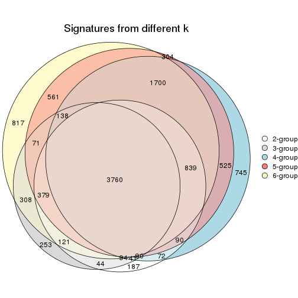

`get_signature()` returns a data frame invisibly. TO get the list of signatures, the function
call should be assigned to a variable explicitly. In following code, if `plot` argument is set
to `FALSE`, no heatmap is plotted while only the differential analysis is performed.

```r
# code only for demonstration
tb = get_signature(res, k = ..., plot = FALSE)
```

An example of the output of `tb` is:

```
#>   which_row         fdr    mean_1    mean_2 scaled_mean_1 scaled_mean_2 km
#> 1        38 0.042760348  8.373488  9.131774    -0.5533452     0.5164555  1
#> 2        40 0.018707592  7.106213  8.469186    -0.6173731     0.5762149  1
#> 3        55 0.019134737 10.221463 11.207825    -0.6159697     0.5749050  1
#> 4        59 0.006059896  5.921854  7.869574    -0.6899429     0.6439467  1
#> 5        60 0.018055526  8.928898 10.211722    -0.6204761     0.5791110  1
#> 6        98 0.009384629 15.714769 14.887706     0.6635654    -0.6193277  2
...
```

The columns in `tb` are:

1. `which_row`: row indices corresponding to the input matrix.
2. `fdr`: FDR for the differential test. 
3. `mean_x`: The mean value in group x.
4. `scaled_mean_x`: The mean value in group x after rows are scaled.
5. `km`: Row groups if k-means clustering is applied to rows.


UMAP plot which shows how samples are separated.


<script>
$( function() {
	$( '#tabs-ATC-hclust-dimension-reduction' ).tabs();
} );
</script>
<div id='tabs-ATC-hclust-dimension-reduction'>
<ul>
<li><a href='#tab-ATC-hclust-dimension-reduction-1'>k = 2</a></li>
<li><a href='#tab-ATC-hclust-dimension-reduction-2'>k = 3</a></li>
<li><a href='#tab-ATC-hclust-dimension-reduction-3'>k = 4</a></li>
<li><a href='#tab-ATC-hclust-dimension-reduction-4'>k = 5</a></li>
<li><a href='#tab-ATC-hclust-dimension-reduction-5'>k = 6</a></li>
</ul>
<div id='tab-ATC-hclust-dimension-reduction-1'>
<pre><code class="r">dimension_reduction(res, k = 2, method = &quot;UMAP&quot;)
</code></pre>

<p></p>

</div>
<div id='tab-ATC-hclust-dimension-reduction-2'>
<pre><code class="r">dimension_reduction(res, k = 3, method = &quot;UMAP&quot;)
</code></pre>

<p></p>

</div>
<div id='tab-ATC-hclust-dimension-reduction-3'>
<pre><code class="r">dimension_reduction(res, k = 4, method = &quot;UMAP&quot;)
</code></pre>

<p></p>

</div>
<div id='tab-ATC-hclust-dimension-reduction-4'>
<pre><code class="r">dimension_reduction(res, k = 5, method = &quot;UMAP&quot;)
</code></pre>

<p>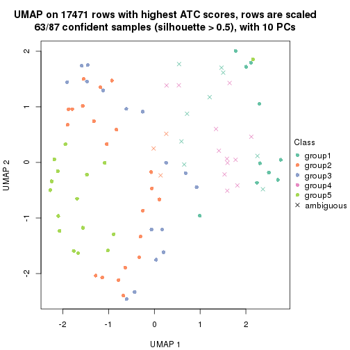</p>

</div>
<div id='tab-ATC-hclust-dimension-reduction-5'>
<pre><code class="r">dimension_reduction(res, k = 6, method = &quot;UMAP&quot;)
</code></pre>

<p></p>

</div>
</div>


Following heatmap shows how subgroups are split when increasing `k`:

```r
collect_classes(res)
```


If matrix rows can be associated to genes, consider to use `functional_enrichment(res,
...)` to perform function enrichment for the signature genes. See [this vignette](http://bioconductor.org/packages/devel/bioc/vignettes/cola/inst/doc/functional_enrichment.html) for more detailed explanations.


 

---------------------------------------------------


### ATC:kmeans


The object with results only for a single top-value method and a single partition method 
can be extracted as:

```r
res = res_list["ATC", "kmeans"]
# you can also extract it by
# res = res_list["ATC:kmeans"]
```

A summary of `res` and all the functions that can be applied to it:

```r
res
```

```
#> A 'ConsensusPartition' object with k = 2, 3, 4, 5, 6.
#>   On a matrix with 17471 rows and 87 columns.
#>   Top rows (1000, 2000, 3000, 4000, 5000) are extracted by 'ATC' method.
#>   Subgroups are detected by 'kmeans' method.
#>   Performed in total 1250 partitions by row resampling.
#>   Best k for subgroups seems to be 3.
#> 
#> Following methods can be applied to this 'ConsensusPartition' object:
#>  [1] "cola_report"             "collect_classes"         "collect_plots"          
#>  [4] "collect_stats"           "colnames"                "compare_signatures"     
#>  [7] "consensus_heatmap"       "dimension_reduction"     "functional_enrichment"  
#> [10] "get_anno_col"            "get_anno"                "get_classes"            
#> [13] "get_consensus"           "get_matrix"              "get_membership"         
#> [16] "get_param"               "get_signatures"          "get_stats"              
#> [19] "is_best_k"               "is_stable_k"             "membership_heatmap"     
#> [22] "ncol"                    "nrow"                    "plot_ecdf"              
#> [25] "rownames"                "select_partition_number" "show"                   
#> [28] "suggest_best_k"          "test_to_known_factors"
```

`collect_plots()` function collects all the plots made from `res` for all `k` (number of partitions)
into one single page to provide an easy and fast comparison between different `k`.

```r
collect_plots(res)
```


The plots are:

- The first row: a plot of the ECDF (empirical cumulative distribution
  function) curves of the consensus matrix for each `k` and the heatmap of
  predicted classes for each `k`.
- The second row: heatmaps of the consensus matrix for each `k`.
- The third row: heatmaps of the membership matrix for each `k`.
- The fouth row: heatmaps of the signatures for each `k`.

All the plots in panels can be made by individual functions and they are
plotted later in this section.

`select_partition_number()` produces several plots showing different
statistics for choosing "optimized" `k`. There are following statistics:

- ECDF curves of the consensus matrix for each `k`;
- 1-PAC. [The PAC
  score](https://en.wikipedia.org/wiki/Consensus_clustering#Over-interpretation_potential_of_consensus_clustering)
  measures the proportion of the ambiguous subgrouping.
- Mean silhouette score.
- Concordance. The mean probability of fiting the consensus class ids in all
  partitions.
- Area increased. Denote $A_k$ as the area under the ECDF curve for current
  `k`, the area increased is defined as $A_k - A_{k-1}$.
- Rand index. The percent of pairs of samples that are both in a same cluster
  or both are not in a same cluster in the partition of k and k-1.
- Jaccard index. The ratio of pairs of samples are both in a same cluster in
  the partition of k and k-1 and the pairs of samples are both in a same
  cluster in the partition k or k-1.

The detailed explanations of these statistics can be found in [the _cola_
vignette](http://bioconductor.org/packages/devel/bioc/vignettes/cola/inst/doc/cola.html#toc_13).

Generally speaking, lower PAC score, higher mean silhouette score or higher
concordance corresponds to better partition. Rand index and Jaccard index
measure how similar the current partition is compared to partition with `k-1`.
If they are too similar, we won't accept `k` is better than `k-1`.

```r
select_partition_number(res)
```


The numeric values for all these statistics can be obtained by `get_stats()`.

```r
get_stats(res)
```

```
#>   k 1-PAC mean_silhouette concordance area_increased  Rand Jaccard
#> 2 2 0.656           0.819       0.919         0.4366 0.543   0.543
#> 3 3 0.837           0.918       0.948         0.4504 0.603   0.393
#> 4 4 0.753           0.755       0.884         0.1449 0.836   0.586
#> 5 5 0.645           0.623       0.785         0.0787 0.854   0.544
#> 6 6 0.661           0.467       0.659         0.0508 0.844   0.466
```

`suggest_best_k()` suggests the best $k$ based on these statistics. The rules are as follows:

- All $k$ with Jaccard index larger than 0.95 are removed because increasing
  $k$ does not provide enough extra information. If all $k$ are removed, it is
  marked as no subgroup is detected.
- For all $k$ with 1-PAC score larger than 0.9, the maximal $k$ is taken as
  the best $k$, and other $k$ are marked as optional $k$.
- If it does not fit the second rule. The $k$ with the maximal vote of the
  highest 1-PAC score, highest mean silhouette, and highest concordance is
  taken as the best $k$.

```r
suggest_best_k(res)
```

```
#> [1] 3
```


Following shows the table of the partitions (You need to click the **show/hide
code output** link to see it). The membership matrix (columns with name `p*`)
is inferred by
[`clue::cl_consensus()`](https://www.rdocumentation.org/link/cl_consensus?package=clue)
function with the `SE` method. Basically the value in the membership matrix
represents the probability to belong to a certain group. The finall class
label for an item is determined with the group with highest probability it
belongs to.

In `get_classes()` function, the entropy is calculated from the membership
matrix and the silhouette score is calculated from the consensus matrix.


<script>
$( function() {
	$( '#tabs-ATC-kmeans-get-classes' ).tabs();
} );
</script>
<div id='tabs-ATC-kmeans-get-classes'>
<ul>
<li><a href='#tab-ATC-kmeans-get-classes-1'>k = 2</a></li>
<li><a href='#tab-ATC-kmeans-get-classes-2'>k = 3</a></li>
<li><a href='#tab-ATC-kmeans-get-classes-3'>k = 4</a></li>
<li><a href='#tab-ATC-kmeans-get-classes-4'>k = 5</a></li>
<li><a href='#tab-ATC-kmeans-get-classes-5'>k = 6</a></li>
</ul>

<div id='tab-ATC-kmeans-get-classes-1'>
<p><a id='tab-ATC-kmeans-get-classes-1-a' style='color:#0366d6' href='#'>show/hide code output</a></p>
<pre><code class="r">cbind(get_classes(res, k = 2), get_membership(res, k = 2))
</code></pre>

<pre><code>#&gt;                                      class entropy silhouette    p1    p2
#&gt; E6088A41-B0DC-4FBF-8D14-BE78024CF8CD     2   0.000      0.837 0.000 1.000
#&gt; F569915C-8F77-4D67-9730-30824DB57EE5     1   0.000      0.937 1.000 0.000
#&gt; E3B71CB7-673B-4741-8607-4F0A11633036     1   0.662      0.749 0.828 0.172
#&gt; DAF84798-FE3F-403C-B589-7F256AF752BE     1   0.000      0.937 1.000 0.000
#&gt; 2F38E3B1-4975-4877-9DCC-C00270602180     1   0.000      0.937 1.000 0.000
#&gt; C79A4C2F-02C4-4C03-A5A5-DE06802EEB57     1   0.653      0.768 0.832 0.168
#&gt; 92E3ED8F-5C74-4ED2-9B03-9FA5E7B491D6     2   0.000      0.837 0.000 1.000
#&gt; E61D60BE-3BD3-4B5E-BC12-80F3684A0959     1   0.000      0.937 1.000 0.000
#&gt; C9388FC7-DB1D-4416-BC2D-EA643584F1E6     2   0.985      0.417 0.428 0.572
#&gt; D4219360-6344-4AF3-ACEB-1701A9F1F67D     1   0.000      0.937 1.000 0.000
#&gt; 07D155E6-F27C-4D09-B786-8A9B71147B72     1   0.000      0.937 1.000 0.000
#&gt; 10C8C361-85A5-40E8-A395-B92623E6F27C     2   0.932      0.557 0.348 0.652
#&gt; BDF20891-7C98-4A55-BBF3-8A836BE303C6     1   0.443      0.866 0.908 0.092
#&gt; 694B0504-095E-431A-84F2-B4387072138E     2   0.936      0.551 0.352 0.648
#&gt; EDCF8E7F-8B1D-46F7-8AE0-84A1DC9647D2     1   0.373      0.884 0.928 0.072
#&gt; 0EA8288E-824D-4304-A053-5A833361F5C5     2   0.000      0.837 0.000 1.000
#&gt; C4ACCFA1-34A9-4F61-8A1F-35B3B60EA193     1   0.000      0.937 1.000 0.000
#&gt; 760BA639-38AC-4BC9-9647-09F6893EA8ED     1   0.662      0.749 0.828 0.172
#&gt; 082DFC6B-C6E6-48B9-BDE5-74FF3B3DC954     2   0.795      0.693 0.240 0.760
#&gt; FE349848-D7C4-4C49-B670-0E20454DDD7E     1   0.000      0.937 1.000 0.000
#&gt; 2E8937B3-9EA1-4528-8CEE-BF3D4137908A     1   0.000      0.937 1.000 0.000
#&gt; 9942D04E-2767-4E39-BA16-7762EAC3DFC4     2   0.000      0.837 0.000 1.000
#&gt; F9C23182-91C4-4145-AE52-526FE8EB199D     1   0.000      0.937 1.000 0.000
#&gt; 01024EED-7811-4E24-A067-8E0B978FFE2D     1   0.000      0.937 1.000 0.000
#&gt; 932C8E98-A352-409C-8744-3D49FABCE425     1   0.000      0.937 1.000 0.000
#&gt; 6DFD9439-C659-4936-84E5-108F717E3E4D     1   0.000      0.937 1.000 0.000
#&gt; 1D8B83B8-5DD7-4F45-9D59-487EC6906A8B     2   0.000      0.837 0.000 1.000
#&gt; 804B8503-73F6-42DE-835F-39DE2C9F13E1     1   0.416      0.874 0.916 0.084
#&gt; B9453C9B-84D5-43BD-85BB-1780F02F039C     1   0.662      0.749 0.828 0.172
#&gt; 836E6CD6-4E88-4028-9844-FA3C892C254A     2   0.000      0.837 0.000 1.000
#&gt; 36EDD202-A845-4CE7-95D5-A515C471262E     1   0.416      0.874 0.916 0.084
#&gt; 181C156A-B8F4-4F9D-93AA-6AFBD197644D     1   0.000      0.937 1.000 0.000
#&gt; 0580E798-6A98-4E46-AC96-9A869DFF502E     1   0.000      0.937 1.000 0.000
#&gt; EA1B63CF-D389-4567-8D9E-B0EF1F804598     2   0.909      0.583 0.324 0.676
#&gt; 5ABC3D06-B8E9-4831-B89B-7C1EC4006B47     2   0.000      0.837 0.000 1.000
#&gt; 1CC01E74-A7C1-4A51-9E28-1703C352BE16     2   0.000      0.837 0.000 1.000
#&gt; 97E55B75-DBDB-46BC-9E74-7828C070BF16     2   0.000      0.837 0.000 1.000
#&gt; BEB37A2D-E8B0-4674-89AC-DC0F34E0AFD6     1   0.000      0.937 1.000 0.000
#&gt; 558648BA-6551-4D34-97C2-AD5F677D63FB     1   0.000      0.937 1.000 0.000
#&gt; FF7021BB-414B-4466-BC43-372D856E6A1D     2   0.000      0.837 0.000 1.000
#&gt; 9C04B840-54E0-425D-BDBE-8CB6B9C2C722     1   0.000      0.937 1.000 0.000
#&gt; 5F50B1F4-1A02-4506-AA6D-9BF21CD8059A     1   0.000      0.937 1.000 0.000
#&gt; 7D4B8FF3-7977-4ABD-AE04-EED1C50B23CC     1   0.000      0.937 1.000 0.000
#&gt; A005AF15-B98E-4623-8AD4-1E69EFA9BC7A     1   0.000      0.937 1.000 0.000
#&gt; 1DF04345-5C93-4B18-B307-8D1FCA532999     1   0.946      0.319 0.636 0.364
#&gt; 6AF30C18-347E-41ED-A4AB-6F81F42206C5     1   0.000      0.937 1.000 0.000
#&gt; 88A44ED0-BDE1-401E-B0E1-D8C8D6DBAEFC     2   0.000      0.837 0.000 1.000
#&gt; 117673A3-2918-4702-8583-B66ADE6E4338     2   0.999      0.266 0.484 0.516
#&gt; 4903A571-E14D-43C9-A737-22CAFAC414CD     1   0.000      0.937 1.000 0.000
#&gt; C175E68E-632A-4B4A-9DDB-4895C4760F20     2   0.936      0.551 0.352 0.648
#&gt; FA5CA2F4-A1AD-4A79-B8F3-73A976EB2FB1     2   0.966      0.491 0.392 0.608
#&gt; E1F883A7-8B1F-4C1D-8A1A-9749A9C09845     1   0.000      0.937 1.000 0.000
#&gt; E74F0729-6000-4908-ADB0-7BDBAC0639E6     1   0.662      0.749 0.828 0.172
#&gt; F92135A9-1981-4C79-99A5-4243EEC5D30D     1   0.430      0.870 0.912 0.088
#&gt; 73C6919F-DEB4-4DA4-B4AE-4032AC8F96C5     1   0.000      0.937 1.000 0.000
#&gt; 33977B40-2E92-48B6-8D3A-3EBE913F6F8A     1   0.000      0.937 1.000 0.000
#&gt; 490BD607-2F08-4B4C-9612-F9BB5CBBC8BB     1   0.430      0.870 0.912 0.088
#&gt; 6C666E17-2EB8-4244-BCC1-8DD34EE4173E     1   0.000      0.937 1.000 0.000
#&gt; C41F3064-4483-4796-B860-82155BAA5157     1   0.000      0.937 1.000 0.000
#&gt; F4232B90-51B9-43EE-9971-35B3A318758F     1   0.000      0.937 1.000 0.000
#&gt; 291EA1F6-FC56-4429-A433-0C452A6A514C     2   0.992      0.367 0.448 0.552
#&gt; CC4AF04D-CB8E-40DD-B12E-7AA39B38262A     2   0.000      0.837 0.000 1.000
#&gt; 4DAE26B9-AB57-4763-BB9A-2ADDD5D9C007     1   0.000      0.937 1.000 0.000
#&gt; 676B4AEE-FB41-4C16-AA91-03E4A1DA8E26     2   0.000      0.837 0.000 1.000
#&gt; 1CC36859-357A-49E0-A367-4F57D47288BA     1   0.000      0.937 1.000 0.000
#&gt; 7CCDDFC8-6DF6-4734-96AC-19EBC464FC50     2   0.000      0.837 0.000 1.000
#&gt; 10F38C34-3956-48ED-AB62-3439EF00D46B     2   0.990      0.388 0.440 0.560
#&gt; 80B2B393-9D6E-45B4-B696-2A5C203543B7     1   0.936      0.358 0.648 0.352
#&gt; 5AC7B5EA-1AAC-4529-8E5A-F612E5E0719A     2   0.000      0.837 0.000 1.000
#&gt; 3648E98D-4B3A-41B7-BE05-595D44F0150D     2   0.000      0.837 0.000 1.000
#&gt; 252EC850-6026-473B-8FFC-2CF567EF42E4     1   0.000      0.937 1.000 0.000
#&gt; 1790E7A3-99D8-447E-BC50-51C8A4A18853     1   0.949      0.306 0.632 0.368
#&gt; DA61A4F8-350B-4DD1-A240-AD016520DB5B     1   0.416      0.874 0.916 0.084
#&gt; 767E5BAF-2515-40D7-AE7D-0B24D77A03F4     1   0.000      0.937 1.000 0.000
#&gt; 8CB9C903-D749-44EA-9137-7FB5A92C5932     2   0.000      0.837 0.000 1.000
#&gt; A9B968AE-2243-41BC-852A-3A12C1FB4892     1   0.000      0.937 1.000 0.000
#&gt; 3C582264-85BC-4569-A888-8EB3008E5198     2   0.625      0.746 0.156 0.844
#&gt; F4EAF9A2-9938-4D9B-9080-C0A7542D5704     2   0.000      0.837 0.000 1.000
#&gt; 328499D3-45DD-4B66-BD22-3C52BA92C2BB     1   0.662      0.749 0.828 0.172
#&gt; AF8AB83D-2917-4752-8C38-CF84C565B565     1   0.000      0.937 1.000 0.000
#&gt; 03A327CA-A9FE-42A4-844D-CA85206969FC     1   0.000      0.937 1.000 0.000
#&gt; 4B0BEC44-87BB-4014-9A26-3529DD63760B     1   0.000      0.937 1.000 0.000
#&gt; 05C7843E-DC89-4D8E-A78A-952C5DFD667B     1   0.000      0.937 1.000 0.000
#&gt; 29A0FFF9-13D3-4D16-BE6A-8E48A2C4E315     1   0.000      0.937 1.000 0.000
#&gt; 22947CC3-4F42-4F44-899C-2B7085E36C9D     2   0.891      0.621 0.308 0.692
#&gt; A247D92D-253A-4BEC-B450-184AF90D17D0     1   0.430      0.870 0.912 0.088
#&gt; 0D907A63-D23F-4684-80D9-0BA552435B86     1   0.000      0.937 1.000 0.000
</code></pre>

<script>
$('#tab-ATC-kmeans-get-classes-1-a').parent().next().next().hide();
$('#tab-ATC-kmeans-get-classes-1-a').click(function(){
  $('#tab-ATC-kmeans-get-classes-1-a').parent().next().next().toggle();
  return(false);
});
</script>
</div>

<div id='tab-ATC-kmeans-get-classes-2'>
<p><a id='tab-ATC-kmeans-get-classes-2-a' style='color:#0366d6' href='#'>show/hide code output</a></p>
<pre><code class="r">cbind(get_classes(res, k = 3), get_membership(res, k = 3))
</code></pre>

<pre><code>#&gt;                                      class entropy silhouette    p1    p2    p3
#&gt; E6088A41-B0DC-4FBF-8D14-BE78024CF8CD     3  0.0747      0.992 0.000 0.016 0.984
#&gt; F569915C-8F77-4D67-9730-30824DB57EE5     2  0.3482      0.869 0.128 0.872 0.000
#&gt; E3B71CB7-673B-4741-8607-4F0A11633036     1  0.2804      0.910 0.924 0.060 0.016
#&gt; DAF84798-FE3F-403C-B589-7F256AF752BE     1  0.1163      0.931 0.972 0.028 0.000
#&gt; 2F38E3B1-4975-4877-9DCC-C00270602180     1  0.0000      0.924 1.000 0.000 0.000
#&gt; C79A4C2F-02C4-4C03-A5A5-DE06802EEB57     2  0.0592      0.940 0.012 0.988 0.000
#&gt; 92E3ED8F-5C74-4ED2-9B03-9FA5E7B491D6     3  0.0747      0.975 0.016 0.000 0.984
#&gt; E61D60BE-3BD3-4B5E-BC12-80F3684A0959     1  0.1163      0.931 0.972 0.028 0.000
#&gt; C9388FC7-DB1D-4416-BC2D-EA643584F1E6     2  0.1267      0.935 0.004 0.972 0.024
#&gt; D4219360-6344-4AF3-ACEB-1701A9F1F67D     1  0.2269      0.917 0.944 0.040 0.016
#&gt; 07D155E6-F27C-4D09-B786-8A9B71147B72     1  0.1163      0.931 0.972 0.028 0.000
#&gt; 10C8C361-85A5-40E8-A395-B92623E6F27C     1  0.4731      0.845 0.840 0.128 0.032
#&gt; BDF20891-7C98-4A55-BBF3-8A836BE303C6     2  0.0592      0.940 0.012 0.988 0.000
#&gt; 694B0504-095E-431A-84F2-B4387072138E     1  0.4931      0.833 0.828 0.140 0.032
#&gt; EDCF8E7F-8B1D-46F7-8AE0-84A1DC9647D2     2  0.0424      0.941 0.008 0.992 0.000
#&gt; 0EA8288E-824D-4304-A053-5A833361F5C5     3  0.0000      0.986 0.000 0.000 1.000
#&gt; C4ACCFA1-34A9-4F61-8A1F-35B3B60EA193     1  0.1031      0.930 0.976 0.024 0.000
#&gt; 760BA639-38AC-4BC9-9647-09F6893EA8ED     1  0.2804      0.910 0.924 0.060 0.016
#&gt; 082DFC6B-C6E6-48B9-BDE5-74FF3B3DC954     2  0.1163      0.934 0.000 0.972 0.028
#&gt; FE349848-D7C4-4C49-B670-0E20454DDD7E     1  0.5327      0.639 0.728 0.272 0.000
#&gt; 2E8937B3-9EA1-4528-8CEE-BF3D4137908A     2  0.0424      0.940 0.008 0.992 0.000
#&gt; 9942D04E-2767-4E39-BA16-7762EAC3DFC4     3  0.0747      0.992 0.000 0.016 0.984
#&gt; F9C23182-91C4-4145-AE52-526FE8EB199D     2  0.1031      0.939 0.024 0.976 0.000
#&gt; 01024EED-7811-4E24-A067-8E0B978FFE2D     2  0.2448      0.905 0.076 0.924 0.000
#&gt; 932C8E98-A352-409C-8744-3D49FABCE425     1  0.1163      0.931 0.972 0.028 0.000
#&gt; 6DFD9439-C659-4936-84E5-108F717E3E4D     2  0.4842      0.758 0.224 0.776 0.000
#&gt; 1D8B83B8-5DD7-4F45-9D59-487EC6906A8B     3  0.0747      0.992 0.000 0.016 0.984
#&gt; 804B8503-73F6-42DE-835F-39DE2C9F13E1     2  0.0000      0.942 0.000 1.000 0.000
#&gt; B9453C9B-84D5-43BD-85BB-1780F02F039C     1  0.2902      0.908 0.920 0.064 0.016
#&gt; 836E6CD6-4E88-4028-9844-FA3C892C254A     3  0.0000      0.986 0.000 0.000 1.000
#&gt; 36EDD202-A845-4CE7-95D5-A515C471262E     2  0.0000      0.942 0.000 1.000 0.000
#&gt; 181C156A-B8F4-4F9D-93AA-6AFBD197644D     2  0.2356      0.914 0.072 0.928 0.000
#&gt; 0580E798-6A98-4E46-AC96-9A869DFF502E     1  0.1163      0.931 0.972 0.028 0.000
#&gt; EA1B63CF-D389-4567-8D9E-B0EF1F804598     2  0.3690      0.875 0.100 0.884 0.016
#&gt; 5ABC3D06-B8E9-4831-B89B-7C1EC4006B47     3  0.0747      0.992 0.000 0.016 0.984
#&gt; 1CC01E74-A7C1-4A51-9E28-1703C352BE16     3  0.0747      0.992 0.000 0.016 0.984
#&gt; 97E55B75-DBDB-46BC-9E74-7828C070BF16     2  0.5138      0.666 0.000 0.748 0.252
#&gt; BEB37A2D-E8B0-4674-89AC-DC0F34E0AFD6     1  0.1031      0.930 0.976 0.024 0.000
#&gt; 558648BA-6551-4D34-97C2-AD5F677D63FB     1  0.2448      0.920 0.924 0.076 0.000
#&gt; FF7021BB-414B-4466-BC43-372D856E6A1D     3  0.0747      0.992 0.000 0.016 0.984
#&gt; 9C04B840-54E0-425D-BDBE-8CB6B9C2C722     2  0.0747      0.938 0.016 0.984 0.000
#&gt; 5F50B1F4-1A02-4506-AA6D-9BF21CD8059A     1  0.1163      0.931 0.972 0.028 0.000
#&gt; 7D4B8FF3-7977-4ABD-AE04-EED1C50B23CC     2  0.2356      0.908 0.072 0.928 0.000
#&gt; A005AF15-B98E-4623-8AD4-1E69EFA9BC7A     1  0.1163      0.931 0.972 0.028 0.000
#&gt; 1DF04345-5C93-4B18-B307-8D1FCA532999     2  0.0747      0.939 0.000 0.984 0.016
#&gt; 6AF30C18-347E-41ED-A4AB-6F81F42206C5     1  0.0000      0.924 1.000 0.000 0.000
#&gt; 88A44ED0-BDE1-401E-B0E1-D8C8D6DBAEFC     2  0.1529      0.928 0.000 0.960 0.040
#&gt; 117673A3-2918-4702-8583-B66ADE6E4338     2  0.0592      0.940 0.012 0.988 0.000
#&gt; 4903A571-E14D-43C9-A737-22CAFAC414CD     1  0.1163      0.931 0.972 0.028 0.000
#&gt; C175E68E-632A-4B4A-9DDB-4895C4760F20     1  0.4731      0.845 0.840 0.128 0.032
#&gt; FA5CA2F4-A1AD-4A79-B8F3-73A976EB2FB1     2  0.1163      0.934 0.000 0.972 0.028
#&gt; E1F883A7-8B1F-4C1D-8A1A-9749A9C09845     2  0.3816      0.851 0.148 0.852 0.000
#&gt; E74F0729-6000-4908-ADB0-7BDBAC0639E6     1  0.2804      0.910 0.924 0.060 0.016
#&gt; F92135A9-1981-4C79-99A5-4243EEC5D30D     2  0.0000      0.942 0.000 1.000 0.000
#&gt; 73C6919F-DEB4-4DA4-B4AE-4032AC8F96C5     1  0.1163      0.931 0.972 0.028 0.000
#&gt; 33977B40-2E92-48B6-8D3A-3EBE913F6F8A     1  0.2448      0.920 0.924 0.076 0.000
#&gt; 490BD607-2F08-4B4C-9612-F9BB5CBBC8BB     2  0.0000      0.942 0.000 1.000 0.000
#&gt; 6C666E17-2EB8-4244-BCC1-8DD34EE4173E     2  0.0747      0.938 0.016 0.984 0.000
#&gt; C41F3064-4483-4796-B860-82155BAA5157     1  0.1163      0.931 0.972 0.028 0.000
#&gt; F4232B90-51B9-43EE-9971-35B3A318758F     1  0.0747      0.929 0.984 0.016 0.000
#&gt; 291EA1F6-FC56-4429-A433-0C452A6A514C     2  0.0747      0.939 0.000 0.984 0.016
#&gt; CC4AF04D-CB8E-40DD-B12E-7AA39B38262A     3  0.0747      0.992 0.000 0.016 0.984
#&gt; 4DAE26B9-AB57-4763-BB9A-2ADDD5D9C007     1  0.1163      0.931 0.972 0.028 0.000
#&gt; 676B4AEE-FB41-4C16-AA91-03E4A1DA8E26     3  0.0747      0.992 0.000 0.016 0.984
#&gt; 1CC36859-357A-49E0-A367-4F57D47288BA     1  0.5363      0.631 0.724 0.276 0.000
#&gt; 7CCDDFC8-6DF6-4734-96AC-19EBC464FC50     2  0.1163      0.934 0.000 0.972 0.028
#&gt; 10F38C34-3956-48ED-AB62-3439EF00D46B     2  0.0892      0.937 0.000 0.980 0.020
#&gt; 80B2B393-9D6E-45B4-B696-2A5C203543B7     2  0.0747      0.939 0.000 0.984 0.016
#&gt; 5AC7B5EA-1AAC-4529-8E5A-F612E5E0719A     3  0.0747      0.992 0.000 0.016 0.984
#&gt; 3648E98D-4B3A-41B7-BE05-595D44F0150D     3  0.0747      0.975 0.016 0.000 0.984
#&gt; 252EC850-6026-473B-8FFC-2CF567EF42E4     1  0.2356      0.921 0.928 0.072 0.000
#&gt; 1790E7A3-99D8-447E-BC50-51C8A4A18853     2  0.0747      0.939 0.000 0.984 0.016
#&gt; DA61A4F8-350B-4DD1-A240-AD016520DB5B     2  0.0000      0.942 0.000 1.000 0.000
#&gt; 767E5BAF-2515-40D7-AE7D-0B24D77A03F4     2  0.2711      0.898 0.088 0.912 0.000
#&gt; 8CB9C903-D749-44EA-9137-7FB5A92C5932     3  0.0000      0.986 0.000 0.000 1.000
#&gt; A9B968AE-2243-41BC-852A-3A12C1FB4892     1  0.2625      0.920 0.916 0.084 0.000
#&gt; 3C582264-85BC-4569-A888-8EB3008E5198     2  0.1163      0.934 0.000 0.972 0.028
#&gt; F4EAF9A2-9938-4D9B-9080-C0A7542D5704     3  0.0747      0.992 0.000 0.016 0.984
#&gt; 328499D3-45DD-4B66-BD22-3C52BA92C2BB     1  0.2804      0.910 0.924 0.060 0.016
#&gt; AF8AB83D-2917-4752-8C38-CF84C565B565     1  0.2356      0.921 0.928 0.072 0.000
#&gt; 03A327CA-A9FE-42A4-844D-CA85206969FC     2  0.3816      0.851 0.148 0.852 0.000
#&gt; 4B0BEC44-87BB-4014-9A26-3529DD63760B     2  0.0747      0.938 0.016 0.984 0.000
#&gt; 05C7843E-DC89-4D8E-A78A-952C5DFD667B     2  0.5363      0.673 0.276 0.724 0.000
#&gt; 29A0FFF9-13D3-4D16-BE6A-8E48A2C4E315     2  0.2796      0.896 0.092 0.908 0.000
#&gt; 22947CC3-4F42-4F44-899C-2B7085E36C9D     2  0.1163      0.934 0.000 0.972 0.028
#&gt; A247D92D-253A-4BEC-B450-184AF90D17D0     2  0.0000      0.942 0.000 1.000 0.000
#&gt; 0D907A63-D23F-4684-80D9-0BA552435B86     1  0.1163      0.931 0.972 0.028 0.000
</code></pre>

<script>
$('#tab-ATC-kmeans-get-classes-2-a').parent().next().next().hide();
$('#tab-ATC-kmeans-get-classes-2-a').click(function(){
  $('#tab-ATC-kmeans-get-classes-2-a').parent().next().next().toggle();
  return(false);
});
</script>
</div>

<div id='tab-ATC-kmeans-get-classes-3'>
<p><a id='tab-ATC-kmeans-get-classes-3-a' style='color:#0366d6' href='#'>show/hide code output</a></p>
<pre><code class="r">cbind(get_classes(res, k = 4), get_membership(res, k = 4))
</code></pre>

<pre><code>#&gt;                                      class entropy silhouette    p1    p2    p3    p4
#&gt; E6088A41-B0DC-4FBF-8D14-BE78024CF8CD     3  0.0000      0.927 0.000 0.000 1.000 0.000
#&gt; F569915C-8F77-4D67-9730-30824DB57EE5     4  0.4277      0.545 0.000 0.280 0.000 0.720
#&gt; E3B71CB7-673B-4741-8607-4F0A11633036     1  0.0592      0.722 0.984 0.000 0.000 0.016
#&gt; DAF84798-FE3F-403C-B589-7F256AF752BE     4  0.0707      0.776 0.020 0.000 0.000 0.980
#&gt; 2F38E3B1-4975-4877-9DCC-C00270602180     1  0.4679      0.553 0.648 0.000 0.000 0.352
#&gt; C79A4C2F-02C4-4C03-A5A5-DE06802EEB57     2  0.1042      0.936 0.008 0.972 0.000 0.020
#&gt; 92E3ED8F-5C74-4ED2-9B03-9FA5E7B491D6     3  0.4967      0.354 0.452 0.000 0.548 0.000
#&gt; E61D60BE-3BD3-4B5E-BC12-80F3684A0959     4  0.1022      0.776 0.032 0.000 0.000 0.968
#&gt; C9388FC7-DB1D-4416-BC2D-EA643584F1E6     2  0.0895      0.937 0.004 0.976 0.000 0.020
#&gt; D4219360-6344-4AF3-ACEB-1701A9F1F67D     1  0.0592      0.722 0.984 0.000 0.000 0.016
#&gt; 07D155E6-F27C-4D09-B786-8A9B71147B72     4  0.1022      0.776 0.032 0.000 0.000 0.968
#&gt; 10C8C361-85A5-40E8-A395-B92623E6F27C     1  0.0672      0.716 0.984 0.008 0.000 0.008
#&gt; BDF20891-7C98-4A55-BBF3-8A836BE303C6     2  0.1151      0.936 0.008 0.968 0.000 0.024
#&gt; 694B0504-095E-431A-84F2-B4387072138E     1  0.0672      0.716 0.984 0.008 0.000 0.008
#&gt; EDCF8E7F-8B1D-46F7-8AE0-84A1DC9647D2     2  0.1004      0.936 0.004 0.972 0.000 0.024
#&gt; 0EA8288E-824D-4304-A053-5A833361F5C5     3  0.0000      0.927 0.000 0.000 1.000 0.000
#&gt; C4ACCFA1-34A9-4F61-8A1F-35B3B60EA193     4  0.4250      0.486 0.276 0.000 0.000 0.724
#&gt; 760BA639-38AC-4BC9-9647-09F6893EA8ED     1  0.0592      0.722 0.984 0.000 0.000 0.016
#&gt; 082DFC6B-C6E6-48B9-BDE5-74FF3B3DC954     2  0.0895      0.937 0.004 0.976 0.000 0.020
#&gt; FE349848-D7C4-4C49-B670-0E20454DDD7E     4  0.0592      0.771 0.000 0.016 0.000 0.984
#&gt; 2E8937B3-9EA1-4528-8CEE-BF3D4137908A     2  0.0376      0.936 0.004 0.992 0.000 0.004
#&gt; 9942D04E-2767-4E39-BA16-7762EAC3DFC4     3  0.0000      0.927 0.000 0.000 1.000 0.000
#&gt; F9C23182-91C4-4145-AE52-526FE8EB199D     2  0.1151      0.936 0.008 0.968 0.000 0.024
#&gt; 01024EED-7811-4E24-A067-8E0B978FFE2D     2  0.3444      0.769 0.000 0.816 0.000 0.184
#&gt; 932C8E98-A352-409C-8744-3D49FABCE425     4  0.1022      0.776 0.032 0.000 0.000 0.968
#&gt; 6DFD9439-C659-4936-84E5-108F717E3E4D     4  0.3052      0.691 0.004 0.136 0.000 0.860
#&gt; 1D8B83B8-5DD7-4F45-9D59-487EC6906A8B     3  0.0524      0.924 0.008 0.004 0.988 0.000
#&gt; 804B8503-73F6-42DE-835F-39DE2C9F13E1     2  0.0336      0.935 0.000 0.992 0.000 0.008
#&gt; B9453C9B-84D5-43BD-85BB-1780F02F039C     1  0.0336      0.720 0.992 0.000 0.000 0.008
#&gt; 836E6CD6-4E88-4028-9844-FA3C892C254A     3  0.0000      0.927 0.000 0.000 1.000 0.000
#&gt; 36EDD202-A845-4CE7-95D5-A515C471262E     2  0.0336      0.935 0.000 0.992 0.000 0.008
#&gt; 181C156A-B8F4-4F9D-93AA-6AFBD197644D     2  0.3710      0.745 0.192 0.804 0.000 0.004
#&gt; 0580E798-6A98-4E46-AC96-9A869DFF502E     4  0.3311      0.652 0.172 0.000 0.000 0.828
#&gt; EA1B63CF-D389-4567-8D9E-B0EF1F804598     1  0.5510      0.212 0.600 0.376 0.000 0.024
#&gt; 5ABC3D06-B8E9-4831-B89B-7C1EC4006B47     3  0.0000      0.927 0.000 0.000 1.000 0.000
#&gt; 1CC01E74-A7C1-4A51-9E28-1703C352BE16     3  0.5444      0.237 0.016 0.424 0.560 0.000
#&gt; 97E55B75-DBDB-46BC-9E74-7828C070BF16     2  0.1297      0.925 0.016 0.964 0.020 0.000
#&gt; BEB37A2D-E8B0-4674-89AC-DC0F34E0AFD6     4  0.4406      0.408 0.300 0.000 0.000 0.700
#&gt; 558648BA-6551-4D34-97C2-AD5F677D63FB     1  0.4916      0.465 0.576 0.000 0.000 0.424
#&gt; FF7021BB-414B-4466-BC43-372D856E6A1D     3  0.0524      0.924 0.008 0.004 0.988 0.000
#&gt; 9C04B840-54E0-425D-BDBE-8CB6B9C2C722     2  0.0921      0.936 0.000 0.972 0.000 0.028
#&gt; 5F50B1F4-1A02-4506-AA6D-9BF21CD8059A     4  0.1022      0.776 0.032 0.000 0.000 0.968
#&gt; 7D4B8FF3-7977-4ABD-AE04-EED1C50B23CC     2  0.4605      0.548 0.000 0.664 0.000 0.336
#&gt; A005AF15-B98E-4623-8AD4-1E69EFA9BC7A     4  0.3311      0.652 0.172 0.000 0.000 0.828
#&gt; 1DF04345-5C93-4B18-B307-8D1FCA532999     2  0.0524      0.935 0.004 0.988 0.000 0.008
#&gt; 6AF30C18-347E-41ED-A4AB-6F81F42206C5     1  0.4522      0.580 0.680 0.000 0.000 0.320
#&gt; 88A44ED0-BDE1-401E-B0E1-D8C8D6DBAEFC     2  0.1297      0.934 0.016 0.964 0.000 0.020
#&gt; 117673A3-2918-4702-8583-B66ADE6E4338     2  0.1151      0.936 0.008 0.968 0.000 0.024
#&gt; 4903A571-E14D-43C9-A737-22CAFAC414CD     4  0.0336      0.773 0.000 0.008 0.000 0.992
#&gt; C175E68E-632A-4B4A-9DDB-4895C4760F20     1  0.0672      0.716 0.984 0.008 0.000 0.008
#&gt; FA5CA2F4-A1AD-4A79-B8F3-73A976EB2FB1     2  0.0188      0.935 0.000 0.996 0.000 0.004
#&gt; E1F883A7-8B1F-4C1D-8A1A-9749A9C09845     4  0.4193      0.576 0.000 0.268 0.000 0.732
#&gt; E74F0729-6000-4908-ADB0-7BDBAC0639E6     1  0.0592      0.722 0.984 0.000 0.000 0.016
#&gt; F92135A9-1981-4C79-99A5-4243EEC5D30D     2  0.0336      0.935 0.000 0.992 0.000 0.008
#&gt; 73C6919F-DEB4-4DA4-B4AE-4032AC8F96C5     4  0.3649      0.605 0.204 0.000 0.000 0.796
#&gt; 33977B40-2E92-48B6-8D3A-3EBE913F6F8A     1  0.5080      0.474 0.576 0.004 0.000 0.420
#&gt; 490BD607-2F08-4B4C-9612-F9BB5CBBC8BB     2  0.0817      0.936 0.000 0.976 0.000 0.024
#&gt; 6C666E17-2EB8-4244-BCC1-8DD34EE4173E     2  0.3569      0.773 0.000 0.804 0.000 0.196
#&gt; C41F3064-4483-4796-B860-82155BAA5157     4  0.4454      0.386 0.308 0.000 0.000 0.692
#&gt; F4232B90-51B9-43EE-9971-35B3A318758F     1  0.4955      0.432 0.556 0.000 0.000 0.444
#&gt; 291EA1F6-FC56-4429-A433-0C452A6A514C     2  0.0336      0.935 0.000 0.992 0.000 0.008
#&gt; CC4AF04D-CB8E-40DD-B12E-7AA39B38262A     3  0.0188      0.927 0.004 0.000 0.996 0.000
#&gt; 4DAE26B9-AB57-4763-BB9A-2ADDD5D9C007     4  0.1022      0.776 0.032 0.000 0.000 0.968
#&gt; 676B4AEE-FB41-4C16-AA91-03E4A1DA8E26     3  0.0524      0.924 0.008 0.004 0.988 0.000
#&gt; 1CC36859-357A-49E0-A367-4F57D47288BA     4  0.0592      0.771 0.000 0.016 0.000 0.984
#&gt; 7CCDDFC8-6DF6-4734-96AC-19EBC464FC50     2  0.0779      0.931 0.016 0.980 0.000 0.004
#&gt; 10F38C34-3956-48ED-AB62-3439EF00D46B     2  0.0707      0.937 0.000 0.980 0.000 0.020
#&gt; 80B2B393-9D6E-45B4-B696-2A5C203543B7     2  0.0336      0.935 0.000 0.992 0.000 0.008
#&gt; 5AC7B5EA-1AAC-4529-8E5A-F612E5E0719A     3  0.0000      0.927 0.000 0.000 1.000 0.000
#&gt; 3648E98D-4B3A-41B7-BE05-595D44F0150D     3  0.0000      0.927 0.000 0.000 1.000 0.000
#&gt; 252EC850-6026-473B-8FFC-2CF567EF42E4     1  0.4961      0.431 0.552 0.000 0.000 0.448
#&gt; 1790E7A3-99D8-447E-BC50-51C8A4A18853     2  0.0336      0.935 0.000 0.992 0.000 0.008
#&gt; DA61A4F8-350B-4DD1-A240-AD016520DB5B     2  0.0817      0.936 0.000 0.976 0.000 0.024
#&gt; 767E5BAF-2515-40D7-AE7D-0B24D77A03F4     4  0.4661      0.391 0.000 0.348 0.000 0.652
#&gt; 8CB9C903-D749-44EA-9137-7FB5A92C5932     3  0.0000      0.927 0.000 0.000 1.000 0.000
#&gt; A9B968AE-2243-41BC-852A-3A12C1FB4892     1  0.6148      0.318 0.484 0.048 0.000 0.468
#&gt; 3C582264-85BC-4569-A888-8EB3008E5198     2  0.0524      0.933 0.008 0.988 0.000 0.004
#&gt; F4EAF9A2-9938-4D9B-9080-C0A7542D5704     3  0.0336      0.925 0.008 0.000 0.992 0.000
#&gt; 328499D3-45DD-4B66-BD22-3C52BA92C2BB     1  0.0592      0.722 0.984 0.000 0.000 0.016
#&gt; AF8AB83D-2917-4752-8C38-CF84C565B565     1  0.4985      0.383 0.532 0.000 0.000 0.468
#&gt; 03A327CA-A9FE-42A4-844D-CA85206969FC     4  0.3688      0.624 0.000 0.208 0.000 0.792
#&gt; 4B0BEC44-87BB-4014-9A26-3529DD63760B     2  0.3172      0.814 0.000 0.840 0.000 0.160
#&gt; 05C7843E-DC89-4D8E-A78A-952C5DFD667B     4  0.2281      0.725 0.000 0.096 0.000 0.904
#&gt; 29A0FFF9-13D3-4D16-BE6A-8E48A2C4E315     2  0.4888      0.306 0.000 0.588 0.000 0.412
#&gt; 22947CC3-4F42-4F44-899C-2B7085E36C9D     2  0.1042      0.936 0.008 0.972 0.000 0.020
#&gt; A247D92D-253A-4BEC-B450-184AF90D17D0     2  0.0921      0.936 0.000 0.972 0.000 0.028
#&gt; 0D907A63-D23F-4684-80D9-0BA552435B86     4  0.1022      0.776 0.032 0.000 0.000 0.968
</code></pre>

<script>
$('#tab-ATC-kmeans-get-classes-3-a').parent().next().next().hide();
$('#tab-ATC-kmeans-get-classes-3-a').click(function(){
  $('#tab-ATC-kmeans-get-classes-3-a').parent().next().next().toggle();
  return(false);
});
</script>
</div>

<div id='tab-ATC-kmeans-get-classes-4'>
<p><a id='tab-ATC-kmeans-get-classes-4-a' style='color:#0366d6' href='#'>show/hide code output</a></p>
<pre><code class="r">cbind(get_classes(res, k = 5), get_membership(res, k = 5))
</code></pre>

<pre><code>#&gt;                                      class entropy silhouette    p1    p2    p3    p4    p5
#&gt; E6088A41-B0DC-4FBF-8D14-BE78024CF8CD     5  0.0865      0.947 0.004 0.000 0.024 0.000 0.972
#&gt; F569915C-8F77-4D67-9730-30824DB57EE5     3  0.5490      0.634 0.000 0.324 0.592 0.084 0.000
#&gt; E3B71CB7-673B-4741-8607-4F0A11633036     1  0.0963      0.915 0.964 0.000 0.000 0.036 0.000
#&gt; DAF84798-FE3F-403C-B589-7F256AF752BE     4  0.4010      0.597 0.008 0.032 0.176 0.784 0.000
#&gt; 2F38E3B1-4975-4877-9DCC-C00270602180     4  0.2690      0.651 0.156 0.000 0.000 0.844 0.000
#&gt; C79A4C2F-02C4-4C03-A5A5-DE06802EEB57     2  0.2361      0.676 0.012 0.892 0.096 0.000 0.000
#&gt; 92E3ED8F-5C74-4ED2-9B03-9FA5E7B491D6     1  0.4141      0.582 0.728 0.000 0.024 0.000 0.248
#&gt; E61D60BE-3BD3-4B5E-BC12-80F3684A0959     4  0.3452      0.604 0.000 0.000 0.244 0.756 0.000
#&gt; C9388FC7-DB1D-4416-BC2D-EA643584F1E6     2  0.0404      0.664 0.000 0.988 0.012 0.000 0.000
#&gt; D4219360-6344-4AF3-ACEB-1701A9F1F67D     1  0.1792      0.898 0.916 0.000 0.000 0.084 0.000
#&gt; 07D155E6-F27C-4D09-B786-8A9B71147B72     4  0.3366      0.611 0.000 0.000 0.232 0.768 0.000
#&gt; 10C8C361-85A5-40E8-A395-B92623E6F27C     1  0.0613      0.917 0.984 0.004 0.004 0.008 0.000
#&gt; BDF20891-7C98-4A55-BBF3-8A836BE303C6     2  0.1124      0.672 0.004 0.960 0.036 0.000 0.000
#&gt; 694B0504-095E-431A-84F2-B4387072138E     1  0.0727      0.917 0.980 0.004 0.004 0.012 0.000
#&gt; EDCF8E7F-8B1D-46F7-8AE0-84A1DC9647D2     2  0.2074      0.626 0.004 0.920 0.060 0.016 0.000
#&gt; 0EA8288E-824D-4304-A053-5A833361F5C5     5  0.0609      0.947 0.000 0.000 0.020 0.000 0.980
#&gt; C4ACCFA1-34A9-4F61-8A1F-35B3B60EA193     4  0.2079      0.697 0.064 0.000 0.020 0.916 0.000
#&gt; 760BA639-38AC-4BC9-9647-09F6893EA8ED     1  0.1792      0.898 0.916 0.000 0.000 0.084 0.000
#&gt; 082DFC6B-C6E6-48B9-BDE5-74FF3B3DC954     2  0.1792      0.676 0.000 0.916 0.084 0.000 0.000
#&gt; FE349848-D7C4-4C49-B670-0E20454DDD7E     4  0.4829      0.096 0.000 0.020 0.484 0.496 0.000
#&gt; 2E8937B3-9EA1-4528-8CEE-BF3D4137908A     2  0.3949      0.608 0.000 0.668 0.332 0.000 0.000
#&gt; 9942D04E-2767-4E39-BA16-7762EAC3DFC4     5  0.1628      0.941 0.008 0.000 0.056 0.000 0.936
#&gt; F9C23182-91C4-4145-AE52-526FE8EB199D     2  0.2206      0.637 0.004 0.912 0.068 0.016 0.000
#&gt; 01024EED-7811-4E24-A067-8E0B978FFE2D     3  0.3480      0.291 0.000 0.248 0.752 0.000 0.000
#&gt; 932C8E98-A352-409C-8744-3D49FABCE425     4  0.1697      0.689 0.008 0.000 0.060 0.932 0.000
#&gt; 6DFD9439-C659-4936-84E5-108F717E3E4D     3  0.6371      0.578 0.000 0.292 0.508 0.200 0.000
#&gt; 1D8B83B8-5DD7-4F45-9D59-487EC6906A8B     5  0.2074      0.922 0.000 0.036 0.044 0.000 0.920
#&gt; 804B8503-73F6-42DE-835F-39DE2C9F13E1     2  0.4278      0.462 0.000 0.548 0.452 0.000 0.000
#&gt; B9453C9B-84D5-43BD-85BB-1780F02F039C     1  0.1331      0.911 0.952 0.000 0.008 0.040 0.000
#&gt; 836E6CD6-4E88-4028-9844-FA3C892C254A     5  0.1697      0.940 0.008 0.000 0.060 0.000 0.932
#&gt; 36EDD202-A845-4CE7-95D5-A515C471262E     3  0.4304     -0.415 0.000 0.484 0.516 0.000 0.000
#&gt; 181C156A-B8F4-4F9D-93AA-6AFBD197644D     2  0.6848      0.457 0.144 0.516 0.304 0.036 0.000
#&gt; 0580E798-6A98-4E46-AC96-9A869DFF502E     4  0.2707      0.684 0.024 0.000 0.100 0.876 0.000
#&gt; EA1B63CF-D389-4567-8D9E-B0EF1F804598     2  0.5925      0.253 0.260 0.624 0.024 0.092 0.000
#&gt; 5ABC3D06-B8E9-4831-B89B-7C1EC4006B47     5  0.1628      0.941 0.008 0.000 0.056 0.000 0.936
#&gt; 1CC01E74-A7C1-4A51-9E28-1703C352BE16     2  0.6323      0.305 0.000 0.476 0.164 0.000 0.360
#&gt; 97E55B75-DBDB-46BC-9E74-7828C070BF16     2  0.4948      0.604 0.000 0.708 0.184 0.000 0.108
#&gt; BEB37A2D-E8B0-4674-89AC-DC0F34E0AFD6     4  0.2017      0.694 0.080 0.000 0.008 0.912 0.000
#&gt; 558648BA-6551-4D34-97C2-AD5F677D63FB     4  0.7447      0.299 0.272 0.232 0.048 0.448 0.000
#&gt; FF7021BB-414B-4466-BC43-372D856E6A1D     5  0.1522      0.937 0.000 0.012 0.044 0.000 0.944
#&gt; 9C04B840-54E0-425D-BDBE-8CB6B9C2C722     2  0.3741      0.363 0.004 0.732 0.264 0.000 0.000
#&gt; 5F50B1F4-1A02-4506-AA6D-9BF21CD8059A     4  0.3424      0.605 0.000 0.000 0.240 0.760 0.000
#&gt; 7D4B8FF3-7977-4ABD-AE04-EED1C50B23CC     3  0.4937      0.466 0.000 0.428 0.544 0.028 0.000
#&gt; A005AF15-B98E-4623-8AD4-1E69EFA9BC7A     4  0.2669      0.683 0.020 0.000 0.104 0.876 0.000
#&gt; 1DF04345-5C93-4B18-B307-8D1FCA532999     2  0.3837      0.621 0.000 0.692 0.308 0.000 0.000
#&gt; 6AF30C18-347E-41ED-A4AB-6F81F42206C5     4  0.3635      0.551 0.248 0.000 0.004 0.748 0.000
#&gt; 88A44ED0-BDE1-401E-B0E1-D8C8D6DBAEFC     2  0.3734      0.636 0.000 0.812 0.128 0.000 0.060
#&gt; 117673A3-2918-4702-8583-B66ADE6E4338     2  0.1862      0.641 0.004 0.932 0.048 0.016 0.000
#&gt; 4903A571-E14D-43C9-A737-22CAFAC414CD     4  0.4977      0.141 0.000 0.028 0.472 0.500 0.000
#&gt; C175E68E-632A-4B4A-9DDB-4895C4760F20     1  0.2284      0.883 0.896 0.004 0.004 0.096 0.000
#&gt; FA5CA2F4-A1AD-4A79-B8F3-73A976EB2FB1     2  0.3561      0.640 0.000 0.740 0.260 0.000 0.000
#&gt; E1F883A7-8B1F-4C1D-8A1A-9749A9C09845     3  0.4276      0.541 0.000 0.068 0.764 0.168 0.000
#&gt; E74F0729-6000-4908-ADB0-7BDBAC0639E6     1  0.1331      0.911 0.952 0.000 0.008 0.040 0.000
#&gt; F92135A9-1981-4C79-99A5-4243EEC5D30D     2  0.4306      0.386 0.000 0.508 0.492 0.000 0.000
#&gt; 73C6919F-DEB4-4DA4-B4AE-4032AC8F96C5     4  0.2616      0.692 0.036 0.000 0.076 0.888 0.000
#&gt; 33977B40-2E92-48B6-8D3A-3EBE913F6F8A     4  0.7438      0.299 0.264 0.236 0.048 0.452 0.000
#&gt; 490BD607-2F08-4B4C-9612-F9BB5CBBC8BB     2  0.1851      0.637 0.000 0.912 0.088 0.000 0.000
#&gt; 6C666E17-2EB8-4244-BCC1-8DD34EE4173E     2  0.4464     -0.166 0.000 0.584 0.408 0.008 0.000
#&gt; C41F3064-4483-4796-B860-82155BAA5157     4  0.1732      0.693 0.080 0.000 0.000 0.920 0.000
#&gt; F4232B90-51B9-43EE-9971-35B3A318758F     4  0.3177      0.600 0.208 0.000 0.000 0.792 0.000
#&gt; 291EA1F6-FC56-4429-A433-0C452A6A514C     2  0.3661      0.636 0.000 0.724 0.276 0.000 0.000
#&gt; CC4AF04D-CB8E-40DD-B12E-7AA39B38262A     5  0.0794      0.945 0.000 0.000 0.028 0.000 0.972
#&gt; 4DAE26B9-AB57-4763-BB9A-2ADDD5D9C007     4  0.3424      0.607 0.000 0.000 0.240 0.760 0.000
#&gt; 676B4AEE-FB41-4C16-AA91-03E4A1DA8E26     5  0.2446      0.906 0.000 0.044 0.056 0.000 0.900
#&gt; 1CC36859-357A-49E0-A367-4F57D47288BA     3  0.5862      0.264 0.000 0.112 0.544 0.344 0.000
#&gt; 7CCDDFC8-6DF6-4734-96AC-19EBC464FC50     2  0.4891      0.595 0.000 0.640 0.316 0.000 0.044
#&gt; 10F38C34-3956-48ED-AB62-3439EF00D46B     2  0.1282      0.649 0.000 0.952 0.044 0.000 0.004
#&gt; 80B2B393-9D6E-45B4-B696-2A5C203543B7     2  0.3796      0.625 0.000 0.700 0.300 0.000 0.000
#&gt; 5AC7B5EA-1AAC-4529-8E5A-F612E5E0719A     5  0.0510      0.947 0.000 0.000 0.016 0.000 0.984
#&gt; 3648E98D-4B3A-41B7-BE05-595D44F0150D     5  0.1764      0.939 0.008 0.000 0.064 0.000 0.928
#&gt; 252EC850-6026-473B-8FFC-2CF567EF42E4     4  0.6254      0.499 0.236 0.128 0.028 0.608 0.000
#&gt; 1790E7A3-99D8-447E-BC50-51C8A4A18853     2  0.3895      0.619 0.000 0.680 0.320 0.000 0.000
#&gt; DA61A4F8-350B-4DD1-A240-AD016520DB5B     2  0.2068      0.606 0.004 0.904 0.092 0.000 0.000
#&gt; 767E5BAF-2515-40D7-AE7D-0B24D77A03F4     3  0.5420      0.629 0.000 0.332 0.592 0.076 0.000
#&gt; 8CB9C903-D749-44EA-9137-7FB5A92C5932     5  0.1697      0.940 0.008 0.000 0.060 0.000 0.932
#&gt; A9B968AE-2243-41BC-852A-3A12C1FB4892     4  0.6318      0.530 0.172 0.160 0.040 0.628 0.000
#&gt; 3C582264-85BC-4569-A888-8EB3008E5198     2  0.3895      0.619 0.000 0.680 0.320 0.000 0.000
#&gt; F4EAF9A2-9938-4D9B-9080-C0A7542D5704     5  0.1626      0.934 0.000 0.016 0.044 0.000 0.940
#&gt; 328499D3-45DD-4B66-BD22-3C52BA92C2BB     1  0.1043      0.913 0.960 0.000 0.000 0.040 0.000
#&gt; AF8AB83D-2917-4752-8C38-CF84C565B565     4  0.6215      0.503 0.236 0.124 0.028 0.612 0.000
#&gt; 03A327CA-A9FE-42A4-844D-CA85206969FC     3  0.6006      0.587 0.000 0.220 0.584 0.196 0.000
#&gt; 4B0BEC44-87BB-4014-9A26-3529DD63760B     2  0.4270      0.071 0.004 0.656 0.336 0.004 0.000
#&gt; 05C7843E-DC89-4D8E-A78A-952C5DFD667B     3  0.6076      0.532 0.000 0.196 0.572 0.232 0.000
#&gt; 29A0FFF9-13D3-4D16-BE6A-8E48A2C4E315     3  0.3650      0.432 0.000 0.176 0.796 0.028 0.000
#&gt; 22947CC3-4F42-4F44-899C-2B7085E36C9D     2  0.0290      0.663 0.000 0.992 0.008 0.000 0.000
#&gt; A247D92D-253A-4BEC-B450-184AF90D17D0     2  0.1965      0.605 0.000 0.904 0.096 0.000 0.000
#&gt; 0D907A63-D23F-4684-80D9-0BA552435B86     4  0.3424      0.605 0.000 0.000 0.240 0.760 0.000
</code></pre>

<script>
$('#tab-ATC-kmeans-get-classes-4-a').parent().next().next().hide();
$('#tab-ATC-kmeans-get-classes-4-a').click(function(){
  $('#tab-ATC-kmeans-get-classes-4-a').parent().next().next().toggle();
  return(false);
});
</script>
</div>

<div id='tab-ATC-kmeans-get-classes-5'>
<p><a id='tab-ATC-kmeans-get-classes-5-a' style='color:#0366d6' href='#'>show/hide code output</a></p>
<pre><code class="r">cbind(get_classes(res, k = 6), get_membership(res, k = 6))
</code></pre>

<pre><code>#&gt;                                      class entropy silhouette    p1    p2    p3    p4    p5    p6
#&gt; E6088A41-B0DC-4FBF-8D14-BE78024CF8CD     6  0.1074    0.87878 0.000 0.000 0.012 0.000 0.028 0.960
#&gt; F569915C-8F77-4D67-9730-30824DB57EE5     3  0.5612    0.19512 0.000 0.008 0.564 0.272 0.156 0.000
#&gt; E3B71CB7-673B-4741-8607-4F0A11633036     1  0.1908    0.84785 0.900 0.000 0.004 0.000 0.096 0.000
#&gt; DAF84798-FE3F-403C-B589-7F256AF752BE     4  0.6140   -0.09221 0.012 0.000 0.188 0.408 0.392 0.000
#&gt; 2F38E3B1-4975-4877-9DCC-C00270602180     4  0.5035    0.34077 0.084 0.000 0.000 0.556 0.360 0.000
#&gt; C79A4C2F-02C4-4C03-A5A5-DE06802EEB57     2  0.5235   -0.02669 0.016 0.496 0.432 0.000 0.056 0.000
#&gt; 92E3ED8F-5C74-4ED2-9B03-9FA5E7B491D6     1  0.3110    0.70539 0.792 0.000 0.000 0.000 0.012 0.196
#&gt; E61D60BE-3BD3-4B5E-BC12-80F3684A0959     4  0.0146    0.54469 0.000 0.000 0.000 0.996 0.004 0.000
#&gt; C9388FC7-DB1D-4416-BC2D-EA643584F1E6     3  0.5312    0.24031 0.000 0.408 0.504 0.000 0.080 0.008
#&gt; D4219360-6344-4AF3-ACEB-1701A9F1F67D     1  0.2520    0.82089 0.844 0.000 0.004 0.000 0.152 0.000
#&gt; 07D155E6-F27C-4D09-B786-8A9B71147B72     4  0.0937    0.54638 0.000 0.000 0.000 0.960 0.040 0.000
#&gt; 10C8C361-85A5-40E8-A395-B92623E6F27C     1  0.0692    0.85716 0.976 0.000 0.004 0.000 0.020 0.000
#&gt; BDF20891-7C98-4A55-BBF3-8A836BE303C6     3  0.5157    0.31606 0.000 0.360 0.544 0.000 0.096 0.000
#&gt; 694B0504-095E-431A-84F2-B4387072138E     1  0.0777    0.85712 0.972 0.000 0.004 0.000 0.024 0.000
#&gt; EDCF8E7F-8B1D-46F7-8AE0-84A1DC9647D2     3  0.4673    0.43813 0.000 0.272 0.648 0.000 0.080 0.000
#&gt; 0EA8288E-824D-4304-A053-5A833361F5C5     6  0.0717    0.87762 0.000 0.000 0.008 0.000 0.016 0.976
#&gt; C4ACCFA1-34A9-4F61-8A1F-35B3B60EA193     4  0.4201    0.44997 0.036 0.000 0.000 0.664 0.300 0.000
#&gt; 760BA639-38AC-4BC9-9647-09F6893EA8ED     1  0.2631    0.81912 0.840 0.000 0.008 0.000 0.152 0.000
#&gt; 082DFC6B-C6E6-48B9-BDE5-74FF3B3DC954     2  0.5113    0.17635 0.000 0.592 0.332 0.000 0.056 0.020
#&gt; FE349848-D7C4-4C49-B670-0E20454DDD7E     4  0.5012    0.30241 0.000 0.000 0.236 0.632 0.132 0.000
#&gt; 2E8937B3-9EA1-4528-8CEE-BF3D4137908A     2  0.3041    0.60073 0.000 0.832 0.128 0.000 0.040 0.000
#&gt; 9942D04E-2767-4E39-BA16-7762EAC3DFC4     6  0.3176    0.85467 0.000 0.000 0.032 0.000 0.156 0.812
#&gt; F9C23182-91C4-4145-AE52-526FE8EB199D     3  0.4684    0.43015 0.000 0.256 0.656 0.000 0.088 0.000
#&gt; 01024EED-7811-4E24-A067-8E0B978FFE2D     2  0.6752    0.29253 0.000 0.492 0.252 0.088 0.168 0.000
#&gt; 932C8E98-A352-409C-8744-3D49FABCE425     4  0.3360    0.48435 0.004 0.000 0.000 0.732 0.264 0.000
#&gt; 6DFD9439-C659-4936-84E5-108F717E3E4D     3  0.5661    0.07986 0.000 0.004 0.552 0.192 0.252 0.000
#&gt; 1D8B83B8-5DD7-4F45-9D59-487EC6906A8B     6  0.3066    0.82826 0.000 0.060 0.024 0.000 0.056 0.860
#&gt; 804B8503-73F6-42DE-835F-39DE2C9F13E1     2  0.3914    0.58553 0.000 0.768 0.128 0.000 0.104 0.000
#&gt; B9453C9B-84D5-43BD-85BB-1780F02F039C     1  0.2605    0.81375 0.864 0.000 0.028 0.000 0.108 0.000
#&gt; 836E6CD6-4E88-4028-9844-FA3C892C254A     6  0.3176    0.85375 0.000 0.000 0.032 0.000 0.156 0.812
#&gt; 36EDD202-A845-4CE7-95D5-A515C471262E     2  0.4425    0.54635 0.000 0.716 0.152 0.000 0.132 0.000
#&gt; 181C156A-B8F4-4F9D-93AA-6AFBD197644D     2  0.6306    0.42264 0.116 0.584 0.128 0.000 0.172 0.000
#&gt; 0580E798-6A98-4E46-AC96-9A869DFF502E     4  0.4166    0.50539 0.048 0.000 0.008 0.728 0.216 0.000
#&gt; EA1B63CF-D389-4567-8D9E-B0EF1F804598     3  0.6543    0.18225 0.128 0.152 0.556 0.000 0.164 0.000
#&gt; 5ABC3D06-B8E9-4831-B89B-7C1EC4006B47     6  0.3176    0.85467 0.000 0.000 0.032 0.000 0.156 0.812
#&gt; 1CC01E74-A7C1-4A51-9E28-1703C352BE16     2  0.6292    0.20525 0.000 0.468 0.080 0.000 0.080 0.372
#&gt; 97E55B75-DBDB-46BC-9E74-7828C070BF16     2  0.6314    0.34326 0.000 0.580 0.180 0.000 0.104 0.136
#&gt; BEB37A2D-E8B0-4674-89AC-DC0F34E0AFD6     4  0.5040    0.31160 0.044 0.000 0.020 0.572 0.364 0.000
#&gt; 558648BA-6551-4D34-97C2-AD5F677D63FB     3  0.6524   -0.47907 0.156 0.004 0.472 0.044 0.324 0.000
#&gt; FF7021BB-414B-4466-BC43-372D856E6A1D     6  0.2335    0.85607 0.000 0.028 0.024 0.000 0.044 0.904
#&gt; 9C04B840-54E0-425D-BDBE-8CB6B9C2C722     3  0.4117    0.44031 0.000 0.228 0.716 0.000 0.056 0.000
#&gt; 5F50B1F4-1A02-4506-AA6D-9BF21CD8059A     4  0.0458    0.54224 0.000 0.000 0.000 0.984 0.016 0.000
#&gt; 7D4B8FF3-7977-4ABD-AE04-EED1C50B23CC     3  0.5857    0.23082 0.000 0.040 0.600 0.156 0.204 0.000
#&gt; A005AF15-B98E-4623-8AD4-1E69EFA9BC7A     4  0.4166    0.50539 0.048 0.000 0.008 0.728 0.216 0.000
#&gt; 1DF04345-5C93-4B18-B307-8D1FCA532999     2  0.1461    0.63974 0.000 0.940 0.044 0.000 0.016 0.000
#&gt; 6AF30C18-347E-41ED-A4AB-6F81F42206C5     4  0.5704    0.22430 0.140 0.000 0.004 0.456 0.400 0.000
#&gt; 88A44ED0-BDE1-401E-B0E1-D8C8D6DBAEFC     2  0.6329    0.25647 0.000 0.540 0.268 0.000 0.084 0.108
#&gt; 117673A3-2918-4702-8583-B66ADE6E4338     3  0.4764    0.42556 0.000 0.292 0.628 0.000 0.080 0.000
#&gt; 4903A571-E14D-43C9-A737-22CAFAC414CD     4  0.5288    0.25525 0.000 0.000 0.252 0.592 0.156 0.000
#&gt; C175E68E-632A-4B4A-9DDB-4895C4760F20     1  0.3014    0.79798 0.804 0.000 0.012 0.000 0.184 0.000
#&gt; FA5CA2F4-A1AD-4A79-B8F3-73A976EB2FB1     2  0.2752    0.57930 0.000 0.856 0.108 0.000 0.036 0.000
#&gt; E1F883A7-8B1F-4C1D-8A1A-9749A9C09845     4  0.7554    0.04208 0.000 0.224 0.216 0.364 0.196 0.000
#&gt; E74F0729-6000-4908-ADB0-7BDBAC0639E6     1  0.2383    0.81952 0.880 0.000 0.024 0.000 0.096 0.000
#&gt; F92135A9-1981-4C79-99A5-4243EEC5D30D     2  0.4074    0.57577 0.000 0.752 0.140 0.000 0.108 0.000
#&gt; 73C6919F-DEB4-4DA4-B4AE-4032AC8F96C5     4  0.4337    0.49611 0.056 0.000 0.008 0.712 0.224 0.000
#&gt; 33977B40-2E92-48B6-8D3A-3EBE913F6F8A     3  0.6629   -0.56775 0.140 0.004 0.440 0.056 0.360 0.000
#&gt; 490BD607-2F08-4B4C-9612-F9BB5CBBC8BB     3  0.4864    0.20857 0.000 0.384 0.552 0.000 0.064 0.000
#&gt; 6C666E17-2EB8-4244-BCC1-8DD34EE4173E     3  0.4128    0.34741 0.000 0.072 0.788 0.044 0.096 0.000
#&gt; C41F3064-4483-4796-B860-82155BAA5157     4  0.4459    0.40520 0.032 0.000 0.008 0.640 0.320 0.000
#&gt; F4232B90-51B9-43EE-9971-35B3A318758F     4  0.5479    0.27710 0.132 0.000 0.000 0.500 0.368 0.000
#&gt; 291EA1F6-FC56-4429-A433-0C452A6A514C     2  0.1649    0.63055 0.000 0.932 0.032 0.000 0.036 0.000
#&gt; CC4AF04D-CB8E-40DD-B12E-7AA39B38262A     6  0.0935    0.87959 0.000 0.004 0.000 0.000 0.032 0.964
#&gt; 4DAE26B9-AB57-4763-BB9A-2ADDD5D9C007     4  0.0146    0.54647 0.000 0.000 0.000 0.996 0.004 0.000
#&gt; 676B4AEE-FB41-4C16-AA91-03E4A1DA8E26     6  0.3756    0.78727 0.000 0.096 0.032 0.000 0.060 0.812
#&gt; 1CC36859-357A-49E0-A367-4F57D47288BA     4  0.5609    0.13636 0.000 0.000 0.336 0.504 0.160 0.000
#&gt; 7CCDDFC8-6DF6-4734-96AC-19EBC464FC50     2  0.1757    0.62464 0.000 0.928 0.008 0.000 0.052 0.012
#&gt; 10F38C34-3956-48ED-AB62-3439EF00D46B     3  0.4880    0.32198 0.000 0.344 0.596 0.000 0.048 0.012
#&gt; 80B2B393-9D6E-45B4-B696-2A5C203543B7     2  0.1204    0.63763 0.000 0.944 0.056 0.000 0.000 0.000
#&gt; 5AC7B5EA-1AAC-4529-8E5A-F612E5E0719A     6  0.0260    0.87921 0.000 0.000 0.008 0.000 0.000 0.992
#&gt; 3648E98D-4B3A-41B7-BE05-595D44F0150D     6  0.3700    0.84149 0.020 0.000 0.032 0.000 0.156 0.792
#&gt; 252EC850-6026-473B-8FFC-2CF567EF42E4     5  0.7156    0.98069 0.100 0.000 0.348 0.192 0.360 0.000
#&gt; 1790E7A3-99D8-447E-BC50-51C8A4A18853     2  0.1930    0.63993 0.000 0.916 0.036 0.000 0.048 0.000
#&gt; DA61A4F8-350B-4DD1-A240-AD016520DB5B     3  0.3863    0.42622 0.000 0.260 0.712 0.000 0.028 0.000
#&gt; 767E5BAF-2515-40D7-AE7D-0B24D77A03F4     3  0.5811    0.19060 0.000 0.012 0.544 0.272 0.172 0.000
#&gt; 8CB9C903-D749-44EA-9137-7FB5A92C5932     6  0.3213    0.85325 0.000 0.000 0.032 0.000 0.160 0.808
#&gt; A9B968AE-2243-41BC-852A-3A12C1FB4892     3  0.7139   -0.95368 0.080 0.004 0.364 0.196 0.356 0.000
#&gt; 3C582264-85BC-4569-A888-8EB3008E5198     2  0.0547    0.63783 0.000 0.980 0.000 0.000 0.020 0.000
#&gt; F4EAF9A2-9938-4D9B-9080-C0A7542D5704     6  0.2407    0.84860 0.000 0.056 0.004 0.000 0.048 0.892
#&gt; 328499D3-45DD-4B66-BD22-3C52BA92C2BB     1  0.1524    0.84536 0.932 0.000 0.008 0.000 0.060 0.000
#&gt; AF8AB83D-2917-4752-8C38-CF84C565B565     5  0.7194    0.98070 0.100 0.000 0.340 0.204 0.356 0.000
#&gt; 03A327CA-A9FE-42A4-844D-CA85206969FC     3  0.5925    0.00553 0.000 0.004 0.424 0.392 0.180 0.000
#&gt; 4B0BEC44-87BB-4014-9A26-3529DD63760B     3  0.3018    0.38680 0.000 0.112 0.848 0.016 0.024 0.000
#&gt; 05C7843E-DC89-4D8E-A78A-952C5DFD667B     3  0.5631   -0.00553 0.000 0.000 0.444 0.408 0.148 0.000
#&gt; 29A0FFF9-13D3-4D16-BE6A-8E48A2C4E315     2  0.7201    0.22381 0.000 0.444 0.228 0.156 0.172 0.000
#&gt; 22947CC3-4F42-4F44-899C-2B7085E36C9D     3  0.4855    0.14693 0.000 0.460 0.484 0.000 0.056 0.000
#&gt; A247D92D-253A-4BEC-B450-184AF90D17D0     3  0.3859    0.40598 0.000 0.288 0.692 0.000 0.020 0.000
#&gt; 0D907A63-D23F-4684-80D9-0BA552435B86     4  0.0458    0.54224 0.000 0.000 0.000 0.984 0.016 0.000
</code></pre>

<script>
$('#tab-ATC-kmeans-get-classes-5-a').parent().next().next().hide();
$('#tab-ATC-kmeans-get-classes-5-a').click(function(){
  $('#tab-ATC-kmeans-get-classes-5-a').parent().next().next().toggle();
  return(false);
});
</script>
</div>
</div>

Heatmaps for the consensus matrix. It visualizes the probability of two
samples to be in a same group.


<script>
$( function() {
	$( '#tabs-ATC-kmeans-consensus-heatmap' ).tabs();
} );
</script>
<div id='tabs-ATC-kmeans-consensus-heatmap'>
<ul>
<li><a href='#tab-ATC-kmeans-consensus-heatmap-1'>k = 2</a></li>
<li><a href='#tab-ATC-kmeans-consensus-heatmap-2'>k = 3</a></li>
<li><a href='#tab-ATC-kmeans-consensus-heatmap-3'>k = 4</a></li>
<li><a href='#tab-ATC-kmeans-consensus-heatmap-4'>k = 5</a></li>
<li><a href='#tab-ATC-kmeans-consensus-heatmap-5'>k = 6</a></li>
</ul>
<div id='tab-ATC-kmeans-consensus-heatmap-1'>
<pre><code class="r">consensus_heatmap(res, k = 2)
</code></pre>

<p></p>

</div>
<div id='tab-ATC-kmeans-consensus-heatmap-2'>
<pre><code class="r">consensus_heatmap(res, k = 3)
</code></pre>

<p></p>

</div>
<div id='tab-ATC-kmeans-consensus-heatmap-3'>
<pre><code class="r">consensus_heatmap(res, k = 4)
</code></pre>

<p></p>

</div>
<div id='tab-ATC-kmeans-consensus-heatmap-4'>
<pre><code class="r">consensus_heatmap(res, k = 5)
</code></pre>

<p></p>

</div>
<div id='tab-ATC-kmeans-consensus-heatmap-5'>
<pre><code class="r">consensus_heatmap(res, k = 6)
</code></pre>

<p></p>

</div>
</div>

Heatmaps for the membership of samples in all partitions to see how consistent they are:


<script>
$( function() {
	$( '#tabs-ATC-kmeans-membership-heatmap' ).tabs();
} );
</script>
<div id='tabs-ATC-kmeans-membership-heatmap'>
<ul>
<li><a href='#tab-ATC-kmeans-membership-heatmap-1'>k = 2</a></li>
<li><a href='#tab-ATC-kmeans-membership-heatmap-2'>k = 3</a></li>
<li><a href='#tab-ATC-kmeans-membership-heatmap-3'>k = 4</a></li>
<li><a href='#tab-ATC-kmeans-membership-heatmap-4'>k = 5</a></li>
<li><a href='#tab-ATC-kmeans-membership-heatmap-5'>k = 6</a></li>
</ul>
<div id='tab-ATC-kmeans-membership-heatmap-1'>
<pre><code class="r">membership_heatmap(res, k = 2)
</code></pre>

<p></p>

</div>
<div id='tab-ATC-kmeans-membership-heatmap-2'>
<pre><code class="r">membership_heatmap(res, k = 3)
</code></pre>

<p></p>

</div>
<div id='tab-ATC-kmeans-membership-heatmap-3'>
<pre><code class="r">membership_heatmap(res, k = 4)
</code></pre>

<p></p>

</div>
<div id='tab-ATC-kmeans-membership-heatmap-4'>
<pre><code class="r">membership_heatmap(res, k = 5)
</code></pre>

<p></p>

</div>
<div id='tab-ATC-kmeans-membership-heatmap-5'>
<pre><code class="r">membership_heatmap(res, k = 6)
</code></pre>

<p></p>

</div>
</div>

As soon as we have had the classes for columns, we can look for signatures
which are significantly different between classes which can be candidate marks
for certain classes. Following are the heatmaps for signatures.


Signature heatmaps where rows are scaled:


<script>
$( function() {
	$( '#tabs-ATC-kmeans-get-signatures' ).tabs();
} );
</script>
<div id='tabs-ATC-kmeans-get-signatures'>
<ul>
<li><a href='#tab-ATC-kmeans-get-signatures-1'>k = 2</a></li>
<li><a href='#tab-ATC-kmeans-get-signatures-2'>k = 3</a></li>
<li><a href='#tab-ATC-kmeans-get-signatures-3'>k = 4</a></li>
<li><a href='#tab-ATC-kmeans-get-signatures-4'>k = 5</a></li>
<li><a href='#tab-ATC-kmeans-get-signatures-5'>k = 6</a></li>
</ul>
<div id='tab-ATC-kmeans-get-signatures-1'>
<pre><code class="r">get_signatures(res, k = 2)
</code></pre>

<p></p>

</div>
<div id='tab-ATC-kmeans-get-signatures-2'>
<pre><code class="r">get_signatures(res, k = 3)
</code></pre>

<p></p>

</div>
<div id='tab-ATC-kmeans-get-signatures-3'>
<pre><code class="r">get_signatures(res, k = 4)
</code></pre>

<p></p>

</div>
<div id='tab-ATC-kmeans-get-signatures-4'>
<pre><code class="r">get_signatures(res, k = 5)
</code></pre>

<p></p>

</div>
<div id='tab-ATC-kmeans-get-signatures-5'>
<pre><code class="r">get_signatures(res, k = 6)
</code></pre>

<p></p>

</div>
</div>


Signature heatmaps where rows are not scaled:


<script>
$( function() {
	$( '#tabs-ATC-kmeans-get-signatures-no-scale' ).tabs();
} );
</script>
<div id='tabs-ATC-kmeans-get-signatures-no-scale'>
<ul>
<li><a href='#tab-ATC-kmeans-get-signatures-no-scale-1'>k = 2</a></li>
<li><a href='#tab-ATC-kmeans-get-signatures-no-scale-2'>k = 3</a></li>
<li><a href='#tab-ATC-kmeans-get-signatures-no-scale-3'>k = 4</a></li>
<li><a href='#tab-ATC-kmeans-get-signatures-no-scale-4'>k = 5</a></li>
<li><a href='#tab-ATC-kmeans-get-signatures-no-scale-5'>k = 6</a></li>
</ul>
<div id='tab-ATC-kmeans-get-signatures-no-scale-1'>
<pre><code class="r">get_signatures(res, k = 2, scale_rows = FALSE)
</code></pre>

<p></p>

</div>
<div id='tab-ATC-kmeans-get-signatures-no-scale-2'>
<pre><code class="r">get_signatures(res, k = 3, scale_rows = FALSE)
</code></pre>

<p></p>

</div>
<div id='tab-ATC-kmeans-get-signatures-no-scale-3'>
<pre><code class="r">get_signatures(res, k = 4, scale_rows = FALSE)
</code></pre>

<p></p>

</div>
<div id='tab-ATC-kmeans-get-signatures-no-scale-4'>
<pre><code class="r">get_signatures(res, k = 5, scale_rows = FALSE)
</code></pre>

<p></p>

</div>
<div id='tab-ATC-kmeans-get-signatures-no-scale-5'>
<pre><code class="r">get_signatures(res, k = 6, scale_rows = FALSE)
</code></pre>

<p></p>

</div>
</div>


Compare the overlap of signatures from different k:

```r
compare_signatures(res)
```


`get_signature()` returns a data frame invisibly. TO get the list of signatures, the function
call should be assigned to a variable explicitly. In following code, if `plot` argument is set
to `FALSE`, no heatmap is plotted while only the differential analysis is performed.

```r
# code only for demonstration
tb = get_signature(res, k = ..., plot = FALSE)
```

An example of the output of `tb` is:

```
#>   which_row         fdr    mean_1    mean_2 scaled_mean_1 scaled_mean_2 km
#> 1        38 0.042760348  8.373488  9.131774    -0.5533452     0.5164555  1
#> 2        40 0.018707592  7.106213  8.469186    -0.6173731     0.5762149  1
#> 3        55 0.019134737 10.221463 11.207825    -0.6159697     0.5749050  1
#> 4        59 0.006059896  5.921854  7.869574    -0.6899429     0.6439467  1
#> 5        60 0.018055526  8.928898 10.211722    -0.6204761     0.5791110  1
#> 6        98 0.009384629 15.714769 14.887706     0.6635654    -0.6193277  2
...
```

The columns in `tb` are:

1. `which_row`: row indices corresponding to the input matrix.
2. `fdr`: FDR for the differential test. 
3. `mean_x`: The mean value in group x.
4. `scaled_mean_x`: The mean value in group x after rows are scaled.
5. `km`: Row groups if k-means clustering is applied to rows.


UMAP plot which shows how samples are separated.


<script>
$( function() {
	$( '#tabs-ATC-kmeans-dimension-reduction' ).tabs();
} );
</script>
<div id='tabs-ATC-kmeans-dimension-reduction'>
<ul>
<li><a href='#tab-ATC-kmeans-dimension-reduction-1'>k = 2</a></li>
<li><a href='#tab-ATC-kmeans-dimension-reduction-2'>k = 3</a></li>
<li><a href='#tab-ATC-kmeans-dimension-reduction-3'>k = 4</a></li>
<li><a href='#tab-ATC-kmeans-dimension-reduction-4'>k = 5</a></li>
<li><a href='#tab-ATC-kmeans-dimension-reduction-5'>k = 6</a></li>
</ul>
<div id='tab-ATC-kmeans-dimension-reduction-1'>
<pre><code class="r">dimension_reduction(res, k = 2, method = &quot;UMAP&quot;)
</code></pre>

<p></p>

</div>
<div id='tab-ATC-kmeans-dimension-reduction-2'>
<pre><code class="r">dimension_reduction(res, k = 3, method = &quot;UMAP&quot;)
</code></pre>

<p>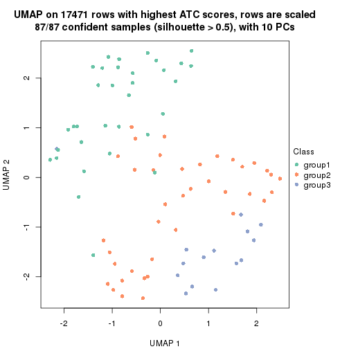</p>

</div>
<div id='tab-ATC-kmeans-dimension-reduction-3'>
<pre><code class="r">dimension_reduction(res, k = 4, method = &quot;UMAP&quot;)
</code></pre>

<p>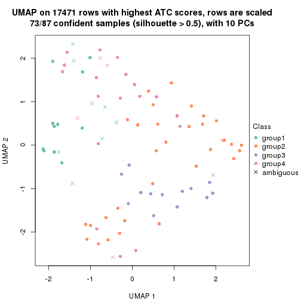</p>

</div>
<div id='tab-ATC-kmeans-dimension-reduction-4'>
<pre><code class="r">dimension_reduction(res, k = 5, method = &quot;UMAP&quot;)
</code></pre>

<p></p>

</div>
<div id='tab-ATC-kmeans-dimension-reduction-5'>
<pre><code class="r">dimension_reduction(res, k = 6, method = &quot;UMAP&quot;)
</code></pre>

<p></p>

</div>
</div>


Following heatmap shows how subgroups are split when increasing `k`:

```r
collect_classes(res)
```


If matrix rows can be associated to genes, consider to use `functional_enrichment(res,
...)` to perform function enrichment for the signature genes. See [this vignette](http://bioconductor.org/packages/devel/bioc/vignettes/cola/inst/doc/functional_enrichment.html) for more detailed explanations.


 

---------------------------------------------------


### ATC:skmeans*


The object with results only for a single top-value method and a single partition method 
can be extracted as:

```r
res = res_list["ATC", "skmeans"]
# you can also extract it by
# res = res_list["ATC:skmeans"]
```

A summary of `res` and all the functions that can be applied to it:

```r
res
```

```
#> A 'ConsensusPartition' object with k = 2, 3, 4, 5, 6.
#>   On a matrix with 17471 rows and 87 columns.
#>   Top rows (1000, 2000, 3000, 4000, 5000) are extracted by 'ATC' method.
#>   Subgroups are detected by 'skmeans' method.
#>   Performed in total 1250 partitions by row resampling.
#>   Best k for subgroups seems to be 3.
#> 
#> Following methods can be applied to this 'ConsensusPartition' object:
#>  [1] "cola_report"             "collect_classes"         "collect_plots"          
#>  [4] "collect_stats"           "colnames"                "compare_signatures"     
#>  [7] "consensus_heatmap"       "dimension_reduction"     "functional_enrichment"  
#> [10] "get_anno_col"            "get_anno"                "get_classes"            
#> [13] "get_consensus"           "get_matrix"              "get_membership"         
#> [16] "get_param"               "get_signatures"          "get_stats"              
#> [19] "is_best_k"               "is_stable_k"             "membership_heatmap"     
#> [22] "ncol"                    "nrow"                    "plot_ecdf"              
#> [25] "rownames"                "select_partition_number" "show"                   
#> [28] "suggest_best_k"          "test_to_known_factors"
```

`collect_plots()` function collects all the plots made from `res` for all `k` (number of partitions)
into one single page to provide an easy and fast comparison between different `k`.

```r
collect_plots(res)
```


The plots are:

- The first row: a plot of the ECDF (empirical cumulative distribution
  function) curves of the consensus matrix for each `k` and the heatmap of
  predicted classes for each `k`.
- The second row: heatmaps of the consensus matrix for each `k`.
- The third row: heatmaps of the membership matrix for each `k`.
- The fouth row: heatmaps of the signatures for each `k`.

All the plots in panels can be made by individual functions and they are
plotted later in this section.

`select_partition_number()` produces several plots showing different
statistics for choosing "optimized" `k`. There are following statistics:

- ECDF curves of the consensus matrix for each `k`;
- 1-PAC. [The PAC
  score](https://en.wikipedia.org/wiki/Consensus_clustering#Over-interpretation_potential_of_consensus_clustering)
  measures the proportion of the ambiguous subgrouping.
- Mean silhouette score.
- Concordance. The mean probability of fiting the consensus class ids in all
  partitions.
- Area increased. Denote $A_k$ as the area under the ECDF curve for current
  `k`, the area increased is defined as $A_k - A_{k-1}$.
- Rand index. The percent of pairs of samples that are both in a same cluster
  or both are not in a same cluster in the partition of k and k-1.
- Jaccard index. The ratio of pairs of samples are both in a same cluster in
  the partition of k and k-1 and the pairs of samples are both in a same
  cluster in the partition k or k-1.

The detailed explanations of these statistics can be found in [the _cola_
vignette](http://bioconductor.org/packages/devel/bioc/vignettes/cola/inst/doc/cola.html#toc_13).

Generally speaking, lower PAC score, higher mean silhouette score or higher
concordance corresponds to better partition. Rand index and Jaccard index
measure how similar the current partition is compared to partition with `k-1`.
If they are too similar, we won't accept `k` is better than `k-1`.

```r
select_partition_number(res)
```


The numeric values for all these statistics can be obtained by `get_stats()`.

```r
get_stats(res)
```

```
#>   k 1-PAC mean_silhouette concordance area_increased  Rand Jaccard
#> 2 2 0.907           0.966       0.984         0.5047 0.495   0.495
#> 3 3 0.925           0.894       0.954         0.3295 0.728   0.503
#> 4 4 0.719           0.653       0.859         0.1177 0.804   0.496
#> 5 5 0.724           0.725       0.849         0.0642 0.871   0.558
#> 6 6 0.741           0.584       0.769         0.0370 0.916   0.627
```

`suggest_best_k()` suggests the best $k$ based on these statistics. The rules are as follows:

- All $k$ with Jaccard index larger than 0.95 are removed because increasing
  $k$ does not provide enough extra information. If all $k$ are removed, it is
  marked as no subgroup is detected.
- For all $k$ with 1-PAC score larger than 0.9, the maximal $k$ is taken as
  the best $k$, and other $k$ are marked as optional $k$.
- If it does not fit the second rule. The $k$ with the maximal vote of the
  highest 1-PAC score, highest mean silhouette, and highest concordance is
  taken as the best $k$.

```r
suggest_best_k(res)
```

```
#> [1] 3
#> attr(,"optional")
#> [1] 2
```

There is also optional best $k$ = 2 that is worth to check.

Following shows the table of the partitions (You need to click the **show/hide
code output** link to see it). The membership matrix (columns with name `p*`)
is inferred by
[`clue::cl_consensus()`](https://www.rdocumentation.org/link/cl_consensus?package=clue)
function with the `SE` method. Basically the value in the membership matrix
represents the probability to belong to a certain group. The finall class
label for an item is determined with the group with highest probability it
belongs to.

In `get_classes()` function, the entropy is calculated from the membership
matrix and the silhouette score is calculated from the consensus matrix.


<script>
$( function() {
	$( '#tabs-ATC-skmeans-get-classes' ).tabs();
} );
</script>
<div id='tabs-ATC-skmeans-get-classes'>
<ul>
<li><a href='#tab-ATC-skmeans-get-classes-1'>k = 2</a></li>
<li><a href='#tab-ATC-skmeans-get-classes-2'>k = 3</a></li>
<li><a href='#tab-ATC-skmeans-get-classes-3'>k = 4</a></li>
<li><a href='#tab-ATC-skmeans-get-classes-4'>k = 5</a></li>
<li><a href='#tab-ATC-skmeans-get-classes-5'>k = 6</a></li>
</ul>

<div id='tab-ATC-skmeans-get-classes-1'>
<p><a id='tab-ATC-skmeans-get-classes-1-a' style='color:#0366d6' href='#'>show/hide code output</a></p>
<pre><code class="r">cbind(get_classes(res, k = 2), get_membership(res, k = 2))
</code></pre>

<pre><code>#&gt;                                      class entropy silhouette    p1    p2
#&gt; E6088A41-B0DC-4FBF-8D14-BE78024CF8CD     2  0.0000      0.975 0.000 1.000
#&gt; F569915C-8F77-4D67-9730-30824DB57EE5     1  0.0000      0.990 1.000 0.000
#&gt; E3B71CB7-673B-4741-8607-4F0A11633036     1  0.0000      0.990 1.000 0.000
#&gt; DAF84798-FE3F-403C-B589-7F256AF752BE     1  0.0000      0.990 1.000 0.000
#&gt; 2F38E3B1-4975-4877-9DCC-C00270602180     1  0.0000      0.990 1.000 0.000
#&gt; C79A4C2F-02C4-4C03-A5A5-DE06802EEB57     2  0.0000      0.975 0.000 1.000
#&gt; 92E3ED8F-5C74-4ED2-9B03-9FA5E7B491D6     2  0.0000      0.975 0.000 1.000
#&gt; E61D60BE-3BD3-4B5E-BC12-80F3684A0959     1  0.0000      0.990 1.000 0.000
#&gt; C9388FC7-DB1D-4416-BC2D-EA643584F1E6     2  0.0000      0.975 0.000 1.000
#&gt; D4219360-6344-4AF3-ACEB-1701A9F1F67D     1  0.0000      0.990 1.000 0.000
#&gt; 07D155E6-F27C-4D09-B786-8A9B71147B72     1  0.0000      0.990 1.000 0.000
#&gt; 10C8C361-85A5-40E8-A395-B92623E6F27C     2  0.4939      0.880 0.108 0.892
#&gt; BDF20891-7C98-4A55-BBF3-8A836BE303C6     2  0.0000      0.975 0.000 1.000
#&gt; 694B0504-095E-431A-84F2-B4387072138E     2  0.4939      0.880 0.108 0.892
#&gt; EDCF8E7F-8B1D-46F7-8AE0-84A1DC9647D2     2  0.0000      0.975 0.000 1.000
#&gt; 0EA8288E-824D-4304-A053-5A833361F5C5     2  0.0000      0.975 0.000 1.000
#&gt; C4ACCFA1-34A9-4F61-8A1F-35B3B60EA193     1  0.0000      0.990 1.000 0.000
#&gt; 760BA639-38AC-4BC9-9647-09F6893EA8ED     1  0.0000      0.990 1.000 0.000
#&gt; 082DFC6B-C6E6-48B9-BDE5-74FF3B3DC954     2  0.0000      0.975 0.000 1.000
#&gt; FE349848-D7C4-4C49-B670-0E20454DDD7E     1  0.0000      0.990 1.000 0.000
#&gt; 2E8937B3-9EA1-4528-8CEE-BF3D4137908A     1  0.4815      0.886 0.896 0.104
#&gt; 9942D04E-2767-4E39-BA16-7762EAC3DFC4     2  0.0000      0.975 0.000 1.000
#&gt; F9C23182-91C4-4145-AE52-526FE8EB199D     1  0.5737      0.845 0.864 0.136
#&gt; 01024EED-7811-4E24-A067-8E0B978FFE2D     1  0.4690      0.890 0.900 0.100
#&gt; 932C8E98-A352-409C-8744-3D49FABCE425     1  0.0000      0.990 1.000 0.000
#&gt; 6DFD9439-C659-4936-84E5-108F717E3E4D     1  0.0000      0.990 1.000 0.000
#&gt; 1D8B83B8-5DD7-4F45-9D59-487EC6906A8B     2  0.0000      0.975 0.000 1.000
#&gt; 804B8503-73F6-42DE-835F-39DE2C9F13E1     2  0.7602      0.733 0.220 0.780
#&gt; B9453C9B-84D5-43BD-85BB-1780F02F039C     1  0.2043      0.962 0.968 0.032
#&gt; 836E6CD6-4E88-4028-9844-FA3C892C254A     2  0.0000      0.975 0.000 1.000
#&gt; 36EDD202-A845-4CE7-95D5-A515C471262E     2  0.7602      0.733 0.220 0.780
#&gt; 181C156A-B8F4-4F9D-93AA-6AFBD197644D     1  0.0000      0.990 1.000 0.000
#&gt; 0580E798-6A98-4E46-AC96-9A869DFF502E     1  0.0000      0.990 1.000 0.000
#&gt; EA1B63CF-D389-4567-8D9E-B0EF1F804598     2  0.0000      0.975 0.000 1.000
#&gt; 5ABC3D06-B8E9-4831-B89B-7C1EC4006B47     2  0.0000      0.975 0.000 1.000
#&gt; 1CC01E74-A7C1-4A51-9E28-1703C352BE16     2  0.0000      0.975 0.000 1.000
#&gt; 97E55B75-DBDB-46BC-9E74-7828C070BF16     2  0.0000      0.975 0.000 1.000
#&gt; BEB37A2D-E8B0-4674-89AC-DC0F34E0AFD6     1  0.0000      0.990 1.000 0.000
#&gt; 558648BA-6551-4D34-97C2-AD5F677D63FB     1  0.0000      0.990 1.000 0.000
#&gt; FF7021BB-414B-4466-BC43-372D856E6A1D     2  0.0000      0.975 0.000 1.000
#&gt; 9C04B840-54E0-425D-BDBE-8CB6B9C2C722     1  0.2043      0.962 0.968 0.032
#&gt; 5F50B1F4-1A02-4506-AA6D-9BF21CD8059A     1  0.0000      0.990 1.000 0.000
#&gt; 7D4B8FF3-7977-4ABD-AE04-EED1C50B23CC     1  0.0000      0.990 1.000 0.000
#&gt; A005AF15-B98E-4623-8AD4-1E69EFA9BC7A     1  0.0000      0.990 1.000 0.000
#&gt; 1DF04345-5C93-4B18-B307-8D1FCA532999     2  0.0000      0.975 0.000 1.000
#&gt; 6AF30C18-347E-41ED-A4AB-6F81F42206C5     1  0.0000      0.990 1.000 0.000
#&gt; 88A44ED0-BDE1-401E-B0E1-D8C8D6DBAEFC     2  0.0000      0.975 0.000 1.000
#&gt; 117673A3-2918-4702-8583-B66ADE6E4338     2  0.0000      0.975 0.000 1.000
#&gt; 4903A571-E14D-43C9-A737-22CAFAC414CD     1  0.0000      0.990 1.000 0.000
#&gt; C175E68E-632A-4B4A-9DDB-4895C4760F20     2  0.5946      0.840 0.144 0.856
#&gt; FA5CA2F4-A1AD-4A79-B8F3-73A976EB2FB1     2  0.0000      0.975 0.000 1.000
#&gt; E1F883A7-8B1F-4C1D-8A1A-9749A9C09845     1  0.0000      0.990 1.000 0.000
#&gt; E74F0729-6000-4908-ADB0-7BDBAC0639E6     1  0.0000      0.990 1.000 0.000
#&gt; F92135A9-1981-4C79-99A5-4243EEC5D30D     2  0.7219      0.762 0.200 0.800
#&gt; 73C6919F-DEB4-4DA4-B4AE-4032AC8F96C5     1  0.0000      0.990 1.000 0.000
#&gt; 33977B40-2E92-48B6-8D3A-3EBE913F6F8A     1  0.0000      0.990 1.000 0.000
#&gt; 490BD607-2F08-4B4C-9612-F9BB5CBBC8BB     2  0.0376      0.972 0.004 0.996
#&gt; 6C666E17-2EB8-4244-BCC1-8DD34EE4173E     1  0.0000      0.990 1.000 0.000
#&gt; C41F3064-4483-4796-B860-82155BAA5157     1  0.0000      0.990 1.000 0.000
#&gt; F4232B90-51B9-43EE-9971-35B3A318758F     1  0.0000      0.990 1.000 0.000
#&gt; 291EA1F6-FC56-4429-A433-0C452A6A514C     2  0.0000      0.975 0.000 1.000
#&gt; CC4AF04D-CB8E-40DD-B12E-7AA39B38262A     2  0.0000      0.975 0.000 1.000
#&gt; 4DAE26B9-AB57-4763-BB9A-2ADDD5D9C007     1  0.0000      0.990 1.000 0.000
#&gt; 676B4AEE-FB41-4C16-AA91-03E4A1DA8E26     2  0.0000      0.975 0.000 1.000
#&gt; 1CC36859-357A-49E0-A367-4F57D47288BA     1  0.0000      0.990 1.000 0.000
#&gt; 7CCDDFC8-6DF6-4734-96AC-19EBC464FC50     2  0.0000      0.975 0.000 1.000
#&gt; 10F38C34-3956-48ED-AB62-3439EF00D46B     2  0.0000      0.975 0.000 1.000
#&gt; 80B2B393-9D6E-45B4-B696-2A5C203543B7     2  0.0000      0.975 0.000 1.000
#&gt; 5AC7B5EA-1AAC-4529-8E5A-F612E5E0719A     2  0.0000      0.975 0.000 1.000
#&gt; 3648E98D-4B3A-41B7-BE05-595D44F0150D     2  0.0000      0.975 0.000 1.000
#&gt; 252EC850-6026-473B-8FFC-2CF567EF42E4     1  0.0000      0.990 1.000 0.000
#&gt; 1790E7A3-99D8-447E-BC50-51C8A4A18853     2  0.0000      0.975 0.000 1.000
#&gt; DA61A4F8-350B-4DD1-A240-AD016520DB5B     2  0.0376      0.972 0.004 0.996
#&gt; 767E5BAF-2515-40D7-AE7D-0B24D77A03F4     1  0.0000      0.990 1.000 0.000
#&gt; 8CB9C903-D749-44EA-9137-7FB5A92C5932     2  0.0000      0.975 0.000 1.000
#&gt; A9B968AE-2243-41BC-852A-3A12C1FB4892     1  0.0000      0.990 1.000 0.000
#&gt; 3C582264-85BC-4569-A888-8EB3008E5198     2  0.0000      0.975 0.000 1.000
#&gt; F4EAF9A2-9938-4D9B-9080-C0A7542D5704     2  0.0000      0.975 0.000 1.000
#&gt; 328499D3-45DD-4B66-BD22-3C52BA92C2BB     1  0.0000      0.990 1.000 0.000
#&gt; AF8AB83D-2917-4752-8C38-CF84C565B565     1  0.0000      0.990 1.000 0.000
#&gt; 03A327CA-A9FE-42A4-844D-CA85206969FC     1  0.0000      0.990 1.000 0.000
#&gt; 4B0BEC44-87BB-4014-9A26-3529DD63760B     1  0.0000      0.990 1.000 0.000
#&gt; 05C7843E-DC89-4D8E-A78A-952C5DFD667B     1  0.0000      0.990 1.000 0.000
#&gt; 29A0FFF9-13D3-4D16-BE6A-8E48A2C4E315     1  0.0000      0.990 1.000 0.000
#&gt; 22947CC3-4F42-4F44-899C-2B7085E36C9D     2  0.0000      0.975 0.000 1.000
#&gt; A247D92D-253A-4BEC-B450-184AF90D17D0     2  0.0000      0.975 0.000 1.000
#&gt; 0D907A63-D23F-4684-80D9-0BA552435B86     1  0.0000      0.990 1.000 0.000
</code></pre>

<script>
$('#tab-ATC-skmeans-get-classes-1-a').parent().next().next().hide();
$('#tab-ATC-skmeans-get-classes-1-a').click(function(){
  $('#tab-ATC-skmeans-get-classes-1-a').parent().next().next().toggle();
  return(false);
});
</script>
</div>

<div id='tab-ATC-skmeans-get-classes-2'>
<p><a id='tab-ATC-skmeans-get-classes-2-a' style='color:#0366d6' href='#'>show/hide code output</a></p>
<pre><code class="r">cbind(get_classes(res, k = 3), get_membership(res, k = 3))
</code></pre>

<pre><code>#&gt;                                      class entropy silhouette    p1    p2    p3
#&gt; E6088A41-B0DC-4FBF-8D14-BE78024CF8CD     3  0.0000     0.9415 0.000 0.000 1.000
#&gt; F569915C-8F77-4D67-9730-30824DB57EE5     2  0.0000     0.9305 0.000 1.000 0.000
#&gt; E3B71CB7-673B-4741-8607-4F0A11633036     1  0.0000     0.9711 1.000 0.000 0.000
#&gt; DAF84798-FE3F-403C-B589-7F256AF752BE     1  0.0424     0.9680 0.992 0.008 0.000
#&gt; 2F38E3B1-4975-4877-9DCC-C00270602180     1  0.0000     0.9711 1.000 0.000 0.000
#&gt; C79A4C2F-02C4-4C03-A5A5-DE06802EEB57     3  0.5968     0.4196 0.000 0.364 0.636
#&gt; 92E3ED8F-5C74-4ED2-9B03-9FA5E7B491D6     3  0.0237     0.9393 0.004 0.000 0.996
#&gt; E61D60BE-3BD3-4B5E-BC12-80F3684A0959     1  0.2066     0.9443 0.940 0.060 0.000
#&gt; C9388FC7-DB1D-4416-BC2D-EA643584F1E6     3  0.3192     0.8429 0.000 0.112 0.888
#&gt; D4219360-6344-4AF3-ACEB-1701A9F1F67D     1  0.0000     0.9711 1.000 0.000 0.000
#&gt; 07D155E6-F27C-4D09-B786-8A9B71147B72     1  0.1964     0.9464 0.944 0.056 0.000
#&gt; 10C8C361-85A5-40E8-A395-B92623E6F27C     3  0.2066     0.8988 0.060 0.000 0.940
#&gt; BDF20891-7C98-4A55-BBF3-8A836BE303C6     3  0.5810     0.4869 0.000 0.336 0.664
#&gt; 694B0504-095E-431A-84F2-B4387072138E     3  0.2066     0.8988 0.060 0.000 0.940
#&gt; EDCF8E7F-8B1D-46F7-8AE0-84A1DC9647D2     2  0.5706     0.5234 0.000 0.680 0.320
#&gt; 0EA8288E-824D-4304-A053-5A833361F5C5     3  0.0000     0.9415 0.000 0.000 1.000
#&gt; C4ACCFA1-34A9-4F61-8A1F-35B3B60EA193     1  0.0000     0.9711 1.000 0.000 0.000
#&gt; 760BA639-38AC-4BC9-9647-09F6893EA8ED     1  0.0000     0.9711 1.000 0.000 0.000
#&gt; 082DFC6B-C6E6-48B9-BDE5-74FF3B3DC954     3  0.5988     0.4104 0.000 0.368 0.632
#&gt; FE349848-D7C4-4C49-B670-0E20454DDD7E     1  0.2261     0.9386 0.932 0.068 0.000
#&gt; 2E8937B3-9EA1-4528-8CEE-BF3D4137908A     2  0.0000     0.9305 0.000 1.000 0.000
#&gt; 9942D04E-2767-4E39-BA16-7762EAC3DFC4     3  0.0000     0.9415 0.000 0.000 1.000
#&gt; F9C23182-91C4-4145-AE52-526FE8EB199D     2  0.4413     0.8260 0.104 0.860 0.036
#&gt; 01024EED-7811-4E24-A067-8E0B978FFE2D     2  0.0000     0.9305 0.000 1.000 0.000
#&gt; 932C8E98-A352-409C-8744-3D49FABCE425     1  0.0000     0.9711 1.000 0.000 0.000
#&gt; 6DFD9439-C659-4936-84E5-108F717E3E4D     1  0.2711     0.9216 0.912 0.088 0.000
#&gt; 1D8B83B8-5DD7-4F45-9D59-487EC6906A8B     3  0.0000     0.9415 0.000 0.000 1.000
#&gt; 804B8503-73F6-42DE-835F-39DE2C9F13E1     2  0.0000     0.9305 0.000 1.000 0.000
#&gt; B9453C9B-84D5-43BD-85BB-1780F02F039C     1  0.0000     0.9711 1.000 0.000 0.000
#&gt; 836E6CD6-4E88-4028-9844-FA3C892C254A     3  0.0000     0.9415 0.000 0.000 1.000
#&gt; 36EDD202-A845-4CE7-95D5-A515C471262E     2  0.0000     0.9305 0.000 1.000 0.000
#&gt; 181C156A-B8F4-4F9D-93AA-6AFBD197644D     2  0.6140     0.2992 0.404 0.596 0.000
#&gt; 0580E798-6A98-4E46-AC96-9A869DFF502E     1  0.0000     0.9711 1.000 0.000 0.000
#&gt; EA1B63CF-D389-4567-8D9E-B0EF1F804598     3  0.0592     0.9344 0.012 0.000 0.988
#&gt; 5ABC3D06-B8E9-4831-B89B-7C1EC4006B47     3  0.0000     0.9415 0.000 0.000 1.000
#&gt; 1CC01E74-A7C1-4A51-9E28-1703C352BE16     3  0.0000     0.9415 0.000 0.000 1.000
#&gt; 97E55B75-DBDB-46BC-9E74-7828C070BF16     3  0.0000     0.9415 0.000 0.000 1.000
#&gt; BEB37A2D-E8B0-4674-89AC-DC0F34E0AFD6     1  0.0000     0.9711 1.000 0.000 0.000
#&gt; 558648BA-6551-4D34-97C2-AD5F677D63FB     1  0.0000     0.9711 1.000 0.000 0.000
#&gt; FF7021BB-414B-4466-BC43-372D856E6A1D     3  0.0000     0.9415 0.000 0.000 1.000
#&gt; 9C04B840-54E0-425D-BDBE-8CB6B9C2C722     2  0.0000     0.9305 0.000 1.000 0.000
#&gt; 5F50B1F4-1A02-4506-AA6D-9BF21CD8059A     1  0.2066     0.9443 0.940 0.060 0.000
#&gt; 7D4B8FF3-7977-4ABD-AE04-EED1C50B23CC     2  0.0000     0.9305 0.000 1.000 0.000
#&gt; A005AF15-B98E-4623-8AD4-1E69EFA9BC7A     1  0.0000     0.9711 1.000 0.000 0.000
#&gt; 1DF04345-5C93-4B18-B307-8D1FCA532999     2  0.0424     0.9269 0.000 0.992 0.008
#&gt; 6AF30C18-347E-41ED-A4AB-6F81F42206C5     1  0.0000     0.9711 1.000 0.000 0.000
#&gt; 88A44ED0-BDE1-401E-B0E1-D8C8D6DBAEFC     3  0.0000     0.9415 0.000 0.000 1.000
#&gt; 117673A3-2918-4702-8583-B66ADE6E4338     3  0.0000     0.9415 0.000 0.000 1.000
#&gt; 4903A571-E14D-43C9-A737-22CAFAC414CD     1  0.2066     0.9443 0.940 0.060 0.000
#&gt; C175E68E-632A-4B4A-9DDB-4895C4760F20     3  0.2066     0.8988 0.060 0.000 0.940
#&gt; FA5CA2F4-A1AD-4A79-B8F3-73A976EB2FB1     2  0.2066     0.8864 0.000 0.940 0.060
#&gt; E1F883A7-8B1F-4C1D-8A1A-9749A9C09845     2  0.0000     0.9305 0.000 1.000 0.000
#&gt; E74F0729-6000-4908-ADB0-7BDBAC0639E6     1  0.0000     0.9711 1.000 0.000 0.000
#&gt; F92135A9-1981-4C79-99A5-4243EEC5D30D     2  0.0000     0.9305 0.000 1.000 0.000
#&gt; 73C6919F-DEB4-4DA4-B4AE-4032AC8F96C5     1  0.0000     0.9711 1.000 0.000 0.000
#&gt; 33977B40-2E92-48B6-8D3A-3EBE913F6F8A     1  0.0000     0.9711 1.000 0.000 0.000
#&gt; 490BD607-2F08-4B4C-9612-F9BB5CBBC8BB     2  0.0000     0.9305 0.000 1.000 0.000
#&gt; 6C666E17-2EB8-4244-BCC1-8DD34EE4173E     2  0.0000     0.9305 0.000 1.000 0.000
#&gt; C41F3064-4483-4796-B860-82155BAA5157     1  0.0000     0.9711 1.000 0.000 0.000
#&gt; F4232B90-51B9-43EE-9971-35B3A318758F     1  0.0000     0.9711 1.000 0.000 0.000
#&gt; 291EA1F6-FC56-4429-A433-0C452A6A514C     2  0.0747     0.9220 0.000 0.984 0.016
#&gt; CC4AF04D-CB8E-40DD-B12E-7AA39B38262A     3  0.0000     0.9415 0.000 0.000 1.000
#&gt; 4DAE26B9-AB57-4763-BB9A-2ADDD5D9C007     1  0.2066     0.9443 0.940 0.060 0.000
#&gt; 676B4AEE-FB41-4C16-AA91-03E4A1DA8E26     3  0.0000     0.9415 0.000 0.000 1.000
#&gt; 1CC36859-357A-49E0-A367-4F57D47288BA     1  0.2261     0.9386 0.932 0.068 0.000
#&gt; 7CCDDFC8-6DF6-4734-96AC-19EBC464FC50     2  0.6309    -0.0138 0.000 0.504 0.496
#&gt; 10F38C34-3956-48ED-AB62-3439EF00D46B     2  0.4555     0.7306 0.000 0.800 0.200
#&gt; 80B2B393-9D6E-45B4-B696-2A5C203543B7     2  0.0592     0.9246 0.000 0.988 0.012
#&gt; 5AC7B5EA-1AAC-4529-8E5A-F612E5E0719A     3  0.0000     0.9415 0.000 0.000 1.000
#&gt; 3648E98D-4B3A-41B7-BE05-595D44F0150D     3  0.0000     0.9415 0.000 0.000 1.000
#&gt; 252EC850-6026-473B-8FFC-2CF567EF42E4     1  0.0000     0.9711 1.000 0.000 0.000
#&gt; 1790E7A3-99D8-447E-BC50-51C8A4A18853     2  0.0424     0.9269 0.000 0.992 0.008
#&gt; DA61A4F8-350B-4DD1-A240-AD016520DB5B     2  0.0000     0.9305 0.000 1.000 0.000
#&gt; 767E5BAF-2515-40D7-AE7D-0B24D77A03F4     2  0.0000     0.9305 0.000 1.000 0.000
#&gt; 8CB9C903-D749-44EA-9137-7FB5A92C5932     3  0.0000     0.9415 0.000 0.000 1.000
#&gt; A9B968AE-2243-41BC-852A-3A12C1FB4892     1  0.0000     0.9711 1.000 0.000 0.000
#&gt; 3C582264-85BC-4569-A888-8EB3008E5198     2  0.2356     0.8769 0.000 0.928 0.072
#&gt; F4EAF9A2-9938-4D9B-9080-C0A7542D5704     3  0.0000     0.9415 0.000 0.000 1.000
#&gt; 328499D3-45DD-4B66-BD22-3C52BA92C2BB     1  0.0000     0.9711 1.000 0.000 0.000
#&gt; AF8AB83D-2917-4752-8C38-CF84C565B565     1  0.0000     0.9711 1.000 0.000 0.000
#&gt; 03A327CA-A9FE-42A4-844D-CA85206969FC     2  0.0000     0.9305 0.000 1.000 0.000
#&gt; 4B0BEC44-87BB-4014-9A26-3529DD63760B     2  0.0000     0.9305 0.000 1.000 0.000
#&gt; 05C7843E-DC89-4D8E-A78A-952C5DFD667B     1  0.5529     0.6034 0.704 0.296 0.000
#&gt; 29A0FFF9-13D3-4D16-BE6A-8E48A2C4E315     2  0.0000     0.9305 0.000 1.000 0.000
#&gt; 22947CC3-4F42-4F44-899C-2B7085E36C9D     3  0.0592     0.9339 0.000 0.012 0.988
#&gt; A247D92D-253A-4BEC-B450-184AF90D17D0     2  0.0000     0.9305 0.000 1.000 0.000
#&gt; 0D907A63-D23F-4684-80D9-0BA552435B86     1  0.2066     0.9443 0.940 0.060 0.000
</code></pre>

<script>
$('#tab-ATC-skmeans-get-classes-2-a').parent().next().next().hide();
$('#tab-ATC-skmeans-get-classes-2-a').click(function(){
  $('#tab-ATC-skmeans-get-classes-2-a').parent().next().next().toggle();
  return(false);
});
</script>
</div>

<div id='tab-ATC-skmeans-get-classes-3'>
<p><a id='tab-ATC-skmeans-get-classes-3-a' style='color:#0366d6' href='#'>show/hide code output</a></p>
<pre><code class="r">cbind(get_classes(res, k = 4), get_membership(res, k = 4))
</code></pre>

<pre><code>#&gt;                                      class entropy silhouette    p1    p2    p3    p4
#&gt; E6088A41-B0DC-4FBF-8D14-BE78024CF8CD     3  0.0000     0.8955 0.000 0.000 1.000 0.000
#&gt; F569915C-8F77-4D67-9730-30824DB57EE5     4  0.4977    -0.1375 0.000 0.460 0.000 0.540
#&gt; E3B71CB7-673B-4741-8607-4F0A11633036     1  0.0000     0.8078 1.000 0.000 0.000 0.000
#&gt; DAF84798-FE3F-403C-B589-7F256AF752BE     4  0.0336     0.7407 0.008 0.000 0.000 0.992
#&gt; 2F38E3B1-4975-4877-9DCC-C00270602180     4  0.4933     0.3635 0.432 0.000 0.000 0.568
#&gt; C79A4C2F-02C4-4C03-A5A5-DE06802EEB57     2  0.7341     0.0596 0.164 0.476 0.360 0.000
#&gt; 92E3ED8F-5C74-4ED2-9B03-9FA5E7B491D6     1  0.4877     0.2471 0.592 0.000 0.408 0.000
#&gt; E61D60BE-3BD3-4B5E-BC12-80F3684A0959     4  0.0188     0.7409 0.004 0.000 0.000 0.996
#&gt; C9388FC7-DB1D-4416-BC2D-EA643584F1E6     3  0.0336     0.8916 0.000 0.008 0.992 0.000
#&gt; D4219360-6344-4AF3-ACEB-1701A9F1F67D     1  0.0000     0.8078 1.000 0.000 0.000 0.000
#&gt; 07D155E6-F27C-4D09-B786-8A9B71147B72     4  0.0188     0.7409 0.004 0.000 0.000 0.996
#&gt; 10C8C361-85A5-40E8-A395-B92623E6F27C     1  0.0707     0.8047 0.980 0.000 0.020 0.000
#&gt; BDF20891-7C98-4A55-BBF3-8A836BE303C6     3  0.5155     0.2224 0.004 0.468 0.528 0.000
#&gt; 694B0504-095E-431A-84F2-B4387072138E     1  0.0707     0.8047 0.980 0.000 0.020 0.000
#&gt; EDCF8E7F-8B1D-46F7-8AE0-84A1DC9647D2     3  0.6637     0.4224 0.000 0.260 0.608 0.132
#&gt; 0EA8288E-824D-4304-A053-5A833361F5C5     3  0.0000     0.8955 0.000 0.000 1.000 0.000
#&gt; C4ACCFA1-34A9-4F61-8A1F-35B3B60EA193     4  0.3942     0.6482 0.236 0.000 0.000 0.764
#&gt; 760BA639-38AC-4BC9-9647-09F6893EA8ED     1  0.0000     0.8078 1.000 0.000 0.000 0.000
#&gt; 082DFC6B-C6E6-48B9-BDE5-74FF3B3DC954     3  0.3801     0.7040 0.000 0.220 0.780 0.000
#&gt; FE349848-D7C4-4C49-B670-0E20454DDD7E     4  0.0000     0.7397 0.000 0.000 0.000 1.000
#&gt; 2E8937B3-9EA1-4528-8CEE-BF3D4137908A     2  0.0000     0.8465 0.000 1.000 0.000 0.000
#&gt; 9942D04E-2767-4E39-BA16-7762EAC3DFC4     3  0.0000     0.8955 0.000 0.000 1.000 0.000
#&gt; F9C23182-91C4-4145-AE52-526FE8EB199D     1  0.5285     0.1077 0.524 0.468 0.000 0.008
#&gt; 01024EED-7811-4E24-A067-8E0B978FFE2D     2  0.0592     0.8443 0.000 0.984 0.000 0.016
#&gt; 932C8E98-A352-409C-8744-3D49FABCE425     4  0.1716     0.7303 0.064 0.000 0.000 0.936
#&gt; 6DFD9439-C659-4936-84E5-108F717E3E4D     4  0.0000     0.7397 0.000 0.000 0.000 1.000
#&gt; 1D8B83B8-5DD7-4F45-9D59-487EC6906A8B     3  0.0000     0.8955 0.000 0.000 1.000 0.000
#&gt; 804B8503-73F6-42DE-835F-39DE2C9F13E1     2  0.0000     0.8465 0.000 1.000 0.000 0.000
#&gt; B9453C9B-84D5-43BD-85BB-1780F02F039C     1  0.0000     0.8078 1.000 0.000 0.000 0.000
#&gt; 836E6CD6-4E88-4028-9844-FA3C892C254A     3  0.0000     0.8955 0.000 0.000 1.000 0.000
#&gt; 36EDD202-A845-4CE7-95D5-A515C471262E     2  0.0000     0.8465 0.000 1.000 0.000 0.000
#&gt; 181C156A-B8F4-4F9D-93AA-6AFBD197644D     2  0.4164     0.5824 0.264 0.736 0.000 0.000
#&gt; 0580E798-6A98-4E46-AC96-9A869DFF502E     4  0.3356     0.6927 0.176 0.000 0.000 0.824
#&gt; EA1B63CF-D389-4567-8D9E-B0EF1F804598     1  0.4888     0.2433 0.588 0.000 0.412 0.000
#&gt; 5ABC3D06-B8E9-4831-B89B-7C1EC4006B47     3  0.0000     0.8955 0.000 0.000 1.000 0.000
#&gt; 1CC01E74-A7C1-4A51-9E28-1703C352BE16     3  0.0000     0.8955 0.000 0.000 1.000 0.000
#&gt; 97E55B75-DBDB-46BC-9E74-7828C070BF16     3  0.0000     0.8955 0.000 0.000 1.000 0.000
#&gt; BEB37A2D-E8B0-4674-89AC-DC0F34E0AFD6     4  0.3610     0.6786 0.200 0.000 0.000 0.800
#&gt; 558648BA-6551-4D34-97C2-AD5F677D63FB     1  0.3123     0.6272 0.844 0.000 0.000 0.156
#&gt; FF7021BB-414B-4466-BC43-372D856E6A1D     3  0.0000     0.8955 0.000 0.000 1.000 0.000
#&gt; 9C04B840-54E0-425D-BDBE-8CB6B9C2C722     2  0.2973     0.7793 0.000 0.856 0.000 0.144
#&gt; 5F50B1F4-1A02-4506-AA6D-9BF21CD8059A     4  0.0188     0.7409 0.004 0.000 0.000 0.996
#&gt; 7D4B8FF3-7977-4ABD-AE04-EED1C50B23CC     2  0.4830     0.4540 0.000 0.608 0.000 0.392
#&gt; A005AF15-B98E-4623-8AD4-1E69EFA9BC7A     4  0.3219     0.6982 0.164 0.000 0.000 0.836
#&gt; 1DF04345-5C93-4B18-B307-8D1FCA532999     2  0.0000     0.8465 0.000 1.000 0.000 0.000
#&gt; 6AF30C18-347E-41ED-A4AB-6F81F42206C5     4  0.4992     0.2592 0.476 0.000 0.000 0.524
#&gt; 88A44ED0-BDE1-401E-B0E1-D8C8D6DBAEFC     3  0.0000     0.8955 0.000 0.000 1.000 0.000
#&gt; 117673A3-2918-4702-8583-B66ADE6E4338     3  0.0592     0.8865 0.000 0.016 0.984 0.000
#&gt; 4903A571-E14D-43C9-A737-22CAFAC414CD     4  0.0000     0.7397 0.000 0.000 0.000 1.000
#&gt; C175E68E-632A-4B4A-9DDB-4895C4760F20     1  0.0707     0.8047 0.980 0.000 0.020 0.000
#&gt; FA5CA2F4-A1AD-4A79-B8F3-73A976EB2FB1     2  0.0188     0.8448 0.000 0.996 0.004 0.000
#&gt; E1F883A7-8B1F-4C1D-8A1A-9749A9C09845     2  0.4877     0.4133 0.000 0.592 0.000 0.408
#&gt; E74F0729-6000-4908-ADB0-7BDBAC0639E6     1  0.0000     0.8078 1.000 0.000 0.000 0.000
#&gt; F92135A9-1981-4C79-99A5-4243EEC5D30D     2  0.0000     0.8465 0.000 1.000 0.000 0.000
#&gt; 73C6919F-DEB4-4DA4-B4AE-4032AC8F96C5     4  0.3610     0.6788 0.200 0.000 0.000 0.800
#&gt; 33977B40-2E92-48B6-8D3A-3EBE913F6F8A     1  0.4925    -0.0698 0.572 0.000 0.000 0.428
#&gt; 490BD607-2F08-4B4C-9612-F9BB5CBBC8BB     2  0.1211     0.8376 0.000 0.960 0.000 0.040
#&gt; 6C666E17-2EB8-4244-BCC1-8DD34EE4173E     2  0.5000     0.1956 0.000 0.504 0.000 0.496
#&gt; C41F3064-4483-4796-B860-82155BAA5157     4  0.3569     0.6815 0.196 0.000 0.000 0.804
#&gt; F4232B90-51B9-43EE-9971-35B3A318758F     4  0.4907     0.3864 0.420 0.000 0.000 0.580
#&gt; 291EA1F6-FC56-4429-A433-0C452A6A514C     2  0.0000     0.8465 0.000 1.000 0.000 0.000
#&gt; CC4AF04D-CB8E-40DD-B12E-7AA39B38262A     3  0.0000     0.8955 0.000 0.000 1.000 0.000
#&gt; 4DAE26B9-AB57-4763-BB9A-2ADDD5D9C007     4  0.0188     0.7409 0.004 0.000 0.000 0.996
#&gt; 676B4AEE-FB41-4C16-AA91-03E4A1DA8E26     3  0.0000     0.8955 0.000 0.000 1.000 0.000
#&gt; 1CC36859-357A-49E0-A367-4F57D47288BA     4  0.0000     0.7397 0.000 0.000 0.000 1.000
#&gt; 7CCDDFC8-6DF6-4734-96AC-19EBC464FC50     3  0.4843     0.4175 0.000 0.396 0.604 0.000
#&gt; 10F38C34-3956-48ED-AB62-3439EF00D46B     3  0.2888     0.7995 0.000 0.124 0.872 0.004
#&gt; 80B2B393-9D6E-45B4-B696-2A5C203543B7     2  0.0000     0.8465 0.000 1.000 0.000 0.000
#&gt; 5AC7B5EA-1AAC-4529-8E5A-F612E5E0719A     3  0.0000     0.8955 0.000 0.000 1.000 0.000
#&gt; 3648E98D-4B3A-41B7-BE05-595D44F0150D     3  0.4972     0.0910 0.456 0.000 0.544 0.000
#&gt; 252EC850-6026-473B-8FFC-2CF567EF42E4     4  0.4925     0.3710 0.428 0.000 0.000 0.572
#&gt; 1790E7A3-99D8-447E-BC50-51C8A4A18853     2  0.0000     0.8465 0.000 1.000 0.000 0.000
#&gt; DA61A4F8-350B-4DD1-A240-AD016520DB5B     2  0.4194     0.7424 0.000 0.800 0.028 0.172
#&gt; 767E5BAF-2515-40D7-AE7D-0B24D77A03F4     4  0.4998    -0.2149 0.000 0.488 0.000 0.512
#&gt; 8CB9C903-D749-44EA-9137-7FB5A92C5932     3  0.0000     0.8955 0.000 0.000 1.000 0.000
#&gt; A9B968AE-2243-41BC-852A-3A12C1FB4892     4  0.3486     0.6870 0.188 0.000 0.000 0.812
#&gt; 3C582264-85BC-4569-A888-8EB3008E5198     2  0.1474     0.8097 0.000 0.948 0.052 0.000
#&gt; F4EAF9A2-9938-4D9B-9080-C0A7542D5704     3  0.0000     0.8955 0.000 0.000 1.000 0.000
#&gt; 328499D3-45DD-4B66-BD22-3C52BA92C2BB     1  0.0000     0.8078 1.000 0.000 0.000 0.000
#&gt; AF8AB83D-2917-4752-8C38-CF84C565B565     4  0.4730     0.4811 0.364 0.000 0.000 0.636
#&gt; 03A327CA-A9FE-42A4-844D-CA85206969FC     4  0.4996    -0.2043 0.000 0.484 0.000 0.516
#&gt; 4B0BEC44-87BB-4014-9A26-3529DD63760B     4  0.4999    -0.2265 0.000 0.492 0.000 0.508
#&gt; 05C7843E-DC89-4D8E-A78A-952C5DFD667B     4  0.1302     0.7140 0.000 0.044 0.000 0.956
#&gt; 29A0FFF9-13D3-4D16-BE6A-8E48A2C4E315     2  0.1022     0.8395 0.000 0.968 0.000 0.032
#&gt; 22947CC3-4F42-4F44-899C-2B7085E36C9D     3  0.0336     0.8913 0.000 0.008 0.992 0.000
#&gt; A247D92D-253A-4BEC-B450-184AF90D17D0     2  0.3074     0.7726 0.000 0.848 0.000 0.152
#&gt; 0D907A63-D23F-4684-80D9-0BA552435B86     4  0.0188     0.7409 0.004 0.000 0.000 0.996
</code></pre>

<script>
$('#tab-ATC-skmeans-get-classes-3-a').parent().next().next().hide();
$('#tab-ATC-skmeans-get-classes-3-a').click(function(){
  $('#tab-ATC-skmeans-get-classes-3-a').parent().next().next().toggle();
  return(false);
});
</script>
</div>

<div id='tab-ATC-skmeans-get-classes-4'>
<p><a id='tab-ATC-skmeans-get-classes-4-a' style='color:#0366d6' href='#'>show/hide code output</a></p>
<pre><code class="r">cbind(get_classes(res, k = 5), get_membership(res, k = 5))
</code></pre>

<pre><code>#&gt;                                      class entropy silhouette    p1    p2    p3    p4    p5
#&gt; E6088A41-B0DC-4FBF-8D14-BE78024CF8CD     5  0.0000     0.9294 0.000 0.000 0.000 0.000 1.000
#&gt; F569915C-8F77-4D67-9730-30824DB57EE5     3  0.3146     0.7174 0.000 0.028 0.844 0.128 0.000
#&gt; E3B71CB7-673B-4741-8607-4F0A11633036     1  0.2020     0.8231 0.900 0.000 0.000 0.100 0.000
#&gt; DAF84798-FE3F-403C-B589-7F256AF752BE     4  0.3675     0.7304 0.024 0.000 0.188 0.788 0.000
#&gt; 2F38E3B1-4975-4877-9DCC-C00270602180     4  0.2179     0.7723 0.112 0.000 0.000 0.888 0.000
#&gt; C79A4C2F-02C4-4C03-A5A5-DE06802EEB57     2  0.7149     0.5747 0.156 0.592 0.136 0.008 0.108
#&gt; 92E3ED8F-5C74-4ED2-9B03-9FA5E7B491D6     1  0.3796     0.5939 0.700 0.000 0.000 0.000 0.300
#&gt; E61D60BE-3BD3-4B5E-BC12-80F3684A0959     4  0.3177     0.7308 0.000 0.000 0.208 0.792 0.000
#&gt; C9388FC7-DB1D-4416-BC2D-EA643584F1E6     5  0.0833     0.9155 0.004 0.004 0.016 0.000 0.976
#&gt; D4219360-6344-4AF3-ACEB-1701A9F1F67D     1  0.2179     0.8195 0.888 0.000 0.000 0.112 0.000
#&gt; 07D155E6-F27C-4D09-B786-8A9B71147B72     4  0.2929     0.7515 0.000 0.000 0.180 0.820 0.000
#&gt; 10C8C361-85A5-40E8-A395-B92623E6F27C     1  0.1469     0.8274 0.948 0.000 0.000 0.036 0.016
#&gt; BDF20891-7C98-4A55-BBF3-8A836BE303C6     2  0.3631     0.7398 0.012 0.820 0.024 0.000 0.144
#&gt; 694B0504-095E-431A-84F2-B4387072138E     1  0.1300     0.8251 0.956 0.000 0.000 0.028 0.016
#&gt; EDCF8E7F-8B1D-46F7-8AE0-84A1DC9647D2     3  0.8116     0.1734 0.052 0.172 0.416 0.036 0.324
#&gt; 0EA8288E-824D-4304-A053-5A833361F5C5     5  0.0000     0.9294 0.000 0.000 0.000 0.000 1.000
#&gt; C4ACCFA1-34A9-4F61-8A1F-35B3B60EA193     4  0.1568     0.8176 0.036 0.000 0.020 0.944 0.000
#&gt; 760BA639-38AC-4BC9-9647-09F6893EA8ED     1  0.1851     0.8228 0.912 0.000 0.000 0.088 0.000
#&gt; 082DFC6B-C6E6-48B9-BDE5-74FF3B3DC954     5  0.5981     0.5412 0.012 0.152 0.212 0.000 0.624
#&gt; FE349848-D7C4-4C49-B670-0E20454DDD7E     3  0.3932     0.4566 0.000 0.000 0.672 0.328 0.000
#&gt; 2E8937B3-9EA1-4528-8CEE-BF3D4137908A     2  0.0880     0.8262 0.000 0.968 0.032 0.000 0.000
#&gt; 9942D04E-2767-4E39-BA16-7762EAC3DFC4     5  0.0000     0.9294 0.000 0.000 0.000 0.000 1.000
#&gt; F9C23182-91C4-4145-AE52-526FE8EB199D     2  0.5415     0.5998 0.260 0.660 0.060 0.020 0.000
#&gt; 01024EED-7811-4E24-A067-8E0B978FFE2D     2  0.2536     0.7621 0.000 0.868 0.128 0.004 0.000
#&gt; 932C8E98-A352-409C-8744-3D49FABCE425     4  0.1732     0.8004 0.000 0.000 0.080 0.920 0.000
#&gt; 6DFD9439-C659-4936-84E5-108F717E3E4D     4  0.4974     0.4184 0.024 0.008 0.364 0.604 0.000
#&gt; 1D8B83B8-5DD7-4F45-9D59-487EC6906A8B     5  0.0000     0.9294 0.000 0.000 0.000 0.000 1.000
#&gt; 804B8503-73F6-42DE-835F-39DE2C9F13E1     2  0.0404     0.8312 0.000 0.988 0.012 0.000 0.000
#&gt; B9453C9B-84D5-43BD-85BB-1780F02F039C     1  0.1831     0.8201 0.920 0.000 0.004 0.076 0.000
#&gt; 836E6CD6-4E88-4028-9844-FA3C892C254A     5  0.0000     0.9294 0.000 0.000 0.000 0.000 1.000
#&gt; 36EDD202-A845-4CE7-95D5-A515C471262E     2  0.0963     0.8255 0.000 0.964 0.036 0.000 0.000
#&gt; 181C156A-B8F4-4F9D-93AA-6AFBD197644D     2  0.4488     0.6768 0.212 0.736 0.004 0.048 0.000
#&gt; 0580E798-6A98-4E46-AC96-9A869DFF502E     4  0.1915     0.8148 0.040 0.000 0.032 0.928 0.000
#&gt; EA1B63CF-D389-4567-8D9E-B0EF1F804598     1  0.4893     0.6381 0.704 0.000 0.020 0.036 0.240
#&gt; 5ABC3D06-B8E9-4831-B89B-7C1EC4006B47     5  0.0000     0.9294 0.000 0.000 0.000 0.000 1.000
#&gt; 1CC01E74-A7C1-4A51-9E28-1703C352BE16     5  0.0000     0.9294 0.000 0.000 0.000 0.000 1.000
#&gt; 97E55B75-DBDB-46BC-9E74-7828C070BF16     5  0.0000     0.9294 0.000 0.000 0.000 0.000 1.000
#&gt; BEB37A2D-E8B0-4674-89AC-DC0F34E0AFD6     4  0.1012     0.8172 0.020 0.000 0.012 0.968 0.000
#&gt; 558648BA-6551-4D34-97C2-AD5F677D63FB     1  0.4321     0.3192 0.600 0.000 0.004 0.396 0.000
#&gt; FF7021BB-414B-4466-BC43-372D856E6A1D     5  0.0000     0.9294 0.000 0.000 0.000 0.000 1.000
#&gt; 9C04B840-54E0-425D-BDBE-8CB6B9C2C722     2  0.5225     0.0858 0.020 0.540 0.424 0.016 0.000
#&gt; 5F50B1F4-1A02-4506-AA6D-9BF21CD8059A     4  0.3586     0.6642 0.000 0.000 0.264 0.736 0.000
#&gt; 7D4B8FF3-7977-4ABD-AE04-EED1C50B23CC     3  0.4793     0.6248 0.000 0.216 0.708 0.076 0.000
#&gt; A005AF15-B98E-4623-8AD4-1E69EFA9BC7A     4  0.1836     0.8145 0.036 0.000 0.032 0.932 0.000
#&gt; 1DF04345-5C93-4B18-B307-8D1FCA532999     2  0.0162     0.8316 0.000 0.996 0.004 0.000 0.000
#&gt; 6AF30C18-347E-41ED-A4AB-6F81F42206C5     4  0.2806     0.7379 0.152 0.000 0.004 0.844 0.000
#&gt; 88A44ED0-BDE1-401E-B0E1-D8C8D6DBAEFC     5  0.0771     0.9155 0.004 0.000 0.020 0.000 0.976
#&gt; 117673A3-2918-4702-8583-B66ADE6E4338     5  0.4001     0.8014 0.052 0.040 0.040 0.024 0.844
#&gt; 4903A571-E14D-43C9-A737-22CAFAC414CD     4  0.4074     0.4790 0.000 0.000 0.364 0.636 0.000
#&gt; C175E68E-632A-4B4A-9DDB-4895C4760F20     1  0.2452     0.8072 0.908 0.000 0.012 0.052 0.028
#&gt; FA5CA2F4-A1AD-4A79-B8F3-73A976EB2FB1     2  0.3081     0.7390 0.012 0.832 0.156 0.000 0.000
#&gt; E1F883A7-8B1F-4C1D-8A1A-9749A9C09845     3  0.5649     0.1294 0.000 0.452 0.472 0.076 0.000
#&gt; E74F0729-6000-4908-ADB0-7BDBAC0639E6     1  0.1892     0.8187 0.916 0.000 0.004 0.080 0.000
#&gt; F92135A9-1981-4C79-99A5-4243EEC5D30D     2  0.0404     0.8312 0.000 0.988 0.012 0.000 0.000
#&gt; 73C6919F-DEB4-4DA4-B4AE-4032AC8F96C5     4  0.1981     0.8145 0.048 0.000 0.028 0.924 0.000
#&gt; 33977B40-2E92-48B6-8D3A-3EBE913F6F8A     4  0.4101     0.4979 0.332 0.000 0.004 0.664 0.000
#&gt; 490BD607-2F08-4B4C-9612-F9BB5CBBC8BB     3  0.4193     0.4071 0.012 0.304 0.684 0.000 0.000
#&gt; 6C666E17-2EB8-4244-BCC1-8DD34EE4173E     3  0.1579     0.7250 0.000 0.032 0.944 0.024 0.000
#&gt; C41F3064-4483-4796-B860-82155BAA5157     4  0.1364     0.8156 0.036 0.000 0.012 0.952 0.000
#&gt; F4232B90-51B9-43EE-9971-35B3A318758F     4  0.2439     0.7696 0.120 0.000 0.004 0.876 0.000
#&gt; 291EA1F6-FC56-4429-A433-0C452A6A514C     2  0.2416     0.7862 0.012 0.888 0.100 0.000 0.000
#&gt; CC4AF04D-CB8E-40DD-B12E-7AA39B38262A     5  0.0000     0.9294 0.000 0.000 0.000 0.000 1.000
#&gt; 4DAE26B9-AB57-4763-BB9A-2ADDD5D9C007     4  0.3109     0.7375 0.000 0.000 0.200 0.800 0.000
#&gt; 676B4AEE-FB41-4C16-AA91-03E4A1DA8E26     5  0.0000     0.9294 0.000 0.000 0.000 0.000 1.000
#&gt; 1CC36859-357A-49E0-A367-4F57D47288BA     3  0.4045     0.3907 0.000 0.000 0.644 0.356 0.000
#&gt; 7CCDDFC8-6DF6-4734-96AC-19EBC464FC50     2  0.2969     0.7560 0.000 0.852 0.020 0.000 0.128
#&gt; 10F38C34-3956-48ED-AB62-3439EF00D46B     5  0.6285     0.1584 0.016 0.096 0.428 0.000 0.460
#&gt; 80B2B393-9D6E-45B4-B696-2A5C203543B7     2  0.0162     0.8316 0.000 0.996 0.004 0.000 0.000
#&gt; 5AC7B5EA-1AAC-4529-8E5A-F612E5E0719A     5  0.0000     0.9294 0.000 0.000 0.000 0.000 1.000
#&gt; 3648E98D-4B3A-41B7-BE05-595D44F0150D     1  0.4283     0.2611 0.544 0.000 0.000 0.000 0.456
#&gt; 252EC850-6026-473B-8FFC-2CF567EF42E4     4  0.2377     0.7696 0.128 0.000 0.000 0.872 0.000
#&gt; 1790E7A3-99D8-447E-BC50-51C8A4A18853     2  0.0162     0.8304 0.000 0.996 0.004 0.000 0.000
#&gt; DA61A4F8-350B-4DD1-A240-AD016520DB5B     3  0.2573     0.6503 0.016 0.104 0.880 0.000 0.000
#&gt; 767E5BAF-2515-40D7-AE7D-0B24D77A03F4     3  0.2782     0.7342 0.000 0.048 0.880 0.072 0.000
#&gt; 8CB9C903-D749-44EA-9137-7FB5A92C5932     5  0.0000     0.9294 0.000 0.000 0.000 0.000 1.000
#&gt; A9B968AE-2243-41BC-852A-3A12C1FB4892     4  0.1740     0.8084 0.056 0.000 0.012 0.932 0.000
#&gt; 3C582264-85BC-4569-A888-8EB3008E5198     2  0.0671     0.8273 0.000 0.980 0.016 0.000 0.004
#&gt; F4EAF9A2-9938-4D9B-9080-C0A7542D5704     5  0.0000     0.9294 0.000 0.000 0.000 0.000 1.000
#&gt; 328499D3-45DD-4B66-BD22-3C52BA92C2BB     1  0.1831     0.8201 0.920 0.000 0.004 0.076 0.000
#&gt; AF8AB83D-2917-4752-8C38-CF84C565B565     4  0.2286     0.7881 0.108 0.000 0.004 0.888 0.000
#&gt; 03A327CA-A9FE-42A4-844D-CA85206969FC     3  0.3460     0.7179 0.000 0.044 0.828 0.128 0.000
#&gt; 4B0BEC44-87BB-4014-9A26-3529DD63760B     3  0.1493     0.7248 0.000 0.028 0.948 0.024 0.000
#&gt; 05C7843E-DC89-4D8E-A78A-952C5DFD667B     3  0.3109     0.6523 0.000 0.000 0.800 0.200 0.000
#&gt; 29A0FFF9-13D3-4D16-BE6A-8E48A2C4E315     2  0.3519     0.6558 0.000 0.776 0.216 0.008 0.000
#&gt; 22947CC3-4F42-4F44-899C-2B7085E36C9D     5  0.3716     0.7788 0.012 0.024 0.152 0.000 0.812
#&gt; A247D92D-253A-4BEC-B450-184AF90D17D0     3  0.3527     0.5697 0.016 0.192 0.792 0.000 0.000
#&gt; 0D907A63-D23F-4684-80D9-0BA552435B86     4  0.3143     0.7342 0.000 0.000 0.204 0.796 0.000
</code></pre>

<script>
$('#tab-ATC-skmeans-get-classes-4-a').parent().next().next().hide();
$('#tab-ATC-skmeans-get-classes-4-a').click(function(){
  $('#tab-ATC-skmeans-get-classes-4-a').parent().next().next().toggle();
  return(false);
});
</script>
</div>

<div id='tab-ATC-skmeans-get-classes-5'>
<p><a id='tab-ATC-skmeans-get-classes-5-a' style='color:#0366d6' href='#'>show/hide code output</a></p>
<pre><code class="r">cbind(get_classes(res, k = 6), get_membership(res, k = 6))
</code></pre>

<pre><code>#&gt;                                      class entropy silhouette    p1    p2    p3    p4    p5    p6
#&gt; E6088A41-B0DC-4FBF-8D14-BE78024CF8CD     6  0.0000     0.9347 0.000 0.000 0.000 0.000 0.000 1.000
#&gt; F569915C-8F77-4D67-9730-30824DB57EE5     5  0.5165     0.0203 0.000 0.012 0.448 0.056 0.484 0.000
#&gt; E3B71CB7-673B-4741-8607-4F0A11633036     1  0.1588     0.8288 0.924 0.000 0.000 0.072 0.004 0.000
#&gt; DAF84798-FE3F-403C-B589-7F256AF752BE     5  0.4074     0.1250 0.016 0.000 0.004 0.324 0.656 0.000
#&gt; 2F38E3B1-4975-4877-9DCC-C00270602180     4  0.1387     0.7572 0.068 0.000 0.000 0.932 0.000 0.000
#&gt; C79A4C2F-02C4-4C03-A5A5-DE06802EEB57     2  0.8036     0.2252 0.128 0.392 0.320 0.016 0.072 0.072
#&gt; 92E3ED8F-5C74-4ED2-9B03-9FA5E7B491D6     1  0.3126     0.6017 0.752 0.000 0.000 0.000 0.000 0.248
#&gt; E61D60BE-3BD3-4B5E-BC12-80F3684A0959     4  0.3979     0.4611 0.000 0.000 0.012 0.628 0.360 0.000
#&gt; C9388FC7-DB1D-4416-BC2D-EA643584F1E6     6  0.2110     0.8499 0.000 0.004 0.084 0.000 0.012 0.900
#&gt; D4219360-6344-4AF3-ACEB-1701A9F1F67D     1  0.2006     0.8272 0.892 0.000 0.000 0.104 0.004 0.000
#&gt; 07D155E6-F27C-4D09-B786-8A9B71147B72     4  0.3426     0.5904 0.000 0.000 0.004 0.720 0.276 0.000
#&gt; 10C8C361-85A5-40E8-A395-B92623E6F27C     1  0.0547     0.8328 0.980 0.000 0.000 0.020 0.000 0.000
#&gt; BDF20891-7C98-4A55-BBF3-8A836BE303C6     2  0.6057     0.5833 0.008 0.628 0.116 0.000 0.164 0.084
#&gt; 694B0504-095E-431A-84F2-B4387072138E     1  0.0363     0.8305 0.988 0.000 0.000 0.012 0.000 0.000
#&gt; EDCF8E7F-8B1D-46F7-8AE0-84A1DC9647D2     5  0.7490     0.0862 0.036 0.076 0.212 0.028 0.524 0.124
#&gt; 0EA8288E-824D-4304-A053-5A833361F5C5     6  0.0000     0.9347 0.000 0.000 0.000 0.000 0.000 1.000
#&gt; C4ACCFA1-34A9-4F61-8A1F-35B3B60EA193     4  0.1995     0.7744 0.036 0.000 0.000 0.912 0.052 0.000
#&gt; 760BA639-38AC-4BC9-9647-09F6893EA8ED     1  0.1867     0.8208 0.916 0.000 0.000 0.064 0.020 0.000
#&gt; 082DFC6B-C6E6-48B9-BDE5-74FF3B3DC954     3  0.5698     0.0868 0.000 0.096 0.484 0.000 0.020 0.400
#&gt; FE349848-D7C4-4C49-B670-0E20454DDD7E     5  0.5757     0.2202 0.000 0.000 0.320 0.192 0.488 0.000
#&gt; 2E8937B3-9EA1-4528-8CEE-BF3D4137908A     2  0.0260     0.8205 0.000 0.992 0.008 0.000 0.000 0.000
#&gt; 9942D04E-2767-4E39-BA16-7762EAC3DFC4     6  0.0000     0.9347 0.000 0.000 0.000 0.000 0.000 1.000
#&gt; F9C23182-91C4-4145-AE52-526FE8EB199D     5  0.6644    -0.0151 0.148 0.312 0.060 0.004 0.476 0.000
#&gt; 01024EED-7811-4E24-A067-8E0B978FFE2D     2  0.2277     0.7597 0.000 0.892 0.032 0.000 0.076 0.000
#&gt; 932C8E98-A352-409C-8744-3D49FABCE425     4  0.2454     0.7028 0.000 0.000 0.000 0.840 0.160 0.000
#&gt; 6DFD9439-C659-4936-84E5-108F717E3E4D     5  0.3752     0.3177 0.016 0.004 0.036 0.148 0.796 0.000
#&gt; 1D8B83B8-5DD7-4F45-9D59-487EC6906A8B     6  0.0000     0.9347 0.000 0.000 0.000 0.000 0.000 1.000
#&gt; 804B8503-73F6-42DE-835F-39DE2C9F13E1     2  0.0146     0.8209 0.000 0.996 0.004 0.000 0.000 0.000
#&gt; B9453C9B-84D5-43BD-85BB-1780F02F039C     1  0.2948     0.8099 0.860 0.000 0.012 0.084 0.044 0.000
#&gt; 836E6CD6-4E88-4028-9844-FA3C892C254A     6  0.0000     0.9347 0.000 0.000 0.000 0.000 0.000 1.000
#&gt; 36EDD202-A845-4CE7-95D5-A515C471262E     2  0.0993     0.8126 0.000 0.964 0.012 0.000 0.024 0.000
#&gt; 181C156A-B8F4-4F9D-93AA-6AFBD197644D     2  0.5247     0.5733 0.232 0.668 0.016 0.036 0.048 0.000
#&gt; 0580E798-6A98-4E46-AC96-9A869DFF502E     4  0.2294     0.7584 0.020 0.000 0.008 0.896 0.076 0.000
#&gt; EA1B63CF-D389-4567-8D9E-B0EF1F804598     5  0.6783    -0.1894 0.368 0.000 0.040 0.024 0.436 0.132
#&gt; 5ABC3D06-B8E9-4831-B89B-7C1EC4006B47     6  0.0000     0.9347 0.000 0.000 0.000 0.000 0.000 1.000
#&gt; 1CC01E74-A7C1-4A51-9E28-1703C352BE16     6  0.0000     0.9347 0.000 0.000 0.000 0.000 0.000 1.000
#&gt; 97E55B75-DBDB-46BC-9E74-7828C070BF16     6  0.0000     0.9347 0.000 0.000 0.000 0.000 0.000 1.000
#&gt; BEB37A2D-E8B0-4674-89AC-DC0F34E0AFD6     4  0.1700     0.7730 0.024 0.000 0.000 0.928 0.048 0.000
#&gt; 558648BA-6551-4D34-97C2-AD5F677D63FB     1  0.5102     0.2202 0.508 0.000 0.012 0.428 0.052 0.000
#&gt; FF7021BB-414B-4466-BC43-372D856E6A1D     6  0.0000     0.9347 0.000 0.000 0.000 0.000 0.000 1.000
#&gt; 9C04B840-54E0-425D-BDBE-8CB6B9C2C722     5  0.6042    -0.0653 0.012 0.408 0.144 0.004 0.432 0.000
#&gt; 5F50B1F4-1A02-4506-AA6D-9BF21CD8059A     4  0.4463     0.3792 0.000 0.000 0.036 0.588 0.376 0.000
#&gt; 7D4B8FF3-7977-4ABD-AE04-EED1C50B23CC     5  0.6108     0.1650 0.000 0.160 0.276 0.032 0.532 0.000
#&gt; A005AF15-B98E-4623-8AD4-1E69EFA9BC7A     4  0.2114     0.7586 0.012 0.000 0.008 0.904 0.076 0.000
#&gt; 1DF04345-5C93-4B18-B307-8D1FCA532999     2  0.0260     0.8222 0.000 0.992 0.008 0.000 0.000 0.000
#&gt; 6AF30C18-347E-41ED-A4AB-6F81F42206C5     4  0.3024     0.6854 0.116 0.000 0.008 0.844 0.032 0.000
#&gt; 88A44ED0-BDE1-401E-B0E1-D8C8D6DBAEFC     6  0.1757     0.8649 0.000 0.000 0.076 0.000 0.008 0.916
#&gt; 117673A3-2918-4702-8583-B66ADE6E4338     5  0.7048     0.0610 0.096 0.016 0.100 0.004 0.468 0.316
#&gt; 4903A571-E14D-43C9-A737-22CAFAC414CD     5  0.5187    -0.0606 0.000 0.000 0.088 0.440 0.472 0.000
#&gt; C175E68E-632A-4B4A-9DDB-4895C4760F20     1  0.3737     0.7267 0.812 0.000 0.016 0.048 0.116 0.008
#&gt; FA5CA2F4-A1AD-4A79-B8F3-73A976EB2FB1     2  0.4118     0.5050 0.000 0.628 0.352 0.000 0.020 0.000
#&gt; E1F883A7-8B1F-4C1D-8A1A-9749A9C09845     5  0.6328     0.1403 0.000 0.400 0.148 0.036 0.416 0.000
#&gt; E74F0729-6000-4908-ADB0-7BDBAC0639E6     1  0.3048     0.8025 0.848 0.000 0.008 0.100 0.044 0.000
#&gt; F92135A9-1981-4C79-99A5-4243EEC5D30D     2  0.0260     0.8206 0.000 0.992 0.008 0.000 0.000 0.000
#&gt; 73C6919F-DEB4-4DA4-B4AE-4032AC8F96C5     4  0.2675     0.7576 0.040 0.000 0.008 0.876 0.076 0.000
#&gt; 33977B40-2E92-48B6-8D3A-3EBE913F6F8A     4  0.4978    -0.1061 0.448 0.000 0.008 0.496 0.048 0.000
#&gt; 490BD607-2F08-4B4C-9612-F9BB5CBBC8BB     3  0.2572     0.5131 0.000 0.136 0.852 0.000 0.012 0.000
#&gt; 6C666E17-2EB8-4244-BCC1-8DD34EE4173E     3  0.4321     0.2955 0.000 0.016 0.668 0.020 0.296 0.000
#&gt; C41F3064-4483-4796-B860-82155BAA5157     4  0.1572     0.7716 0.036 0.000 0.000 0.936 0.028 0.000
#&gt; F4232B90-51B9-43EE-9971-35B3A318758F     4  0.2249     0.7398 0.064 0.000 0.004 0.900 0.032 0.000
#&gt; 291EA1F6-FC56-4429-A433-0C452A6A514C     2  0.3711     0.6363 0.000 0.720 0.260 0.000 0.020 0.000
#&gt; CC4AF04D-CB8E-40DD-B12E-7AA39B38262A     6  0.0000     0.9347 0.000 0.000 0.000 0.000 0.000 1.000
#&gt; 4DAE26B9-AB57-4763-BB9A-2ADDD5D9C007     4  0.3758     0.5252 0.000 0.000 0.008 0.668 0.324 0.000
#&gt; 676B4AEE-FB41-4C16-AA91-03E4A1DA8E26     6  0.0000     0.9347 0.000 0.000 0.000 0.000 0.000 1.000
#&gt; 1CC36859-357A-49E0-A367-4F57D47288BA     5  0.5825     0.2397 0.000 0.000 0.288 0.224 0.488 0.000
#&gt; 7CCDDFC8-6DF6-4734-96AC-19EBC464FC50     2  0.2833     0.7549 0.000 0.860 0.024 0.000 0.012 0.104
#&gt; 10F38C34-3956-48ED-AB62-3439EF00D46B     3  0.3668     0.4383 0.000 0.028 0.744 0.000 0.000 0.228
#&gt; 80B2B393-9D6E-45B4-B696-2A5C203543B7     2  0.0260     0.8222 0.000 0.992 0.008 0.000 0.000 0.000
#&gt; 5AC7B5EA-1AAC-4529-8E5A-F612E5E0719A     6  0.0000     0.9347 0.000 0.000 0.000 0.000 0.000 1.000
#&gt; 3648E98D-4B3A-41B7-BE05-595D44F0150D     6  0.3823     0.1937 0.436 0.000 0.000 0.000 0.000 0.564
#&gt; 252EC850-6026-473B-8FFC-2CF567EF42E4     4  0.1845     0.7537 0.072 0.000 0.004 0.916 0.008 0.000
#&gt; 1790E7A3-99D8-447E-BC50-51C8A4A18853     2  0.0260     0.8222 0.000 0.992 0.008 0.000 0.000 0.000
#&gt; DA61A4F8-350B-4DD1-A240-AD016520DB5B     3  0.1245     0.5479 0.000 0.032 0.952 0.000 0.016 0.000
#&gt; 767E5BAF-2515-40D7-AE7D-0B24D77A03F4     3  0.5147    -0.1271 0.000 0.016 0.480 0.048 0.456 0.000
#&gt; 8CB9C903-D749-44EA-9137-7FB5A92C5932     6  0.0000     0.9347 0.000 0.000 0.000 0.000 0.000 1.000
#&gt; A9B968AE-2243-41BC-852A-3A12C1FB4892     4  0.2437     0.7507 0.036 0.000 0.004 0.888 0.072 0.000
#&gt; 3C582264-85BC-4569-A888-8EB3008E5198     2  0.0964     0.8176 0.000 0.968 0.016 0.000 0.012 0.004
#&gt; F4EAF9A2-9938-4D9B-9080-C0A7542D5704     6  0.0000     0.9347 0.000 0.000 0.000 0.000 0.000 1.000
#&gt; 328499D3-45DD-4B66-BD22-3C52BA92C2BB     1  0.2658     0.8165 0.876 0.000 0.008 0.080 0.036 0.000
#&gt; AF8AB83D-2917-4752-8C38-CF84C565B565     4  0.1605     0.7671 0.044 0.000 0.004 0.936 0.016 0.000
#&gt; 03A327CA-A9FE-42A4-844D-CA85206969FC     5  0.5446     0.0816 0.000 0.016 0.416 0.076 0.492 0.000
#&gt; 4B0BEC44-87BB-4014-9A26-3529DD63760B     3  0.3900     0.3646 0.000 0.012 0.724 0.016 0.248 0.000
#&gt; 05C7843E-DC89-4D8E-A78A-952C5DFD667B     5  0.5423     0.1392 0.000 0.000 0.392 0.120 0.488 0.000
#&gt; 29A0FFF9-13D3-4D16-BE6A-8E48A2C4E315     2  0.3422     0.6456 0.000 0.792 0.040 0.000 0.168 0.000
#&gt; 22947CC3-4F42-4F44-899C-2B7085E36C9D     6  0.4428     0.4439 0.000 0.012 0.324 0.000 0.024 0.640
#&gt; A247D92D-253A-4BEC-B450-184AF90D17D0     3  0.1265     0.5485 0.000 0.044 0.948 0.000 0.008 0.000
#&gt; 0D907A63-D23F-4684-80D9-0BA552435B86     4  0.3774     0.5190 0.000 0.000 0.008 0.664 0.328 0.000
</code></pre>

<script>
$('#tab-ATC-skmeans-get-classes-5-a').parent().next().next().hide();
$('#tab-ATC-skmeans-get-classes-5-a').click(function(){
  $('#tab-ATC-skmeans-get-classes-5-a').parent().next().next().toggle();
  return(false);
});
</script>
</div>
</div>

Heatmaps for the consensus matrix. It visualizes the probability of two
samples to be in a same group.


<script>
$( function() {
	$( '#tabs-ATC-skmeans-consensus-heatmap' ).tabs();
} );
</script>
<div id='tabs-ATC-skmeans-consensus-heatmap'>
<ul>
<li><a href='#tab-ATC-skmeans-consensus-heatmap-1'>k = 2</a></li>
<li><a href='#tab-ATC-skmeans-consensus-heatmap-2'>k = 3</a></li>
<li><a href='#tab-ATC-skmeans-consensus-heatmap-3'>k = 4</a></li>
<li><a href='#tab-ATC-skmeans-consensus-heatmap-4'>k = 5</a></li>
<li><a href='#tab-ATC-skmeans-consensus-heatmap-5'>k = 6</a></li>
</ul>
<div id='tab-ATC-skmeans-consensus-heatmap-1'>
<pre><code class="r">consensus_heatmap(res, k = 2)
</code></pre>

<p></p>

</div>
<div id='tab-ATC-skmeans-consensus-heatmap-2'>
<pre><code class="r">consensus_heatmap(res, k = 3)
</code></pre>

<p></p>

</div>
<div id='tab-ATC-skmeans-consensus-heatmap-3'>
<pre><code class="r">consensus_heatmap(res, k = 4)
</code></pre>

<p></p>

</div>
<div id='tab-ATC-skmeans-consensus-heatmap-4'>
<pre><code class="r">consensus_heatmap(res, k = 5)
</code></pre>

<p></p>

</div>
<div id='tab-ATC-skmeans-consensus-heatmap-5'>
<pre><code class="r">consensus_heatmap(res, k = 6)
</code></pre>

<p>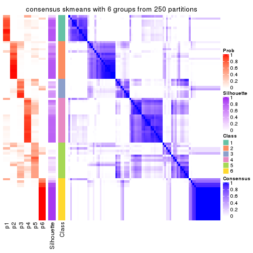</p>

</div>
</div>

Heatmaps for the membership of samples in all partitions to see how consistent they are:


<script>
$( function() {
	$( '#tabs-ATC-skmeans-membership-heatmap' ).tabs();
} );
</script>
<div id='tabs-ATC-skmeans-membership-heatmap'>
<ul>
<li><a href='#tab-ATC-skmeans-membership-heatmap-1'>k = 2</a></li>
<li><a href='#tab-ATC-skmeans-membership-heatmap-2'>k = 3</a></li>
<li><a href='#tab-ATC-skmeans-membership-heatmap-3'>k = 4</a></li>
<li><a href='#tab-ATC-skmeans-membership-heatmap-4'>k = 5</a></li>
<li><a href='#tab-ATC-skmeans-membership-heatmap-5'>k = 6</a></li>
</ul>
<div id='tab-ATC-skmeans-membership-heatmap-1'>
<pre><code class="r">membership_heatmap(res, k = 2)
</code></pre>

<p></p>

</div>
<div id='tab-ATC-skmeans-membership-heatmap-2'>
<pre><code class="r">membership_heatmap(res, k = 3)
</code></pre>

<p></p>

</div>
<div id='tab-ATC-skmeans-membership-heatmap-3'>
<pre><code class="r">membership_heatmap(res, k = 4)
</code></pre>

<p></p>

</div>
<div id='tab-ATC-skmeans-membership-heatmap-4'>
<pre><code class="r">membership_heatmap(res, k = 5)
</code></pre>

<p></p>

</div>
<div id='tab-ATC-skmeans-membership-heatmap-5'>
<pre><code class="r">membership_heatmap(res, k = 6)
</code></pre>

<p></p>

</div>
</div>

As soon as we have had the classes for columns, we can look for signatures
which are significantly different between classes which can be candidate marks
for certain classes. Following are the heatmaps for signatures.


Signature heatmaps where rows are scaled:


<script>
$( function() {
	$( '#tabs-ATC-skmeans-get-signatures' ).tabs();
} );
</script>
<div id='tabs-ATC-skmeans-get-signatures'>
<ul>
<li><a href='#tab-ATC-skmeans-get-signatures-1'>k = 2</a></li>
<li><a href='#tab-ATC-skmeans-get-signatures-2'>k = 3</a></li>
<li><a href='#tab-ATC-skmeans-get-signatures-3'>k = 4</a></li>
<li><a href='#tab-ATC-skmeans-get-signatures-4'>k = 5</a></li>
<li><a href='#tab-ATC-skmeans-get-signatures-5'>k = 6</a></li>
</ul>
<div id='tab-ATC-skmeans-get-signatures-1'>
<pre><code class="r">get_signatures(res, k = 2)
</code></pre>

<p></p>

</div>
<div id='tab-ATC-skmeans-get-signatures-2'>
<pre><code class="r">get_signatures(res, k = 3)
</code></pre>

<p></p>

</div>
<div id='tab-ATC-skmeans-get-signatures-3'>
<pre><code class="r">get_signatures(res, k = 4)
</code></pre>

<p></p>

</div>
<div id='tab-ATC-skmeans-get-signatures-4'>
<pre><code class="r">get_signatures(res, k = 5)
</code></pre>

<p></p>

</div>
<div id='tab-ATC-skmeans-get-signatures-5'>
<pre><code class="r">get_signatures(res, k = 6)
</code></pre>

<p></p>

</div>
</div>


Signature heatmaps where rows are not scaled:


<script>
$( function() {
	$( '#tabs-ATC-skmeans-get-signatures-no-scale' ).tabs();
} );
</script>
<div id='tabs-ATC-skmeans-get-signatures-no-scale'>
<ul>
<li><a href='#tab-ATC-skmeans-get-signatures-no-scale-1'>k = 2</a></li>
<li><a href='#tab-ATC-skmeans-get-signatures-no-scale-2'>k = 3</a></li>
<li><a href='#tab-ATC-skmeans-get-signatures-no-scale-3'>k = 4</a></li>
<li><a href='#tab-ATC-skmeans-get-signatures-no-scale-4'>k = 5</a></li>
<li><a href='#tab-ATC-skmeans-get-signatures-no-scale-5'>k = 6</a></li>
</ul>
<div id='tab-ATC-skmeans-get-signatures-no-scale-1'>
<pre><code class="r">get_signatures(res, k = 2, scale_rows = FALSE)
</code></pre>

<p></p>

</div>
<div id='tab-ATC-skmeans-get-signatures-no-scale-2'>
<pre><code class="r">get_signatures(res, k = 3, scale_rows = FALSE)
</code></pre>

<p></p>

</div>
<div id='tab-ATC-skmeans-get-signatures-no-scale-3'>
<pre><code class="r">get_signatures(res, k = 4, scale_rows = FALSE)
</code></pre>

<p></p>

</div>
<div id='tab-ATC-skmeans-get-signatures-no-scale-4'>
<pre><code class="r">get_signatures(res, k = 5, scale_rows = FALSE)
</code></pre>

<p></p>

</div>
<div id='tab-ATC-skmeans-get-signatures-no-scale-5'>
<pre><code class="r">get_signatures(res, k = 6, scale_rows = FALSE)
</code></pre>

<p></p>

</div>
</div>


Compare the overlap of signatures from different k:

```r
compare_signatures(res)
```


`get_signature()` returns a data frame invisibly. TO get the list of signatures, the function
call should be assigned to a variable explicitly. In following code, if `plot` argument is set
to `FALSE`, no heatmap is plotted while only the differential analysis is performed.

```r
# code only for demonstration
tb = get_signature(res, k = ..., plot = FALSE)
```

An example of the output of `tb` is:

```
#>   which_row         fdr    mean_1    mean_2 scaled_mean_1 scaled_mean_2 km
#> 1        38 0.042760348  8.373488  9.131774    -0.5533452     0.5164555  1
#> 2        40 0.018707592  7.106213  8.469186    -0.6173731     0.5762149  1
#> 3        55 0.019134737 10.221463 11.207825    -0.6159697     0.5749050  1
#> 4        59 0.006059896  5.921854  7.869574    -0.6899429     0.6439467  1
#> 5        60 0.018055526  8.928898 10.211722    -0.6204761     0.5791110  1
#> 6        98 0.009384629 15.714769 14.887706     0.6635654    -0.6193277  2
...
```

The columns in `tb` are:

1. `which_row`: row indices corresponding to the input matrix.
2. `fdr`: FDR for the differential test. 
3. `mean_x`: The mean value in group x.
4. `scaled_mean_x`: The mean value in group x after rows are scaled.
5. `km`: Row groups if k-means clustering is applied to rows.


UMAP plot which shows how samples are separated.


<script>
$( function() {
	$( '#tabs-ATC-skmeans-dimension-reduction' ).tabs();
} );
</script>
<div id='tabs-ATC-skmeans-dimension-reduction'>
<ul>
<li><a href='#tab-ATC-skmeans-dimension-reduction-1'>k = 2</a></li>
<li><a href='#tab-ATC-skmeans-dimension-reduction-2'>k = 3</a></li>
<li><a href='#tab-ATC-skmeans-dimension-reduction-3'>k = 4</a></li>
<li><a href='#tab-ATC-skmeans-dimension-reduction-4'>k = 5</a></li>
<li><a href='#tab-ATC-skmeans-dimension-reduction-5'>k = 6</a></li>
</ul>
<div id='tab-ATC-skmeans-dimension-reduction-1'>
<pre><code class="r">dimension_reduction(res, k = 2, method = &quot;UMAP&quot;)
</code></pre>

<p></p>

</div>
<div id='tab-ATC-skmeans-dimension-reduction-2'>
<pre><code class="r">dimension_reduction(res, k = 3, method = &quot;UMAP&quot;)
</code></pre>

<p></p>

</div>
<div id='tab-ATC-skmeans-dimension-reduction-3'>
<pre><code class="r">dimension_reduction(res, k = 4, method = &quot;UMAP&quot;)
</code></pre>

<p></p>

</div>
<div id='tab-ATC-skmeans-dimension-reduction-4'>
<pre><code class="r">dimension_reduction(res, k = 5, method = &quot;UMAP&quot;)
</code></pre>

<p></p>

</div>
<div id='tab-ATC-skmeans-dimension-reduction-5'>
<pre><code class="r">dimension_reduction(res, k = 6, method = &quot;UMAP&quot;)
</code></pre>

<p></p>

</div>
</div>


Following heatmap shows how subgroups are split when increasing `k`:

```r
collect_classes(res)
```


If matrix rows can be associated to genes, consider to use `functional_enrichment(res,
...)` to perform function enrichment for the signature genes. See [this vignette](http://bioconductor.org/packages/devel/bioc/vignettes/cola/inst/doc/functional_enrichment.html) for more detailed explanations.


 

---------------------------------------------------


### ATC:pam


The object with results only for a single top-value method and a single partition method 
can be extracted as:

```r
res = res_list["ATC", "pam"]
# you can also extract it by
# res = res_list["ATC:pam"]
```

A summary of `res` and all the functions that can be applied to it:

```r
res
```

```
#> A 'ConsensusPartition' object with k = 2, 3, 4, 5, 6.
#>   On a matrix with 17471 rows and 87 columns.
#>   Top rows (1000, 2000, 3000, 4000, 5000) are extracted by 'ATC' method.
#>   Subgroups are detected by 'pam' method.
#>   Performed in total 1250 partitions by row resampling.
#>   Best k for subgroups seems to be 3.
#> 
#> Following methods can be applied to this 'ConsensusPartition' object:
#>  [1] "cola_report"             "collect_classes"         "collect_plots"          
#>  [4] "collect_stats"           "colnames"                "compare_signatures"     
#>  [7] "consensus_heatmap"       "dimension_reduction"     "functional_enrichment"  
#> [10] "get_anno_col"            "get_anno"                "get_classes"            
#> [13] "get_consensus"           "get_matrix"              "get_membership"         
#> [16] "get_param"               "get_signatures"          "get_stats"              
#> [19] "is_best_k"               "is_stable_k"             "membership_heatmap"     
#> [22] "ncol"                    "nrow"                    "plot_ecdf"              
#> [25] "rownames"                "select_partition_number" "show"                   
#> [28] "suggest_best_k"          "test_to_known_factors"
```

`collect_plots()` function collects all the plots made from `res` for all `k` (number of partitions)
into one single page to provide an easy and fast comparison between different `k`.

```r
collect_plots(res)
```


The plots are:

- The first row: a plot of the ECDF (empirical cumulative distribution
  function) curves of the consensus matrix for each `k` and the heatmap of
  predicted classes for each `k`.
- The second row: heatmaps of the consensus matrix for each `k`.
- The third row: heatmaps of the membership matrix for each `k`.
- The fouth row: heatmaps of the signatures for each `k`.

All the plots in panels can be made by individual functions and they are
plotted later in this section.

`select_partition_number()` produces several plots showing different
statistics for choosing "optimized" `k`. There are following statistics:

- ECDF curves of the consensus matrix for each `k`;
- 1-PAC. [The PAC
  score](https://en.wikipedia.org/wiki/Consensus_clustering#Over-interpretation_potential_of_consensus_clustering)
  measures the proportion of the ambiguous subgrouping.
- Mean silhouette score.
- Concordance. The mean probability of fiting the consensus class ids in all
  partitions.
- Area increased. Denote $A_k$ as the area under the ECDF curve for current
  `k`, the area increased is defined as $A_k - A_{k-1}$.
- Rand index. The percent of pairs of samples that are both in a same cluster
  or both are not in a same cluster in the partition of k and k-1.
- Jaccard index. The ratio of pairs of samples are both in a same cluster in
  the partition of k and k-1 and the pairs of samples are both in a same
  cluster in the partition k or k-1.

The detailed explanations of these statistics can be found in [the _cola_
vignette](http://bioconductor.org/packages/devel/bioc/vignettes/cola/inst/doc/cola.html#toc_13).

Generally speaking, lower PAC score, higher mean silhouette score or higher
concordance corresponds to better partition. Rand index and Jaccard index
measure how similar the current partition is compared to partition with `k-1`.
If they are too similar, we won't accept `k` is better than `k-1`.

```r
select_partition_number(res)
```


The numeric values for all these statistics can be obtained by `get_stats()`.

```r
get_stats(res)
```

```
#>   k 1-PAC mean_silhouette concordance area_increased  Rand Jaccard
#> 2 2 0.659           0.892       0.930         0.4244 0.543   0.543
#> 3 3 0.679           0.899       0.945         0.4239 0.655   0.463
#> 4 4 0.686           0.726       0.871         0.2169 0.676   0.338
#> 5 5 0.762           0.787       0.866         0.0798 0.899   0.640
#> 6 6 0.790           0.713       0.868         0.0341 0.856   0.455
```

`suggest_best_k()` suggests the best $k$ based on these statistics. The rules are as follows:

- All $k$ with Jaccard index larger than 0.95 are removed because increasing
  $k$ does not provide enough extra information. If all $k$ are removed, it is
  marked as no subgroup is detected.
- For all $k$ with 1-PAC score larger than 0.9, the maximal $k$ is taken as
  the best $k$, and other $k$ are marked as optional $k$.
- If it does not fit the second rule. The $k$ with the maximal vote of the
  highest 1-PAC score, highest mean silhouette, and highest concordance is
  taken as the best $k$.

```r
suggest_best_k(res)
```

```
#> [1] 3
```


Following shows the table of the partitions (You need to click the **show/hide
code output** link to see it). The membership matrix (columns with name `p*`)
is inferred by
[`clue::cl_consensus()`](https://www.rdocumentation.org/link/cl_consensus?package=clue)
function with the `SE` method. Basically the value in the membership matrix
represents the probability to belong to a certain group. The finall class
label for an item is determined with the group with highest probability it
belongs to.

In `get_classes()` function, the entropy is calculated from the membership
matrix and the silhouette score is calculated from the consensus matrix.


<script>
$( function() {
	$( '#tabs-ATC-pam-get-classes' ).tabs();
} );
</script>
<div id='tabs-ATC-pam-get-classes'>
<ul>
<li><a href='#tab-ATC-pam-get-classes-1'>k = 2</a></li>
<li><a href='#tab-ATC-pam-get-classes-2'>k = 3</a></li>
<li><a href='#tab-ATC-pam-get-classes-3'>k = 4</a></li>
<li><a href='#tab-ATC-pam-get-classes-4'>k = 5</a></li>
<li><a href='#tab-ATC-pam-get-classes-5'>k = 6</a></li>
</ul>

<div id='tab-ATC-pam-get-classes-1'>
<p><a id='tab-ATC-pam-get-classes-1-a' style='color:#0366d6' href='#'>show/hide code output</a></p>
<pre><code class="r">cbind(get_classes(res, k = 2), get_membership(res, k = 2))
</code></pre>

<pre><code>#&gt;                                      class entropy silhouette    p1    p2
#&gt; E6088A41-B0DC-4FBF-8D14-BE78024CF8CD     1  0.1633      0.840 0.976 0.024
#&gt; F569915C-8F77-4D67-9730-30824DB57EE5     2  0.0000      0.963 0.000 1.000
#&gt; E3B71CB7-673B-4741-8607-4F0A11633036     1  0.7219      0.878 0.800 0.200
#&gt; DAF84798-FE3F-403C-B589-7F256AF752BE     2  0.1633      0.953 0.024 0.976
#&gt; 2F38E3B1-4975-4877-9DCC-C00270602180     1  0.7219      0.878 0.800 0.200
#&gt; C79A4C2F-02C4-4C03-A5A5-DE06802EEB57     2  0.0000      0.963 0.000 1.000
#&gt; 92E3ED8F-5C74-4ED2-9B03-9FA5E7B491D6     1  0.1633      0.840 0.976 0.024
#&gt; E61D60BE-3BD3-4B5E-BC12-80F3684A0959     2  0.1633      0.953 0.024 0.976
#&gt; C9388FC7-DB1D-4416-BC2D-EA643584F1E6     2  0.0000      0.963 0.000 1.000
#&gt; D4219360-6344-4AF3-ACEB-1701A9F1F67D     1  0.7219      0.878 0.800 0.200
#&gt; 07D155E6-F27C-4D09-B786-8A9B71147B72     2  0.1633      0.953 0.024 0.976
#&gt; 10C8C361-85A5-40E8-A395-B92623E6F27C     1  0.7219      0.878 0.800 0.200
#&gt; BDF20891-7C98-4A55-BBF3-8A836BE303C6     2  0.0000      0.963 0.000 1.000
#&gt; 694B0504-095E-431A-84F2-B4387072138E     1  0.7219      0.878 0.800 0.200
#&gt; EDCF8E7F-8B1D-46F7-8AE0-84A1DC9647D2     2  0.0000      0.963 0.000 1.000
#&gt; 0EA8288E-824D-4304-A053-5A833361F5C5     1  0.1633      0.840 0.976 0.024
#&gt; C4ACCFA1-34A9-4F61-8A1F-35B3B60EA193     2  0.1633      0.953 0.024 0.976
#&gt; 760BA639-38AC-4BC9-9647-09F6893EA8ED     1  0.7219      0.878 0.800 0.200
#&gt; 082DFC6B-C6E6-48B9-BDE5-74FF3B3DC954     2  0.0000      0.963 0.000 1.000
#&gt; FE349848-D7C4-4C49-B670-0E20454DDD7E     2  0.1633      0.953 0.024 0.976
#&gt; 2E8937B3-9EA1-4528-8CEE-BF3D4137908A     2  0.0000      0.963 0.000 1.000
#&gt; 9942D04E-2767-4E39-BA16-7762EAC3DFC4     1  0.1633      0.840 0.976 0.024
#&gt; F9C23182-91C4-4145-AE52-526FE8EB199D     2  0.0000      0.963 0.000 1.000
#&gt; 01024EED-7811-4E24-A067-8E0B978FFE2D     2  0.0000      0.963 0.000 1.000
#&gt; 932C8E98-A352-409C-8744-3D49FABCE425     2  0.1633      0.953 0.024 0.976
#&gt; 6DFD9439-C659-4936-84E5-108F717E3E4D     2  0.0000      0.963 0.000 1.000
#&gt; 1D8B83B8-5DD7-4F45-9D59-487EC6906A8B     1  0.1633      0.840 0.976 0.024
#&gt; 804B8503-73F6-42DE-835F-39DE2C9F13E1     2  0.0000      0.963 0.000 1.000
#&gt; B9453C9B-84D5-43BD-85BB-1780F02F039C     1  0.7219      0.878 0.800 0.200
#&gt; 836E6CD6-4E88-4028-9844-FA3C892C254A     1  0.1633      0.840 0.976 0.024
#&gt; 36EDD202-A845-4CE7-95D5-A515C471262E     2  0.0000      0.963 0.000 1.000
#&gt; 181C156A-B8F4-4F9D-93AA-6AFBD197644D     2  0.0672      0.960 0.008 0.992
#&gt; 0580E798-6A98-4E46-AC96-9A869DFF502E     2  0.1633      0.953 0.024 0.976
#&gt; EA1B63CF-D389-4567-8D9E-B0EF1F804598     1  0.7674      0.864 0.776 0.224
#&gt; 5ABC3D06-B8E9-4831-B89B-7C1EC4006B47     1  0.1633      0.840 0.976 0.024
#&gt; 1CC01E74-A7C1-4A51-9E28-1703C352BE16     2  0.2236      0.934 0.036 0.964
#&gt; 97E55B75-DBDB-46BC-9E74-7828C070BF16     2  0.2236      0.934 0.036 0.964
#&gt; BEB37A2D-E8B0-4674-89AC-DC0F34E0AFD6     2  0.1843      0.950 0.028 0.972
#&gt; 558648BA-6551-4D34-97C2-AD5F677D63FB     1  0.8813      0.743 0.700 0.300
#&gt; FF7021BB-414B-4466-BC43-372D856E6A1D     1  0.1633      0.840 0.976 0.024
#&gt; 9C04B840-54E0-425D-BDBE-8CB6B9C2C722     2  0.0000      0.963 0.000 1.000
#&gt; 5F50B1F4-1A02-4506-AA6D-9BF21CD8059A     2  0.1633      0.953 0.024 0.976
#&gt; 7D4B8FF3-7977-4ABD-AE04-EED1C50B23CC     2  0.0000      0.963 0.000 1.000
#&gt; A005AF15-B98E-4623-8AD4-1E69EFA9BC7A     2  0.1633      0.953 0.024 0.976
#&gt; 1DF04345-5C93-4B18-B307-8D1FCA532999     2  0.0000      0.963 0.000 1.000
#&gt; 6AF30C18-347E-41ED-A4AB-6F81F42206C5     1  0.7219      0.878 0.800 0.200
#&gt; 88A44ED0-BDE1-401E-B0E1-D8C8D6DBAEFC     2  0.2236      0.934 0.036 0.964
#&gt; 117673A3-2918-4702-8583-B66ADE6E4338     2  0.9170      0.331 0.332 0.668
#&gt; 4903A571-E14D-43C9-A737-22CAFAC414CD     2  0.1633      0.953 0.024 0.976
#&gt; C175E68E-632A-4B4A-9DDB-4895C4760F20     1  0.7674      0.864 0.776 0.224
#&gt; FA5CA2F4-A1AD-4A79-B8F3-73A976EB2FB1     2  0.0000      0.963 0.000 1.000
#&gt; E1F883A7-8B1F-4C1D-8A1A-9749A9C09845     2  0.0376      0.962 0.004 0.996
#&gt; E74F0729-6000-4908-ADB0-7BDBAC0639E6     1  0.7219      0.878 0.800 0.200
#&gt; F92135A9-1981-4C79-99A5-4243EEC5D30D     2  0.0000      0.963 0.000 1.000
#&gt; 73C6919F-DEB4-4DA4-B4AE-4032AC8F96C5     2  0.9998     -0.242 0.492 0.508
#&gt; 33977B40-2E92-48B6-8D3A-3EBE913F6F8A     1  0.7219      0.878 0.800 0.200
#&gt; 490BD607-2F08-4B4C-9612-F9BB5CBBC8BB     2  0.0000      0.963 0.000 1.000
#&gt; 6C666E17-2EB8-4244-BCC1-8DD34EE4173E     2  0.0000      0.963 0.000 1.000
#&gt; C41F3064-4483-4796-B860-82155BAA5157     1  0.7219      0.878 0.800 0.200
#&gt; F4232B90-51B9-43EE-9971-35B3A318758F     1  0.7219      0.878 0.800 0.200
#&gt; 291EA1F6-FC56-4429-A433-0C452A6A514C     2  0.0000      0.963 0.000 1.000
#&gt; CC4AF04D-CB8E-40DD-B12E-7AA39B38262A     1  0.9635      0.353 0.612 0.388
#&gt; 4DAE26B9-AB57-4763-BB9A-2ADDD5D9C007     2  0.1633      0.953 0.024 0.976
#&gt; 676B4AEE-FB41-4C16-AA91-03E4A1DA8E26     2  0.4298      0.874 0.088 0.912
#&gt; 1CC36859-357A-49E0-A367-4F57D47288BA     2  0.1633      0.953 0.024 0.976
#&gt; 7CCDDFC8-6DF6-4734-96AC-19EBC464FC50     2  0.2236      0.934 0.036 0.964
#&gt; 10F38C34-3956-48ED-AB62-3439EF00D46B     2  0.0000      0.963 0.000 1.000
#&gt; 80B2B393-9D6E-45B4-B696-2A5C203543B7     2  0.0000      0.963 0.000 1.000
#&gt; 5AC7B5EA-1AAC-4529-8E5A-F612E5E0719A     1  0.1633      0.840 0.976 0.024
#&gt; 3648E98D-4B3A-41B7-BE05-595D44F0150D     1  0.1633      0.840 0.976 0.024
#&gt; 252EC850-6026-473B-8FFC-2CF567EF42E4     1  0.7219      0.878 0.800 0.200
#&gt; 1790E7A3-99D8-447E-BC50-51C8A4A18853     2  0.0000      0.963 0.000 1.000
#&gt; DA61A4F8-350B-4DD1-A240-AD016520DB5B     2  0.0000      0.963 0.000 1.000
#&gt; 767E5BAF-2515-40D7-AE7D-0B24D77A03F4     2  0.0000      0.963 0.000 1.000
#&gt; 8CB9C903-D749-44EA-9137-7FB5A92C5932     1  0.1633      0.840 0.976 0.024
#&gt; A9B968AE-2243-41BC-852A-3A12C1FB4892     2  0.0000      0.963 0.000 1.000
#&gt; 3C582264-85BC-4569-A888-8EB3008E5198     2  0.2236      0.934 0.036 0.964
#&gt; F4EAF9A2-9938-4D9B-9080-C0A7542D5704     2  0.7299      0.714 0.204 0.796
#&gt; 328499D3-45DD-4B66-BD22-3C52BA92C2BB     1  0.7219      0.878 0.800 0.200
#&gt; AF8AB83D-2917-4752-8C38-CF84C565B565     1  0.7219      0.878 0.800 0.200
#&gt; 03A327CA-A9FE-42A4-844D-CA85206969FC     2  0.0000      0.963 0.000 1.000
#&gt; 4B0BEC44-87BB-4014-9A26-3529DD63760B     2  0.0000      0.963 0.000 1.000
#&gt; 05C7843E-DC89-4D8E-A78A-952C5DFD667B     2  0.1633      0.953 0.024 0.976
#&gt; 29A0FFF9-13D3-4D16-BE6A-8E48A2C4E315     2  0.0000      0.963 0.000 1.000
#&gt; 22947CC3-4F42-4F44-899C-2B7085E36C9D     2  0.0000      0.963 0.000 1.000
#&gt; A247D92D-253A-4BEC-B450-184AF90D17D0     2  0.0000      0.963 0.000 1.000
#&gt; 0D907A63-D23F-4684-80D9-0BA552435B86     2  0.1633      0.953 0.024 0.976
</code></pre>

<script>
$('#tab-ATC-pam-get-classes-1-a').parent().next().next().hide();
$('#tab-ATC-pam-get-classes-1-a').click(function(){
  $('#tab-ATC-pam-get-classes-1-a').parent().next().next().toggle();
  return(false);
});
</script>
</div>

<div id='tab-ATC-pam-get-classes-2'>
<p><a id='tab-ATC-pam-get-classes-2-a' style='color:#0366d6' href='#'>show/hide code output</a></p>
<pre><code class="r">cbind(get_classes(res, k = 3), get_membership(res, k = 3))
</code></pre>

<pre><code>#&gt;                                      class entropy silhouette    p1    p2    p3
#&gt; E6088A41-B0DC-4FBF-8D14-BE78024CF8CD     3   0.000      0.951 0.000 0.000 1.000
#&gt; F569915C-8F77-4D67-9730-30824DB57EE5     2   0.000      0.946 0.000 1.000 0.000
#&gt; E3B71CB7-673B-4741-8607-4F0A11633036     1   0.000      0.896 1.000 0.000 0.000
#&gt; DAF84798-FE3F-403C-B589-7F256AF752BE     1   0.375      0.884 0.856 0.144 0.000
#&gt; 2F38E3B1-4975-4877-9DCC-C00270602180     1   0.000      0.896 1.000 0.000 0.000
#&gt; C79A4C2F-02C4-4C03-A5A5-DE06802EEB57     2   0.000      0.946 0.000 1.000 0.000
#&gt; 92E3ED8F-5C74-4ED2-9B03-9FA5E7B491D6     3   0.375      0.880 0.144 0.000 0.856
#&gt; E61D60BE-3BD3-4B5E-BC12-80F3684A0959     1   0.388      0.876 0.848 0.152 0.000
#&gt; C9388FC7-DB1D-4416-BC2D-EA643584F1E6     2   0.000      0.946 0.000 1.000 0.000
#&gt; D4219360-6344-4AF3-ACEB-1701A9F1F67D     1   0.000      0.896 1.000 0.000 0.000
#&gt; 07D155E6-F27C-4D09-B786-8A9B71147B72     1   0.375      0.884 0.856 0.144 0.000
#&gt; 10C8C361-85A5-40E8-A395-B92623E6F27C     1   0.000      0.896 1.000 0.000 0.000
#&gt; BDF20891-7C98-4A55-BBF3-8A836BE303C6     2   0.000      0.946 0.000 1.000 0.000
#&gt; 694B0504-095E-431A-84F2-B4387072138E     2   0.375      0.824 0.144 0.856 0.000
#&gt; EDCF8E7F-8B1D-46F7-8AE0-84A1DC9647D2     2   0.000      0.946 0.000 1.000 0.000
#&gt; 0EA8288E-824D-4304-A053-5A833361F5C5     3   0.375      0.880 0.144 0.000 0.856
#&gt; C4ACCFA1-34A9-4F61-8A1F-35B3B60EA193     1   0.375      0.884 0.856 0.144 0.000
#&gt; 760BA639-38AC-4BC9-9647-09F6893EA8ED     1   0.000      0.896 1.000 0.000 0.000
#&gt; 082DFC6B-C6E6-48B9-BDE5-74FF3B3DC954     2   0.000      0.946 0.000 1.000 0.000
#&gt; FE349848-D7C4-4C49-B670-0E20454DDD7E     1   0.375      0.884 0.856 0.144 0.000
#&gt; 2E8937B3-9EA1-4528-8CEE-BF3D4137908A     2   0.000      0.946 0.000 1.000 0.000
#&gt; 9942D04E-2767-4E39-BA16-7762EAC3DFC4     3   0.000      0.951 0.000 0.000 1.000
#&gt; F9C23182-91C4-4145-AE52-526FE8EB199D     2   0.000      0.946 0.000 1.000 0.000
#&gt; 01024EED-7811-4E24-A067-8E0B978FFE2D     2   0.000      0.946 0.000 1.000 0.000
#&gt; 932C8E98-A352-409C-8744-3D49FABCE425     1   0.375      0.884 0.856 0.144 0.000
#&gt; 6DFD9439-C659-4936-84E5-108F717E3E4D     2   0.000      0.946 0.000 1.000 0.000
#&gt; 1D8B83B8-5DD7-4F45-9D59-487EC6906A8B     3   0.000      0.951 0.000 0.000 1.000
#&gt; 804B8503-73F6-42DE-835F-39DE2C9F13E1     2   0.000      0.946 0.000 1.000 0.000
#&gt; B9453C9B-84D5-43BD-85BB-1780F02F039C     2   0.630      0.199 0.480 0.520 0.000
#&gt; 836E6CD6-4E88-4028-9844-FA3C892C254A     3   0.375      0.880 0.144 0.000 0.856
#&gt; 36EDD202-A845-4CE7-95D5-A515C471262E     2   0.000      0.946 0.000 1.000 0.000
#&gt; 181C156A-B8F4-4F9D-93AA-6AFBD197644D     2   0.000      0.946 0.000 1.000 0.000
#&gt; 0580E798-6A98-4E46-AC96-9A869DFF502E     1   0.375      0.884 0.856 0.144 0.000
#&gt; EA1B63CF-D389-4567-8D9E-B0EF1F804598     2   0.375      0.824 0.144 0.856 0.000
#&gt; 5ABC3D06-B8E9-4831-B89B-7C1EC4006B47     3   0.000      0.951 0.000 0.000 1.000
#&gt; 1CC01E74-A7C1-4A51-9E28-1703C352BE16     2   0.435      0.797 0.000 0.816 0.184
#&gt; 97E55B75-DBDB-46BC-9E74-7828C070BF16     2   0.429      0.802 0.000 0.820 0.180
#&gt; BEB37A2D-E8B0-4674-89AC-DC0F34E0AFD6     1   0.369      0.885 0.860 0.140 0.000
#&gt; 558648BA-6551-4D34-97C2-AD5F677D63FB     2   0.406      0.810 0.164 0.836 0.000
#&gt; FF7021BB-414B-4466-BC43-372D856E6A1D     3   0.000      0.951 0.000 0.000 1.000
#&gt; 9C04B840-54E0-425D-BDBE-8CB6B9C2C722     2   0.000      0.946 0.000 1.000 0.000
#&gt; 5F50B1F4-1A02-4506-AA6D-9BF21CD8059A     1   0.375      0.884 0.856 0.144 0.000
#&gt; 7D4B8FF3-7977-4ABD-AE04-EED1C50B23CC     2   0.000      0.946 0.000 1.000 0.000
#&gt; A005AF15-B98E-4623-8AD4-1E69EFA9BC7A     1   0.375      0.884 0.856 0.144 0.000
#&gt; 1DF04345-5C93-4B18-B307-8D1FCA532999     2   0.000      0.946 0.000 1.000 0.000
#&gt; 6AF30C18-347E-41ED-A4AB-6F81F42206C5     1   0.000      0.896 1.000 0.000 0.000
#&gt; 88A44ED0-BDE1-401E-B0E1-D8C8D6DBAEFC     2   0.153      0.920 0.000 0.960 0.040
#&gt; 117673A3-2918-4702-8583-B66ADE6E4338     2   0.355      0.837 0.132 0.868 0.000
#&gt; 4903A571-E14D-43C9-A737-22CAFAC414CD     2   0.000      0.946 0.000 1.000 0.000
#&gt; C175E68E-632A-4B4A-9DDB-4895C4760F20     1   0.141      0.878 0.964 0.036 0.000
#&gt; FA5CA2F4-A1AD-4A79-B8F3-73A976EB2FB1     2   0.000      0.946 0.000 1.000 0.000
#&gt; E1F883A7-8B1F-4C1D-8A1A-9749A9C09845     2   0.000      0.946 0.000 1.000 0.000
#&gt; E74F0729-6000-4908-ADB0-7BDBAC0639E6     1   0.000      0.896 1.000 0.000 0.000
#&gt; F92135A9-1981-4C79-99A5-4243EEC5D30D     2   0.000      0.946 0.000 1.000 0.000
#&gt; 73C6919F-DEB4-4DA4-B4AE-4032AC8F96C5     1   0.000      0.896 1.000 0.000 0.000
#&gt; 33977B40-2E92-48B6-8D3A-3EBE913F6F8A     1   0.000      0.896 1.000 0.000 0.000
#&gt; 490BD607-2F08-4B4C-9612-F9BB5CBBC8BB     2   0.000      0.946 0.000 1.000 0.000
#&gt; 6C666E17-2EB8-4244-BCC1-8DD34EE4173E     2   0.000      0.946 0.000 1.000 0.000
#&gt; C41F3064-4483-4796-B860-82155BAA5157     1   0.000      0.896 1.000 0.000 0.000
#&gt; F4232B90-51B9-43EE-9971-35B3A318758F     1   0.000      0.896 1.000 0.000 0.000
#&gt; 291EA1F6-FC56-4429-A433-0C452A6A514C     2   0.000      0.946 0.000 1.000 0.000
#&gt; CC4AF04D-CB8E-40DD-B12E-7AA39B38262A     3   0.000      0.951 0.000 0.000 1.000
#&gt; 4DAE26B9-AB57-4763-BB9A-2ADDD5D9C007     1   0.375      0.884 0.856 0.144 0.000
#&gt; 676B4AEE-FB41-4C16-AA91-03E4A1DA8E26     2   0.497      0.735 0.000 0.764 0.236
#&gt; 1CC36859-357A-49E0-A367-4F57D47288BA     2   0.000      0.946 0.000 1.000 0.000
#&gt; 7CCDDFC8-6DF6-4734-96AC-19EBC464FC50     2   0.435      0.797 0.000 0.816 0.184
#&gt; 10F38C34-3956-48ED-AB62-3439EF00D46B     2   0.254      0.890 0.000 0.920 0.080
#&gt; 80B2B393-9D6E-45B4-B696-2A5C203543B7     2   0.000      0.946 0.000 1.000 0.000
#&gt; 5AC7B5EA-1AAC-4529-8E5A-F612E5E0719A     3   0.000      0.951 0.000 0.000 1.000
#&gt; 3648E98D-4B3A-41B7-BE05-595D44F0150D     3   0.375      0.880 0.144 0.000 0.856
#&gt; 252EC850-6026-473B-8FFC-2CF567EF42E4     1   0.000      0.896 1.000 0.000 0.000
#&gt; 1790E7A3-99D8-447E-BC50-51C8A4A18853     2   0.000      0.946 0.000 1.000 0.000
#&gt; DA61A4F8-350B-4DD1-A240-AD016520DB5B     2   0.000      0.946 0.000 1.000 0.000
#&gt; 767E5BAF-2515-40D7-AE7D-0B24D77A03F4     2   0.000      0.946 0.000 1.000 0.000
#&gt; 8CB9C903-D749-44EA-9137-7FB5A92C5932     3   0.000      0.951 0.000 0.000 1.000
#&gt; A9B968AE-2243-41BC-852A-3A12C1FB4892     1   0.435      0.841 0.816 0.184 0.000
#&gt; 3C582264-85BC-4569-A888-8EB3008E5198     2   0.435      0.797 0.000 0.816 0.184
#&gt; F4EAF9A2-9938-4D9B-9080-C0A7542D5704     3   0.000      0.951 0.000 0.000 1.000
#&gt; 328499D3-45DD-4B66-BD22-3C52BA92C2BB     1   0.000      0.896 1.000 0.000 0.000
#&gt; AF8AB83D-2917-4752-8C38-CF84C565B565     1   0.000      0.896 1.000 0.000 0.000
#&gt; 03A327CA-A9FE-42A4-844D-CA85206969FC     2   0.000      0.946 0.000 1.000 0.000
#&gt; 4B0BEC44-87BB-4014-9A26-3529DD63760B     2   0.000      0.946 0.000 1.000 0.000
#&gt; 05C7843E-DC89-4D8E-A78A-952C5DFD667B     2   0.355      0.818 0.132 0.868 0.000
#&gt; 29A0FFF9-13D3-4D16-BE6A-8E48A2C4E315     2   0.000      0.946 0.000 1.000 0.000
#&gt; 22947CC3-4F42-4F44-899C-2B7085E36C9D     2   0.000      0.946 0.000 1.000 0.000
#&gt; A247D92D-253A-4BEC-B450-184AF90D17D0     2   0.000      0.946 0.000 1.000 0.000
#&gt; 0D907A63-D23F-4684-80D9-0BA552435B86     1   0.375      0.884 0.856 0.144 0.000
</code></pre>

<script>
$('#tab-ATC-pam-get-classes-2-a').parent().next().next().hide();
$('#tab-ATC-pam-get-classes-2-a').click(function(){
  $('#tab-ATC-pam-get-classes-2-a').parent().next().next().toggle();
  return(false);
});
</script>
</div>

<div id='tab-ATC-pam-get-classes-3'>
<p><a id='tab-ATC-pam-get-classes-3-a' style='color:#0366d6' href='#'>show/hide code output</a></p>
<pre><code class="r">cbind(get_classes(res, k = 4), get_membership(res, k = 4))
</code></pre>

<pre><code>#&gt;                                      class entropy silhouette    p1    p2    p3    p4
#&gt; E6088A41-B0DC-4FBF-8D14-BE78024CF8CD     3  0.0000     0.8845 0.000 0.000 1.000 0.000
#&gt; F569915C-8F77-4D67-9730-30824DB57EE5     4  0.4454     0.6241 0.000 0.308 0.000 0.692
#&gt; E3B71CB7-673B-4741-8607-4F0A11633036     1  0.0000     0.8502 1.000 0.000 0.000 0.000
#&gt; DAF84798-FE3F-403C-B589-7F256AF752BE     4  0.0000     0.7350 0.000 0.000 0.000 1.000
#&gt; 2F38E3B1-4975-4877-9DCC-C00270602180     4  0.4222     0.4044 0.272 0.000 0.000 0.728
#&gt; C79A4C2F-02C4-4C03-A5A5-DE06802EEB57     2  0.1557     0.8334 0.056 0.944 0.000 0.000
#&gt; 92E3ED8F-5C74-4ED2-9B03-9FA5E7B491D6     1  0.2345     0.8051 0.900 0.000 0.100 0.000
#&gt; E61D60BE-3BD3-4B5E-BC12-80F3684A0959     4  0.1118     0.7377 0.000 0.036 0.000 0.964
#&gt; C9388FC7-DB1D-4416-BC2D-EA643584F1E6     2  0.0000     0.8619 0.000 1.000 0.000 0.000
#&gt; D4219360-6344-4AF3-ACEB-1701A9F1F67D     1  0.0000     0.8502 1.000 0.000 0.000 0.000
#&gt; 07D155E6-F27C-4D09-B786-8A9B71147B72     4  0.0000     0.7350 0.000 0.000 0.000 1.000
#&gt; 10C8C361-85A5-40E8-A395-B92623E6F27C     1  0.1557     0.8330 0.944 0.056 0.000 0.000
#&gt; BDF20891-7C98-4A55-BBF3-8A836BE303C6     2  0.0592     0.8576 0.016 0.984 0.000 0.000
#&gt; 694B0504-095E-431A-84F2-B4387072138E     1  0.2011     0.8174 0.920 0.080 0.000 0.000
#&gt; EDCF8E7F-8B1D-46F7-8AE0-84A1DC9647D2     2  0.0000     0.8619 0.000 1.000 0.000 0.000
#&gt; 0EA8288E-824D-4304-A053-5A833361F5C5     1  0.3610     0.7212 0.800 0.000 0.200 0.000
#&gt; C4ACCFA1-34A9-4F61-8A1F-35B3B60EA193     4  0.0707     0.7249 0.020 0.000 0.000 0.980
#&gt; 760BA639-38AC-4BC9-9647-09F6893EA8ED     1  0.0000     0.8502 1.000 0.000 0.000 0.000
#&gt; 082DFC6B-C6E6-48B9-BDE5-74FF3B3DC954     2  0.0000     0.8619 0.000 1.000 0.000 0.000
#&gt; FE349848-D7C4-4C49-B670-0E20454DDD7E     4  0.0000     0.7350 0.000 0.000 0.000 1.000
#&gt; 2E8937B3-9EA1-4528-8CEE-BF3D4137908A     2  0.0469     0.8583 0.000 0.988 0.000 0.012
#&gt; 9942D04E-2767-4E39-BA16-7762EAC3DFC4     3  0.0000     0.8845 0.000 0.000 1.000 0.000
#&gt; F9C23182-91C4-4145-AE52-526FE8EB199D     2  0.0592     0.8576 0.016 0.984 0.000 0.000
#&gt; 01024EED-7811-4E24-A067-8E0B978FFE2D     2  0.1792     0.8223 0.000 0.932 0.000 0.068
#&gt; 932C8E98-A352-409C-8744-3D49FABCE425     4  0.0000     0.7350 0.000 0.000 0.000 1.000
#&gt; 6DFD9439-C659-4936-84E5-108F717E3E4D     4  0.4961     0.3816 0.000 0.448 0.000 0.552
#&gt; 1D8B83B8-5DD7-4F45-9D59-487EC6906A8B     3  0.1557     0.8850 0.000 0.056 0.944 0.000
#&gt; 804B8503-73F6-42DE-835F-39DE2C9F13E1     2  0.1302     0.8398 0.000 0.956 0.000 0.044
#&gt; B9453C9B-84D5-43BD-85BB-1780F02F039C     1  0.0000     0.8502 1.000 0.000 0.000 0.000
#&gt; 836E6CD6-4E88-4028-9844-FA3C892C254A     3  0.4898     0.2111 0.416 0.000 0.584 0.000
#&gt; 36EDD202-A845-4CE7-95D5-A515C471262E     2  0.0000     0.8619 0.000 1.000 0.000 0.000
#&gt; 181C156A-B8F4-4F9D-93AA-6AFBD197644D     2  0.1792     0.8248 0.068 0.932 0.000 0.000
#&gt; 0580E798-6A98-4E46-AC96-9A869DFF502E     4  0.6817     0.0839 0.100 0.408 0.000 0.492
#&gt; EA1B63CF-D389-4567-8D9E-B0EF1F804598     1  0.2345     0.7988 0.900 0.100 0.000 0.000
#&gt; 5ABC3D06-B8E9-4831-B89B-7C1EC4006B47     3  0.0000     0.8845 0.000 0.000 1.000 0.000
#&gt; 1CC01E74-A7C1-4A51-9E28-1703C352BE16     3  0.3172     0.8495 0.000 0.160 0.840 0.000
#&gt; 97E55B75-DBDB-46BC-9E74-7828C070BF16     3  0.3219     0.8459 0.000 0.164 0.836 0.000
#&gt; BEB37A2D-E8B0-4674-89AC-DC0F34E0AFD6     4  0.2345     0.6672 0.100 0.000 0.000 0.900
#&gt; 558648BA-6551-4D34-97C2-AD5F677D63FB     1  0.3311     0.7270 0.828 0.172 0.000 0.000
#&gt; FF7021BB-414B-4466-BC43-372D856E6A1D     3  0.1902     0.8824 0.004 0.064 0.932 0.000
#&gt; 9C04B840-54E0-425D-BDBE-8CB6B9C2C722     2  0.2345     0.7904 0.000 0.900 0.000 0.100
#&gt; 5F50B1F4-1A02-4506-AA6D-9BF21CD8059A     4  0.0000     0.7350 0.000 0.000 0.000 1.000
#&gt; 7D4B8FF3-7977-4ABD-AE04-EED1C50B23CC     4  0.4564     0.6006 0.000 0.328 0.000 0.672
#&gt; A005AF15-B98E-4623-8AD4-1E69EFA9BC7A     2  0.6726     0.2192 0.100 0.536 0.000 0.364
#&gt; 1DF04345-5C93-4B18-B307-8D1FCA532999     2  0.0000     0.8619 0.000 1.000 0.000 0.000
#&gt; 6AF30C18-347E-41ED-A4AB-6F81F42206C5     1  0.4891     0.6319 0.680 0.012 0.000 0.308
#&gt; 88A44ED0-BDE1-401E-B0E1-D8C8D6DBAEFC     2  0.5143     0.0133 0.004 0.540 0.456 0.000
#&gt; 117673A3-2918-4702-8583-B66ADE6E4338     2  0.5599     0.4878 0.288 0.664 0.000 0.048
#&gt; 4903A571-E14D-43C9-A737-22CAFAC414CD     4  0.4454     0.6241 0.000 0.308 0.000 0.692
#&gt; C175E68E-632A-4B4A-9DDB-4895C4760F20     1  0.1637     0.8311 0.940 0.060 0.000 0.000
#&gt; FA5CA2F4-A1AD-4A79-B8F3-73A976EB2FB1     2  0.0000     0.8619 0.000 1.000 0.000 0.000
#&gt; E1F883A7-8B1F-4C1D-8A1A-9749A9C09845     2  0.4250     0.4949 0.000 0.724 0.000 0.276
#&gt; E74F0729-6000-4908-ADB0-7BDBAC0639E6     1  0.0000     0.8502 1.000 0.000 0.000 0.000
#&gt; F92135A9-1981-4C79-99A5-4243EEC5D30D     2  0.0000     0.8619 0.000 1.000 0.000 0.000
#&gt; 73C6919F-DEB4-4DA4-B4AE-4032AC8F96C5     4  0.2281     0.6708 0.096 0.000 0.000 0.904
#&gt; 33977B40-2E92-48B6-8D3A-3EBE913F6F8A     1  0.2760     0.7992 0.872 0.000 0.000 0.128
#&gt; 490BD607-2F08-4B4C-9612-F9BB5CBBC8BB     2  0.1118     0.8471 0.000 0.964 0.000 0.036
#&gt; 6C666E17-2EB8-4244-BCC1-8DD34EE4173E     2  0.1940     0.8155 0.000 0.924 0.000 0.076
#&gt; C41F3064-4483-4796-B860-82155BAA5157     4  0.2345     0.6672 0.100 0.000 0.000 0.900
#&gt; F4232B90-51B9-43EE-9971-35B3A318758F     1  0.4454     0.6400 0.692 0.000 0.000 0.308
#&gt; 291EA1F6-FC56-4429-A433-0C452A6A514C     2  0.0000     0.8619 0.000 1.000 0.000 0.000
#&gt; CC4AF04D-CB8E-40DD-B12E-7AA39B38262A     3  0.0000     0.8845 0.000 0.000 1.000 0.000
#&gt; 4DAE26B9-AB57-4763-BB9A-2ADDD5D9C007     4  0.0000     0.7350 0.000 0.000 0.000 1.000
#&gt; 676B4AEE-FB41-4C16-AA91-03E4A1DA8E26     3  0.3123     0.8518 0.000 0.156 0.844 0.000
#&gt; 1CC36859-357A-49E0-A367-4F57D47288BA     4  0.4454     0.6241 0.000 0.308 0.000 0.692
#&gt; 7CCDDFC8-6DF6-4734-96AC-19EBC464FC50     3  0.3172     0.8495 0.000 0.160 0.840 0.000
#&gt; 10F38C34-3956-48ED-AB62-3439EF00D46B     2  0.3311     0.7025 0.000 0.828 0.172 0.000
#&gt; 80B2B393-9D6E-45B4-B696-2A5C203543B7     2  0.0000     0.8619 0.000 1.000 0.000 0.000
#&gt; 5AC7B5EA-1AAC-4529-8E5A-F612E5E0719A     3  0.0376     0.8849 0.004 0.004 0.992 0.000
#&gt; 3648E98D-4B3A-41B7-BE05-595D44F0150D     1  0.3074     0.7688 0.848 0.000 0.152 0.000
#&gt; 252EC850-6026-473B-8FFC-2CF567EF42E4     1  0.4454     0.6400 0.692 0.000 0.000 0.308
#&gt; 1790E7A3-99D8-447E-BC50-51C8A4A18853     2  0.0000     0.8619 0.000 1.000 0.000 0.000
#&gt; DA61A4F8-350B-4DD1-A240-AD016520DB5B     2  0.1792     0.8247 0.000 0.932 0.000 0.068
#&gt; 767E5BAF-2515-40D7-AE7D-0B24D77A03F4     4  0.4454     0.6241 0.000 0.308 0.000 0.692
#&gt; 8CB9C903-D749-44EA-9137-7FB5A92C5932     3  0.0000     0.8845 0.000 0.000 1.000 0.000
#&gt; A9B968AE-2243-41BC-852A-3A12C1FB4892     2  0.5866     0.3731 0.052 0.624 0.000 0.324
#&gt; 3C582264-85BC-4569-A888-8EB3008E5198     3  0.3172     0.8495 0.000 0.160 0.840 0.000
#&gt; F4EAF9A2-9938-4D9B-9080-C0A7542D5704     3  0.0707     0.8866 0.000 0.020 0.980 0.000
#&gt; 328499D3-45DD-4B66-BD22-3C52BA92C2BB     1  0.0000     0.8502 1.000 0.000 0.000 0.000
#&gt; AF8AB83D-2917-4752-8C38-CF84C565B565     1  0.4454     0.6400 0.692 0.000 0.000 0.308
#&gt; 03A327CA-A9FE-42A4-844D-CA85206969FC     4  0.4454     0.6241 0.000 0.308 0.000 0.692
#&gt; 4B0BEC44-87BB-4014-9A26-3529DD63760B     4  0.4624     0.5860 0.000 0.340 0.000 0.660
#&gt; 05C7843E-DC89-4D8E-A78A-952C5DFD667B     4  0.4454     0.6241 0.000 0.308 0.000 0.692
#&gt; 29A0FFF9-13D3-4D16-BE6A-8E48A2C4E315     4  0.4972     0.3564 0.000 0.456 0.000 0.544
#&gt; 22947CC3-4F42-4F44-899C-2B7085E36C9D     2  0.0000     0.8619 0.000 1.000 0.000 0.000
#&gt; A247D92D-253A-4BEC-B450-184AF90D17D0     2  0.4661     0.2560 0.000 0.652 0.000 0.348
#&gt; 0D907A63-D23F-4684-80D9-0BA552435B86     4  0.0000     0.7350 0.000 0.000 0.000 1.000
</code></pre>

<script>
$('#tab-ATC-pam-get-classes-3-a').parent().next().next().hide();
$('#tab-ATC-pam-get-classes-3-a').click(function(){
  $('#tab-ATC-pam-get-classes-3-a').parent().next().next().toggle();
  return(false);
});
</script>
</div>

<div id='tab-ATC-pam-get-classes-4'>
<p><a id='tab-ATC-pam-get-classes-4-a' style='color:#0366d6' href='#'>show/hide code output</a></p>
<pre><code class="r">cbind(get_classes(res, k = 5), get_membership(res, k = 5))
</code></pre>

<pre><code>#&gt;                                      class entropy silhouette    p1    p2    p3    p4    p5
#&gt; E6088A41-B0DC-4FBF-8D14-BE78024CF8CD     5  0.3432     0.8472 0.132 0.000 0.000 0.040 0.828
#&gt; F569915C-8F77-4D67-9730-30824DB57EE5     3  0.0000     0.9002 0.000 0.000 1.000 0.000 0.000
#&gt; E3B71CB7-673B-4741-8607-4F0A11633036     1  0.2424     0.8338 0.868 0.000 0.000 0.132 0.000
#&gt; DAF84798-FE3F-403C-B589-7F256AF752BE     3  0.0000     0.9002 0.000 0.000 1.000 0.000 0.000
#&gt; 2F38E3B1-4975-4877-9DCC-C00270602180     4  0.1282     0.9030 0.004 0.000 0.044 0.952 0.000
#&gt; C79A4C2F-02C4-4C03-A5A5-DE06802EEB57     2  0.0794     0.8534 0.028 0.972 0.000 0.000 0.000
#&gt; 92E3ED8F-5C74-4ED2-9B03-9FA5E7B491D6     1  0.0000     0.8109 1.000 0.000 0.000 0.000 0.000
#&gt; E61D60BE-3BD3-4B5E-BC12-80F3684A0959     3  0.0000     0.9002 0.000 0.000 1.000 0.000 0.000
#&gt; C9388FC7-DB1D-4416-BC2D-EA643584F1E6     2  0.0000     0.8588 0.000 1.000 0.000 0.000 0.000
#&gt; D4219360-6344-4AF3-ACEB-1701A9F1F67D     1  0.2852     0.8094 0.828 0.000 0.000 0.172 0.000
#&gt; 07D155E6-F27C-4D09-B786-8A9B71147B72     4  0.4302     0.1199 0.000 0.000 0.480 0.520 0.000
#&gt; 10C8C361-85A5-40E8-A395-B92623E6F27C     1  0.2905     0.8269 0.868 0.096 0.000 0.036 0.000
#&gt; BDF20891-7C98-4A55-BBF3-8A836BE303C6     2  0.0703     0.8547 0.024 0.976 0.000 0.000 0.000
#&gt; 694B0504-095E-431A-84F2-B4387072138E     1  0.2424     0.8129 0.868 0.132 0.000 0.000 0.000
#&gt; EDCF8E7F-8B1D-46F7-8AE0-84A1DC9647D2     2  0.0000     0.8588 0.000 1.000 0.000 0.000 0.000
#&gt; 0EA8288E-824D-4304-A053-5A833361F5C5     1  0.1670     0.7776 0.936 0.000 0.000 0.012 0.052
#&gt; C4ACCFA1-34A9-4F61-8A1F-35B3B60EA193     3  0.1608     0.8421 0.000 0.000 0.928 0.072 0.000
#&gt; 760BA639-38AC-4BC9-9647-09F6893EA8ED     1  0.2424     0.8338 0.868 0.000 0.000 0.132 0.000
#&gt; 082DFC6B-C6E6-48B9-BDE5-74FF3B3DC954     2  0.1792     0.8493 0.000 0.916 0.000 0.000 0.084
#&gt; FE349848-D7C4-4C49-B670-0E20454DDD7E     3  0.0000     0.9002 0.000 0.000 1.000 0.000 0.000
#&gt; 2E8937B3-9EA1-4528-8CEE-BF3D4137908A     2  0.0609     0.8574 0.000 0.980 0.020 0.000 0.000
#&gt; 9942D04E-2767-4E39-BA16-7762EAC3DFC4     5  0.3578     0.8457 0.132 0.000 0.000 0.048 0.820
#&gt; F9C23182-91C4-4145-AE52-526FE8EB199D     2  0.0703     0.8547 0.024 0.976 0.000 0.000 0.000
#&gt; 01024EED-7811-4E24-A067-8E0B978FFE2D     2  0.2825     0.8220 0.000 0.860 0.124 0.000 0.016
#&gt; 932C8E98-A352-409C-8744-3D49FABCE425     3  0.0000     0.9002 0.000 0.000 1.000 0.000 0.000
#&gt; 6DFD9439-C659-4936-84E5-108F717E3E4D     3  0.4291     0.1022 0.000 0.464 0.536 0.000 0.000
#&gt; 1D8B83B8-5DD7-4F45-9D59-487EC6906A8B     5  0.3750     0.8416 0.084 0.072 0.000 0.012 0.832
#&gt; 804B8503-73F6-42DE-835F-39DE2C9F13E1     2  0.2516     0.8454 0.000 0.860 0.000 0.000 0.140
#&gt; B9453C9B-84D5-43BD-85BB-1780F02F039C     1  0.2424     0.8338 0.868 0.000 0.000 0.132 0.000
#&gt; 836E6CD6-4E88-4028-9844-FA3C892C254A     1  0.5236    -0.0701 0.544 0.000 0.000 0.048 0.408
#&gt; 36EDD202-A845-4CE7-95D5-A515C471262E     2  0.2280     0.8491 0.000 0.880 0.000 0.000 0.120
#&gt; 181C156A-B8F4-4F9D-93AA-6AFBD197644D     2  0.2351     0.8358 0.000 0.896 0.000 0.088 0.016
#&gt; 0580E798-6A98-4E46-AC96-9A869DFF502E     4  0.1197     0.9028 0.000 0.000 0.048 0.952 0.000
#&gt; EA1B63CF-D389-4567-8D9E-B0EF1F804598     1  0.2424     0.8129 0.868 0.132 0.000 0.000 0.000
#&gt; 5ABC3D06-B8E9-4831-B89B-7C1EC4006B47     5  0.3578     0.8457 0.132 0.000 0.000 0.048 0.820
#&gt; 1CC01E74-A7C1-4A51-9E28-1703C352BE16     5  0.0794     0.8417 0.000 0.028 0.000 0.000 0.972
#&gt; 97E55B75-DBDB-46BC-9E74-7828C070BF16     5  0.0880     0.8395 0.000 0.032 0.000 0.000 0.968
#&gt; BEB37A2D-E8B0-4674-89AC-DC0F34E0AFD6     4  0.1197     0.9028 0.000 0.000 0.048 0.952 0.000
#&gt; 558648BA-6551-4D34-97C2-AD5F677D63FB     1  0.4676     0.7075 0.720 0.208 0.000 0.072 0.000
#&gt; FF7021BB-414B-4466-BC43-372D856E6A1D     5  0.3482     0.8378 0.052 0.096 0.000 0.008 0.844
#&gt; 9C04B840-54E0-425D-BDBE-8CB6B9C2C722     2  0.2020     0.8353 0.000 0.900 0.100 0.000 0.000
#&gt; 5F50B1F4-1A02-4506-AA6D-9BF21CD8059A     3  0.0000     0.9002 0.000 0.000 1.000 0.000 0.000
#&gt; 7D4B8FF3-7977-4ABD-AE04-EED1C50B23CC     3  0.0794     0.8832 0.000 0.028 0.972 0.000 0.000
#&gt; A005AF15-B98E-4623-8AD4-1E69EFA9BC7A     4  0.1331     0.8890 0.000 0.040 0.008 0.952 0.000
#&gt; 1DF04345-5C93-4B18-B307-8D1FCA532999     2  0.2813     0.8361 0.000 0.832 0.000 0.000 0.168
#&gt; 6AF30C18-347E-41ED-A4AB-6F81F42206C5     4  0.1364     0.8891 0.036 0.012 0.000 0.952 0.000
#&gt; 88A44ED0-BDE1-401E-B0E1-D8C8D6DBAEFC     5  0.4307     0.0225 0.000 0.496 0.000 0.000 0.504
#&gt; 117673A3-2918-4702-8583-B66ADE6E4338     2  0.6643     0.4589 0.124 0.584 0.240 0.000 0.052
#&gt; 4903A571-E14D-43C9-A737-22CAFAC414CD     3  0.0000     0.9002 0.000 0.000 1.000 0.000 0.000
#&gt; C175E68E-632A-4B4A-9DDB-4895C4760F20     1  0.2848     0.8248 0.868 0.104 0.000 0.028 0.000
#&gt; FA5CA2F4-A1AD-4A79-B8F3-73A976EB2FB1     2  0.2852     0.8341 0.000 0.828 0.000 0.000 0.172
#&gt; E1F883A7-8B1F-4C1D-8A1A-9749A9C09845     2  0.3752     0.6177 0.000 0.708 0.292 0.000 0.000
#&gt; E74F0729-6000-4908-ADB0-7BDBAC0639E6     1  0.2424     0.8338 0.868 0.000 0.000 0.132 0.000
#&gt; F92135A9-1981-4C79-99A5-4243EEC5D30D     2  0.2773     0.8380 0.000 0.836 0.000 0.000 0.164
#&gt; 73C6919F-DEB4-4DA4-B4AE-4032AC8F96C5     4  0.1270     0.9000 0.000 0.000 0.052 0.948 0.000
#&gt; 33977B40-2E92-48B6-8D3A-3EBE913F6F8A     1  0.4114     0.5007 0.624 0.000 0.000 0.376 0.000
#&gt; 490BD607-2F08-4B4C-9612-F9BB5CBBC8BB     2  0.2852     0.7420 0.000 0.828 0.172 0.000 0.000
#&gt; 6C666E17-2EB8-4244-BCC1-8DD34EE4173E     2  0.2605     0.8053 0.000 0.852 0.148 0.000 0.000
#&gt; C41F3064-4483-4796-B860-82155BAA5157     4  0.1197     0.9028 0.000 0.000 0.048 0.952 0.000
#&gt; F4232B90-51B9-43EE-9971-35B3A318758F     4  0.1197     0.8845 0.048 0.000 0.000 0.952 0.000
#&gt; 291EA1F6-FC56-4429-A433-0C452A6A514C     2  0.2852     0.8341 0.000 0.828 0.000 0.000 0.172
#&gt; CC4AF04D-CB8E-40DD-B12E-7AA39B38262A     5  0.3432     0.8472 0.132 0.000 0.000 0.040 0.828
#&gt; 4DAE26B9-AB57-4763-BB9A-2ADDD5D9C007     3  0.0000     0.9002 0.000 0.000 1.000 0.000 0.000
#&gt; 676B4AEE-FB41-4C16-AA91-03E4A1DA8E26     5  0.2230     0.8209 0.000 0.116 0.000 0.000 0.884
#&gt; 1CC36859-357A-49E0-A367-4F57D47288BA     3  0.0000     0.9002 0.000 0.000 1.000 0.000 0.000
#&gt; 7CCDDFC8-6DF6-4734-96AC-19EBC464FC50     5  0.0794     0.8417 0.000 0.028 0.000 0.000 0.972
#&gt; 10F38C34-3956-48ED-AB62-3439EF00D46B     2  0.3452     0.6785 0.000 0.756 0.000 0.000 0.244
#&gt; 80B2B393-9D6E-45B4-B696-2A5C203543B7     2  0.1121     0.8621 0.000 0.956 0.000 0.000 0.044
#&gt; 5AC7B5EA-1AAC-4529-8E5A-F612E5E0719A     5  0.3446     0.8460 0.144 0.016 0.000 0.012 0.828
#&gt; 3648E98D-4B3A-41B7-BE05-595D44F0150D     1  0.1493     0.7872 0.948 0.000 0.000 0.024 0.028
#&gt; 252EC850-6026-473B-8FFC-2CF567EF42E4     4  0.1399     0.8897 0.028 0.020 0.000 0.952 0.000
#&gt; 1790E7A3-99D8-447E-BC50-51C8A4A18853     2  0.2852     0.8341 0.000 0.828 0.000 0.000 0.172
#&gt; DA61A4F8-350B-4DD1-A240-AD016520DB5B     2  0.3636     0.5913 0.000 0.728 0.272 0.000 0.000
#&gt; 767E5BAF-2515-40D7-AE7D-0B24D77A03F4     3  0.0000     0.9002 0.000 0.000 1.000 0.000 0.000
#&gt; 8CB9C903-D749-44EA-9137-7FB5A92C5932     5  0.3578     0.8457 0.132 0.000 0.000 0.048 0.820
#&gt; A9B968AE-2243-41BC-852A-3A12C1FB4892     4  0.2516     0.7924 0.000 0.140 0.000 0.860 0.000
#&gt; 3C582264-85BC-4569-A888-8EB3008E5198     5  0.0794     0.8417 0.000 0.028 0.000 0.000 0.972
#&gt; F4EAF9A2-9938-4D9B-9080-C0A7542D5704     5  0.0703     0.8425 0.000 0.024 0.000 0.000 0.976
#&gt; 328499D3-45DD-4B66-BD22-3C52BA92C2BB     1  0.2424     0.8338 0.868 0.000 0.000 0.132 0.000
#&gt; AF8AB83D-2917-4752-8C38-CF84C565B565     4  0.1197     0.8845 0.048 0.000 0.000 0.952 0.000
#&gt; 03A327CA-A9FE-42A4-844D-CA85206969FC     3  0.0000     0.9002 0.000 0.000 1.000 0.000 0.000
#&gt; 4B0BEC44-87BB-4014-9A26-3529DD63760B     3  0.1478     0.8540 0.000 0.064 0.936 0.000 0.000
#&gt; 05C7843E-DC89-4D8E-A78A-952C5DFD667B     3  0.0000     0.9002 0.000 0.000 1.000 0.000 0.000
#&gt; 29A0FFF9-13D3-4D16-BE6A-8E48A2C4E315     3  0.4341     0.2480 0.000 0.404 0.592 0.000 0.004
#&gt; 22947CC3-4F42-4F44-899C-2B7085E36C9D     2  0.0609     0.8609 0.000 0.980 0.000 0.000 0.020
#&gt; A247D92D-253A-4BEC-B450-184AF90D17D0     3  0.5027     0.4750 0.000 0.304 0.640 0.000 0.056
#&gt; 0D907A63-D23F-4684-80D9-0BA552435B86     3  0.1544     0.8438 0.000 0.000 0.932 0.068 0.000
</code></pre>

<script>
$('#tab-ATC-pam-get-classes-4-a').parent().next().next().hide();
$('#tab-ATC-pam-get-classes-4-a').click(function(){
  $('#tab-ATC-pam-get-classes-4-a').parent().next().next().toggle();
  return(false);
});
</script>
</div>

<div id='tab-ATC-pam-get-classes-5'>
<p><a id='tab-ATC-pam-get-classes-5-a' style='color:#0366d6' href='#'>show/hide code output</a></p>
<pre><code class="r">cbind(get_classes(res, k = 6), get_membership(res, k = 6))
</code></pre>

<pre><code>#&gt;                                      class entropy silhouette    p1    p2    p3    p4    p5    p6
#&gt; E6088A41-B0DC-4FBF-8D14-BE78024CF8CD     6  0.4215     0.7477 0.056 0.244 0.000 0.000 0.000 0.700
#&gt; F569915C-8F77-4D67-9730-30824DB57EE5     5  0.0000     0.8636 0.000 0.000 0.000 0.000 1.000 0.000
#&gt; E3B71CB7-673B-4741-8607-4F0A11633036     1  0.0000     0.9101 1.000 0.000 0.000 0.000 0.000 0.000
#&gt; DAF84798-FE3F-403C-B589-7F256AF752BE     5  0.0000     0.8636 0.000 0.000 0.000 0.000 1.000 0.000
#&gt; 2F38E3B1-4975-4877-9DCC-C00270602180     4  0.0000     0.9353 0.000 0.000 0.000 1.000 0.000 0.000
#&gt; C79A4C2F-02C4-4C03-A5A5-DE06802EEB57     3  0.3804     0.1195 0.424 0.000 0.576 0.000 0.000 0.000
#&gt; 92E3ED8F-5C74-4ED2-9B03-9FA5E7B491D6     1  0.0000     0.9101 1.000 0.000 0.000 0.000 0.000 0.000
#&gt; E61D60BE-3BD3-4B5E-BC12-80F3684A0959     5  0.0000     0.8636 0.000 0.000 0.000 0.000 1.000 0.000
#&gt; C9388FC7-DB1D-4416-BC2D-EA643584F1E6     3  0.0000     0.6879 0.000 0.000 1.000 0.000 0.000 0.000
#&gt; D4219360-6344-4AF3-ACEB-1701A9F1F67D     1  0.2762     0.7541 0.804 0.000 0.000 0.196 0.000 0.000
#&gt; 07D155E6-F27C-4D09-B786-8A9B71147B72     4  0.3860     0.0728 0.000 0.000 0.000 0.528 0.472 0.000
#&gt; 10C8C361-85A5-40E8-A395-B92623E6F27C     1  0.0000     0.9101 1.000 0.000 0.000 0.000 0.000 0.000
#&gt; BDF20891-7C98-4A55-BBF3-8A836BE303C6     3  0.0000     0.6879 0.000 0.000 1.000 0.000 0.000 0.000
#&gt; 694B0504-095E-431A-84F2-B4387072138E     1  0.0000     0.9101 1.000 0.000 0.000 0.000 0.000 0.000
#&gt; EDCF8E7F-8B1D-46F7-8AE0-84A1DC9647D2     3  0.0000     0.6879 0.000 0.000 1.000 0.000 0.000 0.000
#&gt; 0EA8288E-824D-4304-A053-5A833361F5C5     1  0.3017     0.7632 0.816 0.020 0.000 0.000 0.000 0.164
#&gt; C4ACCFA1-34A9-4F61-8A1F-35B3B60EA193     5  0.1444     0.8195 0.000 0.000 0.000 0.072 0.928 0.000
#&gt; 760BA639-38AC-4BC9-9647-09F6893EA8ED     1  0.0000     0.9101 1.000 0.000 0.000 0.000 0.000 0.000
#&gt; 082DFC6B-C6E6-48B9-BDE5-74FF3B3DC954     3  0.2378     0.6340 0.000 0.152 0.848 0.000 0.000 0.000
#&gt; FE349848-D7C4-4C49-B670-0E20454DDD7E     5  0.0000     0.8636 0.000 0.000 0.000 0.000 1.000 0.000
#&gt; 2E8937B3-9EA1-4528-8CEE-BF3D4137908A     3  0.0000     0.6879 0.000 0.000 1.000 0.000 0.000 0.000
#&gt; 9942D04E-2767-4E39-BA16-7762EAC3DFC4     6  0.0000     0.8964 0.000 0.000 0.000 0.000 0.000 1.000
#&gt; F9C23182-91C4-4145-AE52-526FE8EB199D     3  0.0000     0.6879 0.000 0.000 1.000 0.000 0.000 0.000
#&gt; 01024EED-7811-4E24-A067-8E0B978FFE2D     3  0.3956     0.2350 0.000 0.264 0.704 0.000 0.032 0.000
#&gt; 932C8E98-A352-409C-8744-3D49FABCE425     5  0.0000     0.8636 0.000 0.000 0.000 0.000 1.000 0.000
#&gt; 6DFD9439-C659-4936-84E5-108F717E3E4D     5  0.1501     0.8284 0.000 0.000 0.076 0.000 0.924 0.000
#&gt; 1D8B83B8-5DD7-4F45-9D59-487EC6906A8B     3  0.5202     0.4542 0.000 0.260 0.600 0.000 0.000 0.140
#&gt; 804B8503-73F6-42DE-835F-39DE2C9F13E1     2  0.3563     0.6931 0.000 0.664 0.336 0.000 0.000 0.000
#&gt; B9453C9B-84D5-43BD-85BB-1780F02F039C     1  0.0000     0.9101 1.000 0.000 0.000 0.000 0.000 0.000
#&gt; 836E6CD6-4E88-4028-9844-FA3C892C254A     6  0.0000     0.8964 0.000 0.000 0.000 0.000 0.000 1.000
#&gt; 36EDD202-A845-4CE7-95D5-A515C471262E     2  0.3747     0.6198 0.000 0.604 0.396 0.000 0.000 0.000
#&gt; 181C156A-B8F4-4F9D-93AA-6AFBD197644D     2  0.5606     0.4979 0.000 0.468 0.412 0.112 0.008 0.000
#&gt; 0580E798-6A98-4E46-AC96-9A869DFF502E     4  0.0000     0.9353 0.000 0.000 0.000 1.000 0.000 0.000
#&gt; EA1B63CF-D389-4567-8D9E-B0EF1F804598     1  0.0000     0.9101 1.000 0.000 0.000 0.000 0.000 0.000
#&gt; 5ABC3D06-B8E9-4831-B89B-7C1EC4006B47     6  0.0000     0.8964 0.000 0.000 0.000 0.000 0.000 1.000
#&gt; 1CC01E74-A7C1-4A51-9E28-1703C352BE16     2  0.0000     0.6864 0.000 1.000 0.000 0.000 0.000 0.000
#&gt; 97E55B75-DBDB-46BC-9E74-7828C070BF16     2  0.0000     0.6864 0.000 1.000 0.000 0.000 0.000 0.000
#&gt; BEB37A2D-E8B0-4674-89AC-DC0F34E0AFD6     4  0.0000     0.9353 0.000 0.000 0.000 1.000 0.000 0.000
#&gt; 558648BA-6551-4D34-97C2-AD5F677D63FB     1  0.3619     0.6523 0.744 0.000 0.232 0.024 0.000 0.000
#&gt; FF7021BB-414B-4466-BC43-372D856E6A1D     3  0.5042     0.4812 0.000 0.288 0.604 0.000 0.000 0.108
#&gt; 9C04B840-54E0-425D-BDBE-8CB6B9C2C722     5  0.3765     0.3904 0.000 0.000 0.404 0.000 0.596 0.000
#&gt; 5F50B1F4-1A02-4506-AA6D-9BF21CD8059A     5  0.0000     0.8636 0.000 0.000 0.000 0.000 1.000 0.000
#&gt; 7D4B8FF3-7977-4ABD-AE04-EED1C50B23CC     5  0.1327     0.8311 0.000 0.000 0.064 0.000 0.936 0.000
#&gt; A005AF15-B98E-4623-8AD4-1E69EFA9BC7A     4  0.0000     0.9353 0.000 0.000 0.000 1.000 0.000 0.000
#&gt; 1DF04345-5C93-4B18-B307-8D1FCA532999     2  0.3175     0.7536 0.000 0.744 0.256 0.000 0.000 0.000
#&gt; 6AF30C18-347E-41ED-A4AB-6F81F42206C5     4  0.0000     0.9353 0.000 0.000 0.000 1.000 0.000 0.000
#&gt; 88A44ED0-BDE1-401E-B0E1-D8C8D6DBAEFC     3  0.3727     0.5061 0.000 0.388 0.612 0.000 0.000 0.000
#&gt; 117673A3-2918-4702-8583-B66ADE6E4338     3  0.2907     0.6347 0.020 0.152 0.828 0.000 0.000 0.000
#&gt; 4903A571-E14D-43C9-A737-22CAFAC414CD     5  0.0000     0.8636 0.000 0.000 0.000 0.000 1.000 0.000
#&gt; C175E68E-632A-4B4A-9DDB-4895C4760F20     1  0.0000     0.9101 1.000 0.000 0.000 0.000 0.000 0.000
#&gt; FA5CA2F4-A1AD-4A79-B8F3-73A976EB2FB1     2  0.3101     0.7568 0.000 0.756 0.244 0.000 0.000 0.000
#&gt; E1F883A7-8B1F-4C1D-8A1A-9749A9C09845     5  0.2562     0.7228 0.000 0.000 0.172 0.000 0.828 0.000
#&gt; E74F0729-6000-4908-ADB0-7BDBAC0639E6     1  0.0000     0.9101 1.000 0.000 0.000 0.000 0.000 0.000
#&gt; F92135A9-1981-4C79-99A5-4243EEC5D30D     2  0.3330     0.7381 0.000 0.716 0.284 0.000 0.000 0.000
#&gt; 73C6919F-DEB4-4DA4-B4AE-4032AC8F96C5     4  0.0146     0.9308 0.000 0.000 0.000 0.996 0.004 0.000
#&gt; 33977B40-2E92-48B6-8D3A-3EBE913F6F8A     1  0.3198     0.6406 0.740 0.000 0.000 0.260 0.000 0.000
#&gt; 490BD607-2F08-4B4C-9612-F9BB5CBBC8BB     3  0.0000     0.6879 0.000 0.000 1.000 0.000 0.000 0.000
#&gt; 6C666E17-2EB8-4244-BCC1-8DD34EE4173E     5  0.3747     0.4056 0.000 0.000 0.396 0.000 0.604 0.000
#&gt; C41F3064-4483-4796-B860-82155BAA5157     4  0.0000     0.9353 0.000 0.000 0.000 1.000 0.000 0.000
#&gt; F4232B90-51B9-43EE-9971-35B3A318758F     4  0.0000     0.9353 0.000 0.000 0.000 1.000 0.000 0.000
#&gt; 291EA1F6-FC56-4429-A433-0C452A6A514C     2  0.3101     0.7568 0.000 0.756 0.244 0.000 0.000 0.000
#&gt; CC4AF04D-CB8E-40DD-B12E-7AA39B38262A     6  0.3101     0.7699 0.000 0.244 0.000 0.000 0.000 0.756
#&gt; 4DAE26B9-AB57-4763-BB9A-2ADDD5D9C007     5  0.0000     0.8636 0.000 0.000 0.000 0.000 1.000 0.000
#&gt; 676B4AEE-FB41-4C16-AA91-03E4A1DA8E26     3  0.3747     0.4991 0.000 0.396 0.604 0.000 0.000 0.000
#&gt; 1CC36859-357A-49E0-A367-4F57D47288BA     5  0.0000     0.8636 0.000 0.000 0.000 0.000 1.000 0.000
#&gt; 7CCDDFC8-6DF6-4734-96AC-19EBC464FC50     2  0.0000     0.6864 0.000 1.000 0.000 0.000 0.000 0.000
#&gt; 10F38C34-3956-48ED-AB62-3439EF00D46B     3  0.2340     0.6364 0.000 0.148 0.852 0.000 0.000 0.000
#&gt; 80B2B393-9D6E-45B4-B696-2A5C203543B7     3  0.3607    -0.0318 0.000 0.348 0.652 0.000 0.000 0.000
#&gt; 5AC7B5EA-1AAC-4529-8E5A-F612E5E0719A     3  0.7488     0.0962 0.220 0.244 0.372 0.000 0.000 0.164
#&gt; 3648E98D-4B3A-41B7-BE05-595D44F0150D     1  0.2762     0.7513 0.804 0.000 0.000 0.000 0.000 0.196
#&gt; 252EC850-6026-473B-8FFC-2CF567EF42E4     4  0.0000     0.9353 0.000 0.000 0.000 1.000 0.000 0.000
#&gt; 1790E7A3-99D8-447E-BC50-51C8A4A18853     2  0.3101     0.7568 0.000 0.756 0.244 0.000 0.000 0.000
#&gt; DA61A4F8-350B-4DD1-A240-AD016520DB5B     3  0.0000     0.6879 0.000 0.000 1.000 0.000 0.000 0.000
#&gt; 767E5BAF-2515-40D7-AE7D-0B24D77A03F4     5  0.3647     0.3582 0.000 0.000 0.360 0.000 0.640 0.000
#&gt; 8CB9C903-D749-44EA-9137-7FB5A92C5932     6  0.0000     0.8964 0.000 0.000 0.000 0.000 0.000 1.000
#&gt; A9B968AE-2243-41BC-852A-3A12C1FB4892     3  0.3684     0.3920 0.000 0.000 0.628 0.372 0.000 0.000
#&gt; 3C582264-85BC-4569-A888-8EB3008E5198     2  0.0000     0.6864 0.000 1.000 0.000 0.000 0.000 0.000
#&gt; F4EAF9A2-9938-4D9B-9080-C0A7542D5704     2  0.0000     0.6864 0.000 1.000 0.000 0.000 0.000 0.000
#&gt; 328499D3-45DD-4B66-BD22-3C52BA92C2BB     1  0.0000     0.9101 1.000 0.000 0.000 0.000 0.000 0.000
#&gt; AF8AB83D-2917-4752-8C38-CF84C565B565     4  0.0000     0.9353 0.000 0.000 0.000 1.000 0.000 0.000
#&gt; 03A327CA-A9FE-42A4-844D-CA85206969FC     5  0.0000     0.8636 0.000 0.000 0.000 0.000 1.000 0.000
#&gt; 4B0BEC44-87BB-4014-9A26-3529DD63760B     3  0.3774     0.2724 0.000 0.000 0.592 0.000 0.408 0.000
#&gt; 05C7843E-DC89-4D8E-A78A-952C5DFD667B     5  0.0000     0.8636 0.000 0.000 0.000 0.000 1.000 0.000
#&gt; 29A0FFF9-13D3-4D16-BE6A-8E48A2C4E315     5  0.4609     0.1579 0.000 0.420 0.040 0.000 0.540 0.000
#&gt; 22947CC3-4F42-4F44-899C-2B7085E36C9D     3  0.0000     0.6879 0.000 0.000 1.000 0.000 0.000 0.000
#&gt; A247D92D-253A-4BEC-B450-184AF90D17D0     3  0.4348     0.5940 0.000 0.152 0.724 0.000 0.124 0.000
#&gt; 0D907A63-D23F-4684-80D9-0BA552435B86     5  0.1387     0.8207 0.000 0.000 0.000 0.068 0.932 0.000
</code></pre>

<script>
$('#tab-ATC-pam-get-classes-5-a').parent().next().next().hide();
$('#tab-ATC-pam-get-classes-5-a').click(function(){
  $('#tab-ATC-pam-get-classes-5-a').parent().next().next().toggle();
  return(false);
});
</script>
</div>
</div>

Heatmaps for the consensus matrix. It visualizes the probability of two
samples to be in a same group.


<script>
$( function() {
	$( '#tabs-ATC-pam-consensus-heatmap' ).tabs();
} );
</script>
<div id='tabs-ATC-pam-consensus-heatmap'>
<ul>
<li><a href='#tab-ATC-pam-consensus-heatmap-1'>k = 2</a></li>
<li><a href='#tab-ATC-pam-consensus-heatmap-2'>k = 3</a></li>
<li><a href='#tab-ATC-pam-consensus-heatmap-3'>k = 4</a></li>
<li><a href='#tab-ATC-pam-consensus-heatmap-4'>k = 5</a></li>
<li><a href='#tab-ATC-pam-consensus-heatmap-5'>k = 6</a></li>
</ul>
<div id='tab-ATC-pam-consensus-heatmap-1'>
<pre><code class="r">consensus_heatmap(res, k = 2)
</code></pre>

<p></p>

</div>
<div id='tab-ATC-pam-consensus-heatmap-2'>
<pre><code class="r">consensus_heatmap(res, k = 3)
</code></pre>

<p></p>

</div>
<div id='tab-ATC-pam-consensus-heatmap-3'>
<pre><code class="r">consensus_heatmap(res, k = 4)
</code></pre>

<p></p>

</div>
<div id='tab-ATC-pam-consensus-heatmap-4'>
<pre><code class="r">consensus_heatmap(res, k = 5)
</code></pre>

<p></p>

</div>
<div id='tab-ATC-pam-consensus-heatmap-5'>
<pre><code class="r">consensus_heatmap(res, k = 6)
</code></pre>

<p></p>

</div>
</div>

Heatmaps for the membership of samples in all partitions to see how consistent they are:


<script>
$( function() {
	$( '#tabs-ATC-pam-membership-heatmap' ).tabs();
} );
</script>
<div id='tabs-ATC-pam-membership-heatmap'>
<ul>
<li><a href='#tab-ATC-pam-membership-heatmap-1'>k = 2</a></li>
<li><a href='#tab-ATC-pam-membership-heatmap-2'>k = 3</a></li>
<li><a href='#tab-ATC-pam-membership-heatmap-3'>k = 4</a></li>
<li><a href='#tab-ATC-pam-membership-heatmap-4'>k = 5</a></li>
<li><a href='#tab-ATC-pam-membership-heatmap-5'>k = 6</a></li>
</ul>
<div id='tab-ATC-pam-membership-heatmap-1'>
<pre><code class="r">membership_heatmap(res, k = 2)
</code></pre>

<p></p>

</div>
<div id='tab-ATC-pam-membership-heatmap-2'>
<pre><code class="r">membership_heatmap(res, k = 3)
</code></pre>

<p></p>

</div>
<div id='tab-ATC-pam-membership-heatmap-3'>
<pre><code class="r">membership_heatmap(res, k = 4)
</code></pre>

<p></p>

</div>
<div id='tab-ATC-pam-membership-heatmap-4'>
<pre><code class="r">membership_heatmap(res, k = 5)
</code></pre>

<p></p>

</div>
<div id='tab-ATC-pam-membership-heatmap-5'>
<pre><code class="r">membership_heatmap(res, k = 6)
</code></pre>

<p>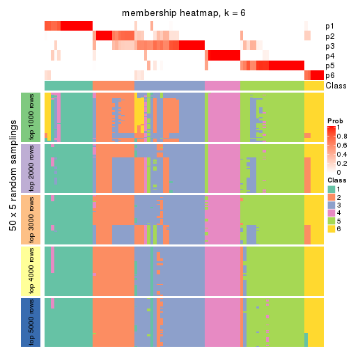</p>

</div>
</div>

As soon as we have had the classes for columns, we can look for signatures
which are significantly different between classes which can be candidate marks
for certain classes. Following are the heatmaps for signatures.


Signature heatmaps where rows are scaled:


<script>
$( function() {
	$( '#tabs-ATC-pam-get-signatures' ).tabs();
} );
</script>
<div id='tabs-ATC-pam-get-signatures'>
<ul>
<li><a href='#tab-ATC-pam-get-signatures-1'>k = 2</a></li>
<li><a href='#tab-ATC-pam-get-signatures-2'>k = 3</a></li>
<li><a href='#tab-ATC-pam-get-signatures-3'>k = 4</a></li>
<li><a href='#tab-ATC-pam-get-signatures-4'>k = 5</a></li>
<li><a href='#tab-ATC-pam-get-signatures-5'>k = 6</a></li>
</ul>
<div id='tab-ATC-pam-get-signatures-1'>
<pre><code class="r">get_signatures(res, k = 2)
</code></pre>

<p></p>

</div>
<div id='tab-ATC-pam-get-signatures-2'>
<pre><code class="r">get_signatures(res, k = 3)
</code></pre>

<p></p>

</div>
<div id='tab-ATC-pam-get-signatures-3'>
<pre><code class="r">get_signatures(res, k = 4)
</code></pre>

<p></p>

</div>
<div id='tab-ATC-pam-get-signatures-4'>
<pre><code class="r">get_signatures(res, k = 5)
</code></pre>

<p></p>

</div>
<div id='tab-ATC-pam-get-signatures-5'>
<pre><code class="r">get_signatures(res, k = 6)
</code></pre>

<p></p>

</div>
</div>


Signature heatmaps where rows are not scaled:


<script>
$( function() {
	$( '#tabs-ATC-pam-get-signatures-no-scale' ).tabs();
} );
</script>
<div id='tabs-ATC-pam-get-signatures-no-scale'>
<ul>
<li><a href='#tab-ATC-pam-get-signatures-no-scale-1'>k = 2</a></li>
<li><a href='#tab-ATC-pam-get-signatures-no-scale-2'>k = 3</a></li>
<li><a href='#tab-ATC-pam-get-signatures-no-scale-3'>k = 4</a></li>
<li><a href='#tab-ATC-pam-get-signatures-no-scale-4'>k = 5</a></li>
<li><a href='#tab-ATC-pam-get-signatures-no-scale-5'>k = 6</a></li>
</ul>
<div id='tab-ATC-pam-get-signatures-no-scale-1'>
<pre><code class="r">get_signatures(res, k = 2, scale_rows = FALSE)
</code></pre>

<p>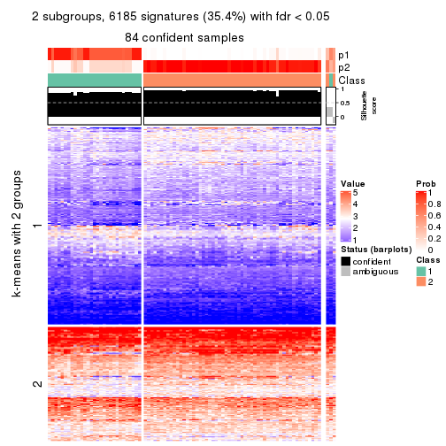</p>

</div>
<div id='tab-ATC-pam-get-signatures-no-scale-2'>
<pre><code class="r">get_signatures(res, k = 3, scale_rows = FALSE)
</code></pre>

<p></p>

</div>
<div id='tab-ATC-pam-get-signatures-no-scale-3'>
<pre><code class="r">get_signatures(res, k = 4, scale_rows = FALSE)
</code></pre>

<p></p>

</div>
<div id='tab-ATC-pam-get-signatures-no-scale-4'>
<pre><code class="r">get_signatures(res, k = 5, scale_rows = FALSE)
</code></pre>

<p></p>

</div>
<div id='tab-ATC-pam-get-signatures-no-scale-5'>
<pre><code class="r">get_signatures(res, k = 6, scale_rows = FALSE)
</code></pre>

<p></p>

</div>
</div>


Compare the overlap of signatures from different k:

```r
compare_signatures(res)
```


`get_signature()` returns a data frame invisibly. TO get the list of signatures, the function
call should be assigned to a variable explicitly. In following code, if `plot` argument is set
to `FALSE`, no heatmap is plotted while only the differential analysis is performed.

```r
# code only for demonstration
tb = get_signature(res, k = ..., plot = FALSE)
```

An example of the output of `tb` is:

```
#>   which_row         fdr    mean_1    mean_2 scaled_mean_1 scaled_mean_2 km
#> 1        38 0.042760348  8.373488  9.131774    -0.5533452     0.5164555  1
#> 2        40 0.018707592  7.106213  8.469186    -0.6173731     0.5762149  1
#> 3        55 0.019134737 10.221463 11.207825    -0.6159697     0.5749050  1
#> 4        59 0.006059896  5.921854  7.869574    -0.6899429     0.6439467  1
#> 5        60 0.018055526  8.928898 10.211722    -0.6204761     0.5791110  1
#> 6        98 0.009384629 15.714769 14.887706     0.6635654    -0.6193277  2
...
```

The columns in `tb` are:

1. `which_row`: row indices corresponding to the input matrix.
2. `fdr`: FDR for the differential test. 
3. `mean_x`: The mean value in group x.
4. `scaled_mean_x`: The mean value in group x after rows are scaled.
5. `km`: Row groups if k-means clustering is applied to rows.


UMAP plot which shows how samples are separated.


<script>
$( function() {
	$( '#tabs-ATC-pam-dimension-reduction' ).tabs();
} );
</script>
<div id='tabs-ATC-pam-dimension-reduction'>
<ul>
<li><a href='#tab-ATC-pam-dimension-reduction-1'>k = 2</a></li>
<li><a href='#tab-ATC-pam-dimension-reduction-2'>k = 3</a></li>
<li><a href='#tab-ATC-pam-dimension-reduction-3'>k = 4</a></li>
<li><a href='#tab-ATC-pam-dimension-reduction-4'>k = 5</a></li>
<li><a href='#tab-ATC-pam-dimension-reduction-5'>k = 6</a></li>
</ul>
<div id='tab-ATC-pam-dimension-reduction-1'>
<pre><code class="r">dimension_reduction(res, k = 2, method = &quot;UMAP&quot;)
</code></pre>

<p></p>

</div>
<div id='tab-ATC-pam-dimension-reduction-2'>
<pre><code class="r">dimension_reduction(res, k = 3, method = &quot;UMAP&quot;)
</code></pre>

<p></p>

</div>
<div id='tab-ATC-pam-dimension-reduction-3'>
<pre><code class="r">dimension_reduction(res, k = 4, method = &quot;UMAP&quot;)
</code></pre>

<p></p>

</div>
<div id='tab-ATC-pam-dimension-reduction-4'>
<pre><code class="r">dimension_reduction(res, k = 5, method = &quot;UMAP&quot;)
</code></pre>

<p></p>

</div>
<div id='tab-ATC-pam-dimension-reduction-5'>
<pre><code class="r">dimension_reduction(res, k = 6, method = &quot;UMAP&quot;)
</code></pre>

<p></p>

</div>
</div>


Following heatmap shows how subgroups are split when increasing `k`:

```r
collect_classes(res)
```


If matrix rows can be associated to genes, consider to use `functional_enrichment(res,
...)` to perform function enrichment for the signature genes. See [this vignette](http://bioconductor.org/packages/devel/bioc/vignettes/cola/inst/doc/functional_enrichment.html) for more detailed explanations.


 

---------------------------------------------------


### ATC:mclust


The object with results only for a single top-value method and a single partition method 
can be extracted as:

```r
res = res_list["ATC", "mclust"]
# you can also extract it by
# res = res_list["ATC:mclust"]
```

A summary of `res` and all the functions that can be applied to it:

```r
res
```

```
#> A 'ConsensusPartition' object with k = 2, 3, 4, 5, 6.
#>   On a matrix with 17471 rows and 87 columns.
#>   Top rows (1000, 2000, 3000, 4000, 5000) are extracted by 'ATC' method.
#>   Subgroups are detected by 'mclust' method.
#>   Performed in total 1250 partitions by row resampling.
#>   Best k for subgroups seems to be 3.
#> 
#> Following methods can be applied to this 'ConsensusPartition' object:
#>  [1] "cola_report"             "collect_classes"         "collect_plots"          
#>  [4] "collect_stats"           "colnames"                "compare_signatures"     
#>  [7] "consensus_heatmap"       "dimension_reduction"     "functional_enrichment"  
#> [10] "get_anno_col"            "get_anno"                "get_classes"            
#> [13] "get_consensus"           "get_matrix"              "get_membership"         
#> [16] "get_param"               "get_signatures"          "get_stats"              
#> [19] "is_best_k"               "is_stable_k"             "membership_heatmap"     
#> [22] "ncol"                    "nrow"                    "plot_ecdf"              
#> [25] "rownames"                "select_partition_number" "show"                   
#> [28] "suggest_best_k"          "test_to_known_factors"
```

`collect_plots()` function collects all the plots made from `res` for all `k` (number of partitions)
into one single page to provide an easy and fast comparison between different `k`.

```r
collect_plots(res)
```


The plots are:

- The first row: a plot of the ECDF (empirical cumulative distribution
  function) curves of the consensus matrix for each `k` and the heatmap of
  predicted classes for each `k`.
- The second row: heatmaps of the consensus matrix for each `k`.
- The third row: heatmaps of the membership matrix for each `k`.
- The fouth row: heatmaps of the signatures for each `k`.

All the plots in panels can be made by individual functions and they are
plotted later in this section.

`select_partition_number()` produces several plots showing different
statistics for choosing "optimized" `k`. There are following statistics:

- ECDF curves of the consensus matrix for each `k`;
- 1-PAC. [The PAC
  score](https://en.wikipedia.org/wiki/Consensus_clustering#Over-interpretation_potential_of_consensus_clustering)
  measures the proportion of the ambiguous subgrouping.
- Mean silhouette score.
- Concordance. The mean probability of fiting the consensus class ids in all
  partitions.
- Area increased. Denote $A_k$ as the area under the ECDF curve for current
  `k`, the area increased is defined as $A_k - A_{k-1}$.
- Rand index. The percent of pairs of samples that are both in a same cluster
  or both are not in a same cluster in the partition of k and k-1.
- Jaccard index. The ratio of pairs of samples are both in a same cluster in
  the partition of k and k-1 and the pairs of samples are both in a same
  cluster in the partition k or k-1.

The detailed explanations of these statistics can be found in [the _cola_
vignette](http://bioconductor.org/packages/devel/bioc/vignettes/cola/inst/doc/cola.html#toc_13).

Generally speaking, lower PAC score, higher mean silhouette score or higher
concordance corresponds to better partition. Rand index and Jaccard index
measure how similar the current partition is compared to partition with `k-1`.
If they are too similar, we won't accept `k` is better than `k-1`.

```r
select_partition_number(res)
```


The numeric values for all these statistics can be obtained by `get_stats()`.

```r
get_stats(res)
```

```
#>   k 1-PAC mean_silhouette concordance area_increased  Rand Jaccard
#> 2 2 0.134           0.504       0.737         0.4400 0.513   0.513
#> 3 3 0.335           0.817       0.847         0.3155 0.565   0.359
#> 4 4 0.464           0.628       0.817         0.1283 0.590   0.294
#> 5 5 0.505           0.550       0.764         0.1202 0.866   0.639
#> 6 6 0.584           0.486       0.685         0.0621 0.890   0.642
```

`suggest_best_k()` suggests the best $k$ based on these statistics. The rules are as follows:

- All $k$ with Jaccard index larger than 0.95 are removed because increasing
  $k$ does not provide enough extra information. If all $k$ are removed, it is
  marked as no subgroup is detected.
- For all $k$ with 1-PAC score larger than 0.9, the maximal $k$ is taken as
  the best $k$, and other $k$ are marked as optional $k$.
- If it does not fit the second rule. The $k$ with the maximal vote of the
  highest 1-PAC score, highest mean silhouette, and highest concordance is
  taken as the best $k$.

```r
suggest_best_k(res)
```

```
#> [1] 3
```


Following shows the table of the partitions (You need to click the **show/hide
code output** link to see it). The membership matrix (columns with name `p*`)
is inferred by
[`clue::cl_consensus()`](https://www.rdocumentation.org/link/cl_consensus?package=clue)
function with the `SE` method. Basically the value in the membership matrix
represents the probability to belong to a certain group. The finall class
label for an item is determined with the group with highest probability it
belongs to.

In `get_classes()` function, the entropy is calculated from the membership
matrix and the silhouette score is calculated from the consensus matrix.


<script>
$( function() {
	$( '#tabs-ATC-mclust-get-classes' ).tabs();
} );
</script>
<div id='tabs-ATC-mclust-get-classes'>
<ul>
<li><a href='#tab-ATC-mclust-get-classes-1'>k = 2</a></li>
<li><a href='#tab-ATC-mclust-get-classes-2'>k = 3</a></li>
<li><a href='#tab-ATC-mclust-get-classes-3'>k = 4</a></li>
<li><a href='#tab-ATC-mclust-get-classes-4'>k = 5</a></li>
<li><a href='#tab-ATC-mclust-get-classes-5'>k = 6</a></li>
</ul>

<div id='tab-ATC-mclust-get-classes-1'>
<p><a id='tab-ATC-mclust-get-classes-1-a' style='color:#0366d6' href='#'>show/hide code output</a></p>
<pre><code class="r">cbind(get_classes(res, k = 2), get_membership(res, k = 2))
</code></pre>

<pre><code>#&gt;                                      class entropy silhouette    p1    p2
#&gt; E6088A41-B0DC-4FBF-8D14-BE78024CF8CD     2  0.5629    0.63307 0.132 0.868
#&gt; F569915C-8F77-4D67-9730-30824DB57EE5     2  0.8861    0.54036 0.304 0.696
#&gt; E3B71CB7-673B-4741-8607-4F0A11633036     1  0.8207    0.62492 0.744 0.256
#&gt; DAF84798-FE3F-403C-B589-7F256AF752BE     2  0.1184    0.63981 0.016 0.984
#&gt; 2F38E3B1-4975-4877-9DCC-C00270602180     1  0.8207    0.62492 0.744 0.256
#&gt; C79A4C2F-02C4-4C03-A5A5-DE06802EEB57     1  0.8327    0.62450 0.736 0.264
#&gt; 92E3ED8F-5C74-4ED2-9B03-9FA5E7B491D6     2  0.9393    0.22151 0.356 0.644
#&gt; E61D60BE-3BD3-4B5E-BC12-80F3684A0959     2  0.6531    0.59779 0.168 0.832
#&gt; C9388FC7-DB1D-4416-BC2D-EA643584F1E6     2  0.9286    0.59666 0.344 0.656
#&gt; D4219360-6344-4AF3-ACEB-1701A9F1F67D     1  0.8207    0.62492 0.744 0.256
#&gt; 07D155E6-F27C-4D09-B786-8A9B71147B72     2  0.5519    0.63710 0.128 0.872
#&gt; 10C8C361-85A5-40E8-A395-B92623E6F27C     1  0.9896    0.43382 0.560 0.440
#&gt; BDF20891-7C98-4A55-BBF3-8A836BE303C6     1  0.9833   -0.11887 0.576 0.424
#&gt; 694B0504-095E-431A-84F2-B4387072138E     1  0.8909    0.60030 0.692 0.308
#&gt; EDCF8E7F-8B1D-46F7-8AE0-84A1DC9647D2     2  0.1414    0.64419 0.020 0.980
#&gt; 0EA8288E-824D-4304-A053-5A833361F5C5     2  0.5519    0.63579 0.128 0.872
#&gt; C4ACCFA1-34A9-4F61-8A1F-35B3B60EA193     1  0.9580    0.52919 0.620 0.380
#&gt; 760BA639-38AC-4BC9-9647-09F6893EA8ED     1  0.8207    0.62492 0.744 0.256
#&gt; 082DFC6B-C6E6-48B9-BDE5-74FF3B3DC954     2  0.9896    0.48641 0.440 0.560
#&gt; FE349848-D7C4-4C49-B670-0E20454DDD7E     2  0.5946    0.63244 0.144 0.856
#&gt; 2E8937B3-9EA1-4528-8CEE-BF3D4137908A     1  0.4431    0.51062 0.908 0.092
#&gt; 9942D04E-2767-4E39-BA16-7762EAC3DFC4     2  0.5519    0.63579 0.128 0.872
#&gt; F9C23182-91C4-4145-AE52-526FE8EB199D     1  0.9850    0.06222 0.572 0.428
#&gt; 01024EED-7811-4E24-A067-8E0B978FFE2D     1  0.8144    0.38715 0.748 0.252
#&gt; 932C8E98-A352-409C-8744-3D49FABCE425     2  0.6048    0.55217 0.148 0.852
#&gt; 6DFD9439-C659-4936-84E5-108F717E3E4D     2  0.7674    0.59158 0.224 0.776
#&gt; 1D8B83B8-5DD7-4F45-9D59-487EC6906A8B     2  0.5519    0.63579 0.128 0.872
#&gt; 804B8503-73F6-42DE-835F-39DE2C9F13E1     1  0.7745    0.41969 0.772 0.228
#&gt; B9453C9B-84D5-43BD-85BB-1780F02F039C     1  0.7815    0.61024 0.768 0.232
#&gt; 836E6CD6-4E88-4028-9844-FA3C892C254A     2  0.5629    0.63380 0.132 0.868
#&gt; 36EDD202-A845-4CE7-95D5-A515C471262E     1  0.9866   -0.00817 0.568 0.432
#&gt; 181C156A-B8F4-4F9D-93AA-6AFBD197644D     1  0.7950    0.61473 0.760 0.240
#&gt; 0580E798-6A98-4E46-AC96-9A869DFF502E     1  0.8081    0.62094 0.752 0.248
#&gt; EA1B63CF-D389-4567-8D9E-B0EF1F804598     2  0.5629    0.63462 0.132 0.868
#&gt; 5ABC3D06-B8E9-4831-B89B-7C1EC4006B47     2  0.5519    0.63579 0.128 0.872
#&gt; 1CC01E74-A7C1-4A51-9E28-1703C352BE16     2  0.9491    0.58364 0.368 0.632
#&gt; 97E55B75-DBDB-46BC-9E74-7828C070BF16     2  0.9427    0.58934 0.360 0.640
#&gt; BEB37A2D-E8B0-4674-89AC-DC0F34E0AFD6     2  0.8207    0.30995 0.256 0.744
#&gt; 558648BA-6551-4D34-97C2-AD5F677D63FB     1  0.8443    0.62227 0.728 0.272
#&gt; FF7021BB-414B-4466-BC43-372D856E6A1D     2  0.5737    0.62963 0.136 0.864
#&gt; 9C04B840-54E0-425D-BDBE-8CB6B9C2C722     2  0.9710    0.40066 0.400 0.600
#&gt; 5F50B1F4-1A02-4506-AA6D-9BF21CD8059A     2  0.0938    0.64186 0.012 0.988
#&gt; 7D4B8FF3-7977-4ABD-AE04-EED1C50B23CC     2  0.9850    0.32470 0.428 0.572
#&gt; A005AF15-B98E-4623-8AD4-1E69EFA9BC7A     1  0.8386    0.62261 0.732 0.268
#&gt; 1DF04345-5C93-4B18-B307-8D1FCA532999     1  0.7883    0.41092 0.764 0.236
#&gt; 6AF30C18-347E-41ED-A4AB-6F81F42206C5     1  0.8207    0.62492 0.744 0.256
#&gt; 88A44ED0-BDE1-401E-B0E1-D8C8D6DBAEFC     2  0.9580    0.57227 0.380 0.620
#&gt; 117673A3-2918-4702-8583-B66ADE6E4338     2  0.2236    0.65075 0.036 0.964
#&gt; 4903A571-E14D-43C9-A737-22CAFAC414CD     2  0.9686    0.17693 0.396 0.604
#&gt; C175E68E-632A-4B4A-9DDB-4895C4760F20     2  0.6623    0.60392 0.172 0.828
#&gt; FA5CA2F4-A1AD-4A79-B8F3-73A976EB2FB1     1  0.9393    0.13754 0.644 0.356
#&gt; E1F883A7-8B1F-4C1D-8A1A-9749A9C09845     1  0.9248    0.19983 0.660 0.340
#&gt; E74F0729-6000-4908-ADB0-7BDBAC0639E6     1  0.7815    0.61024 0.768 0.232
#&gt; F92135A9-1981-4C79-99A5-4243EEC5D30D     1  0.7950    0.40560 0.760 0.240
#&gt; 73C6919F-DEB4-4DA4-B4AE-4032AC8F96C5     1  0.8207    0.62492 0.744 0.256
#&gt; 33977B40-2E92-48B6-8D3A-3EBE913F6F8A     1  0.9248    0.57614 0.660 0.340
#&gt; 490BD607-2F08-4B4C-9612-F9BB5CBBC8BB     2  0.9977    0.30586 0.472 0.528
#&gt; 6C666E17-2EB8-4244-BCC1-8DD34EE4173E     2  0.9970    0.22437 0.468 0.532
#&gt; C41F3064-4483-4796-B860-82155BAA5157     2  0.9850   -0.04246 0.428 0.572
#&gt; F4232B90-51B9-43EE-9971-35B3A318758F     1  0.8327    0.62290 0.736 0.264
#&gt; 291EA1F6-FC56-4429-A433-0C452A6A514C     1  0.8713    0.30832 0.708 0.292
#&gt; CC4AF04D-CB8E-40DD-B12E-7AA39B38262A     2  0.5519    0.63579 0.128 0.872
#&gt; 4DAE26B9-AB57-4763-BB9A-2ADDD5D9C007     2  0.0672    0.63735 0.008 0.992
#&gt; 676B4AEE-FB41-4C16-AA91-03E4A1DA8E26     2  0.9393    0.59161 0.356 0.644
#&gt; 1CC36859-357A-49E0-A367-4F57D47288BA     2  0.8608    0.54448 0.284 0.716
#&gt; 7CCDDFC8-6DF6-4734-96AC-19EBC464FC50     1  0.9491    0.09537 0.632 0.368
#&gt; 10F38C34-3956-48ED-AB62-3439EF00D46B     2  0.8144    0.59586 0.252 0.748
#&gt; 80B2B393-9D6E-45B4-B696-2A5C203543B7     1  0.8443    0.35060 0.728 0.272
#&gt; 5AC7B5EA-1AAC-4529-8E5A-F612E5E0719A     2  0.5737    0.62963 0.136 0.864
#&gt; 3648E98D-4B3A-41B7-BE05-595D44F0150D     2  0.6247    0.60975 0.156 0.844
#&gt; 252EC850-6026-473B-8FFC-2CF567EF42E4     2  0.5737    0.58516 0.136 0.864
#&gt; 1790E7A3-99D8-447E-BC50-51C8A4A18853     1  0.5842    0.48329 0.860 0.140
#&gt; DA61A4F8-350B-4DD1-A240-AD016520DB5B     2  0.7745    0.58637 0.228 0.772
#&gt; 767E5BAF-2515-40D7-AE7D-0B24D77A03F4     2  0.7745    0.58637 0.228 0.772
#&gt; 8CB9C903-D749-44EA-9137-7FB5A92C5932     2  0.5629    0.63380 0.132 0.868
#&gt; A9B968AE-2243-41BC-852A-3A12C1FB4892     2  0.0672    0.64064 0.008 0.992
#&gt; 3C582264-85BC-4569-A888-8EB3008E5198     1  0.9427    0.12393 0.640 0.360
#&gt; F4EAF9A2-9938-4D9B-9080-C0A7542D5704     2  0.9358    0.59178 0.352 0.648
#&gt; 328499D3-45DD-4B66-BD22-3C52BA92C2BB     1  0.7815    0.61024 0.768 0.232
#&gt; AF8AB83D-2917-4752-8C38-CF84C565B565     2  0.6712    0.48228 0.176 0.824
#&gt; 03A327CA-A9FE-42A4-844D-CA85206969FC     2  0.9044    0.53420 0.320 0.680
#&gt; 4B0BEC44-87BB-4014-9A26-3529DD63760B     2  0.7745    0.58637 0.228 0.772
#&gt; 05C7843E-DC89-4D8E-A78A-952C5DFD667B     2  0.9795    0.35540 0.416 0.584
#&gt; 29A0FFF9-13D3-4D16-BE6A-8E48A2C4E315     1  0.7883    0.41109 0.764 0.236
#&gt; 22947CC3-4F42-4F44-899C-2B7085E36C9D     2  0.9393    0.59161 0.356 0.644
#&gt; A247D92D-253A-4BEC-B450-184AF90D17D0     2  0.8608    0.60481 0.284 0.716
#&gt; 0D907A63-D23F-4684-80D9-0BA552435B86     2  0.0376    0.63908 0.004 0.996
</code></pre>

<script>
$('#tab-ATC-mclust-get-classes-1-a').parent().next().next().hide();
$('#tab-ATC-mclust-get-classes-1-a').click(function(){
  $('#tab-ATC-mclust-get-classes-1-a').parent().next().next().toggle();
  return(false);
});
</script>
</div>

<div id='tab-ATC-mclust-get-classes-2'>
<p><a id='tab-ATC-mclust-get-classes-2-a' style='color:#0366d6' href='#'>show/hide code output</a></p>
<pre><code class="r">cbind(get_classes(res, k = 3), get_membership(res, k = 3))
</code></pre>

<pre><code>#&gt;                                      class entropy silhouette    p1    p2    p3
#&gt; E6088A41-B0DC-4FBF-8D14-BE78024CF8CD     1  0.6621      0.804 0.752 0.100 0.148
#&gt; F569915C-8F77-4D67-9730-30824DB57EE5     3  0.3412      0.833 0.124 0.000 0.876
#&gt; E3B71CB7-673B-4741-8607-4F0A11633036     1  0.0592      0.830 0.988 0.000 0.012
#&gt; DAF84798-FE3F-403C-B589-7F256AF752BE     1  0.4346      0.775 0.816 0.000 0.184
#&gt; 2F38E3B1-4975-4877-9DCC-C00270602180     1  0.0592      0.830 0.988 0.000 0.012
#&gt; C79A4C2F-02C4-4C03-A5A5-DE06802EEB57     1  0.4931      0.814 0.828 0.140 0.032
#&gt; 92E3ED8F-5C74-4ED2-9B03-9FA5E7B491D6     1  0.3412      0.822 0.876 0.000 0.124
#&gt; E61D60BE-3BD3-4B5E-BC12-80F3684A0959     1  0.5254      0.775 0.736 0.000 0.264
#&gt; C9388FC7-DB1D-4416-BC2D-EA643584F1E6     3  0.0000      0.842 0.000 0.000 1.000
#&gt; D4219360-6344-4AF3-ACEB-1701A9F1F67D     1  0.0592      0.830 0.988 0.000 0.012
#&gt; 07D155E6-F27C-4D09-B786-8A9B71147B72     1  0.3192      0.825 0.888 0.000 0.112
#&gt; 10C8C361-85A5-40E8-A395-B92623E6F27C     1  0.3619      0.823 0.864 0.000 0.136
#&gt; BDF20891-7C98-4A55-BBF3-8A836BE303C6     3  0.0000      0.842 0.000 0.000 1.000
#&gt; 694B0504-095E-431A-84F2-B4387072138E     1  0.3965      0.821 0.860 0.008 0.132
#&gt; EDCF8E7F-8B1D-46F7-8AE0-84A1DC9647D2     3  0.3686      0.823 0.140 0.000 0.860
#&gt; 0EA8288E-824D-4304-A053-5A833361F5C5     1  0.3484      0.832 0.904 0.048 0.048
#&gt; C4ACCFA1-34A9-4F61-8A1F-35B3B60EA193     1  0.3619      0.823 0.864 0.000 0.136
#&gt; 760BA639-38AC-4BC9-9647-09F6893EA8ED     1  0.0747      0.831 0.984 0.000 0.016
#&gt; 082DFC6B-C6E6-48B9-BDE5-74FF3B3DC954     3  0.2165      0.791 0.000 0.064 0.936
#&gt; FE349848-D7C4-4C49-B670-0E20454DDD7E     3  0.1860      0.855 0.052 0.000 0.948
#&gt; 2E8937B3-9EA1-4528-8CEE-BF3D4137908A     1  0.5690      0.754 0.708 0.004 0.288
#&gt; 9942D04E-2767-4E39-BA16-7762EAC3DFC4     1  0.6793      0.801 0.740 0.100 0.160
#&gt; F9C23182-91C4-4145-AE52-526FE8EB199D     3  0.0424      0.840 0.008 0.000 0.992
#&gt; 01024EED-7811-4E24-A067-8E0B978FFE2D     2  0.5098      0.979 0.000 0.752 0.248
#&gt; 932C8E98-A352-409C-8744-3D49FABCE425     1  0.2711      0.832 0.912 0.000 0.088
#&gt; 6DFD9439-C659-4936-84E5-108F717E3E4D     3  0.3619      0.826 0.136 0.000 0.864
#&gt; 1D8B83B8-5DD7-4F45-9D59-487EC6906A8B     1  0.6783      0.311 0.588 0.016 0.396
#&gt; 804B8503-73F6-42DE-835F-39DE2C9F13E1     2  0.5058      0.981 0.000 0.756 0.244
#&gt; B9453C9B-84D5-43BD-85BB-1780F02F039C     1  0.3816      0.798 0.852 0.148 0.000
#&gt; 836E6CD6-4E88-4028-9844-FA3C892C254A     1  0.2959      0.818 0.900 0.100 0.000
#&gt; 36EDD202-A845-4CE7-95D5-A515C471262E     3  0.3686      0.669 0.000 0.140 0.860
#&gt; 181C156A-B8F4-4F9D-93AA-6AFBD197644D     1  0.4811      0.809 0.828 0.148 0.024
#&gt; 0580E798-6A98-4E46-AC96-9A869DFF502E     1  0.4099      0.803 0.852 0.140 0.008
#&gt; EA1B63CF-D389-4567-8D9E-B0EF1F804598     1  0.4452      0.765 0.808 0.000 0.192
#&gt; 5ABC3D06-B8E9-4831-B89B-7C1EC4006B47     1  0.6848      0.799 0.736 0.100 0.164
#&gt; 1CC01E74-A7C1-4A51-9E28-1703C352BE16     1  0.6264      0.641 0.616 0.004 0.380
#&gt; 97E55B75-DBDB-46BC-9E74-7828C070BF16     3  0.4110      0.675 0.152 0.004 0.844
#&gt; BEB37A2D-E8B0-4674-89AC-DC0F34E0AFD6     1  0.2878      0.831 0.904 0.000 0.096
#&gt; 558648BA-6551-4D34-97C2-AD5F677D63FB     1  0.4351      0.816 0.828 0.004 0.168
#&gt; FF7021BB-414B-4466-BC43-372D856E6A1D     1  0.3769      0.824 0.880 0.016 0.104
#&gt; 9C04B840-54E0-425D-BDBE-8CB6B9C2C722     3  0.3267      0.838 0.116 0.000 0.884
#&gt; 5F50B1F4-1A02-4506-AA6D-9BF21CD8059A     1  0.5216      0.672 0.740 0.000 0.260
#&gt; 7D4B8FF3-7977-4ABD-AE04-EED1C50B23CC     3  0.1529      0.854 0.040 0.000 0.960
#&gt; A005AF15-B98E-4623-8AD4-1E69EFA9BC7A     1  0.4902      0.822 0.844 0.092 0.064
#&gt; 1DF04345-5C93-4B18-B307-8D1FCA532999     2  0.5058      0.981 0.000 0.756 0.244
#&gt; 6AF30C18-347E-41ED-A4AB-6F81F42206C5     1  0.3619      0.823 0.864 0.000 0.136
#&gt; 88A44ED0-BDE1-401E-B0E1-D8C8D6DBAEFC     3  0.5650      0.340 0.312 0.000 0.688
#&gt; 117673A3-2918-4702-8583-B66ADE6E4338     3  0.3686      0.823 0.140 0.000 0.860
#&gt; 4903A571-E14D-43C9-A737-22CAFAC414CD     3  0.2537      0.790 0.080 0.000 0.920
#&gt; C175E68E-632A-4B4A-9DDB-4895C4760F20     1  0.2625      0.833 0.916 0.000 0.084
#&gt; FA5CA2F4-A1AD-4A79-B8F3-73A976EB2FB1     2  0.5098      0.979 0.000 0.752 0.248
#&gt; E1F883A7-8B1F-4C1D-8A1A-9749A9C09845     2  0.5098      0.979 0.000 0.752 0.248
#&gt; E74F0729-6000-4908-ADB0-7BDBAC0639E6     1  0.3816      0.798 0.852 0.148 0.000
#&gt; F92135A9-1981-4C79-99A5-4243EEC5D30D     2  0.5098      0.979 0.000 0.752 0.248
#&gt; 73C6919F-DEB4-4DA4-B4AE-4032AC8F96C5     1  0.4277      0.807 0.852 0.132 0.016
#&gt; 33977B40-2E92-48B6-8D3A-3EBE913F6F8A     1  0.4291      0.816 0.820 0.000 0.180
#&gt; 490BD607-2F08-4B4C-9612-F9BB5CBBC8BB     3  0.0000      0.842 0.000 0.000 1.000
#&gt; 6C666E17-2EB8-4244-BCC1-8DD34EE4173E     3  0.0000      0.842 0.000 0.000 1.000
#&gt; C41F3064-4483-4796-B860-82155BAA5157     1  0.2711      0.832 0.912 0.000 0.088
#&gt; F4232B90-51B9-43EE-9971-35B3A318758F     1  0.3619      0.823 0.864 0.000 0.136
#&gt; 291EA1F6-FC56-4429-A433-0C452A6A514C     2  0.5058      0.981 0.000 0.756 0.244
#&gt; CC4AF04D-CB8E-40DD-B12E-7AA39B38262A     1  0.7108      0.789 0.716 0.100 0.184
#&gt; 4DAE26B9-AB57-4763-BB9A-2ADDD5D9C007     1  0.5810      0.568 0.664 0.000 0.336
#&gt; 676B4AEE-FB41-4C16-AA91-03E4A1DA8E26     3  0.3192      0.743 0.112 0.000 0.888
#&gt; 1CC36859-357A-49E0-A367-4F57D47288BA     3  0.0892      0.849 0.020 0.000 0.980
#&gt; 7CCDDFC8-6DF6-4734-96AC-19EBC464FC50     2  0.5058      0.981 0.000 0.756 0.244
#&gt; 10F38C34-3956-48ED-AB62-3439EF00D46B     3  0.3192      0.840 0.112 0.000 0.888
#&gt; 80B2B393-9D6E-45B4-B696-2A5C203543B7     2  0.5988      0.791 0.000 0.632 0.368
#&gt; 5AC7B5EA-1AAC-4529-8E5A-F612E5E0719A     1  0.6500      0.805 0.760 0.100 0.140
#&gt; 3648E98D-4B3A-41B7-BE05-595D44F0150D     1  0.2796      0.820 0.908 0.092 0.000
#&gt; 252EC850-6026-473B-8FFC-2CF567EF42E4     1  0.3116      0.827 0.892 0.000 0.108
#&gt; 1790E7A3-99D8-447E-BC50-51C8A4A18853     2  0.5058      0.981 0.000 0.756 0.244
#&gt; DA61A4F8-350B-4DD1-A240-AD016520DB5B     3  0.2625      0.849 0.084 0.000 0.916
#&gt; 767E5BAF-2515-40D7-AE7D-0B24D77A03F4     3  0.3412      0.833 0.124 0.000 0.876
#&gt; 8CB9C903-D749-44EA-9137-7FB5A92C5932     1  0.2959      0.818 0.900 0.100 0.000
#&gt; A9B968AE-2243-41BC-852A-3A12C1FB4892     1  0.4121      0.790 0.832 0.000 0.168
#&gt; 3C582264-85BC-4569-A888-8EB3008E5198     2  0.5058      0.981 0.000 0.756 0.244
#&gt; F4EAF9A2-9938-4D9B-9080-C0A7542D5704     1  0.6742      0.712 0.656 0.028 0.316
#&gt; 328499D3-45DD-4B66-BD22-3C52BA92C2BB     1  0.3816      0.798 0.852 0.148 0.000
#&gt; AF8AB83D-2917-4752-8C38-CF84C565B565     1  0.3116      0.827 0.892 0.000 0.108
#&gt; 03A327CA-A9FE-42A4-844D-CA85206969FC     3  0.0000      0.842 0.000 0.000 1.000
#&gt; 4B0BEC44-87BB-4014-9A26-3529DD63760B     3  0.3412      0.833 0.124 0.000 0.876
#&gt; 05C7843E-DC89-4D8E-A78A-952C5DFD667B     3  0.0000      0.842 0.000 0.000 1.000
#&gt; 29A0FFF9-13D3-4D16-BE6A-8E48A2C4E315     2  0.5058      0.981 0.000 0.756 0.244
#&gt; 22947CC3-4F42-4F44-899C-2B7085E36C9D     3  0.0000      0.842 0.000 0.000 1.000
#&gt; A247D92D-253A-4BEC-B450-184AF90D17D0     3  0.3412      0.833 0.124 0.000 0.876
#&gt; 0D907A63-D23F-4684-80D9-0BA552435B86     3  0.3879      0.819 0.152 0.000 0.848
</code></pre>

<script>
$('#tab-ATC-mclust-get-classes-2-a').parent().next().next().hide();
$('#tab-ATC-mclust-get-classes-2-a').click(function(){
  $('#tab-ATC-mclust-get-classes-2-a').parent().next().next().toggle();
  return(false);
});
</script>
</div>

<div id='tab-ATC-mclust-get-classes-3'>
<p><a id='tab-ATC-mclust-get-classes-3-a' style='color:#0366d6' href='#'>show/hide code output</a></p>
<pre><code class="r">cbind(get_classes(res, k = 4), get_membership(res, k = 4))
</code></pre>

<pre><code>#&gt;                                      class entropy silhouette    p1    p2    p3    p4
#&gt; E6088A41-B0DC-4FBF-8D14-BE78024CF8CD     3  0.3375      0.751 0.016 0.092 0.876 0.016
#&gt; F569915C-8F77-4D67-9730-30824DB57EE5     4  0.4327      0.653 0.000 0.216 0.016 0.768
#&gt; E3B71CB7-673B-4741-8607-4F0A11633036     4  0.5472      0.522 0.280 0.044 0.000 0.676
#&gt; DAF84798-FE3F-403C-B589-7F256AF752BE     4  0.0336      0.711 0.008 0.000 0.000 0.992
#&gt; 2F38E3B1-4975-4877-9DCC-C00270602180     4  0.2996      0.645 0.064 0.044 0.000 0.892
#&gt; C79A4C2F-02C4-4C03-A5A5-DE06802EEB57     2  0.5165     -0.210 0.484 0.512 0.000 0.004
#&gt; 92E3ED8F-5C74-4ED2-9B03-9FA5E7B491D6     3  0.7499      0.385 0.284 0.152 0.548 0.016
#&gt; E61D60BE-3BD3-4B5E-BC12-80F3684A0959     4  0.4936      0.503 0.020 0.280 0.000 0.700
#&gt; C9388FC7-DB1D-4416-BC2D-EA643584F1E6     2  0.5253      0.384 0.000 0.624 0.016 0.360
#&gt; D4219360-6344-4AF3-ACEB-1701A9F1F67D     4  0.5446      0.526 0.276 0.044 0.000 0.680
#&gt; 07D155E6-F27C-4D09-B786-8A9B71147B72     4  0.0707      0.709 0.020 0.000 0.000 0.980
#&gt; 10C8C361-85A5-40E8-A395-B92623E6F27C     4  0.7748      0.308 0.280 0.280 0.000 0.440
#&gt; BDF20891-7C98-4A55-BBF3-8A836BE303C6     2  0.3852      0.746 0.000 0.800 0.008 0.192
#&gt; 694B0504-095E-431A-84F2-B4387072138E     1  0.6722      0.183 0.500 0.408 0.000 0.092
#&gt; EDCF8E7F-8B1D-46F7-8AE0-84A1DC9647D2     4  0.3982      0.652 0.000 0.220 0.004 0.776
#&gt; 0EA8288E-824D-4304-A053-5A833361F5C5     4  0.5517      0.236 0.020 0.000 0.412 0.568
#&gt; C4ACCFA1-34A9-4F61-8A1F-35B3B60EA193     4  0.5835      0.502 0.064 0.280 0.000 0.656
#&gt; 760BA639-38AC-4BC9-9647-09F6893EA8ED     4  0.5446      0.526 0.276 0.044 0.000 0.680
#&gt; 082DFC6B-C6E6-48B9-BDE5-74FF3B3DC954     2  0.1970      0.846 0.000 0.932 0.008 0.060
#&gt; FE349848-D7C4-4C49-B670-0E20454DDD7E     4  0.1124      0.710 0.004 0.012 0.012 0.972
#&gt; 2E8937B3-9EA1-4528-8CEE-BF3D4137908A     2  0.1362      0.789 0.020 0.964 0.004 0.012
#&gt; 9942D04E-2767-4E39-BA16-7762EAC3DFC4     3  0.0592      0.763 0.000 0.000 0.984 0.016
#&gt; F9C23182-91C4-4145-AE52-526FE8EB199D     2  0.5004      0.316 0.000 0.604 0.004 0.392
#&gt; 01024EED-7811-4E24-A067-8E0B978FFE2D     2  0.1302      0.850 0.000 0.956 0.000 0.044
#&gt; 932C8E98-A352-409C-8744-3D49FABCE425     4  0.0707      0.709 0.020 0.000 0.000 0.980
#&gt; 6DFD9439-C659-4936-84E5-108F717E3E4D     4  0.1674      0.713 0.004 0.032 0.012 0.952
#&gt; 1D8B83B8-5DD7-4F45-9D59-487EC6906A8B     3  0.4040      0.545 0.000 0.000 0.752 0.248
#&gt; 804B8503-73F6-42DE-835F-39DE2C9F13E1     2  0.1302      0.850 0.000 0.956 0.000 0.044
#&gt; B9453C9B-84D5-43BD-85BB-1780F02F039C     1  0.0188      0.636 0.996 0.000 0.000 0.004
#&gt; 836E6CD6-4E88-4028-9844-FA3C892C254A     3  0.1297      0.767 0.020 0.000 0.964 0.016
#&gt; 36EDD202-A845-4CE7-95D5-A515C471262E     2  0.1854      0.847 0.000 0.940 0.012 0.048
#&gt; 181C156A-B8F4-4F9D-93AA-6AFBD197644D     1  0.4483      0.481 0.712 0.284 0.000 0.004
#&gt; 0580E798-6A98-4E46-AC96-9A869DFF502E     1  0.5309      0.559 0.700 0.044 0.000 0.256
#&gt; EA1B63CF-D389-4567-8D9E-B0EF1F804598     4  0.4086      0.659 0.008 0.216 0.000 0.776
#&gt; 5ABC3D06-B8E9-4831-B89B-7C1EC4006B47     3  0.0592      0.763 0.000 0.000 0.984 0.016
#&gt; 1CC01E74-A7C1-4A51-9E28-1703C352BE16     2  0.2111      0.845 0.000 0.932 0.024 0.044
#&gt; 97E55B75-DBDB-46BC-9E74-7828C070BF16     2  0.2363      0.842 0.000 0.920 0.024 0.056
#&gt; BEB37A2D-E8B0-4674-89AC-DC0F34E0AFD6     4  0.0707      0.709 0.020 0.000 0.000 0.980
#&gt; 558648BA-6551-4D34-97C2-AD5F677D63FB     2  0.5860      0.238 0.040 0.580 0.000 0.380
#&gt; FF7021BB-414B-4466-BC43-372D856E6A1D     4  0.5428      0.321 0.020 0.000 0.380 0.600
#&gt; 9C04B840-54E0-425D-BDBE-8CB6B9C2C722     4  0.4599      0.620 0.000 0.248 0.016 0.736
#&gt; 5F50B1F4-1A02-4506-AA6D-9BF21CD8059A     4  0.0336      0.711 0.008 0.000 0.000 0.992
#&gt; 7D4B8FF3-7977-4ABD-AE04-EED1C50B23CC     4  0.4804      0.594 0.000 0.276 0.016 0.708
#&gt; A005AF15-B98E-4623-8AD4-1E69EFA9BC7A     4  0.7740     -0.203 0.348 0.236 0.000 0.416
#&gt; 1DF04345-5C93-4B18-B307-8D1FCA532999     2  0.1302      0.850 0.000 0.956 0.000 0.044
#&gt; 6AF30C18-347E-41ED-A4AB-6F81F42206C5     4  0.5835      0.502 0.064 0.280 0.000 0.656
#&gt; 88A44ED0-BDE1-401E-B0E1-D8C8D6DBAEFC     2  0.2282      0.844 0.000 0.924 0.024 0.052
#&gt; 117673A3-2918-4702-8583-B66ADE6E4338     4  0.4018      0.648 0.000 0.224 0.004 0.772
#&gt; 4903A571-E14D-43C9-A737-22CAFAC414CD     4  0.4343      0.529 0.004 0.264 0.000 0.732
#&gt; C175E68E-632A-4B4A-9DDB-4895C4760F20     4  0.3907      0.616 0.232 0.000 0.000 0.768
#&gt; FA5CA2F4-A1AD-4A79-B8F3-73A976EB2FB1     2  0.1302      0.850 0.000 0.956 0.000 0.044
#&gt; E1F883A7-8B1F-4C1D-8A1A-9749A9C09845     2  0.1557      0.844 0.000 0.944 0.000 0.056
#&gt; E74F0729-6000-4908-ADB0-7BDBAC0639E6     1  0.0188      0.636 0.996 0.000 0.000 0.004
#&gt; F92135A9-1981-4C79-99A5-4243EEC5D30D     2  0.1302      0.850 0.000 0.956 0.000 0.044
#&gt; 73C6919F-DEB4-4DA4-B4AE-4032AC8F96C5     1  0.5865      0.493 0.612 0.048 0.000 0.340
#&gt; 33977B40-2E92-48B6-8D3A-3EBE913F6F8A     4  0.5130      0.512 0.020 0.312 0.000 0.668
#&gt; 490BD607-2F08-4B4C-9612-F9BB5CBBC8BB     2  0.4019      0.732 0.000 0.792 0.012 0.196
#&gt; 6C666E17-2EB8-4244-BCC1-8DD34EE4173E     2  0.4804      0.598 0.000 0.708 0.016 0.276
#&gt; C41F3064-4483-4796-B860-82155BAA5157     4  0.0707      0.709 0.020 0.000 0.000 0.980
#&gt; F4232B90-51B9-43EE-9971-35B3A318758F     4  0.5599      0.520 0.052 0.276 0.000 0.672
#&gt; 291EA1F6-FC56-4429-A433-0C452A6A514C     2  0.1302      0.850 0.000 0.956 0.000 0.044
#&gt; CC4AF04D-CB8E-40DD-B12E-7AA39B38262A     3  0.2610      0.754 0.000 0.088 0.900 0.012
#&gt; 4DAE26B9-AB57-4763-BB9A-2ADDD5D9C007     4  0.0188      0.711 0.004 0.000 0.000 0.996
#&gt; 676B4AEE-FB41-4C16-AA91-03E4A1DA8E26     2  0.4832      0.709 0.000 0.768 0.176 0.056
#&gt; 1CC36859-357A-49E0-A367-4F57D47288BA     4  0.3113      0.682 0.004 0.108 0.012 0.876
#&gt; 7CCDDFC8-6DF6-4734-96AC-19EBC464FC50     2  0.1302      0.850 0.000 0.956 0.000 0.044
#&gt; 10F38C34-3956-48ED-AB62-3439EF00D46B     4  0.4630      0.619 0.000 0.252 0.016 0.732
#&gt; 80B2B393-9D6E-45B4-B696-2A5C203543B7     2  0.1661      0.849 0.000 0.944 0.004 0.052
#&gt; 5AC7B5EA-1AAC-4529-8E5A-F612E5E0719A     3  0.4847      0.646 0.020 0.200 0.764 0.016
#&gt; 3648E98D-4B3A-41B7-BE05-595D44F0150D     3  0.1884      0.763 0.020 0.016 0.948 0.016
#&gt; 252EC850-6026-473B-8FFC-2CF567EF42E4     4  0.0707      0.709 0.020 0.000 0.000 0.980
#&gt; 1790E7A3-99D8-447E-BC50-51C8A4A18853     2  0.1302      0.850 0.000 0.956 0.000 0.044
#&gt; DA61A4F8-350B-4DD1-A240-AD016520DB5B     4  0.4599      0.626 0.000 0.248 0.016 0.736
#&gt; 767E5BAF-2515-40D7-AE7D-0B24D77A03F4     4  0.4434      0.640 0.000 0.228 0.016 0.756
#&gt; 8CB9C903-D749-44EA-9137-7FB5A92C5932     3  0.1297      0.767 0.020 0.000 0.964 0.016
#&gt; A9B968AE-2243-41BC-852A-3A12C1FB4892     4  0.0188      0.711 0.004 0.000 0.000 0.996
#&gt; 3C582264-85BC-4569-A888-8EB3008E5198     2  0.1302      0.850 0.000 0.956 0.000 0.044
#&gt; F4EAF9A2-9938-4D9B-9080-C0A7542D5704     3  0.6050      0.188 0.000 0.432 0.524 0.044
#&gt; 328499D3-45DD-4B66-BD22-3C52BA92C2BB     1  0.0188      0.636 0.996 0.000 0.000 0.004
#&gt; AF8AB83D-2917-4752-8C38-CF84C565B565     4  0.0707      0.709 0.020 0.000 0.000 0.980
#&gt; 03A327CA-A9FE-42A4-844D-CA85206969FC     4  0.4690      0.553 0.000 0.260 0.016 0.724
#&gt; 4B0BEC44-87BB-4014-9A26-3529DD63760B     4  0.4364      0.649 0.000 0.220 0.016 0.764
#&gt; 05C7843E-DC89-4D8E-A78A-952C5DFD667B     4  0.4896      0.497 0.004 0.280 0.012 0.704
#&gt; 29A0FFF9-13D3-4D16-BE6A-8E48A2C4E315     2  0.1302      0.850 0.000 0.956 0.000 0.044
#&gt; 22947CC3-4F42-4F44-899C-2B7085E36C9D     2  0.4468      0.662 0.000 0.752 0.016 0.232
#&gt; A247D92D-253A-4BEC-B450-184AF90D17D0     4  0.4088      0.641 0.000 0.232 0.004 0.764
#&gt; 0D907A63-D23F-4684-80D9-0BA552435B86     4  0.0657      0.708 0.004 0.000 0.012 0.984
</code></pre>

<script>
$('#tab-ATC-mclust-get-classes-3-a').parent().next().next().hide();
$('#tab-ATC-mclust-get-classes-3-a').click(function(){
  $('#tab-ATC-mclust-get-classes-3-a').parent().next().next().toggle();
  return(false);
});
</script>
</div>

<div id='tab-ATC-mclust-get-classes-4'>
<p><a id='tab-ATC-mclust-get-classes-4-a' style='color:#0366d6' href='#'>show/hide code output</a></p>
<pre><code class="r">cbind(get_classes(res, k = 5), get_membership(res, k = 5))
</code></pre>

<pre><code>#&gt;                                      class entropy silhouette    p1    p2    p3    p4    p5
#&gt; E6088A41-B0DC-4FBF-8D14-BE78024CF8CD     5  0.3616    0.79631 0.052 0.004 0.000 0.116 0.828
#&gt; F569915C-8F77-4D67-9730-30824DB57EE5     3  0.4075    0.69512 0.000 0.160 0.780 0.060 0.000
#&gt; E3B71CB7-673B-4741-8607-4F0A11633036     1  0.1544    0.43895 0.932 0.000 0.068 0.000 0.000
#&gt; DAF84798-FE3F-403C-B589-7F256AF752BE     3  0.1648    0.69460 0.040 0.000 0.940 0.020 0.000
#&gt; 2F38E3B1-4975-4877-9DCC-C00270602180     1  0.3895    0.51432 0.680 0.000 0.320 0.000 0.000
#&gt; C79A4C2F-02C4-4C03-A5A5-DE06802EEB57     2  0.6749   -0.29979 0.268 0.396 0.000 0.336 0.000
#&gt; 92E3ED8F-5C74-4ED2-9B03-9FA5E7B491D6     1  0.4450    0.23553 0.736 0.004 0.000 0.044 0.216
#&gt; E61D60BE-3BD3-4B5E-BC12-80F3684A0959     3  0.1502    0.68850 0.056 0.004 0.940 0.000 0.000
#&gt; C9388FC7-DB1D-4416-BC2D-EA643584F1E6     2  0.5294    0.18302 0.000 0.564 0.380 0.056 0.000
#&gt; D4219360-6344-4AF3-ACEB-1701A9F1F67D     1  0.2516    0.46035 0.860 0.000 0.140 0.000 0.000
#&gt; 07D155E6-F27C-4D09-B786-8A9B71147B72     3  0.1341    0.68809 0.056 0.000 0.944 0.000 0.000
#&gt; 10C8C361-85A5-40E8-A395-B92623E6F27C     1  0.2806    0.34203 0.844 0.152 0.000 0.004 0.000
#&gt; BDF20891-7C98-4A55-BBF3-8A836BE303C6     2  0.5249    0.31439 0.004 0.608 0.336 0.052 0.000
#&gt; 694B0504-095E-431A-84F2-B4387072138E     1  0.4559    0.26107 0.748 0.152 0.000 0.100 0.000
#&gt; EDCF8E7F-8B1D-46F7-8AE0-84A1DC9647D2     3  0.6801    0.61590 0.152 0.168 0.600 0.080 0.000
#&gt; 0EA8288E-824D-4304-A053-5A833361F5C5     3  0.9689    0.00846 0.208 0.132 0.300 0.132 0.228
#&gt; C4ACCFA1-34A9-4F61-8A1F-35B3B60EA193     1  0.4949    0.45131 0.572 0.000 0.396 0.032 0.000
#&gt; 760BA639-38AC-4BC9-9647-09F6893EA8ED     1  0.0162    0.37141 0.996 0.000 0.004 0.000 0.000
#&gt; 082DFC6B-C6E6-48B9-BDE5-74FF3B3DC954     2  0.2269    0.74370 0.000 0.920 0.032 0.020 0.028
#&gt; FE349848-D7C4-4C49-B670-0E20454DDD7E     3  0.0324    0.71568 0.004 0.004 0.992 0.000 0.000
#&gt; 2E8937B3-9EA1-4528-8CEE-BF3D4137908A     2  0.4230    0.57984 0.192 0.764 0.036 0.008 0.000
#&gt; 9942D04E-2767-4E39-BA16-7762EAC3DFC4     5  0.1043    0.80727 0.040 0.000 0.000 0.000 0.960
#&gt; F9C23182-91C4-4145-AE52-526FE8EB199D     2  0.5459   -0.09450 0.000 0.472 0.468 0.060 0.000
#&gt; 01024EED-7811-4E24-A067-8E0B978FFE2D     2  0.2519    0.73186 0.000 0.884 0.100 0.016 0.000
#&gt; 932C8E98-A352-409C-8744-3D49FABCE425     3  0.1410    0.68497 0.060 0.000 0.940 0.000 0.000
#&gt; 6DFD9439-C659-4936-84E5-108F717E3E4D     3  0.3437    0.71808 0.000 0.120 0.832 0.048 0.000
#&gt; 1D8B83B8-5DD7-4F45-9D59-487EC6906A8B     5  0.7385    0.46413 0.028 0.244 0.040 0.148 0.540
#&gt; 804B8503-73F6-42DE-835F-39DE2C9F13E1     2  0.1942    0.74326 0.000 0.920 0.068 0.012 0.000
#&gt; B9453C9B-84D5-43BD-85BB-1780F02F039C     4  0.3424    0.66345 0.240 0.000 0.000 0.760 0.000
#&gt; 836E6CD6-4E88-4028-9844-FA3C892C254A     5  0.1430    0.80534 0.052 0.000 0.000 0.004 0.944
#&gt; 36EDD202-A845-4CE7-95D5-A515C471262E     2  0.3246    0.68859 0.000 0.808 0.184 0.008 0.000
#&gt; 181C156A-B8F4-4F9D-93AA-6AFBD197644D     4  0.6273    0.29872 0.292 0.184 0.000 0.524 0.000
#&gt; 0580E798-6A98-4E46-AC96-9A869DFF502E     4  0.6418   -0.12927 0.412 0.000 0.172 0.416 0.000
#&gt; EA1B63CF-D389-4567-8D9E-B0EF1F804598     3  0.7219    0.61422 0.180 0.164 0.556 0.100 0.000
#&gt; 5ABC3D06-B8E9-4831-B89B-7C1EC4006B47     5  0.0703    0.80165 0.024 0.000 0.000 0.000 0.976
#&gt; 1CC01E74-A7C1-4A51-9E28-1703C352BE16     2  0.3758    0.64930 0.000 0.816 0.004 0.128 0.052
#&gt; 97E55B75-DBDB-46BC-9E74-7828C070BF16     2  0.3804    0.64836 0.000 0.812 0.004 0.132 0.052
#&gt; BEB37A2D-E8B0-4674-89AC-DC0F34E0AFD6     3  0.1341    0.68809 0.056 0.000 0.944 0.000 0.000
#&gt; 558648BA-6551-4D34-97C2-AD5F677D63FB     1  0.7658    0.27612 0.428 0.156 0.328 0.088 0.000
#&gt; FF7021BB-414B-4466-BC43-372D856E6A1D     3  0.8095    0.51025 0.208 0.052 0.516 0.144 0.080
#&gt; 9C04B840-54E0-425D-BDBE-8CB6B9C2C722     3  0.4337    0.66719 0.000 0.196 0.748 0.056 0.000
#&gt; 5F50B1F4-1A02-4506-AA6D-9BF21CD8059A     3  0.0963    0.70180 0.036 0.000 0.964 0.000 0.000
#&gt; 7D4B8FF3-7977-4ABD-AE04-EED1C50B23CC     3  0.4303    0.67076 0.000 0.192 0.752 0.056 0.000
#&gt; A005AF15-B98E-4623-8AD4-1E69EFA9BC7A     1  0.6947    0.04921 0.400 0.008 0.248 0.344 0.000
#&gt; 1DF04345-5C93-4B18-B307-8D1FCA532999     2  0.0162    0.75004 0.000 0.996 0.000 0.004 0.000
#&gt; 6AF30C18-347E-41ED-A4AB-6F81F42206C5     1  0.4366    0.50896 0.664 0.000 0.320 0.016 0.000
#&gt; 88A44ED0-BDE1-401E-B0E1-D8C8D6DBAEFC     2  0.2032    0.73960 0.000 0.924 0.004 0.020 0.052
#&gt; 117673A3-2918-4702-8583-B66ADE6E4338     3  0.6760    0.61354 0.152 0.176 0.600 0.072 0.000
#&gt; 4903A571-E14D-43C9-A737-22CAFAC414CD     3  0.0693    0.71342 0.012 0.008 0.980 0.000 0.000
#&gt; C175E68E-632A-4B4A-9DDB-4895C4760F20     1  0.5112    0.17904 0.684 0.044 0.252 0.020 0.000
#&gt; FA5CA2F4-A1AD-4A79-B8F3-73A976EB2FB1     2  0.0162    0.75004 0.000 0.996 0.000 0.004 0.000
#&gt; E1F883A7-8B1F-4C1D-8A1A-9749A9C09845     2  0.4384    0.57965 0.000 0.728 0.228 0.044 0.000
#&gt; E74F0729-6000-4908-ADB0-7BDBAC0639E6     4  0.3424    0.66345 0.240 0.000 0.000 0.760 0.000
#&gt; F92135A9-1981-4C79-99A5-4243EEC5D30D     2  0.2305    0.73583 0.000 0.896 0.092 0.012 0.000
#&gt; 73C6919F-DEB4-4DA4-B4AE-4032AC8F96C5     1  0.6392   -0.10687 0.432 0.000 0.168 0.400 0.000
#&gt; 33977B40-2E92-48B6-8D3A-3EBE913F6F8A     3  0.6215   -0.12512 0.348 0.152 0.500 0.000 0.000
#&gt; 490BD607-2F08-4B4C-9612-F9BB5CBBC8BB     2  0.4576    0.55407 0.000 0.692 0.268 0.040 0.000
#&gt; 6C666E17-2EB8-4244-BCC1-8DD34EE4173E     3  0.5381    0.19796 0.000 0.428 0.516 0.056 0.000
#&gt; C41F3064-4483-4796-B860-82155BAA5157     3  0.2690    0.66411 0.156 0.000 0.844 0.000 0.000
#&gt; F4232B90-51B9-43EE-9971-35B3A318758F     1  0.3999    0.50555 0.656 0.000 0.344 0.000 0.000
#&gt; 291EA1F6-FC56-4429-A433-0C452A6A514C     2  0.0162    0.75004 0.000 0.996 0.000 0.004 0.000
#&gt; CC4AF04D-CB8E-40DD-B12E-7AA39B38262A     5  0.2563    0.76698 0.000 0.008 0.000 0.120 0.872
#&gt; 4DAE26B9-AB57-4763-BB9A-2ADDD5D9C007     3  0.0609    0.71025 0.020 0.000 0.980 0.000 0.000
#&gt; 676B4AEE-FB41-4C16-AA91-03E4A1DA8E26     2  0.6124    0.56555 0.000 0.668 0.072 0.152 0.108
#&gt; 1CC36859-357A-49E0-A367-4F57D47288BA     3  0.0324    0.71568 0.004 0.004 0.992 0.000 0.000
#&gt; 7CCDDFC8-6DF6-4734-96AC-19EBC464FC50     2  0.0162    0.75004 0.000 0.996 0.000 0.004 0.000
#&gt; 10F38C34-3956-48ED-AB62-3439EF00D46B     3  0.5635    0.47584 0.012 0.320 0.600 0.068 0.000
#&gt; 80B2B393-9D6E-45B4-B696-2A5C203543B7     2  0.0162    0.75070 0.000 0.996 0.004 0.000 0.000
#&gt; 5AC7B5EA-1AAC-4529-8E5A-F612E5E0719A     5  0.3739    0.79527 0.052 0.008 0.000 0.116 0.824
#&gt; 3648E98D-4B3A-41B7-BE05-595D44F0150D     5  0.4359    0.29033 0.412 0.000 0.000 0.004 0.584
#&gt; 252EC850-6026-473B-8FFC-2CF567EF42E4     3  0.3724    0.64332 0.184 0.000 0.788 0.028 0.000
#&gt; 1790E7A3-99D8-447E-BC50-51C8A4A18853     2  0.0162    0.75004 0.000 0.996 0.000 0.004 0.000
#&gt; DA61A4F8-350B-4DD1-A240-AD016520DB5B     3  0.4537    0.67156 0.000 0.184 0.740 0.076 0.000
#&gt; 767E5BAF-2515-40D7-AE7D-0B24D77A03F4     3  0.4114    0.69187 0.000 0.164 0.776 0.060 0.000
#&gt; 8CB9C903-D749-44EA-9137-7FB5A92C5932     5  0.1430    0.80534 0.052 0.000 0.000 0.004 0.944
#&gt; A9B968AE-2243-41BC-852A-3A12C1FB4892     3  0.3612    0.65115 0.172 0.000 0.800 0.028 0.000
#&gt; 3C582264-85BC-4569-A888-8EB3008E5198     2  0.0162    0.75004 0.000 0.996 0.000 0.004 0.000
#&gt; F4EAF9A2-9938-4D9B-9080-C0A7542D5704     2  0.5720    0.33325 0.000 0.604 0.000 0.128 0.268
#&gt; 328499D3-45DD-4B66-BD22-3C52BA92C2BB     4  0.3424    0.66345 0.240 0.000 0.000 0.760 0.000
#&gt; AF8AB83D-2917-4752-8C38-CF84C565B565     3  0.3687    0.64575 0.180 0.000 0.792 0.028 0.000
#&gt; 03A327CA-A9FE-42A4-844D-CA85206969FC     3  0.3876    0.68595 0.000 0.192 0.776 0.032 0.000
#&gt; 4B0BEC44-87BB-4014-9A26-3529DD63760B     3  0.4177    0.69024 0.000 0.164 0.772 0.064 0.000
#&gt; 05C7843E-DC89-4D8E-A78A-952C5DFD667B     3  0.0854    0.71738 0.004 0.012 0.976 0.008 0.000
#&gt; 29A0FFF9-13D3-4D16-BE6A-8E48A2C4E315     2  0.2625    0.72812 0.000 0.876 0.108 0.016 0.000
#&gt; 22947CC3-4F42-4F44-899C-2B7085E36C9D     2  0.4584    0.42205 0.000 0.660 0.312 0.028 0.000
#&gt; A247D92D-253A-4BEC-B450-184AF90D17D0     3  0.6782    0.61394 0.152 0.172 0.600 0.076 0.000
#&gt; 0D907A63-D23F-4684-80D9-0BA552435B86     3  0.0162    0.71438 0.004 0.000 0.996 0.000 0.000
</code></pre>

<script>
$('#tab-ATC-mclust-get-classes-4-a').parent().next().next().hide();
$('#tab-ATC-mclust-get-classes-4-a').click(function(){
  $('#tab-ATC-mclust-get-classes-4-a').parent().next().next().toggle();
  return(false);
});
</script>
</div>

<div id='tab-ATC-mclust-get-classes-5'>
<p><a id='tab-ATC-mclust-get-classes-5-a' style='color:#0366d6' href='#'>show/hide code output</a></p>
<pre><code class="r">cbind(get_classes(res, k = 6), get_membership(res, k = 6))
</code></pre>

<pre><code>#&gt;                                      class entropy silhouette    p1    p2    p3    p4    p5    p6
#&gt; E6088A41-B0DC-4FBF-8D14-BE78024CF8CD     6  0.4835    0.69282 0.000 0.016 0.000 0.040 0.340 0.604
#&gt; F569915C-8F77-4D67-9730-30824DB57EE5     3  0.4078    0.53821 0.004 0.180 0.748 0.000 0.068 0.000
#&gt; E3B71CB7-673B-4741-8607-4F0A11633036     4  0.2741    0.60490 0.092 0.000 0.032 0.868 0.008 0.000
#&gt; DAF84798-FE3F-403C-B589-7F256AF752BE     3  0.4526    0.57557 0.020 0.000 0.748 0.128 0.100 0.004
#&gt; 2F38E3B1-4975-4877-9DCC-C00270602180     4  0.1913    0.62198 0.016 0.000 0.044 0.924 0.016 0.000
#&gt; C79A4C2F-02C4-4C03-A5A5-DE06802EEB57     1  0.6626    0.42977 0.516 0.200 0.060 0.220 0.004 0.000
#&gt; 92E3ED8F-5C74-4ED2-9B03-9FA5E7B491D6     4  0.6023    0.33166 0.256 0.016 0.000 0.584 0.028 0.116
#&gt; E61D60BE-3BD3-4B5E-BC12-80F3684A0959     3  0.4790    0.57221 0.020 0.012 0.732 0.144 0.092 0.000
#&gt; C9388FC7-DB1D-4416-BC2D-EA643584F1E6     3  0.5758    0.07688 0.000 0.284 0.504 0.000 0.212 0.000
#&gt; D4219360-6344-4AF3-ACEB-1701A9F1F67D     4  0.2639    0.60857 0.084 0.000 0.032 0.876 0.008 0.000
#&gt; 07D155E6-F27C-4D09-B786-8A9B71147B72     3  0.4926    0.53733 0.020 0.000 0.696 0.124 0.160 0.000
#&gt; 10C8C361-85A5-40E8-A395-B92623E6F27C     4  0.2895    0.57472 0.116 0.016 0.000 0.852 0.016 0.000
#&gt; BDF20891-7C98-4A55-BBF3-8A836BE303C6     3  0.5706   -0.00951 0.000 0.388 0.476 0.008 0.128 0.000
#&gt; 694B0504-095E-431A-84F2-B4387072138E     4  0.4543    0.28584 0.384 0.016 0.000 0.584 0.016 0.000
#&gt; EDCF8E7F-8B1D-46F7-8AE0-84A1DC9647D2     3  0.5218    0.48061 0.000 0.188 0.640 0.008 0.164 0.000
#&gt; 0EA8288E-824D-4304-A053-5A833361F5C5     5  0.7662    0.26844 0.004 0.096 0.172 0.056 0.488 0.184
#&gt; C4ACCFA1-34A9-4F61-8A1F-35B3B60EA193     4  0.2873    0.59927 0.068 0.012 0.044 0.872 0.004 0.000
#&gt; 760BA639-38AC-4BC9-9647-09F6893EA8ED     4  0.2858    0.59905 0.092 0.000 0.016 0.864 0.028 0.000
#&gt; 082DFC6B-C6E6-48B9-BDE5-74FF3B3DC954     2  0.4281    0.53099 0.000 0.708 0.072 0.000 0.220 0.000
#&gt; FE349848-D7C4-4C49-B670-0E20454DDD7E     3  0.3356    0.59770 0.004 0.000 0.824 0.072 0.100 0.000
#&gt; 2E8937B3-9EA1-4528-8CEE-BF3D4137908A     2  0.5241    0.55816 0.028 0.720 0.072 0.048 0.132 0.000
#&gt; 9942D04E-2767-4E39-BA16-7762EAC3DFC4     6  0.3271    0.71107 0.000 0.000 0.000 0.008 0.232 0.760
#&gt; F9C23182-91C4-4145-AE52-526FE8EB199D     3  0.4696    0.36102 0.000 0.276 0.660 0.016 0.048 0.000
#&gt; 01024EED-7811-4E24-A067-8E0B978FFE2D     2  0.3822    0.52118 0.008 0.784 0.168 0.016 0.024 0.000
#&gt; 932C8E98-A352-409C-8744-3D49FABCE425     3  0.4447    0.57106 0.020 0.000 0.744 0.144 0.092 0.000
#&gt; 6DFD9439-C659-4936-84E5-108F717E3E4D     3  0.1341    0.60476 0.000 0.028 0.948 0.000 0.024 0.000
#&gt; 1D8B83B8-5DD7-4F45-9D59-487EC6906A8B     5  0.6939    0.20500 0.000 0.212 0.040 0.048 0.528 0.172
#&gt; 804B8503-73F6-42DE-835F-39DE2C9F13E1     2  0.1275    0.63281 0.000 0.956 0.016 0.016 0.012 0.000
#&gt; B9453C9B-84D5-43BD-85BB-1780F02F039C     1  0.0865    0.75122 0.964 0.000 0.000 0.036 0.000 0.000
#&gt; 836E6CD6-4E88-4028-9844-FA3C892C254A     6  0.1082    0.66728 0.004 0.000 0.000 0.040 0.000 0.956
#&gt; 36EDD202-A845-4CE7-95D5-A515C471262E     2  0.4322    0.40293 0.000 0.672 0.288 0.008 0.032 0.000
#&gt; 181C156A-B8F4-4F9D-93AA-6AFBD197644D     1  0.5476    0.53235 0.644 0.076 0.060 0.220 0.000 0.000
#&gt; 0580E798-6A98-4E46-AC96-9A869DFF502E     4  0.4305    0.13374 0.436 0.000 0.020 0.544 0.000 0.000
#&gt; EA1B63CF-D389-4567-8D9E-B0EF1F804598     3  0.5380    0.50639 0.016 0.032 0.692 0.068 0.184 0.008
#&gt; 5ABC3D06-B8E9-4831-B89B-7C1EC4006B47     6  0.3707    0.68694 0.000 0.000 0.000 0.008 0.312 0.680
#&gt; 1CC01E74-A7C1-4A51-9E28-1703C352BE16     2  0.4468    0.42621 0.000 0.640 0.040 0.000 0.316 0.004
#&gt; 97E55B75-DBDB-46BC-9E74-7828C070BF16     2  0.4497    0.40585 0.000 0.624 0.048 0.000 0.328 0.000
#&gt; BEB37A2D-E8B0-4674-89AC-DC0F34E0AFD6     3  0.4136    0.58493 0.020 0.000 0.772 0.132 0.076 0.000
#&gt; 558648BA-6551-4D34-97C2-AD5F677D63FB     4  0.6596    0.28566 0.148 0.100 0.220 0.532 0.000 0.000
#&gt; FF7021BB-414B-4466-BC43-372D856E6A1D     5  0.6618   -0.25054 0.000 0.136 0.376 0.056 0.428 0.004
#&gt; 9C04B840-54E0-425D-BDBE-8CB6B9C2C722     3  0.4431    0.51376 0.000 0.200 0.704 0.000 0.096 0.000
#&gt; 5F50B1F4-1A02-4506-AA6D-9BF21CD8059A     3  0.5344    0.54292 0.020 0.016 0.680 0.120 0.164 0.000
#&gt; 7D4B8FF3-7977-4ABD-AE04-EED1C50B23CC     3  0.4482    0.52165 0.000 0.188 0.712 0.004 0.096 0.000
#&gt; A005AF15-B98E-4623-8AD4-1E69EFA9BC7A     4  0.5368    0.21827 0.364 0.012 0.084 0.540 0.000 0.000
#&gt; 1DF04345-5C93-4B18-B307-8D1FCA532999     2  0.2219    0.60885 0.000 0.864 0.000 0.000 0.136 0.000
#&gt; 6AF30C18-347E-41ED-A4AB-6F81F42206C5     4  0.1624    0.62158 0.044 0.012 0.008 0.936 0.000 0.000
#&gt; 88A44ED0-BDE1-401E-B0E1-D8C8D6DBAEFC     2  0.4274    0.48704 0.000 0.676 0.048 0.000 0.276 0.000
#&gt; 117673A3-2918-4702-8583-B66ADE6E4338     3  0.5768    0.44184 0.000 0.188 0.592 0.024 0.196 0.000
#&gt; 4903A571-E14D-43C9-A737-22CAFAC414CD     3  0.2922    0.61290 0.016 0.012 0.864 0.096 0.012 0.000
#&gt; C175E68E-632A-4B4A-9DDB-4895C4760F20     4  0.6922    0.27216 0.088 0.004 0.248 0.500 0.156 0.004
#&gt; FA5CA2F4-A1AD-4A79-B8F3-73A976EB2FB1     2  0.0547    0.64116 0.000 0.980 0.000 0.000 0.020 0.000
#&gt; E1F883A7-8B1F-4C1D-8A1A-9749A9C09845     2  0.4107    0.50404 0.008 0.764 0.176 0.016 0.036 0.000
#&gt; E74F0729-6000-4908-ADB0-7BDBAC0639E6     1  0.0865    0.75122 0.964 0.000 0.000 0.036 0.000 0.000
#&gt; F92135A9-1981-4C79-99A5-4243EEC5D30D     2  0.3384    0.53974 0.000 0.820 0.132 0.016 0.032 0.000
#&gt; 73C6919F-DEB4-4DA4-B4AE-4032AC8F96C5     4  0.4579    0.17457 0.404 0.012 0.020 0.564 0.000 0.000
#&gt; 33977B40-2E92-48B6-8D3A-3EBE913F6F8A     4  0.4854    0.27708 0.020 0.028 0.340 0.608 0.004 0.000
#&gt; 490BD607-2F08-4B4C-9612-F9BB5CBBC8BB     2  0.5145    0.21523 0.000 0.556 0.372 0.016 0.056 0.000
#&gt; 6C666E17-2EB8-4244-BCC1-8DD34EE4173E     3  0.3979    0.51501 0.000 0.160 0.772 0.016 0.052 0.000
#&gt; C41F3064-4483-4796-B860-82155BAA5157     3  0.5404    0.50762 0.020 0.000 0.636 0.148 0.196 0.000
#&gt; F4232B90-51B9-43EE-9971-35B3A318758F     4  0.1296    0.61956 0.000 0.012 0.032 0.952 0.004 0.000
#&gt; 291EA1F6-FC56-4429-A433-0C452A6A514C     2  0.1007    0.64473 0.000 0.956 0.000 0.000 0.044 0.000
#&gt; CC4AF04D-CB8E-40DD-B12E-7AA39B38262A     6  0.4526    0.56110 0.000 0.032 0.000 0.000 0.456 0.512
#&gt; 4DAE26B9-AB57-4763-BB9A-2ADDD5D9C007     3  0.3850    0.59075 0.020 0.000 0.800 0.084 0.096 0.000
#&gt; 676B4AEE-FB41-4C16-AA91-03E4A1DA8E26     5  0.5935    0.15986 0.000 0.360 0.132 0.000 0.488 0.020
#&gt; 1CC36859-357A-49E0-A367-4F57D47288BA     3  0.2705    0.61169 0.004 0.000 0.872 0.072 0.052 0.000
#&gt; 7CCDDFC8-6DF6-4734-96AC-19EBC464FC50     2  0.2416    0.59850 0.000 0.844 0.000 0.000 0.156 0.000
#&gt; 10F38C34-3956-48ED-AB62-3439EF00D46B     3  0.5061    0.47048 0.000 0.228 0.648 0.008 0.116 0.000
#&gt; 80B2B393-9D6E-45B4-B696-2A5C203543B7     2  0.3202    0.60624 0.000 0.816 0.040 0.000 0.144 0.000
#&gt; 5AC7B5EA-1AAC-4529-8E5A-F612E5E0719A     6  0.4933    0.69478 0.008 0.016 0.000 0.032 0.336 0.608
#&gt; 3648E98D-4B3A-41B7-BE05-595D44F0150D     6  0.3864    0.24666 0.004 0.000 0.000 0.344 0.004 0.648
#&gt; 252EC850-6026-473B-8FFC-2CF567EF42E4     3  0.5556    0.51847 0.024 0.004 0.656 0.120 0.188 0.008
#&gt; 1790E7A3-99D8-447E-BC50-51C8A4A18853     2  0.2135    0.61517 0.000 0.872 0.000 0.000 0.128 0.000
#&gt; DA61A4F8-350B-4DD1-A240-AD016520DB5B     3  0.4710    0.50661 0.000 0.196 0.688 0.004 0.112 0.000
#&gt; 767E5BAF-2515-40D7-AE7D-0B24D77A03F4     3  0.4201    0.53770 0.004 0.176 0.740 0.000 0.080 0.000
#&gt; 8CB9C903-D749-44EA-9137-7FB5A92C5932     6  0.1082    0.66728 0.004 0.000 0.000 0.040 0.000 0.956
#&gt; A9B968AE-2243-41BC-852A-3A12C1FB4892     3  0.4675    0.57774 0.020 0.012 0.760 0.088 0.112 0.008
#&gt; 3C582264-85BC-4569-A888-8EB3008E5198     2  0.0363    0.64296 0.000 0.988 0.000 0.000 0.012 0.000
#&gt; F4EAF9A2-9938-4D9B-9080-C0A7542D5704     5  0.5480    0.19576 0.000 0.328 0.000 0.000 0.528 0.144
#&gt; 328499D3-45DD-4B66-BD22-3C52BA92C2BB     1  0.0865    0.75122 0.964 0.000 0.000 0.036 0.000 0.000
#&gt; AF8AB83D-2917-4752-8C38-CF84C565B565     3  0.5560    0.52374 0.024 0.004 0.660 0.140 0.164 0.008
#&gt; 03A327CA-A9FE-42A4-844D-CA85206969FC     3  0.4651    0.54180 0.008 0.176 0.724 0.012 0.080 0.000
#&gt; 4B0BEC44-87BB-4014-9A26-3529DD63760B     3  0.4389    0.52007 0.000 0.188 0.712 0.000 0.100 0.000
#&gt; 05C7843E-DC89-4D8E-A78A-952C5DFD667B     3  0.1844    0.61340 0.000 0.016 0.928 0.040 0.016 0.000
#&gt; 29A0FFF9-13D3-4D16-BE6A-8E48A2C4E315     2  0.3822    0.52376 0.008 0.784 0.168 0.016 0.024 0.000
#&gt; 22947CC3-4F42-4F44-899C-2B7085E36C9D     3  0.5877   -0.10797 0.000 0.372 0.428 0.000 0.200 0.000
#&gt; A247D92D-253A-4BEC-B450-184AF90D17D0     3  0.5162    0.49034 0.000 0.164 0.648 0.008 0.180 0.000
#&gt; 0D907A63-D23F-4684-80D9-0BA552435B86     3  0.4924    0.56757 0.020 0.020 0.724 0.080 0.156 0.000
</code></pre>

<script>
$('#tab-ATC-mclust-get-classes-5-a').parent().next().next().hide();
$('#tab-ATC-mclust-get-classes-5-a').click(function(){
  $('#tab-ATC-mclust-get-classes-5-a').parent().next().next().toggle();
  return(false);
});
</script>
</div>
</div>

Heatmaps for the consensus matrix. It visualizes the probability of two
samples to be in a same group.


<script>
$( function() {
	$( '#tabs-ATC-mclust-consensus-heatmap' ).tabs();
} );
</script>
<div id='tabs-ATC-mclust-consensus-heatmap'>
<ul>
<li><a href='#tab-ATC-mclust-consensus-heatmap-1'>k = 2</a></li>
<li><a href='#tab-ATC-mclust-consensus-heatmap-2'>k = 3</a></li>
<li><a href='#tab-ATC-mclust-consensus-heatmap-3'>k = 4</a></li>
<li><a href='#tab-ATC-mclust-consensus-heatmap-4'>k = 5</a></li>
<li><a href='#tab-ATC-mclust-consensus-heatmap-5'>k = 6</a></li>
</ul>
<div id='tab-ATC-mclust-consensus-heatmap-1'>
<pre><code class="r">consensus_heatmap(res, k = 2)
</code></pre>

<p></p>

</div>
<div id='tab-ATC-mclust-consensus-heatmap-2'>
<pre><code class="r">consensus_heatmap(res, k = 3)
</code></pre>

<p></p>

</div>
<div id='tab-ATC-mclust-consensus-heatmap-3'>
<pre><code class="r">consensus_heatmap(res, k = 4)
</code></pre>

<p></p>

</div>
<div id='tab-ATC-mclust-consensus-heatmap-4'>
<pre><code class="r">consensus_heatmap(res, k = 5)
</code></pre>

<p></p>

</div>
<div id='tab-ATC-mclust-consensus-heatmap-5'>
<pre><code class="r">consensus_heatmap(res, k = 6)
</code></pre>

<p></p>

</div>
</div>

Heatmaps for the membership of samples in all partitions to see how consistent they are:


<script>
$( function() {
	$( '#tabs-ATC-mclust-membership-heatmap' ).tabs();
} );
</script>
<div id='tabs-ATC-mclust-membership-heatmap'>
<ul>
<li><a href='#tab-ATC-mclust-membership-heatmap-1'>k = 2</a></li>
<li><a href='#tab-ATC-mclust-membership-heatmap-2'>k = 3</a></li>
<li><a href='#tab-ATC-mclust-membership-heatmap-3'>k = 4</a></li>
<li><a href='#tab-ATC-mclust-membership-heatmap-4'>k = 5</a></li>
<li><a href='#tab-ATC-mclust-membership-heatmap-5'>k = 6</a></li>
</ul>
<div id='tab-ATC-mclust-membership-heatmap-1'>
<pre><code class="r">membership_heatmap(res, k = 2)
</code></pre>

<p></p>

</div>
<div id='tab-ATC-mclust-membership-heatmap-2'>
<pre><code class="r">membership_heatmap(res, k = 3)
</code></pre>

<p></p>

</div>
<div id='tab-ATC-mclust-membership-heatmap-3'>
<pre><code class="r">membership_heatmap(res, k = 4)
</code></pre>

<p></p>

</div>
<div id='tab-ATC-mclust-membership-heatmap-4'>
<pre><code class="r">membership_heatmap(res, k = 5)
</code></pre>

<p></p>

</div>
<div id='tab-ATC-mclust-membership-heatmap-5'>
<pre><code class="r">membership_heatmap(res, k = 6)
</code></pre>

<p></p>

</div>
</div>

As soon as we have had the classes for columns, we can look for signatures
which are significantly different between classes which can be candidate marks
for certain classes. Following are the heatmaps for signatures.


Signature heatmaps where rows are scaled:


<script>
$( function() {
	$( '#tabs-ATC-mclust-get-signatures' ).tabs();
} );
</script>
<div id='tabs-ATC-mclust-get-signatures'>
<ul>
<li><a href='#tab-ATC-mclust-get-signatures-1'>k = 2</a></li>
<li><a href='#tab-ATC-mclust-get-signatures-2'>k = 3</a></li>
<li><a href='#tab-ATC-mclust-get-signatures-3'>k = 4</a></li>
<li><a href='#tab-ATC-mclust-get-signatures-4'>k = 5</a></li>
<li><a href='#tab-ATC-mclust-get-signatures-5'>k = 6</a></li>
</ul>
<div id='tab-ATC-mclust-get-signatures-1'>
<pre><code class="r">get_signatures(res, k = 2)
</code></pre>

<p></p>

</div>
<div id='tab-ATC-mclust-get-signatures-2'>
<pre><code class="r">get_signatures(res, k = 3)
</code></pre>

<p></p>

</div>
<div id='tab-ATC-mclust-get-signatures-3'>
<pre><code class="r">get_signatures(res, k = 4)
</code></pre>

<p></p>

</div>
<div id='tab-ATC-mclust-get-signatures-4'>
<pre><code class="r">get_signatures(res, k = 5)
</code></pre>

<p></p>

</div>
<div id='tab-ATC-mclust-get-signatures-5'>
<pre><code class="r">get_signatures(res, k = 6)
</code></pre>

<p></p>

</div>
</div>


Signature heatmaps where rows are not scaled:


<script>
$( function() {
	$( '#tabs-ATC-mclust-get-signatures-no-scale' ).tabs();
} );
</script>
<div id='tabs-ATC-mclust-get-signatures-no-scale'>
<ul>
<li><a href='#tab-ATC-mclust-get-signatures-no-scale-1'>k = 2</a></li>
<li><a href='#tab-ATC-mclust-get-signatures-no-scale-2'>k = 3</a></li>
<li><a href='#tab-ATC-mclust-get-signatures-no-scale-3'>k = 4</a></li>
<li><a href='#tab-ATC-mclust-get-signatures-no-scale-4'>k = 5</a></li>
<li><a href='#tab-ATC-mclust-get-signatures-no-scale-5'>k = 6</a></li>
</ul>
<div id='tab-ATC-mclust-get-signatures-no-scale-1'>
<pre><code class="r">get_signatures(res, k = 2, scale_rows = FALSE)
</code></pre>

<p></p>

</div>
<div id='tab-ATC-mclust-get-signatures-no-scale-2'>
<pre><code class="r">get_signatures(res, k = 3, scale_rows = FALSE)
</code></pre>

<p></p>

</div>
<div id='tab-ATC-mclust-get-signatures-no-scale-3'>
<pre><code class="r">get_signatures(res, k = 4, scale_rows = FALSE)
</code></pre>

<p></p>

</div>
<div id='tab-ATC-mclust-get-signatures-no-scale-4'>
<pre><code class="r">get_signatures(res, k = 5, scale_rows = FALSE)
</code></pre>

<p></p>

</div>
<div id='tab-ATC-mclust-get-signatures-no-scale-5'>
<pre><code class="r">get_signatures(res, k = 6, scale_rows = FALSE)
</code></pre>

<p></p>

</div>
</div>


Compare the overlap of signatures from different k:

```r
compare_signatures(res)
```


`get_signature()` returns a data frame invisibly. TO get the list of signatures, the function
call should be assigned to a variable explicitly. In following code, if `plot` argument is set
to `FALSE`, no heatmap is plotted while only the differential analysis is performed.

```r
# code only for demonstration
tb = get_signature(res, k = ..., plot = FALSE)
```

An example of the output of `tb` is:

```
#>   which_row         fdr    mean_1    mean_2 scaled_mean_1 scaled_mean_2 km
#> 1        38 0.042760348  8.373488  9.131774    -0.5533452     0.5164555  1
#> 2        40 0.018707592  7.106213  8.469186    -0.6173731     0.5762149  1
#> 3        55 0.019134737 10.221463 11.207825    -0.6159697     0.5749050  1
#> 4        59 0.006059896  5.921854  7.869574    -0.6899429     0.6439467  1
#> 5        60 0.018055526  8.928898 10.211722    -0.6204761     0.5791110  1
#> 6        98 0.009384629 15.714769 14.887706     0.6635654    -0.6193277  2
...
```

The columns in `tb` are:

1. `which_row`: row indices corresponding to the input matrix.
2. `fdr`: FDR for the differential test. 
3. `mean_x`: The mean value in group x.
4. `scaled_mean_x`: The mean value in group x after rows are scaled.
5. `km`: Row groups if k-means clustering is applied to rows.


UMAP plot which shows how samples are separated.


<script>
$( function() {
	$( '#tabs-ATC-mclust-dimension-reduction' ).tabs();
} );
</script>
<div id='tabs-ATC-mclust-dimension-reduction'>
<ul>
<li><a href='#tab-ATC-mclust-dimension-reduction-1'>k = 2</a></li>
<li><a href='#tab-ATC-mclust-dimension-reduction-2'>k = 3</a></li>
<li><a href='#tab-ATC-mclust-dimension-reduction-3'>k = 4</a></li>
<li><a href='#tab-ATC-mclust-dimension-reduction-4'>k = 5</a></li>
<li><a href='#tab-ATC-mclust-dimension-reduction-5'>k = 6</a></li>
</ul>
<div id='tab-ATC-mclust-dimension-reduction-1'>
<pre><code class="r">dimension_reduction(res, k = 2, method = &quot;UMAP&quot;)
</code></pre>

<p></p>

</div>
<div id='tab-ATC-mclust-dimension-reduction-2'>
<pre><code class="r">dimension_reduction(res, k = 3, method = &quot;UMAP&quot;)
</code></pre>

<p></p>

</div>
<div id='tab-ATC-mclust-dimension-reduction-3'>
<pre><code class="r">dimension_reduction(res, k = 4, method = &quot;UMAP&quot;)
</code></pre>

<p></p>

</div>
<div id='tab-ATC-mclust-dimension-reduction-4'>
<pre><code class="r">dimension_reduction(res, k = 5, method = &quot;UMAP&quot;)
</code></pre>

<p></p>

</div>
<div id='tab-ATC-mclust-dimension-reduction-5'>
<pre><code class="r">dimension_reduction(res, k = 6, method = &quot;UMAP&quot;)
</code></pre>

<p></p>

</div>
</div>


Following heatmap shows how subgroups are split when increasing `k`:

```r
collect_classes(res)
```


If matrix rows can be associated to genes, consider to use `functional_enrichment(res,
...)` to perform function enrichment for the signature genes. See [this vignette](http://bioconductor.org/packages/devel/bioc/vignettes/cola/inst/doc/functional_enrichment.html) for more detailed explanations.


 

---------------------------------------------------


### ATC:NMF**


The object with results only for a single top-value method and a single partition method 
can be extracted as:

```r
res = res_list["ATC", "NMF"]
# you can also extract it by
# res = res_list["ATC:NMF"]
```

A summary of `res` and all the functions that can be applied to it:

```r
res
```

```
#> A 'ConsensusPartition' object with k = 2, 3, 4, 5, 6.
#>   On a matrix with 17471 rows and 87 columns.
#>   Top rows (1000, 2000, 3000, 4000, 5000) are extracted by 'ATC' method.
#>   Subgroups are detected by 'NMF' method.
#>   Performed in total 1250 partitions by row resampling.
#>   Best k for subgroups seems to be 3.
#> 
#> Following methods can be applied to this 'ConsensusPartition' object:
#>  [1] "cola_report"             "collect_classes"         "collect_plots"          
#>  [4] "collect_stats"           "colnames"                "compare_signatures"     
#>  [7] "consensus_heatmap"       "dimension_reduction"     "functional_enrichment"  
#> [10] "get_anno_col"            "get_anno"                "get_classes"            
#> [13] "get_consensus"           "get_matrix"              "get_membership"         
#> [16] "get_param"               "get_signatures"          "get_stats"              
#> [19] "is_best_k"               "is_stable_k"             "membership_heatmap"     
#> [22] "ncol"                    "nrow"                    "plot_ecdf"              
#> [25] "rownames"                "select_partition_number" "show"                   
#> [28] "suggest_best_k"          "test_to_known_factors"
```

`collect_plots()` function collects all the plots made from `res` for all `k` (number of partitions)
into one single page to provide an easy and fast comparison between different `k`.

```r
collect_plots(res)
```


The plots are:

- The first row: a plot of the ECDF (empirical cumulative distribution
  function) curves of the consensus matrix for each `k` and the heatmap of
  predicted classes for each `k`.
- The second row: heatmaps of the consensus matrix for each `k`.
- The third row: heatmaps of the membership matrix for each `k`.
- The fouth row: heatmaps of the signatures for each `k`.

All the plots in panels can be made by individual functions and they are
plotted later in this section.

`select_partition_number()` produces several plots showing different
statistics for choosing "optimized" `k`. There are following statistics:

- ECDF curves of the consensus matrix for each `k`;
- 1-PAC. [The PAC
  score](https://en.wikipedia.org/wiki/Consensus_clustering#Over-interpretation_potential_of_consensus_clustering)
  measures the proportion of the ambiguous subgrouping.
- Mean silhouette score.
- Concordance. The mean probability of fiting the consensus class ids in all
  partitions.
- Area increased. Denote $A_k$ as the area under the ECDF curve for current
  `k`, the area increased is defined as $A_k - A_{k-1}$.
- Rand index. The percent of pairs of samples that are both in a same cluster
  or both are not in a same cluster in the partition of k and k-1.
- Jaccard index. The ratio of pairs of samples are both in a same cluster in
  the partition of k and k-1 and the pairs of samples are both in a same
  cluster in the partition k or k-1.

The detailed explanations of these statistics can be found in [the _cola_
vignette](http://bioconductor.org/packages/devel/bioc/vignettes/cola/inst/doc/cola.html#toc_13).

Generally speaking, lower PAC score, higher mean silhouette score or higher
concordance corresponds to better partition. Rand index and Jaccard index
measure how similar the current partition is compared to partition with `k-1`.
If they are too similar, we won't accept `k` is better than `k-1`.

```r
select_partition_number(res)
```


The numeric values for all these statistics can be obtained by `get_stats()`.

```r
get_stats(res)
```

```
#>   k 1-PAC mean_silhouette concordance area_increased  Rand Jaccard
#> 2 2 0.976           0.954       0.979         0.3100 0.668   0.668
#> 3 3 0.958           0.915       0.970         0.9729 0.621   0.472
#> 4 4 0.646           0.726       0.862         0.1803 0.779   0.496
#> 5 5 0.836           0.839       0.919         0.0821 0.889   0.623
#> 6 6 0.721           0.707       0.807         0.0526 0.899   0.579
```

`suggest_best_k()` suggests the best $k$ based on these statistics. The rules are as follows:

- All $k$ with Jaccard index larger than 0.95 are removed because increasing
  $k$ does not provide enough extra information. If all $k$ are removed, it is
  marked as no subgroup is detected.
- For all $k$ with 1-PAC score larger than 0.9, the maximal $k$ is taken as
  the best $k$, and other $k$ are marked as optional $k$.
- If it does not fit the second rule. The $k$ with the maximal vote of the
  highest 1-PAC score, highest mean silhouette, and highest concordance is
  taken as the best $k$.

```r
suggest_best_k(res)
```

```
#> [1] 3
#> attr(,"optional")
#> [1] 2
```

There is also optional best $k$ = 2 that is worth to check.

Following shows the table of the partitions (You need to click the **show/hide
code output** link to see it). The membership matrix (columns with name `p*`)
is inferred by
[`clue::cl_consensus()`](https://www.rdocumentation.org/link/cl_consensus?package=clue)
function with the `SE` method. Basically the value in the membership matrix
represents the probability to belong to a certain group. The finall class
label for an item is determined with the group with highest probability it
belongs to.

In `get_classes()` function, the entropy is calculated from the membership
matrix and the silhouette score is calculated from the consensus matrix.


<script>
$( function() {
	$( '#tabs-ATC-NMF-get-classes' ).tabs();
} );
</script>
<div id='tabs-ATC-NMF-get-classes'>
<ul>
<li><a href='#tab-ATC-NMF-get-classes-1'>k = 2</a></li>
<li><a href='#tab-ATC-NMF-get-classes-2'>k = 3</a></li>
<li><a href='#tab-ATC-NMF-get-classes-3'>k = 4</a></li>
<li><a href='#tab-ATC-NMF-get-classes-4'>k = 5</a></li>
<li><a href='#tab-ATC-NMF-get-classes-5'>k = 6</a></li>
</ul>

<div id='tab-ATC-NMF-get-classes-1'>
<p><a id='tab-ATC-NMF-get-classes-1-a' style='color:#0366d6' href='#'>show/hide code output</a></p>
<pre><code class="r">cbind(get_classes(res, k = 2), get_membership(res, k = 2))
</code></pre>

<pre><code>#&gt;                                      class entropy silhouette    p1    p2
#&gt; E6088A41-B0DC-4FBF-8D14-BE78024CF8CD     1   0.000      0.900 1.000 0.000
#&gt; F569915C-8F77-4D67-9730-30824DB57EE5     2   0.000      0.998 0.000 1.000
#&gt; E3B71CB7-673B-4741-8607-4F0A11633036     2   0.000      0.998 0.000 1.000
#&gt; DAF84798-FE3F-403C-B589-7F256AF752BE     2   0.000      0.998 0.000 1.000
#&gt; 2F38E3B1-4975-4877-9DCC-C00270602180     2   0.000      0.998 0.000 1.000
#&gt; C79A4C2F-02C4-4C03-A5A5-DE06802EEB57     2   0.000      0.998 0.000 1.000
#&gt; 92E3ED8F-5C74-4ED2-9B03-9FA5E7B491D6     1   0.955      0.497 0.624 0.376
#&gt; E61D60BE-3BD3-4B5E-BC12-80F3684A0959     2   0.000      0.998 0.000 1.000
#&gt; C9388FC7-DB1D-4416-BC2D-EA643584F1E6     2   0.000      0.998 0.000 1.000
#&gt; D4219360-6344-4AF3-ACEB-1701A9F1F67D     2   0.000      0.998 0.000 1.000
#&gt; 07D155E6-F27C-4D09-B786-8A9B71147B72     2   0.000      0.998 0.000 1.000
#&gt; 10C8C361-85A5-40E8-A395-B92623E6F27C     2   0.000      0.998 0.000 1.000
#&gt; BDF20891-7C98-4A55-BBF3-8A836BE303C6     2   0.000      0.998 0.000 1.000
#&gt; 694B0504-095E-431A-84F2-B4387072138E     2   0.000      0.998 0.000 1.000
#&gt; EDCF8E7F-8B1D-46F7-8AE0-84A1DC9647D2     2   0.000      0.998 0.000 1.000
#&gt; 0EA8288E-824D-4304-A053-5A833361F5C5     1   0.000      0.900 1.000 0.000
#&gt; C4ACCFA1-34A9-4F61-8A1F-35B3B60EA193     2   0.000      0.998 0.000 1.000
#&gt; 760BA639-38AC-4BC9-9647-09F6893EA8ED     2   0.000      0.998 0.000 1.000
#&gt; 082DFC6B-C6E6-48B9-BDE5-74FF3B3DC954     2   0.000      0.998 0.000 1.000
#&gt; FE349848-D7C4-4C49-B670-0E20454DDD7E     2   0.000      0.998 0.000 1.000
#&gt; 2E8937B3-9EA1-4528-8CEE-BF3D4137908A     2   0.000      0.998 0.000 1.000
#&gt; 9942D04E-2767-4E39-BA16-7762EAC3DFC4     1   0.000      0.900 1.000 0.000
#&gt; F9C23182-91C4-4145-AE52-526FE8EB199D     2   0.000      0.998 0.000 1.000
#&gt; 01024EED-7811-4E24-A067-8E0B978FFE2D     2   0.000      0.998 0.000 1.000
#&gt; 932C8E98-A352-409C-8744-3D49FABCE425     2   0.000      0.998 0.000 1.000
#&gt; 6DFD9439-C659-4936-84E5-108F717E3E4D     2   0.000      0.998 0.000 1.000
#&gt; 1D8B83B8-5DD7-4F45-9D59-487EC6906A8B     1   0.000      0.900 1.000 0.000
#&gt; 804B8503-73F6-42DE-835F-39DE2C9F13E1     2   0.000      0.998 0.000 1.000
#&gt; B9453C9B-84D5-43BD-85BB-1780F02F039C     2   0.000      0.998 0.000 1.000
#&gt; 836E6CD6-4E88-4028-9844-FA3C892C254A     1   0.000      0.900 1.000 0.000
#&gt; 36EDD202-A845-4CE7-95D5-A515C471262E     2   0.000      0.998 0.000 1.000
#&gt; 181C156A-B8F4-4F9D-93AA-6AFBD197644D     2   0.000      0.998 0.000 1.000
#&gt; 0580E798-6A98-4E46-AC96-9A869DFF502E     2   0.000      0.998 0.000 1.000
#&gt; EA1B63CF-D389-4567-8D9E-B0EF1F804598     2   0.000      0.998 0.000 1.000
#&gt; 5ABC3D06-B8E9-4831-B89B-7C1EC4006B47     1   0.000      0.900 1.000 0.000
#&gt; 1CC01E74-A7C1-4A51-9E28-1703C352BE16     1   0.000      0.900 1.000 0.000
#&gt; 97E55B75-DBDB-46BC-9E74-7828C070BF16     1   0.861      0.657 0.716 0.284
#&gt; BEB37A2D-E8B0-4674-89AC-DC0F34E0AFD6     2   0.000      0.998 0.000 1.000
#&gt; 558648BA-6551-4D34-97C2-AD5F677D63FB     2   0.000      0.998 0.000 1.000
#&gt; FF7021BB-414B-4466-BC43-372D856E6A1D     1   0.000      0.900 1.000 0.000
#&gt; 9C04B840-54E0-425D-BDBE-8CB6B9C2C722     2   0.000      0.998 0.000 1.000
#&gt; 5F50B1F4-1A02-4506-AA6D-9BF21CD8059A     2   0.000      0.998 0.000 1.000
#&gt; 7D4B8FF3-7977-4ABD-AE04-EED1C50B23CC     2   0.000      0.998 0.000 1.000
#&gt; A005AF15-B98E-4623-8AD4-1E69EFA9BC7A     2   0.000      0.998 0.000 1.000
#&gt; 1DF04345-5C93-4B18-B307-8D1FCA532999     2   0.000      0.998 0.000 1.000
#&gt; 6AF30C18-347E-41ED-A4AB-6F81F42206C5     2   0.000      0.998 0.000 1.000
#&gt; 88A44ED0-BDE1-401E-B0E1-D8C8D6DBAEFC     2   0.541      0.839 0.124 0.876
#&gt; 117673A3-2918-4702-8583-B66ADE6E4338     2   0.000      0.998 0.000 1.000
#&gt; 4903A571-E14D-43C9-A737-22CAFAC414CD     2   0.000      0.998 0.000 1.000
#&gt; C175E68E-632A-4B4A-9DDB-4895C4760F20     2   0.000      0.998 0.000 1.000
#&gt; FA5CA2F4-A1AD-4A79-B8F3-73A976EB2FB1     2   0.000      0.998 0.000 1.000
#&gt; E1F883A7-8B1F-4C1D-8A1A-9749A9C09845     2   0.000      0.998 0.000 1.000
#&gt; E74F0729-6000-4908-ADB0-7BDBAC0639E6     2   0.000      0.998 0.000 1.000
#&gt; F92135A9-1981-4C79-99A5-4243EEC5D30D     2   0.000      0.998 0.000 1.000
#&gt; 73C6919F-DEB4-4DA4-B4AE-4032AC8F96C5     2   0.000      0.998 0.000 1.000
#&gt; 33977B40-2E92-48B6-8D3A-3EBE913F6F8A     2   0.000      0.998 0.000 1.000
#&gt; 490BD607-2F08-4B4C-9612-F9BB5CBBC8BB     2   0.000      0.998 0.000 1.000
#&gt; 6C666E17-2EB8-4244-BCC1-8DD34EE4173E     2   0.000      0.998 0.000 1.000
#&gt; C41F3064-4483-4796-B860-82155BAA5157     2   0.000      0.998 0.000 1.000
#&gt; F4232B90-51B9-43EE-9971-35B3A318758F     2   0.000      0.998 0.000 1.000
#&gt; 291EA1F6-FC56-4429-A433-0C452A6A514C     2   0.000      0.998 0.000 1.000
#&gt; CC4AF04D-CB8E-40DD-B12E-7AA39B38262A     1   0.000      0.900 1.000 0.000
#&gt; 4DAE26B9-AB57-4763-BB9A-2ADDD5D9C007     2   0.000      0.998 0.000 1.000
#&gt; 676B4AEE-FB41-4C16-AA91-03E4A1DA8E26     1   0.913      0.589 0.672 0.328
#&gt; 1CC36859-357A-49E0-A367-4F57D47288BA     2   0.000      0.998 0.000 1.000
#&gt; 7CCDDFC8-6DF6-4734-96AC-19EBC464FC50     1   0.689      0.769 0.816 0.184
#&gt; 10F38C34-3956-48ED-AB62-3439EF00D46B     2   0.000      0.998 0.000 1.000
#&gt; 80B2B393-9D6E-45B4-B696-2A5C203543B7     2   0.000      0.998 0.000 1.000
#&gt; 5AC7B5EA-1AAC-4529-8E5A-F612E5E0719A     1   0.000      0.900 1.000 0.000
#&gt; 3648E98D-4B3A-41B7-BE05-595D44F0150D     1   0.000      0.900 1.000 0.000
#&gt; 252EC850-6026-473B-8FFC-2CF567EF42E4     2   0.000      0.998 0.000 1.000
#&gt; 1790E7A3-99D8-447E-BC50-51C8A4A18853     2   0.000      0.998 0.000 1.000
#&gt; DA61A4F8-350B-4DD1-A240-AD016520DB5B     2   0.000      0.998 0.000 1.000
#&gt; 767E5BAF-2515-40D7-AE7D-0B24D77A03F4     2   0.000      0.998 0.000 1.000
#&gt; 8CB9C903-D749-44EA-9137-7FB5A92C5932     1   0.000      0.900 1.000 0.000
#&gt; A9B968AE-2243-41BC-852A-3A12C1FB4892     2   0.000      0.998 0.000 1.000
#&gt; 3C582264-85BC-4569-A888-8EB3008E5198     1   1.000      0.145 0.500 0.500
#&gt; F4EAF9A2-9938-4D9B-9080-C0A7542D5704     1   0.000      0.900 1.000 0.000
#&gt; 328499D3-45DD-4B66-BD22-3C52BA92C2BB     2   0.000      0.998 0.000 1.000
#&gt; AF8AB83D-2917-4752-8C38-CF84C565B565     2   0.000      0.998 0.000 1.000
#&gt; 03A327CA-A9FE-42A4-844D-CA85206969FC     2   0.000      0.998 0.000 1.000
#&gt; 4B0BEC44-87BB-4014-9A26-3529DD63760B     2   0.000      0.998 0.000 1.000
#&gt; 05C7843E-DC89-4D8E-A78A-952C5DFD667B     2   0.000      0.998 0.000 1.000
#&gt; 29A0FFF9-13D3-4D16-BE6A-8E48A2C4E315     2   0.000      0.998 0.000 1.000
#&gt; 22947CC3-4F42-4F44-899C-2B7085E36C9D     2   0.141      0.975 0.020 0.980
#&gt; A247D92D-253A-4BEC-B450-184AF90D17D0     2   0.000      0.998 0.000 1.000
#&gt; 0D907A63-D23F-4684-80D9-0BA552435B86     2   0.000      0.998 0.000 1.000
</code></pre>

<script>
$('#tab-ATC-NMF-get-classes-1-a').parent().next().next().hide();
$('#tab-ATC-NMF-get-classes-1-a').click(function(){
  $('#tab-ATC-NMF-get-classes-1-a').parent().next().next().toggle();
  return(false);
});
</script>
</div>

<div id='tab-ATC-NMF-get-classes-2'>
<p><a id='tab-ATC-NMF-get-classes-2-a' style='color:#0366d6' href='#'>show/hide code output</a></p>
<pre><code class="r">cbind(get_classes(res, k = 3), get_membership(res, k = 3))
</code></pre>

<pre><code>#&gt;                                      class entropy silhouette    p1    p2    p3
#&gt; E6088A41-B0DC-4FBF-8D14-BE78024CF8CD     3  0.0000     0.9643 0.000 0.000 1.000
#&gt; F569915C-8F77-4D67-9730-30824DB57EE5     2  0.0000     0.9607 0.000 1.000 0.000
#&gt; E3B71CB7-673B-4741-8607-4F0A11633036     1  0.0000     0.9668 1.000 0.000 0.000
#&gt; DAF84798-FE3F-403C-B589-7F256AF752BE     1  0.0747     0.9504 0.984 0.016 0.000
#&gt; 2F38E3B1-4975-4877-9DCC-C00270602180     1  0.0000     0.9668 1.000 0.000 0.000
#&gt; C79A4C2F-02C4-4C03-A5A5-DE06802EEB57     2  0.0424     0.9548 0.008 0.992 0.000
#&gt; 92E3ED8F-5C74-4ED2-9B03-9FA5E7B491D6     1  0.0000     0.9668 1.000 0.000 0.000
#&gt; E61D60BE-3BD3-4B5E-BC12-80F3684A0959     2  0.6299     0.0756 0.476 0.524 0.000
#&gt; C9388FC7-DB1D-4416-BC2D-EA643584F1E6     2  0.0000     0.9607 0.000 1.000 0.000
#&gt; D4219360-6344-4AF3-ACEB-1701A9F1F67D     1  0.0000     0.9668 1.000 0.000 0.000
#&gt; 07D155E6-F27C-4D09-B786-8A9B71147B72     1  0.0000     0.9668 1.000 0.000 0.000
#&gt; 10C8C361-85A5-40E8-A395-B92623E6F27C     1  0.0000     0.9668 1.000 0.000 0.000
#&gt; BDF20891-7C98-4A55-BBF3-8A836BE303C6     2  0.0424     0.9550 0.008 0.992 0.000
#&gt; 694B0504-095E-431A-84F2-B4387072138E     1  0.0000     0.9668 1.000 0.000 0.000
#&gt; EDCF8E7F-8B1D-46F7-8AE0-84A1DC9647D2     2  0.0000     0.9607 0.000 1.000 0.000
#&gt; 0EA8288E-824D-4304-A053-5A833361F5C5     3  0.0000     0.9643 0.000 0.000 1.000
#&gt; C4ACCFA1-34A9-4F61-8A1F-35B3B60EA193     1  0.0000     0.9668 1.000 0.000 0.000
#&gt; 760BA639-38AC-4BC9-9647-09F6893EA8ED     1  0.0000     0.9668 1.000 0.000 0.000
#&gt; 082DFC6B-C6E6-48B9-BDE5-74FF3B3DC954     2  0.0000     0.9607 0.000 1.000 0.000
#&gt; FE349848-D7C4-4C49-B670-0E20454DDD7E     2  0.0000     0.9607 0.000 1.000 0.000
#&gt; 2E8937B3-9EA1-4528-8CEE-BF3D4137908A     2  0.0000     0.9607 0.000 1.000 0.000
#&gt; 9942D04E-2767-4E39-BA16-7762EAC3DFC4     3  0.0000     0.9643 0.000 0.000 1.000
#&gt; F9C23182-91C4-4145-AE52-526FE8EB199D     2  0.2537     0.8834 0.080 0.920 0.000
#&gt; 01024EED-7811-4E24-A067-8E0B978FFE2D     2  0.0000     0.9607 0.000 1.000 0.000
#&gt; 932C8E98-A352-409C-8744-3D49FABCE425     1  0.0000     0.9668 1.000 0.000 0.000
#&gt; 6DFD9439-C659-4936-84E5-108F717E3E4D     2  0.0424     0.9550 0.008 0.992 0.000
#&gt; 1D8B83B8-5DD7-4F45-9D59-487EC6906A8B     3  0.0000     0.9643 0.000 0.000 1.000
#&gt; 804B8503-73F6-42DE-835F-39DE2C9F13E1     2  0.0000     0.9607 0.000 1.000 0.000
#&gt; B9453C9B-84D5-43BD-85BB-1780F02F039C     1  0.0000     0.9668 1.000 0.000 0.000
#&gt; 836E6CD6-4E88-4028-9844-FA3C892C254A     3  0.0000     0.9643 0.000 0.000 1.000
#&gt; 36EDD202-A845-4CE7-95D5-A515C471262E     2  0.0000     0.9607 0.000 1.000 0.000
#&gt; 181C156A-B8F4-4F9D-93AA-6AFBD197644D     2  0.3941     0.7849 0.156 0.844 0.000
#&gt; 0580E798-6A98-4E46-AC96-9A869DFF502E     1  0.0000     0.9668 1.000 0.000 0.000
#&gt; EA1B63CF-D389-4567-8D9E-B0EF1F804598     1  0.1267     0.9431 0.972 0.004 0.024
#&gt; 5ABC3D06-B8E9-4831-B89B-7C1EC4006B47     3  0.0000     0.9643 0.000 0.000 1.000
#&gt; 1CC01E74-A7C1-4A51-9E28-1703C352BE16     2  0.6309    -0.0347 0.000 0.500 0.500
#&gt; 97E55B75-DBDB-46BC-9E74-7828C070BF16     3  0.5968     0.4004 0.000 0.364 0.636
#&gt; BEB37A2D-E8B0-4674-89AC-DC0F34E0AFD6     1  0.0000     0.9668 1.000 0.000 0.000
#&gt; 558648BA-6551-4D34-97C2-AD5F677D63FB     1  0.0000     0.9668 1.000 0.000 0.000
#&gt; FF7021BB-414B-4466-BC43-372D856E6A1D     3  0.0000     0.9643 0.000 0.000 1.000
#&gt; 9C04B840-54E0-425D-BDBE-8CB6B9C2C722     2  0.0000     0.9607 0.000 1.000 0.000
#&gt; 5F50B1F4-1A02-4506-AA6D-9BF21CD8059A     1  0.6295     0.0783 0.528 0.472 0.000
#&gt; 7D4B8FF3-7977-4ABD-AE04-EED1C50B23CC     2  0.0000     0.9607 0.000 1.000 0.000
#&gt; A005AF15-B98E-4623-8AD4-1E69EFA9BC7A     1  0.0000     0.9668 1.000 0.000 0.000
#&gt; 1DF04345-5C93-4B18-B307-8D1FCA532999     2  0.0000     0.9607 0.000 1.000 0.000
#&gt; 6AF30C18-347E-41ED-A4AB-6F81F42206C5     1  0.0000     0.9668 1.000 0.000 0.000
#&gt; 88A44ED0-BDE1-401E-B0E1-D8C8D6DBAEFC     2  0.0000     0.9607 0.000 1.000 0.000
#&gt; 117673A3-2918-4702-8583-B66ADE6E4338     2  0.0000     0.9607 0.000 1.000 0.000
#&gt; 4903A571-E14D-43C9-A737-22CAFAC414CD     2  0.4178     0.7700 0.172 0.828 0.000
#&gt; C175E68E-632A-4B4A-9DDB-4895C4760F20     1  0.0000     0.9668 1.000 0.000 0.000
#&gt; FA5CA2F4-A1AD-4A79-B8F3-73A976EB2FB1     2  0.0000     0.9607 0.000 1.000 0.000
#&gt; E1F883A7-8B1F-4C1D-8A1A-9749A9C09845     2  0.0000     0.9607 0.000 1.000 0.000
#&gt; E74F0729-6000-4908-ADB0-7BDBAC0639E6     1  0.0000     0.9668 1.000 0.000 0.000
#&gt; F92135A9-1981-4C79-99A5-4243EEC5D30D     2  0.0000     0.9607 0.000 1.000 0.000
#&gt; 73C6919F-DEB4-4DA4-B4AE-4032AC8F96C5     1  0.0000     0.9668 1.000 0.000 0.000
#&gt; 33977B40-2E92-48B6-8D3A-3EBE913F6F8A     1  0.0000     0.9668 1.000 0.000 0.000
#&gt; 490BD607-2F08-4B4C-9612-F9BB5CBBC8BB     2  0.0000     0.9607 0.000 1.000 0.000
#&gt; 6C666E17-2EB8-4244-BCC1-8DD34EE4173E     2  0.0000     0.9607 0.000 1.000 0.000
#&gt; C41F3064-4483-4796-B860-82155BAA5157     1  0.0000     0.9668 1.000 0.000 0.000
#&gt; F4232B90-51B9-43EE-9971-35B3A318758F     1  0.0000     0.9668 1.000 0.000 0.000
#&gt; 291EA1F6-FC56-4429-A433-0C452A6A514C     2  0.0000     0.9607 0.000 1.000 0.000
#&gt; CC4AF04D-CB8E-40DD-B12E-7AA39B38262A     3  0.0000     0.9643 0.000 0.000 1.000
#&gt; 4DAE26B9-AB57-4763-BB9A-2ADDD5D9C007     1  0.4750     0.6798 0.784 0.216 0.000
#&gt; 676B4AEE-FB41-4C16-AA91-03E4A1DA8E26     2  0.1411     0.9306 0.000 0.964 0.036
#&gt; 1CC36859-357A-49E0-A367-4F57D47288BA     2  0.0747     0.9485 0.016 0.984 0.000
#&gt; 7CCDDFC8-6DF6-4734-96AC-19EBC464FC50     2  0.0000     0.9607 0.000 1.000 0.000
#&gt; 10F38C34-3956-48ED-AB62-3439EF00D46B     2  0.0000     0.9607 0.000 1.000 0.000
#&gt; 80B2B393-9D6E-45B4-B696-2A5C203543B7     2  0.0000     0.9607 0.000 1.000 0.000
#&gt; 5AC7B5EA-1AAC-4529-8E5A-F612E5E0719A     3  0.0000     0.9643 0.000 0.000 1.000
#&gt; 3648E98D-4B3A-41B7-BE05-595D44F0150D     3  0.0237     0.9608 0.004 0.000 0.996
#&gt; 252EC850-6026-473B-8FFC-2CF567EF42E4     1  0.0000     0.9668 1.000 0.000 0.000
#&gt; 1790E7A3-99D8-447E-BC50-51C8A4A18853     2  0.0000     0.9607 0.000 1.000 0.000
#&gt; DA61A4F8-350B-4DD1-A240-AD016520DB5B     2  0.0000     0.9607 0.000 1.000 0.000
#&gt; 767E5BAF-2515-40D7-AE7D-0B24D77A03F4     2  0.0000     0.9607 0.000 1.000 0.000
#&gt; 8CB9C903-D749-44EA-9137-7FB5A92C5932     3  0.0000     0.9643 0.000 0.000 1.000
#&gt; A9B968AE-2243-41BC-852A-3A12C1FB4892     1  0.0424     0.9590 0.992 0.008 0.000
#&gt; 3C582264-85BC-4569-A888-8EB3008E5198     2  0.0000     0.9607 0.000 1.000 0.000
#&gt; F4EAF9A2-9938-4D9B-9080-C0A7542D5704     3  0.0000     0.9643 0.000 0.000 1.000
#&gt; 328499D3-45DD-4B66-BD22-3C52BA92C2BB     1  0.0000     0.9668 1.000 0.000 0.000
#&gt; AF8AB83D-2917-4752-8C38-CF84C565B565     1  0.0000     0.9668 1.000 0.000 0.000
#&gt; 03A327CA-A9FE-42A4-844D-CA85206969FC     2  0.0000     0.9607 0.000 1.000 0.000
#&gt; 4B0BEC44-87BB-4014-9A26-3529DD63760B     2  0.0000     0.9607 0.000 1.000 0.000
#&gt; 05C7843E-DC89-4D8E-A78A-952C5DFD667B     2  0.0000     0.9607 0.000 1.000 0.000
#&gt; 29A0FFF9-13D3-4D16-BE6A-8E48A2C4E315     2  0.0000     0.9607 0.000 1.000 0.000
#&gt; 22947CC3-4F42-4F44-899C-2B7085E36C9D     2  0.0000     0.9607 0.000 1.000 0.000
#&gt; A247D92D-253A-4BEC-B450-184AF90D17D0     2  0.0000     0.9607 0.000 1.000 0.000
#&gt; 0D907A63-D23F-4684-80D9-0BA552435B86     2  0.1289     0.9336 0.032 0.968 0.000
</code></pre>

<script>
$('#tab-ATC-NMF-get-classes-2-a').parent().next().next().hide();
$('#tab-ATC-NMF-get-classes-2-a').click(function(){
  $('#tab-ATC-NMF-get-classes-2-a').parent().next().next().toggle();
  return(false);
});
</script>
</div>

<div id='tab-ATC-NMF-get-classes-3'>
<p><a id='tab-ATC-NMF-get-classes-3-a' style='color:#0366d6' href='#'>show/hide code output</a></p>
<pre><code class="r">cbind(get_classes(res, k = 4), get_membership(res, k = 4))
</code></pre>

<pre><code>#&gt;                                      class entropy silhouette    p1    p2    p3    p4
#&gt; E6088A41-B0DC-4FBF-8D14-BE78024CF8CD     3  0.0000     0.9143 0.000 0.000 1.000 0.000
#&gt; F569915C-8F77-4D67-9730-30824DB57EE5     4  0.4543     0.6843 0.000 0.324 0.000 0.676
#&gt; E3B71CB7-673B-4741-8607-4F0A11633036     1  0.3688     0.8033 0.792 0.000 0.000 0.208
#&gt; DAF84798-FE3F-403C-B589-7F256AF752BE     4  0.4454     0.1099 0.308 0.000 0.000 0.692
#&gt; 2F38E3B1-4975-4877-9DCC-C00270602180     1  0.4277     0.7600 0.720 0.000 0.000 0.280
#&gt; C79A4C2F-02C4-4C03-A5A5-DE06802EEB57     2  0.3024     0.7470 0.148 0.852 0.000 0.000
#&gt; 92E3ED8F-5C74-4ED2-9B03-9FA5E7B491D6     1  0.1042     0.8466 0.972 0.000 0.008 0.020
#&gt; E61D60BE-3BD3-4B5E-BC12-80F3684A0959     4  0.4820     0.7125 0.012 0.296 0.000 0.692
#&gt; C9388FC7-DB1D-4416-BC2D-EA643584F1E6     2  0.4877     0.0432 0.000 0.592 0.000 0.408
#&gt; D4219360-6344-4AF3-ACEB-1701A9F1F67D     1  0.4072     0.7810 0.748 0.000 0.000 0.252
#&gt; 07D155E6-F27C-4D09-B786-8A9B71147B72     4  0.1867     0.7389 0.000 0.072 0.000 0.928
#&gt; 10C8C361-85A5-40E8-A395-B92623E6F27C     1  0.0000     0.8457 1.000 0.000 0.000 0.000
#&gt; BDF20891-7C98-4A55-BBF3-8A836BE303C6     2  0.0000     0.8820 0.000 1.000 0.000 0.000
#&gt; 694B0504-095E-431A-84F2-B4387072138E     1  0.0336     0.8472 0.992 0.000 0.000 0.008
#&gt; EDCF8E7F-8B1D-46F7-8AE0-84A1DC9647D2     4  0.1716     0.7305 0.000 0.064 0.000 0.936
#&gt; 0EA8288E-824D-4304-A053-5A833361F5C5     3  0.1637     0.8798 0.000 0.000 0.940 0.060
#&gt; C4ACCFA1-34A9-4F61-8A1F-35B3B60EA193     1  0.2281     0.8391 0.904 0.000 0.000 0.096
#&gt; 760BA639-38AC-4BC9-9647-09F6893EA8ED     1  0.4103     0.7784 0.744 0.000 0.000 0.256
#&gt; 082DFC6B-C6E6-48B9-BDE5-74FF3B3DC954     2  0.0000     0.8820 0.000 1.000 0.000 0.000
#&gt; FE349848-D7C4-4C49-B670-0E20454DDD7E     4  0.3726     0.7606 0.000 0.212 0.000 0.788
#&gt; 2E8937B3-9EA1-4528-8CEE-BF3D4137908A     2  0.0000     0.8820 0.000 1.000 0.000 0.000
#&gt; 9942D04E-2767-4E39-BA16-7762EAC3DFC4     3  0.0000     0.9143 0.000 0.000 1.000 0.000
#&gt; F9C23182-91C4-4145-AE52-526FE8EB199D     2  0.0469     0.8737 0.012 0.988 0.000 0.000
#&gt; 01024EED-7811-4E24-A067-8E0B978FFE2D     2  0.0000     0.8820 0.000 1.000 0.000 0.000
#&gt; 932C8E98-A352-409C-8744-3D49FABCE425     4  0.5151    -0.3594 0.464 0.004 0.000 0.532
#&gt; 6DFD9439-C659-4936-84E5-108F717E3E4D     4  0.3610     0.6811 0.000 0.200 0.000 0.800
#&gt; 1D8B83B8-5DD7-4F45-9D59-487EC6906A8B     3  0.0000     0.9143 0.000 0.000 1.000 0.000
#&gt; 804B8503-73F6-42DE-835F-39DE2C9F13E1     2  0.0000     0.8820 0.000 1.000 0.000 0.000
#&gt; B9453C9B-84D5-43BD-85BB-1780F02F039C     1  0.0000     0.8457 1.000 0.000 0.000 0.000
#&gt; 836E6CD6-4E88-4028-9844-FA3C892C254A     3  0.0000     0.9143 0.000 0.000 1.000 0.000
#&gt; 36EDD202-A845-4CE7-95D5-A515C471262E     2  0.0000     0.8820 0.000 1.000 0.000 0.000
#&gt; 181C156A-B8F4-4F9D-93AA-6AFBD197644D     2  0.3837     0.6616 0.224 0.776 0.000 0.000
#&gt; 0580E798-6A98-4E46-AC96-9A869DFF502E     1  0.3873     0.6120 0.772 0.000 0.000 0.228
#&gt; EA1B63CF-D389-4567-8D9E-B0EF1F804598     1  0.6682     0.6490 0.576 0.000 0.112 0.312
#&gt; 5ABC3D06-B8E9-4831-B89B-7C1EC4006B47     3  0.0000     0.9143 0.000 0.000 1.000 0.000
#&gt; 1CC01E74-A7C1-4A51-9E28-1703C352BE16     2  0.3074     0.7385 0.000 0.848 0.152 0.000
#&gt; 97E55B75-DBDB-46BC-9E74-7828C070BF16     2  0.3688     0.6553 0.000 0.792 0.208 0.000
#&gt; BEB37A2D-E8B0-4674-89AC-DC0F34E0AFD6     1  0.4981     0.4919 0.536 0.000 0.000 0.464
#&gt; 558648BA-6551-4D34-97C2-AD5F677D63FB     1  0.0000     0.8457 1.000 0.000 0.000 0.000
#&gt; FF7021BB-414B-4466-BC43-372D856E6A1D     3  0.5000     0.0571 0.000 0.000 0.500 0.500
#&gt; 9C04B840-54E0-425D-BDBE-8CB6B9C2C722     2  0.0000     0.8820 0.000 1.000 0.000 0.000
#&gt; 5F50B1F4-1A02-4506-AA6D-9BF21CD8059A     4  0.2589     0.7601 0.000 0.116 0.000 0.884
#&gt; 7D4B8FF3-7977-4ABD-AE04-EED1C50B23CC     2  0.0188     0.8790 0.000 0.996 0.000 0.004
#&gt; A005AF15-B98E-4623-8AD4-1E69EFA9BC7A     4  0.4996     0.1310 0.484 0.000 0.000 0.516
#&gt; 1DF04345-5C93-4B18-B307-8D1FCA532999     2  0.0000     0.8820 0.000 1.000 0.000 0.000
#&gt; 6AF30C18-347E-41ED-A4AB-6F81F42206C5     1  0.0817     0.8493 0.976 0.000 0.000 0.024
#&gt; 88A44ED0-BDE1-401E-B0E1-D8C8D6DBAEFC     2  0.0188     0.8795 0.000 0.996 0.004 0.000
#&gt; 117673A3-2918-4702-8583-B66ADE6E4338     2  0.4999     0.1240 0.000 0.508 0.000 0.492
#&gt; 4903A571-E14D-43C9-A737-22CAFAC414CD     4  0.5093     0.6444 0.012 0.348 0.000 0.640
#&gt; C175E68E-632A-4B4A-9DDB-4895C4760F20     1  0.4500     0.7290 0.684 0.000 0.000 0.316
#&gt; FA5CA2F4-A1AD-4A79-B8F3-73A976EB2FB1     2  0.0000     0.8820 0.000 1.000 0.000 0.000
#&gt; E1F883A7-8B1F-4C1D-8A1A-9749A9C09845     2  0.0000     0.8820 0.000 1.000 0.000 0.000
#&gt; E74F0729-6000-4908-ADB0-7BDBAC0639E6     1  0.0000     0.8457 1.000 0.000 0.000 0.000
#&gt; F92135A9-1981-4C79-99A5-4243EEC5D30D     2  0.0000     0.8820 0.000 1.000 0.000 0.000
#&gt; 73C6919F-DEB4-4DA4-B4AE-4032AC8F96C5     1  0.0188     0.8454 0.996 0.000 0.000 0.004
#&gt; 33977B40-2E92-48B6-8D3A-3EBE913F6F8A     1  0.1302     0.8484 0.956 0.000 0.000 0.044
#&gt; 490BD607-2F08-4B4C-9612-F9BB5CBBC8BB     2  0.4193     0.4860 0.000 0.732 0.000 0.268
#&gt; 6C666E17-2EB8-4244-BCC1-8DD34EE4173E     4  0.4304     0.7255 0.000 0.284 0.000 0.716
#&gt; C41F3064-4483-4796-B860-82155BAA5157     4  0.0188     0.6801 0.004 0.000 0.000 0.996
#&gt; F4232B90-51B9-43EE-9971-35B3A318758F     1  0.3444     0.7164 0.816 0.000 0.000 0.184
#&gt; 291EA1F6-FC56-4429-A433-0C452A6A514C     2  0.0000     0.8820 0.000 1.000 0.000 0.000
#&gt; CC4AF04D-CB8E-40DD-B12E-7AA39B38262A     3  0.0000     0.9143 0.000 0.000 1.000 0.000
#&gt; 4DAE26B9-AB57-4763-BB9A-2ADDD5D9C007     4  0.2408     0.7561 0.000 0.104 0.000 0.896
#&gt; 676B4AEE-FB41-4C16-AA91-03E4A1DA8E26     4  0.6563     0.6721 0.000 0.208 0.160 0.632
#&gt; 1CC36859-357A-49E0-A367-4F57D47288BA     2  0.4452     0.4875 0.008 0.732 0.000 0.260
#&gt; 7CCDDFC8-6DF6-4734-96AC-19EBC464FC50     2  0.0188     0.8795 0.000 0.996 0.004 0.000
#&gt; 10F38C34-3956-48ED-AB62-3439EF00D46B     4  0.4250     0.7326 0.000 0.276 0.000 0.724
#&gt; 80B2B393-9D6E-45B4-B696-2A5C203543B7     2  0.0000     0.8820 0.000 1.000 0.000 0.000
#&gt; 5AC7B5EA-1AAC-4529-8E5A-F612E5E0719A     3  0.0000     0.9143 0.000 0.000 1.000 0.000
#&gt; 3648E98D-4B3A-41B7-BE05-595D44F0150D     3  0.1022     0.8943 0.000 0.000 0.968 0.032
#&gt; 252EC850-6026-473B-8FFC-2CF567EF42E4     4  0.0000     0.6821 0.000 0.000 0.000 1.000
#&gt; 1790E7A3-99D8-447E-BC50-51C8A4A18853     2  0.0000     0.8820 0.000 1.000 0.000 0.000
#&gt; DA61A4F8-350B-4DD1-A240-AD016520DB5B     4  0.4250     0.7326 0.000 0.276 0.000 0.724
#&gt; 767E5BAF-2515-40D7-AE7D-0B24D77A03F4     4  0.4193     0.7382 0.000 0.268 0.000 0.732
#&gt; 8CB9C903-D749-44EA-9137-7FB5A92C5932     3  0.0000     0.9143 0.000 0.000 1.000 0.000
#&gt; A9B968AE-2243-41BC-852A-3A12C1FB4892     4  0.0000     0.6821 0.000 0.000 0.000 1.000
#&gt; 3C582264-85BC-4569-A888-8EB3008E5198     2  0.0000     0.8820 0.000 1.000 0.000 0.000
#&gt; F4EAF9A2-9938-4D9B-9080-C0A7542D5704     3  0.4008     0.6365 0.000 0.244 0.756 0.000
#&gt; 328499D3-45DD-4B66-BD22-3C52BA92C2BB     1  0.0000     0.8457 1.000 0.000 0.000 0.000
#&gt; AF8AB83D-2917-4752-8C38-CF84C565B565     4  0.0336     0.6818 0.008 0.000 0.000 0.992
#&gt; 03A327CA-A9FE-42A4-844D-CA85206969FC     2  0.4933    -0.0640 0.000 0.568 0.000 0.432
#&gt; 4B0BEC44-87BB-4014-9A26-3529DD63760B     4  0.4040     0.7482 0.000 0.248 0.000 0.752
#&gt; 05C7843E-DC89-4D8E-A78A-952C5DFD667B     4  0.4941     0.4733 0.000 0.436 0.000 0.564
#&gt; 29A0FFF9-13D3-4D16-BE6A-8E48A2C4E315     2  0.0000     0.8820 0.000 1.000 0.000 0.000
#&gt; 22947CC3-4F42-4F44-899C-2B7085E36C9D     2  0.0000     0.8820 0.000 1.000 0.000 0.000
#&gt; A247D92D-253A-4BEC-B450-184AF90D17D0     4  0.4164     0.7400 0.000 0.264 0.000 0.736
#&gt; 0D907A63-D23F-4684-80D9-0BA552435B86     4  0.3764     0.7597 0.000 0.216 0.000 0.784
</code></pre>

<script>
$('#tab-ATC-NMF-get-classes-3-a').parent().next().next().hide();
$('#tab-ATC-NMF-get-classes-3-a').click(function(){
  $('#tab-ATC-NMF-get-classes-3-a').parent().next().next().toggle();
  return(false);
});
</script>
</div>

<div id='tab-ATC-NMF-get-classes-4'>
<p><a id='tab-ATC-NMF-get-classes-4-a' style='color:#0366d6' href='#'>show/hide code output</a></p>
<pre><code class="r">cbind(get_classes(res, k = 5), get_membership(res, k = 5))
</code></pre>

<pre><code>#&gt;                                      class entropy silhouette    p1    p2    p3    p4    p5
#&gt; E6088A41-B0DC-4FBF-8D14-BE78024CF8CD     5  0.0613     0.9487 0.008 0.000 0.004 0.004 0.984
#&gt; F569915C-8F77-4D67-9730-30824DB57EE5     3  0.4219     0.6677 0.016 0.264 0.716 0.004 0.000
#&gt; E3B71CB7-673B-4741-8607-4F0A11633036     1  0.2471     0.7752 0.864 0.000 0.000 0.136 0.000
#&gt; DAF84798-FE3F-403C-B589-7F256AF752BE     1  0.0609     0.8688 0.980 0.000 0.020 0.000 0.000
#&gt; 2F38E3B1-4975-4877-9DCC-C00270602180     1  0.1205     0.8653 0.956 0.000 0.004 0.040 0.000
#&gt; C79A4C2F-02C4-4C03-A5A5-DE06802EEB57     2  0.2694     0.8778 0.008 0.876 0.008 0.108 0.000
#&gt; 92E3ED8F-5C74-4ED2-9B03-9FA5E7B491D6     4  0.2280     0.8023 0.120 0.000 0.000 0.880 0.000
#&gt; E61D60BE-3BD3-4B5E-BC12-80F3684A0959     3  0.1788     0.8425 0.008 0.004 0.932 0.056 0.000
#&gt; C9388FC7-DB1D-4416-BC2D-EA643584F1E6     3  0.2563     0.8164 0.000 0.120 0.872 0.000 0.008
#&gt; D4219360-6344-4AF3-ACEB-1701A9F1F67D     1  0.1197     0.8568 0.952 0.000 0.000 0.048 0.000
#&gt; 07D155E6-F27C-4D09-B786-8A9B71147B72     3  0.0963     0.8545 0.036 0.000 0.964 0.000 0.000
#&gt; 10C8C361-85A5-40E8-A395-B92623E6F27C     4  0.0880     0.8510 0.032 0.000 0.000 0.968 0.000
#&gt; BDF20891-7C98-4A55-BBF3-8A836BE303C6     2  0.0000     0.9675 0.000 1.000 0.000 0.000 0.000
#&gt; 694B0504-095E-431A-84F2-B4387072138E     4  0.1908     0.8239 0.092 0.000 0.000 0.908 0.000
#&gt; EDCF8E7F-8B1D-46F7-8AE0-84A1DC9647D2     1  0.1992     0.8521 0.924 0.032 0.044 0.000 0.000
#&gt; 0EA8288E-824D-4304-A053-5A833361F5C5     5  0.1341     0.9270 0.000 0.000 0.056 0.000 0.944
#&gt; C4ACCFA1-34A9-4F61-8A1F-35B3B60EA193     1  0.4278     0.1499 0.548 0.000 0.000 0.452 0.000
#&gt; 760BA639-38AC-4BC9-9647-09F6893EA8ED     1  0.0794     0.8658 0.972 0.000 0.000 0.028 0.000
#&gt; 082DFC6B-C6E6-48B9-BDE5-74FF3B3DC954     2  0.2237     0.8988 0.008 0.904 0.084 0.004 0.000
#&gt; FE349848-D7C4-4C49-B670-0E20454DDD7E     3  0.1831     0.8391 0.076 0.000 0.920 0.004 0.000
#&gt; 2E8937B3-9EA1-4528-8CEE-BF3D4137908A     2  0.0162     0.9681 0.000 0.996 0.004 0.000 0.000
#&gt; 9942D04E-2767-4E39-BA16-7762EAC3DFC4     5  0.0162     0.9519 0.000 0.004 0.000 0.000 0.996
#&gt; F9C23182-91C4-4145-AE52-526FE8EB199D     2  0.0290     0.9648 0.008 0.992 0.000 0.000 0.000
#&gt; 01024EED-7811-4E24-A067-8E0B978FFE2D     2  0.0324     0.9678 0.004 0.992 0.004 0.000 0.000
#&gt; 932C8E98-A352-409C-8744-3D49FABCE425     1  0.1740     0.8548 0.932 0.000 0.056 0.012 0.000
#&gt; 6DFD9439-C659-4936-84E5-108F717E3E4D     1  0.1981     0.8493 0.924 0.048 0.028 0.000 0.000
#&gt; 1D8B83B8-5DD7-4F45-9D59-487EC6906A8B     5  0.0613     0.9500 0.008 0.004 0.000 0.004 0.984
#&gt; 804B8503-73F6-42DE-835F-39DE2C9F13E1     2  0.0162     0.9681 0.000 0.996 0.004 0.000 0.000
#&gt; B9453C9B-84D5-43BD-85BB-1780F02F039C     4  0.0510     0.8527 0.016 0.000 0.000 0.984 0.000
#&gt; 836E6CD6-4E88-4028-9844-FA3C892C254A     5  0.0162     0.9512 0.000 0.000 0.004 0.000 0.996
#&gt; 36EDD202-A845-4CE7-95D5-A515C471262E     2  0.0324     0.9678 0.004 0.992 0.004 0.000 0.000
#&gt; 181C156A-B8F4-4F9D-93AA-6AFBD197644D     2  0.2930     0.8052 0.004 0.832 0.000 0.164 0.000
#&gt; 0580E798-6A98-4E46-AC96-9A869DFF502E     4  0.4201     0.2951 0.000 0.000 0.408 0.592 0.000
#&gt; EA1B63CF-D389-4567-8D9E-B0EF1F804598     1  0.0451     0.8694 0.988 0.000 0.000 0.008 0.004
#&gt; 5ABC3D06-B8E9-4831-B89B-7C1EC4006B47     5  0.0162     0.9519 0.000 0.004 0.000 0.000 0.996
#&gt; 1CC01E74-A7C1-4A51-9E28-1703C352BE16     2  0.1478     0.9234 0.000 0.936 0.000 0.000 0.064
#&gt; 97E55B75-DBDB-46BC-9E74-7828C070BF16     2  0.0162     0.9657 0.000 0.996 0.000 0.000 0.004
#&gt; BEB37A2D-E8B0-4674-89AC-DC0F34E0AFD6     1  0.1251     0.8668 0.956 0.000 0.036 0.008 0.000
#&gt; 558648BA-6551-4D34-97C2-AD5F677D63FB     4  0.0324     0.8506 0.004 0.000 0.004 0.992 0.000
#&gt; FF7021BB-414B-4466-BC43-372D856E6A1D     5  0.3093     0.8057 0.008 0.000 0.168 0.000 0.824
#&gt; 9C04B840-54E0-425D-BDBE-8CB6B9C2C722     2  0.0162     0.9681 0.000 0.996 0.004 0.000 0.000
#&gt; 5F50B1F4-1A02-4506-AA6D-9BF21CD8059A     3  0.0404     0.8590 0.012 0.000 0.988 0.000 0.000
#&gt; 7D4B8FF3-7977-4ABD-AE04-EED1C50B23CC     2  0.0324     0.9678 0.004 0.992 0.004 0.000 0.000
#&gt; A005AF15-B98E-4623-8AD4-1E69EFA9BC7A     3  0.2930     0.7420 0.004 0.000 0.832 0.164 0.000
#&gt; 1DF04345-5C93-4B18-B307-8D1FCA532999     2  0.0000     0.9675 0.000 1.000 0.000 0.000 0.000
#&gt; 6AF30C18-347E-41ED-A4AB-6F81F42206C5     4  0.2488     0.7959 0.124 0.000 0.004 0.872 0.000
#&gt; 88A44ED0-BDE1-401E-B0E1-D8C8D6DBAEFC     2  0.3070     0.8840 0.008 0.872 0.028 0.004 0.088
#&gt; 117673A3-2918-4702-8583-B66ADE6E4338     1  0.1281     0.8605 0.956 0.032 0.012 0.000 0.000
#&gt; 4903A571-E14D-43C9-A737-22CAFAC414CD     3  0.4250     0.6825 0.028 0.252 0.720 0.000 0.000
#&gt; C175E68E-632A-4B4A-9DDB-4895C4760F20     1  0.0671     0.8698 0.980 0.000 0.004 0.016 0.000
#&gt; FA5CA2F4-A1AD-4A79-B8F3-73A976EB2FB1     2  0.0727     0.9614 0.004 0.980 0.012 0.004 0.000
#&gt; E1F883A7-8B1F-4C1D-8A1A-9749A9C09845     2  0.0324     0.9678 0.004 0.992 0.004 0.000 0.000
#&gt; E74F0729-6000-4908-ADB0-7BDBAC0639E6     4  0.0290     0.8521 0.008 0.000 0.000 0.992 0.000
#&gt; F92135A9-1981-4C79-99A5-4243EEC5D30D     2  0.0162     0.9681 0.000 0.996 0.004 0.000 0.000
#&gt; 73C6919F-DEB4-4DA4-B4AE-4032AC8F96C5     4  0.0566     0.8490 0.004 0.000 0.012 0.984 0.000
#&gt; 33977B40-2E92-48B6-8D3A-3EBE913F6F8A     4  0.3193     0.7849 0.112 0.004 0.032 0.852 0.000
#&gt; 490BD607-2F08-4B4C-9612-F9BB5CBBC8BB     3  0.2672     0.8155 0.008 0.116 0.872 0.004 0.000
#&gt; 6C666E17-2EB8-4244-BCC1-8DD34EE4173E     3  0.1329     0.8575 0.008 0.032 0.956 0.004 0.000
#&gt; C41F3064-4483-4796-B860-82155BAA5157     1  0.4287     0.0859 0.540 0.000 0.460 0.000 0.000
#&gt; F4232B90-51B9-43EE-9971-35B3A318758F     4  0.4182     0.3133 0.000 0.000 0.400 0.600 0.000
#&gt; 291EA1F6-FC56-4429-A433-0C452A6A514C     2  0.0566     0.9636 0.004 0.984 0.012 0.000 0.000
#&gt; CC4AF04D-CB8E-40DD-B12E-7AA39B38262A     5  0.0162     0.9519 0.000 0.004 0.000 0.000 0.996
#&gt; 4DAE26B9-AB57-4763-BB9A-2ADDD5D9C007     3  0.4171     0.3439 0.396 0.000 0.604 0.000 0.000
#&gt; 676B4AEE-FB41-4C16-AA91-03E4A1DA8E26     3  0.1285     0.8528 0.004 0.004 0.956 0.000 0.036
#&gt; 1CC36859-357A-49E0-A367-4F57D47288BA     2  0.2437     0.9103 0.032 0.904 0.060 0.004 0.000
#&gt; 7CCDDFC8-6DF6-4734-96AC-19EBC464FC50     2  0.0000     0.9675 0.000 1.000 0.000 0.000 0.000
#&gt; 10F38C34-3956-48ED-AB62-3439EF00D46B     3  0.0775     0.8621 0.004 0.008 0.980 0.004 0.004
#&gt; 80B2B393-9D6E-45B4-B696-2A5C203543B7     2  0.0162     0.9681 0.000 0.996 0.004 0.000 0.000
#&gt; 5AC7B5EA-1AAC-4529-8E5A-F612E5E0719A     5  0.1082     0.9390 0.000 0.000 0.028 0.008 0.964
#&gt; 3648E98D-4B3A-41B7-BE05-595D44F0150D     5  0.2921     0.8286 0.148 0.000 0.004 0.004 0.844
#&gt; 252EC850-6026-473B-8FFC-2CF567EF42E4     3  0.0865     0.8571 0.024 0.000 0.972 0.000 0.004
#&gt; 1790E7A3-99D8-447E-BC50-51C8A4A18853     2  0.0162     0.9681 0.000 0.996 0.004 0.000 0.000
#&gt; DA61A4F8-350B-4DD1-A240-AD016520DB5B     3  0.0854     0.8614 0.008 0.012 0.976 0.004 0.000
#&gt; 767E5BAF-2515-40D7-AE7D-0B24D77A03F4     3  0.0566     0.8627 0.004 0.012 0.984 0.000 0.000
#&gt; 8CB9C903-D749-44EA-9137-7FB5A92C5932     5  0.0000     0.9515 0.000 0.000 0.000 0.000 1.000
#&gt; A9B968AE-2243-41BC-852A-3A12C1FB4892     3  0.3661     0.6213 0.276 0.000 0.724 0.000 0.000
#&gt; 3C582264-85BC-4569-A888-8EB3008E5198     2  0.0000     0.9675 0.000 1.000 0.000 0.000 0.000
#&gt; F4EAF9A2-9938-4D9B-9080-C0A7542D5704     5  0.1121     0.9276 0.000 0.044 0.000 0.000 0.956
#&gt; 328499D3-45DD-4B66-BD22-3C52BA92C2BB     4  0.0703     0.8524 0.024 0.000 0.000 0.976 0.000
#&gt; AF8AB83D-2917-4752-8C38-CF84C565B565     3  0.0854     0.8573 0.008 0.000 0.976 0.012 0.004
#&gt; 03A327CA-A9FE-42A4-844D-CA85206969FC     3  0.3544     0.7437 0.008 0.200 0.788 0.004 0.000
#&gt; 4B0BEC44-87BB-4014-9A26-3529DD63760B     3  0.0613     0.8611 0.008 0.004 0.984 0.004 0.000
#&gt; 05C7843E-DC89-4D8E-A78A-952C5DFD667B     3  0.5012     0.4784 0.032 0.364 0.600 0.004 0.000
#&gt; 29A0FFF9-13D3-4D16-BE6A-8E48A2C4E315     2  0.0324     0.9678 0.004 0.992 0.004 0.000 0.000
#&gt; 22947CC3-4F42-4F44-899C-2B7085E36C9D     2  0.1812     0.9406 0.008 0.940 0.012 0.004 0.036
#&gt; A247D92D-253A-4BEC-B450-184AF90D17D0     3  0.0960     0.8620 0.016 0.008 0.972 0.004 0.000
#&gt; 0D907A63-D23F-4684-80D9-0BA552435B86     3  0.0798     0.8599 0.016 0.000 0.976 0.008 0.000
</code></pre>

<script>
$('#tab-ATC-NMF-get-classes-4-a').parent().next().next().hide();
$('#tab-ATC-NMF-get-classes-4-a').click(function(){
  $('#tab-ATC-NMF-get-classes-4-a').parent().next().next().toggle();
  return(false);
});
</script>
</div>

<div id='tab-ATC-NMF-get-classes-5'>
<p><a id='tab-ATC-NMF-get-classes-5-a' style='color:#0366d6' href='#'>show/hide code output</a></p>
<pre><code class="r">cbind(get_classes(res, k = 6), get_membership(res, k = 6))
</code></pre>

<pre><code>#&gt;                                      class entropy silhouette    p1    p2    p3    p4    p5    p6
#&gt; E6088A41-B0DC-4FBF-8D14-BE78024CF8CD     6  0.2996      0.743 0.000 0.000 0.228 0.000 0.000 0.772
#&gt; F569915C-8F77-4D67-9730-30824DB57EE5     3  0.4555      0.788 0.000 0.260 0.680 0.044 0.016 0.000
#&gt; E3B71CB7-673B-4741-8607-4F0A11633036     5  0.3946      0.746 0.076 0.000 0.168 0.000 0.756 0.000
#&gt; DAF84798-FE3F-403C-B589-7F256AF752BE     5  0.1320      0.853 0.000 0.000 0.036 0.016 0.948 0.000
#&gt; 2F38E3B1-4975-4877-9DCC-C00270602180     5  0.1405      0.857 0.024 0.000 0.024 0.004 0.948 0.000
#&gt; C79A4C2F-02C4-4C03-A5A5-DE06802EEB57     3  0.4315      0.730 0.036 0.328 0.636 0.000 0.000 0.000
#&gt; 92E3ED8F-5C74-4ED2-9B03-9FA5E7B491D6     1  0.4361      0.663 0.720 0.000 0.168 0.000 0.112 0.000
#&gt; E61D60BE-3BD3-4B5E-BC12-80F3684A0959     4  0.4033      0.605 0.164 0.012 0.032 0.776 0.016 0.000
#&gt; C9388FC7-DB1D-4416-BC2D-EA643584F1E6     4  0.4469      0.590 0.000 0.124 0.012 0.736 0.000 0.128
#&gt; D4219360-6344-4AF3-ACEB-1701A9F1F67D     5  0.2605      0.836 0.028 0.000 0.108 0.000 0.864 0.000
#&gt; 07D155E6-F27C-4D09-B786-8A9B71147B72     4  0.2636      0.699 0.000 0.004 0.016 0.860 0.120 0.000
#&gt; 10C8C361-85A5-40E8-A395-B92623E6F27C     1  0.3580      0.727 0.772 0.000 0.196 0.004 0.028 0.000
#&gt; BDF20891-7C98-4A55-BBF3-8A836BE303C6     2  0.0405      0.919 0.004 0.988 0.008 0.000 0.000 0.000
#&gt; 694B0504-095E-431A-84F2-B4387072138E     1  0.3150      0.747 0.832 0.000 0.104 0.000 0.064 0.000
#&gt; EDCF8E7F-8B1D-46F7-8AE0-84A1DC9647D2     5  0.1949      0.839 0.000 0.020 0.020 0.036 0.924 0.000
#&gt; 0EA8288E-824D-4304-A053-5A833361F5C5     6  0.4918      0.635 0.000 0.000 0.124 0.232 0.000 0.644
#&gt; C4ACCFA1-34A9-4F61-8A1F-35B3B60EA193     5  0.4230      0.458 0.324 0.000 0.024 0.004 0.648 0.000
#&gt; 760BA639-38AC-4BC9-9647-09F6893EA8ED     5  0.2445      0.838 0.020 0.000 0.108 0.000 0.872 0.000
#&gt; 082DFC6B-C6E6-48B9-BDE5-74FF3B3DC954     3  0.3897      0.774 0.000 0.300 0.684 0.008 0.000 0.008
#&gt; FE349848-D7C4-4C49-B670-0E20454DDD7E     3  0.4876      0.344 0.000 0.000 0.564 0.368 0.068 0.000
#&gt; 2E8937B3-9EA1-4528-8CEE-BF3D4137908A     2  0.0260      0.920 0.000 0.992 0.000 0.008 0.000 0.000
#&gt; 9942D04E-2767-4E39-BA16-7762EAC3DFC4     6  0.0000      0.790 0.000 0.000 0.000 0.000 0.000 1.000
#&gt; F9C23182-91C4-4145-AE52-526FE8EB199D     2  0.0984      0.915 0.008 0.968 0.012 0.000 0.012 0.000
#&gt; 01024EED-7811-4E24-A067-8E0B978FFE2D     2  0.2133      0.870 0.000 0.912 0.016 0.052 0.020 0.000
#&gt; 932C8E98-A352-409C-8744-3D49FABCE425     5  0.2554      0.800 0.004 0.000 0.028 0.092 0.876 0.000
#&gt; 6DFD9439-C659-4936-84E5-108F717E3E4D     5  0.2633      0.818 0.000 0.044 0.028 0.040 0.888 0.000
#&gt; 1D8B83B8-5DD7-4F45-9D59-487EC6906A8B     6  0.4864      0.328 0.000 0.064 0.384 0.000 0.000 0.552
#&gt; 804B8503-73F6-42DE-835F-39DE2C9F13E1     2  0.0458      0.914 0.000 0.984 0.016 0.000 0.000 0.000
#&gt; B9453C9B-84D5-43BD-85BB-1780F02F039C     1  0.0405      0.794 0.988 0.000 0.008 0.004 0.000 0.000
#&gt; 836E6CD6-4E88-4028-9844-FA3C892C254A     6  0.2631      0.752 0.000 0.000 0.180 0.000 0.000 0.820
#&gt; 36EDD202-A845-4CE7-95D5-A515C471262E     2  0.0748      0.918 0.000 0.976 0.004 0.004 0.016 0.000
#&gt; 181C156A-B8F4-4F9D-93AA-6AFBD197644D     2  0.3967      0.422 0.356 0.632 0.012 0.000 0.000 0.000
#&gt; 0580E798-6A98-4E46-AC96-9A869DFF502E     1  0.4424      0.169 0.532 0.004 0.012 0.448 0.004 0.000
#&gt; EA1B63CF-D389-4567-8D9E-B0EF1F804598     5  0.2668      0.805 0.004 0.000 0.168 0.000 0.828 0.000
#&gt; 5ABC3D06-B8E9-4831-B89B-7C1EC4006B47     6  0.0000      0.790 0.000 0.000 0.000 0.000 0.000 1.000
#&gt; 1CC01E74-A7C1-4A51-9E28-1703C352BE16     2  0.3266      0.610 0.000 0.728 0.000 0.000 0.000 0.272
#&gt; 97E55B75-DBDB-46BC-9E74-7828C070BF16     2  0.1863      0.843 0.000 0.896 0.000 0.000 0.000 0.104
#&gt; BEB37A2D-E8B0-4674-89AC-DC0F34E0AFD6     5  0.2151      0.827 0.008 0.000 0.016 0.072 0.904 0.000
#&gt; 558648BA-6551-4D34-97C2-AD5F677D63FB     1  0.0291      0.795 0.992 0.000 0.004 0.004 0.000 0.000
#&gt; FF7021BB-414B-4466-BC43-372D856E6A1D     6  0.3960      0.640 0.000 0.000 0.032 0.224 0.008 0.736
#&gt; 9C04B840-54E0-425D-BDBE-8CB6B9C2C722     2  0.0603      0.914 0.000 0.980 0.016 0.000 0.004 0.000
#&gt; 5F50B1F4-1A02-4506-AA6D-9BF21CD8059A     4  0.1297      0.703 0.000 0.000 0.040 0.948 0.012 0.000
#&gt; 7D4B8FF3-7977-4ABD-AE04-EED1C50B23CC     2  0.2434      0.861 0.000 0.896 0.056 0.016 0.032 0.000
#&gt; A005AF15-B98E-4623-8AD4-1E69EFA9BC7A     4  0.3628      0.462 0.268 0.004 0.008 0.720 0.000 0.000
#&gt; 1DF04345-5C93-4B18-B307-8D1FCA532999     2  0.0405      0.921 0.000 0.988 0.008 0.004 0.000 0.000
#&gt; 6AF30C18-347E-41ED-A4AB-6F81F42206C5     1  0.4427      0.563 0.684 0.000 0.012 0.040 0.264 0.000
#&gt; 88A44ED0-BDE1-401E-B0E1-D8C8D6DBAEFC     3  0.3888      0.765 0.000 0.312 0.672 0.000 0.000 0.016
#&gt; 117673A3-2918-4702-8583-B66ADE6E4338     5  0.2611      0.811 0.000 0.080 0.028 0.012 0.880 0.000
#&gt; 4903A571-E14D-43C9-A737-22CAFAC414CD     4  0.6995      0.526 0.008 0.144 0.148 0.516 0.184 0.000
#&gt; C175E68E-632A-4B4A-9DDB-4895C4760F20     5  0.1141      0.855 0.000 0.000 0.052 0.000 0.948 0.000
#&gt; FA5CA2F4-A1AD-4A79-B8F3-73A976EB2FB1     3  0.3737      0.683 0.000 0.392 0.608 0.000 0.000 0.000
#&gt; E1F883A7-8B1F-4C1D-8A1A-9749A9C09845     2  0.1168      0.906 0.000 0.956 0.016 0.028 0.000 0.000
#&gt; E74F0729-6000-4908-ADB0-7BDBAC0639E6     1  0.1257      0.791 0.952 0.000 0.028 0.020 0.000 0.000
#&gt; F92135A9-1981-4C79-99A5-4243EEC5D30D     2  0.0291      0.920 0.000 0.992 0.004 0.004 0.000 0.000
#&gt; 73C6919F-DEB4-4DA4-B4AE-4032AC8F96C5     1  0.2259      0.780 0.904 0.000 0.044 0.044 0.008 0.000
#&gt; 33977B40-2E92-48B6-8D3A-3EBE913F6F8A     3  0.2868      0.514 0.132 0.000 0.840 0.000 0.028 0.000
#&gt; 490BD607-2F08-4B4C-9612-F9BB5CBBC8BB     3  0.4455      0.781 0.000 0.232 0.688 0.080 0.000 0.000
#&gt; 6C666E17-2EB8-4244-BCC1-8DD34EE4173E     3  0.4118      0.567 0.000 0.028 0.660 0.312 0.000 0.000
#&gt; C41F3064-4483-4796-B860-82155BAA5157     4  0.3864      0.267 0.000 0.000 0.000 0.520 0.480 0.000
#&gt; F4232B90-51B9-43EE-9971-35B3A318758F     1  0.3887      0.402 0.632 0.000 0.008 0.360 0.000 0.000
#&gt; 291EA1F6-FC56-4429-A433-0C452A6A514C     3  0.3868      0.483 0.000 0.492 0.508 0.000 0.000 0.000
#&gt; CC4AF04D-CB8E-40DD-B12E-7AA39B38262A     6  0.0458      0.789 0.000 0.016 0.000 0.000 0.000 0.984
#&gt; 4DAE26B9-AB57-4763-BB9A-2ADDD5D9C007     4  0.5067      0.223 0.000 0.024 0.032 0.488 0.456 0.000
#&gt; 676B4AEE-FB41-4C16-AA91-03E4A1DA8E26     4  0.1820      0.688 0.000 0.008 0.012 0.924 0.000 0.056
#&gt; 1CC36859-357A-49E0-A367-4F57D47288BA     3  0.4185      0.751 0.000 0.332 0.644 0.004 0.020 0.000
#&gt; 7CCDDFC8-6DF6-4734-96AC-19EBC464FC50     2  0.0603      0.915 0.000 0.980 0.016 0.000 0.000 0.004
#&gt; 10F38C34-3956-48ED-AB62-3439EF00D46B     4  0.3126      0.488 0.000 0.000 0.248 0.752 0.000 0.000
#&gt; 80B2B393-9D6E-45B4-B696-2A5C203543B7     2  0.0862      0.916 0.000 0.972 0.008 0.016 0.000 0.004
#&gt; 5AC7B5EA-1AAC-4529-8E5A-F612E5E0719A     6  0.2094      0.772 0.000 0.000 0.020 0.080 0.000 0.900
#&gt; 3648E98D-4B3A-41B7-BE05-595D44F0150D     6  0.5567      0.599 0.028 0.000 0.240 0.000 0.120 0.612
#&gt; 252EC850-6026-473B-8FFC-2CF567EF42E4     4  0.1950      0.708 0.000 0.000 0.024 0.912 0.064 0.000
#&gt; 1790E7A3-99D8-447E-BC50-51C8A4A18853     2  0.0146      0.919 0.000 0.996 0.004 0.000 0.000 0.000
#&gt; DA61A4F8-350B-4DD1-A240-AD016520DB5B     3  0.4500      0.668 0.000 0.088 0.688 0.224 0.000 0.000
#&gt; 767E5BAF-2515-40D7-AE7D-0B24D77A03F4     4  0.3975      0.134 0.000 0.000 0.392 0.600 0.008 0.000
#&gt; 8CB9C903-D749-44EA-9137-7FB5A92C5932     6  0.1204      0.788 0.000 0.000 0.056 0.000 0.000 0.944
#&gt; A9B968AE-2243-41BC-852A-3A12C1FB4892     4  0.4302      0.455 0.000 0.004 0.020 0.608 0.368 0.000
#&gt; 3C582264-85BC-4569-A888-8EB3008E5198     2  0.0146      0.919 0.000 0.996 0.004 0.000 0.000 0.000
#&gt; F4EAF9A2-9938-4D9B-9080-C0A7542D5704     6  0.3175      0.583 0.000 0.256 0.000 0.000 0.000 0.744
#&gt; 328499D3-45DD-4B66-BD22-3C52BA92C2BB     1  0.0748      0.795 0.976 0.000 0.004 0.004 0.016 0.000
#&gt; AF8AB83D-2917-4752-8C38-CF84C565B565     4  0.1297      0.691 0.012 0.000 0.040 0.948 0.000 0.000
#&gt; 03A327CA-A9FE-42A4-844D-CA85206969FC     3  0.4588      0.785 0.000 0.248 0.676 0.072 0.004 0.000
#&gt; 4B0BEC44-87BB-4014-9A26-3529DD63760B     3  0.4252      0.513 0.000 0.016 0.632 0.344 0.008 0.000
#&gt; 05C7843E-DC89-4D8E-A78A-952C5DFD667B     3  0.4337      0.787 0.000 0.272 0.684 0.032 0.012 0.000
#&gt; 29A0FFF9-13D3-4D16-BE6A-8E48A2C4E315     2  0.0622      0.918 0.000 0.980 0.008 0.012 0.000 0.000
#&gt; 22947CC3-4F42-4F44-899C-2B7085E36C9D     3  0.3608      0.760 0.000 0.272 0.716 0.000 0.000 0.012
#&gt; A247D92D-253A-4BEC-B450-184AF90D17D0     3  0.4544      0.614 0.000 0.056 0.660 0.280 0.004 0.000
#&gt; 0D907A63-D23F-4684-80D9-0BA552435B86     4  0.2339      0.707 0.000 0.012 0.020 0.896 0.072 0.000
</code></pre>

<script>
$('#tab-ATC-NMF-get-classes-5-a').parent().next().next().hide();
$('#tab-ATC-NMF-get-classes-5-a').click(function(){
  $('#tab-ATC-NMF-get-classes-5-a').parent().next().next().toggle();
  return(false);
});
</script>
</div>
</div>

Heatmaps for the consensus matrix. It visualizes the probability of two
samples to be in a same group.


<script>
$( function() {
	$( '#tabs-ATC-NMF-consensus-heatmap' ).tabs();
} );
</script>
<div id='tabs-ATC-NMF-consensus-heatmap'>
<ul>
<li><a href='#tab-ATC-NMF-consensus-heatmap-1'>k = 2</a></li>
<li><a href='#tab-ATC-NMF-consensus-heatmap-2'>k = 3</a></li>
<li><a href='#tab-ATC-NMF-consensus-heatmap-3'>k = 4</a></li>
<li><a href='#tab-ATC-NMF-consensus-heatmap-4'>k = 5</a></li>
<li><a href='#tab-ATC-NMF-consensus-heatmap-5'>k = 6</a></li>
</ul>
<div id='tab-ATC-NMF-consensus-heatmap-1'>
<pre><code class="r">consensus_heatmap(res, k = 2)
</code></pre>

<p></p>

</div>
<div id='tab-ATC-NMF-consensus-heatmap-2'>
<pre><code class="r">consensus_heatmap(res, k = 3)
</code></pre>

<p></p>

</div>
<div id='tab-ATC-NMF-consensus-heatmap-3'>
<pre><code class="r">consensus_heatmap(res, k = 4)
</code></pre>

<p></p>

</div>
<div id='tab-ATC-NMF-consensus-heatmap-4'>
<pre><code class="r">consensus_heatmap(res, k = 5)
</code></pre>

<p></p>

</div>
<div id='tab-ATC-NMF-consensus-heatmap-5'>
<pre><code class="r">consensus_heatmap(res, k = 6)
</code></pre>

<p></p>

</div>
</div>

Heatmaps for the membership of samples in all partitions to see how consistent they are:


<script>
$( function() {
	$( '#tabs-ATC-NMF-membership-heatmap' ).tabs();
} );
</script>
<div id='tabs-ATC-NMF-membership-heatmap'>
<ul>
<li><a href='#tab-ATC-NMF-membership-heatmap-1'>k = 2</a></li>
<li><a href='#tab-ATC-NMF-membership-heatmap-2'>k = 3</a></li>
<li><a href='#tab-ATC-NMF-membership-heatmap-3'>k = 4</a></li>
<li><a href='#tab-ATC-NMF-membership-heatmap-4'>k = 5</a></li>
<li><a href='#tab-ATC-NMF-membership-heatmap-5'>k = 6</a></li>
</ul>
<div id='tab-ATC-NMF-membership-heatmap-1'>
<pre><code class="r">membership_heatmap(res, k = 2)
</code></pre>

<p></p>

</div>
<div id='tab-ATC-NMF-membership-heatmap-2'>
<pre><code class="r">membership_heatmap(res, k = 3)
</code></pre>

<p></p>

</div>
<div id='tab-ATC-NMF-membership-heatmap-3'>
<pre><code class="r">membership_heatmap(res, k = 4)
</code></pre>

<p></p>

</div>
<div id='tab-ATC-NMF-membership-heatmap-4'>
<pre><code class="r">membership_heatmap(res, k = 5)
</code></pre>

<p></p>

</div>
<div id='tab-ATC-NMF-membership-heatmap-5'>
<pre><code class="r">membership_heatmap(res, k = 6)
</code></pre>

<p></p>

</div>
</div>

As soon as we have had the classes for columns, we can look for signatures
which are significantly different between classes which can be candidate marks
for certain classes. Following are the heatmaps for signatures.


Signature heatmaps where rows are scaled:


<script>
$( function() {
	$( '#tabs-ATC-NMF-get-signatures' ).tabs();
} );
</script>
<div id='tabs-ATC-NMF-get-signatures'>
<ul>
<li><a href='#tab-ATC-NMF-get-signatures-1'>k = 2</a></li>
<li><a href='#tab-ATC-NMF-get-signatures-2'>k = 3</a></li>
<li><a href='#tab-ATC-NMF-get-signatures-3'>k = 4</a></li>
<li><a href='#tab-ATC-NMF-get-signatures-4'>k = 5</a></li>
<li><a href='#tab-ATC-NMF-get-signatures-5'>k = 6</a></li>
</ul>
<div id='tab-ATC-NMF-get-signatures-1'>
<pre><code class="r">get_signatures(res, k = 2)
</code></pre>

<p></p>

</div>
<div id='tab-ATC-NMF-get-signatures-2'>
<pre><code class="r">get_signatures(res, k = 3)
</code></pre>

<p></p>

</div>
<div id='tab-ATC-NMF-get-signatures-3'>
<pre><code class="r">get_signatures(res, k = 4)
</code></pre>

<p></p>

</div>
<div id='tab-ATC-NMF-get-signatures-4'>
<pre><code class="r">get_signatures(res, k = 5)
</code></pre>

<p></p>

</div>
<div id='tab-ATC-NMF-get-signatures-5'>
<pre><code class="r">get_signatures(res, k = 6)
</code></pre>

<p></p>

</div>
</div>


Signature heatmaps where rows are not scaled:


<script>
$( function() {
	$( '#tabs-ATC-NMF-get-signatures-no-scale' ).tabs();
} );
</script>
<div id='tabs-ATC-NMF-get-signatures-no-scale'>
<ul>
<li><a href='#tab-ATC-NMF-get-signatures-no-scale-1'>k = 2</a></li>
<li><a href='#tab-ATC-NMF-get-signatures-no-scale-2'>k = 3</a></li>
<li><a href='#tab-ATC-NMF-get-signatures-no-scale-3'>k = 4</a></li>
<li><a href='#tab-ATC-NMF-get-signatures-no-scale-4'>k = 5</a></li>
<li><a href='#tab-ATC-NMF-get-signatures-no-scale-5'>k = 6</a></li>
</ul>
<div id='tab-ATC-NMF-get-signatures-no-scale-1'>
<pre><code class="r">get_signatures(res, k = 2, scale_rows = FALSE)
</code></pre>

<p></p>

</div>
<div id='tab-ATC-NMF-get-signatures-no-scale-2'>
<pre><code class="r">get_signatures(res, k = 3, scale_rows = FALSE)
</code></pre>

<p></p>

</div>
<div id='tab-ATC-NMF-get-signatures-no-scale-3'>
<pre><code class="r">get_signatures(res, k = 4, scale_rows = FALSE)
</code></pre>

<p></p>

</div>
<div id='tab-ATC-NMF-get-signatures-no-scale-4'>
<pre><code class="r">get_signatures(res, k = 5, scale_rows = FALSE)
</code></pre>

<p></p>

</div>
<div id='tab-ATC-NMF-get-signatures-no-scale-5'>
<pre><code class="r">get_signatures(res, k = 6, scale_rows = FALSE)
</code></pre>

<p></p>

</div>
</div>


Compare the overlap of signatures from different k:

```r
compare_signatures(res)
```


`get_signature()` returns a data frame invisibly. TO get the list of signatures, the function
call should be assigned to a variable explicitly. In following code, if `plot` argument is set
to `FALSE`, no heatmap is plotted while only the differential analysis is performed.

```r
# code only for demonstration
tb = get_signature(res, k = ..., plot = FALSE)
```

An example of the output of `tb` is:

```
#>   which_row         fdr    mean_1    mean_2 scaled_mean_1 scaled_mean_2 km
#> 1        38 0.042760348  8.373488  9.131774    -0.5533452     0.5164555  1
#> 2        40 0.018707592  7.106213  8.469186    -0.6173731     0.5762149  1
#> 3        55 0.019134737 10.221463 11.207825    -0.6159697     0.5749050  1
#> 4        59 0.006059896  5.921854  7.869574    -0.6899429     0.6439467  1
#> 5        60 0.018055526  8.928898 10.211722    -0.6204761     0.5791110  1
#> 6        98 0.009384629 15.714769 14.887706     0.6635654    -0.6193277  2
...
```

The columns in `tb` are:

1. `which_row`: row indices corresponding to the input matrix.
2. `fdr`: FDR for the differential test. 
3. `mean_x`: The mean value in group x.
4. `scaled_mean_x`: The mean value in group x after rows are scaled.
5. `km`: Row groups if k-means clustering is applied to rows.


UMAP plot which shows how samples are separated.


<script>
$( function() {
	$( '#tabs-ATC-NMF-dimension-reduction' ).tabs();
} );
</script>
<div id='tabs-ATC-NMF-dimension-reduction'>
<ul>
<li><a href='#tab-ATC-NMF-dimension-reduction-1'>k = 2</a></li>
<li><a href='#tab-ATC-NMF-dimension-reduction-2'>k = 3</a></li>
<li><a href='#tab-ATC-NMF-dimension-reduction-3'>k = 4</a></li>
<li><a href='#tab-ATC-NMF-dimension-reduction-4'>k = 5</a></li>
<li><a href='#tab-ATC-NMF-dimension-reduction-5'>k = 6</a></li>
</ul>
<div id='tab-ATC-NMF-dimension-reduction-1'>
<pre><code class="r">dimension_reduction(res, k = 2, method = &quot;UMAP&quot;)
</code></pre>

<p></p>

</div>
<div id='tab-ATC-NMF-dimension-reduction-2'>
<pre><code class="r">dimension_reduction(res, k = 3, method = &quot;UMAP&quot;)
</code></pre>

<p></p>

</div>
<div id='tab-ATC-NMF-dimension-reduction-3'>
<pre><code class="r">dimension_reduction(res, k = 4, method = &quot;UMAP&quot;)
</code></pre>

<p></p>

</div>
<div id='tab-ATC-NMF-dimension-reduction-4'>
<pre><code class="r">dimension_reduction(res, k = 5, method = &quot;UMAP&quot;)
</code></pre>

<p></p>

</div>
<div id='tab-ATC-NMF-dimension-reduction-5'>
<pre><code class="r">dimension_reduction(res, k = 6, method = &quot;UMAP&quot;)
</code></pre>

<p></p>

</div>
</div>


Following heatmap shows how subgroups are split when increasing `k`:

```r
collect_classes(res)
```


If matrix rows can be associated to genes, consider to use `functional_enrichment(res,
...)` to perform function enrichment for the signature genes. See [this vignette](http://bioconductor.org/packages/devel/bioc/vignettes/cola/inst/doc/functional_enrichment.html) for more detailed explanations.


 

## Session info


```r
sessionInfo()
```

```
#> R version 3.6.0 (2019-04-26)
#> Platform: x86_64-pc-linux-gnu (64-bit)
#> Running under: CentOS Linux 7 (Core)
#> 
#> Matrix products: default
#> BLAS:   /usr/lib64/libblas.so.3.4.2
#> LAPACK: /usr/lib64/liblapack.so.3.4.2
#> 
#> locale:
#>  [1] LC_CTYPE=en_GB.UTF-8       LC_NUMERIC=C               LC_TIME=en_GB.UTF-8       
#>  [4] LC_COLLATE=en_GB.UTF-8     LC_MONETARY=en_GB.UTF-8    LC_MESSAGES=en_GB.UTF-8   
#>  [7] LC_PAPER=en_GB.UTF-8       LC_NAME=C                  LC_ADDRESS=C              
#> [10] LC_TELEPHONE=C             LC_MEASUREMENT=en_GB.UTF-8 LC_IDENTIFICATION=C       
#> 
#> attached base packages:
#> [1] grid      stats     graphics  grDevices utils     datasets  methods   base     
#> 
#> other attached packages:
#> [1] genefilter_1.66.0    ComplexHeatmap_2.3.1 markdown_1.1         knitr_1.26          
#> [5] GetoptLong_0.1.7     cola_1.3.2          
#> 
#> loaded via a namespace (and not attached):
#>  [1] circlize_0.4.8       shape_1.4.4          xfun_0.11            slam_0.1-46         
#>  [5] lattice_0.20-38      splines_3.6.0        colorspace_1.4-1     vctrs_0.2.0         
#>  [9] stats4_3.6.0         blob_1.2.0           XML_3.98-1.20        survival_2.44-1.1   
#> [13] rlang_0.4.2          pillar_1.4.2         DBI_1.0.0            BiocGenerics_0.30.0 
#> [17] bit64_0.9-7          RColorBrewer_1.1-2   matrixStats_0.55.0   stringr_1.4.0       
#> [21] GlobalOptions_0.1.1  evaluate_0.14        memoise_1.1.0        Biobase_2.44.0      
#> [25] IRanges_2.18.3       parallel_3.6.0       AnnotationDbi_1.46.1 highr_0.8           
#> [29] Rcpp_1.0.3           xtable_1.8-4         backports_1.1.5      S4Vectors_0.22.1    
#> [33] annotate_1.62.0      skmeans_0.2-11       bit_1.1-14           microbenchmark_1.4-7
#> [37] brew_1.0-6           impute_1.58.0        rjson_0.2.20         png_0.1-7           
#> [41] digest_0.6.23        stringi_1.4.3        polyclip_1.10-0      clue_0.3-57         
#> [45] tools_3.6.0          bitops_1.0-6         magrittr_1.5         eulerr_6.0.0        
#> [49] RCurl_1.95-4.12      RSQLite_2.1.4        tibble_2.1.3         cluster_2.1.0       
#> [53] crayon_1.3.4         pkgconfig_2.0.3      zeallot_0.1.0        Matrix_1.2-17       
#> [57] xml2_1.2.2           httr_1.4.1           R6_2.4.1             mclust_5.4.5        
#> [61] compiler_3.6.0
```


